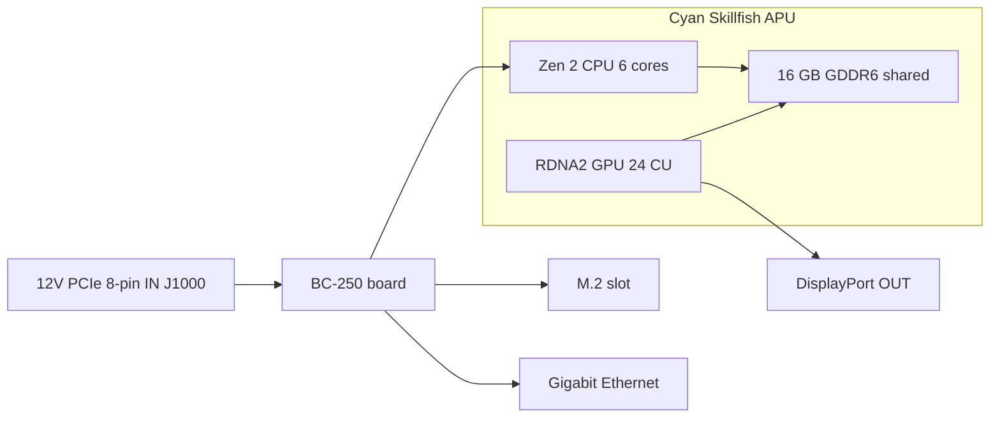

> 🌐 Traduction communautaire. La [version anglaise](../en/01-what-is-bc250.md) fait foi et peut être plus à jour. Une erreur ? [Ouvrez une issue](https://github.com/lildebil0/awesome-bc250/issues).

# Qu'est-ce que le BC-250

> **En bref** — Le BC-250 est un **APU de classe PlayStation 5 sur une carte de serveur/minage**. Une seule puce (nom de code AMD **Cyan Skillfish**, une version allégée du silicium **Oberon/Ariel** de la PS5) porte un **CPU Zen 2 6 cœurs / 12 threads** et un **GPU RDNA 2 à 24 unités de calcul**, alimentés par **16 Go de GDDR6 soudée**. Ce n'est **ni une carte graphique ni un PC normal** — il n'a **pas de BIOS x86 familier, pas de slot PCIe, pas de connecteur ATX 24 broches** : il prend du **12 V directement dans un connecteur d'alimentation PCIe 8 broches** et démarre son propre firmware. Les gens l'achètent parce que c'est une **machine Linux de jeu / IA locale à prix dérisoire**. Les gens enragent contre lui parce que les **pilotes, le refroidissement et l'absence d'encodage vidéo matériel** en font un projet, pas une machine prête à l'emploi. Si vous voulez zéro tracas, cette carte est le mauvais achat — renvoyez-la maintenant. Si vous aimez bidouiller, lisez la suite.

Cette page est la référence « qu'ai-je acheté au juste ». L'alimentation, le refroidissement, l'installation de l'OS et les pilotes ont chacun leur propre section ([03](03-power-supply.md) / [04](04-cooling.md) / [06](06-linux.md)).

---

## Ce que c'est vraiment

AMD a conçu le BC-250 comme un **accélérateur de minage de cryptomonnaie** (le « BC » signifie blockchain). Pour le rendre bon marché, AMD a réutilisé du **silicium de processeur PlayStation 5 excédentaire** — la même famille de puce que Sony met dans la console. Une carte, c'est un APU plus sa mémoire et son circuit d'alimentation ; c'est tout le produit.

Le jargon, défini une fois :

- **APU** (Accelerated Processing Unit) — le nom donné par AMD à une puce unique qui contient **à la fois le CPU et le GPU**. Il n'y a pas de carte graphique séparée ; le GPU est dans le même boîtier, partageant la même mémoire.
- **Cyan Skillfish** — le **nom de code** d'ingénierie d'AMD pour cet APU. Vous le verrez partout sous Linux : le fichier de firmware du GPU s'appelle littéralement `cyan_skillfish_gpu_info.bin` ([src](https://t.me/c/2424231195/57962) — voir le correctif du lien symbolique à [src](https://t.me/c/2424231195/41252)). Les outils peuvent aussi le rapporter sous les noms de die de la PS5 **Oberon** / **Ariel**.
- **GDDR6** — la mémoire graphique rapide qu'on trouve normalement sur une carte vidéo. Sur le BC-250 c'est **la RAM système et la RAM vidéo en même temps** (le CPU et le GPU partagent un seul pool). Il n'y a pas de slots DIMM ; les 16 Go sont soudés et non extensibles.
- **RDNA 2** — la génération d'architecture du GPU (même famille que la PS5, la Xbox Series et les cartes Radeon RX 6000).

La puce est une version **allégée** de la pièce PS5, pas la complète. La communauté a épinglé cette comparaison ([src](https://t.me/c/2424231195/11282), citant [l'entrée Oberon de TechPowerUp](https://www.techpowerup.com/gpu-specs/amd-oberon.g936)) :

| | BC-250 | PS5 complète (Oberon) |
|---|---|---|
| Cœurs / threads CPU | **6 / 12** | 8 / 16 |
| Unités de calcul GPU (CU) | **24** | 36 |

Une « unité de calcul » est un bloc de cœur GPU ; 24 de ces blocs, c'est à peu près le territoire d'un GPU de portable de milieu de gamme, ce qui est exactement la tranche de performance que le chat rapporte dans les jeux.

Le BC-250 n'est pas le seul « silicium de console excédentaire sur une carte de bureau » d'AMD. Il a deux cousins proches bâtis sur la même idée : l'**AMD 4700S Desktop Kit** (un kit CPU dérivé de la **PlayStation 5**) — dont le chat avertit qu'il est référencé par erreur à la place du BC-250 sur les marketplaces ([02-buying.md](02-buying.md)) — et l'**AMD 4800S Desktop Kit**, la version dérivée de la **Xbox Series X** (8 cœurs Zen 2 reliés à de la GDDR6, avec le GPU RDNA 2 de la console désactivé par fusible). Les deux sont de vrais produits AMD qui, comme le BC-250, associent un CPU de console récupéré à de la GDDR6 soudée ([VideoCardz](https://videocardz.com/newz/amd-4800s-desktop-kit-a-pc-repurposed-apu-from-xbox-series-x-has-been-tested)). Ce sont des éléments de contexte utiles pour distinguer le BC-250 de ses frères et sœurs quand vous achetez.

Des gens ont fait tourner **un Linux de bureau sur le BC-250 de la même façon que la PS5 elle-même a été jailbreakée** — vidéo 4K HDMI complète + audio, tous les ports USB fonctionnels, l'APU montant jusqu'à ~3,2 GHz sur le CPU et ~2,0 GHz sur le GPU ([src](https://t.me/c/2424231195/122260)).

---

## Ce pour quoi il est bon

- **La façon la moins chère d'entrer dans le jeu sous Linux à ce palier de performance.** Via Steam/Proton (une couche de compatibilité qui fait tourner les jeux Windows sous Linux), les gens jouent à Star Citizen ([src](https://t.me/c/2424231195/38702)), et même à des titres modernes comme *Doom: The Dark Ages* via un wrapper Vulkan communautaire à ~60 FPS en bas/FSR ([src](https://t.me/c/2424231195/127696)). Les résultats par jeu sont dans [11-gaming.md](11-gaming.md).
- **Une machine d'IA locale capable.** Avec 16 Go de GDDR6 elle peut loger des modèles de langage de taille moyenne. Les membres font tourner des LLM en local via `llama.cpp`/`jan` sur le backend **Vulkan** ; vous réglez d'abord le BIOS pour allouer 12 Go au GPU ([src](https://t.me/c/2424231195/92421)). Voir [12-ai-llm.md](12-ai-llm.md).
- **Minuscule et autonome.** C'est une seule carte longue avec le dissipateur de style GPU intégré — elle se glisse dans de petits boîtiers DIY/imprimés en 3D et tourne sur une seule petite alimentation ([build src](https://t.me/c/2424231195/137825)).

Le consensus de la communauté sur *pourquoi* ça marche tout court : parce que la puce est si proche du matériel du Steam Deck / de la PS5, Valve et la pile graphique open-source Mesa continuent d'améliorer exactement les mêmes pilotes, donc le BC-250 en profite gratuitement ([src](https://t.me/c/2424231195/93006)).

---

## Ce qui est pénible (calez vos attentes)

C'est la moitié que les nouveaux venus sous-estiment. Rien de tout cela n'est rédhibitoire, mais tout est du vrai travail.

- **Les pilotes, c'est du « fais-le toi-même ».** AMD ne fournit **aucun pilote officiel et aucune documentation publique** pour cette carte ([src](https://t.me/c/2424231195/37764)). Tout — la pile graphique Linux, le « governor » de fréquence/tension, le BIOS — est construit par la communauté. Attendez-vous à suivre des scripts de configuration et à corriger occasionnellement des choses à la main. Commencez à [06-linux.md](06-linux.md).
- **Le refroidissement est la chose n°1 que les gens ratent.** Le dissipateur d'origine a été conçu pour le tunnel d'air forcé d'un rack de minage, donc sur un bureau il surchauffe et throttle dès la sortie du carton. Vous devrez modder le refroidissement. Cela a sa propre section — lisez [04-cooling.md](04-cooling.md) **avant** de courir après la performance.
- **Pas d'encodeur vidéo matériel.** Le bloc d'encodage vidéo du GPU (ce qu'AMD appelle **VCN** — le circuit dédié qui compresse la vidéo pour le streaming/l'enregistrement) est **indisponible**. L'enregistrement d'écran et le streaming de jeu se rabattent sur un **encodeur logiciel**, ce qui coûte du CPU. Ça marche (les gens streament via Sunshine/Moonlight) mais c'est plus lent et de moindre qualité qu'un GPU normal ([src](https://t.me/c/2424231195/88026)). De même, le premier pilote Mesa était fameusement en **rendu logiciel** jusqu'à ce que la communauté fasse fonctionner l'accélération matérielle ([src](https://t.me/c/2424231195/11243)).
- **Alimentation bizarre et pas d'affichage par défaut.** Elle ne prend pas de connecteur ATX 24 broches standard — voir la section suivante. Beaucoup de cartes arrivent aussi en nécessitant un **reset BIOS** avant même de POSTer ([src](https://t.me/c/2424231195/57930)), et vous sortez généralement l'image en **DisplayPort** (le HDMI a besoin d'un adaptateur DP→HDMI, qui transporte aussi l'audio sans souci — [src](https://t.me/c/2424231195/9148)).
- **C'est une carte de bricoleur, point.** Comme l'a dit un membre de longue date : malgré son prix, le BC-250 « demande certaines compétences, des efforts et de la jugeote » ([src](https://t.me/c/2424231195/73002)). Prévoyez du temps, pas seulement de l'argent.
- ⚠ **Un eGPU ne le sauvera pas — rapporté par la communauté (r/BC250Gaming).** L'unique slot M.2 n'est que **PCIe 2.0 ×2** (voir la fiche matériel ci-dessous), et à cette bande passante un GPU externe accroché au M.2 est **rapporté comme moins performant que le GPU RDNA 2 embarqué** — le lien lent l'étrangle. Si vous voulez plus de puissance graphique, le consensus est que ce n'est pas la carte pour ça. *(Rapporté par la communauté ; à prendre comme une mise en garde, pas un benchmark.)*

> ⚠ **Ce que signifie la LED bicolore — rapporté par la communauté (r/BC250Gaming).** La LED à deux couleurs à côté de la carte réseau est un **indicateur d'utilisation de l'ère du minage, pas un voyant d'erreur** : selon les comptes-rendus de la communauté **rouge = le GPU/la RAM n'est *pas* à 100 % d'utilisation, vert = pleine utilisation**. Donc une lumière rouge sur une carte de bureau au repos est normale, pas un défaut. *(Rapporté par la communauté ; AMD ne fournit aucune documentation pour cette carte, donc considérez la correspondance exacte des couleurs comme non confirmée.)*

> ⚠ **Avertissement de manipulation, appris à la dure.** Ne laissez **rien** de métallique toucher la carte sous tension, et ne changez la pâte thermique qu'avec soin — un membre a définitivement tué son BC-250 en le court-circuitant ([src](https://t.me/c/2424231195/95998)). Les cartes arrivent aussi légèrement **voilées** à cause du montage du dissipateur ; un membre a réglé un non-démarrage en calant la carte à plat contre le dissipateur avec du papier ([src](https://t.me/c/2424231195/117347)).

---

## Fiche de référence matériel

Les specs sont recoupées avec la rétro-ingénierie matérielle de la communauté (AMD ne publie aucune fiche technique). Les chiffres du bus mémoire et des dimensions physiques, auparavant non confirmés, proviennent désormais de la [spec matériel d'elektricM](https://github.com/elektricm/elektricm) (qui crédite mothenjoyer69 / Segfault / neggles / yeyus pour la rétro-ingénierie). Le brochage et les chiffres d'alimentation ci-dessous viennent du document matériel canonique de la communauté.

La carte en un coup d'œil — l'alimentation entre à gauche, l'APU et sa mémoire partagée au milieu, les E/S à droite :



### Specs principales

| Spec | Valeur | Source |
|------|-------|--------|
| Classe | APU dérivé de la PlayStation 5 sur une carte de minage/serveur | [hardware.md](https://github.com/mothenjoyer69/bc250-documentation/blob/main/hardware.md) |
| Nom de code de l'APU | **Cyan Skillfish** (die PS5 : Oberon / Ariel) | chat ([src](https://t.me/c/2424231195/57962)) |
| CPU | **6 cœurs / 12 threads, Zen 2** (6 cœurs confirmés) | [hardware.md](https://github.com/mothenjoyer69/bc250-documentation) · chat ([src](https://t.me/c/2424231195/11282)) |
| Fréquence CPU | jusqu'à **~3,49 GHz** (« à peu près ») | [hardware.md](https://github.com/mothenjoyer69/bc250-documentation) · chat ([src](https://t.me/c/2424231195/122260)) |
| GPU | **24 unités de calcul, RDNA 2** (`gfx1013` ; le SoC PS5 en a 36) ; rastérisation ≈ **entre RX 6600 et RX 6600 XT** / classe GTX 1660 Ti ; **Vulkan 1.4** | [hardware.md](https://github.com/mothenjoyer69/bc250-documentation) · chat ([src](https://t.me/c/2424231195/11282)) · [elektricM](https://github.com/elektricm/elektricm) |
| Fréquence GPU | ~1500 MHz d'origine, ~2000 MHz overclocké (≈2,23 GHz max) | ([src](https://t.me/c/2424231195/122260)) · [09](09-overclock-undervolt.md) |
| Mémoire | **16 Go GDDR6**, partagés entre CPU et GPU, soudés (non extensibles) | [hardware.md](https://github.com/mothenjoyer69/bc250-documentation) · [README](../../README.md) |
| Allocation VRAM du GPU | réglée dans le BIOS ; **12 Go** sélectionnables sur BIOS 3.00+ | ([src](https://t.me/c/2424231195/92421)) |
| Bus / bande passante mémoire | **256 bits** GDDR6 @ **14 Gbit/s**, **~448 Go/s** | [spec matériel elektricM](https://github.com/elektricm/elektricm) |
| TDP | **220 W** (puissance de conception thermique de la carte) | [hardware.md](https://github.com/mothenjoyer69/bc250-documentation) |
| Consommation | ~67–85 W typique sous charge de classe minage | [hashrate.no](https://www.hashrate.no/gpus/bc250) |
| Encodage vidéo matériel (VCN) | **Aucun** — encodage logiciel uniquement | ([src](https://t.me/c/2424231195/88026)) |
| Sortie vidéo | **DisplayPort 1.4** (jusqu'à **4K@120 / 8K@60**) ; utilisez un adaptateur DP→HDMI pour le HDMI ; transporte l'audio | ([src](https://t.me/c/2424231195/9148)) · [elektricM](https://github.com/elektricm/elektricm) |
| Stockage (M.2) | 1× M.2 2280 — **PCIe 2.0 x2 ou SATA III** | [elektricM](https://github.com/elektricm/elektricm) |
| 2e DisplayPort | présent mais **non monté** ; activable en logiciel | ([src](https://t.me/c/2424231195/88026)) |
| Taille physique | **340 mm / 310 mm** de long (selon la méthode de mesure), **~115 mm** de large, **~400 g** avec le dissipateur ; format de minage non standard sur mesure | [spec matériel elektricM](https://github.com/elektricm/elektricm) |

> ⚠ **Overclock de la GDDR6 = bande passante, pas FPS — rapporté par la communauté (r/BC250Gaming).** Selon les comptes-rendus de la communauté, overclocker la GDDR6 fait passer la bande passante mémoire d'environ **~256 Go/s à ~445 Go/s** mais n'apporte **aucun gain en jeu** — ce sont les 24 CU du GPU, pas la bande passante mémoire, qui sont le goulot d'étranglement, donc la bande passante supplémentaire reste inutilisée en jeu. (Notez que le chiffre *d'origine* vérifié du dépôt ci-dessus est déjà de **~448 Go/s** en 256 bits / 14 Gbit/s, donc la « base de ~256 Go/s » de la communauté ne correspond pas à la fiche technique — considérez les chiffres exacts en Go/s comme non confirmés ; la conclusion qu'on ne gagne pas de FPS est la partie durable.) Pour l'overclocking GPU/mémoire en général, voir [09-overclock-undervolt.md](09-overclock-undervolt.md).

> **Sur les dimensions de la carte :** la [spec matériel d'elektricM](https://github.com/elektricm/elektricm) donne **340 mm / 310 mm** de longueur (les deux chiffres reflètent différentes méthodes de mesure), **~115 mm** de largeur et **~400 g** avec le dissipateur, sur un format de minage non standard sur mesure. Le `hardware.md` canonique lui-même ne liste pas les dimensions ; le post matériel le plus réagi du chat est littéralement intitulé *« Размеры amd bc-250 »* (« dimensions de l'AMD BC-250 », ❤20 — [src](https://t.me/c/2424231195/379)), confirmant que les gens s'en soucient pour la construction de boîtier. Pour un ajustement de boîtier exact, partez d'un modèle 3D mesuré — les STL de carte cataloguées par la communauté (par ex. `BC250 Board.stl`, [Printables 1103626](https://www.printables.com/model/1103626-amd-bc250-board) et le modèle précis à [Printables 1341336](https://www.printables.com/model/1341336-accurate-3d-model-of-the-amd-bc-250-board)) sont dimensionnellement corrects. Voir [05-case.md](05-case.md).

<p align="center">
  <br>
  <sub>Photo : communauté AMD BC-250 · <a href="https://t.me/c/2424231195/379">source</a></sub>
</p>

### Brochage du connecteur d'alimentation (lisez ceci avant de brancher quoi que ce soit)

Le BC-250 n'a **pas d'embase ATX 24 broches**. Il est alimenté en **12 V uniquement**, via un **connecteur d'alimentation PCIe 8 broches (J1000)** — la même fiche physique que celle d'une carte graphique, mais la carte attend que les trois contacts d'alimentation soient alimentés en 12 V. Le câblage complet et le choix de l'alimentation sont dans [03-power-supply.md](03-power-supply.md) ; le brochage canonique de [hardware.md](https://github.com/mothenjoyer69/bc250-documentation/blob/main/hardware.md) :

**J1000 — alimentation principale PCIe 8 broches (c'est celle que vous connectez) :**

```
[ GND  GND  GND  GND ]
[ GND  12V  12V  12V ]
```

- Trois contacts 12 V ; le document évalue les contacts Mini-Fit Jr à **jusqu'à 9 A chacun**, donc ce connecteur « peut fournir jusqu'à **324 W** en sécurité », et recommande du fil **16 AWG** pour un usage autonome ([hardware.md](https://github.com/mothenjoyer69/bc250-documentation)).
- **GND = masse (0 V), 12V = +12 volts.** Respectez la polarité — cette carte n'a aucune tolérance à la tension inverse.

**J2000 / J2001 — connecteurs d'alimentation pour rack (généralement NON utilisés sur un bureau) :**

```
        J2000                  J2001
 [ LED1  12V  12V  12V ]   [ 12V  12V  12V  PGD ]
 [ LED2  GND  GND  GND ]   [ GND  GND  GND  GND ]
```

- Ce sont des connecteurs **Molex Micro-Fit BMI** ([référence 444280801](https://www.molex.com/en-us/products/part-detail/444280801)), *pas* des fiches PCIe/EPS — ils alimentaient la carte dans son châssis de minage d'origine. **J2000 et J2001 ne sont pas identiques :** comme le montre le brochage ci-dessus, J2000 porte les broches **LED1/LED2** tandis que J2001 porte la broche **PGD**, donc les deux connecteurs diffèrent ([docs matériel elektricM / mothenjoyer69](https://github.com/mothenjoyer69/bc250-documentation)).
- **PGD** (sur J2001) est une broche power-good/sense : elle voit **5 V quand la carte est insérée dans la PSU2 du rack**. Sur un build autonome vous alimentez généralement via J1000 et pouvez ignorer J2000/J2001 — mais confirmez avec [03-power-supply.md](03-power-supply.md) pour votre adaptateur d'alimentation spécifique.

---

## Où aller ensuite

1. **[02-buying.md](02-buying.md)** — si vous n'avez pas encore acheté, ou voulez connaître un prix juste et les vrais risques.
2. **[03-power-supply.md](03-power-supply.md)** — comment l'alimenter concrètement (12 V dans le 8 broches).
3. **[04-cooling.md](04-cooling.md)** — faites ceci **avant** tout le reste une fois la carte en main.
4. **[06-linux.md](06-linux.md)** — installez un OS et les pilotes de la communauté.

---

## Sources

- Document matériel & brochage canoniques — [mothenjoyer69/bc250-documentation `hardware.md`](https://github.com/mothenjoyer69/bc250-documentation/blob/main/hardware.md)
- Bus/bande passante mémoire, dimensions physiques, positionnement du GPU, DP 1.4, M.2 — [spec matériel elektricM](https://github.com/elektricm/elektricm) (crédite mothenjoyer69 / Segfault / neggles / yeyus pour la rétro-ingénierie)
- Silicium PS5 allégé vs complet (6/12 + 24 CU vs 8/16 + 36 CU) — https://t.me/c/2424231195/11282 · [TechPowerUp Oberon](https://www.techpowerup.com/gpu-specs/amd-oberon.g936)
- Linux-sur-matériel-PS5, 4K HDMI, fréquences — https://t.me/c/2424231195/122260
- Pas de pilote officiel / pas de docs — https://t.me/c/2424231195/37764
- Rendu logiciel / pas d'encodage matériel — https://t.me/c/2424231195/11243 · https://t.me/c/2424231195/88026
- DisplayPort + audio DP→HDMI — https://t.me/c/2424231195/9148
- Nom du firmware Cyan Skillfish — https://t.me/c/2424231195/57962 · https://t.me/c/2424231195/41252
- LLM local + 12 Go VRAM via BIOS 3.00 — https://t.me/c/2424231195/92421
- « Demande compétences, efforts et jugeote » — https://t.me/c/2424231195/73002
- Avertissement manipulation/court-circuit — https://t.me/c/2424231195/95998 · correctif carte voilée — https://t.me/c/2424231195/117347
- « Dimensions du BC-250 » (post matériel le plus réagi) — https://t.me/c/2424231195/379
- TDP 220 W, CPU 6 cœurs/3,49 GHz, GPU 24 CU, 16 Go GDDR6 (confirmation du dépôt) — [mothenjoyer69/bc250-documentation README](https://github.com/mothenjoyer69/bc250-documentation)
- Chiffres de consommation en classe minage — https://www.hashrate.no/gpus/bc250
- Pourquoi ça continue de marcher (effort de pilotes partagé avec le Steam Deck/la PS5) — https://t.me/c/2424231195/93006
- Kits frères — AMD 4700S (kit CPU PS5, référencé par erreur à la place du BC-250, [02-buying.md](02-buying.md)) et AMD 4800S (CPU Xbox Series X + GDDR6, GPU désactivé par fusible) — [VideoCardz : 4800S Desktop Kit](https://videocardz.com/newz/amd-4800s-desktop-kit-a-pc-repurposed-apu-from-xbox-series-x-has-been-tested)
- eGPU-sur-M.2 plus lent que le GPU embarqué (le M.2 est PCIe 2.0 ×2), LED bicolore de la carte réseau = signal d'utilisation (rouge = pas 100 % util, vert = pleine util), l'overclock GDDR6 augmente la bande passante (~256→~445 Go/s) sans gain en jeu — rapporté par la communauté (r/BC250Gaming)

> AMD ne publie aucune fiche technique primaire pour cette carte ; les chiffres ci-dessus sont la meilleure rétro-ingénierie de la communauté (le `hardware.md` canonique plus la spec matériel d'elektricM). Corrections bienvenues via PR (voir [CONTRIBUTING.md](../../CONTRIBUTING.md)).
