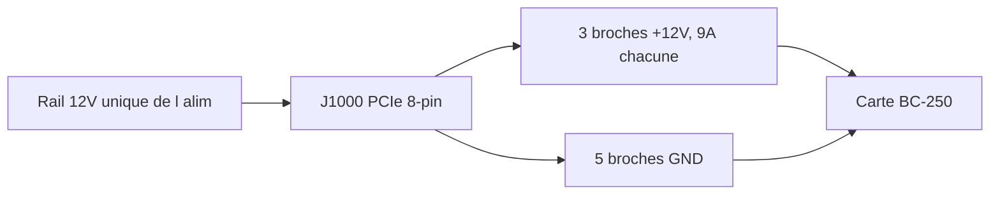

> 🌐 Traduction communautaire. La [version anglaise](../en/03-power-supply.md) fait foi et peut être plus à jour. Une erreur ? [Ouvrez une issue](https://github.com/lildebil0/awesome-bc250/issues).

# Alimentation

> **En bref** — La BC-250 n'a **aucun bouton d'alimentation ni prise d'alimentation PC standard**. Elle consomme du **12 V** via un unique connecteur **PCIe 8-pin (6+2)** — la même prise qu'utilise une carte graphique de bureau — et culmine autour de **~235 W** (davantage si vous overclockez). Il vous faut une source 12 V capable de fournir **~250–300 W sur un seul rail**. Trois voies que prend la communauté : une **alimentation serveur « Flex »** économique (HP 500 W, ~$12 sur eBay), une **brique industrielle** (Mean Well LOP-300/LOP-500), ou une **alimentation ATX normale** (il suffit d'y brancher son câble PCIe). Les deux pièges mortels à éviter : une **vieille alimentation qui répartit le 12 V sur des rails faibles**, et des **faux fils en acier cuivré** qui surchauffent et prennent feu. Utilisez du vrai cuivre, **16 AWG ou plus épais**.

Alimenter la carte est la **deuxième chose qu'un nouveau venu doit réussir** (après le [refroidissement](04-cooling.md)) — et celle qui risque le plus de déclencher un incendie si vous bâclez le câblage.

---

## Ce dont la carte a réellement besoin

La BC-250 est une puce PlayStation 5 bridée sur une carte de minage/serveur. Elle était destinée à tenir dans un rack et à être alimentée en 12 V — elle n'a donc **aucune des commodités d'un PC normal** :

- **Pas de connecteur ATX 24-pin** de carte mère.
- **Pas de bouton d'alimentation** — elle s'allume à l'instant où le 12 V arrive (l'interrupteur de l'alimentation elle-même est votre bouton d'alimentation).
- **Une seule tâche pour l'alimentation : fournir du 12 V avec assez de courant.**

**Chiffres de puissance (confirmés) :**

| Caractéristique | Valeur | Source |
|------|-------|--------|
| Tension d'entrée | 12 V DC | [hardware.md](https://github.com/mothenjoyer69/bc250-documentation/blob/main/hardware.md) |
| Pic de consommation typique | ~220–235 W | observé par la communauté ([src](https://t.me/c/2424231195/31076)) |
| Connecteur | PCIe 8-pin (6+2) | [hardware.md](https://github.com/mothenjoyer69/bc250-documentation/blob/main/hardware.md) · ([src](https://t.me/c/2424231195/14450)) |
| Courant de pic sur le 12 V | ~18–20 A typique, marge de conception jusqu'à ~40 A | ([src](https://t.me/c/2424231195/31076)) |

> **« PCIe 8-pin (6+2) »** désigne une prise d'alimentation de carte graphique : six broches dans un bloc, plus un clip de 2 broches détachable, de sorte que le même câble fonctionne en 6-pin ou en 8-pin. **6+2** = 6 fixes + 2 amovibles. Ce n'est *pas* le CPU/EPS 8-pin de votre carte mère — voir l'avertissement ci-dessous.

Un PCIe 8-pin est prévu pour **150 W** par le standard PCIe, et les trois contacts 12 V de la carte (Molex Mini-Fit Jr, 9 A chacun) peuvent passer en toute sécurité **jusqu'à ~324 W** ([hardware.md](https://github.com/mothenjoyer69/bc250-documentation/blob/main/hardware.md)). Donc un seul 8-pin suffit largement en configuration d'origine ; la marge ne compte que lorsque vous poussez un overclock agressif.

**Quelle puissance d'alimentation acheter :** visez **300 W ou plus sur le rail 12 V**. Une unité de 300 W offre une marge confortable au-dessus du pic de ~235 W et garde le ventilateur de l'alimentation calme ; des utilisateurs rapportent qu'une alimentation serveur Flex de 500 W tourne quasi silencieusement à cette charge ([src](https://t.me/c/2424231195/31076)). N'achetez pas en dessous de ~250 W « pour économiser » — vous la ferez tourner à la limite et elle deviendra bruyante ou s'éteindra.

> **Courbe de puissance au pince-ampèremètre (ampérage de première main).** Un démontage a pincé un ampèremètre DC sur l'alimentation 12 V et a lu le courant réel de la carte : **le jeu tire ≈17 A / ~190 W**, tandis qu'une **charge de stress synthétique complète atteint ≈21 A / ~240–250 W** à **2000 MHz / 960 mV** ; pousser la tension plus haut la fait monter à **22–23 A et au-delà** ([Old Lamer — Part VII](https://youtu.be/pxahl9-YgkY) ~9:01). Cela affine les chiffres de puissance secteur observés par la communauté ci-dessus avec un ampérage de rail mesuré — et confirme pourquoi la cible de 300 W laisse la bonne marge. *(Chiffres lus depuis des sous-titres automatiques — traitez les valeurs exactes comme approximatives.)*

> ⚠️ **Alimentations nommément à éviter :** les bon marché **Dell D220P-01** (220 W) et **Dell D250AD-00** (250 W) sont désignées comme **insuffisantes et dangereuses** pour cette carte — à 220 W / 250 W elles se situent sous le pic de la carte et il a été rapporté qu'elles coupent ou même tombent en panne sous charge de jeu. N'achetez pas une unité juste parce qu'elle est bon marché et « a l'air suffisante ». ([elektricM: power](https://elektricm.github.io/amd-bc250-docs/hardware/power/))

---

## La physique : volts, ampères, watts — et pourquoi un fil trop fin brûle

Chaque règle de ce chapitre découle de trois équations. Apprenez-les et les tableaux de section ainsi que les avertissements « ne jamais utiliser SATA » cessent d'être arbitraires.

**Puissance = volts × ampères (`P = U·I`).** La carte a besoin de **~235 W** à **12 V**, elle tire donc `235 ÷ 12 ≈ 19.6 A`. C'est exactement pourquoi un pince-ampèremètre lit **~17 A en jeu / ~21 A en stress** ([ci-dessus](#ce-dont-la-carte-a-réellement-besoin)) : la puissance est fixée par le silicium, donc les *ampères* sont ce que le 12 V impose. Poussez fréquences/tension à la hausse et les ampères grimpent avec les watts.

**Pourquoi 12 V — et pourquoi 24 V la tue.** Le 12 V est le standard des racks de datacenter pour lequel la carte a été conçue ; ses VRM embarqués l'abaissent au ~1 V auquel tourne le cœur de l'APU. La carte est **câblée en dur pour le 12 V sans aucune protection contre les surtensions**, donc lui fournir du 24 V (par ex. un [LOP-300-**24**](#option-b--brique-industrielle-mean-well)) met le double sur chaque composant 12 V et la détruit instantanément. Contrairement à l'ampérage, la tension n'est pas négociable.

**Capacité de courant (ampacité) — pourquoi un fil a une limite d'ampères.** Un fil est une résistance, et le courant qui traverse une résistance produit de la chaleur : `P_loss = I²·R`. Plus de cuivre = plus de section = **R plus faible** = moins de chaleur au même ampérage. C'est tout le sens du tableau AWG ci-dessus — **numéro AWG plus bas = fil plus épais = sûr à plus d'ampères**. À ~20 A, le **cuivre 16 AWG** reste froid ; plus fin, et `I²·R` fait fondre l'isolant. Notez le **carré** : doubler le courant *quadruple* la chaleur, ce qui explique pourquoi un overclock lourd nécessite une seconde alimentation, pas juste « un peu plus de fil ».

**Chute de tension — l'autre moitié.** La chaleur perdue dans le fil est de la tension que la carte ne voit jamais : `V_drop = I·R`. Un câble long et fin à la fois **surchauffe** et **affame** la carte, de sorte qu'elle peut décrocher (brown-out) sous charge même quand rien ne fond visiblement. Du cuivre court et épais corrige les deux d'un coup.

**Pourquoi le faux « cuivre » est mortel.** L'acier cuivré a **~6× la résistance** du vrai cuivre — mêmes ampères, même `I²·R`, donc **6× la chaleur** dans le même fil. Le test à l'aimant ci-dessous n'est pas une préférence de qualité ; il attrape un **multiplicateur de 6× sur un terme déjà au carré dans le courant**.

**Pourquoi jamais SATA ni Molex.** C'est le *connecteur*, pas le fil. Un contact d'alimentation SATA est prévu pour **~54 W** → `54 ÷ 12 ≈ 4.5 A` avant que le petit contact ne cuise tout seul ; la carte veut ~20 A, soit **4× au-delà** de cette limite. Un PCIe 8-pin porte au contraire trois gros contacts 12 V (**9 A chacun = 27 A / 324 W**) — ce qui est *pourquoi* c'est la bonne prise et que SATA/Molex ne peuvent jamais l'être (voir [le brochage](#le-brochage-du-8-pin-j1000)).

---

## ⚠️ Les deux erreurs qui détruisent les cartes

Lisez cette section avant d'acheter quoi que ce soit.

### 1. Ne confondez pas le PCIe 8-pin avec le CPU/EPS 8-pin

Votre alimentation ATX a **deux prises 8-pin différentes** : une pour les cartes graphiques (**PCIe**) et une pour le CPU (**EPS/CPU**, parfois étiquetée « CPU » ou « 4+4 »). **Elles semblent presque identiques mais la forme de leurs broches et leur polarité sont inversées.** Forcer une prise CPU dans la BC-250 met du **+12 V là où devrait être la masse** — vous pouvez brûler toute la carte.

> *« On en a discuté un milliard de fois — nous avons une entrée d'alimentation PCIe. Si la forme de la broche d'extrémité est différente, vous avez une prise CPU… elle a littéralement la polarité opposée, le plus là où devrait être le moins. Vous pouvez tout cramer. »* ([src](https://t.me/c/2424231195/14450))

La carte n'a **aucune vérification de broche de détection (sense-pin)**, donc rien ne vous empêche de brancher la mauvaise chose. La bonne habitude : **regardez la forme du clip du connecteur, et en cas de doute, vérifiez le + et le − au multimètre avant la mise sous tension.**

### 2. N'utilisez pas de faux fil « cuivre » — c'est un risque d'incendie

C'est l'avertissement de sécurité le plus répété du chat. Les câbles adaptateurs préfabriqués bon marché et les câbles « PCIe » à bas prix sont souvent en **acier cuivré (CCS)** ou en **aluminium cuivré (CCA)** — une fine peau de cuivre sur un cœur en acier/aluminium. L'acier a **~6× la résistance du cuivre**, donc le fil surchauffe sous charge et peut fondre ou s'enflammer.

> *« Le fil de l'adaptateur a salement surchauffé sous charge. Il s'est avéré que ce n'était pas du cuivre mais du fer (acier) avec un fin revêtement de cuivre… résistance élevée, chauffe beaucoup, peut provoquer un incendie. Pour un fonctionnement fiable et sûr, vous DEVEZ utiliser des fils tout cuivre d'au moins 2.5 mm². »* ([src](https://t.me/c/2424231195/108733))

> *« Vérifié à l'aimant 🤣 — fils d'acier. La résistance de ces "fils" d'acier est 6× plus élevée que le cuivre. De quels 450 W parlent-ils ? »* ([src](https://t.me/c/2424231195/133546))

**Testez avant de faire confiance :** un aimant colle à l'acier, pas au cuivre. Si un connecteur ou un fil est magnétique, jetez le câble.

Ce n'est pas seulement le cas du câble sans marque. **Des alimentations Apevia Flex/ITX ont été vues avec des fils d'acier** — testez-les à l'aimant, car l'acier devient très chaud sous charge et constitue un risque d'incendie. L'**Apevia ITX-PFC400W** Mini-ITX utilise un **connecteur 14-pin** (il fonctionne avec l'[adaptateur LITE](#ps_on-automatique--adaptateur-communautaire) ci-dessous, mais est déconseillé). (r/BC250Gaming)

> 🔴 **N'alimentez jamais la BC-250 via un adaptateur SATA ou Molex.** La carte tire **220–280 W**, et ces connecteurs ne peuvent physiquement pas fournir cela en toute sécurité :
> - Un **adaptateur SATA→PCIe/8-pin est un risque d'incendie** — un connecteur d'alimentation SATA n'est prévu que pour **~54 W** ([elektricM: power](https://elektricm.github.io/amd-bc250-docs/hardware/power/)).
> - Une **alimentation Molex nue plafonne à ~156 W** combinés (deux connecteurs Molex) — toujours pas assez ([elektricM: power](https://elektricm.github.io/amd-bc250-docs/hardware/power/)).
>
> N'alimentez la carte qu'à partir d'une **vraie source 12 V PCIe 8-pin / de classe EPS**. C'est distinct de l'avertissement cuivre-contre-acier ci-dessus : même un adaptateur SATA ou Molex *tout cuivre* est dangereux ici, car le connecteur lui-même est sous-dimensionné pour une charge de 220–280 W.

---

## Conseils sur la section de fil et le connecteur

La documentation de la carte et le chat s'accordent sur la même base sûre :

| Cas d'usage | Fil | Source |
|----------|------|--------|
| 8-pin unique, d'origine / OC léger | cuivre **16 AWG** (~1.3 mm²) | [hardware.md](https://github.com/mothenjoyer69/bc250-documentation/blob/main/hardware.md) |
| Câble fait main, marge souhaitée | **2.5 mm²** (~13 AWG) tout cuivre | ([src](https://t.me/c/2424231195/108733)) |
| Overclock lourd | plus épais / **double alimentation** (voir J2000/J2001) | [hardware.md](https://github.com/mothenjoyer69/bc250-documentation/blob/main/hardware.md) |

Les chiffres ne se contredisent pas — **le 16 AWG est le minimum documenté** ; le chiffre de 2.5 mm² est le choix d'un constructeur prenant une marge supplémentaire après une frayeur avec du fil CCS. **La partie non négociable est « du vrai cuivre », pas la section exacte.** Numéro AWG plus bas = fil plus épais = plus sûr.

Pour les contacts de connecteur qui portent le courant complet, visez ceux prévus pour le pic : les constructeurs visent des contacts/fils bons pour **~40 A** sur une configuration lourde, et les boulonnent ou les sertissent correctement plutôt que de se fier à un emboîtement fragile ([src](https://t.me/c/2424231195/31076)).

---

## Le brochage du 8-pin (J1000)

En regardant le connecteur d'alimentation principal de la carte — la **rangée du haut est entièrement masse, la rangée du bas est 12 V sauf une masse**. D'après [hardware.md](https://github.com/mothenjoyer69/bc250-documentation/blob/main/hardware.md) :

```
J1000 (PCIe 8-pin), contacts facing you:

  [ GND  GND  GND  GND ]   ← top row: all ground (−)
  [ GND  12V  12V  12V ]   ← bottom row: one ground + three 12 V (+)
```

Le chat énonce la même polarité en clair — comptez les broches **1 à 3 = +12 V, broches 4 à 8 = masse** :

> *« Les broches une à trois doivent être le +, le reste de quatre à huit sont le moins… La carte n'a pas de vérification de détection. Prenez un testeur et regardez où sont le + et le −. »* ([src](https://t.me/c/2424231195/14450))

Comment le rail 12 V unique se répartit sur les huit contacts — trois portent le +12 V, cinq sont la masse :



Cela correspond exactement à un PCIe 8-pin standard, ce qui est *pourquoi* le câble PCIe d'une alimentation ATX normale fonctionne tout simplement. **Si vous fabriquez votre propre câble, vérifiez chaque broche au multimètre avant la première mise sous tension** — les erreurs de polarité sont impitoyables ici.

La carte possède aussi deux connecteurs d'alimentation alternatifs plus petits, **J2000** et **J2001** — utiles uniquement pour un overclock lourd et couverts en détail ci-dessous.

---

## Au-delà de 300 W — le deuxième connecteur d'alimentation J2000 / J2001

> ⚠️ **Lisez ceci d'abord.** Tout dans cette section est du **câblage 12 V supplémentaire fait à la main**. La carte n'a **aucune vérification de polarité ou de détection** sur ces broches (comme J1000) — intervertissez le +12 V et la masse et vous brûlez la carte à l'instant où elle s'allume. Une seconde alimentation n'ajoute de la marge que si **les deux alimentations partagent la même alimentation / le même rail 12 V au même potentiel** ; relier deux sources différentes peut renvoyer du courant en sens inverse à travers l'une d'elles. Si vous n'êtes pas à l'aise pour sertir et mesurer vos propres connecteurs, arrêtez-vous ici et restez sur un seul [J1000 8-pin](#le-brochage-du-8-pin-j1000).

Un seul PCIe 8-pin dans [J1000](#le-brochage-du-8-pin-j1000) est confortable en configuration d'origine et OC léger — ses trois contacts 12 V sont bons pour **~324 W** (9 A × 3 × 12 V, ou jusqu'à ~468 W avec des contacts de qualité industrielle) ([hardware.md](https://github.com/mothenjoyer69/bc250-documentation/blob/main/hardware.md)). La raison d'être de cette section : une **carte 40-CU en overclock agressif peut tirer plus de 300 W** ([src](https://t.me/c/2424231195/143787)), ce qui est juste à la limite de la zone de confort d'un seul 8-pin. La carte a été conçue pour un rack où une **seconde alimentation** alimente deux connecteurs supplémentaires — **J2000** et **J2001** — donc la manière propre d'obtenir de la marge d'overclock de bureau est de **compléter J1000 avec J2000/J2001** (ou de souder directement sur la carte) plutôt que de surcharger une seule prise ([hardware.md](https://github.com/mothenjoyer69/bc250-documentation/blob/main/hardware.md)). C'est aussi le diagramme le plus demandé du chat ([src](https://t.me/c/2424231195/135741)).

### Brochage (d'après la documentation de la carte)

J2000 et J2001 ne sont **pas identiques**. Ils sont compatibles avec **Molex Micro-Fit BMI** ([part 444280801](https://www.molex.com/en-us/products/part-detail/444280801)). La broche 1 est le triangle de sérigraphie blanc (`v` ci-dessous) :

```
        J2000                    J2001
   v                        v
[ LED1  12V  12V  12V ]   [ 12V  12V  12V  PGD ]
[ LED2  GND  GND  GND ]   [ GND  GND  GND  GND ]
```

| Broche | Signification |
|-----|---------|
| `12V` | Entrée d'alimentation +12 V (trois par connecteur) |
| `GND` | Masse |
| `PGD` | **PGOOD** — lit 5 V quand une seconde alimentation est présente dans un fond de panier de rack ; une broche de signal, **pas** une sortie d'alimentation |
| `LED1` / `LED2` | Sorties LED actives à l'état bas qui reflètent les LED verte / rouge du fond de panier |

**Pour la redondance, la documentation dit d'utiliser à la fois J2000 et J2001** ([hardware.md](https://github.com/mothenjoyer69/bc250-documentation/blob/main/hardware.md#j2000-and-j2001)). Notez que **la disposition des colonnes diffère** entre les deux — sur J2000 les broches LED sont dans la première colonne et les trois broches 12 V sont toutes sur la rangée du haut ; sur J2001 la broche PGD est en haut à droite et la rangée du bas est entièrement masse. **Mesurez chaque broche avant de connecter** — ne supposez pas qu'un boîtier Micro-Fit s'emboîte de la même façon sur les deux. ⚠ vérifiez l'orientation exacte de la broche 1 sur votre propre carte au multimètre ; les broches LED/PGD ne doivent **jamais** recevoir du 12 V.

### La méthode pratique utilisée par la communauté

Vous n'avez pas besoin du fond de panier du rack. La recette répétée du chat est simplement : **faites passer un PCIe 8-pin dans J1000, puis sertissez une prise Molex Micro-Fit 3.0 et alimentez le même 12 V dans le J2000 adjacent** ([src](https://t.me/c/2424231195/142662), [src](https://t.me/c/2424231195/138371)). Un constructeur décrit le câble exact comme *« un connecteur PCIe et deux connecteurs Micro-Fit 3p »* depuis une seule alimentation ([src](https://t.me/c/2424231195/143938)) — c'est-à-dire répartir le 12 V/GND d'un seul câble PCIe vers à la fois le 8-pin et l'alimentation Micro-Fit.

**Connecteur à acheter** (auto-assemblé, Molex Micro-Fit 3.0) :

| Pièce | Numéro Molex | Note |
|------|--------------|------|
| Boîtier | **43025-0800** (8-circuit) | le corps de la prise ([src](https://t.me/c/2424231195/142659), [src](https://t.me/c/2424231195/14797)) |
| Terminaux à sertir | série **43030** | un par fil ([src](https://t.me/c/2424231195/142659)) |

Ne peuplez que les positions **12 V et GND** (correspondez au tableau de brochage ci-dessus) ; laissez `PGD` / `LED1` / `LED2` vides. Utilisez le même fil **vrai cuivre, ≥16 AWG** et la même discipline de sertissage que pour le [8-pin principal — voir les conseils sur la section de fil](#conseils-sur-la-section-de-fil-et-le-connecteur) ; une alimentation 12 V sertie à la main qui surchauffe est exactement le risque d'incendie décrit plus tôt dans ce chapitre.

> 🛠 **Pièges d'assemblage Micro-Fit (d'après un tuto Molex).** Notes pratiques pour sertir ces prises ([Molex Micro-Fit video](https://youtu.be/aaDUkPn9ASE)) :
> - **Section de fil :** **18 AWG recommandé, 20 AWG acceptable** — la charge se répartit en trois sur les trois broches 12 V, donc chaque fil en porte un tiers.
> - **Rasez le loquet en plastique** de la prise pour qu'elle s'emboîte à fleur de la carte.
> - **Les deux connecteurs ne sont PAS interchangeables** — une fois câblés, **marquez-les** pour ne jamais intervertir les prises de J2000 et J2001.
> - **Pas de pince à sertir ? La soudure est une alternative valable** — soudez le fil dans le terminal au lieu de le sertir.
> - Bien fait, les **neuf lignes 12 V sur les deux connecteurs portent >400 W en toute sécurité.**


### Alimenter une carte 40-CU — le mod de câble à triple sortie

Après un **déverrouillage 40-CU**, la carte peut tirer **~280 W au mur** sous FurMark (mesuré dans CPU-X), et un **seul PCIe 8-pin culmine à ~220 W** sous FurMark — donc une carte fortement déverrouillée veut plus d'une alimentation. Le **[Metalfish 500W](#modèles-dalimentation-populaires-utilisés-par-la-communauté)** a **3 sorties PCIe/CPU partagées** ; pour une configuration 40-CU, câblez **les trois** à la carte (un *« mod de câble à triple sortie »*) :

- Utilisez du **18 AWG** — les câbles restent froids sous FurMark ; avant de répartir la charge sur 3 alimentations ils devenaient dangereusement chauds.
- **Côté carte** = prises Micro-Fit 3.0 ; **côté alimentation** = prises PCIe Mini-Fit 4.2 mm. **Cartographiez chaque fil au multimètre d'abord.**
- Calcul approximatif de section du fil de discussion : 18 AWG ≈ **5 A @ 12 V ≈ 60 W par fil** × 3 dans un connecteur ≈ 180 W, × 2 connecteurs ≈ 360 W — **mais des conducteurs en parallèle ne partagent pas le courant à parts égales, donc ne les poussez pas à la limite.**

(Crédit : **Korayosulu**, r/BC250Gaming, inspiré d'une vidéo YouTube d'Oldlamer.)

> **Attribution :** le brochage J2000/J2001 ci-dessus provient de la **documentation matérielle elektricM**, dont l'ingénierie inverse repose sur la **[bc250-documentation de mothenjoyer69](https://github.com/mothenjoyer69/bc250-documentation)** (crédit aussi à Segfault, neggles, yeyus). La méthode de sertissage pratique et les références de pièces viennent du chat communautaire, citées en ligne.

---

## Options d'alimentation utilisées par la communauté

Il y a trois voies pratiques. Toutes fournissent du 12 V ; elles diffèrent par le prix, la taille, le bruit, et la quantité de travail de câblage à faire.

> 💡 **Alimenter plusieurs cartes depuis une seule alimentation ?** Tout ce chapitre est écrit pour une seule carte. Pour un rig multi-cartes alimenté par une seule grosse alimentation serveur, utilisez le **[Needleroozer/bc250-power-board](https://github.com/Needleroozer/bc250-power-board)** communautaire — un PCB de distribution d'alimentation qui répartit une alimentation en alimentations 12 V propres vers chaque BC-250 ([elektricM: power](https://elektricm.github.io/amd-bc250-docs/hardware/power/)).

| Option | Ce que c'est | Prix | Avantages | Inconvénients |
|--------|-----------|-------|------|------|
| **Alimentation serveur « Flex Slot »** | Brique de datacenter 1U HP/Dell/etc. (par ex. HP 500 W Platinum) | ~$12–25 d'occasion | Bon marché, quasi-indestructible, énorme rail 12 V unique, très compacte | Nécessite un cavalier/une résistance pour démarrer ; le minuscule ventilateur 15 000 RPM est bruyant comme un jet sauf s'il est remplacé ; vous câblez le 8-pin vous-même |
| **Brique industrielle (Mean Well)** | Alimentation AC→DC fermée, 12 V unique (LOP-300 = 300 W/25 A, LRS-350, LOP-500) | ~$25–45 neuf | Neuve, rail unique propre, silencieuse, conforme à la fiche technique | Vous câblez le 8-pin vous-même ; les bornes nues nécessitent un boîtier |
| **Alimentation PC ATX / Flex-ATX / SFX normale** | N'importe quelle alimentation PC moderne correcte | variable | **Zéro modding** — son câble PCIe 8-pin se branche directement ; la plus sûre pour les débutants | Encombrante pour une mini config ; puissance surdimensionnée ; attention à la règle mono-rail ci-dessous |

### Option A — Alimentation serveur Flex (la voie économique la plus populaire)

La favorite de la communauté est une alimentation serveur **HP Flex Slot 500 W** d'occasion — *« achetée pour un dérisoire $12 sur eBay… celles-ci tournent presque éternellement, bien plus de marge que la fréquence à laquelle les datacenters les remplacent, plus l'efficacité Platinum »* ([src](https://t.me/c/2424231195/31076)). Elles n'ont pas de prise PCIe, vous en adaptez donc une :

1. **Démarrez l'alimentation :** pontez les deux broches de démarrage courtes (broches 1–2) avec un cavalier ou un interrupteur à verrouillage.
2. **Activez le rail 12 V :** mettez une **résistance de ~500 Ω entre la broche 3 et GND** (la large broche de gauche).
3. **Prélevez le 12 V :** soit soudez un PCIe 8-pin directement sur les broches 12 V, soit montez un connecteur dans le boîtier — *« mais les fils et le connecteur doivent supporter le pic de 40 A »* ([src](https://t.me/c/2424231195/31076)).

Autres briques serveur/console éprouvées que les gens utilisent : **alimentation PlayStation 3 FAT** (32 A / 12 V — *« plus que suffisante et très stable, je la recommande pour la BC-250 »* ([src](https://t.me/c/2424231195/62332)), [src](https://t.me/c/2424231195/102734)), Dell D550E, Juniper JPSU-350, et diverses alimentations de mineurs ASIC.

> **Allumez toute la carte depuis une manette Xbox — [ESP32-BC250-LOP_PSU-PowerON-Xbox](https://github.com/dexikdex/ESP32-BC250-LOP_PSU-PowerON-Xbox)** ([src](https://t.me/c/2424231195/142498)). Cette carte communautaire (un **ESP32_Relay X2**, modèle **303E32DC210**, double relais) fait un **scan BLE passif** : quand votre manette Xbox appairée s'allume, l'ESP32 voit son annonce Bluetooth et déclenche un relais sur **GPIO17** câblé aux broches **PWR_SW** de la carte pour activer l'alimentation. Un second relais (**GPIO16**) commute simultanément le 12 V vers les périphériques (par ex. un contrôleur de ventilateur). Autres broches : **GPIO23** = entrée du bouton physique du boîtier, **GPIO19** = sortie LED du bouton, **GPIO4** = moniteur d'état du PC. La manette reste appairée au PC normalement — le scan ne vole pas son appairage OS. Licence GPL-3.0, auteur dexikdex.

> **À savoir sur le ventilateur :** le ventilateur 40 mm d'origine de ces briques peut tourner jusqu'à ~15 000 RPM et *« sonner comme un jet au décollage »*. En pratique, sur la charge modeste de la BC-250 il reste calme, et plusieurs utilisateurs confirment qu'il est *« pas du tout bruyant avec notre petite carte »* ([src](https://t.me/c/2424231195/33455)). S'il vous dérange, remplacez-le par un ventilateur 40 mm plus silencieux avec un débit d'air adéquat.

> 💡 **Meilleur choix budget = une alimentation serveur d'occasion.** Une alimentation serveur ~500 W d'occasion à **$10–30** est la voie la moins chère vers un gros rail 12 V unique et est difficile à battre au prix-par-watt ([Old Lamer — Part VII](https://youtu.be/pxahl9-YgkY) ~10:12). **Une brique d'alimentation pour bande LED 12 V / vidéosurveillance fera aussi tourner la carte**, mais soyez prudent : celles-ci **manquent souvent des circuits de protection qu'a une alimentation PC** (coupure de surintensité, de surchauffe, de court-circuit), donc une panne n'a rien pour la faire déclencher. Préférez une vraie alimentation PC/serveur ; n'utilisez une alimentation pour bande LED qu'en dernier recours et gardez-la bien en deçà de sa puissance nominale. *(Issu des sous-titres — chiffres approximatifs.)*

### Option B — Brique industrielle Mean Well

Une **Mean Well LOP-300-12** neuve (300 W, 12 V, 25 A) ou une **LRS-350** est le choix soigné et fiable : un rail 12 V unique directement sorti de la fiche technique, pas de jeux de répartition de rails, et silencieuse. Une **LOP-500** plus grande existe si vous voulez un maximum de marge d'overclock. Vous câblez toujours le PCIe 8-pin à ses bornes à vis vous-même, et comme les bornes sont exposées vous devriez la mettre en boîtier. Pages produit qui ont circulé dans le chat : [LOP-300-12 sur ChipDip](https://www.chipdip.ru/product/lop-300-12-blok-pitaniya-12v-25a-300vt-mean-well-9001511866) · [LRS-350-12](https://www.chipdip.ru/product/lrs-350-12-blok-pitaniya-12v-29a-348vt-mean-well-9000334417).

> 🔴 **Achetez le `-12`, PAS le `-24` — le suffixe est la tension de sortie.** Mean Well vend la LOP-300 en plusieurs tensions, et la **[LOP-300-24](https://www.meanwell.com/webapp/product/search.aspx?prod=LOP-300) sort 24 V** — **le double** de ce que cette carte peut prendre. La BC-250 est **12 V uniquement** (voir [ce dont la carte a besoin](#ce-dont-la-carte-a-réellement-besoin)) ; lui fournir du 24 V la **détruira instantanément**. Vous **devez** utiliser la variante **LOP-300-_12_** (12 V / 25 A). La même règle s'applique à chaque modèle de cette famille — **confirmez toujours que le nombre final est `-12`** (LOP-300-12, LRS-350-12, LOP-500-12 …) avant de la câbler. Cette carte n'a aucune protection contre les surtensions.

**Nomenclature DIY 8-pin pour la LOP-300 (build RU).** Un constructeur a documenté les pièces JST exactes pour sertir un connecteur côté carte, toutes de ChipDip ([4pda — sftk](https://4pda.to/forum/index.php?showtopic=1104980)) :

| Pièce | Numéro JST | Rôle |
|------|-----------|------|
| Boîtier 6-pin | **VHR-6N** | le corps de la prise +12 V / GND |
| Terminal à sertir | **SVH-21T-P1.1** | un par fil |
| Boîtier 3-pin | **VHR-3N** (alias **PHU2-03**) | alimentation secondaire |

Brochage sur le 6-pin : positions **1-2-3 = +12 V (fils jaunes)**, positions **4-5-6 = GND (fils noirs)**. Câblez-le en cuivre **16 AWG** (le **18 AWG minimum** passe encore ; **le 22 AWG n'est pas une option** — trop fin pour le courant). Même règle de vrai cuivre que les [conseils sur la section de fil](#conseils-sur-la-section-de-fil-et-le-connecteur) ci-dessus.

### Option C — Une alimentation PC normale (la plus simple, la plus sûre pour un débutant)

Si vous possédez déjà une alimentation **ATX, Flex-ATX, SFX ou TFX** correcte, c'est terminé : **branchez son câble PCIe 8-pin dans la carte.** Pas de cavaliers, pas de soudure, pas de résistance. C'est l'option la moins risquée pour quelqu'un qui a déballé la carte hier. Pour l'allumer sans carte mère, pontez le **fil PS_ON vert à n'importe quelle masse noire** sur le 24-pin (le classique truc du « trombone »). Les unités **Flex-ATX 400 W** compactes sont populaires pour les petits boîtiers.

---

## Allumer et éteindre l'alimentation (il n'y a pas de bouton d'alimentation sur la carte)

La carte n'a **aucun contrôle d'alimentation ATX natif** — elle démarre à l'instant où le 12 V apparaît (voir la [liste sans-commodités](#ce-dont-la-carte-a-réellement-besoin) ci-dessus), donc votre interrupteur marche/arrêt doit vivre **côté alimentation**. Le fil communautaire r/linux_gaming documente les méthodes pratiques et confirmées :

- **Ajoutez un vrai interrupteur d'alimentation sur PS_ON.** Pontez le **PS_ON → GND** de l'alimentation via un **interrupteur à bascule / à verrouillage** au lieu d'un trombone fixe — l'actionner allume et éteint tout. Sur un connecteur 24-pin, PS_ON est typiquement le **fil vert / broche 16**, et n'importe quel fil noir est la masse. Associez ceci au point suivant pour que la carte démarre vraiment quand le rail monte.
- **Réglez le cavalier `AUTO_PWRON` de la carte sur auto-allumage-quand-alimentée.** Avec ce cavalier en position auto-allumage, la BC-250 démarre dès que l'alimentation fournit le 12 V — donc l'interrupteur PS_ON de l'alimentation devient un vrai bouton d'alimentation unique pour le système.
- **Trouvez PS_ON avant de le ponter sur une alimentation modulaire — l'emplacement de la broche varie selon le modèle.** Sur un câblage 24-pin standard c'est le fil vert, mais les unités modulaires diffèrent : une **TFSkywind 350 W** utilise les **deux broches centrales de chaque rangée (4 + 11)**, tandis qu'une **Apevia 400/500 W** utilise **deux broches sur la même rangée (8 + 13)**. Vérifiez la vôtre (multimètre / le brochage de l'alimentation elle-même) plutôt que de supposer vert/broche-16.
- **Réduisez une alimentation bon marché à un faisceau propre.** Vous n'avez besoin que de **1 vert (PS_ON) + 3 jaunes (12 V) + 6 noirs (GND)** pour la carte ; le reste du faisceau peut être coupé pour une config soignée.
- **Arrêtez le ventilateur de l'alimentation pendant la veille (contournements communautaires).** Comme l'alimentation continue de tourner pendant que la carte dort, certains propriétaires **chaînent le ventilateur de l'alimentation sur le connecteur de ventilateur de la BC-250** pour qu'il ralentisse avec la carte. Les correctifs plus propres et correctement conçus pour cela sont l'**[adaptateur communautaire](#ps_on-automatique--adaptateur-communautaire)** et le **[mod matériel ATX véritable](#mod-matériel-atx-véritable-iamdarkyoshi)** ci-dessous — les deux font que l'alimentation s'éteint complètement quand la carte est éteinte, au lieu de la laisser tourner au ralenti.
- **Faites le vôtre avec un petit microcontrôleur.** Si vous préférez construire la logique auto-PS_ON vous-même plutôt que d'acheter l'[adaptateur communautaire](#ps_on-automatique--adaptateur-communautaire), n'importe quel petit microcontrôleur peut maintenir PS_ON et surveiller le signal `system_on`/connecteur-de-ventilateur de la carte. Deux options réelles et bon marché que les gens choisissent : un **ESP32** (utilisé par la [carte d'allumage par manette Xbox](#option-a--alimentation-serveur-flex-la-voie-économique-la-plus-populaire) ci-dessus) ou, pour une nomenclature minimale, le **[WCH CH32V003](https://www.wch-ic.com/products/CH32V003.html)** — un MCU RISC-V à moins de $0.15 avec des **E/S 3.3 V/5 V** bien adapté au contrôle d'une ligne PS_ON. C'est une voie DIY (vous écrivez le firmware et le câblez en toute sécurité) ; l'[adaptateur mosfet.party](#ps_on-automatique--adaptateur-communautaire) prêt à l'emploi et le [mod matériel iamdarkyoshi](#mod-matériel-atx-véritable-iamdarkyoshi) ci-dessous sont les alternatives sans code.

### PS_ON automatique — adaptateur communautaire

Les méthodes ci-dessus laissent PS_ON soit ponté en permanence (l'alimentation n'est jamais totalement éteinte) soit sur un interrupteur que vous actionnez à la main. **u/pilim_** (r/BC250Gaming) vend un **« BC250 ATX PSU Control Adapter »** qui maintient PS_ON **automatiquement**, de sorte que vous pouvez utiliser une alimentation PC normale **sans** court-circuiter le fil PS_ON vert ni câbler un bouton à verrouillage. Boutique : https://mosfet.party/products/adapter-1

Comment il se déclenche automatiquement :

1. Vous appuyez sur un bouton → l'adaptateur affirme **PS_ON**.
2. La BC-250 (réglée sur **auto-allumage dans le BIOS**) démarre et lève un signal **`system_on`**.
3. L'adaptateur **maintient PS_ON** tant que ce signal est présent.
4. À l'arrêt de l'OS le signal tombe → l'adaptateur maintient PS_ON encore **~3 secondes** pour que les périphériques s'éteignent proprement → puis l'**alimentation s'éteint complètement**.

Le signal `system_on` est lu depuis le **connecteur de ventilateur de la carte**, donc **aucune soudure n'est requise** pour l'installer (et il laisse un port libre pour un second ventilateur). Comme le **5VSB ne tire quasiment aucun courant au repos**, l'alimentation s'éteint complètement — cela corrige le problème courant *« le ventilateur de l'alimentation continue de tourner pendant que la carte est éteinte »* listé ci-dessus comme un bricolage non résolu.

**Trois versions :**

| Version | Ce que c'est | Prix approx. |
|---------|-----------|-------------|
| **FSP500 plug-and-play** | Sans soudure ; utilise le câble 10-pin du FSP500-30AS | ~$35–45 |
| **« LITE » universel** | PCB nu avec pastilles à souder | ~$25 |
| **24-pin plug-and-play** | Pour alimentations 24-pin standard | — |

**Compatibilité :**

- Le **FSP500 plug-and-play** fonctionne avec le **FSP500-30AS** (et d'autres alimentations 10-pin) mais **pas** une 24-pin standard (par ex. Corsair CV750) — pour celles-ci utilisez la version **LITE** ou **24-pin**.
- Les versions **LITE / 24-pin** fonctionnent avec le **Metalfish 500W**.
- Il ne pilotera **pas** une **Mean Well LOP** — la LOP n'a pas de broche d'activation, elle nécessiterait donc un relais externe.

**E/S bouton / LED :** accepte n'importe quel bouton **normalement ouvert** (même deux fils nus mis en contact) ; possède un bouton embarqué plus des empreintes pour un bouton **6×6 mm** et un switch de clavier mécanique. Un **`BTN_OUT`** optionnel peut se souder au bouton d'alimentation interne de la BC-250 (1 fil) pour éteindre depuis le bouton.

**Open-source :** le fabricant a publié les schémas de câblage et les modèles 3D sur son **GitHub / GitLab**, liés depuis [mosfet.party](https://mosfet.party/products/adapter-1). Un emplacement de boîtier prêt existe aussi — le **boîtier NexGen3D « Redux » (v4.1)** a un support pour le PCB LITE : https://www.printables.com/model/1614131

### Mod matériel ATX véritable (iamdarkyoshi)

> ⚠️ **Mod matériel avancé, à vos risques et périls.** Ceci recâble la circuiterie d'alimentation de la carte — un faux pas brûle la carte. L'[adaptateur ci-dessus](#ps_on-automatique--adaptateur-communautaire) vous donne la même commodité sans soudure.

**iamdarkyoshi** (r/BC250Gaming) a fait l'ingénierie inverse de la circuiterie d'alimentation de la BC-250 et l'a modifiée pour un **comportement ATX véritable** : allumez la BC-250 → l'alimentation se réveille ; éteignez-la → l'alimentation s'éteint ; les fonctions de veille (par ex. l'alimentation des ports USB) fonctionnent toujours.

Câblage standard ATX utilisé :

| Couleur de fil | Signal |
|-------------|--------|
| **Vert** | PS_ON (Power On) |
| **Violet** | +5VSB |
| **Gris** | PG (Power Good) |

Confirmé fonctionnel sur une **Corsair SFX450** / des unités de classe SFX450. Le mod **retire une inductance** ; notez que **`PLD5`** est l'inductance juste au-dessus de celle retirée pour le mod, et **son côté gauche porte 5 V** — pratique pour prélever du 5 V de veille.

Compte rendu : YouTube https://youtube.com/watch?v=jIhgyB8x3fQ · BC-250 Discord https://discord.gg/8eZfFWhczz

---

## Modèles d'alimentation populaires utilisés par la communauté

Ce sont les unités exactes avec lesquelles les gens du chat ont réellement construit — **choix partagés par la communauté, pas des recommandations.** Quel que soit le format, rappelez-vous que la carte a besoin d'**un rail 12 V unique câblé à un PCIe 8-pin (6+2)** — voir le [brochage (J1000)](#le-brochage-du-8-pin-j1000) et les [conseils sur la section de fil](#conseils-sur-la-section-de-fil-et-le-connecteur) ci-dessus. Tout ce qui n'est pas fermé (Mean Well, briques serveur, alimentations de console récupérées), vous câblez le 8-pin vous-même.

> **Choix géo (r/BC250Gaming) :** **hors des États-Unis**, le **Metalfish 500W Flex ATX** est le choix de la communauté ; **aux États-Unis**, le **FSP500-30AS**. La variante **Metalfish 600W** est rapportée comme **non** fiable — selon les retours communautaires, elle **ne démarre même pas** avec la BC-250, car son **exigence de charge minimale de ~5 V n'est pas satisfaite** (la carte ne tire presque rien sur le 5 V, donc l'alimentation ne voit jamais assez de charge pour monter). Tenez-vous-en au 500W, que NexGen3D a testé même sous OC extrême et qui est un modèle recommandé dans la [documentation bc250](https://github.com/mothenjoyer69/bc250-documentation). Son seul inconvénient est le bruit du ventilateur — remplacez-le par un Noctua.

| Modèle | Format | Puissance approx. | Note |
|-------|-------------|---------------|------|
| **Mean Well LOP-300(-12)** | Brique industrielle ouverte/fermée | 300 W / 25 A sur 12 V | Le choix compact le plus populaire ; tient dans les plus petits boîtiers. Utilisé dans plusieurs builds soignés ([src](https://t.me/c/2424231195/80841), [src](https://t.me/c/2424231195/78870), [src](https://t.me/c/2424231195/134585)) et revendu neuf ([src](https://t.me/c/2424231195/74703)). 🔴 **Prenez le `-12` (12 V) ; le `-24` sort 24 V et tuera la carte** — voir [Option B](#option-b--brique-industrielle-mean-well). |
| **Mean Well LRS-350-12** | Industrielle à cadre ouvert | 350 W / 29 A sur 12 V | Option 350 W 12 V à cadre ouvert de la même famille ([src](https://t.me/c/2424231195/41013)). |
| **Mean Well LOP-500 / LOP-600** | Brique industrielle | 500–600 W | Versions plus grandes pour un maximum de marge d'overclock ; un utilisateur a commandé la LOP-500-12 ([src](https://t.me/c/2424231195/111161)). ⚠ vérifiez les specs exactes sur la fiche technique. |
| ★ **Mean Well GST280A12-C6P** | Adaptateur de bureau fermé | 280 W (~252 W utilisables) sur 12 V | **Le choix sans soudure.** Livré avec une **sortie PCIe 6-pin d'usine** — connectez-le via un **adaptateur 8-pin-180°** et c'est terminé, pas de re-broche. Acheté sur Ozon ([4pda — sairius](https://4pda.to/forum/index.php?showtopic=1104980)). |
| **Flex ATX** (par ex. Seasonic flex, SSP-250SUB) | Brique serveur Flex-ATX | ~250–400 W | Format serveur compact courant. Une Seasonic flex a alimenté un tout-en-un moddé ([src](https://t.me/c/2424231195/30914)) ; un autre build a utilisé une flex-ATX générique ([src](https://t.me/c/2424231195/84001)). |
| **TFX** (par ex. Vinga 400W / TFX-400) | TFX | ~400 W | Utilisé dans plusieurs builds — par ex. une Vinga 400 W (TFX-400) faisant tourner un OC 3750/2000 ([src](https://t.me/c/2424231195/118771)). |
| **SFX** | SFX | variable (~250–600 W) | Format PC compact, se branche directement — par ex. une unité SFX dans un build MasterBox NR200P ([src](https://t.me/c/2424231195/81149)). |
| **PS3 FAT (« phat ») PSU** | Brique de console récupérée | ~32 A sur 12 V (classe ~380 W) | Option de récupération bon marché, *« plus que suffisante et très stable »* ([src](https://t.me/c/2424231195/62332)) ; confirmée en usage long terme ([src](https://t.me/c/2424231195/78829), [src](https://t.me/c/2424231195/78821)). Point de prélèvement : soudez sur les pastilles 12 V / 12 V-RTN, pontez STBY+5V pour démarrer ([src](https://t.me/c/2424231195/102734)). **Les unités de première révision sortent le plus de puissance** (les premières FAT ont été livrées avec une alimentation ~400 W ([src](https://t.me/c/2424231195/9254))) — ⚠ vérifiez quelle révision vous avez, les plus tardives sont déclassées. |
| **Huntkey 360W** (alimentation ASIC) | Brique de mineur ASIC | 360 W, chaque câble 180 W | Une alimentation ASIC récupérée, *« chaque câble 180 W »* ([src](https://t.me/c/2424231195/37009)). |
| Style **Pico-PSU** | Pico (DC-DC 12 V) | faible — alimente les rails, pas l'APU | Mentionné pour l'ultra-compact / une consommation au repos plus basse ([src](https://t.me/c/2424231195/66387), [src](https://t.me/c/2424231195/123545)). ⚠ vérifiez — dans le chat un Pico-PSU est un convertisseur 12 V→5/3.3 V pour une carte mère, associé à une brique 12 V externe qui fait le vrai travail ([src](https://t.me/c/2424231195/66064)) ; ce n'est **pas** une source 12 V autonome pour le 8-pin. |
| **Metalfish 500W** Flex ATX | Flex ATX | 500 W | **Le choix communautaire hors-US** (voir la note géo ci-dessus). NexGen3D l'a testé même sous OC extrême ; le seul inconvénient est le bruit du ventilateur (remplacez-le par un Noctua). A **3 sorties PCIe/CPU partagées** — voir l'[alimentation 40-CU à triple sortie](#alimenter-une-carte-40-cu--le-mod-de-câble-à-triple-sortie) ci-dessous. (r/BC250Gaming) |
| **FSP500-30AS** | Flex ATX (10-pin) | 500 W | **Le choix communautaire US** (voir la note géo ci-dessus). Conçu à l'origine pour les systèmes NUC, donc **court-circuitez le fil principal pour le forcer à démarrer**, comme un ATX 24-pin. ~$10–30 sur eBay. Fonctionne avec l'[adaptateur FSP500 plug-and-play](#ps_on-automatique--adaptateur-communautaire). Astuce de re-broche ci-dessous. |

> **Astuce de re-broche sans sertissage pour le FSP500-30AS (r/BC250Gaming).** La RTX série 30 Founders Edition est livrée avec un **adaptateur double PCIe femelle → Micro-Fit 12-pin** ; achetez-en un en aftermarket (~$12–18 sur Amazon), plus des boîtiers Micro-Fit vierges et un **outil d'éjection de broche Micro-Fit à ~$6**, puis **extrayez les broches serties d'usine et reglissez-les** dans de nouveaux boîtiers correspondant au brochage de la BC-250 — **pas de coupe, de sertissage ou de soudure**.

> ★ **La seule alimentation qui évite tout câblage — Mean Well GST280A12-C6P.** Tous les autres choix ici (LOP / LRS / Metalfish / FSP) vous obligent à **souder ou re-broche un 8-pin** vous-même. La **GST280A12-C6P** est l'exception : elle quitte l'usine avec une **prise PCIe 6-pin déjà attachée**, donc vous l'alimentez simplement via un **adaptateur 8-pin-180°** — **pas de soudure, pas de re-broche**. Laissez les deux broches intérieures du 8-pin de la carte libres (le 6-pin ne peuple que les positions extérieures, correspondant au [brochage J1000](#le-brochage-du-8-pin-j1000)). 280 W nominaux ≈ **252 W utilisables** sur 12 V — assez pour l'origine et un OC léger. Sourcée sur Ozon ([4pda — sairius](https://4pda.to/forum/index.php?showtopic=1104980)).

---

## ⚠️ La caractéristique d'alimentation qui piège tout le monde : mono-rail ou multi-rail 12 V

Une vieille alimentation de marque peut avoir une puissance totale élevée et **échouer quand même**, parce qu'elle **répartit le 12 V en plusieurs rails faibles** qui plafonnent chacun en dessous de ce dont la carte a besoin :

> *« Note importante pour tous ceux tentés d'acheter une vieille FSP de marque et consorts. Ce qui compte ici c'est la délivrance de courant en 12 V. Dans les vieilles alimentations le 12 V est réparti sur deux rails, et chacun seul ne peut pas fournir assez de puissance. Soit achetez avec une grosse marge, soit prenez une alimentation DC-DC moderne où le 12 V est un rail unique qui délivre la pleine puissance. »* ([src](https://t.me/c/2424231195/7561))

**Règle :** préférez une alimentation **mono-rail 12 V** (toute conception DC-DC moderne, serveur Flex, ou Mean Well qualifie). Si vous devez utiliser une vieille unité multi-rail, assurez-vous qu'**un seul rail** couvre à lui seul ~250 W, ou achetez avec une grande marge.

---

## À quoi ressemble un vrai build

- **Plug-and-play dans un boîtier :** une carte montée dans un petit boîtier en aluminium alimentée par un câble PCIe 8-pin ATX ordinaire (gaine marquée *PCI-E 16AWG*) — exactement la voie sans-mod ([src](https://t.me/c/2424231195/41666)).
- **La zone du connecteur :** gros plan de la carte montrant le **connecteur de ventilateur** blanc et les **connecteurs d'alimentation** noirs (région J2000/J2001) auxquels vous allez câbler ([src](https://t.me/c/2424231195/39395)).
- **Une unité de bureau fonctionnelle :** carte posée sur son équerre d'E/S, LED allumées, tournant sur une brique 12 V externe ([src](https://t.me/c/2424231195/27556)).
- **Pour experts uniquement :** un **connecteur Molex Micro-Fit soudé directement sur les pastilles 12 V de la carte** avec du cuivre épais et de la soudure abondante — le mod d'overclock « contourner la prise d'origine ». Efficace mais impitoyable ; ne tentez que si vous maîtrisez la soudure de qualité ГОСТ ([src](https://t.me/c/2424231195/135782), et les [notes de démontage de Jack Fisher](https://t.me/c/2424231195/92185)).
- **Une alimentation qui n'a pas tenu :** un propriétaire a fait tourner une **Corsair VS450** et a vu ses **fils chauffer à 40–60 °C** avant que l'unité ne **s'éteigne sous charge** ; passer à une **Aerocool W550** a réglé le problème sans plus d'ennuis ([4pda — IlopGG](https://4pda.to/forum/index.php?showtopic=1104980)). Un cas d'école de la [règle mono-vs-multi-rail / de marge](#la-caractéristique-dalimentation-qui-piège-tout-le-monde--mono-rail-ou-multi-rail-12-v) ci-dessous — trop peu de marge 12 V se manifeste par des fils chauds et des extinctions.

<p align="center">
  <br>
  <sub>Photo : Maxim · <a href="https://t.me/c/2424231195/39231">source</a></sub>
</p>

---

## Configuration de départ recommandée

| Niveau | À faire | Pourquoi |
|------|---------|-----|
| **La plus simple / la plus sûre** | N'importe quelle **alimentation ATX/SFX mono-rail moderne**, branchez son PCIe 8-pin, trombone sur PS_ON | Zéro modding, polarité correcte garantie |
| **La moins chère / compacte** | **HP Flex 500 W** d'occasion, cavalier sur broches 1–2, 500 Ω sur broche 3→GND, 8-pin vrai cuivre 16 AWG | ~$12, minuscule, énorme rail 12 V |
| **Le build neuf le plus propre** | **Mean Well LOP-300-12** dans un boîtier, 8-pin serti 16 AWG | Neuve, silencieuse, rail unique, conforme à la fiche technique |

Quoi que vous choisissiez : **rail 12 V unique, ≥300 W, fil vrai cuivre ≥16 AWG, polarité PCIe (pas CPU), testez vos câbles à l'aimant.**

---

## Sources

- Référence matérielle (connecteur, brochage, AWG, J2000/J2001) — [mothenjoyer69/bc250-documentation `hardware.md`](https://github.com/mothenjoyer69/bc250-documentation/blob/main/hardware.md) · [section J2000/J2001](https://github.com/mothenjoyer69/bc250-documentation/blob/main/hardware.md#j2000-and-j2001)
- Polarité PCIe-vs-CPU & avertissement de brochage — https://t.me/c/2424231195/14450
- Mono-rail vs multi-rail 12 V — https://t.me/c/2424231195/7561
- Risque d'incendie du faux fil en acier cuivré — https://t.me/c/2424231195/108733 · https://t.me/c/2424231195/133546 · Avertissement Apevia fil-acier / ITX-PFC400W 14-pin — r/BC250Gaming
- Adaptateurs SATA/Molex dangereux (SATA ~54 W, deux Molex ~156 W combinés), Dell D220P-01 / D250AD-00 nommément dangereux, PCB de distribution d'alimentation multi-cartes ([Needleroozer/bc250-power-board](https://github.com/Needleroozer/bc250-power-board)) — [elektricM: power](https://elektricm.github.io/amd-bc250-docs/hardware/power/)
- Adaptateur PS_ON automatique (u/pilim_, « BC250 ATX PSU Control Adapter ») — boutique https://mosfet.party/products/adapter-1 · support LITE NexGen3D « Redux » v4.1 https://www.printables.com/model/1614131 · r/BC250Gaming
- Mod matériel ATX véritable (iamdarkyoshi) — YouTube https://youtube.com/watch?v=jIhgyB8x3fQ · BC-250 Discord https://discord.gg/8eZfFWhczz · r/BC250Gaming
- Metalfish 500W (choix hors-US) / FSP500-30AS (choix US), 600W non fiable, mod de câble 40-CU à triple sortie (Korayosulu, d'après une vidéo YouTube d'Oldlamer), astuce de re-broche sans sertissage du FSP500-30AS — r/BC250Gaming
- Guide complet HP Flex 500 W (procédure de démarrage, ventilateur, câblage 40 A) — https://t.me/c/2424231195/31076 · suivi sur le bruit du ventilateur — https://t.me/c/2424231195/33455
- Alimentation PS3 FAT comme source 12 V — https://t.me/c/2424231195/62332 · méthode de prélèvement/démarrage https://t.me/c/2424231195/102734 · usage long terme https://t.me/c/2424231195/78829 · https://t.me/c/2424231195/78821 · première révision ~400 W https://t.me/c/2424231195/9254
- Modèles d'alimentation populaires de la communauté — builds Mean Well LOP-300 https://t.me/c/2424231195/80841 · https://t.me/c/2424231195/78870 · https://t.me/c/2424231195/134585 · https://t.me/c/2424231195/74703 · LRS-350-12 https://t.me/c/2424231195/41013 · LOP-500-12 https://t.me/c/2424231195/111161 · Seasonic/flex-ATX https://t.me/c/2424231195/30914 · https://t.me/c/2424231195/84001 · TFX Vinga 400W https://t.me/c/2424231195/118771 · SFX dans NR200P https://t.me/c/2424231195/81149 · Huntkey 360W ASIC https://t.me/c/2424231195/37009 · Pico-PSU https://t.me/c/2424231195/66387 · https://t.me/c/2424231195/66064 · https://t.me/c/2424231195/123545
- Couper/souder votre propre 8-pin — https://t.me/c/2424231195/41646 · démontage de connecteur soudé directement — https://t.me/c/2424231195/92185
- Au-delà de 300 W via J2000/J2001 (second connecteur) — méthode pratique PCIe-dans-J1000 + Micro-Fit-dans-J2000 https://t.me/c/2424231195/142662 · https://t.me/c/2424231195/138371 · câble un-PCIe-deux-Micro-Fit https://t.me/c/2424231195/143938 · pièces Micro-Fit 3.0 (boîtier 43025-0800 + terminaux 43030) https://t.me/c/2424231195/142659 · https://t.me/c/2424231195/14797 · OC 40-CU tire >300 W https://t.me/c/2424231195/143787 · demande du diagramme du second connecteur https://t.me/c/2424231195/135741
- Photos de build — 8-pin dans un boîtier https://t.me/c/2424231195/41666 · zone du connecteur https://t.me/c/2424231195/39395 · unité fonctionnelle https://t.me/c/2424231195/27556 · Micro-Fit soudé https://t.me/c/2424231195/135782
- Allumage automatique ESP32 pour alimentation Flex/LOP — [dexikdex/ESP32-BC250-LOP_PSU-PowerON-Xbox](https://github.com/dexikdex/ESP32-BC250-LOP_PSU-PowerON-Xbox) ([src](https://t.me/c/2424231195/142498))
- Contrôle marche/arrêt de l'alimentation (interrupteur à bascule PS_ON → GND + cavalier AUTO_PWRON ; emplacements des broches PS_ON modulaires — TFSkywind 4+11, Apevia 8+13 ; faisceau 1 vert + 3 jaunes + 6 noirs ; contournement ventilateur-alimentation-vers-connecteur-carte) — fil communautaire r/linux_gaming https://www.reddit.com/r/linux_gaming/comments/1nvsgji/
- Pages produit Mean Well — [LOP-300-12](https://www.chipdip.ru/product/lop-300-12-blok-pitaniya-12v-25a-300vt-mean-well-9001511866) · [LRS-350-12](https://www.chipdip.ru/product/lrs-350-12-blok-pitaniya-12v-29a-348vt-mean-well-9000334417)
- 🔴 La LOP-300-**24** sort 24 V (tue la carte 12 V uniquement) — utilisez la LOP-300-**12** — [Mean Well série LOP-300](https://www.meanwell.com/webapp/product/search.aspx?prod=LOP-300) · [fiche LOP-300-24 (24 V/12.5 A), DigiKey](https://www.digikey.com/en/products/detail/mean-well-usa-inc/LOP-300-24/22040910)
- CH32V003 (MCU RISC-V WCH, E/S 3.3/5 V, ~$0.10) comme alternative DIY de contrôleur PS_ON à l'ESP32 / l'adaptateur mosfet.party / le mod iamdarkyoshi — [WCH CH32V003](https://www.wch-ic.com/products/CH32V003.html)
- Le Metalfish 600 W ne démarre pas (charge minimale 5 V non atteinte) — rapporté par la communauté (r/BC250Gaming)
- Courbe de puissance au pince-ampèremètre (jeu ≈17 A/190 W, stress ≈21 A/240–250 W @2000 MHz/960 mV), précaution alimentation-bande-LED 12 V, alimentation serveur d'occasion comme meilleur choix budget — [Old Lamer — Part VII](https://youtu.be/pxahl9-YgkY) (sous-titres automatiques / ASR — chiffres exacts approximatifs)
- Mean Well GST280A12-C6P (6-pin d'usine, pas de soudure, via adaptateur 8-pin-180°, Ozon), nomenclature DIY LOP-300 RU (JST VHR-6N / SVH-21T-P1.1 / VHR-3N alias PHU2-03 de ChipDip ; 1-2-3=+12 V jaune, 4-5-6=GND noir ; 16 AWG, 18 AWG min, 22 AWG pas une option), Corsair VS450 a surchauffé/s'est éteinte → Aerocool W550 — [fil 4pda](https://4pda.to/forum/index.php?showtopic=1104980) (sairius, sftk, IlopGG)
- Assemblage Molex Micro-Fit (18 AWG rec / 20 AWG ok, raser le loquet, marquer les deux connecteurs non interchangeables, soudure comme alternative sans sertissage, 9× lignes 12 V >400 W) — [Molex Micro-Fit video](https://youtu.be/aaDUkPn9ASE)

> Le refroidissement du flux d'air de l'alimentation vers le dissipateur de la carte est traité dans [04-cooling.md](04-cooling.md). Les builds de boîtier qui intègrent l'alimentation sont dans [05-case.md](05-case.md).
