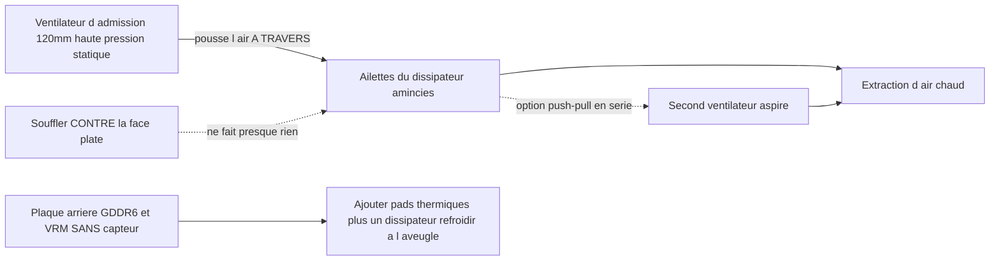

> 🌐 Traduction communautaire. La [version anglaise](../en/04-cooling.md) fait foi et peut être plus à jour. Une erreur ? [Ouvrez une issue](https://github.com/lildebil0/awesome-bc250/issues).

# Refroidissement

> **En bref** — Le dissipateur d'origine de la BC-250 a été conçu pour le tunnel d'air forcé d'un rack serveur, pas pour un bureau. Tel quel, il throttle. Le correctif communautaire : **amincir les ailettes denses d'origine** (les limer/poncer) et y boulonner un **ventilateur 120 mm à haute pression statique** (l'**Arctic P12 Max/Pro** est la référence ; le Noctua NF-P12 redux est l'alternative premium silencieuse) qui souffle *à travers* elles. Cela seul amène une carte moddée à **~73 °C sous Furmark, 63–65 °C en jeu**. Le watercooling AIO et les boîtiers entièrement custom sont les paliers suivants.

Le refroidissement est **la chose n°1 qu'un débutant rate**, alors faites ça avant de chercher des overclocks.

---

## Pourquoi le refroidissement d'origine ne suffit pas

La BC-250 est une carte de minage/serveur. Son dissipateur est **passif** et conçu pour être installé dans un châssis où des ventilateurs bruyants forcent l'air d'avant en arrière à travers lui. Sur un bureau sans flux d'air, il accumule la chaleur et le GPU throttle. Souffler un ventilateur *contre* la face plate ne fait presque rien — l'air doit traverser **les canaux des ailettes**, et passer aussi sur la plaque arrière (la GDDR6 à l'arrière n'a **aucun capteur de température**, vous la refroidissez donc à l'aveugle).

Limites observées par la communauté : le throttling commence vers **85 °C**, le crash/reset brutal vers **90 °C**. Gardez les températures en charge sous ~80 °C avec de la marge.

> **Il existe trois variantes de dissipateur** (ailettes sur 8 rangées et sur 9 rangées). Identification rapide : un **QR code à côté du connecteur PCIe 8 broches** marque la variante à 9 rangées. La variante avec **moins d'ailettes, mais plus épaisses** peut refroidir légèrement mieux d'origine. ([elektricM Cooling](https://elektricm.github.io/amd-bc250-docs/hardware/cooling/))

**Cibles de température par composant** (chiffres testés par elektricM, plus fins que les limites throttle/crash ci-dessus) :

| Composant | Repos | Charge légère | Jeu | Max |
|-----------|------|-----------|--------|-----|
| Bord GPU/APU | 40–50 °C | 50–60 °C | 65–80 °C | 90 °C |
| CPU (Tctl) | 45–55 °C | 55–65 °C | 70–85 °C | 95 °C |
| Mémoire (face inférieure) | 40–55 °C | 50–65 °C | 55–70 °C | 80 °C |
| NVMe/SSD | 40–55 °C | 50–65 °C | 60–75 °C | 80 °C (critique 81.8 °C) |

Visez **70–80 °C GPU en jeu**. Le plafond NVMe compte ici parce que **la GDDR6 et le SSD M.2 partagent la face arrière chaude de la carte** — le SSD se trouve dans le pire emplacement thermique et peut cuire, alors surveillez-le (`80 °C` max, `81.8 °C` critique selon la spec du disque). ([elektricM: sensors](https://elektricm.github.io/amd-bc250-docs/system/sensors/))

> **Échelle Tctl du CPU.** elektricM signale **90 °C Tctl** comme point de retrait recommandé ; les **95 °C** du tableau sont la limite supérieure que vous verrez encore en jeu intensif ; **TJmax = 100 °C** est la limite absolue du silicium (le tableau de puissance du package plus bas épingle le CPU exactement à cette valeur sous une charge de stress soutenue). Donc : **90 °C = « lever le pied maintenant », 95 °C = « dans le rouge », 100 °C = « contre le mur ».** ([elektricM: sensors](https://elektricm.github.io/amd-bc250-docs/system/sensors/))

> **Puissance du package par état thermique** (elektricM associe chaque état à une consommation de la carte) : Repos **50–70 W**, Légère **100–150 W**, Lourde **150–200 W**, Stress **200–235 W**. Utile pour dimensionner l'alimentation et lire à quel point la carte travaille réellement depuis la prise. ([elektricM: sensors](https://elektricm.github.io/amd-bc250-docs/system/sensors/))

> **Artefacts de pixels pendant le jeu = surchauffe de la VRAM.** Comme la GDDR6 de la face arrière n'a pas de capteur, ce pépin visuel est votre signal d'alerte — ajoutez du flux d'air/des pads sur la plaque arrière (ci-dessous). ([elektricM Cooling](https://elektricm.github.io/amd-bc250-docs/hardware/cooling/))

> **Loterie du silicium — prévoyez une marge thermique par puce.** Deux cartes physiquement identiques, châssis et config OC identiques, peuvent tourner avec **5–10 °C d'écart**, et la plus chaude est restée la plus chaude même après changement de pâte/pads. Ne supposez pas que les températures de quelqu'un d'autre correspondront aux vôtres. ([r/BC250Gaming](https://www.reddit.com/r/BC250Gaming/))



---

## Le calcul soutenu est un régime différent (pas seulement des pics de jeu)

Les cibles ci-dessus supposent du **jeu**, où la charge arrive par à-coups. Le calcul **soutenu** — un `llama-bench` en boucle, de longues sessions Stable-Diffusion, tout ce qui sollicite le GPU pendant des dizaines de minutes, **surtout avec le [déverrouillage 40 CU](09-overclock-undervolt.md)** — est une charge bien plus rude et peut dépasser ce qu'un refroidissement de niveau gaming peut tenir.

elektricM a mesuré un dissipateur d'origine + **deux Arctic P12 Max en push–pull**, `llama-bench` soutenu sur 10 min à **40 CU / 2 GHz** :

| Métrique | Moyenne | Pic |
|--------|---------|------|
| Bord GPU | 89.6 °C | 107 °C |
| Puissance du package | 136 W | 223 W |
| CPU | 96.7 °C | 100 °C (TJmax) |
| MOSFET VRM | 57 °C | 58.5 °C |
| Vitesse du ventilateur | ~2950 RPM | 2977 RPM (plafond) |

Le débit a fléchi de **~10 %** sur la durée pendant que le package throttlait. À retenir : **le dissipateur d'origine + deux P12 Max n'offrent pas assez de marge pour du 40 CU @ 2 GHz soutenu** — et notez que les **VRM sont loin de leur limite** (57 °C), donc le goulot d'étranglement est *le dissipateur qui évacue la chaleur*, pas les ventilateurs ni l'étage de puissance. Deux solutions : **plafonner le gouverneur GPU à 1500 MHz** (40 CU scale toujours ~1,5× en calcul, les températures tiennent ~83 °C — soutenable indéfiniment sur deux P12 Max), ou **améliorer le dissipateur** (plus de surface d'ailettes). Pour le **jeu en 24 CU d'origine**, deux P12 Max sont confortables ; le mur n'apparaît que sous calcul soutenu à pleine charge de CU. ([elektricM Cooling](https://elektricm.github.io/amd-bc250-docs/hardware/cooling/))

---

## Voie A — Mod air (le plus populaire, le moins cher)

C'est ce que fait tourner la majorité du chat.

### 1. Amincir/nettoyer les ailettes d'origine
Les ailettes d'origine sont trop denses et souvent inégales. Les gens ouvrent les canaux pour que l'air puisse passer :

- **Ponceuse orbitale (excentrique)** — la plus rapide, fait en quelques minutes, meilleur résultat. ([src](https://t.me/c/2424231195/31571))
- **Papier de verre à la main** — grain 60 puis grain 240, ~3–4 h + 2 h sur deux jours. Ça marche mais c'est lent. ([src](https://t.me/c/2424231195/50330))
- **Ciseaux / pinces coupantes** — méthode brute « чекрыжить », dernier recours ; les résultats sont les pires. ([src](https://t.me/c/2424231195/41252))
- **Ciseaux + guide à la règle (variante propre)** — glissez des ciseaux de bricolage/coiffeur dans l'interstice des ailettes avec une **règle inclinée contre la lame en guise de guide** ; un canif « ouvre-boîte » fonctionne tout aussi bien. Bémol : certaines variantes de carte n'ont **aucun interstice pour amorcer la lame** — forcez-en un avec un tournevis/une pince à épiler, ou découpez une fente d'entrée avec un **petit disque à tronçonner Dremel**. Des lames plus larges que les fentes des ailettes peuvent endommager le dissipateur. ([r/BC250Gaming](https://www.reddit.com/r/BC250Gaming/))
- Redressez les ailettes tordues avec une **pince à épiler plate + une pince**. ([src](https://t.me/c/2424231195/30670))
- **Arracher les ailettes à la main** — elektricM note que les ailettes en aluminium souple peuvent être **arrachées/séparées proprement à la main** (dissipateur démonté de la carte), évitant les copeaux métalliques que créent les outils de coupe. Plus lent mais sans débris. ([elektricM Cooling](https://elektricm.github.io/amd-bc250-docs/hardware/cooling/))
- **« Scooper by Justin »** — un **outil imprimable en 3D conçu spécifiquement pour presser/ouvrir les ailettes du dissipateur de la BC-250** ([Printables 1282906](https://www.printables.com/model/1282906-bc-250-scooper)). Plus sûr qu'un simple tournevis : il vous empêche d'appuyer trop fort et de creuser la **base** du dissipateur entre les ailettes. ([fil communautaire r/linux_gaming](https://www.reddit.com/r/linux_gaming/comments/1nvsgji/)) Restez réaliste : un possesseur a rapporté que l'outil **« peigne/scooper » imprimé a cassé à la 2e utilisation** et crispait les mains. ([r/BC250Gaming](https://www.reddit.com/r/BC250Gaming/))
- **Pince de modélisme — méthode « pelage »** — saisissez le **haut** des ailettes avec une petite pince de modélisme et pelez-les, **en utilisant la mémoire propre du métal comme point de rupture** pour qu'elles cassent net au niveau du pli plutôt que d'arracher la base. Une alternative pauvre en débris à la coupe. ([fil communautaire r/linux_gaming](https://www.reddit.com/r/linux_gaming/comments/1nvsgji/))

Gain de température approximatif (elektricM) : **redresser les ailettes tordues ~5–10 °C**, **retirer les ailettes centrales ~10–15 °C** (irréversible — un bon carénage de ventilateur procure des gains similaires sans couper), **pâte fraîche ~5–10 °C** si l'ancienne pâte avait séché. ([elektricM Cooling](https://elektricm.github.io/amd-bc250-docs/hardware/cooling/))

> ⚠ **Démontez d'abord le dissipateur de la carte** (ou masquez/protégez entièrement la carte et le die) avant de poncer/limer, et **enlevez chaque particule de poussière métallique avant le remontage**. Les copeaux métalliques conducteurs qui se déposent sur la carte peuvent la court-circuiter et **tuer la carte** — c'est déjà arrivé dans le chat.

<p align="center">
  <br>
  <sub>Photo : communauté AMD BC-250 · <a href="https://t.me/c/2424231195/31571">source</a></sub>
</p>

### 2. Boulonner un vrai ventilateur
Montez un **ventilateur 120 mm à haute pression statique** qui pousse l'air à travers les ailettes. Le choix de référence est l'**Arctic P12 Max (ou P12 Pro)** — la plus haute pression statique (~6.9 mm H₂O), le choix de la communauté + elektricM pour ce dissipateur dense. Le **Noctua NF-P12 redux** est l'alternative premium silencieuse, et a affiché un résultat de référence de **max 73 °C sous Furmark, 63–65 °C en jeu** ([src](https://t.me/c/2424231195/42843)).

**Choix concrets de ventilateurs avec specs** (elektricM — choisissez sur la *pression statique*, pas le débit d'air) :

| Ventilateur | Taille | RPM max | Pression statique | Débit d'air | Bruit | Temps en jeu |
|-----|------|---------|----------------|---------|-------|--------------|
| **Arctic P12 Max** | 120 mm | 3300 | **6.9 mm H₂O** | 73.3 CFM | 52.5 dB(A) | 65–75 °C |
| **Arctic P12 Pro** | 120 mm | 2100 | **6.9 mm H₂O** | 68.9 CFM | 37.8 dB(A) | 65–75 °C |
| Arctic P14 PWM | 140 mm | 1700 | 2.40 mm H₂O | 72.8 CFM | 38 dB(A) | 70–80 °C |
| Noctua NF-A12x25 | 120 mm | 2000 | 2.34 mm H₂O | 60.1 CFM | 22.6 dB(A) | 70–85 °C |

Le choix **le plus recommandé par elektricM est l'Arctic P12 Max / P12 Pro** — sa pression statique de ~6.9 mm H₂O écrase les 2.34 mm du Noctua et est bien moins chère ; le P12 Pro est la version plus silencieuse et plus largement disponible. Le Noctua premium est encore plus silencieux mais n'égale l'Arctic sur les températures qu'à RPM plus élevés. ([elektricM Cooling](https://elektricm.github.io/amd-bc250-docs/hardware/cooling/))

**Autres ventilateurs nommés issus de builds communautaires** (modèles précis que les gens ont montés, au-delà de la référence Arctic/Noctua-P12) :

- **Noctua NF-A12x25 G2** (PWM) comme **ventilateur 120 mm du die** — la nouvelle révision G2 de l'A12x25, utilisée comme ventilateur principal ([TiredDadTech](https://youtu.be/zi7sldeRd2w)). (Le tableau des ventilateurs ci-dessus ne liste que le NF-A12x25 *original*.)
- **Noctua NF-A6x15 PWM** (≈3500 rpm) comme **remplacement du ventilateur 60 mm de l'alimentation** — le remplacement silencieux d'un ventilateur de brique serveur hurlant ([TiredDadTech](https://youtu.be/zi7sldeRd2w)).
- **Thermalright 120 mm 1550 rpm ARGB** comme ventilateur de die économique, et **pads thermiques 6.0 W/mK** pour la plaque arrière — les deux issus d'une **BOM de build TMG HD** ([aperçu du build](https://youtu.be/OEO0r01zcfU)).

> **Référence vs alternative silencieuse.** L'**Arctic P12 Max/Pro** est le ventilateur de référence ici — la plus haute pression statique (~6.9 mm H₂O), le moins cher, le choix de la communauté + elektricM pour ce dissipateur dense. Le **Noctua NF-P12 redux** est l'alternative premium silencieuse (le résultat 73 °C Furmark du chat), n'égalant l'Arctic sur les températures qu'à RPM plus élevés. Choisissez Arctic pour le meilleur rapport prix/performance, Noctua si le silence compte le plus.

Utilisez un **carénage/adaptateur de ventilateur imprimé** pour que le ventilateur soit étanche contre le dissipateur au lieu de laisser l'air fuir autour. STL communautaires :
- `Fan_Shroud_Single_120mm.stl`, `Fan_Shroud_Dual_120mm.stl`, `Fan_Shroud_Single_140mm.stl`, `Twin_120mm_Fan_Shroud.stl`
- `BC250_FanAdapter_120mm.step`, `bc250 cooler mount.stl`, `cooler adapter v3.0.stl`

> **Pourquoi la pression statique, pas le débit d'air ?** Les ailettes denses sont une charge à haute résistance. Un « ventilateur de boîtier » à haut débit cale contre elles ; un ventilateur à haute pression statique (≥3 mm H₂O ; Noctua P12, Arctic P12) pousse réellement l'air *à travers*. Pour des ailettes très denses, deux ventilateurs en **push–pull (série)** doublent la pression statique — c'est le bon choix ici, pas deux ventilateurs côte à côte.

**Montage :** un carénage imprimé est idéal, mais **fixer le ventilateur au dissipateur avec des colliers** fonctionne, et un **conduit en carton/carton-mousse** scotché entre le ventilateur et les ailettes est un repli gratuit valable (moche, peu durable, mais il scelle le chemin de l'air). ([elektricM Cooling](https://elektricm.github.io/amd-bc250-docs/hardware/cooling/))

> ⚠ **Ne percez/vissez pas les ventilateurs directement dans les ailettes.** L'aluminium est souple et les ailettes sont fines — visser dedans endommage le bloc d'ailettes et nuit au refroidissement. Utilisez des colliers ou un carénage imprimé. ([elektricM Cooling](https://elektricm.github.io/amd-bc250-docs/hardware/cooling/))

> ### 🛠 Ingénierie du flux d'air — ce qui change vraiment la donne
>
> Constats communautaires sur la *manière* dont l'air est déplacé, pas seulement quel ventilateur :
>
> - **La pression statique l'emporte sur le CFM brut** à travers le bloc d'ailettes dense — c'est pourquoi l'**Arctic P12 Max (6.9 mm H₂O)** à haute pression statique surpasse les ventilateurs plus silencieux à haut débit/basse pression sur ce dissipateur.
> - **Un seul ventilateur centré peut battre deux ventilateurs côte à côte** sur un plan d'ailettes entièrement coupé : un seul ventilateur central charge directement les **4 caloducs centraux**, tandis que deux ventilateurs laissent une « couture » morte de plastique au-dessus du centre. Le builder qui a coupé les ailettes sur tout le plan le premier a mesuré quelques °C de **moins** avec un ventilateur central qu'avec deux ([src](https://t.me/c/2424231195/46175)). Un teardown arrive à la même conclusion côté flux d'air : **deux ventilateurs boulonnés côte à côte ne valent pas mieux qu'un seul** parce qu'une **zone morte se forme juste au-dessus du centre chaud du die** là où les deux admissions se rejoignent — **laissez un espace entre eux, ou passez plutôt en push-pull** ([Old Lamer — Part VII](https://youtu.be/pxahl9-YgkY) ~19:55). *(Issu de sous-titres — à traiter comme qualitatif, pas exact.)*
> - **Plancher de vitesse du ventilateur 120 mm ≈1800 RPM** pour réellement faire passer l'air à travers ce bloc dense ; l'**Arctic P12 Pro** (8–10 $, plage **600–3000 rpm**) est un choix facile qui tourne silencieusement au repos tout en gardant de la marge ([Old Lamer — Part VII](https://youtu.be/pxahl9-YgkY)). *(Chiffres ASR — approximatifs.)*
> - **Ajouter un ventilateur d'extraction = −3 à −5 °C.** Admission seule **73 °C** → avec extraction **67–68 °C** ([src](https://t.me/c/2424231195/68183), [src](https://t.me/c/2424231195/31553)). Donc la config simple optimale est **1 admission centrale + 1 extraction arrière**, pas deux admissions côte à côte.
> - **La plaque arrière est aveugle et chaude.** Les MOSFET VRM atteignent **~100 °C non refroidis** ([src](https://t.me/c/2424231195/110955)) — elle **doit** recevoir pads + dissipateurs + flux d'air dédié ; avec des dissipateurs à l'arrière elle tourne *« froide en charge »* ([src](https://t.me/c/2424231195/93056)).
> - **Physique gratuite.** L'air chaud monte, donc même une orientation **inclinée/cheminée** aide — une plaque arrière à peine ventilée a mesuré **47 °C rien que par convection** ([src](https://t.me/c/2424231195/76962)). Et un **radiateur anodisé noir rayonne ~1,8×** plus qu'un poli, ce qui permet de réduire la surface d'ailettes de **~45 %** dans des builds compacts passifs/semi-passifs ([src](https://t.me/c/2424231195/86878)).
> - **Faites tourner admission > extraction** (légère **pression positive**) pour que les VRM/VRAM sans capteur restent baignés d'air frais.

### Alternative : conserver les ailettes d'origine (boîtier push-pull sans coupe)
Couper les ailettes n'est pas obligatoire. **penzoiders** a conçu un boîtier ([MakerWorld, source FreeCAD](https://makerworld.com/models/2505974)) qui ne **coupe pas** le dissipateur : il utilise des **ventilateurs à haute pression statique en push-pull** pour forcer l'air à travers les **ailettes d'origine non modifiées**, plus un **différentiel de pression à deux chambres** qui refroidit aussi la plaque arrière (dissipateurs 5 mm + pads thermiques ; des dissipateurs NVMe réutilisés fonctionnent). Un tuning qui reste frais : **CPU 3800 MHz / 1050 mV, GPU 2100 MHz / 950 mV** → Furmark + `stress-ng` en parallèle reste **sous 85 °C** ; en jeu **~75 °C à environ 50 % de duty des ventilateurs** (courbe CoolerControl), « à peine audible ». ([r/BC250Gaming](https://www.reddit.com/r/BC250Gaming/))

## Voie B — Watercooling AIO

Un AIO 120 mm monté sur le die via un support adaptateur. Silencieux et froid, mais plus de pièces et de coût. Les builds populaires utilisent des AIO bon marché (par ex. aigo). ([exemple src](https://t.me/c/2424231195/19336))

<p align="center">
  <br>
  <sub>Photo : communauté AMD BC-250 · <a href="https://t.me/c/2424231195/19336">source</a></sub>
</p>

**Support AIO nommé et téléchargeable — NexGen3D** ([Printables 1554003](https://www.printables.com/model/1554003), à imprimer en ABS-GF ou PETG). Vérifié avec un **AIO Thermalright 240 mm** : GPU **~50 °C @ 2000 MHz**, CPU **max 60 °C**. ([r/BC250Gaming](https://www.reddit.com/r/BC250Gaming/))

### Profils d'overclock en watercooling
Avec un AIO vous pouvez pousser bien plus fort. **NexGen3D** mesuré à la prise (Furmark Vulkan + `stress-ng --matrix 0 -t 60m` comme combo de torture) :

| Profil | CPU | GPU | Temp max de torture | Puissance prise | Note |
|---------|-----|-----|---------------|------------|------|
| 1 | 4000 MHz | 2400 MHz | ~65 °C | >350 W | « parfaitement silencieux » |
| 2 | 4100 MHz | 2450 MHz | ~75 °C | <400 W | plus chaud, plus bruyant |

Le jeu normal en 1080p tourne **10–15 °C en dessous** de ces températures de torture et **sous 250 W** sur le Profil 1. **Schéma de flux d'air à copier :** les ventilateurs 120 mm **extraient l'air à travers le radiateur**, ce qui aspire de l'air externe frais sur les **VRM / l'alimentation / la plaque arrière VRAM** ; un **ventilateur 80 mm séparé (Arctic P8 Max)** refroidit les VRM du GPU — cela répond à l'avertissement « les VRM/VRAM sans capteur ont quand même besoin de flux d'air » ci-dessus. ([r/BC250Gaming](https://www.reddit.com/r/BC250Gaming/))

## Boucle watercooling custom (avancé)

Au-delà d'un AIO fermé, quelques personnes font tourner une **boucle entièrement custom**. C'est une scène réelle mais **DIY/expert** : les builders **fraisent en CNC ou soudent un waterblock custom** qui couvre le **die *et* le VRM** en un seul bloc ([src](https://t.me/c/2424231195/131065), [src](https://t.me/c/2424231195/131844), [src](https://t.me/c/2424231195/118582)). Les raccords ne sont pas critiques — *« on peut s'en procurer, en tourner ou en coller presque n'importe lesquels »* ([src](https://t.me/c/2424231195/132007)).

**Ce que ça apporte :** une boucle custom grossière atteint **~50 °C en charge avec les ventilateurs à seulement 30 %, la pompe externe quasi silencieuse** ([src](https://t.me/c/2424231195/133040)). (Un builder a ensuite remarqué un coil-whine des bobines du VRM en charge sur la config de gouverneur cyan-skillfish par défaut — un souci *distinct*, pas thermique.) Vous **n'avez pas non plus besoin d'un Corsair Commander** : le propre [contrôle des ventilateurs](#contrôler-la-vitesse-du-ventilateur-logiciel) de la BC-250 peut piloter la pompe plus **~5 ventilateurs** ([src](https://t.me/c/2424231195/140123)).

> ⚠ **Pourquoi c'est « avancé » : la BC-250 ne survit pas à une inondation de liquide.** Pannes réelles de la communauté : un tuyau **plié à 90°, a éclaté et a inondé le GPU et l'alimentation** ([src](https://t.me/c/2424231195/81158)) ; une **pompe AIO Corsair grippée a cuit le CPU** ([src](https://t.me/c/2424231195/133147), [src](https://t.me/c/2424231195/126053)). Surveillez aussi la **cavitation/le bruit de pompe au-dessus de ~50 % de vitesse de pompe** ([src](https://t.me/c/2424231195/7034)). **Testez l'étanchéité de toute la boucle HORS de la carte pendant 24 h avant la première mise sous tension en eau.**

**Verdict :** les températures les plus basses et l'option la plus silencieuse de toutes, et elle permet du 40-CU soutenu — mais le risque et l'effort les plus élevés. **Pas pour un premier build.**

## Voie C — Blower (« улитка ») — non recommandée

Les ventilateurs blower récupérés sur des GPU étaient une première expérimentation. Bruyants pour le résultat ; les gens sont passés à la Voie A. ([src](https://t.me/c/2424231195/100086))

## Voie D — Conversion en ventirad tour (avancé)

Certains utilisateurs boulonnent un **ventirad tour AM4** (par ex. **Thermalright Peerless Assassin**, ou d'autres tours AM4/AM5) sur le die pour un refroidissement excellent et silencieux avec du matériel grand public. Le hic : vous devez le **monter via un support**, et une tour haute peut **bloquer le slot M.2 ou d'autres composants**. Ce n'est pas un mod de débutant. Vous n'avez plus à en fabriquer un de zéro — deux supports imprimés en 3D publiés existent :

- **Adaptateur ventirad bureau AM4/AM5** ([MakerWorld 2596083](https://makerworld.com/en/models/2596083), source FreeCAD incluse). Monte un ventirad bureau AM4/AM5 standard sur la BC-250. Fixation : **boulons + écrous M5, sans entretoises** (l'auteur note que M4 serait idéal mais M5 entrait juste). À imprimer en **ABS, PETG ou ASA**. Vérifié à **CPU 3.95 GHz / 1.150 V, GPU 2200 MHz / 1000 mV, températures ne dépassant pas 80 °C**. Ventirads utilisés : un **AXP90** low-profile (un commentateur a utilisé un **AXP120**), et même un **AMD Wraith Spire** a battu le dissipateur d'origine. ([r/BC250Gaming](https://www.reddit.com/r/BC250Gaming/))
- **Support Thermalright AXP90-X53** ([Printables 1694793](https://www.printables.com/model/1694793)). Des inserts filetés sont **soudés dans la face inférieure** du support imprimé pour que vous **réutilisiez les vis à ressort d'origine du dissipateur** ; des boulons à tête bombée remontent du dessous et sont fraisés, et le support a un **espace de 0.5 mm sous la traverse** pour dégager les composants de la carte. Conçu sous Fusion 360, **à imprimer en PETG** (le PLA ramollit à ces températures). Résultat : **65–67 °C à pleine charge @ 2150 MHz, 1080p**, très silencieux (ventirad cuivre, associé à un Arctic P12 Pro 120 mm). Hauteur d'empilement mesurée **54 mm du PCB au sommet du ventilateur 15 mm** — utile pour l'intégration en boîtier. Un **jeu de variantes à 3 épaisseurs** et une version **AXP120-X67** existent aussi. ([r/BC250Gaming](https://www.reddit.com/r/BC250Gaming/))

---

## Contrôler la vitesse du ventilateur (logiciel)

Une fois un ventilateur boulonné, vous contrôlez son PWM via la puce Super I/O **Nuvoton NCT6686D** de la carte — mais **le pilote que vous chargez compte** ([spec matérielle elektricM](https://elektricm.github.io/amd-bc250-docs/)) :

- **Capteurs en lecture seule** (RPM du ventilateur, températures) : le module noyau **`nct6683`**, chargé avec `force=true`. Il rapporte les relevés mais **ne peut pas écrire le PWM**, donc le ventilateur reste à ce que le BIOS/firmware fixe.
- **Lecture + écriture du PWM** (régler réellement la vitesse du ventilateur) : utilisez le module hors-arbre **`nct6687`** de **[Fred78290/nct6687d](https://github.com/Fred78290/nct6687d)**, également avec `force=true`. C'est celui à compiler si vous voulez des courbes de ventilateur / un contrôle manuel de la vitesse plutôt que du simple monitoring.

```bash
# monitoring only (in-kernel):
echo 'options nct6683 force=true' | sudo tee /etc/modprobe.d/nct6683.conf
# PWM control (DKMS from Fred78290/nct6687d):
echo 'options nct6687 force=true' | sudo tee /etc/modprobe.d/nct6687.conf
```

> Ne chargez pas les deux — choisissez `nct6683` pour les capteurs en lecture seule ou `nct6687` pour lecture+écriture. Le câblage des capteurs (`CPU_FAN1` / `J4003`) et la numérotation des ventilateurs BIOS↔Linux sont dans l'étape de vérification de [06-linux.md](06-linux.md).

**Quel connecteur est le ventilateur principal ?** elektricM rapporte que le ventilateur de refroidissement est généralement sur le connecteur **Pump Fan** = **`fan2` / `pwm2`** dans sysfs ; les connecteurs `CPU Fan` (`fan1`) et `System Fan` (`fan3`+) sont généralement inutilisés. Activez le mode manuel avant d'écrire le PWM (`echo 1 > .../pwm2_enable`, puis une valeur 0–255 dans `.../pwm2`). La numérotation hwmon peut changer entre les redémarrages — confirmez avec `cat /sys/class/hwmon/hwmon*/name`. ([elektricM Cooling](https://elektricm.github.io/amd-bc250-docs/hardware/cooling/))

**Courbes de ventilateur avec une GUI — CoolerControl.** Une fois `nct6687` chargé, **CoolerControl** offre des courbes de ventilateur graphiques : sélectionnez le périphérique **nct6686**, construisez une courbe sur **pwm2** en utilisant **k10temp Tctl** comme source. Installation : `ujust install-coolercontrol` (Bazzite), le copr `codifryed/CoolerControl` (Fedora), ou `coolercontrol` depuis l'AUR (Arch) ; interface web sur `https://localhost:11987`. ([elektricM Cooling](https://elektricm.github.io/amd-bc250-docs/hardware/cooling/))

**Modes ventilateur du BIOS** (si vous ne faites pas de contrôle côté OS) : **Default** maintient les ventilateurs à un **minimum de 40 %** (trop bas — non recommandé), **Full Speed** les épingle à 100 % (bruyant mais sûr), **Customize** règle les vitesses par seuil. ([elektricM Cooling](https://elektricm.github.io/amd-bc250-docs/hardware/cooling/))

> ⚠ **Ne faites pas tourner le mode Customize du BIOS et CoolerControl en même temps** — ils se disputent le contrôle du PWM. Choisissez l'un. ([elektricM Cooling](https://elektricm.github.io/amd-bc250-docs/hardware/cooling/))

---

## Interface thermique (pâte, pads, changement de phase, métal liquide)

Quel que soit le ventilateur/dissipateur que vous utilisez, le **matériau d'interface thermique (TIM)** entre le die et le dissipateur — et entre l'arrière de la carte et tout radiateur de plaque arrière — mérite d'être bien fait. Le die de la BC-250 a une **forte densité de chaleur**, donc un bon TIM représente quelques degrés gratuits.

> **Changer simplement la pâte d'origine aide.** Un possesseur a remplacé la pâte d'usine après un an et les températures en charge ont chuté de **~4–5 °C**, tout le reste étant inchangé. ([src](https://t.me/c/2424231195/88565))

### Pâtes qui fonctionnent
- **Arctic MX-6** — une pâte haut de gamme classique. Dans un build en boîtier elle a tenu **87–88 °C sous Furmark** ; le même possesseur a noté que PTM7950 grignoterait ~4 °C de plus. ([src](https://t.me/c/2424231195/30211))
- **Pâte d'origine + pads d'origine** sont la référence documentée : ~**76 °C** après 10 min de charge, ~**55 °C** au repos (avant mod ailettes/ventilateur). ([src](https://t.me/c/2424231195/22992))
- Autres pâtes qu'elektricM liste comme convenables ici : **Arctic MX-4** (rapport qualité-prix), **Thermal Grizzly Kryonaut** (premium), **Noctua NT-H1** (fiable), **Thermalright TFX** (économique). La pâte d'une carte d'occasion est **souvent desséchée** — un simple changement de pâte vaut **~5–10 °C**. Appliquez un point de la taille d'un petit pois sur le die, montez uniformément, serrez les vis en **croix (X)**. ([elektricM Cooling](https://elektricm.github.io/amd-bc250-docs/hardware/cooling/))

### PTM7950 — le favori de la communauté (recommandé)
**PTM7950** est un **pad à changement de phase** (film graphite/changement de phase Honeywell). À température ambiante c'est une fine feuille solide ; en charge (~45–55 °C) il ramollit et flue en une couche d'épaisseur micrométrique, puis reste en place. Il **ne sort pas par pompage** et ne sèche pas comme une graisse, ce qui est exactement ce que vous voulez sous un die chaud à cycles thermiques — vous l'appliquez donc une fois et l'oubliez. Le résumé direct du chat : *« PTM7950 et ne te prends pas la tête »* ([src](https://t.me/c/2424231195/101582)) ; le changement de phase est la recommandation générale ([src](https://t.me/c/2424231195/61511)).

**Comment l'appliquer :**
1. Nettoyez le die et la base du dissipateur (alcool isopropylique), laissez sécher.
2. Découpez un carré de PTM7950 à la taille du die — un morceau de **~26×30 mm** couvre le die de la BC-250 ([src](https://t.me/c/2424231195/125748)).
3. Retirez un film protecteur, posez le pad sur le die, retirez le second film.
4. Montez le dissipateur et serrez uniformément. **Pas d'étalement** — le premier cycle thermique fait le travail. Attendez les meilleures températures après quelques cycles charge/repos (« rodage »).

Un build de référence en boîtier sur PTM7950 (Honeywell, 26×30) plus un radiateur de plaque arrière culmine à **~84 °C sur une heure, 66–71 °C en jeu** à CPU 3850 MHz / GPU 2100 MHz. ([src](https://t.me/c/2424231195/125748))

> **Association nommée : pâte malléable Upsiren sous le dissipateur + PTM7950 sur le die.** Une vidéo de build associe une **pâte malléable thermique Upsiren UTP-6 / UTP-8** (la qualité **UTP-8** est notée ≈**14.8 W/mK**) pour les zones de comblement avec une **feuille de PTM7950 découpée 40×80×0.25 mm** posée sur le die ([vidéo PTM7950 + Upsiren](https://youtu.be/FJapqZSdt6I)). La pâte malléable sert à combler les espaces inégaux vers un dissipateur/une plaque ; le film à changement de phase va sur le die lui-même.
>
> - **Le PTM7950 AliExpress bon marché fonctionne.** Une feuille AliExpress à ~**13 $** a été vérifiée comme performante — vous n'avez pas besoin de la découpe Honeywell de marque ([vidéo PTM7950 + Upsiren](https://youtu.be/FJapqZSdt6I)).
> - **Le PTM7950 a besoin d'un rodage.** Il n'atteint ses meilleures températures qu'après **plusieurs cycles chaud/froid** — ne le jugez pas au premier essai ([démo TIM portable](https://youtu.be/U4Zm8msXJHM)).
>
> *(Les deux sources sont sous-titrées automatiquement — traitez les W/mK et dimensions exacts comme approximatifs.)*

### Pads de plaque arrière & GDDR6 (refroidir l'arrière, à l'aveugle)
La **GDDR6 et le VRM à l'arrière de la carte n'ont aucun capteur de température** — vous les refroidissez à l'aveugle. Ajoutez un **dissipateur/radiateur sur la plaque arrière** couplé à des **pads thermiques** pour que la chaleur de la face arrière ait où aller. ([src](https://t.me/c/2424231195/125748)) Un builder RU a simplement pris un **dissipateur sur Yandex.Market**, l'a collé sur la plaque arrière, et il a **bien refroidi la plaque inférieure** — n'importe quel dissipateur en aluminium de taille raisonnable fait l'affaire ici ([4pda — mananoid1](https://4pda.to/forum/index.php?showtopic=1104980)).

Épaisseurs de pads rapportées (partagées par la communauté, réaction « j'ai sauvegardé ça ») :
- **VRM : 1 mm**
- **GDDR6 : 2 mm** ([src](https://t.me/c/2424231195/121181))

> ⚠ **à vérifier** — ces épaisseurs dépendent de l'espace jusqu'à *votre* plaque arrière/radiateur spécifique. Confirmez avec une mesure de l'espace (ou un test à la pâte malléable/argile) avant d'acheter une pile de pads.

elektricM donne un **schéma de pads légèrement différent** pour refroidir la mémoire elle-même : **pads 1.5 mm sur l'*avant* de la carte, 2.0 mm à l'*arrière***, puis une plaque/un dissipateur en aluminium sur la face inférieure. Utilisez **uniquement des pads non conducteurs** près de la carte (jamais de pâte/pads conducteurs qui pourraient court-circuiter des composants). Marques de pads qu'il liste : **Thermalright Odyssey** (haute performance), **Arctic Thermal Pad** (rapport qualité-prix), **Gelid GP-Ultimate** (premium). ([elektricM Cooling](https://elektricm.github.io/amd-bc250-docs/hardware/cooling/))

> ⚠ **à vérifier (les épaisseurs de pads diffèrent selon les sources)** — nos chiffres issus du chat sont **VRM 1 mm / GDDR6 2 mm (arrière)** ; elektricM spécifie **1.5 mm avant / 2.0 mm arrière** pour les puces mémoire. Builds différents, espaces différents — **mesurez votre propre jeu** plutôt que de faire confiance à l'un ou l'autre chiffre à l'aveugle.

> **Crashes/instabilité après 30–60 min de jeu** (souvent avec des artefacts de pixels) est la signature classique de la **surchauffe mémoire**. Solutions : ajouter des pads + une plaque inférieure, ajouter un ventilateur de plaque arrière, améliorer le flux d'air du boîtier, ou **réduire temporairement le partage VRAM** (par ex. 4 Go → 512 Mo) pour réduire la chaleur de la mémoire. ([elektricM Cooling](https://elektricm.github.io/amd-bc250-docs/hardware/cooling/))

### Métal liquide — généralement PAS recommandé ici
Le métal liquide (LM) revient sur le tapis parce que la PS5 (APU de la même famille) en utilise ([src](https://t.me/c/2424231195/18105)), et sur la performance brute il devance la pâte/le PTM ([src](https://t.me/c/2424231195/124112)). Des gens ont posé des questions à son sujet et l'ont essayé sur la BC-250 ([src](https://t.me/c/2424231195/18098), [src](https://t.me/c/2424231195/77180)).

**Mais c'est le mauvais choix sur cette carte :**
- Le LM est **électriquement conducteur**. Le die de la BC-250 se trouve juste à côté de **GDDR6 et VRM denses** ; une goutte qui s'échappe du die court-circuite la carte (le même risque « une chose conductrice près de la mémoire la tue » que l'avertissement sur les copeaux métalliques ci-dessus).
- Il **sort par pompage / doit être refait environ une fois par an**, et il attaque l'aluminium nu — même le défenseur du PTM7950 a abandonné le LM sur son propre matériel pour exactement cette corvée, en passant à PTM7950 / KryoSheet. ([src](https://t.me/c/2424231195/69688))
- « Tout le monde n'acceptera même pas la tâche de travailler avec du métal liquide. » ([src](https://t.me/c/2424231195/106787))

**En résumé :** **PTM7950 est le choix haute performance le plus sûr** — ~99 % du bénéfice, aucun des risques de court-circuit/de maintenance. Réservez le LM aux gens qui savent déjà exactement ce qu'ils font.

---

## Comment tester votre refroidissement (méthode communautaire, épinglée)

D'après la procédure épinglée ([src](https://t.me/c/2424231195/108407)) :

1. **Stress GPU :** Furmark (Vulkan / « Furmark VK »).
2. **CPU en même temps :** ajoutez un bench CPU (cpu-x) ou une charge basée sur `stress`/`pipx` — l'APU partage un seul dissipateur, alors testez les deux ensemble.
   - Ces outils (Furmark, OCCT, cpu-x, `stress`) **ne sont pas préinstallés** sur une machine Linux fraîche — installez-les via votre gestionnaire de paquets ou Flatpak d'abord.
3. **Testez sous votre overclock**, pas d'origine — 1500 MHz est faible ; **2000 MHz c'est ~+30 % de FPS** et ce que vous ferez réellement tourner, alors refroidissez pour ça.
4. Surveillez les températures ; si vous dépassez ~85 °C vous throttlez — ajoutez du travail sur ventilateur/carénage/ailettes.

> ℹ️ **Ne confondez pas deux affirmations « +30 % » différentes.** Le **+30 % de fréquence GPU** ici (1500 → 2000 MHz augmentant les FPS d'environ un tiers) est un gain de *performance* dû à l'overclocking. Ce **n'est pas** la même chose que l'**amélioration thermique de ~+30 %** citée pour un **changement de pâte** dans une démonstration de TIM portable distincte ([démo TIM portable](https://youtu.be/U4Zm8msXJHM)) — celle-là est un résultat de *température* sur un matériel différent. Même chiffre, choses sans rapport.

Il existe aussi un court tutoriel vidéo de la méthode la plus simple, épinglé dans le sujet. ([src](https://t.me/c/2424231195/100024))

---

## Configuration de démarrage recommandée

| Palier | Faites ceci | Attendez-vous à |
|------|---------|--------|
| Minimum | Poncer les ailettes (ponceuse orbitale) + 1× Arctic P12 Max/Pro (ou Noctua NF-P12) + carénage imprimé | ~73 °C Furmark |
| Mieux | Push–pull (2× P12) à travers carénage | plus bas, plus silencieux à température égale |
| Max | AIO 120 mm sur adaptateur | le plus froid, plus d'effort de build |

---

## Sources

- Méthode de test épinglée — https://t.me/c/2424231195/108407 · vidéo — https://t.me/c/2424231195/100024
- Outillage ailettes — https://t.me/c/2424231195/31571 · https://t.me/c/2424231195/30670 · https://t.me/c/2424231195/50330 · outil ailettes « Scooper by Justin » ([Printables 1282906](https://www.printables.com/model/1282906-bc-250-scooper)) + méthode de pelage à la pince de modélisme — [fil r/linux_gaming](https://www.reddit.com/r/linux_gaming/comments/1nvsgji/)
- Résultat Noctua P12 — https://t.me/c/2424231195/42843
- Exemple AIO — https://t.me/c/2424231195/19336
- Interface thermique — changement de pâte −4–5 °C https://t.me/c/2424231195/88565 · MX-6 https://t.me/c/2424231195/30211 · référence d'origine https://t.me/c/2424231195/22992 · PTM7950 https://t.me/c/2424231195/101582 · https://t.me/c/2424231195/61511 · build PTM7950 + plaque arrière https://t.me/c/2424231195/125748 · épaisseur des pads https://t.me/c/2424231195/121181 · métal liquide https://t.me/c/2424231195/18098 · https://t.me/c/2424231195/69688
- Guide de refroidissement elektricM (variantes de dissipateur, tableau de températures par composant, données de charge soutenue, specs des ventilateurs, modes ventilateur CoolerControl/BIOS, ventirad tour, schéma de pads) — https://elektricm.github.io/amd-bc250-docs/hardware/cooling/
- [elektricM: sensors](https://elektricm.github.io/amd-bc250-docs/system/sensors/) (seuils thermiques : CPU Tctl 90 °C max / TJmax 100 °C, NVMe/SSD 80 °C max / 81.8 °C critique, puissance du package par état thermique)
- r/BC250Gaming (rapports communautaires : variance de loterie du silicium, méthode ailettes ciseaux+règle, casse de l'outil peigne, boîtier push-pull sans coupe, support AIO + résultat 240 mm, profils OC en watercooling, supports AM4/AM5 + AXP90-X53) — https://www.reddit.com/r/BC250Gaming/ · adaptateur ventirad AM4/AM5 [MakerWorld 2596083](https://makerworld.com/en/models/2596083) · support AXP90-X53 [Printables 1694793](https://www.printables.com/model/1694793) · support AIO NexGen3D [Printables 1554003](https://www.printables.com/model/1554003) · boîtier push-pull sans coupe [MakerWorld 2505974](https://makerworld.com/models/2505974)
- Référence matérielle — [mothenjoyer69/bc250-documentation `hardware.md`](https://github.com/mothenjoyer69/bc250-documentation/blob/main/hardware.md)
- Boîtiers/adaptateurs avec refroidissement — [onemorecap/bc-250-sleeve-adapter](https://github.com/onemorecap/bc-250-sleeve-adapter)
- Zone morte de deux ventilateurs côte à côte au-dessus du die / laisser un espace ou push-pull, plancher 120 mm ≈1800 RPM, Arctic P12 Pro (8–10 $, 600–3000 rpm) — [Old Lamer — Part VII](https://youtu.be/pxahl9-YgkY) (sous-titres auto / ASR — chiffres approximatifs)
- Pâte malléable Upsiren UTP-6 / UTP-8 (UTP-8 ≈14.8 W/mK) + PTM7950 découpé 40×80×0.25 mm sur le die, PTM7950 AliExpress bon marché (~13 $) vérifié — [vidéo PTM7950 + Upsiren](https://youtu.be/FJapqZSdt6I) · le PTM7950 a besoin de plusieurs cycles de rodage chaud/froid + le « +30 % » de changement de pâte distinct (portable, pas le +30 % de fréquence GPU) — [démo TIM portable](https://youtu.be/U4Zm8msXJHM)
- Ventilateurs nommés : Noctua NF-A12x25 G2 (ventilateur 120 mm du die) + NF-A6x15 PWM 3500 rpm (remplacement ventilateur 60 mm de l'alimentation) — [TiredDadTech](https://youtu.be/zi7sldeRd2w) · Thermalright 120 mm 1550 rpm ARGB + pads 6.0 W/mK (BOM de build TMG HD) — [aperçu du build](https://youtu.be/OEO0r01zcfU)
- Radiateur de plaque arrière RU (dissipateur Yandex.Market qui a refroidi la plaque inférieure) — [4pda — mananoid1](https://4pda.to/forum/index.php?showtopic=1104980)

> Les STL de carénages et d'adaptateurs de ventilateurs sont catalogués dans [05-case.md](05-case.md) et mirrorés sous `assets/stl/`.
