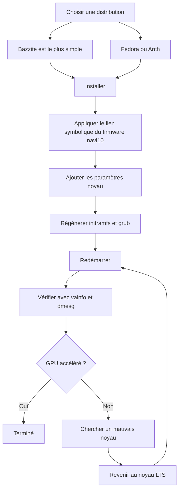

> 🌐 Traduction communautaire. La [version anglaise](../en/06-linux.md) fait foi et peut être plus à jour. Une erreur ? [Ouvrez une issue](https://github.com/lildebil0/awesome-bc250/issues).

# Pilotes Linux et configuration

> **TL;DR** — La plupart des gens font tourner le BC-250 sous Linux, et ça marche bien *une fois le GPU corrigé*. Tel quel, `amdgpu` ne reconnaît pas la puce et vous obtenez un rendu sur CPU à un FPS à un chiffre. Deux choses rendent la chose réelle : un **noyau moderne + une Mesa fraîche (25.1+)**, et le **correctif `amdgpu`** — un lien symbolique de firmware pour que le pilote puisse se charger (`navi10_gpu_info.bin` → `cyan_skillfish_gpu_info.bin`) plus des paramètres noyau (`amdgpu.sg_display=0`, `mitigations=off`, et sur les noyaux récents `amdgpu.bc250_cc_write_mode=3`). Le chemin le plus simple pour un débutant : flasher **[Bazzite](https://bazzite.gg/)** et rebaser sur l'image dédiée **`bazzite-bc250`** — les correctifs y sont intégrés. Vous voulez apprendre la machine : **Fedora** ou **CachyOS/EndeavourOS (Arch)** avec un script de configuration unique.

C'est la section qui transforme « une carte dans un carton » en un bureau fonctionnel. Faites d'abord le [refroidissement](04-cooling.md) et l'[alimentation](03-power-supply.md) — puis ceci.

> **Jamais utilisé Linux ? Un kit de survie en 60 secondes.**
> - **Ouvrir un terminal :** cherchez une application appelée *Terminal* / *Konsole* (KDE) / *Console* dans votre menu, ou appuyez sur `Ctrl-Alt-T`.
> - **`sudo`** devant une commande l'exécute en tant qu'administrateur. Elle vous demandera votre mot de passe — et **pendant que vous tapez, rien ne s'affiche à l'écran** (pas de points, pas d'étoiles). C'est normal ; tapez-le et appuyez sur Entrée.
> - **`nano /etc/...`** ouvre un éditeur de texte brut dans le terminal. Pour enregistrer et quitter : **Ctrl-O**, puis **Entrée**, puis **Ctrl-X**.
> - **Le copier-coller** dans un terminal se fait généralement avec **Ctrl-Shift-V** (pas Ctrl-V).
> - Beaucoup d'étapes ne prennent effet qu'après un **redémarrage** (`systemctl reboot`). Quand une étape dit « redémarrez », redémarrez vraiment avant de juger si ça a marché.

---

## La seule chose que vous devez comprendre

Le GPU du BC-250 est **Cyan Skillfish / Oberon** (une puce RDNA2 dérivée de la PlayStation 5). `amdgpu` mainline n'a historiquement eu **aucun blob de firmware nommé pour elle**, donc sur une installation standard le noyau ne peut pas initialiser le GPU et le bureau se rabat sur un rendu logiciel (LLVMpipe) — tout est lent et `vulkaninfo` ne montre aucun vrai périphérique. Un utilisateur a passé des jours sur des « pilotes cassés » avant de réaliser que sa distribution avait simplement démarré un noyau incapable de charger le firmware du GPU ([src](https://t.me/c/2424231195/98466)).

Donc toute configuration qui marche fait les trois mêmes choses, sous une forme ou une autre :

1. **Faire tourner un noyau + Mesa assez récents.** Mesa upstream a gagné le support du BC-250 en **25.1** (aucun patch nécessaire depuis ; **25.3.x** est la stable recommandée actuelle) — ([Mesa MR !33116](https://gitlab.freedesktop.org/mesa/mesa/-/merge_requests/33116), [src](https://t.me/c/2424231195/20891)). Les capteurs de température sont arrivés dans le **noyau 6.15** ([src](https://t.me/c/2424231195/23542)) ; le noyau **6.18.18 LTS** est le point idéal actuel.
2. **Donner à `amdgpu` le firmware qu'il veut** — sur les configurations actuelles, un **`linux-firmware`** à jour livre déjà `cyan_skillfish_gpu_info.bin` ; les systèmes plus anciens ont encore besoin du **lien symbolique navi10** (ou d'un paquet mesa/noyau patché). Voir le Chemin C.
3. **Passer les bons paramètres noyau** et régénérer l'initramfs + le bootloader. (Et installer le **governor GPU** pour que les fréquences ne soient pas épinglées à 1500 MHz.)

Tout ce qui suit n'est que le *comment* chaque distribution fait ces trois choses.



---

## Quelle distribution ? (les favoris du sondage communautaire)

Le chat revient sans cesse sur quatre. Il n'y a pas une seule « bonne » réponse — c'est un arbitrage entre *effort nul* et *comprendre votre machine*. Les docs elektricM testent un éventail plus large ; les voici toutes en un coup d'œil ([elektricM : distributions](https://elektricm.github.io/amd-bc250-docs/linux/distributions/)) :

| Distribution | Base | Effort | Correctif GPU | Idéal pour |
|--------|------|--------|---------|----------|
| **Bazzite** (image `bazzite-bc250`) | Fedora atomic | **Le plus faible** — correctifs intégrés | Pré-appliqué dans l'image | Débutants, « juste jouer » |
| **Fedora 43** (Workstation / KDE) | Fedora | Faible | Mesa 25.x dans les dépôts mainline + governor COPR | Apprendre Linux, rester proche d'upstream |
| **CachyOS** | Arch | Moyen | Mesa 25.1+ dans les dépôts + governor (AUR) | Fluidité maximale (ordonnanceur BORE), HDR+VRR |
| **EndeavourOS / Arch** | Arch | Moyen | Mesa 25.1+ dans les dépôts + governor | Arch sans la douleur de l'installation |
| **Debian (Testing/Sid) / PikaOS** | Debian | Moyen–Élevé | Mesa depuis `experimental` (Debian) / OOTB (PikaOS) | Stabilité, **consommation au repos la plus basse (~50–60 W)** |
| **Manjaro** | Arch | Moyen | Mesa 25.1+ dans les dépôts ; démarre OOTB après flash du BIOS | Arch facile ; GNOME le plus stable |
| **Alpine** | Alpine (OpenRC) | Élevé | mesa + firmware + governor manuels | Minimal/headless, ~150 Mo RAM / ~35 W |
| **Fedora CoreOS** | Fedora atomic | Élevé | hôte de conteneurs ; personnalisations post-installation | Serveurs conteneurs/LLM headless |
| **SteamOS** (Valve) | Arch (immuable) | Moyen | Mesa depuis l'image **main-branch** (pas stable) + governor | Une vraie sensation Steam Machine ; canapé/Gaming Mode |
| **Batocera** | Linux (distribution d'émulation) | Faible–Moyen | Mesa intégrée + configuration | Une boîte d'**émulation** style console ([15-emulation.md](15-emulation.md)) |

Notes tirées du chat et d'[elektricM](https://elektricm.github.io/amd-bc250-docs/linux/distributions/) :
- **Bazzite est le plus simple** et a une **image BC-250 dédiée** avec le correctif firmware, les paramètres noyau, le governor GPU et le patch 40-CU/fréquence déjà appliqués. Trouvez-la sur artifacthub : [`bazzite-bc250`](https://artifacthub.io/packages/container/bazzite-bc250/bazzite_bc250). Plusieurs utilisateurs y sont passés précisément pour arrêter de patcher à la main ([src](https://t.me/c/2424231195/121246)).
- **Depuis Fedora 43, Mesa 25.x est dans les dépôts mainline** — le COPR `mixaill/amd-bc-250` n'est plus nécessaire juste pour Mesa. Fedora 42 est **en fin de vie** ; passez à 43. Pendant l'installation, si vous avez un écran noir, utilisez *Troubleshooting → Install in Basic Graphics Mode* ([elektricM : Fedora](https://elektricm.github.io/amd-bc250-docs/linux/fedora/)).
- **Ne prenez pas aveuglément les distributions « gamer ».** Un avis détaillé soutient qu'une **Fedora classique (Workstation/KDE)** ou un **Arch vanilla avec noyau LTS + Mesa fraîche** est le juste milieu sans douleur, et que les forks lourdement « tunés » peuvent parfois *casser* Steam/FSR/vsync plutôt qu'aider ([src](https://t.me/c/2424231195/102834)). Traitez ceci comme un conseil « valable fin 2025 » — l'image Bazzite a mûri depuis.
- **CachyOS plutôt que Bazzite, si vous cherchez la fluidité maximale.** Un rapport communautaire détaillé r/BC250Gaming (Reddit) est passé de Bazzite à **CachyOS** et a trouvé les jeux nettement plus fluides quelle que soit la source, avec moins de saccades/micro-gels (p. ex. *Mortal Kombat 1*), moins de plantages aléatoires et de redémarrages en mode Steam, et un ressenti très réactif sur l'agencement **Btrfs par défaut**. Il a aussi obtenu le **HDR + VRR fonctionnant correctement** là où Bazzite n'y arrivait pas (HDR buggué, VRR n'a jamais marché) — voir [14-display.md](14-display.md). Traitez-le comme une expérience bien documentée, pas comme un verdict universel, mais c'est une option solide si Bazzite vous laisse avec des saccades ou de l'instabilité. La configuration est automatisée par le script **[`redbeard1083/bc250-toolkit`](https://github.com/redbeard1083/bc250-toolkit)** (BC-250 sur CachyOS). ⚠ Un point de données communautaire distinct ajoute un angle thermique/FPS : à un overclock *identique*, CachyOS tournerait **~10 °C plus frais que Bazzite** et donnerait plus de FPS dans les titres CPU-bound (p. ex. *Elden Ring* ~60–75 sur CachyOS contre ~45–60 sur Bazzite) ([+14], r/BC250Gaming — rapporté par la communauté, variable ; pas confirmé indépendamment).
- **La version du noyau compte plus que la distribution.** Évitez les noyaux connus pour être mauvais (voir l'encadré d'avertissement plus bas). En cas de doute, un **noyau LTS** (6.18.18 LTS recommandé) est le choix sûr — plusieurs utilisateurs ont heurté un mur sur un noyau trop récent et ont été sauvés en passant au LTS ([src](https://t.me/c/2424231195/56529), [src](https://t.me/c/2424231195/59839)).
- **Environnement de bureau :** **GNOME a les meilleurs antécédents** sur le BC-250. KDE Plasma avait des plantages Qt RDRAND/RDSEED — corrigés dans les Qt récents (mi-2025) mais GNOME reste le défaut sûr ; Cinnamon (X11) est une option légère stable ([elektricM : distributions](https://elektricm.github.io/amd-bc250-docs/linux/distributions/)).
- **Deux distributions de plus sont confirmées par la communauté comme démarrant** ([fil communautaire r/linux_gaming](https://www.reddit.com/r/linux_gaming/comments/1nvsgji/)) : **SteamOS** tourne sur le BC-250 — mais utilisez l'image SteamOS **main-branch**, **pas** le canal stable (le stable livre une Mesa plus ancienne sans support du BC-250). Et **Batocera**, la distribution d'émulation dédiée, démarre et tourne aussi — un moyen pratique de transformer la carte en boîte d'émulation style console (voir [15-emulation.md](15-emulation.md)). Les deux suivent les mêmes trois règles que tout ce qui précède (Mesa récente + le correctif firmware `amdgpu` + paramètres noyau/governor).

> Un vétéran a résumé l'expérience après trois mois à utiliser le BC-250 au quotidien sous Linux : les jeux se lancent d'un clic, RTX marche, la VR marche, « absolument sans accroc » — et il a basculé son bureau principal sur Linux à cause de ça ([src](https://t.me/c/2424231195/61870)).

---

## Chemin A — Bazzite (recommandé pour les débutants)

Bazzite est un OS de jeu immuable basé sur Fedora (à la SteamOS). La communauté maintient une **image spécifique au BC-250** pour que vous ne touchiez ni au firmware ni aux paramètres noyau vous-même.

### A1. Installer d'abord Bazzite normal
1. Téléchargez depuis **[bazzite.gg](https://bazzite.gg/#image-picker)** (choisissez la variante desktop ou « Deck »/Gaming-Mode).
2. Flashez sur une clé USB (Ventoy, Rufus ou balenaEtcher) et installez normalement. **Créez un utilisateur non-root** — Steam refuse de se lancer en root ([src](https://t.me/c/2424231195/121246)).

> **Choisir la bonne image Bazzite (pas à pas).** Sur [bazzite.gg](https://bazzite.gg/) parcourez le sélecteur **Desktop PC → AMD (modern) → KDE → image Gaming-Mode** — prenez la build **Gaming-Mode**, pas l'ISO live classique : l'ISO live s'installe bien mais **ne peut pas réellement lancer de jeux**. Flashez-la avec **Balena Etcher** sur une clé USB **≥16 Go**. La **cible** d'installation peut être un NVMe M.2, un SSD SATA sur un adaptateur M.2-vers-SATA, ou même un disque **USB externe**. Une image de mi-novembre 2025 livrait **Mesa 25.2.4** d'origine ([Old Lamer — Part IV](https://youtu.be/YuBmGF536II)).

> **Clé USB trop petite ?** L'ISO Bazzite fait >9 Go. Vous pouvez installer **Fedora** classique (ISO ≈3 Go, p. ex. Kinoite/KDE) sur une petite clé, puis *rebaser* vers Bazzite depuis le terminal ([src](https://t.me/c/2424231195/121246)) :
> ```bash
> # bureau KDE :
> rpm-ostree rebase ostree-image-signed:docker://ghcr.io/ublue-os/bazzite:stable
> # ou avec Gaming Mode (à la SteamOS) :
> rpm-ostree rebase ostree-image-signed:docker://ghcr.io/ublue-os/bazzite-deck:stable
> ```
> Redémarrez et vous êtes sous Bazzite.

### A2. Installer le governor GPU (le chemin actuel le plus simple)
Début 2026, le **noyau Bazzite d'origine inclut déjà le patch de plage de fréquences GPU** — donc vous n'avez généralement **pas besoin d'une image custom du tout**. Installez juste le governor par-dessus Bazzite normal ([elektricM : Bazzite](https://elektricm.github.io/amd-bc250-docs/linux/bazzite/)) :
```bash
sudo dnf copr enable filippor/bazzite
rpm-ostree install cyan-skillfish-governor-smu   # variante SMU — aucun patch noyau nécessaire
systemctl reboot
sudo systemctl enable --now cyan-skillfish-governor-smu.service
# Épinglez le déploiement connu comme bon pour qu'une mise à jour ne puisse pas vous casser en silence :
rpm-ostree pin 0
```
Le **`cyan-skillfish-governor-smu`** pilote les fréquences via des appels au firmware SMU et remplace l'ancien `oberon-governor` (voir *[Power governor](#b3-power-governor-cyan-skillfish-governor)*). Une variante `cyan-skillfish-governor-tt` existe aussi mais nécessite le patch noyau de fréquence (déjà dans Bazzite). ⚠ Le governor peut cibler la mauvaise carte (card0 vs card1) — vérifiez si le scaling ne démarre pas.

### A2-alt. (Optionnel) Rebaser vers l'image BC-250
Seulement si vous voulez les optimisations pré-intégrées supplémentaires : basculez vers une image BC-250 maintenue — les builds **`vietsman` « Bazzite on Steroids »** (correctif firmware, paramètres noyau, governor, patch de fréquence étendue 350–2230 MHz intégrés). Choisissez le bureau que vous avez installé — **GNOME est le défaut recommandé** — et lancez :
```bash
# GNOME (recommandé) :
rpm-ostree rebase ostree-image-signed:docker://ghcr.io/vietsman/bazzite-gnome-patched:latest
# KDE :
rpm-ostree rebase ostree-image-signed:docker://ghcr.io/vietsman/bazzite-kde-patched:latest
# Deck / Gaming-Mode (à la SteamOS) :
rpm-ostree rebase ostree-image-signed:docker://ghcr.io/vietsman/bazzite-deck-patched:latest
systemctl reboot
```
⚠ vérifiez l'image/tag actuel avant de lancer — les chemins d'image changent. Les commandes à jour vivent sur la [page Bazzite des docs BC-250](https://elektricm.github.io/amd-bc250-docs/linux/bazzite/) (aussi listée sur artifacthub comme [`bazzite-bc250`](https://artifacthub.io/packages/container/bazzite-bc250/bazzite_bc250)).

> ⚠ **Rebaser vers une image patchée peut tuer votre WiFi USB (elektricM Issue #10).** Le noyau custom peut ne pas inclure le pilote de votre dongle WiFi/Bluetooth USB (le BC-250 n'a pas de sans-fil intégré). Ayez l'Ethernet prêt, vérifiez `lsmod | grep <votre_pilote>` après le rebase, `rpm-ostree install <paquet-pilote>` s'il manque, ou `rpm-ostree rollback && systemctl reboot`.

> **Si le déblocage 40-CU casse le contrôle des ventilateurs ou votre manette Xbox, mettez une image noyau custom.** Le déblocage 40-CU intégré de Bazzite (la méthode « Old-Lamer ») est rapporté par la communauté comme cassant le **contrôle des ventilateurs et le support de la manette Xbox** sur certaines configurations ([+ r/BC250Gaming — rapporté par la communauté, variable]). L'image **[`hafriedlander/kernel-bazzite`](https://github.com/hafriedlander/kernel-bazzite)** est un noyau custom qui corrige ça — vérifié comme étant *« le noyau Bazzite (legacy) avec le patch de déblocage 40CU pour les cartes BC250 »*, construit directement depuis le kernel-ark de Fedora avec le jeu de patchs handheld/performance habituel (aussi packagé sur l'AUR comme `linux-bazzite-bin`). ⚠ Qu'il résolve votre régression ventilateur/manette spécifique est un point de données communautaire, pas une garantie — gardez un déploiement connu comme bon épinglé pour pouvoir faire `rpm-ostree rollback`.

Après le redémarrage, mettez à jour à l'avenir avec l'assistant Bazzite :
```bash
ujust update          # tout mettre à jour (ou : rpm-ostree upgrade && flatpak update)
rpm-ostree rollback   # si une mise à jour casse quelque chose, revenez en arrière et redémarrez
```

> **Deux pièges Bazzite à connaître** ([elektricM : Bazzite](https://elektricm.github.io/amd-bc250-docs/linux/bazzite/)) : un **micro-saccadement** constant même dans des jeux 2D légers est généralement le Handheld Daemon qui échoue en boucle — désactivez-le avec `sudo systemctl mask --now hhd`. Et des **gels au chargement des niveaux** après un flash du BIOS signifient généralement que le **CMOS n'a pas été effacé** — effacez le CMOS, réappliquez le réglage de VRAM.

> ⚠ **L'immuabilité de Bazzite bloque les outils réseau bas niveau.** Le `/usr` en lecture seule fait que les outils de mise en forme du trafic / anti-throttling qui installent des services système ou des morceaux de noyau (p. ex. les outils de type `zapret`) ne s'installent pas proprement. Si vous dépendez de l'un d'eux — courant pour certains FAI qui throttlent Steam — une distribution mutable (Fedora/Arch) est l'hôte plus facile (détails spécifiques RU dans l'édition russe).

### A3. Terminé — vérifier
Passez à **[Vérifier l'accélération GPU](#vérifier-laccélération-gpu)** ci-dessous. Sur l'image BC-250 (ou après A2) le lien symbolique du firmware, les paramètres noyau et le governor sont déjà en place.

---

## Chemin B — Fedora (Workstation / KDE)

Fedora est le chemin non-atomic le mieux documenté et reste proche d'upstream. **Sur Fedora 43, la pile graphique ne nécessite aucun dépôt supplémentaire — Mesa 25.x est déjà dans les dépôts mainline** ([elektricM : Fedora](https://elektricm.github.io/amd-bc250-docs/linux/fedora/)). L'ancien COPR `mixaill/amd-bc-250` (ci-dessous) n'est nécessaire que sur les versions antérieures à 43.

### B1. Installer Fedora
Téléchargez **Fedora 43 Workstation ou KDE** ([fedoraproject.org](https://fedoraproject.org/workstation/download)) et installez normalement — **Fedora 42 est en fin de vie**, passez à 43. Si l'installateur affiche un écran noir, choisissez *Troubleshooting → Install Fedora in basic graphics mode* (cela règle `nomodeset` ; retirez-le après l'installation des pilotes). Baseline rapportée comme bonne dans le chat : noyau 6.14, GNOME 48, Mesa 25.0.2+ — « ça vole » ([src](https://t.me/c/2424231195/29150)). Fedora 41 avec Cinnamon a été qualifiée de « stable comme l'enfer » sous Cyberpunk, Witcher 3, etc. ([src](https://t.me/c/2424231195/12756)). Sur 43, préférez le noyau **6.18.18 LTS** ou **6.17.11+** et évitez les plages cassées (encadré d'avertissement plus bas).

### B2. Le script de configuration (fait le travail à votre place)
La configuration Fedora canonique est automatisée par le **`fedora-setup.sh`** de `mothenjoyer69/bc250-documentation`. Il active le COPR, installe la mesa patchée, configure `amdgpu`, construit le governor et corrige le bootloader. Les étapes exactes qu'il exécute (recoupées avec le script) :

```bash
# 1. Mesa patchée depuis le COPR
sudo dnf copr enable mixaill/amd-bc-250 -y
sudo dnf upgrade --refresh -y

# 2. Option du module amdgpu + module capteur
echo 'options amdgpu sg_display=0'    | sudo tee /etc/modprobe.d/options-amdgpu.conf
echo 'nct6683'                        | sudo tee /etc/modules-load.d/99-sensors.conf
echo 'options nct6683 force=true'     | sudo tee /etc/modprobe.d/options-sensors.conf

# 3. Régénérer l'initramfs (Fedora utilise dracut)
sudo dracut --regenerate-all --force

# 4. Bootloader : retirer nomodeset, ajouter les paramètres noyau
sudo sed -i 's/nomodeset//g' /etc/default/grub
sudo grub2-mkconfig -o /etc/grub2.cfg
sudo grubby --update-kernel=ALL --args="amdgpu.sg_display=0"
sudo grubby --update-kernel=ALL --args="mitigations=off"

# 5. OpenCL (optionnel, pour le calcul/IA)
sudo dnf install mesa-libOpenCL --allowerasing
```
*(Source : `fedora-setup.sh` dans [mothenjoyer69/bc250-documentation](https://github.com/mothenjoyer69/bc250-documentation), confirmé mot pour mot.)*

Pour simplement lancer le script au lieu de taper les étapes, voir la section **« Simple setup script »** du README de ce dépôt (elle pointe vers [`fedora-setup.sh`](https://raw.githubusercontent.com/mothenjoyer69/bc250-documentation/refs/heads/main/fedora-setup.sh)). ⚠ Lisez un script de configuration avant de le piper dans un shell.

### B3. Power governor (cyan-skillfish-governor)
La carte tourne à un plat 1500 MHz / 1000 mV d'origine ; un **governor** scale les fréquences (repos ↔ ~2000 MHz) et vous permet d'undervolter. Celui recommandé actuellement est **`cyan-skillfish-governor-smu`**, depuis le COPR `filippor/bazzite` ([elektricM : Fedora](https://elektricm.github.io/amd-bc250-docs/linux/fedora/), confirmé mars 2026) :
```bash
sudo dnf copr enable filippor/bazzite
sudo dnf install cyan-skillfish-governor-smu
sudo systemctl enable --now cyan-skillfish-governor-smu
systemctl status cyan-skillfish-governor-smu        # vérifie qu'il tourne
```
La config vit dans `/etc/cyan-skillfish-governor-smu/config.toml`. Le réglage complet est couvert dans **[09-overclock-undervolt.md](09-overclock-undervolt.md)**.

> **SMU vs l'ancien oberon-governor.** `cyan-skillfish-governor-smu` pilote les fréquences via des appels au firmware SMU et **ne nécessite aucun patch noyau de fréquence sur quelque distribution que ce soit** — il a effectivement remplacé l'ancien `oberon-governor` partout dans les docs elektricM ([elektricM : kernel](https://elektricm.github.io/amd-bc250-docs/linux/kernel/)). Le même COPR livre aussi une variante `cyan-skillfish-governor-tt`, qui, elle, *nécessite* le patch noyau. Si vous faites déjà tourner `oberon-governor`, arrêtez-le/désactivez-le/supprimez-le (`sudo systemctl disable --now oberon-governor`, supprimez `/etc/oberon-config.yaml`) avant d'installer celui SMU.

### B4. Redémarrer et vérifier
Redémarrez, puis sautez à **[Vérifier l'accélération GPU](#vérifier-laccélération-gpu)**.

---

## Chemin C — Famille Arch (CachyOS / EndeavourOS)

Les installations basées sur Arch nécessitaient historiquement le **lien symbolique du firmware fait à la main** plus une Mesa fraîche. C'est le chemin le plus « manuel » mais les trois mêmes idées s'appliquent.

> **À noter — le lien symbolique peut déjà être obsolète pour vous.** Les guides elektricM par distribution pour [Arch](https://elektricm.github.io/amd-bc250-docs/linux/arch/), [CachyOS](https://elektricm.github.io/amd-bc250-docs/linux/cachyos/) et autres **ne créent plus du tout le lien symbolique navi10** — sur un noyau actuel avec un paquet `linux-firmware` (Arch) / `linux-firmware-amdgpu` (Alpine) à jour, le blob `cyan_skillfish_gpu_info.bin` est désormais livré, et Mesa 25.1+ fait le reste. Essayez **sans** le lien symbolique d'abord ; ne retombez sur C1 que si `dmesg` montre `amdgpu: Failed to get gpu_info firmware` (c.-à-d. que votre paquet de firmware est trop ancien pour l'inclure).

### C1. Le correctif firmware amdgpu (le lien symbolique critique) — seulement si le firmware manque
`amdgpu` cherche `cyan_skillfish_gpu_info.bin` ; le blob **navi10** fonctionne à sa place. C'était la commande la plus répétée du chat (5×) ([src](https://t.me/c/2424231195/45453)) et c'est encore le correctif si le `linux-firmware` de votre distribution précède le blob :

```bash
sudo ln -s /lib/firmware/amdgpu/navi10_gpu_info.bin.zst \
           /lib/firmware/amdgpu/cyan_skillfish_gpu_info.bin.zst
```

> ⚠ **vérifiez le chemin sur votre système.** Sur les distributions qui livrent un firmware **non compressé**, retirez le `.zst` sur les deux noms :
> ```bash
> sudo ln -s /lib/firmware/amdgpu/navi10_gpu_info.bin \
> >            /lib/firmware/amdgpu/cyan_skillfish_gpu_info.bin
> ```
> **Lequel est le vôtre ?** Lancez `ls /lib/firmware/amdgpu/ | grep -i navi10` et regardez le nom du fichier source : s'il se termine par `.zst` utilisez la première commande (`.zst`), sinon utilisez la seconde — le nom du lien doit correspondre au fichier qui existe réellement. Après avoir créé le lien, vous **devez** régénérer l'initramfs (étape suivante) pour que le firmware soit pris en compte au démarrage.

### C2. Mesa fraîche
Sur EndeavourOS/CachyOS la route communautaire est **chaotic-aur** + `mesa-tkg-git`. Condensé d'un mini-guide EndeavourOS épinglé ([src](https://t.me/c/2424231195/50399)) et d'un guide SteamOS ([src](https://t.me/c/2424231195/52411)) :

```bash
# Ajouter la clé chaotic-aur + la mirrorlist (voir https://aur.chaotic.cx/docs pour les clés actuelles)
sudo pacman-key --recv-key 3056513887B78AEB --keyserver keyserver.ubuntu.com
sudo pacman-key --lsign-key 3056513887B78AEB
sudo pacman -U 'https://cdn-mirror.chaotic.cx/chaotic-aur/chaotic-keyring.pkg.tar.zst'
sudo pacman -U 'https://cdn-mirror.chaotic.cx/chaotic-aur/chaotic-mirrorlist.pkg.tar.zst'

# Ajouter à /etc/pacman.conf :
#   [chaotic-aur]
#   Include = /etc/pacman.d/chaotic-mirrorlist
sudo nano /etc/pacman.conf

sudo pacman -Syu
sudo pacman -Sy mesa-tkg-git lib32-mesa-tkg-git   # (ou : yay -S mesa-tkg-git lib32-mesa-tkg-git)
sudo pacman -S vulkan-tools                        # pour vulkaninfo
```
Il y a aussi des paquets AUR préconstruits : [`amdonly-gaming-mesa-git`](https://aur.archlinux.org/packages/amdonly-gaming-mesa-git) et [`mesa-amd-bc250`](https://aur.archlinux.org/packages/mesa-amd-bc250). ⚠ La clé de signature chaotic-aur peut tourner — copiez toujours les clés actuelles depuis [aur.chaotic.cx/docs](https://aur.chaotic.cx/docs).

> **Le chemin le plus simple sur Arch/CachyOS actuel :** Mesa **25.1+ est dans les dépôts officiels `extra`** maintenant — `sudo pacman -S mesa vulkan-radeon lib32-vulkan-radeon` suffit, pas besoin de chaotic-aur ni de `mesa-tkg-git`. Les builds `-tkg`/AUR ne comptent que sur les distributions plus anciennes ([elektricM : Arch](https://elektricm.github.io/amd-bc250-docs/linux/arch/), [src](https://t.me/c/2424231195/20891)). Mesa **26** (git) est déjà confirmée fonctionnelle sur Debian sid / Ubuntu 26.04 daily.
>
> Pour sauter entièrement les étapes manuelles, le guide Arch elektricM pointe vers le script de configuration **`eabarriosTGC/BC250--ARCH`** (`Arch-setup.sh`, ou `bc520-manjaro.sh` pour Manjaro), qui installe le governor, configure les capteurs, écrit `/etc/environment.d/99-radv-bc250.conf` avec `RADV_DEBUG=nohiz`, et régénère l'initramfs ([elektricM : Arch](https://elektricm.github.io/amd-bc250-docs/linux/arch/)). Sur **CachyOS** spécifiquement, le rapport communautaire r/BC250Gaming (Reddit) utilise **[`redbeard1083/bc250-toolkit`](https://github.com/redbeard1083/bc250-toolkit)**, un script de configuration taillé pour le BC-250 sur CachyOS. ⚠ Lisez tout script de configuration avant de le lancer.

### C3. Paramètres noyau + régénération
Ajoutez les paramètres noyau du BC-250, puis reconstruisez l'initramfs et grub. Éditez `/etc/default/grub` et mettez ceux-ci dans `GRUB_CMDLINE_LINUX_DEFAULT` (jeu canonique selon les [docs BC-250 elektricM](https://elektricm.github.io/amd-bc250-docs/linux/kernel/)) :

```
amdgpu.sg_display=0 mitigations=off amdgpu.bc250_cc_write_mode=3 ttm.pages_limit=3959290 ttm.page_pool_size=3959290
```

Puis régénérez (Arch utilise **mkinitcpio**, puis grub) :
```bash
sudo mkinitcpio -P
sudo grub-mkconfig -o /boot/grub/grub.cfg
```
Sur les distributions qui utilisent `update-grub` (Debian/Ubuntu/SteamOS), ce wrapper remplace la ligne `grub-mkconfig` ([src](https://t.me/c/2424231195/52411)).

### C4. Governor + redémarrage
Installez **`cyan-skillfish-governor-smu`** depuis l'AUR (le remplaçant moderne d'`oberon-governor` — aucun patch noyau nécessaire), activez le service, redémarrez, et vérifiez ([elektricM : CachyOS](https://elektricm.github.io/amd-bc250-docs/linux/cachyos/)) :
```bash
yay -S cyan-skillfish-governor-smu
sudo systemctl enable --now cyan-skillfish-governor-smu.service
cat /sys/class/drm/card0/device/pp_dpm_sclk   # le * devrait se déplacer entre les fréquences sous charge
```
Une variante `cyan-skillfish-governor-tt` existe pour ceux qui préfèrent la voie patch-noyau. L'ancien `oberon-governor` ([gitlab.com/mothenjoyer69/oberon-governor](https://gitlab.com/mothenjoyer69/oberon-governor), `cmake . && make && sudo make install`) fonctionne encore mais est en cours d'abandon.

> ⚠ **Particularité connue Arch/Manjaro/CachyOS :** le governor **ne commence souvent pas à scaler au démarrage** — le GPU reste à 1500 MHz jusqu'à ce que vous lanciez un jeu/benchmark une fois, après quoi il se comporte bien. Fedora/Bazzite ne sont pas affectés. Contournement : `sudo systemctl restart cyan-skillfish-governor-smu` après le démarrage ([elektricM : Arch](https://elektricm.github.io/amd-bc250-docs/linux/arch/)).

---

## Deltas des distributions de niche (Alpine / CoreOS / Debian / CachyOS)

Les quatre chemins ci-dessus couvrent la plupart des gens. Les distributions ci-dessous nécessitent les *mêmes trois choses*, mais avec des noms de paquets et des mécanismes spécifiques à la distribution — ce sont les deltas BC-250, pas des guides d'installation complets.

### CachyOS — choisir le bon niveau de microarchitecture
CachyOS vous demande de choisir un **niveau de microarchitecture** x86-64 à l'installation. **Choisissez `x86-64-v3`** — c'est le choix de meilleure compatibilité pour **Zen 2** ([elektricM : CachyOS](https://elektricm.github.io/amd-bc250-docs/linux/cachyos/)). ⚠ Ne choisissez **pas** `x86-64-v4` : ce niveau requiert AVX-512, dont les cœurs Zen 2 du BC-250 manquent, donc une installation v4 ne démarrera pas. Utilisez le noyau LTS — `sudo pacman -S linux-cachyos-lts linux-cachyos-lts-headers`. Pour migrer une box **Arch existante** vers les dépôts CachyOS au lieu de réinstaller :
```bash
wget https://mirror.cachyos.org/cachyos-repo.tar.xz
tar xvf cachyos-repo.tar.xz
cd cachyos-repo
sudo ./cachyos-repo.sh   # choisissez x86-64-v3 quand demandé
```
Tout le reste (firmware, Mesa 25.1+, governor, paramètres noyau) suit le **Chemin C** ci-dessus.

### Debian — épingler Mesa à `experimental`
La Mesa de Stable/Testing est trop ancienne ; vous voulez Mesa **uniquement** depuis `experimental` sans entraîner le reste du système là-bas ([elektricM : Debian](https://elektricm.github.io/amd-bc250-docs/linux/debian/)). Ajoutez le dépôt :
```
deb http://deb.debian.org/debian experimental main contrib non-free non-free-firmware
```
Puis **épinglez avec APT** pour que seuls les paquets Mesa suivent experimental — `/etc/apt/preferences.d/experimental` :
```
Package: mesa-vulkan-drivers libgl1-mesa-dri
Pin: release a=experimental
Pin-Priority: 500
```
Installez Mesa et un noyau plus récent :
```bash
sudo apt install -t experimental mesa-vulkan-drivers libgl1-mesa-dri
sudo apt install linux-xanmod-lts-x64v3       # Xanmod LTS, build v3
```
Le governor n'a **pas de COPR/AUR sur Debian** — installez-le depuis l'archive tarball de release upstream :
```bash
tar -xf cyan-skillfish-governor-smu-*-x86_64-linux.tar.gz
cd cyan-skillfish-governor-smu-*/
sudo ./scripts/install.sh
sudo systemctl enable --now cyan-skillfish-governor-smu.service
```

### Alpine — la seule recette de governor sans systemd
Alpine utilise **OpenRC**, pas systemd, donc le governor doit être câblé à la main ([elektricM : Alpine](https://elektricm.github.io/amd-bc250-docs/linux/alpine/)). Le paquet de firmware est **`linux-firmware-amdgpu`** (il livre `cyan_skillfish_gpu_info.bin`) — le nom générique `linux-firmware` utilisé ailleurs dans ce document **ne s'applique pas sur Alpine**. Installez la pile (pas de `sudo` par défaut — utilisez **`doas`**, ou `apk add sudo`) :
```sh
doas apk add linux-lts linux-firmware-amdgpu \
  mesa-vulkan-ati vulkan-loader vulkan-tools mesa-dri-gallium
```
Les paramètres noyau vont dans **`/etc/update-extlinux.conf`** (Alpine utilise extlinux, **pas** grub/dracut) ; après édition, reconstruisez :
```sh
doas mkinitfs
doas update-extlinux
```
Le governor est construit depuis la branche **`smu`** avec `cargo build --release`, et parce qu'il parle via D-Bus il a besoin **à la fois** d'un fichier de politique D-Bus et d'un service OpenRC :
- **Politique D-Bus** `/etc/dbus-1/system.d/com.cyan.skillfishgovernor.conf` (lui permet de posséder le nom de bus `com.cyan.SkillFishGovernor`) ;
- **Service OpenRC** `/etc/init.d/cyan-skillfish-governor-smu`, qui déclare `need dbus`.

Activez D-Bus et redémarrez :
```sh
doas rc-update add dbus default
doas rc-service dbus start
```

### Fedora CoreOS — déblocage 40-CU sur hôte immuable & correctif ACPI
Sur l'hôte CoreOS immuable, vous ne pouvez pas juste passer `amdgpu.bc250_cc_write_mode=3` de la manière facile, donc le déblocage 40-CU se fait comme un **service de démarrage via `umr`** qui écrit les registres GPU une fois par démarrage ([elektricM : CoreOS](https://elektricm.github.io/amd-bc250-docs/linux/fedora-coreos/)) :
```bash
rpm-ostree install umr
# puis un /etc/systemd/system/gpu-unlock.service oneshot qui exécute les écritures
# de registres umr (mmRLC_PG_ALWAYS_ON_WGP_MASK / mmCC_GC_SHADER_ARRAY_CONFIG /
# mmSPI_PG_ENABLE_STATIC_WGP_MASK sur *.gfx1013) après un court délai de démarrage,
# puis : systemctl enable gpu-unlock.service
```
Le **correctif ACPI cpufreq** (les tables SSDT `bc250-acpi-fix`) est appliqué à la manière rpm-ostree — déposez les fichiers `.aml` dans `/etc/dracut.conf.d/acpi/`, ajoutez `/etc/dracut.conf.d/99-acpi-override.conf` :
```
acpi_override="yes"
acpi_table_dir="/etc/dracut.conf.d/acpi"
```
puis intégrez-les dans l'initramfs avec `rpm-ostree initramfs --enable` et redémarrez. (Voir *Noyaux connus comme mauvais & pièges* plus bas pour la voie dracut non-atomic.)

---

## Ce que fait chaque paramètre noyau

Recoupé avec les [docs BC-250 elektricM](https://elektricm.github.io/amd-bc250-docs/linux/kernel/) et les scripts de configuration AMD-BC-250 / mothenjoyer69 :

| Paramètre | Ce qu'il fait |
|-----------|--------------|
| `amdgpu.sg_display=0` | Désactive l'affichage scatter-gather. Nécessaire sur les **noyaux < 6.10** pour éviter un écran noir ; sans danger à conserver. Le correctif de démarrage le plus cité du chat ([src](https://t.me/c/2424231195/52411)). |
| `mitigations=off` | Désactive les mitigations de vulnérabilités CPU. elektricM mesure **+18 FPS dans Cyberpunk 2077** (60 → 78 en 1080p high), ~5–10 % de gain CPU global — au prix de la sécurité. Optionnel ; systèmes uniquement dédiés au jeu. |
| `amdgpu.bc250_cc_write_mode=3` | **Déblocage 40-CU** opt-in pour les noyaux récents : écrit deux registres HW pour réactiver les 40 unités de calcul (désactivé par défaut). Protégé par l'ID PCI `0x13FE`, aucun changement HW permanent. La consommation bondit fort (p. ex. 56 W → 181 W dans llama-bench) — ça vaut le coup en calcul seulement. Voir [09-overclock-undervolt.md](09-overclock-undervolt.md). |
| `amdgpu.gttsize=14750` **+** `ttm.pages_limit=3959290` `ttm.page_pool_size=3959290` | Laissent le GPU mapper plus de RAM système (≈14,5–14,75 Go). elektricM utilise **les trois ensemble**, pas comme des alternatives — `gttsize` fixe la taille GTT et les deux valeurs `ttm` relèvent les limites de pages. À associer à une répartition VRAM BIOS dynamique de 512 Mo ([elektricM : kernel](https://elektricm.github.io/amd-bc250-docs/linux/kernel/)). |

> ⚠ **NE passez PAS `amd_iommu=on`** pour faire marcher les paramètres mémoire — ils marchent *sans* IOMMU, qui doit rester désactivé (section suivante). Les valeurs ci-dessus peuvent aussi aller dans `/etc/modprobe.d/` au lieu de la ligne de commande noyau : `options ttm pages_limit=3959290 page_pool_size=3959290` / `options amdgpu gttsize=14750`, puis reconstruisez l'initramfs.

> **Une note sur la taille VRAM/buffer :** l'APU performe le mieux avec le **plus petit** carve-out de framebuffer GPU (p. ex. 512 Mo) pour qu'il puisse partager le pool de 16 Go dynamiquement — mais changer ça nécessite un **BIOS modifié**, couvert dans [08-bios.md](08-bios.md) ([src](https://t.me/c/2424231195/38599)).

> 📋 **La config canonique daily-driver d'un vétéran (référence rapide) :** **CPU 4 GHz / GPU 2 GHz 40 CU / VRAM BIOS 512 Mo / `mitigations=off` / zswap + 32 Go de swap.** Voilà toute la configuration réglée en une ligne — fréquence GPU + le déblocage 40-CU + une petite répartition BIOS de 512 Mo + mitigations désactivées + le correctif swap zswap ci-dessous ([Old Lamer](https://youtu.be/bXlKcFPeSoU)). Chaque pièce est détaillée dans [09-overclock-undervolt.md](09-overclock-undervolt.md) et les encadrés alentour.

> 💥 **Des jeux qui plantent par manque de RAM (RDR2, Company of Heroes 3) ? Utilisez zswap + un gros fichier de swap Btrfs.** Avec seulement 16 Go partagés entre CPU et GPU, les titres gourmands en mémoire en manquent et plantent — et le swap **ZRAM** de systemd empire les choses sur la répartition dynamique de 512 Mo (il embrouille l'allocateur jusqu'à l'OOM alors que de la RAM est encore libre). Le correctif qui tient : **désactiver ZRAM systemd, activer zswap, et ajouter un fichier de swap Btrfs de 32 Go** (sur Btrfs utilisez `btrfs filesystem mkswapfile`). Ça n'ajoute pas de vraie mémoire, mais ça arrête les plantages par pénurie de RAM ([Old Lamer — Part XIV](https://youtu.be/A6juAoY70aU)). Le pas-à-pas complet (zswap `lz4`, fichier de swap, `vm.swappiness=180`, la variante Bazzite/`rpm-ostree`) est dans [09-overclock-undervolt.md](09-overclock-undervolt.md).

---

## ⚠ Désactiver l'IOMMU dans le BIOS (à faire une fois)

**L'IOMMU est cassé sur le BC-250 et doit être désactivé.** Laissé activé, il provoque des **pannes d'affichage, des écrans noirs et des plantages aléatoires**, et le passthrough GPU vers une VM n'est de toute façon pas possible. C'est un réglage BIOS, pas un choix de distribution — faites-le au premier démarrage quel que soit le chemin ci-dessus que vous avez pris. Trouvez l'option **IOMMU** dans la configuration du BIOS (généralement sous *Advanced → AMD CBS / NBIO* ou *North Bridge*) et réglez-la sur **Disabled**, puis sauvegardez et redémarrez ([docs matériel elektricM](https://elektricm.github.io/amd-bc250-docs/), rétro-ingénierie par mothenjoyer69 / Segfault / neggles / yeyus).

> ⚠ vérifiez — la source elektricM ne documente que la désactivation **BIOS**. Certains noyaux acceptent aussi `iommu=off` / `amd_iommu=off` comme paramètre noyau, mais cela n'a **pas** été confirmé sur le BC-250 ; traitez-le comme non vérifié et préférez le réglage BIOS.

---

## Vérifier l'accélération GPU

Après le premier redémarrage, confirmez que le GPU est réellement utilisé (et non un rendu logiciel).

**1. Le périphérique est-il visible par Vulkan ?** Vous devriez voir le périphérique BC-250 / AMD, pas seulement LLVMpipe :
```bash
vulkaninfo | grep deviceName
```
Une configuration correcte montre **deux périphériques** (l'iGPU apparaît deux fois sur cette carte) ([src](https://t.me/c/2424231195/50399)).

**2. Le pilote Vulkan est RADV** (pas AMDVLK ni llvmpipe) :
```bash
vulkaninfo | grep driverName     # attendu : driverName = radv
```
Le nom du périphérique devrait afficher **`AMD Radeon Graphics (RADV GFX1013)`**.

> ⚠ **N'attendez pas que `vainfo` fonctionne — le décodage/encodage vidéo matériel est mort sur le BC-250.** Le firmware du bloc VCN est **bloqué par Sony**, donc `vainfo` échoue (`vaInitialize failed ... -1`) et il n'y a pas d'accélération GPU H.264/H.265. Ce n'est pas un bug de votre configuration — utilisez le **décodage logiciel** (mpv/VLC se rabattent automatiquement) et **x264** pour OBS. Peu susceptible de changer un jour ([elektricM : RADV](https://elektricm.github.io/amd-bc250-docs/drivers/radv/)).

**3. Chaîne du renderer OpenGL** (devrait nommer AMD/`gfx1013`, pas `llvmpipe`) :
```bash
glxinfo | grep -i "OpenGL renderer"
# p. ex. AMD Radeon Graphics (radv gfx1013 ...) — llvmpipe ici signifie que le GPU ne fonctionne PAS
```

**4. Unités de calcul actives** — confirmez qu'`amdgpu` a initialisé le GPU et combien de CU sont actives :
```bash
sudo dmesg | grep -i active_cu_number
```
C'est la vérification la plus rapide que le firmware s'est chargé et (si vous avez réglé `bc250_cc_write_mode=3`) que les 40 CU sont montées. ⚠ vérifiez — le nom exact du champ `dmesg` peut varier selon le noyau ; s'il est vide, essayez aussi `dmesg | grep -i amdgpu` et cherchez des chargements de firmware réussis plutôt que des erreurs `cyan_skillfish_gpu_info` *failed to load*.

> **Le `dmesg`/la vérification de CU n'affiche rien en tant qu'utilisateur normal ?** Beaucoup de distributions restreignent l'accès au journal noyau, donc le relevé de CU et les scripts d'aide comme **`cu_map.sh`** affichent du vide. Levez la restriction pour la session pour que les vérifications s'affichent correctement ([4pda — das504](https://4pda.to/forum/index.php?showtopic=1104980)) :
> ```bash
> sudo sysctl kernel.dmesg_restrict=0
> ```

**5. Vérification de cohérence des températures/fréquences** ([src](https://t.me/c/2424231195/23542) ; elektricM note que le module nécessite le noyau **6.11+**) :
```bash
sudo modprobe nct6683 force=true   # force=true est TOUJOURS requis — la puce n'est pas auto-détectée
sensors                            # rapporte comme nct6686-isa-0a20
```
Un repos sain lit ~1500 MHz SCLK / ~47 °C ; sous Furmark ~1900 MHz / ~78 °C ([src](https://t.me/c/2424231195/89232)). Pour le **contrôle des ventilateurs** PWM (pas juste la surveillance) il vous faut le pilote out-of-tree `nct6687` à la place — voir **[Capteurs et contrôle des ventilateurs](#sensors--fan-control)** ci-dessous.

Si `vulkaninfo` ne montre que `llvmpipe` et que `dmesg` montre des erreurs de chargement du firmware amdgpu, vous avez presque certainement **démarré un mauvais noyau** ou l'étape **lien symbolique du firmware/initramfs** n'a pas pris — voir plus bas.

---

## Variables d'environnement RADV (corriger glitches & jeux)

Le pilote Vulkan du BC-250 est **RADV** (c'est le *seul* pilote qui marche — AMDVLK et AMDGPU-PRO ne supportent pas GFX1013). Quelques variables d'environnement corrigent les artefacts les plus fréquents. Liste complète sur [elektricM : environment](https://elektricm.github.io/amd-bc250-docs/drivers/environment/) et [elektricM : RADV](https://elektricm.github.io/amd-bc250-docs/drivers/radv/).

> ⚠ **`RADV_DEBUG` est une variable d'environnement, PAS un paramètre noyau.** Ne le mettez jamais dans `/etc/default/grub`. Réglez-le par jeu dans Steam, dans votre shell, ou à l'échelle système dans `/etc/environment`.

| Variable | Ce qu'elle corrige | Où |
|----------|---------------|-----|
| `RADV_DEBUG=nohiz` | Artefacts visuels / carrés noirs — désactive le Z hiérarchique. Le **défaut recommandé** sur Mesa 25.1+. | Steam : `RADV_DEBUG=nohiz %command%` |
| `RADV_DEBUG=nocompute` | La file de calcul seule cassée. **Dépréciée sur Mesa 25.1+** — elle est désactivée automatiquement maintenant ; nécessaire seulement sur Mesa ≤ 25.0. | `/etc/environment` |
| `RADV_DEBUG=aco AMD_DEBUG=aco` | **Carrés noirs** persistants sur les noyaux custom/patchés quand `nohiz` seul n'aide pas — force le backend de shaders ACO. | par jeu |
| `AMD_VULKAN_ICD=RADV` | Force RADV si AMDVLK se charge jamais à la place. | `/etc/environment` |
| `MESA_LOADER_DRIVER_OVERRIDE=zink` | Route l'**OpenGL sur Vulkan** (Zink) — peut aider certains titres GL. | par jeu |
| `VK_ICD_FILENAMES=…/radeon_icd.x86_64.json` | Steam Big Picture / applis qui ne trouvent pas le pilote Vulkan. | par jeu/session |

Une bonne ligne de lancement Steam par défaut : `RADV_DEBUG=nohiz mangohud %command%`. Pour les **erreurs mémoire** dans les jeux, ajoutez `radv_enable_unified_heap_on_apu` à `/etc/drirc` :
```xml
<driconf><device><application name="Default">
  <option name="radv_enable_unified_heap_on_apu" value="true" />
</application></device></driconf>
```

> **Note calcul / LLM :** ROCm sur GFX1013 est à peine fonctionnel (rocBLAS ne livre aucun kernel `gfx1013`) — utilisez le backend **Vulkan** à la place. `llama.cpp` Vulkan fait tourner un modèle 8B 4-bit à ~60 tok/s ; réglez `GGML_VK_FORCE_MAX_ALLOCATION_SIZE=2000000000` pour éviter l'OOM. Vulkan ne voit que ~10 Go d'une répartition de 12 Go. Pour exposer le GPU des conteneurs sous Podman : `--device /dev/dri --device /dev/kfd` ([elektricM : RADV](https://elektricm.github.io/amd-bc250-docs/drivers/radv/), [elektricM : CoreOS](https://elektricm.github.io/amd-bc250-docs/linux/fedora-coreos/)).

> ⚠ **Après une mise à jour de Mesa, un cache de shaders périmé peut causer de nouveaux plantages/artefacts.** Bissectez-le en lançant avec `MESA_SHADER_CACHE_DISABLE=1` — si le problème disparaît, videz le cache et laissez-le se reconstruire ([elektricM : RADV](https://elektricm.github.io/amd-bc250-docs/drivers/radv/)) :
> ```bash
> rm -rf ~/.cache/mesa_shader_cache
> rm -rf ~/.local/share/Steam/steamapps/shadercache   # Steam garde le sien
> ```

> **La vérification définitive « le GPU est-il réellement chargé ? »** est le `amdgpu_pm_info` de debugfs — il affiche les SCLK/MCLK et la consommation en direct, donc une fréquence qui bouge sous charge prouve que le GPU (pas LLVMpipe) fait le travail ; il complète le `pp_dpm_sclk` des vérifications de governor ci-dessus :
> ```bash
> sudo cat /sys/kernel/debug/dri/0/amdgpu_pm_info
> ```
> ⚠ vérifiez — le chemin est le nœud **debugfs** amdgpu standard (l'index DRI peut être `0` ou `1` ; essayez les deux). La page RADV elektricM elle-même documente `pp_dpm_sclk` + `nvtop` pour cela ; traitez `amdgpu_pm_info` comme le complément au niveau noyau.

---

<a id="sensors--fan-control"></a>

## Capteurs et contrôle des ventilateurs

La puce Super-I/O du BC-250 est un **Nuvoton NCT6686D**. Deux pilotes existent — choisissez selon votre besoin ([elektricM : sensors](https://elektricm.github.io/amd-bc250-docs/system/sensors/)) :

- **`nct6683`** (intégré au noyau) — surveillance **en lecture seule** (températures, tensions, RPM des ventilateurs). Pas de contrôle des ventilateurs.
- **`nct6687`** (out-of-tree, [Fred78290/nct6687d](https://github.com/Fred78290/nct6687d)) — **lecture + écriture, y compris le contrôle PWM des ventilateurs.** Nécessaire pour CoolerControl/les courbes manuelles.

Les deux nécessitent **`force=true`** (la puce n'est pas auto-détectée) et les deux rapportent comme `nct6686-isa-0a20`. **Ne chargez pas les deux** — ils entrent en conflit.

> **Installez d'abord `lm-sensors` — le nom du paquet est divisé.** C'est **`lm_sensors`** (underscore) sur **Fedora/Bazzite** (`sudo dnf install lm_sensors`) et **Arch** (`sudo pacman -S lm_sensors`), mais **`lm-sensors`** (tiret) sur **Debian/Ubuntu** (`sudo apt install lm-sensors`). Puis lancez `sudo sensors-detect` (répondez **YES** à toutes les invites) ([elektricM : sensors](https://elektricm.github.io/amd-bc250-docs/system/sensors/)).

> **Les deux pilotes étiquettent aussi les champs différemment** ([elektricM : sensors](https://elektricm.github.io/amd-bc250-docs/system/sensors/)). `nct6683` (lecture seule) montre des étiquettes **génériques** — `VIN0`–`VIN16`, `fan1`–`fan5`, et des températures comme `AMD TSI Addr 98h` / `Thermistor 14/15`. `nct6687` (PWM inscriptible) montre des étiquettes **conviviales** — `+12V`, `+5V`, `+3.3V`, `CPU Soc`, `CPU Vcore`, `VRM MOS`, `CPU Fan`, `Pump Fan`, `System Fan #1`–`#6`. À côté de la puce Nuvoton, la température CPU elle-même provient de **`k10temp`** (adaptateur `k10temp-pci-00c3`, champ `Tctl`) — c'est le capteur de die Zen 2, distinct du `nct6686`.

**Lecture seule (nct6683) :**
```bash
echo 'options nct6683 force=true' | sudo tee /etc/modprobe.d/sensors.conf
echo 'nct6683'                    | sudo tee /etc/modules-load.d/99-sensors.conf
# puis régénérez l'initramfs : dracut --force (Fedora) / mkinitcpio -P (Arch) / update-initramfs -u (Debian), redémarrez
```

**Contrôle PWM des ventilateurs (nct6687 — construit depuis les sources, blackliste nct6683) :**
```bash
git clone https://github.com/Fred78290/nct6687d.git && cd nct6687d && make && sudo make install
echo 'blacklist nct6683'          | sudo tee    /etc/modprobe.d/sensors.conf
echo 'options nct6687 force=true' | sudo tee -a /etc/modprobe.d/sensors.conf
echo 'nct6687'                    | sudo tee    /etc/modules-load.d/99-sensors.conf
# régénérez l'initramfs + redémarrez (comme ci-dessus)
```

> ⚠ **Les valeurs PWM ne persistent pas au redémarrage** avec `nct6687` — utilisez **CoolerControl** (`ujust install-coolercontrol` sur Bazzite ; `dnf install coolercontrol` depuis le COPR Terra sur Fedora ; `yay -S coolercontrol` sur Arch) ou une règle systemd/udev pour les régler au démarrage.

La carte a deux connecteurs de ventilateur (**J1** primaire, **J4003** secondaire) ; le ventilateur principal apparaît généralement comme **Pump Fan** / `fan2`. Lectures directes utiles — les fichiers sysfs bruts sont en unités milli-/micro-, alors passez par `awk` pour obtenir des valeurs humaines ([elektricM : sensors](https://elektricm.github.io/amd-bc250-docs/system/sensors/)) :
```bash
# Temp GPU : temp1_input est en milli-°C → °C
cat /sys/class/drm/card0/device/hwmon/hwmon*/temp1_input    | awk '{print $1/1000 "°C"}'
# Consommation GPU : power1_average est en µW → W
cat /sys/class/drm/card0/device/hwmon/hwmon*/power1_average | awk '{print $1/1000000 "W"}'
```
Moniteurs en terminal : `nvtop`, `radeontop`, `MangoHud` en jeu. Le BIOS a aussi des modes de ventilateur **Default / Full Speed / Customize** — utilisez **Full Speed** pendant que vous validez le refroidissement ([elektricM : sensors](https://elektricm.github.io/amd-bc250-docs/system/sensors/)).

### Overlay en jeu — une config MangoHud prête
`MangoHud` affiche les températures GPU/CPU, la consommation, la VRAM/RAM et le timing des frames directement par-dessus le jeu (ligne de lancement Steam `mangohud %command%`, ou `mangohud <app>`). Déposez ceci dans `~/.config/MangoHud/MangoHud.conf` pour un relevé adapté au BC-250 ([elektricM : sensors](https://elektricm.github.io/amd-bc250-docs/system/sensors/)) :
```ini
gpu_temp
cpu_temp
gpu_power
cpu_power
vram
ram
fps_limit=60
frame_timing=1
position=top-left
font_size=24
```
`gpu_power`/`cpu_power` lisent les mêmes capteurs hwmon que ci-dessus ; `fps_limit=60` plafonne le frame rate (le BC-250 est plus content nourri à une cible fixe plutôt qu'en course), et `frame_timing=1` dessine le graphe de frametime qui expose les saccades.

> **Vous ne voulez pas éditer la config à la main ?** Installez **`goverlay`** (`dnf install goverlay` sur Fedora, aussi packagé pour Arch/Bazzite) — une interface graphique qui écrit `MangoHud.conf` pour vous. Pour un moniteur **de bureau** toujours actif en dehors des jeux, **GKrellM** est un widget léger de température/fréquence ([4pda](https://4pda.to/forum/index.php?showtopic=1104980)).

---

## ⚠ Noyaux connus comme mauvais & pièges

L'histoire des pilotes a beaucoup changé sur les 17 mois du chat. La matrice noyau elektricM est la liste version par version qui fait autorité ([elektricM : kernel](https://elektricm.github.io/amd-bc250-docs/linux/kernel/)) — distillée (en mars 2026) :

| Noyau | Statut | Note |
|--------|--------|------|
| 6.12 / 6.14 LTS | ✅ Bon | Repli stable fiable |
| **6.15.0 – 6.15.6** | ❌ **Cassé** | L'init GPU échoue, kernel panics |
| 6.15.7 – 6.17.7 | ✅ Bon | Support complet |
| **6.17.8 – 6.17.10** | ❌ **Cassé** | Pilote GPU cassé — **corrigé en 6.17.11** |
| 6.17.11+ | ✅ Bon | Correctif appliqué (Fedora, déc. 2025+) |
| **6.18.18 LTS** | ✅ **Le meilleur / recommandé** | LTS actuel, ~5–10 % plus rapide que 6.17 |
| 6.19.x | ✅ Bon | Stable actuel (6.19.8 confirmé) |
| 7.0-rc | 🔬 Mainline | Non testé sur BC-250, pas pour un usage quotidien |

- **Deux fenêtres cassées, pas une.** Un chat plus ancien signalait `6.14.7` ([fil d'avertissement Fedora](https://www.reddit.com/r/Fedora/comments/1kqyhyf/warning_for_amdgpu_users_dont_update_to_6147_or/)) ; les plages durables à éviter sont **6.15.0–6.15.6** et **6.17.8–6.17.10**. La Fedora d'un utilisateur a démarré en silence un mauvais 6.17, amdgpu ne pouvait pas charger le firmware (`amdgpu: Failed to get gpu_info firmware` / `Fatal error during GPU init`), tout est retombé sur le CPU. Correctif : démarrez un noyau qui marche, puis **supprimez et verrouillez la version** du mauvais ([src](https://t.me/c/2424231195/98466)) — `dnf versionlock add kernel` (Fedora), `IgnorePkg = linux` dans `/etc/pacman.conf` (Arch), `apt-mark hold` (Debian).
  - **Arch — recette de downgrade concrète.** Pour revenir à un noyau connu comme bon puis le maintenir ([4pda — InfernalWolf666](https://4pda.to/forum/index.php?showtopic=1104980)) :
    ```bash
    yay -S downgrade
    sudo downgrade linux          # dans la liste, choisissez p. ex. 6.17.7 arch 1-2
    sudo grub-mkconfig -o /boot/grub/grub.cfg
    # puis sautez-le lors des futures mises à jour :
    sudo pacman -Syu --ignore linux,linux-headers,linux-zen
    ```
- **En cas de blocage, utilisez LTS.** Plusieurs débutants ont heurté un mur en construisant des bibliothèques de dev / pilotes sur un noyau de pointe et ont été débloqués en passant à un **noyau LTS** ([src](https://t.me/c/2424231195/56529)).
- **Sur Arch, prenez un snapshot avant chaque mise à jour.** Parce qu'un bump de noyau/Mesa peut casser le GPU, mettez la racine sur **Btrfs** et prenez un snapshot **snapper** ou **timeshift** avant `pacman -Syu` — alors une mauvaise mise à jour est un rollback en une commande au lieu d'une réinstallation ([4pda](https://4pda.to/forum/index.php?showtopic=1104980)). (Les distributions atomic comme Bazzite l'ont gratuitement via `rpm-ostree rollback`.)
- **Les noyaux non patchés plafonnent les fréquences GPU à 1000–2000 MHz.** La plage étendue **350–2230 MHz** nécessite soit le patch noyau de fréquence (pré-appliqué dans Bazzite/PikaOS) **soit** le governor SMU, qui la débloque sans patcher ([elektricM : kernel](https://elektricm.github.io/amd-bc250-docs/linux/kernel/)).
- **L'audio HDMI sur le noyau 6.17+** nécessitait un contournement (reconstruire avec `CONFIG_SND_HDA_CODEC_HDMI_ATI=m` / `snd-hda-codec-atihdmi.ko`) — le DisplayPort est la sortie plus sûre ([src](https://t.me/c/2424231195/68051)). L'audio DisplayPort sur le BC-250 peut aussi sortir **descendu en hauteur/ralenti** — un adaptateur passif DP→HDMI ou un audio USB est le correctif ([elektricM : Arch](https://elektricm.github.io/amd-bc250-docs/linux/arch/)).
- **Le scaling de fréquence CPU nécessite le correctif ACPI.** Tel quel, le BC-250 n'a **aucun `cpufreq` fonctionnel** — le CPU est bloqué. Installer les tables SSDT-PST/CST [`bc250-acpi-fix`](https://github.com/bc250-collective/bc250-acpi-fix) (déposez les fichiers `.aml` via dracut/initramfs) active 8 P-states (800–3200 MHz) ; ensuite `schedutil` est le governor recommandé ([elektricM : Fedora](https://elektricm.github.io/amd-bc250-docs/linux/fedora/), [elektricM : CoreOS](https://elektricm.github.io/amd-bc250-docs/linux/fedora-coreos/)).
- **`amdgpu.sg_display=0` est pour les vieux noyaux (< 6.10).** Il est encore dans la plupart des guides parce qu'il est sans danger, mais il ne fait rien sur un noyau actuel.
- **Jalons Mesa :** 25.0.1 a corrigé un gel d'Avowed ([src](https://t.me/c/2424231195/22019)) ; 25.1 a apporté le support BC-250 upstream avec ACO + Rusticl par défaut ([src](https://t.me/c/2424231195/48588)) ; **25.3.x est la stable recommandée actuelle** (p. ex. 25.3.6 sur Fedora 43) et **Mesa 26** est sortie sur Debian sid / Ubuntu 26.04. Si vous êtes sur une Mesa plus ancienne que 25.1, mettez à jour avant de déboguer quoi que ce soit d'autre.

- **Le décodage vidéo matériel (VA-API) est signalé comme cassé.** `ffmpeg -hwaccel vaapi` échoue avec `libva error: …/radeonsi_drv_video.so init failed`, les navigateurs et les lecteurs se rabattent donc sur le décodage CPU. Testez votre configuration avec `ffmpeg -v verbose -hwaccel vaapi -hwaccel_output_format vaapi -i clip.h264.mp4 -vf hwdownload,format=nv12 -f null -`. ([bc250-documentation #21](https://github.com/mothenjoyer69/bc250-documentation/issues/21))
- **KDE/GNOME : les applications ne se lancent pas une deuxième fois.** Sur Fedora 41 KDE et Arch + KDE, lancer une application plus d'une fois depuis la barre des tâches ou le menu échoue avec `kf.kio.gui: Failed to launch process as service` — cela se produit également sur GNOME, et même depuis un ISO Live sans installation. ([bc250-documentation #13](https://github.com/mothenjoyer69/bc250-documentation/issues/13)) Un membre a découvert que passer à GNOME sur Fedora 42 beta permettait de contourner le problème ([src](https://t.me/c/2424231195/29693)).

---

## Boîte BC-250 construite par la communauté

Un résultat fini typique — un BC-250 dans un boîtier custom avec un petit LCD de statut (fréquences GPU/CPU, températures, RAM) et un badge « From E-Waste to Steam Machine », faisant tourner Steam sous Linux ([src](https://t.me/c/2424231195/58037)) :

> relevé au repos sur cette build : `GPU: 1000 MHz 41 °C` · `CPU: 2036 MHz 41 °C` · `RAM: 2.8 GB` — silencieux, frais, et en jeu.

---

## Sources

- **Docs principales :** [mothenjoyer69/bc250-documentation](https://github.com/mothenjoyer69/bc250-documentation) · [`fedora-setup.sh`](https://raw.githubusercontent.com/mothenjoyer69/bc250-documentation/refs/heads/main/fedora-setup.sh)
- **Docs BC-250 elektricM :** [distributions](https://elektricm.github.io/amd-bc250-docs/linux/distributions/) · [Arch](https://elektricm.github.io/amd-bc250-docs/linux/arch/) · [Fedora](https://elektricm.github.io/amd-bc250-docs/linux/fedora/) · [Bazzite](https://elektricm.github.io/amd-bc250-docs/linux/bazzite/) · [CachyOS](https://elektricm.github.io/amd-bc250-docs/linux/cachyos/) · [Debian/PikaOS](https://elektricm.github.io/amd-bc250-docs/linux/debian/) · [Alpine](https://elektricm.github.io/amd-bc250-docs/linux/alpine/) · [Fedora CoreOS](https://elektricm.github.io/amd-bc250-docs/linux/fedora-coreos/) · [kernel](https://elektricm.github.io/amd-bc250-docs/linux/kernel/) · [Mesa](https://elektricm.github.io/amd-bc250-docs/linux/mesa/) · [RADV](https://elektricm.github.io/amd-bc250-docs/drivers/radv/) · [environment](https://elektricm.github.io/amd-bc250-docs/drivers/environment/) · [sensors](https://elektricm.github.io/amd-bc250-docs/system/sensors/)
- **Org AMD-BC-250 :** [installation_fedora.md](https://github.com/AMD-BC-250/documentation/blob/main/installation_fedora.md) · [installation_opensuse_tumbleweed.md](https://github.com/AMD-BC-250/documentation/blob/main/installation_opensuse_tumbleweed.md) · [issues.md](https://github.com/AMD-BC-250/documentation/blob/main/issues.md)
- **Bazzite :** [bazzite.gg](https://bazzite.gg/) · [image `bazzite-bc250`](https://artifacthub.io/packages/container/bazzite-bc250/bazzite_bc250) · [vietsman/bazzite-patched](https://github.com/vietsman/bazzite-patched) · [buoyantbeaver bazzite-setup.sh](https://github.com/buoyantbeaver/bc250-documentation/blob/main/bazzite-setup.sh) · [hafriedlander/kernel-bazzite](https://github.com/hafriedlander/kernel-bazzite) (noyau Bazzite legacy + patch de déblocage 40-CU ; le correctif ventilateur/manette est rapporté par la communauté)
- **Arch :** [eabarriosTGC/BC250--ARCH](https://github.com/eabarriosTGC/BC250--ARCH) · [pnbarbeito/bc250-arch](https://github.com/pnbarbeito/bc250-arch) · [aur.chaotic.cx/docs](https://aur.chaotic.cx/docs) · AUR [`amdonly-gaming-mesa-git`](https://aur.archlinux.org/packages/amdonly-gaming-mesa-git)
- **CachyOS :** [redbeard1083/bc250-toolkit](https://github.com/redbeard1083/bc250-toolkit) (script de configuration CachyOS) · fluidité CachyOS + HDR/VRR vs Bazzite, et le point de données ~10 °C plus frais / FPS CPU-bound plus élevés — rapports communautaires r/BC250Gaming (Reddit) (rapporté par la communauté, variable)
- **Fedora COPR (mesa patchée, pré-43 uniquement) :** [mixaill/amd-bc-250](https://copr.fedorainfracloud.org/coprs/mixaill/amd-bc-250/package/mesa/)
- **Governor :** [filippor/cyan-skillfish-governor](https://github.com/filippor/cyan-skillfish-governor) (branche SMU, COPR `filippor/bazzite`) · [mothenjoyer69/oberon-governor](https://gitlab.com/mothenjoyer69/oberon-governor) (legacy)
- **Capteurs / PWM ventilateurs :** [Fred78290/nct6687d](https://github.com/Fred78290/nct6687d) · **cpufreq CPU :** [bc250-collective/bc250-acpi-fix](https://github.com/bc250-collective/bc250-acpi-fix) · **déblocage 40-CU :** [duggasco/bc250-40cu-unlock](https://github.com/duggasco/bc250-40cu-unlock)
- **Mesa upstream :** [MR !33116](https://gitlab.freedesktop.org/mesa/mesa/-/merge_requests/33116) · [MR !33962](https://gitlab.freedesktop.org/mesa/mesa/-/merge_requests/33962)
- **Rapports communautaires :** SteamOS (image main-branch) + Batocera confirmés démarrant sur le BC-250 — [fil r/linux_gaming](https://www.reddit.com/r/linux_gaming/comments/1nvsgji/)
- **Série BC-250 Old Lamer (YouTube) :** [Part IV — installation Bazzite](https://youtu.be/YuBmGF536II) · [Part XIV — zswap + 32 Go de swap Btrfs](https://youtu.be/A6juAoY70aU) · [Part XV — `install_gpu_usage_fix.sh` (655 % MangoHud)](https://youtu.be/lSipaWjU6D4) · [config daily-driver](https://youtu.be/bXlKcFPeSoU)
- **Fil BC-250 4pda** ([sujet de forum 1104980](https://4pda.to/forum/index.php?showtopic=1104980)) : downgrade noyau Arch (InfernalWolf666) · `kernel.dmesg_restrict=0` pour les vérifications de CU (das504) · astuces goverlay/GKrellM/snapper-timeshift
- **Temps forts du chat :** lien symbolique du firmware — https://t.me/c/2424231195/45453 · guide EndeavourOS — https://t.me/c/2424231195/50399 · guide SteamOS — https://t.me/c/2424231195/52411 · rebase Fedora→Bazzite — https://t.me/c/2424231195/121246 · sauvetage de mauvais noyau — https://t.me/c/2424231195/98466 · Mesa 25.1 upstream — https://t.me/c/2424231195/20891

> L'overclocking/undervolting et le déblocage 40-CU sont dans [09-overclock-undervolt.md](09-overclock-undervolt.md). Les pilotes de dongle WiFi/BT sont dans [10-wifi-bt.md](10-wifi-bt.md).
