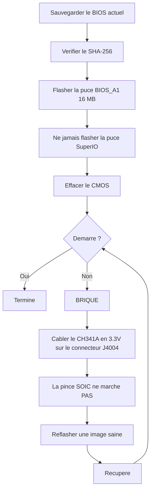

> 🌐 Traduction communautaire. La [version anglaise](../en/08-bios.md) fait foi et peut être plus à jour. Une erreur ? [Ouvrez une issue](https://github.com/lildebil0/awesome-bc250/issues).

# BIOS & récupération de brique

> **En bref** — Un mauvais réglage du BIOS peut **briquer définitivement le BC-250**, et sur cette carte un effacement du CMOS ne le *récupère pas* toujours ([src](https://t.me/c/2424231195/54971)). Avant de flasher *quoi que ce soit*, comprenez ceci : il vous faut un **kit de récupération matériel** (un **programmateur SPI de classe CH341A + des câbles DuPont femelle-femelle**) sous la main, car la seule remise en état fiable est de re-flasher la puce en externe via le connecteur **J4004** de la carte. Le mod communautaire populaire (le BIOS « death », dernière version basée sur le stock **5.00**) déverrouille l'overclocking, les timings GDDR6 et l'allocation mémoire iGPU — utile, mais **tous les paramètres ne sont pas sûrs, et certains briquent la carte instantanément** ([src](https://t.me/c/2424231195/78922)). Vérifiez d'abord le **SHA-256** de chaque image, et lisez [`assets/firmware/DISCLAIMER.md`](../../assets/firmware/DISCLAIMER.md). **Ne flashez pas à la légère.**

⚠️ **C'est le chapitre le plus dangereux du manuel.** Le flashage est destructif et irréversible sans matériel de récupération. Si vous n'êtes pas prêt à souder/clipser sur une puce SPI pour ranimer une brique, **arrêtez-vous ici et faites tourner le BIOS d'origine.**

---

## Ce qu'est le BIOS sur le BC-250

Le BC-250 est une carte de minage/serveur fabriquée par AsRock embarquant un APU PS5 « Oberon » bridé. Son firmware UEFI réside sur une **puce flash SPI de 16 MB** (un Winbond **W25Q128** / Macronix MX25L128 dans un boîtier SOIC 8 broches). Le firmware d'origine est fortement verrouillé : presque rien d'utile n'est exposé dans le Setup. Les versions d'origine connues vues dans le chat sont **3.00** et **5.00** ; les BIOS moddés sont reconstruits à partir de celles-ci (le numéro de version est votre point de repère — notez toujours sur quelle base un mod est construit).

> La version stock **4.00** existe également. La seule différence fonctionnelle entre la version stock **v4.0** et **v5.0** est que v5.0 active le **démarrage réseau** par défaut. ([src](https://discord.com/channels/1315924807128449065/1316030225338863636/1326825429595848816))

Deux raisons poussent les gens à reflasher :

1. **Pour installer un BIOS moddé** qui déverrouille des menus cachés (overclock, undervolt, mémoire, VRAM iGPU).
2. **Pour récupérer une brique** — restaurer une image saine après un mauvais réglage ou un flash raté.

> 💡 **Vous n'avez peut-être pas besoin de flasher du tout.** Si votre *seul* but est de changer la répartition VRAM/UMA, vous pouvez le faire depuis un Linux en cours d'exécution sur le BIOS **d'origine** P3.00 / P5.00 avec **[fanoush/bc250_memcfg](https://github.com/fanoush/bc250_memcfg)** — sans flashage, sans programmateur, sans risque de brique ([elektricM: BIOS flashing](https://elektricm.github.io/amd-bc250-docs/bios/flashing/), [elektricM: VRAM](https://elektricm.github.io/amd-bc250-docs/bios/vram/)). Flasher un BIOS moddé n'est nécessaire que pour les *menus chipset déverrouillés* et les fonctionnalités au-delà du dimensionnement de la VRAM (voir [09-overclock-undervolt.md](09-overclock-undervolt.md) pour la commande `bc250_memcfg`).

---

## Le BIOS moddé (le mod « death ») — ce qu'il change et pourquoi

Le mod communautaire de référence est maintenu par **death** dans le chat. Ce n'est *pas* un firmware repartant de zéro — il réactive (réaffiche) des options Setup AMD/AMI que le BIOS d'origine livre masquées. Suivez les versions, car les conseils ont changé au fil du temps :

| Version du mod | Base | Publié | Ce qu'il expose / change | Statut |
|---|---|---|---|---|
| **1.0** (première version) | stock **3.00** | 2025-06-28 | Fréquence GDDR6, timings GDDR6, taille mémoire UMA iGPU, fréquence des cœurs, tensions | ⚠️ De mauvaises valeurs briquent la carte, **l'effacement du CMOS n'a pas aidé** ([src](https://t.me/c/2424231195/54971)) |
| Variantes 3.0 | 3.00 | 2025-07 → 10 | Mêmes déverrouillages ; une build a ajouté un **logo de démarrage Steam personnalisé** | Build cosmétique du logo mirroré sous `bc250-Steam.rom` ([src](https://t.me/c/2424231195/86420)) |
| **Mod 5.00** (actuel) | stock **5.00** | 2025-10-05 | Onglets regroupés ; **plus de paramètres ouverts** ; **les réglages de timing RAM/GDDR6 s'appliquent désormais réellement** sur cette carte | Le plus récent ; « tous les paramètres ne sont pas utiles, mais c'est mieux que rien » ([src](https://t.me/c/2424231195/78922)) |

Ce que vous pouvez réellement régler avec lui (d'après les notes de première version, [src](https://t.me/c/2424231195/54971)) :

- **Fréquence GDDR6** — signalée fonctionnelle à **1800** pour un utilisateur (`@Haswellb`), mais le *même genre de changement a briqué une autre carte* — les valeurs sont spécifiques à la carte, pas universelles.
- **Timings GDDR6** — ils s'appliquent, mais des **timings trop bas/trop serrés briquent** la carte.
- **Taille mémoire iGPU (UMA)** — fonctionne et donne un vrai gain. Si votre changement ne prend pas effet, réglez **IGC : Forces** et **UMA Mode : UMA_SPECIFIED** ([src](https://t.me/c/2424231195/54971) ; même combinaison confirmée par la documentation communautaire).
- **Fréquence des cœurs / tensions** — exposées mais **« non testées »** par l'auteur.

> ❗ **Deux avertissements de l'auteur, toujours d'actualité :** (1) **Ne désactivez pas Integrated Graphics** — c'est la seule sortie d'affichage. (2) Sur n'importe lequel de ces mods, **un mauvais réglage peut briquer la carte et une réinitialisation du CMOS peut ne pas la récupérer** — c'est exactement pourquoi il vous faut un programmateur. (Voir l'échelle « quelle version ? » ci-dessous pour choisir une base.)

> ### Quelle version ? (échelle de décision)
>
> 1. **P3.00 moddé (ROM menu-chipset) — le choix sûr par défaut.** C'est le **« standard communautaire… le plus stable et le plus testé »** établi, vérifié-public avec un SHA-256 connu, et il couvre déjà le **déverrouillage VRAM + les réglages chipset**. Commencez ici sauf raison spécifique de ne pas le faire ([elektricM: BIOS flashing](https://elektricm.github.io/amd-bc250-docs/bios/flashing/)).
> 2. **5.00 moddé — actuel ; choisissez-le si vous voulez régler la mémoire.** C'est la base la plus récente et celle où **les réglages de timing RAM/GDDR6 s'appliquent réellement** sur cette carte ([src](https://t.me/c/2424231195/78922)). Choisissez-le plutôt que P3.00 spécifiquement quand vous voulez régler les timings mémoire.
> 3. **`P5.00_clv` — expert uniquement.** Il « déverrouille **Tout** » (chaque menu caché, y compris le **ReBAR / Resizable BAR** expérimental et les réglages debug/chipset), ce qui rend *« très facile de briquer la carte si vous changez la mauvaise chose… Restez sur P3.00 sauf si vous êtes un utilisateur avancé. »* Pire, **`P5.00_clv` n'est dans aucun dépôt public** que le guide a pu trouver — il ne circule que comme pièce jointe Discord, donc **il n'y a pas de hash canonique** ; si vous devez l'utiliser, récupérez des copies auprès de **deux** personnes le faisant tourner indépendamment et confirmez que les deux ont le **même SHA-256** avant de flasher ([elektricM: BIOS flashing](https://elektricm.github.io/amd-bc250-docs/bios/flashing/)).

> **Particularités du 5.00 moddé à connaître.** Son Setup affiche une **fréquence CPU par défaut de 3600** — une valeur d'interface purement cosmétique, pas une horloge appliquée ([src](https://discord.com/channels/1315924807128449065/1452152658168381593/1452406964780007515)). Il propose également une option de **bifurcation PCIe `x1x1x1x1`** dans les paramètres du chipset ([src](https://discord.com/channels/1315924807128449065/1452152658168381593/1474231812598534351)). Soyez particulièrement prudent avec les timings mémoire sur cette base : **des valeurs de timings extrêmes peuvent bricker la carte jusqu'à un flashage externe, et cela fait encore plus mal sur P5.00** ([src](https://discord.com/channels/1315924807128449065/1371527281947971604/1468745940994101372)). Et comme pour tout flashage, passer au 5.00 moddé peut vous laisser sans **aucun affichage jusqu'à ce que vous fassiez un clear CMOS** ([src](https://discord.com/channels/1315924807128449065/1315933088668454942/1508568321346502892)).

Il existe aussi un **mod menu-chipset** distinct (`BC250_3.00_CHIPSETMENU.ROM`) issu du dépôt BIOS le plus référencé, **[TuxThePenguin0/bc250-bios](https://gitlab.com/TuxThePenguin0/bc250-bios/)**, qui expose le **menu chipset / NBIO Common Options** par-dessus le stock 3.00. Le README de ce dépôt dit clairement : *« Rien dans ce dépôt n'est supporté ni n'a la moindre garantie — FAITES DES SAUVEGARDES. »*

> 🚫 **Évitez `Smokeless_UMAF`.** Le guide communautaire d'overclocking signale cet outil d'édition UEFI comme une chose **à ne pas faire tourner sur le BC-250 — il peut causer des dommages permanents à la carte** ([elektricM: BIOS overclocking](https://elektricm.github.io/amd-bc250-docs/bios/overclocking/)). Restez sur les ROM saines ci-dessus.

---

## Avant de flasher — la liste de vérification de sécurité

1. **Sauvegardez d'abord votre BIOS actuel** (lisez-le avec le même outil que celui dont vous flasherez — voir Chemin B/récupération). Une sauvegarde est votre annulation gratuite.
2. **Vérifiez le SHA-256** de l'image par rapport à `assets/PROVENANCE.md` / au post source. Le guide communautaire de flashage publie le hash de la ROM menu-chipset comme
   `48fbe5d366e6a56e2fdffdca848426216ba1f083610dab63db89d2f4e6c940b5` ([elektricm docs](https://elektricm.github.io/amd-bc250-docs/bios/flashing/)).
3. **Confirmez la taille de la puce**, pas seulement le marquage. La puce BIOS de 16 MB est la cible ; **ne flashez pas** la petite puce SuperIO (voir la section récupération). Différentes révisions de carte peuvent porter des références de puce légèrement différentes — c'est la **capacité (16 MB)** qui compte, les dernières lettres du marquage peuvent différer ([src](https://t.me/c/2424231195/67880)).
4. **Ayez le matériel de récupération prêt** *avant* le premier flash, pas après avoir briqué.
5. Après le flash, **effacez le CMOS** pour que les nouveaux paramètres (surtout l'allocation VRAM) prennent effet (voir « Après chaque flash »).



### Vérifiez la somme de contrôle avant de flasher

L'étape 2 ci-dessus dit de vérifier le SHA-256 — voici comment. Calculez le hash du fichier que vous êtes sur le point de flasher et comparez-le, caractère par caractère, à la valeur listée pour ce fichier dans [`assets/PROVENANCE.md`](../../assets/PROVENANCE.md).

```bash
# Linux:
sha256sum BC250_3.00_CHIPSETMENU.ROM
```

```powershell
# Windows (PowerShell):
Get-FileHash BC250_3.00_CHIPSETMENU.ROM -Algorithm SHA256
```

`PROVENANCE.md` peut ne lister que les **16 premiers caractères hexadécimaux** comme empreinte courte. Si c'est le cas, vérifiez que votre hash calculé **commence par** ces 16 caractères — une correspondance complète de ce préfixe est déjà une vérification solide (le mainteneur peut publier les hash complets sur demande).

**Empreintes SHA-256 complètes vérifiées** pour les images hébergées publiquement (recoupées sur plusieurs dépôts communautaires — chaque fichier BIOS BC-250 sain fait **exactement 16 MB / 16777216 bytes** ; une taille différente signifie qu'il est corrompu, qu'il s'agit d'un outil/patch, ou sans rapport) ([elektricM: BIOS flashing](https://elektricm.github.io/amd-bc250-docs/bios/flashing/)) :

| Fichier | Type | SHA-256 |
|---|---|---|
| `BC250_3.00_CHIPSETMENU.ROM` (alias `Robin3.00`, `BC250CHIPSETMENU.ROM`) | **P3.00 moddé** — déverrouillage VRAM + chipset, *recommandé* | `48fbe5d366e6a56e2fdffdca848426216ba1f083610dab63db89d2f4e6c940b5` |
| `Robin5.00` | **Stock** P5.00 (pas le `P5.00_clv` moddé) | `0d6f136cb120cf3b2de26d5c4d7f255604fdbf4b9442af5ba55419b95b89aa82` |
| `BC250_3.00.ROM` | Stock P3.00 | `07595ca3aecf8a4caa28a397b5298f3946a1b769f87b16f67adc369c3f69045c` |
| `BC250_2.00.bin` | Stock P2.00 | `ee6150dfed33bd05ea46063a352549416fdf3f45fa0e5edac2a68ef78d71083c` |
| `P5.00_clv` | P5.00 moddé (tout déverrouiller) | **aucun hash public n'existe** — Discord uniquement, vérifiez que deux copies indépendantes correspondent |

> Le P3.00 moddé apparaît sous plusieurs noms de fichiers selon les dépôts (`BC250_3.00_CHIPSETMENU.ROM`, `BC250CHIPSETMENU.ROM`, `Robin3.00`) — ils ont tous le même hash que la valeur ci-dessus, donc le nom n'a pas d'importance. `Robin5.00` est le P5.00 **d'origine**, un *fichier différent* du `P5.00_clv` moddé. Les sources publiques de chacun (TuxThePenguin0 GitLab, forgenam, tipitochen, csabakecskemeti, scrakcho, dannybastos, kenavru, MrrZed0) sont listées dans le [guide de flashage elektricM](https://elektricm.github.io/amd-bc250-docs/bios/flashing/).

> 🔴 **Si la somme de contrôle ne correspond pas, NE FLASHEZ PAS.** Une non-correspondance signifie un fichier corrompu ou erroné — le flasher est exactement la façon dont vous briquez la carte. Re-téléchargez l'image et vérifiez à nouveau.

---

## Chemin A — Flash logiciel (depuis la carte, sans programmateur)

C'est la façon normale d'installer/mettre à jour un BIOS tant que la carte démarre encore. Utilisez une **clé USB FAT32** et l'utilitaire de mise à jour firmware AMI.

**Méthode EFI / AFU** ([src](https://t.me/c/2424231195/54979)) :

1. Formatez une clé USB en **FAT32**.
2. Copiez le contenu de l'archive AFU (par ex. `AfuEfi64_5.16.zip`) **et le fichier BIOS** dessus.
3. Redémarrez le BC-250 et **démarrez depuis la clé USB** dans le shell EFI.
4. Lancez :
   ```
   afuefix64.efi <filename>.<ext> /P /N
   ```
   - `/P` = programmer le BIOS principal.
   - `/N` = programmer aussi la **NVRAM**. Cela évite les erreurs lors du passage *entre* versions (par ex. vers 3.00 depuis une autre version) — **mais cela efface vos paramètres enregistrés.** Vous pouvez omettre `/N`, mais attendez-vous alors à d'éventuelles erreurs. ([src](https://t.me/c/2424231195/54979))
5. Si l'outil ne voit pas le fichier, essayez `fs0:`, `fs1:`, … pour trouver lequel est la clé ([src](https://t.me/c/2424231195/54979)).

Certaines builds communautaires fournissent un script `Flash.nsh` prêt à l'emploi et une ROM renommée (par ex. renommez la ROM moddée pour correspondre au script) de sorte qu'il vous suffit de démarrer dans le shell EFI et de lancer le script ([elektricm docs](https://elektricm.github.io/amd-bc250-docs/bios/flashing/)). Sous Linux il existe aussi une build **`afulnx`** (`afulnx-5.05.04Z.tar.gz`) pour flasher depuis un système en cours d'exécution ([src](https://t.me/c/2424231195/54507)).

#### Recette canonique du shell EFI (la méthode `Flash.nsh` / `Robin5.00`)

Le guide communautaire de flashage standardise sur un kit autonome et un nom de fichier fixe — c'est le chemin USB le plus reproduit ([elektricM: BIOS flashing](https://elektricm.github.io/amd-bc250-docs/bios/flashing/)) :

1. **Récupérez le kit EFI :** `4U12G BIOS Update.zip` (du dépôt [kenavru/BC-250](https://github.com/kenavru/BC-250)) — il contient `AfuEfix64.efi`, `Flash.nsh` et `amdvbflash.efi`. *Il embarque aussi un BIOS P5.00 d'origine nommé `Robin5.00` — écartez-le pour ne pas le flasher par accident.*
2. **Préparez une clé FAT32 (≤ 32 GB recommandé).** Copiez le contenu du dossier `BIOS EFI` du kit à la **racine**.
3. **Renommez votre ROM moddée en `Robin5.00`** (supprimez l'extension `.ROM`) — c'est le nom exact que `Flash.nsh` recherche. *(Ou éditez `Flash.nsh` pour correspondre à votre nom de fichier à la place.)* La racine doit alors contenir : `AfuEfix64.efi`, `Flash.nsh`, `amdvbflash.efi`, `Robin5.00` (votre mod renommé) et le dossier `EFI`.
4. **Utilisez un moniteur DisplayPort direct.** Les **adaptateurs HDMI actifs/passifs peuvent faire écran noir sur le menu BIOS** — un piège d'affichage connu sur cette carte.
5. **Débranchez tous les SSD/disques** pour que la carte tombe automatiquement dans le shell EFI, insérez la clé, allumez. Vous arrivez à une invite jaune `Shell>`.
6. À l'invite tapez **`blk0:`** puis Entrée — **notez l'espace après les deux-points** (cela sélectionne le volume USB ; `blk0:` est le sélecteur documenté par elektricM, distinct du sondage `fs0:`/`fs1:` ci-dessus). Tapez ensuite **`Flash.nsh`** et Entrée.
7. **ATTENDEZ. Ne touchez pas au clavier, n'éteignez pas.** Si cela *semble* se figer pendant l'écriture, **attendez au moins 15 minutes** — éteindre en pleine écriture brique la carte. Elle redémarre (ou vous demande de le faire) une fois terminé.
8. **Éteignez immédiatement et retirez la clé** pour qu'elle ne reboucle pas dans le flasheur.

> 🔴 **Avant d'allumer pour flasher : vérifiez le câblage d'alimentation PCIe 8 broches** par rapport au schéma 12 V/GND de votre alimentation. **Une polarité inversée peut endommager définitivement la carte** ([elektricM: BIOS flashing](https://elektricm.github.io/amd-bc250-docs/bios/flashing/)).

#### Paramètres BIOS requis après le flash (à faire juste après l'effacement du CMOS)

Après le flash **et** l'effacement du CMOS (section suivante), entrez dans le Setup (martelez **Del**) et réglez ceci — la répartition VRAM ne se comportera pas correctement tant qu'ils ne sont pas justes ([elektricM: BIOS flashing](https://elektricm.github.io/amd-bc250-docs/bios/flashing/), [elektricM: BIOS VRAM](https://elektricm.github.io/amd-bc250-docs/bios/vram/)) :

| Paramètre | Chemin | Valeur |
|---|---|---|
| Integrated Graphics Controller | Chipset → GFX Configuration | **Forces** |
| UMA Mode | Chipset → GFX Configuration | **UMA_SPECIFIED** |
| UMA Frame Buffer Size | Chipset → GFX Configuration | **512MB** (recommandé) ou une taille fixe |
| IOMMU | Advanced → CPU Configuration | **Disabled** |
| Boot Mode | Boot → Boot Mode | **UEFI** |

Vérifiez d'abord que l'effacement du CMOS a réellement pris — l'**horloge devrait afficher une heure erronée** ; si elle est encore correcte, recommencez l'effacement. Puis F10 pour sauvegarder. Le choix `512MB` est une allocation *dynamique*, pas un plafond de 512 MB (voir [09-overclock-undervolt.md](09-overclock-undervolt.md)).

> ★ **Pourquoi 512 MB d'UMA *gagne* des FPS (le mécanisme).** Régler le buffer UMA à **512 MB** n'affame pas le GPU — cela laisse le système **équilibrer dynamiquement RAM et VRAM** au lieu de verrouiller une grosse tranche fixe à l'écart, et ce rééquilibrage à lui seul a été crédité d'un vrai bond de FPS : Cyberpunk 2077 est passé de **60 → 66 fps (à 2 GHz OC) → 76 fps** sous FSR 3.0 *balanced*, 1080p, preset Steam-Deck ([Old Lamer — Part I](https://youtu.be/ohpEY2XQ_lo) ~11:21 ; ⚠ approx — chiffres transcrits depuis la vidéo, à traiter comme le résultat d'une seule build). Donc « 512 MB c'est le mieux » n'est pas qu'un dimensionnement sûr — le petit buffer dynamique *fait partie* de l'histoire de la performance, pas d'un compromis.

**Repli flashrom** (si l'AFU plante) ([src](https://t.me/c/2424231195/54979), suggéré & testé par `@mrartemsid`) :

```bash
# Read (back up):
sudo flashrom -p internal:boardmismatch=force -r <name>.bin
# Write:
sudo flashrom -p internal:boardmismatch=force -w <name>.bin
```

> ⚠️ Le flashage logiciel n'aide que **tant que la carte POST encore**. Au moment où un mauvais réglage la brique, le Chemin A disparaît et vous êtes sur le chemin matériel ci-dessous.

---

## Chemin B — Flash matériel / débriquage (programmateur SPI CH341A)

C'est le chemin de **récupération**, et la « façon la plus pratique de flasher une brique » épinglée ([src](https://t.me/c/2424231195/67880)). Vous réécrivez la puce SPI de 16 MB directement, depuis un autre PC, à l'aide d'un programmateur SPI USB. Logiciel utilisé : **NeoProgrammer** (Windows) ou **flashrom** (Linux).

> 🔴 **La pince SOIC 8 broches NE fonctionne PAS sur cette carte.** death est sans détour à ce sujet : *« la pince sur notre carte fonctionne… en gros pas du tout. »* ([src](https://t.me/c/2424231195/67880)). Note : `assets/firmware/DISCLAIMER.md` mentionne une « pince SOIC » de manière générique — en pratique vous devez **câbler sur le connecteur J4004 de la carte à la place.** C'est le fait de récupération le plus important de ce chapitre.

### Brochage du connecteur J4004 (câblez ici)

La carte expose un **connecteur J4004 au pas de 2,54 mm** spécifiquement pour reflasher la puce SPI/BIOS. Brochage (d'après la capture de câblage épinglée, [src](https://t.me/c/2424231195/67880)) :

```
J4004
[ GND  SCLK  MOSI  UNK ]
[ VCC  CS    MISO      ]
   ^  (pin-1 marker)
```

| Broche J4004 | Signal | Pastille CH341A |
|---|---|---|
| VCC | alimentation 3.3 V | VDD / 3.3V |
| GND | masse | GND |
| CS | chip select | CS / SS |
| SCLK | horloge | CLK / SCK |
| MOSI | données entrantes (vers la puce) | MOSI |
| MISO | données sortantes (depuis la puce) | MISO |

La **carte de couleurs W25Q128 SOIC-8 / CH341A** correspondante est dans la même capture épinglée — faites correspondre `/CS, DO(MISO), CLK, DI(MOSI), VCC, GND` aux pastilles `CS, MISO, CLK, MOSI, VDD, GND` du CH341A. **Vérifiez trois fois VCC et GND** avant d'allumer ; les inverser tue la puce ([src](https://t.me/c/2424231195/67880)).

> **Numérotation des broches J4004 & les deux broches inconnues.** Le guide elektricM numérote le connecteur VCC=1, GND=2, CS=3, SCLK=4, MISO=5, MOSI=6, avec les **broches 7 & 8 inutilisées pour le flashage — elles sont mises à la masse via des résistances de 10 kΩ.** La broche 1 (VCC) est marquée par une **flèche `>` ou une pastille carrée** sur le PCB ([elektricM: BIOS flashing](https://elektricm.github.io/amd-bc250-docs/bios/flashing/)).

> **Puce cible exacte & la coquille sur la densité.** La pièce de 16 MB est un Winbond **W25Q128JVSQ** (128 Mbit / 16 MB) ou, sur certains lots, un Macronix **MX25L12835F**. Certaines docs communautaires font la coquille **« 25Q168 » — c'est faux** ; le bon code de densité 16 MB est **128** ([elektricM: BIOS flashing](https://elektricm.github.io/amd-bc250-docs/bios/flashing/)). Si vous flashez via une simple **pince SOIC-8** au lieu de J4004, l'ordre des broches de la puce elle-même suit le layout SPI standard : `1 CS · 2 DO · 3 WP · 4 GND · 5 DI · 6 CLK · 7 HOLD · 8 VCC` ([elektricM: BIOS recovery](https://elektricm.github.io/amd-bc250-docs/bios/recovery/)) — mais rappelez-vous le constat de death selon lequel **la pince ne fonctionne quasiment pas sur cette carte**, donc préférez J4004.

> 🙏 Crédit : le brochage J4004, la rétro-ingénierie et le dépôt d'images firmware moddé sont en grande partie le travail de **Segfault** (la ROM menu-chipset P3.00 est le « mod Segfault ») ([elektricM: BIOS flashing](https://elektricm.github.io/amd-bc250-docs/bios/flashing/)).

### Procédure NeoProgrammer (épinglée) ([src](https://t.me/c/2424231195/67880))

1. Connectez le programmateur à **J4004** avec des câbles femelle-femelle selon le brochage. **Vérifiez le câblage ~10×, surtout VCC et GND.** (Alimentation débranchée.)
2. Ouvrez **NeoProgrammer**.
3. Lancez l'**auto-détection** de la puce, et lisez aussi le marquage sur la puce elle-même.
4. **Comparez les marquages.** Si les dernières lettres diffèrent de la liste mais que la **capacité correspond (16 MB)**, c'est bon.
5. **Effacez** la puce.
6. **Ouvrez le fichier BIOS** dans le logiciel (le glisser-déposer fonctionne).
7. **Écrivez** la puce.
8. **Débranchez les câbles de J4004.**
9. Allumez la carte.

### Équivalent flashrom (Linux), recoupé avec la documentation communautaire

Le guide communautaire de flashage utilise un programmateur **CH347** et met en garde contre les cartes CH341A bon marché à PCB noir (section suivante). Identifiez la bonne puce — ciblez la **puce BIOS de 16 MB** (`BIOS_A1`), **jamais** le SuperIO de 512 KB (`SIO1_R`), qui brique le SuperIO si flashé ([elektricm docs](https://elektricm.github.io/amd-bc250-docs/bios/flashing/)) :

```bash
# Detect / identify the chip:
sudo flashrom -p ch347_spi

# Back up the stock BIOS (twice, then diff to be sure the read is stable):
sudo flashrom -p ch347_spi -r backup_stock.bin
sudo flashrom -p ch347_spi -r backup_verify.bin

# Write the new image, then verify it read back identical:
sudo flashrom -p ch347_spi -w BC250_3.00_CHIPSETMENU.ROM
sudo flashrom -p ch347_spi -v BC250_3.00_CHIPSETMENU.ROM
```

(Utilisez `-p ch341a_spi` pour un CH341A, ou `serprog` pour un Raspberry Pi Pico, à la place de `ch347_spi`.) ⚠ La correspondance `ch347_spi` / `serprog` pour le câblage exact de *cette* carte provient du guide communautaire — `⚠ verify` par rapport à votre propre modèle de programmateur.

> **La détection vous dit sur quelle puce vous êtes.** Si `flashrom -p …` rapporte **`Winbond W25Q128…`** ou **`Macronix MX25L128…`**, vous êtes sur la bonne puce BIOS de 16 MB. S'il rapporte **`Macronix MX25L4005…` (512 KB)**, **STOP — vous êtes connecté à la puce SuperIO** (`SIO1_R`) ; la flasher brique le contrôle des ventilateurs/capteurs. Passez à l'autre puce ([elektricM: BIOS flashing](https://elektricm.github.io/amd-bc250-docs/bios/flashing/)). Flashez avec l'**alimentation débranchée de la prise murale** et les condensateurs déchargés (tapotez le bouton d'alimentation quelques fois) — alimenter la carte pendant un flash à la pince n'est *pas* recommandé ([elektricM: BIOS recovery](https://elektricm.github.io/amd-bc250-docs/bios/recovery/)).

### Le piège du 3.3 V du CH341A (lisez ceci ou vous cuirez la puce)

De nombreux programmateurs **CH341A à PCB noir** bon marché pilotent leurs **lignes de données à 5 V même si VCC est à 3.3 V** — la puce BIOS du BC-250 est une pièce **3.3 V**, donc 5 V sur les lignes de données peuvent l'endommager. C'est un défaut connu et mesuré sur certaines cartes (la carte de Fabian, et une identique dans le chat, ont été confirmées par mesure de tension) ([src](https://t.me/c/2424231195/100285)). Correctifs :

- Préférez un programmateur réellement à 3.3 V sur ses lignes de données (par ex. **CH347**), **ou**
- Appliquez le **correctif sans soudure CH341A 5V→3.3V sur les lignes de données** : coupez la ligne d'alimentation USB 5 V vers la puce et alimentez-la en 3.3 V à la place — voir le [tutoriel sawyershepherd.org](https://sawyershepherd.org/post/solderless-ch341ab-fix-5v-to-33v-data-lines/) et le [correctif CH341A wej.k.vu](https://wej.k.vu/electronics/ch341a-mini-programmer-fix/) ([src](https://t.me/c/2424231195/100285)).

---

### Connecteurs bas niveau, debug & silicium embarqué

Au-delà du connecteur de flash J4004 ci-dessus, la carte porte plusieurs autres connecteurs et un ensemble connu de puces embarquées. Ils sont rétro-conçus dans la documentation matérielle elektricM et sont utiles pour effacer le CMOS, sonder en debug, câbler les ventilateurs et confirmer quelle puce est laquelle avant de flasher. Valeurs de broches transcrites textuellement depuis ([elektricM: pinouts](https://elektricm.github.io/amd-bc250-docs/hardware/pinouts/)).

**CLRCMOS1 — cavalier d'effacement du CMOS (3 broches).** C'est le cavalier référencé partout dans ce chapitre comme « shunter le cavalier CMOS » — voici sa carte :

| Position | Comportement |
|---|---|
| Broches 1–2 | La CR2032 alimente le CMOS (par défaut) |
| Broches 2–3 | Effacer le CMOS |

> 💡 Quand la [liste de vérification après-flash](#avant-de-flasher--la-liste-de-vérification-de-sécurité) et [« Après chaque flash »](#après-chaque-flash--effacez-le-cmos-ne-sautez-pas-cette-étape) vous disent de « shunter le cavalier CMOS pendant ~20 secondes », **CLRCMOS1** est ce cavalier : déplacez-le des broches 1–2 vers les broches 2–3, attendez, puis remettez-le. (Retirer la CR2032 pendant 60+ s est l'alternative.)

**TPMS1 — connecteur de debug LPC (18 broches, pas de 2,0 mm) :**

| Broche | Signal | Broche | Signal |
|---|---|---|---|
| 1 | PCICLK | 2 | GND |
| 3 | FRAME | 4 | SMB_CLK_MAIN |
| 5 | PCIRST# | 6 | SMB_DATA_MAIN |
| 7 | LAD3 | 8 | LAD2 |
| 9 | 3V | 10 | LAD1 |
| 11 | LAD0 | 12 | GND |
| 13 | (vide) | 14 | S_PWRDWN# |
| 15 | 3VSB | 16 | SERIRQ# |
| 17 | GND | 18 | GND |

> 💡 **La broche 9 (3V) n'est sous tension que lorsque la carte est allumée** — elle fonctionne donc comme un signal de détection « système-allumé ». Cela en fait un point de mesure alternatif pour les montages auto-allumage / adaptateur ATX véritable (référence croisée avec le [cavalier `AUTO_PWRON` dans 03-power-supply.md](03-power-supply.md)).

**J2 — connecteur de debug JTAG/HDT (20 broches, pas de 1,27 mm, non peuplé, au dos de la carte) :**

| Broche | Signal | Broche | Signal |
|---|---|---|---|
| 1 | VDDIO | 2 | TCK |
| 3 | GND | 4 | TMS |
| 5 | GND | 6 | TDI |
| 7 | GND | 8 | TDO |
| 9 | TRST_L | 10 | PWROK_BUF |
| 11 | DBRDY3 | 12 | RESET_L |
| 13 | DBRDY2 | 14 | DBRDY0 |
| 15 | DBRDY1 | 16 | DBREQ_L |
| 17 | GND | 18 | TEST19 |
| 19 | VDDIO | 20 | TEST18 |

> TEST18, TEST19 et DBRDY0 sont laissées flottantes. C'est la **seule** interface de reset/debug matérielle de la carte.

**I2C_HEADER1 (3 broches) :** `SCL · SDA · GND`. SCL est la broche **la plus proche des connecteurs d'alimentation**. Ce bus transporte le **PMBUS vers les PMIC Intersil** — un point d'accès à la télémétrie d'alimentation.

**CPU_FAN1 (4 broches) :** `PWM · Tach · 12V · GND`.

**J4003 — connecteur multi-ventilateurs (16 broches, 2×8, 2,54 mm) :**

| Rangée 1 | 1 GND | 2 F1T | 3 F2T | 4 F3T | 5 F4T | 6 F5T | 7 DET | 8 (vide) |
|---|---|---|---|---|---|---|---|---|
| **Rangée 2** | 1 GND | 2 F1P | 3 F2P | 4 F3P | 5 F4P | 6 F5P | 7 GND | 8 GND |

Ici `T` = tach et `P` = PWM, par ventilateur 1–5.

> 💡 **DET (rangée 1, broche 7) est mis à la masse lorsque la carte repose sur une carte ventilateur / de distribution d'alimentation** — c'est-à-dire qu'elle détecte le support. (La numérotation des ventilateurs BIOS↔Linux est traitée dans [06-linux.md → Sensors & fan control](06-linux.md#sensors--fan-control) ; elle n'est pas dupliquée ici.)

**Silicium embarqué (BOM).** Le dépôt nomme déjà `SIO1_R` et `BIOS_A1` dans les sections de flashage mais n'a jamais donné de références ni de tailles ; ce tableau permet à un flasheur de confirmer quelle puce est laquelle (le Winbond de 16 MiB est le BIOS, le Macronix de 512 KiB est le SuperIO — n'y touchez pas) :

| Repère | Pièce | Rôle |
|---|---|---|
| PUA1 | Intersil ISL69247 | PMIC principal |
| PUIO1 | Intersil ISL95712 | PMIC d'alimentation des cœurs |
| PUA11… | Intersil ISL99360 | Étages de puissance intelligents (phases) |
| M2U2 | NXP CBTL04083B | Mux PCIe x4 2:1 |
| U30 | Realtek RTL8111H | Carte réseau Ethernet (PCIe x1) |
| SU1 | AMD 218-0844029 | Chipset FCH A68H « Bolton-D2H » |
| UIO1 | Nuvoton NCT6686D | SuperIO (la puce capteur hwmon) |
| BIOS_A1 | Winbond 25Q128JVSQ | Flash SPI 16 MiB = le **BIOS** (flashez CELLE-CI) |
| SIO1_R | Macronix MX25L4006E | Flash SPI 512 KiB = programme SuperIO (**ne PAS flasher — brique le SuperIO**) |

> La puce capteur SuperIO nommée ici (Nuvoton **NCT6686D**) est celle à laquelle se lie le pilote Linux `nct6687`/`nct6683` — voir [06-linux.md](06-linux.md) pour la configuration capteurs/ventilateurs.

**Outils de firmware (avancé).** Deux utilitaires reviennent régulièrement pour analyser l'image :

- **`psptool`** inspecte et extrait les blobs de firmware AMD à l'intérieur d'un dump de BIOS. `psptool -E bios.bin` liste les entrées ; `psptool -X -d 0 -e 1 -o firmware.bin bios.bin` extrait le firmware SMU pour analyse. ([bc250-collective/amd_smu_reverse_engineering](https://github.com/bc250-collective/amd_smu_reverse_engineering))
- **`Zentool`** patche le microcode du processeur — par exemple pour remplacer l'instruction `RDRAND`. ([AMD-BC-250/documentation #1](https://github.com/AMD-BC-250/documentation/issues/1))

---

## Secure Boot & CSM (prérequis de démarrage)

Ajoutez ces deux-là à la liste des prérequis de configuration du BIOS — requis sinon **les noyaux personnalisés/patchés ne démarreront pas** (le patch 40-CU, le patch de fréquence, etc.) :

| Paramètre | Valeur |
|---|---|
| Secure Boot | **Disabled** |
| CSM (Compatibility Support Module) | **Disabled** |

Source : [elektricM: boot troubleshooting](https://elektricm.github.io/amd-bc250-docs/troubleshooting/boot/).

---

## L'idée d'auto-reset « srep » (expérimental — pas une fonctionnalité finie)

Parce qu'un mauvais réglage peut briquer la carte et que **l'effacement du CMOS ne le corrige pas**, death a expérimenté l'intégration d'une routine **`srep`** dans le BIOS pour **réinitialiser automatiquement les paramètres sur une brique** — idée venant à l'origine de `@Jacky_Fish` ([src](https://t.me/c/2424231195/60552)). Le concept : faire en sorte que le BIOS remette ses variables NVRAM/`amdsetup` aux valeurs par défaut, optionnellement seulement quand des fichiers déclencheurs sont présents sur une clé USB (afin qu'il n'efface pas vos paramètres à chaque démarrage). À la date du chat, **cela ne fonctionnait pas encore** — *« la carte s'obstine à faire la brique complète et rien ne se réinitialise »* ([src](https://t.me/c/2424231195/60883)). Traitez toute affirmation de « BIOS auto-réparateur » comme **non prouvée** ; votre vrai filet de sécurité reste le programmateur externe. `⚠ verify` avant de compter sur une build srep quelconque.

---

## Après chaque flash — effacez le CMOS (ne sautez pas cette étape)

Flasher le BIOS ne réinitialise **pas** les paramètres stockés, et plusieurs paramètres (notamment l'**allocation VRAM/UMA**) ne s'appliqueront réellement que lorsque vous effacez le CMOS. Un utilisateur a rencontré exactement ceci : le BIOS affichait la nouvelle taille de VRAM et l'avait « sauvegardée », mais l'OS (Bazzite) signalait toujours l'ancienne répartition 4 GB RAM / 12 GB VRAM jusqu'à l'effacement du CMOS ([src](https://t.me/c/2424231195/97290)). Comment effacer :

- **Retirez la pile bouton CR2032 pendant 60+ secondes** (recommandé), **ou**
- **Shuntez le cavalier CMOS pendant ~20 secondes.** ([elektricm docs](https://elektricm.github.io/amd-bc250-docs/bios/flashing/))

> Notez la limite : l'effacement du CMOS corrige « les paramètres ne se sont pas appliqués » et les configs *légèrement* mauvaises — mais sur la génération de mod 1.0/3.00 il a été signalé comme **n'**ayant pas récupéré une vraie brique ([src](https://t.me/c/2424231195/54971)). Pour cela, voir le Chemin B.

---

## Firmware mirroré

Les images BIOS discutées dans le chat sont mirrorées sous `assets/firmware/` pour la **récupération/préservation** (voir [`DISCLAIMER.md`](../../assets/firmware/DISCLAIMER.md) et vérifiez le SHA-256 de chaque fichier dans `PROVENANCE.md` avant de flasher) :

| Fichier | Taille | Ce que c'est | Source |
|---|---|---|---|
| `BC250_3.00.ROM` | 16 MB | Dump du stock 3.00 | ([src](https://t.me/c/2424231195/5215)) |
| `BC250_3.00_CHIPSETMENU.ROM` | 16 MB | Mod menu-chipset (TuxThePenguin0) | ([src](https://t.me/c/2424231195/86395)) |
| `dump_5.00.bin` | 16 MB | Dump du stock 5.00 | ([src](https://t.me/c/2424231195/24661)) |
| `BC250_5.00_clv.zip` | 16 MB | **Mod 5.00 de death (actuel)** | ([src](https://t.me/c/2424231195/78922)) |
| `bc250_3.00_clv1.zip` | 16 MB | Premier mod 3.00 de death (1.0) | ([src](https://t.me/c/2424231195/54971)) |
| `bc250-Steam.rom` | 16 MB | Mod 3.0 avec logo de démarrage Steam | ([src](https://t.me/c/2424231195/86420)) |
| `bc250 modded bios.ROM` | 16 MB | Image moddée précoce | ([src](https://t.me/c/2424231195/30100)) |
| `my_4.0_MODED.bin` | 16 MB | Mod 4.0 intermédiaire | ([src](https://t.me/c/2424231195/45580)) |
| `W25Q128BV@WSON8_…BIN` | 16 MB | Lecture brute de puce (W25Q128) | ([src](https://t.me/c/2424231195/5217)) |
| `AfuEfi64_5.16.zip` | — | Flasheur EFI AMI AFU | ([src](https://t.me/c/2424231195/54979)) |
| `afulnx-5.05.04Z.tar.gz` | — | Flasheur Linux AMI AFU | ([src](https://t.me/c/2424231195/54507)) |

> Ne flashez pas un BIOS PS5 (`PS5 Disk Edition … BIOS.bin`, 2 MB) ni les puces de 512 KB sur la puce BIOS de 16 MB du BC-250 — mauvaise cible, voir les avertissements de récupération.

---

## Sources

- Mod de death — première version (3.00) — https://t.me/c/2424231195/54971 · actuelle (5.00) — https://t.me/c/2424231195/78922 · build logo Steam — https://t.me/c/2424231195/86420
- Flash logiciel (AFU `/P /N`, flashrom) — https://t.me/c/2424231195/54979 · afulnx — https://t.me/c/2424231195/54507
- Débriquage matériel (épinglé, captures NeoProgrammer + câblage J4004) — https://t.me/c/2424231195/67880
- Idée d'auto-reset srep — https://t.me/c/2424231195/60552 · résultat (n'a pas fonctionné) — https://t.me/c/2424231195/60883
- Effacement CMOS nécessaire après flash — https://t.me/c/2424231195/97290
- Piège des lignes de données CH341A 5V→3.3V — https://t.me/c/2424231195/100285 · tutoriel du correctif — https://sawyershepherd.org/post/solderless-ch341ab-fix-5v-to-33v-data-lines/
- Dépôt BIOS le plus référencé — [TuxThePenguin0/bc250-bios](https://gitlab.com/TuxThePenguin0/bc250-bios/) (`BC250_3.00_CHIPSETMENU.ROM`, `CHIPSETMENU.md`)
- Guide communautaire de flashage/récupération (tableau SHA-256 vérifié, recette `Flash.nsh`/`Robin5.00`, sélecteur `blk0:`, piège DisplayPort/HDMI, règle des 15 min de figement, brochage J4004 + broches 7/8, coquille W25Q128JVSQ/« 25Q168 », CH347, valeurs de Setup après-flash, crédit Segfault) — [elektricM: BIOS flashing](https://elektricm.github.io/amd-bc250-docs/bios/flashing/)
- Guide de récupération (brochage SPI 8 broches, détection MX25L4005 = SuperIO, flash avec alimentation débranchée, déroulés de scénarios) — [elektricM: BIOS recovery](https://elektricm.github.io/amd-bc250-docs/bios/recovery/)
- Brochages de la carte & silicium embarqué (CLRCMOS1, TPMS1 LPC, J2 JTAG/HDT, I2C_HEADER1, CPU_FAN1, J4003 multi-ventilateurs, BOM Intersil/NXP/Realtek/Nuvoton/Winbond/Macronix) — [elektricM: pinouts](https://elektricm.github.io/amd-bc250-docs/hardware/pinouts/)
- Guide VRAM (`bc250_memcfg` dimensionnement sans flash, valeurs UMA Frame Buffer, VRAM par paramètre noyau, report Vulkan-vs-OpenGL) — [elektricM: BIOS VRAM](https://elektricm.github.io/amd-bc250-docs/bios/vram/)
- ★ 512 MB d'UMA → équilibre dynamique RAM/VRAM → mécanisme de gain de FPS (Cyberpunk 60 → 66 @ 2 GHz OC → 76 fps, FSR 3.0 balanced, 1080p, preset Steam-Deck) — [Old Lamer — Part I](https://youtu.be/ohpEY2XQ_lo) ~11:21 (⚠ approx, transcrit depuis la vidéo)
- Note de danger `Smokeless_UMAF` — [elektricM: BIOS overclocking](https://elektricm.github.io/amd-bc250-docs/bios/overclocking/)
- Outil VRAM sans flash — [fanoush/bc250_memcfg](https://github.com/fanoush/bc250_memcfg)
- Utilitaire de timings mémoire — `Mem_Timing_Utility.zip` https://t.me/c/2424231195/55351
- Politique de mirroring du firmware — [`assets/firmware/DISCLAIMER.md`](../../assets/firmware/DISCLAIMER.md)

> L'overclock/undervolt *utilisant* ces paramètres déverrouillés est traité dans [09-overclock-undervolt.md](09-overclock-undervolt.md). Les images BIOS mirrorées résident sous `assets/firmware/` avec un SHA-256 par fichier dans `PROVENANCE.md`.
