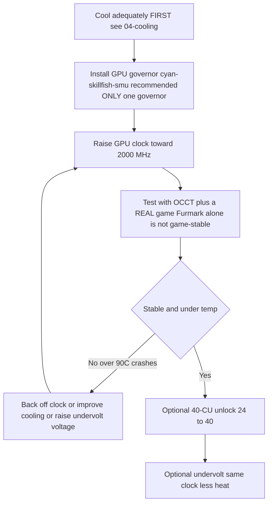

> 🌐 Traduction communautaire. La [version anglaise](../en/09-overclock-undervolt.md) fait foi et peut être plus à jour. Une erreur ? [Ouvrez une issue](https://github.com/lildebil0/awesome-bc250/issues).

# Overclocking & Undervolting

> **TL;DR** — Dès la sortie du carton, le GPU du BC-250 tourne lentement (souvent bloqué à **1500 MHz**, ~faible). Le correctif communautaire est un **governor** qui force les fréquences/tensions : celui recommandé aujourd'hui est **[cyan-skillfish-governor-smu](https://github.com/filippor/cyan-skillfish-governor)** (ne nécessite aucun patch noyau, packagé sur Arch/CachyOS/Bazzite/Fedora) ; **[oberon-governor](https://gitlab.com/mothenjoyer69/oberon-governor)** est l'original et fonctionne encore. Quel que soit celui choisi, vous l'éditez pour pousser le GPU à **2000 MHz (~+30 % de FPS)**. La boîte à outils plus récente **[bc250_smu_oc](https://github.com/bc250-collective/bc250_smu_oc)** overclocke aussi le **CPU** (recommandé **4 GHz @ 1275 mV**). Séparément, le **[déblocage des 40 CU](https://github.com/duggasco/bc250-40cu-unlock)** réactive les **24 → 40 unités de calcul** qu'AMD avait désactivées dans le firmware — un gain GPU plus important que les fréquences seules (un run Superposition est passé de **4647 → 6863** points, ([src](https://t.me/c/2424231195/137035))). **Tout cela, c'est de la chaleur. Refroidissez la carte d'abord** — voir [04-cooling.md](04-cooling.md) — car un OC sans refroidissement adéquat plante et réinitialise la carte au-delà de ~90 °C.

C'est la **dernière** étape du parcours d'or, pas la première. Obtenez une carte stable et froide qui tourne ([06-linux.md](06-linux.md), [04-cooling.md](04-cooling.md)) avant de toucher à quoi que ce soit ici. Tout ce qui suit est « à vos risques et périls » — la communauté le répète sans cesse ([src](https://t.me/c/2424231195/106844)).

---

## Les quatre leviers (et ce que chacun vaut)

Le BC-250 a **quatre** réglages indépendants. Ils se cumulent :

| Levier | Outil | Gain typique | Coût en chaleur |
|-------|------|--------------|-----------|
| **Fréquence GPU** 1500 → 2000 MHz | governor (cyan-skillfish-smu / oberon) | **~+30 % de FPS** quand GPU-bound | élevé |
| **Undervolt GPU** à fréquence fixe | même governor | même FPS, **bien plus froid** | *négatif* (moins de chaleur) |
| **Fréquence CPU** 3,5 → 4,0 GHz | `bc250_smu_oc` | aide les jeux CPU-bound | élevé |
| **Déblocage 40 CU** 24 → 40 CU | `bc250-40cu-unlock` | **jusqu'à ~+48 %** de travail GPU | élevé |

Deux mises en garde honnêtes du chat avant de commencer :

- **La plupart des jeux BC-250 sont CPU-bound, pas GPU-bound.** Pousser le GPU de 2000 → 2229 MHz a fait gagner à un testeur *1 fps* dans Shadow of the Tomb Raider (90 → 91) tandis que la consommation et les températures bondissaient fort — donc le « +30 % » annoncé ne se concrétise que dans la poignée de titres où le GPU est le goulot d'étranglement ([src](https://t.me/c/2424231195/67029)).
- **La chaleur augmente plus vite que les performances.** Même testeur : 2000 MHz @ 960 mV = **75 °C** dans un test de charge ; 2229 MHz @ 1030 mV = **93 °C** — et il a reculé parce que son alimentation et son refroidissement ne tenaient pas ([src](https://t.me/c/2424231195/66972), [src](https://t.me/c/2424231195/67029)).

> ⚠️ **Plancher de sécurité.** Le throttling commence vers **85 °C** et la carte plante/redémarre brutalement vers **90 °C** (voir [04-cooling.md](04-cooling.md)). Si vous dépassez ~85 °C en charge, vous êtes *au-delà* de votre budget de refroidissement — baissez la fréquence ou undervoltez, ne montez pas plus haut.



---

## Étape 1 — Fréquence & undervolt GPU : le governor

Le pilote amdgpu du BC-250 n'expose pas l'overclocking sysfs habituel. La solution communautaire est un **governor** — un petit démon qui écrit directement les états de fréquence/tension. Pour une nouvelle installation aujourd'hui, le recommandé est **cyan-skillfish-governor-smu** ; **oberon-governor** est l'original et fonctionne encore (conservé plus bas comme l'alternative établie).

<p align="center"></p>
<sub>📈 Source éditable : <a href="../../assets/diagrams/gpu-clock-tradeoff.drawio">gpu-clock-tradeoff.drawio</a> (ouvrir dans <a href="https://draw.io">draw.io</a>). Vert = gain, rouge = coût.</sub>

### cyan-skillfish-governor-smu (recommandé)

[filippor/cyan-skillfish-governor](https://github.com/filippor/cyan-skillfish-governor), branche SMU — pilote la fréquence/tension via des **appels au firmware SMU**, donc il ne nécessite **aucun patch de fréquence noyau sur quelque distribution que ce soit**, est activement maintenu, et est packagé sur toutes les grandes distributions. Il ajoute aussi le contrôle du **profil de consommation du contrôleur mémoire**, ce qui abaisse le TDP au repos à **~30–35 W** (plus froid et plus silencieux au repos) ([src](https://t.me/c/2424231195/125821)).

**Installation (packagé sur toutes les grandes distributions)** — COPR `filippor/bazzite` (Fedora/Bazzite) ou AUR `cyan-skillfish-governor-smu` (Arch/CachyOS) ; Debian/Ubuntu utilisent l'archive de release + `sudo ./scripts/install.sh` :

```bash
# Fedora / Bazzite (COPR):
sudo dnf copr enable filippor/bazzite
sudo dnf install cyan-skillfish-governor-smu        # rpm-ostree install … on Bazzite
sudo systemctl enable --now cyan-skillfish-governor-smu.service

# Arch / CachyOS (AUR):
paru -S cyan-skillfish-governor-smu                  # or: yay -S …
sudo systemctl enable --now cyan-skillfish-governor-smu.service
```

La branche SMU peut aussi être compilée depuis les sources avec `cargo build --release`. **Réglez votre fréquence et votre tension** dans `/etc/cyan-skillfish-governor-smu/config.toml` (schéma ci-dessous) — pour passer du défaut faible au point idéal communautaire, montez le point sûr le plus haut vers **2000 MHz** et baissez la tension jusqu'à ce que ce soit stable (voir l'undervolting plus bas) ; redémarrez le service après chaque modification.

> **Vérifiez que ça a pris.** Surveillez les fréquences/températures en direct avec `amdgpu_top`, MangoHud ou LACT pendant que vous chargez le GPU. Si les fréquences restent à ~1500 MHz, le service ne tourne pas ou votre config n'a pas été lue — `sudo systemctl status cyan-skillfish-governor-smu`.

> N'exécutez **qu'un seul** governor à la fois — si vous aviez auparavant lancé oberon, désactivez-le avant d'activer cyan-skillfish, sinon ils se disputent les mêmes registres.

> 🔇 **Réglage pour une console de salon silencieuse.** Pousser au maximum (2000 MHz GPU / 4000 MHz CPU) n'apporte presque rien dans les jeux CPU-bound mais coûte beaucoup de chaleur, de bruit de ventilateur et de watts. Un rapport communautaire r/BC250Gaming (Reddit) a trouvé qu'un réglage équilibré **~1600 MHz GPU / ~3500 MHz CPU** offre un bien meilleur rapport performance/bruit/watt pour le jeu au quotidien — quasi silencieux et froid, avec un FPS qui tient bon parce que la plupart des titres ne sont de toute façon pas GPU-bound (voir la mise en garde CPU-bound ci-dessus). Si vous tenez plus à une machine silencieuse et froide qu'aux benchmarks records, fixez ces valeurs comme plafonds de votre governor plutôt que le maximum.

### oberon-governor (l'original — fonctionne encore)

[mothenjoyer69/oberon-governor](https://gitlab.com/mothenjoyer69/oberon-governor) — un démon C++, le premier governor BC-250 et le plus testé ; il fonctionne encore, mais contrairement au governor SMU il dépend du patch noyau de fréquence étendue (ou d'une distribution qui le livre) pour atteindre les fréquences les plus hautes. D'après son README il dépend de **CMake, d'une chaîne d'outils C++ et de libdrm**, et n'est **testé que sur l'ASRock BC-250**. Beaucoup de distributions le livrent précompilé (AUR d'Arch, un COPR Fedora, les images Bazzite), donc la compilation depuis les sources n'est nécessaire que si votre distribution n'a pas de paquet.

**Compilation depuis les sources** (correspond à la séquence reproduite du chat, ([src](https://t.me/c/2424231195/54666)) et au flux CMake standard du dépôt) :

```bash
# Dependencies (Arch example — adjust per distro)
sudo pacman -S --needed base-devel cmake pkgconf make libdrm glibc linux-api-headers

git clone https://gitlab.com/mothenjoyer69/oberon-governor.git && cd oberon-governor
sudo cmake . && sudo make && sudo make install
sudo systemctl enable --now oberon-governor.service
```

> Si `cmake` échoue, le correctif du chat était simplement d'installer les dépendances de compilation manquantes et de relancer : `sudo pacman -S pkgconf cmake` puis recompiler ([src](https://t.me/c/2424231195/54666)).

**Réglez votre fréquence et votre tension.** oberon lit une config YAML :

```bash
sudo nano /etc/oberon-config.yaml      # adjust min/max frequency and voltage
sudo systemctl restart oberon-governor # apply
```

Le fichier vous permet de définir la **tension et la fréquence maximale et minimale** pour les états du GPU (selon le README du dépôt). Montez la fréquence max vers **2000 MHz** et baissez la tension jusqu'à ce que ce soit stable. Redémarrez le service après chaque modification. Pour migrer vers le governor SMU plus tard : stop+disable+remove `oberon-governor`, `rm /etc/oberon-config.yaml`, puis installez et activez le service SMU.

#### TT vs SMU — les deux variantes de cyan-skillfish

> La build SMU recommandée ci-dessus est l'une des **deux** variantes de cyan-skillfish. SMU est celle par défaut ; la variante TT est l'alternative pour quiconque veut spécifiquement la voie patch-noyau/sysfs ([elektricM : governor](https://elektricm.github.io/amd-bc250-docs/system/governor/)) :

> **`perf_profile` — le palier du contrôleur mémoire / Infinity Fabric (distinct de la courbe du GPU).** Le SMU expose un index de profil de performance `0–3` : **3** est la performance de contrôleur mémoire / Infinity-Fabric la plus élevée, tandis que **1** est le profil basse consommation recommandé pour le point de repos le plus bas. Le governor le force automatiquement à **3** chaque fois que la charge CPU dépasse `cpu-load-target.upper`. ([bc250-collective/cyan-skillfish-governor](https://github.com/bc250-collective/cyan-skillfish-governor))

| Variante | Service | Comment elle règle les fréquences | Patch noyau ? | Sortie / notes |
|---|---|---|---|---|
| **SMU** *(recommandé)* | `cyan-skillfish-governor-smu` | **appels firmware** SMU | **Non — fonctionne non patché sur toute distribution** | 2026-01-18 ; atteint 2300+ MHz ; CPU ~0,9–1,3 % |
| **TT** (alternative) | `cyan-skillfish-governor-tt` | sysfs | **Oui** (pré-inclus dans Bazzite) | gère le throttling thermique ; atteint 2175+ MHz |

> **Renommage du service (2025-12-13) :** filippor a renommé `cyan-skillfish-governor` → `cyan-skillfish-governor-tt`, et le dossier de config est passé de `/etc/cyan-skillfish-governor/` → `/etc/cyan-skillfish-governor-tt/`. Si vous mettez à jour, copiez votre ancien `config.toml` ([elektricM : governor](https://elektricm.github.io/amd-bc250-docs/system/governor/)). La variante TT est packagée dans le même COPR/AUR (`cyan-skillfish-governor-tt`) et pré-incluse dans Bazzite.

> 🔴 **700 mV est un plancher dur.** Régler la tension GPU *minimale* du governor sous **700 mV reverrouille le GPU à 1500 MHz** — ça anéantit tout l'intérêt. Gardez la tension min ≥ 700 mV dans n'importe quel governor ([elektricM : governor](https://elektricm.github.io/amd-bc250-docs/system/governor/), [elektricM : BIOS overclocking](https://elektricm.github.io/amd-bc250-docs/bios/overclocking/)).

> 🔴 **~1100–1129 mV est le plafond — le pendant du plancher de 700 mV.** Ne poussez pas la tension GPU *maximale* du governor au-delà du sommet d'origine de l'`OD_RANGE` de **1129 mV** ; au-delà, c'est un **risque de dégradation du silicium sans gain de stabilité**. Le plafond prudent en refroidissement à air se situe autour de **1100 mV (risque élevé au-dessus)**, et seul le refroidissement liquide justifie le palier supérieur de **1125 mV** (tableau ci-dessous). Si une courbe a besoin de plus de ~1129 mV pour être stable, le vrai correctif est *le refroidissement ou une fréquence plus basse*, pas plus de volts ([elektricM : BIOS overclocking](https://elektricm.github.io/amd-bc250-docs/bios/overclocking/)).

> **Vérifiez que le bon GPU est ciblé.** Le governor peut contrôler `card0` ou `card1` selon votre système — `ls /sys/class/drm/ | grep card`. Si les réglages ne s'appliquent pas, il faudra peut-être pointer la config sur la bonne carte. Sur Arch/CachyOS le governor ne s'active parfois pas tant que le GPU n'a pas été utilisé une première fois — lancez un jeu/benchmark une fois après le démarrage ([elektricM : governor](https://elektricm.github.io/amd-bc250-docs/system/governor/)).

#### Le schéma de config de cyan-skillfish-smu (TOML par sections)

La branche `smu` utilise un schéma **par sections**, et **non** l'ancien tableau `safe-points = [...]` — chaque point de courbe est sa propre table `[[safe-points]]`. Champs clés ([elektricM : governor](https://elektricm.github.io/amd-bc250-docs/system/governor/)) :

```toml
# /etc/cyan-skillfish-governor-smu/config.toml
[timing.intervals]
sample = 500          # µs; raise (e.g. 1000) to cut CPU overhead, keep adjust = sample*400
adjust = 200_000
[gpu-usage]
fix-metrics = true    # fixes the MangoHud "655 %" GPU-usage bug on BC-250
method  = "busy-flag"
[gpu]
set-method = "smu"    # "smu" or "kernel"
[load-target]
upper = 0.80          # fractions, not percents
lower = 0.65
[temperature]
throttling = 85       # °C
throttling_recovery = 75

[[safe-points]]
frequency = 1000
voltage   = 800
[[safe-points]]
frequency = 2000
voltage   = 1000      # gaming
[[safe-points]]
frequency = 2200
voltage   = 1000      # many boards hold a flat 1000 mV here; bump per-board only if it crashes
```

> **Ordre de réglage en cas d'instabilité : refroidissement → fréquence → *puis* tension.** Sur le refroidissement d'origine la vraie cause est presque toujours la chaleur (95 °C+). Baissez les blocs `[[safe-points]]` du haut pour plafonner la fréquence avant d'ajouter de la tension ; seulement si les températures sont bonnes et que ça plante encore à 2150–2200 MHz, montez le **point le plus haut uniquement** de +15–25 mV. Au-delà de ~1075 mV à 2200 MHz vous ne faites qu'ajouter de la chaleur — baissez plutôt la fréquence ([elektricM : governor](https://elektricm.github.io/amd-bc250-docs/system/governor/)).

> **Écran noir par reset GPU, propre au governor.** Si le GPU plante *pendant que le governor écrit activement dans sysfs*, le reset ne peut pas s'achever et vous obtenez un écran noir permanent (le système reste vivant en SSH) nécessitant un redémarrage forcé. Contournement : `systemctl stop` le governor avant les jeux connus pour planter ; le vrai correctif est une courbe stable ([elektricM : governor](https://elektricm.github.io/amd-bc250-docs/system/governor/)).

##### Comment le governor SMU dépasse 2230 MHz — et pourquoi il est livré désactivé

Parce que la branche SMU parle directement au firmware SMU plutôt qu'à travers l'`OD_RANGE` d'amdgpu, elle peut **dépasser le plafond dur de 2230 MHz d'Oberon** — un tutoriel l'a poussée à **≈2700 MHz** sur une carte ([Old Lamer — Part XII](https://youtu.be/Chzxaryjncs)). Cette marge est précisément la raison pour laquelle filippor le livre avec prudence :

> 🔴 **La config par défaut du governor SMU peut provoquer un écran noir au démarrage — il est donc livré SANS démarrage automatique.** filippor laisse délibérément le service désactivé après l'installation pour qu'une mauvaise courbe par défaut ne puisse pas vous verrouiller au démarrage ; vous avez l'occasion de **régler et tester la courbe d'abord, puis de `systemctl enable`** une fois qu'elle est stable sur votre carte. Activez-le *avant* d'avoir validé une courbe et un écran noir au prochain démarrage sera de votre faute ([Old Lamer — Part XII](https://youtu.be/Chzxaryjncs)). *(⚠ chiffres auto-sous-titrés — traitez les MHz exacts comme approximatifs.)*

Contrairement à la chute de fréquence brutale d'Oberon en surchauffe, le governor SMU **monte graduellement vers une cible de température**. Le tutoriel expose aussi des champs `config.toml` supplémentaires au-delà du schéma ci-dessus ([Old Lamer — Part XII](https://youtu.be/Chzxaryjncs)) :

```toml
# extra tuning knobs shown in the Part XII walkthrough
[ramp-rates]
normal = 1
burst  = 50
[gpu-usage]
burst-samples = 60
down-events   = 5
[frequency-thresholds]
adjust = 10
[temperature]
throttling_recovery = 80
```

> ⚠️ **Courbe air 16 points expérimentale de l'auteur — NON recommandée, dépasse le plafond air de ce guide.** L'auteur de la Part XII a fait tourner cette courbe sur air, mais ses points les plus hauts (2333–2400 MHz à 1120–1150 mV) se situent **au-dessus des limites prudentes en refroidissement à air documentées à l'Étape 3** (≈2230 MHz / 1060 mV sur air ; 1125 mV est un palier *liquide uniquement*). Elle est montrée à titre de référence, pas comme cible — sur air, arrêtez-vous là où le dit le tableau par classe de refroidissement de l'Étape 3 :
>
> ```toml
> # ⚠ author-experimental, air-cooled — DO NOT copy blindly (exceeds the air ceiling)
> # frequency (MHz) @ voltage (mV)
> 1000@800,  1175@850,  1500@900,  1700@920,
> 2000@960,  2100@1000, 2150@1035, 2200@1050,
> 2250@1070, 2300@1090, 2333@1120, 2400@1150
> ```
>
> Au sommet de cette courbe, **2,4 GHz tirait ~30 A ≈ 360 W** — assez pour nécessiter **un double Molex / une seconde alimentation de la carte** ([03-power-supply.md](03-power-supply.md)), pas un seul connecteur. Superposition a évolué de **≈4200 à 2,2 GHz → ≈4500 à 2,4 GHz** ([Old Lamer — Part XII](https://youtu.be/Chzxaryjncs)). *(⚠ toutes les valeurs auto-sous-titrées — approximatives.)*

#### Patch noyau de plage de fréquences GPU (seulement pour TT / sysfs manuel)

La plage GPU d'origine du pilote amdgpu est **1000–2000 MHz** ; un patch du pilote d'une ligne (par **ViRazY**, `linux-6.12-bc250-freq.mypatch`, ~**639 octets**, testé sur les noyaux **6.12 / 6.15 / 6.16.x**) l'élargit à **350–2230 MHz** (350 MHz de deep-idle économise de l'énergie ; le haut de la plage permet les overclocks 2230+). **Bazzite, PikaOS et les noyaux AUR d'Arch le livrent pré-patché**, et le **governor SMU contourne entièrement son besoin** via les appels firmware — donc vous ne patchez manuellement que si vous voulez le governor TT ou un OC sysfs brut avec la plage étendue sur une distribution non patchée. Vérifiez avec `cat …/pp_od_clk_voltage` (devrait afficher 350–2230). **N'utilisez pas** le patch de tension étendue (600–1300 mV) — inutile et risqué ([elektricM : BIOS overclocking](https://elektricm.github.io/amd-bc250-docs/bios/overclocking/)).

> 🔧 **Undervolt sysfs brut (sondage ponctuel).** Pour un test de stabilité rapide par point sans le governor, écrivez un point de courbe de tension directement dans sysfs (format `vc <level> <MHz> <mV>`) et validez-le ([elektricM : BIOS overclocking](https://elektricm.github.io/amd-bc250-docs/bios/overclocking/)) :
> ```bash
> echo "vc 0 2100 1025" | sudo tee /sys/class/drm/card0/device/pp_od_clk_voltage   # set point: 2100 MHz @ 1025 mV
> echo "c" | sudo tee /sys/class/drm/card0/device/pp_od_clk_voltage                # commit
> ```
> C'est uniquement pour du sondage rapide — ça ne survit pas à un redémarrage. Le `config.toml` du governor est la voie **persistante** recommandée ; utilisez sysfs brut pour trouver une tension stable par point, puis intégrez-la dans la courbe du governor.

#### PS5GPU-BC250 — un contrôleur graphique (sans fichiers de config)

Vous préférez une interface graphique ? **[ZEROAESQUERDA/PS5GPU-BC250](https://github.com/ZEROAESQUERDA/PS5GPU-BC250)** est une appli Qt (KDE/GNOME) qui ajuste la fréquence et la tension GPU min/max, fixe une limite de température et propose un boost automatique en 4 paliers ou un contrôle manuel — façon MSI Afterburner, sans patchs noyau ni édition de TOML. **Désactivez d'abord tout governor en cours** (cyan-skillfish-smu/tt ou oberon) ou ils entreront en conflit ([elektricM : governor](https://elektricm.github.io/amd-bc250-docs/system/governor/)).

---

## Étape 2 — Overclock CPU & undervolt correct : `bc250_smu_oc`

Sorti le **2025-12-30** par le bc250-collective (rétro-ingénierie du SMU), [bc250_smu_oc](https://github.com/bc250-collective/bc250_smu_oc) est l'outil qui permet enfin de toucher à la fréquence et à la tension du **CPU** (cœurs Zen 2), pas seulement au GPU. Les auteurs recommandent **4 GHz @ 1275 mV** comme optimum stabilité/chaleur et le livrent comme exemple dans le dépôt ([src](https://t.me/c/2424231195/106844)).

**Installation & usage** (verbatim depuis le README du dépôt) :

```bash
# Prerequisite: install the `stress` CPU load tool from your package manager
git clone https://github.com/bc250-collective/bc250_smu_oc.git
cd bc250_smu_oc
pip install .        # or: pipx install .

# Detect / test a target (CPU 4 GHz at 1275 mV), keep it applied:
bc250-detect --frequency 4000 --vid 1275 --keep

# Once you've found a stable config, install it and enable at boot:
bc250-apply --install overclock.conf
sudo systemctl enable --now bc250-smu-oc
```

> 🔴 **Limite de tension dure.** Selon le dépôt : ne laissez jamais la tension cœur CPU (**Vid**) dépasser **1,325 V** en aucune circonstance — la dégradation du silicium commence au-delà de ~1,35 V ([src](https://t.me/c/2424231195/115726)). Et : **monter la fréquence CPU sans undervolter laisse la Vid grimper sans plafond et peut détruire le matériel** — associez toujours une hausse de fréquence à une cible de tension.

Pourquoi 4 GHz est le plafond : AMD considère jusqu'à ~4 GHz comme sûr pour ce silicium ; le BIOS du kit desktop 4700S démarre même le turbo à 4000 MHz / 1,35 V d'origine. Le Zen 2 atteint *en général* ~4200, mais ces puces sont du **silicium de rebut de minage**, donc 4200 seulement « si vous avez beaucoup de chance » ([src](https://t.me/c/2424231195/115726)).

> ❓ **Puis-je débloquer le CPU à 8 cœurs ?** Réponse courte : **non — pas actuellement, et ça n'aiderait de toute façon pas.** Le BC-250 livre 6 de ses 8 cœurs Zen 2 actifs ; les rapports communautaires r/BC250Gaming décrivent les deux autres comme **verrouillés logiciellement via des eFuses lus par le SMU** (le binning est largement artificiel — une décision de l'ère minage), et *non* physiquement coupés. Mais les débloquer signifierait **contourner la vérification de signature du PSP et modifier le microcode du SMU**, et les tentatives communautaires (sur Discord) ont **échoué**. Même si quelqu'un y parvenait, le gain pour le jeu serait **marginal** : le BC-250 est bridé par des **performances mono-thread faibles, un petit cache L3 fragmenté 2×4 Mo et un FPU limité AVX2-only** — ajouter des cœurs n'augmente ni le FPS ni les choses dont cette puce manque réellement. Ne le poursuivez pas ([rapports communautaires r/BC250Gaming](https://www.reddit.com/r/BC250Gaming/)).

> Le post épinglé `bc250_smu_oc` peut aussi **remplacer** votre governor GPU (il a son propre service `bc250-smu-oc`). N'exécutez pas deux governors à la fois.

**Scaling CPU-OC vérifié** (Fedora 43, noyau 6.19.8 ; tension auto-réglée ; 7-zip MIPS ; avec une courbe de ventilateur basée sur la température) ([elektricM : governor](https://elektricm.github.io/amd-bc250-docs/system/governor/)) :

| Fréq | Vid auto | 7-zip MIPS | Temp (pleine charge) | vs origine |
|---|---|---|---|---|
| 3500 (origine) | auto | 26 062 | 60 °C | référence |
| 3600 MHz | 1150 mV | 26 518 | 65 °C | +1,7 % |
| 3700 MHz | 1199 mV | 27 212 | 68 °C | +4,4 % |
| 3800 MHz | 1250 mV | 27 919 | 72 °C | +7,1 % |
| 3900 MHz | 1275 mV | 28 410 | 75 °C | +9,0 % |
| 4000 MHz | — | throttle à PWM 80 | 77 °C | ❌ (nécessite plus de refroidissement/ventilation) |

Les options de l'outil : `bc250-detect -f <MHz> -v <mV>` pour tester, ajoutez **`-k`** pour garder l'OC après que l'outil se termine, **`-c <path>`** pour écrire une config. Rendez-le permanent avec `bc250-apply -a -i /etc/bc250-overclock.conf` puis `systemctl enable bc250-smu-oc`. Auteurs : **mrfrakes & dantistnfs** (rétro-ingénierie du SMU) ([elektricM : governor](https://elektricm.github.io/amd-bc250-docs/system/governor/), [elektricM : BIOS overclocking](https://elektricm.github.io/amd-bc250-docs/bios/overclocking/)). Note : **4000 MHz throttlait au ventilateur PWM 80 quasi d'origine** — le plafond est limité par le refroidissement, cohérent avec la note air-vs-eau ci-dessus.

#### Comment `bc250-detect` cherche réellement (et le plafond de tension qu'il impose)

Un tutoriel vidéo du même outil montre la mécanique de recherche automatique : il **monte depuis 3,5 GHz par paliers de 100 MHz / 25 mV**, lance un **test de charge d'~300 s** à chaque palier et n'avance que s'il passe — p. ex. `bc250-detect -f 3850 -v 1150 -k` pour tester 3,85 GHz @ 1150 mV et le garder. Sur Bazzite l'installation est `sudo rpm-ostree install stress pipx` puis `pipx install .` ([Old Lamer — Part VIII](https://youtu.be/ciDpPhoioKM)).

> ⚠️ **Deux plafonds de tension — notez les deux, ils divergent.** La vidéo Part VIII indique un plafond dur de **1300 mV** pour la Vid CPU, ce qui est **plus prudent** que la limite documentée du dépôt de **1,325 V** utilisée plus haut. Ils ne contredisent pas le message de sécurité (restez bien en dessous de ~1,35 V), mais le nombre *exact* diffère selon la source — dans le doute, prenez le plus bas (1300 mV) comme plafond de travail et ne dépassez jamais 1,325 V ([Old Lamer — Part VIII](https://youtu.be/ciDpPhoioKM)). *(⚠ le chiffre de 1300 mV est auto-sous-titré.)*

Dans ce run, **4 GHz @ 1225 mV a passé le test rapide court mais a planté en jeu**, donc l'auteur est revenu à un stable **3,85 GHz @ 1150 mV** — le même schéma « 4 GHz passe le test rapide, échoue en soutenu » que montre le tableau elektricM ([Old Lamer — Part VIII](https://youtu.be/ciDpPhoioKM)). *(⚠ ASR — valeurs approximatives.)*

**Scaling CPU+GPU de bout en bout (Horizon Zero Dawn, 1080p Ultra, natif, 1× Arctic P12 Pro ~2200 tr/min).** Une seule vidéo empile chaque levier et mesure le résultat en jeu, ce qui est la démonstration la plus claire de pourquoi cette carte est **CPU-bound** : le GPU est content de rendre ~88–90 fps bien avant que le CPU puisse l'alimenter ([Old Lamer — Part X](https://youtu.be/1hgSQxf6RXE)). *(⚠ tous les fps/°C auto-sous-titrés — à traiter comme ≈.)*

| Étape (cumulatif) | Fréq GPU @ mV | Fréq CPU @ mV | fps en jeu | fps possible GPU | Temp CPU / GPU |
|---|---|---|---|---|---|
| Undervolt d'origine | 1500 @ 850 | 3,5 G @ 1020 | **≈62** | — | 53 / 51 °C |
| + OC GPU | 2000 @ 960 | 3,5 G @ 1020 | **≈69** | 81 | 64 / 63 °C |
| + OC CPU | 2000 @ 960 | 3,85 G @ 1155 | **≈72** | — | 65 / 64 °C |
| + OC GPU | 2200 @ 1030 | 3,85 G @ 1155 | **≈74** | 88 | ~70 °C |
| + OC CPU | 2200 @ 1030 | 4,0 G @ 1270 | **≈76–77** | 88 | 72 / 68 °C |
| + mitigations off | 2200 @ 1030 | 4,0 G @ 1270 | **≈80** | 90 | — |

**Bilan : ≈62 → ≈80 fps (~+29 %), et c'est franchement CPU-bound** — le GPU rend 88–90 fps en interne tandis que le CPU plafonne le débit jouable autour de 80. Notes du même run ([Old Lamer — Part X](https://youtu.be/1hgSQxf6RXE)) :

- **4 GHz nécessite ~1270 mV** ici, sinon la carte green-screen — associer la fréquence à assez de Vid est obligatoire (rappel de la règle « jamais de hausse de fréquence sans undervolt » ci-dessus).
- **`bc250_smu_oc` a un auto-throttle intégré à ~90 °C**, donc l'outil lui-même recule avant la température de plantage dur de la carte.
- **mitigations=off n'a apporté que ≈+3 fps** (les mitigations noyau des vulnérabilités CPU) ; un petit dernier gain optionnel.
- **Les timings mémoire personnalisés n'ont rien apporté ici et comportent un risque de brick** — passez-les (voir la section GDDR6 ci-dessous).
- **3,85 GHz @ 1155 mV est qualifié de point idéal CPU** — correspondant au tableau 7-zip d'elektricM, où 4 GHz throttle sur un refroidissement quasi d'origine.
- À l'OC final, la carte tournait en **1440p Ultra natif @ 60**, et **4K + FSR proche de 60** ([Old Lamer — Part X](https://youtu.be/1hgSQxf6RXE)).

> 📊 **Chiffres de référence FurMark à l'origine (run différent).** Un autre tutoriel a relevé FurMark à **l'origine FHD ≈4085 points / 67 fps** ; monter le GPU de **1500 → 2000 MHz a gagné ~+30 % (≈5340 points / 87 fps)**, tandis que **2229 MHz n'a presque rien ajouté et tournait à >90 °C** (throttle). Règle empirique de cette vidéo : **« <80 °C en FurMark + stress CPU ⇒ <70 °C en jeu »**, et **FurMark Vulkan chauffe plus la puce que le chemin GL** ([Old Lamer — Part IV](https://youtu.be/YuBmGF536II)). *(⚠ ASR — approximatif.)*

#### Le scaling de fréquence CPU nécessite le correctif ACPI (sinon aucun cpufreq du tout)

> ❗ **Dès la sortie du carton, le BC-250 n'expose aucun scaling de fréquence CPU** — il n'y a *aucune* interface cpufreq, donc `cpupower`/`schedutil` ne font rien et le CPU reste à une fréquence fixe. Le **[bc250-collective/bc250-acpi-fix](https://github.com/bc250-collective/bc250-acpi-fix)** livre deux tables SSDT (chargées via un override initrd) qui corrigent cela ([elektricM : governor](https://elektricm.github.io/amd-bc250-docs/system/governor/)) :
> - **SSDT-PST** → active le cpufreq Linux standard avec **8 P-states, 800 MHz → 3200 MHz** (governors : `schedutil`, `powersave`, `performance`, …).
> - **SSDT-CST** → active les **états de repos C1/C2/C3** pour que les cœurs dorment vraiment au repos (consommation au repos plus basse).
>
> Les deux confirmés fonctionnels sur le noyau 6.19.8. L'installation construit un cpio depuis `SSDT-CST.aml`+`SSDT-PST.aml` dans `/boot`, ajouté en tête de la ligne initrd (Fedora BLS) ou via `GRUB_EARLY_INITRD_LINUX_CUSTOM` (GRUB). Puis `echo schedutil | sudo tee /sys/devices/system/cpu/cpu*/cpufreq/scaling_governor`. **Mise en garde :** une mise à jour du noyau ne reportera pas l'override dans la nouvelle entrée de démarrage — réajoutez-le ou utilisez un hook kernel-install. Combiné à `bc250_smu_oc`, le CPU scale alors de **800 MHz au repos → 3900 MHz en charge** au lieu de rester épinglé ([elektricM : governor](https://elektricm.github.io/amd-bc250-docs/system/governor/), [elektricM : power](https://elektricm.github.io/amd-bc250-docs/system/power/)).

#### Consommation au repos — pourquoi elle est élevée, et jusqu'où le réglage va

Le BC-250 reste chaud et gourmand au repos par défaut ; le réglage l'abaisse par paliers clairs ([elektricM : power](https://elektricm.github.io/amd-bc250-docs/system/power/)) :

- **Échelle du repos : ~105 W (sans governor) → ~85 W (governor) → ~55 W (optimisé : Debian + governor + undervolt).** Le governor seul économise ~20 W ; **~55 W est le plancher de repos au mieux**, et vous ne l'atteignez qu'en empilant distribution + governor + undervolt.
- **Pourquoi le repos est élevé — décomposition non optimisée (~93 W) :** **CPU+GPU ~31 W**, **RAM + contrôleur mémoire ~35 W**, **reste de la carte ~27 W**. Le sous-système mémoire est le plus gros tirage au repos, et l'essentiel du chiffre de la carte est du silicium fixe — c.-à-d. le réglage peut rogner le CPU/GPU et (via le profil de contrôleur mémoire du governor) une partie du tirage RAM, mais une grande part est intouchable.

Trois profils de réglage nommés encadrent les enveloppes réalistes (consommation au repos / température soutenue) ([elektricM : power](https://elektricm.github.io/amd-bc250-docs/system/power/)) :

| Profil | Consommation | Temp |
|---|---|---|
| Efficacité | 55–65 W | 60–70 °C |
| Jeu | 70–85 W | 65–75 °C |
| Performance | 85–95 W | 75–85 °C |

---

## Étape 3 — Undervolting (faites-le pour la chaleur, chaque puce diffère)

L'undervolting est le geste à plus forte valeur sur cette carte : **même fréquence, bien moins de chaleur**, et il est *requis* si vous montez la fréquence CPU. Mais **chaque puce est différente** — la loterie du silicium est réelle ici. Un propriétaire a fait tourner trois cartes quasi consécutives et une seule a tenu 900 mV en charge ; refroidissement identique, températures identiques, stabilité différente ([src](https://t.me/c/2424231195/50568)).

<p align="center"></p>
<sub>📈 Source éditable : <a href="../../assets/diagrams/undervolt-tradeoff.drawio">undervolt-tradeoff.drawio</a> (ouvrir dans <a href="https://draw.io">draw.io</a>). Vert = gain, rouge = coût.</sub>

**Fréquence cible → tension, chiffres communautaires réels (votre puce variera) :**

| Fréquence GPU | Tension que les propriétaires ont trouvée *stable en jeu* | Notes |
|-----------|------------------------------------------|-------|
| 1500 MHz | ~710 mV | la carte « la plus stable » d'un testeur ([src](https://t.me/c/2424231195/23545)) |
| 2000 MHz | **~955 mV** | stable sous Furmark à 905 mV mais artefacts en jeu jusqu'à 955 mV ([src](https://t.me/c/2424231195/68126), [src](https://t.me/c/2424231195/136773)) |
| 2000 MHz | ~960 mV → **75 °C** en charge | le point de réglage quotidien populaire ([src](https://t.me/c/2424231195/66972)) |
| 2229 MHz | ~1030–1050 mV → **93 °C** en charge | « je l'ai éteint, j'ai peur » — rendements décroissants ([src](https://t.me/c/2424231195/66972)) |

**Ce que chaque classe de refroidissement peut réellement tenir** — le tableau ci-dessus s'arrête à « 2229 MHz @ ~1030–1050 mV → effrayant » sur un refroidissement quasi d'origine. Pour aller plus haut il faut le refroidissement assorti ; voici les plafonds par classe de refroidissement d'elektricM ([elektricM : BIOS overclocking](https://elektricm.github.io/amd-bc250-docs/bios/overclocking/)) :

| Refroidissement | Fréquence GPU | Tension |
|---|---|---|
| Air prudent (max) | 2230 MHz | 1060 mV |
| Air haute pression statique (Arctic P12 Max) | 2300 MHz | 1075 mV |
| Liquide (selon NexGen3D) | 2400 MHz | 1125 mV |

> 🧪 **Points de réglage undervolt communautaires (4pda).** Deux autres courbes réelles du forum russe, utiles comme points de départ (toujours dépendantes de la puce) : sur une carte **24 CU (Oberon)**, une courbe deux points `1000 MHz @ 0,8 V + 1700 MHz @ 0,85 V` ([4pda — dreamerok](https://4pda.to/forum/index.php?showtopic=1104980)) ; sur une carte **40 CU**, `1500 MHz @ 900 mV`. Pour une puce à forte fuite, commencez bas — `500 MHz / 900 mV` — et **ajoutez de la fréquence à partir de là** plutôt que de chasser la tension vers le bas ([4pda — Lakan](https://4pda.to/forum/index.php?showtopic=1104980)).

> ⚡ **Cadrage perf-par-watt.** Les tests communautaires notent qu'un **40 CU undervolté + sous-cadencé tire ~100 W de moins qu'un 24 CU au même score FurMark** — c.-à-d. pour une sortie égale, la pièce plus large mais plus lente est le point de fonctionnement le plus efficace, ce qui est tout l'argument en faveur du déblocage puis du *sous*-cadençage plutôt que de pousser fort le 24 CU.

> **Furmark seul n'est pas un test de stabilité.** Sa charge fixe masque une instabilité qui n'apparaît que lorsque le *contexte* change — alt-tab, chargement de textures, menus. Une carte « stable » sous Furmark à 905 mV a sorti des artefacts de texture en jeu après 1–2 heures jusqu'à ce que la tension passe à 955 mV. Validez dans **de vrais jeux + un balayage alt-tab/menu**, et utilisez un outil de charge varié comme **OCCT** (il charge le VRM, pas seulement les shaders), pas seulement Furmark ([src](https://t.me/c/2424231195/68126), [src](https://t.me/c/2424231195/136773), [src](https://t.me/c/2424231195/23545)).

> **Indice matériel pratique :** le BC-250 a une **LED de charge** — **rouge = GPU au repos, vert = GPU chargé**. Certaines scènes « au repos » (p. ex. Novigrad dans Witcher 3) sollicitent en fait le GPU et font apparaître des artefacts d'undervolt que Furmark/Cyberpunk ratent ([src](https://t.me/c/2424231195/12285)).

Un undervolt trop agressif n'est **pas dangereux** — au pire la carte décroche ou désactive le slot M.2, ce qui se règle en cinq secondes car l'OC n'est pas stocké dans le BIOS ([src](https://t.me/c/2424231195/105998)).

> 💡 **Des artefacts non liés à l'undervolt ?** Textures noires / scintillement peuvent aussi être un souci HiZ du pilote — essayez de régler **`RADV_DEBUG=nohiz`** dans l'environnement du jeu avant de chasser la tension. Et notez que la fenêtre de tension `OD_RANGE` du noyau d'origine est de 700–1129 mV ; le max prudent en refroidissement à air est ~1085 mV, le max absolu ~1100 mV — au-delà c'est un risque de dégradation sans réel gain de stabilité ([elektricM : BIOS overclocking](https://elektricm.github.io/amd-bc250-docs/bios/overclocking/)).

---

## Étape 4 — Le déblocage des 40 CU (24 → 40 unités de calcul)

Le plus gros gain GPU unique, et le plus récent. La puce Cyan Skillfish du BC-250 possède physiquement **40 CU**, mais le firmware d'origine n'en laisse que **24 actives** (16 « récoltées »). Le paramètre noyau **`amdgpu.bc250_cc_write_mode=3`** plus un pilote amdgpu patché réactive les 40. Résultat mesuré — un run 4K Superposition est passé de **4647 → 6863** points (24/40 → 40/40 CU actives), avec l'outil `cu_map.sh` montrant la carte de récolte se remplir ([src](https://t.me/c/2424231195/137035)) :


Des gens font tourner **40 CU @ 1850 MHz** (RE4 Remake natif 1440p high, 60 fps) et rapportent même des tensions très basses à 40 CU (p. ex. 1400 MHz @ 750 mV sur une puce chanceuse) ([src](https://t.me/c/2424231195/137260), [src](https://t.me/c/2424231195/137157)).

> ⚠️ **Cela nécessite de patcher et recompiler le module noyau amdgpu** — c'est la tâche la plus complexe de ce guide et elle est **réservée au BC-250** (le patch est protégé par l'ID de périphérique PCI de la carte **`0x13FE`**). Le patch n'est pas persistant : sans la config modprobe, un redémarrage revient à 24 CU.

**Comment ça fonctionne réellement (deux registres, les deux requis).** Le déblocage écrit **deux** registres matériels pendant l'init du pilote — aucun seul ne fait évoluer le calcul ([elektricM : déblocage 40 CU](https://elektricm.github.io/amd-bc250-docs/system/40cu-unlock/)) :

| Registre | Rôle | Origine → débloqué |
|---|---|---|
| `CC_GC_SHADER_ARRAY_CONFIG` | indique au pilote combien de CU existent | `0xfff80000` → `0xffe00000` |
| `SPI_PG_ENABLE_STATIC_WGP_MASK` | indique à SPI où dispatcher les waves | `0x07` (WGP 0–2) → `0x1F` (WGP 0–4) |

(L'outil d'exécution ci-dessous écrit aussi un **troisième** registre, `RLC`.) C'est un déblocage **de calcul**, pas de jeu : l'A/B contrôlé de duggasco montre le `llama-bench pp512` Vulkan bondir de **1,61×** (230 → 372 tok/s à 1500 MHz), tandis que `glmark2` ne gagne que **+4,4 %** parce que la 3D est limitée par le fill-rate, pas par les CU ([elektricM : déblocage 40 CU](https://elektricm.github.io/amd-bc250-docs/system/40cu-unlock/)). Pour les spécificités IA/LLM voir aussi [akandr/bc250](https://github.com/akandr/bc250).

> 🎯 **Le point de fonctionnement recommandé est 1500 MHz, pas 2 GHz.** L'A/B de duggasco place **1500 MHz / ~900 mV** comme point idéal — il capture l'essentiel du ~1,67× de scaling théorique sans problème thermique (1500 MHz/874 mV : 372 tok/s, 125 W, 83 °C). À 2 GHz le même test grimpe à 466 tok/s mais consommation/températures montent fort et le package throttle thermiquement après quelques minutes ([elektricM : déblocage 40 CU](https://elektricm.github.io/amd-bc250-docs/system/40cu-unlock/)).

> ⚠️ **Toutes les cartes ne se débloquent pas proprement — vérifiez d'abord votre motif de récolte.** Les 16 CU fusionnées ne sont pas garanties saines au niveau silicium. Les cartes avec un motif de récolte **contigu** (p. ex. CU 0–5 actives, 6–9 fusionnées, idem sur les 4 shader arrays) ont tendance à passer ; les cartes avec un motif **éparpillé** peuvent avoir des CU réellement défectueuses qui s'énumèrent mais échouent en charge. Lancez **`./scripts/cu_map.sh`** depuis le dépôt *avant* de valider une config modprobe. Si éparpillé, attendez-vous à lancer le test de santé par WGP et à atterrir quelque part **entre 24 et 40 CU stables** ([elektricM : déblocage 40 CU](https://elektricm.github.io/amd-bc250-docs/system/40cu-unlock/)). Aussi : **le Secure Boot doit être désactivé** (ou signez vous-même le module recompilé).

> 🎰 **40 CU est une loterie, pas une garantie — beaucoup de cartes plafonnent à 38.** Les rapports communautaires r/BC250Gaming convergent là-dessus : si le die a 40, beaucoup de puces ne sont stables qu'à **38 CU**, et la dernière ou les deux dernières causent couramment des **artefacts graphiques (une « ligne » caractéristique à travers l'image) ou des plantages durs**. Les comptes stables rapportés varient selon la puce — **36, 38 ou 40**. Pire, « stable à 40 » peut être *trompeur* : une carte peut planter au premier lancement de jeu puis tourner sans souci à une tentative ultérieure, donc un seul benchmark propre ne prouve rien. **Méthode recommandée — débloquer les CU une par une et tester après chacune.** Utilisez **[WinnieLV/bc250-cu-live-manager](https://github.com/WinnieLV/bc250-cu-live-manager)** pour activer une seule CU à la fois et valider avant d'ajouter la suivante (p. ex. FurMark 20+ min plus quelques benchmarks de jeu par palier). Une mauvaise CU **verrouille instantanément le système**, donc chaque test vous dit exactement quelle CU laisser masquée — bien plus sûr que d'activer les 16 d'un coup en espérant. Traitez « 24 → 40 » comme le meilleur cas ; prévoyez **38** ([rapports communautaires r/BC250Gaming](https://www.reddit.com/r/BC250Gaming/)).

Le graphique ci-dessous résume pourquoi ce levier vaut le coup mais est délicat : **le calcul évolue fortement avec les CU** (les bonds Superposition / llama-bench ci-dessus), tandis que **le FPS en jeu bouge à peine parce que la plupart des titres sont CPU-bound**, et la consommation et l'instabilité grimpent plus vous montez — 38 CU est le compte stable typique, 40 est une loterie.

<p align="center"></p>
<sub>📈 Source éditable : <a href="../../assets/diagrams/cu40-tradeoff.drawio">cu40-tradeoff.drawio</a> (ouvrir dans <a href="https://draw.io">draw.io</a>). Vert = calcul, ambre = FPS en jeu, rouge = consommation/instabilité.</sub>

#### Ce que valent les CU supplémentaires (FurMark)

La série vidéo 40 CU quantifie le bond de calcul dans FurMark — une charge GPU quasi pure, qui montre donc la *borne supérieure* de ce que le déblocage apporte (les jeux gagnent bien moins, étant CPU-bound). Sur une carte ([Old Lamer — Part I](https://youtu.be/Zvo4UsNocDQ)) : *(⚠ tous les chiffres auto-sous-titrés — ≈.)*

| Config | fps FurMark | vs 24 CU d'origine |
|---|---|---|
| 24 CU @ 2000 MHz | ≈91 | référence |
| 40 CU @ 1500 MHz (base) | ≈110 | **~+25 %** |
| 40 CU @ 2000 MHz | — | **≈+60 %** |

Un **24 CU OC tire à peu près la même consommation/température qu'un 40 CU d'origine**, tandis qu'un **40 CU OC tire ~+40 W** par rapport à l'origine. Black Myth: Wukong a gagné **~+30 % à fréquence égale en passant de 24 → 40 CU**. En poussant, la **carte a planté à 2,4 GHz avec 40 CU** — l'enveloppe combinée fréquence+CU est la limite, pas l'une ou l'autre seule ([Old Lamer — Part I](https://youtu.be/Zvo4UsNocDQ)).

> 🟢 **Scaling FurMark en direct via `bc250-cu-live-manager` (sans recompilation noyau).** Basculer les CU en direct à **1500 MHz** fixe dans FurMark Vulkan a fait monter le score proprement : **24 CU ≈70 → 32 CU ≈100 → 40 CU ≈127–128 fps** ([Old Lamer — 40CU Part III](https://youtu.be/lAxY2RZcvg0)). Les raccourcis TUI sont **E** = éditer la table WGP, **F** = full-dispatch, **W** = écrire la table, **I** = installer le service systemd, **Q** = quitter ; le mot de passe sudo par défaut sur l'image est `bazzite`. Il ne nécessite **aucun noyau personnalisé** et **survit aux mises à jour de Bazzite**, parce qu'il écrit les registres à l'exécution via `umr` plutôt que de patcher amdgpu — écrivez la table une fois, installez le service une fois, redémarrez. *(⚠ fps auto-sous-titrés — ≈.)*

### La voie la plus simple — le script de build du projet

[duggasco/bc250-40cu-unlock](https://github.com/duggasco/bc250-40cu-unlock) livre un script qui fait la compilation/activation pour vous (nécessite `gcc`, `make`, `zstd` et les en-têtes du noyau) :

```bash
git clone https://github.com/duggasco/bc250-40cu-unlock.git
cd bc250-40cu-unlock
sudo ./scripts/bc250-enable-40cu.sh build
sudo ./scripts/bc250-enable-40cu.sh enable    # writes the modprobe config and reboots
# Roll back if anything misbehaves:
sudo ./scripts/bc250-enable-40cu.sh disable   # turn the unlock off
sudo ./scripts/bc250-enable-40cu.sh restore   # restore the original amdgpu module
```

Le script sauvegarde le module d'origine avant de patcher, sous `…/amdgpu/amdgpu.ko.*.bc250-backup-*`, donc `restore` a toujours un original sur lequel se rabattre. **Dépendances de compilation par distribution** ([elektricM : déblocage 40 CU](https://elektricm.github.io/amd-bc250-docs/system/40cu-unlock/)) :

| Distribution | Paquets |
|---|---|
| Debian / Ubuntu | `linux-headers-$(uname -r) build-essential zstd` |
| Fedora | `kernel-devel gcc make zstd curl` |
| Arch / CachyOS | `linux-headers` |

### Voie manuelle (patcher le module vous-même)

Pour quand vous préférez piloter (p. ex. CachyOS/Arch, la distribution la plus utilisée du chat pour ça). Reproduit depuis l'instruction communautaire épinglée ([src](https://t.me/c/2424231195/137241)) — recoupez le patch et le niveau de strip `-p` avec le [dépôt](https://github.com/duggasco/bc250-40cu-unlock), qui utilise `patch -p5` :

```bash
# 1. Get matching kernel headers (CachyOS example)
sudo pacman -Suy
sudo pacman -S linux-cachyos-headers
sudo reboot

# 2. Patch the amdgpu source, rebuild & install the module
cd /usr/lib/modules/$(uname -r)/build/drivers/gpu/drm/amd/amdgpu
# apply bc250-40cu-amdgpu.patch to gfx_v10_0.c  (patch -p5 < .../patch/bc250-40cu-amdgpu.patch)
sudo make -C /usr/lib/modules/$(uname -r)/build M=$(pwd) modules
sudo make -C /usr/lib/modules/$(uname -r)/build M=$(pwd) modules_install
sudo reboot

# 3. Turn the feature on via kernel param, rebuild initramfs, reboot
echo 'options amdgpu bc250_cc_write_mode=3' | sudo tee /etc/modprobe.d/bc250-40cu.conf
sudo mkinitcpio -P     # Fedora/atomic: dracut --force  (or rpm-ostree kargs, below)
sudo reboot
```

**Sur Fedora atomic / Bazzite** (rpm-ostree), le paramètre s'ajoute plutôt comme un argument noyau ([src](https://t.me/c/2424231195/137916)) :

```bash
sudo rpm-ostree kargs --append-if-missing='amdgpu.bc250_cc_write_mode=3'
sudo systemctl reboot
```

> 📦 **Noyau de déblocage 40 CU précompilé sur Bazzite, et l'ordre sûr.** Il existe un noyau de déblocage packagé `6.17.7-ba29.fc43.bc250cu.x86_64` pour Bazzite. La séquence du tutoriel est : `rpm-ostree update` → **épingler le déploiement actuel** (pour pouvoir revenir en arrière) → **désactiver + arrêter le governor GPU *avant* le déblocage** (un governor écrivant des fréquences pendant le changement de CU peut bloquer le GPU) → basculer sur le noyau de déblocage → redémarrer → revérifier la carte des CU. Faites d'abord l'arrêt du governor ; cet ordre est la partie que les gens ratent ([Old Lamer — 40CU Part I](https://youtu.be/Zvo4UsNocDQ)). *(⚠ chaîne du noyau selon la vidéo — à vérifier contre le dépôt.)*

> 🥾 **Sur CachyOS le déblocage utilise Limine, pas GRUB.** Si votre install CachyOS démarre via le bootloader **Limine**, l'argument noyau `amdgpu.bc250_cc_write_mode=3` va dans **`/etc/default/limine`**, pas une config GRUB — un pas-à-pas est dans le [guide psenyukov.ru](https://psenyukov.ru/topics/5564) (lié depuis la [vidéo RU de déblocage CU](https://youtu.be/M7PsojWr4KA)). Même paramètre, fichier de bootloader différent.

### Vérifier que le déblocage a fonctionné

```bash
sudo dmesg | grep active_cu_number     # success = ...active_cu_number 40
sudo dmesg | grep bc250-40cu           # shows the mode=3 register writes

# Non-root check (no sudo needed) — ask the Vulkan driver directly:
RADV_DEBUG=info vulkaninfo --summary 2>&1 | grep num_cu   # expect: num_cu = 40 and num_cu_per_sh = 10
```

Si le compte se termine par **40**, toutes les CU sont actives ([src](https://t.me/c/2424231195/137241)). Vous devriez aussi voir des lignes de log comme `bc250-40cu-enable: mode=3 ... CC=0xfff80000->0xffe00000 SPI=0x00000007->0x0000001f` ([src](https://t.me/c/2424231195/137889)). Si `vulkaninfo` affiche `num_cu = 24` (ou `active_cu_number` est 24), le module patché ne s'est pas chargé ([elektricM : déblocage 40 CU](https://elektricm.github.io/amd-bc250-docs/system/40cu-unlock/)).

> **Pas envie de recompiler un noyau ?** La communauté construit des scripts d'aide et des bundles de modules précompilés. Voir [WinnieLV/bc250-cu-live-manager](https://github.com/WinnieLV/bc250-cu-live-manager) (basculer les CU en direct) et [gennro/bc250-toolkit](https://github.com/gennro/bc250-toolkit) (`bc250-toolkit.sh` / `bc250-unlock.sh`). Ils évoluent vite — consultez les dépôts pour l'état actuel.

> **UMR à l'exécution vs le patch noyau — même état final, compromis différent.** `bc250-cu-live-manager` écrit les mêmes registres (**CC + SPI + RLC**) depuis l'espace utilisateur via `umr` *après* le démarrage du pilote, avec une TUI et une unité systemd pour la persistance — il installe `umr` lui-même (pacman/dnf/rpm-ostree). **Choisissez l'UMR à l'exécution** si vous ne voulez pas recompiler amdgpu à chaque mise à jour du noyau, ou voulez faire de l'A/B sur les dispositions WGP en direct (idéal pour les cartes à récolte éparpillée — il refuse de désactiver les WGP actifs du pilote, donc les expériences par carte sont plus sûres qu'à la main avec `umr -w`). **Choisissez le patch noyau** si vous voulez `active_cu_number 40` dans la topologie du pilote dès le boot 0, ou si vous l'intégrez dans une image de distribution ([elektricM : déblocage 40 CU](https://elektricm.github.io/amd-bc250-docs/system/40cu-unlock/)).

#### Masquage sélectif des CU (pour les cartes à récolte éparpillée)

Si `cu_map.sh` montre un motif éparpillé, duggasco livre un test de santé par WGP qui redémarre dans chaque config WGP isolément et lance des vérifications de correction, puis masque les mauvaises ([elektricM : déblocage 40 CU](https://elektricm.github.io/amd-bc250-docs/system/40cu-unlock/)) :

```bash
sudo ./scripts/bc250-cu-health-test.sh start
./scripts/bc250-cu-mask.sh --results /var/lib/bc250-cu-health-test/results.tsv --install
```

Le masquage utilise le paramètre d'origine **`amdgpu.disable_cu`** à la **granularité WGP** (désactiver la CU 6 désactive aussi la CU 7 — même WGP).

> 🧩 **Masquage manuel par pair-id (la voie artisanale).** Un autre tutoriel le fait à la main : d'abord **rebaser l'image** (`brh → bazzite-deck → stable → tag 20260406`), puis masquer les CU par une **notation pair-id** `row.col`, où la ligne est l'une de `00 / 01 / 10 / 11` (les quatre shader arrays) et la colonne est `0–4` (le WGP) — p. ex. `011`, `013`. Vous **ajoutez ces ids à `rpm-ostree kargs amdgpu.disable_cu`**. Comme les CU se désactivent **par paires**, masquer deux paires vous amène à **36 CU** et masquer un seul id à **38 CU** ; l'auteur tient une **table de référence d'~210 combinaisons** pour choisir quels ids retirer. (AMD aurait construit le die selon une **spec 24 CU convenue contractuellement avec ASRock**, ce qui explique pourquoi la récolte existe.) ([Old Lamer — 40CU Part II](https://youtu.be/iUVLXmoMyqM)) *(⚠ tag/ids selon la vidéo — à vérifier avant d'appliquer.)*

#### Vérification thermique de réalité — 40 CU à 2 GHz throttleront sur le refroidissement d'origine

`llama-bench` soutenu 10 minutes vérifié (Llama-3.2-1B Q4_K_M, 40 CU @ 2 GHz, dissipateur d'origine + deux Arctic P12 Max en push-pull) ([elektricM : déblocage 40 CU](https://elektricm.github.io/amd-bc250-docs/system/40cu-unlock/)) :

| Métrique | Moyenne | Pic |
|---|---|---|
| Bord GPU | 89,6 °C | **107 °C** |
| Consommation package (PPT) | 136 W | **223 W** |
| Temp CPU | 96,7 °C | **100 °C (TJmax)** |
| MOSFET VRM | 57 °C | 58,5 °C |
| Ventilateur | ~2950 tr/min | 2977 tr/min (plafond) |

Le débit soutenu **chute de ~10 %** sur 10 min à mesure que le package throttle ; le goulot d'étranglement est **le dissipateur + la température CPU, pas le VRM**. Le déblocage *en lui-même* est solide — 25 min de test de correction Vulkan en boucle ont donné zéro erreur fp/int, aucun blocage, aucun reset. **Conclusion : plafonnez le governor à 1500 MHz pour le travail 40 CU soutenu** sauf si vous avez un refroidissement sérieux — la contrainte est l'enveloppe thermique, pas le silicium ([elektricM : déblocage 40 CU](https://elektricm.github.io/amd-bc250-docs/system/40cu-unlock/)).

> ⚡ **Faire tourner les 40 de façon fiable nécessite plus de refroidissement *et* plus de puissance.** Les rapports communautaires r/BC250Gaming sont cohérents : 40 CU pleins à une fréquence utile veulent un **AIO ou un gros refroidisseur à air**, pas le dissipateur d'origine — un propriétaire n'a tenu 40 CU stables qu'avec un **AIO gardant les températures sous 70 °C**. Cela veut aussi **plus de courant que le seul 8 broches (J1000) ne délivre confortablement** : alimentez les connecteurs **J2000 / J2001** de la carte comme seconde alimentation (la méthode double-alimentation « Au-delà de 300 W » dans [03-power-supply.md](03-power-supply.md)). Si vous l'avez laissé sur le refroidisseur d'origine et un seul 8 broches, attendez-vous à ce que 40 CU throttle ou fasse trébucher la carte — réglez d'abord le refroidissement ([04-cooling.md](04-cooling.md)) et l'alimentation ([rapports communautaires r/BC250Gaming](https://www.reddit.com/r/BC250Gaming/)).

---

## Mémoire GDDR6 : allocation VRAM, overclock & timings

> 🔴 **Lisez ceci avant tout le reste de cette section. Le réglage mémoire est le seul endroit du BC-250 qui peut briquer la carte de façon permanente.** Contrairement au clock/undervolt ci-dessus — qui vit dans un governor et s'efface au redémarrage — la **fréquence et les timings GDDR6 sont écrits dans le BIOS/CMOS**, et une mauvaise valeur peut laisser la carte incapable de POSTer. La communauté a briqué des cartes exactement ainsi : un membre a réglé la fréquence VRAM à **1950 MHz** et a tué la carte ([src](https://t.me/c/2424231195/55317)) ; la note de release de l'auteur du BIOS moddé enregistre une fréquence GDDR6 qui **a démarré sur une carte (1800 MHz) mais a briqué une autre** ([src](https://t.me/c/2424231195/54971)), et « des timings trop bas briquent la carte, un reset CMOS n'aide pas » ([src](https://t.me/c/2424231195/54971), [src](https://t.me/c/2424231195/54851)). La récupération est le chapitre BIOS — parfois un programmateur est le seul retour possible. **Ne touchez pas au clock/timings sauf si vous avez lu [08-bios.md](08-bios.md) et acceptez le risque de brick.**

Les 16 Go de GDDR6 du BC-250 sont de la **mémoire unifiée (UMA)** — un seul pool partagé entre le GPU et le CPU. Il y a deux choses très différentes que vous pouvez en faire, à deux niveaux de risque très différents :

| Quoi | Où | Risque | Pour qui |
|------|-------|------|------------|
| **Allocation VRAM / UMA** (répartition GPU↔CPU) | un menu BIOS normal | **sûr** — juste une taille de buffer | tout le monde, c'est de la routine |
| **Fréquence & timings GDDR6** | BIOS **moddé** uniquement | **niveau brick** — voir l'avertissement ci-dessus | experts uniquement |

### Allocation VRAM / UMA — sûr, faites-le dans le BIOS

La part des 16 Go remise au GPU vs laissée au CPU est un réglage BIOS ordinaire (aucun mod nécessaire ; même le BIOS moddé épuré expose « rien d'autre que le réglage de taille de buffer » ([src](https://t.me/c/2424231195/94419))). Les options pertinentes se comportent ainsi ([src](https://t.me/c/2424231195/81203)) :

| Option BIOS | Résultat observé |
|-------------|-----------------|
| **Auto** | alloue **8 Go** au GPU |
| **UMA_SPECIFIED** → Auto | identique à Auto (8 Go) |
| **UMA_AUTO** (automatique) | n'alloue que **256 Mo** — **peu fiable, à éviter** |
| **UMA_SPECIFIED** | vous choisissez une taille fixe (512 Mo / 1 / 4 / 6 / 8 Go) |

> 🔴 **N'utilisez pas l'automatique (`UMA_AUTO`).** Il ne remet au GPU qu'~256 Mo, ce qui n'est pas suffisant — à cette taille seuls ~2 Go finissent utilisables et le GPU peut se rabattre sur **llvmpipe (rendu logiciel — pas d'accélération GPU, tout tourne sur le CPU)** ([src](https://t.me/c/2424231195/81203)). Réglez plutôt un buffer **fixe**.

**Quoi choisir — réglez un petit buffer FIXE de 512 Mo.** Le consensus communautaire est sans détour : les APU performent au mieux avec le videobuffer au **minimum (512 Mo)**, parce que le pilote **partage alors dynamiquement le pool complet de 16 Go GDDR6** et tire exactement ce dont le GPU a besoin à la demande ([src](https://t.me/c/2424231195/38599), [src](https://t.me/c/2424231195/17948)). Une répartition fixe plus grande n'est *pas* automatiquement plus rapide — dans les benchmarks de jeu d'un membre la taille de la VRAM a à peine bougé le FPS moyen ; elle affectait surtout les images **minimum / 1%-low** et le fait qu'un titre se lance ou non (deux ou trois plantaient à 256 Mo / 512 Mo / 1 Go et ne tournaient qu'à partir de 4 Go) ([src](https://t.me/c/2424231195/81203)). Le vrai intérêt de 512 Mo est la *répartition qu'il produit* : à 512 Mo un run sain atterrit à ~**5,8 Go pour la vidéo / 11,5 Go pour la RAM / ~1,6 Go de swap**, contre une répartition bloquée à 8 Go qui affame l'OS ([src](https://t.me/c/2424231195/138294)).

> **Ça dépend de la charge.** Certains jeux se comportent différemment et quelques-uns **plantent net si mal configurés** ([src](https://t.me/c/2424231195/131105), [src](https://t.me/c/2424231195/94993), [src](https://t.me/c/2424231195/139016)). L'exemple le plus clair : Cyberpunk 2077, si vous lui donnez un **4 Go** fixe, cesse de traiter la mémoire au-delà de 8 Go comme de la RAM disponible et **swappe agressivement** même avec de la marge ; à **512 Mo** il prend toujours ~4–5 Go pour le GPU mais laisse correctement 12 Go+ pour l'OS et ne swappe qu'une fois celle-ci épuisée — donc le conseil permanent d'un membre est *« 512 et laisse-le se débrouiller »* ([src](https://t.me/c/2424231195/94993), [src](https://t.me/c/2424231195/131105)). Pour la plupart des gens : **512 Mo fixe, évitez l'auto.** Montez-le à **4 Go** seulement pour un titre spécifique documenté pour le préférer (une poignée le font), ou pour des charges GPU gourmandes en mémoire (voir IA/LLM ci-dessous). Une mise en garde : une allocation VRAM fixe supérieure à 512 Mo peut faire mal se comporter les **allocations Vulkan de gros buffers** (p. ex. `llama.cpp`), ce qu'un patch noyau communautaire corrige pour que l'allocation dynamique fonctionne encore au-delà de 512 Mo ([src](https://t.me/c/2424231195/20001), [src](https://t.me/c/2424231195/20002)).

> 📋 **Comportement concret par titre du guide VRAM communautaire** ([elektricM : VRAM BIOS](https://elektricm.github.io/amd-bc250-docs/bios/vram/)) : avec 512 Mo dynamique, **RDR2** et **Company of Heroes 3** peuvent planter/artefacter quand le ZRAM est en jeu (voir ci-dessous), et **Expedition 33** et **Mafia** peuvent planter sauf si **4–8 Go sont alloués statiquement**. Les préréglages fixes d'origine correspondent à l'UMA Frame Buffer Size : **6144 Mo = 10 Go/6 Go** (bon pour le AAA), **8192 Mo = 8 Go/8 Go** (équilibré, bon pour IA/calcul), **4096 Mo = 12 Go/4 Go** (jeu léger, RAM système max, consommation au repos la plus basse).

> 🔧 **Changer la VRAM sans flasher — `bc250_memcfg`.** Sur le BIOS *d'origine* P3.00/P5.00 vous pouvez régler la répartition depuis un Linux en cours d'exécution ([elektricM : VRAM BIOS](https://elektricm.github.io/amd-bc250-docs/bios/vram/)) :
> ```bash
> git clone https://github.com/fanoush/bc250_memcfg && cd bc250_memcfg && make
> sudo ./bc250memcfg UMA_SIZE 512   # values: 512, 4096, 6144, 8192 — then reboot
> ```
> Vérifiez après redémarrage : `cat /sys/class/drm/card0/device/mem_info_vram_total` et `free -h`.

> ⚠ **Rapport VRAM Vulkan vs OpenGL.** Vulkan voit le pool dynamique complet (~10–12 Go), mais **OpenGL ne voit que la quantité allouée par le BIOS** (512 Mo) — donc un jeu OpenGL peut refuser de se lancer sur « 512 Mo » alors que les titres Vulkan/Proton sont bien. Si un jeu OpenGL particulier se plaint, passez à une allocation fixe correspondant à son besoin ([elektricM : VRAM BIOS](https://elektricm.github.io/amd-bc250-docs/bios/vram/)).

> ⚙️ **ZRAM entre en conflit avec 512 Mo dynamique — utilisez zswap à la place.** Le swap compressé ZRAM peut perturber l'allocateur dynamique et déclencher des plantages OOM dans les jeux gourmands en mémoire (RDR2, CoH3) même avec de la RAM libre. Le correctif communautaire est de **désactiver ZRAM, activer zswap (lz4), ajouter un fichier de swap de 16–32 Go et régler `vm.swappiness=180`** ([elektricM : power](https://elektricm.github.io/amd-bc250-docs/system/power/), [elektricM : VRAM BIOS](https://elektricm.github.io/amd-bc250-docs/bios/vram/)) :
> ```bash
> # Fedora example
> sudo systemctl disable --now zram-swap
> sudo dd if=/dev/zero of=/swapfile bs=1G count=16 && sudo chmod 600 /swapfile
> sudo mkswap /swapfile && sudo swapon /swapfile
> echo '/swapfile none swap defaults 0 0' | sudo tee -a /etc/fstab
> echo 'zswap.enabled=1 zswap.max_pool_percent=25 zswap.compressor=lz4' >> /etc/default/grub
> sudo grub2-mkconfig -o /boot/grub2/grub.cfg
> echo 'vm.swappiness=180' | sudo tee /etc/sysctl.d/99-swap.conf && sudo sysctl -p /etc/sysctl.d/99-swap.conf
> ```
> (Bazzite/rpm-ostree utilise `btrfs filesystem mkswapfile` + `rpm-ostree kargs` ; recette dans la page power d'elektricM.) Avec zswap, swappiness 180 garde les données d'application résidentes et swappe les pages froides au lieu de jeter le cache fichier — le bon biais pour une machine à faible RAM.

### Fréquence & timings GDDR6 — BIOS moddé, experts uniquement

<p align="center"></p>
<sub>📈 Source éditable : <a href="../../assets/diagrams/memory-tradeoff.drawio">memory-tradeoff.drawio</a> (ouvrir dans <a href="https://draw.io">draw.io</a>). Vert = gain, rouge = coût.</sub>

Les timings GDDR6 par défaut sont conservateurs ; il y a une réelle bande passante à gagner, mais **c'est du territoire BIOS/outil-de-mod, pas le governor** — ça se rattache directement au BIOS moddé dans [08-bios.md](08-bios.md). La référence communautaire est l'article épinglé **« #BC-250 GDDR6 Memory Explained »** ([src](https://t.me/c/2424231195/126436)) ; une note anglaise parallèle le dit sans détour : *« si vous ratez ça, vous ferez planter la puce. Cela dit, les défauts sont nuls, il y a beaucoup de performance à gagner »* ([src](https://t.me/c/2424231195/55353)).

> ❓ **« Qu'est-ce que le réglage mémoire m'apporte réellement ? » — honnêtement, très peu.** La fréquence GDDR6 d'origine est de **1750 MHz**, et le plus haut auquel une carte POSTera en général est **~1875 MHz** ([src](https://t.me/c/2424231195/126436)) ; les membres qui la règlent se stabilisent couramment autour de **1800 MHz @ 860 mV**, maintenus sous ~70 °C en jeu ([src](https://t.me/c/2424231195/140223), [src](https://t.me/c/2424231195/139654)). **Le gain est petit.** La fréquence/les timings mémoire n'ajoutent surtout qu'un peu de bande passante, ce qui n'aide que les moments limités par la bande passante GPU ; la vraie performance du BC-250 vient de la **fréquence cœur GPU + le déblocage 40 CU + le refroidissement**, pas de la mémoire. Le réglage mémoire est le « dernier petit % » pour enthousiastes — et il comporte le **risque le plus élevé de toute la carte** : une mauvaise fréquence/timing est écrite en CMOS et peut briquer de façon permanente (1950 MHz a briqué des cartes ; 1800 MHz a démarré une carte et briqué une autre). Alors **réglez d'abord le cœur GPU + le refroidissement**, et ne touchez à la mémoire que si vous avez lu [08-bios.md](08-bios.md) et acceptez le risque de brick. Le graphique ci-dessus visualise exactement cela — une minuscule ligne de gain verte contre une falaise rouge abrupte de risque de brick.

Ce que l'article dit être réglable (les valeurs sont les résultats **d'un seul testeur**, pas universelles — ⚠ à vérifier contre votre propre carte) ([src](https://t.me/c/2424231195/126436)) :

- **`ClockSpeed`** — origine **1750**. **~1875 MHz semble être le max qui POSTera encore** ; au-dessus la carte ne démarre pas. Tout changement ici interagit avec `tCL`.
- **`tCL`** (CAS latency) — **24** à 1750 MHz et en dessous ; **26** est requis à 1755 MHz et au-dessus.
- **`tRAS`** — doit égaler `tCL + tRCD + 1` ; l'article utilise la valeur write-RCD pour le baisser pour un léger gain.
- **`tRCDRD` / `tRCDWR`** — mieux vaut les laisser au 27 / 19 d'origine ; le testeur a trouvé que les baisser *nuisait* aux performances.
- **`tRCAb`** — ne POSTera pas sous ~70 ; mieux à 71–72.
- **`tRFC` / `tREF`** (refresh) — plus haut réduit consommation et chaleur ; **12000 est l'origine, ~13000 ne POSTera pas**.
- Plusieurs champs (`tRPAb`, `tRRDS`, `tRRDL`, `tRTP`, `tFAW`) sont supposés spécifiques au fabricant et ont été **laissés intacts** — le testeur n'avait aucune donnée dessus.

> 🔴 **Pourquoi celui-ci brique et pas les autres.** Ces valeurs sont écrites en **CMOS**, et un jeu qui stoppe la carte *avant* qu'elle n'atteigne la routine de reset des réglages du BIOS produit un brick dur qu'**un clear CMOS / retrait de pile ne peut corriger** ([src](https://t.me/c/2424231195/54971), [src](https://t.me/c/2424231195/94419)). Un membre a capté l'ambiance de toute la section dans une (littérale) chanson — *« перепутал тайминг, не могу загрузиться »* / « j'ai mélangé un timing, je n'arrive pas à démarrer » — et craignait de briquer ([src](https://t.me/c/2424231195/66381)). Certains propriétaires évitent complètement les changements mémoire persistants en BIOS parce que **les cycles d'écriture GDDR6/CMOS sont finis** et préfèrent une approche purement à l'exécution ([src](https://t.me/c/2424231195/126437)). ⚠ à vérifier : un outil d'OC mémoire à l'exécution robuste n'est pas encore établi — traitez les éditions de fréquence/timing comme des opérations de flash BIOS et **ayez un plan de récupération d'abord** ([08-bios.md](08-bios.md)).

### Pourquoi la mémoire compte pour l'IA / LLM — et qu'elle doit être refroidie

La raison principale de se soucier de la GDDR6 ici est la **bande passante et la capacité pour le travail IA/LLM** : des membres font tourner des LLM locaux sur le BC-250, dimensionnant l'**allocation UMA comme buffer du modèle** ([src](https://t.me/c/2424231195/57659)) — l'un rapporte un modèle 14B à **~24 tok/s** et des modèles multimodaux fonctionnels, après avoir patché le noyau pour que `llama.cpp` voie davantage de la mémoire partagée ([src](https://t.me/c/2424231195/57767)). Pour ces charges une **répartition VRAM plus grande** (ci-dessus) est le levier qui compte bien plus que de risquées éditions de timing.

> 🧠 **Atteignez ~14,75 Go pour l'inférence via les paramètres noyau (au lieu d'une grosse répartition fixe).** Plutôt que de réserver statiquement de la VRAM, les utilisateurs IA avancés gardent **512 Mo dynamique** et montent les limites GTT/TTM pour que le GPU puisse emprunter presque tout le pool ([elektricM : VRAM BIOS](https://elektricm.github.io/amd-bc250-docs/bios/vram/)) :
> ```bash
> # GRUB_CMDLINE_LINUX_DEFAULT:
> amdgpu.gttsize=14750 ttm.pages_limit=3959290 ttm.page_pool_size=3959290
> ```
> Puis plafonnez l'allocation du modèle juste sous la limite (p. ex. `llama.cpp --mem 14500`) pour éviter l'OOM. C'est pour le calcul/inférence, pas le jeu. Le guide akandr/bc250 ([référencé par elektricM](https://elektricm.github.io/amd-bc250-docs/system/40cu-unlock/)) va plus loin sur le choix de modèle, la quantization, le dimensionnement du KV-cache et ROCm-vs-Vulkan.

> 🌡️ **Refroidissez la mémoire, pas seulement le die.** Les puces GDDR6 sont au **dos** de la carte et ont besoin de leur propre chemin thermique — les mods communautaires de backplate/pad-dissipateur existent spécifiquement pour refroidir la mémoire. Pousser la fréquence GDDR6 (ou juste faire tourner de lourdes charges IA) sans refroidir les puces, c'est chercher l'instabilité — voir [04-cooling.md](04-cooling.md) pour les pads de backplate.

---

## Progression recommandée

| Palier | Faites ceci | Attendez |
|------|---------|--------|
| **Début** | cyan-skillfish-governor-smu → GPU **2000 MHz**, undervolt à **~955 mV** stable en jeu | ~+30 % de FPS là où GPU-bound, ~75 °C, ~30–35 W au repos |
| **+ CPU** | `bc250_smu_oc` → **4 GHz @ 1275 mV** (Vid jamais > 1,325 V) | aide les titres CPU-bound |
| **GPU max** | déblocage 40 CU + régler fréquence/tension à 40 CU | jusqu'à ~+48 % de travail GPU |

Après **toute** modification : chargez le GPU **et** le CPU ensemble (ils partagent un die et un dissipateur), surveillez les températures et gardez la charge sous ~85 °C. Si vous ne pouvez pas, la réponse est **plus de refroidissement, pas plus de chasse aux fréquences** — retournez à [04-cooling.md](04-cooling.md). Le refroidissement liquide est ce qui débloque le haut de gamme (p. ex. CPU 4,0 GHz à l'eau vs 3,85 GHz à l'air) ([src](https://t.me/c/2424231195/135417)).

---

## ⏳ Daté / en évolution — à lire avant de faire confiance au vieux chat

Cet outillage a changé vite sur 2025–2026. Surveillez les dates :

- **Avant ~déc. 2025 :** le seul governor était **oberon-governor** (fréquence/tension GPU uniquement). Les vieux posts qui disent « on ne peut pas overclocker le CPU » précèdent `bc250_smu_oc` (sorti le **2025-12-30**) ([src](https://t.me/c/2424231195/106844)).
- **Le déblocage 40 CU est récent (~mai 2026)** et encore en maturation. Les premiers messages le qualifient d'« info d'initié / prometteur mais peu fiable » ([src](https://t.me/c/2424231195/137022)) ; à la mi-mai c'était une procédure épinglée fonctionnelle ([src](https://t.me/c/2424231195/137241)). Les méthodes, patchs et bundles précompilés évoluent encore — préférez le [dépôt](https://github.com/duggasco/bc250-40cu-unlock) à tout message de chat isolé. ⚠ vérifiez le niveau de strip du patch (`-p5`) et la version du noyau contre le dépôt avant de compiler.
- **Les governors ont évolué sur déc. 2025 – jan. 2026.** L'original **oberon-governor** (fréquence/tension GPU uniquement) a été rejoint par **cyan-skillfish-governor** **~mars 2026** ([src](https://t.me/c/2424231195/125821)) ; le **service a été renommé** `cyan-skillfish-governor` → `-tt` le **2025-12-13**, et la **branche SMU est sortie le 2026-01-18**. Pour une nouvelle installation aujourd'hui **cyan-skillfish-governor-smu** est le governor recommandé — il ne nécessite **aucun patch noyau** et est packagé sur Arch/CachyOS/Bazzite/Fedora — tandis qu'**oberon-governor** reste l'original et fonctionne encore ([elektricM : governor](https://elektricm.github.io/amd-bc250-docs/system/governor/)).
- **Le scaling de fréquence CPU est conditionné à `bc250-acpi-fix`.** Sans sa table SSDT-PST le BC-250 n'a *aucune* interface cpufreq — les vieux conseils supposant que `schedutil` « marche tout seul » précèdent cette découverte ([elektricM : governor](https://elektricm.github.io/amd-bc250-docs/system/governor/)).
- Un article de **timings mémoire** en direct existe aussi pour les vraiment téméraires (GDDR6 tCL/tRAS etc.), mais c'est du territoire BIOS/outil-de-mod, pas le governor — voir [08-bios.md](08-bios.md) et le post sur les timings ([src](https://t.me/c/2424231195/126436)).

---

## 🔎 Creusez davantage sur Reddit

Le chat Telegram et le **Discord BC-250** sont là où se fait le travail de pointe, mais Reddit a les meilleurs comptes rendus consultables et détaillés du parcours overclock / déblocage CU. Deux subreddits :

- **[r/BC250Gaming](https://www.reddit.com/r/BC250Gaming/)** — le hub principal du BC-250 (OC, déblocage CU, refroidissement, choix de distribution).
- **[r/linux_gaming](https://www.reddit.com/r/linux_gaming/)** — contexte plus large du jeu sous Linux et les fils honnêtes « devrais-je même en acheter un ».

**Termes de recherche utiles :** `BC-250 40CU unlock` · `BC-250 overclock` · `BC-250 undervolt governor` · `BC-250 GDDR6 memory timings` · `BC-250 idle power` · `BC-250 2575mhz limit` · `BC-250 cooling fins` · `BC-250 SteamOS Batocera`.

**Fils notables à lire :**
- « GPU CU cores unlock » — le fil de découverte original des 40 CU.
- « BC-250 8-Core Unlock possible? » — pourquoi les deux cœurs CPU verrouillés restent verrouillés (et pourquoi ça n'aiderait pas).
- « The 40 CU unlock and BC250 original purpose » — contexte sur le binning de l'ère minage.
- « i think i found the limit of my bc250 (2575mhz) » — plafond de fréquence GPU réel.
- « My BC250 Journey: From Bazzite to CachyOS » — un tutoriel complet de configuration/réglage.
- « What are the main downsides of the BC-250 board? » (sur r/linux_gaming) — les vrais inconvénients avant de vous engager.

> 💬 L'essentiel du **développement actif OC / déblocage CU / états de consommation** se fait sur le **Discord BC-250**, vers lequel ces fils renvoient — Reddit est le meilleur endroit pour trouver cette invitation et l'historique derrière chaque technique.

---

## Sources

- cyan-skillfish-governor-smu (governor GPU recommandé — pas de patch noyau, consommation au repos) — https://github.com/filippor/cyan-skillfish-governor · TDP au repos — https://t.me/c/2424231195/125821 · recette swap — https://t.me/c/2424231195/118249
- oberon-governor (le governor GPU original, fonctionne encore) — https://gitlab.com/mothenjoyer69/oberon-governor · séquence de build & correctif cmake — https://t.me/c/2424231195/54666
- bc250_smu_oc (OC CPU, 4 GHz @ 1275 mV) — https://github.com/bc250-collective/bc250_smu_oc · release/annonce — https://t.me/c/2424231195/106844
- déblocage 40 CU — https://github.com/duggasco/bc250-40cu-unlock · guide manuel épinglé — https://t.me/c/2424231195/137241 · Fedora atomic — https://t.me/c/2424231195/137916 · confirmation dmesg — https://t.me/c/2424231195/137889
- Gestionnaire CU en direct / toolkit — https://github.com/WinnieLV/bc250-cu-live-manager · https://github.com/gennro/bc250-toolkit
- Données fréquence/tension/chaleur — https://t.me/c/2424231195/66972 · https://t.me/c/2424231195/67029 · stabilité undervolt — https://t.me/c/2424231195/68126 · https://t.me/c/2424231195/136773 · https://t.me/c/2424231195/23545
- Loterie du silicium & limites sûres — https://t.me/c/2424231195/50568 · https://t.me/c/2424231195/115726
- Point idéal silencieux/efficace (~1600 MHz GPU / ~3500 MHz CPU pour le meilleur rapport perf/bruit/watt) — rapport communautaire r/BC250Gaming (Reddit)
- Résultat Superposition 24-vs-40 CU — https://t.me/c/2424231195/137035
- **Série YouTube Old Lamer (⚠ auto-sous-titrée / ASR — chiffres exacts approximatifs)** — scaling CPU+GPU de bout en bout, Horizon Zero Dawn, point idéal 3,85 GHz @1155, 4 GHz nécessite ~1270 mV, mitigations≈+3 fps, 1440p@60 / 4K+FSR — [Part X](https://youtu.be/1hgSQxf6RXE) · paliers `bc250-detect` 100 MHz/25 mV, test de charge 300 s, plafond 1300 mV (vs dépôt 1,325 V), 4 GHz@1225 a planté → 3,85 GHz@1150 — [Part VIII](https://youtu.be/ciDpPhoioKM) · FurMark origine 4085 pts/67 fps, 1500→2000 = +30 %, 2229 minimal >90 °C, Vulkan plus chaud que GL — [Part IV](https://youtu.be/YuBmGF536II) · governor SMU dépasse le plafond Oberon de 2230 (≈2700), livré sans démarrage auto, champs de ramp, courbe air expérimentale 16 points (NON recommandée), 2,4 GHz ≈30 A/360 W, Superposition 2,2 GHz≈4200 / 2,4≈4500 — [Part XII](https://youtu.be/Chzxaryjncs) · scaling FurMark 24/40 CU (91→110→+60 %), Wukong +30 %, plantage à 2,4 GHz+40CU, noyau de déblocage précompilé `6.17.7-ba29.fc43.bc250cu`, désactiver le governor avant le déblocage — [40CU Part I](https://youtu.be/Zvo4UsNocDQ) · masquage sélectif par pair-id, rebase tag 20260406, paires→36/38, table ~210 combos, spec 24 CU ASRock — [40CU Part II](https://youtu.be/iUVLXmoMyqM) · FurMark en direct via bc250-cu-live-manager @1500 MHz (70→100→127–128), raccourcis TUI E/F/W/I/Q, mot de passe par défaut `bazzite`, sans noyau personnalisé — [40CU Part III](https://youtu.be/lAxY2RZcvg0) · voie bootloader Limine pour le déblocage CachyOS — [vidéo RU de déblocage CU](https://youtu.be/M7PsojWr4KA) + [guide psenyukov.ru](https://psenyukov.ru/topics/5564)
- Points de réglage undervolt communautaires (4pda) — 24 CU Oberon `1000@0.8V + 1700@0.85V` / 40 CU `1500@900mV` / départ `500 MHz/900 mV` pour puces à forte fuite — [4pda — dreamerok / Lakan](https://4pda.to/forum/index.php?showtopic=1104980) ; perf-par-watt : 40 CU undervolté ~100 W de moins qu'un 24 CU à score FurMark égal (cadrage communautaire)
- **[rapports communautaires r/BC250Gaming (Reddit)](https://www.reddit.com/r/BC250Gaming/)** — le déblocage 40 CU est une loterie (beaucoup de cartes stables seulement à 38, artefact « ligne » / plantages sur les dernières CU, testez de façon incrémentale avec `bc250-cu-live-manager`) ; 40 CU pleins nécessitent un AIO/gros refroidisseur à air + alimentation supplémentaire sur J2000/J2001 ; le déblocage CPU 8 cœurs n'est pas possible actuellement (verrouillé eFuse/SMU) et marginal pour le jeu de toute façon
- **Creusez davantage sur Reddit** — [r/BC250Gaming](https://www.reddit.com/r/BC250Gaming/) (hub principal) · [r/linux_gaming](https://www.reddit.com/r/linux_gaming/) (inconvénients / contexte) ; recherchez `BC-250 40CU unlock`, `BC-250 overclock`, `BC-250 undervolt governor`, `BC-250 GDDR6 memory timings`, `BC-250 2575mhz limit` ; fils « GPU CU cores unlock », « BC-250 8-Core Unlock possible? », « My BC250 Journey: From Bazzite to CachyOS », « What are the main downsides of the BC-250 board? » — l'essentiel du dev OC/CU actif se fait sur le **Discord BC-250** lié depuis ceux-ci
- Mémoire GDDR6 — allocation VRAM/UMA : comportement & fallback llvmpipe — https://t.me/c/2424231195/81203 · régler 512 Mo fixe (le pilote partage les 16 Go complets) — https://t.me/c/2424231195/38599 · https://t.me/c/2424231195/17948 · répartition correcte 5.8/11.5/1.6 à 512 Mo — https://t.me/c/2424231195/138294 · dépend de la charge / swap & plantages Cyberpunk — https://t.me/c/2424231195/131105 · https://t.me/c/2424231195/94993 · https://t.me/c/2424231195/139016 · « GDDR6 Memory Explained » timings & origine 1750 / POST max ~1875 — https://t.me/c/2424231195/126436 · note anglaise sur les timings — https://t.me/c/2424231195/55353 · mise en garde cycles d'écriture CMOS — https://t.me/c/2424231195/126437 · point de réglage 1800 MHz @ 860 mV — https://t.me/c/2424231195/140223 · https://t.me/c/2424231195/139654
- Risque de brick GDDR6 — brick 1950 MHz — https://t.me/c/2424231195/55317 · fréq a démarré sur une carte, briqué une autre / le reset CMOS n'aide pas — https://t.me/c/2424231195/54971 · brick timings — https://t.me/c/2424231195/54851 · récupération programmateur uniquement — https://t.me/c/2424231195/94419 · « перепутал тайминг » — https://t.me/c/2424231195/66381
- Mémoire pour IA/LLM — UMA comme buffer de modèle — https://t.me/c/2424231195/57659 · 14B @ ~24 tok/s + patch noyau — https://t.me/c/2424231195/57767 · gros buffer Vulkan / patch alloc-dynamique-au-dessus-de-512 — https://t.me/c/2424231195/20001 · https://t.me/c/2424231195/20002
- Outils de monitoring — [LACT](https://github.com/ilya-zlobintsev/LACT) · [MangoHud](https://github.com/flightlessmango/MangoHud) · [amdgpu_top](https://github.com/Umio-Yasuno/amdgpu_top)
- Guide governor elektricM (variantes TT vs SMU, renommage du service, schéma TOML, plancher 700 mV, écran noir reset GPU, tableau CPU-OC, correctif ACPI, PS5GPU-BC250) — [elektricM : governor](https://elektricm.github.io/amd-bc250-docs/system/governor/)
- Overclocking BIOS elektricM (patch noyau fréquence GPU / ViRazY, OD_RANGE 700–1129 mV, RADV_DEBUG=nohiz, avertissement Smokeless_UMAF, limites air/liquide) — [elektricM : BIOS overclocking](https://elektricm.github.io/amd-bc250-docs/bios/overclocking/)
- Déblocage 40 CU elektricM (carte de registres double/triple, ID PCI 0x13FE, récolte contiguë-vs-éparpillée, cu_map.sh, masquage sélectif des CU, UMR à l'exécution, réalité thermique 107 °C) — [elektricM : déblocage 40 CU](https://elektricm.github.io/amd-bc250-docs/system/40cu-unlock/)
- VRAM elektricM (`bc250_memcfg` sans flash, préréglages UMA Frame Buffer, paramètre noyau ~14,75 Go, rapport Vulkan-vs-OpenGL, ZRAM→zswap) — [elektricM : VRAM BIOS](https://elektricm.github.io/amd-bc250-docs/bios/vram/)
- Power elektricM (paliers de consommation au repos, recette zswap/swappiness 180, alimentation/rail 12 V, note pas-de-fréquence-mémoire-dynamique) — [elektricM : power](https://elektricm.github.io/amd-bc250-docs/system/power/)
- bc250-acpi-fix (C-states CPU + P-states 800–3200 MHz) — https://github.com/bc250-collective/bc250-acpi-fix · outil VRAM sans flash — [fanoush/bc250_memcfg](https://github.com/fanoush/bc250_memcfg) · contrôleur graphique — [PS5GPU-BC250](https://github.com/ZEROAESQUERDA/PS5GPU-BC250)

> **Refroidissez d'abord.** Aucune de ces fréquences n'est sûre sans le travail ailettes/ventilateur de [04-cooling.md](04-cooling.md). Au-delà de ~90 °C la carte redémarre.
