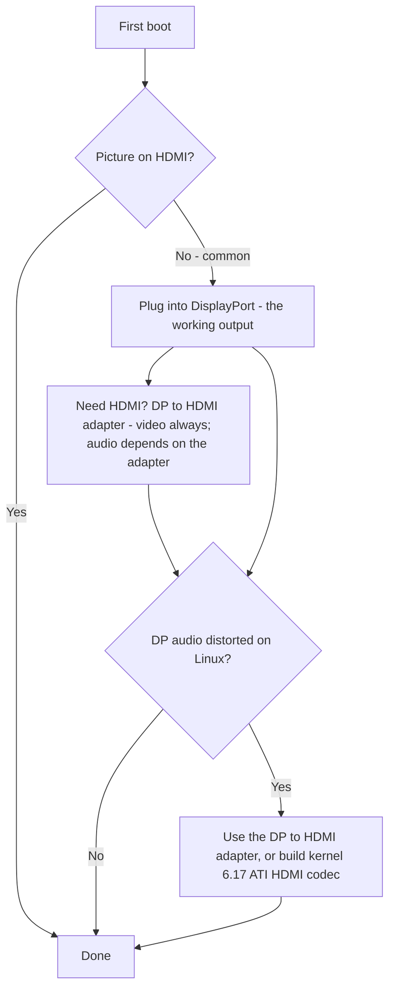

> 🌐 Traduction communautaire. La [version anglaise](../en/14-display.md) fait foi et peut être plus à jour. Une erreur ? [Ouvrez une issue](https://github.com/lildebil0/awesome-bc250/issues).

# Affichage et sortie

> **TL;DR** — Le BC-250 pilote votre moniteur via **DisplayPort**. C'est le connecteur à brancher. Si votre carte a aussi un port HDMI, il **n'affiche souvent rien** — donc un écran noir là n'est *pas* une carte morte, vous êtes juste sur la mauvaise sortie. Besoin de HDMI ? Utilisez un **adaptateur DP→HDMI** — **la vidéo passe toujours, sans lag** ; certains adaptateurs transportent aussi l'**audio** (un modèle testé le faisait, [src](https://t.me/c/2424231195/9148)) mais l'audio dépend de l'adaptateur précis, donc ne comptez pas dessus (voir la section audio). Une vraie particularité : **l'audio DisplayPort sort déformé/ralenti sous Linux** ; le même adaptateur DP→HDMI contourne le problème, et un vrai correctif côté noyau arrive vers le **noyau 6.17** ([src](https://t.me/c/2424231195/17953), [src](https://t.me/c/2424231195/68051)).

« Pas d'image au premier démarrage », c'est la **panique n°1 des nouveaux venus**. Lisez l'encadré ci-dessous avant de décider que quoi que ce soit est cassé.

---

## Pas d'image ? Faites ceci

1. **Branchez sur DisplayPort, pas HDMI.** La sortie vidéo fonctionnelle du BC-250 est DisplayPort ([src](https://t.me/c/2424231195/104784)). Le port HDMI (quand il est présent) est celui qui est généralement vide — ne jugez pas la carte par lui.
2. **Réinsérez la carte et réessayez.** Les cartes ne s'initialisent couramment pas du premier coup — faites un cycle d'alimentation (extinction/allumage complet), et réinsérez physiquement. Un propriétaire : *« quand la mienne est arrivée, elle ne s'est pas allumée du premier coup non plus … parfois elle ne s'initialise pas complètement sur un redémarrage par bouton — off/on règle ça »* ([src](https://t.me/c/2424231195/15701)).
3. **Soupçonnez le câble/adaptateur avant la carte.** Avec une seule carte, un mauvais câble ou adaptateur est le suspect principal ([src](https://t.me/c/2424231195/15699)). Certains adaptateurs fonctionnent dans le firmware mais deviennent noirs une fois l'OS chargé — *« l'image était bonne avant GRUB, écran noir dans le système »* ([src](https://t.me/c/2424231195/38184)).
4. **Réinitialisez le BIOS / reflashez une image connue comme bonne** si plusieurs cartes d'un lot ne donnent aucune image — ça pointe vers le firmware, pas votre moniteur ([src](https://t.me/c/2424231195/15697), [src](https://t.me/c/2424231195/15705)).

Si vous avez coché les quatre et n'avez toujours rien, allez à [troubleshooting.md](troubleshooting.md).



---

## Les sorties en un coup d'œil

| Sortie | Fonctionne ? | Notes |
|--------|--------|-------|
| **DisplayPort** | **Oui — c'est LA sortie** | Connecteur d'affichage principal/unique ; transporte l'audio. La spec I/O du dépôt liste `1x DisplayPort` ([dépôt](https://github.com/mothenjoyer69/bc250-documentation)). C'est du **DisplayPort 1.4**, plafond **4K@120 Hz**, avec HDR10 ([elektricM](https://github.com/elektricM/amd-bc250-docs/blob/main/docs/hardware/display.md)). |
| **Port HDMI** (si présent) | **Souvent vide** | Les nouveaux venus pensent que la carte est morte ; ce n'est généralement pas le cas — passez sur DP. ([src](https://t.me/c/2424231195/104784)) |
| **DP → HDMI via adaptateur** | **Vidéo : oui. Audio : dépend de l'adaptateur** | La vidéo passe sans lag ([src](https://t.me/c/2424231195/9148)) ; l'audio dépend du chipset — testez-le (voir section audio). C'est aussi le correctif standard pour la distorsion audio DP (ci-dessous). |
| **Deuxième sortie vidéo** | **Pas d'origine** | Présente électriquement mais **non peuplée** ; forcer un 2e moniteur nécessite des bidouilles, et d'autres disent que la puce n'a pas de vraie 2e tête — considérez la sortie unique comme l'hypothèse sûre. ([src](https://t.me/c/2424231195/92978), [src](https://t.me/c/2424231195/104682)) |
| **Deuxième écran via le réseau** | **Oui** | Diffusez la sortie du BC-250 vers une autre machine via le LAN (Steam/Sunshine). ([src](https://t.me/c/2424231195/23660)) |

---

## Résolutions, rafraîchissement et câble

La référence d'elektricM précise ce que le lien DP unique fait réellement — utile au moment de choisir un moniteur ou un adaptateur ([elektricM](https://github.com/elektricM/amd-bc250-docs/blob/main/docs/hardware/display.md)) :

| Résolution | Rafraîchissement | Chemin |
|------------|---------|------|
| 1920×1080 (1080p) | 144 Hz+ | DP natif, ou n'importe quel adaptateur |
| 2560×1440 (1440p) | 144 Hz+ | DP natif (les adaptateurs passifs plafonnent souvent à 1440p@60 / DP 1.2) |
| 3840×2160 (4K) | 60 Hz | DP natif, ou adaptateur DP→HDMI 2.0 **actif** |
| 3840×2160 (4K) | 120 Hz | **DP natif uniquement** — un adaptateur actif DP 1.4→HDMI 2.1 est nécessaire pour le 4K@120 via HDMI, et c'est capricieux |

- **Câble :** utilisez un câble **DisplayPort 1.4 certifié VESA**, **1–2 m** ; les câbles plus longs causent des problèmes de synchro/coupure ([elektricM](https://github.com/elektricM/amd-bc250-docs/blob/main/docs/hardware/display.md)).
- **Bloqué en basse résolution** (p. ex. 1024×768/1080p, 60 Hz seulement) signifie généralement que le pilote GPU n'est pas chargé — vérifiez `glxinfo | grep "OpenGL renderer"` ; `llvmpipe` = rendu logiciel, installez Mesa 25.1+ et retirez `nomodeset` ([elektricM](https://github.com/elektricM/amd-bc250-docs/blob/main/docs/troubleshooting/display.md)). Voir [06-linux.md](06-linux.md).
- **HDR (HDR10) et VRR** fonctionnent mais sont expérimentaux sous Linux — **KDE Plasma 6+** a le meilleur support et nécessite généralement une session Wayland ([elektricM](https://github.com/elektricM/amd-bc250-docs/blob/main/docs/hardware/display.md)). **La distribution compte ici :** un rapport communautaire r/BC250Gaming (Reddit) a fait fonctionner **HDR + VRR correctement uniquement sur CachyOS** (Plasma 6 + Wayland), tandis que sur **Bazzite le HDR causait des glitchs graphiques et le VRR n'a jamais fonctionné du tout**. Leur exemple : *Forza Horizon 6* en **1440p High, HDR + VRR activés, 60–80 FPS** via un adaptateur **UGREEN DP→HDMI 2.1**. Si le HDR/VRR est une priorité, voir la note CachyOS dans [06-linux.md](06-linux.md).
  - **Si vous êtes sous Bazzite KDE et voulez le VRR/FreeSync via HDMI**, il existe un remix communautaire qui intègre le travail noyau HDMI 2.1 / FRL d'AMD : **[`dyllan500/bazzite-amd-hdmi-kde`](https://github.com/dyllan500/bazzite-amd-hdmi-kde)** — une image Bazzite KDE reconstruite sur un noyau portant les patchs VRR HDMI-2.1 officiels d'AMD (depuis `amd-staging-drm-next`). ⚠ **à nuancer fortement :** c'est une image tierce, l'auteur n'a testé le VRR que sur une **Radeon 9070 XT** (pas le BC-250), et elle est censée devenir obsolète une fois les patchs intégrés dans un noyau Bazzite standard. Ce n'est *pas* un correctif BC-250 confirmé — considérez-le comme une piste expérimentale à essayer, pas une garantie.

> **Écran noir *après la connexion* (GRUB et l'écran de connexion étaient bons)** est un problème de session de bureau, généralement **Wayland** — choisissez « GNOME sur Xorg »/« Plasma (X11) » au rouage de connexion, ou mettez `WaylandEnable=false` dans `/etc/gdm/custom.conf` ([elektricM](https://github.com/elektricM/amd-bc250-docs/blob/main/docs/hardware/display.md)). Un écran noir *avant* la connexion est le problème pilote/`nomodeset` ci-dessus, pas celui-ci.

---

## L'audio DisplayPort est déformé — le correctif par adaptateur

Sous Linux, l'audio envoyé **directement par DisplayPort** sort mal sur le BC-250 — décrit comme déformé, *« étiré, comme ralenti à moitié vitesse »*, avec des crépitements ([src](https://t.me/c/2424231195/9895)). C'est un **problème Linux/protocole DP, pas un défaut de la carte** — il a aussi été observé sur du matériel non-BC-250 ([src](https://t.me/c/2424231195/15983)).

Le contournement brutal et fiable sur lequel le chat s'est accordé : **faire passer le signal par un adaptateur DP→HDMI.** Converti en HDMI, les artefacts audio disparaissent ([src](https://t.me/c/2424231195/17953), [src](https://t.me/c/2424231195/51763)). Un utilisateur l'a vérifié directement : *« j'ai testé la sortie audio via un adaptateur DisplayPort→HDMI. Tout va bien, aucun lag »* ([src](https://t.me/c/2424231195/9148)).

**Le chemin le plus propre de tous, c'est un *câble* DP→HDMI direct — prise DP d'un côté, prise HDMI de l'autre, aucun dongle ni boîtier adaptateur à aucune extrémité.** Plusieurs utilisateurs du thread communautaire r/linux_gaming rapportent indépendamment que cela donne l'audio le plus fiable : un simple câble (p. ex. un câble Amazon Basics DP-vers-HDMI, ~10 $) « marche tout seul » là où les adaptateurs de type dongle sont aléatoires. De brèves coupures audio occasionnelles peuvent toujours survenir, mais un câble monobloc supprime le chipset d'adaptateur supplémentaire qui fait de la voie dongle un pari ([r/linux_gaming](https://www.reddit.com/r/linux_gaming/comments/1nvsgji/)). Si vous achetez de toute façon, **préférez le câble au dongle.**

**Si vous n'avez aucun adaptateur sous la main,** routez l'audio en **Bluetooth** à la place — la plupart des enceintes/casques le supportent et cela évite entièrement la voie DP ([src](https://t.me/c/2424231195/89769)). Voir [10-wifi-bt.md](10-wifi-bt.md) pour le dongle BT.

### Notes sur les adaptateurs (communauté)
- **Pour du 4K@60+, il vous faut un adaptateur/câble *actif*** (le passif plafonne à ~1440p@60). Un exemple qui fonctionne, testé : **UGREEN DP125 (câble DP→HDMI 4K)** — annoncé 4K@30 mais a négocié du 4K@60 sur une TV ([src](https://t.me/c/2424231195/52398)). Actif vs passif fixe le plafond de résolution — cela ne **décide pas** si l'audio passe (voir ci-dessous).
- **Tous les adaptateurs ne transportent pas l'audio.** L'adaptateur Belsis d'un propriétaire passait du 4K@60 *avec* le son, tandis que plusieurs unités Ugreen plus chères affichaient « HDMI digital audio » dans la liste des périphériques mais ne sortaient aucun son — et l'une décalait les voix d'une octave vers le bas ([src](https://t.me/c/2424231195/106617)). Si vous obtenez la vidéo mais pas l'audio, l'adaptateur est la variable — essayez-en un autre.
- **Pour l'*audio* HDMI, optez pour un adaptateur *passif* d'abord.** Un schéma communautaire sur le thread r/linux_gaming : les adaptateurs DP→HDMI **passifs** ont tendance à passer l'audio proprement, tandis que les adaptateurs **actifs** **suppriment souvent l'audio entièrement ou le décalent en hauteur** (voix rapportées comme glissant d'environ ~20 % / à peu près une quinte). Le hic : vous n'*avez besoin* d'un adaptateur actif que pour du vrai **HDR** (et pour le 4K@60+), donc c'est un véritable compromis — passif pour un son fiable, actif pour le HDR. Options *passives* confirmées comme fonctionnelles par la communauté : **Silver Monkey**, **BENFEI (ASIN B017Q8ZVWK)**, et le **câble AmazonBasics DP-vers-HDMI** (le câble monobloc — *pas* leur adaptateur de type dongle) ([r/linux_gaming](https://www.reddit.com/r/linux_gaming/comments/1nvsgji/)). ⚠ les SKU précis sont rapportés par la communauté, pas vérifiés en labo ici — et un adaptateur passif plafonne toujours à ~**1440p@60**.
- Des adaptateurs **4K@60 DP→HDMI** bon marché qui passent à la fois vidéo et audio existent et sont rapportés comme fonctionnels ([src](https://t.me/c/2424231195/133977)).
- Certains adaptateurs se comportent mal spécifiquement sur les **moniteurs 4K** ([src](https://t.me/c/2424231195/1988)).
- **L'audio via un adaptateur DP→HDMI est inconstant et dépend du chipset de l'adaptateur — pas simplement de l'actif vs passif.** La vidéo passe toujours ; **l'audio est la variable.** Nos rapports communautaires sont au cas par cas (unités UGREEN/Belsis rapportées comme transportant le son, d'autres unités muettes), et le guide d'elektricM rapporte la répartition *inverse* (le passif transportant l'audio, certaines unités actives muettes — p. ex. Cable Matters/StarTech) — ce qui est exactement pourquoi l'étiquette actif/passif ne le prédit pas ([elektricM](https://github.com/elektricM/amd-bc250-docs/blob/main/docs/troubleshooting/display.md)). Pour un audio **fiable**, ne pariez pas sur un adaptateur : préférez un **affichage/récepteur AV nativement DisplayPort**, ou sortez le son via **USB (un DAC/périphérique son USB)**. Si vous utilisez un adaptateur, **testez l'audio avant de vous y fier** — et rappelez-vous qu'un adaptateur **passif** plafonne à ~**1440p@60**.

### Le correctif noyau 6.17 (audio DP direct, sans adaptateur)

Si vous voulez un audio propre **directement via DisplayPort** sans adaptateur, la cause et le correctif ont été retracés dans le chat. La config noyau standard de Fedora compilait `snd-hda-codec-hdmi.ko` + `snd-hdmi-lpe-audio.ko` ; **le noyau 6.17 a changé le chemin audio HDMI** et a cassé le son sur cette config par défaut. Le correctif est de compiler aussi le **codec ATI HDMI** — basculez la config noyau de `# CONFIG_SND_HDA_CODEC_HDMI_ATI is not set` à `CONFIG_SND_HDA_CODEC_HDMI_ATI=m`, ce qui packagent `snd-hda-codec-atihdmi.ko` ; le son fonctionne alors **sans patchs** ([src](https://t.me/c/2424231195/68051), [src](https://t.me/c/2424231195/68061)).

```text
# Fedora kernel config change for DP/HDMI audio on kernel 6.17+
# from:
# CONFIG_SND_HDA_CODEC_HDMI_ATI is not set
# to:
CONFIG_SND_HDA_CODEC_HDMI_ATI=m
```

Avec ce troisième codec (`snd-hda-codec-atihdmi.ko`) présent, ALSA expose les sorties audio de la carte (p. ex. `pcm=3` et `pcm=7` comme deux périphériques HDMI) ([src](https://t.me/c/2424231195/68062), [src](https://t.me/c/2424231195/67569)). ⚠ à vérifier — cela nécessite de compiler un noyau personnalisé ; considérez l'adaptateur DP→HDMI comme la voie sans compilation pour la plupart des utilisateurs. Voir [06-linux.md](06-linux.md) pour la configuration noyau/pilote.

### Son surround (5.1) — utilisez une carte son USB, pas HDMI

**Le surround 5.1 via HDMI ne fonctionne *pas* sur le BC-250.** Le firmware HDMI d'AMD sous Linux pour cette puce headless/de minage n'expose pas le LPCM multicanal, donc la sortie HDMI retombe en stéréo simple quel que soit ce que le récepteur supporte ([r/linux_gaming](https://www.reddit.com/r/linux_gaming/comments/1nvsgji/)). Pour du vrai multicanal, routez l'audio par une **carte son USB / DAC USB** à la place — réglez-la comme sink par défaut dans `pavucontrol`, puis confirmez les six canaux avec :

```bash
speaker-test -D pipewire -c 6 -t wav
```

La même voie DAC-USB est aussi le correctif fiable pour l'audio stéréo quand les adaptateurs se comportent mal (ci-dessus).

---

## La deuxième sortie (inactive initialement)

Il y a une **deuxième sortie vidéo sur la carte qui n'est pas active d'origine.** La lecture communautaire est partagée et il vaut la peine de connaître les deux moitiés :

- Elle est **présente électriquement mais non peuplée/soudée**, et *« avec des bidouilles vous pouvez faire fonctionner un 2e moniteur »* ([src](https://t.me/c/2424231195/92978)).
- D'autres rapportent que la puce n'a simplement **aucune deuxième tête utilisable** — *« le problème est dans la puce, la deuxième sortie n'est physiquement pas là »* ([src](https://t.me/c/2424231195/104682)).

En pratique : **supposez une seule sortie DisplayPort.** Un **séparateur MST DP pour deux écrans indépendants a été évoqué mais pas confirmé comme fonctionnel** dans notre chat ([src](https://t.me/c/2424231195/92109)).

**Mise à jour d'elektricM — le MST peut piloter deux écrans avec le bon hub.** Les tests d'elektricM rapportent jusqu'à **2 affichages via un hub MST DP** (bande passante partagée, résolution par affichage limitée), avec des résultats hub par hub ([elektricM](https://github.com/elektricM/amd-bc250-docs/blob/main/docs/hardware/display.md)) :

| Hub MST | Sortie | Ver DP | Affichages indépendants ? | Audio | Notes |
|---------|-----|--------|-----------------------|-------|-------|
| StarTech MST14DP122DP | 2× DP | 1.4 | **Oui** | Oui | A fonctionné de façon constante sur les moniteurs/câbles |
| Monoprice 21972 | 2× DP | 1.2 | **Miroir seulement** | Oui | Ne pouvait que mirrorer |
| ENBUER | 2× DP | 1.2 | **Miroir seulement** | Oui | Ne pouvait que mirrorer |
| MST HDMI générique | 2× HDMI | — | **Non** | Non | Ni vidéo ni audio |

Donc le double moniteur natif **est** possible via MST avec un hub DP 1.4 (StarTech confirmé) ; les hubs DP 1.2 moins chers peuvent ne faire que du miroir, et les hubs MST HDMI ont échoué. ⚠ à vérifier — un seul modèle de hub confirmé ; les résultats varient selon le hub.

**Autre voie multi-affichage — adaptateur USB DisplayLink.** Ajoutez un adaptateur USB→HDMI/DP DisplayLink pour un écran **bureau** supplémentaire (branchez-le *après* le démarrage pour de meilleurs résultats). **Pas pour le jeu** — il compresse sur le CPU, qui est le goulet d'étranglement du BC-250, donc la latence est élevée ; il ne fonctionne pas non plus en **mode jeu** Steam Deck ([elektricM](https://github.com/elektricM/amd-bc250-docs/blob/main/docs/hardware/display.md)).

---

## Deuxième écran via le réseau (le « 2e affichage » facile)

Si vous voulez vraiment l'image du BC-250 sur un deuxième appareil, la voie éprouvée n'est pas un deuxième câble — c'est le **streaming via le LAN.** Un utilisateur : *« j'ai lancé un jeu Steam sur le BC-250 (Fedora) et l'ai diffusé via le réseau vers mon portable de travail, contrôlé depuis le portable. Tout a fonctionné »* ([src](https://t.me/c/2424231195/23660)).

- **Sunshine** (encodeur hôte) fonctionne ici parce qu'il n'est pas réservé à NVIDIA — il fait l'encodage, le client ne fait que décoder ([src](https://t.me/c/2424231195/25091)). Sur un LAN gigabit, il est rapporté comme quasi sans défaut ([src](https://t.me/c/2424231195/25563)).
- **Moonlight comme hôte** ne convient *pas* — il attend un encodeur NVIDIA et saccade/se plaint d'un décodeur matériel manquant ([src](https://t.me/c/2424231195/25050)). Utilisez Sunshine comme hôte, Moonlight uniquement comme client.

C'est aussi la façon pratique d'obtenir une sensation de « double affichage » sans la deuxième sortie non peuplée ci-dessus.

---

## Sources

- L'adaptateur DP→HDMI passe vidéo+audio, sans lag — https://t.me/c/2424231195/9148
- La distorsion audio DP est un problème Linux ; l'adaptateur la corrige — https://t.me/c/2424231195/17953 · https://t.me/c/2424231195/9895 · https://t.me/c/2424231195/51763 · https://t.me/c/2424231195/15983
- Correctif audio noyau 6.17 (`CONFIG_SND_HDA_CODEC_HDMI_ATI=m`) — https://t.me/c/2424231195/68051 · https://t.me/c/2424231195/68061 · https://t.me/c/2424231195/68062 · https://t.me/c/2424231195/67569
- Adaptateurs fonctionnels — UGREEN DP125 https://t.me/c/2424231195/52398 · Belsis vs autres (l'audio varie) https://t.me/c/2424231195/106617 · 4K@60 bon marché https://t.me/c/2424231195/133977
- DP est la sortie fonctionnelle ; investissez dans un bon adaptateur DP→HDMI — https://t.me/c/2424231195/104784
- Pas d'image au premier démarrage / réinsertion / reflash — https://t.me/c/2424231195/15697 · https://t.me/c/2424231195/15699 · https://t.me/c/2424231195/15701 · https://t.me/c/2424231195/38184
- Deuxième sortie présente mais non peuplée / débattue — https://t.me/c/2424231195/92978 · https://t.me/c/2424231195/104682 · MST évoqué https://t.me/c/2424231195/92109
- Deuxième écran réseau (Sunshine/Steam via LAN) — https://t.me/c/2424231195/23660 · https://t.me/c/2424231195/25091 · https://t.me/c/2424231195/25050 · https://t.me/c/2424231195/25563
- Audio Bluetooth en alternative — https://t.me/c/2424231195/89769
- Le *câble* DP→HDMI direct (sans adaptateurs) est l'audio le plus fiable ; le 5.1 via HDMI ne fonctionne pas (pas de LPCM multicanal), utilisez une carte son USB / DAC — thread communautaire r/linux_gaming https://www.reddit.com/r/linux_gaming/comments/1nvsgji/
- Référence I/O matériel (`1x DisplayPort`) — [mothenjoyer69/bc250-documentation](https://github.com/mothenjoyer69/bc250-documentation) · [`hardware.md`](https://github.com/mothenjoyer69/bc250-documentation/blob/main/hardware.md)
- DP 1.4 / 4K@120 / HDR10, limites résolution+câble, hubs MST (max 2), DisplayLink, écran noir connexion Wayland — elektricM [`hardware/display.md`](https://github.com/elektricM/amd-bc250-docs/blob/main/docs/hardware/display.md)
- HDR + VRR fonctionnels sur CachyOS (Plasma 6 + Wayland) vs cassés sur Bazzite ; Forza Horizon 6 1440p High HDR+VRR via UGREEN DP→HDMI 2.1 — rapport communautaire r/BC250Gaming (Reddit) (voir [06-linux.md](06-linux.md))
- Le DP→HDMI passif transporte l'audio / l'actif le supprime ou le décale en hauteur ; passif mais nécessaire pour le HDR ; passifs confirmés Silver Monkey / BENFEI B017Q8ZVWK / câble AmazonBasics DP-vers-HDMI — [thread communautaire r/linux_gaming](https://www.reddit.com/r/linux_gaming/comments/1nvsgji/)
- Remix Bazzite KDE VRR/FreeSync via HDMI (noyau AMD HDMI 2.1 ; testé sur 9070 XT, pas BC-250) — [`dyllan500/bazzite-amd-hdmi-kde`](https://github.com/dyllan500/bazzite-amd-hdmi-kde)
- L'audio par adaptateur dépend du chipset (elektricM a vu le passif le transporter / certains actifs muets ; la communauté a vu l'inverse — donc préférez le DP natif ou un DAC USB), vérification basse résolution llvmpipe — elektricM [`troubleshooting/display.md`](https://github.com/elektricM/amd-bc250-docs/blob/main/docs/troubleshooting/display.md)

> La configuration pilote/noyau est dans [06-linux.md](06-linux.md) ; les pièges audio/sortie sont aussi indexés dans [troubleshooting.md](troubleshooting.md) et [faq.md](faq.md).
