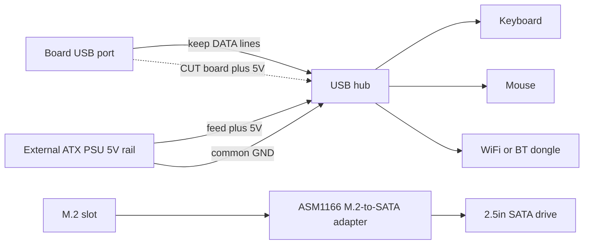

> 🌐 Traduction communautaire. La [version anglaise](../en/16-usb-peripherals.md) fait foi et peut être plus à jour. Une erreur ? [Ouvrez une issue](https://github.com/lildebil0/awesome-bc250/issues).

# USB, hubs et périphériques

> **TL;DR** — La carte vous offre **4 ports USB à l'arrière (2× USB 2.0 + 2× USB 3.0)** et c'est tout — aucun connecteur interne câblé par défaut. Un dongle WiFi/BT, un SSD-via-USB, un clavier, une souris et une manette les dévorent rapidement, donc presque tout le monde ajoute un **hub USB**. Le hic : le **rail USB 5 V de la carte est faible** et s'affaisse sous charge, donc les hubs bon marché alimentés par le bus (et même les clés USB connectées directement) décrochent. Les solutions fiables, dans l'ordre : un **hub alimenté (actif)**, ou le **mod d'injection 5 V** de la communauté — couper le 5 V que le hub prend sur la carte et lui fournir 5 V depuis votre alimentation ATX à la place. ([src](https://t.me/c/2424231195/119741))

C'est une page **accessoires**. Réussissez le hub et le reste (audio, Ethernet-sur-USB, docks) fonctionne tout seul.

---

## Combien de ports USB vous obtenez réellement

D'après la référence matérielle, l'E/S arrière comprend **1× DisplayPort, 1× GbE Ethernet, 2× USB 2.0, 2× USB 3.0**. Soit quatre ports USB physiques. ([hardware.md](https://github.com/mothenjoyer69/bc250-documentation/blob/main/README.md))

En pratique, les deux ports **USB 3.0** sont ceux que les gens se disputent (plus rapides, utilisés pour les SSD/docks), et ils sont câblés **étroitement** sur le plan électrique — un propriétaire décrit le connecteur comme effectivement « x2 », et met en garde contre le fait d'y accrocher un répartiteur. ⚠ vérifiez la largeur de voie exacte. ([src](https://t.me/c/2424231195/75561))

La pression est réelle dès que vous listez ce qui veut un port : **branchez un SSD — un port disparu ; ajoutez un dongle WiFi USB, un joystick, un disque externe — il vous faut un hub, sinon vous risquez de griller le port.** ([src](https://t.me/c/2424231195/75558)) Les gens rapportent régulièrement « tous les USB 3.0 occupés, clavier et souris passant par un hub. » ([src](https://t.me/c/2424231195/110875))

Il n'y a **aucun connecteur USB en façade peuplé** d'origine — mais le boîtier/la carte dispose d'un emplacement clairement prévu pour acheminer le câble d'un hub vers l'avant, que plusieurs montages en boîtier utilisent. ([src](https://t.me/c/2424231195/91322)) · ([src](https://t.me/c/2424231195/100249))

---

## Le vrai problème : le rail USB 5 V est faible

La BC-250 génère le **5 V pour l'USB sur la carte elle-même** ([src](https://t.me/c/2424231195/57920)), et ce rail ne peut pas fournir grand-chose. La mesure la plus claire du chat, sur une carte qui n'énumérait pas les périphériques :

> « Ma BC-250 [ne] donne pas un 5 V correct sur l'USB… seul un clavier fonctionne ; si je branche une souris, le clavier s'éteint. ~**4,3 V** avec seulement le clavier, **2,3 V–3,2 V** avec clavier + souris, **5,1 V** avec les deux retirés. » ([src](https://t.me/c/2424231195/119071))

Cet affaissement de tension explique pourquoi les symptômes se regroupent autour de la **charge** : des clés USB et des micros qui **décrochent quand on les branche directement mais fonctionnent bien via un hub**, des claviers qui perdent leurs LED, des périphériques qui décrochent dès que deux choses tirent du courant en même temps. ([src](https://t.me/c/2424231195/53939)) C'est la même sensibilité à l'alimentation qui rend les dongles WiFi capricieux — voir **[10-wifi-bt.md](10-wifi-bt.md)**, où les clés tournent au repos puis décrochent lors d'un pic de téléchargement.

> ⚠ Toutes les cartes ne sont pas aussi mauvaises. Un propriétaire alimente un **dongle WiFi + clavier filaire + souris via un hub non alimenté + un écran 14″ + un écran auxiliaire 3,5″** depuis l'USB de la carte et indique que ça marche bien. ([src](https://t.me/c/2424231195/119231)) Considérez votre propre carte comme inconnue jusqu'à ce que vous la mettiez sous charge.

---

## Choisir un hub : alimenté ou non alimenté

| Type de hub | Quand ça marche | Verdict |
|----------|---------------|---------|
| **Non alimenté (alimenté par le bus)** | Charges légères — clavier, souris, un dongle. Certaines cartes en font tourner une quantité surprenante ainsi. ([src](https://t.me/c/2424231195/119231)) | À essayer en premier ; **attendez-vous à des décrochages** dès que vous ajoutez un disque ou que la charge fait un pic. |
| **Alimenté / actif (bloc 5 V externe)** | Tout ce qui comporte des disques, plusieurs dongles, ou sous charge. La recommandation permanente de la communauté pour la BC-250. ([src](https://t.me/c/2424231195/75558)) · ([src](https://t.me/c/2424231195/119229)) | **Achetez ça.** Résout l'affaissement sans toucher à la carte. ([src](https://t.me/c/2424231195/140091)) |
| **Mod d'injection 5 V** (voir ci-dessous) | Quand vous voulez un montage en boîtier propre, alimenté entièrement par l'alimentation ATX et que vous ne voulez pas d'un second bloc secteur. | Meilleure intégration, nécessite de la soudure. ([src](https://t.me/c/2424231195/119741)) |

Le conseil répété quand les périphériques USB de quelqu'un se comportent mal est simple : **procurez-vous un hub USB actif avec une entrée pour adaptateur secteur.** ([src](https://t.me/c/2424231195/119229)) Plusieurs propriétaires y ont fini par là après avoir lutté contre les décrochages — « ça s'est résolu avec un hub alimenté en externe. » ([src](https://t.me/c/2424231195/123789))

> Une mise en garde soulevée dans le chat : se reposer sur un hub alimenté en externe peut être **permanent** — une fois que vous déchargez l'alimentation USB en externe, ne soyez pas surpris d'être coincé avec ce hub pour de bon. ([src](https://t.me/c/2424231195/123924)) C'est un bon compromis pour un montage de bureau.

---

## Le mod d'injection 5 V (faire qu'un hub normal se comporte bien)

C'est la solution élégante pour un **montage en boîtier déjà alimenté par une alimentation ATX/SFX** : au lieu d'acheter un hub alimenté activement avec son propre adaptateur secteur, vous prenez un hub ordinaire et **changez d'où vient son 5 V**.

Ce qu'un utilisateur a fait, et ça a marché ([src](https://t.me/c/2424231195/119741)) :

> « J'ai modifié un hub USB normal et ça a marché. J'ai **coupé le 5 V venant de la carte mère et donné 5 V depuis l'alimentation**. Je n'ai pas eu besoin de connecter la masse parce que j'utilise la même alimentation ATX pour alimenter ma BC-250. »

Comment ça fonctionne :

1. Ouvrez le hub ; trouvez la piste/le fil **5 V (VBUS)** côté **amont** (le câble qui se branche dans la carte).
2. **Coupez ce 5 V** pour que le hub ne tire plus de courant du rail faible de la carte.
3. Alimentez le hub en **+5 V depuis votre alimentation ATX** (une ligne SATA/Molex 5 V disponible).
4. **La masse est partagée** automatiquement parce que la même alimentation alimente déjà la carte — aucun fil de masse supplémentaire nécessaire. (Si jamais vous alimentez le hub depuis une alimentation *séparée*, vous **devez** relier les masses ensemble.)

Les lignes de données restent intactes — vous ne changez que la source d'alimentation. La carte voit un hub qui ne charge plus son rail 5 V, et les périphériques obtiennent une alimentation propre et abondante depuis l'alimentation.



> ⚠ Couper la mauvaise piste détruit le hub (pas cher) — mais assurez-vous de couper **VBUS, pas une ligne de données**. Vérifiez deux fois au multimètre avant de souder.

---

## Camelote à éviter

- **Hubs Hoco** — signalés comme peu fiables ; un propriétaire **a dû ressouder le même hub Hoco deux fois**. ([src](https://t.me/c/2424231195/74531))
- **Hubs « USB 3.0 » qui n'en sont pas** — un « hub/dock USB 3.0 » AliExpress à 160 ₽ a été signalé comme **certainement pas du vrai 3.0** à ce prix. ([src](https://t.me/c/2424231195/8761)) · ([src](https://t.me/c/2424231195/8764))
- **Chaîner des hubs** pour multiplier les ports — soulevé comme idée ([src](https://t.me/c/2424231195/104653)) mais ça empile le problème d'alimentation ; un rail faible alimente désormais deux hubs. Utilisez plutôt un seul bon hub alimenté.
- **« Hubs » répartiteurs SATA** depuis le slot M.2 — une confusion récurrente. Avec seulement **2 voies PCIe** sur le M.2, vous ne pouvez pas raisonnablement accrocher un contrôleur SATA et espérer qu'il se déploie ; « ces hubs un-SATA-en-entrée, plusieurs-en-sortie sont de la camelote. » ([src](https://t.me/c/2424231195/22539)) Ce n'est pas un sujet USB — ne le confondez simplement pas avec l'expansion USB.
- ★ **Contrôleur M.2→SATA PH516 (6 ports) — confirmé NON fonctionnel.** Le port s'énumère mais le disque ne s'attache pas, et une **deuxième personne a reproduit** la même panne ([4pda — Strange999](https://4pda.to/forum/index.php?showtopic=1104980)). Achetez plutôt l'**ASM1166** recommandé par la communauté (voir la section stockage) — le PH516 est une impasse connue sur cette carte.

Un hub avec un **codec audio intégré** est un bon gain de place pour les montages en boîtier (un seul périphérique vous donne des ports supplémentaires *et* une prise 3,5 mm), et les gens en utilisent. ([src](https://t.me/c/2424231195/8751)) La qualité audio varie — c'est un codec bon marché. ([src](https://t.me/c/2424231195/39708))

---

## Connecteur USB 3.0 interne (Type-E)

Si votre boîtier a une **prise USB 3.0 en façade** (le connecteur 20 broches « Key-A/Type-E »), vous voudrez l'alimenter depuis l'USB 3.0 de la carte. Il n'y a **aucun connecteur 20 broches natif**, donc les gens adaptent :

- Un **câble USB 3.1 Type-E → USB 3.0 (Type-A)** d'AliExpress est la voie propre. Un AXONUS 50 cm a été partagé dans le chat. ([src](https://t.me/c/2424231195/133182)) Une variante Xiwai Type-E → 20 broches a aussi été postée. ([src](https://t.me/c/2424231195/125127))
- Ou **épissez** le câble d'origine du boîtier sur une prise USB 3.1 ordinaire — la méthode « relier un serpent à un hérisson » quand aucun adaptateur ne convient. ([src](https://t.me/c/2424231195/135957))

**Statut :** **l'USB 2.0 est confirmé fonctionnel ; l'USB 3.0 restait à tester pleinement** par le propriétaire qui l'a rapporté (test en attente après le montage en boîtier). Considérez le 3.0-sur-adaptateur comme ⚠ à vérifier sur votre matériel. ([src](https://t.me/c/2424231195/136215))

---

## Stockage (slot M.2 et disques SATA)

Le seul connecteur de stockage interne de la carte est un **unique slot M.2**, et il est câblé en **PCIe 2.0 ×2** — donc le plafond pratique est d'**~1 Go/s** ([src](https://t.me/c/2424231195/66275)) · ([src](https://t.me/c/2424231195/135506)). Un NVMe Gen3/Gen4 rapide *fonctionnera*, mais il ne peut pas atteindre sa vitesse nominale ici, donc inutile de payer pour un disque haut de gamme. **Un SSD NVMe M.2 normal est le disque de démarrage le plus simple** — glissez-le dans le slot et installez-y Linux (voir **[06-linux.md](06-linux.md)** pour l'installation).

### Brancher des disques durs/SSD SATA 2,5″

Il n'y a pas de port SATA sur la carte, donc pour accrocher un **disque SATA 2,5″** (ou plusieurs), vous mettez une **carte adaptateur M.2 → SATA** dans le slot M.2. Le choix confirmé de la communauté est la carte d'extension **ASM1166 (M.2 PCIe → SATA)** ([src](https://t.me/c/2424231195/135180)). L'autre voie que les gens empruntent est un simple **SSD M.2 SATA directement dans la carte** — pas d'adaptateur, juste une clé M.2 au protocole SATA. ([src](https://t.me/c/2424231195/87411))

C'est l'une des **questions de débutant les plus fréquentes** — *« est-ce l'adaptateur dont j'ai besoin pour connecter un disque dur à la carte ? »* et *« quelles autres façons existe-t-il pour connecter un disque ? »* ([src](https://t.me/c/2424231195/135164)) · ([src](https://t.me/c/2424231195/135165)) — donc si vous la posez, vous êtes en bonne compagnie.

> ⚠ à vérifier — la carte ASM1166 est une recommandation de la communauté, pas un résultat testé-par-beaucoup sur la BC-250 spécifiquement. Confirmez que l'adaptateur que vous choisissez s'énumère et démarre avant de compter dessus. Notez aussi que les **2 voies PCIe** du M.2 ne peuvent pas raisonnablement alimenter un *répartiteur* un-SATA-en-entrée / plusieurs-en-sortie — voir **Camelote à éviter** ci-dessus. ([src](https://t.me/c/2424231195/22539))

#### ★ Alimenter un disque SATA 2,5″ (la carte est en 12 V uniquement)

La carte adaptateur ci-dessus gère les **données**, mais un disque SATA 2,5″ a aussi besoin d'une **alimentation 5 V** sur son connecteur d'alimentation SATA — et la carte BC-250 ne délivre que du **12 V**, sans connecteur d'alimentation SATA où se brancher. La solution pratique d'un montage : un **adaptateur USB→alimentation-SATA fournissant 5 V** au disque, avec un **convertisseur abaisseur (buck) 12 V→5 V** produisant ce 5 V depuis le 12 V de la carte ([montage TMG HD](https://youtu.be/OEO0r01zcfU) ; ⚠ approx — paraphrasé de la démonstration vidéo). Autrement dit : l'ASM1166 (ou une clé M.2 SATA) transporte les *données* SATA ; le convertisseur buck + l'adaptateur USB→alimentation-SATA transporte l'*alimentation* SATA. Un boîtier 2,5″ auto-alimenté ou un dock alimenté contourne tout le problème en apportant son propre rail 5 V.

#### ★ SteamOS « no nvme drive detected » avec une clé M.2 SATA

Si vous démarrez SteamOS avec un **SSD M.2 SATA** (par ex. un **Kingston SNS41**) au lieu d'un NVMe, le flux d'installation/réparation peut échouer avec **« no nvme drive detected »** — SteamOS suppose que le disque est un périphérique NVMe (`nvme…`), mais une clé SATA s'énumère en `sda`. La solution est d'éditer le script de réparation et de le pointer vers le bon nom de périphérique ([4pda — pornocrat](https://4pda.to/forum/index.php?showtopic=1104980)) :

```bash
# Edit the SteamOS repair script and replace the device name nvme -> sda
nano ~/tools/repair_device.sh
# change every "nvme" reference to "sda", save, then re-run the install/repair
```

C'est purement une incohérence de nommage de périphérique — la clé SATA fonctionne bien une fois qu'on dit à SteamOS de regarder `sda` plutôt qu'un nœud `nvme`.

### Les anciens disques SATA conviennent

Comme le lien M.2 plafonne tout à ~1 Go/s de toute façon, un vieux **disque dur/SSD SATA 2,5″** est parfaitement adéquat pour une **bibliothèque de jeux ou des jeux plus anciens** — la vitesse que vous perdriez est une vitesse que la carte ne peut pas fournir. ([src](https://t.me/c/2424231195/132739)) Un **boîtier USB-NVMe** est une autre option si vous préférez garder le slot M.2 libre, mais les boîtiers qui font réellement du NVMe (pas du SATA) commencent plus cher — pour une petite clé de démarrage, ça ne vaut pas le coup. ([src](https://t.me/c/2424231195/111022))

### Intel Optane 16 Go en cache/swap — idée de la communauté, verdict tiède

Utiliser un petit module **Intel Optane 16 Go NVMe** comme périphérique de cache ou de swap a été évoqué comme idée, avec un verdict sobre ([4pda](https://4pda.to/forum/index.php?showtopic=1104980)) : les modules **« Optane » 16 Go vendus sur Ozon se sont avérés ne pas être de vrais Optane** selon les tests des membres eux-mêmes, le **slot M.2 de la carte est lent** (PCIe 2.0 ×2, ~1 Go/s) donc l'avantage de latence est émoussé, et bien qu'un **fichier d'échange (swap) soit possible en théorie**, ce n'est pas un gain clair ici. Considérez-le comme une curiosité, pas comme une mise à niveau recommandée.

---

## Docks et stations d'accueil

Un **dock** de type USB-C / Thunderbolt peut faire office d'un seul gros hub (USB + Ethernet + parfois vidéo), et des propriétaires en ont utilisé :

- Un **dock USB-C double-4K Wavlink WL-UG69DK1** est utilisé par un membre. ([src](https://t.me/c/2424231195/68141))
- Un **dock DisplayLink** fonctionne comme un **hub USB + carte son USB** ; le membre n'a **pas** pu en obtenir de sortie vidéo (s'est heurté à un mur TPM/BIOS), donc considérez la *vidéo* d'un dock comme peu fiable. ([src](https://t.me/c/2424231195/104776))
- Pour des **moniteurs supplémentaires en particulier**, un dock ne contournera pas la limite de sortie propre au GPU — voir **[14-display.md](14-display.md)** avant de compter dessus.

En résumé : les docks conviennent comme **hubs alimentés** (ils apportent leur propre alimentation, ce qui contourne proprement le problème du 5 V). N'en achetez pas un en espérant que sa sortie **vidéo** fonctionne.

---

## Manettes et entrées

Les manettes de jeu empruntent le même rail USB faible et le même Bluetooth capricieux que tout le reste (voir **[10-wifi-bt.md](10-wifi-bt.md)** pour les dongles BT). Quelques constats spécifiques :

- **DualSense sous Linux via DS5Dongle (Raspberry Pi Pico 2W).** Ce dongle ouvert donne à la DualSense ses **haptiques HD + haut-parleur** sous Linux et une **interface web** pour le taux de polling / le volume — mais il y a un hic pour l'audio des jeux : les titres Wine/Proton n'obtiennent l'audio de la manette qu'en **mode Direct** (la manette apparaît comme une unique **carte audio 4 canaux**), et **toutes les distributions n'exposent pas ce mode** ([4pda — korotyshev](https://4pda.to/forum/index.php?showtopic=1104980)). Par ailleurs, le pilote du noyau **`hid-playstation`** (support natif de la DualSense) nécessite **Bluetooth ≥ 5.0** sur l'adaptateur ([4pda — xDarkman](https://4pda.to/forum/index.php?showtopic=1104980)).
- **GameSir T4 Kaleid + son dongle 2,4 GHz** est une voie manette/entrée fonctionnelle qui contourne entièrement le Bluetooth — une entrée au ressenti filaire via un récepteur USB 2,4 GHz au lieu de lutter contre l'appairage BT ([TiredDadTech](https://youtu.be/zi7sldeRd2w) ; ⚠ approx — paraphrasé de la vidéo).
- **Le port du dongle BT compte : le dongle Bluetooth UGREEN ne fonctionne que dans un port USB 2.0, pas USB 3.0.** Le bruit RF / le câblage électrique des ports 3.0 le casse ; déplacez-le vers l'un des deux ports **USB 2.0** et il fonctionne ([4pda — InfernalWolf666](https://4pda.to/forum/index.php?showtopic=1104980)). (Le même effet de bruit USB 3.0 qui afflige les clés WiFi/BT — voir [10-wifi-bt.md](10-wifi-bt.md).)

---

## Configuration de départ recommandée

| Niveau | Faites ceci | Pourquoi |
|------|---------|-----|
| Minimum | Hub alimenté par le bus pour clavier/souris/dongle | Gratuit si vous en avez un ; convient aux charges légères ([src](https://t.me/c/2424231195/119231)) |
| **Recommandé** | **Hub USB alimenté (actif)** avec son propre bloc 5 V | Corrige l'affaissement, pas de soudure, les disques + dongles restent stables ([src](https://t.me/c/2424231195/75558)) |
| Montage en boîtier | Hub ordinaire + **mod d'injection 5 V** depuis l'alimentation ATX/SFX | Intégration la plus propre, un bloc secteur de moins ([src](https://t.me/c/2424231195/119741)) |

Un montage en boîtier de référence populaire est exactement cela : **Cooler Master MasterBox NR200P + un hub USB + une alimentation SFX** — le hub est traité comme une pièce par défaut du montage, pas comme un détail accessoire. ([src](https://t.me/c/2424231195/81149)) Voir **[05-case.md](05-case.md)** pour le côté boîtier ; un boîtier imprimable prêt à l'emploi regroupe même un agencement disque dur + hub USB. ([printables](https://www.printables.com/model/1580750-bc250-amd-case-v3-hp-server-psu-hdd-usb-hub))

---

## Sources

- Mod d'injection 5 V (couper le 5 V de la carte, alimenter depuis l'alimentation) — https://t.me/c/2424231195/119741 · question pratique — https://t.me/c/2424231195/119795
- Affaissement de tension USB mesuré (4,3 V → 2,3 V) — https://t.me/c/2424231195/119071 · la carte fait le 5 V à bord — https://t.me/c/2424231195/57920
- Budget de ports / « il vous faut un hub alimenté ou vous risquez de griller le port » — https://t.me/c/2424231195/75558 · USB est en x2 — https://t.me/c/2424231195/75561 · tous les 3.0 occupés — https://t.me/c/2424231195/110875
- Le hub actif est la solution — https://t.me/c/2424231195/119229 · https://t.me/c/2424231195/123789 · https://t.me/c/2424231195/140091 · peut être permanent — https://t.me/c/2424231195/123924
- Le hub non alimenté fonctionne sur certaines cartes — https://t.me/c/2424231195/119231 · la connexion directe décroche, le hub corrige — https://t.me/c/2424231195/53939
- Hub Hoco peu fiable / ressoudé deux fois — https://t.me/c/2424231195/74531 · faux hub « 3.0 » bon marché — https://t.me/c/2424231195/8761 · https://t.me/c/2424231195/8764
- Confusion répartiteur SATA — https://t.me/c/2424231195/22539 · chaînage de hubs — https://t.me/c/2424231195/104653
- Stockage : le M.2 est en PCIe 2.0 ×2 / ~1 Go/s — https://t.me/c/2424231195/66275 · mettre plutôt un SSD M.2 SATA — https://t.me/c/2424231195/135506 · carte M.2→SATA ASM1166 — https://t.me/c/2424231195/135180 · M.2 SATA directement dans la carte — https://t.me/c/2424231195/87411 · « quel adaptateur pour connecter un disque ? » — https://t.me/c/2424231195/135164 · https://t.me/c/2424231195/135165 · vieux SATA 2,5″ convient pour une bibliothèque de jeux — https://t.me/c/2424231195/132739 · les boîtiers USB-NVMe coûtent plus cher — https://t.me/c/2424231195/111022
- ★ Alimenter un disque SATA 2,5″ (USB→alimentation-SATA + buck 12 V→5 V) sur la carte en 12 V uniquement — [montage TMG HD](https://youtu.be/OEO0r01zcfU) (⚠ approx, paraphrasé)
- ★ M.2→SATA PH516 (6 ports) confirmé NON fonctionnel, reproduit par une deuxième personne — [4pda — Strange999](https://4pda.to/forum/index.php?showtopic=1104980)
- ★ SteamOS « no nvme drive detected » avec une clé M.2 SATA (Kingston SNS41), solution = éditer `~/tools/repair_device.sh`, renommer `nvme`→`sda` — [4pda — pornocrat](https://4pda.to/forum/index.php?showtopic=1104980)
- Intel Optane 16 Go en cache/swap (ceux d'Ozon pas de vrais Optane, M.2 lent, fichier swap en théorie) — [4pda](https://4pda.to/forum/index.php?showtopic=1104980)
- DS5Dongle (RPi Pico 2W) pour DualSense sous Linux — haptiques HD/haut-parleur/interface-web, audio Wine/Proton seulement en mode Direct (carte 4 canaux unique) — [4pda — korotyshev](https://4pda.to/forum/index.php?showtopic=1104980) · `hid-playstation` nécessite BT ≥5.0 — [4pda — xDarkman](https://4pda.to/forum/index.php?showtopic=1104980)
- GameSir T4 Kaleid + dongle 2,4 GHz comme solution manette/entrée face au Bluetooth — [TiredDadTech](https://youtu.be/zi7sldeRd2w) (⚠ approx, paraphrasé)
- Le dongle BT UGREEN ne fonctionne que dans un port USB 2.0, pas 3.0 — [4pda — InfernalWolf666](https://4pda.to/forum/index.php?showtopic=1104980)
- Hub avec audio intégré — https://t.me/c/2424231195/8751 · https://t.me/c/2424231195/39708
- Câble USB 3.1 Type-E → USB 3.0 (AXONUS) — https://t.me/c/2424231195/133182 · Xiwai Type-E 20 broches — https://t.me/c/2424231195/125127 · épisser le câble d'origine — https://t.me/c/2424231195/135957
- USB 2.0 confirmé, 3.0 à tester — https://t.me/c/2424231195/136215
- Trou en façade pour le hub — https://t.me/c/2424231195/91322 · https://t.me/c/2424231195/100249
- Docks : dock Wavlink — https://t.me/c/2424231195/68141 · dock DisplayLink comme hub+audio, pas de vidéo — https://t.me/c/2424231195/104776
- Montage en boîtier NR200P + hub USB + SFX — https://t.me/c/2424231195/81149 · boîtier imprimable avec hub USB — https://www.printables.com/model/1580750-bc250-amd-case-v3-hp-server-psu-hdd-usb-hub
- Référence matérielle (liste E/S arrière) — [mothenjoyer69/bc250-documentation `README.md`](https://github.com/mothenjoyer69/bc250-documentation/blob/main/README.md)

> Connexe : sensibilité à l'alimentation des dongles WiFi/BT → [10-wifi-bt.md](10-wifi-bt.md) · boîtiers et acheminement en façade → [05-case.md](05-case.md) · limites du nombre de moniteurs → [14-display.md](14-display.md)
