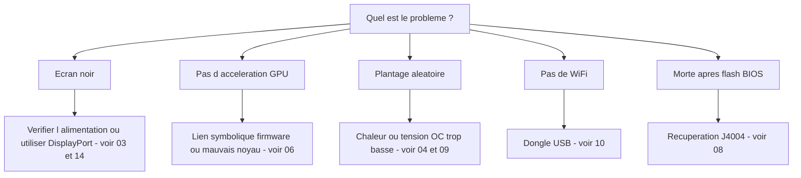

> 🌐 Traduction communautaire. La [version anglaise](../en/troubleshooting.md) fait foi et peut être plus à jour. Une erreur ? [Ouvrez une issue](https://github.com/lildebil0/awesome-bc250/issues).

# Dépannage

> **En bref** — Les modes de défaillance du BC-250 sont bien connus : la plupart relèvent de **l'alimentation**, de **la chaleur**, du **noyau/firmware**, ou d'**un flash raté**. Trouvez votre symptôme ci-dessous, appliquez la correction, et suivez le lien vers le chapitre complet. En cas de doute, la cause est généralement *un mauvais noyau*, *l'absence du lien symbolique firmware amdgpu*, ou *un refroidissement insuffisant*.

Cette page est un index symptôme → cause → correction, distillé à partir des problèmes récurrents de la communauté. Elle ne remplace pas les chapitres — elle vous oriente vite vers le bon.

---

## Démarrage / affichage

| Symptôme | Cause probable | Correction |
|---------|--------------|-----|
| Écran noir / pas de POST | Câblage ou brochage d'alimentation erroné | Revérifiez le câblage et le brochage du 8 broches ; utilisez du fil en cuivre véritable de section adéquate → [03 — Alimentation](../en/03-power-supply.md) |
| Écran noir / plantages après avoir fonctionné | **IOMMU encore activé** (cassé sur cette carte) | Désactivez l'IOMMU dans le BIOS (elektricM) ; le paramètre noyau `iommu=off`/`amd_iommu=off` est ⚠ à vérifier → [06 — Linux](../en/06-linux.md) |
| Écran noir au démarrage de l'**installateur** / live USB | L'installateur n'a pas le pilote GPU BC-250 ; KMS échoue | Ajoutez `nomodeset` dans GRUB (Fedora : Troubleshooting → Basic Graphics Mode) ; **retirez-le une fois Mesa installé** ([elektricM](https://github.com/elektricM/amd-bc250-docs/blob/main/docs/troubleshooting/boot.md)) → [06 — Linux](../en/06-linux.md) |
| Écran noir **après connexion** (GRUB + écran de connexion étaient OK) | Session de bureau, généralement **Wayland** | Choisissez X11 (« GNOME on Xorg »/« Plasma X11 ») à la connexion, ou `WaylandEnable=false` ([elektricM](https://github.com/elektricM/amd-bc250-docs/blob/main/docs/troubleshooting/display.md)) → [14 — Affichage](../en/14-display.md) |
| Démarre mais pas d'accélération GPU (tout sur le CPU) | Lien symbolique firmware amdgpu manquant, ou mauvais noyau | Appliquez le lien symbolique `navi10_gpu_info.bin` + les paramètres noyau ; évitez les noyaux connus comme mauvais (ci-dessous) → [06 — Linux](../en/06-linux.md) |
| `glxinfo` montre **llvmpipe**, jeux à 5–10 FPS | Mesa trop ancien, ou amdgpu non chargé | Installez **Mesa 25.1.3+**, retirez `nomodeset`, confirmez `Kernel driver in use: amdgpu` ([elektricM](https://github.com/elektricM/amd-bc250-docs/blob/main/docs/troubleshooting/performance.md)) → [06 — Linux](../en/06-linux.md) |
| Fonctionnait, puis cassé après une mise à jour du noyau | Régression dans ce noyau | Revenez à un noyau LTS ; **6.14.7**, **6.15.0–6.15.6** et **6.17.8–6.17.10** sont rapportés comme cassant amdgpu (repli CPU / plantages GPU) ; elektricM recommande **6.18.x LTS ou 6.17.11+** ⚠ vérifiez les plages exactes → [06 — Linux](../en/06-linux.md) |
| Pas d'audio HDMI | Régression du noyau 6.17+ | Utilisez un noyau LTS, ou routez l'audio via USB/DisplayPort → [06 — Linux](../en/06-linux.md) |
| Une seule sortie d'affichage fonctionne | Limitation du pilote sur cette carte | Limitation connue pour le double natif ; **un hub MST donne jusqu'à 2 écrans** (hub DP 1.4) ([elektricM](https://github.com/elektricM/amd-bc250-docs/blob/main/docs/hardware/display.md)) → [14 — Affichage](../en/14-display.md) |
| Pas d'affichage, pas de POST, **seulement avec le NVMe installé** | Le SSD a encore des partitions **Windows** EFI/récupération | Retirez le SSD, effacez toutes les partitions sur un autre PC (`wipefs -a`), réinstallez ([elektricM](https://github.com/elektricM/amd-bc250-docs/blob/main/docs/troubleshooting/boot.md)) → [06 — Linux](../en/06-linux.md) |
| Ne POST pas du tout (pas de BIOS) | Certaines cartes ne POSTent pas **sans pile CMOS** | Installez une CR2032 neuve et réessayez ([elektricM](https://github.com/elektricM/amd-bc250-docs/blob/main/docs/troubleshooting/boot.md)) → [08 — BIOS](../en/08-bios.md) |
| Le démarrage **se fige ~90 s** puis continue | Service systemd en échec / timeout réseau | `systemctl --failed` ; désactivez l'unité bloquée ([elektricM](https://github.com/elektricM/amd-bc250-docs/blob/main/docs/troubleshooting/boot.md)) → [06 — Linux](../en/06-linux.md) |
| Kernel panic « **unable to mount root** » / « No init found » | Mauvais noyau **ou** initramfs corrompu | Démarrez un noyau plus ancien/LTS ; si ça échoue encore, chroot et regénérez l'initramfs (`dracut -f` / `update-initramfs -u -k all` / `mkinitcpio -P`) ([elektricM](https://github.com/elektricM/amd-bc250-docs/blob/main/docs/troubleshooting/boot.md)) → [06 — Linux](../en/06-linux.md) |
| Tombe sur `grub>` / `grub rescue>` | GRUB ne trouve pas sa config/ses fichiers de démarrage | Réglez `root`/`prefix`, `insmod normal`, démarrez ; puis réinstallez GRUB ([elektricM](https://github.com/elektricM/amd-bc250-docs/blob/main/docs/troubleshooting/boot.md)) → [06 — Linux](../en/06-linux.md) |
| Impossible d'entrer dans le BIOS (Del/F2 ignorés) | Adaptateur lent à s'initialiser, ou clavier sur USB 3.0 | Tapez Del immédiatement ; essayez un port **USB 2.0** et un câble DP natif ([elektricM](https://github.com/elektricM/amd-bc250-docs/blob/main/docs/troubleshooting/display.md)) → [08 — BIOS](../en/08-bios.md) |

## Chaleur / stabilité

| Symptôme | Cause probable | Correction |
|---------|--------------|-----|
| Throttle / le FPS s'effondre sous charge | Le dissipateur d'origine ne peut pas refroidir sur un bureau | Affinez les ailettes + ventilateur/carénage 120 mm haute pression statique ; gardez <80 °C → [04 — Refroidissement](../en/04-cooling.md) |
| Plantage / redémarrage aléatoire sous charge | Surchauffe (>90 °C) **ou** tension d'overclock trop basse | Améliorez d'abord le refroidissement ; puis montez la tension d'undervolt — stable sous Furmark ≠ stable en jeu (les jeux exigent plus) → [04](../en/04-cooling.md) · [09](../en/09-overclock-undervolt.md) |
| Stable dans Furmark, plante en jeu | Tension réglée depuis Furmark, qui sous-sollicite | Testez avec OCCT + de vrais jeux ; augmentez la tension de ~50 mV → [09 — Overclock](../en/09-overclock-undervolt.md) |
| Deux governors qui se battent | oberon-governor *et* smu_oc/cyan-skillfish lancés ensemble | N'exécutez qu'un seul governor ; désactivez les autres → [09 — Overclock](../en/09-overclock-undervolt.md) |
| **Tout le système** meurt quand le GPU plante (pas seulement l'appli) | APU : CPU+GPU partagent le silicium, donc un reset GPU ne peut pas récupérer — il fait tomber le système | Attendu sur cette architecture ; prévenez les plantages GPU (tension stable + bon refroidissement + bon noyau) plutôt que d'espérer une récupération ([elektricM](https://github.com/elektricM/amd-bc250-docs/blob/main/docs/troubleshooting/stability.md)) → [09 — Overclock](../en/09-overclock-undervolt.md) |
| Le GPU plante → **écran noir, ne récupère jamais** pendant qu'un governor tourne | Le governor continue d'écrire dans sysfs pendant le reset → boucle de reset bloquée | Avant les jeux sujets aux plantages, `systemctl stop cyan-skillfish-governor-smu` ; réactivez après ([elektricM](https://github.com/elektricM/amd-bc250-docs/blob/main/docs/troubleshooting/stability.md)) → [09 — Overclock](../en/09-overclock-undervolt.md) |
| Gels / écran blanc à **seulement 60–65 °C** | Certaines cartes sont anormalement sensibles à la température | Améliorez le refroidissement, remontez le dissipateur, refaites la pâte (PTM7950) ; le silicium varie ([elektricM](https://github.com/elektricM/amd-bc250-docs/blob/main/docs/troubleshooting/stability.md)) → [04 — Refroidissement](../en/04-cooling.md) |
| GPU **bloqué à 1500 MHz**, refuse de descendre en undervolt | tension min réglée **sous 700 mV** — c'est un plancher dur qui reverrouille le GPU | Gardez la tension min **≥ 700 mV** ([elektricM](https://github.com/elektricM/amd-bc250-docs/blob/main/docs/troubleshooting/stability.md)) → [09 — Overclock](../en/09-overclock-undervolt.md) |
| Artefacts / plantages qu'une tension plus élevée ne corrige pas | **Chute de tension (droop)** sous charge (la V effective s'affaisse sous la V réglée) | Réglez la base ~25 mV plus haut pour couvrir le droop, ou utilisez un BIOS avec l'ajustement loadline/droop ([elektricM](https://github.com/elektricM/amd-bc250-docs/blob/main/docs/troubleshooting/stability.md)) → [09 — Overclock](../en/09-overclock-undervolt.md) |
| Démarre puis plante avec des **erreurs ACPI** (écran noir/vert) | Bizarrerie ou corruption BIOS/ACPI | Effacez le CMOS / réinitialisez les défauts BIOS ; essayez `acpi=off noapic` ; reflashez si ça persiste ([elektricM](https://github.com/elektricM/amd-bc250-docs/blob/main/docs/troubleshooting/stability.md)) → [08 — BIOS](../en/08-bios.md) |
| Veille/suspension = **pseudo-gel** (noir, semble planté) | La carte n'a pas de vrais états de veille GPU ; le SMU ne supporte pas la suspension Linux | Appuyez sur le bouton d'alimentation pour réveiller (ne maintenez pas) ; mieux, **désactivez la suspension** et utilisez l'extinction d'écran. Le repos reste à ~65–85 W quoi qu'il arrive ([elektricM](https://github.com/elektricM/amd-bc250-docs/blob/main/docs/troubleshooting/stability.md)) → [09 — Overclock](../en/09-overclock-undervolt.md) |

## Performance

| Symptôme | Cause probable | Correction |
|---------|--------------|-----|
| FPS plus bas qu'attendu, GPU pas saturé | **CPU-bound** (le Zen 2 est la limite dans beaucoup de jeux) | Normal ; baissez les réglages gourmands en CPU, acceptez-le — overclocker le GPU n'aidera pas ici → [11 — Jeu](../en/11-gaming.md) |
| Seulement 24 CU actifs, 40 attendus | L'origine expose moins de CU | Appliquez le déblocage des 40 CU (`amdgpu.bc250_cc_write_mode=3` + script) → [09 — Overclock](../en/09-overclock-undervolt.md) |
| Steam / FSR / vsync cassés | Le fork de distro « gamer » interfère | Certains forks optimisés cassent ça ; Fedora/Bazzite-bc250 brut est plus sûr → [06 — Linux](../en/06-linux.md) |
| GPU **verrouillé à 1500 MHz** quelle que soit la charge | Pas de governor en espace utilisateur (défaut verrouillé par le BIOS) | Installez un governor GPU (cyan-skillfish-governor-smu) pour faire varier la fréquence ([elektricM](https://github.com/elektricM/amd-bc250-docs/blob/main/docs/troubleshooting/performance.md)) → [09 — Overclock](../en/09-overclock-undervolt.md) |
| Le governor tourne mais le GPU **ne dépasse pas 2000 MHz** | Le noyau n'a pas le patch de plage de fréquences (plafond par défaut 1000–2000) | Utilisez un noyau patché (Bazzite/CachyOS pré-patchés) ou appliquez `amdgpu-frequency-range.patch` ([elektricM](https://github.com/elektricM/amd-bc250-docs/blob/main/docs/troubleshooting/performance.md)) → [09 — Overclock](../en/09-overclock-undervolt.md) |
| MangoHud affiche **655 %** d'usage GPU | amdgpu laisse la métrique d'activité à `0xFFFF` ; MangoHud lit 65535/100 | Lancez cyan-skillfish-governor-smu (branche smu) — il patche `gpu_metrics` ; aucun changement MangoHud nécessaire. Ou appliquez le script autonome **`install_gpu_usage_fix.sh`** ([Old Lamer — Partie XV](https://youtu.be/lSipaWjU6D4)) ([elektricM](https://github.com/elektricM/amd-bc250-docs/blob/main/docs/troubleshooting/performance.md)) → [09 — Overclock](../en/09-overclock-undervolt.md) |
| En **headless**, « le GPU ne fait rien » dans un test de charge | `glmark2 --off-screen` se rabat silencieusement sur **llvmpipe** (CPU) sans affichage | Testez avec `clpeak` / `vkmark` / `llama-bench -ngl 99` ; confirmez que SCLK et la conso montent ([elektricM](https://github.com/elektricM/amd-bc250-docs/blob/main/docs/troubleshooting/performance.md)) → [06 — Linux](../en/06-linux.md) |
| 60+ FPS mais **saccades** / temps de frame irréguliers | Cadence des images (compositeur X11, ou cadence liée à l'audio) | Passez par **gamescope** (`-W 1920 -H 1080 -f`), ou désactivez le compositeur / essayez Wayland ([elektricM](https://github.com/elektricM/amd-bc250-docs/blob/main/docs/troubleshooting/performance.md)) → [11 — Jeu](../en/11-gaming.md) |
| Le jeu **plante OOM / artefacts puis meurt** (RDR2, CoH3) | Conflit **512 Mo VRAM dynamique + ZRAM**, ou tout simplement **manque de RAM** | Passez le BIOS en **VRAM fixe** (p. ex. 10 Go RAM / 6 Go VRAM) ; **ou** désactivez le ZRAM systemd et utilisez **zswap + un fichier d'échange Btrfs de 32 Go** ([Old Lamer — Partie XIV](https://youtu.be/A6juAoY70aU), recette dans [06](../en/06-linux.md)/[09](../en/09-overclock-undervolt.md)) ([elektricM](https://github.com/elektricM/amd-bc250-docs/blob/main/docs/troubleshooting/stability.md)) → [08 — BIOS](../en/08-bios.md) |
| Un jeu précis (p. ex. **RDR2**) rend sur le CPU/llvmpipe | Le jeu choisit par défaut le mauvais adaptateur graphique | Réglez l'adaptateur sur le GPU AMD dans le jeu ; RDR2 : lancez avec `-useMaximumSettings` ([elektricM](https://github.com/elektricM/amd-bc250-docs/blob/main/docs/troubleshooting/performance.md)) → [11 — Jeu](../en/11-gaming.md) |

## Réseau

| Symptôme | Cause probable | Correction |
|---------|--------------|-----|
| Pas de WiFi du tout | Pas de WiFi intégré ; le dongle a besoin d'un pilote | Utilisez un dongle reconnu fiable (aic8800d80) + compilez son pilote → [10 — WiFi/BT](../en/10-wifi-bt.md) |
| Le WiFi décroche toutes les quelques minutes | Chipset Realtek + alimentation USB sous charge | Connu avec certains dongles RTL882x ; passez à l'aic8800d80 ou à un modèle confirmé → [10 — WiFi/BT](../en/10-wifi-bt.md) |
| Pilote disparu après redémarrage | Compilé avec `make` brut, pas empaqueté | Utilisez la voie RPM/DKMS du dépôt pour qu'il survive aux mises à jour du noyau → [10 — WiFi/BT](../en/10-wifi-bt.md) |
| Le FAI **bride Steam** au ralenti | DPI/bridage sur le trafic du CDN Steam | Les outils anti-bridage (de type `zapret`) aident — mais **le système de fichiers en lecture seule de Bazzite les bloque** ; utilisez une distro mutable (Fedora/Arch). Spécificités des opérateurs russes (Yota, zapret+warp) dans l'[édition russe](../ru/06-linux.md) → [06 — Linux](../en/06-linux.md) |

## Windows

| Symptôme | Cause probable | Correction |
|---------|--------------|-----|
| GPU = Code 43 / pas d'accélération | Aucun pilote GPU Windows fonctionnel (début 2026) | Attendu. Utilisez Linux. Les pilotes Windows sont des WIP expérimentaux → [07 — Windows](../en/07-windows.md) |

## BIOS / brick

> ⚠ **Lisez entièrement [08 — BIOS](../en/08-bios.md) avant tout flash.** Un mauvais flash bricke la carte et un effacement CMOS ne récupère **pas** le mod 1.0/3.00.

| Symptôme | Cause probable | Correction |
|---------|--------------|-----|
| Morte/écran noir après un flash de BIOS | Mauvaise image ou mauvais réglages | Récupération externe : câblez un CH341A au **connecteur J4004** (le clip SOIC-8 ne marche **pas** sur cette carte) et reflashez une image reconnue fiable → [08 — BIOS](../en/08-bios.md) |
| Le programmateur ne peut pas lire la puce | Lignes de données en 5 V / mauvaise puce ciblée | Utilisez du 3,3 V ; flashez la puce de 16 Mo `BIOS_A1`, jamais le SuperIO de 512 Ko → [08 — BIOS](../en/08-bios.md) |
| Les réglages ne tiennent pas | Ancienne version du mod | Utilisez le mod 5.00 où les timings RAM/GDDR6 s'appliquent vraiment → [08 — BIOS](../en/08-bios.md) |
| Ne démarre pas après avoir changé les **timings/fréquence RAM** | Des réglages mémoire instables ont **corrompu le BIOS** (watchdog P3.00 ; le chat russe BC-250 l'a rapporté) | Un effacement CMOS peut ne pas suffire — **reflash matériel** (CH341A / Pi Pico) d'une image reconnue fiable. Sauvegardez le BIOS fonctionnel *avant* de régler la RAM ; réglez un timing à la fois (tREF donne le plus) ([elektricM](https://github.com/elektricM/amd-bc250-docs/blob/main/docs/troubleshooting/stability.md)) → [08 — BIOS](../en/08-bios.md) |
| Réglages BIOS qui ne tiennent pas → écran noir / RAM faible | CMOS non effacé après flash USB (peut nécessiter 2–3 effacements) | Effacez le CMOS, reconfigurez, redémarrez **dans le BIOS** pour confirmer que 512 Mo est toujours réglé ; vérifiez que `free -h` montre ~15,5 Go ([elektricM](https://github.com/elektricM/amd-bc250-docs/blob/main/docs/troubleshooting/stability.md)) → [08 — BIOS](../en/08-bios.md) |

---

## Toujours bloqué ?
- Consultez la **[FAQ](faq.md)**.
- Cherchez dans le chat communautaire par sujet (le lien **Sources** de chaque chapitre renvoie à de vraies discussions).
- Quand vous demandez de l'aide, indiquez votre **distro + version du noyau**, vos **fréquences/governor**, et votre **refroidissement** — ces trois éléments expliquent la plupart des problèmes.

### Sources des lignes ci-dessus
- Guides de dépannage elektricM — [`boot.md`](https://github.com/elektricM/amd-bc250-docs/blob/main/docs/troubleshooting/boot.md) · [`display.md`](https://github.com/elektricM/amd-bc250-docs/blob/main/docs/troubleshooting/display.md) · [`performance.md`](https://github.com/elektricM/amd-bc250-docs/blob/main/docs/troubleshooting/performance.md) · [`stability.md`](https://github.com/elektricM/amd-bc250-docs/blob/main/docs/troubleshooting/stability.md) · [`hardware/display.md`](https://github.com/elektricM/amd-bc250-docs/blob/main/docs/hardware/display.md)
- Old Lamer (YouTube) : [Partie XIV — zswap + échange Btrfs 32 Go](https://youtu.be/A6juAoY70aU) · [Partie XV — `install_gpu_usage_fix.sh`](https://youtu.be/lSipaWjU6D4)
- [Fil 4pda BC-250](https://4pda.to/forum/index.php?showtopic=1104980) — bridage Steam par les FAI russes (Yota, zapret+warp).
- Les citations du chat communautaire par chapitre se trouvent dans les **Sources** de chaque chapitre lié.
