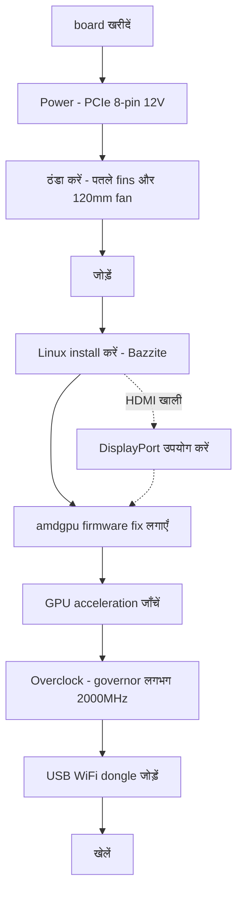

> 🌐 सामुदायिक अनुवाद। अंग्रेज़ी संस्करण ही प्रामाणिक स्रोत है और अधिक नया हो सकता है। कोई त्रुटि मिली? issue खोलें: [English](../en/00-start-here.md) · https://github.com/lildebil0/awesome-bc250/issues

# यहाँ से शुरू करें — शून्य से Gaming तक

> **संक्षेप में** — आपने एक AMD BC-250 खरीदा है (या खरीदने वाले हैं)। यह 16 GB GDDR6 वाला एक PlayStation 5-व्युत्पन्न APU board है जो एक सस्ता Linux gaming/AI box बनाता है — **बशर्ते** आप तीन चीज़ें क्रम से हल करें: **power**, **cooling**, और **Linux drivers**। यह पृष्ठ डिब्बे में पड़े एक board से लेकर चलते हुए एक game तक का सीधा रास्ता है। चरणों का पालन करें; प्रत्येक एक पूरे अध्याय से जुड़ता है।

यह board एक project है, plug-and-play PC नहीं। एक सप्ताहांत का समय रखें। लोग जिन दो तरीकों से एक board को जल्दी मार देते हैं वे हैं **गलत power wiring** और **उसे गर्म चलाना** — इसलिए हम पहले वही करते हैं।

---

## शुरू करने से पहले — parts और tools

ये *शुरू करने से पहले* अपने पास रखें, ताकि आपको प्रत्येक को build के बीच में न खोजना पड़े:

- एक **PSU** जिसमें PCIe 8-pin 12 V output हो → **[03 — Power Supply](../en/03-power-supply.md)**
- एक **120 mm high-static-pressure fan** + प्रिंट किया हुआ shroud → **[04 — Cooling](../en/04-cooling.md)** / **[05 — Cases और 3D Printing](../en/05-case.md)**
- एक **प्रिंट किया हुआ case या mount** → **[05 — Cases और 3D Printing](../en/05-case.md)**
- Linux installer के लिए एक **USB stick ≥ 16 GB**
- एक **DisplayPort cable** (या DP→HDMI adapter — board का HDMI अक्सर कुछ नहीं दिखाता, DisplayPort सबसे सुरक्षित है)
- एक **screwdriver**
- एक **multimeter** — PSU wiring का magnet/continuity-test करने के लिए → **[03 — Power Supply](../en/03-power-supply.md)**

---

## रास्ता



### 0. जानें कि आपके पास क्या है
एक BC-250 एक server/mining blade है: एक APU (Zen 2 CPU + RDNA2-श्रेणी GPU, "Cyan Skillfish/Oberon"), 16 GB GDDR6, **passive heatsink**, जिसे एक अकेले **12 V PCIe 8-pin** से शक्ति मिलती है। कोई onboard WiFi नहीं, कोई काम करने वाला Windows GPU driver नहीं, कोई hardware video encode नहीं। → **[01 — BC-250 क्या है](../en/01-what-is-bc250.md)**

### 1. सही चीज़ खरीदें
जानें कि उचित कीमत क्या है, डिब्बे में क्या है (केवल board? heatsink? PSU?), और किन sellers/scams से बचना है। → **[02 — खरीदारी गाइड](../en/02-buying.md)**

### 2. *पहली बार boot करने से पहले* power व्यवस्थित करें
board को 12 V पर एक PCIe 8-pin के माध्यम से ~235 W चाहिए (overclock करने पर अधिक)। एक असली PSU उपयोग करें (server Flex / Mean Well brick / ATX), 8-pin को **पर्याप्त gauge के असली-तांबे के wire** के साथ सही ढंग से जोड़ें, और pinout का अनुमान न लगाएँ — यहाँ एक गलती मतलब एक मरा हुआ board। → **[03 — Power Supply](../en/03-power-supply.md)**

### 3. *उस पर दबाव डालने से पहले* cooling ठीक करें
stock heatsink एक rack wind-tunnel के लिए बना है और **एक desk पर throttle करता है**। fins को पतला करें और एक high-static-pressure 120 mm fan को एक प्रिंट किए हुए shroud के माध्यम से bolt करें (या AIO अपनाएँ)। लक्ष्य: Furmark में ~80 °C के नीचे रहे। → **[04 — Cooling](../en/04-cooling.md)**

### 4. इसे एक case में रखें (वैकल्पिक पर अच्छा)
एक console-शैली का case प्रिंट करें जो board, fan, और PSU को असली airflow के साथ mount करे। सामुदायिक STLs की सूची। → **[05 — Cases और 3D Printing](../en/05-case.md)**

### 5. इसे जोड़ें
एक न्यूनतम build के लिए कार्यों का भौतिक क्रम: fan को प्रिंट किए हुए shroud पर mount करें → shroud को (पतले किए हुए) heatsink fins के ऊपर clip/screw करें → board को case/mount में बैठाएँ → PSU के 8-pin को board से जोड़ें (सही pinout, **[03 — Power Supply](../en/03-power-supply.md)**) → monitor से एक DisplayPort cable जोड़ें → power on करें और पुष्टि करें कि यह **POST** करता है (POST = power-on self-test; यह चालू होता है और video output करता है — आपको एक picture मिलती है / fan घूमता है)। कोई भी fin-sanding mounting *से पहले* करें (देखें **[04 — Cooling](../en/04-cooling.md)**) और metal dust को board से दूर रखें।

> इस assembly का एक label वाला photo/diagram एक स्वागत योग्य योगदान है — repo के पास अभी एक नहीं है।

### 6. Linux + GPU drivers install करें
यह बनाने-या-बिगाड़ने वाला चरण है। नए उपयोगकर्ताओं के लिए सबसे आसान: BC-250 के लिए बना एक **Bazzite-आधारित image** (या **Fedora 43** — elektricM की दूसरी "बस काम करती है" पसंद; Fedora 42 EOL है)। फिर **amdgpu firmware fix** लगाएँ (`navi10_gpu_info.bin` symlink) और kernel params, initramfs/grub फिर से generate करें, और पुष्टि करें कि GPU accelerated है (`vainfo`, `dmesg`)। → **[06 — Linux Drivers और Setup](../en/06-linux.md)**

> **दो settings जो आप उन्हें छोड़ दें तो घंटों की पीड़ा का कारण बनती हैं** (elektricM): modded BIOS पर **VRAM = 512 MB dynamic** सेट करें और **IOMMU disable करें** (एक टूटा हुआ IOMMU display failures और crashes का कारण बनता है), फिर flash के बाद **CMOS clear करें**। `nomodeset` boot parameter के साथ install करें और **drivers आ जाने पर इसे हटा दें**। Mesa **25.1+** न्यूनतम सीमा है (25.3.x अनुशंसित)। और **kernel 6.15.0–6.15.6 और 6.17.8–6.17.10 से बचें** — ये GPU driver को तोड़ते हैं; इसके बजाय एक 6.18 LTS / 6.17.11+ / 6.12–6.14 LTS उपयोग करें। ([elektricM quick-start](https://elektricm.github.io/amd-bc250-docs/getting-started/quick-start/), [quick-reference](https://elektricm.github.io/amd-bc250-docs/reference/quick-reference/))

> Windows सोच रहे हैं? 2026 की शुरुआत तक **कोई काम करने वाला Windows GPU driver नहीं** है — यह प्रायोगिक है। Linux उपयोग करें। → **[07 — Windows](../en/07-windows.md)**

### 7. stock पर काम करना सत्यापित करें, फिर overclock करें
एक बार desktop accelerated हो जाए, **oberon-governor** install करें और clocks बढ़ाएँ (1500 MHz stock कमज़ोर है; **2000 MHz ≈ +30 % FPS**)। वैकल्पिक रूप से सभी **40 CUs** unlock करें और undervolt करें। नए clocks के तहत temps फिर से जाँचें। → **[09 — Overclocking और Undervolting](../en/09-overclock-undervolt.md)**

### 8. Online हों
कोई onboard WiFi नहीं — एक **ज्ञात-अच्छा USB dongle** जोड़ें (aic8800d80 समुदाय का पसंदीदा है) और उसका driver। → **[10 — WiFi और Bluetooth](../en/10-wifi-bt.md)**

### 9. खेलें
वास्तविक अपेक्षाएँ रखें (Zen 2 CPU अक्सर सीमा होती है, GPU नहीं), FSR चालू करें, और सामुदायिक प्रति-game settings उपयोग करें। → **[11 — Gaming परिणाम और Settings](../en/11-gaming.md)**

### बोनस — स्थानीय LLMs चलाएँ
कीमत के हिसाब से 16 GB VRAM बहुत है। llama.cpp को **Vulkan** backend पर चलाएँ (इस GPU पर ROCm एक बंद रास्ता है)। → **[12 — AI / LLM](../en/12-ai-llm.md)**

### बोनस — emulation
Switch, PS3, PS4, retro, arcade — वास्तव में क्या चलता है, और कैसे → **[15 — Emulation](../en/15-emulation.md)**

> पहली बार boot पर कोई picture नहीं? board **DisplayPort** पर output करता है (HDMI अक्सर खाली होता है) → **[14 — Display और Output](../en/14-display.md)**। USB ports खत्म हो गए, या एक drive जोड़ रहे हैं? → **[16 — USB, Hubs और Storage](../en/16-usb-peripherals.md)**

---

## अगर कुछ टूट जाए
काली screen, कोई acceleration नहीं, यादृच्छिक resets, dongle drops, BIOS flash के बाद एक brick — देखें **[Troubleshooting](troubleshooting.md)** और **[FAQ](faq.md)**।

> एक modded BIOS flash करना एक शुरुआती चरण **नहीं** है। यह board को brick कर सकता है और इसके लिए recovery hardware चाहिए। केवल जान-बूझकर वहाँ जाएँ। → **[08 — BIOS और Brick Recovery](../en/08-bios.md)**

---

## 60-सेकंड की checklist

| चरण | कब पूरा हुआ |
|------|-----------|
| Power | PSU 8-pin से जुड़ा, सही pinout, असली-तांबे का wire, board POST करता है |
| Cooling | Fins पतले + 120 mm fan/shroud; Furmark में <80 °C |
| OS | Bazzite-bc250 install हुआ, desktop तक boot होता है |
| GPU | `vainfo`/`dmesg` amdgpu सक्रिय दिखाते हैं, CPU fallback नहीं |
| Overclock | oberon-governor चल रहा, ~2000 MHz, एक असली game में स्थिर |
| Network | USB dongle जुड़ता है और जुड़ा रहता है |
| Game | आपके clocks के लिए अपेक्षित FPS पर चलता है |

जब हर पंक्ति जाँच ली जाए, तो आप पूरा कर चुके हैं। BC-250 club में आपका स्वागत है।

---

## त्वरित संदर्भ (cheat-sheet)

वे commands और settings जिन तक आप सबसे अधिक पहुँचेंगे, elektricM के [quick-reference](https://elektricm.github.io/amd-bc250-docs/reference/quick-reference/) से संक्षिप्त। पूरा विवरण **[06 — Linux](../en/06-linux.md)** और **[09 — Overclocking](../en/09-overclock-undervolt.md)** में रहता है।

**BIOS:** VRAM `512MB` dynamic · IOMMU **Disabled** · UEFI boot · हर USB flash के बाद CMOS clear करें।

**सत्यापित करें कि GPU accelerated है (llvmpipe/CPU नहीं):**
```bash
glxinfo | grep "OpenGL version"          # Mesa 25.1+ expected
vulkaninfo | grep deviceName             # → AMD Radeon Graphics (RADV GFX1013)
cat /sys/class/drm/card0/device/pp_dpm_sclk   # multiple freqs, current marked *
```

**Governor** (इसके बिना clocks 1500 MHz पर अटक जाते हैं)। हमारा default `oberon-governor` है; elektricM नया SMU fork COPR के माध्यम से deliver करता है — कोई भी काम करता है:
```bash
sudo dnf copr enable filippor/bazzite
sudo dnf install cyan-skillfish-governor-smu          # rpm-ostree install … on Bazzite
sudo systemctl enable --now cyan-skillfish-governor-smu.service
systemctl status cyan-skillfish-governor-smu          # → active (running)
```
> Voltage floor **700 mV** — इसके नीचे GPU 1500 MHz पर lock हो जाता है। Governor गलत card को target कर सकता है (card0 बनाम card1) — यदि scaling शुरू न हो तो सत्यापित करें।

**drivers आ जाने के बाद `nomodeset` हटाएँ:**
```bash
# GRUB distros: drop "nomodeset" from /etc/default/grub, then
sudo grub2-mkconfig -o /boot/grub2/grub.cfg && sudo reboot
# Bazzite / Fedora Atomic:
rpm-ostree kargs --delete-if-present="nomodeset" && systemctl reboot
```

**Steam launch option** जो कुछ games में graphical glitches ठीक करता है: `RADV_DEBUG=nohiz %command%`।

**RDR2 / Company of Heroes 3 पर crash?** VRAM को `512MB` dynamic से **10GB/6GB fixed** पर बदलें (ZRAM conflict)। ([elektricM quick-reference](https://elektricm.github.io/amd-bc250-docs/reference/quick-reference/))
