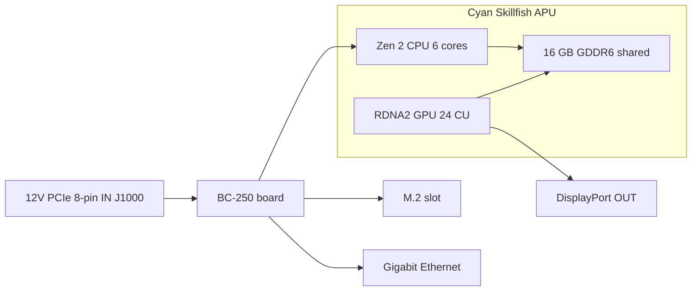

> 🌐 सामुदायिक अनुवाद। अंग्रेज़ी संस्करण ही प्रामाणिक स्रोत है और अधिक नया हो सकता है। कोई त्रुटि मिली? issue खोलें: [English](../en/01-what-is-bc250.md) · https://github.com/lildebil0/awesome-bc250/issues

# BC-250 क्या है

> **संक्षेप में** — BC-250 एक **server/mining board पर PlayStation 5-श्रेणी का APU** है। एक चिप (AMD codename **Cyan Skillfish**, PS5 के **Oberon/Ariel** silicon का एक कटा-छँटा संस्करण) एक **6-core / 12-thread Zen 2 CPU** और एक **24-compute-unit RDNA 2 GPU** रखती है, जिसे **16 GB soldered GDDR6** से खिलाया जाता है। यह एक **graphics card नहीं है और एक सामान्य PC नहीं है** — इसमें **आपका जाना-पहचाना x86 BIOS नहीं, कोई PCIe slot नहीं, कोई 24-pin ATX plug नहीं**: यह **एक 8-pin PCIe power connector में सीधे 12 V** लेता है और अपना firmware boot करता है। लोग इसे इसलिए खरीदते हैं क्योंकि यह एक **बेहद सस्ता Linux gaming / local-AI box** है। लोग इस पर गुस्सा इसलिए करते हैं क्योंकि **drivers, cooling, और hardware video encoding की कमी** इसे एक project बना देती हैं, plug-and-play machine नहीं। यदि आप शून्य झंझट चाहते हैं, तो यह board गलत खरीद है — अभी लौटा दें। यदि आपको tinkering पसंद है, तो आगे पढ़ें।

यह पृष्ठ "मैंने वास्तव में क्या खरीदा" वाला संदर्भ है। Power, cooling, OS install और drivers में से प्रत्येक को अपना अलग अनुभाग मिलता है ([03](03-power-supply.md) / [04](04-cooling.md) / [06](06-linux.md))।

---

## यह वास्तव में क्या है

AMD ने BC-250 को एक **cryptocurrency mining accelerator** के रूप में बनाया ("BC" का मतलब blockchain है)। इसे सस्ता बनाने के लिए, AMD ने **बचे हुए PlayStation 5 processor silicon** का पुनः उपयोग किया — उसी परिवार की चिप जो Sony console में डालता है। एक board एक APU प्लस उसकी memory और power circuitry है; बस इतना ही पूरा product है।

शब्दजाल, एक बार परिभाषित:

- **APU** (Accelerated Processing Unit) — एक अकेली चिप के लिए AMD का नाम जिसमें **CPU और GPU दोनों** हों। कोई अलग graphics card नहीं है; GPU उसी package के अंदर है, उसी memory को साझा करता है।
- **Cyan Skillfish** — इस APU के लिए AMD का इंजीनियरिंग **codename**। आप इसे Linux में हर जगह देखेंगे: GPU firmware फ़ाइल का नाम सचमुच `cyan_skillfish_gpu_info.bin` है ([src](https://t.me/c/2424231195/57962) — symlink fix देखें [src](https://t.me/c/2424231195/41252) पर)। Tools इसे PS5 die नामों **Oberon** / **Ariel** के तहत भी रिपोर्ट कर सकते हैं।
- **GDDR6** — तेज़ graphics memory जो सामान्यतः एक video card पर पाई जाती है। BC-250 पर यह **एक ही समय में system RAM और video RAM** है (CPU और GPU एक pool साझा करते हैं)। कोई DIMM slots नहीं हैं; 16 GB soldered है और upgrade नहीं किया जा सकता।
- **RDNA 2** — GPU architecture की पीढ़ी (वही परिवार जैसा PS5, Xbox Series, और Radeon RX 6000 cards)।

चिप एक **कटा-छँटा** PS5 part है, पूरा वाला नहीं। समुदाय ने इस तुलना को pin किया ([src](https://t.me/c/2424231195/11282), [TechPowerUp की Oberon entry](https://www.techpowerup.com/gpu-specs/amd-oberon.g936) का हवाला देते हुए):

| | BC-250 | पूरा PS5 (Oberon) |
|---|---|---|
| CPU cores / threads | **6 / 12** | 8 / 16 |
| GPU compute units (CU) | **24** | 36 |

एक "compute unit" एक GPU core block है; उनमें से 24 लगभग mid-range-laptop-GPU इलाके में है, जो ठीक वही प्रदर्शन-कोटि है जो chat games में रिपोर्ट करता है।

BC-250 AMD का एकमात्र "desktop board पर बचा हुआ console silicon" नहीं है। इसके दो करीबी चचेरे भाई हैं जो उसी विचार से बने हैं: **AMD 4700S Desktop Kit** (एक **PlayStation 5**-व्युत्पन्न CPU kit) — जिसके बारे में chat चेतावनी देता है कि यह marketplaces पर BC-250 के विरुद्ध cross-list हो जाता है ([02-buying.md](02-buying.md)) — और **AMD 4800S Desktop Kit**, **Xbox Series X**-व्युत्पन्न संस्करण (8 Zen 2 cores GDDR6 से जुड़े, console के RDNA 2 GPU को fuse-off करके)। दोनों असली AMD products हैं जो, BC-250 की तरह, एक salvage किए गए console CPU को soldered GDDR6 के साथ जोड़ते हैं ([VideoCardz](https://videocardz.com/newz/amd-4800s-desktop-kit-a-pc-repurposed-apu-from-xbox-series-x-has-been-tested))। जब आप खरीदारी करें तो BC-250 को उसके भाई-बहनों से अलग पहचानने के लिए ये उपयोगी संदर्भ हैं।

लोगों ने **BC-250 पर desktop Linux ठीक उसी तरह चलाया है जैसे PS5 को खुद jailbreak किया गया था** — पूरा 4K HDMI video + audio, सभी USB ports काम करते हुए, APU की CPU ~3.2 GHz और GPU ~2.0 GHz तक clock करती हुई ([src](https://t.me/c/2424231195/122260))।

---

## यह किसमें अच्छा है

- **इस प्रदर्शन-स्तर पर Linux gaming में घुसने का सबसे सस्ता तरीका।** Steam/Proton (एक compatibility layer जो Linux पर Windows games चलाता है) के माध्यम से लोग Star Citizen खेलते हैं ([src](https://t.me/c/2424231195/38702)), और एक community Vulkan wrapper के माध्यम से *Doom: The Dark Ages* जैसे आधुनिक titles भी low/FSR पर ~60 FPS पर ([src](https://t.me/c/2424231195/127696))। प्रति-game परिणाम [11-gaming.md](11-gaming.md) में रहते हैं।
- **एक सक्षम local-AI box।** 16 GB GDDR6 के साथ यह mid-size language models रख सकता है। Members LLMs को स्थानीय रूप से `llama.cpp`/`jan` के माध्यम से **Vulkan** backend पर चलाते हैं; आप पहले BIOS को GPU को 12 GB आवंटित करने के लिए सेट करते हैं ([src](https://t.me/c/2424231195/92421))। देखें [12-ai-llm.md](12-ai-llm.md)।
- **छोटा और आत्मनिर्भर।** यह एक अकेला लंबा board है जिसमें GPU-शैली का heatsink अंदर ही बना है — यह छोटे DIY/3D-printed cases में फिट हो जाता है और एक छोटे power supply से चलता है ([build src](https://t.me/c/2424231195/137825))।

*यह काम क्यों करता है* इस पर समुदाय की सहमति: क्योंकि चिप Steam Deck / PS5 hardware के इतने करीब है, Valve और open-source Mesa graphics stack बिलकुल उन्हीं drivers को बेहतर बनाते रहते हैं, इसलिए BC-250 मुफ़्त में साथ चलता रहता है ([src](https://t.me/c/2424231195/93006))।

---

## क्या कष्टदायक है (अपेक्षाएँ सेट करें)

यह वह आधा हिस्सा है जिसे नए लोग कम आँकते हैं। इनमें से कोई भी deal-breaker नहीं है, पर यह सब असली काम है।

- **Drivers एक खुद-करो काम है।** AMD इस board के लिए **कोई official driver और कोई public documentation** नहीं भेजता ([src](https://t.me/c/2424231195/37764))। सब कुछ — Linux graphics stack, clock/voltage "governor", BIOS — समुदाय-निर्मित है। setup scripts का पालन करने और कभी-कभी चीज़ों को हाथ से ठीक करने की अपेक्षा करें। [06-linux.md](06-linux.md) से शुरू करें।
- **Cooling वह #1 चीज़ है जिसे लोग गलत करते हैं।** stock heatsink एक mining rack के forced-air tunnel के लिए design किया गया था, इसलिए एक desk पर यह डिब्बे से ही ज़्यादा गरम होकर throttle करता है। आपको cooling को mod करना होगा। इसका अपना अनुभाग है — performance का पीछा करने से **पहले** [04-cooling.md](04-cooling.md) पढ़ें।
- **कोई hardware video encoder नहीं।** GPU का video-encode block (जिसे AMD **VCN** कहता है — समर्पित circuit जो streaming/recording के लिए video को compress करता है) **उपलब्ध नहीं** है। Screen recording और game streaming एक **software encoder** पर वापस आ जाते हैं, जो CPU खर्च करता है। यह काम करता है (लोग Sunshine/Moonlight पर stream करते हैं) पर यह एक सामान्य GPU की तुलना में धीमा और कम-quality का है ([src](https://t.me/c/2424231195/88026))। इसी तरह, शुरुआती Mesa driver मशहूर रूप से **software rendering** था जब तक समुदाय ने hardware acceleration को काम करने लायक नहीं बना दिया ([src](https://t.me/c/2424231195/11243))।
- **अजीब power और डिफ़ॉल्ट रूप से कोई display नहीं।** यह एक standard 24-pin ATX connector नहीं लेता — अगला अनुभाग देखें। कई boards POST करने से पहले भी एक **BIOS reset** की ज़रूरत के साथ आते हैं ([src](https://t.me/c/2424231195/57930)), और आप आमतौर पर **DisplayPort** पर picture output करते हैं (HDMI को एक DP→HDMI adapter चाहिए, जो audio भी ठीक से ले जाता है — [src](https://t.me/c/2424231195/9148))।
- **यह एक tinkerer का board है, बस इतना ही।** जैसा एक पुराने member ने कहा: सस्ता होने के बावजूद, BC-250 को "कुछ कौशल, मेहनत और दिमाग चाहिए" ([src](https://t.me/c/2424231195/73002))। केवल पैसे का नहीं, समय का budget रखें।
- ⚠ **एक eGPU इसे नहीं बचाएगा — समुदाय-रिपोर्ट किया गया (r/BC250Gaming)।** अकेला M.2 slot केवल **PCIe 2.0 ×2** है (नीचे hardware card देखें), और उस bandwidth पर M.2 से लटका एक external GPU **onboard RDNA 2 GPU से *खराब* प्रदर्शन करने की रिपोर्ट है** — धीमा link उसका गला घोंट देता है। यदि आप अधिक graphics power चाहते हैं, तो सहमति यह है कि यह उसके लिए board नहीं है। *(समुदाय-रिपोर्ट किया गया; इसे एक benchmark नहीं, एक सावधानी मानें।)*

> ⚠ **दो-रंगी LED का क्या मतलब है — समुदाय-रिपोर्ट किया गया (r/BC250Gaming)।** NIC के बगल वाली दो-रंगी LED एक **mining-युग का utilization indicator है, एक error light नहीं**: समुदाय के विवरणों के अनुसार **लाल = GPU/RAM 100 % utilization पर *नहीं* है, हरा = पूर्ण utilization**। तो एक idle desktop board पर लाल light सामान्य है, कोई दोष नहीं। *(समुदाय-रिपोर्ट किया गया; AMD इस board के लिए कोई documentation नहीं भेजता, इसलिए सटीक रंग-मैपिंग को अपुष्ट मानें।)*

> ⚠ **संभालने की चेतावनी, कठिन तरीके से सीखी गई।** powered board को किसी भी धातु की चीज़ को **छूने न दें**, और thermal paste केवल सावधानी से ही बदलें — एक member ने अपना BC-250 short करके स्थायी रूप से मार डाला ([src](https://t.me/c/2424231195/95998))। Boards heatsink mounting से थोड़े **मुड़े हुए** भी आते हैं; एक member ने board को कागज़ से heatsink के विरुद्ध समतल shim करके एक no-boot ठीक किया ([src](https://t.me/c/2424231195/117347))।

---

## Hardware संदर्भ कार्ड

Specs को समुदाय के hardware reverse-engineering के विरुद्ध cross-check किया गया है (AMD कोई datasheet प्रकाशित नहीं करता)। Memory-bus और भौतिक-आयाम के आँकड़े, जो पहले अपुष्ट थे, अब [elektricM hardware spec](https://github.com/elektricm/elektricm) से स्रोत हैं (जो reverse-engineering का श्रेय mothenjoyer69 / Segfault / neggles / yeyus को देता है)। नीचे का pinout और power आँकड़े canonical community hardware doc से आते हैं।

एक नज़र में board — बाईं ओर power in, बीच में APU और इसकी shared memory, दाईं ओर I/O:



### मुख्य specs

| Spec | मान | स्रोत |
|------|-------|--------|
| श्रेणी | mining/server board पर PlayStation 5-व्युत्पन्न APU | [hardware.md](https://github.com/mothenjoyer69/bc250-documentation/blob/main/hardware.md) |
| APU codename | **Cyan Skillfish** (PS5 die: Oberon / Ariel) | chat ([src](https://t.me/c/2424231195/57962)) |
| CPU | **6 cores / 12 threads, Zen 2** (6 cores पुष्ट) | [hardware.md](https://github.com/mothenjoyer69/bc250-documentation) · chat ([src](https://t.me/c/2424231195/11282)) |
| CPU clock | **~3.49 GHz** तक ("के आसपास") | [hardware.md](https://github.com/mothenjoyer69/bc250-documentation) · chat ([src](https://t.me/c/2424231195/122260)) |
| GPU | **24 compute units, RDNA 2** (`gfx1013`; PS5 SoC में 36 हैं); rasterization ≈ **RX 6600 और RX 6600 XT के बीच** / GTX 1660 Ti-श्रेणी; **Vulkan 1.4** | [hardware.md](https://github.com/mothenjoyer69/bc250-documentation) · chat ([src](https://t.me/c/2424231195/11282)) · [elektricM](https://github.com/elektricm/elektricm) |
| GPU clock | ~1500 MHz stock, ~2000 MHz overclocked (≈2.23 GHz max) | ([src](https://t.me/c/2424231195/122260)) · [09](09-overclock-undervolt.md) |
| Memory | **16 GB GDDR6**, CPU और GPU के बीच साझा, soldered (upgrade नहीं किया जा सकता) | [hardware.md](https://github.com/mothenjoyer69/bc250-documentation) · [README](../../README.md) |
| GPU VRAM आवंटन | BIOS में सेट; BIOS 3.00+ पर **12 GB** चुनने योग्य | ([src](https://t.me/c/2424231195/92421)) |
| Memory bus / bandwidth | **256-bit** GDDR6 @ **14 Gbps**, **~448 GB/s** | [elektricM hardware spec](https://github.com/elektricm/elektricm) |
| TDP | **220 W** (board thermal-design power) | [hardware.md](https://github.com/mothenjoyer69/bc250-documentation) |
| Power draw | mining-श्रेणी load के तहत ~67–85 W सामान्य | [hashrate.no](https://www.hashrate.no/gpus/bc250) |
| Hardware video encode (VCN) | **कोई नहीं** — केवल software encode | ([src](https://t.me/c/2424231195/88026)) |
| Video output | **DisplayPort 1.4** (**4K@120 / 8K@60** तक); HDMI के लिए DP→HDMI adapter उपयोग करें; audio ले जाता है | ([src](https://t.me/c/2424231195/9148)) · [elektricM](https://github.com/elektricm/elektricm) |
| Storage (M.2) | 1x M.2 2280 — **PCIe 2.0 x2 या SATA III** | [elektricM](https://github.com/elektricm/elektricm) |
| दूसरा DisplayPort | मौजूद पर **unpopulated**; software में सक्रिय किया जा सकता है | ([src](https://t.me/c/2424231195/88026)) |
| भौतिक आकार | **340 mm / 310 mm** लंबा (मापने की विधि अनुसार), **~115 mm** चौड़ा, heatsink के साथ **~400 g**; custom गैर-standard mining form factor | [elektricM hardware spec](https://github.com/elektricm/elektricm) |

> ⚠ **GDDR6 overclock = bandwidth, FPS नहीं — समुदाय-रिपोर्ट किया गया (r/BC250Gaming)।** समुदाय के विवरणों के अनुसार, GDDR6 को overclock करने से memory bandwidth लगभग **~256 GB/s से ~445 GB/s** तक बढ़ती है फिर भी **कोई gaming लाभ नहीं** देती — bottleneck GPU के 24 CUs हैं, memory bandwidth नहीं, इसलिए अतिरिक्त bandwidth games में अनुपयोगी रहती है। (ध्यान दें कि ऊपर repo का सत्यापित *stock* आँकड़ा पहले से ही 256-bit / 14 Gbps पर **~448 GB/s** है, इसलिए समुदाय का "~256 GB/s baseline" spec sheet से मेल नहीं खाता — सटीक GB/s संख्याओं को अपुष्ट मानें; यह निष्कर्ष कि आपको FPS नहीं मिलता, टिकाऊ हिस्सा है।) सामान्य रूप से GPU/memory overclocking के लिए देखें [09-overclock-undervolt.md](09-overclock-undervolt.md)।

> **Board आयामों पर:** [elektricM hardware spec](https://github.com/elektricm/elektricm) **340 mm / 310 mm** लंबाई देता है (दो आँकड़े अलग-अलग मापने की विधियाँ दर्शाते हैं), **~115 mm** चौड़ाई और heatsink के साथ **~400 g**, एक custom गैर-standard mining form factor पर। canonical `hardware.md` स्वयं आयाम सूचीबद्ध नहीं करता; chat की सबसे अधिक प्रतिक्रिया पाने वाली hardware post का शीर्षक सचमुच *"Размеры amd bc-250"* ("AMD BC-250 के आयाम", ❤20 — [src](https://t.me/c/2424231195/379)) है, जो पुष्टि करता है कि लोग case बनाने के लिए इसकी परवाह करते हैं। सटीक case फिटमेंट के लिए, एक मापे हुए 3D model से काम करें — community-cataloged board STLs (जैसे `BC250 Board.stl`, [Printables 1103626](https://www.printables.com/model/1103626-amd-bc250-board) और सटीक model [Printables 1341336](https://www.printables.com/model/1341336-accurate-3d-model-of-the-amd-bc-250-board) पर) आयाम-सटीक हैं। देखें [05-case.md](05-case.md)।

<p align="center">
  <br>
  <sub>Photo: AMD BC-250 community · <a href="https://t.me/c/2424231195/379">source</a></sub>
</p>

### Power connector pinout (कुछ भी plug करने से पहले इसे पढ़ें)

BC-250 में **कोई 24-pin ATX header नहीं** है। इसे **केवल 12 V** से शक्ति मिलती है, जो एक **8-pin PCIe power connector (J1000)** के माध्यम से दी जाती है — एक graphics card के plug जैसा ही भौतिक plug, पर board तीनों power contacts को 12 V से खिलाए जाने की अपेक्षा करता है। पूरी wiring और PSU चयन [03-power-supply.md](03-power-supply.md) में हैं; canonical pinout [hardware.md](https://github.com/mothenjoyer69/bc250-documentation/blob/main/hardware.md) से:

**J1000 — मुख्य 8-pin PCIe power (यही वह है जिसे आप जोड़ते हैं):**

```
[ GND  GND  GND  GND ]
[ GND  12V  12V  12V ]
```

- तीन 12 V contacts; doc Mini-Fit Jr contacts को **प्रत्येक 9 A तक** रेट करता है, इसलिए यह connector "**324 W** तक सुरक्षित रूप से source कर सकता है," और standalone उपयोग के लिए **16 AWG** wire की सिफारिश करता है ([hardware.md](https://github.com/mothenjoyer69/bc250-documentation))।
- **GND = ground (0 V), 12V = +12 volts।** polarity सही रखें — इस board में reverse-voltage की कोई क्षमा नहीं है।

**J2000 / J2001 — rack power connectors (आमतौर पर एक desk पर उपयोग नहीं होते):**

```
        J2000                  J2001
 [ LED1  12V  12V  12V ]   [ 12V  12V  12V  PGD ]
 [ LED2  GND  GND  GND ]   [ GND  GND  GND  GND ]
```

- ये **Molex Micro-Fit BMI** connectors हैं ([part 444280801](https://www.molex.com/en-us/products/part-detail/444280801)), PCIe/EPS plugs *नहीं* — इन्होंने board को उसके मूल mining chassis के अंदर खिलाया। **J2000 और J2001 एक जैसे नहीं हैं:** जैसा ऊपर pinout दिखाता है, J2000 **LED1/LED2** pins ले जाता है जबकि J2001 **PGD** pin ले जाता है, इसलिए दोनों connectors भिन्न हैं ([elektricM / mothenjoyer69 hardware docs](https://github.com/mothenjoyer69/bc250-documentation))।
- **PGD** (J2001 पर) एक power-good/sense pin है: यह **5 V देखता है जब board rack के PSU2 में बैठा हो**। एक standalone build पर आप आमतौर पर J1000 के माध्यम से शक्ति देते हैं और J2000/J2001 को नज़रअंदाज़ कर सकते हैं — पर अपने विशिष्ट PSU adapter के लिए [03-power-supply.md](03-power-supply.md) के विरुद्ध पुष्टि करें।

---

## आगे कहाँ जाएँ

1. **[02-buying.md](02-buying.md)** — यदि आपने अभी तक नहीं खरीदा है, या जानना चाहते हैं कि उचित कीमत और असली जोखिम क्या हैं।
2. **[03-power-supply.md](03-power-supply.md)** — इसे वास्तव में कैसे शक्ति दें (8-pin में 12 V)।
3. **[04-cooling.md](04-cooling.md)** — board हाथ में आते ही किसी भी और चीज़ से **पहले** यह करें।
4. **[06-linux.md](06-linux.md)** — एक OS और उस पर community drivers लाएँ।

---

## स्रोत

- Canonical hardware doc और pinout — [mothenjoyer69/bc250-documentation `hardware.md`](https://github.com/mothenjoyer69/bc250-documentation/blob/main/hardware.md)
- Memory bus/bandwidth, भौतिक आयाम, GPU positioning, DP 1.4, M.2 — [elektricM hardware spec](https://github.com/elektricm/elektricm) (reverse-engineering के लिए mothenjoyer69 / Segfault / neggles / yeyus को श्रेय)
- कटा-छँटा बनाम पूरा PS5 silicon (6/12 + 24 CU बनाम 8/16 + 36 CU) — https://t.me/c/2424231195/11282 · [TechPowerUp Oberon](https://www.techpowerup.com/gpu-specs/amd-oberon.g936)
- Linux-on-PS5-hardware, 4K HDMI, clocks — https://t.me/c/2424231195/122260
- कोई official driver / कोई docs नहीं — https://t.me/c/2424231195/37764
- Software rendering / कोई hardware encode नहीं — https://t.me/c/2424231195/11243 · https://t.me/c/2424231195/88026
- DisplayPort + DP→HDMI audio — https://t.me/c/2424231195/9148
- Cyan Skillfish firmware नाम — https://t.me/c/2424231195/57962 · https://t.me/c/2424231195/41252
- Local LLM + BIOS 3.00 के माध्यम से 12 GB VRAM — https://t.me/c/2424231195/92421
- "कौशल, मेहनत और दिमाग चाहिए" — https://t.me/c/2424231195/73002
- संभालने/short-circuit चेतावनी — https://t.me/c/2424231195/95998 · मुड़े-board fix — https://t.me/c/2424231195/117347
- "BC-250 के आयाम" (सबसे अधिक प्रतिक्रिया पाई hardware post) — https://t.me/c/2424231195/379
- 220 W TDP, 6-core/3.49 GHz CPU, 24-CU GPU, 16 GB GDDR6 (repo पुष्टि) — [mothenjoyer69/bc250-documentation README](https://github.com/mothenjoyer69/bc250-documentation)
- mining-श्रेणी power draw आँकड़े — https://www.hashrate.no/gpus/bc250
- यह क्यों काम करता रहता है (साझा Steam Deck/PS5 driver प्रयास) — https://t.me/c/2424231195/93006
- भाई kits — AMD 4700S (PS5 CPU kit, BC-250 के विरुद्ध cross-listed, [02-buying.md](02-buying.md)) और AMD 4800S (Xbox Series X CPU + GDDR6, GPU fused off) — [VideoCardz: 4800S Desktop Kit](https://videocardz.com/newz/amd-4800s-desktop-kit-a-pc-repurposed-apu-from-xbox-series-x-has-been-tested)
- eGPU-over-M.2 onboard GPU से धीमा (M.2 PCIe 2.0 ×2 है), दो-रंगी NIC LED = utilization signal (लाल = 100 % util नहीं, हरा = पूर्ण util), GDDR6 overclock bandwidth बढ़ाता है (~256→~445 GB/s) बिना gaming लाभ के — समुदाय-रिपोर्ट किया गया (r/BC250Gaming)

> AMD इस board के लिए कोई primary datasheet प्रकाशित नहीं करता; ऊपर के आँकड़े सर्वश्रेष्ठ community reverse-engineering हैं (canonical `hardware.md` प्लस elektricM hardware spec)। PR के माध्यम से सुधार का स्वागत है (देखें [CONTRIBUTING.md](../../CONTRIBUTING.md))।
