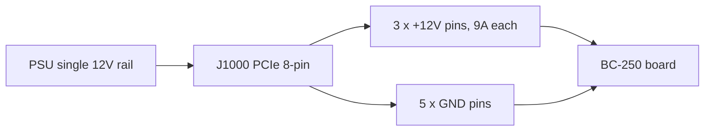

> 🌐 सामुदायिक अनुवाद। अंग्रेज़ी संस्करण ही प्रामाणिक स्रोत है और अधिक नया हो सकता है। कोई त्रुटि मिली? issue खोलें: [English](../en/03-power-supply.md) · https://github.com/lildebil0/awesome-bc250/issues

# Power Supply

> **संक्षेप में** — BC-250 में **कोई power button नहीं और कोई standard PC power plug नहीं** है। यह एक single **PCIe 8-pin (6+2)** connector के ज़रिए **12 V** खींचता है — वही plug जो desktop graphics card इस्तेमाल करता है — और लगभग **~235 W** के peak तक पहुँचता है (overclock करें तो और भी ज़्यादा)। आपको एक ऐसा 12 V source चाहिए जो **एक ही rail पर ~250–300 W** दे सके। समुदाय तीन रास्ते अपनाता है: एक सस्ता **server "Flex" PSU** (HP 500 W, eBay पर ~$12), एक **industrial brick** (Mean Well LOP-300/LOP-500), या एक **सामान्य ATX PSU** (बस इसका PCIe cable plug कर दें)। दो जानलेवा चीज़ें जिनसे बचना है: एक **पुराना PSU जो 12 V को कमज़ोर rails में बाँट देता है**, और **नकली copper-clad-steel wires** जो ज़्यादा गरम होकर आग पकड़ लेते हैं। असली copper इस्तेमाल करें, **16 AWG या उससे मोटा**।

board को power देना वह **दूसरी चीज़ है जो newcomer को सही करनी होती है** ([cooling](04-cooling.md) के बाद) — और वही जो wiring में कोताही करने पर आग लगाने की सबसे ज़्यादा संभावना रखती है।

---

## board को असल में क्या चाहिए

BC-250 एक crypto-mining/server board पर लगा हुआ cut-down PlayStation 5 die है। इसे rack में बैठकर 12 V खाने के लिए बनाया गया था — इसलिए इसमें **सामान्य PC की कोई सुविधा नहीं** है:

- **कोई ATX 24-pin** motherboard connector नहीं।
- **कोई power button नहीं** — 12 V आते ही यह तुरंत on हो जाता है (PSU का अपना switch ही आपका power button है)।
- **PSU के लिए एक ही काम: पर्याप्त current पर 12 V देना।**

**Power के आँकड़े (पुष्ट):**

| Spec | Value | Source |
|------|-------|--------|
| Input voltage | 12 V DC | [hardware.md](https://github.com/mothenjoyer69/bc250-documentation/blob/main/hardware.md) |
| Typical peak draw | ~220–235 W | community-observed ([src](https://t.me/c/2424231195/31076)) |
| Connector | PCIe 8-pin (6+2) | [hardware.md](https://github.com/mothenjoyer69/bc250-documentation/blob/main/hardware.md) · ([src](https://t.me/c/2424231195/14450)) |
| Peak current on 12 V | ~18–20 A typical, design headroom to ~40 A | ([src](https://t.me/c/2424231195/31076)) |

> **"PCIe 8-pin (6+2)"** का मतलब है एक graphics-card power plug: एक block में छह pin, साथ में एक अलग होने वाला 2-pin clip, ताकि वही cable या तो 6-pin या 8-pin के तौर पर काम करे। **6+2** = 6 fixed + 2 removable। यह आपके motherboard वाला CPU/EPS 8-pin *नहीं* है — नीचे दी गई चेतावनी देखें।

PCIe मानक के अनुसार एक PCIe 8-pin **150 W** के लिए rated है, और board के तीन 12 V contacts (Molex Mini-Fit Jr, हर एक 9 A) सुरक्षित रूप से **~324 W तक** pass कर सकते हैं ([hardware.md](https://github.com/mothenjoyer69/bc250-documentation/blob/main/hardware.md))। इसलिए stock पर एक single 8-pin आराम से पर्याप्त है; headroom तभी मायने रखता है जब आप एक आक्रामक overclock पर ज़ोर डालें।

**कितनी PSU power खरीदें:** लक्ष्य रखें **12 V rail पर 300 W या उससे ज़्यादा**। एक 300 W unit ~235 W peak के ऊपर एक अच्छा margin देता है और PSU fan को शांत रखता है; लोग बताते हैं कि एक 500 W Flex server PSU इस load पर लगभग शांत चलता है ([src](https://t.me/c/2424231195/31076))। "पैसे बचाने के लिए" ~250 W से नीचे मत खरीदें — आप इसे किनारे पर चलाएँगे और यह तेज़ आवाज़ करेगा या बंद हो जाएगा।

> **Clamp-meter power curve (first-party amperage)।** एक teardown ने 12 V feed पर एक DC ammeter clamp किया और board का असल current पढ़ा: **gaming ≈17 A / ~190 W खींचता है**, जबकि एक **पूर्ण synthetic stress load ≈21 A / ~240–250 W तक पहुँचता है** at **2000 MHz / 960 mV**; voltage को थोड़ा ऊपर धकेलने पर यह **22–23 A और उससे आगे** चला जाता है ([Old Lamer — Part VII](https://youtu.be/pxahl9-YgkY) ~9:01)। ये ऊपर दिए गए community wall-power आँकड़ों को मापी गई rail amperage के साथ और तीखा करते हैं — और पुष्टि करते हैं कि 300 W का लक्ष्य सही margin क्यों छोड़ता है। *(आँकड़े auto-captions से पढ़े गए — exact numbers को लगभग मानें।)*

> ⚠️ **जिन PSUs से बचना है (नाम सहित):** सस्ते **Dell D220P-01** (220 W) और **Dell D250AD-00** (250 W) को इस board के लिए **अपर्याप्त और खतरनाक** बताया गया है — 220 W / 250 W पर ये board के peak से नीचे रहते हैं और gaming load में cut out होने या टूटने तक की रिपोर्ट हुई है। किसी unit को सिर्फ इसलिए मत खरीदें कि वह सस्ता है और "पर्याप्त लगता है।" ([elektricM: power](https://elektricm.github.io/amd-bc250-docs/hardware/power/))

---

## physics: volts, amps, watts — और पतला wire क्यों जलता है

इस अध्याय का हर नियम तीन समीकरणों से निकलता है। इन्हें सीख लें, और gauge table और "कभी SATA इस्तेमाल न करें" वाली चेतावनियाँ मनमानी लगनी बंद हो जाती हैं।

**Power = volts × amps (`P = U·I`)।** board को **12 V** पर **~235 W** चाहिए, इसलिए यह `235 ÷ 12 ≈ 19.6 A` खींचता है। ठीक इसी वजह से एक clamp meter **~17 A gaming / ~21 A stress** पढ़ता है ([ऊपर](#board-को-असल-में-क्या-चाहिए)): wattage को silicon तय करता है, इसलिए *amps* वही होता है जो 12 V मजबूर करता है। clocks/voltage ऊपर धकेलें और amps watts के साथ चढ़ता है।

**12 V क्यों — और 24 V इसे क्यों मार देता है।** 12 V वह datacenter-rack मानक है जिसके लिए board बनाया गया था; इसके onboard VRMs इसे घटाकर ~1 V तक लाते हैं जिस पर APU core चलता है। board **12 V के लिए hardwired है, कोई over-voltage protection नहीं**, इसलिए इसे 24 V देना (जैसे एक [LOP-300-**24**](#option-b--mean-well-industrial-brick)) हर 12 V part पर दोगुना डाल देता है और उसे तुरंत नष्ट कर देता है। amperage के विपरीत, voltage पर कोई समझौता नहीं है।

**Ampacity — किसी wire की amp limit क्यों होती है।** एक wire एक resistor है, और resistance से होकर बहने वाला current गर्मी पैदा करता है: `P_loss = I²·R`। मोटा copper = ज़्यादा cross-section = **कम R** = समान amps पर कम गर्मी। ऊपर दी गई AWG table का पूरा मतलब यही है — **कम AWG number = मोटा wire = ज़्यादा amps पर सुरक्षित**। ~20 A पर, **16 AWG copper** ठंडा रहता है; पतला हो तो `I²·R` insulation को पिघला देता है। **square** पर ध्यान दें: current दोगुना करने से गर्मी *चौगुनी* हो जाती है, इसीलिए एक heavy overclock को दूसरा feed चाहिए, न कि बस "थोड़ा और wire।"

**Voltage drop — दूसरा आधा हिस्सा।** wire में खोई गर्मी वह voltage है जो board को कभी नहीं मिलता: `V_drop = I·R`। एक लंबा, पतला cable दोनों करता है — **ज़्यादा गरम होता है** और board को **भूखा रखता है**, इसलिए load में कुछ दिखाई से पिघले बिना भी यह brown out कर सकता है। छोटा, मोटा copper दोनों को एक साथ ठीक कर देता है।

**नकली "copper" जानलेवा क्यों है।** Copper-clad steel में असली copper की तुलना में **~6× resistance** होती है — समान amps, समान `I²·R`, इसलिए उसी wire में **6× गर्मी**। नीचे दिया गया magnet test कोई quality की पसंद नहीं है; यह एक ऐसे term पर **6× multiplier** पकड़ता है **जो current में पहले से ही squared है**।

**SATA या Molex कभी क्यों नहीं।** यह *connector* है, wire नहीं। एक SATA power contact **~54 W** के लिए rated है → `54 ÷ 12 ≈ 4.5 A` इससे पहले कि वह छोटा contact खुद को पका दे; board को ~20 A चाहिए, उस limit से **4× आगे**। इसके बजाय एक PCIe 8-pin तीन मोटे 12 V contacts रखता है (**हर एक 9 A = 27 A / 324 W**) — *इसीलिए* यह सही plug है और SATA/Molex कभी नहीं हो सकता ([pinout देखें](#8-pin-pinout-j1000))।

---

## ⚠️ दो गलतियाँ जो boards को नष्ट करती हैं

कुछ भी खरीदने से पहले यह section पढ़ें।

### 1. PCIe 8-pin को CPU/EPS 8-pin के साथ गड़बड़ न करें

आपके ATX PSU में **दो अलग 8-pin plugs** होते हैं: एक graphics cards के लिए (**PCIe**) और एक CPU के लिए (**EPS/CPU**, कभी-कभी "CPU" या "4+4" लिखा होता है)। **ये लगभग एक जैसे दिखते हैं पर इनके pin आकार और polarity उलटे होते हैं।** एक CPU plug को BC-250 में जबरन डालना वहाँ **+12 V डाल देता है जहाँ ground होना चाहिए** — आप पूरा board जला सकते हैं।

> *"इस पर अरबों बार चर्चा हो चुकी है — हमारे पास एक PCIe power input है। अगर end pin का आकार अलग है, तो आपके पास एक CPU plug है… इसकी literally उलटी polarity है, plus वहाँ जहाँ minus होना चाहिए। आप सब कुछ जलाकर राख कर सकते हैं।"* ([src](https://t.me/c/2424231195/14450))

board में **कोई sense-pin checking नहीं** है, इसलिए कोई भी चीज़ आपको गलत चीज़ plug करने से नहीं रोकती। सुरक्षित आदत: **connector clip के आकार को देखें, और अगर संदेह हो, तो power on करने से पहले multimeter से + और − जाँचें।**

### 2. नकली "copper" wire इस्तेमाल न करें — यह आग का खतरा है

यह chat में सबसे ज़्यादा दोहराई गई safety चेतावनी है। सस्ते pre-made adapter cables और सस्ते "PCIe" cables अक्सर **copper-clad steel (CCS)** या **copper-clad aluminium (CCA)** होते हैं — steel/aluminium core के ऊपर एक पतली copper की परत। Steel में **copper की ~6× resistance** होती है, इसलिए wire load में ज़्यादा गरम हो जाता है और पिघल या जल सकता है।

> *"adapter का wire load में बुरी तरह ज़्यादा गरम हो गया। पता चला कि यह copper नहीं था बल्कि iron (steel) था जिस पर एक पतली copper coating थी… high resistance, बहुत गरम होता है, आग लगा सकता है। विश्वसनीय और सुरक्षित संचालन के लिए आपको कम से कम 2.5 mm² के full-copper wires इस्तेमाल करने ही होंगे।"* ([src](https://t.me/c/2424231195/108733))

> *"इसे magnet से जाँचा 🤣 — steel के धागे। इन steel 'धागों' की resistance copper से 6× ज़्यादा है। वे किस 450 W की बात कर रहे हैं?"* ([src](https://t.me/c/2424231195/133546))

> **भरोसा करने से पहले test करें:** magnet steel से चिपकता है, copper से नहीं। अगर कोई connector या wire magnetic है, तो cable फेंक दें।

यह सिर्फ no-name cable तक सीमित नहीं है। **Apevia Flex/ITX PSUs में steel wires देखे गए हैं** — इन्हें magnet-test करें, क्योंकि steel load में बहुत गरम हो जाता है और आग का खतरा है। **Apevia ITX-PFC400W** Mini-ITX एक **14-pin connector** इस्तेमाल करता है (यह नीचे दिए गए [LITE adapter](#automatic-ps_on--community-adapter) के साथ काम करता है, पर इसके खिलाफ सलाह दी जाती है)। (r/BC250Gaming)

> 🔴 **BC-250 को कभी किसी SATA या Molex adapter के ज़रिए power न दें।** board **220–280 W** खींचता है, और ये connectors भौतिक रूप से इतना सुरक्षित रूप से नहीं दे सकते:
> - एक **SATA→PCIe/8-pin adapter आग का खतरा है** — एक SATA power connector केवल **~54 W** के लिए rated है ([elektricM: power](https://elektricm.github.io/amd-bc250-docs/hardware/power/))।
> - एक **bare Molex feed मिलाकर अधिकतम ~156 W तक पहुँचता है** (दो Molex connectors) — फिर भी पर्याप्त नहीं ([elektricM: power](https://elektricm.github.io/amd-bc250-docs/hardware/power/))।
>
> board को केवल एक **असली PCIe 8-pin / EPS-class 12 V source** से feed करें। यह ऊपर दी गई copper-बनाम-steel चेतावनी से अलग है: यहाँ एक *full-copper* SATA या Molex adapter भी असुरक्षित है, क्योंकि connector खुद 220–280 W load के लिए under-rated है।

---

## Wire gauge और connector के दिशानिर्देश

board documentation और chat एक ही सुरक्षित baseline पर सहमत हैं:

| Use case | Wire | Source |
|----------|------|--------|
| Single 8-pin, stock / light OC | **16 AWG** copper (~1.3 mm²) | [hardware.md](https://github.com/mothenjoyer69/bc250-documentation/blob/main/hardware.md) |
| Hand-built cable, margin चाहिए | **2.5 mm²** (~13 AWG) full copper | ([src](https://t.me/c/2424231195/108733)) |
| Heavy overclock | मोटा / **dual feed** (J2000/J2001 देखें) | [hardware.md](https://github.com/mothenjoyer69/bc250-documentation/blob/main/hardware.md) |

ये आँकड़े टकराते नहीं — **16 AWG documented minimum है**; 2.5 mm² वाला आँकड़ा एक builder का अतिरिक्त headroom चुनना है, एक CCS-wire के डर के बाद। **जिस पर कोई समझौता नहीं वह है "असली copper," न कि exact gauge।** कम AWG number = मोटा wire = ज़्यादा सुरक्षित।

जो connector contacts पूरा current ले जाते हैं, उनके लिए peak के लिए rated वालों को लक्ष्य बनाएँ: builders एक heavy build पर **~40 A** के लिए अच्छे contacts/wire का लक्ष्य रखते हैं, और एक कमज़ोर push-fit पर भरोसा करने के बजाय उन्हें bolt करते हैं या ठीक से crimp करते हैं ([src](https://t.me/c/2424231195/31076))।

---

## 8-pin pinout (J1000)

board के मुख्य power connector को देखते हुए — **top row पूरा ground है, bottom row एक ground को छोड़कर 12 V है**। [hardware.md](https://github.com/mothenjoyer69/bc250-documentation/blob/main/hardware.md) से:

```
J1000 (PCIe 8-pin), contacts facing you:

  [ GND  GND  GND  GND ]   ← top row: all ground (−)
  [ GND  12V  12V  12V ]   ← bottom row: one ground + three 12 V (+)
```

chat वही polarity सीधे शब्दों में बताता है — pin गिनें **1 से 3 = +12 V, pins 4 से 8 = ground**:

> *"Pin एक से तीन + होने चाहिए, बाकी चार से आठ तक minus हैं… board में कोई sense check नहीं है। एक tester लें और देखें कि + और − कहाँ हैं।"* ([src](https://t.me/c/2424231195/14450))

single 12 V rail आठ contacts पर कैसे बँटता है — तीन +12 V ले जाते हैं, पाँच ground हैं:



यह बिल्कुल एक standard PCIe 8-pin से मेल खाता है, *इसीलिए* एक सामान्य ATX PSU का PCIe cable सीधे काम कर जाता है। **अगर आप अपना cable बनाते हैं, तो पहली बार power-on से पहले हर pin को multimeter से verify करें** — यहाँ polarity की गलतियाँ माफ नहीं करतीं।

board में दो छोटे वैकल्पिक power connectors भी हैं, **J2000** और **J2001** — ये केवल एक heavy overclock के लिए उपयोगी हैं और नीचे पूरी तरह कवर किए गए हैं।

---

## 300 W के परे — J2000 / J2001 दूसरा power connector

> ⚠️ **पहले यह पढ़ें।** इस section की हर चीज़ **हाथ से किया गया अतिरिक्त 12 V wiring** है। इन pins पर board में **कोई polarity या sense check नहीं** है (J1000 की तरह) — +12 V और ground आपस में बदल दें और power on होते ही board जल जाता है। एक दूसरा feed तभी headroom जोड़ता है जब **दोनों feeds एक ही PSU / एक ही 12 V rail को एक ही potential पर साझा करें**; दो अलग supplies को आपस में जोड़ना उनमें से किसी एक के ज़रिए current को उल्टा धकेल सकता है। अगर आप अपने connectors को crimp और meter करने में सहज नहीं हैं, तो यहीं रुक जाएँ और एक single [J1000 8-pin](#8-pin-pinout-j1000) पर बने रहें।

[J1000](#8-pin-pinout-j1000) में एक single PCIe 8-pin stock और light OC पर आराम से चलता है — इसके तीन 12 V contacts **~324 W** के लिए अच्छे हैं (9 A × 3 × 12 V, या industrial-grade contacts के साथ ~468 W तक) ([hardware.md](https://github.com/mothenjoyer69/bc250-documentation/blob/main/hardware.md))। यह section क्यों मौजूद है: एक **40-CU board एक आक्रामक overclock पर 300 W से ज़्यादा खींच सकता है** ([src](https://t.me/c/2424231195/143787)), जो एक 8-pin के comfort zone के ठीक किनारे पर है। board एक rack के लिए डिज़ाइन किया गया था जहाँ एक **दूसरा PSU** दो अतिरिक्त connectors को feed करता है — **J2000** और **J2001** — इसलिए desktop overclock headroom पाने का साफ तरीका यह है कि एक plug को overload करने के बजाय **J1000 को J2000/J2001 से supplement करें** (या सीधे board पर solder करें) ([hardware.md](https://github.com/mothenjoyer69/bc250-documentation/blob/main/hardware.md))। यह chat में सबसे ज़्यादा माँगा गया diagram भी है ([src](https://t.me/c/2424231195/135741))।

### Pinout (board documentation से)

J2000 और J2001 **एक जैसे नहीं हैं**। ये **Molex Micro-Fit BMI** के साथ compatible हैं ([part 444280801](https://www.molex.com/en-us/products/part-detail/444280801))। Pin 1 white silkscreen triangle है (नीचे `v`):

```
        J2000                    J2001
   v                        v
[ LED1  12V  12V  12V ]   [ 12V  12V  12V  PGD ]
[ LED2  GND  GND  GND ]   [ GND  GND  GND  GND ]
```

| Pin | अर्थ |
|-----|---------|
| `12V` | +12 V power in (हर connector में तीन) |
| `GND` | Ground |
| `PGD` | **PGOOD** — जब एक rack backplane में दूसरा PSU मौजूद हो तो 5 V पढ़ता है; एक signal pin, power output **नहीं** |
| `LED1` / `LED2` | Active-low LED outputs जो green / red backplane LEDs को mirror करते हैं |

**redundancy के लिए, documentation J2000 और J2001 दोनों इस्तेमाल करने को कहता है** ([hardware.md](https://github.com/mothenjoyer69/bc250-documentation/blob/main/hardware.md#j2000-and-j2001))। ध्यान दें कि दोनों के बीच **column layout अलग है** — J2000 पर LED pins पहले column में होते हैं और तीनों 12 V pins top row पर होते हैं; J2001 पर PGD pin top-right में होता है और bottom row पूरा ground होता है। **जोड़ने से पहले हर pin को meter करें** — यह मत मानें कि एक Micro-Fit housing दोनों पर एक ही तरह बैठता है। ⚠ अपने board के विरुद्ध multimeter से exact pin-1 orientation verify करें; LED/PGD pins को **कभी** 12 V नहीं मिलना चाहिए।

### समुदाय जो व्यावहारिक तरीका इस्तेमाल करता है

आपको rack backplane की ज़रूरत नहीं है। chat में बार-बार दोहराई गई recipe बस यह है: **एक PCIe 8-pin J1000 में डालें, फिर एक Molex Micro-Fit 3.0 plug crimp करें और वही 12 V बगल वाले J2000 में feed करें** ([src](https://t.me/c/2424231195/142662), [src](https://t.me/c/2424231195/138371))। एक builder exact cable को *"एक PCIe connector और दो Micro-Fit 3p connectors"* के रूप में एक ही supply से बताता है ([src](https://t.me/c/2424231195/143938)) — यानी एक PCIe cable से 12 V/GND को 8-pin और Micro-Fit feed दोनों तक बाँट दें।

**खरीदने के लिए connector** (स्वयं असेंबल किया गया, Molex Micro-Fit 3.0):

| Part | Molex number | Note |
|------|--------------|------|
| Housing | **43025-0800** (8-circuit) | plug body ([src](https://t.me/c/2424231195/142659), [src](https://t.me/c/2424231195/14797)) |
| Crimp terminals | **43030** series | हर wire के लिए एक ([src](https://t.me/c/2424231195/142659)) |

केवल **12 V और GND** positions भरें (ऊपर दी गई pinout table से मिलाएँ); `PGD` / `LED1` / `LED2` खाली छोड़ दें। वही **real-copper, ≥16 AWG** wire और crimp अनुशासन इस्तेमाल करें जो [मुख्य 8-pin — wire-gauge दिशानिर्देश देखें](#wire-gauge-और-connector-के-दिशानिर्देश) के लिए है; एक हाथ से crimp किया हुआ 12 V feed जो ज़्यादा गरम हो जाए, ठीक वही आग का खतरा है जो इस अध्याय में पहले बताया गया।

> 🛠 **Micro-Fit असेंबली की गलतियाँ (एक Molex how-to से)।** इन plugs को crimp करने के व्यावहारिक नोट्स ([Molex Micro-Fit video](https://youtu.be/aaDUkPn9ASE)):
> - **Wire gauge:** **18 AWG अनुशंसित, 20 AWG स्वीकार्य** — load तीन 12 V pins में तीन तरफ बँटता है, इसलिए हर wire एक तिहाई ले जाता है।
> - plug से **plastic latch को shave कर दें** ताकि यह board से सटकर flush बैठे।
> - **दोनों connectors आपस में बदले जा सकने वाले नहीं हैं** — एक बार wire हो जाने पर **उन्हें mark कर दें** ताकि आप J2000 और J2001 के plugs कभी न बदलें।
> - **crimper नहीं है? Solder एक वैध विकल्प है** — crimp करने के बजाय wire को terminal में solder कर दें।
> - सही किया जाए, तो **दोनों connectors पर नौ 12 V lines मिलकर >400 W सुरक्षित रूप से ले जाती हैं।**


### एक 40-CU board को feed करना — triple-output cable mod

एक **40-CU unlock** के बाद board FurMark में **wall पर ~280 W** खींच सकता है (CPU-X में मापा गया), और FurMark में एक **single 8-pin PCIe ~220 W peak** करता है — इसलिए एक heavily-unlocked board को एक से ज़्यादा feed चाहिए। **[Metalfish 500W](#समुदाय-द्वारा-इस्तेमाल-किए-जाने-वाले-popular-psu-models)** में **3 shared PCIe/CPU outputs** हैं; एक 40-CU build के लिए, **तीनों** को board से wire करें (एक *"triple-output cable mod"*):

- **18 AWG** इस्तेमाल करें — FurMark में cables ठंडे रहते हैं; load को 3 feeds में बाँटने से पहले वे खतरनाक रूप से गरम हो जाते थे।
- **Board side** = Micro-Fit 3.0 sockets; **PSU side** = 4.2 mm Mini-Fit PCIe sockets। **पहले हर wire को multimeter से map करें।**
- thread से मोटा gauge गणित: 18 AWG ≈ **5 A @ 12 V ≈ 60 W प्रति wire** × एक connector में 3 ≈ 180 W, × 2 connectors ≈ 360 W — **पर parallel conductors current को समान रूप से साझा नहीं करते, इसलिए उन्हें limit तक मत चलाएँ।**

(श्रेय: **Korayosulu**, r/BC250Gaming, एक Oldlamer YouTube video से प्रेरित।)

> **Attribution:** ऊपर का J2000/J2001 pinout **elektricM hardware documentation** से है, जिसकी reverse-engineering **[mothenjoyer69 के bc250-documentation](https://github.com/mothenjoyer69/bc250-documentation)** पर आधारित है (Segfault, neggles, yeyus को भी श्रेय)। hands-on crimp method और part numbers community chat से आते हैं, inline cited हैं।

---

## समुदाय द्वारा इस्तेमाल किए जाने वाले PSU options

तीन व्यावहारिक रास्ते हैं। सभी 12 V देते हैं; ये कीमत, आकार, शोर, और आप कितना wiring काम करते हैं — इसमें भिन्न हैं।

> 💡 **एक ही PSU से कई boards को power दे रहे हैं?** इस अध्याय की हर चीज़ एक single board के लिए लिखी गई है। एक बड़े server PSU से feed होने वाले multi-board rig के लिए, community **[Needleroozer/bc250-power-board](https://github.com/Needleroozer/bc250-power-board)** इस्तेमाल करें — एक power-distribution PCB जो एक PSU को हर BC-250 के लिए साफ 12 V feeds में बाँटता है ([elektricM: power](https://elektricm.github.io/amd-bc250-docs/hardware/power/))।

| Option | यह क्या है | कीमत | Pros | Cons |
|--------|-----------|-------|------|------|
| **Server "Flex Slot" PSU** | HP/Dell/आदि 1U datacenter brick (जैसे HP 500 W Platinum) | ~$12–25 used | सस्ता, लगभग अविनाशी, विशाल single 12 V rail, बहुत compact | शुरू करने के लिए jumper/resistor चाहिए; tiny 15 000 RPM fan jet जैसा शोर करता है जब तक बदला न जाए; 8-pin आप खुद wire करते हैं |
| **Industrial brick (Mean Well)** | Enclosed AC→DC supply, single 12 V (LOP-300 = 300 W/25 A, LRS-350, LOP-500) | ~$25–45 new | नया, साफ single rail, शांत, datasheet-spec'd | 8-pin आप खुद wire करते हैं; bare terminals के लिए enclosure चाहिए |
| **सामान्य ATX / Flex-ATX / SFX PC PSU** | कोई भी अच्छा modern PC power supply | भिन्न | **शून्य modding** — इसका PCIe 8-pin cable सीधे plug हो जाता है; newcomers के लिए सबसे सुरक्षित | mini build के लिए भारी; ज़रूरत से ज़्यादा wattage; नीचे दिए single-rail नियम का ध्यान रखें |

### Option A — Server Flex PSU (सबसे लोकप्रिय सस्ता रास्ता)

community का पसंदीदा एक used **HP Flex Slot 500 W** server supply है — *"eBay पर हास्यास्पद $12 में खरीदा… ये लगभग हमेशा चलते हैं, datacenters जितनी बार इन्हें बदलते हैं उससे कहीं ज़्यादा headroom, साथ में Platinum efficiency"* ([src](https://t.me/c/2424231195/31076))। इनमें PCIe plug नहीं होता, इसलिए आप एक adapt करते हैं:

1. **PSU शुरू करें:** दो छोटे start pins (pins 1–2) को एक jumper या latching switch से bridge करें।
2. **12 V rail enable करें:** **pin 3 और GND के बीच एक ~500 Ω resistor** लगाएँ (चौड़ा बायाँ pin)।
3. **12 V tap करें:** या तो 12 V pins पर सीधे एक PCIe 8-pin solder करें, या housing में एक connector fit करें — *"पर wires और connector को peak 40 A संभालना चाहिए"* ([src](https://t.me/c/2424231195/31076))।

लोग जो अन्य proven server/console bricks इस्तेमाल करते हैं: **PlayStation 3 FAT PSU** (32 A / 12 V — *"पर्याप्त से ज़्यादा और बहुत stable, मैं इसे BC-250 के लिए recommend करता हूँ"* ([src](https://t.me/c/2424231195/62332)), [src](https://t.me/c/2424231195/102734)), Dell D550E, Juniper JPSU-350, और विभिन्न ASIC-miner supplies।

> **पूरे board को एक Xbox controller से power on करें — [ESP32-BC250-LOP_PSU-PowerON-Xbox](https://github.com/dexikdex/ESP32-BC250-LOP_PSU-PowerON-Xbox)** ([src](https://t.me/c/2424231195/142498))। यह community board (एक **ESP32_Relay X2**, model **303E32DC210**, dual relay) **passive BLE scanning** करता है: जब आपका paired Xbox gamepad on होता है, ESP32 इसका Bluetooth advertisement देखता है और **GPIO17** पर एक relay चलाता है जो board के **PWR_SW** pins से wired है ताकि power on toggle हो। एक दूसरा relay (**GPIO16**) साथ ही 12 V को peripherals (जैसे एक fan controller) पर switch करता है। अन्य pins: **GPIO23** = physical case-button input, **GPIO19** = button-LED output, **GPIO4** = PC-state monitor। gamepad सामान्य रूप से PC से paired रहता है — scan इसकी OS pairing नहीं चुराता। License GPL-3.0, author dexikdex।

> **fan के बारे में सावधानी:** इन bricks में stock 40 mm fan ~15 000 RPM तक घूम सकता है और *"jet के उड़ान भरने जैसी आवाज़"* कर सकता है। व्यवहार में, BC-250 के मामूली load पर यह शांत रहता है, और कई users पुष्टि करते हैं कि यह *"हमारे छोटे board के साथ बिल्कुल भी शोर नहीं करता"* ([src](https://t.me/c/2424231195/33455))। अगर यह आपको परेशान करे, तो पर्याप्त airflow वाले एक शांत 40 mm fan से बदल दें।

> 💡 **सबसे अच्छा budget विकल्प = एक used server PSU।** **$10–30** पर एक second-hand ~500 W server supply एक बड़े single 12 V rail तक का सबसे सस्ता रास्ता है और price-per-watt पर इसे मात देना मुश्किल है ([Old Lamer — Part VII](https://youtu.be/pxahl9-YgkY) ~10:12)। **एक 12 V LED-strip / CCTV power brick भी board चलाएगा**, पर सावधान रहें: इनमें अक्सर **वे protection circuits नहीं होते जो एक PC PSU में होते हैं** (over-current, over-temp, short-circuit cutoff), इसलिए किसी fault को trip करने के लिए कुछ नहीं होता। एक असली PC/server PSU को प्राथमिकता दें; एक LED-strip supply केवल अंतिम उपाय के रूप में इस्तेमाल करें और इसे इसकी rating के अच्छे भीतर रखें। *(Caption-sourced — numbers approximate।)*

### Option B — Mean Well industrial brick

एक नया **Mean Well LOP-300-12** (300 W, 12 V, 25 A) या **LRS-350** साफ-सुथरा, विश्वसनीय विकल्प है: datasheet से सीधे एक single 12 V rail, कोई rail-splitting का खेल नहीं, और शांत। अगर आप अधिकतम overclock headroom चाहते हैं तो बड़ा **LOP-500** मौजूद है। PCIe 8-pin को इसके screw terminals पर आप फिर भी खुद wire करते हैं, और चूँकि terminals खुले होते हैं इसलिए आपको इसे box में बंद करना चाहिए। chat में circulate हुए product pages: [LOP-300-12 on ChipDip](https://www.chipdip.ru/product/lop-300-12-blok-pitaniya-12v-25a-300vt-mean-well-9001511866) · [LRS-350-12](https://www.chipdip.ru/product/lrs-350-12-blok-pitaniya-12v-29a-348vt-mean-well-9000334417)।

> 🔴 **`-12` खरीदें, `-24` नहीं — suffix output voltage है।** Mean Well LOP-300 को कई voltages में बेचता है, और **[LOP-300-24](https://www.meanwell.com/webapp/product/search.aspx?prod=LOP-300) 24 V output करता है** — इस board जो ले सकता है उसका **दोगुना**। BC-250 **केवल 12 V** है ([board को क्या चाहिए](#board-को-असल-में-क्या-चाहिए) देखें); इसे 24 V देना इसे **तुरंत नष्ट कर देगा**। आपको **LOP-300-_12_** (12 V / 25 A) variant इस्तेमाल करना **ही चाहिए**। यही नियम इस family के हर model पर लागू होता है — wire करने से पहले **हमेशा पुष्टि करें कि पीछे का number `-12` है** (LOP-300-12, LRS-350-12, LOP-500-12 …)। इस board में कोई overvoltage protection नहीं है।

> **LOP-300 के लिए DIY 8-pin BOM (RU build)।** एक builder ने board-side connector को crimp करने के लिए exact JST parts documented किए, सभी ChipDip से ([4pda — sftk](https://4pda.to/forum/index.php?showtopic=1104980)):

| Part | JST number | Role |
|------|-----------|------|
| 6-pin housing | **VHR-6N** | +12 V / GND plug body |
| Crimp terminal | **SVH-21T-P1.1** | हर wire के लिए एक |
| 3-pin housing | **VHR-3N** (उर्फ **PHU2-03**) | secondary feed |

6-pin पर pinout: positions **1-2-3 = +12 V (yellow wires)**, positions **4-5-6 = GND (black wires)**। इसे **16 AWG** copper में wire करें (**18 AWG minimum** भी चलता है; **22 AWG कोई विकल्प नहीं** — current के लिए बहुत पतला)। ऊपर दी गई [wire-gauge दिशानिर्देश](#wire-gauge-और-connector-के-दिशानिर्देश) जैसा ही real-copper नियम।

### Option C — एक सामान्य PC PSU (सबसे आसान, newcomer के लिए सबसे सुरक्षित)

अगर आपके पास पहले से एक अच्छा **ATX, Flex-ATX, SFX या TFX** power supply है, तो आपका काम हो गया: **इसका PCIe 8-pin cable board में plug करें।** कोई jumpers नहीं, कोई soldering नहीं, कोई resistor नहीं। यह उस व्यक्ति के लिए सबसे कम-risk विकल्प है जिसने कल ही board unbox किया है। इसे बिना motherboard के power on करने के लिए, 24-pin पर **green PS_ON wire को किसी भी black ground से** jump करें (मानक "paperclip" trick)। छोटे cases के लिए compact **Flex-ATX 400 W** units लोकप्रिय हैं।

---

## PSU को on और off करना (कोई board power button नहीं है)

board में **कोई native ATX power control नहीं** है — 12 V आते ही यह boot हो जाता है (ऊपर दी गई [no-conveniences सूची](#board-को-असल-में-क्या-चाहिए) देखें), इसलिए आपका on/off switch **PSU side** पर रहना चाहिए। r/linux_gaming community thread व्यावहारिक, पुष्ट तरीके दस्तावेज़ करता है:

- **PS_ON पर एक असली power switch जोड़ें।** PSU के **PS_ON → GND** को एक fixed paperclip के बजाय एक **rocker / latching switch** के ज़रिए bridge करें — इसे flip करने से पूरी चीज़ चालू और बंद होती है। एक 24-pin connector पर PS_ON आमतौर पर **green wire / pin 16** होता है, और कोई भी black wire ground है। इसे अगले बिंदु के साथ जोड़ें ताकि rail आने पर board वाकई boot हो।
- **board का `AUTO_PWRON` jumper auto-on-when-powered पर सेट करें।** उस jumper के auto-on position में होने पर, BC-250 तभी boot हो जाता है जब PSU 12 V देता है — इसलिए PSU का PS_ON switch system के लिए एक true single power button बन जाता है।
- **एक modular PSU पर bridge करने से पहले PS_ON ढूँढें — pin location model के अनुसार बदलती है।** standard 24-pin wiring पर यह green wire है, पर modular units अलग होती हैं: एक **TFSkywind 350 W** **हर row के दो center pins (4 + 11)** इस्तेमाल करता है, जबकि एक **Apevia 400/500 W** **एक ही row पर दो pins (8 + 13)** इस्तेमाल करता है। green/pin-16 मानने के बजाय अपना जाँचें (multimeter / PSU का अपना pinout)।
- **एक सस्ते PSU को एक साफ harness में छाँट दें।** board के लिए आपको केवल **1 green (PS_ON) + 3 yellow (12 V) + 6 black (GND)** चाहिए; बाकी bundle को एक साफ build के लिए काटा जा सकता है।
- **sleep के दौरान PSU fan को रोकें (community workarounds)।** चूँकि board के sleep में रहते हुए PSU चलता रहता है, कुछ owners **PSU fan को BC-250 के fan header से daisy-chain** कर देते हैं ताकि यह board के साथ spin down हो। इसके साफ, ठीक से engineered fixes नीचे दिए गए **[community adapter](#automatic-ps_on--community-adapter)** और **[true-ATX hardware mod](#true-atx-hardware-mod-iamdarkyoshi)** हैं — दोनों board के off होने पर PSU को पूरी तरह बंद कर देते हैं, उसे idling छोड़ने के बजाय।
- **एक tiny MCU के साथ अपना खुद का बनाएँ।** अगर आप [community adapter](#automatic-ps_on--community-adapter) खरीदने के बजाय auto-PS_ON logic खुद बनाना चाहें, तो कोई भी छोटा microcontroller PS_ON को hold कर सकता है और board के `system_on`/fan-header signal को देख सकता है। दो सस्ते, असली विकल्प जिन तक लोग पहुँचते हैं: एक **ESP32** (ऊपर वाले [Xbox-controller power-on board](#option-a--server-flex-psu-सबसे-लोकप्रिय-सस्ता-रास्ता) द्वारा इस्तेमाल किया गया) या, एक न्यूनतम bill of materials के लिए, **[WCH CH32V003](https://www.wch-ic.com/products/CH32V003.html)** — एक sub-$0.15 RISC-V MCU **3.3 V/5 V I/O** के साथ जो एक PS_ON line को gate करने के लिए उपयुक्त है। यह एक DIY रास्ता है (आप firmware लिखते हैं और इसे सुरक्षित रूप से wire करते हैं); नीचे दिए गए ready-made [mosfet.party adapter](#automatic-ps_on--community-adapter) और [iamdarkyoshi hardware mod](#true-atx-hardware-mod-iamdarkyoshi) no-code विकल्प हैं।

### Automatic PS_ON — community adapter

ऊपर दिए गए तरीके PS_ON को या तो स्थायी रूप से bridged (PSU कभी पूरी तरह off नहीं) या एक switch पर छोड़ देते हैं जिसे आप हाथ से flip करते हैं। **u/pilim_** (r/BC250Gaming) एक **"BC250 ATX PSU Control Adapter"** बेचते हैं जो PS_ON को **स्वचालित रूप से** hold करता है, ताकि आप green PS_ON wire को short किए **बिना** या एक latching button wire किए बिना एक सामान्य PC PSU इस्तेमाल कर सकें। Store: https://mosfet.party/products/adapter-1

यह कैसे auto-trigger होता है:

1. आप एक button दबाते हैं → adapter **PS_ON** assert करता है।
2. BC-250 (**BIOS में auto-power-on** सेट) boot होता है और एक **`system_on`** signal उठाता है।
3. adapter उस signal के मौजूद रहने तक **PS_ON को hold** रखता है।
4. OS shutdown पर signal गिरता है → adapter PS_ON को **~3 और सेकंड** रखता है ताकि peripherals साफ-सुथरे power down हों → फिर **PSU पूरी तरह off** हो जाता है।

`system_on` signal **board के fan header** से पढ़ा जाता है, इसलिए इसे install करने के लिए **कोई soldering ज़रूरी नहीं** (और यह एक दूसरे fan के लिए एक port खाली छोड़ देता है)। चूँकि **5VSB idle पर ~कोई current नहीं खींचता**, PSU पूरी तरह off हो जाता है — यह ऊपर एक अनसुलझे hack के रूप में सूचीबद्ध आम *"board के off रहते PSU fan घूमता रहता है"* समस्या को ठीक करता है।

**तीन versions:**

| Version | यह क्या है | अनुमानित कीमत |
|---------|-----------|-------------|
| **FSP500 plug-and-play** | Solderless; FSP500-30AS 10-pin cable इस्तेमाल करता है | ~$35–45 |
| **Universal "LITE"** | solder pads वाला bare PCB | ~$25 |
| **24-pin plug-and-play** | standard 24-pin PSUs के लिए | — |

**Compatibility:**

- **FSP500 plug-and-play** **FSP500-30AS** (और कुछ अन्य 10-pin PSUs) के साथ काम करता है पर एक standard 24-pin (जैसे Corsair CV750) के साथ **नहीं** — उनके लिए **LITE** या **24-pin** version इस्तेमाल करें।
- **LITE / 24-pin** versions **Metalfish 500W** के साथ काम करते हैं।
- यह एक **Mean Well LOP** को drive **नहीं** करेगा — LOP में कोई enable pin नहीं है, इसलिए इसे एक external relay चाहिए होगा।

**Button / LED I/O:** कोई भी **normally-open** button स्वीकार करता है (दो bare wires को छूकर भी); इसमें एक onboard button है साथ ही एक **6×6 mm** button और एक **mechanical-keyboard switch** के लिए footprints। एक वैकल्पिक **`BTN_OUT`** BC-250 के internal power button से solder हो सकता है (1 wire) ताकि button से shut down किया जा सके।

**Open-source:** maker ने wiring diagrams और 3D models अपने **GitHub / GitLab** पर publish किए हैं, जो [mosfet.party](https://mosfet.party/products/adapter-1) से linked हैं। एक ready case slot भी मौजूद है — **NexGen3D "Redux" case (v4.1)** में LITE PCB के लिए एक mount है: https://www.printables.com/model/1614131

### True-ATX hardware mod (iamdarkyoshi)

> ⚠️ **Advanced, अपने जोखिम पर hardware mod।** यह board की power circuitry को फिर से wire करता है — एक चूक board जला देती है। [ऊपर वाला adapter](#automatic-ps_on--community-adapter) आपको वही सुविधा बिना soldering के देता है।

**iamdarkyoshi** (r/BC250Gaming) ने BC-250 power circuitry को reverse-engineer किया और इसे **true ATX behaviour** के लिए modify किया: BC-250 को power on करें → PSU जागता है; इसे shut down करें → PSU off हो जाता है; standby features (जैसे USB-port power) फिर भी काम करते हैं।

इस्तेमाल की गई ATX-standard wiring:

| Wire colour | Signal |
|-------------|--------|
| **Green** | PS_ON (Power On) |
| **Purple** | +5VSB |
| **Grey** | PG (Power Good) |

एक **Corsair SFX450** / SFX450-class units पर काम करना पुष्ट। mod एक **inductor को हटाता है**; ध्यान दें कि **`PLD5`** mod के लिए हटाए गए inductor के ठीक ऊपर वाला inductor है, और **इसका बायाँ हिस्सा 5 V ले जाता है** — standby 5 V tap करने के लिए सुविधाजनक।

Write-up: YouTube https://youtube.com/watch?v=jIhgyB8x3fQ · BC-250 Discord https://discord.gg/8eZfFWhczz

---

## समुदाय द्वारा इस्तेमाल किए जाने वाले popular PSU models

ये वही exact units हैं जिनसे chat में लोगों ने वाकई build किया — **community-shared picks, endorsements नहीं।** form factor जो भी हो, याद रखें कि board को **एक PCIe 8-pin (6+2) से wired एक single 12 V rail** चाहिए — ऊपर [pinout (J1000)](#8-pin-pinout-j1000) और [wire-gauge दिशानिर्देश](#wire-gauge-और-connector-के-दिशानिर्देश) देखें। जो कुछ भी enclosed नहीं है (Mean Well, server bricks, salvaged console PSUs) उसका 8-pin आप खुद wire करते हैं।

> **Geo pick (r/BC250Gaming):** **US के बाहर**, community की पसंद **Metalfish 500W Flex ATX** है; **US के भीतर**, **FSP500-30AS**। **Metalfish 600W** variant को **अविश्वसनीय** बताया गया है — community के अनुसार यह BC-250 के साथ **शुरू भी नहीं होता**, क्योंकि इसकी **~5 V minimum-load आवश्यकता पूरी नहीं होती** (board 5 V पर लगभग कुछ नहीं खींचता, इसलिए PSU को कभी आने के लिए पर्याप्त load नहीं दिखता)। 500W पर बने रहें, जिसे NexGen3D ने extreme OC के तहत भी test किया और जो [bc250 documentation](https://github.com/mothenjoyer69/bc250-documentation) में एक recommended model है। इसका एकमात्र नकारात्मक पहलू fan noise है — एक Noctua लगा दें।

| Model | Form factor | अनुमानित wattage | Note |
|-------|-------------|---------------|------|
| **Mean Well LOP-300(-12)** | Industrial open/enclosed brick | 300 W / 25 A on 12 V | सबसे लोकप्रिय compact pick; सबसे छोटे cases में fit होता है। कई साफ-सुथरे builds में इस्तेमाल हुआ ([src](https://t.me/c/2424231195/80841), [src](https://t.me/c/2424231195/78870), [src](https://t.me/c/2424231195/134585)) और नया बेचा गया ([src](https://t.me/c/2424231195/74703))। 🔴 **`-12` (12 V) लें; `-24` 24 V output करता है और board मार देगा** — [Option B](#option-b--mean-well-industrial-brick) देखें। |
| **Mean Well LRS-350-12** | Industrial open-frame | 350 W / 29 A on 12 V | उसी family से Open-frame 350 W 12 V विकल्प ([src](https://t.me/c/2424231195/41013))। |
| **Mean Well LOP-500 / LOP-600** | Industrial brick | 500–600 W | अधिकतम overclock headroom के लिए बड़े भाई; एक user ने LOP-500-12 order किया ([src](https://t.me/c/2424231195/111161))। ⚠ datasheet पर exact specs verify करें। |
| ★ **Mean Well GST280A12-C6P** | Enclosed desktop adapter | 280 W (~252 W usable) on 12 V | **no-soldering pick।** एक **factory PCIe 6-pin output** के साथ आता है — इसे एक **8-pin-180° adapter** के ज़रिए connect करें और काम हो गया, कोई re-pinning नहीं। Ozon पर खरीदा ([4pda — sairius](https://4pda.to/forum/index.php?showtopic=1104980))। |
| **Flex ATX** (जैसे Seasonic flex, SSP-250SUB) | Flex-ATX server brick | ~250–400 W | आम compact server form। एक Seasonic flex ने एक moded all-in-one चलाया ([src](https://t.me/c/2424231195/30914)); एक अन्य build ने एक generic flex-ATX इस्तेमाल किया ([src](https://t.me/c/2424231195/84001))। |
| **TFX** (जैसे Vinga 400W / TFX-400) | TFX | ~400 W | कई builds में इस्तेमाल हुआ — जैसे एक Vinga 400 W (TFX-400) जो 3750/2000 OC चला रहा था ([src](https://t.me/c/2424231195/118771))। |
| **SFX** | SFX | भिन्न (~250–600 W) | Compact PC form, सीधे drop होता है — जैसे एक MasterBox NR200P build में एक SFX unit ([src](https://t.me/c/2424231195/81149))। |
| **PS3 FAT ("phat") PSU** | Salvaged console brick | ~32 A on 12 V (~380 W class) | सस्ता salvage विकल्प, *"पर्याप्त से ज़्यादा और बहुत stable"* ([src](https://t.me/c/2424231195/62332)); long-term इस्तेमाल में पुष्ट ([src](https://t.me/c/2424231195/78829), [src](https://t.me/c/2424231195/78821))। Wiring tap: 12 V / 12 V-RTN pads पर solder करें, शुरू करने के लिए STBY+5V bridge करें ([src](https://t.me/c/2424231195/102734))। **First-revision units सबसे ज़्यादा wattage output करते हैं** (early FATs एक ~400 W PSU के साथ आए ([src](https://t.me/c/2424231195/9254))) — ⚠ verify करें कि आपके पास कौन-सा revision है, बाद वाले derate होते हैं। |
| **Huntkey 360W** (ASIC PSU) | ASIC-miner brick | 360 W, हर cable 180 W | एक salvaged ASIC supply, *"हर cable 180 W"* ([src](https://t.me/c/2424231195/37009))। |
| **Pico-PSU** style | Pico (12 V DC-DC) | कम — rails को feed करता है, APU को नहीं | ultra-compact / कम idle draw के लिए उल्लेखित ([src](https://t.me/c/2424231195/66387), [src](https://t.me/c/2424231195/123545))। ⚠ verify — chat में एक Pico-PSU एक motherboard के लिए एक 12 V→5/3.3 V converter है, जो असली काम करने वाले एक external 12 V brick के साथ pair होता है ([src](https://t.me/c/2424231195/66064)); यह 8-pin के लिए एक standalone 12 V source **नहीं** है। |
| **Metalfish 500W** Flex ATX | Flex ATX | 500 W | **गैर-US community pick** (ऊपर geo note देखें)। NexGen3D ने इसे extreme OC के तहत भी test किया; एकमात्र नकारात्मक पहलू fan noise है (एक Noctua लगा दें)। इसमें **3 shared PCIe/CPU outputs** हैं — नीचे [40-CU triple-output feed](#एक-40-cu-board-को-feed-करना--triple-output-cable-mod) देखें। (r/BC250Gaming) |
| **FSP500-30AS** | Flex ATX (10-pin) | 500 W | **US community pick** (ऊपर geo note देखें)। मूल रूप से NUC systems के लिए बना, इसलिए इसे on करने के लिए **main lead को short करें**, एक 24-pin ATX की तरह। eBay पर ~$10–30। [FSP500 plug-and-play adapter](#automatic-ps_on--community-adapter) के साथ काम करता है। नीचे Re-pin tip। |

> **FSP500-30AS no-crimp re-pin trick (r/BC250Gaming)।** RTX 30-series Founders Edition एक **dual female-PCIe → 12-pin Micro-Fit pigtail** के साथ आया; एक aftermarket खरीदें (~$12–18 Amazon पर), साथ में blank Micro-Fit housings और एक **~$6 Micro-Fit pin-ejector tool**, फिर **factory-crimped pins निकालें और उन्हें फिर से slot करें** BC-250 pinout से मेल खाते नए housings में — **कोई cutting, crimping या soldering नहीं**।

> ★ **एकमात्र PSU जो wiring पूरी तरह छोड़ देता है — Mean Well GST280A12-C6P।** यहाँ हर दूसरा pick (LOP / LRS / Metalfish / FSP) आपसे एक 8-pin **solder या re-pin** करवाता है। **GST280A12-C6P** अपवाद है: यह factory से एक **6-pin PCIe plug पहले से जुड़ा हुआ** आता है, इसलिए आप इसे बस एक **8-pin-180° adapter** के ज़रिए feed करते हैं — **कोई soldering नहीं, कोई re-pinning नहीं**। board के 8-pin के दो inner pins खाली छोड़ दें (6-pin केवल outer positions भरता है, [J1000 pinout](#8-pin-pinout-j1000) से मेल खाते हुए)। 280 W rated ≈ 12 V पर **252 W usable** — stock और light OC के लिए पर्याप्त। Ozon पर sourced ([4pda — sairius](https://4pda.to/forum/index.php?showtopic=1104980))।

---

## ⚠️ वह एक PSU spec जो सबको फँसा देता है: single बनाम multi-rail 12 V

एक पुराने branded PSU में high total wattage हो सकती है और फिर भी यह **fail हो सकता है**, क्योंकि यह **12 V को कई कमज़ोर rails में बाँट देता है** जिनमें से हर एक board की ज़रूरत से नीचे cap हो जाता है:

> *"एक पुराना branded FSP और इस तरह की चीज़ें खरीदने के लिए ललचाने वाले हर किसी के लिए महत्वपूर्ण नोट। यहाँ जो मायने रखता है वह है 12 V current delivery। पुराने PSUs में 12 V को दो rails में बाँटा जाता है, और हर एक अकेले पर्याप्त power नहीं दे सकता। या तो बड़े margin के साथ खरीदें, या एक modern DC-DC PSU लें जहाँ 12 V एक single rail है जो पूरी wattage देता है।"* ([src](https://t.me/c/2424231195/7561))

**नियम:** एक **single-rail 12 V** PSU को प्राथमिकता दें (कोई भी modern DC-DC design, server Flex, या Mean Well योग्य है)। अगर आपको एक पुराना multi-rail unit इस्तेमाल करना ही पड़े, तो सुनिश्चित करें कि **एक rail** अकेले ~250 W कवर करे, या बड़े headroom के साथ खरीदें।

---

## एक असली build कैसा दिखता है

- **एक case में plug-and-play:** एक छोटे aluminium case में लगा एक board जो एक साधारण **ATX PCIe 8-pin cable** से feed होता है (sleeve पर *PCI-E 16AWG* लिखा) — बिल्कुल no-mod रास्ता ([src](https://t.me/c/2424231195/41666))।
- **connector area:** board का close-up जो white **fan header** और black **power connectors** (J2000/J2001 क्षेत्र) दिखाता है जिनसे आप wiring करेंगे ([src](https://t.me/c/2424231195/39395))।
- **एक काम करता desk unit:** अपने I/O bracket पर खड़ा board, LEDs जली हुई, एक external 12 V brick से चलता हुआ ([src](https://t.me/c/2424231195/27556))।
- **केवल experts के लिए:** एक **Molex Micro-Fit connector जो board के 12 V pads पर सीधे solder किया गया** मोटे copper और भारी solder के साथ — "stock plug को bypass करो" वाला overclock mod। प्रभावी पर कठोर; केवल तभी कोशिश करें जब आप ГОСТ-grade soldering जानते हों ([src](https://t.me/c/2424231195/135782), और [Jack Fisher's teardown notes](https://t.me/c/2424231195/92185))।
- **एक PSU जो इसे झेल नहीं सका:** एक owner ने एक **Corsair VS450** चलाया और देखा कि unit के **load में shut down होने** से पहले इसके **wires 40–60 °C तक गरम** हो गए; एक **Aerocool W550** पर switch करने से बिना किसी और परेशानी के यह ठीक हो गया ([4pda — IlopGG](https://4pda.to/forum/index.php?showtopic=1104980))। नीचे दिए गए [single-बनाम-multi-rail / margin नियम](#वह-एक-psu-spec-जो-सबको-फँसा-देता-है-single-बनाम-multi-rail-12-v) का एक पाठ्यपुस्तक उदाहरण — बहुत कम 12 V headroom गरम wires और shutdowns के रूप में दिखता है।

<p align="center">
  <br>
  <sub>Photo: Maxim · <a href="https://t.me/c/2424231195/39231">source</a></sub>
</p>

---

## अनुशंसित starter setup

| Tier | यह करें | क्यों |
|------|---------|-----|
| **सबसे आसान / सबसे सुरक्षित** | कोई भी modern **single-rail ATX/SFX PSU**, इसका PCIe 8-pin plug करें, PS_ON paperclip करें | शून्य modding, सही polarity की गारंटी |
| **सबसे सस्ता / compact** | Used **HP Flex 500 W**, pins 1–2 jumper, pin 3→GND पर 500 Ω, real-copper 16 AWG 8-pin | ~$12, छोटा, विशाल 12 V rail |
| **सबसे साफ new build** | एक enclosure में **Mean Well LOP-300-12**, crimped 16 AWG 8-pin | नया, शांत, single rail, datasheet-spec'd |

आप जो भी चुनें: **single 12 V rail, ≥300 W, real-copper wire ≥16 AWG, PCIe (CPU नहीं) polarity, अपने cables magnet-test करें।**

---

## Sources

- Hardware reference (connector, pinout, AWG, J2000/J2001) — [mothenjoyer69/bc250-documentation `hardware.md`](https://github.com/mothenjoyer69/bc250-documentation/blob/main/hardware.md) · [J2000/J2001 section](https://github.com/mothenjoyer69/bc250-documentation/blob/main/hardware.md#j2000-and-j2001)
- PCIe-vs-CPU polarity & pinout warning — https://t.me/c/2424231195/14450
- Single-rail vs multi-rail 12 V — https://t.me/c/2424231195/7561
- Fake copper-clad-steel wire fire hazard — https://t.me/c/2424231195/108733 · https://t.me/c/2424231195/133546 · Apevia steel-wire / ITX-PFC400W 14-pin warning — r/BC250Gaming
- Unsafe SATA/Molex adapters (SATA ~54 W, two Molex ~156 W combined), named-dangerous Dell D220P-01 / D250AD-00, multi-board power-distribution PCB ([Needleroozer/bc250-power-board](https://github.com/Needleroozer/bc250-power-board)) — [elektricM: power](https://elektricm.github.io/amd-bc250-docs/hardware/power/)
- Automatic PS_ON adapter (u/pilim_, "BC250 ATX PSU Control Adapter") — store https://mosfet.party/products/adapter-1 · NexGen3D "Redux" v4.1 LITE mount https://www.printables.com/model/1614131 · r/BC250Gaming
- True-ATX hardware mod (iamdarkyoshi) — YouTube https://youtube.com/watch?v=jIhgyB8x3fQ · BC-250 Discord https://discord.gg/8eZfFWhczz · r/BC250Gaming
- Metalfish 500W (non-US pick) / FSP500-30AS (US pick), 600W not reliable, 40-CU triple-output cable mod (Korayosulu, after an Oldlamer YouTube video), FSP500-30AS no-crimp re-pin trick — r/BC250Gaming
- HP Flex 500 W full guide (start procedure, fan, 40 A wiring) — https://t.me/c/2424231195/31076 · fan noise follow-up — https://t.me/c/2424231195/33455
- PS3 FAT PSU as a 12 V source — https://t.me/c/2424231195/62332 · tap/start method https://t.me/c/2424231195/102734 · long-term use https://t.me/c/2424231195/78829 · https://t.me/c/2424231195/78821 · first-rev ~400 W PSU https://t.me/c/2424231195/9254
- Popular community PSU models — Mean Well LOP-300 builds https://t.me/c/2424231195/80841 · https://t.me/c/2424231195/78870 · https://t.me/c/2424231195/134585 · https://t.me/c/2424231195/74703 · LRS-350-12 https://t.me/c/2424231195/41013 · LOP-500-12 https://t.me/c/2424231195/111161 · Seasonic/flex-ATX https://t.me/c/2424231195/30914 · https://t.me/c/2424231195/84001 · TFX Vinga 400W https://t.me/c/2424231195/118771 · SFX in NR200P https://t.me/c/2424231195/81149 · Huntkey 360W ASIC https://t.me/c/2424231195/37009 · Pico-PSU https://t.me/c/2424231195/66387 · https://t.me/c/2424231195/66064 · https://t.me/c/2424231195/123545
- Cutting/soldering your own 8-pin — https://t.me/c/2424231195/41646 · direct-solder connector teardown — https://t.me/c/2424231195/92185
- Beyond 300 W via J2000/J2001 (second connector) — practical PCIe-into-J1000 + Micro-Fit-into-J2000 method https://t.me/c/2424231195/142662 · https://t.me/c/2424231195/138371 · one-PCIe-two-Micro-Fit cable https://t.me/c/2424231195/143938 · Micro-Fit 3.0 parts (43025-0800 housing + 43030 terminals) https://t.me/c/2424231195/142659 · https://t.me/c/2424231195/14797 · 40-CU OC draws >300 W https://t.me/c/2424231195/143787 · request for the second-connector diagram https://t.me/c/2424231195/135741
- Build photos — 8-pin in case https://t.me/c/2424231195/41666 · connector area https://t.me/c/2424231195/39395 · working unit https://t.me/c/2424231195/27556 · soldered Micro-Fit https://t.me/c/2424231195/135782
- ESP32 auto power-on for Flex/LOP PSU — [dexikdex/ESP32-BC250-LOP_PSU-PowerON-Xbox](https://github.com/dexikdex/ESP32-BC250-LOP_PSU-PowerON-Xbox) ([src](https://t.me/c/2424231195/142498))
- PSU power on/off control (PS_ON → GND rocker switch + AUTO_PWRON jumper; modular PS_ON pin locations — TFSkywind 4+11, Apevia 8+13; 1 green + 3 yellow + 6 black harness; PSU-fan-to-board-header workaround) — r/linux_gaming community thread https://www.reddit.com/r/linux_gaming/comments/1nvsgji/
- Mean Well product pages — [LOP-300-12](https://www.chipdip.ru/product/lop-300-12-blok-pitaniya-12v-25a-300vt-mean-well-9001511866) · [LRS-350-12](https://www.chipdip.ru/product/lrs-350-12-blok-pitaniya-12v-29a-348vt-mean-well-9000334417)
- 🔴 LOP-300-**24** outputs 24 V (kills the 12 V-only board) — use LOP-300-**12** — [Mean Well LOP-300 series](https://www.meanwell.com/webapp/product/search.aspx?prod=LOP-300) · [LOP-300-24 (24 V/12.5 A) datasheet listing, DigiKey](https://www.digikey.com/en/products/detail/mean-well-usa-inc/LOP-300-24/22040910)
- CH32V003 (WCH RISC-V MCU, 3.3/5 V I/O, ~$0.10) as a DIY PS_ON-controller alternative to the ESP32 / mosfet.party adapter / iamdarkyoshi mod — [WCH CH32V003](https://www.wch-ic.com/products/CH32V003.html)
- Metalfish 600 W won't start (5 V minimum-load not met) — community-reported (r/BC250Gaming)
- Clamp-meter power curve (gaming ≈17 A/190 W, stress ≈21 A/240–250 W @2000 MHz/960 mV), 12 V LED-strip-PSU caution, used server PSU as best budget pick — [Old Lamer — Part VII](https://youtu.be/pxahl9-YgkY) (auto-caption / ASR — exact figures approximate)
- Mean Well GST280A12-C6P (factory 6-pin, no soldering, via 8-pin-180° adapter, Ozon), RU LOP-300 DIY BOM (JST VHR-6N / SVH-21T-P1.1 / VHR-3N a.k.a. PHU2-03 from ChipDip; 1-2-3=+12 V yellow, 4-5-6=GND black; 16 AWG, 18 AWG min, 22 AWG not an option), Corsair VS450 overheated/shut down → Aerocool W550 — [4pda thread](https://4pda.to/forum/index.php?showtopic=1104980) (sairius, sftk, IlopGG)
- Molex Micro-Fit assembly (18 AWG rec / 20 AWG ok, shave the latch, mark the two non-interchangeable connectors, solder as a no-crimp alternative, 9× 12 V lines >400 W) — [Molex Micro-Fit video](https://youtu.be/aaDUkPn9ASE)

> PSU की airflow को board के heatsink में ले जाकर ठंडा करना [04-cooling.md](04-cooling.md) में कवर किया गया है। PSU को integrate करने वाले case builds [05-case.md](05-case.md) में हैं।
