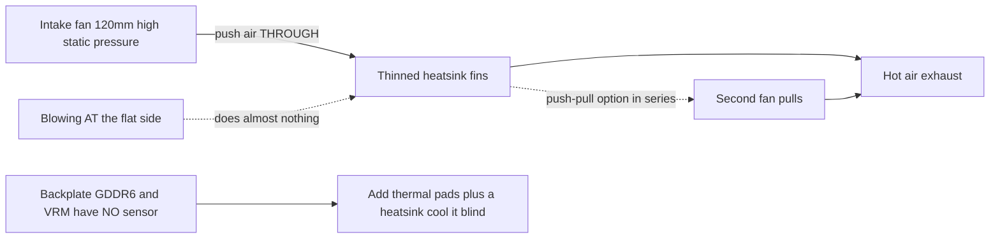

> 🌐 सामुदायिक अनुवाद। अंग्रेज़ी संस्करण ही प्रामाणिक स्रोत है और अधिक नया हो सकता है। कोई त्रुटि मिली? issue खोलें: [English](../en/04-cooling.md) · https://github.com/lildebil0/awesome-bc250/issues

# Cooling

> **संक्षेप में** — BC-250 का stock heatsink एक server rack की forced-air सुरंग के लिए बनाया गया था, desk के लिए नहीं। डिब्बे से निकालते ही यह throttle करता है। सामुदायिक समाधान: **घने stock fins को पतला करें** (उन्हें file/sand करें) और एक **high-static-pressure 120 mm fan** (**Arctic P12 Max/Pro** reference है; Noctua NF-P12 redux शांत premium विकल्प है) उनके *आर-पार* हवा फेंकता हुआ bolt करें। केवल इतना ही एक modded board को **Furmark में ~73 °C, games में 63–65 °C** तक ले आता है। Liquid AIO और full custom cases अगले स्तर हैं।

Cooling वह **#1 चीज़ है जिसे एक newcomer गलत करता है**, इसलिए overclocks का पीछा करने से पहले यह करें।

---

## stock cooler पर्याप्त क्यों नहीं है

BC-250 एक mining/server board है। इसका heatsink **passive** है और एक ऐसे chassis में बैठने के लिए डिज़ाइन किया गया है जहाँ तेज़ fans हवा को front-to-back इसके आर-पार धकेलते हैं। बिना airflow वाले desk पर यह heat-soak हो जाता है और GPU throttle करता है। flat side *पर* fan फेंकने से लगभग कुछ नहीं होता — हवा को **fin channels के आर-पार** चलना होता है, साथ ही backplate के ऊपर भी (पीछे के GDDR6 में **कोई temperature sensor नहीं** है, इसलिए आप उसे अंधेरे में ठंडा करते हैं)।

समुदाय द्वारा देखी गई सीमाएँ: throttling लगभग **85 °C** पर शुरू होती है, hard crash/reset लगभग **90 °C** पर। load temperatures को headroom के साथ ~80 °C से नीचे रखें।

> **तीन heatsink variants मौजूद हैं** (8-row और 9-row fins)। तेज़ पहचान: **PCIe 8-pin connector के पास एक QR code** 9-row variant को चिह्नित करता है। **कम, मोटे-gauge fins वाला** variant stock पर थोड़ा बेहतर ठंडा कर सकता है। ([elektricM Cooling](https://elektricm.github.io/amd-bc250-docs/hardware/cooling/))

**Per-component temperature targets** (elektricM के परखे हुए आँकड़े, ऊपर की throttle/crash सीमाओं से अधिक बारीक):

| Component | Idle | Light load | Gaming | Max |
|-----------|------|-----------|--------|-----|
| GPU/APU edge | 40–50 °C | 50–60 °C | 65–80 °C | 90 °C |
| CPU (Tctl) | 45–55 °C | 55–65 °C | 70–85 °C | 95 °C |
| Memory (underside) | 40–55 °C | 50–65 °C | 55–70 °C | 80 °C |
| NVMe/SSD | 40–55 °C | 50–65 °C | 60–75 °C | 80 °C (critical 81.8 °C) |

games में **GPU 70–80 °C** का लक्ष्य रखें। यहाँ NVMe की छत मायने रखती है क्योंकि **GDDR6 और M.2 SSD board के गर्म पिछले हिस्से को साझा करते हैं** — SSD सबसे खराब thermal जगह पर बैठता है और पक सकता है, इसलिए उस पर नज़र रखें (drive spec के अनुसार `80 °C` max, `81.8 °C` critical)। ([elektricM: sensors](https://elektricm.github.io/amd-bc250-docs/system/sensors/))

> **CPU Tctl सीढ़ी।** elektricM **90 °C Tctl** को अनुशंसित back-off बिंदु के रूप में चिह्नित करता है; table का **95 °C** ऊपरी किनारा है जिसे आप भारी gaming में भी देखेंगे; **TJmax = 100 °C** पूर्ण silicon सीमा है (नीचे की package-power table CPU को एक sustained stress run के तहत ठीक उसी पर पिन करती है)। तो: **90 °C = "अभी back off करो," 95 °C = "red में," 100 °C = "दीवार पर।"** ([elektricM: sensors](https://elektricm.github.io/amd-bc250-docs/system/sensors/))

> **प्रति thermal state package power** (elektricM प्रत्येक state को एक board power draw के साथ जोड़ता है): Idle **50–70 W**, Light **100–150 W**, Heavy **150–200 W**, Stress **200–235 W**। PSU का आकार तय करने और दीवार से यह पढ़ने के लिए उपयोगी कि board वास्तव में कितनी मेहनत कर रहा है। ([elektricM: sensors](https://elektricm.github.io/amd-bc250-docs/system/sensors/))

> **gaming के दौरान pixel artifacts = VRAM का अधिक गरम होना।** क्योंकि पिछली ओर के GDDR6 में कोई sensor नहीं है, वह दृश्य गड़बड़ी ही आपका चेतावनी संकेत है — backplate airflow/pads जोड़ें (नीचे)। ([elektricM Cooling](https://elektricm.github.io/amd-bc250-docs/hardware/cooling/))

> **Silicon lottery — प्रति chip thermal headroom का बजट रखें।** दो भौतिक रूप से समान boards, समान chassis और OC config, **5–10 °C के अंतर पर** चल सकते हैं, और अधिक गर्म वाला re-pasting/re-padding के बाद भी अधिक गर्म ही रहा। यह न मानें कि किसी और के temperatures आपके जैसे होंगे। ([r/BC250Gaming](https://www.reddit.com/r/BC250Gaming/))



---

## Sustained compute एक अलग व्यवस्था है (केवल gaming bursts नहीं)

ऊपर के targets **gaming** मानते हैं, जहाँ load bursts में आता है। **Sustained** compute — एक looped `llama-bench`, लंबे Stable-Diffusion runs, कुछ भी जो GPU को दसियों मिनट तक पेग करे, **विशेष रूप से [40 CU unlock](09-overclock-undervolt.md) के साथ** — एक बहुत कठोर load है और उससे अधिक हो सकता है जितना एक gaming-grade cooler संभाल सकता है।

elektricM ने एक stock heatsink + **push–pull में dual Arctic P12 Max** मापा, **40 CU / 2 GHz** पर 10-मिनट का sustained `llama-bench`:

| Metric | Average | Peak |
|--------|---------|------|
| GPU edge | 89.6 °C | 107 °C |
| Package power | 136 W | 223 W |
| CPU | 96.7 °C | 100 °C (TJmax) |
| VRM MOSFETs | 57 °C | 58.5 °C |
| Fan speed | ~2950 RPM | 2977 RPM (ceiling) |

जैसे ही package throttle हुआ, throughput run के दौरान **~10 %** गिर गया। निष्कर्ष: **stock heatsink + dual P12 Max sustained 40 CU @ 2 GHz के लिए पर्याप्त headroom नहीं है** — और ध्यान दें कि **VRMs अपनी सीमा के आसपास भी नहीं हैं** (57 °C), इसलिए अड़चन *heatsink द्वारा heat छोड़ना* है, न कि fans या power stage। दो समाधान: **GPU governor को 1500 MHz पर cap करें** (40 CU फिर भी ~1.5× compute scale करता है, temperatures ~83 °C पर रहते हैं — dual P12 Max पर अनिश्चित काल तक sustainable), या **heatsink upgrade करें** (अधिक fin area)। **24 CU stock gaming** के लिए, dual P12 Max आरामदायक है; दीवार केवल sustained full-CU compute के तहत प्रकट होती है। ([elektricM Cooling](https://elektricm.github.io/amd-bc250-docs/hardware/cooling/))

---

## Path A — Air mod (सबसे लोकप्रिय, सबसे सस्ता)

अधिकांश chat यही चलाते हैं।

### 1. stock fins को पतला/साफ करें
stock fins बहुत घने और अक्सर असमान होते हैं। लोग channels खोल देते हैं ताकि हवा गुज़र सके:

- **Orbital (eccentric) sander** — सबसे तेज़, मिनटों में हो जाता है, सर्वोत्तम परिणाम। ([src](https://t.me/c/2424231195/31571))
- **हाथ से Sandpaper** — 60 grit फिर 240 grit, ~3–4 घंटे + दो दिनों में 2 घंटे। काम करता है पर धीमा। ([src](https://t.me/c/2424231195/50330))
- **Scissors / snips** — कच्चा "чекрыжить" तरीका, अंतिम उपाय; परिणाम सबसे खराब होते हैं। ([src](https://t.me/c/2424231195/41252))
- **Scissors + ruler guide (साफ variant)** — craft/hairdresser scissors को fin gap में सरकाएँ और **blade के विरुद्ध कोण पर रखे एक ruler को guide के रूप में** इस्तेमाल करें; एक pocket-knife "can-opener" भी उतना ही अच्छा काम करता है। चेतावनी: कुछ board variants में **blade शुरू करने के लिए कोई gap नहीं** होता — एक को screwdriver/tweezers से खोलें, या एक **छोटे Dremel cutting wheel** से entry slot काटें। fin slots से चौड़े blades heatsink को नुकसान पहुँचा सकते हैं। ([r/BC250Gaming](https://www.reddit.com/r/BC250Gaming/))
- मुड़े हुए fins को **flat tweezers + pliers** से सीधा करें। ([src](https://t.me/c/2424231195/30670))
- **हाथ से fins खींचकर निकालें** — elektricM नोट करता है कि नरम aluminium fins को **हाथ से साफ-सुथरे ढंग से फाड़ा/खींचा** जा सकता है (heatsink board से उतरा हुआ), जिससे cutting tools द्वारा पैदा होने वाला metal swarf टल जाता है। धीमा पर मलबा-रहित। ([elektricM Cooling](https://elektricm.github.io/amd-bc250-docs/hardware/cooling/))
- **"Scooper by Justin"** — एक **3D-printable tool जो विशेष रूप से BC-250 heatsink fins को दबाने/खोलने के लिए बना** है ([Printables 1282906](https://www.printables.com/model/1282906-bc-250-scooper))। एक नंगे screwdriver से सुरक्षित: यह आपको बहुत ज़ोर से धकेलने और fins के बीच heatsink **base** को खुरचने से रोकता है। ([r/linux_gaming community thread](https://www.reddit.com/r/linux_gaming/comments/1nvsgji/)) अपेक्षाएँ तय करें: एक owner ने बताया कि printed **"comb/scooper" tool दूसरे ही उपयोग पर टूट गया** और हाथों में ऐंठन हुई। ([r/BC250Gaming](https://www.reddit.com/r/BC250Gaming/))
- **Hobby pliers — "peel" तरीका** — fins के **ऊपरी हिस्से** को छोटे hobby pliers से पकड़ें और उन्हें छील दें, **धातु की अपनी memory को break point के रूप में** इस्तेमाल करते हुए ताकि वे base को फाड़ने के बजाय मोड़ पर साफ-सुथरे ढंग से टूटें। cutting का एक मलबा-कम विकल्प। ([r/linux_gaming community thread](https://www.reddit.com/r/linux_gaming/comments/1nvsgji/))

मोटे तौर पर temperature लाभ (elektricM): **मुड़े fins सीधा करना ~5–10 °C**, **center fins हटाना ~10–15 °C** (अपरिवर्तनीय — एक अच्छा fan shroud बिना काटे समान लाभ देता है), **ताज़ा paste ~5–10 °C** अगर पुराना paste सूख गया था। ([elektricM Cooling](https://elektricm.github.io/amd-bc250-docs/hardware/cooling/))

> ⚠ **पहले heatsink को board से उतार लें** (या board और die को पूरी तरह mask/protect करें) sanding/filing से पहले, और **reassembly से पहले धातु की हर ज़र्रे की धूल साफ कर दें**। board पर बैठा conductive metal swarf इसे short कर सकता है और **board को मार सकता है** — chat में यह पहले ही हो चुका है।

<p align="center">
  <br>
  <sub>फ़ोटो: AMD BC-250 community · <a href="https://t.me/c/2424231195/31571">source</a></sub>
</p>

### 2. एक असली fan लगाएँ
fins के आर-पार हवा धकेलता हुआ एक **120 mm high-static-pressure fan** mount करें। reference चुनाव **Arctic P12 Max (या P12 Pro)** है — सबसे अधिक static pressure (~6.9 mm H₂O), इस घने heatsink के लिए समुदाय + elektricM का चुनाव। **Noctua NF-P12 redux** शांत premium विकल्प है, और इसने **Furmark में max 73 °C, games में 63–65 °C** का reference परिणाम पोस्ट किया ([src](https://t.me/c/2424231195/42843))।

**specs के साथ ठोस fan चुनाव** (elektricM — airflow नहीं, *static pressure* पर चुनें):

| Fan | Size | Max RPM | Static pressure | Airflow | Noise | Gaming temps |
|-----|------|---------|----------------|---------|-------|--------------|
| **Arctic P12 Max** | 120 mm | 3300 | **6.9 mm H₂O** | 73.3 CFM | 52.5 dB(A) | 65–75 °C |
| **Arctic P12 Pro** | 120 mm | 2100 | **6.9 mm H₂O** | 68.9 CFM | 37.8 dB(A) | 65–75 °C |
| Arctic P14 PWM | 140 mm | 1700 | 2.40 mm H₂O | 72.8 CFM | 38 dB(A) | 70–80 °C |
| Noctua NF-A12x25 | 120 mm | 2000 | 2.34 mm H₂O | 60.1 CFM | 22.6 dB(A) | 70–85 °C |

elektricM का **सबसे अनुशंसित चुनाव Arctic P12 Max / P12 Pro है** — इसका ~6.9 mm H₂O static pressure Noctua के 2.34 mm को बौना कर देता है और कहीं सस्ता है; P12 Pro शांत, अधिक व्यापक रूप से उपलब्ध संस्करण है। premium Noctua और भी शांत है पर temperatures पर Arctic की बराबरी केवल अधिक RPM पर करता है। ([elektricM Cooling](https://elektricm.github.io/amd-bc250-docs/hardware/cooling/))

**सामुदायिक builds से अन्य नामित fans** (Arctic/Noctua-P12 reference से परे, विशिष्ट models जो लोगों ने लगाए):

- **Noctua NF-A12x25 G2** (PWM) **120 mm die cooler** के रूप में — A12x25 का नया G2 revision, main fan के रूप में इस्तेमाल ([TiredDadTech](https://youtu.be/zi7sldeRd2w))। (ऊपर की fan table केवल *मूल* NF-A12x25 सूचीबद्ध करती है।)
- **Noctua NF-A6x15 PWM** (≈3500 rpm) एक **60 mm PSU-fan swap** के रूप में — एक चीख़ते server-brick fan का शांत प्रतिस्थापन ([TiredDadTech](https://youtu.be/zi7sldeRd2w))।
- **Thermalright 120 mm 1550 rpm ARGB** एक budget die fan के रूप में, और backplate के लिए **6.0 W/mK thermal pads** — दोनों एक **TMG HD build BOM** से ([build overview](https://youtu.be/OEO0r01zcfU))।

> **Reference बनाम शांत विकल्प।** **Arctic P12 Max/Pro** यहाँ reference fan है — सबसे अधिक static pressure (~6.9 mm H₂O), सबसे सस्ता, इस घने heatsink के लिए समुदाय + elektricM का चुनाव। **Noctua NF-P12 redux** शांत premium विकल्प है (chat का 73 °C Furmark परिणाम), temperatures पर Arctic की बराबरी केवल अधिक RPM पर करता है। सर्वोत्तम price/performance के लिए Arctic चुनें, यदि शांति सबसे अधिक मायने रखती है तो Noctua।

एक **printed fan shroud/adapter** इस्तेमाल करें ताकि fan heatsink के विरुद्ध seal हो जाए बजाय इसके चारों ओर हवा रिसने के। सामुदायिक STLs:
- `Fan_Shroud_Single_120mm.stl`, `Fan_Shroud_Dual_120mm.stl`, `Fan_Shroud_Single_140mm.stl`, `Twin_120mm_Fan_Shroud.stl`
- `BC250_FanAdapter_120mm.step`, `bc250 cooler mount.stl`, `cooler adapter v3.0.stl`

> **static pressure क्यों, airflow rating क्यों नहीं?** घने fins एक high-resistance load हैं। एक high-airflow "case fan" उनके विरुद्ध रुक जाता है; एक high-static-pressure fan (≥3 mm H₂O; Noctua P12, Arctic P12) वास्तव में हवा को *आर-पार* धकेलता है। बहुत घने fins के लिए, **push–pull (series) में** दो fans static pressure को दोगुना कर देते हैं — यहाँ यही सही कदम है, न कि दो fans साथ-साथ।

**Mounting:** एक printed shroud सर्वोत्तम है, पर fan को heatsink से **zip-tying** करना काम करता है, और fan व fins के बीच taped एक **cardboard/foam-board duct** एक मान्य मुफ़्त fallback है (भद्दा, टिकाऊ नहीं, पर air path को seal करता है)। ([elektricM Cooling](https://elektricm.github.io/amd-bc250-docs/hardware/cooling/))

> ⚠ **fans को सीधे fins में drill/screw न करें।** aluminium नरम है और fins पतले हैं — उनमें screw करना fin stack को नुकसान पहुँचाता है और cooling को हानि पहुँचाता है। zip ties या एक printed shroud इस्तेमाल करें। ([elektricM Cooling](https://elektricm.github.io/amd-bc250-docs/hardware/cooling/))

> ### 🛠 Airflow engineering — असल में सुई किससे हिलती है
>
> हवा *कैसे* हिलाई जाती है, इस पर सामुदायिक निष्कर्ष, न कि केवल कौन सा fan:
>
> - **घने fin stack के आर-पार static pressure raw CFM को मात देता है** — इसीलिए high-static-pressure **Arctic P12 Max (6.9 mm H₂O)** इस heatsink पर शांत high-airflow/low-pressure fans से बेहतर प्रदर्शन करता है।
> - **एक केंद्रित fan दो साथ-साथ वालों को मात दे सकता है** एक पूरी तरह कटे fin plane पर: एक अकेला केंद्रीय fan **4 केंद्रीय heat pipes** को सीधे load करता है, जबकि दो fans केंद्र के ऊपर plastic का एक मृत "seam" छोड़ देते हैं। जिस builder ने पहली बार fins को full-plane काटा, उसने एक केंद्रीय fan पर दो की तुलना में कुछ °C **कम** मापा ([src](https://t.me/c/2424231195/46175))। एक teardown airflow की ओर से उसी निष्कर्ष पर पहुँचता है: **साथ-साथ bolt किए गए दो fans एक से बेहतर नहीं हैं** क्योंकि **गर्म die केंद्र के ठीक ऊपर एक dead zone बन जाता है** जहाँ दो intakes मिलते हैं — **उनके बीच एक gap छोड़ें, या इसके बजाय push-pull पर जाएँ** ([Old Lamer — Part VII](https://youtu.be/pxahl9-YgkY) ~19:55)। *(Caption-स्रोत — गुणात्मक मानें, सटीक नहीं।)*
> - **120 mm fan-speed फ़र्श ≈1800 RPM** इस घने stack के आर-पार वास्तव में हवा हिलाने के लिए; **Arctic P12 Pro** ($8–10, **600–3000 rpm** range) एक आसान चुनाव है जो शांति से idle करता है और फिर भी headroom रखता है ([Old Lamer — Part VII](https://youtu.be/pxahl9-YgkY))। *(ASR आँकड़े — अनुमानित।)*
> - **एक exhaust fan जोड़ें = −3 से −5 °C।** Intake-only **73 °C** → exhaust के साथ **67–68 °C** ([src](https://t.me/c/2424231195/68183), [src](https://t.me/c/2424231195/31553))। तो सबसे अच्छा सरल setup है **1 केंद्रीय intake + 1 पिछला exhaust**, न कि दो intakes साथ-साथ।
> - **backplate अंधा और गर्म है।** VRM MOSFETs बिना ठंडा किए **~100 °C** तक पहुँचते हैं ([src](https://t.me/c/2424231195/110955)) — इसे pads + heatsinks + समर्पित airflow **अवश्य** मिलना चाहिए; पिछले heatsinks के साथ यह *"load के तहत ठंडा"* चलता है ([src](https://t.me/c/2424231195/93056))।
> - **मुफ़्त physics।** गर्म हवा ऊपर उठती है, इसलिए एक **tilt/chimney** orientation भी मदद करता है — एक मुश्किल से हवादार backplate ने **केवल convection से 47 °C** मापा ([src](https://t.me/c/2424231195/76962))। और एक **black-anodized radiator एक polished वाले से ~1.8× विकिरण करता है**, जो आपको passive/semi-passive compact builds में fin area **~45 %** घटाने देता है ([src](https://t.me/c/2424231195/86878))।
> - **intake > exhaust चलाएँ** (हल्का **positive pressure**) ताकि बिना sensor वाले VRM/VRAM ताज़ा हवा में नहाते रहें।

### विकल्प: stock fins रखें (no-cut push-pull case)
fins काटना अनिवार्य नहीं है। **penzoiders** ने एक case डिज़ाइन किया ([MakerWorld, FreeCAD source](https://makerworld.com/models/2505974)) जो heatsink को **नहीं** काटता: यह **push-pull high-static-pressure fans** का इस्तेमाल करके हवा को **stock, बिना-modified fins** के आर-पार धकेलता है, साथ ही एक **two-chamber pressure differential** जो backplate को भी ठंडा करता है (5 mm heatsinks + thermal pads; पुनः इस्तेमाल किए NVMe heatsinks काम करते हैं)। एक tuning जो ठंडा रहता है: **CPU 3800 MHz / 1050 mV, GPU 2100 MHz / 950 mV** → समानांतर Furmark + `stress-ng` **85 °C से नीचे** रहता है; gaming **~75 °C लगभग 50 % fan duty पर** (CoolerControl curve), "मुश्किल से सुनाई देने वाला"। ([r/BC250Gaming](https://www.reddit.com/r/BC250Gaming/))

## Path B — AIO liquid cooler

एक adapter bracket के ज़रिए die पर mount किया गया एक 120 mm AIO। शांत और ठंडा, पर अधिक parts और लागत। लोकप्रिय builds सस्ते AIOs (जैसे aigo) इस्तेमाल करते हैं। ([example src](https://t.me/c/2424231195/19336))

<p align="center">
  <br>
  <sub>फ़ोटो: AMD BC-250 community · <a href="https://t.me/c/2424231195/19336">source</a></sub>
</p>

**नामित, downloadable AIO bracket — NexGen3D** ([Printables 1554003](https://www.printables.com/model/1554003), ABS-GF या PETG में print करें)। एक **Thermalright 240 mm AIO** के साथ सत्यापित: GPU **~50 °C @ 2000 MHz**, CPU **max 60 °C**। ([r/BC250Gaming](https://www.reddit.com/r/BC250Gaming/))

### Liquid-cooled overclock profiles
एक AIO के साथ आप कहीं अधिक ज़ोर लगा सकते हैं। **NexGen3D** द्वारा दीवार पर मापा गया (Furmark Vulkan + `stress-ng --matrix 0 -t 60m` को burn combo के रूप में):

| Profile | CPU | GPU | Max burn temp | Wall power | Note |
|---------|-----|-----|---------------|------------|------|
| 1 | 4000 MHz | 2400 MHz | ~65 °C | >350 W | "dead silent" |
| 2 | 4100 MHz | 2450 MHz | ~75 °C | <400 W | hotter, louder |

सामान्य 1080p gaming इन burn temperatures से **10–15 °C नीचे** और Profile 1 पर **250 W से कम** चलता है। **नकल करने लायक Airflow scheme:** 120 mm fans **radiator के आर-पार बाहर exhaust करते हैं**, जो **VRMs / PSU / VRAM backplate** के आर-पार ताज़ा बाहरी हवा खींचता है; एक अलग **80 mm fan (Arctic P8 Max)** GPU VRMs को ठंडा करता है — यह ऊपर की "बिना sensor वाले VRM/VRAM को अब भी airflow चाहिए" चेतावनी का उत्तर देता है। ([r/BC250Gaming](https://www.reddit.com/r/BC250Gaming/))

## Custom water loop (advanced)

एक closed AIO से परे, कुछ लोग एक **full custom loop** चलाते हैं। यह एक असली पर **DIY/expert** परिदृश्य है: builders एक **custom waterblock को CNC-mill या solder** करते हैं जो एक ही block में **die *और* VRM** को ढकता है ([src](https://t.me/c/2424231195/131065), [src](https://t.me/c/2424231195/131844), [src](https://t.me/c/2424231195/118582))। Fittings गैर-महत्वपूर्ण हैं — *"आप लगभग किसी भी को source, turn या glue कर सकते हैं"* ([src](https://t.me/c/2424231195/132007))।

**यह आपको क्या देता है:** एक मोटा custom loop **fans केवल 30 % पर, external pump लगभग शांत होने पर load के तहत ~50 °C** तक पहुँचता है ([src](https://t.me/c/2424231195/133040))। (फिर एक builder ने default cyan-skillfish governor config पर load के तहत VRM chokes से coil-whine देखी — एक *अलग* मुद्दा, thermal नहीं।) आपको एक **Corsair Commander की भी ज़रूरत नहीं**: BC-250 का अपना [fan control](#fan-speed-को-नियंत्रित-करना-software) pump प्लस **~5 fans** चला सकता है ([src](https://t.me/c/2424231195/140123))।

> ⚠ **यह "advanced" क्यों है: BC-250 एक coolant flood से नहीं बचता।** समुदाय से असली विफलताएँ: एक hose **90° पर मुड़ा, फट गया, और GPU व PSU को बाढ़ में डुबो दिया** ([src](https://t.me/c/2424231195/81158)); एक **जाम हुए Corsair AIO pump ने CPU को पका दिया** ([src](https://t.me/c/2424231195/133147), [src](https://t.me/c/2424231195/126053))। साथ ही **~50 % pump speed से ऊपर pump cavitation/noise** पर नज़र रखें ([src](https://t.me/c/2424231195/7034))। **पहले wet power-on से पहले पूरे loop को board से उतार कर 24 घंटे leak-test करें।**

**फ़ैसला:** किसी भी विकल्प में सबसे कम temperatures और सबसे शांत, और यह sustained 40-CU को सक्षम बनाता है — पर सबसे अधिक जोखिम और मेहनत। **पहला build नहीं।**

## Path C — Blower ("улитка") — अनुशंसित नहीं

बचाए गए GPU blower fans एक शुरुआती प्रयोग थे। परिणाम के लिहाज़ से तेज़ आवाज़; लोग Path A पर चले गए। ([src](https://t.me/c/2424231195/100086))

## Path D — Tower cooler conversion (advanced)

कुछ users off-the-shelf hardware का इस्तेमाल करके उत्कृष्ट, शांत cooling के लिए एक **AM4 tower cooler** (जैसे **Thermalright Peerless Assassin**, या अन्य AM4/AM5 towers) को die पर bolt करते हैं। पेच: आपको इसे **एक bracket के ज़रिए mount** करना होगा, और एक ऊँचा tower **M.2 slot या अन्य components को block** कर सकता है। यह beginner mod नहीं है। अब आपको इसे शून्य से बनाना नहीं पड़ता — दो प्रकाशित 3D-printed brackets मौजूद हैं:

- **AM4/AM5 desktop-cooler adapter** ([MakerWorld 2596083](https://makerworld.com/en/models/2596083), FreeCAD source शामिल)। एक मानक desktop AM4/AM5 cooler को BC-250 पर mount करता है। Fastening: **M5 bolts + nuts, कोई standoffs नहीं** (OP नोट करता है कि M4 आदर्श होता पर M5 एक snug fit था)। **ABS, PETG, या ASA** में print करें। **CPU 3.95 GHz / 1.150 V, GPU 2200 MHz / 1000 mV, temperatures 80 °C से अधिक नहीं** पर सत्यापित। इस्तेमाल किए गए coolers: एक low-profile **AXP90-class** (एक commenter ने **AXP120** इस्तेमाल किया), और यहाँ तक कि एक **AMD Wraith Spire** ने stock heatsink को मात दी। ([r/BC250Gaming](https://www.reddit.com/r/BC250Gaming/))
- **Thermalright AXP90-X53 mount** ([Printables 1694793](https://www.printables.com/model/1694793))। Threaded inserts को printed bracket के **underside में soldered** किया जाता है ताकि आप **मूल spring-loaded stock-heatsink screws का पुनः उपयोग** करें; button-head bolts नीचे से ऊपर आते हैं और counter-sunk होते हैं, और bracket में board components को clear करने के लिए **brace के नीचे एक 0.5 mm gap** है। Fusion 360 में डिज़ाइन किया गया, **PETG में print करें** (PLA इन temperatures पर नरम हो जाता है)। परिणाम: **2150 MHz, 1080p पर full load के तहत 65–67 °C**, बहुत शांत (copper cooler, एक 120 mm Arctic P12 Pro के साथ युग्मित)। मापी गई stack height **PCB से 15 mm fan के शीर्ष तक 54 mm** — case fit के लिए उपयोगी। एक **3-thickness variant set** और एक **AXP120-X67** संस्करण भी मौजूद हैं। ([r/BC250Gaming](https://www.reddit.com/r/BC250Gaming/))

---

## fan speed को नियंत्रित करना (software)

एक बार fan bolt हो जाने पर, आप इसके PWM को board की **Nuvoton NCT6686D** Super I/O chip के ज़रिए नियंत्रित करते हैं — पर **आप कौन सा driver load करते हैं यह मायने रखता है** ([elektricM hardware spec](https://elektricm.github.io/amd-bc250-docs/)):

- **Read-only sensors** (fan RPM, temperatures): in-kernel **`nct6683`** module, `force=true` के साथ load किया गया। यह readings रिपोर्ट करता है पर **PWM नहीं लिख सकता**, इसलिए fan जो भी BIOS/firmware सेट करता है उसी पर रहता है।
- **Read + write PWM** (वास्तव में fan speed सेट करें): **[Fred78290/nct6687d](https://github.com/Fred78290/nct6687d)** से out-of-tree **`nct6687`** module इस्तेमाल करें, यह भी `force=true` के साथ। यदि आप केवल monitoring के बजाय fan curves / manual speed control चाहते हैं तो यही बनाने लायक है।

```bash
# monitoring only (in-kernel):
echo 'options nct6683 force=true' | sudo tee /etc/modprobe.d/nct6683.conf
# PWM control (DKMS from Fred78290/nct6687d):
echo 'options nct6687 force=true' | sudo tee /etc/modprobe.d/nct6687.conf
```

> दोनों load न करें — read-only sensors के लिए `nct6683` या read+write के लिए `nct6687` चुनें। Sensor wiring (`CPU_FAN1` / `J4003`) और BIOS↔Linux fan numbering [06-linux.md](06-linux.md) के verification step में हैं।

> **कौन सा header main fan है?** elektricM रिपोर्ट करता है कि cooling fan आमतौर पर **Pump Fan** header पर होता है = sysfs में **`fan2` / `pwm2`**; `CPU Fan` (`fan1`) और `System Fan` headers (`fan3`+) आमतौर पर अप्रयुक्त होते हैं। PWM लिखने से पहले manual mode सक्षम करें (`echo 1 > .../pwm2_enable`, फिर `.../pwm2` पर एक 0–255 value)। hwmon numbering reboots के बीच बदल सकती है — `cat /sys/class/hwmon/hwmon*/name` से पुष्टि करें। ([elektricM Cooling](https://elektricm.github.io/amd-bc250-docs/hardware/cooling/))

> **एक GUI के साथ Fan curves — CoolerControl।** एक बार `nct6687` load हो जाने पर, **CoolerControl** graphical fan curves देता है: **nct6686** device चुनें, **k10temp Tctl** को source के रूप में इस्तेमाल करते हुए **pwm2** पर एक curve बनाएँ। Install: `ujust install-coolercontrol` (Bazzite), `codifryed/CoolerControl` copr (Fedora), या AUR से `coolercontrol` (Arch); web UI `https://localhost:11987` पर। ([elektricM Cooling](https://elektricm.github.io/amd-bc250-docs/hardware/cooling/))

> **BIOS fan modes** (यदि आप OS-side control नहीं चलाते): **Default** fans को **40 % न्यूनतम** पर रखता है (बहुत कम — अनुशंसित नहीं), **Full Speed** उन्हें 100 % पर पिन करता है (तेज़ पर सुरक्षित), **Customize** प्रति-threshold speeds सेट करता है। ([elektricM Cooling](https://elektricm.github.io/amd-bc250-docs/hardware/cooling/))

> ⚠ **BIOS Customize mode और CoolerControl को एक ही समय में न चलाएँ** — वे PWM control के लिए लड़ते हैं। एक चुनें। ([elektricM Cooling](https://elektricm.github.io/amd-bc250-docs/hardware/cooling/))

---

## Thermal interface (paste, pads, phase-change, liquid metal)

आप जो भी fan/heatsink चलाएँ, die और heatsink के बीच — और board के पीछे व किसी भी backplate radiator के बीच — **thermal interface material (TIM)** को ठीक करना सार्थक है। BC-250 die में **उच्च heat density** है, इसलिए एक अच्छा TIM मुफ़्त के कुछ डिग्री है।

> **केवल stock paste बदलना मदद करता है।** एक owner ने एक साल बाद factory paste बदला और load temperatures **~4–5 °C** गिर गए, बाकी सब कुछ अपरिवर्तित रहते हुए। ([src](https://t.me/c/2424231195/88565))

### काम करने वाले Pastes
- **Arctic MX-6** — एक नियमित high-end paste। एक cased build में इसने **Furmark में 87–88 °C** रखा; उसी owner ने नोट किया कि PTM7950 उसमें से और ~4 °C कम कर देता। ([src](https://t.me/c/2424231195/30211))
- **Stock paste + stock pads** documented baseline हैं: 10 मिनट load के बाद ~**76 °C**, idle ~**55 °C** (fin/fan modding से पहले)। ([src](https://t.me/c/2424231195/22992))
- अन्य pastes जिन्हें elektricM यहाँ ठीक बताता है: **Arctic MX-4** (value), **Thermal Grizzly Kryonaut** (premium), **Noctua NT-H1** (विश्वसनीय), **Thermalright TFX** (budget)। इस्तेमाल किए गए board का paste **अक्सर सूख चुका** होता है — केवल re-pasting **~5–10 °C** के लायक है। die पर एक मटर के आकार की बूँद लगाएँ, समान रूप से mount करें, screws को एक **X pattern** में कसें। ([elektricM Cooling](https://elektricm.github.io/amd-bc250-docs/hardware/cooling/))

### PTM7950 — सामुदायिक पसंदीदा (अनुशंसित)
**PTM7950** एक **phase-change pad** है (Honeywell graphite/phase-change film)। कमरे के तापमान पर यह एक पतली ठोस शीट है; load पर (~45–55 °C) यह नरम होकर एक micron-पतली परत में बह जाता है, फिर अपनी जगह रहता है। यह grease की तरह **pump out नहीं होता** या सूखता नहीं, जो ठीक वही है जो आप एक गर्म, thermally-cycling die के नीचे चाहते हैं — इसलिए आप इसे एक बार लगाते हैं और भूल जाते हैं। chat का दो-टूक सारांश: *"PTM7950 और इसके बारे में ज़्यादा मत सोचो"* ([src](https://t.me/c/2424231195/101582)); phase-change सामान्य अनुशंसा है ([src](https://t.me/c/2424231195/61511))।

**कैसे लगाएँ:**
1. die और heatsink base को साफ करें (isopropyl alcohol), सूखने दें।
2. PTM7950 का एक चौकोर टुकड़ा die के आकार में काटें — एक **~26×30 mm** टुकड़ा BC-250 die को ढकता है ([src](https://t.me/c/2424231195/125748))।
3. एक protective film छीलें, pad को die पर रखें, दूसरी film छीलें।
4. heatsink को mount करें और समान रूप से torque करें। **कोई spreading नहीं** — पहला heat cycle काम करता है। कुछ load/idle cycles ("burn-in") के बाद सर्वोत्तम temperatures की अपेक्षा करें।

PTM7950 (Honeywell, 26×30) प्लस एक backplate radiator पर एक reference cased build CPU 3850 MHz / GPU 2100 MHz पर **एक घंटे में ~84 °C, games में 66–71 °C** पर peak करता है। ([src](https://t.me/c/2424231195/125748))

> **नामित युग्मन: heatsink के नीचे Upsiren putty + die पर PTM7950।** एक build video gap भरने वाली जगहों के लिए **Upsiren UTP-6 / UTP-8 thermal putty** (**UTP-8** grade ≈**14.8 W/mK** रेटेड है) को die पर रखी एक **40×80×0.25 mm कटी PTM7950 शीट** के साथ युग्मित करता है ([PTM7950 + Upsiren video](https://youtu.be/FJapqZSdt6I))। putty एक heatsink/plate तक असमान gaps भरने के लिए है; phase-change film die पर ही जाता है।
>
> - **सस्ता AliExpress PTM7950 काम करता है।** एक ~**$13** AliExpress शीट का प्रदर्शन सत्यापित हुआ — आपको name-brand Honeywell कट की ज़रूरत नहीं ([PTM7950 + Upsiren video](https://youtu.be/FJapqZSdt6I))।
> - **PTM7950 को break-in चाहिए।** यह अपने सर्वोत्तम temperatures तक केवल **कई heat/cool cycles के बाद** पहुँचता है — पहले run पर इसका आकलन न करें ([laptop TIM demo](https://youtu.be/U4Zm8msXJHM))।
>
> *(दोनों स्रोत auto-captioned हैं — सटीक W/mK और dimensions को अनुमानित मानें।)*

### Backplate और GDDR6 pads (पीछे को ठंडा करें, अंधेरे में)
board के पीछे **GDDR6 और VRM में कोई temperature sensor नहीं** है — आप उन्हें अंधेरे में ठंडा करते हैं। **backplate पर एक heatsink/radiator** जोड़ें जो **thermal pads** के साथ युग्मित हो ताकि पिछली ओर की heat के जाने के लिए कोई जगह हो। ([src](https://t.me/c/2424231195/125748)) एक RU builder ने बस **Yandex.Market से एक heatsink** उठाया, उसे backplate पर चिपकाया, और इसने **bottom plate को अच्छी तरह ठंडा** किया — कोई भी उचित आकार का aluminium heatsink यहाँ काम कर देता है ([4pda — mananoid1](https://4pda.to/forum/index.php?showtopic=1104980))।

रिपोर्ट की गई pad मोटाई (समुदाय द्वारा साझा, "इसे सहेजा" प्रतिक्रिया):
- **VRM: 1 mm**
- **GDDR6: 2 mm** ([src](https://t.me/c/2424231195/121181))

> ⚠ **verify** — ये मोटाई *आपके* विशिष्ट backplate/radiator तक के gap पर निर्भर करती हैं। pads का ढेर खरीदने से पहले एक gap माप (या एक putty/clay test) से पुष्टि करें।

elektricM memory को स्वयं ठंडा करने के लिए एक **थोड़ी अलग pad scheme** देता है: **board के *सामने* 1.5 mm pads, *पीछे* 2.0 mm**, फिर underside पर एक aluminium plate/heatsink। board के पास **केवल non-conductive** pads इस्तेमाल करें (कभी conductive paste/pads नहीं जो components को short कर सकें)। यह जो pad brands सूचीबद्ध करता है: **Thermalright Odyssey** (high performance), **Arctic Thermal Pad** (value), **Gelid GP-Ultimate** (premium)। ([elektricM Cooling](https://elektricm.github.io/amd-bc250-docs/hardware/cooling/))

> ⚠ **verify (pad मोटाई स्रोतों के बीच भिन्न है)** — हमारे chat-स्रोत आँकड़े हैं **VRM 1 mm / GDDR6 2 mm (पीछे)**; elektricM memory chips के लिए **1.5 mm सामने / 2.0 mm पीछे** निर्दिष्ट करता है। अलग builds, अलग gaps — किसी भी आँकड़े पर आँख मूँदकर भरोसा करने के बजाय **अपनी clearance मापें**।

> **30–60 मिनट gaming के बाद Crashes/instability** (अक्सर pixel artifacts के साथ) क्लासिक **memory-overheating** हस्ताक्षर है। समाधान: pads + एक underside plate जोड़ें, एक backplate fan जोड़ें, case airflow सुधारें, या अस्थायी रूप से **VRAM split कम करें** (जैसे 4 GB → 512 MB) memory heat घटाने के लिए। ([elektricM Cooling](https://elektricm.github.io/amd-bc250-docs/hardware/cooling/))

### Liquid metal — यहाँ आम तौर पर अनुशंसित नहीं
Liquid metal (LM) चर्चा में आता है क्योंकि PS5 (same-family APU) इसका इस्तेमाल करता है ([src](https://t.me/c/2424231195/18105)), और raw performance पर यह paste/PTM को थोड़ा मात देता है ([src](https://t.me/c/2424231195/124112))। लोगों ने BC-250 पर इसके बारे में पूछा है और इसे आज़माया है ([src](https://t.me/c/2424231195/18098), [src](https://t.me/c/2424231195/77180))।

**पर यह इस board पर गलत फ़ैसला है:**
- LM **विद्युत-प्रवाहकीय** है। BC-250 die ठीक **घने GDDR6 और VRM** के बगल में बैठता है; die से बच निकलने वाली एक बूँद board को short कर देती है (वही "memory के पास प्रवाहकीय चीज़ इसे मार देती है" जोखिम जैसा ऊपर metal-swarf चेतावनी में)।
- यह **pump out हो जाता है / लगभग सालाना फिर से करना पड़ता है**, और यह नंगे aluminium पर हमला करता है — यहाँ तक कि PTM7950 का समर्थक भी इसी झंझट के कारण अपने ही hardware पर LM छोड़कर PTM7950 / KryoSheet पर चला गया। ([src](https://t.me/c/2424231195/69688))
- "हर कोई liquid metal के साथ काम करने का बीड़ा भी नहीं उठाएगा।" ([src](https://t.me/c/2424231195/106787))

**निचोड़:** **PTM7950 सुरक्षित high-performance विकल्प है** — ~99 % लाभ, short-circuit/maintenance जोखिम का शून्य। LM उन लोगों के लिए सुरक्षित रखें जो पहले से ही ठीक-ठीक जानते हैं कि वे क्या कर रहे हैं।

---

## अपने cooling को कैसे test करें (सामुदायिक तरीका, pinned)

pinned प्रक्रिया से ([src](https://t.me/c/2424231195/108407)):

1. **GPU stress:** Furmark (Vulkan / "Furmark VK")।
2. **साथ ही CPU:** एक CPU bench (cpu-x) या `stress`/`pipx`-आधारित load जोड़ें — APU एक heatsink साझा करता है, इसलिए दोनों को साथ test करें।
   - ये tools (Furmark, OCCT, cpu-x, `stress`) एक ताज़ा Linux box पर **preinstalled नहीं** होते — पहले उन्हें अपने package manager या Flatpak के ज़रिए install करें।
3. **अपने overclock के तहत test करें**, stock नहीं — 1500 MHz कमज़ोर है; **2000 MHz ~+30 % FPS है** और वही जो आप वास्तव में चलाएँगे, इसलिए उसके लिए ठंडा करें।
4. temperatures देखें; यदि आप ~85 °C पार करते हैं तो आप throttling कर रहे हैं — fan/shroud/fin काम जोड़ें।

> ℹ️ **दो अलग "+30 %" दावों को न मिलाएँ।** यहाँ **GPU-clock +30 %** (1500 → 2000 MHz FPS को लगभग एक-तिहाई बढ़ाना) overclocking से एक *performance* लाभ है। यह एक अलग laptop-TIM प्रदर्शन में एक **re-paste** के लिए उद्धृत **~+30 % thermal सुधार** के **समान नहीं** है ([laptop TIM demo](https://youtu.be/U4Zm8msXJHM)) — वह अलग hardware पर एक *temperature* परिणाम है। एक ही संख्या, असंबंधित चीज़ें।

topic में सबसे सरल तरीके का एक छोटा video walkthrough भी pinned है। ([src](https://t.me/c/2424231195/100024))

---

## अनुशंसित starter setup

| Tier | यह करें | अपेक्षा |
|------|---------|--------|
| Minimum | fins sand करें (orbital sander) + 1× Arctic P12 Max/Pro (या Noctua NF-P12) + printed shroud | ~73 °C Furmark |
| Better | shroud के ज़रिए Push–pull (2× P12) | समान temperature पर कम, शांत |
| Max | adapter पर 120 mm AIO | सबसे ठंडा, अधिक build मेहनत |

---

## Sources

- Pinned test method — https://t.me/c/2424231195/108407 · video — https://t.me/c/2424231195/100024
- Fin tooling — https://t.me/c/2424231195/31571 · https://t.me/c/2424231195/30670 · https://t.me/c/2424231195/50330 · "Scooper by Justin" fin tool ([Printables 1282906](https://www.printables.com/model/1282906-bc-250-scooper)) + hobby-pliers peel method — [r/linux_gaming thread](https://www.reddit.com/r/linux_gaming/comments/1nvsgji/)
- Noctua P12 result — https://t.me/c/2424231195/42843
- AIO example — https://t.me/c/2424231195/19336
- Thermal interface — repaste −4–5 °C https://t.me/c/2424231195/88565 · MX-6 https://t.me/c/2424231195/30211 · stock baseline https://t.me/c/2424231195/22992 · PTM7950 https://t.me/c/2424231195/101582 · https://t.me/c/2424231195/61511 · PTM7950 build + backplate https://t.me/c/2424231195/125748 · pad thickness https://t.me/c/2424231195/121181 · liquid metal https://t.me/c/2424231195/18098 · https://t.me/c/2424231195/69688
- elektricM cooling guide (heatsink variants, per-component temp table, sustained-load data, fan specs, CoolerControl/BIOS fan modes, tower cooler, pad scheme) — https://elektricm.github.io/amd-bc250-docs/hardware/cooling/
- [elektricM: sensors](https://elektricm.github.io/amd-bc250-docs/system/sensors/) (thermal thresholds: CPU Tctl 90 °C max / TJmax 100 °C, NVMe/SSD 80 °C max / 81.8 °C critical, package power per thermal state)
- r/BC250Gaming (community reports: silicon-lottery variance, scissors+ruler fin method, comb-tool breakage, no-cut push-pull case, AIO bracket + 240 mm result, liquid OC profiles, AM4/AM5 + AXP90-X53 brackets) — https://www.reddit.com/r/BC250Gaming/ · AM4/AM5 cooler adapter [MakerWorld 2596083](https://makerworld.com/en/models/2596083) · AXP90-X53 mount [Printables 1694793](https://www.printables.com/model/1694793) · NexGen3D AIO bracket [Printables 1554003](https://www.printables.com/model/1554003) · no-cut push-pull case [MakerWorld 2505974](https://makerworld.com/models/2505974)
- Hardware reference — [mothenjoyer69/bc250-documentation `hardware.md`](https://github.com/mothenjoyer69/bc250-documentation/blob/main/hardware.md)
- Cases/adapters with cooling — [onemorecap/bc-250-sleeve-adapter](https://github.com/onemorecap/bc-250-sleeve-adapter)
- Two-fans-side-by-side dead zone over the die / leave a gap or push-pull, 120 mm ≈1800 RPM floor, Arctic P12 Pro ($8–10, 600–3000 rpm) — [Old Lamer — Part VII](https://youtu.be/pxahl9-YgkY) (auto-caption / ASR — figures approximate)
- Upsiren UTP-6 / UTP-8 putty (UTP-8 ≈14.8 W/mK) + PTM7950 cut 40×80×0.25 mm on the die, cheap AliExpress PTM7950 (~$13) verified — [PTM7950 + Upsiren video](https://youtu.be/FJapqZSdt6I) · PTM7950 needs several heat/cool break-in cycles + the separate repaste "+30 %" (laptop, not the GPU-clock +30 %) — [laptop TIM demo](https://youtu.be/U4Zm8msXJHM)
- Named fans: Noctua NF-A12x25 G2 (120 mm die cooler) + NF-A6x15 PWM 3500 rpm (60 mm PSU-fan swap) — [TiredDadTech](https://youtu.be/zi7sldeRd2w) · Thermalright 120 mm 1550 rpm ARGB + 6.0 W/mK pads (TMG HD build BOM) — [build overview](https://youtu.be/OEO0r01zcfU)
- RU backplate radiator (Yandex.Market heatsink cooled the bottom plate) — [4pda — mananoid1](https://4pda.to/forum/index.php?showtopic=1104980)

> Fan-shroud और adapter STLs [05-case.md](05-case.md) में सूचीबद्ध हैं और `assets/stl/` के अंतर्गत mirror किए गए हैं।
