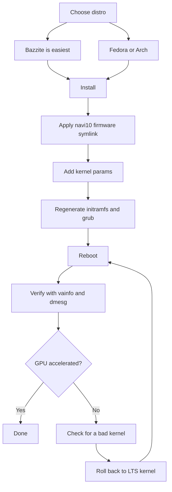

> 🌐 सामुदायिक अनुवाद। अंग्रेज़ी संस्करण ही प्रामाणिक स्रोत है और अधिक नया हो सकता है। कोई त्रुटि मिली? issue खोलें: [English](../en/06-linux.md) · https://github.com/lildebil0/awesome-bc250/issues

# Linux Drivers & Setup

> **संक्षेप में** — अधिकांश लोग BC-250 को Linux पर चलाते हैं, और *एक बार GPU ठीक हो जाने पर* यह अच्छी तरह काम करता है। डिब्बे से निकालते ही `amdgpu` इस chip को पहचानता नहीं और आपको CPU-rendered, single-digit FPS मिलते हैं। दो चीज़ें इसे असली बनाती हैं: एक **आधुनिक kernel + ताज़ा Mesa (25.1+)**, और **`amdgpu` fix** — एक firmware symlink ताकि driver load हो सके (`navi10_gpu_info.bin` → `cyan_skillfish_gpu_info.bin`) साथ ही kernel params (`amdgpu.sg_display=0`, `mitigations=off`, और नए kernels पर `amdgpu.bc250_cc_write_mode=3`)। newcomer के लिए सबसे आसान रास्ता: **[Bazzite](https://bazzite.gg/)** flash करें और समर्पित **`bazzite-bc250`** image पर rebase करें — fixes पहले से अंदर हैं। मशीन को सीखना चाहते हैं: **Fedora** या **CachyOS/EndeavourOS (Arch)** एक one-time setup script के साथ।

यह वह section है जो "डिब्बे में एक board" को एक काम करने वाले desktop में बदलता है। पहले [cooling](04-cooling.md) और [power](03-power-supply.md) करें — फिर यह।

> **कभी Linux इस्तेमाल नहीं किया? एक 60-second survival kit।**
> - **एक terminal खोलें:** अपने menu में *Terminal* / *Konsole* (KDE) / *Console* नामक app ढूँढें, या `Ctrl-Alt-T` दबाएँ।
> - किसी command के आगे **`sudo`** उसे administrator के रूप में चलाता है। यह आपका password पूछेगा — और **जैसे आप type करते हैं, screen पर कुछ नहीं दिखता** (न dots, न stars)। यह सामान्य है; इसे type करें और Enter दबाएँ।
> - **`nano /etc/...`** terminal में एक plain text editor खोलता है। save करके बाहर निकलने के लिए: **Ctrl-O**, फिर **Enter**, फिर **Ctrl-X**।
> - terminal में **Copy-paste** आमतौर पर **Ctrl-Shift-V** होता है (Ctrl-V नहीं)।
> - कई steps केवल **reboot** (`systemctl reboot`) के बाद ही प्रभावी होते हैं। जब कोई step "reboot" कहे, तो यह आँकने से पहले कि यह काम कर गया, वास्तव में reboot करें।

---

## एक चीज़ जो आपको समझनी ही चाहिए

BC-250 का GPU **Cyan Skillfish / Oberon** है (एक PlayStation 5-derived RDNA2 part)। Mainline `amdgpu` के पास ऐतिहासिक रूप से **इसके नाम का कोई firmware blob नहीं था**, इसलिए एक stock install पर kernel GPU को initialize नहीं कर पाता और desktop software (LLVMpipe) rendering पर गिर जाता है — सब कुछ धीमा होता है और `vulkaninfo` कोई असली device नहीं दिखाता। एक user ने यह समझने से पहले "broken drivers" पर कई दिन बिताए कि उसके distro ने बस एक ऐसा kernel boot किया था जो GPU firmware load नहीं कर सकता था ([src](https://t.me/c/2424231195/98466))।

तो हर काम करने वाला setup किसी न किसी रूप में वही तीन चीज़ें करता है:

1. **पर्याप्त नया kernel + Mesa चलाएँ।** Upstream Mesa को BC-250 support **25.1** में मिला (तब से कोई patch ज़रूरी नहीं; **25.3.x** वर्तमान अनुशंसित stable है) — ([Mesa MR !33116](https://gitlab.freedesktop.org/mesa/mesa/-/merge_requests/33116), [src](https://t.me/c/2424231195/20891))। Temperature sensors **kernel 6.15** में आए ([src](https://t.me/c/2424231195/23542)); kernel **6.18.18 LTS** वर्तमान sweet spot है।
2. **`amdgpu` को वह firmware दें जो उसे चाहिए** — मौजूदा setups पर एक up-to-date **`linux-firmware`** पहले से `cyan_skillfish_gpu_info.bin` भेजता है; पुराने systems को अभी भी **navi10 symlink** चाहिए (या एक patched mesa/kernel package)। Path C देखें।
3. **सही kernel parameters पास करें** और initramfs + bootloader को पुनर्जनित करें। (और **GPU governor** install करें ताकि clocks 1500 MHz पर pinned न हों।)

नीचे जो कुछ भी है वह बस *कैसे* प्रत्येक distro उन तीन चीज़ों को करता है, इसके बारे में है।



---

## कौन सा distro? (community poll पसंदीदा)

chat बार-बार चार पर लौटता है। कोई एक "सही" उत्तर नहीं है — यह *शून्य मेहनत* और *अपनी मशीन को समझने* के बीच एक trade है। elektricM docs एक व्यापक क्षेत्र को परखते हैं; यहाँ वे सभी एक नज़र में हैं ([elektricM: distributions](https://elektricm.github.io/amd-bc250-docs/linux/distributions/)):

| Distro | Base | Effort | GPU fix | Best for |
|--------|------|--------|---------|----------|
| **Bazzite** (`bazzite-bc250` image) | Fedora atomic | **Lowest** — fixes अंदर पकाए हुए | image में पहले से लागू | newcomers, "बस games खेलो" |
| **Fedora 43** (Workstation / KDE) | Fedora | Low | mainline repos में Mesa 25.x + governor COPR | Linux सीखें, upstream के क़रीब रहें |
| **CachyOS** | Arch | Medium | repos में Mesa 25.1+ + governor (AUR) | अधिकतम smoothness (BORE scheduler), HDR+VRR |
| **EndeavourOS / Arch** | Arch | Medium | repos में Mesa 25.1+ + governor | install की तकलीफ़ के बिना Arch |
| **Debian (Testing/Sid) / PikaOS** | Debian | Medium–High | `experimental` से Mesa (Debian) / OOTB (PikaOS) | स्थिरता, **सबसे कम idle power (~50–60 W)** |
| **Manjaro** | Arch | Medium | repos में Mesa 25.1+; BIOS flash के बाद OOTB boot | आसान Arch; GNOME सबसे स्थिर |
| **Alpine** | Alpine (OpenRC) | High | manual mesa + firmware + governor | Minimal/headless, ~150 MB RAM / ~35 W |
| **Fedora CoreOS** | Fedora atomic | High | container host; post-install customizations | Headless container/LLM servers |
| **SteamOS** (Valve) | Arch (immutable) | Medium | **main-branch** image से Mesa (stable नहीं) + governor | असली Steam Machine का अनुभव; couch/Gaming Mode |
| **Batocera** | Linux (emulation distro) | Low–Medium | bundled Mesa + setup | console-style **emulation** box ([15-emulation.md](15-emulation.md)) |

chat और [elektricM](https://elektricm.github.io/amd-bc250-docs/linux/distributions/) से नोट्स:
- **Bazzite सबसे आसान है** और इसका एक **समर्पित BC-250 image** है जिसमें firmware fix, kernel params, GPU governor और 40-CU/frequency patch पहले से लागू हैं। इसे artifacthub पर ढूँढें: [`bazzite-bc250`](https://artifacthub.io/packages/container/bazzite-bc250/bazzite_bc250)। कई users ठीक hand-patching बंद करने के लिए इस पर चले गए ([src](https://t.me/c/2424231195/121246))।
- **Fedora 43 के अनुसार, Mesa 25.x mainline repos में है** — केवल Mesa के लिए `mixaill/amd-bc-250` COPR की अब ज़रूरत नहीं। Fedora 42 **end-of-life** है; 43 में upgrade करें। install के दौरान, यदि आपको black screen मिले, तो *Troubleshooting → Install in Basic Graphics Mode* इस्तेमाल करें ([elektricM: Fedora](https://elektricm.github.io/amd-bc250-docs/linux/fedora/))।
- **"gamer" distros को आँख मूँद कर न पकड़ें।** एक विस्तृत राय तर्क देती है कि एक सादा **Fedora (Workstation/KDE)** या **vanilla Arch with LTS kernel + fresh Mesa** दर्द-रहित मध्य मार्ग है, और कि भारी tuned forks कभी-कभी मदद करने के बजाय Steam/FSR/vsync को *तोड़* सकते हैं ([src](https://t.me/c/2424231195/102834))। इसे "late 2025 के अनुसार" सलाह मानें — तब से Bazzite image परिपक्व हो गया है।
- **Bazzite के बजाय CachyOS, यदि आप अधिकतम smoothness का पीछा कर रहे हैं।** एक विस्तृत r/BC250Gaming (Reddit) community report Bazzite से **CachyOS** पर switch हुई और games को स्रोत की परवाह किए बिना ध्यान देने योग्य रूप से अधिक smooth पाया, कम stutters/micro-freezes के साथ (जैसे *Mortal Kombat 1*), कम random crashes और Steam-mode restarts, और **default Btrfs** layout पर एक बहुत responsive अनुभव। इसने **HDR + VRR को ठीक से काम करते हुए** भी पाया जहाँ Bazzite नहीं कर सका (HDR में गड़बड़ी थी, VRR कभी काम नहीं किया) — [14-display.md](14-display.md) देखें। इसे एक अच्छी तरह documented अनुभव मानें, सार्वभौमिक फ़ैसला नहीं, लेकिन यदि Bazzite आपको stutter या अस्थिरता के साथ छोड़ देता है तो यह एक मज़बूत विकल्प है। Setup **[`redbeard1083/bc250-toolkit`](https://github.com/redbeard1083/bc250-toolkit)** script द्वारा स्वचालित है (CachyOS पर BC-250)। ⚠ एक अलग community datapoint एक thermal/FPS कोण जोड़ता है: एक *समान* overclock पर, बताया जाता है कि CachyOS **Bazzite की तुलना में ~10 °C ठंडा** चलता है और CPU-bound titles में अधिक FPS देता है (जैसे *Elden Ring* CachyOS पर ~60–75 बनाम Bazzite पर ~45–60) ([+14], r/BC250Gaming — community-reported, भिन्न होता है; स्वतंत्र रूप से पुष्ट नहीं)।
- **Kernel version distro से अधिक मायने रखता है।** known-bad kernels से बचें (नीचे warning box देखें)। संदेह होने पर, एक **LTS kernel** (6.18.18 LTS अनुशंसित) सुरक्षित विकल्प है — कई users एक too-new kernel पर दीवार से टकराए और LTS पर switch करके बचाए गए ([src](https://t.me/c/2424231195/56529), [src](https://t.me/c/2424231195/59839))।
- **Desktop environment:** BC-250 पर **GNOME का सबसे अच्छा track record** है। KDE Plasma में Qt RDRAND/RDSEED crashes थे — हाल के Qt (mid-2025) में ठीक हुए लेकिन GNOME अब भी सुरक्षित default है; Cinnamon (X11) एक स्थिर lightweight विकल्प है ([elektricM: distributions](https://elektricm.github.io/amd-bc250-docs/linux/distributions/))।
- **दो और distros community-confirmed boot होते हैं** ([r/linux_gaming community thread](https://www.reddit.com/r/linux_gaming/comments/1nvsgji/)): **SteamOS** BC-250 पर चलता है — लेकिन **main-branch** SteamOS image इस्तेमाल करें, stable channel **नहीं** (stable BC-250 support के बिना एक पुराना Mesa भेजता है)। और **Batocera**, समर्पित emulation distro, भी boot और चलता है — board को एक console-style emulation box में बदलने का एक सुविधाजनक तरीका (देखें [15-emulation.md](15-emulation.md))। दोनों ऊपर हर चीज़ की तरह वही तीन नियम मानते हैं (हाल का Mesa + `amdgpu` firmware fix + kernel params/governor)।

> एक veteran ने BC-250 को Linux पर तीन महीने daily-driving करने के बाद अनुभव को सारांशित किया: games एक click से launch होते हैं, RTX काम करता है, VR काम करता है, "बिल्कुल seamlessly" — और उसी की वजह से उसने अपना main desktop Linux पर switch कर लिया ([src](https://t.me/c/2424231195/61870))।

---

## Path A — Bazzite (newcomers के लिए अनुशंसित)

Bazzite एक immutable Fedora-based gaming OS है (SteamOS-जैसा)। community एक **BC-250-specific image** बनाए रखती है ताकि आप स्वयं firmware या kernel params को न छुएँ।

### A1. पहले regular Bazzite install करें
1. **[bazzite.gg](https://bazzite.gg/#image-picker)** से download करें (desktop या "Deck"/Gaming-Mode variant चुनें)।
2. USB में flash करें (Ventoy, Rufus, या balenaEtcher) और सामान्य रूप से install करें। **एक non-root user बनाएँ** — Steam root के रूप में launch करने से इनकार करता है ([src](https://t.me/c/2424231195/121246))।

> **सही Bazzite image चुनना (step-by-step)।** [bazzite.gg](https://bazzite.gg/) पर picker को **Desktop PC → AMD (modern) → KDE → Gaming-Mode image** चलें — **Gaming-Mode** build पकड़ें, सादा live ISO नहीं: live ISO ठीक install होता है लेकिन **वास्तव में games नहीं चला सकता**। इसे **Balena Etcher** से एक **≥16 GB** USB stick पर flash करें। install **target** एक M.2 NVMe, M.2-to-SATA adapter पर एक SATA SSD, या यहाँ तक कि एक **external USB** drive भी हो सकता है। mid-November-2025 का एक image डिब्बे से **Mesa 25.2.4** भेजता था ([Old Lamer — Part IV](https://youtu.be/YuBmGF536II))।

> **Flash drive बहुत छोटा है?** Bazzite ISO >9 GB है। आप एक छोटे stick पर सादा **Fedora** (≈3 GB ISO, जैसे Kinoite/KDE) install कर सकते हैं, फिर terminal से Bazzite पर *rebase* कर सकते हैं ([src](https://t.me/c/2424231195/121246)):
> ```bash
> # KDE desktop:
> rpm-ostree rebase ostree-image-signed:docker://ghcr.io/ublue-os/bazzite:stable
> # or with Gaming Mode (SteamOS-like):
> rpm-ostree rebase ostree-image-signed:docker://ghcr.io/ublue-os/bazzite-deck:stable
> ```
> Reboot करें और आप Bazzite में हैं।

### A2. GPU governor install करें (सबसे सरल मौजूदा रास्ता)
2026 की शुरुआत के अनुसार **stock Bazzite kernel में पहले से GPU frequency-range patch शामिल है** — इसलिए आपको आमतौर पर **किसी custom image की बिल्कुल ज़रूरत नहीं**। बस regular Bazzite के ऊपर governor install करें ([elektricM: Bazzite](https://elektricm.github.io/amd-bc250-docs/linux/bazzite/)):
```bash
sudo dnf copr enable filippor/bazzite
rpm-ostree install cyan-skillfish-governor-smu   # SMU variant — no kernel patch needed
systemctl reboot
sudo systemctl enable --now cyan-skillfish-governor-smu.service
# Pin the known-good deployment so an update can't silently break you:
rpm-ostree pin 0
```
**`cyan-skillfish-governor-smu`** clocks को SMU firmware calls के ज़रिए चलाता है और पुराने `oberon-governor` का स्थान लेता है (देखें *[Power governor](#b3-power-governor-cyan-skillfish-governor)*)। एक `cyan-skillfish-governor-tt` variant भी मौजूद है लेकिन उसे kernel frequency patch चाहिए (पहले से Bazzite में)। ⚠ governor गलत card (card0 बनाम card1) को target कर सकता है — यदि scaling शुरू न हो तो verify करें।

### A2-alt. (वैकल्पिक) BC-250 image पर rebase करें
केवल यदि आप अतिरिक्त pre-baked optimizations चाहते हैं: एक maintained BC-250 image पर switch करें — **`vietsman` "Bazzite on Steroids"** builds (firmware fix, kernel params, governor, विस्तारित 350–2230 MHz frequency patch अंदर पकाया हुआ)। वह desktop चुनें जो आपने install किया — **GNOME अनुशंसित default है** — और चलाएँ:
```bash
# GNOME (recommended):
rpm-ostree rebase ostree-image-signed:docker://ghcr.io/vietsman/bazzite-gnome-patched:latest
# KDE:
rpm-ostree rebase ostree-image-signed:docker://ghcr.io/vietsman/bazzite-kde-patched:latest
# Deck / Gaming-Mode (SteamOS-like):
rpm-ostree rebase ostree-image-signed:docker://ghcr.io/vietsman/bazzite-deck-patched:latest
systemctl reboot
```
⚠ चलाने से पहले मौजूदा image/tag verify करें — image paths बदलते हैं। up-to-date commands [BC-250 docs Bazzite page](https://elektricm.github.io/amd-bc250-docs/linux/bazzite/) पर रहती हैं (artifacthub पर भी [`bazzite-bc250`](https://artifacthub.io/packages/container/bazzite-bc250/bazzite_bc250) के रूप में सूचीबद्ध)।

> ⚠ **एक patched image पर rebase करना आपके USB WiFi को मार सकता है (elektricM Issue #10)।** custom kernel में आपके USB WiFi/Bluetooth dongle का driver शामिल नहीं हो सकता (BC-250 में कोई built-in wireless नहीं है)। Ethernet तैयार रखें, rebase के बाद `lsmod | grep <your_driver>` जाँचें, यदि गायब हो तो `rpm-ostree install <driver-package>`, या `rpm-ostree rollback && systemctl reboot`।

> **यदि 40-CU unlock fan control या आपके Xbox gamepad को तोड़े, तो एक custom kernel image swap करें।** Bazzite का built-in 40-CU unlock ("Old-Lamer" method) कुछ setups पर **fan control और Xbox controller support** को तोड़ने के लिए community-reported है ([+ r/BC250Gaming — community-reported, भिन्न होता है])। **[`hafriedlander/kernel-bazzite`](https://github.com/hafriedlander/kernel-bazzite)** image एक custom kernel है जो उसे ठीक करता है — *"BC250 boards के लिए 40CU unlock patch के साथ (legacy) Bazzite kernel"* होने के रूप में सत्यापित, सीधे Fedora के kernel-ark से सामान्य handheld/performance patch set के साथ बनाया गया (AUR पर `linux-bazzite-bin` के रूप में भी packaged)। ⚠ क्या यह आपके विशिष्ट fan/gamepad regression को सुलझाता है, यह एक community datapoint है, गारंटी नहीं — एक known-good deployment pinned रखें ताकि आप `rpm-ostree rollback` कर सकें।

reboot के बाद, आगे Bazzite helper से update करें:
```bash
ujust update          # update everything (or: rpm-ostree upgrade && flatpak update)
rpm-ostree rollback   # if an update breaks something, roll back and reboot
```

> **दो Bazzite gotchas जानने योग्य** ([elektricM: Bazzite](https://elektricm.github.io/amd-bc250-docs/linux/bazzite/)): हल्के 2D games में भी लगातार **micro-stutter** आमतौर पर Handheld Daemon का एक loop में fail होना है — इसे `sudo systemctl mask --now hhd` से disable करें। और एक BIOS flash के बाद **levels load करते समय freezes** का आमतौर पर अर्थ है कि **CMOS clear नहीं हुआ था** — CMOS clear करें, VRAM setting दोबारा लागू करें।

> ⚠ **Bazzite की immutability low-level network tools को रोकती है।** read-only `/usr` का अर्थ है कि traffic-shaping / anti-throttling tools जो system services या kernel pieces install करते हैं (जैसे `zapret`-style tools) साफ़ install नहीं होते। यदि आप किसी पर निर्भर हैं — कुछ ISPs के लिए सामान्य जो Steam को throttle करते हैं — तो एक mutable distro (Fedora/Arch) आसान host है (RU-specific विवरण Russian edition में)।

### A3. हो गया — verify करें
नीचे **[GPU acceleration की पुष्टि करना](#gpu-acceleration-की-पुष्टि-करना)** पर जाएँ। BC-250 image पर (या A2 के बाद) firmware symlink, kernel params और governor पहले से जगह पर हैं।

---

## Path B — Fedora (Workstation / KDE)

Fedora सबसे अधिक documented non-atomic रास्ता है और upstream के क़रीब रहता है। **Fedora 43 पर graphics stack को किसी अतिरिक्त repo की ज़रूरत नहीं — Mesa 25.x पहले से mainline repos में है** ([elektricM: Fedora](https://elektricm.github.io/amd-bc250-docs/linux/fedora/))। पुराने `mixaill/amd-bc-250` COPR (नीचे) की केवल pre-43 releases पर ज़रूरत है।

### B1. Fedora install करें
**Fedora 43 Workstation या KDE** download करें ([fedoraproject.org](https://fedoraproject.org/workstation/download)) और सामान्य रूप से install करें — **Fedora 42 end-of-life है**, 43 में upgrade करें। यदि installer एक black screen दिखाए, तो *Troubleshooting → Install Fedora in basic graphics mode* चुनें (यह `nomodeset` सेट करता है; drivers आने के बाद इसे हटा दें)। chat से reported-good baseline: kernel 6.14, GNOME 48, Mesa 25.0.2+ — "उड़ता है" ([src](https://t.me/c/2424231195/29150))। Cinnamon के साथ Fedora 41 को Cyberpunk, Witcher 3, आदि चलाते हुए "बेहद स्थिर" कहा गया ([src](https://t.me/c/2424231195/12756))। 43 पर kernel **6.18.18 LTS** या **6.17.11+** पसंद करें और टूटी हुई ranges से बचें (नीचे warning box)।

### B2. setup script (काम आपके लिए करता है)
canonical Fedora setup `mothenjoyer69/bc250-documentation` के **`fedora-setup.sh`** द्वारा स्वचालित है। यह COPR enable करता है, patched mesa install करता है, `amdgpu` configure करता है, governor बनाता है और bootloader ठीक करता है। यह जो सटीक steps चलाता है (script के विरुद्ध cross-checked):

```bash
# 1. Patched mesa from COPR
sudo dnf copr enable mixaill/amd-bc-250 -y
sudo dnf upgrade --refresh -y

# 2. amdgpu module option + sensor module
echo 'options amdgpu sg_display=0'    | sudo tee /etc/modprobe.d/options-amdgpu.conf
echo 'nct6683'                        | sudo tee /etc/modules-load.d/99-sensors.conf
echo 'options nct6683 force=true'     | sudo tee /etc/modprobe.d/options-sensors.conf

# 3. Regenerate initramfs (Fedora uses dracut)
sudo dracut --regenerate-all --force

# 4. Bootloader: drop nomodeset, add kernel params
sudo sed -i 's/nomodeset//g' /etc/default/grub
sudo grub2-mkconfig -o /etc/grub2.cfg
sudo grubby --update-kernel=ALL --args="amdgpu.sg_display=0"
sudo grubby --update-kernel=ALL --args="mitigations=off"

# 5. OpenCL (optional, for compute/AI)
sudo dnf install mesa-libOpenCL --allowerasing
```
*(स्रोत: [mothenjoyer69/bc250-documentation](https://github.com/mothenjoyer69/bc250-documentation) में `fedora-setup.sh`, verbatim पुष्ट।)*

steps type करने के बजाय बस script चलाने के लिए, उस repo के README का **"Simple setup script"** section देखें (यह [`fedora-setup.sh`](https://raw.githubusercontent.com/mothenjoyer69/bc250-documentation/refs/heads/main/fedora-setup.sh) की ओर इशारा करता है)। ⚠ किसी setup script को shell में pipe करने से पहले उसे पढ़ें।

### B3. Power governor (cyan-skillfish-governor)
board डिब्बे से एक flat 1500 MHz / 1000 mV चलाता है; एक **governor** clocks को scale करता है (idle ↔ ~2000 MHz) और आपको undervolt करने देता है। वर्तमान अनुशंसित एक **`cyan-skillfish-governor-smu`** है, `filippor/bazzite` COPR से ([elektricM: Fedora](https://elektricm.github.io/amd-bc250-docs/linux/fedora/), Mar 2026 में पुष्ट):
```bash
sudo dnf copr enable filippor/bazzite
sudo dnf install cyan-skillfish-governor-smu
sudo systemctl enable --now cyan-skillfish-governor-smu
systemctl status cyan-skillfish-governor-smu        # check it's running
```
Config `/etc/cyan-skillfish-governor-smu/config.toml` में रहता है। पूरा tuning **[09-overclock-undervolt.md](09-overclock-undervolt.md)** में cover किया गया है।

> **SMU बनाम पुराना oberon-governor।** `cyan-skillfish-governor-smu` clocks को SMU firmware calls के ज़रिए चलाता है और **किसी भी distro पर kernel frequency patch की ज़रूरत नहीं** — इसने elektricM docs में हर जगह प्रभावी रूप से पुराने `oberon-governor` को बदल दिया है ([elektricM: kernel](https://elektricm.github.io/amd-bc250-docs/linux/kernel/))। वही COPR एक `cyan-skillfish-governor-tt` variant भी भेजता है, जिसे kernel patch *चाहिए*। यदि आप पहले से `oberon-governor` चलाते हैं, तो SMU वाला install करने से पहले उसे stop/disable/remove करें (`sudo systemctl disable --now oberon-governor`, `/etc/oberon-config.yaml` हटाएँ)।

### B4. Reboot और verify
Reboot करें, फिर **[GPU acceleration की पुष्टि करना](#gpu-acceleration-की-पुष्टि-करना)** पर jump करें।

---

## Path C — Arch family (CachyOS / EndeavourOS)

Arch-based installs को ऐतिहासिक रूप से **firmware symlink हाथ से** और एक ताज़ा Mesa चाहिए था। यह सबसे "manual" रास्ता है लेकिन वही तीन विचार लागू होते हैं।

> **सावधान — आपके लिए symlink पहले से अप्रचलित हो सकता है।** [Arch](https://elektricm.github.io/amd-bc250-docs/linux/arch/), [CachyOS](https://elektricm.github.io/amd-bc250-docs/linux/cachyos/) और अन्य के लिए elektricM की per-distro guides अब navi10 symlink **बिल्कुल नहीं बनातीं** — एक up-to-date `linux-firmware` (Arch) / `linux-firmware-amdgpu` (Alpine) package वाले एक मौजूदा kernel पर `cyan_skillfish_gpu_info.bin` blob अब भेजा जाता है, और Mesa 25.1+ बाक़ी करता है। पहले symlink **के बिना** आज़माएँ; C1 पर केवल तभी वापस जाएँ यदि `dmesg` `amdgpu: Failed to get gpu_info firmware` दिखाए (यानी आपका firmware package इसे शामिल करने के लिए बहुत पुराना है)।

### C1. amdgpu firmware fix (critical symlink) — केवल यदि firmware गायब हो
`amdgpu` `cyan_skillfish_gpu_info.bin` ढूँढता है; **navi10** blob इसकी जगह काम करता है। यह chat में सबसे अधिक दोहराई गई command थी (5×) ([src](https://t.me/c/2424231195/45453)) और यदि आपका distro का `linux-firmware` blob से पहले का है तो अब भी यही fix है:

```bash
sudo ln -s /lib/firmware/amdgpu/navi10_gpu_info.bin.zst \
           /lib/firmware/amdgpu/cyan_skillfish_gpu_info.bin.zst
```

> ⚠ **अपने system पर path verify करें।** उन distros पर जो **uncompressed** firmware भेजते हैं, दोनों names पर `.zst` छोड़ दें:
> ```bash
> sudo ln -s /lib/firmware/amdgpu/navi10_gpu_info.bin \
>            /lib/firmware/amdgpu/cyan_skillfish_gpu_info.bin
> ```
> **आपका कौन सा है?** `ls /lib/firmware/amdgpu/ | grep -i navi10` चलाएँ और source file का नाम देखें: यदि यह `.zst` में समाप्त होता है तो पहली (`.zst`) command इस्तेमाल करें, अन्यथा दूसरी — link name को उस file से मेल खाना चाहिए जो वास्तव में मौजूद है। link बनाने के बाद आपको initramfs को पुनर्जनित करना **ही होगा** (अगला step) ताकि firmware boot पर उठाया जाए।

### C2. ताज़ा Mesa
EndeavourOS/CachyOS पर community रास्ता **chaotic-aur** + `mesa-tkg-git` है। एक pinned EndeavourOS mini-guide ([src](https://t.me/c/2424231195/50399)) और एक SteamOS guide ([src](https://t.me/c/2424231195/52411)) से संक्षिप्त:

```bash
# Add the chaotic-aur key + mirrorlist (see https://aur.chaotic.cx/docs for the current keys)
sudo pacman-key --recv-key 3056513887B78AEB --keyserver keyserver.ubuntu.com
sudo pacman-key --lsign-key 3056513887B78AEB
sudo pacman -U 'https://cdn-mirror.chaotic.cx/chaotic-aur/chaotic-keyring.pkg.tar.zst'
sudo pacman -U 'https://cdn-mirror.chaotic.cx/chaotic-aur/chaotic-mirrorlist.pkg.tar.zst'

# Append to /etc/pacman.conf:
#   [chaotic-aur]
#   Include = /etc/pacman.d/chaotic-mirrorlist
sudo nano /etc/pacman.conf

sudo pacman -Syu
sudo pacman -Sy mesa-tkg-git lib32-mesa-tkg-git   # (or: yay -S mesa-tkg-git lib32-mesa-tkg-git)
sudo pacman -S vulkan-tools                        # for vulkaninfo
```
prebuilt AUR packages भी हैं: [`amdonly-gaming-mesa-git`](https://aur.archlinux.org/packages/amdonly-gaming-mesa-git) और [`mesa-amd-bc250`](https://aur.archlinux.org/packages/mesa-amd-bc250)। ⚠ chaotic-aur signing key घूम सकती है — हमेशा मौजूदा keys [aur.chaotic.cx/docs](https://aur.chaotic.cx/docs) से copy करें।

> **मौजूदा Arch/CachyOS पर सबसे सरल रास्ता:** Mesa **25.1+ अब आधिकारिक `extra` repos में है** — `sudo pacman -S mesa vulkan-radeon lib32-vulkan-radeon` काफ़ी है, किसी chaotic-aur या `mesa-tkg-git` की ज़रूरत नहीं। `-tkg`/AUR builds केवल पुराने distros पर मायने रखते हैं ([elektricM: Arch](https://elektricm.github.io/amd-bc250-docs/linux/arch/), [src](https://t.me/c/2424231195/20891))। Mesa **26** (git) पहले से Debian sid / Ubuntu 26.04 daily पर काम करते हुए पुष्ट है।
>
> manual steps को पूरी तरह छोड़ने के लिए, elektricM Arch guide **`eabarriosTGC/BC250--ARCH`** setup script की ओर इशारा करती है (`Arch-setup.sh`, या Manjaro के लिए `bc520-manjaro.sh`), जो governor install करती है, sensors सेट करती है, `RADV_DEBUG=nohiz` के साथ `/etc/environment.d/99-radv-bc250.conf` लिखती है, और initramfs पुनर्जनित करती है ([elektricM: Arch](https://elektricm.github.io/amd-bc250-docs/linux/arch/))। विशेष रूप से **CachyOS** पर, r/BC250Gaming (Reddit) community report **[`redbeard1083/bc250-toolkit`](https://github.com/redbeard1083/bc250-toolkit)** का उपयोग करती है, जो CachyOS पर BC-250 के लिए अनुरूपित एक setup script है। ⚠ किसी भी setup script को चलाने से पहले उसे पढ़ें।

### C3. Kernel parameters + पुनर्जनित करें
BC-250 kernel parameters जोड़ें, फिर initramfs और grub rebuild करें। `/etc/default/grub` edit करें और इन्हें `GRUB_CMDLINE_LINUX_DEFAULT` में रखें ([elektricm BC-250 docs](https://elektricm.github.io/amd-bc250-docs/linux/kernel/) के अनुसार canonical set):

```
amdgpu.sg_display=0 mitigations=off amdgpu.bc250_cc_write_mode=3 ttm.pages_limit=3959290 ttm.page_pool_size=3959290
```

फिर पुनर्जनित करें (Arch **mkinitcpio** का उपयोग करता है, फिर grub):
```bash
sudo mkinitcpio -P
sudo grub-mkconfig -o /boot/grub/grub.cfg
```
उन distros पर जो `update-grub` का उपयोग करते हैं (Debian/Ubuntu/SteamOS), वह wrapper `grub-mkconfig` line को बदल देता है ([src](https://t.me/c/2424231195/52411))।

### C4. Governor + reboot
AUR से **`cyan-skillfish-governor-smu`** install करें (`oberon-governor` का आधुनिक replacement — कोई kernel patch ज़रूरी नहीं), service enable करें, reboot करें, और verify करें ([elektricM: CachyOS](https://elektricm.github.io/amd-bc250-docs/linux/cachyos/)):
```bash
yay -S cyan-skillfish-governor-smu
sudo systemctl enable --now cyan-skillfish-governor-smu.service
cat /sys/class/drm/card0/device/pp_dpm_sclk   # the * should move between clocks under load
```
उन लोगों के लिए जो kernel-patch रास्ता पसंद करते हैं, एक `cyan-skillfish-governor-tt` variant मौजूद है। पुराना `oberon-governor` ([gitlab.com/mothenjoyer69/oberon-governor](https://gitlab.com/mothenjoyer69/oberon-governor), `cmake . && make && sudo make install`) अब भी काम करता है लेकिन धीरे-धीरे हटाया जा रहा है।

> ⚠ **ज्ञात Arch/Manjaro/CachyOS quirk:** governor अक्सर **boot पर scaling शुरू नहीं करता** — GPU 1500 MHz पर बैठता है जब तक आप कोई game/benchmark एक बार launch नहीं करते, उसके बाद यह सही व्यवहार करता है। Fedora/Bazzite प्रभावित नहीं हैं। Workaround: boot के बाद `sudo systemctl restart cyan-skillfish-governor-smu` ([elektricM: Arch](https://elektricm.github.io/amd-bc250-docs/linux/arch/))।

---

## Niche-distro deltas (Alpine / CoreOS / Debian / CachyOS)

ऊपर के चार रास्ते अधिकांश लोगों को cover करते हैं। नीचे के distros को *वही तीन चीज़ें* चाहिए, लेकिन distro-specific package names और mechanisms के साथ — ये BC-250 deltas हैं, पूरी install guides नहीं।

### CachyOS — सही microarch level चुनें
CachyOS आपसे install पर एक x86-64 **microarchitecture level** चुनने को कहता है। **`x86-64-v3` चुनें** — यह **Zen 2** के लिए best-compatibility विकल्प है ([elektricM: CachyOS](https://elektricm.github.io/amd-bc250-docs/linux/cachyos/))। ⚠ `x86-64-v4` **न** चुनें: उस level को AVX-512 चाहिए, जो BC-250 के Zen 2 cores के पास नहीं है, इसलिए एक v4 install नहीं चलेगा। LTS kernel इस्तेमाल करें — `sudo pacman -S linux-cachyos-lts linux-cachyos-lts-headers`। एक **मौजूदा Arch** box को reinstall करने के बजाय CachyOS repos पर migrate करने के लिए:
```bash
wget https://mirror.cachyos.org/cachyos-repo.tar.xz
tar xvf cachyos-repo.tar.xz
cd cachyos-repo
sudo ./cachyos-repo.sh   # choose x86-64-v3 when prompted
```
बाक़ी सब कुछ (firmware, Mesa 25.1+, governor, kernel params) ऊपर **Path C** का अनुसरण करता है।

### Debian — Mesa को `experimental` पर pin करें
Stable/Testing Mesa बहुत पुराना है; आप बाक़ी system को वहाँ खींचे बिना Mesa **केवल** `experimental` से चाहते हैं ([elektricM: Debian](https://elektricm.github.io/amd-bc250-docs/linux/debian/))। repo जोड़ें:
```
deb http://deb.debian.org/debian experimental main contrib non-free non-free-firmware
```
फिर **APT-pin** करें ताकि केवल Mesa packages experimental को track करें — `/etc/apt/preferences.d/experimental`:
```
Package: mesa-vulkan-drivers libgl1-mesa-dri
Pin: release a=experimental
Pin-Priority: 500
```
Mesa और एक नया kernel install करें:
```bash
sudo apt install -t experimental mesa-vulkan-drivers libgl1-mesa-dri
sudo apt install linux-xanmod-lts-x64v3       # Xanmod LTS, v3 build
```
governor का Debian पर **कोई COPR/AUR नहीं** — इसे upstream release tarball से install करें:
```bash
tar -xf cyan-skillfish-governor-smu-*-x86_64-linux.tar.gz
cd cyan-skillfish-governor-smu-*/
sudo ./scripts/install.sh
sudo systemctl enable --now cyan-skillfish-governor-smu.service
```

### Alpine — एकमात्र systemd-free governor recipe
Alpine **OpenRC** का उपयोग करता है, systemd नहीं, इसलिए governor को hand-wiring चाहिए ([elektricM: Alpine](https://elektricm.github.io/amd-bc250-docs/linux/alpine/))। firmware package **`linux-firmware-amdgpu`** है (यह `cyan_skillfish_gpu_info.bin` भेजता है) — इस doc में अन्यत्र उपयोग किया गया generic `linux-firmware` नाम **Alpine पर लागू नहीं होता**। stack install करें (default पर कोई `sudo` नहीं — **`doas`** का उपयोग करें, या `apk add sudo`):
```sh
doas apk add linux-lts linux-firmware-amdgpu \
  mesa-vulkan-ati vulkan-loader vulkan-tools mesa-dri-gallium
```
Kernel params **`/etc/update-extlinux.conf`** में जाते हैं (Alpine extlinux का उपयोग करता है, grub/dracut **नहीं**); edit करने के बाद, rebuild करें:
```sh
doas mkinitfs
doas update-extlinux
```
governor **`smu`** branch से `cargo build --release` के साथ बनाया जाता है, और क्योंकि यह D-Bus पर बात करता है इसे **दोनों** चाहिए — एक D-Bus policy file और एक OpenRC service:
- **D-Bus policy** `/etc/dbus-1/system.d/com.cyan.skillfishgovernor.conf` (इसे bus name `com.cyan.SkillFishGovernor` का स्वामी बनने देती है);
- **OpenRC service** `/etc/init.d/cyan-skillfish-governor-smu`, जो `need dbus` घोषित करती है।

D-Bus enable करें और reboot करें:
```sh
doas rc-update add dbus default
doas rc-service dbus start
```

### Fedora CoreOS — immutable-host 40-CU unlock & ACPI fix
immutable CoreOS host पर आप `amdgpu.bc250_cc_write_mode=3` को आसान तरीक़े से नहीं पास कर सकते, इसलिए 40-CU unlock एक **`umr` के ज़रिए boot service** के रूप में किया जाता है जो प्रति boot एक बार GPU registers लिखती है ([elektricM: CoreOS](https://elektricm.github.io/amd-bc250-docs/linux/fedora-coreos/)):
```bash
rpm-ostree install umr
# then a oneshot /etc/systemd/system/gpu-unlock.service that runs the umr
# register writes (mmRLC_PG_ALWAYS_ON_WGP_MASK / mmCC_GC_SHADER_ARRAY_CONFIG /
# mmSPI_PG_ENABLE_STATIC_WGP_MASK on *.gfx1013) after a short boot delay,
# then: systemctl enable gpu-unlock.service
```
**ACPI cpufreq fix** (`bc250-acpi-fix` SSDT tables) rpm-ostree तरीक़े से लागू होता है — `.aml` files को `/etc/dracut.conf.d/acpi/` में रखें, `/etc/dracut.conf.d/99-acpi-override.conf` जोड़ें:
```
acpi_override="yes"
acpi_table_dir="/etc/dracut.conf.d/acpi"
```
फिर उन्हें `rpm-ostree initramfs --enable` के साथ initramfs में बेक करें और reboot करें। (non-atomic dracut रास्ते के लिए नीचे *Known-bad kernels & gotchas* देखें।)

---

## हर kernel parameter क्या करता है

[elektricm BC-250 docs](https://elektricm.github.io/amd-bc250-docs/linux/kernel/) और AMD-BC-250 / mothenjoyer69 setup scripts के विरुद्ध cross-checked:

| Parameter | यह क्या करता है |
|-----------|--------------|
| `amdgpu.sg_display=0` | scatter-gather display को disable करता है। black screen से बचने के लिए **kernels < 6.10** पर ज़रूरी; रखना हानिरहित। chat में सबसे अधिक उद्धृत boot fix ([src](https://t.me/c/2424231195/52411))। |
| `mitigations=off` | CPU vulnerability mitigations बंद करता है। elektricM **Cyberpunk 2077 में +18 FPS** मापता है (1080p high पर 60 → 78), कुल मिलाकर ~5–10% CPU लाभ — security की क़ीमत पर। वैकल्पिक; केवल gaming systems। |
| `amdgpu.bc250_cc_write_mode=3` | नए kernels के लिए opt-in **40-CU unlock**: सभी 40 compute units को फिर से enable करने के लिए दो HW registers लिखता है (default off)। PCI ID `0x13FE` से guarded, कोई स्थायी HW परिवर्तन नहीं। Power जोर से बढ़ता है (जैसे llama-bench में 56 W → 181 W) — केवल compute के लिए worth है। देखें [09-overclock-undervolt.md](09-overclock-undervolt.md)। |
| `amdgpu.gttsize=14750` **+** `ttm.pages_limit=3959290` `ttm.page_pool_size=3959290` | GPU को अधिक system RAM map करने दें (≈14.5–14.75 GB)। elektricM **तीनों को एक साथ** उपयोग करता है, विकल्पों के रूप में नहीं — `gttsize` GTT size सेट करता है और दो `ttm` values page limits बढ़ाते हैं। एक 512 MB-dynamic BIOS VRAM split के साथ जोड़ी बनाता है ([elektricM: kernel](https://elektricm.github.io/amd-bc250-docs/linux/kernel/))। |

> ⚠ **memory params को काम कराने के लिए `amd_iommu=on` न पास करें** — वे IOMMU *के बिना* काम करते हैं, जिसे बंद रहना ही चाहिए (अगला section)। ऊपर के values kernel cmdline के बजाय `/etc/modprobe.d/` में भी जा सकते हैं: `options ttm pages_limit=3959290 page_pool_size=3959290` / `options amdgpu gttsize=14750`, फिर initramfs rebuild करें।

> **VRAM/buffer size पर एक नोट:** APU **सबसे छोटे** GPU framebuffer carve-out (जैसे 512 MB) के साथ सबसे अच्छा प्रदर्शन करता है ताकि यह 16 GB pool को dynamically साझा कर सके — लेकिन उसे बदलने के लिए एक **modified BIOS** चाहिए, जो [08-bios.md](08-bios.md) में cover किया गया है ([src](https://t.me/c/2424231195/38599))।

> 📋 **एक veteran का canonical daily-driver config (quick reference):** **CPU 4 GHz / GPU 2 GHz 40 CU / VRAM BIOS 512 MB / `mitigations=off` / zswap + 32 GB swap.** यह पूरा tuned setup एक line में — GPU clock + 40-CU unlock + एक छोटा 512 MB BIOS split + mitigations off + नीचे का zswap swap fix ([Old Lamer](https://youtu.be/bXlKcFPeSoU))। हर टुकड़ा [09-overclock-undervolt.md](09-overclock-undervolt.md) और यहाँ आसपास के boxes में विस्तृत है।

> 💥 **RAM की कमी से games crash हो रहे हैं (RDR2, Company of Heroes 3)? zswap + एक बड़ा Btrfs swapfile इस्तेमाल करें।** CPU और GPU के बीच केवल 16 GB साझा होने से, memory-hungry titles ख़त्म हो जाते हैं और crash हो जाते हैं — और systemd का **ZRAM** swap 512 MB dynamic split पर इसे और बुरा बना देता है (यह allocator को RAM अब भी मुक्त रहते हुए OOM-ing में भ्रमित करता है)। जो fix टिकता है: **systemd ZRAM disable करें, zswap enable करें, और एक 32 GB Btrfs swapfile जोड़ें** (Btrfs पर `btrfs filesystem mkswapfile` का उपयोग करें)। यह असली memory नहीं जोड़ता, लेकिन यह RAM-shortage crashes को रोकता है ([Old Lamer — Part XIV](https://youtu.be/A6juAoY70aU))। पूरा step-by-step (zswap `lz4`, swapfile, `vm.swappiness=180`, Bazzite/`rpm-ostree` variant) [09-overclock-undervolt.md](09-overclock-undervolt.md) में है।

---

## ⚠ BIOS में IOMMU disable करें (यह एक बार करें)

**IOMMU BC-250 पर टूटा हुआ है और disable रहना ही चाहिए।** enabled छोड़ने पर, यह **display failures, black screens, और random crashes** का कारण बनता है, और किसी भी हाल में एक VM को GPU passthrough संभव नहीं है। यह एक BIOS setting है, distro विकल्प नहीं — आपने ऊपर जो भी रास्ता लिया हो, इसे पहले boot पर करें। BIOS setup में **IOMMU** option ढूँढें (आमतौर पर *Advanced → AMD CBS / NBIO* या *North Bridge* के अंतर्गत) और इसे **Disabled** पर सेट करें, फिर save करें और reboot करें ([elektricM hardware docs](https://elektricm.github.io/amd-bc250-docs/), mothenjoyer69 / Segfault / neggles / yeyus द्वारा reverse-engineering)।

> ⚠ verify — elektricM source केवल **BIOS** disable का document करता है। कुछ kernels एक kernel parameter के रूप में `iommu=off` / `amd_iommu=off` भी स्वीकार करते हैं, लेकिन यह BC-250 पर पुष्ट **नहीं** हुआ है; इसे unverified मानें और BIOS setting को पसंद करें।

---

## GPU acceleration की पुष्टि करना

पहले reboot के बाद, पुष्टि करें कि GPU वास्तव में उपयोग हो रहा है (software rendering नहीं)।

**1. क्या device Vulkan को दिखाई देता है?** आपको BC-250 / AMD device दिखना चाहिए, केवल LLVMpipe नहीं:
```bash
vulkaninfo | grep deviceName
```
एक सही setup **दो devices** दिखाता है (इस board पर iGPU दो बार surface करता है) ([src](https://t.me/c/2424231195/50399))।

**2. Vulkan driver RADV है** (AMDVLK या llvmpipe नहीं):
```bash
vulkaninfo | grep driverName     # expect: driverName = radv
```
device name में **`AMD Radeon Graphics (RADV GFX1013)`** पढ़ना चाहिए।

> ⚠ **`vainfo` के काम करने की अपेक्षा न करें — BC-250 पर hardware video decode/encode मृत है।** VCN block का firmware **Sony द्वारा blocked** है, इसलिए `vainfo` fail होता है (`vaInitialize failed ... -1`) और कोई GPU H.264/H.265 accel नहीं है। यह आपके setup में bug नहीं है — **software decode** (mpv/VLC स्वचालित रूप से fall back करते हैं) और OBS के लिए **x264** इस्तेमाल करें। शायद यह कभी न बदले ([elektricM: RADV](https://elektricm.github.io/amd-bc250-docs/drivers/radv/))।

**3. OpenGL renderer string** (AMD/`gfx1013` नाम देना चाहिए, `llvmpipe` नहीं):
```bash
glxinfo | grep -i "OpenGL renderer"
# e.g. AMD Radeon Graphics (radv gfx1013 ...) — llvmpipe here means the GPU is NOT working
```

**4. Compute units active** — पुष्टि करें कि `amdgpu` ने GPU initialize किया और कितने CUs live हैं:
```bash
sudo dmesg | grep -i active_cu_number
```
यह सबसे तेज़ जाँच है कि firmware load हुआ और (यदि आपने `bc250_cc_write_mode=3` सेट किया) कि सभी 40 CUs आए। ⚠ verify — सटीक `dmesg` field name kernel के अनुसार भिन्न हो सकता है; यदि यह खाली है, तो `dmesg | grep -i amdgpu` भी आज़माएँ और `cyan_skillfish_gpu_info` *failed to load* errors के बजाय सफल firmware loads ढूँढें।

> **`dmesg`/CU-check एक सामान्य user के रूप में कुछ नहीं दिखाता?** कई distros kernel-log access को प्रतिबंधित करते हैं, इसलिए CU readout और **`cu_map.sh`** जैसी helper scripts खाली print करती हैं। session के लिए प्रतिबंध हटाएँ ताकि जाँच सही ढंग से display हों ([4pda — das504](https://4pda.to/forum/index.php?showtopic=1104980)):
> ```bash
> sudo sysctl kernel.dmesg_restrict=0
> ```

**5. temps/clocks की sanity-check करें** ([src](https://t.me/c/2424231195/23542); elektricM नोट करता है कि module को kernel **6.11+** चाहिए):
```bash
sudo modprobe nct6683 force=true   # force=true is ALWAYS required — the chip isn't auto-detected
sensors                            # reports as nct6686-isa-0a20
```
एक स्वस्थ idle ~1500 MHz SCLK / ~47 °C पढ़ता है; Furmark के तहत ~1900 MHz / ~78 °C ([src](https://t.me/c/2424231195/89232))। PWM **fan control** (केवल monitoring नहीं) के लिए आपको इसके बजाय out-of-tree `nct6687` driver चाहिए — नीचे **[Sensors & fan control](#sensors--fan-control)** देखें।

यदि `vulkaninfo` केवल `llvmpipe` दिखाता है और `dmesg` amdgpu firmware load errors दिखाता है, तो आपने लगभग निश्चित रूप से **एक bad kernel boot किया** या **firmware symlink/initramfs** step नहीं लगा — नीचे देखें।

---

## RADV environment variables (glitches और games ठीक करना)

BC-250 का Vulkan driver **RADV** है (यह *एकमात्र* काम करने वाला driver है — AMDVLK और AMDGPU-PRO GFX1013 को support नहीं करते)। कुछ environment variables उन artifacts को ठीक करते हैं जो लोग सबसे अधिक झेलते हैं। पूरी सूची [elektricM: environment](https://elektricm.github.io/amd-bc250-docs/drivers/environment/) और [elektricM: RADV](https://elektricm.github.io/amd-bc250-docs/drivers/radv/) पर।

> ⚠ **`RADV_DEBUG` एक environment variable है, NOT एक kernel parameter।** इसे कभी `/etc/default/grub` में न रखें। इसे Steam में per-game, अपने shell में, या `/etc/environment` में system-wide सेट करें।

| Variable | यह क्या ठीक करता है | कहाँ |
|----------|---------------|-------|
| `RADV_DEBUG=nohiz` | Visual artifacts / black squares — hierarchical-Z को disable करता है। Mesa 25.1+ पर **अनुशंसित default**। | Steam: `RADV_DEBUG=nohiz %command%` |
| `RADV_DEBUG=nocompute` | टूटी हुई compute-only queue। **Mesa 25.1+ पर deprecated** — यह अब स्वचालित रूप से disable है; केवल Mesa ≤ 25.0 पर ज़रूरी। | `/etc/environment` |
| `RADV_DEBUG=aco AMD_DEBUG=aco` | custom/patched kernels पर लगातार **black squares** जब अकेले `nohiz` मदद न करे — ACO shader backend को force करता है। | per-game |
| `AMD_VULKAN_ICD=RADV` | यदि AMDVLK कभी इसके बजाय load हो तो RADV को force करता है। | `/etc/environment` |
| `MESA_LOADER_DRIVER_OVERRIDE=zink` | **OpenGL को Vulkan पर** route करता है (Zink) — कुछ GL titles में मदद कर सकता है। | per-game |
| `VK_ICD_FILENAMES=…/radeon_icd.x86_64.json` | Steam Big Picture / apps जो Vulkan driver नहीं ढूँढ पाते। | per-game/session |

एक अच्छी default Steam launch line: `RADV_DEBUG=nohiz mangohud %command%`। games में **memory errors** के लिए, `/etc/drirc` में `radv_enable_unified_heap_on_apu` जोड़ें:
```xml
<driconf><device><application name="Default">
  <option name="radv_enable_unified_heap_on_apu" value="true" />
</application></device></driconf>
```

> **Compute / LLM नोट:** GFX1013 पर ROCm मुश्किल से कार्यात्मक है (rocBLAS कोई `gfx1013` kernels नहीं भेजता) — इसके बजाय **Vulkan** backend इस्तेमाल करें। `llama.cpp` Vulkan एक 4-bit 8B model को ~60 tok/s पर चलाता है; OOM से बचने के लिए `GGML_VK_FORCE_MAX_ALLOCATION_SIZE=2000000000` सेट करें। Vulkan एक 12 GB split का केवल ~10 GB देखता है। Podman के अंतर्गत containers का GPU उजागर करने के लिए: `--device /dev/dri --device /dev/kfd` ([elektricM: RADV](https://elektricm.github.io/amd-bc250-docs/drivers/radv/), [elektricM: CoreOS](https://elektricm.github.io/amd-bc250-docs/linux/fedora-coreos/))।

> ⚠ **एक Mesa upgrade के बाद, एक stale shader cache नए crashes/artifacts का कारण बन सकता है।** इसे `MESA_SHADER_CACHE_DISABLE=1` के साथ launch करके bisect करें — यदि समस्या ग़ायब हो जाए, तो cache साफ़ करें और उसे rebuild होने दें ([elektricM: RADV](https://elektricm.github.io/amd-bc250-docs/drivers/radv/)):
> ```bash
> rm -rf ~/.cache/mesa_shader_cache
> rm -rf ~/.local/share/Steam/steamapps/shadercache   # Steam keeps its own
> ```

> **निश्चित "क्या GPU वास्तव में load है?" जाँच** debugfs `amdgpu_pm_info` है — यह live SCLK/MCLK और power draw print करता है, इसलिए load के तहत एक चलता हुआ clock साबित करता है कि GPU (LLVMpipe नहीं) काम कर रहा है; यह ऊपर governor जाँचों से `pp_dpm_sclk` का पूरक है:
> ```bash
> sudo cat /sys/kernel/debug/dri/0/amdgpu_pm_info
> ```
> ⚠ verify — path मानक amdgpu **debugfs** node है (DRI index `0` या `1` हो सकता है; दोनों आज़माएँ)। elektricM RADV page स्वयं इसके लिए `pp_dpm_sclk` + `nvtop` का document करता है; `amdgpu_pm_info` को kernel-level पूरक मानें।

---

## Sensors & fan control

BC-250 का Super-I/O chip एक **Nuvoton NCT6686D** है। दो drivers मौजूद हैं — जो चाहिए उससे चुनें ([elektricM: sensors](https://elektricm.github.io/amd-bc250-docs/system/sensors/)):

- **`nct6683`** (in-kernel) — **read-only** monitoring (temps, voltages, fan RPM)। कोई fan control नहीं।
- **`nct6687`** (out-of-tree, [Fred78290/nct6687d](https://github.com/Fred78290/nct6687d)) — **read + write, including PWM fan control.** CoolerControl/manual curves के लिए ज़रूरी।

दोनों को **`force=true`** चाहिए (chip auto-detect नहीं होता) और दोनों `nct6686-isa-0a20` के रूप में report करते हैं। **दोनों load न करें** — वे conflict करते हैं।

> **पहले `lm-sensors` install करें — package name विभाजित है।** यह **Fedora/Bazzite** (`sudo dnf install lm_sensors`) और **Arch** (`sudo pacman -S lm_sensors`) पर **`lm_sensors`** (underscore) है, लेकिन **Debian/Ubuntu** (`sudo apt install lm-sensors`) पर **`lm-sensors`** (hyphen)। फिर `sudo sensors-detect` चलाएँ (सभी prompts पर **YES** उत्तर दें) ([elektricM: sensors](https://elektricm.github.io/amd-bc250-docs/system/sensors/))।

> **दो drivers fields को भी अलग-अलग label करते हैं** ([elektricM: sensors](https://elektricm.github.io/amd-bc250-docs/system/sensors/))। `nct6683` (read-only) **generic** labels दिखाता है — `VIN0`–`VIN16`, `fan1`–`fan5`, और `AMD TSI Addr 98h` / `Thermistor 14/15` जैसे temps। `nct6687` (writable PWM) **friendly** labels दिखाता है — `+12V`, `+5V`, `+3.3V`, `CPU Soc`, `CPU Vcore`, `VRM MOS`, `CPU Fan`, `Pump Fan`, `System Fan #1`–`#6`। Nuvoton chip के साथ-साथ, CPU temperature स्वयं **`k10temp`** से आता है (adapter `k10temp-pci-00c3`, field `Tctl`) — वह Zen 2 die sensor है, `nct6686` से अलग।

**Read-only (nct6683):**
```bash
echo 'options nct6683 force=true' | sudo tee /etc/modprobe.d/sensors.conf
echo 'nct6683'                    | sudo tee /etc/modules-load.d/99-sensors.conf
# then regenerate initramfs: dracut --force (Fedora) / mkinitcpio -P (Arch) / update-initramfs -u (Debian), reboot
```

**PWM fan control (nct6687 — build from source, blacklist nct6683):**
```bash
git clone https://github.com/Fred78290/nct6687d.git && cd nct6687d && make && sudo make install
echo 'blacklist nct6683'          | sudo tee    /etc/modprobe.d/sensors.conf
echo 'options nct6687 force=true' | sudo tee -a /etc/modprobe.d/sensors.conf
echo 'nct6687'                    | sudo tee    /etc/modules-load.d/99-sensors.conf
# regenerate initramfs + reboot (as above)
```

> ⚠ **`nct6687` के साथ PWM values reboot भर टिकते नहीं** — **CoolerControl** (Bazzite पर `ujust install-coolercontrol`; Fedora पर Terra COPR से `dnf install coolercontrol`; Arch पर `yay -S coolercontrol`) या उन्हें boot पर सेट करने के लिए एक systemd/udev rule इस्तेमाल करें।

board में दो fan headers हैं (**J1** primary, **J4003** secondary); main fan आमतौर पर **Pump Fan** / `fan2` के रूप में दिखता है। उपयोगी direct reads — raw sysfs files milli-/micro- units में आती हैं, इसलिए human values पाने के लिए `awk` के ज़रिए pipe करें ([elektricM: sensors](https://elektricm.github.io/amd-bc250-docs/system/sensors/)):
```bash
# GPU temp: temp1_input is milli-°C → °C
cat /sys/class/drm/card0/device/hwmon/hwmon*/temp1_input    | awk '{print $1/1000 "°C"}'
# GPU power: power1_average is µW → W
cat /sys/class/drm/card0/device/hwmon/hwmon*/power1_average | awk '{print $1/1000000 "W"}'
```
Terminal monitors: `nvtop`, `radeontop`, in-game `MangoHud`। BIOS में भी **Default / Full Speed / Customize** fan modes हैं — cooling validate करते समय **Full Speed** इस्तेमाल करें ([elektricM: sensors](https://elektricm.github.io/amd-bc250-docs/system/sensors/))।

### In-game overlay — एक तैयार MangoHud config
`MangoHud` GPU/CPU temps, power, VRAM/RAM और frame timing को सीधे game के ऊपर दिखाता है (Steam launch line `mangohud %command%`, या `mangohud <app>`)। एक BC-250-appropriate readout के लिए इसे `~/.config/MangoHud/MangoHud.conf` में रखें ([elektricM: sensors](https://elektricm.github.io/amd-bc250-docs/system/sensors/)):
```ini
gpu_temp
cpu_temp
gpu_power
cpu_power
vram
ram
fps_limit=60
frame_timing=1
position=top-left
font_size=24
```
`gpu_power`/`cpu_power` ऊपर वाले समान hwmon sensors पढ़ते हैं; `fps_limit=60` frame rate को cap करता है (BC-250 racing करने के बजाय एक fixed target दिए जाने पर सबसे ख़ुश रहता है), और `frame_timing=1` frametime graph बनाता है जो stutter को उजागर करता है।

> **config को हाथ से edit नहीं करना चाहते?** **`goverlay`** install करें (Fedora पर `dnf install goverlay`, Arch/Bazzite के लिए भी packaged) — एक GUI front-end जो आपके लिए `MangoHud.conf` लिखता है। games के बाहर एक सादा always-on **desktop** monitor के लिए, **GKrellM** एक lightweight temp/clock widget है ([4pda](https://4pda.to/forum/index.php?showtopic=1104980))।

---

## ⚠ Known-bad kernels & gotchas

chat के 17 महीनों में driver की कहानी बहुत बदली। elektricM kernel matrix authoritative version-by-version सूची है ([elektricM: kernel](https://elektricm.github.io/amd-bc250-docs/linux/kernel/)) — distilled (March 2026 के अनुसार):

| Kernel | Status | Note |
|--------|--------|------|
| 6.12 / 6.14 LTS | ✅ Good | विश्वसनीय stable fallback |
| **6.15.0 – 6.15.6** | ❌ **Broken** | GPU init fail होता है, kernel panics |
| 6.15.7 – 6.17.7 | ✅ Good | पूर्ण support |
| **6.17.8 – 6.17.10** | ❌ **Broken** | GPU driver टूटा हुआ — **6.17.11 में ठीक** |
| 6.17.11+ | ✅ Good | Fix लागू (Fedora, Dec 2025+) |
| **6.18.18 LTS** | ✅ **Best / recommended** | वर्तमान LTS, 6.17 से ~5–10% तेज़ |
| 6.19.x | ✅ Good | वर्तमान stable (6.19.8 पुष्ट) |
| 7.0-rc | 🔬 Mainline | BC-250 पर untested, daily use के लिए नहीं |

- **दो टूटी हुई windows, एक नहीं।** पहले की chat ने `6.14.7` को flag किया ([Fedora warning thread](https://www.reddit.com/r/Fedora/comments/1kqyhyf/warning_for_amdgpu_users_dont_update_to_6147_or/)); बचने योग्य टिकाऊ ranges **6.15.0–6.15.6** और **6.17.8–6.17.10** हैं। एक user का Fedora चुपचाप एक bad 6.17 boot हुआ, amdgpu firmware load नहीं कर सका (`amdgpu: Failed to get gpu_info firmware` / `Fatal error during GPU init`), सब कुछ CPU पर गिर गया। Fix: एक काम करने वाला kernel boot करें, फिर bad वाले को **remove और version-lock** करें ([src](https://t.me/c/2424231195/98466)) — `dnf versionlock add kernel` (Fedora), `/etc/pacman.conf` में `IgnorePkg = linux` (Arch), `apt-mark hold` (Debian)।
  - **Arch — concrete downgrade recipe।** एक known-good kernel पर वापस गिरने और फिर उसे hold करने के लिए ([4pda — InfernalWolf666](https://4pda.to/forum/index.php?showtopic=1104980)):
    ```bash
    yay -S downgrade
    sudo downgrade linux          # in the list, pick e.g. 6.17.7 arch 1-2
    sudo grub-mkconfig -o /boot/grub/grub.cfg
    # then skip it on future upgrades:
    sudo pacman -Syu --ignore linux,linux-headers,linux-zen
    ```
- **फँसने पर, LTS इस्तेमाल करें।** कई newcomers एक bleeding-edge kernel पर dev libs / drivers बनाते समय दीवार से टकराए और एक **LTS kernel** पर switch करके unblocked हुए ([src](https://t.me/c/2424231195/56529))।
- **Arch पर, हर update से पहले snapshot लें।** क्योंकि एक kernel/Mesa bump GPU तोड़ सकता है, root को **Btrfs** पर रखें और `pacman -Syu` से पहले एक **snapper** या **timeshift** snapshot लें — तब एक bad update एक reinstall के बजाय एक one-command rollback है ([4pda](https://4pda.to/forum/index.php?showtopic=1104980))। (Bazzite जैसे atomic distros को यह `rpm-ostree rollback` के ज़रिए मुफ़्त मिलता है।)
- **Unpatched kernels GPU clocks को 1000–2000 MHz पर cap करते हैं।** विस्तारित **350–2230 MHz** range को या तो kernel frequency patch (Bazzite/PikaOS में pre-applied) **या** SMU governor चाहिए, जो इसे patching के बिना unlock करता है ([elektricM: kernel](https://elektricm.github.io/amd-bc250-docs/linux/kernel/))।
- **kernel 6.17+ पर HDMI audio** को एक workaround चाहिए था (`CONFIG_SND_HDA_CODEC_HDMI_ATI=m` / `snd-hda-codec-atihdmi.ko` के साथ rebuild) — DisplayPort सुरक्षित output है ([src](https://t.me/c/2424231195/68051))। BC-250 पर DisplayPort audio **pitched-down/slowed** भी निकल सकता है — एक passive DP→HDMI या USB audio adapter fix है ([elektricM: Arch](https://elektricm.github.io/amd-bc250-docs/linux/arch/))।
- **CPU frequency scaling को ACPI fix चाहिए।** डिब्बे से BC-250 के पास **कोई काम करने वाला `cpufreq` नहीं** — CPU अटका हुआ है। [`bc250-acpi-fix`](https://github.com/bc250-collective/bc250-acpi-fix) SSDT-PST/CST tables install करना (`.aml` files को dracut/initramfs के ज़रिए रखें) 8 P-states (800–3200 MHz) enable करता है; फिर `schedutil` अनुशंसित governor है ([elektricM: Fedora](https://elektricm.github.io/amd-bc250-docs/linux/fedora/), [elektricM: CoreOS](https://elektricm.github.io/amd-bc250-docs/linux/fedora-coreos/))।
- **`amdgpu.sg_display=0` पुराने kernels (< 6.10) के लिए है।** यह अब भी अधिकांश guides में है क्योंकि यह हानिरहित है, लेकिन एक मौजूदा kernel पर यह कुछ नहीं कर रहा।
- **Mesa milestones:** 25.0.1 ने एक Avowed hang ठीक किया ([src](https://t.me/c/2424231195/22019)); 25.1 default रूप से ACO + Rusticl के साथ upstream BC-250 support लाया ([src](https://t.me/c/2424231195/48588)); **25.3.x वर्तमान अनुशंसित stable है** (जैसे Fedora 43 पर 25.3.6) और **Mesa 26** Debian sid / Ubuntu 26.04 पर आ चुका है। यदि आप 25.1 से पुराने Mesa पर हैं, तो कुछ और debug करने से पहले update करें।

- **हार्डवेयर वीडियो डिकोड (VA-API) के खराब होने की रिपोर्ट है।** `ffmpeg -hwaccel vaapi` `libva error: …/radeonsi_drv_video.so init failed` के साथ विफल हो जाता है, इसलिए ब्राउज़र और प्लेयर CPU डिकोड पर फ़ालबैक करते हैं। अपने सेटअप का परीक्षण `ffmpeg -v verbose -hwaccel vaapi -hwaccel_output_format vaapi -i clip.h264.mp4 -vf hwdownload,format=nv12 -f null -` के साथ करें। ([bc250-documentation #21](https://github.com/mothenjoyer69/bc250-documentation/issues/21))
- **KDE/GNOME: ऐप्स दूसरी बार लॉन्च नहीं होते हैं।** Fedora 41 KDE और Arch + KDE पर, टास्कबार या मेनू से किसी ऐप को एक से अधिक बार लॉन्च करना `kf.kio.gui: Failed to launch process as service` के साथ विफल हो जाता है — यह GNOME पर भी दिखाई देता है, और बिना इंस्टॉल किए Live ISO से भी। ([bc250-documentation #13](https://github.com/mothenjoyer69/bc250-documentation/issues/13)) एक सदस्य ने पाया कि Fedora 42 beta पर GNOME पर स्विच करने से इससे बचा जा सकता है ([src](https://t.me/c/2424231195/29693)).

---

## Community-built BC-250 box

एक विशिष्ट तैयार परिणाम — एक custom case में एक BC-250 एक छोटे status LCD (GPU/CPU clocks, temps, RAM) और एक "From E-Waste to Steam Machine" badge के साथ, Linux पर Steam चलाते हुए ([src](https://t.me/c/2424231195/58037)):

> उस build पर idle reading: `GPU: 1000 MHz 41 °C` · `CPU: 2036 MHz 41 °C` · `RAM: 2.8 GB` — शांत, ठंडा, और gaming।

---

## Sources

- **Main docs:** [mothenjoyer69/bc250-documentation](https://github.com/mothenjoyer69/bc250-documentation) · [`fedora-setup.sh`](https://raw.githubusercontent.com/mothenjoyer69/bc250-documentation/refs/heads/main/fedora-setup.sh)
- **elektricM BC-250 docs:** [distributions](https://elektricm.github.io/amd-bc250-docs/linux/distributions/) · [Arch](https://elektricm.github.io/amd-bc250-docs/linux/arch/) · [Fedora](https://elektricm.github.io/amd-bc250-docs/linux/fedora/) · [Bazzite](https://elektricm.github.io/amd-bc250-docs/linux/bazzite/) · [CachyOS](https://elektricm.github.io/amd-bc250-docs/linux/cachyos/) · [Debian/PikaOS](https://elektricm.github.io/amd-bc250-docs/linux/debian/) · [Alpine](https://elektricm.github.io/amd-bc250-docs/linux/alpine/) · [Fedora CoreOS](https://elektricm.github.io/amd-bc250-docs/linux/fedora-coreos/) · [kernel](https://elektricm.github.io/amd-bc250-docs/linux/kernel/) · [Mesa](https://elektricm.github.io/amd-bc250-docs/linux/mesa/) · [RADV](https://elektricm.github.io/amd-bc250-docs/drivers/radv/) · [environment](https://elektricm.github.io/amd-bc250-docs/drivers/environment/) · [sensors](https://elektricm.github.io/amd-bc250-docs/system/sensors/)
- **AMD-BC-250 org:** [installation_fedora.md](https://github.com/AMD-BC-250/documentation/blob/main/installation_fedora.md) · [installation_opensuse_tumbleweed.md](https://github.com/AMD-BC-250/documentation/blob/main/installation_opensuse_tumbleweed.md) · [issues.md](https://github.com/AMD-BC-250/documentation/blob/main/issues.md)
- **Bazzite:** [bazzite.gg](https://bazzite.gg/) · [`bazzite-bc250` image](https://artifacthub.io/packages/container/bazzite-bc250/bazzite_bc250) · [vietsman/bazzite-patched](https://github.com/vietsman/bazzite-patched) · [buoyantbeaver bazzite-setup.sh](https://github.com/buoyantbeaver/bc250-documentation/blob/main/bazzite-setup.sh) · [hafriedlander/kernel-bazzite](https://github.com/hafriedlander/kernel-bazzite) (legacy Bazzite kernel + 40-CU unlock patch; fan/gamepad fix community-reported है)
- **Arch:** [eabarriosTGC/BC250--ARCH](https://github.com/eabarriosTGC/BC250--ARCH) · [pnbarbeito/bc250-arch](https://github.com/pnbarbeito/bc250-arch) · [aur.chaotic.cx/docs](https://aur.chaotic.cx/docs) · AUR [`amdonly-gaming-mesa-git`](https://aur.archlinux.org/packages/amdonly-gaming-mesa-git)
- **CachyOS:** [redbeard1083/bc250-toolkit](https://github.com/redbeard1083/bc250-toolkit) (CachyOS setup script) · Bazzite के ऊपर CachyOS smoothness + HDR/VRR, और ~10 °C-ठंडा / उच्च-CPU-bound-FPS datapoint — r/BC250Gaming (Reddit) community reports (community-reported, भिन्न होता है)
- **Fedora COPR (patched mesa, केवल pre-43):** [mixaill/amd-bc-250](https://copr.fedorainfracloud.org/coprs/mixaill/amd-bc-250/package/mesa/)
- **Governor:** [filippor/cyan-skillfish-governor](https://github.com/filippor/cyan-skillfish-governor) (SMU branch, COPR `filippor/bazzite`) · [mothenjoyer69/oberon-governor](https://gitlab.com/mothenjoyer69/oberon-governor) (legacy)
- **Sensors / fan PWM:** [Fred78290/nct6687d](https://github.com/Fred78290/nct6687d) · **CPU cpufreq:** [bc250-collective/bc250-acpi-fix](https://github.com/bc250-collective/bc250-acpi-fix) · **40-CU unlock:** [duggasco/bc250-40cu-unlock](https://github.com/duggasco/bc250-40cu-unlock)
- **Mesa upstream:** [MR !33116](https://gitlab.freedesktop.org/mesa/mesa/-/merge_requests/33116) · [MR !33962](https://gitlab.freedesktop.org/mesa/mesa/-/merge_requests/33962)
- **Community reports:** SteamOS (main-branch image) + Batocera BC-250 पर boot होते पुष्ट — [r/linux_gaming thread](https://www.reddit.com/r/linux_gaming/comments/1nvsgji/)
- **Old Lamer (YouTube) BC-250 series:** [Part IV — Bazzite install](https://youtu.be/YuBmGF536II) · [Part XIV — zswap + 32 GB Btrfs swap](https://youtu.be/A6juAoY70aU) · [Part XV — `install_gpu_usage_fix.sh` (655 % MangoHud)](https://youtu.be/lSipaWjU6D4) · [daily-driver config](https://youtu.be/bXlKcFPeSoU)
- **4pda BC-250 thread** ([forum topic 1104980](https://4pda.to/forum/index.php?showtopic=1104980)): Arch kernel downgrade (InfernalWolf666) · CU checks के लिए `kernel.dmesg_restrict=0` (das504) · goverlay/GKrellM/snapper-timeshift tips
- **Chat highlights:** firmware symlink — https://t.me/c/2424231195/45453 · EndeavourOS guide — https://t.me/c/2424231195/50399 · SteamOS guide — https://t.me/c/2424231195/52411 · Fedora→Bazzite rebase — https://t.me/c/2424231195/121246 · bad-kernel rescue — https://t.me/c/2424231195/98466 · Mesa 25.1 upstream — https://t.me/c/2424231195/20891

> Overclocking/undervolting और 40-CU unlock [09-overclock-undervolt.md](09-overclock-undervolt.md) में हैं। WiFi/BT dongle drivers [10-wifi-bt.md](10-wifi-bt.md) में हैं।
