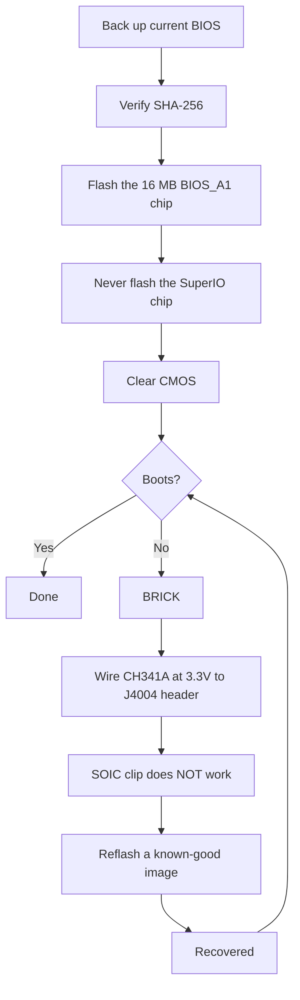

> 🌐 सामुदायिक अनुवाद। अंग्रेज़ी संस्करण ही प्रामाणिक स्रोत है और अधिक नया हो सकता है। कोई त्रुटि मिली? issue खोलें: [English](../en/08-bios.md) · https://github.com/lildebil0/awesome-bc250/issues

# BIOS और Brick रिकवरी

> **संक्षेप में** — एक गलत BIOS सेटिंग **BC-250 को पूरी तरह brick** कर सकती है, और इस board पर CMOS clear इसे *हमेशा* रिकवर *नहीं* करता ([src](https://t.me/c/2424231195/54971))। *कुछ भी* flash करने से पहले यह समझ लें: आपके पास एक **हार्डवेयर रिकवरी किट** (एक **CH341A-क्लास SPI programmer + female-to-female DuPont तार**) तैयार होनी चाहिए, क्योंकि एकमात्र भरोसेमंद un-brick तरीका है chip को board के **J4004 header** के ज़रिए बाहर से फिर से flash करना। लोकप्रिय समुदायिक mod ("death" का BIOS, नवीनतम stock **5.00** पर आधारित) overclocking, GDDR6 timings और iGPU memory allocation को unlock करता है — उपयोगी, पर **सभी सेटिंग्स सुरक्षित नहीं हैं, और कुछ board को तुरंत brick कर देती हैं** ([src](https://t.me/c/2424231195/78922))। पहले हर image का **SHA-256** verify करें, और [`assets/firmware/DISCLAIMER.md`](../../assets/firmware/DISCLAIMER.md) पढ़ें। **लापरवाही से flash न करें।**

⚠️ **यह handbook का सबसे खतरनाक अध्याय है।** रिकवरी हार्डवेयर के बिना flashing विनाशकारी और अपरिवर्तनीय है। यदि आप एक brick को पुनर्जीवित करने के लिए SPI chip पर solder/clip करने के लिए तैयार नहीं हैं, तो **यहीं रुक जाएँ और stock BIOS चलाएँ।**

---

## BC-250 पर BIOS क्या है

BC-250 एक AsRock-निर्मित mining/server board है जिसमें एक cut-down PS5 "Oberon" APU लगा है। इसका UEFI firmware एक **16 MB SPI flash chip** पर रहता है (एक Winbond **W25Q128** / Macronix MX25L128, 8-pin SOIC package में)। Stock firmware बुरी तरह locked है: Setup में लगभग कुछ भी उपयोगी exposed नहीं है। chat में देखे गए ज्ञात stock संस्करण हैं **3.00** और **5.00**; modded BIOS इन्हीं से फिर से बनाए जाते हैं (version number आपका anchor है — हमेशा नोट करें कि कोई mod किस base पर बना है)।

> स्टॉक **4.00** भी मौजूद है। स्टॉक **v4.0** और **v5.0** के बीच एकमात्र कार्यात्मक अंतर यह है कि v5.0 डिफ़ॉल्ट रूप से **network boot** को सक्षम करता है। ([src](https://discord.com/channels/1315924807128449065/1316030225338863636/1326825429595848816))

लोग दो कारणों से reflash करते हैं:

1. **एक modded BIOS install करने के लिए** जो छिपे हुए menus (overclock, undervolt, memory, iGPU VRAM) unlock करता है।
2. **एक brick रिकवर करने के लिए** — किसी खराब सेटिंग या failed flash के बाद एक known-good image बहाल करना।

> 💡 **हो सकता है आपको flash करने की ज़रूरत ही न हो।** यदि आपका *एकमात्र* लक्ष्य VRAM/UMA split बदलना है, तो आप यह **stock** P3.00 / P5.00 BIOS पर एक चलते Linux से **[fanoush/bc250_memcfg](https://github.com/fanoush/bc250_memcfg)** के ज़रिए कर सकते हैं — कोई flashing नहीं, कोई programmer नहीं, कोई brick जोखिम नहीं ([elektricM: BIOS flashing](https://elektricm.github.io/amd-bc250-docs/bios/flashing/), [elektricM: VRAM](https://elektricm.github.io/amd-bc250-docs/bios/vram/))। एक modded BIOS flash करना केवल *unlocked chipset menus* और VRAM sizing से परे की सुविधाओं के लिए ज़रूरी है ([09-overclock-undervolt.md](09-overclock-undervolt.md) में `bc250_memcfg` command देखें)।

---

## Modded BIOS ("death" mod) — यह क्या बदलता है और क्यों

संदर्भ समुदायिक mod को chat में **death** द्वारा maintain किया जाता है। यह *शून्य से* बना firmware *नहीं* है — यह AMD/AMI Setup विकल्पों को फिर से सक्षम (unhide) करता है जिन्हें stock BIOS छिपाकर भेजता है। संस्करणों को ट्रैक करें, क्योंकि सलाह समय के साथ बदली है:

| Mod version | Base | Released | इसने क्या expose/बदला | Status |
|---|---|---|---|---|
| **1.0** (पहला रिलीज़) | stock **3.00** | 2025-06-28 | GDDR6 frequency, GDDR6 timings, iGPU UMA memory size, core frequency, voltages | ⚠️ खराब मान board को brick करते हैं, **CMOS clear ने मदद नहीं की** ([src](https://t.me/c/2424231195/54971)) |
| 3.0 variants | 3.00 | 2025-07 → 10 | वही unlocks; एक build ने एक **custom Steam boot logo** जोड़ा | Cosmetic logo build `bc250-Steam.rom` के रूप में mirror किया गया ([src](https://t.me/c/2424231195/86420)) |
| **5.00 mod** (current) | stock **5.00** | 2025-10-05 | Tabs फिर से समूहित; **अधिक सेटिंग्स खुलीं**; **RAM/GDDR6 timing settings अब वास्तव में लागू होती हैं** इस board पर | नवीनतम; "सभी सेटिंग्स उपयोगी नहीं हैं, पर कुछ न होने से बेहतर है" ([src](https://t.me/c/2424231195/78922)) |

इससे आप वास्तव में क्या tune कर सकते हैं (पहले-रिलीज़ के notes से, [src](https://t.me/c/2424231195/54971)):

- **GDDR6 frequency** — एक user (`@Haswellb`) के लिए **1800** पर काम करता हुआ रिपोर्ट किया गया, पर *उसी तरह के बदलाव ने एक दूसरे board को brick कर दिया* — मान board-specific हैं, सार्वभौमिक नहीं।
- **GDDR6 timings** — ये लागू होती हैं, पर **बहुत कम/tight timings** board को **brick** कर देती हैं।
- **iGPU memory (UMA) size** — काम करता है और एक वास्तविक uplift देता है। यदि आपका बदलाव प्रभावी नहीं होता, तो **IGC: Forces** और **UMA Mode: UMA_SPECIFIED** सेट करें ([src](https://t.me/c/2424231195/54971); वही combo समुदायिक docs द्वारा पुष्ट)।
- **Core frequency / voltages** — exposed पर लेखक द्वारा **"untested"**।

> ❗ **लेखक की दो चेतावनियाँ, अब भी प्रासंगिक:** (1) **Integrated Graphics को disable न करें** — यह एकमात्र display output है। (2) इनमें से किसी भी mod पर, **एक गलत सेटिंग board को brick कर सकती है और एक CMOS reset इसे रिकवर नहीं कर सकता** — ठीक इसीलिए आपको एक programmer चाहिए। (base चुनने के लिए नीचे "कौन सा संस्करण?" सीढ़ी देखें।)

> ### कौन सा संस्करण? (निर्णय सीढ़ी)
>
> 1. **Modded P3.00 (chipset-menu ROM) — सुरक्षित डिफ़ॉल्ट।** यह स्थापित **"community standard… सबसे stable और tested"** है, ज्ञात SHA-256 के साथ verified-public है, और यह पहले से **VRAM-unlock + chipset settings** को कवर करता है। यहीं से शुरू करें जब तक कोई विशिष्ट कारण न हो ([elektricM: BIOS flashing](https://elektricm.github.io/amd-bc250-docs/bios/flashing/))।
> 2. **Modded 5.00 — current; इसे चुनें यदि आप memory tuning चाहते हैं।** यह नवीनतम base है और वह है जहाँ **RAM/GDDR6 timing settings वास्तव में लागू होती हैं** इस board पर ([src](https://t.me/c/2424231195/78922))। P3.00 के बजाय इसे विशेष रूप से तब चुनें जब आप memory timings tune करना चाहते हों।
> 3. **`P5.00_clv` — केवल विशेषज्ञ।** यह **"सब कुछ"** unlock करता है (हर छिपा menu, जिसमें experimental **ReBAR / Resizable BAR** और debug/chipset settings शामिल हैं), जो इसे *"गलत चीज़ बदलने पर board को brick करना बहुत आसान बना देता है… P3.00 पर ही टिके रहें जब तक आप एक advanced user न हों।"* और भी बुरा, **`P5.00_clv` किसी public repo में नहीं है** जो guide ढूँढ सका — यह केवल एक Discord attachment के रूप में घूमता है, इसलिए **कोई canonical hash नहीं है**; यदि आपको इसका उपयोग करना ही है, तो इसे स्वतंत्र रूप से चलाने वाले **दो** लोगों से copies लें और flash करने से पहले पुष्टि करें कि दोनों का **SHA-256 एक ही** है ([elektricM: BIOS flashing](https://elektricm.github.io/amd-bc250-docs/bios/flashing/))।

> **मॉड किए गए 5.00 के जानने योग्य अनोखे व्यवहार।** इसके Setup में एक **डिफ़ॉल्ट CPU फ्रीक्वेंसी 3600** दिखाई देती है — जो केवल दिखाने के लिए एक UI मान है, न कि लागू की गई क्लॉक ([src](https://discord.com/channels/1315924807128449065/1452152658168381593/1452406964780007515))। यह चिपसेट सेटिंग्स में एक **`x1x1x1x1` PCIe bifurcation** विकल्प भी दिखाता है ([src](https://discord.com/channels/1315924807128449065/1452152658168381593/1474231812598534351))। इस बेस पर मेमोरी टाइमिंग्स को लेकर अतिरिक्त सावधानी बरतें: **अत्यधिक टाइमिंग मान बाहरी रीफ़्लैश होने तक बोर्ड को ब्रिक कर सकते हैं, और यह समस्या P5.00 पर अधिक गंभीर हो जाती है** ([src](https://discord.com/channels/1315924807128449065/1371527281947971604/1468745940994101372))। और किसी भी फ्लैश की तरह, मॉड किए गए 5.00 पर जाने के बाद **तब तक कोई डिस्प्ले नहीं आ सकता जब तक आप CMOS क्लियर नहीं कर देते** ([src](https://discord.com/channels/1315924807128449065/1315933088668454942/1508568321346502892))।

सबसे अधिक संदर्भित BIOS repo, **[TuxThePenguin0/bc250-bios](https://gitlab.com/TuxThePenguin0/bc250-bios/)** से एक अलग **chipset-menu mod** (`BC250_3.00_CHIPSETMENU.ROM`) भी है, जो stock 3.00 के ऊपर **chipset menu / NBIO Common Options** को expose करता है। उस repo का अपना README साफ़ कहता है: *"इस repository में कुछ भी समर्थित नहीं है या किसी प्रकार की warranty नहीं है — BACKUPS लें।"*

> 🚫 **`Smokeless_UMAF` से बचें।** समुदायिक overclocking guide इस UEFI-editing tool को एक ऐसी चीज़ के रूप में चिह्नित करती है जिसे **BC-250 पर न चलाएँ — यह board को स्थायी नुकसान पहुँचा सकता है** ([elektricM: BIOS overclocking](https://elektricm.github.io/amd-bc250-docs/bios/overclocking/))। ऊपर दिए known-good ROMs पर ही टिके रहें।

---

## Flash करने से पहले — सुरक्षा checklist

1. **पहले अपने वर्तमान BIOS का backup लें** (उसी tool से इसे read करें जिससे आप flash करेंगे — Path B/recovery देखें)। एक backup आपका मुफ़्त undo है।
2. image के **SHA-256 को verify करें** `assets/PROVENANCE.md` / source post के विरुद्ध। समुदायिक flashing guide chipset-menu ROM के लिए hash प्रकाशित करती है
   `48fbe5d366e6a56e2fdffdca848426216ba1f083610dab63db89d2f4e6c940b5` ([elektricM docs](https://elektricm.github.io/amd-bc250-docs/bios/flashing/))।
3. केवल marking नहीं, बल्कि **chip size की पुष्टि करें**। 16 MB BIOS chip target है; छोटे SuperIO chip को **flash न करें** (recovery section देखें)। अलग board revisions थोड़े अलग chip part numbers ले सकते हैं — जो मायने रखता है वह **capacity (16 MB)** है, marking के अंतिम अक्षर भिन्न हो सकते हैं ([src](https://t.me/c/2424231195/67880))।
4. पहली flash से *पहले* **रिकवरी हार्डवेयर तैयार रखें**, brick करने के बाद नहीं।
5. flash करने के बाद, **CMOS clear करें** ताकि नई सेटिंग्स (विशेषकर VRAM allocation) प्रभावी हों ("After every flash" देखें)।



### Flash करने से पहले checksum verify करें

ऊपर Step 2 कहता है SHA-256 verify करना — यहाँ तरीका है। उस file का hash compute करें जिसे आप flash करने वाले हैं और इसकी तुलना, character दर character, [`assets/PROVENANCE.md`](../../assets/PROVENANCE.md) में उस file के लिए सूचीबद्ध मान से करें।

```bash
# Linux:
sha256sum BC250_3.00_CHIPSETMENU.ROM
```

```powershell
# Windows (PowerShell):
Get-FileHash BC250_3.00_CHIPSETMENU.ROM -Algorithm SHA256
```

`PROVENANCE.md` एक छोटे fingerprint के रूप में केवल **पहले 16 hex characters** सूचीबद्ध कर सकता है। यदि ऐसा है, तो जाँचें कि आपका computed hash उन 16 characters से **शुरू होता है** — उस prefix का पूर्ण मिलान पहले से एक मज़बूत जाँच है (maintainer अनुरोध पर पूर्ण hashes प्रकाशित कर सकता है)।

publicly-hosted images के लिए **Verified पूर्ण SHA-256 hashes** (कई समुदायिक repos में cross-checked — हर known-good BC-250 BIOS file **ठीक 16 MB / 16777216 bytes** का है; एक अलग size का मतलब है यह corrupted है, एक tool/patch है, या असंबंधित है) ([elektricM: BIOS flashing](https://elektricm.github.io/amd-bc250-docs/bios/flashing/)):

| File | Type | SHA-256 |
|---|---|---|
| `BC250_3.00_CHIPSETMENU.ROM` (उर्फ़ `Robin3.00`, `BC250CHIPSETMENU.ROM`) | **Modded P3.00** — VRAM + chipset unlock, *अनुशंसित* | `48fbe5d366e6a56e2fdffdca848426216ba1f083610dab63db89d2f4e6c940b5` |
| `Robin5.00` | **Stock** P5.00 (modded `P5.00_clv` नहीं) | `0d6f136cb120cf3b2de26d5c4d7f255604fdbf4b9442af5ba55419b95b89aa82` |
| `BC250_3.00.ROM` | Stock P3.00 | `07595ca3aecf8a4caa28a397b5298f3946a1b769f87b16f67adc369c3f69045c` |
| `BC250_2.00.bin` | Stock P2.00 | `ee6150dfed33bd05ea46063a352549416fdf3f45fa0e5edac2a68ef78d71083c` |
| `P5.00_clv` | Modded P5.00 (unlock-everything) | **कोई public hash नहीं है** — केवल Discord, दो स्वतंत्र copies का मिलान verify करें |

> Modded P3.00 repos में कई filenames के तहत दिखता है (`BC250_3.00_CHIPSETMENU.ROM`, `BC250CHIPSETMENU.ROM`, `Robin3.00`) — वे सभी ऊपर दिए मान पर hash होते हैं, इसलिए नाम मायने नहीं रखता। `Robin5.00` **stock** P5.00 है, modded `P5.00_clv` से एक *अलग file*। प्रत्येक के लिए public sources (TuxThePenguin0 GitLab, forgenam, tipitochen, csabakecskemeti, scrakcho, dannybastos, kenavru, MrrZed0) [elektricM flashing guide](https://elektricm.github.io/amd-bc250-docs/bios/flashing/) में सूचीबद्ध हैं।

> 🔴 **यदि checksum मेल नहीं खाता, तो flash न करें।** एक mismatch का मतलब है एक corrupted या गलत file — इसे flash करना ठीक वही तरीका है जिससे आप board को brick करते हैं। image फिर से download करें और दोबारा verify करें।

---

## Path A — Software flash (board से, बिना programmer)

जब board अभी भी boot होता है तब BIOS install/upgrade करने का यह सामान्य तरीका है। एक **FAT32 USB stick** और AMI firmware update utility का उपयोग करें।

**EFI / AFU विधि** ([src](https://t.me/c/2424231195/54979)):

1. एक USB stick को **FAT32** में format करें।
2. AFU archive (जैसे `AfuEfi64_5.16.zip`) **और BIOS file** की सामग्री इस पर copy करें।
3. BC-250 को reboot करें और **USB stick से boot** करके EFI shell में जाएँ।
4. चलाएँ:
   ```
   afuefix64.efi <filename>.<ext> /P /N
   ```
   - `/P` = main BIOS program करें।
   - `/N` = **NVRAM** भी program करें। यह संस्करणों के *बीच* जाते समय errors से बचाता है (जैसे किसी अन्य संस्करण से 3.00 पर) — **पर यह आपकी saved settings मिटा देता है।** आप `/N` छोड़ सकते हैं, पर तब संभावित errors की उम्मीद करें। ([src](https://t.me/c/2424231195/54979))
5. यदि tool file नहीं देख पाता, तो यह पता लगाने के लिए कि कौन सा stick है `fs0:`, `fs1:`, … आज़माएँ ([src](https://t.me/c/2424231195/54979))।

कुछ समुदायिक builds एक तैयार `Flash.nsh` script और एक renamed ROM के साथ आते हैं (जैसे modded ROM को script से मेल खाने के लिए rename करें) ताकि आप केवल EFI shell में boot करें और script चलाएँ ([elektricM docs](https://elektricm.github.io/amd-bc250-docs/bios/flashing/))। Linux पर एक चलते system से flash करने के लिए एक **`afulnx`** build (`afulnx-5.05.04Z.tar.gz`) भी है ([src](https://t.me/c/2424231195/54507))।

#### Canonical EFI-shell नुस्खा (`Flash.nsh` / `Robin5.00` विधि)

समुदायिक flashing guide एक self-contained किट और एक तय filename पर standardize करती है — यह सबसे अधिक दोहराया गया USB path है ([elektricM: BIOS flashing](https://elektricm.github.io/amd-bc250-docs/bios/flashing/)):

1. **EFI किट प्राप्त करें:** `4U12G BIOS Update.zip` ([kenavru/BC-250](https://github.com/kenavru/BC-250) repo से) — इसमें `AfuEfix64.efi`, `Flash.nsh`, और `amdvbflash.efi` हैं। *यह `Robin5.00` नामक एक stock P5.00 BIOS भी bundle करता है — उसे रास्ते से हटा दें ताकि आप उसे गलती से flash न कर दें।*
2. **एक FAT32 stick तैयार करें (≤ 32 GB अनुशंसित)।** किट के `BIOS EFI` folder की सामग्री **root** पर copy करें।
3. **अपने modded ROM को `Robin5.00` में rename करें** (`.ROM` extension हटाएँ) — वही सटीक नाम है जिसे `Flash.nsh` ढूँढता है। *(या इसके बजाय अपने filename से मेल खाने के लिए `Flash.nsh` edit करें।)* Root में फिर ये होने चाहिए: `AfuEfix64.efi`, `Flash.nsh`, `amdvbflash.efi`, `Robin5.00` (आपका renamed mod), और `EFI` folder।
4. **एक direct DisplayPort monitor का उपयोग करें।** Active/passive **HDMI adapters BIOS menu को black-screen कर सकते हैं** — इस board पर एक ज्ञात display गड़बड़।
5. **सभी SSDs/drives unplug करें** ताकि board अपने आप EFI shell पर गिर जाए, stick डालें, power on करें। आप एक पीले `Shell>` prompt पर पहुँचते हैं।
6. prompt पर **`blk0:`** टाइप करें फिर Enter — **colon के बाद space नोट करें** (यह USB volume select करता है; `blk0:` elektricM-documented selector है, जो ऊपर के `fs0:`/`fs1:` probing से अलग है)। फिर **`Flash.nsh`** टाइप करें और Enter।
7. **रुकें। keyboard को न छुएँ, power off न करें।** यदि लिखने के दौरान यह hang होता *दिखे*, तो **कम से कम 15 मिनट रुकें** — लिखने के बीच में power off करना board को brick कर देता है। पूरा होने पर यह reboot होता है (या आपसे कहता है)।
8. **तुरंत power off करें और stick हटाएँ** ताकि यह flasher में वापस loop न हो।

> 🔴 **flash करने के लिए power on करने से पहले: 8-pin PCIe power wiring जाँचें** अपने PSU के 12 V/GND diagram के विरुद्ध। **Reversed polarity board को स्थायी रूप से नुकसान पहुँचा सकती है** ([elektricM: BIOS flashing](https://elektricm.github.io/amd-bc250-docs/bios/flashing/))।

#### आवश्यक post-flash BIOS settings (यह CMOS clear के ठीक बाद करें)

flash करने **और** CMOS clear करने के बाद (अगला section), Setup में जाएँ (**Del** spam करें) और ये सेट करें — VRAM split तब तक ठीक व्यवहार नहीं करेगा जब तक ये सही न हों ([elektricM: BIOS flashing](https://elektricm.github.io/amd-bc250-docs/bios/flashing/), [elektricM: BIOS VRAM](https://elektricm.github.io/amd-bc250-docs/bios/vram/)):

| Setting | Path | Value |
|---|---|---|
| Integrated Graphics Controller | Chipset → GFX Configuration | **Forces** |
| UMA Mode | Chipset → GFX Configuration | **UMA_SPECIFIED** |
| UMA Frame Buffer Size | Chipset → GFX Configuration | **512MB** (अनुशंसित) या एक fixed size |
| IOMMU | Advanced → CPU Configuration | **Disabled** |
| Boot Mode | Boot → Boot Mode | **UEFI** |

पहले verify करें कि CMOS clear वास्तव में हुआ — **clock गलत पढ़ना चाहिए**; यदि यह अभी भी सही है, तो clear दोहराएँ। फिर save करने के लिए F10। `512MB` चुनाव *dynamic* allocation है, 512 MB cap नहीं ([09-overclock-undervolt.md](09-overclock-undervolt.md) देखें)।

> ★ **512 MB UMA FPS *क्यों बढ़ाता है* (तंत्र)।** UMA buffer को **512 MB** सेट करना GPU को भूखा नहीं रखता — यह system को एक बड़ा fixed हिस्सा अलग lock करने के बजाय **RAM बनाम VRAM को dynamically संतुलित** करने देता है, और अकेले उस rebalancing को एक वास्तविक FPS jump का श्रेय दिया गया: Cyberpunk 2077 FSR 3.0 *balanced*, 1080p, Steam-Deck preset के तहत **60 → 66 fps (2 GHz OC पर) → 76 fps** हुआ ([Old Lamer — Part I](https://youtu.be/ohpEY2XQ_lo) ~11:21; ⚠ अनुमानित — आँकड़े video से transcribed, एक build के परिणाम के रूप में लें)। तो "512 MB सबसे अच्छा है" केवल सुरक्षित sizing नहीं है — छोटा dynamic buffer performance कहानी का *हिस्सा* है, समझौता नहीं।

**flashrom fallback** (यदि AFU error देता है) ([src](https://t.me/c/2424231195/54979), `@mrartemsid` द्वारा सुझाया और tested):

```bash
# Read (back up):
sudo flashrom -p internal:boardmismatch=force -r <name>.bin
# Write:
sudo flashrom -p internal:boardmismatch=force -w <name>.bin
```

> ⚠️ Software flashing केवल **तब तक मदद करता है जब board अभी भी POST करता है**। जिस क्षण एक खराब सेटिंग इसे brick करती है, Path A चला जाता है और आप नीचे के हार्डवेयर path पर हैं।

---

## Path B — Hardware flash / un-brick (CH341A SPI programmer)

यह **रिकवरी** path है, और pinned "एक brick को flash करने का सबसे सुविधाजनक तरीका" ([src](https://t.me/c/2424231195/67880))। आप 16 MB SPI chip को सीधे, एक अन्य PC से, एक USB SPI programmer का उपयोग करके फिर से लिखते हैं। प्रयुक्त software: **NeoProgrammer** (Windows) या **flashrom** (Linux)।

> 🔴 **SOIC-8 clip इस board पर काम नहीं करता।** death इसके बारे में स्पष्ट है: *"हमारे board पर clip… मूल रूप से बिल्कुल भी काम नहीं करता।"* ([src](https://t.me/c/2424231195/67880))। नोट: `assets/firmware/DISCLAIMER.md` एक "SOIC clip" का सामान्य रूप से उल्लेख करता है — व्यवहार में आपको **इसके बजाय on-board J4004 header पर wire करना होगा।** यह इस अध्याय में सबसे महत्वपूर्ण recovery तथ्य है।

### J4004 header pinout (यहाँ wire करें)

board SPI/BIOS chip को फिर से flash करने के लिए विशेष रूप से एक **2.54 mm pitch J4004 header** expose करता है। Pinout (pinned wiring screenshot से, [src](https://t.me/c/2424231195/67880)):

```
J4004
[ GND  SCLK  MOSI  UNK ]
[ VCC  CS    MISO      ]
   ^  (pin-1 marker)
```

| J4004 pin | Signal | CH341A pad |
|---|---|---|
| VCC | 3.3 V power | VDD / 3.3V |
| GND | ground | GND |
| CS | chip select | CS / SS |
| SCLK | clock | CLK / SCK |
| MOSI | data in (to chip) | MOSI |
| MISO | data out (from chip) | MISO |

संगत **W25Q128 SOIC-8 / CH341A color map** उसी pinned screenshot में है — `/CS, DO(MISO), CLK, DI(MOSI), VCC, GND` को CH341A के `CS, MISO, CLK, MOSI, VDD, GND` pads से मिलाएँ। power on करने से पहले **VCC और GND को तीन बार जाँचें**; उन्हें उलटना chip को मार देता है ([src](https://t.me/c/2424231195/67880))।

> **J4004 pin numbering और दो अज्ञात pins।** elektricM guide header को VCC=1, GND=2, CS=3, SCLK=4, MISO=5, MOSI=6 number करता है, जहाँ **pins 7 और 8 flashing के लिए अप्रयुक्त हैं — वे 10 kΩ resistors के ज़रिए grounded हैं।** Pin 1 (VCC) को PCB पर एक **arrow `>` या एक square pad** से चिह्नित किया जाता है ([elektricM: BIOS flashing](https://elektricm.github.io/amd-bc250-docs/bios/flashing/))।

> **सटीक target chip और density typo।** 16 MB part एक Winbond **W25Q128JVSQ** (128 Mbit / 16 MB) है या, कुछ batches पर, एक Macronix **MX25L12835F**। कुछ समुदायिक docs इसे **"25Q168" — यह गलत है** के रूप में typo करते हैं; सही 16 MB density code **128** है ([elektricM: BIOS flashing](https://elektricm.github.io/amd-bc250-docs/bios/flashing/))। यदि आप J4004 के बजाय एक नंगे **SOIC-8 clip** के ज़रिए flash करते हैं, तो chip का अपना pin क्रम standard SPI layout है: `1 CS · 2 DO · 3 WP · 4 GND · 5 DI · 6 CLK · 7 HOLD · 8 VCC` ([elektricM: BIOS recovery](https://elektricm.github.io/amd-bc250-docs/bios/recovery/)) — पर death की खोज याद रखें कि **clip इस board पर मुश्किल से काम करता है**, इसलिए J4004 को प्राथमिकता दें।

> 🙏 श्रेय: J4004 pinout, reverse-engineering, और modded-firmware image repo काफ़ी हद तक **Segfault** का काम है (P3.00 chipset-menu ROM "Segfault mod" है) ([elektricM: BIOS flashing](https://elektricm.github.io/amd-bc250-docs/bios/flashing/))।

### NeoProgrammer प्रक्रिया (pinned) ([src](https://t.me/c/2424231195/67880))

1. programmer को pinout के अनुसार female-to-female तारों से **J4004** से connect करें। **wiring को ~10× जाँचें, विशेषकर VCC और GND।** (PSU unplugged।)
2. **NeoProgrammer** खोलें।
3. chip का **auto-detect** चलाएँ, और chip पर ही marking भी read करें।
4. **markings की तुलना करें।** यदि अंतिम अक्षर list से भिन्न हैं पर **capacity मेल खाती है (16 MB)**, तो ठीक है।
5. chip को **Erase** करें।
6. software में **BIOS file खोलें** (drag-and-drop काम करता है)।
7. chip को **Write** करें।
8. **J4004 से तारें disconnect करें।**
9. board को power on करें।

### flashrom समतुल्य (Linux), समुदायिक docs के साथ cross-checked

समुदायिक flashing guide एक **CH347** programmer का उपयोग करती है और सस्ते black-PCB CH341A boards के विरुद्ध चेतावनी देती है (अगला section)। सही chip पहचानें — **16 MB BIOS chip** (`BIOS_A1`) को target करें, **कभी नहीं** 512 KB SuperIO (`SIO1_R`), जो flash होने पर SuperIO को brick कर देता है ([elektricM docs](https://elektricm.github.io/amd-bc250-docs/bios/flashing/)):

```bash
# Detect / identify the chip:
sudo flashrom -p ch347_spi

# Back up the stock BIOS (twice, then diff to be sure the read is stable):
sudo flashrom -p ch347_spi -r backup_stock.bin
sudo flashrom -p ch347_spi -r backup_verify.bin

# Write the new image, then verify it read back identical:
sudo flashrom -p ch347_spi -w BC250_3.00_CHIPSETMENU.ROM
sudo flashrom -p ch347_spi -v BC250_3.00_CHIPSETMENU.ROM
```

(`ch347_spi` के स्थान पर CH341A के लिए `-p ch341a_spi`, या Raspberry Pi Pico के लिए `serprog` उपयोग करें।) ⚠ *इस* board की सटीक wiring के लिए `ch347_spi` / `serprog` mapping समुदायिक guide से है — अपने programmer model के विरुद्ध `⚠ verify`।

> **Detection आपको बताता है कि आप किस chip पर हैं।** यदि `flashrom -p …` **`Winbond W25Q128…`** या **`Macronix MX25L128…`** रिपोर्ट करता है, तो आप सही 16 MB BIOS chip पर हैं। यदि यह **`Macronix MX25L4005…` (512 KB)** रिपोर्ट करता है, तो **रुकें — आप SuperIO chip से जुड़े हैं** (`SIO1_R`); इसे flash करना fan control/sensors को brick कर देता है। दूसरे chip पर जाएँ ([elektricM: BIOS flashing](https://elektricm.github.io/amd-bc250-docs/bios/flashing/))। **PSU को दीवार से unplug** करके और capacitors discharged करके flash करें (power button कुछ बार दबाएँ) — एक clip flash के दौरान board को power देना अनुशंसित *नहीं* है ([elektricM: BIOS recovery](https://elektricm.github.io/amd-bc250-docs/bios/recovery/))।

### CH341A 3.3 V जाल (इसे पढ़ें या आप chip को जला देंगे)

कई सस्ते **black-PCB CH341A** programmers अपनी **data lines को 5 V पर चलाते हैं भले ही VCC 3.3 V हो** — BC-250 का BIOS chip एक **3.3 V** part है, इसलिए data lines पर 5 V इसे नुकसान पहुँचा सकता है। यह कुछ boards पर एक ज्ञात, मापी गई खराबी है (Fabian का board, और chat में एक समान, voltage measurement द्वारा पुष्ट किए गए) ([src](https://t.me/c/2424231195/100285))। समाधान:

- एक ऐसा programmer प्राथमिकता दें जो अपनी data lines पर वास्तव में 3.3 V हो (जैसे **CH347**), **या**
- **solderless CH341A 5V→3.3V data-line fix** लागू करें: chip को USB 5 V power line काटें और इसके बजाय इसे 3.3 V दें — [sawyershepherd.org write-up](https://sawyershepherd.org/post/solderless-ch341ab-fix-5v-to-33v-data-lines/) और [wej.k.vu CH341A fix](https://wej.k.vu/electronics/ch341a-mini-programmer-fix/) देखें ([src](https://t.me/c/2424231195/100285))।

---

### Low-level headers, debug और on-board silicon

ऊपर J4004 flash header से परे, board कई अन्य headers और on-board chips का एक ज्ञात समूह ले जाता है। इन्हें elektricM hardware docs में reverse-engineer किया गया है और ये CMOS clear करने, debug probing, fan wiring, और flash करने से पहले यह पुष्टि करने के लिए उपयोगी हैं कि कौन सा chip कौन सा है। Pin values verbatim transcribed ([elektricM: pinouts](https://elektricm.github.io/amd-bc250-docs/hardware/pinouts/)) से।

**CLRCMOS1 — clear-CMOS jumper (3-pin)।** यह वह jumper है जिसका इस अध्याय में हर जगह "CMOS jumper short करें" के रूप में संदर्भ है — यहाँ इसका map है:

| Position | व्यवहार |
|---|---|
| Pins 1–2 | CR2032 CMOS को power देता है (default) |
| Pins 2–3 | CMOS Clear |

> 💡 जब [post-flash checklist](#flash-करने-से-पहले--सुरक्षा-checklist) और ["After every flash"](#हर-flash-के-बाद--cmos-clear-करें-इसे-न-छोड़ें) आपको "~20 सेकंड के लिए CMOS jumper short करने" के लिए कहते हैं, तो **CLRCMOS1** वह jumper है: इसे pins 1–2 से pins 2–3 पर ले जाएँ, रुकें, फिर वापस ले जाएँ। (CR2032 को 60+ सेकंड के लिए हटाना विकल्प है।)

**TPMS1 — LPC debug header (18-pin, 2.0 mm pitch):**

| Pin | Signal | Pin | Signal |
|---|---|---|---|
| 1 | PCICLK | 2 | GND |
| 3 | FRAME | 4 | SMB_CLK_MAIN |
| 5 | PCIRST# | 6 | SMB_DATA_MAIN |
| 7 | LAD3 | 8 | LAD2 |
| 9 | 3V | 10 | LAD1 |
| 11 | LAD0 | 12 | GND |
| 13 | (empty) | 14 | S_PWRDWN# |
| 15 | 3VSB | 16 | SERIRQ# |
| 17 | GND | 18 | GND |

> 💡 **Pin 9 (3V) केवल तभी live है जब board powered on हो** — इसलिए यह एक "system-on" detect signal के रूप में काम करता है। यह इसे auto-power-on / true-ATX adapter builds के लिए एक वैकल्पिक sense point बनाता है ([03-power-supply.md में `AUTO_PWRON` jumper](03-power-supply.md) cross-ref करें)।

**J2 — JTAG/HDT debug header (20-pin, 1.27 mm pitch, unpopulated, board के नीचे):**

| Pin | Signal | Pin | Signal |
|---|---|---|---|
| 1 | VDDIO | 2 | TCK |
| 3 | GND | 4 | TMS |
| 5 | GND | 6 | TDI |
| 7 | GND | 8 | TDO |
| 9 | TRST_L | 10 | PWROK_BUF |
| 11 | DBRDY3 | 12 | RESET_L |
| 13 | DBRDY2 | 14 | DBRDY0 |
| 15 | DBRDY1 | 16 | DBREQ_L |
| 17 | GND | 18 | TEST19 |
| 19 | VDDIO | 20 | TEST18 |

> TEST18, TEST19 और DBRDY0 floating छोड़े गए हैं। यह board पर **एकमात्र** hardware reset/debug interface है।

**I2C_HEADER1 (3-pin):** `SCL · SDA · GND`। SCL वह pin है जो **power connectors के अधिक करीब** है। यह bus **Intersil PMICs तक PMBUS** ले जाता है — एक power-telemetry access point।

**CPU_FAN1 (4-pin):** `PWM · Tach · 12V · GND`।

**J4003 — multi-fan header (16-pin, 2×8, 2.54 mm):**

| Row 1 | 1 GND | 2 F1T | 3 F2T | 4 F3T | 5 F4T | 6 F5T | 7 DET | 8 (empty) |
|---|---|---|---|---|---|---|---|---|
| **Row 2** | 1 GND | 2 F1P | 3 F2P | 4 F3P | 5 F4P | 6 F5P | 7 GND | 8 GND |

यहाँ `T` = tach और `P` = PWM, प्रति fan 1–5।

> 💡 **DET (row 1, pin 7) तब grounded है जब board एक fan / power-distribution board पर बैठता है** — यानी यह carrier का पता लगाता है। (BIOS↔Linux fan numbering [06-linux.md → Sensors & fan control](06-linux.md#sensors--fan-control) में कवर है; इसे यहाँ दोहराया नहीं गया है।)

**On-board silicon (BOM)।** repo पहले से flashing sections में `SIO1_R` और `BIOS_A1` को नाम देता है पर कभी part numbers या sizes नहीं दिए; यह table एक flasher को यह पुष्टि करने देता है कि कौन सा chip कौन सा है (16 MiB Winbond BIOS है, 512 KiB Macronix SuperIO है — इसे अकेला छोड़ दें):

| Designator | Part | Role |
|---|---|---|
| PUA1 | Intersil ISL69247 | Main PMIC |
| PUIO1 | Intersil ISL95712 | Core-supply PMIC |
| PUA11… | Intersil ISL99360 | Smart power stages (phases) |
| M2U2 | NXP CBTL04083B | 2:1 PCIe x4 mux |
| U30 | Realtek RTL8111H | Ethernet NIC (PCIe x1) |
| SU1 | AMD 218-0844029 | A68H "Bolton-D2H" FCH chipset |
| UIO1 | Nuvoton NCT6686D | SuperIO (the hwmon sensor chip) |
| BIOS_A1 | Winbond 25Q128JVSQ | 16 MiB SPI flash = the **BIOS** (flash THIS) |
| SIO1_R | Macronix MX25L4006E | 512 KiB SPI flash = SuperIO program (**do NOT flash — bricks the SuperIO**) |

> यहाँ नामित SuperIO sensor chip (Nuvoton **NCT6686D**) वह है जिससे Linux `nct6687`/`nct6683` driver bind होता है — sensor/fan setup के लिए [06-linux.md](06-linux.md) देखें।

**फ़र्मवेयर टूलिंग (उन्नत)।** इमेज की जांच करने के लिए दो यूटिलिटीज बार-बार सामने आती हैं:

- **`psptool`** BIOS डंप के अंदर AMD फ़र्मवेयर ब्लॉब्स की जांच करता है और उन्हें निकालता है। `psptool -E bios.bin` प्रविष्टियों को सूचीबद्ध करता है; `psptool -X -d 0 -e 1 -o firmware.bin bios.bin` विश्लेषण के लिए SMU फ़र्मवेयर को बाहर निकालता है। ([bc250-collective/amd_smu_reverse_engineering](https://github.com/bc250-collective/amd_smu_reverse_engineering))
- **`Zentool`** CPU माइक्रोकोड को पैच करता है — उदाहरण के लिए `RDRAND` निर्देश को बदलने के लिए। ([AMD-BC-250/documentation #1](https://github.com/AMD-BC-250/documentation/issues/1))

---

## Secure Boot और CSM (boot पूर्वापेक्षाएँ)

इन दोनों को BIOS-setup पूर्वापेक्षा सूची में जोड़ें — आवश्यक हैं या **custom/patched kernels boot नहीं होंगे** (40-CU patch, frequency patch, आदि):

| Setting | Value |
|---|---|
| Secure Boot | **Disabled** |
| CSM (Compatibility Support Module) | **Disabled** |

Source: [elektricM: boot troubleshooting](https://elektricm.github.io/amd-bc250-docs/troubleshooting/boot/)।

---

## "srep" auto-reset विचार (experimental — एक पूर्ण feature नहीं)

क्योंकि एक खराब सेटिंग board को brick कर सकती है और **CMOS clear इसे ठीक नहीं करता**, death ने एक brick पर **सेटिंग्स को auto-reset** करने के लिए BIOS में एक **`srep`** routine बेक करने का प्रयोग किया — विचार मूल रूप से `@Jacky_Fish` से ([src](https://t.me/c/2424231195/60552))। अवधारणा: BIOS को अपने NVRAM/`amdsetup` variables को defaults पर वापस patch करवाएँ, वैकल्पिक रूप से केवल तब जब trigger files एक USB stick पर मौजूद हों (ताकि यह हर boot पर आपकी settings न मिटाए)। chat के अनुसार, **यह अभी तक काम नहीं किया** — *"board जिद्दी रूप से एक पूर्ण brick होने का दिखावा करता है और कुछ भी reset नहीं होता"* ([src](https://t.me/c/2424231195/60883))। किसी भी "self-healing BIOS" दावे को **अप्रमाणित** मानें; आपका वास्तविक safety net external programmer ही रहता है। किसी srep build पर निर्भर होने से पहले `⚠ verify`।

---

## हर flash के बाद — CMOS clear करें (इसे न छोड़ें)

BIOS flash करना stored settings को **reset नहीं** करता, और कई settings (विशेषकर **VRAM/UMA allocation**) तब तक वास्तव में लागू नहीं होंगी जब तक आप CMOS clear न करें। एक user को ठीक यही हुआ: BIOS ने नया VRAM size दिखाया और उसे "saved" किया, पर OS (Bazzite) ने तब तक पुराना 4 GB RAM / 12 GB VRAM split रिपोर्ट किया जब तक CMOS clear नहीं किया गया ([src](https://t.me/c/2424231195/97290))। clear कैसे करें:

- **CR2032 coin battery को 60+ सेकंड के लिए हटाएँ** (अनुशंसित), **या**
- **CMOS jumper को ~20 सेकंड के लिए short करें।** ([elektricM docs](https://elektricm.github.io/amd-bc250-docs/bios/flashing/))

> सीमा नोट करें: CMOS clear "settings लागू नहीं हुईं" और *हल्के* खराब configs को ठीक करता है — पर 1.0/3.00 mod generation पर इसे एक सच्चे brick को रिकवर **न** करने के रूप में रिपोर्ट किया गया ([src](https://t.me/c/2424231195/54971))। उसके लिए, Path B देखें।

---

## Mirrored firmware

chat में चर्चा की गई BIOS images को **recovery/preservation** के लिए `assets/firmware/` के तहत mirror किया गया है (flash करने से पहले [`DISCLAIMER.md`](../../assets/firmware/DISCLAIMER.md) देखें और `PROVENANCE.md` में प्रत्येक file का SHA-256 verify करें):

| File | Size | यह क्या है | Source |
|---|---|---|---|
| `BC250_3.00.ROM` | 16 MB | Stock 3.00 dump | ([src](https://t.me/c/2424231195/5215)) |
| `BC250_3.00_CHIPSETMENU.ROM` | 16 MB | Chipset-menu mod (TuxThePenguin0) | ([src](https://t.me/c/2424231195/86395)) |
| `dump_5.00.bin` | 16 MB | Stock 5.00 dump | ([src](https://t.me/c/2424231195/24661)) |
| `BC250_5.00_clv.zip` | 16 MB | **death का 5.00 mod (current)** | ([src](https://t.me/c/2424231195/78922)) |
| `bc250_3.00_clv1.zip` | 16 MB | death का पहला 3.00 mod (1.0) | ([src](https://t.me/c/2424231195/54971)) |
| `bc250-Steam.rom` | 16 MB | Steam boot logo के साथ 3.0 mod | ([src](https://t.me/c/2424231195/86420)) |
| `bc250 modded bios.ROM` | 16 MB | प्रारंभिक modded image | ([src](https://t.me/c/2424231195/30100)) |
| `my_4.0_MODED.bin` | 16 MB | अंतरिम 4.0 mod | ([src](https://t.me/c/2424231195/45580)) |
| `W25Q128BV@WSON8_…BIN` | 16 MB | Raw chip read (W25Q128) | ([src](https://t.me/c/2424231195/5217)) |
| `AfuEfi64_5.16.zip` | — | AMI AFU EFI flasher | ([src](https://t.me/c/2424231195/54979)) |
| `afulnx-5.05.04Z.tar.gz` | — | AMI AFU Linux flasher | ([src](https://t.me/c/2424231195/54507)) |

> BC-250 के 16 MB BIOS chip पर एक PS5 BIOS (`PS5 Disk Edition … BIOS.bin`, 2 MB) या 512 KB chips flash न करें — गलत target, recovery warnings देखें।

---

## Sources

- death's mod — first release (3.00) — https://t.me/c/2424231195/54971 · current (5.00) — https://t.me/c/2424231195/78922 · Steam-logo build — https://t.me/c/2424231195/86420
- Software flash (AFU `/P /N`, flashrom) — https://t.me/c/2424231195/54979 · afulnx — https://t.me/c/2424231195/54507
- Hardware un-brick (pinned, NeoProgrammer + J4004 wiring screenshots) — https://t.me/c/2424231195/67880
- srep auto-reset idea — https://t.me/c/2424231195/60552 · result (didn't work) — https://t.me/c/2424231195/60883
- CMOS-clear-after-flash needed — https://t.me/c/2424231195/97290
- CH341A 5V→3.3V data-line trap — https://t.me/c/2424231195/100285 · fix write-up — https://sawyershepherd.org/post/solderless-ch341ab-fix-5v-to-33v-data-lines/
- Most-referenced BIOS repo — [TuxThePenguin0/bc250-bios](https://gitlab.com/TuxThePenguin0/bc250-bios/) (`BC250_3.00_CHIPSETMENU.ROM`, `CHIPSETMENU.md`)
- Community flashing/recovery guide (verified SHA-256 table, `Flash.nsh`/`Robin5.00` recipe, `blk0:` selector, DisplayPort/HDMI gotcha, 15-min hang rule, J4004 pinout + pins 7/8, W25Q128JVSQ/"25Q168" typo, CH347, post-flash Setup values, Segfault credit) — [elektricM: BIOS flashing](https://elektricm.github.io/amd-bc250-docs/bios/flashing/)
- Recovery guide (SPI 8-pin pinout, MX25L4005 = SuperIO detection, flash with PSU unplugged, scenario walkthroughs) — [elektricM: BIOS recovery](https://elektricm.github.io/amd-bc250-docs/bios/recovery/)
- Board pinouts & on-board silicon (CLRCMOS1, TPMS1 LPC, J2 JTAG/HDT, I2C_HEADER1, CPU_FAN1, J4003 multi-fan, Intersil/NXP/Realtek/Nuvoton/Winbond/Macronix BOM) — [elektricM: pinouts](https://elektricm.github.io/amd-bc250-docs/hardware/pinouts/)
- VRAM guide (`bc250_memcfg` no-flash sizing, UMA Frame Buffer values, kernel-param VRAM, Vulkan-vs-OpenGL reporting) — [elektricM: BIOS VRAM](https://elektricm.github.io/amd-bc250-docs/bios/vram/)
- ★ 512 MB UMA → dynamic RAM/VRAM balance → FPS-gain mechanism (Cyberpunk 60 → 66 @ 2 GHz OC → 76 fps, FSR 3.0 balanced, 1080p, Steam-Deck preset) — [Old Lamer — Part I](https://youtu.be/ohpEY2XQ_lo) ~11:21 (⚠ approx, transcribed from video)
- `Smokeless_UMAF` danger note — [elektricM: BIOS overclocking](https://elektricm.github.io/amd-bc250-docs/bios/overclocking/)
- No-flash VRAM tool — [fanoush/bc250_memcfg](https://github.com/fanoush/bc250_memcfg)
- Memory-timing utility — `Mem_Timing_Utility.zip` https://t.me/c/2424231195/55351
- Firmware mirror policy — [`assets/firmware/DISCLAIMER.md`](../../assets/firmware/DISCLAIMER.md)

> इन unlocked settings का *उपयोग करके* overclock/undervolt [09-overclock-undervolt.md](09-overclock-undervolt.md) में कवर है। Mirrored BIOS images `assets/firmware/` के तहत रहती हैं, प्रति-file SHA-256 के साथ `PROVENANCE.md` में।
