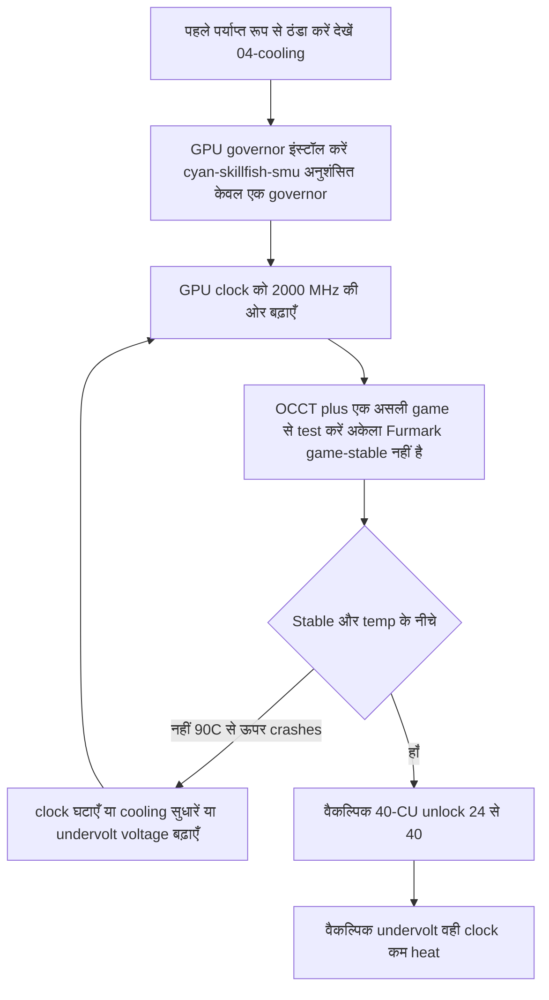

> 🌐 सामुदायिक अनुवाद। अंग्रेज़ी संस्करण ही प्रामाणिक स्रोत है और अधिक नया हो सकता है। कोई त्रुटि मिली? issue खोलें: [English](../en/09-overclock-undervolt.md) · https://github.com/lildebil0/awesome-bc250/issues

# Overclocking और Undervolting

> **संक्षेप में** — डिब्बे से निकालते ही BC-250 का GPU धीमा चलता है (अक्सर **1500 MHz** पर pinned, ~कमज़ोर)। सामुदायिक समाधान एक **governor** है जो clocks/voltage को override करता है: आज अनुशंसित है **[cyan-skillfish-governor-smu](https://github.com/filippor/cyan-skillfish-governor)** (किसी kernel patch की ज़रूरत नहीं, Arch/CachyOS/Bazzite/Fedora पर packaged); **[oberon-governor](https://gitlab.com/mothenjoyer69/oberon-governor)** मूल है और अब भी काम करता है। इनमें से किसी को भी आप edit करके GPU को **2000 MHz (~+30 % FPS)** तक धकेलते हैं। नया **[bc250_smu_oc](https://github.com/bc250-collective/bc250_smu_oc)** toolkit **CPU** को भी overclock करता है (अनुशंसित **4 GHz @ 1275 mV**)। अलग से, **[40-CU unlock](https://github.com/duggasco/bc250-40cu-unlock)** उन **24 → 40 compute units** को फिर से सक्षम करता है जिन्हें AMD ने firmware में disable किया था — यह अकेले clocks की तुलना में बड़ी GPU जीत है (एक Superposition run **4647 → 6863** अंक पर गया, ([src](https://t.me/c/2424231195/137035)))। **यह सब heat है। पहले board को ठंडा करें** — देखें [04-cooling.md](04-cooling.md) — क्योंकि पर्याप्त cooling के बिना OC crash कर देता है और ~90 °C से ऊपर board को reset कर देता है।

यह golden path का **अंतिम** कदम है, पहला नहीं। इसमें से कुछ भी छूने से पहले एक stable, ठंडा board चलवा लें ([06-linux.md](06-linux.md), [04-cooling.md](04-cooling.md))। यहाँ सब कुछ "अपने जोखिम पर करें" वाला है — समुदाय यह बार-बार कहता है ([src](https://t.me/c/2424231195/106844))।

---

## चार levers (और प्रत्येक का मोल)

BC-250 में **चार** स्वतंत्र चीज़ें हैं जिन्हें आप tune कर सकते हैं। ये एक-दूसरे के ऊपर जुड़ती हैं:

| Lever | Tool | विशिष्ट लाभ | Heat लागत |
|-------|------|--------------|-----------|
| **GPU clock** 1500 → 2000 MHz | governor (cyan-skillfish-smu / oberon) | GPU-bound होने पर **~+30 % FPS** | ऊँची |
| **GPU undervolt** एक स्थिर clock पर | वही governor | वही FPS, **बहुत ठंडा** | *ऋणात्मक* (कम heat) |
| **CPU clock** 3.5 → 4.0 GHz | `bc250_smu_oc` | CPU-bound games में मदद करता है | ऊँची |
| **40-CU unlock** 24 → 40 CUs | `bc250-40cu-unlock` | **~+48 % तक** GPU काम | ऊँची |

शुरू करने से पहले chat से दो ईमानदार चेतावनियाँ:

- **अधिकांश BC-250 games CPU-bound हैं, GPU-bound नहीं।** GPU को 2000 → 2229 MHz धकेलने से एक tester को Shadow of the Tomb Raider में *1 fps* मिला (90 → 91) जबकि power और temps तेज़ी से उछले — इसलिए सुर्खी "+30 %" केवल उन गिने-चुने titles में उतरती है जहाँ GPU bottleneck है ([src](https://t.me/c/2424231195/67029))।
- **Heat performance से बदतर scale करता है।** वही tester: stress test में 2000 MHz @ 960 mV = **75 °C**; 2229 MHz @ 1030 mV = **93 °C** — और उसने पीछे हटना चुना क्योंकि उसका PSU और cooler इसे संभाल नहीं सके ([src](https://t.me/c/2424231195/66972), [src](https://t.me/c/2424231195/67029))।

> ⚠️ **Safety floor।** Throttling लगभग **85 °C** पर शुरू होती है और board लगभग **90 °C** पर hard-crash / reset करता है (देखें [04-cooling.md](04-cooling.md))। यदि आप load के तहत ~85 °C पार करते हैं, तो आप अपने cooling budget के *ऊपर* हैं — clock घटाएँ या undervolt करें, और ऊँचा न धकेलें।



---

## Step 1 — GPU clock & undervolt: governor

BC-250 का amdgpu driver सामान्य sysfs overclocking expose नहीं करता। सामुदायिक समाधान एक **governor** है — एक छोटा daemon जो clock/voltage states सीधे लिखता है। आज एक नए install के लिए अनुशंसित है **cyan-skillfish-governor-smu**; **oberon-governor** मूल है और अब भी काम करता है (स्थापित विकल्प के रूप में नीचे रखा गया)।

<p align="center"></p>
<sub>📈 संपादन-योग्य स्रोत: <a href="../../assets/diagrams/gpu-clock-tradeoff.drawio">gpu-clock-tradeoff.drawio</a> (<a href="https://draw.io">draw.io</a> में खोलें)। हरा = लाभ, लाल = लागत।</sub>

### cyan-skillfish-governor-smu (अनुशंसित)

[filippor/cyan-skillfish-governor](https://github.com/filippor/cyan-skillfish-governor), SMU branch — clock/voltage को **SMU firmware calls** के ज़रिए चलाता है, इसलिए इसे **किसी भी distro पर kernel frequency patch की ज़रूरत नहीं**, यह सक्रिय रूप से maintained है, और हर बड़े distro पर packaged है। यह **memory-controller power-profile** नियंत्रण भी जोड़ता है, जो idle TDP को **~30–35 W** तक घटाता है (idle पर ठंडा और शांत) ([src](https://t.me/c/2424231195/125821))।

**Install (हर बड़े distro पर packaged)** — COPR `filippor/bazzite` (Fedora/Bazzite) या AUR `cyan-skillfish-governor-smu` (Arch/CachyOS); Debian/Ubuntu release tarball + `sudo ./scripts/install.sh` का उपयोग करें:

```bash
# Fedora / Bazzite (COPR):
sudo dnf copr enable filippor/bazzite
sudo dnf install cyan-skillfish-governor-smu        # rpm-ostree install … on Bazzite
sudo systemctl enable --now cyan-skillfish-governor-smu.service

# Arch / CachyOS (AUR):
paru -S cyan-skillfish-governor-smu                  # or: yay -S …
sudo systemctl enable --now cyan-skillfish-governor-smu.service
```

SMU branch को `cargo build --release` से source से भी build किया जा सकता है। `/etc/cyan-skillfish-governor-smu/config.toml` में अपना **clock & voltage सेट करें** (schema नीचे) — कमज़ोर default से सामुदायिक sweet spot तक जाने के लिए, top safe-point को **2000 MHz** की ओर बढ़ाएँ और voltage को तब तक नीचे करें जब तक यह stable न हो जाए (नीचे undervolting देखें); हर edit के बाद service को restart करें।

> **जाँचें कि यह लागू हुआ।** GPU को load करते समय `amdgpu_top`, MangoHud, या LACT से live clocks/temps देखें। यदि clocks ~1500 MHz पर रहते हैं, तो service नहीं चल रही या आपका config parse नहीं हुआ — `sudo systemctl status cyan-skillfish-governor-smu`।

> एक समय में **एक** governor चलाएँ — यदि आपने पहले oberon चलाया था, तो cyan-skillfish enable करने से पहले उसे disable करें, वरना वे एक ही registers के लिए लड़ेंगे।

> 🔇 **एक शांत living-room console के लिए tuning।** अधिकतम तक धकेलना (2000 MHz GPU / 4000 MHz CPU) CPU-bound games में बहुत कम देता है पर बहुत सारा heat, fan noise और watts खर्च करता है। एक r/BC250Gaming (Reddit) सामुदायिक रिपोर्ट में पाया गया कि एक संतुलित **~1600 MHz GPU / ~3500 MHz CPU** रोज़मर्रा के gaming के लिए कहीं बेहतर performance-per-noise-per-watt देता है — लगभग-मौन और ठंडा, ऐसे FPS के साथ जो टिका रहता है क्योंकि अधिकांश titles वैसे भी GPU-bound नहीं हैं (ऊपर CPU-bound चेतावनी देखें)। यदि आपको chart-topping benchmarks से अधिक एक शांत, ठंडा box मायने रखता है, तो max के बजाय उन्हें अपनी governor ceilings के रूप में सेट करें।

### oberon-governor (मूल — अब भी काम करता है)

[mothenjoyer69/oberon-governor](https://gitlab.com/mothenjoyer69/oberon-governor) — एक C++ daemon, पहला BC-250 governor और सबसे अधिक-परखा हुआ; यह अब भी काम करता है, पर SMU governor के विपरीत यह top clocks तक पहुँचने के लिए extended-frequency kernel patch (या एक ऐसे distro जो इसे ship करता है) पर निर्भर करता है। इसके README के अनुसार यह **CMake, एक C++ toolchain, और libdrm** पर निर्भर है, और **केवल ASRock BC-250 पर tested** है। कई distros इसे prebuilt ship करते हैं (Arch AUR, एक Fedora COPR, Bazzite images), इसलिए source से build करना केवल तभी ज़रूरी है जब आपके distro में कोई package न हो।

**Source से build करें** (chat के पुनरुत्पादित क्रम से मेल खाता है, ([src](https://t.me/c/2424231195/54666)) और repo का मानक CMake प्रवाह):

```bash
# Dependencies (Arch example — adjust per distro)
sudo pacman -S --needed base-devel cmake pkgconf make libdrm glibc linux-api-headers

git clone https://gitlab.com/mothenjoyer69/oberon-governor.git && cd oberon-governor
sudo cmake . && sudo make && sudo make install
sudo systemctl enable --now oberon-governor.service
```

> यदि `cmake` error देता है, तो chat का fix बस यही था कि गायब build deps इंस्टॉल करें और फिर से चलाएँ: `sudo pacman -S pkgconf cmake` फिर rebuild करें ([src](https://t.me/c/2424231195/54666))।

**अपना clock & voltage सेट करें।** oberon एक YAML config पढ़ता है:

```bash
sudo nano /etc/oberon-config.yaml      # adjust min/max frequency and voltage
sudo systemctl restart oberon-governor # apply
```

फ़ाइल आपको GPU states के लिए **अधिकतम और न्यूनतम voltage और frequency** सेट करने देती है (repo README के अनुसार)। max frequency को **2000 MHz** की ओर बढ़ाएँ और voltage को तब तक नीचे करें जब तक यह stable न हो जाए। हर edit के बाद service को restart करें। बाद में SMU governor पर migrate करने के लिए: `oberon-governor` को stop+disable+remove करें, `rm /etc/oberon-config.yaml`, फिर SMU service install और enable करें।

#### TT vs SMU — दो cyan-skillfish variants

> ऊपर अनुशंसित SMU build **दो** cyan-skillfish variants में से एक है। SMU default है; TT variant उन लोगों के लिए विकल्प है जो विशेष रूप से kernel-patch/sysfs रास्ता चाहते हैं ([elektricM: governor](https://elektricm.github.io/amd-bc250-docs/system/governor/)):

> **`perf_profile` — मेमोरी-कंट्रोलर / Infinity Fabric टियर (GPU कर्व से अलग)।** SMU एक परफॉरमेंस-प्रोफ़ाइल इंडेक्स `0–3` प्रदर्शित करता है: **3** उच्चतम मेमोरी-कंट्रोलर / Infinity-Fabric परफॉरमेंस है, जबकि **1** सबसे कम आइडल पॉइंट के लिए अनुशंसित लो-पावर प्रोफ़ाइल है। गवर्नर इसे स्वचालित रूप से **3** पर फ़ोर्स करता है जब भी CPU लोड `cpu-load-target.upper` को पार करता है। ([bc250-collective/cyan-skillfish-governor](https://github.com/bc250-collective/cyan-skillfish-governor))

| Variant | Service | clocks कैसे सेट करता है | Kernel patch? | जारी / नोट्स |
|---|---|---|---|---|
| **SMU** *(अनुशंसित)* | `cyan-skillfish-governor-smu` | SMU **firmware calls** | **नहीं — किसी भी distro पर बिना patch के काम करता है** | 2026-01-18; 2300+ MHz तक पहुँचता है; CPU ~0.9–1.3 % |
| **TT** (विकल्प) | `cyan-skillfish-governor-tt` | sysfs | **हाँ** (Bazzite में पहले से शामिल) | thermal-throttling aware; 2175+ MHz तक पहुँचता है |

> **Service rename (2025-12-13):** filippor ने `cyan-skillfish-governor` → `cyan-skillfish-governor-tt` नाम बदला, और config dir `/etc/cyan-skillfish-governor/` → `/etc/cyan-skillfish-governor-tt/` स्थानांतरित हुआ। यदि upgrade कर रहे हैं, तो अपना पुराना `config.toml` copy कर लें ([elektricM: governor](https://elektricm.github.io/amd-bc250-docs/system/governor/))। TT variant उसी COPR/AUR (`cyan-skillfish-governor-tt`) में packaged है और Bazzite में पहले से शामिल है।

> 🔴 **700 mV एक hard floor है।** governor के *न्यूनतम* GPU voltage को **700 mV से नीचे सेट करना GPU को वापस 1500 MHz पर lock कर देता है** — यह पूरे उद्देश्य को विफल कर देता है। किसी भी governor में min voltage ≥ 700 mV रखें ([elektricM: governor](https://elektricm.github.io/amd-bc250-docs/system/governor/), [elektricM: BIOS overclocking](https://elektricm.github.io/amd-bc250-docs/bios/overclocking/))।

> 🔴 **~1100–1129 mV छत है — 700 mV floor का समकक्ष।** governor के *अधिकतम* GPU voltage को stock `OD_RANGE` के top **1129 mV** से आगे न धकेलें; उससे आगे **बिना किसी stability लाभ के silicon-degradation का जोखिम है**। conservative air-cooled छत लगभग **1100 mV (ऊपर उच्च जोखिम)** पर बैठती है, और केवल liquid cooling **1125 mV** top tier को न्यायसंगत ठहराती है (नीचे table)। यदि किसी curve को stable होने के लिए ~1129 mV से अधिक चाहिए, तो असली fix *cooling या एक निचला clock* है, अधिक volts नहीं ([elektricM: BIOS overclocking](https://elektricm.github.io/amd-bc250-docs/bios/overclocking/))।

> **सत्यापित करें कि सही GPU targeted है।** आपके system के आधार पर governor `card0` या `card1` को नियंत्रित कर सकता है — `ls /sys/class/drm/ | grep card`। यदि settings लागू नहीं होतीं, तो आपको config को सही card पर point करना पड़ सकता है। Arch/CachyOS पर governor कभी-कभी तब तक activate नहीं होता जब तक GPU पहली बार उपयोग न हो — boot के बाद एक बार game/benchmark चलाएँ ([elektricM: governor](https://elektricm.github.io/amd-bc250-docs/system/governor/))।

#### cyan-skillfish-smu config schema (section-based TOML)

`smu` branch एक **section-based** schema का उपयोग करता है, पुराने `safe-points = [...]` array का **नहीं** — प्रत्येक curve point अपना खुद का `[[safe-points]]` table है। मुख्य fields ([elektricM: governor](https://elektricm.github.io/amd-bc250-docs/system/governor/)):

```toml
# /etc/cyan-skillfish-governor-smu/config.toml
[timing.intervals]
sample = 500          # µs; raise (e.g. 1000) to cut CPU overhead, keep adjust = sample*400
adjust = 200_000
[gpu-usage]
fix-metrics = true    # fixes the MangoHud "655 %" GPU-usage bug on BC-250
method  = "busy-flag"
[gpu]
set-method = "smu"    # "smu" or "kernel"
[load-target]
upper = 0.80          # fractions, not percents
lower = 0.65
[temperature]
throttling = 85       # °C
throttling_recovery = 75

[[safe-points]]
frequency = 1000
voltage   = 800
[[safe-points]]
frequency = 2000
voltage   = 1000      # gaming
[[safe-points]]
frequency = 2200
voltage   = 1000      # many boards hold a flat 1000 mV here; bump per-board only if it crashes
```

> **जब अस्थिर हो तब tuning क्रम: cooling → frequency → *फिर* voltage।** stock cooling पर असली कारण लगभग हमेशा heat (95 °C+) होता है। voltage जोड़ने से पहले frequency को सीमित करने के लिए top `[[safe-points]]` blocks को घटाएँ; केवल यदि temps ठीक हैं और यह फिर भी 2150–2200 MHz पर crash करता है, तो **केवल top point** को +15–25 mV बढ़ाएँ। 2200 MHz पर ~1075 mV से आगे आप बस heat जोड़ रहे हैं — बजाय इसके frequency घटाएँ ([elektricM: governor](https://elektricm.github.io/amd-bc250-docs/system/governor/))।

> **GPU-reset black-screen, governor-specific।** यदि GPU *उस समय crash करता है जब governor सक्रिय रूप से sysfs लिख रहा है*, तो reset पूरा नहीं हो सकता और आपको एक स्थायी black screen मिलता है (system SSH पर अब भी जीवित) जिसके लिए hard reboot चाहिए। उपाय: ज्ञात crash-prone games से पहले governor को `systemctl stop` करें; असली fix एक stable curve है ([elektricM: governor](https://elektricm.github.io/amd-bc250-docs/system/governor/))।

##### SMU governor 2230 MHz से आगे कैसे धकेलता है — और यह disabled क्यों ship होता है

क्योंकि SMU branch amdgpu `OD_RANGE` के बजाय सीधे SMU firmware से बात करता है, यह **Oberon की 2230 MHz hard cap से आगे जा सकता है** — एक walkthrough ने इसे एक ही board पर **≈2700 MHz** तक चलाया ([Old Lamer — Part XII](https://youtu.be/Chzxaryjncs))। यही headroom वह कारण है जिसके चलते filippor इसे सावधानी से ship करता है:

> 🔴 **SMU governor का default config boot पर black-screen कर सकता है — इसलिए यह auto-start NOT करते हुए ship होता है।** filippor जानबूझकर install के बाद service को disabled छोड़ देता है ताकि एक खराब default curve आपको boot पर lock-out न कर सके; आपको पहले **curve को tune और test करने, फिर stable होने पर `systemctl enable` करने** का मौका मिलता है। एक curve validate करने से *पहले* इसे enable करना और अगले boot पर black screen आपकी ज़िम्मेदारी है ([Old Lamer — Part XII](https://youtu.be/Chzxaryjncs))। *(⚠ आँकड़े auto-captioned हैं — सटीक MHz को अनुमानित मानें।)*

Oberon के overheat पर hard frequency drop के विपरीत, SMU governor **एक temperature target की ओर धीरे-धीरे ramp करता है**। walkthrough ऊपर के schema से परे अतिरिक्त `config.toml` fields भी उजागर करता है ([Old Lamer — Part XII](https://youtu.be/Chzxaryjncs)):

```toml
# extra tuning knobs shown in the Part XII walkthrough
[ramp-rates]
normal = 1
burst  = 50
[gpu-usage]
burst-samples = 60
down-events   = 5
[frequency-thresholds]
adjust = 10
[temperature]
throttling_recovery = 80
```

> ⚠️ **लेखक-प्रायोगिक 16-point air curve — अनुशंसित नहीं, इस guide की air छत से आगे जाता है।** Part XII के लेखक ने यह curve air पर चलाया, पर इसके top points (1120–1150 mV पर 2333–2400 MHz) **Step 3 में documented conservative air-cooled सीमाओं से ऊपर** बैठते हैं (air पर ≈2230 MHz / 1060 mV; 1125 mV एक *liquid-only* tier है)। यह संदर्भ के लिए दिखाया गया है, लक्ष्य के रूप में नहीं — air पर, वहीं रुकें जहाँ Step 3 की cooling-class table कहती है:
>
> ```toml
> # ⚠ author-experimental, air-cooled — DO NOT copy blindly (exceeds the air ceiling)
> # frequency (MHz) @ voltage (mV)
> 1000@800,  1175@850,  1500@900,  1700@920,
> 2000@960,  2100@1000, 2150@1035, 2200@1050,
> 2250@1070, 2300@1090, 2333@1120, 2400@1150
> ```
>
> उस curve के top पर, **2.4 GHz ने ~30 A ≈ 360 W खींचा** — इतना कि इसे एक ही connector नहीं, बल्कि **dual Molex / एक दूसरा board feed** ([03-power-supply.md](03-power-supply.md)) चाहिए। Superposition **2.2 GHz पर ≈4200 → 2.4 GHz पर ≈4500** scale हुआ ([Old Lamer — Part XII](https://youtu.be/Chzxaryjncs))। *(⚠ सभी मान auto-captioned — अनुमानित।)*

#### GPU frequency-range kernel patch (केवल TT / manual sysfs के लिए)

amdgpu driver की stock GPU range **1000–2000 MHz** है; एक one-line driver patch (**ViRazY** द्वारा, `linux-6.12-bc250-freq.mypatch`, ~**639 bytes**, kernels **6.12 / 6.15 / 6.16.x** पर tested) इसे **350–2230 MHz** तक चौड़ा करता है (350 MHz deep-idle power बचाता है; top end 2230+ overclocks सक्षम करता है)। **Bazzite, PikaOS, और Arch AUR kernels इसे pre-patched ship करते हैं**, और **SMU governor firmware calls के ज़रिए इसकी ज़रूरत को पूरी तरह bypass करता है** — इसलिए आप केवल तभी manually patch करते हैं जब आप एक unpatched distro पर extended range के साथ TT governor या raw sysfs OC चाहते हों। `cat …/pp_od_clk_voltage` से सत्यापित करें (350–2230 दिखाना चाहिए)। extended-voltage (600–1300 mV) patch का उपयोग **न करें** — अनावश्यक और जोखिमपूर्ण ([elektricM: BIOS overclocking](https://elektricm.github.io/amd-bc250-docs/bios/overclocking/))।

> 🔧 **Raw sysfs undervolt (एक-बार की probing)।** governor के बिना एक त्वरित per-point stability probe के लिए, एक voltage-curve point सीधे sysfs में लिखें (format `vc <level> <MHz> <mV>`) और इसे commit करें ([elektricM: BIOS overclocking](https://elektricm.github.io/amd-bc250-docs/bios/overclocking/)):
> ```bash
> echo "vc 0 2100 1025" | sudo tee /sys/class/drm/card0/device/pp_od_clk_voltage   # set point: 2100 MHz @ 1025 mV
> echo "c" | sudo tee /sys/class/drm/card0/device/pp_od_clk_voltage                # commit
> ```
> यह केवल त्वरित probing के लिए है — यह reboot नहीं झेलता। governor का `config.toml` अनुशंसित **persistent** रास्ता है; एक stable per-point voltage खोजने के लिए raw sysfs का उपयोग करें, फिर इसे governor curve में bake करें।

#### PS5GPU-BC250 — एक GUI controller (कोई config फ़ाइल नहीं)

GUI पसंद है? **[ZEROAESQUERDA/PS5GPU-BC250](https://github.com/ZEROAESQUERDA/PS5GPU-BC250)** एक Qt app (KDE/GNOME) है जो min/max GPU frequency & voltage समायोजित करता है, एक temperature limit सेट करता है, और automatic 4-stage boost या manual control देता है — MSI-Afterburner-style, बिना kernel patches या TOML editing के। पहले किसी भी चल रहे governor को **disable करें** (cyan-skillfish-smu/tt या oberon) वरना वे conflict करते हैं ([elektricM: governor](https://elektricm.github.io/amd-bc250-docs/system/governor/))।

---

## Step 2 — CPU overclock & उचित undervolt: `bc250_smu_oc`

bc250-collective द्वारा **2025-12-30** को जारी (SMU की reverse-engineering करके), [bc250_smu_oc](https://github.com/bc250-collective/bc250_smu_oc) वह tool है जो आख़िरकार आपको केवल GPU नहीं, बल्कि **CPU** clock और voltage (Zen 2 cores) छूने देता है। लेखक stability/heat optimum के रूप में **4 GHz @ 1275 mV** अनुशंसित करते हैं और repo में उसे उदाहरण के रूप में ship करते हैं ([src](https://t.me/c/2424231195/106844))।

**Install & उपयोग** (repo README से शब्दशः):

```bash
# Prerequisite: install the `stress` CPU load tool from your package manager
git clone https://github.com/bc250-collective/bc250_smu_oc.git
cd bc250_smu_oc
pip install .        # or: pipx install .

# Detect / test a target (CPU 4 GHz at 1275 mV), keep it applied:
bc250-detect --frequency 4000 --vid 1275 --keep

# Once you've found a stable config, install it and enable at boot:
bc250-apply --install overclock.conf
sudo systemctl enable --now bc250-smu-oc
```

> 🔴 **Hard voltage limit।** repo के अनुसार: किसी भी परिस्थिति में CPU core voltage (**Vid**) को **1.325 V** से अधिक कभी न होने दें — silicon degradation ~1.35 V से ऊपर शुरू होती है ([src](https://t.me/c/2424231195/115726))। और: **undervolting के बिना CPU frequency बढ़ाने से Vid uncapped scale करता है और hardware को नष्ट कर सकता है** — हमेशा एक clock bump को एक voltage target के साथ जोड़ें।

4 GHz छत क्यों है: AMD इस silicon के लिए ~4 GHz तक को safe मानता है; 4700S desktop-kit BIOS तो डिब्बे से ही 4000 MHz / 1.35 V पर turbo boot करता है। Zen 2 *आमतौर पर* ~4200 तक पहुँचता है, पर ये chips **mining-reject silicon** हैं, इसलिए 4200 केवल "यदि आप बहुत भाग्यशाली हुए तो" ([src](https://t.me/c/2424231195/115726))।

> ❓ **क्या मैं CPU को 8 cores तक unlock कर सकता हूँ?** संक्षिप्त उत्तर: **नहीं — फ़िलहाल नहीं, और वैसे भी इससे मदद नहीं मिलेगी।** BC-250 अपने 8 Zen 2 cores में से 6 active के साथ ship होता है; r/BC250Gaming सामुदायिक रिपोर्ट्स बाकी दो को **SMU द्वारा पढ़े जाने वाले eFuses के ज़रिए software-locked** बताती हैं (binning काफ़ी हद तक कृत्रिम है — एक mining-era निर्णय), *भौतिक रूप से कटे हुए नहीं*। पर उन्हें unlock करने का मतलब होगा **PSP signature check को bypass करना और SMU microcode को संशोधित करना**, और सामुदायिक प्रयास (Discord पर) **सफल नहीं हुए हैं**। भले ही किसी ने कर भी लिया, gaming के लिए लाभ **मामूली** होगा: BC-250 **कमज़ोर single-thread performance, एक छोटे fragmented 2×4 MB L3 cache, और एक AVX2-only / अपंग FPU** से bottlenecked है — cores जोड़ने से न FPS बढ़ती है न वे चीज़ें जिनकी इस chip में वास्तव में कमी है। इसका पीछा न करें ([r/BC250Gaming सामुदायिक रिपोर्ट्स](https://www.reddit.com/r/BC250Gaming/))।

> pinned `bc250_smu_oc` post आपके GPU governor को **replace** भी कर सकता है (इसकी अपनी `bc250-smu-oc` service है)। एक साथ दो governors न चलाएँ।

> **सत्यापित CPU-OC scaling** (Fedora 43, kernel 6.19.8; auto-tuned voltage; 7-zip MIPS; एक temperature-based fan curve के साथ) ([elektricM: governor](https://elektricm.github.io/amd-bc250-docs/system/governor/)):

| Freq | Auto Vid | 7-zip MIPS | Temp (full load) | vs stock |
|---|---|---|---|---|
| 3500 (stock) | auto | 26,062 | 60 °C | baseline |
| 3600 MHz | 1150 mV | 26,518 | 65 °C | +1.7 % |
| 3700 MHz | 1199 mV | 27,212 | 68 °C | +4.4 % |
| 3800 MHz | 1250 mV | 27,919 | 72 °C | +7.1 % |
| 3900 MHz | 1275 mV | 28,410 | 75 °C | +9.0 % |
| 4000 MHz | — | throttles at PWM 80 | 77 °C | ❌ (अधिक cooling/fan चाहिए) |

tool के flags: test करने के लिए `bc250-detect -f <MHz> -v <mV>`, tool के बाहर निकलने के बाद OC रखने के लिए **`-k`** जोड़ें, एक config लिखने के लिए **`-c <path>`**। इसे `bc250-apply -a -i /etc/bc250-overclock.conf` फिर `systemctl enable bc250-smu-oc` से स्थायी बनाएँ। लेखक: **mrfrakes & dantistnfs** (SMU reverse-engineering) ([elektricM: governor](https://elektricm.github.io/amd-bc250-docs/system/governor/), [elektricM: BIOS overclocking](https://elektricm.github.io/amd-bc250-docs/bios/overclocking/))। ध्यान दें **4000 MHz ने stock-जैसे PWM 80 fan पर throttle किया** — छत cooling-bound है, ऊपर के air-vs-water नोट के अनुरूप।

#### `bc250-detect` वास्तव में कैसे खोजता है (और जो voltage छत यह लागू करता है)

उसी tool के एक video walkthrough में auto-search यांत्रिकी दिखती है: यह **3.5 GHz से 100 MHz / 25 mV steps में ramp करता है**, प्रत्येक step पर एक **~300 s stress test** चलाता है और केवल pass होने पर आगे बढ़ता है — उदा. `bc250-detect -f 3850 -v 1150 -k` 3.85 GHz @ 1150 mV को test करने और रखने के लिए। Bazzite पर install है `sudo rpm-ostree install stress pipx` फिर `pipx install .` ([Old Lamer — Part VIII](https://youtu.be/ciDpPhoioKM))।

> ⚠️ **दो voltage ceilings — दोनों पर ध्यान दें, ये असहमत हैं।** Part VIII video एक **hard 1300 mV** CPU-Vid छत बताता है, जो ऊपर उपयोग की गई repo की documented **1.325 V** सीमा से **अधिक conservative** है। वे safety संदेश का खंडन नहीं करतीं (~1.35 V से काफ़ी नीचे रहें), पर *सटीक* संख्या स्रोत के अनुसार भिन्न है — संदेह होने पर, निचली (1300 mV) को अपनी working cap के रूप में लें और 1.325 V कभी पार न करें ([Old Lamer — Part VIII](https://youtu.be/ciDpPhoioKM))। *(⚠ 1300 mV आँकड़ा auto-captioned है।)*

उस run में, **4 GHz @ 1225 mV ने छोटा quick-test pass किया पर in-game crash कर गया**, इसलिए लेखक एक stable **3.85 GHz @ 1150 mV** पर वापस आ गया — वही "4 GHz quick-pass करता है, sustained पर fail" pattern जो elektricM table दिखाती है ([Old Lamer — Part VIII](https://youtu.be/ciDpPhoioKM))। *(⚠ ASR — अनुमानित मान।)*

**End-to-end CPU+GPU scaling (Horizon Zero Dawn, 1080p Ultra, native, 1× Arctic P12 Pro ~2200 rpm)।** एक ही video प्रत्येक lever को stack करता है और in-game परिणाम मापता है, जो सबसे स्पष्ट प्रदर्शन है कि यह board **CPU-bound** क्यों है: GPU ख़ुशी-ख़ुशी ~88–90 fps render कर देता है, CPU के feed कर पाने से बहुत पहले ([Old Lamer — Part X](https://youtu.be/1hgSQxf6RXE))। *(⚠ सभी fps/°C auto-captioned — ≈ मानें।)*

| Step (cumulative) | GPU clock @ mV | CPU clock @ mV | In-game fps | GPU-capable fps | CPU / GPU temp |
|---|---|---|---|---|---|
| Stock undervolt | 1500 @ 850 | 3.5 G @ 1020 | **≈62** | — | 53 / 51 °C |
| + GPU OC | 2000 @ 960 | 3.5 G @ 1020 | **≈69** | 81 | 64 / 63 °C |
| + CPU OC | 2000 @ 960 | 3.85 G @ 1155 | **≈72** | — | 65 / 64 °C |
| + GPU OC | 2200 @ 1030 | 3.85 G @ 1155 | **≈74** | 88 | ~70 °C |
| + CPU OC | 2200 @ 1030 | 4.0 G @ 1270 | **≈76–77** | 88 | 72 / 68 °C |
| + mitigations off | 2200 @ 1030 | 4.0 G @ 1270 | **≈80** | 90 | — |

**कुल: ≈62 → ≈80 fps (~+29 %), और यह सख़्ती से CPU-bound है** — GPU अंदरूनी रूप से 88–90 fps render करता है जबकि CPU playable rate को लगभग 80 पर सीमित कर देता है। उसी run से नोट्स ([Old Lamer — Part X](https://youtu.be/1hgSQxf6RXE)):

- **4 GHz को यहाँ ~1270 mV चाहिए**, वरना board green-screen करता है — clock को पर्याप्त Vid के साथ जोड़ना अनिवार्य है (ऊपर के "undervolting के बिना frequency कभी न बढ़ाएँ" नियम की प्रतिध्वनि)।
- **`bc250_smu_oc` में एक built-in ~90 °C auto-throttle है**, इसलिए tool स्वयं board के hard-crash temp से पहले पीछे हट जाता है।
- **mitigations=off ने केवल ≈+3 fps दिए** (CPU-vuln kernel mitigations); एक छोटा, वैकल्पिक अंतिम निचोड़।
- **Custom memory timings ने यहाँ कोई लाभ नहीं दिया और brick जोखिम वहन करते हैं** — इन्हें छोड़ें (नीचे GDDR6 section देखें)।
- **3.85 GHz @ 1155 mV को CPU sweet spot कहा जाता है** — elektricM 7-zip table से मेल खाता है, जहाँ 4 GHz stock-जैसी cooling पर throttle करता है।
- अंतिम OC पर board ने **1440p Ultra native @ 60** चलाया, और **4K + FSR लगभग 60** ([Old Lamer — Part X](https://youtu.be/1hgSQxf6RXE))।

> 📊 **Stock-baseline FurMark sanity numbers (अलग run)।** एक अलग walkthrough ने FurMark को **stock FHD ≈4085 points / 67 fps** पर लॉग किया; GPU को **1500 → 2000 MHz बढ़ाने से ~+30 % मिला (≈5340 points / 87 fps)**, जबकि **2229 MHz ने लगभग कुछ नहीं जोड़ा और >90 °C चला** (throttle)। उस video से थंब रूल: **"FurMark + CPU stress में <80 °C ⇒ games में <70 °C,"** और **FurMark Vulkan chip को GL path की तुलना में अधिक गर्म करता है** ([Old Lamer — Part IV](https://youtu.be/YuBmGF536II))। *(⚠ ASR — अनुमानित।)*

#### CPU frequency scaling को ACPI fix चाहिए (वरना cpufreq है ही नहीं)

> ❗ **डिब्बे से निकालते ही BC-250 कोई CPU frequency scaling expose नहीं करता** — कोई cpufreq interface *नहीं* है, इसलिए `cpupower`/`schedutil` कुछ नहीं करते और CPU एक स्थिर clock पर बैठता है। **[bc250-collective/bc250-acpi-fix](https://github.com/bc250-collective/bc250-acpi-fix)** दो SSDT tables (एक initrd override के ज़रिए loaded) ship करता है जो इसे ठीक करती हैं ([elektricM: governor](https://elektricm.github.io/amd-bc250-docs/system/governor/)):
> - **SSDT-PST** → **8 P-states, 800 MHz → 3200 MHz** के साथ standard Linux cpufreq सक्षम करता है (governors: `schedutil`, `powersave`, `performance`, …)।
> - **SSDT-CST** → **C1/C2/C3 idle states** सक्षम करता है ताकि cores वास्तव में idle पर sleep करें (कम idle power)।
>
> दोनों kernel 6.19.8 पर काम करते हुए पुष्टि किए गए। Install `SSDT-CST.aml`+`SSDT-PST.aml` से एक cpio को `/boot` में build करता है, जो initrd line (Fedora BLS) से पहले जोड़ा जाता है या `GRUB_EARLY_INITRD_LINUX_CUSTOM` (GRUB) के ज़रिए। फिर `echo schedutil | sudo tee /sys/devices/system/cpu/cpu*/cpufreq/scaling_governor`। **चेतावनी:** एक kernel update override को नए boot entry में नहीं ले जाएगा — इसे फिर से जोड़ें या एक kernel-install hook का उपयोग करें। `bc250_smu_oc` के साथ मिलकर, CPU तब pinned चलने के बजाय **800 MHz idle → 3900 MHz load** scale करता है ([elektricM: governor](https://elektricm.github.io/amd-bc250-docs/system/governor/), [elektricM: power](https://elektricm.github.io/amd-bc250-docs/system/power/))।

#### Idle power — यह ऊँचा क्यों है, और tuning कितनी दूर ले जाती है

BC-250 default रूप से idle पर गर्म और भूखा रहता है; tuning इसे स्पष्ट tiers में घटाती है ([elektricM: power](https://elektricm.github.io/amd-bc250-docs/system/power/)):

- **Idle सीढ़ी: ~105 W (कोई governor नहीं) → ~85 W (governor) → ~55 W (optimized: Debian + governor + undervolt)।** अकेला governor ~20 W बचाता है; **~55 W सर्वोत्तम-स्थिति idle floor है**, और आप इसे केवल distro + governor + undervolt को stack करके पहुँचते हैं।
- **Idle ऊँचा क्यों है — unoptimized विभाजन (~93 W):** **CPU+GPU ~31 W**, **RAM + memory controller ~35 W**, **board का बाकी ~27 W**। memory subsystem अकेला सबसे बड़ा idle draw है, और board के अधिकांश आँकड़े fixed silicon हैं — यानी tuning CPU/GPU और (governor के memory-controller profile के ज़रिए) कुछ RAM draw को छील सकती है, पर एक बड़ा हिस्सा अछूत है।

तीन नामित tuning profiles वास्तविक envelopes (idle power / sustained temp) को घेरते हैं ([elektricM: power](https://elektricm.github.io/amd-bc250-docs/system/power/)):

| Profile | Power | Temp |
|---|---|---|
| Efficiency | 55–65 W | 60–70 °C |
| Gaming | 70–85 W | 65–75 °C |
| Performance | 85–95 W | 75–85 °C |

---

## Step 3 — Undervolting (heat के लिए यह करें, हर chip अलग है)

Undervolting इस board पर सबसे अधिक-मूल्य वाला कदम है: **वही clock, कहीं कम heat**, और यदि आप CPU clock बढ़ाते हैं तो यह *आवश्यक* है। पर **हर chip अलग है** — silicon lottery यहाँ असली है। एक मालिक ने तीन लगभग-क्रमिक boards चलाए और केवल एक ने stress के तहत 900 mV संभाला; एक-समान cooling, एक-समान temps, अलग stability ([src](https://t.me/c/2424231195/50568))।

<p align="center"></p>
<sub>📈 संपादन-योग्य स्रोत: <a href="../../assets/diagrams/undervolt-tradeoff.drawio">undervolt-tradeoff.drawio</a> (<a href="https://draw.io">draw.io</a> में खोलें)। हरा = लाभ, लाल = लागत।</sub>

**Target clock → voltage, असली सामुदायिक आँकड़े (आपका chip भिन्न होगा):**

| GPU clock | वह voltage जो owners को *game-stable* मिला | नोट्स |
|-----------|------------------------------------------|-------|
| 1500 MHz | ~710 mV | एक tester का "सबसे stable" board ([src](https://t.me/c/2424231195/23545)) |
| 2000 MHz | **~955 mV** | 905 mV पर Furmark-stable पर games में artifacts 955 mV तक ([src](https://t.me/c/2424231195/68126), [src](https://t.me/c/2424231195/136773)) |
| 2000 MHz | ~960 mV → **75 °C** stress | लोकप्रिय daily-driver setpoint ([src](https://t.me/c/2424231195/66972)) |
| 2229 MHz | ~1030–1050 mV → **93 °C** stress | "बंद कर दिया, मैं डर गया" — घटता प्रतिफल ([src](https://t.me/c/2424231195/66972)) |

**प्रत्येक cooling class वास्तव में क्या संभाल सकता है** — ऊपर की table stock-जैसी cooling पर "2229 MHz @ ~1030–1050 mV → डरावना" पर रुक जाती है। ऊँचा जाने के लिए आपको मेल खाती cooling चाहिए; ये elektricM की per-cooling-class ceilings हैं ([elektricM: BIOS overclocking](https://elektricm.github.io/amd-bc250-docs/bios/overclocking/)):

| Cooling | GPU clock | Voltage |
|---|---|---|
| Conservative air (max) | 2230 MHz | 1060 mV |
| High static-pressure air (Arctic P12 Max) | 2300 MHz | 1075 mV |
| Liquid (per NexGen3D) | 2400 MHz | 1125 mV |

> 🧪 **सामुदायिक undervolt setpoints (4pda)।** रूसी forum से दो और असली curves, उपयोगी शुरुआती बिंदु (अब भी chip-निर्भर): एक **24-CU (Oberon)** board पर, एक two-point curve `1000 MHz @ 0.8 V + 1700 MHz @ 0.85 V` ([4pda — dreamerok](https://4pda.to/forum/index.php?showtopic=1104980)); एक **40-CU** board पर, `1500 MHz @ 900 mV`। एक high-leakage chip के लिए, नीचे से शुरू करें — `500 MHz / 900 mV` — और voltage को नीचे खींचने के बजाय **वहाँ से frequency जोड़ें** ([4pda — Lakan](https://4pda.to/forum/index.php?showtopic=1104980))।

> ⚡ **Perf-per-watt framing।** सामुदायिक testing नोट करती है कि एक **undervolted + underclocked 40-CU समान FurMark score पर 24-CU की तुलना में ~100 W कम खींचता है** — यानी समान output के लिए चौड़ा-पर-धीमा हिस्सा अधिक कुशल operating point है, जो 24 CU को सख़्ती से धकेलने के बजाय unlock करके फिर *under*-clock करने का पूरा तर्क है।

> **अकेला Furmark stability test नहीं है।** इसका fixed load उस अस्थिरता को छिपा देता है जो केवल तब दिखती है जब *संदर्भ* बदलता है — alt-tabbing, textures load करना, menus। 905 mV पर Furmark में "stable" एक board ने 1–2 घंटे बाद असली games में texture artifacts फेंके जब तक voltage 955 mV पर नहीं गया। **असली games + एक alt-tab/menu sweep** में validate करें, और केवल Furmark नहीं बल्कि **OCCT** जैसा एक विविध stress tool उपयोग करें (यह VRM को load करता है, केवल shaders को नहीं) ([src](https://t.me/c/2424231195/68126), [src](https://t.me/c/2424231195/136773), [src](https://t.me/c/2424231195/23545))।

> **एक काम का hardware संकेत:** BC-250 में एक **load LED** है — **लाल = GPU idle, हरा = GPU loaded**। कुछ "idle" दृश्य (उदा. Witcher 3 में Novigrad) वास्तव में GPU को हथौड़ा मारते हैं और ऐसे undervolt artifacts सामने लाते हैं जिन्हें Furmark/Cyberpunk चूक जाते हैं ([src](https://t.me/c/2424231195/12285))।

एक अति-आक्रामक undervolt **ख़तरनाक नहीं है** — सबसे खराब स्थिति में board गिर जाता है या M.2 slot को disable कर देता है, जो पाँच सेकंड में साफ़ हो जाता है क्योंकि OC BIOS में संग्रहीत नहीं है ([src](https://t.me/c/2424231195/105998))।

> 💡 **ऐसे artifacts जो undervolt-संबंधी नहीं हैं?** Black textures / flickering एक driver HiZ issue भी हो सकता है — voltage का पीछा करने से पहले game के environment में **`RADV_DEBUG=nohiz`** सेट करके देखें। और ध्यान दें stock-kernel **`OD_RANGE` voltage window 700–1129 mV है**; conservative air-cooled max ~1085 mV है, पूर्ण max ~1100 mV — उससे आगे बिना किसी असली stability लाभ के degradation जोखिम है ([elektricM: BIOS overclocking](https://elektricm.github.io/amd-bc250-docs/bios/overclocking/))।

---

## Step 4 — 40-CU unlock (24 → 40 compute units)

सबसे बड़ी एकल GPU जीत, और सबसे नई। BC-250 के Cyan Skillfish die में भौतिक रूप से **40 CUs** हैं, पर stock firmware केवल **24 active** छोड़ता है (16 "harvested")। kernel parameter **`amdgpu.bc250_cc_write_mode=3`** plus एक patched amdgpu driver सभी 40 को फिर से सक्षम करता है। मापा परिणाम — एक 4K Superposition run **4647 → 6863** अंक पर कूदा (24/40 → 40/40 CUs active), `cu_map.sh` tool harvest map को भरते हुए दिखाता है ([src](https://t.me/c/2424231195/137035)):


लोग **40 CU @ 1850 MHz** चला रहे हैं (RE4 Remake native 1440p high, 60 fps) और 40 CU पर बहुत कम voltages भी रिपोर्ट कर रहे हैं (उदा. एक भाग्यशाली chip पर 1400 MHz @ 750 mV) ([src](https://t.me/c/2424231195/137260), [src](https://t.me/c/2424231195/137157))।

> ⚠️ **इसके लिए amdgpu kernel module को patch और rebuild करना ज़रूरी है** — यह इस guide का सबसे जटिल काम है और **केवल BC-250 के लिए** है (patch board के PCI device ID **`0x13FE`** से guarded है)। patch non-persistent है: modprobe config के बिना, एक reboot 24 CUs पर वापस लौट जाता है।

> **यह वास्तव में कैसे काम करता है (दो registers, दोनों आवश्यक)।** unlock driver init के दौरान **दो** hardware registers लिखता है — अकेले कोई भी compute scale नहीं करता ([elektricM: 40-CU unlock](https://elektricm.github.io/amd-bc250-docs/system/40cu-unlock/)):

| Register | भूमिका | Stock → unlocked |
|---|---|---|
| `CC_GC_SHADER_ARRAY_CONFIG` | driver को बताता है कि कितने CUs मौजूद हैं | `0xfff80000` → `0xffe00000` |
| `SPI_PG_ENABLE_STATIC_WGP_MASK` | SPI को बताता है कि waves कहाँ dispatch करें | `0x07` (WGP 0–2) → `0x1F` (WGP 0–4) |

(नीचे का runtime tool एक **तीसरा**, `RLC`, register भी लिखता है।) यह एक **compute** unlock है, gaming वाला नहीं: duggasco का नियंत्रित A/B Vulkan `llama-bench pp512` को **1.61×** कूदते दिखाता है (1500 MHz पर 230 → 372 tok/s), जबकि `glmark2` केवल **+4.4 %** बढ़ता है क्योंकि 3D fill-rate-bound है, CU-bound नहीं ([elektricM: 40-CU unlock](https://elektricm.github.io/amd-bc250-docs/system/40cu-unlock/))। AI/LLM विशेष विवरण के लिए [akandr/bc250](https://github.com/akandr/bc250) भी देखें।

> 🎯 **अनुशंसित operating point 1500 MHz है, 2 GHz नहीं।** duggasco का A/B **1500 MHz / ~900 mV** को sweet spot मानता है — यह ~1.67× सैद्धांतिक scaling के अधिकांश को thermal परेशानी के बिना पकड़ता है (1500 MHz/874 mV: 372 tok/s, 125 W, 83 °C)। 2 GHz पर वही test 466 tok/s तक उछलता है पर power/temps तेज़ी से चढ़ते हैं और package कुछ मिनट बाद thermal-throttle करता है ([elektricM: 40-CU unlock](https://elektricm.github.io/amd-bc250-docs/system/40cu-unlock/))।

> ⚠️ **हर board साफ़-सुथरे ढंग से unlock नहीं होता — पहले अपना harvest pattern जाँचें।** 16 fused-off CUs के silicon-स्वस्थ होने की गारंटी नहीं है। **सन्निहित (contiguous)** harvest pattern वाले boards (उदा. CU 0–5 active, 6–9 fused, सभी 4 shader arrays पर समान) pass होते हैं; **बिखरे (scattered)** pattern वाले boards में वास्तव में दोषपूर्ण CUs हो सकते हैं जो enumerate होते हैं पर load के तहत fail होते हैं। एक modprobe config commit करने से *पहले* repo से **`./scripts/cu_map.sh`** चलाएँ। यदि scattered है, तो per-WGP health test चलाने और **24 और 40 stable CUs के बीच** कहीं उतरने की अपेक्षा करें ([elektricM: 40-CU unlock](https://elektricm.github.io/amd-bc250-docs/system/40cu-unlock/))। साथ ही: **Secure Boot बंद होना चाहिए** (या rebuilt module को स्वयं sign करें)।

> 🎰 **40 CUs एक lottery है, गारंटी नहीं — कई boards 38 पर रुक जाते हैं।** r/BC250Gaming सामुदायिक रिपोर्ट्स इस पर एकमत हैं: भले ही die में 40 हों, बहुत-से chips केवल **38 CUs** पर stable हैं, और अंतिम एक-दो आमतौर पर **graphics artifacts (frame के आर-पार एक तयशुदा "line") या hard crashes** का कारण बनते हैं। रिपोर्ट किए गए stable counts chip के अनुसार भिन्न होते हैं — **36, 38, या 40**। और बुरा, "40 पर stable" *भ्रामक* हो सकता है: एक board पहले game launch पर crash कर सकता है फिर बाद के प्रयास पर ठीक चल सकता है, इसलिए एक अकेला साफ़ benchmark कुछ साबित नहीं करता। **अनुशंसित तरीका — एक बार में एक CU unlock करें और हर के बाद test करें।** अगला जोड़ने से पहले एक समय में एक CU सक्षम करने और validate करने के लिए **[WinnieLV/bc250-cu-live-manager](https://github.com/WinnieLV/bc250-cu-live-manager)** का उपयोग करें (उदा. प्रति step FurMark 20+ मिनट plus कुछ game benchmarks)। एक खराब CU **तुरंत system को lock कर देता है**, इसलिए हर test आपको ठीक-ठीक बताता है कि कौन-सा CU masked छोड़ना है — सभी 16 को एक साथ चालू करके आशा करने की तुलना में कहीं अधिक सुरक्षित। "24 → 40" को सर्वोत्तम स्थिति मानें; **38** की योजना बनाएँ ([r/BC250Gaming सामुदायिक रिपोर्ट्स](https://www.reddit.com/r/BC250Gaming/))।

नीचे का chart संक्षेप में बताता है कि यह lever क्यों सार्थक पर पेचीदा है: **compute CUs के साथ मज़बूती से scale करता है** (ऊपर के Superposition / llama-bench कूद), जबकि **gaming FPS मुश्किल से हिलता है क्योंकि अधिकांश titles CPU-bound हैं**, और power draw तथा अस्थिरता जितना ऊँचा आप जाते हैं उतना चढ़ती है — 38 CUs विशिष्ट stable count है, 40 एक lottery है।

<p align="center"></p>
<sub>📈 संपादन-योग्य स्रोत: <a href="../../assets/diagrams/cu40-tradeoff.drawio">cu40-tradeoff.drawio</a> (<a href="https://draw.io">draw.io</a> में खोलें)। हरा = compute, amber = gaming FPS, लाल = power/instability।</sub>

#### अतिरिक्त CUs कितने मूल्य के हैं (FurMark)

40-CU video series FurMark में compute कूद को मापती है — एक लगभग-शुद्ध GPU load, इसलिए यह दिखाती है कि unlock *अधिकतम सीमा* में क्या खरीदता है (games कहीं कम पाते हैं, CPU-bound होने के कारण)। एक board पर ([Old Lamer — Part I](https://youtu.be/Zvo4UsNocDQ)): *(⚠ सभी आँकड़े auto-captioned — ≈।)*

| Config | FurMark fps | vs 24-CU stock |
|---|---|---|
| 24 CU @ 2000 MHz | ≈91 | baseline |
| 40 CU @ 1500 MHz (base) | ≈110 | **~+25 %** |
| 40 CU @ 2000 MHz | — | **≈+60 %** |

एक **OC'd 24-CU stock 40-CU के लगभग समान power/temp खींचता है**, जबकि एक **OC'd 40-CU stock से ~+40 W ऊपर खींचता है**। Black Myth: Wukong ने **समान frequency पर 24 → 40 CU जाते हुए ~+30 % पाया**। इसे धकेलने पर, **board 40 CU के साथ 2.4 GHz पर crash हुआ** — संयुक्त clock+CU envelope सीमा है, अकेले कोई नहीं ([Old Lamer — Part I](https://youtu.be/Zvo4UsNocDQ))।

> 🟢 **`bc250-cu-live-manager` के ज़रिए live FurMark scaling (कोई kernel rebuild नहीं)।** Vulkan FurMark में एक स्थिर **1500 MHz** पर CUs को live toggle करने से score साफ़-सुथरे ढंग से बढ़ा: **24 CU ≈70 → 32 CU ≈100 → 40 CU ≈127–128 fps** ([Old Lamer — 40CU Part III](https://youtu.be/lAxY2RZcvg0))। TUI hotkeys हैं **E** = WGP table edit करें, **F** = full-dispatch, **W** = table लिखें, **I** = systemd service install करें, **Q** = quit; image पर default sudo password `bazzite` है। इसे **किसी custom kernel की ज़रूरत नहीं** और यह **Bazzite updates झेल जाता है**, क्योंकि यह amdgpu को patch करने के बजाय `umr` के ज़रिए runtime पर registers लिखता है — एक बार table लिखें, एक बार service install करें, reboot करें। *(⚠ fps auto-captioned — ≈।)*

### सबसे आसान रास्ता — project build script

[duggasco/bc250-40cu-unlock](https://github.com/duggasco/bc250-40cu-unlock) एक script ship करता है जो आपके लिए build/enable करता है (`gcc`, `make`, `zstd`, और kernel headers चाहिए):

```bash
git clone https://github.com/duggasco/bc250-40cu-unlock.git
cd bc250-40cu-unlock
sudo ./scripts/bc250-enable-40cu.sh build
sudo ./scripts/bc250-enable-40cu.sh enable    # writes the modprobe config and reboots
# Roll back if anything misbehaves:
sudo ./scripts/bc250-enable-40cu.sh disable   # turn the unlock off
sudo ./scripts/bc250-enable-40cu.sh restore   # restore the original amdgpu module
```

script patch करने से पहले stock module का backup लेता है, `…/amdgpu/amdgpu.ko.*.bc250-backup-*` के रूप में, इसलिए `restore` के पास हमेशा एक original होता है जिस पर लौटा जा सके। **Per-distro build dependencies** ([elektricM: 40-CU unlock](https://elektricm.github.io/amd-bc250-docs/system/40cu-unlock/)):

| Distro | Packages |
|---|---|
| Debian / Ubuntu | `linux-headers-$(uname -r) build-essential zstd` |
| Fedora | `kernel-devel gcc make zstd curl` |
| Arch / CachyOS | `linux-headers` |

### Manual रास्ता (module को स्वयं patch करें)

जब आप इसे स्वयं चलाना पसंद करें (उदा. CachyOS/Arch, इसके लिए chat का सबसे-उपयोग किया distro)। pinned सामुदायिक निर्देश से पुनरुत्पादित ([src](https://t.me/c/2424231195/137241)) — patch और `-p` strip level को [repo](https://github.com/duggasco/bc250-40cu-unlock) के विरुद्ध cross-check करें, जो `patch -p5` उपयोग करता है:

```bash
# 1. Get matching kernel headers (CachyOS example)
sudo pacman -Suy
sudo pacman -S linux-cachyos-headers
sudo reboot

# 2. Patch the amdgpu source, rebuild & install the module
cd /usr/lib/modules/$(uname -r)/build/drivers/gpu/drm/amd/amdgpu
# apply bc250-40cu-amdgpu.patch to gfx_v10_0.c  (patch -p5 < .../patch/bc250-40cu-amdgpu.patch)
sudo make -C /usr/lib/modules/$(uname -r)/build M=$(pwd) modules
sudo make -C /usr/lib/modules/$(uname -r)/build M=$(pwd) modules_install
sudo reboot

# 3. Turn the feature on via kernel param, rebuild initramfs, reboot
echo 'options amdgpu bc250_cc_write_mode=3' | sudo tee /etc/modprobe.d/bc250-40cu.conf
sudo mkinitcpio -P     # Fedora/atomic: dracut --force  (or rpm-ostree kargs, below)
sudo reboot
```

**Fedora atomic / Bazzite पर** (rpm-ostree), parameter इसके बजाय एक kernel arg के रूप में जाता है ([src](https://t.me/c/2424231195/137916)):

```bash
sudo rpm-ostree kargs --append-if-missing='amdgpu.bc250_cc_write_mode=3'
sudo systemctl reboot
```

> 📦 **Bazzite पर prebuilt 40-CU-unlock kernel, और सुरक्षित क्रम।** Bazzite के लिए एक packaged unlock kernel `6.17.7-ba29.fc43.bc250cu.x86_64` है। walkthrough का क्रम है: `rpm-ostree update` → **वर्तमान deployment को pin करें** (ताकि आप roll back कर सकें) → **unlock से *पहले* GPU governor को disable + stop करें** (CU परिवर्तन के दौरान clocks लिखता एक governor GPU को wedge कर सकता है) → unlock kernel में swap करें → reboot → CU map फिर से जाँचें। governor-stop पहले करें; वही क्रम वह हिस्सा है जिसे लोग चूकते हैं ([Old Lamer — 40CU Part I](https://youtu.be/Zvo4UsNocDQ))। *(⚠ kernel string video के अनुसार — repo के विरुद्ध सत्यापित करें।)*

> 🥾 **CachyOS पर unlock GRUB नहीं, Limine उपयोग करता है।** यदि आपका CachyOS install **Limine** bootloader के ज़रिए boot होता है, तो `amdgpu.bc250_cc_write_mode=3` kernel argument एक GRUB config में नहीं, बल्कि **`/etc/default/limine`** में जाता है — एक step-by-step [psenyukov.ru guide](https://psenyukov.ru/topics/5564) में है ([RU CU-unlock video](https://youtu.be/M7PsojWr4KA) से linked)। वही parameter, अलग bootloader फ़ाइल।

### सत्यापित करें कि unlock काम कर गया

```bash
sudo dmesg | grep active_cu_number     # success = ...active_cu_number 40
sudo dmesg | grep bc250-40cu           # shows the mode=3 register writes

# Non-root check (no sudo needed) — ask the Vulkan driver directly:
RADV_DEBUG=info vulkaninfo --summary 2>&1 | grep num_cu   # expect: num_cu = 40 and num_cu_per_sh = 10
```

यदि count **40** में समाप्त होता है, तो सभी CUs live हैं ([src](https://t.me/c/2424231195/137241))। आपको ऐसी log lines भी दिखनी चाहिए जैसे `bc250-40cu-enable: mode=3 ... CC=0xfff80000->0xffe00000 SPI=0x00000007->0x0000001f` ([src](https://t.me/c/2424231195/137889))। यदि `vulkaninfo` `num_cu = 24` दिखाता है (या `active_cu_number` 24 है), तो patched module load नहीं हुआ ([elektricM: 40-CU unlock](https://elektricm.github.io/amd-bc250-docs/system/40cu-unlock/))।

> **एक kernel recompile नहीं करना चाहते?** समुदाय helper scripts और prebuilt module bundles बना रहा है। देखें [WinnieLV/bc250-cu-live-manager](https://github.com/WinnieLV/bc250-cu-live-manager) (CUs live toggle करें) और [gennro/bc250-toolkit](https://github.com/gennro/bc250-toolkit) (`bc250-toolkit.sh` / `bc250-unlock.sh`)। ये तेज़ी से बदलते हैं — वर्तमान स्थिति के लिए repos जाँचें।

> **Runtime UMR vs kernel patch — वही अंतिम स्थिति, अलग trade-off।** `bc250-cu-live-manager` वही registers (**CC + SPI + RLC**) driver के boot होने के *बाद* userspace से `umr` के ज़रिए लिखता है, एक TUI और persistence के लिए एक systemd unit के साथ — यह `umr` को स्वयं install करता है (pacman/dnf/rpm-ostree)। **Runtime UMR चुनें** यदि आप हर kernel update पर amdgpu rebuild नहीं करना चाहते, या WGP layouts को live A/B करना चाहते हैं (scattered-harvest boards के लिए बढ़िया — यह driver-active WGPs को disable करने से इनकार करता है, इसलिए per-board प्रयोग हाथ से `umr -w` चलाने की तुलना में अधिक सुरक्षित हैं)। **Kernel patch चुनें** यदि आप boot 0 से driver topology में `active_cu_number 40` चाहते हैं, या आप इसे एक distro image में bake कर रहे हैं ([elektricM: 40-CU unlock](https://elektricm.github.io/amd-bc250-docs/system/40cu-unlock/))।

#### चयनात्मक CU masking (scattered-harvest boards के लिए)

यदि `cu_map.sh` एक scattered pattern दिखाता है, तो duggasco एक per-WGP health test ship करता है जो प्रत्येक WGP config में अलगाव में reboot करता है और correctness checks चलाता है, फिर खराब वालों को mask करता है ([elektricM: 40-CU unlock](https://elektricm.github.io/amd-bc250-docs/system/40cu-unlock/)):

```bash
sudo ./scripts/bc250-cu-health-test.sh start
./scripts/bc250-cu-mask.sh --results /var/lib/bc250-cu-health-test/results.tsv --install
```

Masking stock **`amdgpu.disable_cu`** parameter का उपयोग **WGP granularity** पर करता है (CU 6 को disable करने से CU 7 भी disable होता है — वही WGP)।

> 🧩 **Pair-id द्वारा manual masking (हाथ से चलाया रास्ता)।** एक अलग walkthrough इसे हाथ से करता है: पहले **image को rebase करें** (`brh → bazzite-deck → stable → tag 20260406`), फिर एक **pair-id notation** `row.col` द्वारा CUs को mask करें, जहाँ row `00 / 01 / 10 / 11` (चार shader arrays) में से एक है और col `0–4` (WGP) है — उदा. `011`, `013`। आप **उन ids को `rpm-ostree kargs amdgpu.disable_cu` में append करते हैं**। क्योंकि CUs **जोड़ों में** disable होते हैं, दो जोड़े mask करने से आप **36 CU** पर उतरते हैं और एक अकेला id mask करने से **38 CU** पर; लेखक यह चुनने के लिए कि कौन-से ids गिराएँ, एक **~210-संयोजन lookup chart** रखता है। (AMD ने कथित तौर पर die को **ASRock के साथ अनुबंध-सहमत 24-CU spec** पर बनाया, जिसके चलते harvest पहली बार में मौजूद है।) ([Old Lamer — 40CU Part II](https://youtu.be/iUVLXmoMyqM)) *(⚠ tag/ids video के अनुसार — लागू करने से पहले सत्यापित करें।)*

#### Thermal reality check — 40 CU 2 GHz पर stock cooling पर throttle करेगा

सत्यापित 10-मिनट sustained `llama-bench` (Llama-3.2-1B Q4_K_M, 40 CU @ 2 GHz, stock heatsink + दो Arctic P12 Max push-pull) ([elektricM: 40-CU unlock](https://elektricm.github.io/amd-bc250-docs/system/40cu-unlock/)):

| Metric | Average | Peak |
|---|---|---|
| GPU edge | 89.6 °C | **107 °C** |
| Package power (PPT) | 136 W | **223 W** |
| CPU temp | 96.7 °C | **100 °C (TJmax)** |
| VRM MOSFET | 57 °C | 58.5 °C |
| Fan | ~2950 RPM | 2977 RPM (ceiling) |

Sustained throughput 10 मिनट में **~10 % गिरता है** क्योंकि package throttle करता है; bottleneck **heatsink + CPU thermals है, VRM नहीं**। unlock *स्वयं* ठोस है — 25 मिनट के looped Vulkan correctness testing ने शून्य fp/int errors दिए, कोई hangs नहीं, कोई resets नहीं। **निष्कर्ष: sustained 40-CU काम के लिए governor को 1500 MHz पर cap करें** जब तक आपके पास गंभीर cooling न हो — बाधा thermal envelope है, silicon नहीं ([elektricM: 40-CU unlock](https://elektricm.github.io/amd-bc250-docs/system/40cu-unlock/))।

> ⚡ **सभी 40 को विश्वसनीय रूप से चलाने के लिए अधिक cooling *और* अधिक power चाहिए।** r/BC250Gaming सामुदायिक रिपोर्ट्स सुसंगत हैं: एक काम के clock पर पूर्ण 40 CU stock heatsink नहीं, बल्कि एक **AIO या एक बड़ा air cooler** चाहता है — एक मालिक ने 40 CU केवल एक **AIO के साथ stable रखा जो temps को 70 °C के नीचे रखता था**। यह **single 8-pin (J1000) के आराम से देने से अधिक current** भी चाहता है: board के **J2000 / J2001** connectors को एक दूसरी supply के रूप में feed करें ([03-power-supply.md](03-power-supply.md) में "Beyond 300 W" dual-feed तरीका)। यदि आपने इसे stock cooler और एक 8-pin पर छोड़ा है, तो 40 CU से throttle या board trip की अपेक्षा करें — पहले cooling ([04-cooling.md](04-cooling.md)) और power सुलझाएँ ([r/BC250Gaming सामुदायिक रिपोर्ट्स](https://www.reddit.com/r/BC250Gaming/))।

---

## GDDR6 memory: VRAM allocation, overclock & timings

> 🔴 **इस section में किसी भी और चीज़ से पहले यह पढ़ें। Memory tuning BC-250 पर वह एकमात्र जगह है जो board को स्थायी रूप से brick कर सकती है।** ऊपर के clock/undervolt के विपरीत — जो एक governor में रहता है और reboot पर साफ़ हो जाता है — GDDR6 **clock और timings BIOS/CMOS में लिखे जाते हैं**, और एक खराब मान board को POST न करने में असमर्थ छोड़ सकता है। समुदाय ने ठीक इसी तरह boards brick किए हैं: एक सदस्य ने VRAM clock को **1950 MHz** सेट किया और board को मार डाला ([src](https://t.me/c/2424231195/55317)); modded-BIOS लेखक के अपने release note में एक GDDR6 frequency दर्ज है जो **एक board (1800 MHz) पर boot हुई पर दूसरे को brick कर दिया** ([src](https://t.me/c/2424231195/54971)), और "बहुत-कम timings board को brick करते हैं, एक CMOS reset मदद नहीं करता" ([src](https://t.me/c/2424231195/54971), [src](https://t.me/c/2424231195/54851))। Recovery BIOS अध्याय है — कभी-कभी एक programmer ही वापसी का एकमात्र रास्ता है। **जब तक आपने [08-bios.md](08-bios.md) नहीं पढ़ा और brick जोखिम स्वीकार नहीं किया, clock/timings न छुएँ।**

BC-250 पर 16 GB GDDR6 **unified memory (UMA)** है — GPU और CPU के बीच साझा एक ही pool। इसके साथ आप दो बहुत अलग चीज़ें कर सकते हैं, दो बहुत अलग जोखिम स्तरों पर:

| क्या | कहाँ | जोखिम | किसे करना चाहिए |
|------|-------|------|------------|
| **VRAM / UMA allocation** (GPU↔CPU split) | एक सामान्य BIOS menu | **safe** — बस एक buffer size | हर कोई, यह नियमित है |
| **GDDR6 clock & timings** | केवल **modded** BIOS | **brick-स्तर** — ऊपर चेतावनी देखें | केवल experts |

### VRAM / UMA allocation — safe, यह BIOS में करें

16 GB में से कितना GPU को दिया जाता है बनाम CPU के लिए छोड़ा जाता है, यह एक साधारण BIOS setting है (कोई mod ज़रूरी नहीं; stripped-down modded BIOS भी "buffer-size setting के अलावा कुछ नहीं" expose करता है ([src](https://t.me/c/2424231195/94419)))। संबंधित options इस तरह व्यवहार करते हैं ([src](https://t.me/c/2424231195/81203)):

| BIOS option | देखा गया परिणाम |
|-------------|-----------------|
| **Auto** | GPU को **8 GB** आवंटित करता है |
| **UMA_SPECIFIED** → Auto | Auto के समान (8 GB) |
| **UMA_AUTO** (automatic) | केवल **256 MB** आवंटित करता है — **अविश्वसनीय, बचें** |
| **UMA_SPECIFIED** | आप एक fixed size चुनते हैं (512 MB / 1 / 4 / 6 / 8 GB) |

> 🔴 **automatic (`UMA_AUTO`) उपयोग न करें।** यह GPU को केवल ~256 MB देता है, जो पर्याप्त नहीं — उस size पर केवल ~2 GB usable होता है और GPU **llvmpipe (software rendering — कोई GPU acceleration नहीं, सब कुछ CPU पर चलता है)** पर वापस गिर सकता है ([src](https://t.me/c/2424231195/81203))। इसके बजाय एक **fixed** buffer सेट करें।

> **क्या चुनें — एक छोटा FIXED 512 MB buffer सेट करें।** सामुदायिक सहमति स्पष्ट है: APUs videobuffer के **न्यूनतम (512 MB)** पर सबसे अच्छा प्रदर्शन करते हैं, क्योंकि तब driver **पूरे 16 GB GDDR6** pool को गतिशील रूप से साझा करता है और GPU को जो चाहिए वही माँग पर खींचता है ([src](https://t.me/c/2424231195/38599), [src](https://t.me/c/2424231195/17948))। एक बड़ा fixed split *अपने-आप* तेज़ नहीं है — एक सदस्य के game benchmarks में VRAM size ने औसत FPS को मुश्किल से हिलाया; इसने ज़्यादातर **minimum / 1%-low** frames को प्रभावित किया और यह कि कोई title launch भी होगा या नहीं (कुछ 256 MB / 512 MB / 1 GB पर hang हुए और केवल 4 GB से ऊपर चले) ([src](https://t.me/c/2424231195/81203))। 512 MB की असली जीत *वह split है जो यह पैदा करता है*: 512 MB पर एक स्वस्थ run ~**5.8 GB video को / 11.5 GB RAM को / ~1.6 GB swap** पर उतरता है, बनाम एक 8 GB पर अटका split जो OS को भूखा रखता है ([src](https://t.me/c/2424231195/138294))।

> **यह workload-निर्भर है।** कुछ games अलग व्यवहार करते हैं और कुछ **गलत-configure होने पर बिल्कुल hang हो जाते हैं** ([src](https://t.me/c/2424231195/131105), [src](https://t.me/c/2424231195/94993), [src](https://t.me/c/2424231195/139016))। सबसे स्पष्ट उदाहरण: Cyberpunk 2077, यदि आप इसे एक fixed **4 GB** देते हैं, तो 8 GB से ऊपर की memory को available RAM मानना बंद कर देता है और **आक्रामक रूप से swap करता है** भले ही जगह बची हो; **512 MB** पर यह अब भी GPU के लिए ~4–5 GB पकड़ता है पर सही ढंग से OS के लिए 12 GB+ छोड़ता है और केवल तभी swap करता है जब वह समाप्त हो जाए — इसलिए एक सदस्य की स्थायी सलाह है *"512 और इसे ख़ुद सुलझने दो"* ([src](https://t.me/c/2424231195/94993), [src](https://t.me/c/2424231195/131105))। अधिकांश लोगों के लिए: **512 MB fixed, auto से बचें।** इसे **4 GB** तक केवल किसी विशिष्ट title के लिए बढ़ाएँ जो इसे पसंद करने के रूप में documented है (कुछ करते हैं), या memory-भूखे GPU workloads के लिए (नीचे AI/LLM देखें)। एक चेतावनी: 512 MB से बड़ा एक fixed VRAM allocation **Vulkan large-buffer allocations** को बिगाड़ सकता है (उदा. `llama.cpp`), जिसे एक सामुदायिक kernel patch संबोधित करता है ताकि dynamic allocation 512 MB से ऊपर भी काम करे ([src](https://t.me/c/2424231195/20001), [src](https://t.me/c/2424231195/20002))।

> 📋 **सामुदायिक VRAM guide से ठोस title व्यवहार** ([elektricM: BIOS VRAM](https://elektricm.github.io/amd-bc250-docs/bios/vram/)): 512 MB dynamic के साथ, ZRAM चालू होने पर **RDR2** और **Company of Heroes 3** crash/artifact कर सकते हैं (नीचे देखें), और **Expedition 33** तथा **Mafia** तब तक crash कर सकते हैं जब तक **4–8 GB statically allocated** न हो। Stock fixed presets UMA Frame Buffer Size से map होते हैं: **6144 MB = 10 GB/6 GB** (AAA के लिए अच्छा), **8192 MB = 8 GB/8 GB** (संतुलित, AI/compute के लिए अच्छा), **4096 MB = 12 GB/4 GB** (हल्का gaming, अधिकतम system RAM, सबसे कम idle power)।

> 🔧 **Flash किए बिना VRAM बदलें — `bc250_memcfg`।** *stock* P3.00/P5.00 BIOS पर आप एक चल रहे Linux से split सेट कर सकते हैं ([elektricM: BIOS VRAM](https://elektricm.github.io/amd-bc250-docs/bios/vram/)):
> ```bash
> git clone https://github.com/fanoush/bc250_memcfg && cd bc250_memcfg && make
> sudo ./bc250memcfg UMA_SIZE 512   # values: 512, 4096, 6144, 8192 — then reboot
> ```
> reboot के बाद सत्यापित करें: `cat /sys/class/drm/card0/device/mem_info_vram_total` और `free -h`।

> ⚠ **Vulkan vs OpenGL VRAM reporting।** Vulkan पूरे dynamic pool (~10–12 GB) को देखता है, पर **OpenGL केवल BIOS-allocated राशि (512 MB) देखता है** — इसलिए एक OpenGL game "512 MB" पर launch करने से इनकार कर सकता है जबकि Vulkan/Proton titles ठीक हैं। यदि कोई विशिष्ट OpenGL game शिकायत करता है, तो उसकी आवश्यकता से मेल खाते एक fixed allocation पर switch करें ([elektricM: BIOS VRAM](https://elektricm.github.io/amd-bc250-docs/bios/vram/))।

> ⚙️ **ZRAM 512 MB dynamic के साथ conflict करता है — इसके बजाय zswap उपयोग करें।** ZRAM compressed swap dynamic allocator को भ्रमित कर सकता है और memory-भूखे games (RDR2, CoH3) में RAM मुक्त होने पर भी OOM crashes ट्रिगर कर सकता है। सामुदायिक fix है **ZRAM disable करें, zswap (lz4) enable करें, एक 16–32 GB swap file जोड़ें, और `vm.swappiness=180` सेट करें** ([elektricM: power](https://elektricm.github.io/amd-bc250-docs/system/power/), [elektricM: BIOS VRAM](https://elektricm.github.io/amd-bc250-docs/bios/vram/)):
> ```bash
> # Fedora example
> sudo systemctl disable --now zram-swap
> sudo dd if=/dev/zero of=/swapfile bs=1G count=16 && sudo chmod 600 /swapfile
> sudo mkswap /swapfile && sudo swapon /swapfile
> echo '/swapfile none swap defaults 0 0' | sudo tee -a /etc/fstab
> echo 'zswap.enabled=1 zswap.max_pool_percent=25 zswap.compressor=lz4' >> /etc/default/grub
> sudo grub2-mkconfig -o /boot/grub2/grub.cfg
> echo 'vm.swappiness=180' | sudo tee /etc/sysctl.d/99-swap.conf && sudo sysctl -p /etc/sysctl.d/99-swap.conf
> ```
> (Bazzite/rpm-ostree `btrfs filesystem mkswapfile` + `rpm-ostree kargs` उपयोग करता है; recipe elektricM power page में है।) zswap के साथ, swappiness 180 app data को resident रखता है और file cache गिराने के बजाय cold pages को swap करता है — एक low-RAM box के लिए सही bias।

### GDDR6 clock & timings — modded BIOS, केवल-expert

<p align="center"></p>
<sub>📈 संपादन-योग्य स्रोत: <a href="../../assets/diagrams/memory-tradeoff.drawio">memory-tradeoff.drawio</a> (<a href="https://draw.io">draw.io</a> में खोलें)। हरा = लाभ, लाल = लागत।</sub>

default GDDR6 timings conservative हैं; पाने के लिए असली bandwidth है, पर **यह BIOS/mod-tool का क्षेत्र है, governor का नहीं** — यह सीधे [08-bios.md](08-bios.md) के modded BIOS से जुड़ता है। सामुदायिक संदर्भ pinned **"#BC-250 GDDR6 Memory Explained"** writeup है ([src](https://t.me/c/2424231195/126436)); एक समानांतर English नोट इसे स्पष्ट रूप से कहता है: *"यदि आप इसे बिगाड़ देते हैं, तो आप chip को crash कर देंगे। उस सब के बावजूद, defaults घटिया हैं, पाने के लिए बहुत performance है"* ([src](https://t.me/c/2424231195/55353))।

> ❓ **"Memory tuning मुझे वास्तव में क्या देती है?" — ईमानदारी से, बहुत कम।** Stock GDDR6 clock **1750 MHz** है, और एक board आमतौर पर अधिकतम जिस पर POST करेगा वह **~1875 MHz** है ([src](https://t.me/c/2424231195/126436)); जो सदस्य इसे tune करते हैं वे आमतौर पर **1800 MHz @ 860 mV** के आसपास तय होते हैं, games में ~70 °C के नीचे रखते हैं ([src](https://t.me/c/2424231195/140223), [src](https://t.me/c/2424231195/139654))। **लाभ छोटा है।** Memory clock/timings ज़्यादातर थोड़ी bandwidth जोड़ते हैं, जो केवल GPU-bandwidth-bound क्षणों में मदद करता है; BC-250 का असली performance **GPU core clock + 40-CU unlock + cooling** से आता है, memory से नहीं। Memory tuning उत्साही लोगों के लिए "अंतिम कुछ %" है — और यह **पूरे board पर सबसे ऊँचा जोखिम** वहन करता है: एक खराब clock/timing CMOS में लिखा जाता है और स्थायी रूप से brick कर सकता है (1950 MHz ने boards brick किए; 1800 MHz ने एक board boot किया और दूसरे को brick किया)। इसलिए **पहले GPU core + cooling tune करें**, और memory को केवल तभी छुएँ जब आपने [08-bios.md](08-bios.md) पढ़ा हो और brick जोखिम स्वीकार किया हो। ऊपर का chart ठीक यही दृश्यमान करता है — एक खड़ी लाल brick-जोखिम कगार के विरुद्ध एक छोटी हरी लाभ रेखा।

writeup क्या tunable बताता है (मान **एक tester के** परिणाम हैं, सार्वभौमिक नहीं — ⚠ अपने खुद के board के विरुद्ध सत्यापित करें) ([src](https://t.me/c/2424231195/126436)):

- **`ClockSpeed`** — stock **1750**। **~1875 MHz वह max प्रतीत होता है जो अभी भी POST करेगा**; उससे ऊपर board boot नहीं होगा। यहाँ कोई भी बदलाव `tCL` के साथ interact करता है।
- **`tCL`** (CAS latency) — 1750 MHz और उससे नीचे **24**; 1755 MHz और उससे ऊपर **26** आवश्यक है।
- **`tRAS`** — `tCL + tRCD + 1` के बराबर होना चाहिए; writeup इसे थोड़े लाभ के लिए नीचे लाने हेतु write-RCD मान उपयोग करता है।
- **`tRCDRD` / `tRCDWR`** — stock 27 / 19 पर छोड़ना सबसे अच्छा; tester ने पाया कि इन्हें घटाना performance को *नुकसान* पहुँचाता है।
- **`tRCAb`** — ~70 से नीचे POST नहीं होगा; 71–72 पर सबसे अच्छा।
- **`tRFC` / `tREF`** (refresh) — अधिक power और heat घटाता है; **12000 stock है, ~13000 POST नहीं होगा**।
- कई fields (`tRPAb`, `tRRDS`, `tRRDL`, `tRTP`, `tFAW`) manufacturer-specific माने जाते हैं और **अछूते छोड़े गए** — tester के पास उन पर कोई data नहीं था।

> 🔴 **यह brick क्यों करता है और बाकी क्यों नहीं।** ये मान **CMOS** में लिखे जाते हैं, और एक ऐसा set जो board को BIOS के settings-reset routine तक पहुँचने से *पहले* रोक देता है, एक hard brick पैदा करता है जिसे **एक CMOS clear / battery pull ठीक नहीं कर सकता** ([src](https://t.me/c/2424231195/54971), [src](https://t.me/c/2424231195/94419))। एक सदस्य ने पूरे-section का माहौल एक (शाब्दिक) गीत में पकड़ा — *"перепутал тайминг, не могу загрузиться"* / "एक timing मिला दिया, boot नहीं कर सकता" — और bricking से डरा ([src](https://t.me/c/2424231195/66381))। कुछ owners BIOS-persistent memory परिवर्तनों से पूरी तरह बचते हैं क्योंकि **GDDR6/CMOS write cycles सीमित हैं** और एक runtime-only दृष्टिकोण पसंद करते हैं ([src](https://t.me/c/2424231195/126437))। ⚠ सत्यापित करें: एक मज़बूत runtime memory-OC tool अभी स्थापित नहीं है — clock/timing edits को BIOS-flash operations मानें और **पहले एक recovery plan रखें** ([08-bios.md](08-bios.md))।

### Memory AI / LLM के लिए क्यों मायने रखती है — और इसे ठंडा रखना ज़रूरी है

GDDR6 की यहाँ परवाह करने का प्रमुख कारण AI/LLM काम के लिए **bandwidth और capacity** है: सदस्य BC-250 पर local LLMs चलाते हैं, **UMA allocation को model buffer के रूप में** आकार देते हैं ([src](https://t.me/c/2424231195/57659)) — एक रिपोर्ट करता है कि एक 14B model **~24 tok/s** पर और काम करते multimodal models, kernel को patch करने के बाद ताकि `llama.cpp` साझा memory का अधिक देख सके ([src](https://t.me/c/2424231195/57767))। इन workloads के लिए एक **बड़ा VRAM split** (ऊपर) वह lever है जो जोखिमपूर्ण timing edits की तुलना में कहीं अधिक मायने रखता है।

> 🧠 **एक बड़े fixed split के बजाय kernel params के ज़रिए inference के लिए ~14.75 GB तक पहुँचें।** VRAM को statically reserve करने के बजाय, उन्नत AI users **512 MB dynamic** रखते हैं और GTT/TTM limits बढ़ाते हैं ताकि GPU लगभग पूरा pool उधार ले सके ([elektricM: BIOS VRAM](https://elektricm.github.io/amd-bc250-docs/bios/vram/)):
> ```bash
> # GRUB_CMDLINE_LINUX_DEFAULT:
> amdgpu.gttsize=14750 ttm.pages_limit=3959290 ttm.page_pool_size=3959290
> ```
> फिर OOM से बचने के लिए model allocation को limit के ठीक नीचे cap करें (उदा. `llama.cpp --mem 14500`)। यह compute/inference के लिए है, gaming के लिए नहीं। akandr/bc250 guide ([elektricM द्वारा referenced](https://elektricm.github.io/amd-bc250-docs/system/40cu-unlock/)) model selection, quantization, KV-cache sizing, और ROCm-vs-Vulkan पर गहराई से जाता है।

> 🌡️ **memory को ठंडा करें, केवल die को नहीं।** GDDR6 chips board के **पीछे** बैठते हैं और उन्हें अपना खुद का thermal path चाहिए — सामुदायिक backplate/heatsink-pad mods विशेष रूप से memory को ठंडा करने के लिए मौजूद हैं। chips को ठंडा किए बिना GDDR6 clock धकेलना (या केवल भारी AI workloads चलाना) अस्थिरता को न्योता है — backplate pads के लिए [04-cooling.md](04-cooling.md) देखें।

---

## अनुशंसित प्रगति

| Tier | यह करें | अपेक्षा करें |
|------|---------|--------|
| **Start** | cyan-skillfish-governor-smu → GPU **2000 MHz**, **~955 mV** game-stable तक undervolt | GPU-bound होने पर ~+30 % FPS, ~75 °C, ~30–35 W idle |
| **+ CPU** | `bc250_smu_oc` → **4 GHz @ 1275 mV** (Vid कभी > 1.325 V नहीं) | CPU-bound titles में मदद करता है |
| **Max GPU** | 40-CU unlock + 40 CU पर clock/volt tune करें | ~+48 % तक GPU काम |

**किसी भी** बदलाव के बाद: GPU **और** CPU को एक साथ load करें (वे एक die और एक heatsink साझा करते हैं), temps देखें, और load को ~85 °C के नीचे रखें। यदि आप नहीं कर सकते, तो उत्तर है **अधिक cooling, कम clock-पीछा नहीं** — [04-cooling.md](04-cooling.md) पर वापस जाएँ। Water cooling वह है जो top end unlock करती है (उदा. water पर 4.0 GHz CPU बनाम air पर 3.85 GHz) ([src](https://t.me/c/2424231195/135417))।

---

## ⏳ Dated / विकसित होता हुआ — पुराने chat पर भरोसा करने से पहले पढ़ें

यह tooling 2025–2026 में तेज़ी से बदली। तारीख़ों पर नज़र रखें:

- **~Dec 2025 से पहले:** एकमात्र governor **oberon-governor** था (केवल GPU clock/voltage)। पुराने posts जो कहते हैं "आप CPU overclock नहीं कर सकते" `bc250_smu_oc` (जारी **2025-12-30**) से पहले के हैं ([src](https://t.me/c/2424231195/106844))।
- **40-CU unlock नया है (~May 2026)** और अभी परिपक्व हो रहा है। शुरुआती संदेश इसे "insider info / आशाजनक पर अविश्वसनीय" कहते हैं ([src](https://t.me/c/2424231195/137022)); मध्य-May तक यह एक काम करता pinned procedure था ([src](https://t.me/c/2424231195/137241))। तरीके, patches, और prebuilt bundles अभी भी बदल रहे हैं — किसी एकल chat संदेश के बजाय [repo](https://github.com/duggasco/bc250-40cu-unlock) को प्राथमिकता दें। ⚠ build करने से पहले patch strip level (`-p5`) और kernel version को repo के विरुद्ध सत्यापित करें।
- **Governors Dec 2025 – Jan 2026 में विकसित हुए।** मूल **oberon-governor** (केवल GPU clock/voltage) के साथ **~Mar 2026** में **cyan-skillfish-governor** जुड़ा ([src](https://t.me/c/2424231195/125821)); **service का नाम** **2025-12-13** को `cyan-skillfish-governor` → `-tt` बदला गया, और **SMU branch 2026-01-18 को ship हुई**। आज एक नए install के लिए **cyan-skillfish-governor-smu** अनुशंसित governor है — इसे **किसी kernel patch की ज़रूरत नहीं** और यह Arch/CachyOS/Bazzite/Fedora पर packaged है — जबकि **oberon-governor** मूल बना रहता है और अब भी काम करता है ([elektricM: governor](https://elektricm.github.io/amd-bc250-docs/system/governor/))।
- **CPU frequency scaling `bc250-acpi-fix` पर निर्भर है।** इसकी SSDT-PST table के बिना BC-250 में कोई cpufreq interface है ही नहीं — `schedutil` "बस काम करता है" मानने वाली पुरानी सलाह इस खोज से पहले की है ([elektricM: governor](https://elektricm.github.io/amd-bc250-docs/system/governor/))।
- वास्तव में साहसी लोगों के लिए एक live **memory-timing** writeup भी मौजूद है (GDDR6 tCL/tRAS आदि), पर यह BIOS/mod-tool का क्षेत्र है, governor का नहीं — देखें [08-bios.md](08-bios.md) और timing post ([src](https://t.me/c/2424231195/126436))।

---

## 🔎 Reddit पर गहराई में खोजें

Telegram chat और **BC-250 Discord** वे जगहें हैं जहाँ bleeding-edge काम होता है, पर overclock / CU-unlock यात्रा के सबसे अच्छे searchable, long-form write-ups Reddit पर हैं। दो subreddits:

- **[r/BC250Gaming](https://www.reddit.com/r/BC250Gaming/)** — मुख्य BC-250 hub (OC, CU unlock, cooling, distro picks)।
- **[r/linux_gaming](https://www.reddit.com/r/linux_gaming/)** — व्यापक Linux-gaming संदर्भ और ईमानदार "क्या मुझे एक खरीदना भी चाहिए" threads।

**उपयोगी search terms:** `BC-250 40CU unlock` · `BC-250 overclock` · `BC-250 undervolt governor` · `BC-250 GDDR6 memory timings` · `BC-250 idle power` · `BC-250 2575mhz limit` · `BC-250 cooling fins` · `BC-250 SteamOS Batocera`।

**पढ़ने योग्य उल्लेखनीय threads:**
- "GPU CU cores unlock" — मूल 40-CU खोज thread।
- "BC-250 8-Core Unlock possible?" — दो locked CPU cores locked क्यों रहते हैं (और इससे मदद क्यों नहीं मिलेगी)।
- "The 40 CU unlock and BC250 original purpose" — mining-era binning पर संदर्भ।
- "i think i found the limit of my bc250 (2575mhz)" — वास्तविक-दुनिया GPU clock छत।
- "My BC250 Journey: From Bazzite to CachyOS" — एक पूर्ण setup/tuning walkthrough।
- "What are the main downsides of the BC-250 board?" (r/linux_gaming पर) — प्रतिबद्ध होने से पहले ईमानदार cons।

> 💬 अधिकांश **सक्रिय OC / CU-unlock / power-state विकास** **BC-250 Discord** पर होता है, जिससे ये threads link करते हैं — Reddit वह invite और प्रत्येक तकनीक के पीछे की पृष्ठभूमि खोजने की सबसे अच्छी जगह है।

---

## Sources

- cyan-skillfish-governor-smu (अनुशंसित GPU governor — no kernel patch, idle power) — https://github.com/filippor/cyan-skillfish-governor · idle TDP — https://t.me/c/2424231195/125821 · swap recipe — https://t.me/c/2424231195/118249
- oberon-governor (मूल GPU governor, अब भी काम करता है) — https://gitlab.com/mothenjoyer69/oberon-governor · build sequence & cmake fix — https://t.me/c/2424231195/54666
- bc250_smu_oc (CPU OC, 4 GHz @ 1275 mV) — https://github.com/bc250-collective/bc250_smu_oc · release/announce — https://t.me/c/2424231195/106844
- 40-CU unlock — https://github.com/duggasco/bc250-40cu-unlock · pinned manual guide — https://t.me/c/2424231195/137241 · Fedora atomic — https://t.me/c/2424231195/137916 · dmesg confirmation — https://t.me/c/2424231195/137889
- Live CU manager / toolkit — https://github.com/WinnieLV/bc250-cu-live-manager · https://github.com/gennro/bc250-toolkit
- Clock/voltage/heat data — https://t.me/c/2424231195/66972 · https://t.me/c/2424231195/67029 · undervolt stability — https://t.me/c/2424231195/68126 · https://t.me/c/2424231195/136773 · https://t.me/c/2424231195/23545
- Silicon lottery & safe limits — https://t.me/c/2424231195/50568 · https://t.me/c/2424231195/115726
- Quiet/efficient sweet-spot (~1600 MHz GPU / ~3500 MHz CPU सर्वोत्तम perf-per-noise-per-watt के लिए) — r/BC250Gaming (Reddit) community report
- Superposition 24-vs-40-CU परिणाम — https://t.me/c/2424231195/137035
- **Old Lamer YouTube series (⚠ auto-captioned / ASR — सटीक आँकड़े अनुमानित)** — CPU+GPU end-to-end scaling, Horizon Zero Dawn, 3.85 GHz @1155 sweet spot, 4 GHz needs ~1270 mV, mitigations≈+3 fps, 1440p@60 / 4K+FSR — [Part X](https://youtu.be/1hgSQxf6RXE) · `bc250-detect` 100 MHz/25 mV steps, 300 s stress test, 1300 mV ceiling (vs repo 1.325 V), 4 GHz@1225 crashed → 3.85 GHz@1150 — [Part VIII](https://youtu.be/ciDpPhoioKM) · FurMark stock 4085 pts/67 fps, 1500→2000 = +30 %, 2229 minimal >90 °C, Vulkan hotter than GL — [Part IV](https://youtu.be/YuBmGF536II) · SMU governor exceeds Oberon 2230 cap (≈2700), ships not-auto-starting, ramp fields, experimental 16-pt air curve (NOT recommended), 2.4 GHz ≈30 A/360 W, Superposition 2.2 GHz≈4200 / 2.4≈4500 — [Part XII](https://youtu.be/Chzxaryjncs) · FurMark 24/40-CU scaling (91→110→+60 %), Wukong +30 %, crash at 2.4 GHz+40CU, prebuilt unlock kernel `6.17.7-ba29.fc43.bc250cu`, disable governor before unlock — [40CU Part I](https://youtu.be/Zvo4UsNocDQ) · selective masking by pair-id, rebase tag 20260406, pairs→36/38, ~210-combo chart, 24-CU ASRock spec — [40CU Part II](https://youtu.be/iUVLXmoMyqM) · live FurMark via bc250-cu-live-manager @1500 MHz (70→100→127–128), TUI hotkeys E/F/W/I/Q, default pwd `bazzite`, no custom kernel — [40CU Part III](https://youtu.be/lAxY2RZcvg0) · Limine bootloader path for CachyOS unlock — [RU CU-unlock video](https://youtu.be/M7PsojWr4KA) + [psenyukov.ru guide](https://psenyukov.ru/topics/5564)
- सामुदायिक undervolt setpoints (4pda) — 24-CU Oberon `1000@0.8V + 1700@0.85V` / 40-CU `1500@900mV` / start `500 MHz/900 mV` for high-leakage chips — [4pda — dreamerok / Lakan](https://4pda.to/forum/index.php?showtopic=1104980); perf-per-watt: undervolted 40-CU ~100 W less than 24-CU at equal FurMark score (community framing)
- **[r/BC250Gaming (Reddit) सामुदायिक रिपोर्ट्स](https://www.reddit.com/r/BC250Gaming/)** — 40-CU unlock एक lottery है (कई boards केवल 38 पर stable, "line" artifact / अंतिम CUs पर crashes, `bc250-cu-live-manager` से incrementally test करें); पूर्ण 40 CU को AIO/large air cooler + J2000/J2001 पर अतिरिक्त power चाहिए; 8-core CPU unlock फ़िलहाल संभव नहीं (eFuse/SMU-locked) और gaming के लिए वैसे भी मामूली
- **Reddit पर गहराई में खोजें** — [r/BC250Gaming](https://www.reddit.com/r/BC250Gaming/) (मुख्य hub) · [r/linux_gaming](https://www.reddit.com/r/linux_gaming/) (cons / context); search `BC-250 40CU unlock`, `BC-250 overclock`, `BC-250 undervolt governor`, `BC-250 GDDR6 memory timings`, `BC-250 2575mhz limit`; threads "GPU CU cores unlock", "BC-250 8-Core Unlock possible?", "My BC250 Journey: From Bazzite to CachyOS", "What are the main downsides of the BC-250 board?" — सबसे सक्रिय OC/CU dev इनसे linked **BC-250 Discord** पर होता है
- GDDR6 memory — VRAM/UMA allocation: behaviour & llvmpipe fallback — https://t.me/c/2424231195/81203 · set 512 MB fixed (driver shares full 16 GB) — https://t.me/c/2424231195/38599 · https://t.me/c/2424231195/17948 · correct 5.8/11.5/1.6 split at 512 MB — https://t.me/c/2424231195/138294 · workload-dependent / Cyberpunk swap & hangs — https://t.me/c/2424231195/131105 · https://t.me/c/2424231195/94993 · https://t.me/c/2424231195/139016 · "GDDR6 Memory Explained" timings & stock 1750 / ~1875 POST max — https://t.me/c/2424231195/126436 · English timing note — https://t.me/c/2424231195/55353 · CMOS write-cycle caveat — https://t.me/c/2424231195/126437 · tuned 1800 MHz @ 860 mV setpoint — https://t.me/c/2424231195/140223 · https://t.me/c/2424231195/139654
- GDDR6 brick risk — 1950 MHz brick — https://t.me/c/2424231195/55317 · freq booted on one board, bricked another / CMOS reset doesn't help — https://t.me/c/2424231195/54971 · timings brick — https://t.me/c/2424231195/54851 · programmer-only recovery — https://t.me/c/2424231195/94419 · "перепутал тайминг" — https://t.me/c/2424231195/66381
- Memory for AI/LLM — UMA as model buffer — https://t.me/c/2424231195/57659 · 14B @ ~24 tok/s + kernel patch — https://t.me/c/2424231195/57767 · large-VRAM Vulkan / dynamic-alloc-above-512 patch — https://t.me/c/2424231195/20001 · https://t.me/c/2424231195/20002
- Monitoring tools — [LACT](https://github.com/ilya-zlobintsev/LACT) · [MangoHud](https://github.com/flightlessmango/MangoHud) · [amdgpu_top](https://github.com/Umio-Yasuno/amdgpu_top)
- elektricM governor guide (TT vs SMU variants, service rename, TOML schema, 700 mV floor, GPU-reset black-screen, CPU-OC table, ACPI fix, PS5GPU-BC250) — [elektricM: governor](https://elektricm.github.io/amd-bc250-docs/system/governor/)
- elektricM BIOS overclocking (GPU freq kernel patch / ViRazY, OD_RANGE 700–1129 mV, RADV_DEBUG=nohiz, Smokeless_UMAF warning, air/liquid limits) — [elektricM: BIOS overclocking](https://elektricm.github.io/amd-bc250-docs/bios/overclocking/)
- elektricM 40-CU unlock (dual/triple register map, PCI ID 0x13FE, harvest contiguous-vs-scattered, cu_map.sh, selective CU masking, runtime UMR, thermal reality 107 °C) — [elektricM: 40-CU unlock](https://elektricm.github.io/amd-bc250-docs/system/40cu-unlock/)
- elektricM VRAM (`bc250_memcfg` no-flash, UMA Frame Buffer presets, kernel-param ~14.75 GB, Vulkan-vs-OpenGL reporting, ZRAM→zswap) — [elektricM: BIOS VRAM](https://elektricm.github.io/amd-bc250-docs/bios/vram/)
- elektricM power (idle-power tiers, zswap/swappiness 180 recipe, PSU/12 V rail, no-dynamic-memory-clock note) — [elektricM: power](https://elektricm.github.io/amd-bc250-docs/system/power/)
- bc250-acpi-fix (CPU C-states + P-states 800–3200 MHz) — https://github.com/bc250-collective/bc250-acpi-fix · no-flash VRAM tool — [fanoush/bc250_memcfg](https://github.com/fanoush/bc250_memcfg) · GUI controller — [PS5GPU-BC250](https://github.com/ZEROAESQUERDA/PS5GPU-BC250)

> **पहले ठंडा करें।** इनमें से कोई clock [04-cooling.md](04-cooling.md) के fin/fan काम के बिना safe नहीं है। ~90 °C से ऊपर board reset करता है।
