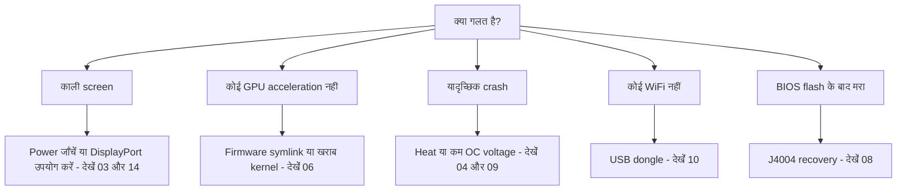

> 🌐 सामुदायिक अनुवाद। अंग्रेज़ी संस्करण ही प्रामाणिक स्रोत है और अधिक नया हो सकता है। कोई त्रुटि मिली? issue खोलें: [English](../en/troubleshooting.md) · https://github.com/lildebil0/awesome-bc250/issues

# Troubleshooting

> **संक्षेप में** — BC-250 के failure modes अच्छी तरह से ज्ञात हैं: अधिकांश **power**, **heat**, **kernel/firmware**, या **एक गलत हुआ flash** हैं। नीचे अपना लक्षण खोजें, fix लगाएँ, और पूरे अध्याय के link का अनुसरण करें। संदेह हो तो, कारण आमतौर पर *एक खराब kernel*, *amdgpu firmware symlink का गायब होना*, या *पर्याप्त cooling न होना* है।

यह पृष्ठ एक लक्षण → कारण → fix index है, समुदाय की बार-बार आने वाली समस्याओं से निकाला गया। यह अध्यायों का स्थान नहीं लेता — यह आपको तेज़ी से सही अध्याय की ओर इशारा करता है।

---

## Boot / display

| लक्षण | संभावित कारण | Fix |
|---------|--------------|-----|
| काली screen / कोई POST नहीं | Power wiring या pinout गलत | 8-pin wiring और pinout फिर से जाँचें; पर्याप्त gauge का असली-तांबे का wire उपयोग करें → [03 — Power](../en/03-power-supply.md) |
| काम करने के बाद काली screen / crashes | **IOMMU अब भी enabled** (इस board पर टूटा हुआ) | BIOS में IOMMU disable करें (elektricM); `iommu=off`/`amd_iommu=off` kernel param ⚠ सत्यापित करें → [06 — Linux](../en/06-linux.md) |
| **installer** / live USB boot करते समय काली screen | Installer के पास कोई BC-250 GPU driver नहीं; KMS विफल होता है | GRUB पर `nomodeset` जोड़ें (Fedora: Troubleshooting → Basic Graphics Mode); **Mesa install होने के बाद इसे हटाएँ** ([elektricM](https://github.com/elektricM/amd-bc250-docs/blob/main/docs/troubleshooting/boot.md)) → [06 — Linux](../en/06-linux.md) |
| **login के बाद** काली screen (GRUB + login screen ठीक थे) | Desktop session, आमतौर पर **Wayland** | login पर X11 चुनें ("GNOME on Xorg"/"Plasma X11"), या `WaylandEnable=false` ([elektricM](https://github.com/elektricM/amd-bc250-docs/blob/main/docs/troubleshooting/display.md)) → [14 — Display](../en/14-display.md) |
| Boot होता है पर कोई GPU acceleration नहीं (सब कुछ CPU पर) | amdgpu firmware symlink गायब, या एक खराब kernel | `navi10_gpu_info.bin` symlink + kernel params लगाएँ; ज्ञात-खराब kernels से बचें (नीचे) → [06 — Linux](../en/06-linux.md) |
| `glxinfo` **llvmpipe** दिखाता है, games 5–10 FPS | Mesa बहुत पुराना, या amdgpu load नहीं हुआ | **Mesa 25.1.3+** install करें, `nomodeset` हटाएँ, `Kernel driver in use: amdgpu` की पुष्टि करें ([elektricM](https://github.com/elektricM/amd-bc250-docs/blob/main/docs/troubleshooting/performance.md)) → [06 — Linux](../en/06-linux.md) |
| काम किया, फिर एक kernel update के बाद टूटा | उस kernel में regression | एक LTS kernel पर roll back करें; **6.14.7**, **6.15.0–6.15.6** और **6.17.8–6.17.10** amdgpu को तोड़ने की रिपोर्ट हैं (CPU fallback / GPU crashes); elektricM **6.18.x LTS या 6.17.11+** की सिफ़ारिश करता है ⚠ सटीक ranges सत्यापित करें → [06 — Linux](../en/06-linux.md) |
| कोई HDMI audio नहीं | Kernel 6.17+ regression | एक LTS kernel उपयोग करें, या audio को USB/DisplayPort पर route करें → [06 — Linux](../en/06-linux.md) |
| केवल एक display output काम करता है | इस board पर driver सीमा | native dual के लिए ज्ञात सीमा; **MST hub 2 screens तक देता है** (DP 1.4 hub) ([elektricM](https://github.com/elektricM/amd-bc250-docs/blob/main/docs/hardware/display.md)) → [14 — Display](../en/14-display.md) |
| कोई display नहीं, कोई POST नहीं, **केवल NVMe install होने पर** | SSD में अब भी **Windows** EFI/recovery partitions हैं | SSD निकालें, दूसरे PC पर सभी partitions मिटाएँ (`wipefs -a`), फिर से install करें ([elektricM](https://github.com/elektricM/amd-bc250-docs/blob/main/docs/troubleshooting/boot.md)) → [06 — Linux](../en/06-linux.md) |
| बिल्कुल POST नहीं करता (कोई BIOS नहीं) | कुछ boards **CMOS battery के बिना** POST नहीं करते | एक नया CR2032 install करें और फिर से कोशिश करें ([elektricM](https://github.com/elektricM/amd-bc250-docs/blob/main/docs/troubleshooting/boot.md)) → [08 — BIOS](../en/08-bios.md) |
| Boot **~90 s रुकता है** फिर जारी रहता है | विफल systemd service / network timeout | `systemctl --failed`; अटकी हुई unit disable करें ([elektricM](https://github.com/elektricM/amd-bc250-docs/blob/main/docs/troubleshooting/boot.md)) → [06 — Linux](../en/06-linux.md) |
| Kernel panic "**unable to mount root**" / "No init found" | गलत kernel **या** corrupted initramfs | एक पुराना/LTS kernel boot करें; अब भी विफल हो तो chroot करें और initramfs फिर से generate करें (`dracut -f` / `update-initramfs -u -k all` / `mkinitcpio -P`) ([elektricM](https://github.com/elektricM/amd-bc250-docs/blob/main/docs/troubleshooting/boot.md)) → [06 — Linux](../en/06-linux.md) |
| `grub>` / `grub rescue>` पर गिरता है | GRUB अपनी config/boot files नहीं ढूँढ पाता | `root`/`prefix` सेट करें, `insmod normal`, boot; फिर GRUB फिर से install करें ([elektricM](https://github.com/elektricM/amd-bc250-docs/blob/main/docs/troubleshooting/boot.md)) → [06 — Linux](../en/06-linux.md) |
| BIOS में नहीं घुस पाता (Del/F2 अनदेखा) | Adapter init में धीमा, या keyboard USB 3.0 पर | Del तुरंत दबाएँ; एक **USB 2.0** port और एक native DP cable आज़माएँ ([elektricM](https://github.com/elektricM/amd-bc250-docs/blob/main/docs/troubleshooting/display.md)) → [08 — BIOS](../en/08-bios.md) |

## Heat / stability

| लक्षण | संभावित कारण | Fix |
|---------|--------------|-----|
| Load के तहत throttle / FPS गिरता है | stock heatsink एक desk पर ठंडा नहीं कर सकता | fins पतले करें + high-static-pressure 120 mm fan/shroud; <80 °C रखें → [04 — Cooling](../en/04-cooling.md) |
| Load के तहत यादृच्छिक crash / reboot | ज़्यादा गर्म (>90 °C) **या** overclock voltage बहुत कम | पहले cooling सुधारें; फिर undervolt voltage बढ़ाएँ — Furmark-stable ≠ game-stable (games को अधिक चाहिए) → [04](../en/04-cooling.md) · [09](../en/09-overclock-undervolt.md) |
| Furmark में स्थिर, games में crash | Voltage Furmark से सेट किया, जो कम दबाव डालता है | OCCT + असली games के साथ test करें; voltage ~50 mV बढ़ाएँ → [09 — Overclock](../en/09-overclock-undervolt.md) |
| दो governors लड़ते हुए | oberon-governor *और* smu_oc/cyan-skillfish एक साथ चल रहे | केवल एक governor चलाएँ; दूसरों को disable करें → [09 — Overclock](../en/09-overclock-undervolt.md) |
| GPU crash होने पर **पूरा system** मर जाता है (केवल app नहीं) | APU: CPU+GPU silicon साझा करते हैं, इसलिए एक GPU reset recover नहीं हो सकता — यह system को नीचे ले जाता है | इस architecture पर अपेक्षित; recovery की उम्मीद के बजाय GPU crashes रोकें (स्थिर voltage + अच्छा cooling + अच्छा kernel) ([elektricM](https://github.com/elektricM/amd-bc250-docs/blob/main/docs/troubleshooting/stability.md)) → [09 — Overclock](../en/09-overclock-undervolt.md) |
| एक governor चलते समय GPU crashes → **काली screen, कभी recover नहीं होती** | Governor reset के दौरान sysfs लिखता रहता है → अटका हुआ reset loop | crash-प्रवण games से पहले, `systemctl stop cyan-skillfish-governor-smu`; बाद में फिर से enable करें ([elektricM](https://github.com/elektricM/amd-bc250-docs/blob/main/docs/troubleshooting/stability.md)) → [09 — Overclock](../en/09-overclock-undervolt.md) |
| **केवल 60–65 °C** पर Freezes / सफ़ेद screen | कुछ boards असामान्य रूप से temperature-sensitive हैं | cooling सुधारें, heatsink फिर से बैठाएँ, repaste करें (PTM7950); silicon भिन्न होता है ([elektricM](https://github.com/elektricM/amd-bc250-docs/blob/main/docs/troubleshooting/stability.md)) → [04 — Cooling](../en/04-cooling.md) |
| GPU **1500 MHz पर अटका**, और नीचे undervolt नहीं होता | min voltage **700 mV से नीचे** सेट — यह एक hard floor है जो GPU को फिर से lock कर देता है | min voltage **≥ 700 mV** रखें ([elektricM](https://github.com/elektricM/amd-bc250-docs/blob/main/docs/troubleshooting/stability.md)) → [09 — Overclock](../en/09-overclock-undervolt.md) |
| Artifacts / crashes जिन्हें अधिक voltage ठीक नहीं करता | Load के तहत **Voltage droop** (प्रभावी V सेट V से नीचे गिरता है) | droop को कवर करने के लिए base ~25 mV अधिक सेट करें, या loadline/droop tweak वाला एक BIOS उपयोग करें ([elektricM](https://github.com/elektricM/amd-bc250-docs/blob/main/docs/troubleshooting/stability.md)) → [09 — Overclock](../en/09-overclock-undervolt.md) |
| Boot होता है फिर **ACPI errors** के साथ crash (काली/हरी screen) | BIOS/ACPI quirk या corruption | CMOS clear करें / BIOS defaults reset करें; `acpi=off noapic` आज़माएँ; बनी रहे तो reflash करें ([elektricM](https://github.com/elektricM/amd-bc250-docs/blob/main/docs/troubleshooting/stability.md)) → [08 — BIOS](../en/08-bios.md) |
| Sleep/suspend = **pseudo-freeze** (काली, अटकी हुई दिखती है) | board के पास कोई उचित GPU sleep states नहीं; SMU Linux suspend support नहीं करता | जगाने के लिए power button दबाएँ (दबाए न रखें); बेहतर, **suspend disable करें** और screen-blanking उपयोग करें। Idle फिर भी ~65–85 W रहता है ([elektricM](https://github.com/elektricM/amd-bc250-docs/blob/main/docs/troubleshooting/stability.md)) → [09 — Overclock](../en/09-overclock-undervolt.md) |

## Performance

| लक्षण | संभावित कारण | Fix |
|---------|--------------|-----|
| FPS अपेक्षा से कम, GPU max नहीं | **CPU-bound** (कई games में Zen 2 सीमा है) | सामान्य; CPU-भारी settings कम करें, इसे स्वीकार करें — GPU overclock करना यहाँ मदद नहीं करेगा → [11 — Gaming](../en/11-gaming.md) |
| केवल 24 CUs सक्रिय, 40 अपेक्षित | stock कम CUs उजागर करता है | 40-CU unlock लगाएँ (`amdgpu.bc250_cc_write_mode=3` + script) → [09 — Overclock](../en/09-overclock-undervolt.md) |
| Steam / FSR / vsync टूटा | "Gamer" distro fork दखल दे रहा | कुछ tuned forks इन्हें तोड़ते हैं; सादा Fedora/Bazzite-bc250 अधिक सुरक्षित है → [06 — Linux](../en/06-linux.md) |
| Load की परवाह किए बिना GPU **1500 MHz पर locked** | कोई user-space governor नहीं (default BIOS-locked है) | frequency scale करने के लिए एक GPU governor install करें (cyan-skillfish-governor-smu) ([elektricM](https://github.com/elektricM/amd-bc250-docs/blob/main/docs/troubleshooting/performance.md)) → [09 — Overclock](../en/09-overclock-undervolt.md) |
| Governor चलता है पर GPU **2000 MHz से ऊपर नहीं जाता** | Kernel में frequency-range patch की कमी (default cap 1000–2000) | एक patched kernel उपयोग करें (Bazzite/CachyOS pre-patched) या `amdgpu-frequency-range.patch` लगाएँ ([elektricM](https://github.com/elektricM/amd-bc250-docs/blob/main/docs/troubleshooting/performance.md)) → [09 — Overclock](../en/09-overclock-undervolt.md) |
| MangoHud **655 %** GPU usage दिखाता है | amdgpu activity metric को `0xFFFF` पर छोड़ता है; MangoHud 65535/100 पढ़ता है | cyan-skillfish-governor-smu (smu branch) चलाएँ — यह `gpu_metrics` patch करता है; कोई MangoHud बदलाव की ज़रूरत नहीं। या स्टैंडअलोन **`install_gpu_usage_fix.sh`** लगाएँ ([Old Lamer — Part XV](https://youtu.be/lSipaWjU6D4)) ([elektricM](https://github.com/elektricM/amd-bc250-docs/blob/main/docs/troubleshooting/performance.md)) → [09 — Overclock](../en/09-overclock-undervolt.md) |
| एक load test में **Headless** "GPU कुछ नहीं करता" | `glmark2 --off-screen` एक display के बिना चुपचाप **llvmpipe** (CPU) पर वापस आ जाता है | `clpeak` / `vkmark` / `llama-bench -ngl 99` के साथ test करें; SCLK और power बढ़ने की पुष्टि करें ([elektricM](https://github.com/elektricM/amd-bc250-docs/blob/main/docs/troubleshooting/performance.md)) → [06 — Linux](../en/06-linux.md) |
| 60+ FPS पर **stutters** / असमान frame times | Frame pacing (X11 compositor, या audio-बंधा pacing) | **gamescope** के माध्यम से चलाएँ (`-W 1920 -H 1080 -f`), या compositor disable करें / Wayland आज़माएँ ([elektricM](https://github.com/elektricM/amd-bc250-docs/blob/main/docs/troubleshooting/performance.md)) → [11 — Gaming](../en/11-gaming.md) |
| Game **OOM crash / artifacts फिर मर जाता है** (RDR2, CoH3) | **512 MB dynamic VRAM + ZRAM** conflict, या बस **RAM खत्म** | BIOS को **fixed VRAM** पर बदलें (जैसे 10 GB RAM / 6 GB VRAM); **या** systemd ZRAM disable करें और **zswap + एक 32 GB Btrfs swapfile** उपयोग करें ([Old Lamer — Part XIV](https://youtu.be/A6juAoY70aU), recipe [06](../en/06-linux.md)/[09](../en/09-overclock-undervolt.md) में) ([elektricM](https://github.com/elektricM/amd-bc250-docs/blob/main/docs/troubleshooting/stability.md)) → [08 — BIOS](../en/08-bios.md) |
| विशिष्ट game (जैसे **RDR2**) CPU/llvmpipe पर render करता है | Game default रूप से गलत graphics adapter पर जाता है | game में adapter को AMD GPU पर सेट करें; RDR2: `-useMaximumSettings` के साथ launch करें ([elektricM](https://github.com/elektricM/amd-bc250-docs/blob/main/docs/troubleshooting/performance.md)) → [11 — Gaming](../en/11-gaming.md) |

## Network

| लक्षण | संभावित कारण | Fix |
|---------|--------------|-----|
| बिल्कुल कोई WiFi नहीं | कोई onboard WiFi नहीं; dongle को एक driver चाहिए | एक ज्ञात-अच्छा dongle उपयोग करें (aic8800d80) + उसका driver build करें → [10 — WiFi/BT](../en/10-wifi-bt.md) |
| WiFi हर कुछ मिनट में drop होता है | Realtek chipset + load के तहत USB power | कुछ RTL882x dongles के साथ ज्ञात; aic8800d80 या एक पुष्ट model पर switch करें → [10 — WiFi/BT](../en/10-wifi-bt.md) |
| Reboot के बाद driver चला गया | raw `make` से build किया, packaged नहीं | repo के RPM/DKMS रास्ते का उपयोग करें ताकि यह kernel updates से बच जाए → [10 — WiFi/BT](../en/10-wifi-bt.md) |
| ISP **Steam को धीमा** कर देता है | Steam CDN traffic पर DPI/throttling | Anti-throttling tools (`zapret`-style) मदद करते हैं — पर **Bazzite का read-only FS उन्हें रोकता है**; एक mutable distro (Fedora/Arch) उपयोग करें। RU-operator विशिष्टताएँ (Yota, zapret+warp) [Russian संस्करण](../ru/06-linux.md) में → [06 — Linux](../en/06-linux.md) |

## Windows

| लक्षण | संभावित कारण | Fix |
|---------|--------------|-----|
| GPU = Code 43 / कोई acceleration नहीं | कोई काम करने वाला Windows GPU driver नहीं (2026 की शुरुआत तक) | अपेक्षित। Linux उपयोग करें। Windows drivers प्रायोगिक WIP हैं → [07 — Windows](../en/07-windows.md) |

## BIOS / brick

> ⚠ **किसी भी flash से पहले [08 — BIOS](../en/08-bios.md) पूरा पढ़ें।** एक खराब flash board को brick करता है और एक CMOS clear 1.0/3.00 mod को recover **नहीं** करता।

| लक्षण | संभावित कारण | Fix |
|---------|--------------|-----|
| एक BIOS flash के बाद मरा/काला | खराब image या गलत settings | External recovery: एक CH341A को **J4004 header** से wire करें (SOIC-8 clip इस board पर काम **नहीं** करता) और एक ज्ञात-अच्छा image reflash करें → [08 — BIOS](../en/08-bios.md) |
| Programmer chip नहीं पढ़ पाता | 5 V data lines / गलत chip targeted | 3.3 V उपयोग करें; 16 MB `BIOS_A1` flash करें, कभी 512 KB SuperIO नहीं → [08 — BIOS](../en/08-bios.md) |
| Settings टिकती नहीं | पुराना mod version | 5.00 mod उपयोग करें जहाँ RAM/GDDR6 timings वास्तव में लागू होती हैं → [08 — BIOS](../en/08-bios.md) |
| **RAM timings/frequency** बदलने के बाद boot नहीं होता | अस्थिर memory settings ने **BIOS को corrupt कर दिया** (P3.00 watchdog; Russian BC-250 chat ने इसकी रिपोर्ट दी) | CMOS clear पर्याप्त नहीं हो सकता — एक ज्ञात-अच्छा image का **hardware reflash** (CH341A / Pi Pico)। RAM tune करने *से पहले* काम करने वाले BIOS का back up लें; एक बार में एक timing tune करें (tREF सबसे अधिक देता है) ([elektricM](https://github.com/elektricM/amd-bc250-docs/blob/main/docs/troubleshooting/stability.md)) → [08 — BIOS](../en/08-bios.md) |
| BIOS settings टिकती नहीं → काली screen / कम RAM | USB flash के बाद CMOS clear नहीं हुआ (2–3 clears की ज़रूरत हो सकती है) | CMOS clear करें, फिर से configure करें, 512 MB अब भी सेट है इसकी पुष्टि के लिए **BIOS में** reboot करें; सत्यापित करें कि `free -h` ~15.5 GB दिखाता है ([elektricM](https://github.com/elektricM/amd-bc250-docs/blob/main/docs/troubleshooting/stability.md)) → [08 — BIOS](../en/08-bios.md) |

---

## अब भी अटके हैं?
- **[FAQ](faq.md)** जाँचें।
- सामुदायिक chat को विषय के अनुसार खोजें (प्रत्येक अध्याय के **Sources** असली चर्चाओं से जुड़ते हैं)।
- मदद माँगते समय, अपना **distro + kernel version**, **clocks/governor**, और **cooling** बताएँ — वे तीन अधिकांश समस्याओं को समझाते हैं।

### ऊपर की पंक्तियों के लिए स्रोत
- elektricM troubleshooting guides — [`boot.md`](https://github.com/elektricM/amd-bc250-docs/blob/main/docs/troubleshooting/boot.md) · [`display.md`](https://github.com/elektricM/amd-bc250-docs/blob/main/docs/troubleshooting/display.md) · [`performance.md`](https://github.com/elektricM/amd-bc250-docs/blob/main/docs/troubleshooting/performance.md) · [`stability.md`](https://github.com/elektricM/amd-bc250-docs/blob/main/docs/troubleshooting/stability.md) · [`hardware/display.md`](https://github.com/elektricM/amd-bc250-docs/blob/main/docs/hardware/display.md)
- Old Lamer (YouTube): [Part XIV — zswap + 32 GB Btrfs swap](https://youtu.be/A6juAoY70aU) · [Part XV — `install_gpu_usage_fix.sh`](https://youtu.be/lSipaWjU6D4)
- [4pda BC-250 thread](https://4pda.to/forum/index.php?showtopic=1104980) — RU ISP Steam-throttling (Yota, zapret+warp)।
- प्रति-अध्याय सामुदायिक-chat citations प्रत्येक जुड़े हुए अध्याय के **Sources** में रहती हैं।
