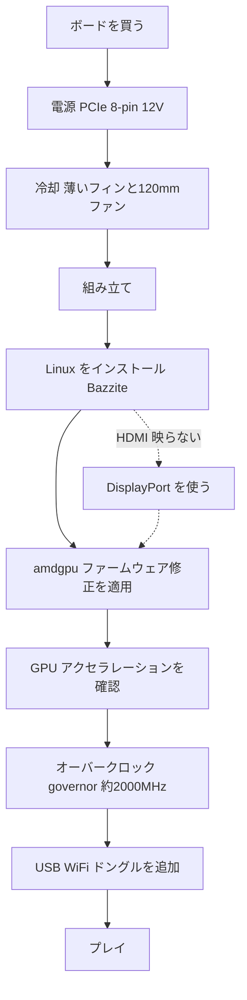

> 🌐 コミュニティ翻訳です。英語版が正となり、より新しい場合があります。誤りを見つけたら issue を立ててください：[English](../en/00-start-here.md) · https://github.com/lildebil0/awesome-bc250/issues

# ここから始める — ゼロからゲーミングまで

> **要点** — あなたは AMD BC-250 を買った（あるいはこれから買おうとしている）。これは PlayStation 5 派生の APU ボードで、16 GB GDDR6 を搭載し、安価な Linux ゲーミング/AI マシンになります — ただし、**電源**・**冷却**・**Linux ドライバー** という 3 つの課題を順番に解決できればの話です。このページは、箱の中のボードからゲームが動くまでの一直線の道筋です。各ステップは完全な章へのリンクになっているので、順に従ってください。

このボードはプラグアンドプレイの PC ではなく、プロジェクトです。週末を一つ確保しましょう。ボードを早死にさせる二大原因は **誤った電源配線** と **高温での運用** なので、まずそこから取り組みます。

---

## 始める前に — パーツと工具

途中で一つひとつ気づくことのないよう、始める *前* に次のものを手元に揃えておきましょう。

- **PSU**（PCIe 8-pin 12 V 出力付き）→ **[03 — 電源](../en/03-power-supply.md)**
- **120 mm の高静圧ファン** + プリントしたシュラウド → **[04 — 冷却](../en/04-cooling.md)** / **[05 — ケース & 3D プリント](../en/05-case.md)**
- **プリントしたケースまたはマウント** → **[05 — ケース & 3D プリント](../en/05-case.md)**
- Linux インストーラー用の **16 GB 以上の USB メモリ**
- **DisplayPort ケーブル**（または DP→HDMI アダプター — ボードの HDMI は何も映らないことが多く、DisplayPort が最も安全です）
- **ドライバー（工具）**
- **マルチメーター** — PSU の配線を磁石/導通テストするため → **[03 — 電源](../en/03-power-supply.md)**

---

## 道筋



### 0. 自分が手にしているものを知る
BC-250 はサーバー/マイニング用ブレードです。1 個の APU（Zen 2 CPU + RDNA2 級 GPU、「Cyan Skillfish/Oberon」）、16 GB GDDR6、**パッシブヒートシンク** を備え、1 本の **12 V PCIe 8-pin** で給電されます。オンボード WiFi なし、動作する Windows GPU ドライバーなし、ハードウェアビデオエンコードなし。→ **[01 — BC-250 とは何か](../en/01-what-is-bc250.md)**

### 1. 正しいものを買う
適正価格、箱に入っているもの（ボードのみ？ ヒートシンクは？ PSU は？）、避けるべき出品者/詐欺を把握しましょう。→ **[02 — 購入ガイド](../en/02-buying.md)**

### 2. *初回起動の前* に電源を解決する
ボードは 12 V の PCIe 8-pin 経由で約 235 W（オーバークロック時はそれ以上）を要求します。本物の PSU（サーバー Flex / Mean Well のブリック / ATX）を使い、**十分な太さの純銅ワイヤー** で 8-pin を正しく配線し、ピン配置を推測で済ませないこと — ここでのミスはボードの死を意味します。→ **[03 — 電源](../en/03-power-supply.md)**

### 3. *負荷をかける前* に冷却を直す
標準ヒートシンクはラックの風洞向けに作られており、**机の上ではサーマルスロットリングします**。フィンを薄くし、プリントしたシュラウド越しに高静圧の 120 mm ファンをボルト留めしましょう（または AIO にする）。目標: Furmark で約 80 °C 未満を維持。→ **[04 — 冷却](../en/04-cooling.md)**

### 4. ケースに入れる（任意だが望ましい）
ボード、ファン、PSU を実際のエアフローとともにマウントできる、コンソール風のケースをプリントしましょう。コミュニティ製 STL のカタログがあります。→ **[05 — ケース & 3D プリント](../en/05-case.md)**

### 5. 組み立てる
最小構成の物理的な作業順序: ファンをプリントしたシュラウドに取り付ける → シュラウドを（薄くした）ヒートシンクのフィンの上にクリップ/ネジ留めする → ボードをケース/マウントに据える → PSU の 8-pin をボードに接続する（正しいピン配置、**[03 — 電源](../en/03-power-supply.md)**）→ DisplayPort ケーブルをモニターに接続する → 電源を入れて **POST** することを確認する（POST = power-on self-test。電源が入って映像を出力する — 画面が表示される / ファンが回る）。フィンのやすりがけはマウントの *前* に行い（**[04 — 冷却](../en/04-cooling.md)** を参照）、金属の粉をボードに付着させないこと。

> この組み立てのラベル付き写真/図は歓迎する貢献です — リポジトリにはまだありません。

### 6. Linux + GPU ドライバーをインストールする
これが成否を分けるステップです。初心者に最も簡単なのは、BC-250 向けにビルドされた **Bazzite ベースのイメージ**（または **Fedora 43** — elektricM のもう一つの「そのまま動く」選択肢。Fedora 42 は EOL）です。次に **amdgpu ファームウェア修正**（`navi10_gpu_info.bin` のシンボリックリンク）とカーネルパラメータを適用し、initramfs/grub を再生成して、GPU がアクセラレーションされていることを確認します（`vainfo`、`dmesg`）。→ **[06 — Linux ドライバー & セットアップ](../en/06-linux.md)**

> **省略すると何時間も苦しむことになる 2 つの設定**（elektricM）: 改造 BIOS で **VRAM = 512 MB ダイナミック** に設定し、**IOMMU を無効化**（壊れた IOMMU はディスプレイ障害やクラッシュを引き起こします）、その後フラッシュ後に **CMOS をクリア** します。`nomodeset` ブートパラメータを付けてインストールし、**ドライバーが入ったら外します**。Mesa **25.1+** が下限です（25.3.x 推奨）。そして **カーネル 6.15.0–6.15.6 と 6.17.8–6.17.10 は避けること** — GPU ドライバーが壊れます。代わりに 6.18 LTS / 6.17.11+ / 6.12–6.14 LTS を使ってください。（[elektricM クイックスタート](https://elektricm.github.io/amd-bc250-docs/getting-started/quick-start/)、[クイックリファレンス](https://elektricm.github.io/amd-bc250-docs/reference/quick-reference/)）

> Windows を考えている？ 2026 年初頭時点で **動作する Windows GPU ドライバーは存在しません** — 実験段階です。Linux を使いましょう。→ **[07 — Windows](../en/07-windows.md)**

### 7. 定格で動くことを確認してからオーバークロックする
デスクトップがアクセラレーションされたら、**oberon-governor** をインストールしてクロックを引き上げます（定格の 1500 MHz は非力。**2000 MHz ≈ +30 % FPS**）。任意で全 **40 CU** を解放し、アンダーボルトします。新しいクロックで温度を再テストしましょう。→ **[09 — オーバークロック & アンダーボルト](../en/09-overclock-undervolt.md)**

### 8. オンラインにする
オンボード WiFi はありません — **実績のある USB ドングル**（aic8800d80 がコミュニティの定番）とそのドライバーを追加しましょう。→ **[10 — WiFi & Bluetooth](../en/10-wifi-bt.md)**

### 9. プレイする
現実的な期待値を設定し（GPU ではなく Zen 2 CPU がしばしば制約になります）、FSR をオンにして、コミュニティのゲームごとの設定を使いましょう。→ **[11 — ゲーミングの結果 & 設定](../en/11-gaming.md)**

### ボーナス — ローカル LLM を動かす
16 GB の VRAM はこの価格帯では大容量です。llama.cpp を **Vulkan** バックエンドで動かしましょう（ROCm はこの GPU では行き止まりです）。→ **[12 — AI / LLM](../en/12-ai-llm.md)**

### ボーナス — エミュレーション
Switch、PS3、PS4、レトロ、アーケード — 実際に動くものと、その方法 → **[15 — エミュレーション](../en/15-emulation.md)**

> 初回起動で画面が出ない？ ボードは **DisplayPort** で出力します（HDMI は何も映らないことが多い）→ **[14 — ディスプレイ & 出力](../en/14-display.md)**。USB ポートが足りない、あるいはドライブを追加する？ → **[16 — USB、ハブ & ストレージ](../en/16-usb-peripherals.md)**

---

## 何かが壊れたら
ブラックスクリーン、アクセラレーションなし、ランダムなリセット、ドングルの切断、BIOS フラッシュ後の文鎮化 — **[トラブルシューティング](troubleshooting.md)** と **[FAQ](faq.md)** を参照してください。

> 改造 BIOS のフラッシュは **最初のステップではありません**。ボードを文鎮化させる可能性があり、復旧用ハードウェアが必要です。意図的に行う場合のみ進めてください。→ **[08 — BIOS & 文鎮復旧](../en/08-bios.md)**

---

## 60 秒チェックリスト

| ステップ | 完了の条件 |
|------|-----------|
| 電源 | PSU を 8-pin に配線、正しいピン配置、純銅ワイヤー、ボードが POST する |
| 冷却 | フィンを薄くした + 120 mm ファン/シュラウド。Furmark で 80 °C 未満 |
| OS | Bazzite-bc250 をインストール、デスクトップまで起動する |
| GPU | `vainfo`/`dmesg` で amdgpu がアクティブ、CPU フォールバックでないことを表示 |
| オーバークロック | oberon-governor 稼働、約 2000 MHz、実ゲームで安定 |
| ネットワーク | USB ドングルが接続し、維持される |
| ゲーム | あなたのクロックに見合った FPS で動く |

すべての行にチェックが付いたら完了です。BC-250 クラブへようこそ。

---

## クイックリファレンス（チートシート）

最もよく使うコマンドと設定を、elektricM の [クイックリファレンス](https://elektricm.github.io/amd-bc250-docs/reference/quick-reference/) から凝縮しました。詳細は **[06 — Linux](../en/06-linux.md)** と **[09 — オーバークロック](../en/09-overclock-undervolt.md)** にあります。

**BIOS:** VRAM `512MB` ダイナミック · IOMMU **Disabled** · UEFI ブート · USB フラッシュのたびに CMOS をクリア。

**GPU がアクセラレーションされていることを確認する（llvmpipe/CPU でないこと）:**
```bash
glxinfo | grep "OpenGL version"          # Mesa 25.1+ expected
vulkaninfo | grep deviceName             # → AMD Radeon Graphics (RADV GFX1013)
cat /sys/class/drm/card0/device/pp_dpm_sclk   # multiple freqs, current marked *
```

**Governor**（これがないとクロックは 1500 MHz に張り付きます）。本書のデフォルトは `oberon-governor`。elektricM は COPR 経由でより新しい SMU フォークを配布しています — どちらでも動きます:
```bash
sudo dnf copr enable filippor/bazzite
sudo dnf install cyan-skillfish-governor-smu          # rpm-ostree install … on Bazzite
sudo systemctl enable --now cyan-skillfish-governor-smu.service
systemctl status cyan-skillfish-governor-smu          # → active (running)
```
> 電圧の下限は **700 mV** — これを下回ると GPU は 1500 MHz にロックされます。governor は誤ったカード（card0 と card1）を対象にすることがあります — スケーリングが効かない場合は確認してください。

**ドライバーが入ったら `nomodeset` を外す:**
```bash
# GRUB distros: drop "nomodeset" from /etc/default/grub, then
sudo grub2-mkconfig -o /boot/grub2/grub.cfg && sudo reboot
# Bazzite / Fedora Atomic:
rpm-ostree kargs --delete-if-present="nomodeset" && systemctl reboot
```

一部のゲームでグラフィックの不具合を直す **Steam 起動オプション**: `RADV_DEBUG=nohiz %command%`。

**RDR2 / Company of Heroes 3 でクラッシュする？** VRAM を `512MB` ダイナミックから **10GB/6GB 固定** に切り替えます（ZRAM の競合）。（[elektricM クイックリファレンス](https://elektricm.github.io/amd-bc250-docs/reference/quick-reference/)）
