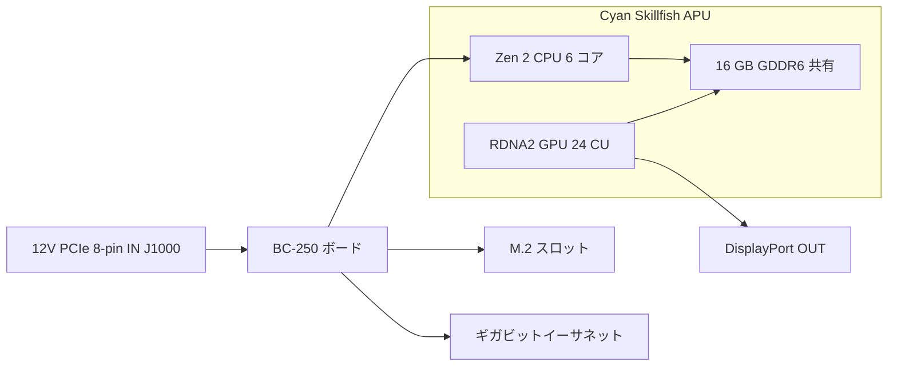

> 🌐 コミュニティ翻訳です。英語版が正となり、より新しい場合があります。誤りを見つけたら issue を立ててください：[English](../en/01-what-is-bc250.md) · https://github.com/lildebil0/awesome-bc250/issues

# BC-250 とは何か

> **要点** — BC-250 は **サーバー/マイニング向けボードに載った PlayStation 5 クラスの APU** です。1 つのチップ（AMD コードネーム **Cyan Skillfish**、PS5 の **Oberon/Ariel** シリコンを縮小したもの）が、**6 コア / 12 スレッドの Zen 2 CPU** と **24 コンピュートユニットの RDNA 2 GPU** を搭載し、**16 GB のはんだ付け GDDR6** がこれらを支えます。これは **グラフィックスカードでも普通の PC でもありません** — **見慣れた x86 BIOS も、PCIe スロットも、24 ピン ATX プラグもありません**。**8 ピン PCIe 電源コネクタへ 12 V を直接**受け取り、独自のファームウェアで起動します。人々がこれを買うのは、**激安の Linux ゲーミング / ローカル AI ボックス**だからです。人々がこれに激怒するのは、**ドライバー、冷却、そしてハードウェアビデオエンコードの欠如**によって、プラグアンドプレイのマシンではなくプロジェクトになってしまうからです。手間ゼロを望むなら、このボードは間違った買い物です — 今すぐ返品してください。いじるのが好きなら、読み進めてください。

このページは「自分が実際に何を買ったのか」のリファレンスです。電源、冷却、OS インストールとドライバーはそれぞれ独自のセクションで扱います（[03](../en/03-power-supply.md) / [04](../en/04-cooling.md) / [06](../en/06-linux.md)）。

---

## 実際にこれは何なのか

AMD は BC-250 を **暗号通貨マイニングアクセラレータ**として作りました（「BC」は blockchain の略です）。安くするために、AMD は **余った PlayStation 5 プロセッサシリコン**を再利用しました — ソニーがコンソールに載せているのと同じファミリーのチップです。ボードは 1 つの APU にメモリと電源回路を加えたもので、それが製品全体です。

専門用語、一度だけ定義します：

- **APU**（Accelerated Processing Unit）— **CPU と GPU の両方**を含む単一チップに対する AMD の呼称です。独立したグラフィックスカードはなく、GPU は同じパッケージ内にあり、同じメモリを共有します。
- **Cyan Skillfish** — この APU に対する AMD のエンジニアリング**コードネーム**です。Linux のあらゆる場所で目にします。GPU ファームウェアファイルは文字通り `cyan_skillfish_gpu_info.bin` です（[src](https://t.me/c/2424231195/57962) — シンボリックリンクの修正は [src](https://t.me/c/2424231195/41252) を参照）。ツールによっては PS5 ダイ名の **Oberon** / **Ariel** として報告することもあります。
- **GDDR6** — 通常はビデオカードに搭載される高速グラフィックスメモリです。BC-250 ではこれが **システム RAM とビデオ RAM を同時に**兼ねます（CPU と GPU が 1 つのプールを共有します）。DIMM スロットはなく、16 GB ははんだ付けされていてアップグレードできません。
- **RDNA 2** — GPU アーキテクチャの世代です（PS5、Xbox Series、Radeon RX 6000 カードと同じファミリー）。

このチップは PS5 パーツを **縮小した**ものであり、フル版ではありません。コミュニティはこの比較を固定表示しています（[src](https://t.me/c/2424231195/11282)、引用元は [TechPowerUp の Oberon エントリ](https://www.techpowerup.com/gpu-specs/amd-oberon.g936)）：

| | BC-250 | フル PS5（Oberon） |
|---|---|---|
| CPU コア / スレッド | **6 / 12** | 8 / 16 |
| GPU コンピュートユニット（CU） | **24** | 36 |

「コンピュートユニット」は 1 つの GPU コアブロックです。24 個はおおよそミドルレンジのラップトップ GPU の領域で、これはまさにチャットがゲームで報告するパフォーマンス帯です。

BC-250 は AMD 唯一の「デスクトップボードに載った余りもののコンソールシリコン」ではありません。同じアイデアから作られた近い従兄弟が 2 つあります。**AMD 4700S Desktop Kit**（**PlayStation 5** 由来の CPU キット）— チャットはこれがマーケットプレイスで BC-250 と相互掲載されると警告しています（[02-buying.md](../en/02-buying.md)）— と、**AMD 4800S Desktop Kit**、**Xbox Series X** 由来のバージョン（GDDR6 に配線された 8 つの Zen 2 コア、コンソールの RDNA 2 GPU は無効化されている）です。どちらも本物の AMD 製品で、BC-250 と同様にサルベージされたコンソール CPU とはんだ付け GDDR6 を組み合わせています（[VideoCardz](https://videocardz.com/newz/amd-4800s-desktop-kit-a-pc-repurposed-apu-from-xbox-series-x-has-been-tested)）。ショッピングの際に BC-250 を兄弟機と見分けるのに役立つ背景知識です。

人々は **PS5 自体がジェイルブレイクされたのと同じやり方で BC-250 上でデスクトップ Linux を動かして**きました — フル 4K HDMI ビデオ + オーディオ、すべての USB ポートが動作し、APU は CPU が最大 ~3.2 GHz、GPU が ~2.0 GHz までクロックアップします（[src](https://t.me/c/2424231195/122260)）。

---

## 得意なこと

- **このパフォーマンス帯における Linux ゲーミングへの最も安価な入り口。** Steam/Proton（Linux 上で Windows ゲームを動かす互換レイヤー）を通じて、人々は Star Citizen をプレイし（[src](https://t.me/c/2424231195/38702)）、さらには *Doom: The Dark Ages* のような最新タイトルも、コミュニティの Vulkan ラッパー経由で low/FSR にて ~60 FPS でプレイしています（[src](https://t.me/c/2424231195/127696)）。ゲームごとの結果は [11-gaming.md](../en/11-gaming.md) にあります。
- **有能なローカル AI ボックス。** 16 GB の GDDR6 により、中規模の言語モデルを保持できます。メンバーは **Vulkan** バックエンドで `llama.cpp`/`jan` を通じてローカルに LLM を動かしています。BIOS で GPU に 12 GB を先に割り当てるよう設定します（[src](https://t.me/c/2424231195/92421)）。[12-ai-llm.md](../en/12-ai-llm.md) を参照してください。
- **小型で自己完結。** GPU 風のヒートシンクが組み込まれた 1 枚の長いボードです — 小さな DIY/3D プリントケースに収まり、1 つの小型電源で動作します（[build src](https://t.me/c/2424231195/137825)）。

*なぜ*そもそも動くのかについてのコミュニティの総意：チップが Steam Deck / PS5 ハードウェアに非常に近いため、Valve とオープンソースの Mesa グラフィックススタックがまったく同じドライバーを改善し続けており、BC-250 はタダで便乗できるのです（[src](https://t.me/c/2424231195/93006)）。

---

## つらいこと（期待値を設定する）

ここは初心者が過小評価する半分です。どれも致命的ではありませんが、すべてが現実の作業です。

- **ドライバーは自分でやる仕事です。** AMD はこのボード向けに **公式ドライバーも公開ドキュメントも提供していません**（[src](https://t.me/c/2424231195/37764)）。すべて — Linux グラフィックススタック、クロック/電圧の「ガバナー」、BIOS — はコミュニティ製です。セットアップスクリプトに従い、ときには手作業で修正することを覚悟してください。[06-linux.md](../en/06-linux.md) から始めましょう。
- **冷却は人々が最も間違える第 1 位の項目です。** 純正ヒートシンクはマイニングラックの強制空冷トンネル向けに設計されているため、デスク上では箱出し状態でオーバーヒートしてスロットリングします。冷却を改造する必要があります。これには独自のセクションがあります — パフォーマンスを追い求める**前に** [04-cooling.md](../en/04-cooling.md) を読んでください。
- **ハードウェアビデオエンコーダーなし。** GPU のビデオエンコードブロック（AMD が **VCN** と呼ぶもの — ストリーミング/録画向けにビデオを圧縮する専用回路）は **利用できません**。画面録画とゲームストリーミングは **ソフトウェアエンコーダー**にフォールバックし、CPU を消費します。動作はします（人々は Sunshine/Moonlight 経由でストリーミングしています）が、普通の GPU より遅く低品質です（[src](https://t.me/c/2424231195/88026)）。同様に、初期の Mesa ドライバーは、コミュニティがハードウェアアクセラレーションを動かすまで、有名なことに **ソフトウェアレンダリング**でした（[src](https://t.me/c/2424231195/11243)）。
- **変わった電源、デフォルトでは映像なし。** 標準の 24 ピン ATX コネクタは受け付けません — 次のセクションを参照してください。多くのボードは POST すらさせるのに **BIOS リセット**を必要とする状態で届き（[src](https://t.me/c/2424231195/57930)）、通常は **DisplayPort** で映像を出力します（HDMI には DP→HDMI アダプタが必要で、これはオーディオも問題なく伝送します — [src](https://t.me/c/2424231195/9148)）。
- **これはいじり屋のボードです、以上。** ある古参メンバーが言ったように、安いにもかかわらず BC-250 は「一定のスキル、努力、そして頭脳を要求する」のです（[src](https://t.me/c/2424231195/73002)）。お金だけでなく時間も予算に入れてください。
- ⚠ **eGPU では救えません — コミュニティ報告（r/BC250Gaming）。** 単一の M.2 スロットは **PCIe 2.0 ×2** にすぎず（下のハードウェアカードを参照）、その帯域では M.2 にぶら下げた外部 GPU は **オンボードの RDNA 2 GPU よりも*遅い*パフォーマンスになると報告されています** — 遅いリンクがそれを締め付けるのです。より多くのグラフィックスパワーが欲しいなら、総意としてこれはそのためのボードではありません。*（コミュニティ報告。ベンチマークではなく注意として扱ってください。）*

> ⚠ **二色 LED の意味 — コミュニティ報告（r/BC250Gaming）。** NIC の隣にある 2 色 LED は **マイニング時代の使用率インジケータであり、エラーランプではありません**。コミュニティの説明によれば **赤 = GPU/RAM が 100% 使用率に*ない*、緑 = フル使用率**です。したがってアイドル状態のデスクトップボードでの赤ランプは正常であり、故障ではありません。*（コミュニティ報告。AMD はこのボード向けにドキュメントを提供していないため、正確な色の対応は未確認として扱ってください。）*

> ⚠ **取り扱い警告、痛い目を見て学んだこと。** 通電中のボードに金属製のものを触れさせ**ない**でください。サーマルペーストの交換は必ず慎重に行ってください — あるメンバーはショートさせて自分の BC-250 を永久に壊しました（[src](https://t.me/c/2424231195/95998)）。ボードはまたヒートシンクの取り付けによってわずかに**反って**出荷されます。あるメンバーは、紙でボードをヒートシンクに平らに押し付けてシムすることで起動しない問題を直しました（[src](https://t.me/c/2424231195/117347)）。

---

## ハードウェアリファレンスカード

スペックはコミュニティのハードウェアリバースエンジニアリングと相互チェックされています（AMD はデータシートを公開していません）。メモリバスと物理寸法の数値は、以前は未確認でしたが、現在は [elektricM ハードウェア仕様](https://github.com/elektricm/elektricm)（リバースエンジニアリングについて mothenjoyer69 / Segfault / neggles / yeyus をクレジット）を出典としています。下記のピン配置と電源の数値は、正典であるコミュニティのハードウェアドキュメントから来ています。

ボードの概観 — 電源入力が左、APU とその共有メモリが中央、I/O が右：



### コアスペック

| スペック | 値 | 出典 |
|------|-------|--------|
| クラス | マイニング/サーバーボードに載った PlayStation 5 由来の APU | [hardware.md](https://github.com/mothenjoyer69/bc250-documentation/blob/main/hardware.md) |
| APU コードネーム | **Cyan Skillfish**（PS5 ダイ：Oberon / Ariel） | chat（[src](https://t.me/c/2424231195/57962)） |
| CPU | **6 コア / 12 スレッド、Zen 2**（6 コア確認済み） | [hardware.md](https://github.com/mothenjoyer69/bc250-documentation) · chat（[src](https://t.me/c/2424231195/11282)） |
| CPU クロック | 最大 **~3.49 GHz**（「くらい」） | [hardware.md](https://github.com/mothenjoyer69/bc250-documentation) · chat（[src](https://t.me/c/2424231195/122260)） |
| GPU | **24 コンピュートユニット、RDNA 2**（`gfx1013`；PS5 SoC は 36）；ラスタライズ性能 ≈ **RX 6600 と RX 6600 XT の間** / GTX 1660 Ti クラス；**Vulkan 1.4** | [hardware.md](https://github.com/mothenjoyer69/bc250-documentation) · chat（[src](https://t.me/c/2424231195/11282)） · [elektricM](https://github.com/elektricm/elektricm) |
| GPU クロック | 純正 ~1500 MHz、オーバークロック ~2000 MHz（最大 ≈2.23 GHz） | （[src](https://t.me/c/2424231195/122260)） · [09](../en/09-overclock-undervolt.md) |
| メモリ | **16 GB GDDR6**、CPU と GPU で共有、はんだ付け（アップグレード不可） | [hardware.md](https://github.com/mothenjoyer69/bc250-documentation) · [README](../../README.md) |
| GPU VRAM 割り当て | BIOS で設定；BIOS 3.00+ で **12 GB** 選択可能 | （[src](https://t.me/c/2424231195/92421)） |
| メモリバス / 帯域幅 | **256 ビット** GDDR6 @ **14 Gbps**、**~448 GB/s** | [elektricM ハードウェア仕様](https://github.com/elektricm/elektricm) |
| TDP | **220 W**（ボードの熱設計電力） | [hardware.md](https://github.com/mothenjoyer69/bc250-documentation) |
| 消費電力 | マイニングクラスの負荷下で標準 ~67–85 W | [hashrate.no](https://www.hashrate.no/gpus/bc250) |
| ハードウェアビデオエンコード（VCN） | **なし** — ソフトウェアエンコードのみ | （[src](https://t.me/c/2424231195/88026)） |
| ビデオ出力 | **DisplayPort 1.4**（最大 **4K@120 / 8K@60**）；HDMI には DP→HDMI アダプタを使用；オーディオを伝送 | （[src](https://t.me/c/2424231195/9148)） · [elektricM](https://github.com/elektricm/elektricm) |
| ストレージ（M.2） | 1x M.2 2280 — **PCIe 2.0 x2 または SATA III** | [elektricM](https://github.com/elektricm/elektricm) |
| 2 つ目の DisplayPort | 存在するが **未実装**；ソフトウェアで有効化可能 | （[src](https://t.me/c/2424231195/88026)） |
| 物理サイズ | 全長 **340 mm / 310 mm**（測定方法による）、幅 **~115 mm**、ヒートシンク込みで **~400 g**；カスタムの非標準マイニングフォームファクタ | [elektricM ハードウェア仕様](https://github.com/elektricm/elektricm) |

> ⚠ **GDDR6 オーバークロック = 帯域幅であって FPS ではない — コミュニティ報告（r/BC250Gaming）。** コミュニティの説明によれば、GDDR6 をオーバークロックするとメモリ帯域幅がおおよそ **~256 GB/s から ~445 GB/s** に上がりますが、**ゲーミングの向上はもたらしません** — メモリ帯域幅ではなく GPU の 24 CU がボトルネックなので、余分な帯域幅はゲームで使われずに終わります。（上記のリポジトリ検証済みの*純正*数値はすでに 256 ビット / 14 Gbps で **~448 GB/s** であり、コミュニティの「~256 GB/s ベースライン」はスペックシートと一致しないことに注意してください — 正確な GB/s の数値は未確認として扱い、FPS が向上しないという要点が確かな部分です。）GPU/メモリのオーバークロック全般については [09-overclock-undervolt.md](../en/09-overclock-undervolt.md) を参照してください。

> **ボード寸法について：** [elektricM ハードウェア仕様](https://github.com/elektricm/elektricm) は全長 **340 mm / 310 mm**（2 つの数値は異なる測定方法を反映）、幅 **~115 mm**、ヒートシンク込みで **~400 g** を、カスタムの非標準マイニングフォームファクタについて示しています。正典である `hardware.md` 自体は寸法を記載していません。チャットで最も反応の多かった単一のハードウェア投稿は文字通り *"Размеры amd bc-250"*（「AMD BC-250 の寸法」、❤20 — [src](https://t.me/c/2424231195/379)）というタイトルで、ケース製作のために人々がこれを気にかけていることを裏付けています。正確なケースフィッティングのためには、測定された 3D モデルから作業してください — コミュニティがカタログ化したボード STL（例：`BC250 Board.stl`、[Printables 1103626](https://www.printables.com/model/1103626-amd-bc250-board) と [Printables 1341336](https://www.printables.com/model/1341336-accurate-3d-model-of-the-amd-bc-250-board) の正確なモデル）は寸法的に正確です。[05-case.md](../en/05-case.md) を参照してください。

<p align="center">
  <br>
  <sub>写真：AMD BC-250 コミュニティ · <a href="https://t.me/c/2424231195/379">source</a></sub>
</p>

### 電源コネクタのピン配置（何かを差し込む前にこれを読んでください）

BC-250 には **24 ピン ATX ヘッダーはありません**。**12 V のみ**で給電され、**8 ピン PCIe 電源コネクタ（J1000）**を通じて供給されます — グラフィックスカードと同じ物理プラグですが、ボードは 3 つの電源接点すべてが 12 V から給電されることを期待します。完全な配線と電源の選択は [03-power-supply.md](../en/03-power-supply.md) にあります。正典のピン配置は [hardware.md](https://github.com/mothenjoyer69/bc250-documentation/blob/main/hardware.md) から：

**J1000 — メイン 8 ピン PCIe 電源（接続するのはこれです）：**

```
[ GND  GND  GND  GND ]
[ GND  12V  12V  12V ]
```

- 3 つの 12 V 接点。ドキュメントは Mini-Fit Jr 接点を **各 9 A まで**と評価しており、このコネクタは「最大 **324 W** まで安全に供給できる」とし、スタンドアロン使用には **16 AWG** ワイヤを推奨しています（[hardware.md](https://github.com/mothenjoyer69/bc250-documentation)）。
- **GND = グランド（0 V）、12V = +12 ボルト。** 極性を正しくしてください — このボードに逆電圧への寛容さはありません。

**J2000 / J2001 — ラック電源コネクタ（デスクでは通常使いません）：**

```
        J2000                  J2001
 [ LED1  12V  12V  12V ]   [ 12V  12V  12V  PGD ]
 [ LED2  GND  GND  GND ]   [ GND  GND  GND  GND ]
```

- これらは **Molex Micro-Fit BMI** コネクタ（[part 444280801](https://www.molex.com/en-us/products/part-detail/444280801)）であり、PCIe/EPS プラグ*ではありません* — 元のマイニングシャーシ内でボードに給電していました。**J2000 と J2001 は同一ではありません：** 上のピン配置が示すように、J2000 は **LED1/LED2** ピンを持ち、J2001 は **PGD** ピンを持つため、2 つのコネクタは異なります（[elektricM / mothenjoyer69 ハードウェアドキュメント](https://github.com/mothenjoyer69/bc250-documentation)）。
- **PGD**（J2001 上）は power-good/センスピンです：**ボードがラックの PSU2 に装着されていると 5 V を見ます**。スタンドアロンビルドでは通常代わりに J1000 経由で給電し、J2000/J2001 は無視できます — ただし、お使いの特定の電源アダプタについては [03-power-supply.md](../en/03-power-supply.md) と照合して確認してください。

---

## 次にどこへ行くか

1. **[02-buying.md](../en/02-buying.md)** — まだ買っていない場合、または公正な価格と本当のリスクを知りたい場合。
2. **[03-power-supply.md](../en/03-power-supply.md)** — 実際にどう給電するか（8 ピンへ 12 V）。
3. **[04-cooling.md](../en/04-cooling.md)** — ボードが手元に来たら、他の何よりも**先に**これをやってください。
4. **[06-linux.md](../en/06-linux.md)** — OS とコミュニティドライバーをそこに入れます。

---

## 出典

- 正典のハードウェアドキュメント & ピン配置 — [mothenjoyer69/bc250-documentation `hardware.md`](https://github.com/mothenjoyer69/bc250-documentation/blob/main/hardware.md)
- メモリバス/帯域幅、物理寸法、GPU 位置づけ、DP 1.4、M.2 — [elektricM ハードウェア仕様](https://github.com/elektricm/elektricm)（リバースエンジニアリングについて mothenjoyer69 / Segfault / neggles / yeyus をクレジット）
- 縮小版 vs フル PS5 シリコン（6/12 + 24 CU vs 8/16 + 36 CU） — https://t.me/c/2424231195/11282 · [TechPowerUp Oberon](https://www.techpowerup.com/gpu-specs/amd-oberon.g936)
- PS5 ハードウェア上の Linux、4K HDMI、クロック — https://t.me/c/2424231195/122260
- 公式ドライバーなし / ドキュメントなし — https://t.me/c/2424231195/37764
- ソフトウェアレンダリング / ハードウェアエンコードなし — https://t.me/c/2424231195/11243 · https://t.me/c/2424231195/88026
- DisplayPort + DP→HDMI オーディオ — https://t.me/c/2424231195/9148
- Cyan Skillfish ファームウェア名 — https://t.me/c/2424231195/57962 · https://t.me/c/2424231195/41252
- ローカル LLM + BIOS 3.00 経由の 12 GB VRAM — https://t.me/c/2424231195/92421
- 「スキル、努力、頭脳を要求する」 — https://t.me/c/2424231195/73002
- 取り扱い/ショート警告 — https://t.me/c/2424231195/95998 · 反ったボードの修正 — https://t.me/c/2424231195/117347
- 「BC-250 の寸法」（最も反応の多かったハードウェア投稿） — https://t.me/c/2424231195/379
- 220 W TDP、6 コア/3.49 GHz CPU、24 CU GPU、16 GB GDDR6（リポジトリ確認） — [mothenjoyer69/bc250-documentation README](https://github.com/mothenjoyer69/bc250-documentation)
- マイニングクラスの消費電力数値 — https://www.hashrate.no/gpus/bc250
- なぜ動き続けるのか（共有された Steam Deck/PS5 ドライバーの取り組み） — https://t.me/c/2424231195/93006
- 兄弟キット — AMD 4700S（PS5 CPU キット、BC-250 と相互掲載、[02-buying.md](../en/02-buying.md)）と AMD 4800S（Xbox Series X CPU + GDDR6、GPU 無効化） — [VideoCardz: 4800S Desktop Kit](https://videocardz.com/newz/amd-4800s-desktop-kit-a-pc-repurposed-apu-from-xbox-series-x-has-been-tested)
- M.2 経由の eGPU がオンボード GPU より遅い（M.2 は PCIe 2.0 ×2）、二色 NIC LED = 使用率シグナル（赤 = 100% 使用率でない、緑 = フル使用率）、GDDR6 オーバークロックは帯域幅を上げる（~256→~445 GB/s）がゲーミングの向上なし — コミュニティ報告（r/BC250Gaming）

> AMD はこのボード向けの一次データシートを公開していません。上記の数値はコミュニティによる最善のリバースエンジニアリング（正典の `hardware.md` と elektricM ハードウェア仕様）です。修正は PR で歓迎します（[CONTRIBUTING.md](../../CONTRIBUTING.md) を参照）。
