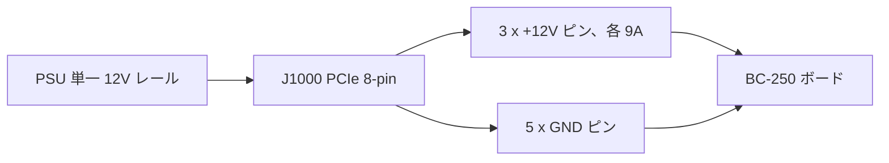

> 🌐 コミュニティ翻訳です。英語版が正となり、より新しい場合があります。誤りを見つけたら issue を立ててください：[English](../en/03-power-supply.md) · https://github.com/lildebil0/awesome-bc250/issues

# 電源

> **要点** — BC-250 には**電源ボタンも標準的な PC 用電源プラグもありません**。**PCIe 8-pin（6+2）**コネクター 1 つを通して **12 V** を取り込み（デスクトップのグラフィックスカードが使うのと同じプラグです）、ピーク時で**約 235 W** に達します（オーバークロックすればさらに増えます）。**1 つのレールで約 250〜300 W** を供給できる 12 V 電源が必要です。コミュニティが採る道は 3 つあります。安価な**サーバー用「Flex」PSU**（HP 500 W、eBay で約 $12）、**産業用ブリック**（Mean Well LOP-300/LOP-500）、または**通常の ATX PSU**（その PCIe ケーブルを挿すだけ）です。避けるべき 2 大要因は、**12 V を弱いレールに分割してしまう古い PSU** と、過熱して発火する**偽の銅クラッド鋼ワイヤー**です。本物の銅、**16 AWG 以上の太さ**を使ってください。

ボードへの給電は、**新参者が正しくやらなければならない 2 番目のこと**であり（[冷却](../en/04-cooling.md)に次いで）、配線で手を抜くと最も火災を起こしやすいものでもあります。

---

## ボードが実際に必要とするもの

BC-250 はクリプトマイニング/サーバーボード上に載った、機能を削減した PlayStation 5 のダイです。ラックに収めて 12 V を供給される前提で作られていたため、**通常の PC の便利機能を一切備えていません**。

- **ATX 24-pin** マザーボードコネクターが**ない**。
- **電源ボタンがない** — 12 V が来た瞬間に電源が入ります（PSU 自身のスイッチがあなたの電源ボタンになります）。
- **PSU の仕事はただ 1 つ：十分な電流で 12 V を供給すること。**

**電力数値（確認済み）：**

| 仕様 | 値 | 出典 |
|------|-------|--------|
| 入力電圧 | 12 V DC | [hardware.md](https://github.com/mothenjoyer69/bc250-documentation/blob/main/hardware.md) |
| 典型的なピーク消費 | ~220–235 W | コミュニティ観測値（[src](https://t.me/c/2424231195/31076)） |
| コネクター | PCIe 8-pin (6+2) | [hardware.md](https://github.com/mothenjoyer69/bc250-documentation/blob/main/hardware.md) · ([src](https://t.me/c/2424231195/14450)) |
| 12 V でのピーク電流 | 典型値 ~18–20 A、設計上の余裕は ~40 A まで | ([src](https://t.me/c/2424231195/31076)) |

> **「PCIe 8-pin (6+2)」** とはグラフィックスカード用電源プラグのことです。6 ピンのブロックに、取り外し可能な 2 ピンのクリップが加わり、同じケーブルが 6-pin としても 8-pin としても使えます。**6+2** = 固定 6 + 取り外し可能 2。これはマザーボードの CPU/EPS 8-pin とは*別物*です — 下記の警告を参照してください。

PCIe 8-pin は PCIe 規格で **150 W** の定格であり、ボードの 3 つの 12 V 接点（Molex Mini-Fit Jr、各 9 A）は安全に**最大 ~324 W** を通せます（[hardware.md](https://github.com/mothenjoyer69/bc250-documentation/blob/main/hardware.md)）。したがって 8-pin 1 つで定格動作には余裕があります。この余裕が問題になるのは、攻めたオーバークロックを掛けたときだけです。

**どれだけの PSU 電力を買うか：** **12 V レールで 300 W 以上**を目安にしてください。300 W のユニットなら ~235 W のピークに対して健全なマージンがあり、PSU ファンも静かなままです。500 W の Flex サーバー PSU はこの負荷ではほぼ無音で動くという報告があります（[src](https://t.me/c/2424231195/31076)）。「節約のため」に ~250 W 未満を買ってはいけません — 限界ぎりぎりで動かすことになり、騒音が出るかシャットダウンします。

> **クランプメーターによる電力曲線（一次情報のアンペア値）。** あるティアダウンでは 12 V 給電線に DC 電流計をクランプしてボードの実電流を読みました。**ゲーミングは ≈17 A / ~190 W**、一方**フルの合成ストレス負荷では ≈21 A / ~240–250 W**（**2000 MHz / 960 mV**）に達し、電圧をさらに上げると **22–23 A、それ以上**へ押し上がります（[Old Lamer — Part VII](https://youtu.be/pxahl9-YgkY) ~9:01）。これらは上記コミュニティの壁面電力値を実測レール電流で精緻化し、300 W という目標が適切なマージンを残す理由を裏付けます。*（自動字幕から読み取った数値 — 正確な数字は概算として扱ってください。）*

> ⚠️ **名指しで避けるべき PSU：** 安価な **Dell D220P-01**（220 W）と **Dell D250AD-00**（250 W）は、このボードに対して**不十分かつ危険**と名指しされています — 220 W / 250 W ではボードのピークを下回り、ゲーミング負荷下で動作停止や故障さえ報告されています。安くて「十分そうに見える」というだけでユニットを買ってはいけません。（[elektricM: power](https://elektricm.github.io/amd-bc250-docs/hardware/power/)）

---

## 物理：ボルト、アンペア、ワット — そしてなぜ細いワイヤーは燃えるのか

この章のすべてのルールは 3 つの式から導かれます。これらを学べば、ゲージ表や「SATA を絶対使うな」という警告が恣意的なものではなくなります。

**電力 = ボルト × アンペア（`P = U·I`）。** ボードは **12 V** で**約 235 W** を必要とするので、`235 ÷ 12 ≈ 19.6 A` を引きます。だからこそクランプメーターが**ゲーミングで ~17 A / ストレスで ~21 A**（[上記](#ボードが実際に必要とするもの)）を示すのです。ワット数はシリコンによって固定されているため、*アンペア*は 12 V が強いる分だけになります。クロック/電圧を上げれば、ワットとともにアンペアも上がります。

**なぜ 12 V か — そしてなぜ 24 V が殺すのか。** 12 V はこのボードが作られたデータセンターラックの標準です。オンボードの VRM がこれを APU コアが動作する ~1 V まで降圧します。ボードは**過電圧保護なしで 12 V 専用に固定配線**されているため、24 V を与えると（例：[LOP-300-**24**](#選択肢-b--mean-well-産業用ブリック)）すべての 12 V 部品に倍の電圧が掛かり、瞬時に破壊します。アンペアと違い、電圧は交渉の余地がありません。

**アンペアシティ（許容電流） — なぜワイヤーには電流の上限があるのか。** ワイヤーは抵抗であり、抵抗を通る電流は熱を生みます：`P_loss = I²·R`。太い銅 = 断面積が大きい = **R が低い** = 同じアンペアでの発熱が少ない。これが上記の AWG 表のすべての意味です — **AWG 番号が小さい = 太いワイヤー = より多くのアンペアで安全**。~20 A では **16 AWG の銅**は冷たいままです。それより細いと `I²·R` が絶縁体を溶かします。**二乗**に注意してください。電流を倍にすると発熱は*4 倍*になります。だからこそ重いオーバークロックには「もう少しワイヤー」ではなく 2 本目の給電が必要なのです。

**電圧降下 — もう半分の話。** ワイヤーで失われた熱は、ボードが決して受け取らない電圧です：`V_drop = I·R`。長く細いケーブルは**過熱**するうえにボードを**飢えさせる**ので、目に見えて何も溶けていなくても負荷時にブラウンアウトしうるのです。短く太い銅がこの両方を一挙に解決します。

**なぜ偽の「銅」が致命的なのか。** 銅クラッド鋼は本物の銅の**約 6 倍の抵抗**を持ちます — 同じアンペア、同じ `I²·R` なので、同じワイヤーで**6 倍の熱**になります。下記の磁石テストは品質の好みの問題ではありません — それは**電流内ですでに二乗されている項に対する 6 倍の乗数**を捕まえるのです。

**なぜ SATA や Molex を絶対に使わないのか。** 問題は*コネクター*であって、ワイヤーではありません。SATA 電源接点の定格は**約 54 W** → `54 ÷ 12 ≈ 4.5 A` であり、これを超えると小さな接点が自身を焼きます。ボードは ~20 A を欲しており、その限界の**4 倍超**です。代わりに PCIe 8-pin は 3 つの太い 12 V 接点を運びます（**各 9 A = 27 A / 324 W**）— だからこそそれが正しいプラグであり、SATA/Molex が決してそうなれないのです（[ピン配置](#8-pin-ピン配置j1000)を参照）。

---

## ⚠️ ボードを破壊する 2 つのミス

何かを買う前にこのセクションを読んでください。

### 1. PCIe 8-pin を CPU/EPS 8-pin と混同しない

あなたの ATX PSU には**2 種類の異なる 8-pin プラグ**があります。1 つはグラフィックスカード用（**PCIe**）、もう 1 つは CPU 用（**EPS/CPU**、「CPU」や「4+4」と表記されることがあります）です。**両者はほぼ同一に見えますが、ピン形状と極性が逆です。** CPU プラグを BC-250 に無理やり挿すと、**グランドであるべき場所に +12 V** が来ます — ボード全体を焼く可能性があります。

> *「もう何十億回も議論されたことだ — 我々が持っているのは PCIe 電源入力だ。端のピンの形状が違っていたら、それは CPU プラグだ……文字通り極性が逆で、マイナスであるべき場所にプラスが来る。何もかも焼き尽くせる。」*（[src](https://t.me/c/2424231195/14450)）

ボードには**センスピンのチェックがない**ので、間違ったものを挿すのを止めるものは何もありません。安全な習慣：**コネクターのクリップ形状を見て、不安ならテスターで電源投入前に + と − を確認すること。**

### 2. 偽の「銅」ワイヤーを使わない — 火災の危険

これはチャットで最も繰り返される安全警告です。安価な既製アダプターケーブルや格安「PCIe」ケーブルは、しばしば**銅クラッド鋼（CCS）**や**銅クラッドアルミ（CCA）** — 鋼/アルミの芯に薄い銅の皮を被せたもの — です。鋼は**銅の約 6 倍の抵抗**を持つため、負荷時にワイヤーが過熱して溶けたり発火したりします。

> *「アダプターのワイヤーが負荷下でひどく過熱した。銅ではなく、薄い銅コーティングを施した鉄（鋼）だったと判明した……抵抗が高く、ひどく発熱し、火災を引き起こしうる。確実で安全な動作のためには、最低 2.5 mm² の純銅ワイヤーを必ず使わなければならない。」*（[src](https://t.me/c/2424231195/108733)）

> *「磁石でチェックした 🤣 — 鋼の糸だ。この鋼の『糸』の抵抗は銅の 6 倍高い。一体何が 450 W だって言うんだ？」*（[src](https://t.me/c/2424231195/133546)）

**信頼する前にテストする：** 磁石は鋼にはくっつくが、銅にはくっつきません。コネクターやワイヤーが磁性を帯びていたら、そのケーブルは捨ててください。

これはノーブランドのケーブルに限った話ではありません。**Apevia Flex/ITX PSU で鋼ワイヤーが見つかっています** — 磁石テストをしてください。鋼は負荷下で非常に熱くなり、火災の危険があるからです。**Apevia ITX-PFC400W** Mini-ITX は **14-pin コネクター**を使います（下記の [LITE アダプター](#自動-ps_on--コミュニティアダプター) で動作しますが、推奨されません）。（r/BC250Gaming）

> 🔴 **BC-250 を SATA または Molex アダプターを通して絶対に給電しないでください。** ボードは **220–280 W** を引き、これらのコネクターは物理的にそれを安全に供給できません：
> - **SATA→PCIe/8-pin アダプターは火災の危険** — SATA 電源コネクターの定格はわずか **~54 W** です（[elektricM: power](https://elektricm.github.io/amd-bc250-docs/hardware/power/)）。
> - **裸の Molex 給電は合計 ~156 W が上限**（Molex コネクター 2 つ）— それでも不十分です（[elektricM: power](https://elektricm.github.io/amd-bc250-docs/hardware/power/)）。
>
> ボードには**本物の PCIe 8-pin / EPS クラスの 12 V 電源**からのみ給電してください。これは上記の銅 vs 鋼の警告とは別の話です。*純銅*の SATA や Molex アダプターであってもここでは安全ではありません。コネクター自体が 220–280 W の負荷に対して定格不足だからです。

---

## ワイヤーゲージ＆コネクターの指針

ボードのドキュメントとチャットは同じ安全なベースラインで一致しています：

| 用途 | ワイヤー | 出典 |
|----------|------|--------|
| 単一 8-pin、定格 / 軽い OC | **16 AWG** 銅（~1.3 mm²） | [hardware.md](https://github.com/mothenjoyer69/bc250-documentation/blob/main/hardware.md) |
| 自作ケーブル、余裕が欲しい | **2.5 mm²**（~13 AWG）純銅 | ([src](https://t.me/c/2424231195/108733)) |
| 重いオーバークロック | より太く / **デュアル給電**（J2000/J2001 を参照） | [hardware.md](https://github.com/mothenjoyer69/bc250-documentation/blob/main/hardware.md) |

これらの数値は矛盾しません — **16 AWG が文書化された最小値**です。2.5 mm² という数字は、CCS ワイヤーで肝を冷やした 1 人のビルダーが追加の余裕を選んだものです。**交渉の余地がないのは「本物の銅」であって、正確なゲージではありません。** AWG 番号が小さい = 太いワイヤー = より安全。

全電流を運ぶコネクター接点については、ピークに耐える定格のものを目指してください。ビルダーは重いビルドでは **~40 A** に耐える接点/ワイヤーを目標とし、ぐらつくプッシュフィットに頼るのではなくボルト留めするか適切に圧着します（[src](https://t.me/c/2424231195/31076)）。

---

## 8-pin ピン配置（J1000）

ボードのメイン電源コネクターを見ると — **上段はすべてグランド、下段は 1 つのグランドを除いて 12 V** です。[hardware.md](https://github.com/mothenjoyer69/bc250-documentation/blob/main/hardware.md) より：

```
J1000 (PCIe 8-pin), contacts facing you:

  [ GND  GND  GND  GND ]   ← top row: all ground (−)
  [ GND  12V  12V  12V ]   ← bottom row: one ground + three 12 V (+)
```

チャットも同じ極性を平易な言葉で述べています — ピンを数えて **1〜3 = +12 V、ピン 4〜8 = グランド**：

> *「ピン 1 から 3 はプラスのはずで、残りの 4 から 8 はマイナスだ……ボードにはセンスチェックがない。テスターを持って + と − がどこにあるか確認しろ。」*（[src](https://t.me/c/2424231195/14450)）

単一の 12 V レールが 8 つの接点にどう分かれるか — 3 つが +12 V を運び、5 つがグランドです：



これは標準的な PCIe 8-pin と完全に一致します。だからこそ通常の ATX PSU の PCIe ケーブルがそのまま動くのです。**自分でケーブルを作る場合は、最初の電源投入前にすべてのピンをテスターで検証してください** — ここでは極性のミスは容赦されません。

ボードにはさらに 2 つの小さな代替電源コネクター、**J2000** と **J2001** があります — 重いオーバークロックのときだけ有用で、下記で詳しく扱います。

---

## 300 W を超えて — J2000 / J2001 第 2 電源コネクター

> ⚠️ **まずこれを読んでください。** このセクションのすべては**手作業で行う追加の 12 V 配線**です。ボードはこれらのピンに**極性やセンスのチェックがありません**（J1000 と同じ）— +12 V とグランドを入れ替えると、電源が入った瞬間にボードを焼きます。2 本目の給電が余裕を加えるのは、**両方の給電が同じ PSU / 同じ電位の同じ 12 V レールを共有する場合**だけです。異なる電源 2 つを結ぶと、その一方を通して電流を逆流させかねません。自分でコネクターを圧着しテスターで測ることに自信がなければ、ここで止めて単一の [J1000 8-pin](#8-pin-ピン配置j1000) に留まってください。

[J1000](#8-pin-ピン配置j1000) への単一 PCIe 8-pin は、定格と軽い OC では余裕があります — その 3 つの 12 V 接点は **~324 W**（9 A × 3 × 12 V、産業グレードの接点なら最大 ~468 W）に耐えます（[hardware.md](https://github.com/mothenjoyer69/bc250-documentation/blob/main/hardware.md)）。このセクションが存在する理由：**攻めたオーバークロックの 40-CU ボードは 300 W を超えて引きうる**（[src](https://t.me/c/2424231195/143787)）からで、これは 1 つの 8-pin の快適ゾーンのまさに限界です。ボードは、**2 台目の PSU** が 2 つの追加コネクター — **J2000** と **J2001** — に給電するラック用に設計されました。だからデスクトップでオーバークロックの余裕を得るクリーンな方法は、1 つのプラグに過負荷を掛けるのではなく、**J1000 を J2000/J2001 で補う**こと（あるいはボードに直接はんだ付けすること）です（[hardware.md](https://github.com/mothenjoyer69/bc250-documentation/blob/main/hardware.md)）。これはチャットで最も要望が多い図でもあります（[src](https://t.me/c/2424231195/135741)）。

### ピン配置（ボードのドキュメントより）

J2000 と J2001 は**同一ではありません**。両者は **Molex Micro-Fit BMI**（[部品 444280801](https://www.molex.com/en-us/products/part-detail/444280801)）に対応しています。ピン 1 は白いシルクスクリーンの三角形です（下の `v`）：

```
        J2000                    J2001
   v                        v
[ LED1  12V  12V  12V ]   [ 12V  12V  12V  PGD ]
[ LED2  GND  GND  GND ]   [ GND  GND  GND  GND ]
```

| ピン | 意味 |
|-----|---------|
| `12V` | +12 V 電源入力（コネクターごとに 3 つ） |
| `GND` | グランド |
| `PGD` | **PGOOD** — ラックのバックプレーンに 2 台目の PSU が存在するとき 5 V を読む。信号ピンであり、電源出力**ではない** |
| `LED1` / `LED2` | バックプレーンの緑 / 赤 LED をミラーするアクティブロー LED 出力 |

**冗長性のため、ドキュメントは J2000 と J2001 の両方を使うよう述べています**（[hardware.md](https://github.com/mothenjoyer69/bc250-documentation/blob/main/hardware.md#j2000-and-j2001)）。**カラム配置が両者で異なる**ことに注意してください — J2000 では LED ピンが最初のカラムにあり、3 つの 12 V ピンすべてが上段にあります。J2001 では PGD ピンが右上にあり、下段はすべてグランドです。**接続前にすべてのピンをテスターで測ってください** — Micro-Fit ハウジングが両者で同じ向きに嵌まると思い込まないでください。⚠ 正確なピン 1 の向きを自分のボードでテスターを使って検証してください。LED/PGD ピンには 12 V を**決して**与えてはいけません。

### コミュニティが使う実践的な方法

ラックのバックプレーンは必要ありません。繰り返されるチャットのレシピは単純です：**PCIe 8-pin 1 つを J1000 に通し、次に Molex Micro-Fit 3.0 プラグを圧着して、同じ 12 V を隣接する J2000 に給電する**（[src](https://t.me/c/2424231195/142662)、[src](https://t.me/c/2424231195/138371)）。あるビルダーはその正確なケーブルを *「1 つの PCIe コネクターと 2 つの Micro-Fit 3p コネクター」* を単一電源から、と表現しています（[src](https://t.me/c/2424231195/143938)）— つまり 1 本の PCIe ケーブルから 12 V/GND を 8-pin と Micro-Fit 給電の両方に分岐させるのです。

**買うべきコネクター**（自分で組み立て、Molex Micro-Fit 3.0）：

| 部品 | Molex 番号 | 備考 |
|------|--------------|------|
| ハウジング | **43025-0800**（8 回路） | プラグ本体（[src](https://t.me/c/2424231195/142659)、[src](https://t.me/c/2424231195/14797)） |
| 圧着端子 | **43030** シリーズ | ワイヤー 1 本につき 1 つ（[src](https://t.me/c/2424231195/142659)） |

**12 V と GND** の位置だけを実装してください（上記のピン配置表に合わせる）。`PGD` / `LED1` / `LED2` は空のままにします。[メインの 8-pin と同じ — ワイヤーゲージの指針を参照](#ワイヤーゲージコネクターの指針)で示した**本物の銅、≥16 AWG** ワイヤーと圧着の規律を使ってください。過熱する手圧着の 12 V 給電は、まさにこの章で先述した火災リスクそのものです。

> 🛠 **Micro-Fit 組み立ての落とし穴（Molex のハウツーより）。** これらのプラグを圧着するための実践メモ（[Molex Micro-Fit 動画](https://youtu.be/aaDUkPn9ASE)）：
> - **ワイヤーゲージ：** **18 AWG 推奨、20 AWG 許容** — 負荷は 3 つの 12 V ピンに 3 方向へ分かれるので、各ワイヤーは 3 分の 1 を運びます。
> - プラグの**プラスチックのラッチを削り**、ボードに対して面一に嵌まるようにします。
> - **2 つのコネクターは交換できません** — 配線したら、J2000 と J2001 のプラグを決して入れ替えないよう**マークしてください**。
> - **圧着工具がない？ はんだ付けも有効な代替**です — 圧着の代わりにワイヤーを端子にはんだ付けします。
> - 正しく行えば、**両コネクターにまたがる 9 本の 12 V ラインは >400 W を安全に運びます。**


### 40-CU ボードへの給電 — トリプル出力ケーブル MOD

**40-CU アンロック**後、ボードは FurMark で**壁面 ~280 W** を引きうる（CPU-X で測定）一方、**単一の 8-pin PCIe は FurMark でピーク ~220 W** です — つまり大幅にアンロックされたボードは複数の給電を欲します。**[Metalfish 500W](#コミュニティが使う人気の-psu-モデル)** には **3 つの共有 PCIe/CPU 出力**があります。40-CU ビルドでは、**3 つすべて**をボードに配線します（*「トリプル出力ケーブル MOD」*）：

- **18 AWG** を使ってください — ケーブルは FurMark 下で冷たいままです。負荷を 3 つの給電に分ける前は危険なほど熱くなっていました。
- **ボード側** = Micro-Fit 3.0 ソケット、**PSU 側** = 4.2 mm Mini-Fit PCIe ソケット。**まずすべてのワイヤーをテスターでマッピングしてください。**
- スレッドからの大まかなゲージ計算：18 AWG ≈ **5 A @ 12 V ≈ ワイヤー 1 本あたり 60 W** × 1 コネクター内 3 本 ≈ 180 W、× 2 コネクター ≈ 360 W — **ただし並列導体は電流を均等に分担しないので、限界まで流さないでください。**

（クレジット：**Korayosulu**、r/BC250Gaming、Oldlamer の YouTube 動画にインスパイアされたもの。）

> **帰属：** 上記の J2000/J2001 ピン配置は **elektricM ハードウェアドキュメント**からのもので、そのリバースエンジニアリングは **[mothenjoyer69 の bc250-documentation](https://github.com/mothenjoyer69/bc250-documentation)**（Segfault、neggles、yeyus にもクレジット）に基づいています。実地の圧着方法と部品番号はコミュニティチャットからのもので、インラインで引用されています。

---

## コミュニティが使う PSU の選択肢

実践的な道は 3 つあります。いずれも 12 V を供給しますが、価格、サイズ、騒音、そして自分で行う配線作業の量が異なります。

> 💡 **1 つの PSU から複数のボードに給電する？** この章のすべては単一ボード向けに書かれています。1 台の大きなサーバー PSU で給電するマルチボードリグには、コミュニティの **[Needleroozer/bc250-power-board](https://github.com/Needleroozer/bc250-power-board)** を使ってください — 1 つの PSU を各 BC-250 へのクリーンな 12 V 給電に分割する電源分配 PCB です（[elektricM: power](https://elektricm.github.io/amd-bc250-docs/hardware/power/)）。

| 選択肢 | 何か | 価格 | 長所 | 短所 |
|--------|-----------|-------|------|------|
| **サーバー「Flex Slot」PSU** | HP/Dell など 1U データセンターブリック（例：HP 500 W Platinum） | 中古 ~$12–25 | 安価、ほぼ不滅、巨大な単一 12 V レール、非常にコンパクト | 起動にジャンパー/抵抗が必要。小さな 15,000 RPM ファンは交換しない限りジェット並みにうるさい。8-pin は自分で配線する |
| **産業用ブリック（Mean Well）** | 密閉型 AC→DC 電源、単一 12 V（LOP-300 = 300 W/25 A、LRS-350、LOP-500） | 新品 ~$25–45 | 新品、クリーンな単一レール、静か、データシート仕様 | 8-pin は自分で配線する。むき出しの端子には筐体が必要 |
| **通常の ATX / Flex-ATX / SFX PC PSU** | まともな現代の PC 電源すべて | さまざま | **改造ゼロ** — その PCIe 8-pin ケーブルがそのまま挿さる。新参者に最も安全 | ミニビルドには嵩張る。ワット数が過剰。下記の単一レール規則に注意 |

### 選択肢 A — サーバー Flex PSU（最も人気の安価ルート）

コミュニティの定番は中古の **HP Flex Slot 500 W** サーバー電源です — *「eBay で笑ってしまうほどの $12 で買った……これらはほぼ永久に動くし、データセンターが交換する頻度よりはるかに余裕があるうえ、Platinum 効率だ」*（[src](https://t.me/c/2424231195/31076)）。これらには PCIe プラグがないので、自分でアダプトします：

1. **PSU を起動：** 短い起動ピン 2 本（ピン 1–2）をジャンパーかラッチ式スイッチでブリッジします。
2. **12 V レールを有効化：** **ピン 3 と GND の間に ~500 Ω の抵抗**を入れます（左の幅広ピン）。
3. **12 V を取り出す：** PCIe 8-pin を 12 V ピンに直接はんだ付けするか、ハウジングにコネクターを取り付けます — *「ただしワイヤーとコネクターはピークの 40 A に耐えなければならない」*（[src](https://t.me/c/2424231195/31076)）。

人々が使う他の実績あるサーバー/コンソールブリック：**PlayStation 3 FAT PSU**（32 A / 12 V — *「十分以上で非常に安定している。BC-250 にお勧めする」*（[src](https://t.me/c/2424231195/62332)）、[src](https://t.me/c/2424231195/102734)）、Dell D550E、Juniper JPSU-350、各種 ASIC マイナー電源。

> **Xbox コントローラーからボード全体の電源を入れる — [ESP32-BC250-LOP_PSU-PowerON-Xbox](https://github.com/dexikdex/ESP32-BC250-LOP_PSU-PowerON-Xbox)**（[src](https://t.me/c/2424231195/142498)）。このコミュニティ基板（**ESP32_Relay X2**、モデル **303E32DC210**、デュアルリレー）は**パッシブ BLE スキャン**を行います：ペア済みの Xbox ゲームパッドの電源が入ると、ESP32 がその Bluetooth アドバタイズメントを見て、ボードの **PWR_SW** ピンに配線された **GPIO17** のリレーを発火させ電源をオンに切り替えます。2 つ目のリレー（**GPIO16**）は同時に周辺機器（例：ファンコントローラー）への 12 V を切り替えます。他のピン：**GPIO23** = 物理ケースボタン入力、**GPIO19** = ボタン LED 出力、**GPIO4** = PC ステートモニター。ゲームパッドは通常通り PC にペアされたままで、スキャンがその OS ペアリングを奪うことはありません。ライセンス GPL-3.0、作者 dexikdex。

> **ファンに関する注意：** これらのブリックの標準 40 mm ファンは ~15,000 RPM まで回り、*「ジェットが離陸するような音」*を立てます。実際には、BC-250 の控えめな負荷では穏やかなままで、複数のユーザーが *「我々の小さなボードでは全くうるさくない」* と確認しています（[src](https://t.me/c/2424231195/33455)）。気になるなら、十分なエアフローを持つ静かな 40 mm ファンに交換してください。

> 💡 **最良の予算向けの選択 = 中古サーバー PSU。** **$10–30** の中古 ~500 W サーバー電源は、大きな単一 12 V レールへの最も安価なルートで、ワットあたりの価格で勝るのは難しいです（[Old Lamer — Part VII](https://youtu.be/pxahl9-YgkY) ~10:12）。**12 V の LED ストリップ / CCTV 用電源ブリックでもボードを動かせます**が、注意してください：これらはしばしば **PC PSU が持つ保護回路を欠いて**います（過電流、過温度、短絡カットオフ）ので、障害が起きてもトリップするものがありません。本物の PC/サーバー PSU を選んでください。LED ストリップ電源は最後の手段としてのみ使い、その定格に十分余裕を持たせてください。*（字幕由来 — 数値は概算。）*

### 選択肢 B — Mean Well 産業用ブリック

新品の **Mean Well LOP-300-12**（300 W、12 V、25 A）または **LRS-350** は、整然として信頼できる選択です：データシートからそのまま単一 12 V レール、レール分割の駆け引きなし、そして静か。最大限のオーバークロック余裕が欲しければ、より大きな **LOP-500** もあります。それでも PCIe 8-pin はそのネジ端子に自分で配線しますし、端子がむき出しなので箱に収めるべきです。チャットで出回った製品ページ：[ChipDip の LOP-300-12](https://www.chipdip.ru/product/lop-300-12-blok-pitaniya-12v-25a-300vt-mean-well-9001511866) · [LRS-350-12](https://www.chipdip.ru/product/lrs-350-12-blok-pitaniya-12v-29a-348vt-mean-well-9000334417)。

> 🔴 **`-12` を買い、`-24` は買わない — 接尾辞は出力電圧です。** Mean Well は LOP-300 を複数の電圧で販売しており、**[LOP-300-24](https://www.meanwell.com/webapp/product/search.aspx?prod=LOP-300) は 24 V を出力**します — このボードが取り込める量の**倍**です。BC-250 は **12 V 専用**です（[ボードが必要とするもの](#ボードが実際に必要とするもの)を参照）。24 V を与えると**瞬時に破壊**します。**LOP-300-_12_**（12 V / 25 A）バリアントを**必ず**使ってください。同じ規則がこのファミリーのすべてのモデルに当てはまります — 配線する前に**末尾の数字が `-12` であることを必ず確認**してください（LOP-300-12、LRS-350-12、LOP-500-12 …）。このボードには過電圧保護がありません。

> **LOP-300 用 DIY 8-pin BOM（RU ビルド）。** あるビルダーが、ボード側コネクターを圧着するための正確な JST 部品を文書化しました。すべて ChipDip から（[4pda — sftk](https://4pda.to/forum/index.php?showtopic=1104980)）：

| 部品 | JST 番号 | 役割 |
|------|-----------|------|
| 6-pin ハウジング | **VHR-6N** | +12 V / GND プラグ本体 |
| 圧着端子 | **SVH-21T-P1.1** | ワイヤー 1 本につき 1 つ |
| 3-pin ハウジング | **VHR-3N**（別名 **PHU2-03**） | 補助給電 |

6-pin のピン配置：位置 **1-2-3 = +12 V（黄ワイヤー）**、位置 **4-5-6 = GND（黒ワイヤー）**。**16 AWG** 銅で配線してください（**18 AWG 最小**でも通りますが、**22 AWG は選択肢外** — 電流に対して細すぎます）。上記の[ワイヤーゲージの指針](#ワイヤーゲージコネクターの指針)と同じ本物の銅の規則です。

### 選択肢 C — 通常の PC PSU（最も簡単、新参者に最も安全）

すでにまともな **ATX、Flex-ATX、SFX、TFX** 電源を持っているなら、それで完了です：**その PCIe 8-pin ケーブルをボードに挿してください。** ジャンパーなし、はんだ付けなし、抵抗なし。これは昨日ボードを開封した人にとって最もリスクの低い選択肢です。マザーボードなしで電源を入れるには、24-pin の**緑の PS_ON ワイヤーを任意の黒いグランドにジャンプ**します（標準の「ペーパークリップ」トリック）。コンパクトな **Flex-ATX 400 W** ユニットは小型ケースで人気です。

---

## PSU のオン・オフ（ボードの電源ボタンはない）

ボードには**ネイティブの ATX 電源制御がありません** — 12 V が現れた瞬間に起動します（上記の[便利機能なしリスト](#ボードが実際に必要とするもの)を参照）ので、オン/オフスイッチは **PSU 側**になければなりません。r/linux_gaming のコミュニティスレッドが、実践的で確認済みの方法を文書化しています：

- **PS_ON に本物の電源スイッチを追加する。** 固定のペーパークリップの代わりに、PSU の **PS_ON → GND** を**ロッカー / ラッチ式スイッチ**を通してブリッジします — それを切り替えると全体がオン・オフします。24-pin コネクターでは PS_ON は通常**緑のワイヤー / ピン 16**で、任意の黒いワイヤーがグランドです。レールが立ち上がったときに実際にボードが起動するよう、次の項目と組み合わせてください。
- **ボードの `AUTO_PWRON` ジャンパーを「給電時に自動オン」に設定する。** そのジャンパーを自動オンの位置にすると、PSU が 12 V を供給するとすぐに BC-250 が起動します — そうすれば PSU の PS_ON スイッチがシステムの真の単一電源ボタンになります。
- **モジュラー PSU で PS_ON をブリッジする前に見つける — ピン位置はモデルによって異なります。** 標準の 24-pin 配線では緑のワイヤーですが、モジュラーユニットは異なります：**TFSkywind 350 W** は**各段の中央 2 ピン（4 + 11）**を使い、**Apevia 400/500 W** は**同じ段の 2 ピン（8 + 13）**を使います。緑/ピン 16 と思い込まず、自分のものを確認してください（テスター / PSU 自身のピン配置）。
- **安価な PSU を整然としたハーネスに切り詰める。** ボードには **緑 1 本（PS_ON）+ 黄 3 本（12 V）+ 黒 6 本（GND）** だけが必要です。束の残りは整然としたビルドのために切り落とせます。
- **スリープ中に PSU ファンを止める（コミュニティの回避策）。** ボードがスリープしている間も PSU は動き続けるので、一部のオーナーは **PSU ファンを BC-250 のファンヘッダーにデイジーチェーン**してボードとともに回転を落とします。これに対するよりクリーンで適切に設計された解決策は、下記の **[コミュニティアダプター](#自動-ps_on--コミュニティアダプター)** と **[真の ATX ハードウェア MOD](#真の-atx-ハードウェア-modiamdarkyoshi)** です — どちらもボードがオフのときに PSU を完全にオフにし、アイドリングさせたままにしません。
- **小さな MCU で自作する。** [コミュニティアダプター](#自動-ps_on--コミュニティアダプター)を買う代わりに自動 PS_ON ロジックを自分で作りたいなら、どんな小さなマイコンでも PS_ON を保持し、ボードの `system_on`/ファンヘッダー信号を監視できます。人々が手を伸ばす 2 つの安価で実在する選択肢：**ESP32**（上記の [Xbox コントローラー電源投入基板](#選択肢-a--サーバー-flex-psu最も人気の安価ルート)で使われています）か、最小限の部品表のためには **[WCH CH32V003](https://www.wch-ic.com/products/CH32V003.html)** — **3.3 V/5 V I/O** を持つ $0.15 未満の RISC-V MCU で、PS_ON ラインのゲートに非常に適しています。これは DIY ルートです（ファームウェアを書き、安全に配線します）。既製の [mosfet.party アダプター](#自動-ps_on--コミュニティアダプター)と下記の [iamdarkyoshi ハードウェア MOD](#真の-atx-ハードウェア-modiamdarkyoshi) がコード不要の代替です。

### 自動 PS_ON — コミュニティアダプター

上記の方法は、PS_ON を永久にブリッジしたまま（PSU が完全にはオフにならない）にするか、手で切り替えるスイッチに載せるかのどちらかです。**u/pilim_**（r/BC250Gaming）は、PS_ON を**自動的に**保持する **「BC250 ATX PSU Control Adapter」** を販売しており、緑の PS_ON ワイヤーをショートさせたりラッチ式ボタンを配線したりすること**なく**通常の PC PSU を使えます。ストア：https://mosfet.party/products/adapter-1

自動トリガーの仕組み：

1. ボタンを押す → アダプターが **PS_ON** をアサートする。
2. BC-250（**BIOS で自動電源オン**に設定）が起動し、**`system_on`** 信号を立てる。
3. アダプターはその信号が存在する限り **PS_ON を保持**する。
4. OS のシャットダウン時に信号が落ちる → アダプターは周辺機器がクリーンに電源を落とすため **PS_ON をさらに ~3 秒** 保持する → その後 **PSU が完全にオフ**になる。

`system_on` 信号は**ボードのファンヘッダー**から読まれるので、取り付けに**はんだ付けは不要**です（しかも 2 つ目のファン用にポートを 1 つ空けたままにします）。**5VSB はアイドル時にほぼ電流を引かない**ので、PSU は完全にオフになります — これは上で未解決のハックとして挙げた、よくある *「ボードがオフの間も PSU ファンが回り続ける」* 問題を解決します。

**3 つのバージョン：**

| バージョン | 何か | 大まかな価格 |
|---------|-----------|-------------|
| **FSP500 プラグ&プレイ** | はんだ付け不要。FSP500-30AS の 10-pin ケーブルを使う | ~$35–45 |
| **ユニバーサル「LITE」** | はんだパッド付きの素の PCB | ~$25 |
| **24-pin プラグ&プレイ** | 標準的な 24-pin PSU 用 | — |

**互換性：**

- **FSP500 プラグ&プレイ**は **FSP500-30AS**（および一部の他の 10-pin PSU）で動作しますが、標準的な 24-pin（例：Corsair CV750）では動作**しません** — それらには **LITE** または **24-pin** バージョンを使ってください。
- **LITE / 24-pin** バージョンは **Metalfish 500W** で動作します。
- **Mean Well LOP** は駆動**しません** — LOP には有効化ピンがないので、外部リレーが必要になります。

**ボタン / LED I/O：** 任意の**ノーマリーオープン**ボタンを受け付けます（2 本の裸ワイヤーを触れ合わせるだけでも可）。オンボードボタンに加え、**6×6 mm** ボタンと**メカニカルキーボードスイッチ**のフットプリントがあります。オプションの **`BTN_OUT`** を BC-250 の内部電源ボタン（ワイヤー 1 本）にはんだ付けすれば、そのボタンからシャットダウンできます。

**オープンソース：** 製作者は配線図と 3D モデルを **GitHub / GitLab** に公開しており、[mosfet.party](https://mosfet.party/products/adapter-1) からリンクされています。ケースのスロットも用意されています — **NexGen3D「Redux」ケース（v4.1）** には LITE PCB 用のマウントがあります：https://www.printables.com/model/1614131

### 真の ATX ハードウェア MOD（iamdarkyoshi）

> ⚠️ **上級者向け、自己責任のハードウェア MOD。** これはボードの電源回路を再配線します — 一度の手元の狂いでボードを焼きます。[上記のアダプター](#自動-ps_on--コミュニティアダプター)なら、はんだ付けなしで同じ利便性が得られます。

**iamdarkyoshi**（r/BC250Gaming）は BC-250 の電源回路をリバースエンジニアリングし、**真の ATX 動作**のために改造しました：BC-250 の電源を入れる → PSU が起きる。シャットダウンする → PSU がオフになる。スタンバイ機能（例：USB ポート電源）も依然として動作します。

使用された ATX 標準配線：

| ワイヤー色 | 信号 |
|-------------|--------|
| **緑** | PS_ON（Power On） |
| **紫** | +5VSB |
| **灰** | PG（Power Good） |

**Corsair SFX450** / SFX450 クラスのユニットで動作確認済み。この MOD は**インダクターを 1 つ取り外します**。**`PLD5`** は MOD のために取り外したものの真上にあるインダクターで、**その左側が 5 V を運ぶ**ことに注意してください — スタンバイ 5 V を取り出すのに便利です。

解説：YouTube https://youtube.com/watch?v=jIhgyB8x3fQ · BC-250 Discord https://discord.gg/8eZfFWhczz

---

## コミュニティが使う人気の PSU モデル

これらはチャットの人々が実際にビルドに使った正確なユニットです — **コミュニティが共有した選択であって、推奨ではありません。** フォームファクターが何であれ、ボードは**単一の 12 V レールを 1 つの PCIe 8-pin（6+2）に配線すること**が必要だと覚えておいてください — 上記の[ピン配置（J1000）](#8-pin-ピン配置j1000)と[ワイヤーゲージの指針](#ワイヤーゲージコネクターの指針)を参照。密閉されていないもの（Mean Well、サーバーブリック、サルベージしたコンソール PSU）はすべて 8-pin を自分で配線します。

> **地域別の選択（r/BC250Gaming）：** **米国外**では **Metalfish 500W Flex ATX** がコミュニティの選択。**米国内**では **FSP500-30AS**。**Metalfish 600W** バリアントは信頼**できない**と報告されています — コミュニティの証言では BC-250 で**そもそも起動しません**。その **~5 V 最小負荷要件が満たされない**からです（ボードは 5 V でほとんど何も引かないので、PSU が立ち上がるのに十分な負荷を見ません）。500W に留めてください。これは NexGen3D が極端な OC 下でもテストし、[bc250 documentation](https://github.com/mothenjoyer69/bc250-documentation) で推奨されているモデルです。唯一の欠点はファン騒音 — Noctua に交換してください。

| モデル | フォームファクター | 大まかなワット数 | 備考 |
|-------|-------------|---------------|------|
| **Mean Well LOP-300(-12)** | 産業用オープン/密閉ブリック | 12 V で 300 W / 25 A | 最も人気のコンパクトな選択。最小のケースに収まる。いくつかの整然としたビルドで使用され（[src](https://t.me/c/2424231195/80841)、[src](https://t.me/c/2424231195/78870)、[src](https://t.me/c/2424231195/134585)）、新品として転売もされている（[src](https://t.me/c/2424231195/74703)）。🔴 **`-12`（12 V）を入手してください。`-24` は 24 V を出力しボードを殺します** — [選択肢 B](#選択肢-b--mean-well-産業用ブリック) を参照。 |
| **Mean Well LRS-350-12** | 産業用オープンフレーム | 12 V で 350 W / 29 A | 同じファミリーのオープンフレーム 350 W 12 V の選択肢（[src](https://t.me/c/2424231195/41013)）。 |
| **Mean Well LOP-500 / LOP-600** | 産業用ブリック | 500–600 W | 最大限のオーバークロック余裕のためのより大きな兄弟。あるユーザーは LOP-500-12 を注文した（[src](https://t.me/c/2424231195/111161)）。⚠ データシートで正確な仕様を検証してください。 |
| ★ **Mean Well GST280A12-C6P** | 密閉型デスクトップアダプター | 12 V で 280 W（~252 W 使用可能） | **はんだ付け不要の選択。** **工場出荷時の PCIe 6-pin 出力**付きで出荷される — **8-pin-180° アダプター**を通して接続すれば完了、ピンの差し替え不要。Ozon で購入（[4pda — sairius](https://4pda.to/forum/index.php?showtopic=1104980)）。 |
| **Flex ATX**（例：Seasonic flex、SSP-250SUB） | Flex-ATX サーバーブリック | ~250–400 W | 一般的なコンパクトサーバーフォーム。Seasonic flex が MOD したオールインワンを動かした（[src](https://t.me/c/2424231195/30914)）。別のビルドは汎用の flex-ATX を使った（[src](https://t.me/c/2424231195/84001)）。 |
| **TFX**（例：Vinga 400W / TFX-400） | TFX | ~400 W | いくつかのビルドで使用 — 例：3750/2000 OC を動かす Vinga 400 W（TFX-400）（[src](https://t.me/c/2424231195/118771)）。 |
| **SFX** | SFX | さまざま（~250–600 W） | コンパクトな PC フォーム、そのまま挿さる — 例：MasterBox NR200P ビルドの SFX ユニット（[src](https://t.me/c/2424231195/81149)）。 |
| **PS3 FAT（「phat」）PSU** | サルベージしたコンソールブリック | 12 V で ~32 A（~380 W クラス） | 安価なサルベージの選択肢、*「十分以上で非常に安定」*（[src](https://t.me/c/2424231195/62332)）。長期使用で確認済み（[src](https://t.me/c/2424231195/78829)、[src](https://t.me/c/2424231195/78821)）。配線の取り出し：12 V / 12 V-RTN パッドにはんだ付けし、STBY+5V をブリッジして起動（[src](https://t.me/c/2424231195/102734)）。**初期リビジョンのユニットが最も大きなワット数を出力します**（初期 FAT は ~400 W PSU を搭載していた（[src](https://t.me/c/2424231195/9254)））— ⚠ どのリビジョンを持っているか検証してください。後期のものはディレートされています。 |
| **Huntkey 360W**（ASIC PSU） | ASIC マイナーブリック | 360 W、各ケーブル 180 W | サルベージした ASIC 電源、*「各ケーブル 180 W」*（[src](https://t.me/c/2424231195/37009)）。 |
| **Pico-PSU** スタイル | Pico（12 V DC-DC） | 低い — APU ではなくレールに給電 | 超コンパクト / より低いアイドル消費のために言及される（[src](https://t.me/c/2424231195/66387)、[src](https://t.me/c/2424231195/123545)）。⚠ 検証してください — チャットでは Pico-PSU はマザーボード用の 12 V→5/3.3 V コンバーターで、実際の仕事をする外部 12 V ブリックと組み合わせて使われます（[src](https://t.me/c/2424231195/66064)）。8-pin 用の単独の 12 V 電源では**ありません**。 |
| **Metalfish 500W** Flex ATX | Flex ATX | 500 W | **米国外のコミュニティの選択**（上記の地域別注記を参照）。NexGen3D が極端な OC 下でもテスト。唯一の欠点はファン騒音（Noctua に交換）。**3 つの共有 PCIe/CPU 出力**がある — 下記の [40-CU トリプル出力給電](#40-cu-ボードへの給電--トリプル出力ケーブル-mod) を参照。（r/BC250Gaming） |
| **FSP500-30AS** | Flex ATX（10-pin） | 500 W | **米国のコミュニティの選択**（上記の地域別注記を参照）。元々 NUC システム用に作られたので、24-pin ATX のように**メインリードをショートして強制的にオンにします**。eBay で ~$10–30。[FSP500 プラグ&プレイアダプター](#自動-ps_on--コミュニティアダプター)で動作。再ピンのヒントは下記。 |

> **FSP500-30AS 圧着不要の再ピントリック（r/BC250Gaming）。** RTX 30 シリーズ Founders Edition は **デュアルメス PCIe → 12-pin Micro-Fit ピッグテール**を搭載していました。サードパーティ製を 1 つ買い（Amazon で ~$12–18）、加えて空の Micro-Fit ハウジングと **~$6 の Micro-Fit ピン抜き工具**を用意し、**工場圧着されたピンを抜いて** BC-250 のピン配置に合う新しいハウジングに**入れ直します** — **切断、圧着、はんだ付けは一切不要**。

> ★ **配線を完全にスキップする唯一の PSU — Mean Well GST280A12-C6P。** ここの他のすべての選択（LOP / LRS / Metalfish / FSP）は、8-pin を自分で**はんだ付けまたは再ピン**させます。**GST280A12-C6P** は例外です：工場から **6-pin PCIe プラグがすでに取り付けられた**状態で出荷されるので、**8-pin-180° アダプター**を通して給電するだけ — **はんだ付けなし、再ピンなし**。ボードの 8-pin の内側 2 ピンは空のままにします（6-pin は外側の位置だけを埋め、[J1000 ピン配置](#8-pin-ピン配置j1000)に一致します）。280 W 定格 ≈ 12 V で **252 W 使用可能** — 定格と軽い OC には十分です。Ozon で調達（[4pda — sairius](https://4pda.to/forum/index.php?showtopic=1104980)）。

---

## ⚠️ 誰もが引っかかる 1 つの PSU 仕様：単一 vs マルチレール 12 V

古いブランド PSU は総ワット数が高くても**それでも失敗しうる**のです。なぜなら **12 V をそれぞれボードの必要量を下回る複数の弱いレールに分割**するからです：

> *「古いブランドの FSP などを買おうとしている皆への重要な注意。ここで重要なのは 12 V の電流供給だ。古い PSU では 12 V が 2 つのレールに分割されており、各々単独では十分な電力を供給できない。大きなマージンを持って買うか、12 V が単一レールでフルワット数を供給する現代的な DC-DC PSU を手に入れろ。」*（[src](https://t.me/c/2424231195/7561)）

**規則：** **単一レール 12 V** の PSU を選んでください（現代的な DC-DC 設計、サーバー Flex、または Mean Well はいずれも該当します）。古いマルチレールユニットを使わざるを得ない場合は、**1 つのレール**だけで ~250 W をカバーすることを確認するか、大きな余裕を持って買ってください。

---

## 実際のビルドはどう見えるか

- **ケース内でプラグ&プレイ：** 小さなアルミケースに取り付けられたボードが、普通の **ATX PCIe 8-pin ケーブル**（スリーブに *PCI-E 16AWG* と表記）で給電される — まさに改造なしのルート（[src](https://t.me/c/2424231195/41666)）。
- **コネクター部分：** 白い**ファンヘッダー**と黒い**電源コネクター**（J2000/J2001 領域）を示すボードのクローズアップ、あなたが配線することになる場所です（[src](https://t.me/c/2424231195/39395)）。
- **動作するデスクユニット：** I/O ブラケットの上に立つボード、LED が点灯し、外部 12 V ブリックで動作（[src](https://t.me/c/2424231195/27556)）。
- **熟練者専用：** **Molex Micro-Fit コネクターをボードの 12 V パッドに直接はんだ付け**したもの、太い銅と大量のはんだで — 「標準プラグをバイパスする」オーバークロック MOD。効果的だが容赦ない。ГОСТ グレードのはんだ付けを知っている場合のみ試してください（[src](https://t.me/c/2424231195/135782)、および [Jack Fisher のティアダウンメモ](https://t.me/c/2424231195/92185)）。
- **耐えられなかった PSU：** あるオーナーは **Corsair VS450** を動かし、ユニットが**負荷下でシャットダウン**する前に**ワイヤーが 40–60 °C まで発熱**するのを見ました。**Aerocool W550** に交換するとそれ以上のトラブルなく解決しました（[4pda — IlopGG](https://4pda.to/forum/index.php?showtopic=1104980)）。下記の[単一 vs マルチレール / マージン規則](#️-誰もが引っかかる-1-つの-psu-仕様単一-vs-マルチレール-12-v)の教科書的な事例です — 12 V の余裕が少なすぎると、熱いワイヤーとシャットダウンとして現れます。

<p align="center">
  <br>
  <sub>写真：Maxim · <a href="https://t.me/c/2424231195/39231">source</a></sub>
</p>

---

## 推奨される入門セットアップ

| ティア | これをする | 理由 |
|------|---------|-----|
| **最も簡単 / 最も安全** | 任意の現代的な**単一レール ATX/SFX PSU**、その PCIe 8-pin を挿す、PS_ON をペーパークリップ | 改造ゼロ、正しい極性が保証される |
| **最も安価 / コンパクト** | 中古 **HP Flex 500 W**、ピン 1–2 をジャンパー、ピン 3→GND に 500 Ω、本物の銅 16 AWG 8-pin | ~$12、極小、巨大な 12 V レール |
| **最もクリーンな新規ビルド** | 筐体内の **Mean Well LOP-300-12**、圧着した 16 AWG 8-pin | 新品、静か、単一レール、データシート仕様 |

何を選ぶにせよ：**単一 12 V レール、≥300 W、本物の銅ワイヤー ≥16 AWG、PCIe（CPU ではない）極性、ケーブルを磁石テスト。**

---

## 出典

- ハードウェアリファレンス（コネクター、ピン配置、AWG、J2000/J2001）— [mothenjoyer69/bc250-documentation `hardware.md`](https://github.com/mothenjoyer69/bc250-documentation/blob/main/hardware.md) · [J2000/J2001 セクション](https://github.com/mothenjoyer69/bc250-documentation/blob/main/hardware.md#j2000-and-j2001)
- PCIe vs CPU の極性＆ピン配置の警告 — https://t.me/c/2424231195/14450
- 単一レール vs マルチレール 12 V — https://t.me/c/2424231195/7561
- 偽の銅クラッド鋼ワイヤーの火災の危険 — https://t.me/c/2424231195/108733 · https://t.me/c/2424231195/133546 · Apevia 鋼ワイヤー / ITX-PFC400W 14-pin の警告 — r/BC250Gaming
- 安全でない SATA/Molex アダプター（SATA ~54 W、Molex 2 つ合計 ~156 W）、名指しで危険な Dell D220P-01 / D250AD-00、マルチボード電源分配 PCB（[Needleroozer/bc250-power-board](https://github.com/Needleroozer/bc250-power-board)）— [elektricM: power](https://elektricm.github.io/amd-bc250-docs/hardware/power/)
- 自動 PS_ON アダプター（u/pilim_、「BC250 ATX PSU Control Adapter」）— ストア https://mosfet.party/products/adapter-1 · NexGen3D「Redux」v4.1 LITE マウント https://www.printables.com/model/1614131 · r/BC250Gaming
- 真の ATX ハードウェア MOD（iamdarkyoshi）— YouTube https://youtube.com/watch?v=jIhgyB8x3fQ · BC-250 Discord https://discord.gg/8eZfFWhczz · r/BC250Gaming
- Metalfish 500W（米国外の選択）/ FSP500-30AS（米国の選択）、600W は信頼できない、40-CU トリプル出力ケーブル MOD（Korayosulu、Oldlamer の YouTube 動画の後）、FSP500-30AS 圧着不要の再ピントリック — r/BC250Gaming
- HP Flex 500 W 完全ガイド（起動手順、ファン、40 A 配線）— https://t.me/c/2424231195/31076 · ファン騒音のフォローアップ — https://t.me/c/2424231195/33455
- PS3 FAT PSU を 12 V 電源として — https://t.me/c/2424231195/62332 · 取り出し/起動方法 https://t.me/c/2424231195/102734 · 長期使用 https://t.me/c/2424231195/78829 · https://t.me/c/2424231195/78821 · 初期リビジョン ~400 W PSU https://t.me/c/2424231195/9254
- 人気のコミュニティ PSU モデル — Mean Well LOP-300 ビルド https://t.me/c/2424231195/80841 · https://t.me/c/2424231195/78870 · https://t.me/c/2424231195/134585 · https://t.me/c/2424231195/74703 · LRS-350-12 https://t.me/c/2424231195/41013 · LOP-500-12 https://t.me/c/2424231195/111161 · Seasonic/flex-ATX https://t.me/c/2424231195/30914 · https://t.me/c/2424231195/84001 · TFX Vinga 400W https://t.me/c/2424231195/118771 · NR200P の SFX https://t.me/c/2424231195/81149 · Huntkey 360W ASIC https://t.me/c/2424231195/37009 · Pico-PSU https://t.me/c/2424231195/66387 · https://t.me/c/2424231195/66064 · https://t.me/c/2424231195/123545
- 自分で 8-pin を切断/はんだ付け — https://t.me/c/2424231195/41646 · 直接はんだ付けコネクターのティアダウン — https://t.me/c/2424231195/92185
- 300 W を超えて J2000/J2001 経由（第 2 コネクター）— 実践的な PCIe-into-J1000 + Micro-Fit-into-J2000 方法 https://t.me/c/2424231195/142662 · https://t.me/c/2424231195/138371 · 1-PCIe-2-Micro-Fit ケーブル https://t.me/c/2424231195/143938 · Micro-Fit 3.0 部品（43025-0800 ハウジング + 43030 端子）https://t.me/c/2424231195/142659 · https://t.me/c/2424231195/14797 · 40-CU OC は >300 W を引く https://t.me/c/2424231195/143787 · 第 2 コネクター図の要望 https://t.me/c/2424231195/135741
- ビルド写真 — ケース内 8-pin https://t.me/c/2424231195/41666 · コネクター部分 https://t.me/c/2424231195/39395 · 動作するユニット https://t.me/c/2424231195/27556 · はんだ付けされた Micro-Fit https://t.me/c/2424231195/135782
- Flex/LOP PSU 用 ESP32 自動電源投入 — [dexikdex/ESP32-BC250-LOP_PSU-PowerON-Xbox](https://github.com/dexikdex/ESP32-BC250-LOP_PSU-PowerON-Xbox)（[src](https://t.me/c/2424231195/142498)）
- PSU の電源オン/オフ制御（PS_ON → GND ロッカースイッチ + AUTO_PWRON ジャンパー、モジュラー PS_ON ピン位置 — TFSkywind 4+11、Apevia 8+13、緑 1 + 黄 3 + 黒 6 ハーネス、PSU ファンをボードヘッダーへの回避策）— r/linux_gaming コミュニティスレッド https://www.reddit.com/r/linux_gaming/comments/1nvsgji/
- Mean Well 製品ページ — [LOP-300-12](https://www.chipdip.ru/product/lop-300-12-blok-pitaniya-12v-25a-300vt-mean-well-9001511866) · [LRS-350-12](https://www.chipdip.ru/product/lrs-350-12-blok-pitaniya-12v-29a-348vt-mean-well-9000334417)
- 🔴 LOP-300-**24** は 24 V を出力（12 V 専用ボードを殺す）— LOP-300-**12** を使う — [Mean Well LOP-300 シリーズ](https://www.meanwell.com/webapp/product/search.aspx?prod=LOP-300) · [LOP-300-24（24 V/12.5 A）データシート掲載、DigiKey](https://www.digikey.com/en/products/detail/mean-well-usa-inc/LOP-300-24/22040910)
- CH32V003（WCH RISC-V MCU、3.3/5 V I/O、~$0.10）を ESP32 / mosfet.party アダプター / iamdarkyoshi MOD の代替となる DIY PS_ON コントローラーとして — [WCH CH32V003](https://www.wch-ic.com/products/CH32V003.html)
- Metalfish 600 W は起動しない（5 V 最小負荷が満たされない）— コミュニティ報告（r/BC250Gaming）
- クランプメーター電力曲線（ゲーミング ≈17 A/190 W、ストレス ≈21 A/240–250 W @2000 MHz/960 mV）、12 V LED ストリップ PSU の注意、最良の予算向け選択としての中古サーバー PSU — [Old Lamer — Part VII](https://youtu.be/pxahl9-YgkY)（自動字幕 / ASR — 正確な数値は概算）
- Mean Well GST280A12-C6P（工場 6-pin、はんだ付け不要、8-pin-180° アダプター経由、Ozon）、RU LOP-300 DIY BOM（JST VHR-6N / SVH-21T-P1.1 / VHR-3N 別名 PHU2-03 を ChipDip から、1-2-3=+12 V 黄、4-5-6=GND 黒、16 AWG、18 AWG 最小、22 AWG は選択肢外）、Corsair VS450 が過熱/シャットダウン → Aerocool W550 — [4pda スレッド](https://4pda.to/forum/index.php?showtopic=1104980)（sairius、sftk、IlopGG）
- Molex Micro-Fit 組み立て（18 AWG 推奨 / 20 AWG 可、ラッチを削る、交換できない 2 つのコネクターをマークする、圧着不要の代替としてのはんだ付け、9 本の 12 V ラインで >400 W）— [Molex Micro-Fit 動画](https://youtu.be/aaDUkPn9ASE)

> PSU のエアフローをボードのヒートシンクに送り込む冷却は [04-cooling.md](../en/04-cooling.md) で扱います。PSU を統合するケースビルドは [05-case.md](../en/05-case.md) にあります。
