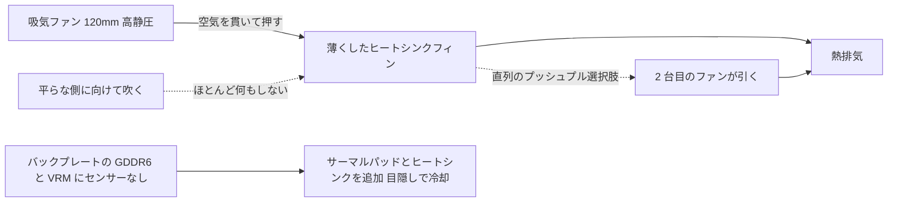

> 🌐 コミュニティ翻訳です。英語版が正となり、より新しい場合があります。誤りを見つけたら issue を立ててください：[English](../en/04-cooling.md) · https://github.com/lildebil0/awesome-bc250/issues

# 冷却

> **要点** — BC-250 の標準ヒートシンクは、デスクではなくサーバーラックの強制空気トンネル用に作られていました。箱出しのままではスロットリングします。コミュニティの修正：**密な標準フィンを薄くし**（やすりがけ/サンディング）、それらを*貫いて*吹く**高静圧 120 mm ファン**（**Arctic P12 Max/Pro** がリファレンス、Noctua NF-P12 redux が静かなプレミアム代替）をボルト留めします。それだけで MOD したボードは **Furmark で ~73 °C、ゲームで 63–65 °C** になります。液体 AIO とフルカスタムケースが次のティアです。

冷却は**新参者が最も間違える #1 のこと**なので、オーバークロックを追う前にこれをやってください。

---

## なぜ標準クーラーでは不十分なのか

BC-250 はマイニング/サーバーボードです。そのヒートシンクは**パッシブ**で、うるさいファンが前から後ろへ空気を強制的に通すシャーシに収まるよう設計されています。エアフローのないデスクでは熱が飽和し、GPU がスロットリングします。平らな側*に向けて*ファンを吹いてもほとんど何もしません — 空気は**フィンの通路を貫いて**進み、加えてバックプレートの上を通る必要があります（背面の GDDR6 には**温度センサーがない**ので、目隠しで冷却することになります）。

コミュニティ観測の限界：スロットリングは **85 °C** あたりで始まり、ハードクラッシュ/リセットは **90 °C** あたりです。負荷温度は余裕を持って ~80 °C 未満に保ってください。

> **3 つのヒートシンクバリアントが存在します**（8 列と 9 列のフィン）。簡単な見分け方：**PCIe 8-pin コネクターの隣の QR コード**が 9 列バリアントを示します。**より少なく、より厚いゲージのフィン**を持つバリアントは、標準でわずかによく冷えるかもしれません。（[elektricM Cooling](https://elektricm.github.io/amd-bc250-docs/hardware/cooling/)）

**コンポーネントごとの温度目標**（elektricM のテスト済み数値、上記のスロットル/クラッシュ限界より細かい）：

| コンポーネント | アイドル | 軽い負荷 | ゲーミング | 最大 |
|-----------|------|-----------|--------|-----|
| GPU/APU エッジ | 40–50 °C | 50–60 °C | 65–80 °C | 90 °C |
| CPU (Tctl) | 45–55 °C | 55–65 °C | 70–85 °C | 95 °C |
| メモリ（裏面） | 40–55 °C | 50–65 °C | 55–70 °C | 80 °C |
| NVMe/SSD | 40–55 °C | 50–65 °C | 60–75 °C | 80 °C（クリティカル 81.8 °C） |

**ゲームで GPU 70–80 °C** を目指してください。ここで NVMe の上限が重要なのは、**GDDR6 と M.2 SSD がボードの熱い背面を共有している**からです — SSD は最悪の熱スポットに位置し、焼ける可能性があるので注視してください（ドライブ仕様で `80 °C` 最大、`81.8 °C` クリティカル）。（[elektricM: sensors](https://elektricm.github.io/amd-bc250-docs/system/sensors/)）

> **CPU Tctl のはしご。** elektricM は **90 °C Tctl** を推奨のバックオフポイントとして示しています。表の **95 °C** は重いゲーミング下でもまだ見られる上端です。**TJmax = 100 °C** は絶対的なシリコン限界です（下記のパッケージ電力表は、持続的なストレス実行下で CPU をちょうどそこに固定しています）。つまり：**90 °C = 「今すぐ下げろ」、95 °C = 「レッドゾーン入り」、100 °C = 「壁に到達」**。（[elektricM: sensors](https://elektricm.github.io/amd-bc250-docs/system/sensors/)）

> **熱状態ごとのパッケージ電力**（elektricM は各状態にボードの電力消費を対応付けています）：アイドル **50–70 W**、軽 **100–150 W**、重 **150–200 W**、ストレス **200–235 W**。PSU のサイジングや、ボードが壁面からどれだけ激しく動いているかを読むのに有用です。（[elektricM: sensors](https://elektricm.github.io/amd-bc250-docs/system/sensors/)）

> **ゲーミング中のピクセルアーティファクト = VRAM の過熱。** 背面 GDDR6 にはセンサーがないので、その視覚的なグリッチがあなたの警告サインです — バックプレートのエアフロー/パッドを追加してください（下記）。（[elektricM Cooling](https://elektricm.github.io/amd-bc250-docs/hardware/cooling/)）

> **シリコンの当たり外れ — チップごとに熱の余裕を見込む。** 物理的に同一の 2 枚のボードが、同一のシャーシと OC 設定でも **5–10 °C 離れて**動作することがあり、熱い方は再ペースト/再パッド後でも熱いままでした。他人の温度が自分のものと一致すると思い込まないでください。（[r/BC250Gaming](https://www.reddit.com/r/BC250Gaming/)）



---

## 持続的な計算は別のレジームです（単なるゲーミングのバーストではない）

上記の目標は**ゲーミング**を前提としており、そこでは負荷がバーストで来ます。**持続的な**計算 — ループした `llama-bench`、長時間の Stable-Diffusion 実行、GPU を数十分釘付けにするもの、**特に [40 CU アンロック](../en/09-overclock-undervolt.md)** — ははるかに過酷な負荷で、ゲーミンググレードのクーラーが保持できる範囲を超えることがあります。

elektricM は標準ヒートシンク + **デュアル Arctic P12 Max のプッシュプル**で、**40 CU / 2 GHz** での 10 分間持続 `llama-bench` を測定しました：

| 指標 | 平均 | ピーク |
|--------|---------|------|
| GPU エッジ | 89.6 °C | 107 °C |
| パッケージ電力 | 136 W | 223 W |
| CPU | 96.7 °C | 100 °C (TJmax) |
| VRM MOSFET | 57 °C | 58.5 °C |
| ファン速度 | ~2950 RPM | 2977 RPM（上限） |

スループットは、パッケージがスロットリングするにつれて実行中に **~10 %** 低下しました。要点：**標準ヒートシンク + デュアル P12 Max は、持続的な 40 CU @ 2 GHz には十分な余裕ではない** — そして **VRM は限界に程遠い**（57 °C）ことに注意してください。つまりボトルネックはファンや電源段ではなく、*ヒートシンクが熱を逃がすこと*にあります。2 つの修正：**GPU ガバナーを 1500 MHz に制限する**（40 CU でも計算は ~1.5 倍にスケールし、温度は ~83 °C を保つ — デュアル P12 Max で無期限に持続可能）か、**ヒートシンクをアップグレードする**（フィン面積を増やす）。**24 CU の標準ゲーミング**には、デュアル P12 Max で余裕があります。壁は持続的なフル CU 計算の下でのみ現れます。（[elektricM Cooling](https://elektricm.github.io/amd-bc250-docs/hardware/cooling/)）

---

## パス A — 空冷 MOD（最も人気、最も安価）

これがチャットのほとんどが動かしているものです。

### 1. 標準フィンを薄く/きれいにする
標準フィンは密すぎ、しばしば不均一です。人々は空気が通れるよう通路を開けます：

- **オービタル（偏心）サンダー** — 最速、数分で完了、最良の結果。（[src](https://t.me/c/2424231195/31571)）
- **手でサンドペーパー** — 60 番手、次に 240 番手、~3–4 時間 + 2 時間を 2 日に分けて。効くが遅い。（[src](https://t.me/c/2424231195/50330)）
- **ハサミ / ニッパー** — 粗い「чекрыжить」方法、最後の手段。結果は最悪。（[src](https://t.me/c/2424231195/41252)）
- **ハサミ + 定規ガイド（クリーンなバリアント）** — 工作用/美容師用ハサミをフィンの隙間に滑り込ませ、**刃に対して角度をつけた定規をガイド**にします。ポケットナイフの「缶切り」も同様に使えます。注意点：一部のボードバリアントには**刃を入れ始める隙間がない** — ドライバー/ピンセットで 1 つこじ開けるか、**小さな Dremel カッティングホイール**で進入スロットを切ります。フィンスロットより幅広の刃はヒートシンクを傷つけることがあります。（[r/BC250Gaming](https://www.reddit.com/r/BC250Gaming/)）
- 曲がったフィンは**平たいピンセット + プライヤー**でまっすぐにします。（[src](https://t.me/c/2424231195/30670)）
- **手でフィンを引き抜く** — elektricM は、柔らかいアルミフィンは（ヒートシンクをボードから外した状態で）**手できれいに裂いて/引き離せる**と指摘しており、切削工具が作る金属切粉を避けられます。遅いが切粉なし。（[elektricM Cooling](https://elektricm.github.io/amd-bc250-docs/hardware/cooling/)）
- **「Scooper by Justin」** — **BC-250 のヒートシンクフィンを押す/開けるために専用に作られた 3D プリント可能な工具**（[Printables 1282906](https://www.printables.com/model/1282906-bc-250-scooper)）。素のドライバーより安全：押しすぎてフィン間のヒートシンク**ベース**をえぐるのを防ぎます。（[r/linux_gaming コミュニティスレッド](https://www.reddit.com/r/linux_gaming/comments/1nvsgji/)）期待値の設定：あるオーナーは、プリントした**「コーム/スクーパー」工具が 2 回目の使用で壊れ**、手がつったと報告しています。（[r/BC250Gaming](https://www.reddit.com/r/BC250Gaming/)）
- **ホビープライヤー — 「剥がす」方法** — フィンの**先端**を小さなホビープライヤーで掴んで剥がし、**金属自身のメモリーを破断点として使い**、ベースを裂くのではなく曲げの部分できれいにスナップさせます。切断より切粉の少ない代替です。（[r/linux_gaming コミュニティスレッド](https://www.reddit.com/r/linux_gaming/comments/1nvsgji/)）

大まかな温度の見返り（elektricM）：**曲がったフィンをまっすぐにする ~5–10 °C**、**中央のフィンを除去する ~10–15 °C**（不可逆 — 良いファンシュラウドは切断なしで同様の効果を得る）、古いペーストが乾いていた場合は**新鮮なペースト ~5–10 °C**。（[elektricM Cooling](https://elektricm.github.io/amd-bc250-docs/hardware/cooling/)）

> ⚠ **サンディング/やすりがけの前に、まずヒートシンクをボードから外して**ください（あるいはボードとダイを完全にマスク/保護する）。そして**再組み立て前にすべての金属粉を掃除してください**。ボードに積もった導電性の金属切粉はそれをショートさせ、**ボードを殺す**可能性があります — これはすでにチャットで起きています。

<p align="center">
  <br>
  <sub>写真：AMD BC-250 コミュニティ · <a href="https://t.me/c/2424231195/31571">source</a></sub>
</p>

### 2. 本物のファンをボルト留めする
**120 mm 高静圧ファン**を取り付け、フィンを貫いて空気を押します。リファレンスの選択は **Arctic P12 Max（または P12 Pro）** です — 最高の静圧（~6.9 mm H₂O）、この密なヒートシンクに対するコミュニティ + elektricM の選択。**Noctua NF-P12 redux** は静かなプレミアム代替で、**Furmark で最大 73 °C、ゲームで 63–65 °C** というリファレンス結果を投稿しています（[src](https://t.me/c/2424231195/42843)）。

**仕様付きの具体的なファンの選択**（elektricM — エアフローではなく*静圧*で選ぶこと）：

| ファン | サイズ | 最大 RPM | 静圧 | エアフロー | 騒音 | ゲーミング温度 |
|-----|------|---------|----------------|---------|-------|--------------|
| **Arctic P12 Max** | 120 mm | 3300 | **6.9 mm H₂O** | 73.3 CFM | 52.5 dB(A) | 65–75 °C |
| **Arctic P12 Pro** | 120 mm | 2100 | **6.9 mm H₂O** | 68.9 CFM | 37.8 dB(A) | 65–75 °C |
| Arctic P14 PWM | 140 mm | 1700 | 2.40 mm H₂O | 72.8 CFM | 38 dB(A) | 70–80 °C |
| Noctua NF-A12x25 | 120 mm | 2000 | 2.34 mm H₂O | 60.1 CFM | 22.6 dB(A) | 70–85 °C |

elektricM の**最も推奨される選択は Arctic P12 Max / P12 Pro** です — その ~6.9 mm H₂O の静圧は Noctua の 2.34 mm を圧倒し、はるかに安価です。P12 Pro はより静かで、より広く在庫されているバージョンです。プレミアムな Noctua はさらに静かですが、温度で Arctic に並ぶのはより高い RPM のときだけです。（[elektricM Cooling](https://elektricm.github.io/amd-bc250-docs/hardware/cooling/)）

**コミュニティビルドからの他の名指しファン**（Arctic/Noctua-P12 リファレンスを超えて、人々が実際に取り付けた具体的なモデル）：

- **Noctua NF-A12x25 G2**（PWM）を **120 mm ダイクーラー**として — A12x25 の新しい G2 リビジョン、メインファンとして使用（[TiredDadTech](https://youtu.be/zi7sldeRd2w)）。（上記のファン表は*オリジナル*の NF-A12x25 のみを掲載しています。）
- **Noctua NF-A6x15 PWM**（≈3500 rpm）を **60 mm PSU ファン交換**として — 絶叫するサーバーブリックファンの静かな置き換え（[TiredDadTech](https://youtu.be/zi7sldeRd2w)）。
- **Thermalright 120 mm 1550 rpm ARGB** を予算向けダイファンとして、そして **6.0 W/mK サーマルパッド**をバックプレート用に — どちらも **TMG HD ビルド BOM** から（[ビルド概要](https://youtu.be/OEO0r01zcfU)）。

> **リファレンス vs 静かな代替。** **Arctic P12 Max/Pro** がここのリファレンスファンです — 最高の静圧（~6.9 mm H₂O）、最も安価、この密なヒートシンクに対するコミュニティ + elektricM の選択。**Noctua NF-P12 redux** は静かなプレミアム代替（チャットの 73 °C Furmark 結果）で、温度で Arctic に並ぶのはより高い RPM のときだけです。価格/性能が最良なら Arctic を、静かさが最重要なら Noctua を選んでください。

**プリントしたファンシュラウド/アダプター**を使い、ファンが空気を周囲に漏らすのではなくヒートシンクに対して密閉するようにしてください。コミュニティ STL：
- `Fan_Shroud_Single_120mm.stl`、`Fan_Shroud_Dual_120mm.stl`、`Fan_Shroud_Single_140mm.stl`、`Twin_120mm_Fan_Shroud.stl`
- `BC250_FanAdapter_120mm.step`、`bc250 cooler mount.stl`、`cooler adapter v3.0.stl`

> **なぜエアフロー定格ではなく静圧なのか？** 密なフィンは高抵抗の負荷です。高エアフローの「ケースファン」はそれに対して失速します。高静圧ファン（≥3 mm H₂O、Noctua P12、Arctic P12）は実際に空気を*貫いて*押します。非常に密なフィンには、**プッシュプル（直列）**の 2 ファンが静圧を倍にします — それがここでの正しい手であって、2 ファンを横並びにすることではありません。

**取り付け：** プリントしたシュラウドが最良ですが、ファンをヒートシンクに**結束バンドで留める**のも効きますし、ファンとフィンの間にテープで留めた**段ボール/フォームボードのダクト**も有効な無料のフォールバックです（見栄えは悪く、耐久性もないが、空気の経路を密閉します）。（[elektricM Cooling](https://elektricm.github.io/amd-bc250-docs/hardware/cooling/)）

> ⚠ **ファンをフィンに直接ドリル/ネジ留めしないでください。** アルミは柔らかくフィンは薄いので、それらにネジ込むとフィンスタックを傷つけ、冷却を損ないます。結束バンドかプリントしたシュラウドを使ってください。（[elektricM Cooling](https://elektricm.github.io/amd-bc250-docs/hardware/cooling/)）

> ### 🛠 エアフローエンジニアリング — 実際に効果を出すもの
>
> どのファンかだけでなく、*どう*空気を動かすかについてのコミュニティの知見：
>
> - **静圧が生の CFM に勝る** — 密なフィンスタックを通すなら。だからこそ高静圧の **Arctic P12 Max（6.9 mm H₂O）** が、このヒートシンクでより静かな高エアフロー/低圧ファンを上回るのです。
> - **中央 1 ファンが横並び 2 ファンに勝てる** — フィンを全面切断した面で：単一の中央ファンは**4 本の中央ヒートパイプ**を直接負荷しますが、2 ファンは中央にプラスチックの死んだ「縫い目」を残します。フィンを全面で最初に切ったビルダーは、中央 1 ファンの方が 2 ファンより数 °C **低い**と測定しました（[src](https://t.me/c/2424231195/46175)）。あるティアダウンはエアフローの側から同じ結論に至ります：**2 ファンを横並びにボルト留めしても 1 ファンより良くはない**、なぜなら 2 つの吸気が出会う**熱いダイ中央の真上にデッドゾーンが形成される**からです — **間に隙間を空けるか、代わりにプッシュプルにしてください**（[Old Lamer — Part VII](https://youtu.be/pxahl9-YgkY) ~19:55）。*（字幕由来 — 定量的ではなく定性的に扱ってください。）*
> - **120 mm ファン速度の下限 ≈1800 RPM** が、この密なスタックを実際に空気が貫くのに必要です。**Arctic P12 Pro**（$8–10、**600–3000 rpm** 範囲）はアイドルで静かでありながら余裕も残す、手軽な選択です（[Old Lamer — Part VII](https://youtu.be/pxahl9-YgkY)）。*（ASR 数値 — 概算。）*
> - **排気ファンを追加 = −3 〜 −5 °C。** 吸気のみ **73 °C** → 排気ありで **67–68 °C**（[src](https://t.me/c/2424231195/68183)、[src](https://t.me/c/2424231195/31553)）。だから最適なシンプル構成は **中央吸気 1 + 後部排気 1** であって、横並びの 2 吸気ではありません。
> - **バックプレートは目隠しで熱い。** VRM MOSFET は**無冷却で ~100 °C** に達します（[src](https://t.me/c/2424231195/110955)）— パッド + ヒートシンク + 専用エアフローを**必ず**与えなければなりません。後部ヒートシンクがあれば、負荷下で *「冷たい」* 状態で動きます（[src](https://t.me/c/2424231195/93056)）。
> - **無料の物理。** 暖気は上昇するので、**傾斜/煙突**の向きさえ役立ちます — ほとんど換気されないバックプレートが、対流だけで **47 °C** を測定しました（[src](https://t.me/c/2424231195/76962)）。そして**黒アルマイトのラジエーターは**研磨されたものの **~1.8 倍** 放射するので、パッシブ/セミパッシブのコンパクトビルドでフィン面積を **~45 %** 縮小できます（[src](https://t.me/c/2424231195/86878)）。
> - **吸気 > 排気で動かす**（わずかな**正圧**）と、センサーのない VRM/VRAM が新鮮な空気に浸され続けます。

### 代替：標準フィンを保つ（切断なしのプッシュプルケース）
フィンの切断は必須ではありません。**penzoiders** は、ヒートシンクを切断**しない**ケース（[MakerWorld、FreeCAD ソース](https://makerworld.com/models/2505974)）を設計しました：**プッシュプルの高静圧ファン**を使って**標準の未改造フィン**を貫いて空気を強制し、加えて**2 チャンバーの圧力差**がバックプレートも冷却します（5 mm ヒートシンク + サーマルパッド、再利用した NVMe ヒートシンクも使えます）。冷たく保つチューニング：**CPU 3800 MHz / 1050 mV、GPU 2100 MHz / 950 mV** → 並列 Furmark + `stress-ng` が **85 °C 未満**を保ち、ゲーミングは**ファン稼働率およそ 50 % で ~75 °C**（CoolerControl カーブ）、「ほとんど聞こえない」。（[r/BC250Gaming](https://www.reddit.com/r/BC250Gaming/)）

## パス B — AIO 液体クーラー

アダプターブラケットでダイに取り付けた 120 mm AIO。静かで冷たいが、部品とコストが増えます。人気のビルドは安価な AIO（例：aigo）を使います。（[例 src](https://t.me/c/2424231195/19336)）

<p align="center">
  <br>
  <sub>写真：AMD BC-250 コミュニティ · <a href="https://t.me/c/2424231195/19336">source</a></sub>
</p>

**名指しの、ダウンロード可能な AIO ブラケット — NexGen3D**（[Printables 1554003](https://www.printables.com/model/1554003)、ABS-GF または PETG でプリント）。**Thermalright 240 mm AIO** で検証：GPU **~50 °C @ 2000 MHz**、CPU **最大 60 °C**。（[r/BC250Gaming](https://www.reddit.com/r/BC250Gaming/)）

### 液冷オーバークロックプロファイル
AIO ならはるかに激しく攻められます。**NexGen3D** の壁面測定（バーンコンボとして Furmark Vulkan + `stress-ng --matrix 0 -t 60m`）：

| プロファイル | CPU | GPU | 最大バーン温度 | 壁面電力 | 備考 |
|---------|-----|-----|---------------|------------|------|
| 1 | 4000 MHz | 2400 MHz | ~65 °C | >350 W | 「完全無音」 |
| 2 | 4100 MHz | 2450 MHz | ~75 °C | <400 W | より熱く、よりうるさい |

通常の 1080p ゲーミングはこれらのバーン温度より **10–15 °C 低く**、プロファイル 1 で**250 W 未満**で動きます。**真似する価値のあるエアフロー構成：** 120 mm ファンが**ラジエーターを通して排気**し、それが **VRM / PSU / VRAM バックプレート**を横切って新鮮な外気を引き込みます。別の **80 mm ファン（Arctic P8 Max）** が GPU VRM を冷却します — これは上記の「センサーのない VRM/VRAM にもエアフローが必要」という警告に応えます。（[r/BC250Gaming](https://www.reddit.com/r/BC250Gaming/)）

## カスタム水冷ループ（上級）

密閉 AIO を超えて、一部の人々は**フルカスタムループ**を回しています。これは本物ですが**DIY/エキスパート**のシーンです：ビルダーは**ダイ*と* VRM** を 1 つのブロックで覆うカスタムウォーターブロックを **CNC で削り出すかはんだ付け**します（[src](https://t.me/c/2424231195/131065)、[src](https://t.me/c/2424231195/131844)、[src](https://t.me/c/2424231195/118582)）。フィッティングは重要ではありません — *「ほぼ何でも調達、旋削、または接着できる」*（[src](https://t.me/c/2424231195/132007)）。

**何が得られるか：** 大まかなカスタムループは、**ファンをわずか 30 % にして負荷下で ~50 °C に達し、外部ポンプはほぼ無音**です（[src](https://t.me/c/2424231195/133040)）。（あるビルダーはその後、デフォルトの cyan-skillfish ガバナー設定で負荷下に VRM チョークからコイル鳴きに気づきました — これは*別の*問題で、熱的なものではありません。）**Corsair Commander も必要ありません**：BC-250 自身の[ファン制御](#ファン速度の制御ソフトウェア)がポンプに加えて **~5 個のファン**を駆動できます（[src](https://t.me/c/2424231195/140123)）。

> ⚠ **なぜこれが「上級」なのか：BC-250 は冷却液の洪水を生き延びません。** コミュニティからの実際の故障：ホースが**90° で折れ、破裂し、GPU と PSU を水浸しにした**（[src](https://t.me/c/2424231195/81158)）。**固着した Corsair AIO ポンプが CPU を焼いた**（[src](https://t.me/c/2424231195/133147)、[src](https://t.me/c/2424231195/126053)）。また**ポンプ速度 ~50 % を超えるとポンプのキャビテーション/騒音**に注意してください（[src](https://t.me/c/2424231195/7034)）。**最初のウェット電源投入の前に、ループ全体をボードから外して 24 時間リークテストしてください。**

**結論：** どの選択肢よりも最も低い温度と最も静かさを実現し、持続的な 40-CU を可能にします — しかし最も高いリスクと労力を伴います。**最初のビルドではありません。**

## パス C — ブロワー（「улитка」）— 非推奨

サルベージした GPU ブロワーファンは初期の実験でした。結果の割にうるさく、人々はパス A に移りました。（[src](https://t.me/c/2424231195/100086)）

## パス D — タワークーラー変換（上級）

一部のユーザーは **AM4 タワークーラー**（例：**Thermalright Peerless Assassin**、または他の AM4/AM5 タワー）をダイにボルト留めし、既製ハードウェアで優れた静かな冷却を得ています。落とし穴：**ブラケットで取り付ける**必要があり、背の高いタワーは **M.2 スロットや他のコンポーネントをふさぐ**かもしれません。初心者向けの MOD ではありません。もはやゼロから自作する必要はありません — 公開された 3D プリントブラケットが 2 つ存在します：

- **AM4/AM5 デスクトップクーラーアダプター**（[MakerWorld 2596083](https://makerworld.com/en/models/2596083)、FreeCAD ソース付属）。標準的なデスクトップ AM4/AM5 クーラーを BC-250 に取り付けます。固定：**M5 ボルト + ナット、スタンドオフなし**（OP は M4 が理想だが M5 がぴったり嵌まったと記しています）。**ABS、PETG、または ASA** でプリント。**CPU 3.95 GHz / 1.150 V、GPU 2200 MHz / 1000 mV、温度 80 °C を超えず**で検証。使用クーラー：ロープロファイルの **AXP90 クラス**（あるコメンターは **AXP120** を使用）、さらには **AMD Wraith Spire** でも標準ヒートシンクを上回りました。（[r/BC250Gaming](https://www.reddit.com/r/BC250Gaming/)）
- **Thermalright AXP90-X53 マウント**（[Printables 1694793](https://www.printables.com/model/1694793)）。ねじインサートがプリントブラケットの**裏面にはんだ付け**されているので、**元のスプリング式標準ヒートシンクのネジを再利用**できます。ボタンヘッドボルトが底から上がってきて皿取りされ、ブラケットにはボードのコンポーネントをかわす**ブレース下 0.5 mm の隙間**があります。Fusion 360 で設計、**PETG でプリント**（PLA はこの温度で軟化します）。結果：**フル負荷 @ 2150 MHz、1080p で 65–67 °C**、非常に静か（銅クーラー、120 mm Arctic P12 Pro と組み合わせ）。**PCB から 15 mm ファンの頂部まで 54 mm** のスタック高さを測定 — ケース適合に有用。**3 種類の厚みバリアントセット**と **AXP120-X67** バージョンも存在します。（[r/BC250Gaming](https://www.reddit.com/r/BC250Gaming/)）

---

## ファン速度の制御（ソフトウェア）

ファンをボルト留めしたら、ボードの **Nuvoton NCT6686D** Super I/O チップを通してその PWM を制御します — ただし**どのドライバーをロードするかが重要です**（[elektricM ハードウェア仕様](https://elektricm.github.io/amd-bc250-docs/)）：

- **読み取り専用センサー**（ファン RPM、温度）：カーネル内の **`nct6683`** モジュール、`force=true` でロード。読み取り値を報告しますが **PWM を書き込めない**ので、ファンは BIOS/ファームウェアが設定したままになります。
- **読み取り + PWM 書き込み**（実際にファン速度を設定）：**[Fred78290/nct6687d](https://github.com/Fred78290/nct6687d)** のツリー外 **`nct6687`** モジュールを、同じく `force=true` で使います。単なる監視ではなくファンカーブ / 手動速度制御が欲しいなら、これがビルドすべきものです。

```bash
# monitoring only (in-kernel):
echo 'options nct6683 force=true' | sudo tee /etc/modprobe.d/nct6683.conf
# PWM control (DKMS from Fred78290/nct6687d):
echo 'options nct6687 force=true' | sudo tee /etc/modprobe.d/nct6687.conf
```

> 両方をロードしないでください — 読み取り専用センサーなら `nct6683`、読み取り + 書き込みなら `nct6687` を選びます。センサー配線（`CPU_FAN1` / `J4003`）と BIOS↔Linux のファン番号付けは [06-linux.md](../en/06-linux.md) の検証ステップにあります。

**どのヘッダーがメインファンか？** elektricM は、冷却ファンは通常 **Pump Fan** ヘッダー = sysfs での **`fan2` / `pwm2`** にあると報告しています。`CPU Fan`（`fan1`）と `System Fan` ヘッダー（`fan3`+）は通常未使用です。PWM を書き込む前に手動モードを有効化してください（`echo 1 > .../pwm2_enable`、次に `.../pwm2` に 0–255 の値）。hwmon の番号付けは再起動間でずれることがあります — `cat /sys/class/hwmon/hwmon*/name` で確認してください。（[elektricM Cooling](https://elektricm.github.io/amd-bc250-docs/hardware/cooling/)）

**GUI でのファンカーブ — CoolerControl。** `nct6687` がロードされたら、**CoolerControl** がグラフィカルなファンカーブを提供します：**nct6686** デバイスを選択し、**k10temp Tctl** をソースとして **pwm2** にカーブを作ります。インストール：`ujust install-coolercontrol`（Bazzite）、`codifryed/CoolerControl` copr（Fedora）、または AUR の `coolercontrol`（Arch）。Web UI は `https://localhost:11987`。（[elektricM Cooling](https://elektricm.github.io/amd-bc250-docs/hardware/cooling/)）

**BIOS ファンモード**（OS 側の制御を動かさない場合）：**Default** はファンを **40 % 最小**に保ち（低すぎ — 非推奨）、**Full Speed** は 100 % に固定（うるさいが安全）、**Customize** は閾値ごとの速度を設定します。（[elektricM Cooling](https://elektricm.github.io/amd-bc250-docs/hardware/cooling/)）

> ⚠ **BIOS Customize モードと CoolerControl を同時に動かさないでください** — それらは PWM 制御を奪い合います。どちらか 1 つを選んでください。（[elektricM Cooling](https://elektricm.github.io/amd-bc250-docs/hardware/cooling/)）

---

## 熱インターフェース（ペースト、パッド、相変化、液体金属）

どんなファン/ヒートシンクを動かすにせよ、ダイとヒートシンクの間 — そしてボード背面と任意のバックプレートラジエーターの間 — の**熱インターフェース材料（TIM）**は正しくする価値があります。BC-250 のダイは**熱密度が高い**ので、良い TIM は無料の数度です。

> **標準ペーストを変えるだけでも効きます。** あるオーナーは 1 年後に工場ペーストを交換し、他はすべて変えずに負荷温度が **~4–5 °C** 下がりました。（[src](https://t.me/c/2424231195/88565)）

### 効くペースト
- **Arctic MX-6** — 通常のハイエンドペースト。あるケース入りビルドで **Furmark で 87–88 °C** を保ちました。同じオーナーは PTM7950 ならそこからさらに ~4 °C 削れると指摘しています。（[src](https://t.me/c/2424231195/30211)）
- **標準ペースト + 標準パッド**が文書化されたベースラインです：10 分負荷後に約 **76 °C**、アイドル約 **55 °C**（フィン/ファン MOD の前）。（[src](https://t.me/c/2424231195/22992)）
- elektricM がここで問題ないとして挙げる他のペースト：**Arctic MX-4**（値頃）、**Thermal Grizzly Kryonaut**（プレミアム）、**Noctua NT-H1**（信頼できる）、**Thermalright TFX**（予算向け）。中古ボードのペーストは**しばしば乾いて**います — 再ペーストするだけで **~5–10 °C** の価値があります。ダイに豆粒大の点を塗り、均等に取り付け、ネジを **X パターン**で締めます。（[elektricM Cooling](https://elektricm.github.io/amd-bc250-docs/hardware/cooling/)）

### PTM7950 — コミュニティのお気に入り（推奨）
**PTM7950** は**相変化パッド**（Honeywell のグラファイト/相変化フィルム）です。室温では薄い固体シートで、負荷時（~45–55 °C）に軟化してミクロン単位の薄い層に流れ、その後留まります。グリスのように**ポンプアウトしたり**乾いたりしません。これはまさに熱く熱サイクルするダイの下で欲しいものです — だから一度塗れば忘れられます。チャットのそっけない要約：*「PTM7950、深く考えるな」*（[src](https://t.me/c/2424231195/101582)）。相変化が一般的な推奨です（[src](https://t.me/c/2424231195/61511)）。

**塗り方：**
1. ダイとヒートシンクベースを清掃し（イソプロピルアルコール）、乾かします。
2. PTM7950 をダイサイズに正方形に切ります — **~26×30 mm** の片で BC-250 のダイを覆えます（[src](https://t.me/c/2424231195/125748)）。
3. 片方の保護フィルムを剥がし、パッドをダイに置き、2 枚目のフィルムを剥がします。
4. ヒートシンクを取り付け、均等にトルクを掛けます。**広げない** — 最初の熱サイクルが仕事をします。最良の温度は数回の負荷/アイドルサイクル後に期待してください（「バーンイン」）。

PTM7950（Honeywell、26×30）にバックプレートラジエーターを加えたリファレンスのケース入りビルドは、CPU 3850 MHz / GPU 2100 MHz で **1 時間にわたり ~84 °C、ゲームで 66–71 °C** のピークです。（[src](https://t.me/c/2424231195/125748)）

> **名指しの組み合わせ：ヒートシンク下の Upsiren パテ + ダイ上の PTM7950。** あるビルド動画は、隙間埋めの箇所には **Upsiren UTP-6 / UTP-8 サーマルパテ**（**UTP-8** グレードは ≈**14.8 W/mK** 定格）を、ダイには **40×80×0.25 mm に切った PTM7950 シート**を敷くという組み合わせです（[PTM7950 + Upsiren 動画](https://youtu.be/FJapqZSdt6I)）。パテはヒートシンク/プレートへの不均一な隙間を埋めるためのもの、相変化フィルムはダイそのものに乗せます。
>
> - **安価な AliExpress の PTM7950 でも効きます。** ~**$13** の AliExpress シートが性能を発揮すると検証されました — 名門 Honeywell のカットは必要ありません（[PTM7950 + Upsiren 動画](https://youtu.be/FJapqZSdt6I)）。
> - **PTM7950 には慣らしが必要。** 最良の温度に達するのは**数回の加熱/冷却サイクル**の後だけです — 最初の実行で判断しないでください（[ノート PC TIM デモ](https://youtu.be/U4Zm8msXJHM)）。
>
> *（両出典とも自動字幕 — 正確な W/mK と寸法は概算として扱ってください。）*

### バックプレート＆ GDDR6 パッド（背面を目隠しで冷却）
**ボード背面の GDDR6 と VRM には温度センサーがありません** — 目隠しで冷却します。**バックプレートにヒートシンク/ラジエーター**を **サーマルパッド**と結合して追加し、背面の熱に行き場を与えてください。（[src](https://t.me/c/2424231195/125748)）ある RU ビルダーは単に **Yandex.Market でヒートシンク**を買い、バックプレートに貼り付けただけで、**底板をよく冷却**しました — ここではそれなりのサイズのアルミヒートシンクなら何でも仕事をこなします（[4pda — mananoid1](https://4pda.to/forum/index.php?showtopic=1104980)）。

報告されたパッド厚（コミュニティ共有、「保存した」リアクション）：
- **VRM：1 mm**
- **GDDR6：2 mm**（[src](https://t.me/c/2424231195/121181)）

> ⚠ **検証** — これらの厚みは*あなたの*特定のバックプレート/ラジエーターへの隙間に依存します。パッドの山を買う前に、隙間測定（またはパテ/粘土テスト）で確認してください。

elektricM はメモリそのものを冷却するための**わずかに異なるパッド方式**を示しています：**ボードの*前面*に 1.5 mm パッド、*背面*に 2.0 mm**、その後裏面にアルミプレート/ヒートシンク。ボード近くでは**非導電性のパッドのみ**を使ってください（コンポーネントをショートさせうる導電性ペースト/パッドは決して使わない）。挙げているパッドブランド：**Thermalright Odyssey**（高性能）、**Arctic Thermal Pad**（値頃）、**Gelid GP-Ultimate**（プレミアム）。（[elektricM Cooling](https://elektricm.github.io/amd-bc250-docs/hardware/cooling/)）

> ⚠ **検証（パッド厚は出典間で異なる）** — 我々のチャット由来の数値は **VRM 1 mm / GDDR6 2 mm（背面）** です。elektricM はメモリチップに **前面 1.5 mm / 背面 2.0 mm** を指定しています。異なるビルド、異なる隙間 — どちらの数字も目隠しで信じるのではなく、**自分のクリアランスを測ってください**。

> **30–60 分のゲーミング後のクラッシュ/不安定**（しばしばピクセルアーティファクトを伴う）は、古典的な**メモリ過熱**のサインです。修正：パッド + 裏面プレートを追加、バックプレートファンを追加、ケースのエアフローを改善、または一時的に **VRAM スプリットを減らす**（例：4 GB → 512 MB）ことでメモリの熱を削ります。（[elektricM Cooling](https://elektricm.github.io/amd-bc250-docs/hardware/cooling/)）

### 液体金属 — ここでは概して非推奨
液体金属（LM）が話題に上るのは、PS5（同ファミリーの APU）がそれを使っているから（[src](https://t.me/c/2424231195/18105)）で、生の性能ではペースト/PTM をわずかに上回ります（[src](https://t.me/c/2424231195/124112)）。人々は BC-250 でそれについて尋ね、試してきました（[src](https://t.me/c/2424231195/18098)、[src](https://t.me/c/2424231195/77180)）。

**しかしこのボードでは間違った選択です：**
- LM は**電気的に導電性**です。BC-250 のダイは**密な GDDR6 と VRM**のすぐ隣に位置します。ダイから逃げた一滴がボードをショートさせます（上記の金属切粉の警告と同じ「メモリ近くの導電性のものがそれを殺す」リスク）。
- それは**ポンプアウトし / おおよそ毎年やり直す必要があり**、裸のアルミを侵します — PTM7950 の擁護者でさえ、まさにこの手間のために自分のハードウェアで LM を捨て、PTM7950 / KryoSheet に切り替えました。（[src](https://t.me/c/2424231195/69688)）
- 「誰もが液体金属の作業を引き受けるわけでもない。」（[src](https://t.me/c/2424231195/106787)）

**結論：** **PTM7950 がより安全な高性能の選択**です — 利益の ~99 %、短絡/メンテナンスのリスクはなし。LM は、自分が何をしているか正確に分かっている人のために取っておいてください。

---

## 冷却のテスト方法（コミュニティの方法、ピン留め）

ピン留めの手順より（[src](https://t.me/c/2424231195/108407)）：

1. **GPU ストレス：** Furmark（Vulkan / 「Furmark VK」）。
2. **同時に CPU：** CPU ベンチ（cpu-x）か `stress`/`pipx` ベースの負荷を追加 — APU は 1 つのヒートシンクを共有するので、両方を一緒にテストします。
   - これらのツール（Furmark、OCCT、cpu-x、`stress`）は、新しい Linux 環境には**プリインストールされていません** — まずパッケージマネージャーか Flatpak でインストールしてください。
3. 標準ではなく、**自分のオーバークロックでテスト** — 1500 MHz は弱く、**2000 MHz は ~+30 % FPS** で実際に動かすものなので、それに合わせて冷却します。
4. 温度を見ます。~85 °C を超えたらスロットリングしています — ファン/シュラウド/フィンの作業を追加してください。

> ℹ️ **2 つの異なる「+30 %」の主張を混同しないでください。** ここでの **GPU クロック +30 %**（1500 → 2000 MHz が FPS をおよそ 3 分の 1 上げる）は、オーバークロックによる*性能*の向上です。これは別のノート PC TIM デモで**再ペースト**について引用された **~+30 % の熱改善**（[ノート PC TIM デモ](https://youtu.be/U4Zm8msXJHM)）とは**同じではありません** — そちらは異なるハードウェアでの*温度*の結果です。同じ数字、無関係なもの。

トピックにピン留めされた最もシンプルな方法の短い動画ウォークスルーもあります。（[src](https://t.me/c/2424231195/100024)）

---

## 推奨される入門セットアップ

| ティア | これをする | 期待値 |
|------|---------|--------|
| 最小 | フィンをサンディング（オービタルサンダー）+ 1× Arctic P12 Max/Pro（または Noctua NF-P12）+ プリントシュラウド | Furmark ~73 °C |
| より良い | シュラウドを通したプッシュプル（2× P12） | 同じ温度でより低く、より静か |
| 最大 | アダプター上の 120 mm AIO | 最も冷たい、より多くのビルド労力 |

---

## 出典

- ピン留めのテスト方法 — https://t.me/c/2424231195/108407 · 動画 — https://t.me/c/2424231195/100024
- フィン工具 — https://t.me/c/2424231195/31571 · https://t.me/c/2424231195/30670 · https://t.me/c/2424231195/50330 · 「Scooper by Justin」フィン工具（[Printables 1282906](https://www.printables.com/model/1282906-bc-250-scooper)）+ ホビープライヤー剥がし方法 — [r/linux_gaming スレッド](https://www.reddit.com/r/linux_gaming/comments/1nvsgji/)
- Noctua P12 の結果 — https://t.me/c/2424231195/42843
- AIO の例 — https://t.me/c/2424231195/19336
- 熱インターフェース — 再ペースト −4–5 °C https://t.me/c/2424231195/88565 · MX-6 https://t.me/c/2424231195/30211 · 標準ベースライン https://t.me/c/2424231195/22992 · PTM7950 https://t.me/c/2424231195/101582 · https://t.me/c/2424231195/61511 · PTM7950 ビルド + バックプレート https://t.me/c/2424231195/125748 · パッド厚 https://t.me/c/2424231195/121181 · 液体金属 https://t.me/c/2424231195/18098 · https://t.me/c/2424231195/69688
- elektricM 冷却ガイド（ヒートシンクバリアント、コンポーネントごとの温度表、持続負荷データ、ファン仕様、CoolerControl/BIOS ファンモード、タワークーラー、パッド方式）— https://elektricm.github.io/amd-bc250-docs/hardware/cooling/
- [elektricM: sensors](https://elektricm.github.io/amd-bc250-docs/system/sensors/)（熱閾値：CPU Tctl 90 °C 最大 / TJmax 100 °C、NVMe/SSD 80 °C 最大 / 81.8 °C クリティカル、熱状態ごとのパッケージ電力）
- r/BC250Gaming（コミュニティ報告：シリコンの当たり外れのばらつき、ハサミ+定規フィン方法、コーム工具の破損、切断なしプッシュプルケース、AIO ブラケット + 240 mm 結果、液冷 OC プロファイル、AM4/AM5 + AXP90-X53 ブラケット）— https://www.reddit.com/r/BC250Gaming/ · AM4/AM5 クーラーアダプター [MakerWorld 2596083](https://makerworld.com/en/models/2596083) · AXP90-X53 マウント [Printables 1694793](https://www.printables.com/model/1694793) · NexGen3D AIO ブラケット [Printables 1554003](https://www.printables.com/model/1554003) · 切断なしプッシュプルケース [MakerWorld 2505974](https://makerworld.com/models/2505974)
- ハードウェアリファレンス — [mothenjoyer69/bc250-documentation `hardware.md`](https://github.com/mothenjoyer69/bc250-documentation/blob/main/hardware.md)
- 冷却付きのケース/アダプター — [onemorecap/bc-250-sleeve-adapter](https://github.com/onemorecap/bc-250-sleeve-adapter)
- ダイ上の 2 ファン横並びデッドゾーン / 隙間を空けるかプッシュプル、120 mm ≈1800 RPM の下限、Arctic P12 Pro（$8–10、600–3000 rpm）— [Old Lamer — Part VII](https://youtu.be/pxahl9-YgkY)（自動字幕 / ASR — 数値は概算）
- Upsiren UTP-6 / UTP-8 パテ（UTP-8 ≈14.8 W/mK）+ ダイ上に 40×80×0.25 mm に切った PTM7950、安価な AliExpress PTM7950（~$13）検証済み — [PTM7950 + Upsiren 動画](https://youtu.be/FJapqZSdt6I) · PTM7950 には数回の加熱/冷却慣らしサイクルが必要 + 別の再ペースト「+30 %」（ノート PC、GPU クロック +30 % ではない）— [ノート PC TIM デモ](https://youtu.be/U4Zm8msXJHM)
- 名指しファン：Noctua NF-A12x25 G2（120 mm ダイクーラー）+ NF-A6x15 PWM 3500 rpm（60 mm PSU ファン交換）— [TiredDadTech](https://youtu.be/zi7sldeRd2w) · Thermalright 120 mm 1550 rpm ARGB + 6.0 W/mK パッド（TMG HD ビルド BOM）— [ビルド概要](https://youtu.be/OEO0r01zcfU)
- RU バックプレートラジエーター（Yandex.Market ヒートシンクが底板を冷却）— [4pda — mananoid1](https://4pda.to/forum/index.php?showtopic=1104980)

> ファンシュラウドとアダプターの STL は [05-case.md](../en/05-case.md) にカタログ化され、`assets/stl/` 以下にミラーされています。
