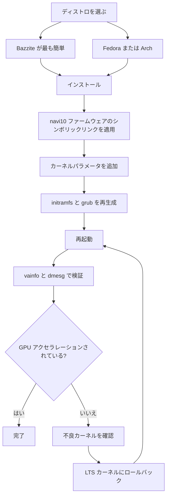

> 🌐 コミュニティ翻訳です。英語版が正となり、より新しい場合があります。誤りを見つけたら issue を立ててください：[English](../en/06-linux.md) · https://github.com/lildebil0/awesome-bc250/issues

# Linux ドライバーとセットアップ

> **要点** — ほとんどの人は BC-250 を Linux で動かしており、*GPU が直れば* よく動きます。標準状態では `amdgpu` がチップを認識せず、CPU レンダリングで一桁の FPS になります。これを実用化するには 2 つが必要です。**新しいカーネル ＋ 新しい Mesa（25.1+）** と、**`amdgpu` の修正** — ドライバーがロードできるようにするファームウェアのシンボリックリンク（`navi10_gpu_info.bin` → `cyan_skillfish_gpu_info.bin`）に加え、カーネルパラメータ（`amdgpu.sg_display=0`、`mitigations=off`、新しいカーネルでは `amdgpu.bc250_cc_write_mode=3`）です。初心者に最も簡単な経路：**[Bazzite](https://bazzite.gg/)** をフラッシュし、専用の **`bazzite-bc250`** イメージにリベースすること — 修正が焼き込まれています。マシンを学びたいなら：一度きりのセットアップスクリプト付きで **Fedora** または **CachyOS/EndeavourOS（Arch）**。

これは「箱の中のボード」を動くデスクトップに変える章です。先に [冷却](../en/04-cooling.md) と [電源](../en/03-power-supply.md) を行い — それからこれを。

> **Linux を使ったことがない？ 60 秒のサバイバルキット。**
> - **ターミナルを開く：** メニューで *Terminal* / *Konsole*（KDE） / *Console* というアプリを探すか、`Ctrl-Alt-T` を押します。
> - コマンドの前に **`sudo`** を付けると管理者として実行されます。パスワードを尋ねられます — そして **入力中、画面には何も表示されません**（ドットも星印も）。これは正常です。入力して Enter を押してください。
> - **`nano /etc/...`** はターミナル内でプレーンテキストエディタを開きます。保存して終了するには：**Ctrl-O**、次に **Enter**、次に **Ctrl-X**。
> - ターミナルへの **コピー＆ペースト** は通常 **Ctrl-Shift-V**（Ctrl-V ではない）です。
> - 多くの手順は **再起動**（`systemctl reboot`）後にのみ有効になります。手順に「再起動」とあれば、動作したか判断する前に実際に再起動してください。

---

## 必ず理解すべき 1 つのこと

BC-250 の GPU は **Cyan Skillfish / Oberon**（PlayStation 5 由来の RDNA2 部品）です。メインラインの `amdgpu` には歴史的に **それ用の名前のファームウェアブロブがなかった** ため、標準インストールではカーネルが GPU を初期化できず、デスクトップはソフトウェア（LLVMpipe）レンダリングにフォールバックします — すべてが遅く、`vulkaninfo` は実デバイスを表示しません。あるユーザーは、自分のディストロが単に GPU ファームウェアをロードできないカーネルで起動していたと気づくまで、何日も「壊れたドライバー」に費やしました（[出典](https://t.me/c/2424231195/98466)）。

そのため、動作するすべてのセットアップは、何らかの形で同じ 3 つのことを行います。

1. **十分に新しいカーネル ＋ Mesa を動かす。** 上流の Mesa は **25.1** で BC-250 サポートを得ました（それ以降パッチ不要。**25.3.x** が現在の推奨安定版です） — （[Mesa MR !33116](https://gitlab.freedesktop.org/mesa/mesa/-/merge_requests/33116)、[出典](https://t.me/c/2424231195/20891)）。温度センサーは **カーネル 6.15** で着地しました（[出典](https://t.me/c/2424231195/23542)）。カーネル **6.18.18 LTS** が現在のスイートスポットです。
2. **`amdgpu` に欲しがるファームウェアを与える** — 現在のセットアップでは最新の **`linux-firmware`** がすでに `cyan_skillfish_gpu_info.bin` を同梱しています。古いシステムでは依然 **navi10 シンボリックリンク**（またはパッチ済み mesa/カーネルパッケージ）が必要です。経路 C を参照。
3. **正しいカーネルパラメータを渡し**、initramfs ＋ ブートローダーを再生成する。（さらに **GPU governor** をインストールして、クロックが 1500 MHz に固定されないようにする。）

以下のすべては、各ディストロがその 3 つをどう行うか*だけ*です。



---

## どのディストロ？（コミュニティ投票のお気に入り）

チャットは繰り返し 4 つに戻ってきます。唯一の「正しい」答えはありません — *労力ゼロ* と *マシンの理解* の間のトレードオフです。elektricM のドキュメントはより広い範囲をテストしています。ここに一目で見られる全リストを示します（[elektricM: distributions](https://elektricm.github.io/amd-bc250-docs/linux/distributions/)）：

| ディストロ | ベース | 労力 | GPU 修正 | 最適な用途 |
|--------|------|--------|---------|----------|
| **Bazzite**（`bazzite-bc250` イメージ） | Fedora atomic | **最低** — 修正が焼き込み済み | イメージに事前適用済み | 初心者、「とにかくゲームをする」 |
| **Fedora 43**（Workstation / KDE） | Fedora | 低 | メインラインリポジトリの Mesa 25.x ＋ governor COPR | Linux を学び、上流に近いまま |
| **CachyOS** | Arch | 中 | リポジトリの Mesa 25.1+ ＋ governor（AUR） | 最大の滑らかさ（BORE スケジューラ）、HDR+VRR |
| **EndeavourOS / Arch** | Arch | 中 | リポジトリの Mesa 25.1+ ＋ governor | インストールの苦痛なしの Arch |
| **Debian（Testing/Sid） / PikaOS** | Debian | 中〜高 | `experimental` からの Mesa（Debian） / OOTB（PikaOS） | 安定性、**最低のアイドル電力（約 50〜60 W）** |
| **Manjaro** | Arch | 中 | リポジトリの Mesa 25.1+；BIOS フラッシュ後 OOTB で起動 | 簡単な Arch；GNOME が最も安定 |
| **Alpine** | Alpine（OpenRC） | 高 | 手動の mesa ＋ ファームウェア ＋ governor | 最小限/ヘッドレス、約 150 MB RAM / 約 35 W |
| **Fedora CoreOS** | Fedora atomic | 高 | コンテナホスト；インストール後のカスタマイズ | ヘッドレスなコンテナ/LLM サーバー |
| **SteamOS**（Valve） | Arch（イミュータブル） | 中 | **main-branch** イメージからの Mesa（安定版ではない） ＋ governor | 本物の Steam Machine 感；カウチ/ゲーミングモード |
| **Batocera** | Linux（エミュレーション用ディストロ） | 低〜中 | 同梱の Mesa ＋ セットアップ | コンソール風の **エミュレーション** ボックス（[15-emulation.md](../en/15-emulation.md)） |

チャットと [elektricM](https://elektricm.github.io/amd-bc250-docs/linux/distributions/) からのメモ：
- **Bazzite が最も簡単** で、ファームウェア修正・カーネルパラメータ・GPU governor・40-CU/周波数パッチをすでに適用した **専用の BC-250 イメージ** があります。artifacthub で見つかります：[`bazzite-bc250`](https://artifacthub.io/packages/container/bazzite-bc250/bazzite_bc250)。複数のユーザーが、手動パッチをやめるためにまさにこれへ移行しました（[出典](https://t.me/c/2424231195/121246)）。
- **Fedora 43 以降、Mesa 25.x はメインラインリポジトリにあります** — `mixaill/amd-bc-250` COPR は Mesa のためだけにはもう不要です。Fedora 42 は **サポート終了（EOL）** です。43 にアップグレードしてください。インストール中に黒画面になったら、*Troubleshooting → Install in Basic Graphics Mode* を使ってください（[elektricM: Fedora](https://elektricm.github.io/amd-bc250-docs/linux/fedora/)）。
- **「ゲーマー」向けディストロを盲目的に掴まないでください。** 詳細な意見の一つは、素の **Fedora（Workstation/KDE）** または **LTS カーネル ＋ 新しい Mesa を載せたバニラ Arch** が痛みのない中間点であり、重くチューンされたフォークはときに Steam/FSR/vsync を助けるどころか*壊す*ことがあると主張します（[出典](https://t.me/c/2424231195/102834)）。これは「2025 年後半時点」のアドバイスとして扱ってください — Bazzite イメージはそれ以降成熟しています。
- **最大の滑らかさを追うなら Bazzite より CachyOS。** 詳細な r/BC250Gaming（Reddit）コミュニティレポートは Bazzite から **CachyOS** へ切り替え、ソースを問わずゲームが目に見えて滑らかになり、スタッター/マイクロフリーズ（例：*Mortal Kombat 1*）が減り、ランダムクラッシュや Steam モードの再起動が減り、**デフォルトの Btrfs** レイアウトで非常に応答性が良いと感じました。Bazzite ではできなかった **HDR ＋ VRR も適切に動作** させました（HDR は不具合、VRR は一度も動かなかった） — [14-display.md](../en/14-display.md) を参照。普遍的な結論ではなく、よく文書化された一つの経験として扱ってください。ただし Bazzite でスタッターや不安定さが残るなら強力な選択肢です。セットアップは **[`redbeard1083/bc250-toolkit`](https://github.com/redbeard1083/bc250-toolkit)** スクリプト（CachyOS 上の BC-250）で自動化されます。⚠ 別のコミュニティのデータポイントは熱/FPS の観点を加えます：*同一の* オーバークロックで、CachyOS は **Bazzite より約 10 °C 低く** 動作し、CPU バウンドのタイトルでより高い FPS を出すと報告されています（例：*Elden Ring* は CachyOS で約 60〜75、Bazzite で約 45〜60）（[+14]、r/BC250Gaming — コミュニティ報告、ばらつきあり、独立確認なし）。
- **カーネルバージョンはディストロより重要です。** 既知の不良カーネルを避けてください（下記の警告ボックスを参照）。迷ったら、**LTS カーネル**（6.18.18 LTS 推奨）が安全な選択です — 複数のユーザーが新しすぎるカーネルで壁にぶつかり、LTS への切り替えで救われました（[出典](https://t.me/c/2424231195/56529)、[出典](https://t.me/c/2424231195/59839)）。
- **デスクトップ環境：** **GNOME が BC-250 で最も実績があります**。KDE Plasma には Qt の RDRAND/RDSEED クラッシュがありました — 最近の Qt（2025 年中頃）で修正されましたが、GNOME が依然として安全なデフォルトです。Cinnamon（X11）は安定した軽量の選択肢です（[elektricM: distributions](https://elektricm.github.io/amd-bc250-docs/linux/distributions/)）。
- **さらに 2 つのディストロがコミュニティで起動確認されています**（[r/linux_gaming コミュニティスレッド](https://www.reddit.com/r/linux_gaming/comments/1nvsgji/)）：**SteamOS** は BC-250 で動きます — ただし **main-branch** の SteamOS イメージを使い、安定版チャンネルは**使わない**でください（安定版は BC-250 サポートのない古い Mesa を同梱します）。そして専用エミュレーションディストロの **Batocera** も起動して動きます — ボードをコンソール風のエミュレーションボックスにする便利な方法です（[15-emulation.md](../en/15-emulation.md) を参照）。どちらも上記すべてと同じ 3 つのルール（新しい Mesa ＋ `amdgpu` ファームウェア修正 ＋ カーネルパラメータ/governor）に従います。

> あるベテランは、BC-250 を Linux で 3 か月毎日使い込んだ経験をこう要約しました：ゲームはワンクリックで起動し、RTX が動き、VR が動き、「まったくシームレス」 — そしてそれが理由でメインのデスクトップを Linux に切り替えた（[出典](https://t.me/c/2424231195/61870)）。

---

## 経路 A — Bazzite（初心者に推奨）

Bazzite はイミュータブルな Fedora ベースのゲーミング OS（SteamOS 風）です。コミュニティが **BC-250 専用イメージ** を維持しているので、自分でファームウェアやカーネルパラメータに触る必要はありません。

### A1. まず通常の Bazzite をインストール
1. **[bazzite.gg](https://bazzite.gg/#image-picker)** からダウンロード（デスクトップ版または「Deck」/ゲーミングモード版を選択）。
2. USB にフラッシュ（Ventoy、Rufus、または balenaEtcher）し、通常どおりインストール。**root 以外のユーザーを作成** — Steam は root では起動を拒否します（[出典](https://t.me/c/2424231195/121246)）。

> **正しい Bazzite イメージの選び方（ステップごと）。** [bazzite.gg](https://bazzite.gg/) でピッカーを **Desktop PC → AMD (modern) → KDE → Gaming-Mode image** とたどり — 素のライブ ISO ではなく **Gaming-Mode** ビルドを掴んでください：ライブ ISO はインストールはできますが **実際にはゲームを動かせません**。**Balena Etcher** で **16 GB 以上** の USB スティックにフラッシュします。インストール **先** は M.2 NVMe、M.2-to-SATA アダプター上の SATA SSD、あるいは **外付け USB** ドライブでも構いません。2025 年 11 月中旬のイメージは標準で **Mesa 25.2.4** を同梱していました（[Old Lamer — Part IV](https://youtu.be/YuBmGF536II)）。

> **フラッシュドライブが小さすぎる？** Bazzite ISO は 9 GB 超です。小さいスティックに素の **Fedora**（約 3 GB の ISO、例：Kinoite/KDE）をインストールし、ターミナルから Bazzite に *リベース* できます（[出典](https://t.me/c/2424231195/121246)）：
> ```bash
> # KDE デスクトップ:
> rpm-ostree rebase ostree-image-signed:docker://ghcr.io/ublue-os/bazzite:stable
> # またはゲーミングモード付き (SteamOS 風):
> rpm-ostree rebase ostree-image-signed:docker://ghcr.io/ublue-os/bazzite-deck:stable
> ```
> 再起動すれば Bazzite に入ります。

### A2. GPU governor をインストール（現状最もシンプルな経路）
2026 年初頭時点で、**標準の Bazzite カーネルはすでに GPU 周波数範囲パッチを含んでいます** — そのため通常 **カスタムイメージはまったく不要** です。通常の Bazzite の上に governor をインストールするだけです（[elektricM: Bazzite](https://elektricm.github.io/amd-bc250-docs/linux/bazzite/)）：
```bash
sudo dnf copr enable filippor/bazzite
rpm-ostree install cyan-skillfish-governor-smu   # SMU バリアント — カーネルパッチ不要
systemctl reboot
sudo systemctl enable --now cyan-skillfish-governor-smu.service
# 既知の良好なデプロイメントをピン留めして、更新が黙ってあなたを壊さないようにする:
rpm-ostree pin 0
```
**`cyan-skillfish-governor-smu`** は SMU ファームウェアコール経由でクロックを駆動し、古い `oberon-governor` を置き換えます（*[電源 governor](#b3-電源-governorcyan-skillfish-governor)* を参照）。`cyan-skillfish-governor-tt` バリアントも存在しますが、カーネル周波数パッチ（Bazzite には既にあり）が必要です。⚠ governor が誤ったカード（card0 と card1）を対象にすることがあります — スケーリングが効かない場合は検証してください。

### A2-alt.（任意）BC-250 イメージにリベース
事前に焼き込まれた追加の最適化が欲しい場合のみ：維持されている BC-250 イメージ — **`vietsman` 「Bazzite on Steroids」** ビルド（ファームウェア修正、カーネルパラメータ、governor、拡張された 350〜2230 MHz 周波数パッチが焼き込み済み）に切り替えます。インストールしたデスクトップを選び — **GNOME が推奨デフォルト** — 実行します：
```bash
# GNOME (推奨):
rpm-ostree rebase ostree-image-signed:docker://ghcr.io/vietsman/bazzite-gnome-patched:latest
# KDE:
rpm-ostree rebase ostree-image-signed:docker://ghcr.io/vietsman/bazzite-kde-patched:latest
# Deck / ゲーミングモード (SteamOS 風):
rpm-ostree rebase ostree-image-signed:docker://ghcr.io/vietsman/bazzite-deck-patched:latest
systemctl reboot
```
⚠ 実行前に現在のイメージ/タグを確認してください — イメージパスは変わります。最新のコマンドは [BC-250 ドキュメントの Bazzite ページ](https://elektricm.github.io/amd-bc250-docs/linux/bazzite/) にあります（artifacthub では [`bazzite-bc250`](https://artifacthub.io/packages/container/bazzite-bc250/bazzite_bc250) としても掲載）。

> ⚠ **パッチ済みイメージへのリベースが USB WiFi を殺すことがあります（elektricM Issue #10）。** カスタムカーネルがあなたの USB WiFi/Bluetooth ドングルのドライバーを含まないことがあります（BC-250 には内蔵無線がありません）。Ethernet を用意し、リベース後に `lsmod | grep <your_driver>` を確認し、なければ `rpm-ostree install <driver-package>`、または `rpm-ostree rollback && systemctl reboot`。

> **40-CU 解放がファン制御や Xbox ゲームパッドを壊す場合は、カスタムカーネルイメージに差し替えてください。** Bazzite 内蔵の 40-CU 解放（「Old-Lamer」方式）は、一部のセットアップで **ファン制御と Xbox コントローラーのサポート** を壊すとコミュニティで報告されています（[+ r/BC250Gaming — コミュニティ報告、ばらつきあり]）。**[`hafriedlander/kernel-bazzite`](https://github.com/hafriedlander/kernel-bazzite)** イメージはそれを修正するカスタムカーネルで — *「BC250 ボード向けの 40CU 解放パッチを当てた（レガシーな）Bazzite カーネル」* であることが確認されており、Fedora の kernel-ark から通常のハンドヘルド/パフォーマンスパッチセットとともにそのままビルドされています（AUR では `linux-bazzite-bin` としてもパッケージ化）。⚠ それがあなた固有のファン/ゲームパッドのリグレッションを解決するかはコミュニティのデータポイントであって保証ではありません — `rpm-ostree rollback` できるよう、既知の良好なデプロイメントをピン留めしておいてください。

再起動後、以降は Bazzite ヘルパーで更新します：
```bash
ujust update          # すべて更新 (または: rpm-ostree upgrade && flatpak update)
rpm-ostree rollback   # 更新が何かを壊したら、ロールバックして再起動
```

> **知っておく価値のある Bazzite の落とし穴 2 つ**（[elektricM: Bazzite](https://elektricm.github.io/amd-bc250-docs/linux/bazzite/)）：軽い 2D ゲームでさえ起こる絶え間ない **マイクロスタッター** は、たいてい Handheld Daemon がループで失敗しているのが原因です — `sudo systemctl mask --now hhd` で無効化してください。そして BIOS フラッシュ後の **レベルロード時のフリーズ** は、たいてい **CMOS がクリアされていない** ことを意味します — CMOS をクリアし、VRAM 設定を再適用してください。

> ⚠ **Bazzite のイミュータブル性は低レベルのネットワークツールをブロックします。** 読み取り専用の `/usr` のため、システムサービスやカーネル部品をインストールするトラフィック整形/アンチスロットリングツール（例：`zapret` 系ツール）はクリーンにインストールできません。それに依存しているなら — 一部の Steam をスロットリングする ISP では一般的です — 可変（mutable）なディストロ（Fedora/Arch）の方が扱いやすいホストです（RU 固有の詳細はロシア語版にあり）。

### A3. 完了 — 検証
下の **[GPU アクセラレーションの検証](#gpu-アクセラレーションの検証)** に進んでください。BC-250 イメージ（または A2 の後）では、ファームウェアのシンボリックリンク、カーネルパラメータ、governor がすでに揃っています。

---

## 経路 B — Fedora（Workstation / KDE）

Fedora は最も文書化された非 atomic な経路で、上流に近いままです。**Fedora 43 ではグラフィックススタックに追加リポジトリは不要です — Mesa 25.x がすでにメインラインリポジトリにあります**（[elektricM: Fedora](https://elektricm.github.io/amd-bc250-docs/linux/fedora/)）。古い `mixaill/amd-bc-250` COPR（下記）は 43 より前のリリースでのみ必要です。

### B1. Fedora をインストール
**Fedora 43 Workstation または KDE** をダウンロードし（[fedoraproject.org](https://fedoraproject.org/workstation/download)）、通常どおりインストールします — **Fedora 42 はサポート終了** です。43 にアップグレードしてください。インストーラーが黒画面を表示したら、*Troubleshooting → Install Fedora in basic graphics mode* を選びます（これは `nomodeset` を設定します。ドライバーが入ったら外してください）。チャットで報告された良好なベースライン：カーネル 6.14、GNOME 48、Mesa 25.0.2+ — 「飛ぶように速い」（[出典](https://t.me/c/2424231195/29150)）。Cinnamon の Fedora 41 は Cyberpunk、Witcher 3 などを動かし「めちゃくちゃ安定」と評されました（[出典](https://t.me/c/2424231195/12756)）。43 ではカーネル **6.18.18 LTS** または **6.17.11+** を優先し、壊れた範囲（下記の警告ボックス）を避けてください。

### B2. セットアップスクリプト（作業を代わりにやってくれる）
標準的な Fedora セットアップは `mothenjoyer69/bc250-documentation` の **`fedora-setup.sh`** で自動化されます。COPR を有効化し、パッチ済み mesa をインストールし、`amdgpu` を設定し、governor をビルドし、ブートローダーを修正します。それが実行する正確なステップ（スクリプトと突き合わせ済み）：

```bash
# 1. COPR からパッチ済み mesa
sudo dnf copr enable mixaill/amd-bc-250 -y
sudo dnf upgrade --refresh -y

# 2. amdgpu モジュールオプション + センサーモジュール
echo 'options amdgpu sg_display=0'    | sudo tee /etc/modprobe.d/options-amdgpu.conf
echo 'nct6683'                        | sudo tee /etc/modules-load.d/99-sensors.conf
echo 'options nct6683 force=true'     | sudo tee /etc/modprobe.d/options-sensors.conf

# 3. initramfs を再生成 (Fedora は dracut を使用)
sudo dracut --regenerate-all --force

# 4. ブートローダー: nomodeset を外し、カーネルパラメータを追加
sudo sed -i 's/nomodeset//g' /etc/default/grub
sudo grub2-mkconfig -o /etc/grub2.cfg
sudo grubby --update-kernel=ALL --args="amdgpu.sg_display=0"
sudo grubby --update-kernel=ALL --args="mitigations=off"

# 5. OpenCL (任意、計算/AI 用)
sudo dnf install mesa-libOpenCL --allowerasing
```
*（出典：[mothenjoyer69/bc250-documentation](https://github.com/mothenjoyer69/bc250-documentation) の `fedora-setup.sh`、逐語的に確認済み。）*

ステップを打ち込む代わりにスクリプトをそのまま実行するには、そのリポジトリの README の **「Simple setup script」** セクションを参照してください（[`fedora-setup.sh`](https://raw.githubusercontent.com/mothenjoyer69/bc250-documentation/refs/heads/main/fedora-setup.sh) を指しています）。⚠ セットアップスクリプトはシェルにパイプする前に読んでください。

### B3. 電源 governor（cyan-skillfish-governor）
ボードは標準で 1500 MHz / 1000 mV にフラットに動きます。**governor** はクロックをスケールし（アイドル ↔ 約 2000 MHz）、アンダーボルトを可能にします。現在の推奨は **`cyan-skillfish-governor-smu`** で、`filippor/bazzite` COPR から入手します（[elektricM: Fedora](https://elektricm.github.io/amd-bc250-docs/linux/fedora/)、2026 年 3 月確認）：
```bash
sudo dnf copr enable filippor/bazzite
sudo dnf install cyan-skillfish-governor-smu
sudo systemctl enable --now cyan-skillfish-governor-smu
systemctl status cyan-skillfish-governor-smu        # 動作しているか確認
```
設定は `/etc/cyan-skillfish-governor-smu/config.toml` にあります。フルなチューニングは **[09-overclock-undervolt.md](../en/09-overclock-undervolt.md)** で扱います。

> **SMU と古い oberon-governor の比較。** `cyan-skillfish-governor-smu` は SMU ファームウェアコール経由でクロックを駆動し、**どのディストロでもカーネル周波数パッチが不要** です — elektricM ドキュメントでは事実上どこでも古い `oberon-governor` を置き換えました（[elektricM: kernel](https://elektricm.github.io/amd-bc250-docs/linux/kernel/)）。同じ COPR は `cyan-skillfish-governor-tt` バリアントも同梱しますが、これは*カーネルパッチが必要*です。すでに `oberon-governor` を動かしているなら、SMU 版をインストールする前に停止/無効化/削除してください（`sudo systemctl disable --now oberon-governor`、`/etc/oberon-config.yaml` を削除）。

### B4. 再起動して検証
再起動し、**[GPU アクセラレーションの検証](#gpu-アクセラレーションの検証)** に進んでください。

---

## 経路 C — Arch ファミリー（CachyOS / EndeavourOS）

Arch ベースのインストールは歴史的に **ファームウェアのシンボリックリンクを手作業で** 行うことに加え、新しい Mesa が必要でした。これは最も「手動」な経路ですが、同じ 3 つの考え方が当てはまります。

> **注意 — あなたにとってシンボリックリンクはすでに不要かもしれません。** [Arch](https://elektricm.github.io/amd-bc250-docs/linux/arch/)、[CachyOS](https://elektricm.github.io/amd-bc250-docs/linux/cachyos/) などの elektricM のディストロ別ガイドは、もはや **navi10 シンボリックリンクをまったく作りません** — 最新の `linux-firmware`（Arch） / `linux-firmware-amdgpu`（Alpine）パッケージを載せた現在のカーネルでは `cyan_skillfish_gpu_info.bin` ブロブが同梱され、残りは Mesa 25.1+ がやってくれます。まず **シンボリックリンクなしで** 試し、`dmesg` が `amdgpu: Failed to get gpu_info firmware` を表示する場合（つまりファームウェアパッケージがそれを含むには古すぎる場合）にのみ C1 にフォールバックしてください。

### C1. amdgpu ファームウェア修正（重要なシンボリックリンク） — ファームウェアが欠けている場合のみ
`amdgpu` は `cyan_skillfish_gpu_info.bin` を探します。**navi10** ブロブがその代わりに機能します。これはチャットで最も繰り返されたコマンド（5 回）で（[出典](https://t.me/c/2424231195/45453)）、ディストロの `linux-firmware` がそのブロブより古い場合は今でも修正法です：

```bash
sudo ln -s /lib/firmware/amdgpu/navi10_gpu_info.bin.zst \
           /lib/firmware/amdgpu/cyan_skillfish_gpu_info.bin.zst
```

> ⚠ **自分のシステムでパスを検証してください。** **非圧縮** のファームウェアを同梱するディストロでは、両方の名前から `.zst` を外してください：
> ```bash
> sudo ln -s /lib/firmware/amdgpu/navi10_gpu_info.bin \
> >            /lib/firmware/amdgpu/cyan_skillfish_gpu_info.bin
> ```
> **どちらか分かる？** `ls /lib/firmware/amdgpu/ | grep -i navi10` を実行し、ソースファイルの名前を見てください：`.zst` で終わるなら最初（`.zst`）のコマンドを、そうでなければ 2 番目を使います — リンク名は実際に存在するファイルと一致しなければなりません。リンクを作成したら、起動時にファームウェアが拾われるよう、initramfs を **必ず** 再生成してください（次のステップ）。

### C2. 新しい Mesa
EndeavourOS/CachyOS でのコミュニティ経路は **chaotic-aur** ＋ `mesa-tkg-git` です。ピン留めされた EndeavourOS ミニガイド（[出典](https://t.me/c/2424231195/50399)）と SteamOS ガイド（[出典](https://t.me/c/2424231195/52411)）から凝縮：

```bash
# chaotic-aur キー + ミラーリストを追加 (現在のキーは https://aur.chaotic.cx/docs を参照)
sudo pacman-key --recv-key 3056513887B78AEB --keyserver keyserver.ubuntu.com
sudo pacman-key --lsign-key 3056513887B78AEB
sudo pacman -U 'https://cdn-mirror.chaotic.cx/chaotic-aur/chaotic-keyring.pkg.tar.zst'
sudo pacman -U 'https://cdn-mirror.chaotic.cx/chaotic-aur/chaotic-mirrorlist.pkg.tar.zst'

# /etc/pacman.conf に追記:
#   [chaotic-aur]
#   Include = /etc/pacman.d/chaotic-mirrorlist
sudo nano /etc/pacman.conf

sudo pacman -Syu
sudo pacman -Sy mesa-tkg-git lib32-mesa-tkg-git   # (または: yay -S mesa-tkg-git lib32-mesa-tkg-git)
sudo pacman -S vulkan-tools                        # vulkaninfo 用
```
ビルド済みの AUR パッケージもあります：[`amdonly-gaming-mesa-git`](https://aur.archlinux.org/packages/amdonly-gaming-mesa-git) と [`mesa-amd-bc250`](https://aur.archlinux.org/packages/mesa-amd-bc250)。⚠ chaotic-aur の署名鍵はローテートされることがあります — 必ず [aur.chaotic.cx/docs](https://aur.chaotic.cx/docs) から現在の鍵をコピーしてください。

> **現在の Arch/CachyOS で最もシンプルな経路：** Mesa **25.1+ は今や公式の `extra` リポジトリにあります** — `sudo pacman -S mesa vulkan-radeon lib32-vulkan-radeon` で十分で、chaotic-aur も `mesa-tkg-git` も不要です。`-tkg`/AUR ビルドは古いディストロでのみ重要です（[elektricM: Arch](https://elektricm.github.io/amd-bc250-docs/linux/arch/)、[出典](https://t.me/c/2424231195/20891)）。Mesa **26**（git）は Debian sid / Ubuntu 26.04 daily で既に動作確認されています。
>
> 手動ステップを完全にスキップするには、elektricM Arch ガイドが **`eabarriosTGC/BC250--ARCH`** セットアップスクリプト（`Arch-setup.sh`、Manjaro 向けは `bc520-manjaro.sh`）を指しています。これは governor をインストールし、センサーをセットアップし、`RADV_DEBUG=nohiz` を含む `/etc/environment.d/99-radv-bc250.conf` を書き、initramfs を再生成します（[elektricM: Arch](https://elektricm.github.io/amd-bc250-docs/linux/arch/)）。特に **CachyOS** では、r/BC250Gaming（Reddit）コミュニティレポートが CachyOS 上の BC-250 に合わせたセットアップスクリプト **[`redbeard1083/bc250-toolkit`](https://github.com/redbeard1083/bc250-toolkit)** を使います。⚠ どんなセットアップスクリプトも実行前に読んでください。

### C3. カーネルパラメータ ＋ 再生成
BC-250 のカーネルパラメータを追加し、initramfs と grub を再ビルドします。`/etc/default/grub` を編集し、これらを `GRUB_CMDLINE_LINUX_DEFAULT` に入れます（[elektricm BC-250 ドキュメント](https://elektricm.github.io/amd-bc250-docs/linux/kernel/) の標準セット）：

```
amdgpu.sg_display=0 mitigations=off amdgpu.bc250_cc_write_mode=3 ttm.pages_limit=3959290 ttm.page_pool_size=3959290
```

次に再生成します（Arch は **mkinitcpio**、続いて grub）：
```bash
sudo mkinitcpio -P
sudo grub-mkconfig -o /boot/grub/grub.cfg
```
`update-grub` を使うディストロ（Debian/Ubuntu/SteamOS）では、そのラッパーが `grub-mkconfig` の行を置き換えます（[出典](https://t.me/c/2424231195/52411)）。

### C4. governor ＋ 再起動
AUR から **`cyan-skillfish-governor-smu`** をインストールし（`oberon-governor` の現代的な置き換え — カーネルパッチ不要）、サービスを有効化し、再起動して検証します（[elektricM: CachyOS](https://elektricm.github.io/amd-bc250-docs/linux/cachyos/)）：
```bash
yay -S cyan-skillfish-governor-smu
sudo systemctl enable --now cyan-skillfish-governor-smu.service
cat /sys/class/drm/card0/device/pp_dpm_sclk   # 負荷時に * がクロック間を移動するはず
```
カーネルパッチ経路を好む人向けに `cyan-skillfish-governor-tt` バリアントが存在します。古い `oberon-governor`（[gitlab.com/mothenjoyer69/oberon-governor](https://gitlab.com/mothenjoyer69/oberon-governor)、`cmake . && make && sudo make install`）も依然動きますが、段階的に廃止されつつあります。

> ⚠ **既知の Arch/Manjaro/CachyOS の癖：** governor がしばしば **起動時にスケーリングを開始しません** — 一度何らかのゲーム/ベンチマークを起動するまで GPU は 1500 MHz に留まり、その後は正常に振る舞います。Fedora/Bazzite は影響を受けません。回避策：起動後に `sudo systemctl restart cyan-skillfish-governor-smu`（[elektricM: Arch](https://elektricm.github.io/amd-bc250-docs/linux/arch/)）。

---

## ニッチなディストロの差分（Alpine / CoreOS / Debian / CachyOS）

上記の 4 つの経路でほとんどの人をカバーできます。以下のディストロも *同じ 3 つのこと* を必要としますが、ディストロ固有のパッケージ名とメカニズムを伴います — これらは BC-250 の差分であって、フルなインストールガイドではありません。

### CachyOS — 正しいマイクロアーキレベルを選ぶ
CachyOS はインストール時に x86-64 の **マイクロアーキテクチャレベル** を選ばせます。**`x86-64-v3` を選んでください** — **Zen 2** に最も互換性のある選択です（[elektricM: CachyOS](https://elektricm.github.io/amd-bc250-docs/linux/cachyos/)）。⚠ `x86-64-v4` は **選ばない** でください：そのレベルは AVX-512 を要求しますが、BC-250 の Zen 2 コアにはそれがないため、v4 インストールは動きません。LTS カーネルを使ってください — `sudo pacman -S linux-cachyos-lts linux-cachyos-lts-headers`。再インストールせずに **既存の Arch** ボックスを CachyOS リポジトリへ移行するには：
```bash
wget https://mirror.cachyos.org/cachyos-repo.tar.xz
tar xvf cachyos-repo.tar.xz
cd cachyos-repo
sudo ./cachyos-repo.sh   # プロンプトで x86-64-v3 を選ぶ
```
その他すべて（ファームウェア、Mesa 25.1+、governor、カーネルパラメータ）は上記の **経路 C** に従います。

### Debian — Mesa を `experimental` にピン留め
Stable/Testing の Mesa は古すぎます。システムの残りを巻き込まずに、Mesa を `experimental` から **のみ** 入れたいところです（[elektricM: Debian](https://elektricm.github.io/amd-bc250-docs/linux/debian/)）。リポジトリを追加：
```
deb http://deb.debian.org/debian experimental main contrib non-free non-free-firmware
```
次に **APT ピン留め** で、Mesa パッケージだけが experimental を追うようにします — `/etc/apt/preferences.d/experimental`：
```
Package: mesa-vulkan-drivers libgl1-mesa-dri
Pin: release a=experimental
Pin-Priority: 500
```
Mesa と新しいカーネルをインストール：
```bash
sudo apt install -t experimental mesa-vulkan-drivers libgl1-mesa-dri
sudo apt install linux-xanmod-lts-x64v3       # Xanmod LTS、v3 ビルド
```
Debian には governor の **COPR/AUR がありません** — 上流のリリース tarball からインストールします：
```bash
tar -xf cyan-skillfish-governor-smu-*-x86_64-linux.tar.gz
cd cyan-skillfish-governor-smu-*/
sudo ./scripts/install.sh
sudo systemctl enable --now cyan-skillfish-governor-smu.service
```

### Alpine — systemd を使わない唯一の governor レシピ
Alpine は systemd ではなく **OpenRC** を使うので、governor は手配線が必要です（[elektricM: Alpine](https://elektricm.github.io/amd-bc250-docs/linux/alpine/)）。ファームウェアパッケージは **`linux-firmware-amdgpu`** です（`cyan_skillfish_gpu_info.bin` を同梱）— このドキュメントの他の箇所で使う汎用の `linux-firmware` 名は **Alpine では当てはまりません**。スタックをインストール（標準では `sudo` なし — **`doas`** を使うか、`apk add sudo`）：
```sh
doas apk add linux-lts linux-firmware-amdgpu \
  mesa-vulkan-ati vulkan-loader vulkan-tools mesa-dri-gallium
```
カーネルパラメータは **`/etc/update-extlinux.conf`** に入れます（Alpine は grub/dracut では**なく** extlinux を使います）。編集後、再ビルド：
```sh
doas mkinitfs
doas update-extlinux
```
governor は **`smu`** ブランチから `cargo build --release` でビルドし、D-Bus 経由で通信するため、D-Bus ポリシーファイルと OpenRC サービスの **両方** が必要です：
- **D-Bus ポリシー** `/etc/dbus-1/system.d/com.cyan.skillfishgovernor.conf`（バス名 `com.cyan.SkillFishGovernor` の所有を許可）；
- **OpenRC サービス** `/etc/init.d/cyan-skillfish-governor-smu`（`need dbus` を宣言）。

D-Bus を有効化して再起動：
```sh
doas rc-update add dbus default
doas rc-service dbus start
```

### Fedora CoreOS — イミュータブルホストの 40-CU 解放 ＆ ACPI 修正
イミュータブルな CoreOS ホストでは `amdgpu.bc250_cc_write_mode=3` を簡単な方法で渡せないので、40-CU 解放は **`umr` 経由のブートサービス** として行い、起動ごとに一度 GPU レジスタを書き込みます（[elektricM: CoreOS](https://elektricm.github.io/amd-bc250-docs/linux/fedora-coreos/)）：
```bash
rpm-ostree install umr
# その後、短いブート遅延の後に umr のレジスタ書き込み
# (mmRLC_PG_ALWAYS_ON_WGP_MASK / mmCC_GC_SHADER_ARRAY_CONFIG /
# mmSPI_PG_ENABLE_STATIC_WGP_MASK を *.gfx1013 に対して) を実行する
# oneshot の /etc/systemd/system/gpu-unlock.service を作り、
# その後: systemctl enable gpu-unlock.service
```
**ACPI cpufreq 修正**（`bc250-acpi-fix` の SSDT テーブル）は rpm-ostree 流で適用します — `.aml` ファイルを `/etc/dracut.conf.d/acpi/` に置き、`/etc/dracut.conf.d/99-acpi-override.conf` を追加：
```
acpi_override="yes"
acpi_table_dir="/etc/dracut.conf.d/acpi"
```
次に `rpm-ostree initramfs --enable` で initramfs に焼き込み、再起動します。（非 atomic な dracut 経路は下記の *既知の不良カーネルと落とし穴* を参照。）

---

## 各カーネルパラメータの働き

[elektricm BC-250 ドキュメント](https://elektricm.github.io/amd-bc250-docs/linux/kernel/) と AMD-BC-250 / mothenjoyer69 のセットアップスクリプトと突き合わせ済み：

| パラメータ | 働き |
|-----------|--------------|
| `amdgpu.sg_display=0` | スキャッターギャザーディスプレイを無効化。黒画面を避けるため **カーネル < 6.10** で必要；残しておいても無害。チャットで最も引用されたブート修正（[出典](https://t.me/c/2424231195/52411)）。 |
| `mitigations=off` | CPU 脆弱性緩和をオフにします。elektricM は **Cyberpunk 2077 で +18 FPS**（1080p high で 60 → 78）、全体で約 5〜10% の CPU ゲインを計測 — セキュリティと引き換えです。任意；ゲーム専用システム向け。 |
| `amdgpu.bc250_cc_write_mode=3` | 新しいカーネル向けのオプトイン **40-CU 解放**：2 つの HW レジスタを書き込み、全 40 コンピュートユニットを再有効化します（デフォルトはオフ）。PCI ID `0x13FE` でガードされ、恒久的な HW 変更はありません。電力は大きく跳ね上がります（例：llama-bench で 56 W → 181 W） — 計算用途でのみ価値があります。[09-overclock-undervolt.md](../en/09-overclock-undervolt.md) を参照。 |
| `amdgpu.gttsize=14750` **＋** `ttm.pages_limit=3959290` `ttm.page_pool_size=3959290` | GPU がより多くのシステム RAM をマップできるようにします（約 14.5〜14.75 GB）。elektricM は **3 つすべてを一緒に** 使い、代替としては使いません — `gttsize` が GTT サイズを設定し、2 つの `ttm` 値がページ上限を引き上げます。512 MB ダイナミックの BIOS VRAM 分割と組み合わせます（[elektricM: kernel](https://elektricm.github.io/amd-bc250-docs/linux/kernel/)）。 |

> ⚠ **メモリパラメータを機能させるために `amd_iommu=on` を渡さないでください。** それらは IOMMU *なしで* 機能し、IOMMU はオフのままでなければなりません（次のセクション）。上記の値はカーネル cmdline の代わりに `/etc/modprobe.d/` に入れることもできます：`options ttm pages_limit=3959290 page_pool_size=3959290` / `options amdgpu gttsize=14750`、その後 initramfs を再ビルド。

> **VRAM/バッファサイズについての注記：** この APU は **最小** の GPU フレームバッファ切り出し（例：512 MB）のときに最も性能が良く、16 GB プールを動的に共有できます — ただしそれを変更するには **改造 BIOS** が必要で、[08-bios.md](../en/08-bios.md) で扱います（[出典](https://t.me/c/2424231195/38599)）。

> 📋 **あるベテランの標準的な日常使い設定（クイックリファレンス）：** **CPU 4 GHz / GPU 2 GHz 40 CU / VRAM BIOS 512 MB / `mitigations=off` / zswap ＋ 32 GB スワップ。** これがチューン済みセットアップ全体を一行にしたものです — GPU クロック ＋ 40-CU 解放 ＋ 小さな 512 MB の BIOS 分割 ＋ mitigations オフ ＋ 下記の zswap スワップ修正（[Old Lamer](https://youtu.be/bXlKcFPeSoU)）。各要素は [09-overclock-undervolt.md](../en/09-overclock-undervolt.md) とこの周辺のボックスで詳述します。

> 💥 **RAM 不足でゲームがクラッシュ（RDR2、Company of Heroes 3）？ zswap ＋ 大きな Btrfs スワップファイルを使ってください。** CPU と GPU で 16 GB を共有するだけなので、メモリを多用するタイトルは枯渇してクラッシュします — そして systemd の **ZRAM** スワップは 512 MB ダイナミック分割では事態を悪化させます（アロケータを混乱させ、RAM が空いているのに OOM させる）。効く修正：**systemd ZRAM を無効化し、zswap を有効化し、32 GB の Btrfs スワップファイルを追加**（Btrfs では `btrfs filesystem mkswapfile` を使う）。実メモリを増やすわけではありませんが、RAM 不足のクラッシュを止めます（[Old Lamer — Part XIV](https://youtu.be/A6juAoY70aU)）。完全なステップバイステップ（zswap `lz4`、スワップファイル、`vm.swappiness=180`、Bazzite/`rpm-ostree` バリアント）は [09-overclock-undervolt.md](../en/09-overclock-undervolt.md) にあります。

---

## ⚠ BIOS で IOMMU を無効化する（一度だけ行う）

**IOMMU は BC-250 で壊れており、無効化しなければなりません。** 有効のままだと、**ディスプレイ障害、黒画面、ランダムクラッシュ** を引き起こし、いずれにせよ GPU の VM へのパススルーも不可能です。これはディストロの選択ではなく BIOS 設定です — 上記のどの経路を取ったかにかかわらず、最初の起動時に行ってください。BIOS セットアップで **IOMMU** オプションを見つけ（通常は *Advanced → AMD CBS / NBIO* または *North Bridge* の下）、**Disabled** に設定し、保存して再起動してください（[elektricM ハードウェアドキュメント](https://elektricm.github.io/amd-bc250-docs/)、mothenjoyer69 / Segfault / neggles / yeyus によるリバースエンジニアリング）。

> ⚠ 検証 — elektricM のソースは **BIOS** での無効化のみを文書化しています。一部のカーネルは `iommu=off` / `amd_iommu=off` をカーネルパラメータとしても受け付けますが、それは BC-250 で **確認されていません**。未検証として扱い、BIOS 設定を優先してください。

---

## GPU アクセラレーションの検証

最初の再起動後、GPU が実際に使われている（ソフトウェアレンダリングではない）ことを確認します。

**1. デバイスは Vulkan から見えるか？** LLVMpipe だけでなく、BC-250 / AMD デバイスが見えるはずです：
```bash
vulkaninfo | grep deviceName
```
正しいセットアップでは **2 つのデバイス** が表示されます（このボードでは iGPU が 2 回現れます）（[出典](https://t.me/c/2424231195/50399)）。

**2. Vulkan ドライバーは RADV か**（AMDVLK や llvmpipe ではない）：
```bash
vulkaninfo | grep driverName     # 期待値: driverName = radv
```
デバイス名は **`AMD Radeon Graphics (RADV GFX1013)`** と読めるはずです。

> ⚠ **`vainfo` が動くと期待しないでください — ハードウェアビデオデコード/エンコードは BC-250 では死んでいます。** VCN ブロックのファームウェアは **Sony によってブロック** されているため、`vainfo` は失敗し（`vaInitialize failed ... -1`）、GPU の H.264/H.265 アクセラレーションはありません。これはあなたのセットアップのバグではありません — **ソフトウェアデコード**（mpv/VLC は自動でフォールバックします）と OBS には **x264** を使ってください。今後変わる見込みは薄いです（[elektricM: RADV](https://elektricm.github.io/amd-bc250-docs/drivers/radv/)）。

**3. OpenGL レンダラー文字列**（`llvmpipe` ではなく AMD/`gfx1013` を名乗るはず）：
```bash
glxinfo | grep -i "OpenGL renderer"
# 例: AMD Radeon Graphics (radv gfx1013 ...) — ここで llvmpipe なら GPU は動いていません
```

**4. コンピュートユニットがアクティブか** — `amdgpu` が GPU を初期化したこと、何個の CU が生きているかを確認：
```bash
sudo dmesg | grep -i active_cu_number
```
これは、ファームウェアがロードされたこと、そして（`bc250_cc_write_mode=3` を設定したなら）全 40 CU が立ち上がったことの最も速いチェックです。⚠ 検証 — 正確な `dmesg` フィールド名はカーネルによって異なることがあります。空なら `dmesg | grep -i amdgpu` も試し、`cyan_skillfish_gpu_info` の *ロード失敗* エラーではなく、成功したファームウェアロードを探してください。

> **`dmesg`/CU チェックが一般ユーザーでは何も表示しない？** 多くのディストロはカーネルログへのアクセスを制限するので、CU の読み出しや **`cu_map.sh`** のようなヘルパースクリプトが空になります。チェックが正しく表示されるよう、そのセッションで制限を解除してください（[4pda — das504](https://4pda.to/forum/index.php?showtopic=1104980)）：
> ```bash
> sudo sysctl kernel.dmesg_restrict=0
> ```

**5. 温度/クロックの健全性チェック**（[出典](https://t.me/c/2424231195/23542)；elektricM はモジュールにカーネル **6.11+** が必要と注記）：
```bash
sudo modprobe nct6683 force=true   # force=true は常に必須 — チップは自動検出されない
sensors                            # nct6686-isa-0a20 として報告される
```
健全なアイドルは約 1500 MHz SCLK / 約 47 °C；Furmark 下では約 1900 MHz / 約 78 °C と読めます（[出典](https://t.me/c/2424231195/89232)）。PWM **ファン制御**（監視だけでなく）には、代わりにツリー外の `nct6687` ドライバーが必要です — 下記の **[センサーとファン制御](#センサーとファン制御)** を参照。

`vulkaninfo` が `llvmpipe` しか表示せず、`dmesg` が amdgpu ファームウェアロードエラーを表示するなら、ほぼ確実に **不良カーネルで起動した** か、**ファームウェアのシンボリックリンク/initramfs** のステップが効いていません — 下記を参照。

---

## RADV 環境変数（グリッチとゲームの修正）

BC-250 の Vulkan ドライバーは **RADV** です（これが *唯一* 動作するドライバーです — AMDVLK と AMDGPU-PRO は GFX1013 をサポートしません）。いくつかの環境変数が、人々が最もよく遭遇するアーティファクトを修正します。フルリストは [elektricM: environment](https://elektricm.github.io/amd-bc250-docs/drivers/environment/) と [elektricM: RADV](https://elektricm.github.io/amd-bc250-docs/drivers/radv/) にあります。

> ⚠ **`RADV_DEBUG` は環境変数であって、カーネルパラメータでは**ありません**。** `/etc/default/grub` に決して入れないでください。Steam でゲームごとに、シェルで、またはシステム全体に `/etc/environment` で設定します。

| 変数 | 修正する対象 | 場所 |
|----------|---------------|------|
| `RADV_DEBUG=nohiz` | ビジュアルアーティファクト / 黒い四角 — 階層的 Z を無効化。Mesa 25.1+ での **推奨デフォルト**。 | Steam: `RADV_DEBUG=nohiz %command%` |
| `RADV_DEBUG=nocompute` | 壊れたコンピュート専用キュー。**Mesa 25.1+ では非推奨** — 今は自動で無効化されます；Mesa ≤ 25.0 でのみ必要。 | `/etc/environment` |
| `RADV_DEBUG=aco AMD_DEBUG=aco` | `nohiz` だけでは直らないときの、**カスタム/パッチ済みカーネルでの持続的な黒い四角** — ACO シェーダーバックエンドを強制します。 | ゲームごと |
| `AMD_VULKAN_ICD=RADV` | AMDVLK が代わりにロードされる場合に RADV を強制。 | `/etc/environment` |
| `MESA_LOADER_DRIVER_OVERRIDE=zink` | **OpenGL を Vulkan 経由**（Zink）でルーティング — 一部の GL タイトルで助けになることがあります。 | ゲームごと |
| `VK_ICD_FILENAMES=…/radeon_icd.x86_64.json` | Steam Big Picture / Vulkan ドライバーを見つけられないアプリ。 | ゲーム/セッションごと |

良いデフォルトの Steam 起動行：`RADV_DEBUG=nohiz mangohud %command%`。ゲームでの **メモリエラー** には、`/etc/drirc` に `radv_enable_unified_heap_on_apu` を追加：
```xml
<driconf><device><application name="Default">
  <option name="radv_enable_unified_heap_on_apu" value="true" />
</application></device></driconf>
```

> **計算 / LLM の注記：** GFX1013 上の ROCm はほとんど機能しません（rocBLAS は `gfx1013` カーネルを同梱しません） — 代わりに **Vulkan** バックエンドを使ってください。`llama.cpp` の Vulkan は 4-bit 8B モデルを約 60 tok/s で動かします；OOM を避けるため `GGML_VK_FORCE_MAX_ALLOCATION_SIZE=2000000000` を設定してください。Vulkan は 12 GB 分割のうち約 10 GB しか見ません。Podman でコンテナの GPU を公開するには：`--device /dev/dri --device /dev/kfd`（[elektricM: RADV](https://elektricm.github.io/amd-bc250-docs/drivers/radv/)、[elektricM: CoreOS](https://elektricm.github.io/amd-bc250-docs/linux/fedora-coreos/)）。

> ⚠ **Mesa アップグレード後、古いシェーダーキャッシュが新しいクラッシュ/アーティファクトを引き起こすことがあります。** `MESA_SHADER_CACHE_DISABLE=1` で起動して切り分けてください — 問題が消えるなら、キャッシュをクリアして再構築させます（[elektricM: RADV](https://elektricm.github.io/amd-bc250-docs/drivers/radv/)）：
> ```bash
> rm -rf ~/.cache/mesa_shader_cache
> rm -rf ~/.local/share/Steam/steamapps/shadercache   # Steam は独自に保持する
> ```

> **「GPU は実際にロードされているか？」の決定的なチェック** は debugfs の `amdgpu_pm_info` です — ライブの SCLK/MCLK と消費電力を表示するので、負荷時に動くクロックは GPU（LLVMpipe ではない）が仕事をしている証拠になります；上記の governor チェックの `pp_dpm_sclk` を補完します：
> ```bash
> sudo cat /sys/kernel/debug/dri/0/amdgpu_pm_info
> ```
> ⚠ 検証 — このパスは標準の amdgpu **debugfs** ノードです（DRI インデックスは `0` か `1`；両方試してください）。elektricM の RADV ページ自体はこれに `pp_dpm_sclk` ＋ `nvtop` を文書化しています；`amdgpu_pm_info` はカーネルレベルの補完として扱ってください。

---

## センサーとファン制御

BC-250 の Super-I/O チップは **Nuvoton NCT6686D** です。2 つのドライバーが存在します — 必要なものに応じて選んでください（[elektricM: sensors](https://elektricm.github.io/amd-bc250-docs/system/sensors/)）：

- **`nct6683`**（カーネル内蔵） — **読み取り専用** の監視（温度、電圧、ファン RPM）。ファン制御なし。
- **`nct6687`**（ツリー外、[Fred78290/nct6687d](https://github.com/Fred78290/nct6687d)） — **読み取り ＋ 書き込み、PWM ファン制御を含む。** CoolerControl/手動カーブに必要。

両方とも **`force=true`** が必要で（チップは自動検出されません）、両方とも `nct6686-isa-0a20` として報告されます。**両方をロードしないでください** — 競合します。

> **まず `lm-sensors` をインストール — パッケージ名は分かれています。** **Fedora/Bazzite** では **`lm_sensors`**（アンダースコア）（`sudo dnf install lm_sensors`）、**Arch** でも `lm_sensors`（`sudo pacman -S lm_sensors`）ですが、**Debian/Ubuntu** では **`lm-sensors`**（ハイフン）（`sudo apt install lm-sensors`）です。その後 `sudo sensors-detect` を実行してください（すべてのプロンプトに **YES** と答える）（[elektricM: sensors](https://elektricm.github.io/amd-bc250-docs/system/sensors/)）。

> **2 つのドライバーはフィールドのラベルも異なります**（[elektricM: sensors](https://elektricm.github.io/amd-bc250-docs/system/sensors/)）。`nct6683`（読み取り専用）は **汎用** ラベルを表示します — `VIN0`〜`VIN16`、`fan1`〜`fan5`、そして `AMD TSI Addr 98h` / `Thermistor 14/15` のような温度。`nct6687`（書き込み可能な PWM）は **分かりやすい** ラベルを表示します — `+12V`、`+5V`、`+3.3V`、`CPU Soc`、`CPU Vcore`、`VRM MOS`、`CPU Fan`、`Pump Fan`、`System Fan #1`〜`#6`。Nuvoton チップと並んで、CPU 温度そのものは **`k10temp`**（アダプター `k10temp-pci-00c3`、フィールド `Tctl`）から得られます — これは `nct6686` とは別の、Zen 2 ダイのセンサーです。

**読み取り専用（nct6683）：**
```bash
echo 'options nct6683 force=true' | sudo tee /etc/modprobe.d/sensors.conf
echo 'nct6683'                    | sudo tee /etc/modules-load.d/99-sensors.conf
# その後 initramfs を再生成: dracut --force (Fedora) / mkinitcpio -P (Arch) / update-initramfs -u (Debian)、再起動
```

**PWM ファン制御（nct6687 — ソースからビルド、nct6683 をブラックリスト）：**
```bash
git clone https://github.com/Fred78290/nct6687d.git && cd nct6687d && make && sudo make install
echo 'blacklist nct6683'          | sudo tee    /etc/modprobe.d/sensors.conf
echo 'options nct6687 force=true' | sudo tee -a /etc/modprobe.d/sensors.conf
echo 'nct6687'                    | sudo tee    /etc/modules-load.d/99-sensors.conf
# initramfs を再生成 + 再起動 (上記と同様)
```

> ⚠ **PWM 値は `nct6687` では再起動をまたいで保持されません** — **CoolerControl**（Bazzite では `ujust install-coolercontrol`；Fedora では Terra COPR から `dnf install coolercontrol`；Arch では `yay -S coolercontrol`）か、起動時に設定する systemd/udev ルールを使ってください。

ボードには 2 つのファンヘッダー（**J1** プライマリ、**J4003** セカンダリ）があります。メインファンはたいてい **Pump Fan** / `fan2` として現れます。便利な直接読み出し — 生の sysfs ファイルはミリ/マイクロ単位で来るので、`awk` を通して人間が読める値にします（[elektricM: sensors](https://elektricm.github.io/amd-bc250-docs/system/sensors/)）：
```bash
# GPU 温度: temp1_input はミリ°C → °C
cat /sys/class/drm/card0/device/hwmon/hwmon*/temp1_input    | awk '{print $1/1000 "°C"}'
# GPU 電力: power1_average は µW → W
cat /sys/class/drm/card0/device/hwmon/hwmon*/power1_average | awk '{print $1/1000000 "W"}'
```
ターミナルモニター：`nvtop`、`radeontop`、ゲーム中は `MangoHud`。BIOS にも **Default / Full Speed / Customize** のファンモードがあります — 冷却を検証する間は **Full Speed** を使ってください（[elektricM: sensors](https://elektricm.github.io/amd-bc250-docs/system/sensors/)）。

### ゲーム内オーバーレイ — すぐ使える MangoHud 設定
`MangoHud` は GPU/CPU 温度、電力、VRAM/RAM、フレームタイミングをゲームの真上に表示します（Steam 起動行 `mangohud %command%`、または `mangohud <app>`）。BC-250 に適した表示にするには、これを `~/.config/MangoHud/MangoHud.conf` に置いてください（[elektricM: sensors](https://elektricm.github.io/amd-bc250-docs/system/sensors/)）：
```ini
gpu_temp
cpu_temp
gpu_power
cpu_power
vram
ram
fps_limit=60
frame_timing=1
position=top-left
font_size=24
```
`gpu_power`/`cpu_power` は上記と同じ hwmon センサーを読みます；`fps_limit=60` はフレームレートを制限し（BC-250 は競争させるより固定ターゲットを与えられた方が機嫌が良い）、`frame_timing=1` はスタッターを露わにするフレームタイムグラフを描きます。

> **設定を手で編集したくない？** **`goverlay`** をインストールしてください（Fedora では `dnf install goverlay`、Arch/Bazzite 向けにもパッケージあり） — `MangoHud.conf` を代わりに書く GUI フロントエンドです。ゲーム外の常時表示の **デスクトップ** モニターには、**GKrellM** が軽量な温度/クロックウィジェットです（[4pda](https://4pda.to/forum/index.php?showtopic=1104980)）。

---

## ⚠ 既知の不良カーネルと落とし穴

ドライバーの状況はチャットの 17 か月で大きく変わりました。elektricM のカーネルマトリクスがバージョンごとの権威あるリストです（[elektricM: kernel](https://elektricm.github.io/amd-bc250-docs/linux/kernel/)） — 蒸留版（2026 年 3 月時点）：

| カーネル | ステータス | 注記 |
|--------|--------|------|
| 6.12 / 6.14 LTS | ✅ 良好 | 信頼できる安定フォールバック |
| **6.15.0 – 6.15.6** | ❌ **破損** | GPU 初期化失敗、カーネルパニック |
| 6.15.7 – 6.17.7 | ✅ 良好 | 完全サポート |
| **6.17.8 – 6.17.10** | ❌ **破損** | GPU ドライバー破損 — **6.17.11 で修正** |
| 6.17.11+ | ✅ 良好 | 修正適用済み（Fedora、2025 年 12 月以降） |
| **6.18.18 LTS** | ✅ **最良 / 推奨** | 現行 LTS、6.17 より約 5〜10% 高速 |
| 6.19.x | ✅ 良好 | 現行安定版（6.19.8 確認済み） |
| 7.0-rc | 🔬 メインライン | BC-250 では未テスト、日常使い向けではない |

- **破損ウィンドウは 1 つではなく 2 つ。** 早い段階のチャットは `6.14.7` を指摘しました（[Fedora 警告スレッド](https://www.reddit.com/r/Fedora/comments/1kqyhyf/warning_for_amdgpu_users_dont_update_to_6147_or/)）；避けるべき確実な範囲は **6.15.0–6.15.6** と **6.17.8–6.17.10** です。あるユーザーの Fedora が黙って不良の 6.17 で起動し、amdgpu がファームウェアをロードできず（`amdgpu: Failed to get gpu_info firmware` / `Fatal error during GPU init`）、すべてが CPU に落ちました。修正：動作するカーネルで起動し、不良カーネルを **削除してバージョンロック** します（[出典](https://t.me/c/2424231195/98466)） — `dnf versionlock add kernel`（Fedora）、`/etc/pacman.conf` に `IgnorePkg = linux`（Arch）、`apt-mark hold`（Debian）。
  - **Arch — 具体的なダウングレードレシピ。** 既知の良好なカーネルに戻し、それを保持するには（[4pda — InfernalWolf666](https://4pda.to/forum/index.php?showtopic=1104980)）：
    ```bash
    yay -S downgrade
    sudo downgrade linux          # リストから例えば 6.17.7 arch 1-2 を選ぶ
    sudo grub-mkconfig -o /boot/grub/grub.cfg
    # その後、今後のアップグレードでスキップする:
    sudo pacman -Syu --ignore linux,linux-headers,linux-zen
    ```
- **詰まったら LTS を使う。** 何人もの初心者が最先端カーネルで開発ライブラリ/ドライバーのビルドに壁を打ち、**LTS カーネル** への切り替えで解決しました（[出典](https://t.me/c/2424231195/56529)）。
- **Arch では、毎回の更新前にスナップショットを。** カーネル/Mesa の更新が GPU を壊しうるので、ルートを **Btrfs** に置き、`pacman -Syu` の前に **snapper** または **timeshift** のスナップショットを取ってください — そうすれば不良更新は再インストールではなく一コマンドのロールバックで済みます（[4pda](https://4pda.to/forum/index.php?showtopic=1104980)）。（Bazzite のような atomic ディストロは `rpm-ostree rollback` でこれを無料で得ます。）
- **パッチなしのカーネルは GPU クロックを 1000〜2000 MHz に制限します。** 拡張された **350〜2230 MHz** 範囲には、カーネル周波数パッチ（Bazzite/PikaOS では事前適用済み）**または** パッチなしでそれを解放する SMU governor のいずれかが必要です（[elektricM: kernel](https://elektricm.github.io/amd-bc250-docs/linux/kernel/)）。
- **カーネル 6.17+ の HDMI 音声** には回避策が必要でした（`CONFIG_SND_HDA_CODEC_HDMI_ATI=m` / `snd-hda-codec-atihdmi.ko` で再ビルド） — DisplayPort の方が安全な出力です（[出典](https://t.me/c/2424231195/68051)）。BC-250 の DisplayPort 音声は **ピッチが下がる/遅くなる** こともあります — パッシブな DP→HDMI または USB オーディオアダプターが修正法です（[elektricM: Arch](https://elektricm.github.io/amd-bc250-docs/linux/arch/)）。
- **CPU 周波数スケーリングには ACPI 修正が必要です。** 標準では BC-250 に **動作する `cpufreq` がありません** — CPU は固定されています。[`bc250-acpi-fix`](https://github.com/bc250-collective/bc250-acpi-fix) の SSDT-PST/CST テーブルをインストールすると（`.aml` ファイルを dracut/initramfs 経由で配置）、8 つの P-state（800〜3200 MHz）が有効になります；その後は `schedutil` が推奨 governor です（[elektricM: Fedora](https://elektricm.github.io/amd-bc250-docs/linux/fedora/)、[elektricM: CoreOS](https://elektricm.github.io/amd-bc250-docs/linux/fedora-coreos/)）。
- **`amdgpu.sg_display=0` は古いカーネル（< 6.10）向けです。** 無害なのでほとんどのガイドに残っていますが、現在のカーネルでは何もしていません。
- **Mesa のマイルストーン：** 25.0.1 は Avowed のハングを修正（[出典](https://t.me/c/2424231195/22019)）；25.1 は ACO ＋ Rusticl をデフォルトで備えた上流の BC-250 サポートをもたらしました（[出典](https://t.me/c/2424231195/48588)）；**25.3.x が現在の推奨安定版**（例：Fedora 43 で 25.3.6）で、**Mesa 26** が Debian sid / Ubuntu 26.04 に出ています。Mesa が 25.1 より古いなら、他の何かをデバッグする前に更新してください。

- **ハードウェアビデオデコード（VA-API）が破損していると報告されています。** `ffmpeg -hwaccel vaapi` は `libva error: …/radeonsi_drv_video.so init failed` で失敗するため、ブラウザやプレーヤーはCPUデコードにフォールバックします。セットアップを `ffmpeg -v verbose -hwaccel vaapi -hwaccel_output_format vaapi -i clip.h264.mp4 -vf hwdownload,format=nv12 -f null -` でテストしてください。([bc250-documentation #21](https://github.com/mothenjoyer69/bc250-documentation/issues/21))
- **KDE/GNOME：アプリが2回目に起動しません。** Fedora 41 KDEおよびArch + KDEにおいて、タスクバーやメニューからアプリを複数回起動すると `kf.kio.gui: Failed to launch process as service` で失敗します。これはGNOMEでも発生し、インストールしていないLive ISOからでも発生します。([bc250-documentation #13](https://github.com/mothenjoyer69/bc250-documentation/issues/13)) あるメンバーは、Fedora 42 betaでGNOMEに切り替えることでこれを回避できることを見つけました（[src](https://t.me/c/2424231195/29693)）。of

---

## コミュニティが作った BC-250 ボックス

典型的な完成形 — 小さなステータス LCD（GPU/CPU クロック、温度、RAM）と「From E-Waste to Steam Machine」バッジを備えたカスタムケース内の BC-250 が、Linux で Steam を動かしている様子（[出典](https://t.me/c/2424231195/58037)）：

> そのビルドのアイドル時の読み：`GPU: 1000 MHz 41 °C` · `CPU: 2036 MHz 41 °C` · `RAM: 2.8 GB` — 静かで、涼しく、ゲーミング。

---

## 出典

- **メインドキュメント：** [mothenjoyer69/bc250-documentation](https://github.com/mothenjoyer69/bc250-documentation) · [`fedora-setup.sh`](https://raw.githubusercontent.com/mothenjoyer69/bc250-documentation/refs/heads/main/fedora-setup.sh)
- **elektricM BC-250 ドキュメント：** [distributions](https://elektricm.github.io/amd-bc250-docs/linux/distributions/) · [Arch](https://elektricm.github.io/amd-bc250-docs/linux/arch/) · [Fedora](https://elektricm.github.io/amd-bc250-docs/linux/fedora/) · [Bazzite](https://elektricm.github.io/amd-bc250-docs/linux/bazzite/) · [CachyOS](https://elektricm.github.io/amd-bc250-docs/linux/cachyos/) · [Debian/PikaOS](https://elektricm.github.io/amd-bc250-docs/linux/debian/) · [Alpine](https://elektricm.github.io/amd-bc250-docs/linux/alpine/) · [Fedora CoreOS](https://elektricm.github.io/amd-bc250-docs/linux/fedora-coreos/) · [kernel](https://elektricm.github.io/amd-bc250-docs/linux/kernel/) · [Mesa](https://elektricm.github.io/amd-bc250-docs/linux/mesa/) · [RADV](https://elektricm.github.io/amd-bc250-docs/drivers/radv/) · [environment](https://elektricm.github.io/amd-bc250-docs/drivers/environment/) · [sensors](https://elektricm.github.io/amd-bc250-docs/system/sensors/)
- **AMD-BC-250 org：** [installation_fedora.md](https://github.com/AMD-BC-250/documentation/blob/main/installation_fedora.md) · [installation_opensuse_tumbleweed.md](https://github.com/AMD-BC-250/documentation/blob/main/installation_opensuse_tumbleweed.md) · [issues.md](https://github.com/AMD-BC-250/documentation/blob/main/issues.md)
- **Bazzite：** [bazzite.gg](https://bazzite.gg/) · [`bazzite-bc250` イメージ](https://artifacthub.io/packages/container/bazzite-bc250/bazzite_bc250) · [vietsman/bazzite-patched](https://github.com/vietsman/bazzite-patched) · [buoyantbeaver bazzite-setup.sh](https://github.com/buoyantbeaver/bc250-documentation/blob/main/bazzite-setup.sh) · [hafriedlander/kernel-bazzite](https://github.com/hafriedlander/kernel-bazzite)（レガシー Bazzite カーネル ＋ 40-CU 解放パッチ；ファン/ゲームパッド修正はコミュニティ報告）
- **Arch：** [eabarriosTGC/BC250--ARCH](https://github.com/eabarriosTGC/BC250--ARCH) · [pnbarbeito/bc250-arch](https://github.com/pnbarbeito/bc250-arch) · [aur.chaotic.cx/docs](https://aur.chaotic.cx/docs) · AUR [`amdonly-gaming-mesa-git`](https://aur.archlinux.org/packages/amdonly-gaming-mesa-git)
- **CachyOS：** [redbeard1083/bc250-toolkit](https://github.com/redbeard1083/bc250-toolkit)（CachyOS セットアップスクリプト） · Bazzite を上回る CachyOS の滑らかさ ＋ HDR/VRR、および約 10 °C 低温 / より高い CPU バウンド FPS のデータポイント — r/BC250Gaming（Reddit）コミュニティ報告（コミュニティ報告、ばらつきあり）
- **Fedora COPR（パッチ済み mesa、43 より前のみ）：** [mixaill/amd-bc-250](https://copr.fedorainfracloud.org/coprs/mixaill/amd-bc-250/package/mesa/)
- **Governor：** [filippor/cyan-skillfish-governor](https://github.com/filippor/cyan-skillfish-governor)（SMU ブランチ、COPR `filippor/bazzite`） · [mothenjoyer69/oberon-governor](https://gitlab.com/mothenjoyer69/oberon-governor)（レガシー）
- **センサー / ファン PWM：** [Fred78290/nct6687d](https://github.com/Fred78290/nct6687d) · **CPU cpufreq：** [bc250-collective/bc250-acpi-fix](https://github.com/bc250-collective/bc250-acpi-fix) · **40-CU 解放：** [duggasco/bc250-40cu-unlock](https://github.com/duggasco/bc250-40cu-unlock)
- **Mesa 上流：** [MR !33116](https://gitlab.freedesktop.org/mesa/mesa/-/merge_requests/33116) · [MR !33962](https://gitlab.freedesktop.org/mesa/mesa/-/merge_requests/33962)
- **コミュニティ報告：** SteamOS（main-branch イメージ）＋ Batocera が BC-250 で起動確認 — [r/linux_gaming スレッド](https://www.reddit.com/r/linux_gaming/comments/1nvsgji/)
- **Old Lamer（YouTube）BC-250 シリーズ：** [Part IV — Bazzite インストール](https://youtu.be/YuBmGF536II) · [Part XIV — zswap + 32 GB Btrfs スワップ](https://youtu.be/A6juAoY70aU) · [Part XV — `install_gpu_usage_fix.sh`（655 % MangoHud）](https://youtu.be/lSipaWjU6D4) · [日常使い設定](https://youtu.be/bXlKcFPeSoU)
- **4pda BC-250 スレッド**（[フォーラムトピック 1104980](https://4pda.to/forum/index.php?showtopic=1104980)）：Arch カーネルダウングレード（InfernalWolf666） · CU チェック用の `kernel.dmesg_restrict=0`（das504） · goverlay/GKrellM/snapper-timeshift のヒント
- **チャットのハイライト：** ファームウェアシンボリックリンク — https://t.me/c/2424231195/45453 · EndeavourOS ガイド — https://t.me/c/2424231195/50399 · SteamOS ガイド — https://t.me/c/2424231195/52411 · Fedora→Bazzite リベース — https://t.me/c/2424231195/121246 · 不良カーネル救済 — https://t.me/c/2424231195/98466 · Mesa 25.1 上流 — https://t.me/c/2424231195/20891

> オーバークロック/アンダーボルトと 40-CU 解放は [09-overclock-undervolt.md](../en/09-overclock-undervolt.md) にあります。WiFi/BT ドングルドライバーは [10-wifi-bt.md](../en/10-wifi-bt.md) にあります。
