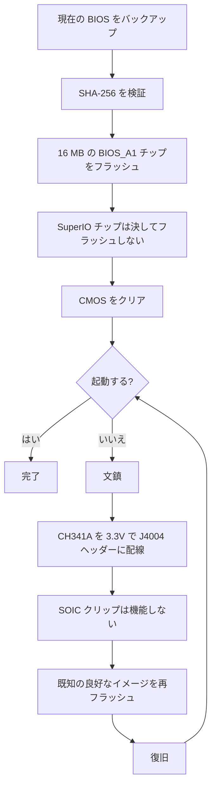

> 🌐 コミュニティ翻訳です。英語版が正となり、より新しい場合があります。誤りを見つけたら issue を立ててください：[English](../en/08-bios.md) · https://github.com/lildebil0/awesome-bc250/issues

# BIOS と文鎮復旧

> **要点** — 誤った BIOS 設定は **BC-250 を完全に文鎮化** させることがあり、このボードでは CMOS クリアでも *必ずしも* 復旧しません ([src](https://t.me/c/2424231195/54971))。*何か* をフラッシュする前に、これを理解してください：手元に **ハードウェア復旧キット**（**CH341A クラスの SPI プログラマー + メス-メスの DuPont 線**）が必要です。なぜなら、唯一確実な文鎮復旧は、ボードの **J4004 ヘッダー** を通じてチップを外部から再フラッシュすることだからです。人気のコミュニティ改造（「death」の BIOS、最新は標準 **5.00** ベース）はオーバークロック、GDDR6 タイミング、iGPU メモリ割り当てを解放します — 有用ですが、**すべての設定が安全なわけではなく、一部は即座にボードを文鎮化します** ([src](https://t.me/c/2424231195/78922))。各イメージの **SHA-256** を先に検証し、[`assets/firmware/DISCLAIMER.md`](../../assets/firmware/DISCLAIMER.md) を読んでください。**気軽にフラッシュしないこと。**

⚠️ **これはハンドブックで最も危険な章です。** フラッシュは破壊的で、復旧ハードウェアがなければ取り返しがつきません。文鎮を蘇らせるために SPI チップにはんだ付け/クリップする準備がないなら、**ここで止めて標準 BIOS を使ってください。**

---

## BC-250 における BIOS とは

BC-250 は、削減版の PS5「Oberon」APU を搭載した AsRock 製のマイニング/サーバーボードです。その UEFI ファームウェアは **16 MB の SPI フラッシュチップ**（8 ピン SOIC パッケージの Winbond **W25Q128** / Macronix MX25L128）に存在します。標準ファームウェアは厳重にロックされており、Setup で有用なものはほとんど公開されていません。チャットで見られた既知の標準バージョンは **3.00** と **5.00** で、改造 BIOS はこれらから再構築されています（バージョン番号があなたのアンカーです — 改造がどのベースで構築されているかを常にメモしてください）。

> ストック **4.00** も存在します。ストック **v4.0** と **v5.0** の唯一の機能的な違いは、v5.0 ではデフォルトで **network boot** が有効になっていることです。([src](https://discord.com/channels/1315924807128449065/1316030225338863636/1326825429595848816))

人々が再フラッシュする理由は 2 つ：

1. **改造 BIOS をインストールする** — 隠れたメニュー（オーバークロック、アンダーボルト、メモリ、iGPU VRAM）を解放するため。
2. **文鎮を復旧する** — 不良な設定や失敗したフラッシュの後に、既知の良好なイメージを復元するため。

> 💡 **そもそもフラッシュは不要かもしれません。** *唯一の* 目的が VRAM/UMA 配分の変更なら、**標準** の P3.00 / P5.00 BIOS のまま、動作中の Linux から **[fanoush/bc250_memcfg](https://github.com/fanoush/bc250_memcfg)** で実行できます — フラッシュなし、プログラマーなし、文鎮リスクなし（[elektricM: BIOS flashing](https://elektricm.github.io/amd-bc250-docs/bios/flashing/)、[elektricM: VRAM](https://elektricm.github.io/amd-bc250-docs/bios/vram/)）。改造 BIOS のフラッシュが必要になるのは、*アンロックされたチップセットメニュー* と VRAM サイズ設定を超える機能のためだけです（`bc250_memcfg` コマンドは [09-overclock-undervolt.md](../en/09-overclock-undervolt.md) を参照）。

---

## 改造 BIOS（「death」改造）— 何を変え、なぜか

リファレンスとなるコミュニティ改造は、チャットの **death** によって維持されています。これはゼロから作ったファームウェアでは *なく*、標準 BIOS が隠して出荷している AMD/AMI の Setup オプションを再有効化（再表示）したものです。アドバイスは時間とともに変わってきたので、バージョンを把握してください：

| 改造バージョン | ベース | リリース | 公開/変更したもの | 状態 |
|---|---|---|---|---|
| **1.0**（初回リリース） | 標準 **3.00** | 2025-06-28 | GDDR6 周波数、GDDR6 タイミング、iGPU UMA メモリサイズ、コア周波数、電圧 | ⚠️ 不正な値はボードを文鎮化、**CMOS クリアは効かなかった** ([src](https://t.me/c/2424231195/54971)) |
| 3.0 系 | 3.00 | 2025-07 → 10 | 同じアンロック。あるビルドは **カスタム Steam 起動ロゴ** を追加 | ロゴ装飾ビルドは `bc250-Steam.rom` としてミラー ([src](https://t.me/c/2424231195/86420)) |
| **5.00 改造**（現行） | 標準 **5.00** | 2025-10-05 | タブを再編成。**より多くの設定を開放**。**RAM/GDDR6 タイミング設定がこのボードで実際に適用される** ようになった | 最新。「すべての設定が有用なわけではないが、ないよりはまし」 ([src](https://t.me/c/2424231195/78922)) |

これで実際に調整できるもの（初回リリースのノートより、[src](https://t.me/c/2424231195/54971)）：

- **GDDR6 周波数** — あるユーザー（`@Haswellb`）では **1800** で動作したと報告されていますが、*同種の変更が別のボードを文鎮化しました* — 値はボード固有であり、普遍的ではありません。
- **GDDR6 タイミング** — 適用されますが、**低すぎる/きつすぎるタイミングはボードを文鎮化** します。
- **iGPU メモリ（UMA）サイズ** — 動作し、実際の向上が得られます。変更が反映されない場合は、**IGC: Forces** と **UMA Mode: UMA_SPECIFIED** を設定してください（[src](https://t.me/c/2424231195/54971)；同じ組み合わせがコミュニティのドキュメントでも確認されています）。
- **コア周波数 / 電圧** — 公開されていますが、作者によって **「未テスト」** です。

> ❗ **作者からの 2 つの警告、いまも有効：**（1）**Integrated Graphics を無効化しないこと** — これは唯一のディスプレイ出力です。（2）これらの改造のいずれでも、**誤った設定はボードを文鎮化し、CMOS リセットでは復旧できないことがあります** — まさにそのためにプログラマーが必要なのです。（ベースの選び方は下の「どのバージョン？」のラダーを参照。）

> ### どのバージョン？（決定ラダー）
>
> 1. **改造 P3.00（チップセットメニュー ROM）— 安全な既定。** これは確立された **「コミュニティ標準… 最も安定してテスト済み」** で、既知の SHA-256 を持つ検証済みの公開物であり、**VRAM 解放 + チップセット設定** をすでにカバーしています。そうしない特別な理由がなければ、ここから始めてください（[elektricM: BIOS flashing](https://elektricm.github.io/amd-bc250-docs/bios/flashing/)）。
> 2. **改造 5.00 — 現行。メモリチューニングが欲しいなら選択。** 最新のベースであり、**RAM/GDDR6 タイミング設定がこのボードで実際に適用される** 唯一のものです（[src](https://t.me/c/2424231195/78922)）。メモリタイミングを調整したいときは、特に P3.00 より優先してこれを選んでください。
> 3. **`P5.00_clv` — 上級者専用。** これは **「すべて」を解放** します（実験的な **ReBAR / Resizable BAR** やデバッグ/チップセット設定を含む、あらゆる隠れたメニュー）。そのため *「誤ったものを変えるとボードを非常に文鎮化しやすい… 上級ユーザーでなければ P3.00 にとどまれ」* となります。さらに悪いことに、**`P5.00_clv` はガイドが見つけられたどの公開リポジトリにも存在せず**、Discord の添付ファイルとしてのみ流通しているため、**正規のハッシュが存在しません**。どうしても使うなら、それを独立して動かしている **2 人** からコピーを入手し、フラッシュ前に両方が **同じ SHA-256** を持つことを確認してください（[elektricM: BIOS flashing](https://elektricm.github.io/amd-bc250-docs/bios/flashing/)）。

> **Modded 5.00 の知っておくべき注意点。** そのセットアップ画面では **デフォルトのCPU周波数が3600** と表示されますが、これはUI上の見かけの値であり、実際に適用されているクロックではありません ([src](https://discord.com/channels/1315924807128449065/1452152658168381593/1452406964780007515))。また、チップセット設定において **`x1x1x1x1` PCIe bifurcation** オプションが表示されます ([src](https://discord.com/channels/1315924807128449065/1452152658168381593/1474231812598534351))。このベースでのメモリタイミングには細心の注意を払ってください。**極端なタイミング値を設定すると、外部書き換えを行うまでボードが文鎮化（ブリック）する可能性があり、それは P5.00 においてより深刻な問題となります** ([src](https://discord.com/channels/1315924807128449065/1371527281947971604/1468745940994101372))。そして、他のフラッシュと同様に、modded 5.00 への移行時は **CMOSをクリアするまで画面が表示されない**状態になることがあります ([src](https://discord.com/channels/1315924807128449065/1315933088668454942/1508568321346502892))。

最も参照されている BIOS リポジトリ **[TuxThePenguin0/bc250-bios](https://gitlab.com/TuxThePenguin0/bc250-bios/)** からの別の **チップセットメニュー改造**（`BC250_3.00_CHIPSETMENU.ROM`）もあり、これは標準 3.00 の上に **チップセットメニュー / NBIO Common Options** を公開します。そのリポジトリ自身の README ははっきりこう述べています：*「このリポジトリ内のものは一切サポートされず、いかなる保証もありません — バックアップを取れ。」*

> 🚫 **`Smokeless_UMAF` は避けること。** コミュニティのオーバークロックガイドは、この UEFI 編集ツールを **BC-250 で実行してはならない — ボードに恒久的な損傷を与える可能性がある** ものとして指摘しています（[elektricM: BIOS overclocking](https://elektricm.github.io/amd-bc250-docs/bios/overclocking/)）。上記の既知の良好な ROM にとどまってください。

---

## フラッシュ前 — 安全チェックリスト

1. **まず現在の BIOS をバックアップ**（フラッシュに使うのと同じツールで読み出す — Path B / 復旧を参照）。バックアップはあなたの無料の取り消しボタンです。
2. イメージの **SHA-256 を検証** し、`assets/PROVENANCE.md` / ソースの投稿と照合します。コミュニティのフラッシュガイドは、チップセットメニュー ROM のハッシュを次のように公開しています：
   `48fbe5d366e6a56e2fdffdca848426216ba1f083610dab63db89d2f4e6c940b5`（[elektricm docs](https://elektricm.github.io/amd-bc250-docs/bios/flashing/)）。
3. 刻印だけでなく、**チップサイズを確認** します。16 MB の BIOS チップが対象です。**小さい SuperIO チップをフラッシュしないこと**（復旧セクションを参照）。ボードリビジョンによってチップの型番がわずかに異なることがあります — 重要なのは **容量（16 MB）** であり、刻印の末尾の文字は異なることがあります（[src](https://t.me/c/2424231195/67880)）。
4. 文鎮化した後ではなく、最初のフラッシュの *前に* **復旧ハードウェアを用意** しておきます。
5. フラッシュ後、新しい設定（特に VRAM 割り当て）を反映させるために **CMOS をクリア** します（「フラッシュのたびに」を参照）。



### フラッシュ前にチェックサムを検証する

上記のステップ 2 で SHA-256 を検証すると述べました — その方法がこれです。これからフラッシュするファイルのハッシュを計算し、[`assets/PROVENANCE.md`](../../assets/PROVENANCE.md) でそのファイルに対して記載されている値と、1 文字ずつ比較してください。

```bash
# Linux:
sha256sum BC250_3.00_CHIPSETMENU.ROM
```

```powershell
# Windows (PowerShell):
Get-FileHash BC250_3.00_CHIPSETMENU.ROM -Algorithm SHA256
```

`PROVENANCE.md` は、短いフィンガープリントとして **先頭 16 桁の 16 進文字** のみを記載している場合があります。その場合、計算したハッシュがその 16 文字で **始まる** ことを確認してください — そのプレフィックスの完全一致だけでも、すでに強力なチェックです（メンテナーは要求に応じて完全なハッシュを公開できます）。

公開ホストされているイメージの **検証済みの完全な SHA-256 ハッシュ**（複数のコミュニティリポジトリ間でクロスチェック済み — 既知の良好な BC-250 BIOS ファイルはすべて **正確に 16 MB / 16777216 バイト** です。サイズが異なる場合は、破損しているか、ツール/パッチか、無関係なものです）（[elektricM: BIOS flashing](https://elektricm.github.io/amd-bc250-docs/bios/flashing/)）：

| ファイル | 種類 | SHA-256 |
|---|---|---|
| `BC250_3.00_CHIPSETMENU.ROM`（別名 `Robin3.00`、`BC250CHIPSETMENU.ROM`） | **改造 P3.00** — VRAM + チップセット解放、*推奨* | `48fbe5d366e6a56e2fdffdca848426216ba1f083610dab63db89d2f4e6c940b5` |
| `Robin5.00` | **標準** P5.00（改造 `P5.00_clv` ではない） | `0d6f136cb120cf3b2de26d5c4d7f255604fdbf4b9442af5ba55419b95b89aa82` |
| `BC250_3.00.ROM` | 標準 P3.00 | `07595ca3aecf8a4caa28a397b5298f3946a1b769f87b16f67adc369c3f69045c` |
| `BC250_2.00.bin` | 標準 P2.00 | `ee6150dfed33bd05ea46063a352549416fdf3f45fa0e5edac2a68ef78d71083c` |
| `P5.00_clv` | 改造 P5.00（すべて解放） | **公開ハッシュは存在しない** — Discord のみ、独立した 2 つのコピーが一致することを検証 |

> 改造 P3.00 はリポジトリ間で複数のファイル名で現れます（`BC250_3.00_CHIPSETMENU.ROM`、`BC250CHIPSETMENU.ROM`、`Robin3.00`）— それらはすべて上記の値にハッシュされるので、名前は問題ではありません。`Robin5.00` は **標準** の P5.00 で、改造 `P5.00_clv` とは *別のファイル* です。各ファイルの公開ソース（TuxThePenguin0 GitLab、forgenam、tipitochen、csabakecskemeti、scrakcho、dannybastos、kenavru、MrrZed0）は [elektricM のフラッシュガイド](https://elektricm.github.io/amd-bc250-docs/bios/flashing/) に一覧されています。

> 🔴 **チェックサムが一致しない場合、フラッシュしないこと。** 不一致は、破損したファイルか誤ったファイルを意味します — それをフラッシュすることが、まさにボードを文鎮化する方法です。イメージを再ダウンロードして、もう一度検証してください。

---

## Path A — ソフトウェアフラッシュ（ボードから、プログラマー不要）

これは、ボードがまだ起動するうちに BIOS をインストール/アップグレードする通常の方法です。**FAT32 の USB スティック** と AMI ファームウェア更新ユーティリティを使います。

**EFI / AFU 方式**（[src](https://t.me/c/2424231195/54979)）：

1. USB スティックを **FAT32** にフォーマットします。
2. AFU アーカイブ（例 `AfuEfi64_5.16.zip`）の中身 **と BIOS ファイル** をその上にコピーします。
3. BC-250 を再起動し、**USB スティックから起動** して EFI シェルに入ります。
4. 実行：
   ```
   afuefix64.efi <filename>.<ext> /P /N
   ```
   - `/P` = メイン BIOS をプログラムします。
   - `/N` = **NVRAM** もプログラムします。これはバージョン *間* を移動するとき（例：別バージョンから 3.00 へ）のエラーを避けます — **ただし保存した設定を消去します。** `/N` を省略してもよいですが、その場合はエラーが起きる可能性があると考えてください。 ([src](https://t.me/c/2424231195/54979))
5. ツールがファイルを見つけられない場合、`fs0:`、`fs1:`、… を試して、どれがスティックかを見つけます（[src](https://t.me/c/2424231195/54979)）。

一部のコミュニティビルドには、出来合いの `Flash.nsh` スクリプトとリネーム済みの ROM が同梱されており（例：改造 ROM をスクリプトに合わせてリネーム）、EFI シェルに起動してスクリプトを実行するだけで済みます（[elektricm docs](https://elektricm.github.io/amd-bc250-docs/bios/flashing/)）。Linux には、動作中のシステムからフラッシュするための **`afulnx`** ビルド（`afulnx-5.05.04Z.tar.gz`）もあります（[src](https://t.me/c/2424231195/54507)）。

#### 正規の EFI シェルのレシピ（`Flash.nsh` / `Robin5.00` 方式）

コミュニティのフラッシュガイドは、自己完結したキットと固定のファイル名で標準化しています — これは最も再現されている USB 経路です（[elektricM: BIOS flashing](https://elektricm.github.io/amd-bc250-docs/bios/flashing/)）：

1. **EFI キットを入手：** `4U12G BIOS Update.zip`（[kenavru/BC-250](https://github.com/kenavru/BC-250) リポジトリから）— `AfuEfix64.efi`、`Flash.nsh`、`amdvbflash.efi` が含まれています。*また `Robin5.00` という名前の標準 P5.00 BIOS も同梱されているので、誤ってフラッシュしないよう退避させてください。*
2. **FAT32 スティックを準備（32 GB 以下を推奨）。** キットの `BIOS EFI` フォルダの中身を **ルート** にコピーします。
3. **改造 ROM を `Robin5.00` にリネーム**（`.ROM` 拡張子を外す）— これが `Flash.nsh` が探す正確な名前です。*（または、代わりに `Flash.nsh` をあなたのファイル名に合わせて編集します。）* ルートには次が置かれているはずです：`AfuEfix64.efi`、`Flash.nsh`、`amdvbflash.efi`、`Robin5.00`（リネームした改造）、そして `EFI` フォルダ。
4. **直接の DisplayPort モニターを使う。** アクティブ/パッシブの **HDMI アダプターは BIOS メニューをブラックスクリーンにすることがあります** — このボードで既知のディスプレイの落とし穴です。
5. **すべての SSD/ドライブを外して** ボードが自動的に EFI シェルに落ちるようにし、スティックを挿し、電源を入れます。黄色の `Shell>` プロンプトに到達します。
6. プロンプトで **`blk0:`** と入力して Enter — **コロンの後のスペースに注意**（これで USB ボリュームを選択します。`blk0:` は elektricM が文書化したセレクターで、上記の `fs0:`/`fs1:` 探索とは異なります）。次に **`Flash.nsh`** と入力して Enter。
7. **待つこと。キーボードに触れず、電源を切らないこと。** 書き込み中にハングした *ように見えても*、**少なくとも 15 分は待ってください** — 書き込みの途中で電源を切るとボードが文鎮化します。完了すると再起動します（または再起動を求められます）。
8. **すぐに電源を切ってスティックを取り外し**、フラッシャーにループバックしないようにします。

> 🔴 **フラッシュのために電源を入れる前に：8 ピン PCIe 電源の配線を** PSU の 12 V/GND 図と照合してください。**極性の逆接続はボードに恒久的な損傷を与える可能性があります**（[elektricM: BIOS flashing](https://elektricm.github.io/amd-bc250-docs/bios/flashing/)）。

#### 必須のフラッシュ後 BIOS 設定（CMOS クリアの直後に行うこと）

フラッシュ **して** CMOS をクリアした（次のセクション）後、Setup に入り（**Del** を連打）、これらを設定してください — これらが正しくなるまで VRAM 配分は正しく動きません（[elektricM: BIOS flashing](https://elektricm.github.io/amd-bc250-docs/bios/flashing/)、[elektricM: BIOS VRAM](https://elektricm.github.io/amd-bc250-docs/bios/vram/)）：

| 設定 | パス | 値 |
|---|---|---|
| Integrated Graphics Controller | Chipset → GFX Configuration | **Forces** |
| UMA Mode | Chipset → GFX Configuration | **UMA_SPECIFIED** |
| UMA Frame Buffer Size | Chipset → GFX Configuration | **512MB**（推奨）または固定サイズ |
| IOMMU | Advanced → CPU Configuration | **Disabled** |
| Boot Mode | Boot → Boot Mode | **UEFI** |

まず CMOS クリアが実際に効いたかを確認してください — **時計が誤った値を示すはず** です。まだ正しいなら、クリアを繰り返してください。その後 F10 で保存。`512MB` という選択は *ダイナミック* な割り当てであって、512 MB の上限ではありません（[09-overclock-undervolt.md](../en/09-overclock-undervolt.md) を参照）。

> ★ **なぜ 512 MB UMA が FPS を *向上* させるのか（その仕組み）。** UMA バッファを **512 MB** に設定しても GPU を飢えさせはしません — 大きな固定スライスをロックして隔離する代わりに、システムが **RAM と VRAM を動的にバランス** できるようにするのです。そして、その再バランスだけで実際の FPS 向上が認められました：Cyberpunk 2077 は FSR 3.0 *balanced*、1080p、Steam-Deck プリセットで **60 → 66 fps（2 GHz OC 時）→ 76 fps** になりました（[Old Lamer — Part I](https://youtu.be/ohpEY2XQ_lo) 約 11:21；⚠ 概算 — 数値は動画から書き起こしたもので、1 つのビルドの結果として扱ってください）。つまり「512 MB が最良」は単に安全なサイズ設定なのではなく — 小さなダイナミックバッファはパフォーマンス物語の *一部* であって、妥協ではありません。

**flashrom フォールバック**（AFU がエラーになる場合）（[src](https://t.me/c/2424231195/54979)、`@mrartemsid` が提案・テスト済み）：

```bash
# Read (back up):
sudo flashrom -p internal:boardmismatch=force -r <name>.bin
# Write:
sudo flashrom -p internal:boardmismatch=force -w <name>.bin
```

> ⚠️ ソフトウェアフラッシュは **ボードがまだ POST するうちにしか** 役立ちません。不良設定がそれを文鎮化した瞬間、Path A は失われ、下のハードウェア経路に進むことになります。

---

## Path B — ハードウェアフラッシュ / 文鎮復旧（CH341A SPI プログラマー）

これは **復旧** 経路で、ピン留めされた「文鎮をフラッシュする最も便利な方法」です（[src](https://t.me/c/2424231195/67880)）。USB SPI プログラマーを使い、別の PC から 16 MB の SPI チップを直接書き換えます。使用ソフトウェア：**NeoProgrammer**（Windows）または **flashrom**（Linux）。

> 🔴 **SOIC-8 クリップはこのボードでは機能しません。** death ははっきりこう言っています：*「我々のボードでクリップは… 基本的にまったく動かない。」* ([src](https://t.me/c/2424231195/67880))。注意：`assets/firmware/DISCLAIMER.md` は一般論として「SOIC クリップ」に言及していますが、実際には **代わりにオンボードの J4004 ヘッダーに配線しなければなりません。** これは、この章で最も重要な復旧の事実です。

### J4004 ヘッダーのピン配置（ここに配線）

ボードは、SPI/BIOS チップを再フラッシュするために特化した **2.54 mm ピッチの J4004 ヘッダー** を備えています。ピン配置（ピン留めの配線スクリーンショットより、[src](https://t.me/c/2424231195/67880)）：

```
J4004
[ GND  SCLK  MOSI  UNK ]
[ VCC  CS    MISO      ]
   ^  (pin-1 marker)
```

| J4004 ピン | 信号 | CH341A パッド |
|---|---|---|
| VCC | 3.3 V 電源 | VDD / 3.3V |
| GND | グランド | GND |
| CS | チップセレクト | CS / SS |
| SCLK | クロック | CLK / SCK |
| MOSI | データ入力（チップへ） | MOSI |
| MISO | データ出力（チップから） | MISO |

対応する **W25Q128 SOIC-8 / CH341A の色対応表** は同じピン留めスクリーンショットにあります — `/CS, DO(MISO), CLK, DI(MOSI), VCC, GND` を CH341A の `CS, MISO, CLK, MOSI, VDD, GND` パッドに合わせてください。電源を入れる前に **VCC と GND を三重確認** すること。逆にするとチップが死にます（[src](https://t.me/c/2424231195/67880)）。

> **J4004 のピン番号と 2 つの不明ピン。** elektricM のガイドはヘッダーを VCC=1、GND=2、CS=3、SCLK=4、MISO=5、MOSI=6 と番号付けしており、**ピン 7 と 8 はフラッシュには未使用です — 10 kΩ 抵抗でグランドに落ちています。** ピン 1（VCC）は PCB 上の **矢印 `>` または四角いパッド** で示されています（[elektricM: BIOS flashing](https://elektricm.github.io/amd-bc250-docs/bios/flashing/)）。

> **正確な対象チップと密度の誤記。** 16 MB の部品は Winbond **W25Q128JVSQ**（128 Mbit / 16 MB）か、一部のバッチでは Macronix **MX25L12835F** です。一部のコミュニティドキュメントはこれを **「25Q168」と誤記していますが、それは誤り** です。正しい 16 MB の密度コードは **128** です（[elektricM: BIOS flashing](https://elektricm.github.io/amd-bc250-docs/bios/flashing/)）。J4004 ではなく素の **SOIC-8 クリップ** でフラッシュする場合、チップ自身のピン順序は標準的な SPI 配列です：`1 CS · 2 DO · 3 WP · 4 GND · 5 DI · 6 CLK · 7 HOLD · 8 VCC`（[elektricM: BIOS recovery](https://elektricm.github.io/amd-bc250-docs/bios/recovery/)）— ただし **このボードではクリップが辛うじてしか動かない** という death の発見を思い出して、J4004 を優先してください。

> 🙏 クレジット：J4004 のピン配置、リバースエンジニアリング、改造ファームウェアイメージのリポジトリは、主に **Segfault** の仕事です（P3.00 チップセットメニュー ROM は「Segfault 改造」です）（[elektricM: BIOS flashing](https://elektricm.github.io/amd-bc250-docs/bios/flashing/)）。

### NeoProgrammer の手順（ピン留め）（[src](https://t.me/c/2424231195/67880)）

1. ピン配置に従い、メス-メス線でプログラマーを **J4004** に接続します。**配線を約 10 回チェック、特に VCC と GND。**（PSU は抜いた状態。）
2. **NeoProgrammer** を開きます。
3. チップの **自動検出** を実行し、チップ自体の刻印も読み取ります。
4. **刻印を比較。** 末尾の文字が一覧と異なっても **容量が一致（16 MB）** していれば問題ありません。
5. チップを **消去** します。
6. ソフトウェアで **BIOS ファイルを開きます**（ドラッグ＆ドロップが使えます）。
7. チップに **書き込みます**。
8. **J4004 から線を外します。**
9. ボードの電源を入れます。

### flashrom の等価手順（Linux）、コミュニティドキュメントとクロスチェック済み

コミュニティのフラッシュガイドは **CH347** プログラマーを使い、安価な黒 PCB の CH341A ボードに警告しています（次のセクション）。正しいチップを識別してください — **16 MB の BIOS チップ**（`BIOS_A1`）を対象にし、512 KB の SuperIO（`SIO1_R`）は **決して** 対象にしないこと。フラッシュすると SuperIO を文鎮化します（[elektricm docs](https://elektricm.github.io/amd-bc250-docs/bios/flashing/)）：

```bash
# Detect / identify the chip:
sudo flashrom -p ch347_spi

# Back up the stock BIOS (twice, then diff to be sure the read is stable):
sudo flashrom -p ch347_spi -r backup_stock.bin
sudo flashrom -p ch347_spi -r backup_verify.bin

# Write the new image, then verify it read back identical:
sudo flashrom -p ch347_spi -w BC250_3.00_CHIPSETMENU.ROM
sudo flashrom -p ch347_spi -v BC250_3.00_CHIPSETMENU.ROM
```

（`ch347_spi` の代わりに、CH341A なら `-p ch341a_spi`、Raspberry Pi Pico なら `serprog` を使います。）⚠ *この* ボードの正確な配線に対する `ch347_spi` / `serprog` のマッピングはコミュニティガイドからのものです — あなた自身のプログラマーモデルに対して `⚠ verify` してください。

> **検出によって、どのチップに接続しているかがわかります。** `flashrom -p …` が **`Winbond W25Q128…`** または **`Macronix MX25L128…`** を報告すれば、正しい 16 MB の BIOS チップに接続しています。**`Macronix MX25L4005…`（512 KB）** を報告したら、**止めてください — SuperIO チップ（`SIO1_R`）に接続しています**。それをフラッシュするとファン制御/センサーを文鎮化します。もう一方のチップに移ってください（[elektricM: BIOS flashing](https://elektricm.github.io/amd-bc250-docs/bios/flashing/)）。**PSU をコンセントから抜き**、コンデンサを放電した状態（電源ボタンを数回叩く）でフラッシュしてください — クリップフラッシュ中にボードに通電するのは推奨され *ません*（[elektricM: BIOS recovery](https://elektricm.github.io/amd-bc250-docs/bios/recovery/)）。

### CH341A の 3.3 V の罠（これを読まないとチップを焼きます）

安価な **黒 PCB の CH341A** プログラマーの多くは、**VCC が 3.3 V でもデータラインを 5 V で駆動します** — BC-250 の BIOS チップは **3.3 V** の部品なので、データラインの 5 V はそれを損傷しかねません。これは一部のボードで既知の、実測された不具合です（Fabian のボードと、チャットの同一のボードが電圧測定で確認されました）（[src](https://t.me/c/2424231195/100285)）。対処：

- データラインが本当に 3.3 V のプログラマー（例 **CH347**）を優先するか、**または**
- **はんだ付け不要の CH341A 5V→3.3V データライン修正** を適用します：チップへの USB 5 V 電源線を切り、代わりに 3.3 V を供給します — [sawyershepherd.org の解説](https://sawyershepherd.org/post/solderless-ch341ab-fix-5v-to-33v-data-lines/) と [wej.k.vu CH341A fix](https://wej.k.vu/electronics/ch341a-mini-programmer-fix/) を参照（[src](https://t.me/c/2424231195/100285)）。

---

### 低レベルヘッダー、デバッグ、オンボードシリコン

上記の J4004 フラッシュヘッダーのほかに、ボードは他のいくつかのヘッダーと、既知のオンボードチップ群を備えています。これらは elektricM のハードウェアドキュメントでリバースエンジニアリングされており、CMOS のクリア、デバッグプロービング、ファン配線、そしてフラッシュ前にどのチップがどれかを確認するのに役立ちます。ピン値は ([elektricM: pinouts](https://elektricm.github.io/amd-bc250-docs/hardware/pinouts/)) からそのまま書き写しています。

**CLRCMOS1 — clear-CMOS ジャンパー（3 ピン）。** これは、この章のあちこちで「CMOS ジャンパーをショートする」と言及されているジャンパーです — そのマップがこれです：

| 位置 | 動作 |
|---|---|
| ピン 1–2 | CR2032 が CMOS に給電（既定） |
| ピン 2–3 | CMOS をクリア |

> 💡 [フラッシュ後チェックリスト](#フラッシュ前--安全チェックリスト) と [「フラッシュのたびに」](#フラッシュのたびに--cmos-をクリアこれを飛ばさない) が「CMOS ジャンパーを約 20 秒ショートする」と指示するとき、その **CLRCMOS1** がそのジャンパーです：ピン 1–2 からピン 2–3 に移し、待ち、また戻します。（CR2032 を 60 秒以上外すのが代替です。）

**TPMS1 — LPC デバッグヘッダー（18 ピン、2.0 mm ピッチ）：**

| ピン | 信号 | ピン | 信号 |
|---|---|---|---|
| 1 | PCICLK | 2 | GND |
| 3 | FRAME | 4 | SMB_CLK_MAIN |
| 5 | PCIRST# | 6 | SMB_DATA_MAIN |
| 7 | LAD3 | 8 | LAD2 |
| 9 | 3V | 10 | LAD1 |
| 11 | LAD0 | 12 | GND |
| 13 | (empty) | 14 | S_PWRDWN# |
| 15 | 3VSB | 16 | SERIRQ# |
| 17 | GND | 18 | GND |

> 💡 **ピン 9（3V）はボードに通電しているときだけ生きています** — そのため「システムオン」検出信号として機能します。これにより、自動電源オン / 真の ATX アダプター製作のための代替センスポイントになります（[03-power-supply.md の `AUTO_PWRON` ジャンパー](../en/03-power-supply.md)を相互参照）。

**J2 — JTAG/HDT デバッグヘッダー（20 ピン、1.27 mm ピッチ、未実装、ボード裏面）：**

| ピン | 信号 | ピン | 信号 |
|---|---|---|---|
| 1 | VDDIO | 2 | TCK |
| 3 | GND | 4 | TMS |
| 5 | GND | 6 | TDI |
| 7 | GND | 8 | TDO |
| 9 | TRST_L | 10 | PWROK_BUF |
| 11 | DBRDY3 | 12 | RESET_L |
| 13 | DBRDY2 | 14 | DBRDY0 |
| 15 | DBRDY1 | 16 | DBREQ_L |
| 17 | GND | 18 | TEST19 |
| 19 | VDDIO | 20 | TEST18 |

> TEST18、TEST19、DBRDY0 は未接続のままです。これはボード上で **唯一の** ハードウェアリセット/デバッグインターフェースです。

**I2C_HEADER1（3 ピン）：** `SCL · SDA · GND`。SCL は **電源コネクタに近い** 側のピンです。このバスは **Intersil PMIC への PMBUS** を伝送します — 電力テレメトリのアクセスポイントです。

**CPU_FAN1（4 ピン）：** `PWM · Tach · 12V · GND`。

**J4003 — マルチファンヘッダー（16 ピン、2×8、2.54 mm）：**

| 行 1 | 1 GND | 2 F1T | 3 F2T | 4 F3T | 5 F4T | 6 F5T | 7 DET | 8 (empty) |
|---|---|---|---|---|---|---|---|---|
| **行 2** | 1 GND | 2 F1P | 3 F2P | 4 F3P | 5 F4P | 6 F5P | 7 GND | 8 GND |

ここで `T` = tach、`P` = PWM、ファン 1–5 ごと。

> 💡 **DET（行 1、ピン 7）は、ボードがファン/電源分配ボードの上に載っているときグランドに落ちます** — つまりキャリアを検出します。（BIOS↔Linux のファン番号付けは [06-linux.md → Sensors & fan control](../en/06-linux.md#sensors--fan-control) で扱っており、ここでは重複しません。）

**オンボードシリコン（BOM）。** リポジトリはフラッシュのセクションですでに `SIO1_R` と `BIOS_A1` に言及していますが、型番やサイズを示したことはありません。この表は、フラッシュする人がどのチップがどれかを確認できるようにします（16 MiB の Winbond が BIOS、512 KiB の Macronix が SuperIO — そちらは触らないこと）：

| 識別子 | 部品 | 役割 |
|---|---|---|
| PUA1 | Intersil ISL69247 | メイン PMIC |
| PUIO1 | Intersil ISL95712 | コア供給 PMIC |
| PUA11… | Intersil ISL99360 | スマートパワーステージ（フェーズ） |
| M2U2 | NXP CBTL04083B | 2:1 PCIe x4 マルチプレクサ |
| U30 | Realtek RTL8111H | Ethernet NIC（PCIe x1） |
| SU1 | AMD 218-0844029 | A68H「Bolton-D2H」FCH チップセット |
| UIO1 | Nuvoton NCT6686D | SuperIO（hwmon センサーチップ） |
| BIOS_A1 | Winbond 25Q128JVSQ | 16 MiB SPI フラッシュ = **BIOS**（これをフラッシュ） |
| SIO1_R | Macronix MX25L4006E | 512 KiB SPI フラッシュ = SuperIO プログラム（**フラッシュしない — SuperIO を文鎮化**） |

> ここに挙げた SuperIO センサーチップ（Nuvoton **NCT6686D**）は、Linux の `nct6687`/`nct6683` ドライバーがバインドするものです — センサー/ファンのセットアップは [06-linux.md](../en/06-linux.md) を参照。

**ファームウェアツール（上級者向け）。** イメージを詳細に調査するために、2つのユーティリティが繰り返し登場します：

- **`psptool`** はBIOSダンプ内のAMDファームウェアblobを検査および抽出します。`psptool -E bios.bin` はエントリをリストし、`psptool -X -d 0 -e 1 -o firmware.bin bios.bin` は分析用にSMUファームウェアを抽出します。([bc250-collective/amd_smu_reverse_engineering](https://github.com/bc250-collective/amd_smu_reverse_engineering))
- **`Zentool`** はCPUマイクロコードにパッチを適用します — 例えば `RDRAND` 命令を置き換えるためなど。([AMD-BC-250/documentation #1](https://github.com/AMD-BC-250/documentation/issues/1))

---

## Secure Boot と CSM（起動の前提条件）

この 2 つを BIOS 設定の前提条件リストに追加してください — 必須であり、なければ **カスタム/パッチ済みカーネルは起動しません**（40-CU パッチ、周波数パッチなど）：

| 設定 | 値 |
|---|---|
| Secure Boot | **Disabled** |
| CSM (Compatibility Support Module) | **Disabled** |

出典：[elektricM: boot troubleshooting](https://elektricm.github.io/amd-bc250-docs/troubleshooting/boot/)。

---

## 「srep」自動リセットのアイデア（実験的 — 完成した機能ではない）

不良設定がボードを文鎮化し、**CMOS クリアでは直らない** ことがあるため、death は **文鎮時に設定を自動リセットする** ための **`srep`** ルーチンを BIOS に焼き込むことを試しました — アイデアは元々 `@Jacky_Fish` のものです（[src](https://t.me/c/2424231195/60552)）。コンセプトは、BIOS が自身の NVRAM/`amdsetup` 変数をデフォルトに戻すというもので、任意で、USB スティック上にトリガーファイルがあるときだけ実行する（毎回の起動で設定を消さないように）こともできます。チャットの時点では、**これはまだ機能していません** — *「ボードは頑なに完全な文鎮のふりをし、何もリセットされない」* ([src](https://t.me/c/2424231195/60883))。あらゆる「自己修復 BIOS」の主張は **未実証** として扱ってください。あなたの本当の安全網は、依然として外部プログラマーです。どの srep ビルドにも頼る前に `⚠ verify` してください。

---

## フラッシュのたびに — CMOS をクリア（これを飛ばさない）

BIOS のフラッシュは保存された設定を **リセットしません**。いくつかの設定（特に **VRAM/UMA 割り当て**）は、CMOS をクリアするまで実際には適用されません。あるユーザーがまさにこれに遭遇しました：BIOS は新しい VRAM サイズを表示して「保存」しましたが、OS（Bazzite）は CMOS をクリアするまで古い 4 GB RAM / 12 GB VRAM の配分を報告し続けました（[src](https://t.me/c/2424231195/97290)）。クリアの方法：

- **CR2032 コイン電池を 60 秒以上外す**（推奨）、**または**
- **CMOS ジャンパーを約 20 秒ショートする。**（[elektricm docs](https://elektricm.github.io/amd-bc250-docs/bios/flashing/)）

> 限界に注意：CMOS クリアは「設定が適用されない」と *軽度の* 不良設定を直しますが、1.0/3.00 改造世代では真の文鎮を **復旧しない** と報告されています（[src](https://t.me/c/2424231195/54971)）。それには Path B を参照してください。

---

## ミラーされたファームウェア

チャットで議論された BIOS イメージは、**復旧/保存** のために `assets/firmware/` 以下にミラーされています（[`DISCLAIMER.md`](../../assets/firmware/DISCLAIMER.md) を参照し、フラッシュ前に `PROVENANCE.md` で各ファイルの SHA-256 を検証してください）：

| ファイル | サイズ | これは何か | ソース |
|---|---|---|---|
| `BC250_3.00.ROM` | 16 MB | 標準 3.00 ダンプ | ([src](https://t.me/c/2424231195/5215)) |
| `BC250_3.00_CHIPSETMENU.ROM` | 16 MB | チップセットメニュー改造（TuxThePenguin0） | ([src](https://t.me/c/2424231195/86395)) |
| `dump_5.00.bin` | 16 MB | 標準 5.00 ダンプ | ([src](https://t.me/c/2424231195/24661)) |
| `BC250_5.00_clv.zip` | 16 MB | **death の 5.00 改造（現行）** | ([src](https://t.me/c/2424231195/78922)) |
| `bc250_3.00_clv1.zip` | 16 MB | death の最初の 3.00 改造（1.0） | ([src](https://t.me/c/2424231195/54971)) |
| `bc250-Steam.rom` | 16 MB | Steam 起動ロゴ付き 3.0 改造 | ([src](https://t.me/c/2424231195/86420)) |
| `bc250 modded bios.ROM` | 16 MB | 初期の改造イメージ | ([src](https://t.me/c/2424231195/30100)) |
| `my_4.0_MODED.bin` | 16 MB | 暫定の 4.0 改造 | ([src](https://t.me/c/2424231195/45580)) |
| `W25Q128BV@WSON8_…BIN` | 16 MB | 生のチップ読み出し（W25Q128） | ([src](https://t.me/c/2424231195/5217)) |
| `AfuEfi64_5.16.zip` | — | AMI AFU EFI フラッシャー | ([src](https://t.me/c/2424231195/54979)) |
| `afulnx-5.05.04Z.tar.gz` | — | AMI AFU Linux フラッシャー | ([src](https://t.me/c/2424231195/54507)) |

> PS5 BIOS（`PS5 Disk Edition … BIOS.bin`、2 MB）や 512 KB のチップを BC-250 の 16 MB BIOS チップにフラッシュしないこと — 対象が違います。復旧の警告を参照。

---

## 出典

- death の改造 — 初回リリース（3.00）— https://t.me/c/2424231195/54971 · 現行（5.00）— https://t.me/c/2424231195/78922 · Steam ロゴビルド — https://t.me/c/2424231195/86420
- ソフトウェアフラッシュ（AFU `/P /N`、flashrom）— https://t.me/c/2424231195/54979 · afulnx — https://t.me/c/2424231195/54507
- ハードウェア文鎮復旧（ピン留め、NeoProgrammer + J4004 配線スクリーンショット）— https://t.me/c/2424231195/67880
- srep 自動リセットのアイデア — https://t.me/c/2424231195/60552 · 結果（機能しなかった）— https://t.me/c/2424231195/60883
- フラッシュ後の CMOS クリアが必要 — https://t.me/c/2424231195/97290
- CH341A 5V→3.3V データラインの罠 — https://t.me/c/2424231195/100285 · 修正の解説 — https://sawyershepherd.org/post/solderless-ch341ab-fix-5v-to-33v-data-lines/
- 最も参照されている BIOS リポジトリ — [TuxThePenguin0/bc250-bios](https://gitlab.com/TuxThePenguin0/bc250-bios/)（`BC250_3.00_CHIPSETMENU.ROM`、`CHIPSETMENU.md`）
- コミュニティのフラッシュ/復旧ガイド（検証済み SHA-256 表、`Flash.nsh`/`Robin5.00` レシピ、`blk0:` セレクター、DisplayPort/HDMI の落とし穴、15 分ハングのルール、J4004 ピン配置 + ピン 7/8、W25Q128JVSQ/「25Q168」誤記、CH347、フラッシュ後 Setup 値、Segfault クレジット）— [elektricM: BIOS flashing](https://elektricm.github.io/amd-bc250-docs/bios/flashing/)
- 復旧ガイド（SPI 8 ピンのピン配置、MX25L4005 = SuperIO 検出、PSU を抜いてフラッシュ、シナリオの手順解説）— [elektricM: BIOS recovery](https://elektricm.github.io/amd-bc250-docs/bios/recovery/)
- ボードのピン配置とオンボードシリコン（CLRCMOS1、TPMS1 LPC、J2 JTAG/HDT、I2C_HEADER1、CPU_FAN1、J4003 マルチファン、Intersil/NXP/Realtek/Nuvoton/Winbond/Macronix BOM）— [elektricM: pinouts](https://elektricm.github.io/amd-bc250-docs/hardware/pinouts/)
- VRAM ガイド（`bc250_memcfg` のフラッシュ不要サイズ設定、UMA Frame Buffer 値、カーネルパラメータ VRAM、Vulkan 対 OpenGL の報告）— [elektricM: BIOS VRAM](https://elektricm.github.io/amd-bc250-docs/bios/vram/)
- ★ 512 MB UMA → ダイナミック RAM/VRAM バランス → FPS 向上の仕組み（Cyberpunk 60 → 66 @ 2 GHz OC → 76 fps、FSR 3.0 balanced、1080p、Steam-Deck プリセット）— [Old Lamer — Part I](https://youtu.be/ohpEY2XQ_lo) 約 11:21（⚠ 概算、動画から書き起こし）
- `Smokeless_UMAF` の危険性に関する注記 — [elektricM: BIOS overclocking](https://elektricm.github.io/amd-bc250-docs/bios/overclocking/)
- フラッシュ不要の VRAM ツール — [fanoush/bc250_memcfg](https://github.com/fanoush/bc250_memcfg)
- メモリタイミングユーティリティ — `Mem_Timing_Utility.zip` https://t.me/c/2424231195/55351
- ファームウェアミラーのポリシー — [`assets/firmware/DISCLAIMER.md`](../../assets/firmware/DISCLAIMER.md)

> これらのアンロックされた設定を *使った* オーバークロック/アンダーボルトは [09-overclock-undervolt.md](../en/09-overclock-undervolt.md) で扱っています。ミラーされた BIOS イメージは `assets/firmware/` 以下にあり、ファイルごとの SHA-256 は `PROVENANCE.md` にあります。
