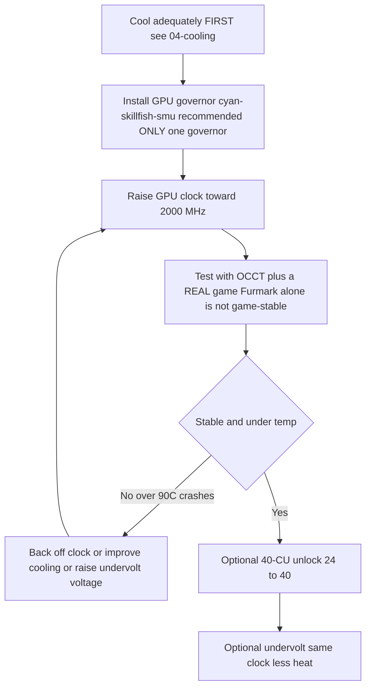

# オーバークロックとアンダーボルト

> **要点** — 箱から出した状態では BC-250 の GPU は遅く動きます（多くの場合 **1500 MHz** に固定され、〜貧弱）。コミュニティの対処法はクロック/電圧を上書きする **ガバナー** です: 現在の推奨は **[cyan-skillfish-governor-smu](https://github.com/filippor/cyan-skillfish-governor)**（カーネルパッチ不要、Arch/CachyOS/Bazzite/Fedora でパッケージ化済み）; **[oberon-governor](https://gitlab.com/mothenjoyer69/oberon-governor)** はオリジナルで今も動きます。どちらも編集して GPU を **2000 MHz（〜+30 % FPS）** まで押し上げます。新しい **[bc250_smu_oc](https://github.com/bc250-collective/bc250_smu_oc)** ツールキットは **CPU** もオーバークロックします（推奨 **4 GHz @ 1275 mV**）。これとは別に、**[40-CU アンロック](https://github.com/duggasco/bc250-40cu-unlock)** は AMD がファームウェアで無効化した **24 → 40 コンピュートユニット** を再有効化します — クロックだけよりも大きな GPU の勝ちです（あるSuperpositionのランがあるSuperpositionのランで **4647 → 6863** ポイント、([src](https://t.me/c/2424231195/137035))）。**これらはすべて熱です。まずボードを冷やしてください** — [04-cooling.md](04-cooling.md) を参照 — 十分な冷却なしの OC は 〜90 °C を超えるとクラッシュしてボードをリセットするからです。

これは黄金の道筋の **最後** のステップであり、最初ではありません。これに手を付ける前に、安定して冷えたボードを動かしてください（[06-linux.md](06-linux.md)、[04-cooling.md](04-cooling.md)）。ここにあるものはすべて「自己責任で」です — コミュニティは繰り返しそう言っています ([src](https://t.me/c/2424231195/106844))。

---

## 4 つのレバー（とそれぞれの価値）

BC-250 には調整できる独立した **4 つ** のものがあります。これらは積み重なります:

| レバー | ツール | 典型的な向上 | 熱のコスト |
|-------|------|--------------|-----------|
| **GPU クロック** 1500 → 2000 MHz | ガバナー (cyan-skillfish-smu / oberon) | GPU バウンド時 **〜+30 % FPS** | 高 |
| 固定クロックでの **GPU アンダーボルト** | 同じガバナー | 同じ FPS、**はるかに低温** | *マイナス*（熱が減る） |
| **CPU クロック** 3.5 → 4.0 GHz | `bc250_smu_oc` | CPU バウンドのゲームに有効 | 高 |
| **40-CU アンロック** 24 → 40 CU | `bc250-40cu-unlock` | GPU 仕事量 **最大 〜+48 %** | 高 |

始める前に、チャットからの正直な注意点が 2 つ:

- **BC-250 のゲームのほとんどは GPU バウンドではなく CPU バウンドです。** GPU を 2000 → 2229 MHz に押し上げても、Shadow of the Tomb Raider であるテスターが得たのは *1 fps* だけ（90 → 91）で、電力と温度は激しく跳ね上がりました — つまり目玉の「+30 %」は GPU がボトルネックになる一握りのタイトルでしか効きません ([src](https://t.me/c/2424231195/67029))。
- **熱は性能よりも悪くスケールします。** 同じテスター: 2000 MHz @ 960 mV = ストレステストで **75 °C**; 2229 MHz @ 1030 mV = **93 °C** — そして彼の PSU とクーラーが持ちこたえられなかったので引き下げました ([src](https://t.me/c/2424231195/66972), [src](https://t.me/c/2424231195/67029))。

> ⚠️ **安全の下限。** サーマルスロットリングは **85 °C** あたりで始まり、ボードは **90 °C** あたりでハードクラッシュ/リセットします（[04-cooling.md](04-cooling.md) を参照）。負荷時に 〜85 °C を超えるなら、あなたは冷却バジェットを *超過* しています — クロックを下げるかアンダーボルトしてください、これ以上押し上げないでください。



---

## ステップ 1 — GPU クロックとアンダーボルト: ガバナー

BC-250 の amdgpu ドライバーは通常の sysfs オーバークロックを公開しません。コミュニティの解決策は **ガバナー** です — クロック/電圧の状態を直接書き込む小さなデーモンです。今日の新規インストールでは推奨は **cyan-skillfish-governor-smu**; **oberon-governor** はオリジナルで今も動きます（既存の代替として下に残しています）。

<p align="center"></p>
<sub>📈 編集可能なソース: <a href="../../assets/diagrams/gpu-clock-tradeoff.drawio">gpu-clock-tradeoff.drawio</a> (<a href="https://draw.io">draw.io</a> で開く)。緑 = 向上、赤 = コスト。</sub>

### cyan-skillfish-governor-smu（推奨）

[filippor/cyan-skillfish-governor](https://github.com/filippor/cyan-skillfish-governor)、SMU ブランチ — クロック/電圧を **SMU ファームウェア呼び出し** 経由で駆動するので、**どのディストロでもカーネル周波数パッチが不要**、活発にメンテナンスされ、すべての主要ディストロでパッケージ化されています。**メモリコントローラーの電力プロファイル** 制御も追加し、アイドル TDP を **〜30–35 W** に下げます（アイドル時により低温で静か）([src](https://t.me/c/2424231195/125821))。

**インストール（すべての主要ディストロでパッケージ化済み）** — COPR `filippor/bazzite`（Fedora/Bazzite）または AUR `cyan-skillfish-governor-smu`（Arch/CachyOS）; Debian/Ubuntu はリリースの tarball + `sudo ./scripts/install.sh` を使用:

```bash
# Fedora / Bazzite (COPR):
sudo dnf copr enable filippor/bazzite
sudo dnf install cyan-skillfish-governor-smu        # rpm-ostree install … on Bazzite
sudo systemctl enable --now cyan-skillfish-governor-smu.service

# Arch / CachyOS (AUR):
paru -S cyan-skillfish-governor-smu                  # or: yay -S …
sudo systemctl enable --now cyan-skillfish-governor-smu.service
```

SMU ブランチは `cargo build --release` でソースからビルドすることもできます。`/etc/cyan-skillfish-governor-smu/config.toml`（スキーマは下記）で **クロックと電圧を設定** します — 貧弱なデフォルトからコミュニティのスイートスポットへ行くには、最上位の安全ポイントを **2000 MHz** に向けて上げ、安定するまで電圧を下げていきます（下記のアンダーボルトを参照）; 編集のたびにサービスを再起動してください。

> **適用されたか確認。** GPU に負荷をかけながら `amdgpu_top`、MangoHud、または LACT でライブのクロック/温度を見てください。クロックが 〜1500 MHz のままなら、サービスが動いていないか、設定がパースされていません — `sudo systemctl status cyan-skillfish-governor-smu`。

> 一度に **1 つ** のガバナーを実行してください — 以前 oberon を実行していたなら、cyan-skillfish を有効化する前に無効化してください、さもないと同じレジスタを取り合います。

> 🔇 **静かなリビングルームのコンソール向けのチューニング。** 最大まで上げる（2000 MHz GPU / 4000 MHz CPU）と CPU バウンドのゲームではほとんど得るものがない一方、熱、ファンノイズ、ワット数が大きく増えます。r/BC250Gaming（Reddit）のコミュニティレポートによれば、バランスの取れた **〜1600 MHz GPU / 〜3500 MHz CPU** が日常のゲーミングではノイズ当たり/ワット当たりの性能がはるかに良いとのことです — ほぼ無音で低温、そしてどのみちほとんどのタイトルが GPU バウンドではないので FPS は持ちこたえます（上記の CPU バウンドの注意点を参照）。チャートを塗り替えるベンチマークよりも静かで低温の箱を重視するなら、最大値ではなくそれらをガバナーの上限に設定してください。

### oberon-governor（オリジナル — 今も動く）

[mothenjoyer69/oberon-governor](https://gitlab.com/mothenjoyer69/oberon-governor) — C++ デーモン、最初の BC-250 ガバナーで最もテストされています; 今も動きますが、SMU ガバナーと違って、最上位クロックに到達するには拡張周波数カーネルパッチ（またはそれを同梱するディストロ）に依存します。その README によれば **CMake、C++ ツールチェーン、libdrm** に依存し、**ASRock BC-250 でのみテスト済み** です。多くのディストロがビルド済みで同梱しているので（Arch AUR、Fedora COPR、Bazzite イメージ）、ソースからのビルドはディストロにパッケージがない場合にのみ必要です。

**ソースからビルド**（チャットで再現された手順 ([src](https://t.me/c/2424231195/54666)) とリポジトリの標準 CMake フローに一致）:

```bash
# Dependencies (Arch example — adjust per distro)
sudo pacman -S --needed base-devel cmake pkgconf make libdrm glibc linux-api-headers

git clone https://gitlab.com/mothenjoyer69/oberon-governor.git && cd oberon-governor
sudo cmake . && sudo make && sudo make install
sudo systemctl enable --now oberon-governor.service
```

> `cmake` がエラーになったら、チャットの修正は単に欠けているビルド依存をインストールして再実行するだけでした: `sudo pacman -S pkgconf cmake` してから再ビルド ([src](https://t.me/c/2424231195/54666))。

**クロックと電圧を設定。** oberon は YAML 設定を読みます:

```bash
sudo nano /etc/oberon-config.yaml      # adjust min/max frequency and voltage
sudo systemctl restart oberon-governor # apply
```

このファイルで GPU 状態の **最大・最小の電圧と周波数** を設定できます（リポジトリ README より）。最大周波数を **2000 MHz** に向けて上げ、安定するまで電圧を下げてください。編集のたびにサービスを再起動してください。後で SMU ガバナーへ移行するには: `oberon-governor` を stop+disable+remove、`rm /etc/oberon-config.yaml`、それから SMU サービスをインストールして有効化します。

#### TT vs SMU — 2 つの cyan-skillfish バリアント

> 上記の推奨 SMU ビルドは **2 つ** の cyan-skillfish バリアントの 1 つです。SMU がデフォルトです; TT バリアントは、カーネルパッチ/sysfs ルートを特に望む人向けの代替です ([elektricM: governor](https://elektricm.github.io/amd-bc250-docs/system/governor/)):

> **`perf_profile` — メモリーコントローラー / Infinity Fabricのティア（GPUカーブとは別）。** SMUはパフォーマンスプロファイル・インデックス `0–3` を公開しています：**3** は最高のメモリーコントローラー / Infinity-Fabricパフォーマンスであり、**1** は最低のアイドルポイントに推奨される低電力プロファイルです。ガバナーは、CPU負荷が `cpu-load-target.upper` を超えるたびに、自動的にそれを **3** に強制します。 ([bc250-collective/cyan-skillfish-governor](https://github.com/bc250-collective/cyan-skillfish-governor))

| バリアント | サービス | クロックの設定方法 | カーネルパッチ? | リリース/メモ |
|---|---|---|---|---|
| **SMU** *(推奨)* | `cyan-skillfish-governor-smu` | SMU **ファームウェア呼び出し** | **不要 — どのディストロでも未パッチで動く** | 2026-01-18; 2300+ MHz に到達; CPU 〜0.9–1.3 % |
| **TT**（代替） | `cyan-skillfish-governor-tt` | sysfs | **必要**（Bazzite には事前同梱） | サーマルスロットリング対応; 2175+ MHz に到達 |

> **サービス名の変更 (2025-12-13):** filippor は `cyan-skillfish-governor` → `cyan-skillfish-governor-tt` にリネームし、設定ディレクトリは `/etc/cyan-skillfish-governor/` → `/etc/cyan-skillfish-governor-tt/` に移動しました。アップグレードする場合は、古い `config.toml` をコピーしてください ([elektricM: governor](https://elektricm.github.io/amd-bc250-docs/system/governor/))。TT バリアントは同じ COPR/AUR（`cyan-skillfish-governor-tt`）でパッケージ化され、Bazzite には事前同梱されています。

> 🔴 **700 mV はハードな下限です。** ガバナーの *最小* GPU 電圧を **700 mV 未満に設定すると GPU が 1500 MHz に固定し直され** — すべての意味がなくなります。どのガバナーでも最小電圧を ≥ 700 mV に保ってください ([elektricM: governor](https://elektricm.github.io/amd-bc250-docs/system/governor/), [elektricM: BIOS overclocking](https://elektricm.github.io/amd-bc250-docs/bios/overclocking/))。

> 🔴 **〜1100–1129 mV が上限 — 700 mV 下限の対となるものです。** ガバナーの *最大* GPU 電圧を、ストックの `OD_RANGE` 上限の **1129 mV** を超えて押し上げないでください; それを超えると **安定性の向上なしにシリコン劣化のリスク** です。保守的な空冷の上限は **1100 mV（それ以上は高リスク）** あたりにあり、水冷だけが **1125 mV** の最上位ティアを正当化します（下記の表）。カーブが安定するのに 〜1129 mV 以上を必要とするなら、本当の修正はより多くの電圧ではなく *冷却またはより低いクロック* です ([elektricM: BIOS overclocking](https://elektricm.github.io/amd-bc250-docs/bios/overclocking/))。

> **正しい GPU が対象になっているか確認。** ガバナーはシステムによって `card0` または `card1` を制御することがあります — `ls /sys/class/drm/ | grep card`。設定が適用されないなら、正しいカードを指すように設定を向ける必要があるかもしれません。Arch/CachyOS では、GPU が最初に使われるまでガバナーが起動しないことがあります — 起動後に一度ゲーム/ベンチマークを実行してください ([elektricM: governor](https://elektricm.github.io/amd-bc250-docs/system/governor/))。

#### cyan-skillfish-smu 設定スキーマ（セクションベースの TOML）

`smu` ブランチは **セクションベース** のスキーマを使い、古い `safe-points = [...]` 配列では **ありません** — 各カーブポイントはそれ自体の `[[safe-points]]` テーブルです。主なフィールド ([elektricM: governor](https://elektricm.github.io/amd-bc250-docs/system/governor/)):

```toml
# /etc/cyan-skillfish-governor-smu/config.toml
[timing.intervals]
sample = 500          # µs; raise (e.g. 1000) to cut CPU overhead, keep adjust = sample*400
adjust = 200_000
[gpu-usage]
fix-metrics = true    # fixes the MangoHud "655 %" GPU-usage bug on BC-250
method  = "busy-flag"
[gpu]
set-method = "smu"    # "smu" or "kernel"
[load-target]
upper = 0.80          # fractions, not percents
lower = 0.65
[temperature]
throttling = 85       # °C
throttling_recovery = 75

[[safe-points]]
frequency = 1000
voltage   = 800
[[safe-points]]
frequency = 2000
voltage   = 1000      # gaming
[[safe-points]]
frequency = 2200
voltage   = 1000      # many boards hold a flat 1000 mV here; bump per-board only if it crashes
```

> **不安定なときのチューニング順序: 冷却 → 周波数 → *それから* 電圧。** ストック冷却では本当の原因はほぼ常に熱（95 °C+）です。電圧を加える前に、最上位の `[[safe-points]]` ブロックを落として周波数を抑えてください; 温度が問題ないのに 2150–2200 MHz でまだクラッシュする場合にのみ、**最上位ポイントだけ** を +15–25 mV 上げてください。2200 MHz で 〜1075 mV を超えると、ただ熱を加えているだけです — 周波数を下げてください ([elektricM: governor](https://elektricm.github.io/amd-bc250-docs/system/governor/))。

> **GPU リセットのブラックスクリーン、ガバナー固有。** ガバナーが *能動的に sysfs を書き込んでいる最中* に GPU がクラッシュすると、リセットが完了できず、永続的なブラックスクリーンになります（システムは SSH 経由で生きている）。ハードリブートが必要です。回避策: 既知のクラッシュしやすいゲームの前にガバナーを `systemctl stop`; 本当の修正は安定したカーブです ([elektricM: governor](https://elektricm.github.io/amd-bc250-docs/system/governor/))。

##### SMU ガバナーが 2230 MHz を超えて押し上げる仕組み — そしてなぜ無効化された状態で出荷されるのか

SMU ブランチは amdgpu の `OD_RANGE` 経由ではなく SMU ファームウェアと直接対話するので、**Oberon の 2230 MHz ハードキャップを超える** ことができます — あるウォークスルーは 1 枚のボードでそれを **≈2700 MHz** まで駆動しました ([Old Lamer — Part XII](https://youtu.be/Chzxaryjncs))。そのヘッドルームこそ、filippor が慎重に出荷している理由です:

> 🔴 **SMU ガバナーのデフォルト設定は起動時にブラックスクリーンになり得る — だから自動起動しない状態で出荷されます。** filippor は、悪いデフォルトカーブが起動時にあなたを締め出せないように、インストール後にサービスを意図的に無効のままにしています; あなたには **まずカーブをチューニング・テストし、それから** ボードで安定したら `systemctl enable` する機会が与えられます。カーブを検証する *前* に有効化して、次回起動時のブラックスクリーンはあなたの責任です ([Old Lamer — Part XII](https://youtu.be/Chzxaryjncs))。*(⚠ 数値は自動キャプション — 正確な MHz は近似値として扱ってください。)*

Oberon のオーバーヒート時のハードな周波数低下と違い、SMU ガバナーは **温度ターゲットに向けて段階的にランプ** します。ウォークスルーは上記のスキーマを超える追加の `config.toml` フィールドも公開しています ([Old Lamer — Part XII](https://youtu.be/Chzxaryjncs)):

```toml
# extra tuning knobs shown in the Part XII walkthrough
[ramp-rates]
normal = 1
burst  = 50
[gpu-usage]
burst-samples = 60
down-events   = 5
[frequency-thresholds]
adjust = 10
[temperature]
throttling_recovery = 80
```

> ⚠️ **作者の実験的な 16 ポイント空冷カーブ — 非推奨、このガイドの空冷上限を超えています。** Part XII の作者はこのカーブを空冷で実行しましたが、その最上位ポイント（1120–1150 mV で 2333–2400 MHz）は **ステップ 3 に記載された保守的な空冷の限界**（空冷で ≈2230 MHz / 1060 mV; 1125 mV は *水冷専用* ティア）を **上回っています**。これは参考として示すもので、目標としてではありません — 空冷では、ステップ 3 の冷却クラス表が言う場所で止めてください:
>
> ```toml
> # ⚠ author-experimental, air-cooled — DO NOT copy blindly (exceeds the air ceiling)
> # frequency (MHz) @ voltage (mV)
> 1000@800,  1175@850,  1500@900,  1700@920,
> 2000@960,  2100@1000, 2150@1035, 2200@1050,
> 2250@1070, 2300@1090, 2333@1120, 2400@1150
> ```
>
> そのカーブの最上位では、**2.4 GHz が 〜30 A ≈ 360 W を引き** — 単一のコネクタではなく **デュアル Molex / 2 本目のボード給電** ([03-power-supply.md](03-power-supply.md)) を必要とするほどです。Superposition は **2.2 GHz で ≈4200 → 2.4 GHz で ≈4500** とスケールしました ([Old Lamer — Part XII](https://youtu.be/Chzxaryjncs))。*(⚠ すべての値は自動キャプション — 近似値。)*

#### GPU 周波数レンジのカーネルパッチ（TT / 手動 sysfs のみ）

amdgpu ドライバーのストック GPU レンジは **1000–2000 MHz** です; 1 行のドライバーパッチ（**ViRazY** 作、`linux-6.12-bc250-freq.mypatch`、〜**639 バイト**、カーネル **6.12 / 6.15 / 6.16.x** でテスト済み）がそれを **350–2230 MHz** に広げます（350 MHz のディープアイドルは電力を節約; 上限は 2230+ オーバークロックを可能にします）。**Bazzite、PikaOS、Arch AUR カーネルは事前パッチ済みで同梱** され、**SMU ガバナーはファームウェア呼び出しでその必要を完全に回避** します — なので、未パッチのディストロで拡張レンジの TT ガバナーや生の sysfs OC が欲しい場合にのみ手動でパッチを当てます。`cat …/pp_od_clk_voltage` で確認（350–2230 と表示されるはず）。拡張電圧（600–1300 mV）パッチは **使わないでください** — 不要でリスキーです ([elektricM: BIOS overclocking](https://elektricm.github.io/amd-bc250-docs/bios/overclocking/))。

> 🔧 **生の sysfs アンダーボルト（単発のプロービング）。** ガバナーなしで素早くポイントごとの安定性をプロービングするには、電圧カーブのポイントを直接 sysfs に書き込んで（フォーマット `vc <level> <MHz> <mV>`）コミットします ([elektricM: BIOS overclocking](https://elektricm.github.io/amd-bc250-docs/bios/overclocking/)):
> ```bash
> echo "vc 0 2100 1025" | sudo tee /sys/class/drm/card0/device/pp_od_clk_voltage   # set point: 2100 MHz @ 1025 mV
> echo "c" | sudo tee /sys/class/drm/card0/device/pp_od_clk_voltage                # commit
> ```
> これは素早いプロービング専用です — リブートで生き残りません。ガバナーの `config.toml` が推奨される **永続的** な道です; 生の sysfs を使って安定したポイントごとの電圧を見つけ、それからガバナーのカーブに焼き込んでください。

#### PS5GPU-BC250 — GUI コントローラー（設定ファイルなし）

GUI が好みですか? **[ZEROAESQUERDA/PS5GPU-BC250](https://github.com/ZEROAESQUERDA/PS5GPU-BC250)** は Qt アプリ（KDE/GNOME）で、最小/最大 GPU 周波数と電圧を調整し、温度リミットを設定し、自動 4 段ブーストまたは手動制御を提供します — MSI-Afterburner スタイルで、カーネルパッチや TOML 編集なし。**実行中のガバナーを先に無効化** してください（cyan-skillfish-smu/tt または oberon）、さもないと競合します ([elektricM: governor](https://elektricm.github.io/amd-bc250-docs/system/governor/))。

---

## ステップ 2 — CPU オーバークロックと適切なアンダーボルト: `bc250_smu_oc`

bc250-collective が **2025-12-30** にリリース（SMU をリバースエンジニアリング）、[bc250_smu_oc](https://github.com/bc250-collective/bc250_smu_oc) は、GPU だけでなく **CPU** のクロックと電圧（Zen 2 コア）にようやく触れさせてくれるツールです。作者は安定性/熱の最適点として **4 GHz @ 1275 mV** を推奨し、それをリポジトリの例として同梱しています ([src](https://t.me/c/2424231195/106844))。

**インストールと使用**（リポジトリ README からそのまま）:

```bash
# Prerequisite: install the `stress` CPU load tool from your package manager
git clone https://github.com/bc250-collective/bc250_smu_oc.git
cd bc250_smu_oc
pip install .        # or: pipx install .

# Detect / test a target (CPU 4 GHz at 1275 mV), keep it applied:
bc250-detect --frequency 4000 --vid 1275 --keep

# Once you've found a stable config, install it and enable at boot:
bc250-apply --install overclock.conf
sudo systemctl enable --now bc250-smu-oc
```

> 🔴 **ハードな電圧リミット。** リポジトリより: いかなる状況でも CPU コア電圧（**Vid**）を **1.325 V** 超にしないでください — シリコン劣化は 〜1.35 V 超から始まります ([src](https://t.me/c/2424231195/115726))。そして: **アンダーボルトなしで CPU 周波数を上げると Vid が上限なしにスケールし、ハードウェアを破壊し得ます** — 常にクロックの引き上げと電圧ターゲットをセットにしてください。

なぜ 4 GHz が上限なのか: AMD はこのシリコンに対して 〜4 GHz までを安全と見なします; 4700S デスクトップキットの BIOS は箱出しで 4000 MHz / 1.35 V でターボ起動さえします。Zen 2 は *通常* 〜4200 に届きますが、これらのチップは **マイニング選別落ちのシリコン** なので、4200 は「とても運が良ければ」だけです ([src](https://t.me/c/2424231195/115726))。

> ❓ **CPU を 8 コアにアンロックできますか?** 短い答え: **いいえ — 現状はできず、どのみち役に立ちません。** BC-250 は 8 個の Zen 2 コアのうち 6 個を有効にして出荷されます; r/BC250Gaming のコミュニティレポートは、他の 2 個を **SMU が読む eFuse でソフトウェアロックされている** と説明しています（選別はほぼ人為的 — マイニング時代の決定）、物理的に切断されているわけ *ではありません*。しかしそれらをアンロックするには **PSP 署名チェックをバイパスして SMU マイクロコードを改変する** ことを意味し、コミュニティの試み（Discord 上）は **成功していません**。仮に誰かが成功しても、ゲーミングでの利得は **わずか** でしょう: BC-250 は **弱いシングルスレッド性能、小さく断片化した 2×4 MB L3 キャッシュ、AVX2 のみ / 弱体化した FPU** によってボトルネックになっています — コアを追加しても FPU も、このチップが実際に飢えているものも上がりません。追わないでください ([r/BC250Gaming community reports](https://www.reddit.com/r/BC250Gaming/))。

> ピン留めされた `bc250_smu_oc` の投稿は、あなたの GPU ガバナーを **置き換える** こともできます（独自の `bc250-smu-oc` サービスを持っています）。2 つのガバナーを同時に実行しないでください。

**検証済みの CPU-OC スケーリング**（Fedora 43、カーネル 6.19.8; 自動チューニング電圧; 7-zip MIPS; 温度ベースのファンカーブ付き）([elektricM: governor](https://elektricm.github.io/amd-bc250-docs/system/governor/)):

| Freq | Auto Vid | 7-zip MIPS | Temp (full load) | vs stock |
|---|---|---|---|---|
| 3500 (stock) | auto | 26,062 | 60 °C | baseline |
| 3600 MHz | 1150 mV | 26,518 | 65 °C | +1.7 % |
| 3700 MHz | 1199 mV | 27,212 | 68 °C | +4.4 % |
| 3800 MHz | 1250 mV | 27,919 | 72 °C | +7.1 % |
| 3900 MHz | 1275 mV | 28,410 | 75 °C | +9.0 % |
| 4000 MHz | — | throttles at PWM 80 | 77 °C | ❌ (needs more cooling/fan) |

このツールのフラグ: テストには `bc250-detect -f <MHz> -v <mV>`、ツール終了後も OC を保持するには **`-k`** を追加、設定を書き込むには **`-c <path>`**。`bc250-apply -a -i /etc/bc250-overclock.conf` してから `systemctl enable bc250-smu-oc` で恒久化します。作者: **mrfrakes & dantistnfs**（SMU リバースエンジニアリング）([elektricM: governor](https://elektricm.github.io/amd-bc250-docs/system/governor/), [elektricM: BIOS overclocking](https://elektricm.github.io/amd-bc250-docs/bios/overclocking/))。注意: **4000 MHz はストック寄りの PWM 80 ファンでスロットリング** しました — 上限は冷却バウンドで、上記の空冷 vs 水冷のメモと一致します。

#### `bc250-detect` が実際にどう探索するか（そしてそれが課す電圧上限）

同じツールのビデオウォークスルーは自動探索の仕組みを示しています: **3.5 GHz から 100 MHz / 25 mV ステップでランプアップ** し、各ステップで **〜300 秒のストレステスト** を実行し、合格した場合にのみ進みます — 例えば `bc250-detect -f 3850 -v 1150 -k` で 3.85 GHz @ 1150 mV をテストして保持します。Bazzite ではインストールは `sudo rpm-ostree install stress pipx` してから `pipx install .` です ([Old Lamer — Part VIII](https://youtu.be/ciDpPhoioKM))。

> ⚠️ **2 つの電圧上限 — 両方に注意、食い違っています。** Part VIII のビデオは **ハードな 1300 mV** の CPU-Vid 上限を述べていますが、これは上記で使われたリポジトリ記載の **1.325 V** リミットよりも **保守的** です。安全のメッセージ（〜1.35 V を十分に下回って留まる）と矛盾はしませんが、*正確な* 数値はソースによって異なります — 迷ったら、低い方（1300 mV）を作業上の上限として取り、1.325 V を決して超えないでください ([Old Lamer — Part VIII](https://youtu.be/ciDpPhoioKM))。*(⚠ 1300 mV の数値は自動キャプション。)*

そのランでは、**4 GHz @ 1225 mV は短いクイックテストに合格したがゲーム中にクラッシュ** したので、作者は安定した **3.85 GHz @ 1150 mV** に戻りました — elektricM の表が示すのと同じ「4 GHz はクイックには通るが持続では失敗」のパターンです ([Old Lamer — Part VIII](https://youtu.be/ciDpPhoioKM))。*(⚠ ASR — 近似値。)*

**エンドツーエンドの CPU+GPU スケーリング（Horizon Zero Dawn、1080p Ultra、ネイティブ、1× Arctic P12 Pro 〜2200 rpm）。** 1 本のビデオが各レバーを積み重ねてゲーム内の結果を測定しており、このボードが **CPU バウンド** である理由を最も明確に示しています: CPU がフィードできるよりずっと前に GPU は喜んで 〜88–90 fps をレンダリングします ([Old Lamer — Part X](https://youtu.be/1hgSQxf6RXE))。*(⚠ すべての fps/°C は自動キャプション — ≈ として扱ってください。)*

| Step (cumulative) | GPU clock @ mV | CPU clock @ mV | In-game fps | GPU-capable fps | CPU / GPU temp |
|---|---|---|---|---|---|
| Stock undervolt | 1500 @ 850 | 3.5 G @ 1020 | **≈62** | — | 53 / 51 °C |
| + GPU OC | 2000 @ 960 | 3.5 G @ 1020 | **≈69** | 81 | 64 / 63 °C |
| + CPU OC | 2000 @ 960 | 3.85 G @ 1155 | **≈72** | — | 65 / 64 °C |
| + GPU OC | 2200 @ 1030 | 3.85 G @ 1155 | **≈74** | 88 | ~70 °C |
| + CPU OC | 2200 @ 1030 | 4.0 G @ 1270 | **≈76–77** | 88 | 72 / 68 °C |
| + mitigations off | 2200 @ 1030 | 4.0 G @ 1270 | **≈80** | 90 | — |

**正味: ≈62 → ≈80 fps（〜+29 %）、そしてハードに CPU バウンド** — GPU は内部で 88–90 fps をレンダリングする一方、CPU がプレイ可能なレートを 80 あたりに抑えます。同じランからのメモ ([Old Lamer — Part X](https://youtu.be/1hgSQxf6RXE)):

- ここでは **4 GHz は 〜1270 mV を必要** とします、さもないとボードがグリーンスクリーンになります — クロックを十分な Vid とセットにするのは必須です（上記の「アンダーボルトなしで周波数を上げない」ルールの反映）。
- **`bc250_smu_oc` には組み込みの 〜90 °C 自動スロットルがあり**、ツール自体がボードのハードクラッシュ温度より前に引き下げます。
- **mitigations=off は ≈+3 fps だけ買いました**（CPU 脆弱性カーネル緩和策）; 小さな、オプションの最後の搾り取りです。
- **カスタムメモリタイミングはここでは利得がなく、ブリックリスクを伴います** — スキップしてください（下記の GDDR6 セクションを参照）。
- **3.85 GHz @ 1155 mV は CPU のスイートスポット** と呼ばれています — elektricM の 7-zip 表と一致し、そこでは 4 GHz がストック寄りの冷却でスロットリングします。
- 最終的な OC ではボードは **1440p Ultra ネイティブ @ 60** で動き、**4K + FSR で 60 近く** でした ([Old Lamer — Part X](https://youtu.be/1hgSQxf6RXE))。

> 📊 **ストックベースラインの FurMark 健全性数値（別のラン）。** 別のウォークスルーは FurMark を **ストック FHD で ≈4085 ポイント / 67 fps** とログしました; GPU を **1500 → 2000 MHz に上げると 〜+30 % 向上（≈5340 ポイント / 87 fps）**、一方 **2229 MHz はほとんど何も加えず >90 °C で動きました**（スロットル）。そのビデオの目安: **「FurMark + CPU ストレスで <80 °C ⇒ ゲームで <70 °C」**、そして **FurMark Vulkan は GL パスよりチップを熱くします** ([Old Lamer — Part IV](https://youtu.be/YuBmGF536II))。*(⚠ ASR — 近似値。)*

#### CPU 周波数スケーリングには ACPI フィックスが必要（さもないと cpufreq がまったくない）

> ❗ **箱出しでは BC-250 は CPU 周波数スケーリングを公開しません** — cpufreq インターフェースが *なく*、`cpupower`/`schedutil` は何もせず、CPU は固定クロックに留まります。**[bc250-collective/bc250-acpi-fix](https://github.com/bc250-collective/bc250-acpi-fix)** は、これを修正する 2 つの SSDT テーブル（initrd オーバーライド経由でロード）を同梱します ([elektricM: governor](https://elektricm.github.io/amd-bc250-docs/system/governor/)):
> - **SSDT-PST** → **8 つの P-state、800 MHz → 3200 MHz** で標準 Linux cpufreq を有効化（ガバナー: `schedutil`、`powersave`、`performance`、…）。
> - **SSDT-CST** → **C1/C2/C3 アイドル状態** を有効化し、コアがアイドル時に実際にスリープするように（アイドル電力低下）。
>
> どちらもカーネル 6.19.8 で動作確認済み。インストールは `SSDT-CST.aml`+`SSDT-PST.aml` から cpio をビルドして `/boot` に置き、initrd 行に前置（Fedora BLS）するか、`GRUB_EARLY_INITRD_LINUX_CUSTOM` 経由（GRUB）で行います。それから `echo schedutil | sudo tee /sys/devices/system/cpu/cpu*/cpufreq/scaling_governor`。**注意点:** カーネルアップデートはオーバーライドを新しい起動エントリに引き継ぎません — 再追加するか kernel-install フックを使ってください。`bc250_smu_oc` と組み合わせると、CPU は固定で動く代わりに **800 MHz アイドル → 3900 MHz 負荷** でスケールします ([elektricM: governor](https://elektricm.github.io/amd-bc250-docs/system/governor/), [elektricM: power](https://elektricm.github.io/amd-bc250-docs/system/power/))。

#### アイドル電力 — なぜ高いのか、そしてチューニングでどこまで下げられるか

BC-250 はデフォルトでアイドル時に高温で大食いです; チューニングは明確なティアでそれを下げます ([elektricM: power](https://elektricm.github.io/amd-bc250-docs/system/power/)):

- **アイドルの梯子: 〜105 W（ガバナーなし）→ 〜85 W（ガバナー）→ 〜55 W（最適化: Debian + ガバナー + アンダーボルト）。** ガバナーだけで 〜20 W 節約; **〜55 W が最良ケースのアイドル下限** で、それに到達するにはディストロ + ガバナー + アンダーボルトを積み重ねる必要があります。
- **なぜアイドルが高いのか — 未最適化の内訳（〜93 W）:** **CPU+GPU 〜31 W**、**RAM + メモリコントローラー 〜35 W**、**ボードの残り 〜27 W**。メモリサブシステムが単一で最大のアイドル消費で、ボードの数値のほとんどは固定シリコンです — つまりチューニングは CPU/GPU と（ガバナーのメモリコントローラープロファイル経由で）RAM 消費の一部を削れますが、大部分は手を付けられません。

3 つの名前付きチューニングプロファイルが現実的な範囲（アイドル電力 / 持続温度）を括ります ([elektricM: power](https://elektricm.github.io/amd-bc250-docs/system/power/)):

| Profile | Power | Temp |
|---|---|---|
| Efficiency | 55–65 W | 60–70 °C |
| Gaming | 70–85 W | 65–75 °C |
| Performance | 85–95 W | 75–85 °C |

---

## ステップ 3 — アンダーボルト（熱のためにこれを行う、チップごとに異なる）

アンダーボルトはこのボードで最も価値の高い操作です: **同じクロックではるかに低い熱**、そして CPU クロックを上げるなら *必須* です。しかし **すべてのチップは異なります** — シリコンの当たり外れはここで本物です。あるオーナーはほぼ連番の 3 枚のボードを動かし、ストレス下で 900 mV を保ったのは 1 枚だけでした; 同一の冷却、同一の温度、異なる安定性 ([src](https://t.me/c/2424231195/50568))。

<p align="center"></p>
<sub>📈 編集可能なソース: <a href="../../assets/diagrams/undervolt-tradeoff.drawio">undervolt-tradeoff.drawio</a> (<a href="https://draw.io">draw.io</a> で開く)。緑 = 向上、赤 = コスト。</sub>

**ターゲットクロック → 電圧、実際のコミュニティ数値（あなたのチップは変わります）:**

| GPU クロック | オーナーが *ゲーム安定* と判断した電圧 | メモ |
|-----------|------------------------------------------|-------|
| 1500 MHz | 〜710 mV | あるテスターの「最も安定した」ボード ([src](https://t.me/c/2424231195/23545)) |
| 2000 MHz | **〜955 mV** | 905 mV で Furmark 安定だがゲームでは 955 mV までアーティファクト ([src](https://t.me/c/2424231195/68126), [src](https://t.me/c/2424231195/136773)) |
| 2000 MHz | 〜960 mV → ストレスで **75 °C** | 人気の常用設定値 ([src](https://t.me/c/2424231195/66972)) |
| 2229 MHz | 〜1030–1050 mV → ストレスで **93 °C** | 「切った、怖い」 — 収穫逓減 ([src](https://t.me/c/2424231195/66972)) |

**各冷却クラスが実際に保てるもの** — 上記の表はストック寄りの冷却で「2229 MHz @ 〜1030–1050 mV → 怖い」で止まります。それ以上行くにはそれに見合う冷却が必要です; これらは elektricM の冷却クラスごとの上限です ([elektricM: BIOS overclocking](https://elektricm.github.io/amd-bc250-docs/bios/overclocking/)):

| Cooling | GPU clock | Voltage |
|---|---|---|
| Conservative air (max) | 2230 MHz | 1060 mV |
| High static-pressure air (Arctic P12 Max) | 2300 MHz | 1075 mV |
| Liquid (per NexGen3D) | 2400 MHz | 1125 mV |

> 🧪 **コミュニティのアンダーボルト設定値（4pda）。** ロシアのフォーラムからの実際のカーブ 2 つ、有用な出発点（依然チップ依存）: **24-CU（Oberon）** ボードでは 2 ポイントカーブ `1000 MHz @ 0.8 V + 1700 MHz @ 0.85 V` ([4pda — dreamerok](https://4pda.to/forum/index.php?showtopic=1104980)); **40-CU** ボードでは `1500 MHz @ 900 mV`。高リーク（リーケージ）チップでは低めから始め — `500 MHz / 900 mV` — 電圧を下げて追うのではなく **そこから周波数を加えて** いってください ([4pda — Lakan](https://4pda.to/forum/index.php?showtopic=1104980))。

> ⚡ **ワット当たり性能の枠組み。** コミュニティのテストによれば、**アンダーボルト + アンダークロックした 40-CU は、同じ FurMark スコアで 24-CU より 〜100 W 少なく引きます** — つまり同じ出力に対して、より広いが遅いパーツの方が効率の良い動作点であり、これがアンロックしてから 24 CU を激しく押すのではなく *アンダー* クロックする全論拠です。

> **Furmark だけでは安定性テストになりません。** その固定負荷は、*コンテキスト* が変わるとき — alt-tab、テクスチャの読み込み、メニュー — にしか現れない不安定性を隠します。Furmark で 905 mV で「安定」したボードが、1–2 時間後に実ゲームでテクスチャアーティファクトを出し、電圧を 955 mV にするまで続きました。**実際のゲーム + alt-tab/メニューのスイープ** で検証し、**OCCT** のような多様なストレスツールを使ってください（シェーダーだけでなく VRM に負荷をかけます）、Furmark だけではなく ([src](https://t.me/c/2424231195/68126), [src](https://t.me/c/2424231195/136773), [src](https://t.me/c/2424231195/23545))。

> **便利なハードウェアの手がかり:** BC-250 には **負荷 LED** があります — **赤 = GPU アイドル、緑 = GPU 負荷中**。一部の「アイドル」シーン（例: Witcher 3 の Novigrad）は実際には GPU を酷使し、Furmark/Cyberpunk が見逃すアンダーボルトアーティファクトを表面化させます ([src](https://t.me/c/2424231195/12285))。

過度に攻撃的なアンダーボルトは **危険ではありません** — 最悪でもボードが脱落するか M.2 スロットを無効化する程度で、OC は BIOS に保存されないので 5 秒で解消します ([src](https://t.me/c/2424231195/105998))。

> 💡 **アンダーボルトに関係ないアーティファクト?** 黒いテクスチャ / ちらつきは、ドライバーの HiZ 問題でもあり得ます — 電圧を追う前にゲームの環境で **`RADV_DEBUG=nohiz`** を設定してみてください。そして、ストックカーネルの **`OD_RANGE` 電圧ウィンドウは 700–1129 mV** です; 保守的な空冷の最大は 〜1085 mV、絶対最大は 〜1100 mV — それを超えると本当の安定性向上なしに劣化リスクです ([elektricM: BIOS overclocking](https://elektricm.github.io/amd-bc250-docs/bios/overclocking/))。

---

## ステップ 4 — 40-CU アンロック（24 → 40 コンピュートユニット）

最大の単一 GPU の勝ち、そして最も新しいものです。BC-250 の Cyan Skillfish ダイは物理的に **40 CU** を持ちますが、ストックファームウェアは **24 個だけアクティブ** にしています（16 個が「収穫」される）。カーネルパラメータ **`amdgpu.bc250_cc_write_mode=3`** とパッチを当てた amdgpu ドライバーが 40 個すべてを再有効化します。測定結果 — 4K Superposition のランが **4647 → 6863** ポイントに跳ね上がり（24/40 → 40/40 CU アクティブ）、`cu_map.sh` ツールが収穫マップが埋まるのを示しました ([src](https://t.me/c/2424231195/137035)):


人々は **40 CU @ 1850 MHz** で動かしており（RE4 Remake ネイティブ 1440p high、60 fps）、40 CU で非常に低い電圧さえ報告しています（例: 運の良いチップで 1400 MHz @ 750 mV）([src](https://t.me/c/2424231195/137260), [src](https://t.me/c/2424231195/137157))。

> ⚠️ **これには amdgpu カーネルモジュールのパッチと再ビルドが必要です** — このガイドで最も手間のかかるタスクであり、**BC-250 専用** です（パッチはボードの PCI デバイス ID **`0x13FE`** でガードされています）。パッチは非永続的です: modprobe 設定なしでは、リブートで 24 CU に戻ります。

**実際にどう動くか（2 つのレジスタ、両方必須）。** アンロックはドライバー初期化中に **2 つ** のハードウェアレジスタを書き込みます — どちらか一方だけではコンピュートはスケールしません ([elektricM: 40-CU unlock](https://elektricm.github.io/amd-bc250-docs/system/40cu-unlock/)):

| Register | Role | Stock → unlocked |
|---|---|---|
| `CC_GC_SHADER_ARRAY_CONFIG` | tells the driver how many CUs exist | `0xfff80000` → `0xffe00000` |
| `SPI_PG_ENABLE_STATIC_WGP_MASK` | tells SPI where to dispatch waves | `0x07` (WGP 0–2) → `0x1F` (WGP 0–4) |

（下記のランタイムツールは **3 つ目** の `RLC` レジスタも書き込みます。）これは **コンピュート** のアンロックであって、ゲーミングのものではありません: duggasco の管理された A/B は Vulkan `llama-bench pp512` が **1.61×** に跳ね上がる（1500 MHz で 230 → 372 tok/s）一方、`glmark2` は **+4.4 %** しか得ない、なぜなら 3D は CU バウンドではなくフィルレートバウンドだからです ([elektricM: 40-CU unlock](https://elektricm.github.io/amd-bc250-docs/system/40cu-unlock/))。AI/LLM の詳細は [akandr/bc250](https://github.com/akandr/bc250) も参照。

> 🎯 **推奨される動作点は 2 GHz ではなく 1500 MHz です。** duggasco の A/B は **1500 MHz / 〜900 mV** をスイートスポットとしています — サーマルトラブルなしに理論的な 〜1.67× スケーリングのほとんどを捉えます（1500 MHz/874 mV: 372 tok/s、125 W、83 °C）。2 GHz では同じテストが 466 tok/s にバーストしますが、電力/温度が激しく登り、数分後にパッケージがサーマルスロットリングします ([elektricM: 40-CU unlock](https://elektricm.github.io/amd-bc250-docs/system/40cu-unlock/))。

> ⚠️ **すべてのボードがきれいにアンロックするわけではありません — まず収穫パターンを確認してください。** ヒューズで切られた 16 個の CU はシリコンが健全とは限りません。**連続した** 収穫パターン（例: CU 0–5 アクティブ、6–9 ヒューズオフ、4 つのシェーダーアレイすべてで同じ）のボードは合格する傾向があります; **散在した** パターンのボードは、列挙されるが負荷下で失敗する本当に欠陥のある CU を持つかもしれません。modprobe 設定をコミットする *前に* リポジトリから **`./scripts/cu_map.sh`** を実行してください。散在している場合は、WGP ごとのヘルステストを実行して **24 から 40 の安定 CU の間** のどこかに着地することを見込んでください ([elektricM: 40-CU unlock](https://elektricm.github.io/amd-bc250-docs/system/40cu-unlock/))。また: **Secure Boot をオフにする** 必要があります（または再ビルドしたモジュールを自分で署名する）。

> 🎰 **40 CU は当たり外れであって保証ではありません — 多くのボードは 38 で頭打ちになります。** r/BC250Gaming のコミュニティレポートはこれに収束します: ダイは 40 を持つものの、多くのチップは **38 CU でしか安定せず**、最後の 1〜2 個がよく **グラフィックスアーティファクト（フレームを横切る分かりやすい「線」）またはハードクラッシュ** を引き起こします。報告される安定数はチップによって異なります — **36、38、または 40**。さらに悪いことに、「40 で安定」は *欺瞞的* であり得ます: あるボードは最初のゲーム起動でクラッシュするが後の試行ではきちんと動くことがあり、1 回のきれいなベンチマークは何も証明しません。**推奨される方法 — CU を 1 個ずつアンロックし、各回後にテストする。** **[WinnieLV/bc250-cu-live-manager](https://github.com/WinnieLV/bc250-cu-live-manager)** を使って 1 個ずつ CU を有効化し、次を追加する前に検証します（例: ステップごとに FurMark 20 分+ といくつかのゲームベンチマーク）。悪い CU は **即座にシステムをロック** するので、各テストはどの CU をマスクしたままにすべきか正確に教えてくれます — 16 個全部を一度にオンにして祈るよりはるかに安全です。「24 → 40」を最良ケースとして扱い、**38** を見込んでください ([r/BC250Gaming community reports](https://www.reddit.com/r/BC250Gaming/))。

下のチャートはこのレバーが価値があるが難しい理由をまとめています: **コンピュートは CU とともに強くスケールする**（上記の Superposition / llama-bench のジャンプ）一方、**ほとんどのタイトルが CPU バウンドなのでゲーミング FPS はほとんど動かず**、上に行くほど電力消費と不安定性が登ります — 38 CU が典型的な安定数で、40 は当たり外れです。

<p align="center"></p>
<sub>📈 編集可能なソース: <a href="../../assets/diagrams/cu40-tradeoff.drawio">cu40-tradeoff.drawio</a> (<a href="https://draw.io">draw.io</a> で開く)。緑 = コンピュート、アンバー = ゲーミング FPS、赤 = 電力/不安定性。</sub>

#### 追加 CU がどれだけの価値か（FurMark）

40-CU ビデオシリーズは FurMark でコンピュートのジャンプを定量化します — ほぼ純粋な GPU 負荷なので、アンロックが買うものの *上限* を示します（ゲームは CPU バウンドなのでずっと少なく得ます）。あるボードで ([Old Lamer — Part I](https://youtu.be/Zvo4UsNocDQ)): *(⚠ すべての数値は自動キャプション — ≈。)*

| Config | FurMark fps | vs 24-CU stock |
|---|---|---|
| 24 CU @ 2000 MHz | ≈91 | baseline |
| 40 CU @ 1500 MHz (base) | ≈110 | **~+25 %** |
| 40 CU @ 2000 MHz | — | **≈+60 %** |

**OC した 24-CU はストックの 40-CU とほぼ同じ電力/温度を引き** ます、一方 **OC した 40-CU はストックより 〜+40 W を引きます**。Black Myth: Wukong は **同じ周波数で 24 → 40 CU にして 〜+30 %** を得ました。押し上げると、**40 CU で 2.4 GHz でボードがクラッシュ** しました — クロック+CU の合成エンベロープが限界であり、どちらか単独ではありません ([Old Lamer — Part I](https://youtu.be/Zvo4UsNocDQ))。

> 🟢 **`bc250-cu-live-manager` 経由のライブ FurMark スケーリング（カーネル再ビルドなし）。** 固定の **1500 MHz** で Vulkan FurMark で CU をライブに切り替えると、スコアがきれいに上がりました: **24 CU ≈70 → 32 CU ≈100 → 40 CU ≈127–128 fps** ([Old Lamer — 40CU Part III](https://youtu.be/lAxY2RZcvg0))。TUI ホットキーは **E** = WGP テーブルの編集、**F** = フルディスパッチ、**W** = テーブルの書き込み、**I** = systemd サービスのインストール、**Q** = 終了; イメージのデフォルト sudo パスワードは `bazzite` です。**カスタムカーネル不要** で **Bazzite アップデートを生き残ります**、なぜなら amdgpu にパッチを当てるのではなく `umr` 経由でランタイムにレジスタを書き込むからです — テーブルを一度書き込み、サービスを一度インストールし、リブート。*(⚠ fps は自動キャプション — ≈。)*

### 最も簡単な道 — プロジェクトのビルドスクリプト

[duggasco/bc250-40cu-unlock](https://github.com/duggasco/bc250-40cu-unlock) はビルド/有効化を代わりに行うスクリプトを同梱しています（`gcc`、`make`、`zstd`、カーネルヘッダーが必要）:

```bash
git clone https://github.com/duggasco/bc250-40cu-unlock.git
cd bc250-40cu-unlock
sudo ./scripts/bc250-enable-40cu.sh build
sudo ./scripts/bc250-enable-40cu.sh enable    # writes the modprobe config and reboots
# Roll back if anything misbehaves:
sudo ./scripts/bc250-enable-40cu.sh disable   # turn the unlock off
sudo ./scripts/bc250-enable-40cu.sh restore   # restore the original amdgpu module
```

スクリプトはパッチ前にストックモジュールを `…/amdgpu/amdgpu.ko.*.bc250-backup-*` としてバックアップするので、`restore` には常に戻れるオリジナルがあります。**ディストロごとのビルド依存** ([elektricM: 40-CU unlock](https://elektricm.github.io/amd-bc250-docs/system/40cu-unlock/)):

| Distro | Packages |
|---|---|
| Debian / Ubuntu | `linux-headers-$(uname -r) build-essential zstd` |
| Fedora | `kernel-devel gcc make zstd curl` |
| Arch / CachyOS | `linux-headers` |

### 手動の道（自分でモジュールにパッチを当てる）

自分で運転したいとき向け（例: CachyOS/Arch、これに対するチャットで最も使われるディストロ）。ピン留めされたコミュニティ指示から再現 ([src](https://t.me/c/2424231195/137241)) — パッチと `-p` ストリップレベルを [repo](https://github.com/duggasco/bc250-40cu-unlock) と照合してください、そちらは `patch -p5` を使います:

```bash
# 1. Get matching kernel headers (CachyOS example)
sudo pacman -Suy
sudo pacman -S linux-cachyos-headers
sudo reboot

# 2. Patch the amdgpu source, rebuild & install the module
cd /usr/lib/modules/$(uname -r)/build/drivers/gpu/drm/amd/amdgpu
# apply bc250-40cu-amdgpu.patch to gfx_v10_0.c  (patch -p5 < .../patch/bc250-40cu-amdgpu.patch)
sudo make -C /usr/lib/modules/$(uname -r)/build M=$(pwd) modules
sudo make -C /usr/lib/modules/$(uname -r)/build M=$(pwd) modules_install
sudo reboot

# 3. Turn the feature on via kernel param, rebuild initramfs, reboot
echo 'options amdgpu bc250_cc_write_mode=3' | sudo tee /etc/modprobe.d/bc250-40cu.conf
sudo mkinitcpio -P     # Fedora/atomic: dracut --force  (or rpm-ostree kargs, below)
sudo reboot
```

**Fedora atomic / Bazzite では**（rpm-ostree）、パラメータは代わりにカーネル引数として入ります ([src](https://t.me/c/2424231195/137916)):

```bash
sudo rpm-ostree kargs --append-if-missing='amdgpu.bc250_cc_write_mode=3'
sudo systemctl reboot
```

> 📦 **Bazzite 向けのビルド済み 40-CU-アンロックカーネル、そして安全な順序。** Bazzite 向けにパッケージ化されたアンロックカーネル `6.17.7-ba29.fc43.bc250cu.x86_64` があります。ウォークスルーの手順は: `rpm-ostree update` → **現在のデプロイメントをピン留め**（ロールバックできるように）→ **アンロックの *前に* GPU ガバナーを無効化 + 停止**（CU 変更中にクロックを書き込むガバナーは GPU をくさび止め（wedge）し得ます）→ アンロックカーネルに入れ替え → リブート → CU マップを再確認。ガバナー停止を先に行ってください; その順序が人々の見逃す部分です ([Old Lamer — 40CU Part I](https://youtu.be/Zvo4UsNocDQ))。*(⚠ カーネル文字列はビデオより — リポジトリと照合してください。)*

> 🥾 **CachyOS ではアンロックは GRUB ではなく Limine を使います。** CachyOS インストールが **Limine** ブートローダー経由で起動する場合、`amdgpu.bc250_cc_write_mode=3` カーネル引数は GRUB 設定ではなく **`/etc/default/limine`** に入ります — ステップバイステップは [psenyukov.ru ガイド](https://psenyukov.ru/topics/5564)（[RU CU-unlock ビデオ](https://youtu.be/M7PsojWr4KA) からリンク）にあります。同じパラメータ、異なるブートローダーファイルです。

### アンロックが効いたか確認

```bash
sudo dmesg | grep active_cu_number     # success = ...active_cu_number 40
sudo dmesg | grep bc250-40cu           # shows the mode=3 register writes

# Non-root check (no sudo needed) — ask the Vulkan driver directly:
RADV_DEBUG=info vulkaninfo --summary 2>&1 | grep num_cu   # expect: num_cu = 40 and num_cu_per_sh = 10
```

数が **40** で終われば、すべての CU がライブです ([src](https://t.me/c/2424231195/137241))。`bc250-40cu-enable: mode=3 ... CC=0xfff80000->0xffe00000 SPI=0x00000007->0x0000001f` のようなログ行も見えるはずです ([src](https://t.me/c/2424231195/137889))。`vulkaninfo` が `num_cu = 24` を示す（または `active_cu_number` が 24 の）場合、パッチを当てたモジュールがロードされませんでした ([elektricM: 40-CU unlock](https://elektricm.github.io/amd-bc250-docs/system/40cu-unlock/))。

> **カーネルを再コンパイルしたくない?** コミュニティはヘルパースクリプトとビルド済みモジュールバンドルを構築中です。[WinnieLV/bc250-cu-live-manager](https://github.com/WinnieLV/bc250-cu-live-manager)（CU をライブに切り替え）と [gennro/bc250-toolkit](https://github.com/gennro/bc250-toolkit)（`bc250-toolkit.sh` / `bc250-unlock.sh`）を参照。これらは速く動きます — 現在のステータスはリポジトリを確認してください。

> **ランタイム UMR vs カーネルパッチ — 同じ最終状態、異なるトレードオフ。** `bc250-cu-live-manager` は、ドライバー起動 *後* に `umr` 経由でユーザースペースから同じレジスタ（**CC + SPI + RLC**）を書き込み、TUI と永続化用の systemd ユニットを備えています — `umr` 自体をインストールします（pacman/dnf/rpm-ostree）。カーネルアップデートのたびに amdgpu を再ビルドしたくない、または WGP レイアウトをライブで A/B したい（散在収穫ボードに最適 — ドライバーがアクティブな WGP の無効化を拒否するので、手で `umr -w` を実行するよりボードごとの実験が安全）なら、**ランタイム UMR を選んで** ください。起動 0 からドライバートポロジで `active_cu_number 40` が欲しい、またはディストロイメージに焼き込んでいるなら、**カーネルパッチを選んで** ください ([elektricM: 40-CU unlock](https://elektricm.github.io/amd-bc250-docs/system/40cu-unlock/))。

#### 選択的 CU マスキング（散在収穫ボード向け）

`cu_map.sh` が散在パターンを示す場合、duggasco は WGP ごとのヘルステストを同梱しており、各 WGP 構成に分離してリブートし正当性チェックを実行してから悪いものをマスクします ([elektricM: 40-CU unlock](https://elektricm.github.io/amd-bc250-docs/system/40cu-unlock/)):

```bash
sudo ./scripts/bc250-cu-health-test.sh start
./scripts/bc250-cu-mask.sh --results /var/lib/bc250-cu-health-test/results.tsv --install
```

マスキングはストックの **`amdgpu.disable_cu`** パラメータを **WGP 粒度** で使います（CU 6 を無効化すると CU 7 も無効化 — 同じ WGP）。

> 🧩 **ペア ID による手動マスキング（手作業のルート）。** 別のウォークスルーはこれを手で行います: まず **イメージをリベース**（`brh → bazzite-deck → stable → タグ 20260406`）、それから **ペア ID 表記** `row.col` で CU をマスクします、ここで row は `00 / 01 / 10 / 11`（4 つのシェーダーアレイ）のいずれかで col は `0–4`（WGP）です — 例: `011`、`013`。それらの ID を **`rpm-ostree kargs amdgpu.disable_cu` に追加** します。CU は **ペアで** 無効化されるので、2 ペアをマスクすると **36 CU** に着地し、単一 ID をマスクすると **38 CU** になります; 作者はどの ID を落とすか選ぶための **〜210 通りのルックアップ表** を保持しています。（AMD は **ASRock と契約上合意した 24-CU 仕様** にダイを作ったと報告されており、それが収穫が存在する理由です。）([Old Lamer — 40CU Part II](https://youtu.be/iUVLXmoMyqM)) *(⚠ タグ/ID はビデオより — 適用前に確認してください。)*

#### サーマルの現実チェック — 40 CU @ 2 GHz はストック冷却でスロットリングします

検証済みの 10 分持続 `llama-bench`（Llama-3.2-1B Q4_K_M、40 CU @ 2 GHz、ストックヒートシンク + 2× Arctic P12 Max push-pull）([elektricM: 40-CU unlock](https://elektricm.github.io/amd-bc250-docs/system/40cu-unlock/)):

| Metric | Average | Peak |
|---|---|---|
| GPU edge | 89.6 °C | **107 °C** |
| Package power (PPT) | 136 W | **223 W** |
| CPU temp | 96.7 °C | **100 °C (TJmax)** |
| VRM MOSFET | 57 °C | 58.5 °C |
| Fan | ~2950 RPM | 2977 RPM (ceiling) |

パッケージがスロットリングするにつれ、持続スループットは 10 分で **〜10 % 低下** します; ボトルネックは **VRM ではなくヒートシンク + CPU サーマル** です。アンロック *自体* は堅実です — 25 分のループ Vulkan 正当性テストで fp/int エラーゼロ、ハングなし、リセットなし。**結論: 深刻な冷却がない限り、持続的な 40-CU 作業ではガバナーを 1500 MHz に制限してください** — 制約はシリコンではなくサーマルエンベロープです ([elektricM: 40-CU unlock](https://elektricm.github.io/amd-bc250-docs/system/40cu-unlock/))。

> ⚡ **40 個すべてを確実に動かすには、より多くの冷却 *と* より多くの電力が必要です。** r/BC250Gaming のコミュニティレポートは一貫しています: 有用なクロックでフル 40 CU は、ストックヒートシンクではなく **AIO または大型空冷クーラー** を欲します — あるオーナーは **温度を 70 °C 未満に保つ AIO** でしか 40 CU を安定して保てませんでした。それはまた **単一の 8-pin（J1000）が快適に供給できるより多くの電流** を欲します: ボードの **J2000 / J2001** コネクタを 2 本目の供給として給電してください（[03-power-supply.md](03-power-supply.md) の「300 W を超えて」デュアル給電法）。ストッククーラーと 1 本の 8-pin のままにしているなら、40 CU はスロットリングするかボードをトリップさせると見込んでください — まず冷却（[04-cooling.md](04-cooling.md)）と電力を整えてください ([r/BC250Gaming community reports](https://www.reddit.com/r/BC250Gaming/))。

---

## GDDR6 メモリ: VRAM 割り当て、オーバークロックとタイミング

> 🔴 **このセクションの他の何よりも先にこれを読んでください。メモリチューニングは BC-250 でボードを恒久的にブリックさせ得る唯一の場所です。** 上記のクロック/アンダーボルト — ガバナーに住みリブートで解消する — と違って、GDDR6 の **クロックとタイミングは BIOS/CMOS に書き込まれ**、悪い値はボードを POST 不能にし得ます。コミュニティはまさにこの方法でボードをブリックしてきました: あるメンバーが VRAM クロックを **1950 MHz** に設定してボードを殺しました ([src](https://t.me/c/2424231195/55317)); 改造 BIOS 作者自身のリリースノートは、**1 枚のボードで起動（1800 MHz）したが別の 1 枚をブリックした** GDDR6 周波数を記録しており ([src](https://t.me/c/2424231195/54971))、「低すぎるタイミングはボードをブリックし、CMOS リセットも助けにならない」のです ([src](https://t.me/c/2424231195/54971), [src](https://t.me/c/2424231195/54851))。リカバリは BIOS の章です — プログラマーが唯一の戻り道のこともあります。**[08-bios.md](08-bios.md) を読んでブリックリスクを受け入れない限り、クロック/タイミングに触れないでください。**

BC-250 の 16 GB の GDDR6 は **ユニファイドメモリ（UMA）** です — GPU と CPU で共有される 1 つのプールです。それでできることは、2 つの非常に異なるリスクレベルで、2 つの非常に異なるものがあります:

| 何 | どこ | リスク | 誰がやるべきか |
|------|-------|------|------------|
| **VRAM / UMA 割り当て**（GPU↔CPU 分割） | 通常の BIOS メニュー | **安全** — ただのバッファサイズ | 全員、これはルーチン |
| **GDDR6 クロックとタイミング** | **改造** BIOS のみ | **ブリックレベル** — 上記の警告を参照 | 専門家のみ |

### VRAM / UMA 割り当て — 安全、BIOS でこれを行う

16 GB のうちどれだけが GPU に渡され、どれだけが CPU に残されるかは、普通の BIOS 設定です（改造不要; 削ぎ落とされた改造 BIOS でさえ「バッファサイズ設定以外何もない」を公開します ([src](https://t.me/c/2424231195/94419)))。関連するオプションはこう振る舞います ([src](https://t.me/c/2424231195/81203)):

| BIOS option | Observed result |
|-------------|-----------------|
| **Auto** | allocates **8 GB** to the GPU |
| **UMA_SPECIFIED** → Auto | same as Auto (8 GB) |
| **UMA_AUTO** (automatic) | allocates only **256 MB** — **unreliable, avoid** |
| **UMA_SPECIFIED** | you pick a fixed size (512 MB / 1 / 4 / 6 / 8 GB) |

> 🔴 **自動（`UMA_AUTO`）を使わないでください。** GPU に 〜256 MB しか渡さず、それでは足りません — そのサイズでは 〜2 GB しか使用可能にならず、GPU は **llvmpipe（ソフトウェアレンダリング — GPU アクセラレーションなし、すべて CPU で動く）** にフォールバックし得ます ([src](https://t.me/c/2424231195/81203))。代わりに **固定** バッファを設定してください。

**何を選ぶか — 小さい固定の 512 MB バッファを設定してください。** コミュニティのコンセンサスは率直です: APU はビデオバッファを **最小（512 MB）** にしたときに最高の性能を出します、なぜならドライバーがそのとき **フルの 16 GB GDDR6** プールを **動的に共有** し、GPU が必要とする分だけオンデマンドで引き出すからです ([src](https://t.me/c/2424231195/38599), [src](https://t.me/c/2424231195/17948))。より大きな固定分割が *自動的に* 速いわけ *ではありません* — あるメンバーのゲームベンチマークでは、VRAM サイズは平均 FPS をほとんど動かさず、主に **最小 / 1% ロー」** フレームと、そもそもタイトルが起動するかどうかに影響しました（いくつかは 256 MB / 512 MB / 1 GB でハングし、4 GB 以上からしか動きませんでした）([src](https://t.me/c/2424231195/81203))。512 MB の本当の勝ちはそれが生み出す *分割* です: 512 MB では健全なランは 〜**5.8 GB をビデオ / 11.5 GB を RAM / 〜1.6 GB をスワップ** に着地します、8 GB に固定された分割が OS を飢えさせるのに対して ([src](https://t.me/c/2424231195/138294))。

> **ワークロード依存です。** 一部のゲームは異なる振る舞いをし、いくつかは **設定を誤るとそのままハングします** ([src](https://t.me/c/2424231195/131105), [src](https://t.me/c/2424231195/94993), [src](https://t.me/c/2424231195/139016))。最も明確な例: Cyberpunk 2077 は、固定の **4 GB** を与えると、8 GB を超えるメモリを使用可能な RAM として扱うのをやめ、余裕があっても **激しくスワップ** します; **512 MB** では依然として GPU 用に 〜4–5 GB を掴みますが、正しく OS 用に 12 GB+ を残し、それが尽きてからしかスワップしません — なのであるメンバーの定番アドバイスは *「512 にして、自分で何とかさせろ」* です ([src](https://t.me/c/2424231195/94993), [src](https://t.me/c/2424231195/131105))。ほとんどの人にとって: **512 MB 固定、自動を避ける。** それを好むと記録された特定のタイトル（一握りが該当）、またはメモリを多く食う GPU ワークロード（下記の AI/LLM を参照）のためにのみ **4 GB** に上げてください。1 つの注意点: 512 MB より大きい固定 VRAM 割り当ては **Vulkan の大バッファ割り当て**（例: `llama.cpp`）を誤動作させ得ます、これにはコミュニティのカーネルパッチが対処して 512 MB を超えても動的割り当てが動くようにします ([src](https://t.me/c/2424231195/20001), [src](https://t.me/c/2424231195/20002))。

> 📋 **コミュニティ VRAM ガイドからの具体的なタイトルの振る舞い** ([elektricM: BIOS VRAM](https://elektricm.github.io/amd-bc250-docs/bios/vram/)): 512 MB 動的では、ZRAM が関与すると **RDR2** と **Company of Heroes 3** がクラッシュ/アーティファクトし得（下記参照）、**Expedition 33** と **Mafia** は **4–8 GB を静的に割り当てない限り** クラッシュし得ます。ストックの固定プリセットは UMA Frame Buffer Size にマップします: **6144 MB = 10 GB/6 GB**（AAA に良い）、**8192 MB = 8 GB/8 GB**（バランス、AI/コンピュートに良い）、**4096 MB = 12 GB/4 GB**（軽いゲーミング、最大システム RAM、最低アイドル電力）。

> 🔧 **フラッシュなしで VRAM を変更 — `bc250_memcfg`。** *ストック* の P3.00/P5.00 BIOS では、動作中の Linux から分割を設定できます ([elektricM: BIOS VRAM](https://elektricm.github.io/amd-bc250-docs/bios/vram/)):
> ```bash
> git clone https://github.com/fanoush/bc250_memcfg && cd bc250_memcfg && make
> sudo ./bc250memcfg UMA_SIZE 512   # values: 512, 4096, 6144, 8192 — then reboot
> ```
> リブート後に確認: `cat /sys/class/drm/card0/device/mem_info_vram_total` と `free -h`。

> ⚠ **Vulkan vs OpenGL の VRAM レポート。** Vulkan はフルの動的プール（〜10–12 GB）を見ますが、**OpenGL は BIOS で割り当てられた量だけ**（512 MB）を見ます — なので OpenGL ゲームは「512 MB」での起動を拒否する一方、Vulkan/Proton タイトルは問題ありません。特定の OpenGL ゲームが文句を言うなら、その要件に合う固定割り当てに切り替えてください ([elektricM: BIOS VRAM](https://elektricm.github.io/amd-bc250-docs/bios/vram/))。

> ⚙️ **ZRAM は 512 MB 動的と競合する — 代わりに zswap を使ってください。** ZRAM 圧縮スワップは動的アロケーターを混乱させ、RAM が空いていてもメモリを多く食うゲーム（RDR2、CoH3）で OOM クラッシュを引き起こし得ます。コミュニティの修正は **ZRAM を無効化し、zswap（lz4）を有効化し、16–32 GB のスワップファイルを追加し、`vm.swappiness=180` を設定する** ことです ([elektricM: power](https://elektricm.github.io/amd-bc250-docs/system/power/), [elektricM: BIOS VRAM](https://elektricm.github.io/amd-bc250-docs/bios/vram/)):
> ```bash
> # Fedora example
> sudo systemctl disable --now zram-swap
> sudo dd if=/dev/zero of=/swapfile bs=1G count=16 && sudo chmod 600 /swapfile
> sudo mkswap /swapfile && sudo swapon /swapfile
> echo '/swapfile none swap defaults 0 0' | sudo tee -a /etc/fstab
> echo 'zswap.enabled=1 zswap.max_pool_percent=25 zswap.compressor=lz4' >> /etc/default/grub
> sudo grub2-mkconfig -o /boot/grub2/grub.cfg
> echo 'vm.swappiness=180' | sudo tee /etc/sysctl.d/99-swap.conf && sudo sysctl -p /etc/sysctl.d/99-swap.conf
> ```
> （Bazzite/rpm-ostree は `btrfs filesystem mkswapfile` + `rpm-ostree kargs` を使用; レシピは elektricM の power ページにあります。）zswap では、swappiness 180 がアプリデータを常駐させ、ファイルキャッシュを捨てる代わりにコールドページをスワップします — 低 RAM の箱には正しいバイアスです。

### GDDR6 クロックとタイミング — 改造 BIOS、専門家のみ

<p align="center"></p>
<sub>📈 編集可能なソース: <a href="../../assets/diagrams/memory-tradeoff.drawio">memory-tradeoff.drawio</a> (<a href="https://draw.io">draw.io</a> で開く)。緑 = 向上、赤 = コスト。</sub>

デフォルトの GDDR6 タイミングは保守的です; 得られる実際の帯域幅はありますが、**これはガバナーではなく BIOS/改造ツールの領域** であり、[08-bios.md](08-bios.md) の改造 BIOS に直接結びつきます。コミュニティのリファレンスはピン留めされた **「#BC-250 GDDR6 Memory Explained」** の解説です ([src](https://t.me/c/2424231195/126436)); 並行する英語のメモは率直にこう言います: *「これをしくじったら、チップをクラッシュさせる。とはいえ、デフォルトはひどく、得られる性能はたくさんある」* ([src](https://t.me/c/2424231195/55353))。

> ❓ **「メモリチューニングは実際に何を買ってくれるのか?」 — 正直、ごくわずか。** ストックの GDDR6 クロックは **1750 MHz** で、ボードが通常 POST する最大は **〜1875 MHz** です ([src](https://t.me/c/2424231195/126436)); チューニングするメンバーは一般に **1800 MHz @ 860 mV** あたりに落ち着き、ゲームで 〜70 °C 未満に保ちます ([src](https://t.me/c/2424231195/140223), [src](https://t.me/c/2424231195/139654))。**利得は小さいです。** メモリクロック/タイミングは主にわずかな帯域幅を加えるだけで、それは GPU 帯域幅バウンドの瞬間にしか役立ちません; BC-250 の本当の性能は **GPU コアクロック + 40-CU アンロック + 冷却** から来るのであって、メモリからではありません。メモリチューニングは熱心者向けの「最後の数 %」です — そしてそれは **ボード全体で最高のリスク** を伴います: 悪いクロック/タイミングは CMOS に書き込まれ、恒久的にブリックし得ます（1950 MHz はボードをブリックした; 1800 MHz は 1 枚を起動し別の 1 枚をブリックした）。なので **まず GPU コア + 冷却をチューニング** し、[08-bios.md](08-bios.md) を読んでブリックリスクを受け入れた場合にのみメモリに触れてください。上のチャートはまさにこれを可視化しています — 急峻な赤いブリックリスクの崖に対する、ちっぽけな緑の利得線です。

解説が調整可能と言うもの（値は **あるテスターの** 結果であって普遍的ではありません — ⚠ 自分のボードで確認してください）([src](https://t.me/c/2424231195/126436)):

- **`ClockSpeed`** — ストック **1750**。**〜1875 MHz がまだ POST する最大のように見えます**; それを超えるとボードは起動しません。ここでの変更はすべて `tCL` と相互作用します。
- **`tCL`**（CAS レイテンシ） — 1750 MHz 以下で **24**; 1755 MHz 以上では **26** が必要です。
- **`tRAS`** — `tCL + tRCD + 1` に等しくなければなりません; 解説は write-RCD 値を使ってわずかな利得のために下げています。
- **`tRCDRD` / `tRCDWR`** — ストックの 27 / 19 のままにするのが最善です; テスターはそれらを下げると性能が *悪化* するのを発見しました。
- **`tRCAb`** — 〜70 未満では POST しません; 71–72 が最善です。
- **`tRFC` / `tREF`**（リフレッシュ） — 高くすると電力と熱が減ります; **12000 がストック、〜13000 は POST しません**。
- いくつかのフィールド（`tRPAb`、`tRRDS`、`tRRDL`、`tRTP`、`tFAW`）はメーカー固有と考えられ、**手を付けませんでした** — テスターはそれらのデータを持っていませんでした。

> 🔴 **なぜこれがブリックし、他がしないのか。** これらの値は **CMOS** に書き込まれ、BIOS の設定リセットルーチンに到達する *前* にボードを止めるセットは、**CMOS クリア / 電池抜きでも直せない** ハードブリックを生みます ([src](https://t.me/c/2424231195/54971), [src](https://t.me/c/2424231195/94419))。あるメンバーはこのセクション全体の空気を（文字通り）歌にしました — *「перепутал тайминг, не могу загрузиться」* / 「タイミングを間違えた、起動できない」 — そしてブリックを恐れました ([src](https://t.me/c/2424231195/66381))。一部のオーナーは **GDDR6/CMOS 書き込みサイクルが有限** なため BIOS 永続のメモリ変更を一切避け、ランタイムのみのアプローチを好みます ([src](https://t.me/c/2424231195/126437))。⚠ 確認: 堅牢なランタイムメモリ OC ツールはまだ確立されていません — クロック/タイミングの編集を BIOS フラッシュ操作として扱い、**先にリカバリ計画を持って** ください（[08-bios.md](08-bios.md)）。

### なぜメモリが AI / LLM に重要なのか — そしてそれが冷却されなければならないこと

ここで GDDR6 を気にする目玉の理由は **AI/LLM 作業のための帯域幅と容量** です: メンバーは BC-250 でローカル LLM を動かし、**UMA 割り当てをモデルバッファ** としてサイズ設定します ([src](https://t.me/c/2424231195/57659)) — ある人は、`llama.cpp` が共有メモリをより多く見えるようカーネルにパッチを当てた後、14B モデルを **〜24 tok/s** で、そして動作するマルチモーダルモデルを報告しています ([src](https://t.me/c/2424231195/57767))。これらのワークロードでは、**より大きな VRAM 分割**（上記）が、リスキーなタイミング編集よりはるかに重要なレバーです。

> 🧠 **大きな固定分割の代わりにカーネルパラメータで推論用に 〜14.75 GB に到達。** VRAM を静的に予約するのではなく、上級 AI ユーザーは **512 MB 動的** を保ち、GTT/TTM リミットを上げて GPU がほぼプール全体を借りられるようにします ([elektricM: BIOS VRAM](https://elektricm.github.io/amd-bc250-docs/bios/vram/)):
> ```bash
> # GRUB_CMDLINE_LINUX_DEFAULT:
> amdgpu.gttsize=14750 ttm.pages_limit=3959290 ttm.page_pool_size=3959290
> ```
> それからモデル割り当てをリミットのすぐ下に制限（例: `llama.cpp --mem 14500`）して OOM を避けます。これはコンピュート/推論用であって、ゲーミング用ではありません。akandr/bc250 ガイド（[elektricM が参照](https://elektricm.github.io/amd-bc250-docs/system/40cu-unlock/)）は、モデル選択、量子化、KV キャッシュサイズ、ROCm vs Vulkan についてより深く掘り下げています。

> 🌡️ **ダイだけでなくメモリも冷やしてください。** GDDR6 チップはボードの **裏面** にあり、独自のサーマルパスを必要とします — コミュニティのバックプレート/ヒートシンクパッド改造は、メモリを冷やすために特に存在します。チップを冷やさずに GDDR6 クロックを押し上げる（または単に重い AI ワークロードを動かす）のは不安定を招きます — バックプレートパッドについては [04-cooling.md](04-cooling.md) を参照してください。

---

## 推奨される進め方

| ティア | これを行う | 期待 |
|------|---------|--------|
| **開始** | cyan-skillfish-governor-smu → GPU **2000 MHz**、ゲーム安定の **〜955 mV** にアンダーボルト | GPU バウンドの場所で 〜+30 % FPS、〜75 °C、〜30–35 W アイドル |
| **+ CPU** | `bc250_smu_oc` → **4 GHz @ 1275 mV**（Vid を決して > 1.325 V にしない） | CPU バウンドのタイトルに有効 |
| **最大 GPU** | 40-CU アンロック + 40 CU でクロック/電圧をチューニング | GPU 仕事量 最大 〜+48 % |

**いかなる** 変更の後も: GPU **と** CPU を一緒に負荷をかけ（1 つのダイと 1 つのヒートシンクを共有しています）、温度を見て、負荷を 〜85 °C 未満に保ってください。それができないなら、答えは **クロック追いを減らすのではなく、より多くの冷却** です — [04-cooling.md](04-cooling.md) に戻ってください。最上位を解き放つのは水冷です（例: 空冷の 3.85 GHz CPU に対し水冷の 4.0 GHz CPU）([src](https://t.me/c/2424231195/135417))。

---

## ⏳ 日付付き / 進化中 — 古いチャットを信頼する前に読んでください

このツール群は 2025–2026 にかけて速く変化しました。日付を見てください:

- **〜2025 年 12 月より前:** 唯一のガバナーは **oberon-governor** でした（GPU クロック/電圧のみ）。「CPU はオーバークロックできない」と言う古い投稿は `bc250_smu_oc`（**2025-12-30** リリース）より前のものです ([src](https://t.me/c/2424231195/106844))。
- **40-CU アンロックは新しく（〜2026 年 5 月）**、まだ成熟途上です。初期のメッセージはそれを「内部情報 / 有望だが不安定」と呼んでいます ([src](https://t.me/c/2424231195/137022)); 5 月半ばまでには動作するピン留め手順になりました ([src](https://t.me/c/2424231195/137241))。手法、パッチ、ビルド済みバンドルはまだ移り変わっています — 単一のチャットメッセージより [repo](https://github.com/duggasco/bc250-40cu-unlock) を優先してください。⚠ ビルド前にパッチのストリップレベル（`-p5`）とカーネルバージョンをリポジトリと照合してください。
- **ガバナーは 2025 年 12 月 – 2026 年 1 月にかけて進化しました。** オリジナルの **oberon-governor**（GPU クロック/電圧のみ）に **cyan-skillfish-governor** が **〜2026 年 3 月** に加わり ([src](https://t.me/c/2424231195/125821)); **サービスがリネーム** され `cyan-skillfish-governor` → `-tt` に **2025-12-13** に、そして **SMU ブランチが 2026-01-18 に出荷** されました。今日の新規インストールでは **cyan-skillfish-governor-smu** が推奨ガバナーです — **カーネルパッチ不要** で Arch/CachyOS/Bazzite/Fedora でパッケージ化されています — 一方 **oberon-governor** はオリジナルのままで今も動きます ([elektricM: governor](https://elektricm.github.io/amd-bc250-docs/system/governor/))。
- **CPU 周波数スケーリングは `bc250-acpi-fix` に依存します。** その SSDT-PST テーブルなしでは BC-250 には cpufreq インターフェースがまったくありません — `schedutil` が「ただ動く」と仮定する古いアドバイスはこの発見より前のものです ([elektricM: governor](https://elektricm.github.io/amd-bc250-docs/system/governor/))。
- 本当に勇敢な人向けにライブの **メモリタイミング** 解説も存在します（GDDR6 tCL/tRAS など）が、それはガバナーではなく BIOS/改造ツールの領域です — [08-bios.md](08-bios.md) とタイミング投稿を参照 ([src](https://t.me/c/2424231195/126436))。

---

## 🔎 Reddit で深掘り

Telegram チャットと **BC-250 Discord** が最先端の作業が起こる場所ですが、Reddit にはオーバークロック / CU アンロックの旅の最良の検索可能で長文の解説があります。2 つのサブレディット:

- **[r/BC250Gaming](https://www.reddit.com/r/BC250Gaming/)** — メインの BC-250 ハブ（OC、CU アンロック、冷却、ディストロ選び）。
- **[r/linux_gaming](https://www.reddit.com/r/linux_gaming/)** — より広い Linux ゲーミングの文脈と、正直な「そもそも買うべきか」スレッド。

**有用な検索語:** `BC-250 40CU unlock` · `BC-250 overclock` · `BC-250 undervolt governor` · `BC-250 GDDR6 memory timings` · `BC-250 idle power` · `BC-250 2575mhz limit` · `BC-250 cooling fins` · `BC-250 SteamOS Batocera`。

**読む価値のある注目スレッド:**
- "GPU CU cores unlock" — オリジナルの 40-CU 発見スレッド。
- "BC-250 8-Core Unlock possible?" — なぜ 2 つのロックされた CPU コアがロックされたままなのか（そしてなぜ役に立たないのか）。
- "The 40 CU unlock and BC250 original purpose" — マイニング時代の選別についての文脈。
- "i think i found the limit of my bc250 (2575mhz)" — 実世界の GPU クロック上限。
- "My BC250 Journey: From Bazzite to CachyOS" — 完全なセットアップ/チューニングのウォークスルー。
- "What are the main downsides of the BC-250 board?"（r/linux_gaming 上） — コミットする前の正直な短所。

> 💬 **アクティブな OC / CU アンロック / 電力状態の開発** のほとんどは **BC-250 Discord** で起こり、これらのスレッドがそこにリンクしています — Reddit はその招待リンクと各テクニックの背景を見つける最良の場所です。

---

## ソース

- cyan-skillfish-governor-smu (recommended GPU governor — no kernel patch, idle power) — https://github.com/filippor/cyan-skillfish-governor · idle TDP — https://t.me/c/2424231195/125821 · swap recipe — https://t.me/c/2424231195/118249
- oberon-governor (the original GPU governor, still works) — https://gitlab.com/mothenjoyer69/oberon-governor · build sequence & cmake fix — https://t.me/c/2424231195/54666
- bc250_smu_oc (CPU OC, 4 GHz @ 1275 mV) — https://github.com/bc250-collective/bc250_smu_oc · release/announce — https://t.me/c/2424231195/106844
- 40-CU unlock — https://github.com/duggasco/bc250-40cu-unlock · pinned manual guide — https://t.me/c/2424231195/137241 · Fedora atomic — https://t.me/c/2424231195/137916 · dmesg confirmation — https://t.me/c/2424231195/137889
- Live CU manager / toolkit — https://github.com/WinnieLV/bc250-cu-live-manager · https://github.com/gennro/bc250-toolkit
- Clock/voltage/heat data — https://t.me/c/2424231195/66972 · https://t.me/c/2424231195/67029 · undervolt stability — https://t.me/c/2424231195/68126 · https://t.me/c/2424231195/136773 · https://t.me/c/2424231195/23545
- Silicon lottery & safe limits — https://t.me/c/2424231195/50568 · https://t.me/c/2424231195/115726
- Quiet/efficient sweet-spot (~1600 MHz GPU / ~3500 MHz CPU for best perf-per-noise-per-watt) — r/BC250Gaming (Reddit) community report
- Superposition 24-vs-40-CU result — https://t.me/c/2424231195/137035
- **Old Lamer YouTube series (⚠ auto-captioned / ASR — exact figures approximate)** — CPU+GPU end-to-end scaling, Horizon Zero Dawn, 3.85 GHz @1155 sweet spot, 4 GHz needs ~1270 mV, mitigations≈+3 fps, 1440p@60 / 4K+FSR — [Part X](https://youtu.be/1hgSQxf6RXE) · `bc250-detect` 100 MHz/25 mV steps, 300 s stress test, 1300 mV ceiling (vs repo 1.325 V), 4 GHz@1225 crashed → 3.85 GHz@1150 — [Part VIII](https://youtu.be/ciDpPhoioKM) · FurMark stock 4085 pts/67 fps, 1500→2000 = +30 %, 2229 minimal >90 °C, Vulkan hotter than GL — [Part IV](https://youtu.be/YuBmGF536II) · SMU governor exceeds Oberon 2230 cap (≈2700), ships not-auto-starting, ramp fields, experimental 16-pt air curve (NOT recommended), 2.4 GHz ≈30 A/360 W, Superposition 2.2 GHz≈4200 / 2.4≈4500 — [Part XII](https://youtu.be/Chzxaryjncs) · FurMark 24/40-CU scaling (91→110→+60 %), Wukong +30 %, crash at 2.4 GHz+40CU, prebuilt unlock kernel `6.17.7-ba29.fc43.bc250cu`, disable governor before unlock — [40CU Part I](https://youtu.be/Zvo4UsNocDQ) · selective masking by pair-id, rebase tag 20260406, pairs→36/38, ~210-combo chart, 24-CU ASRock spec — [40CU Part II](https://youtu.be/iUVLXmoMyqM) · live FurMark via bc250-cu-live-manager @1500 MHz (70→100→127–128), TUI hotkeys E/F/W/I/Q, default pwd `bazzite`, no custom kernel — [40CU Part III](https://youtu.be/lAxY2RZcvg0) · Limine bootloader path for CachyOS unlock — [RU CU-unlock video](https://youtu.be/M7PsojWr4KA) + [psenyukov.ru guide](https://psenyukov.ru/topics/5564)
- Community undervolt setpoints (4pda) — 24-CU Oberon `1000@0.8V + 1700@0.85V` / 40-CU `1500@900mV` / start `500 MHz/900 mV` for high-leakage chips — [4pda — dreamerok / Lakan](https://4pda.to/forum/index.php?showtopic=1104980); perf-per-watt: undervolted 40-CU ~100 W less than 24-CU at equal FurMark score (community framing)
- **[r/BC250Gaming (Reddit) community reports](https://www.reddit.com/r/BC250Gaming/)** — 40-CU unlock is a lottery (many boards stable only at 38, "line" artifact / crashes on the last CUs, test incrementally with `bc250-cu-live-manager`); full 40 CU needs AIO/large air cooler + extra power on J2000/J2001; 8-core CPU unlock not currently possible (eFuse/SMU-locked) and marginal for gaming anyway
- **Dig deeper on Reddit** — [r/BC250Gaming](https://www.reddit.com/r/BC250Gaming/) (main hub) · [r/linux_gaming](https://www.reddit.com/r/linux_gaming/) (cons / context); search `BC-250 40CU unlock`, `BC-250 overclock`, `BC-250 undervolt governor`, `BC-250 GDDR6 memory timings`, `BC-250 2575mhz limit`; threads "GPU CU cores unlock", "BC-250 8-Core Unlock possible?", "My BC250 Journey: From Bazzite to CachyOS", "What are the main downsides of the BC-250 board?" — most active OC/CU dev happens on the **BC-250 Discord** linked from these
- GDDR6 memory — VRAM/UMA allocation: behaviour & llvmpipe fallback — https://t.me/c/2424231195/81203 · set 512 MB fixed (driver shares full 16 GB) — https://t.me/c/2424231195/38599 · https://t.me/c/2424231195/17948 · correct 5.8/11.5/1.6 split at 512 MB — https://t.me/c/2424231195/138294 · workload-dependent / Cyberpunk swap & hangs — https://t.me/c/2424231195/131105 · https://t.me/c/2424231195/94993 · https://t.me/c/2424231195/139016 · "GDDR6 Memory Explained" timings & stock 1750 / ~1875 POST max — https://t.me/c/2424231195/126436 · English timing note — https://t.me/c/2424231195/55353 · CMOS write-cycle caveat — https://t.me/c/2424231195/126437 · tuned 1800 MHz @ 860 mV setpoint — https://t.me/c/2424231195/140223 · https://t.me/c/2424231195/139654
- GDDR6 brick risk — 1950 MHz brick — https://t.me/c/2424231195/55317 · freq booted on one board, bricked another / CMOS reset doesn't help — https://t.me/c/2424231195/54971 · timings brick — https://t.me/c/2424231195/54851 · programmer-only recovery — https://t.me/c/2424231195/94419 · "перепутал тайминг" — https://t.me/c/2424231195/66381
- Memory for AI/LLM — UMA as model buffer — https://t.me/c/2424231195/57659 · 14B @ ~24 tok/s + kernel patch — https://t.me/c/2424231195/57767 · large-VRAM Vulkan / dynamic-alloc-above-512 patch — https://t.me/c/2424231195/20001 · https://t.me/c/2424231195/20002
- Monitoring tools — [LACT](https://github.com/ilya-zlobintsev/LACT) · [MangoHud](https://github.com/flightlessmango/MangoHud) · [amdgpu_top](https://github.com/Umio-Yasuno/amdgpu_top)
- elektricM governor guide (TT vs SMU variants, service rename, TOML schema, 700 mV floor, GPU-reset black-screen, CPU-OC table, ACPI fix, PS5GPU-BC250) — [elektricM: governor](https://elektricm.github.io/amd-bc250-docs/system/governor/)
- elektricM BIOS overclocking (GPU freq kernel patch / ViRazY, OD_RANGE 700–1129 mV, RADV_DEBUG=nohiz, Smokeless_UMAF warning, air/liquid limits) — [elektricM: BIOS overclocking](https://elektricm.github.io/amd-bc250-docs/bios/overclocking/)
- elektricM 40-CU unlock (dual/triple register map, PCI ID 0x13FE, harvest contiguous-vs-scattered, cu_map.sh, selective CU masking, runtime UMR, thermal reality 107 °C) — [elektricM: 40-CU unlock](https://elektricm.github.io/amd-bc250-docs/system/40cu-unlock/)
- elektricM VRAM (`bc250_memcfg` no-flash, UMA Frame Buffer presets, kernel-param ~14.75 GB, Vulkan-vs-OpenGL reporting, ZRAM→zswap) — [elektricM: BIOS VRAM](https://elektricm.github.io/amd-bc250-docs/bios/vram/)
- elektricM power (idle-power tiers, zswap/swappiness 180 recipe, PSU/12 V rail, no-dynamic-memory-clock note) — [elektricM: power](https://elektricm.github.io/amd-bc250-docs/system/power/)
- bc250-acpi-fix (CPU C-states + P-states 800–3200 MHz) — https://github.com/bc250-collective/bc250-acpi-fix · no-flash VRAM tool — [fanoush/bc250_memcfg](https://github.com/fanoush/bc250_memcfg) · GUI controller — [PS5GPU-BC250](https://github.com/ZEROAESQUERDA/PS5GPU-BC250)

> **まず冷やす。** これらのクロックはどれも [04-cooling.md](04-cooling.md) のフィン/ファン作業なしでは安全ではありません。〜90 °C を超えるとボードはリセットします。
