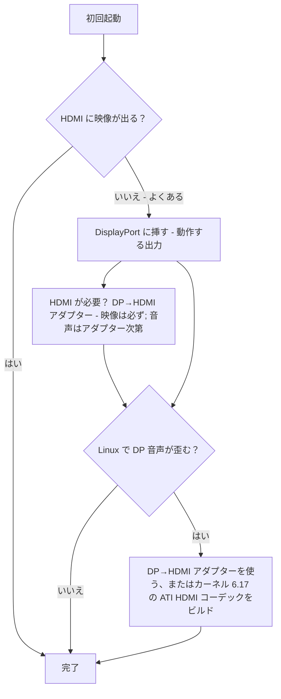

> 🌐 コミュニティ翻訳です。英語版が正となり、より新しい場合があります。誤りを見つけたら issue を立ててください：[English](../en/14-display.md) · https://github.com/lildebil0/awesome-bc250/issues

# ディスプレイと出力

> **要点** — BC-250 はモニターを **DisplayPort** で駆動します。挿すべきはこのコネクターです。ボードに HDMI ポートもある場合、それは **しばしば何も映りません** — なのでそこがブラックスクリーンでも、ボードが死んでいるわけ*ではなく*、ただ間違った出力に挿しているだけです。HDMI が必要？ **DP→HDMI アダプター** を使ってください — **映像は必ず通り、ラグはありません**。一部のアダプターは **音声** も通します（テスト済みのものはそうでした、[src](https://t.me/c/2424231195/9148)）が、音声は特定のアダプター次第なので当てにしないでください（音声のセクションを参照）。本物のクセが 1 つ：**DisplayPort 音声は Linux で歪んだり遅くなったりして出てきます**。同じ DP→HDMI アダプターがそれを回避し、カーネル側の正式な修正は **カーネル 6.17** あたりで入ります（[src](https://t.me/c/2424231195/17953)、[src](https://t.me/c/2424231195/68051)）。

「初回起動で映像が出ない」は **初心者パニック No.1** です。何かが壊れていると判断する前に、下のボックスを読んでください。

---

## 映像が出ない？ これをやる

1. **HDMI ではなく DisplayPort に挿す。** BC-250 の動作する映像出力は DisplayPort です（[src](https://t.me/c/2424231195/104784)）。HDMI ポート（あれば）は通常映らない方です — それでボードを判断しないでください。
2. **カードを挿し直してもう一度試す。** ボードは初回で初期化しないことが日常的にあります — 電源を入れ直し（完全にオフ→オン）、物理的に挿し直してください。あるオーナー：*「うちのが届いたときも初回では起動しなかった…ボタンでの再起動だと完全に初期化しないことがある — オフ/オンで直る」*（[src](https://t.me/c/2424231195/15701)）。
3. **ボードより先にケーブル/アダプターを疑う。** カードが 1 枚しかない場合、不良ケーブルやアダプターが筆頭容疑者です（[src](https://t.me/c/2424231195/15699)）。一部のアダプターはファームウェアでは動くのに OS がロードされると黒画面になります — *「GRUB の前までは映像は問題なかったが、システムで黒画面」*（[src](https://t.me/c/2424231195/38184)）。
4. **BIOS をリセット / 既知の良好なイメージを再フラッシュする** — バッチ内の複数のカードが映像を出さないなら、それはモニターではなくファームウェアを指しています（[src](https://t.me/c/2424231195/15697)、[src](https://t.me/c/2424231195/15705)）。

この 4 つをすべて潰してもまだ何も出ないなら、[troubleshooting.md](troubleshooting.md) へ進んでください。



---

## 出力ひと目で

| 出力 | 動作？ | 備考 |
|--------|--------|-------|
| **DisplayPort** | **はい — これが出力です** | 主要な／唯一のディスプレイコネクター；音声を通します。リポジトリの I/O 仕様は `1x DisplayPort` を挙げています（[repo](https://github.com/mothenjoyer69/bc250-documentation)）。**DisplayPort 1.4** で、上限は **4K@120 Hz**、HDR10 対応（[elektricM](https://github.com/elektricM/amd-bc250-docs/blob/main/docs/hardware/display.md)）。 |
| **HDMI ポート**（搭載されていれば） | **しばしば映らない** | 初心者はボードが死んだと思いますが、たいていそうではありません — DP に切り替えてください。（[src](https://t.me/c/2424231195/104784)） |
| **DP → HDMI（アダプター経由）** | **映像：はい。音声：アダプター次第** | 映像はラグなしで通ります（[src](https://t.me/c/2424231195/9148)）；音声はチップセット依存です — テストしてください（音声のセクションを参照）。DP 音声歪みの標準的な修正でもあります（下記）。 |
| **セカンド映像出力** | **標準では不可** | 電気的には存在しますが **実装されていません**；2 台目のモニターを強制するにはハックが必要で、他の人はチップに本物の 2 つ目のヘッドはないと言っています — 単一出力を安全な前提として扱ってください。（[src](https://t.me/c/2424231195/92978)、[src](https://t.me/c/2424231195/104682)） |
| **ネットワーク越しのセカンドスクリーン** | **はい** | BC-250 の出力を LAN 越しに別のマシンへストリーミング（Steam/Sunshine）。（[src](https://t.me/c/2424231195/23660)） |

---

## 解像度、リフレッシュ、ケーブル

elektricM のリファレンスは、単一の DP リンクが実際に何をできるかを特定しています — モニターやアダプターを選ぶときに役立ちます（[elektricM](https://github.com/elektricM/amd-bc250-docs/blob/main/docs/hardware/display.md)）：

| 解像度 | リフレッシュ | 経路 |
|------------|---------|------|
| 1920×1080 (1080p) | 144 Hz+ | ネイティブ DP、または任意のアダプター |
| 2560×1440 (1440p) | 144 Hz+ | ネイティブ DP（パッシブアダプターはしばしば 1440p@60 / DP 1.2 で頭打ち） |
| 3840×2160 (4K) | 60 Hz | ネイティブ DP、または **アクティブ** DP→HDMI 2.0 アダプター |
| 3840×2160 (4K) | 120 Hz | **ネイティブ DP のみ** — HDMI 経由で 4K@120 を出すにはアクティブな DP 1.4→HDMI 2.1 アダプターが必要で、しかも不安定です |

- **ケーブル：** **VESA 認証の DisplayPort 1.4** ケーブル、**1〜2 m** を使ってください；長いケーブルは同期/ドロップアウトの問題を起こします（[elektricM](https://github.com/elektricM/amd-bc250-docs/blob/main/docs/hardware/display.md)）。
- **低解像度に固定される**（例：1024×768/1080p、60 Hz のみ）のは、たいてい GPU ドライバーがロードされていないことを意味します — `glxinfo | grep "OpenGL renderer"` を確認してください；`llvmpipe` ＝ ソフトウェアレンダリングです、Mesa 25.1+ をインストールし `nomodeset` を外してください（[elektricM](https://github.com/elektricM/amd-bc250-docs/blob/main/docs/troubleshooting/display.md)）。[06-linux.md](06-linux.md) を参照。
- **HDR (HDR10) と VRR** は動きますが Linux では実験的です — **KDE Plasma 6+** が最も良いサポートを持ち、概ね Wayland セッションを必要とします（[elektricM](https://github.com/elektricM/amd-bc250-docs/blob/main/docs/hardware/display.md)）。**ここではディストロが重要です：** r/BC250Gaming（Reddit）のコミュニティ報告では、**HDR + VRR が正しく動いたのは CachyOS だけ**（Plasma 6 + Wayland）で、一方 **Bazzite では HDR がグラフィックの不具合を引き起こし、VRR はまったく動きませんでした**。彼らの例：**UGREEN DP→HDMI 2.1** アダプター経由で *Forza Horizon 6* を **1440p High、HDR + VRR オン、60〜80 FPS**。HDR/VRR が優先事項なら、[06-linux.md](06-linux.md) の CachyOS の注記を参照してください。
  - **Bazzite KDE を使っていて HDMI 経由で VRR/FreeSync が欲しいなら**、AMD の HDMI 2.1 / FRL カーネル作業を組み込んだコミュニティリミックスがあります：**[`dyllan500/bazzite-amd-hdmi-kde`](https://github.com/dyllan500/bazzite-amd-hdmi-kde)** — AMD の公式 HDMI-2.1 VRR パッチ（`amd-staging-drm-next` 由来）を載せたカーネルで再ビルドした Bazzite KDE イメージです。⚠ **大きく割り引いて：** これはサードパーティ製イメージで、作者は VRR を **Radeon 9070 XT** でのみテストし（BC-250 ではない）、ストックの Bazzite カーネルにパッチが入れば陳腐化する想定のものです。これは BC-250 で確認された修正では*ありません* — 試す実験的な選択肢として扱い、保証とは思わないでください。

> **ログイン*後*の黒画面（GRUB とログイン画面は問題なかった）** はデスクトップセッションの問題で、たいてい **Wayland** です — ログインの歯車で「GNOME on Xorg」/「Plasma (X11)」を選ぶか、`/etc/gdm/custom.conf` に `WaylandEnable=false` を設定してください（[elektricM](https://github.com/elektricM/amd-bc250-docs/blob/main/docs/hardware/display.md)）。ログイン*前*の黒画面は上記のドライバー/`nomodeset` の問題で、これではありません。

---

## DisplayPort 音声が歪む — アダプターでの修正

Linux では、**DisplayPort から直接** 送られる音声が BC-250 で正しく出てきません — 歪んでいて、*「引き伸ばされ、半分の速度に落とされたかのよう」* で、パチパチ音がすると説明されています（[src](https://t.me/c/2424231195/9895)）。これは **Linux/DP プロトコルの問題であり、ボードの欠陥ではありません** — BC-250 以外のハードウェアでも見られています（[src](https://t.me/c/2424231195/15983)）。

チャットが落ち着いた、無骨で信頼できる回避策：**信号を DP→HDMI アダプターに通す。** HDMI に変換されると、音声のアーティファクトは消えます（[src](https://t.me/c/2424231195/17953)、[src](https://t.me/c/2424231195/51763)）。あるユーザーが直接検証しました：*「DisplayPort→HDMI アダプター経由で音声出力をテストした。すべて問題なし、ラグなし」*（[src](https://t.me/c/2424231195/9148)）。

**最もクリーンな経路は、ストレートな DP→HDMI *ケーブル* です — 片端が DP プラグ、もう片端が HDMI プラグで、どちらの端にもアダプターのドングルや箱がない。** r/linux_gaming のコミュニティスレッドの複数のユーザーが独立して、これが最も信頼できる音声を与えると報告しています：素のケーブル（例：Amazon Basics の DP-to-HDMI ケーブル、約 $10）は、ドングル型アダプターが当たり外れなのに対して「ただ動く」と。たまに短い音声ミュートが起きることはありますが、一体型ケーブルはドングル経路をギャンブルにする余分なアダプターチップセットを取り除きます（[r/linux_gaming](https://www.reddit.com/r/linux_gaming/comments/1nvsgji/)）。どのみち買うなら、**ドングルよりケーブルを優先してください。**

**手元にアダプターがないなら、** 代わりに音声を **Bluetooth** で送ってください — ほとんどのスピーカー/ヘッドセットが対応しており、DP 経路を完全に回避します（[src](https://t.me/c/2424231195/89769)）。BT ドングルについては [10-wifi-bt.md](10-wifi-bt.md) を参照。

### アダプターの注記（コミュニティ）
- **4K@60 以上には *アクティブ* アダプター/ケーブルが必要です**（パッシブは約 1440p@60 で頭打ち）。動作するテスト済みの例：**UGREEN DP125（DP→HDMI 4K ケーブル）** — 4K@30 定格ですが、あるテレビでは 4K@60 をネゴシエートしました（[src](https://t.me/c/2424231195/52398)）。アクティブ対パッシブは解像度の上限を決めます — 音声が通るかどうかは決め **ません**（下記参照）。
- **すべてのアダプターが音声を通すわけではありません。** あるオーダーの Belsis アダプターは 4K@60 を音声*付き*で通したのに、いくつかのもっと高価な Ugreen ユニットはデバイス一覧に「HDMI digital audio」を表示したのに音を出さず — 1 つは声を 1 オクターブ下げました（[src](https://t.me/c/2424231195/106617)）。映像は出るのに音声が出ないなら、変数はアダプターです — 別のものを試してください。
- **HDMI *音声* には、まず *パッシブ* アダプターに手を伸ばしてください。** r/linux_gaming スレッドのコミュニティパターン：**パッシブ** DP→HDMI アダプターは音声をきれいに通しがちな一方、**アクティブ** アダプターはしばしば **音声を完全に落とすかピッチをずらします**（声が約 20% ／おおよそ 5 度下にスライドすると報告）。落とし穴：本物の **HDR**（と 4K@60 以上）にだけアクティブアダプターが*必要*なので、これは本当のトレードオフです — 信頼できる音にはパッシブ、HDR にはアクティブ。コミュニティで動作確認された *パッシブ* の選択肢：**Silver Monkey**、**BENFEI (ASIN B017Q8ZVWK)**、**AmazonBasics の DP-to-HDMI _ケーブル_**（一体型ケーブル — ドングル型アダプターでは*ない*）（[r/linux_gaming](https://www.reddit.com/r/linux_gaming/comments/1nvsgji/)）。⚠ 特定の SKU はコミュニティ報告であり、ここでラボ検証されたものではありません — そしてパッシブアダプターはやはり約 **1440p@60** で頭打ちです。
- 映像と音声の両方を通す安価な **4K@60 DP→HDMI** アダプターは存在し、動作が報告されています（[src](https://t.me/c/2424231195/133977)）。
- 一部のアダプターは特に **4K モニター** で誤動作します（[src](https://t.me/c/2424231195/1988)）。
- **DP→HDMI アダプター経由の音声は一貫せず、アダプターのチップセット次第です — 単純にアクティブ対パッシブ次第ではありません。** 映像は必ず通ります；**音声が変数です。** 我々のコミュニティ報告はアダプター単位です（UGREEN/Belsis ユニットは音を通すと報告、他のいくつかのユニットは無音）し、elektricM のガイドは*逆の*分かれ方を報告しています（パッシブが音声を通し、いくつかのアクティブユニットが無音 — 例：Cable Matters/StarTech） — まさにこれがアクティブ/パッシブのラベルでは予測できない理由です（[elektricM](https://github.com/elektricM/amd-bc250-docs/blob/main/docs/troubleshooting/display.md)）。**信頼できる** 音声には、アダプターに賭けないでください：**DisplayPort ネイティブのディスプレイ/AV レシーバー** を優先するか、**USB（USB DAC/サウンドデバイス）** で音を出力してください。アダプターを使うなら、**頼りにする前に音声をテストしてください** — そして **パッシブ** アダプターは約 **1440p@60** で頭打ちであることを忘れずに。

### カーネル 6.17 の修正（DP 直結の音声、アダプターなし）

アダプターなしで **DisplayPort 直結のまま** クリーンな音声が欲しいなら、原因と修正がチャットで突き止められました。Fedora のストックカーネル設定は `snd-hda-codec-hdmi.ko` + `snd-hdmi-lpe-audio.ko` をビルドしていました；**カーネル 6.17 が HDMI 音声の経路を変更し**、そのデフォルト設定で音が壊れました。修正は **ATI HDMI コーデック** も追加でビルドすることです — カーネル設定を `# CONFIG_SND_HDA_CODEC_HDMI_ATI is not set` から `CONFIG_SND_HDA_CODEC_HDMI_ATI=m` に切り替えると、`snd-hda-codec-atihdmi.ko` がパッケージされ、音は **パッチなしで** 動くようになります（[src](https://t.me/c/2424231195/68051)、[src](https://t.me/c/2424231195/68061)）。

```text
# Fedora kernel config change for DP/HDMI audio on kernel 6.17+
# from:
# CONFIG_SND_HDA_CODEC_HDMI_ATI is not set
# to:
CONFIG_SND_HDA_CODEC_HDMI_ATI=m
```

その 3 つ目のコーデック（`snd-hda-codec-atihdmi.ko`）が存在すると、ALSA がボードの音声出力を露出します（例：`pcm=3` と `pcm=7` が 2 つの HDMI デバイスとして）（[src](https://t.me/c/2424231195/68062)、[src](https://t.me/c/2424231195/67569)）。⚠ 確認すること — これにはカスタムカーネルのビルドが必要です；ほとんどのユーザーにとって DP→HDMI アダプターをビルド不要の経路として扱ってください。カーネル/ドライバーのセットアップについては [06-linux.md](06-linux.md) を参照。

### サラウンドサウンド (5.1) — HDMI ではなく USB サウンドカードを使う

**HDMI 経由の 5.1 サラウンドは BC-250 では動き*ません*。** この headless/マイニング向けダイ用の AMD の Linux 上の HDMI ファームウェアはマルチチャンネル LPCM を露出しないので、レシーバーが何をサポートしていようと HDMI 出力はただのステレオにフォールバックします（[r/linux_gaming](https://www.reddit.com/r/linux_gaming/comments/1nvsgji/)）。本物のマルチチャンネルには、代わりに **USB サウンドカード / USB DAC** で音声を出力してください — `pavucontrol` でそれをデフォルトシンクに設定し、6 チャンネルすべてを次で確認してください：

```bash
speaker-test -D pipewire -c 6 -t wav
```

同じ USB-DAC 経路は、アダプターが誤動作するときのステレオ音声の信頼できる修正でもあります（上記）。

---

## セカンド出力（初期状態では非アクティブ）

**ボードには標準ではアクティブでない 2 つ目の映像出力があります。** コミュニティの読みは分かれており、両側を知っておく価値があります：

- それは **電気的には存在するが実装/はんだ付けされていない** もので、*「ハックを使えば 2 台目のモニターを動かせる」*（[src](https://t.me/c/2424231195/92978)）。
- 他の人はチップが単に **使える 2 つ目のヘッドを持たない** と報告します — *「問題はチップにあり、2 つ目の出力は物理的にそこにない」*（[src](https://t.me/c/2424231195/104682)）。

実際上：**DisplayPort 出力は 1 つと想定してください。** 2 つの独立した画面のための DP **MST スプリッターは質問はされましたが、我々のチャットでは動作が確認されていません**（[src](https://t.me/c/2424231195/92109)）。

**elektricM からの更新 — 適切なハブがあれば MST で 2 画面を駆動できる。** elektricM のテストは、**DP MST ハブ経由で最大 2 ディスプレイ**（帯域幅は共有、ディスプレイごとの解像度は制限）を報告しており、ハブごとの結果付きです（[elektricM](https://github.com/elektricM/amd-bc250-docs/blob/main/docs/hardware/display.md)）：

| MST ハブ | 出力ポート | DP バージョン | 独立ディスプレイ？ | 音声 | 備考 |
|---------|-----|--------|-----------------------|-------|-------|
| StarTech MST14DP122DP | 2× DP | 1.4 | **はい** | Yes | モニター/ケーブルを通じて一貫して動作 |
| Monoprice 21972 | 2× DP | 1.2 | **ミラーのみ** | Yes | ミラーしかできず |
| ENBUER | 2× DP | 1.2 | **ミラーのみ** | Yes | ミラーしかできず |
| Generic HDMI MST | 2× HDMI | — | **いいえ** | No | 映像も音声もなし |

なのでネイティブのデュアルモニターは DP 1.4 ハブによる MST で **可能** です（StarTech で確認）；より安い DP 1.2 ハブはミラーしかできないことがあり、HDMI MST ハブは失敗しました。⚠ 確認すること — 確認されたハブのモデルは 1 つだけ；結果はハブによって異なります。

**もう 1 つのマルチディスプレイ経路 — USB DisplayLink アダプター。** 追加の **デスクトップ** 画面のために USB→HDMI/DP DisplayLink アダプターを足してください（最良の結果のためには起動*後*に挿す）。**ゲーム用ではありません** — CPU で圧縮するので、それが BC-250 のボトルネックであり、レイテンシが高くなります；また Steam Deck の **ゲームモード** では動作しません（[elektricM](https://github.com/elektricM/amd-bc250-docs/blob/main/docs/hardware/display.md)）。

---

## ネットワーク越しのセカンドスクリーン（簡単な「2 つ目のディスプレイ」）

BC-250 の映像を本当に 2 台目のデバイスで見たいなら、実証済みの経路は 2 本目のケーブルではなく — **LAN 越しのストリーミング** です。あるユーザー：*「BC-250（Fedora）で Steam ゲームを起動し、ネットワーク越しに仕事用ラップトップへストリーミングして、ラップトップから操作した。すべて動いた」*（[src](https://t.me/c/2424231195/23660)）。

- **Sunshine**（ホストエンコーダー）はここで動きます、なぜなら NVIDIA 専用ではないからです — それがエンコードを行い、クライアントはただデコードするだけです（[src](https://t.me/c/2424231195/25091)）。ギガビット LAN 越しではほぼ完璧と報告されています（[src](https://t.me/c/2424231195/25563)）。
- **Moonlight をホストとして** 使うのは合いません — NVIDIA エンコーダーを期待し、ハードウェアデコーダーがないことについてカクついたり文句を言ったりします（[src](https://t.me/c/2424231195/25050)）。Sunshine をホストとして使い、Moonlight はクライアントとしてのみ使ってください。

これは上記の未実装のセカンド出力なしで「デュアルディスプレイ」感を得る実用的な方法でもあります。

---

## ソース

- DP→HDMI アダプターは映像+音声を通す、ラグなし — https://t.me/c/2424231195/9148
- DP 音声歪みは Linux の問題；アダプターが直す — https://t.me/c/2424231195/17953 · https://t.me/c/2424231195/9895 · https://t.me/c/2424231195/51763 · https://t.me/c/2424231195/15983
- カーネル 6.17 音声修正（`CONFIG_SND_HDA_CODEC_HDMI_ATI=m`） — https://t.me/c/2424231195/68051 · https://t.me/c/2424231195/68061 · https://t.me/c/2424231195/68062 · https://t.me/c/2424231195/67569
- 動作するアダプター — UGREEN DP125 https://t.me/c/2424231195/52398 · Belsis 対その他（音声はばらつく）https://t.me/c/2424231195/106617 · 安価な 4K@60 https://t.me/c/2424231195/133977
- DP が動作する出力；良い DP→HDMI アダプターに投資せよ — https://t.me/c/2424231195/104784
- 初回起動で映像なし / 挿し直し / 再フラッシュ — https://t.me/c/2424231195/15697 · https://t.me/c/2424231195/15699 · https://t.me/c/2424231195/15701 · https://t.me/c/2424231195/38184
- セカンド出力は存在するが未実装 / 議論あり — https://t.me/c/2424231195/92978 · https://t.me/c/2424231195/104682 · MST について質問 https://t.me/c/2424231195/92109
- ネットワークのセカンドスクリーン（LAN 越しの Sunshine/Steam） — https://t.me/c/2424231195/23660 · https://t.me/c/2424231195/25091 · https://t.me/c/2424231195/25050 · https://t.me/c/2424231195/25563
- 代替としての Bluetooth 音声 — https://t.me/c/2424231195/89769
- ストレートな DP→HDMI **ケーブル**（アダプターなし）が最も信頼できる音声；HDMI 経由の 5.1 は動かない（マルチチャンネル LPCM なし）、USB サウンドカード / DAC を使え — r/linux_gaming コミュニティスレッド https://www.reddit.com/r/linux_gaming/comments/1nvsgji/
- ハードウェア I/O リファレンス（`1x DisplayPort`） — [mothenjoyer69/bc250-documentation](https://github.com/mothenjoyer69/bc250-documentation) · [`hardware.md`](https://github.com/mothenjoyer69/bc250-documentation/blob/main/hardware.md)
- DP 1.4 / 4K@120 / HDR10、解像度+ケーブルの制限、MST ハブ（最大 2）、DisplayLink、Wayland ログインの黒画面 — elektricM [`hardware/display.md`](https://github.com/elektricM/amd-bc250-docs/blob/main/docs/hardware/display.md)
- HDR + VRR は CachyOS（Plasma 6 + Wayland）で動作、Bazzite では壊れる；UGREEN DP→HDMI 2.1 経由で Forza Horizon 6 1440p High HDR+VRR — r/BC250Gaming（Reddit）コミュニティ報告（[06-linux.md](06-linux.md) を参照）
- パッシブ DP→HDMI は音声を通す / アクティブは落とすかピッチをずらす；パッシブだが HDR には必要；確認済みパッシブ Silver Monkey / BENFEI B017Q8ZVWK / AmazonBasics DP-to-HDMI ケーブル — [r/linux_gaming コミュニティスレッド](https://www.reddit.com/r/linux_gaming/comments/1nvsgji/)
- HDMI 経由の Bazzite KDE VRR/FreeSync リミックス（AMD HDMI 2.1 カーネル；9070 XT でテスト、BC-250 ではない） — [`dyllan500/bazzite-amd-hdmi-kde`](https://github.com/dyllan500/bazzite-amd-hdmi-kde)
- アダプター音声はチップセット依存（elektricM はパッシブが通す / 一部アクティブが無音を見た；コミュニティは逆を見た — なので DP ネイティブか USB DAC を優先）、低解像度の llvmpipe チェック — elektricM [`troubleshooting/display.md`](https://github.com/elektricM/amd-bc250-docs/blob/main/docs/troubleshooting/display.md)

> ドライバー/カーネルのセットアップは [06-linux.md](06-linux.md) にあります；音声/出力の落とし穴は [troubleshooting.md](troubleshooting.md) と [faq.md](faq.md) にもインデックスされています。
