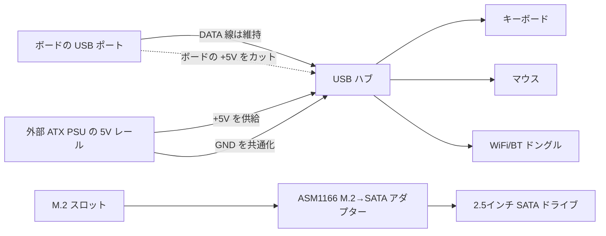

> 🌐 コミュニティ翻訳です。英語版が正となり、より新しい場合があります。誤りを見つけたら issue を立ててください：[English](../en/16-usb-peripherals.md) · https://github.com/lildebil0/awesome-bc250/issues

# USB・ハブ・周辺機器

> **要点** — ボードが提供するのは **背面の USB ポート 4 つ（2× USB 2.0 + 2× USB 3.0）** だけで、それ以上はありません。デフォルトでは内部ヘッダーは配線されていません。WiFi/BT ドングル、USB 経由 SSD、キーボード、マウス、コントローラーがこれらをあっという間に消費するため、ほぼ全員が **USB ハブ** を追加します。問題は、ボードの **5 V USB レールが弱く** 負荷がかかると電圧が落ち込むことで、安価なバスパワーハブ（さらには直結したフラッシュドライブまで）が脱落します。信頼できる対策を順に挙げると、**給電（アクティブ）ハブ**、またはコミュニティの **5 V 注入 mod** です。ハブがボードから取っている 5 V をカットし、代わりに ATX PSU から 5 V を供給します。([src](https://t.me/c/2424231195/119741))

これは **アクセサリー** のページです。ハブさえ正しく選べば、残り（オーディオ、USB 経由 Ethernet、ドック）はそのまま動きます。

---

## 実際に使える USB ポートはいくつか

ハードウェアリファレンスによると、背面 I/O は **1× DisplayPort、1× GbE Ethernet、2× USB 2.0、2× USB 3.0** です。つまり物理 USB ポートは 4 つ。([hardware.md](https://github.com/mothenjoyer69/bc250-documentation/blob/main/README.md))

実際には 2 つの **USB 3.0** ポートが取り合いになります（より高速で、SSD/ドックに使われる）。そしてこれらは電気的に **狭く** 配線されています。あるオーナーはこのコネクターを実質「x2」と表現し、そこにスプリッターをぶら下げないよう警告しています。⚠ 正確なレーン幅は要確認。([src](https://t.me/c/2424231195/75561))

ポートを必要とするものを列挙すると、この窮屈さは現実のものです。**SSD を挿す — ポートが 1 つ消える。USB WiFi ドングル、ジョイスティック、外付けドライブを追加する — ハブが必要、さもないとポートを焼くリスクがある。**([src](https://t.me/c/2424231195/75558)) 人々はよく「USB 3.0 が全部埋まっていて、キーボードとマウスはハブ経由」と報告しています。([src](https://t.me/c/2424231195/110875))

工場出荷状態では **フロントパネルの USB ヘッダーは実装されていません**。ただしケース／ボードにはハブのケーブルをフロントに引き回すためと思われる場所が明確にあり、複数のケース入りビルドがこれを使っています。([src](https://t.me/c/2424231195/91322)) · ([src](https://t.me/c/2424231195/100249))

---

## 本当の問題：5 V USB レールが弱い

BC-250 は **USB 用の 5 V をボード自体で** 生成しており ([src](https://t.me/c/2424231195/57920))、このレールはあまり多くを供給できません。チャットからの最も明確な測定値は、デバイスを列挙できなかったボードでのものです：

> 「私の BC-250 は USB に適切な 5 V を出していない…キーボードしか動かない。マウスを挿すとキーボードがオフになる。キーボードだけで約 **4.3 V**、キーボード + マウスで **2.3 V〜3.2 V**、両方外すと **5.1 V**。」([src](https://t.me/c/2424231195/119071))

この電圧降下こそ、症状が **負荷** の周りに集中する理由です。**直結すると脱落するがハブ経由なら問題なく動く** フラッシュドライブやマイク、LED が消えるキーボード、2 つが同時に電力を引いた瞬間に脱落するデバイス。([src](https://t.me/c/2424231195/53939)) WiFi ドングルを不安定にするのと同じ電源感受性です。**[10-wifi-bt.md](10-wifi-bt.md)** を参照してください。スティックはアイドル時には動作し、ダウンロードのスパイクで脱落します。

> ⚠ すべてのボードがここまで悪いわけではありません。あるオーナーは **WiFi ドングル + 有線キーボード + 無給電ハブ経由のマウス + 14″ ディスプレイ + 3.5″ の補助スクリーン** をボードの USB から駆動し、問題ないと報告しています。([src](https://t.me/c/2424231195/119231)) 負荷をかけるまでは、自分のボードは未知数として扱いましょう。

---

## ハブの選択：給電 vs 無給電

| ハブの種類 | 動作する条件 | 評価 |
|----------|---------------|---------|
| **無給電（バスパワー）** | 軽負荷 — キーボード、マウス、ドングル。ボードによっては驚くほどの量をこの方式で動かせます。([src](https://t.me/c/2424231195/119231)) | まず試してみる分には OK。**ドライブを追加したり負荷がスパイクした瞬間に脱落を覚悟** すること。 |
| **給電／アクティブ（外部 5 V アダプター）** | ドライブ、複数のドングル、または負荷下での何でも。BC-250 に対するコミュニティの定番推奨。([src](https://t.me/c/2424231195/75558)) · ([src](https://t.me/c/2424231195/119229)) | **これを買う。** ボードに触れずに電圧降下を解決します。([src](https://t.me/c/2424231195/140091)) |
| **5 V 注入 mod**（後述） | ATX PSU だけで完全に駆動するクリーンなケース入りビルドを望み、2 つ目の AC アダプターを使いたくない場合。 | 最も統合度が高いが、はんだ付けが必要。([src](https://t.me/c/2424231195/119741)) |

誰かの USB デバイスが不調なときに繰り返されるアドバイスは単純です。**電源アダプター入力を備えたアクティブ USB ハブを買え。**([src](https://t.me/c/2424231195/119229)) 複数のオーナーが脱落と格闘した末にそこに行き着きました。「外部給電ハブで解決した」。([src](https://t.me/c/2424231195/123789))

> チャットで挙げられた 1 つの注意点：外部給電ハブに頼ることは **恒久的** になるかもしれません。一度 USB 電源を外部にオフロードすると、そのハブからずっと離れられなくなっても驚かないこと。([src](https://t.me/c/2424231195/123924)) デスクトップビルドにとっては悪くないトレードオフです。

---

## 5 V 注入 mod（普通のハブをまともに振る舞わせる）

これは **すでに ATX/SFX PSU で駆動しているケース入りビルド** に対するエレガントな対策です。専用 AC アダプター付きのアクティブ給電ハブを買う代わりに、普通のハブを取り、その **5 V がどこから来るかを入れ替えます**。

あるユーザーがやって、それで動いたこと ([src](https://t.me/c/2424231195/119741))：

> 「私は普通の USB ハブを改造したら動いた。**マザーボードから来る 5 V をカットし、PSU から 5 V を与えた**。同じ ATX PSU で BC-250 を駆動しているので、グランドを接続する必要はなかった。」

仕組み：

1. ハブを開け、**上流**側（ボードに挿さるケーブル）の **5 V（VBUS）** トレース／配線を見つける。
2. その **5 V をカット** し、ハブがボードの弱いレールから電力を引かないようにする。
3. ハブに **ATX PSU からの +5 V** を供給する（予備の SATA/Molex 5 V ライン）。
4. **グランドは自動的に共有** されます。同じ PSU がすでにボードを駆動しているからです。追加のグランド線は不要です。（もし *別の* 電源からハブを駆動するなら、グランドを **必ず** 共通化しなければなりません。）

データ線はそのまま触れません。変えるのは電源だけです。ボードからは 5 V レールにもう負荷をかけないハブに見え、デバイスは PSU からクリーンで潤沢な電力を得ます。



> ⚠ 間違ったトレースをカットするとハブが壊れます（安価ですが）。ただし **データ線ではなく VBUS** をカットすることを確認してください。はんだ付けの前にマルチメーターで再確認すること。

---

## 避けるべきガラクタ

- **Hoco のハブ** — 信頼できないと名指しされています。あるオーナーは **同じ Hoco ハブを 2 回はんだ付けし直す羽目に** なりました。([src](https://t.me/c/2424231195/74531))
- **「USB 3.0」ではない「USB 3.0」ハブ** — 160 ₽ の AliExpress の「USB 3.0 ハブ／ドック」が、その価格では **間違いなく本物の 3.0 ではない** と指摘されました。([src](https://t.me/c/2424231195/8761)) · ([src](https://t.me/c/2424231195/8764))
- **ハブのデイジーチェーン** でポートを増やす — アイデアとして挙げられましたが ([src](https://t.me/c/2424231195/104653))、これは電源問題を積み重ねます。1 つの弱いレールが今度は 2 つのハブを給電することになります。代わりに 1 つの良質な給電ハブを使いましょう。
- **M.2 スロットからの SATA スプリッター「ハブ」** — 繰り返される混乱です。M.2 には **PCIe レーンが 2 本** しかないため、SATA コントローラーをぶら下げてファンアウトを期待するのは妥当ではありません。「SATA 1 本入力・多数出力のハブはゴミ」。([src](https://t.me/c/2424231195/22539)) これは USB の話題ではありません。USB 拡張と混同しないこと。
- ★ **M.2→SATA コントローラー PH516（6-port） — 動作しないことが確認済み。** ポートは列挙されますがディスクがアタッチされず、**2 人目** が同じ失敗を再現しました（[4pda — Strange999](https://4pda.to/forum/index.php?showtopic=1104980)）。代わりにコミュニティ推奨の **ASM1166** を買いましょう（ストレージのセクションを参照）。PH516 はこのボードでは既知の行き止まりです。

**内蔵オーディオコーデック** 付きのハブは、ケース入りビルドにとって省スペースのうまい手です（1 つのデバイスで追加ポート *と* 3.5 mm ジャックが手に入る）。実際に使っている人もいます。([src](https://t.me/c/2424231195/8751)) オーディオ品質はばらつきます。安価なコーデックですから。([src](https://t.me/c/2424231195/39708))

---

## USB 3.0 内部ヘッダー（Type-E）

ケースに **フロント USB 3.0 プラグ**（20-pin の「Key-A/Type-E」コネクター）があれば、ボードの USB 3.0 から給電したくなるでしょう。**ネイティブの 20-pin ヘッダーはない** ので、人々は変換します：

- AliExpress の **USB 3.1 Type-E → USB 3.0（Type-A）ケーブル** がクリーンな方法です。チャットでは AXONUS 50 cm が共有されました。([src](https://t.me/c/2424231195/133182)) Xiwai の Type-E → 20-pin バリアントも投稿されました。([src](https://t.me/c/2424231195/125127))
- あるいはケース付属のケーブルを普通の USB 3.1 プラグに **スプライス** する — 適合するアダプターがないときの「ヘビをハリネズミに繋ぐ」方式です。([src](https://t.me/c/2424231195/135957))

**ステータス：** **USB 2.0 は動作確認済み。USB 3.0 はまだ完全にテストされていない** と報告したオーナーが述べています（ケース入りビルド後にテスト保留）。アダプター経由の 3.0 は自分のハードウェアで ⚠ 要確認として扱ってください。([src](https://t.me/c/2424231195/136215))

---

## ストレージ（M.2 スロット & SATA ドライブ）

ボードの唯一の内蔵ストレージコネクターは **単一の M.2 スロット** で、**PCIe 2.0 ×2** で配線されています。したがって実用上の上限は **約 1 GB/s** です ([src](https://t.me/c/2424231195/66275)) · ([src](https://t.me/c/2424231195/135506))。高速な Gen3/Gen4 NVMe は *動作はします* が、ここでは定格速度に達しないため、ハイエンドドライブにお金を払う意味はありません。**普通の NVMe M.2 SSD が最もシンプルなブートドライブ** です。スロットに挿し、そこに Linux をインストールします（インストールは **[06-linux.md](06-linux.md)** を参照）。

### 2.5″ SATA HDD/SSD の接続

ボードに SATA ポートはないので、**2.5″ SATA ドライブ**（または複数台）をぶら下げるには **M.2 → SATA アダプターカード** を M.2 スロットに入れます。コミュニティの確認済みの選択は **ASM1166（M.2 PCIe → SATA）** 拡張カードです ([src](https://t.me/c/2424231195/135180))。もう 1 つの方法は、プレーンな **M.2 SATA SSD をボードに直接** 挿すことです。アダプター不要、ただの SATA プロトコルの M.2 スティックです。([src](https://t.me/c/2424231195/87411))

これは **最もよくある初心者の質問** の 1 つです。*「ハードドライブをボードに接続するのに必要なのはこのアダプターですか？」* や *「ドライブを接続する他の方法は？」* ([src](https://t.me/c/2424231195/135164)) · ([src](https://t.me/c/2424231195/135165))。なので、これを尋ねているなら、あなたは仲間に恵まれています。

> ⚠ 要確認 — ASM1166 カードはコミュニティの推奨であって、BC-250 で多数の人にテストされた結果ではありません。頼る前に、選んだアダプターが列挙されブートすることを確認してください。また、M.2 の **PCIe レーン 2 本** では SATA 1 本入力・多数出力の *スプリッター* を妥当に給電できないことにも注意してください。上記の **避けるべきガラクタ** を参照。([src](https://t.me/c/2424231195/22539))

#### ★ 2.5″ SATA ドライブの給電（ボードは 12 V のみ）

上記のアダプターカードは **データ** を扱いますが、2.5″ SATA ドライブはその SATA 電源コネクターに **5 V 電源** も必要とします。そして BC-250 ボードは **12 V** しか供給せず、タップできる SATA 電源ヘッダーもありません。あるビルドからの実用的な対策：ドライブに **5 V を供給する USB→SATA 電源アダプター** に、ボードの 12 V から その 5 V を作る **12 V→5 V 降圧（バック）コンバーター** を組み合わせる（[TMG HD build](https://youtu.be/OEO0r01zcfU); ⚠ おおよそ — 動画ウォークスルーからの言い換え）。言い換えると、ASM1166（または M.2 SATA スティック）が SATA *データ* を運び、バックコンバーター + USB→SATA 電源アダプターが SATA *電源* を運びます。自己給電の 2.5″ エンクロージャや給電ドックなら、自前の 5 V レールを持ち込むことで問題全体を回避できます。

#### ★ M.2 SATA スティックでの SteamOS「no nvme drive detected」

NVMe ではなく **M.2 SATA SSD**（例：**Kingston SNS41**）で SteamOS をブートすると、インストーラー／リペアフローが **「no nvme drive detected」** で失敗することがあります。SteamOS はディスクを NVMe デバイス（`nvme…`）と想定しますが、SATA スティックは `sda` として列挙されるからです。対策はリペアスクリプトを編集し、正しいデバイス名を指すようにすることです（[4pda — pornocrat](https://4pda.to/forum/index.php?showtopic=1104980)）：

```bash
# Edit the SteamOS repair script and replace the device name nvme -> sda
nano ~/tools/repair_device.sh
# change every "nvme" reference to "sda", save, then re-run the install/repair
```

これは純粋にデバイス名の不一致です。`nvme` ノードではなく `sda` を見るよう SteamOS に伝えれば、SATA スティックは問題なく動作します。

### 古い SATA ドライブで十分

どのみち M.2 リンクがすべてを約 1 GB/s で頭打ちにするため、古い **2.5″ SATA HDD/SSD** は **ゲームライブラリや古いゲーム** には完全に十分です。失う速度は、ボードがそもそも出せない速度ですから。([src](https://t.me/c/2424231195/132739)) **USB-NVMe エンクロージャ** も、M.2 スロットを空けておきたいなら別の選択肢ですが、実際に（SATA ではなく）NVMe をこなすエンクロージャはより高価になります。小さなブートスティックには見合いません。([src](https://t.me/c/2424231195/111022))

### Intel Optane 16 GB をキャッシュ／スワップに — コミュニティのアイデア、評価は微妙

小さな **Intel Optane 16 GB NVMe** モジュールをキャッシュやスワップデバイスとして使うアイデアが挙がりましたが、冷静な評価でした（[4pda](https://4pda.to/forum/index.php?showtopic=1104980)）：Ozon で売られている **16 GB「Optane」モジュールはメンバー自身のテストで本物の Optane ではない** と判明し、ボードの **M.2 スロットは遅い**（PCIe 2.0 ×2、約 1 GB/s）のでレイテンシの利点は鈍り、**理論上はスワップファイルが可能** ではあるものの、ここでは明確な勝ちではありません。推奨されるアップグレードではなく、好奇心の対象として扱ってください。

---

## ドック & ドッキングステーション

USB-C / Thunderbolt 風の **ドック** は 1 つの太いハブ（USB + Ethernet + 場合により映像）として機能でき、オーナーは実際に使っています：

- **Wavlink WL-UG69DK1 USB-C デュアル 4K ドック** をあるメンバーが使用中です。([src](https://t.me/c/2424231195/68141))
- **DisplayLink ドック** は **USB ハブ + USB サウンドカード** として動作します。そのメンバーはそこから映像を出すことが **できませんでした**（TPM/BIOS の壁に当たった）ので、ドックの *映像* は信頼できないものとして扱ってください。([src](https://t.me/c/2424231195/104776))
- 特に **追加モニター** については、ドックでも GPU 自体の出力上限はかわせません。当てにする前に **[14-display.md](14-display.md)** を参照してください。

結論：ドックは **給電ハブ** としては問題ありません（自前の電源を持ち込むので、5 V 問題をきれいに回避します）。**映像** 出力が動くことを期待して買ってはいけません。

---

## コントローラー & 入力

ゲームパッドも他のすべてと同じ弱い USB レールと、同じ不安定な Bluetooth の話に乗っています（BT ドングルは **[10-wifi-bt.md](10-wifi-bt.md)** を参照）。いくつかの具体的な知見：

- **DS5Dongle（Raspberry Pi Pico 2W）経由の Linux 上の DualSense。** このオープンドングルは Linux 上で DualSense に **HD ハプティクス + スピーカー** を与え、ポーリングレート／音量の **Web UI** も提供します。ただしゲーム音声には落とし穴があります。Wine/Proton タイトルがコントローラーのオーディオを得られるのは **Direct モード** のときだけで（コントローラーは単一の **4 チャンネルオーディオカード** として現れる）、**すべてのディストロがそのモードを公開するわけではありません**（[4pda — korotyshev](https://4pda.to/forum/index.php?showtopic=1104980)）。別途、カーネルの **`hid-playstation`** ドライバー（ネイティブの DualSense サポート）はアダプターに **Bluetooth ≥ 5.0** を必要とします（[4pda — xDarkman](https://4pda.to/forum/index.php?showtopic=1104980)）。
- **GameSir T4 Kaleid + その 2.4 GHz ドングル** は Bluetooth を完全に回避する動作するコントローラー／入力経路です。BT ペアリングと格闘する代わりに、2.4 GHz USB レシーバー経由の有線感覚の入力です（[TiredDadTech](https://youtu.be/zi7sldeRd2w); ⚠ おおよそ — 動画からの言い換え）。
- **BT ドングルのポートは重要：UGREEN の Bluetooth ドングルは USB 2.0 ポートでのみ動作し、USB 3.0 では動かない。** 3.0 ポートの RF ノイズ／電気的配線がそれを壊します。2 つの **USB 2.0** ポートのいずれかに移すと動作します（[4pda — InfernalWolf666](https://4pda.to/forum/index.php?showtopic=1104980)）。（WiFi/BT スティックを悩ませるのと同じ USB-3.0 ノイズ効果です。[10-wifi-bt.md](10-wifi-bt.md) を参照。）

---

## 推奨スターターセットアップ

| ティア | やること | 理由 |
|------|---------|-----|
| 最小限 | キーボード／マウス／ドングル用のバスパワーハブ | 持っていれば無料。軽負荷には十分 ([src](https://t.me/c/2424231195/119231)) |
| **推奨** | 自前の 5 V アダプター付き **給電（アクティブ）USB ハブ** | 電圧降下を解決、はんだ付け不要、ドライブ + ドングルが落ちない ([src](https://t.me/c/2424231195/75558)) |
| ケース入りビルド | 普通のハブ + ATX/SFX PSU からの **5 V 注入 mod** | 最もクリーンな統合、AC アダプターが 1 つ少ない ([src](https://t.me/c/2424231195/119741)) |

人気のケース入りリファレンスビルドはまさにこれです：**Cooler Master MasterBox NR200P + USB ハブ + SFX PSU** — ハブは後付けではなく、ビルドのデフォルト部品として扱われます。([src](https://t.me/c/2424231195/81149)) エンクロージャ側は **[05-case.md](05-case.md)** を参照。プリント可能なケースには HDD + USB ハブのレイアウトを同梱したものさえあります。([printables](https://www.printables.com/model/1580750-bc250-amd-case-v3-hp-server-psu-hdd-usb-hub))

---

## ソース

- 5 V 注入 mod（ボードの 5 V をカット、PSU から供給）— https://t.me/c/2424231195/119741 · how-to の質問 — https://t.me/c/2424231195/119795
- 測定された USB 電圧降下（4.3 V → 2.3 V）— https://t.me/c/2424231195/119071 · ボードがオンボードで 5 V を生成 — https://t.me/c/2424231195/57920
- ポートの予算 /「給電ハブが必要、さもないとポートを焼くリスク」— https://t.me/c/2424231195/75558 · USB は x2 — https://t.me/c/2424231195/75561 · 3.0 が全部埋まっている — https://t.me/c/2424231195/110875
- アクティブハブが対策 — https://t.me/c/2424231195/119229 · https://t.me/c/2424231195/123789 · https://t.me/c/2424231195/140091 · 恒久的になりうる — https://t.me/c/2424231195/123924
- 無給電ハブが一部のボードで動作 — https://t.me/c/2424231195/119231 · 直結だと脱落、ハブで解決 — https://t.me/c/2424231195/53939
- Hoco ハブは信頼できない / 2 回はんだ付けし直し — https://t.me/c/2424231195/74531 · 偽の「3.0」安価ハブ — https://t.me/c/2424231195/8761 · https://t.me/c/2424231195/8764
- SATA スプリッターの混乱 — https://t.me/c/2424231195/22539 · ハブのデイジーチェーン — https://t.me/c/2424231195/104653
- ストレージ：M.2 は PCIe 2.0 ×2 / 約 1 GB/s — https://t.me/c/2424231195/66275 · 代わりに M.2 SATA SSD を挿す — https://t.me/c/2424231195/135506 · ASM1166 M.2→SATA カード — https://t.me/c/2424231195/135180 · M.2 SATA をボードに直挿し — https://t.me/c/2424231195/87411 ·「ドライブ接続にどのアダプター？」— https://t.me/c/2424231195/135164 · https://t.me/c/2424231195/135165 · 古い 2.5″ SATA はゲームライブラリに十分 — https://t.me/c/2424231195/132739 · USB-NVMe エンクロージャは割高 — https://t.me/c/2424231195/111022
- ★ 12 V のみのボードでの 2.5″ SATA ドライブの給電（USB→SATA 電源 + 12 V→5 V バック）— [TMG HD build](https://youtu.be/OEO0r01zcfU)（⚠ おおよそ、言い換え）
- ★ M.2→SATA PH516（6-port）動作しないことが確認済み、2 人目が再現 — [4pda — Strange999](https://4pda.to/forum/index.php?showtopic=1104980)
- ★ M.2 SATA スティック（Kingston SNS41）での SteamOS「no nvme drive detected」、対策 = `~/tools/repair_device.sh` を編集、`nvme`→`sda` にリネーム — [4pda — pornocrat](https://4pda.to/forum/index.php?showtopic=1104980)
- Intel Optane 16 GB をキャッシュ／スワップに（Ozon のものは本物の Optane ではない、M.2 が遅い、理論上はスワップファイル）— [4pda](https://4pda.to/forum/index.php?showtopic=1104980)
- DualSense 用の DS5Dongle（RPi Pico 2W）on Linux — HD ハプティクス／スピーカー／Web UI、Wine/Proton オーディオは Direct モードのみ（単一の 4-ch カード）— [4pda — korotyshev](https://4pda.to/forum/index.php?showtopic=1104980) · `hid-playstation` は BT ≥5.0 が必要 — [4pda — xDarkman](https://4pda.to/forum/index.php?showtopic=1104980)
- GameSir T4 Kaleid + 2.4 GHz ドングルを Bluetooth に代わるコントローラー／入力の対策に — [TiredDadTech](https://youtu.be/zi7sldeRd2w)（⚠ おおよそ、言い換え）
- UGREEN BT ドングルは USB 2.0 ポートでのみ動作、3.0 では不可 — [4pda — InfernalWolf666](https://4pda.to/forum/index.php?showtopic=1104980)
- 内蔵オーディオ付きハブ — https://t.me/c/2424231195/8751 · https://t.me/c/2424231195/39708
- USB 3.1 Type-E → USB 3.0 ケーブル（AXONUS）— https://t.me/c/2424231195/133182 · Xiwai Type-E 20-pin — https://t.me/c/2424231195/125127 · 付属ケーブルをスプライス — https://t.me/c/2424231195/135957
- USB 2.0 確認済み、3.0 はテスト予定 — https://t.me/c/2424231195/136215
- ハブ用のフロントパネル穴 — https://t.me/c/2424231195/91322 · https://t.me/c/2424231195/100249
- ドック：Wavlink ドック — https://t.me/c/2424231195/68141 · DisplayLink ドックはハブ+オーディオとして動作、映像なし — https://t.me/c/2424231195/104776
- ケース入りビルド NR200P + USB ハブ + SFX — https://t.me/c/2424231195/81149 · USB ハブ付きプリント可能ケース — https://www.printables.com/model/1580750-bc250-amd-case-v3-hp-server-psu-hdd-usb-hub
- ハードウェアリファレンス（背面 I/O リスト）— [mothenjoyer69/bc250-documentation `README.md`](https://github.com/mothenjoyer69/bc250-documentation/blob/main/README.md)

> 関連：WiFi/BT ドングルの電源感受性 → [10-wifi-bt.md](10-wifi-bt.md) · ケースとフロントパネルの引き回し → [05-case.md](05-case.md) · モニター数の制限 → [14-display.md](14-display.md)
