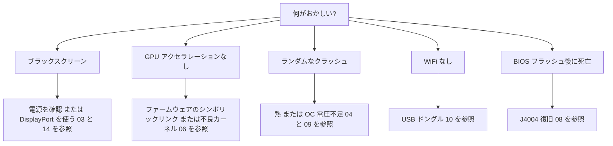

> 🌐 コミュニティ翻訳です。英語版が正となり、より新しい場合があります。誤りを見つけたら issue を立ててください：[English](../en/troubleshooting.md) · https://github.com/lildebil0/awesome-bc250/issues

# トラブルシューティング

> **要点** — BC-250 の故障パターンはよく知られています — ほとんどは **電源**、**熱**、**カーネル/ファームウェア**、または **失敗したフラッシュ** です。下から自分の症状を見つけ、修正を適用し、完全な章へのリンクをたどってください。迷ったら、原因はたいてい *不良カーネル*、*amdgpu ファームウェアのシンボリックリンク欠如*、または *冷却不足* です。

このページは症状 → 原因 → 修正のインデックスで、コミュニティで繰り返される問題から抽出したものです。各章を置き換えるものではなく、正しい章へ素早く案内するものです。

---

## ブート / ディスプレイ

| 症状 | 考えられる原因 | 修正 |
|---------|--------------|-----|
| ブラックスクリーン / POST しない | 電源配線またはピン配置が誤り | 8-pin の配線とピン配置を再確認。十分な太さの純銅ワイヤーを使う → [03 — 電源](../en/03-power-supply.md) |
| 動いていたのにブラックスクリーン / クラッシュ | **IOMMU がまだ有効**（このボードでは壊れている） | BIOS で IOMMU を無効化（elektricM）。`iommu=off`/`amd_iommu=off` カーネルパラメータは ⚠ 要検証 → [06 — Linux](../en/06-linux.md) |
| **インストーラー** / ライブ USB の起動でブラックスクリーン | インストーラーに BC-250 GPU ドライバーがない。KMS が失敗 | GRUB で `nomodeset` を追加（Fedora: Troubleshooting → Basic Graphics Mode）。**Mesa インストール後に外す**（[elektricM](https://github.com/elektricM/amd-bc250-docs/blob/main/docs/troubleshooting/boot.md)）→ [06 — Linux](../en/06-linux.md) |
| **ログイン後**にブラックスクリーン（GRUB + ログイン画面は正常だった） | デスクトップセッション、通常は **Wayland** | ログイン時に X11（「GNOME on Xorg」/「Plasma X11」）を選択、または `WaylandEnable=false`（[elektricM](https://github.com/elektricM/amd-bc250-docs/blob/main/docs/troubleshooting/display.md)）→ [14 — ディスプレイ](../en/14-display.md) |
| 起動するが GPU アクセラレーションなし（すべて CPU 上） | amdgpu ファームウェアのシンボリックリンク欠如、または不良カーネル | `navi10_gpu_info.bin` のシンボリックリンク + カーネルパラメータを適用。既知の不良カーネル（下記）を避ける → [06 — Linux](../en/06-linux.md) |
| `glxinfo` が **llvmpipe** を表示、ゲームが 5–10 FPS | Mesa が古すぎる、または amdgpu が未ロード | **Mesa 25.1.3+** をインストール、`nomodeset` を外す、`Kernel driver in use: amdgpu` を確認（[elektricM](https://github.com/elektricM/amd-bc250-docs/blob/main/docs/troubleshooting/performance.md)）→ [06 — Linux](../en/06-linux.md) |
| 動いていたが、カーネル更新後に壊れた | そのカーネルのリグレッション | LTS カーネルにロールバック。**6.14.7**、**6.15.0–6.15.6**、**6.17.8–6.17.10** は amdgpu を壊すと報告あり（CPU フォールバック / GPU クラッシュ）。elektricM は **6.18.x LTS または 6.17.11+** を推奨 ⚠ 正確な範囲は要検証 → [06 — Linux](../en/06-linux.md) |
| HDMI 音声なし | カーネル 6.17+ のリグレッション | LTS カーネルを使う、または音声を USB/DisplayPort 経由で出す → [06 — Linux](../en/06-linux.md) |
| ディスプレイ出力が 1 つしか動かない | このボードのドライバー制限 | ネイティブのデュアルでは既知の制限。**MST ハブで最大 2 画面**（DP 1.4 ハブ）（[elektricM](https://github.com/elektricM/amd-bc250-docs/blob/main/docs/hardware/display.md)）→ [14 — ディスプレイ](../en/14-display.md) |
| ディスプレイなし、POST なし、**NVMe を装着したときだけ** | SSD にまだ **Windows** の EFI/回復パーティションが残っている | SSD を抜き、別の PC で全パーティションを消去（`wipefs -a`）して再インストール（[elektricM](https://github.com/elektricM/amd-bc250-docs/blob/main/docs/troubleshooting/boot.md)）→ [06 — Linux](../en/06-linux.md) |
| そもそも POST しない（BIOS なし） | 一部のボードは **CMOS バッテリーなしでは POST しない** | 新品の CR2032 を装着して再試行（[elektricM](https://github.com/elektricM/amd-bc250-docs/blob/main/docs/troubleshooting/boot.md)）→ [08 — BIOS](../en/08-bios.md) |
| ブートが **約 90 秒ハング** してから続行 | systemd サービスの失敗 / ネットワークタイムアウト | `systemctl --failed`。詰まっているユニットを無効化（[elektricM](https://github.com/elektricM/amd-bc250-docs/blob/main/docs/troubleshooting/boot.md)）→ [06 — Linux](../en/06-linux.md) |
| カーネルパニック「**unable to mount root**」/「No init found」 | カーネルが誤り **または** initramfs が破損 | 古い/LTS カーネルで起動。それでも失敗するなら chroot して initramfs を再生成（`dracut -f` / `update-initramfs -u -k all` / `mkinitcpio -P`）（[elektricM](https://github.com/elektricM/amd-bc250-docs/blob/main/docs/troubleshooting/boot.md)）→ [06 — Linux](../en/06-linux.md) |
| `grub>` / `grub rescue>` に落ちる | GRUB が設定/ブートファイルを見つけられない | `root`/`prefix` を設定、`insmod normal`、起動。その後 GRUB を再インストール（[elektricM](https://github.com/elektricM/amd-bc250-docs/blob/main/docs/troubleshooting/boot.md)）→ [06 — Linux](../en/06-linux.md) |
| BIOS に入れない（Del/F2 が無視される） | アダプターの初期化が遅い、またはキーボードが USB 3.0 上 | すぐに Del を連打。**USB 2.0** ポートとネイティブ DP ケーブルを試す（[elektricM](https://github.com/elektricM/amd-bc250-docs/blob/main/docs/troubleshooting/display.md)）→ [08 — BIOS](../en/08-bios.md) |

## 熱 / 安定性

| 症状 | 考えられる原因 | 修正 |
|---------|--------------|-----|
| 負荷時にスロットリング / FPS が急落 | 標準ヒートシンクは机の上では冷やせない | フィンを薄くする + 高静圧 120 mm ファン/シュラウド。80 °C 未満を維持 → [04 — 冷却](../en/04-cooling.md) |
| 負荷時にランダムなクラッシュ / 再起動 | オーバーヒート（>90 °C）**または** オーバークロック電圧が低すぎる | まず冷却を改善。その後アンダーボルト電圧を上げる — Furmark で安定 ≠ ゲームで安定（ゲームはより高い電圧が必要）→ [04](../en/04-cooling.md) · [09](../en/09-overclock-undervolt.md) |
| Furmark では安定、ゲームでクラッシュ | Furmark から電圧を設定したが、Furmark は負荷が軽い | OCCT + 実ゲームでテストし、電圧を約 50 mV 上げる → [09 — オーバークロック](../en/09-overclock-undervolt.md) |
| 2 つの governor が競合 | oberon-governor *と* smu_oc/cyan-skillfish を同時に実行 | governor は 1 つだけ実行。他は無効化する → [09 — オーバークロック](../en/09-overclock-undervolt.md) |
| GPU がクラッシュすると **システム全体** が落ちる（アプリだけでなく） | APU: CPU+GPU がシリコンを共有するため、GPU リセットでは復旧できず、システムごと落とす | このアーキテクチャでは想定どおり。復旧を期待するのではなく、GPU クラッシュを防ぐ（安定電圧 + 良い冷却 + 良いカーネル）（[elektricM](https://github.com/elektricM/amd-bc250-docs/blob/main/docs/troubleshooting/stability.md)）→ [09 — オーバークロック](../en/09-overclock-undervolt.md) |
| GPU クラッシュ → **ブラックスクリーン、復旧しない**（governor 実行中） | リセット中に governor が sysfs に書き込み続け、リセットループに陥る | クラッシュしやすいゲームの前に `systemctl stop cyan-skillfish-governor-smu`。後で再有効化（[elektricM](https://github.com/elektricM/amd-bc250-docs/blob/main/docs/troubleshooting/stability.md)）→ [09 — オーバークロック](../en/09-overclock-undervolt.md) |
| **わずか 60–65 °C** でフリーズ / ホワイトスクリーン | 一部のボードは異常に温度に敏感 | 冷却を改善、ヒートシンクを再装着、再ペースト（PTM7950）。シリコンには個体差あり（[elektricM](https://github.com/elektricM/amd-bc250-docs/blob/main/docs/troubleshooting/stability.md)）→ [04 — 冷却](../en/04-cooling.md) |
| GPU が **1500 MHz に張り付く**、これ以上アンダーボルトできない | 最小電圧が **700 mV を下回って** いる — これは GPU を再ロックするハードな下限 | 最小電圧を **700 mV 以上** に保つ（[elektricM](https://github.com/elektricM/amd-bc250-docs/blob/main/docs/troubleshooting/stability.md)）→ [09 — オーバークロック](../en/09-overclock-undervolt.md) |
| 電圧を上げても直らないアーティファクト / クラッシュ | 負荷時の **電圧ドループ**（実効電圧が設定値を下回る） | ドループを補うためにベースを約 25 mV 高く設定するか、loadline/ドループ調整付きの BIOS を使う（[elektricM](https://github.com/elektricM/amd-bc250-docs/blob/main/docs/troubleshooting/stability.md)）→ [09 — オーバークロック](../en/09-overclock-undervolt.md) |
| 起動後に **ACPI エラー** でクラッシュ（ブラック/グリーンスクリーン） | BIOS/ACPI の不具合または破損 | CMOS クリア / BIOS デフォルトにリセット。`acpi=off noapic` を試す。続くなら再フラッシュ（[elektricM](https://github.com/elektricM/amd-bc250-docs/blob/main/docs/troubleshooting/stability.md)）→ [08 — BIOS](../en/08-bios.md) |
| スリープ/サスペンド = **擬似フリーズ**（ブラック、ハングに見える） | ボードに適切な GPU スリープ状態がない。SMU が Linux のサスペンドに非対応 | 電源ボタンを押して復帰（長押ししない）。より良いのは **サスペンドを無効化** して画面ブランキングを使うこと。いずれにせよアイドルは約 65–85 W のまま（[elektricM](https://github.com/elektricM/amd-bc250-docs/blob/main/docs/troubleshooting/stability.md)）→ [09 — オーバークロック](../en/09-overclock-undervolt.md) |

## パフォーマンス

| 症状 | 考えられる原因 | 修正 |
|---------|--------------|-----|
| FPS が期待より低い、GPU が振り切らない | **CPU バウンド**（多くのゲームで Zen 2 が制約） | 正常。CPU 負荷の高い設定を下げ、受け入れる — ここでは GPU のオーバークロックは効かない → [11 — ゲーミング](../en/11-gaming.md) |
| 24 CU しかアクティブでない、40 を期待 | 標準では公開される CU が少ない | 40-CU 解放を適用（`amdgpu.bc250_cc_write_mode=3` + スクリプト）→ [09 — オーバークロック](../en/09-overclock-undervolt.md) |
| Steam / FSR / vsync が壊れる | 「ゲーマー」向けディストロのフォークが干渉 | 一部のチューン済みフォークはこれらを壊す。素の Fedora/Bazzite-bc250 が安全 → [06 — Linux](../en/06-linux.md) |
| 負荷に関係なく GPU が **1500 MHz にロック** | ユーザー空間の governor がない（デフォルトは BIOS ロック） | GPU governor（cyan-skillfish-governor-smu）をインストールして周波数をスケールさせる（[elektricM](https://github.com/elektricM/amd-bc250-docs/blob/main/docs/troubleshooting/performance.md)）→ [09 — オーバークロック](../en/09-overclock-undervolt.md) |
| governor は動くが GPU が **2000 MHz を超えない** | カーネルに周波数範囲パッチがない（デフォルト上限 1000–2000） | パッチ済みカーネル（Bazzite/CachyOS はパッチ済み）を使うか、`amdgpu-frequency-range.patch` を適用（[elektricM](https://github.com/elektricM/amd-bc250-docs/blob/main/docs/troubleshooting/performance.md)）→ [09 — オーバークロック](../en/09-overclock-undervolt.md) |
| MangoHud が GPU 使用率 **655 %** を表示 | amdgpu がアクティビティ指標を `0xFFFF` のままにし、MangoHud が 65535/100 を読む | cyan-skillfish-governor-smu（smu ブランチ）を実行 — `gpu_metrics` をパッチする。MangoHud 側の変更は不要。または単体の **`install_gpu_usage_fix.sh`** を適用（[Old Lamer — Part XV](https://youtu.be/lSipaWjU6D4)）（[elektricM](https://github.com/elektricM/amd-bc250-docs/blob/main/docs/troubleshooting/performance.md)）→ [09 — オーバークロック](../en/09-overclock-undervolt.md) |
| 負荷テストで **ヘッドレス**「GPU が何もしない」 | `glmark2 --off-screen` はディスプレイなしだと黙って **llvmpipe**（CPU）にフォールバックする | `clpeak` / `vkmark` / `llama-bench -ngl 99` でテスト。SCLK と電力が上がることを確認（[elektricM](https://github.com/elektricM/amd-bc250-docs/blob/main/docs/troubleshooting/performance.md)）→ [06 — Linux](../en/06-linux.md) |
| 60+ FPS だが **カクつく** / フレームタイムが不均一 | フレームペーシング（X11 コンポジター、または音声連動のペーシング） | **gamescope** 経由で実行（`-W 1920 -H 1080 -f`）、またはコンポジターを無効化 / Wayland を試す（[elektricM](https://github.com/elektricM/amd-bc250-docs/blob/main/docs/troubleshooting/performance.md)）→ [11 — ゲーミング](../en/11-gaming.md) |
| ゲームが **OOM でクラッシュ / アーティファクト後に死亡**（RDR2、CoH3） | **512 MB ダイナミック VRAM + ZRAM** の競合、または単に **RAM 不足** | BIOS を **固定 VRAM** に切り替える（例: 10 GB RAM / 6 GB VRAM）。**または** systemd ZRAM を無効化し、**zswap + 32 GB の Btrfs スワップファイル** を使う（[Old Lamer — Part XIV](https://youtu.be/A6juAoY70aU)、レシピは [06](../en/06-linux.md)/[09](../en/09-overclock-undervolt.md)）（[elektricM](https://github.com/elektricM/amd-bc250-docs/blob/main/docs/troubleshooting/stability.md)）→ [08 — BIOS](../en/08-bios.md) |
| 特定のゲーム（例: **RDR2**）が CPU/llvmpipe でレンダリングされる | ゲームが誤ったグラフィックスアダプターを既定にしている | ゲーム内でアダプターを AMD GPU に設定。RDR2: `-useMaximumSettings` で起動（[elektricM](https://github.com/elektricM/amd-bc250-docs/blob/main/docs/troubleshooting/performance.md)）→ [11 — ゲーミング](../en/11-gaming.md) |

## ネットワーク

| 症状 | 考えられる原因 | 修正 |
|---------|--------------|-----|
| WiFi がまったくない | オンボード WiFi なし。ドングルにドライバーが必要 | 実績のあるドングル（aic8800d80）を使い、ドライバーをビルド → [10 — WiFi/BT](../en/10-wifi-bt.md) |
| WiFi が数分ごとに切断 | Realtek チップセット + 負荷時の USB 電源 | 一部の RTL882x ドングルで既知。aic8800d80 または実績のあるモデルに切り替える → [10 — WiFi/BT](../en/10-wifi-bt.md) |
| 再起動後にドライバーが消える | 素の `make` でビルドし、パッケージ化していない | リポジトリの RPM/DKMS の手順を使い、カーネル更新を生き延びさせる → [10 — WiFi/BT](../en/10-wifi-bt.md) |
| ISP が **Steam を激遅にスロットリング** | Steam CDN トラフィックへの DPI/スロットリング | アンチスロットリングツール（`zapret` 系）が有効 — ただし **Bazzite の読み取り専用 FS がそれらをブロックする**。可変（mutable）なディストロ（Fedora/Arch）を使う。RU 事業者ごとの詳細（Yota、zapret+warp）は [ロシア語版](../ru/06-linux.md) にあり → [06 — Linux](../en/06-linux.md) |

## Windows

| 症状 | 考えられる原因 | 修正 |
|---------|--------------|-----|
| GPU = Code 43 / アクセラレーションなし | 動作する Windows GPU ドライバーがない（2026 年初頭時点） | 想定どおり。Linux を使う。Windows ドライバーは実験的な開発中（WIP）→ [07 — Windows](../en/07-windows.md) |

## BIOS / 文鎮

> ⚠ **どんなフラッシュの前にも [08 — BIOS](../en/08-bios.md) を全部読むこと。** 不良フラッシュはボードを文鎮化させ、CMOS クリアでは 1.0/3.00 の改造を **復旧できません**。

| 症状 | 考えられる原因 | 修正 |
|---------|--------------|-----|
| BIOS フラッシュ後に死亡/ブラック | 不良イメージまたは誤った設定 | 外部復旧: CH341A を **J4004 ヘッダー** に配線し（SOIC-8 クリップはこのボードでは **機能しません**）、既知の良好なイメージを再フラッシュ → [08 — BIOS](../en/08-bios.md) |
| プログラマーがチップを読めない | 5 V データライン / 誤ったチップを対象にしている | 3.3 V を使う。16 MB の `BIOS_A1` をフラッシュし、512 KB の SuperIO は決して触らない → [08 — BIOS](../en/08-bios.md) |
| 設定が保持されない | 古い改造バージョン | RAM/GDDR6 タイミングが実際に適用される 5.00 改造を使う → [08 — BIOS](../en/08-bios.md) |
| **RAM タイミング/周波数** を変更後に起動しない | 不安定なメモリ設定が **BIOS を破損**（P3.00 のウォッチドッグ。ロシアの BC-250 チャットで報告） | CMOS クリアでは不十分なことがある — 既知の良好なイメージで **ハードウェア再フラッシュ**（CH341A / Pi Pico）。RAM を調整する *前* に動作する BIOS をバックアップし、タイミングは 1 つずつ調整する（tREF が最も効果的）（[elektricM](https://github.com/elektricM/amd-bc250-docs/blob/main/docs/troubleshooting/stability.md)）→ [08 — BIOS](../en/08-bios.md) |
| BIOS 設定が保持されない → ブラックスクリーン / RAM が少ない | USB フラッシュ後に CMOS をクリアしていない（2–3 回必要な場合あり） | CMOS をクリア、再設定、**BIOS に入って** 再起動し 512 MB が維持されているか確認。`free -h` が約 15.5 GB を表示することを検証（[elektricM](https://github.com/elektricM/amd-bc250-docs/blob/main/docs/troubleshooting/stability.md)）→ [08 — BIOS](../en/08-bios.md) |

---

## まだ詰まっている？
- **[FAQ](faq.md)** を確認してください。
- コミュニティのチャットをトピックで検索してください（各章の **出典** が実際の議論にリンクしています）。
- 助けを求めるときは、**ディストロ + カーネルバージョン**、**クロック/governor**、**冷却** を伝えてください — この 3 つでほとんどの問題が説明できます。

### 上記の行の出典
- elektricM のトラブルシューティングガイド — [`boot.md`](https://github.com/elektricM/amd-bc250-docs/blob/main/docs/troubleshooting/boot.md) · [`display.md`](https://github.com/elektricM/amd-bc250-docs/blob/main/docs/troubleshooting/display.md) · [`performance.md`](https://github.com/elektricM/amd-bc250-docs/blob/main/docs/troubleshooting/performance.md) · [`stability.md`](https://github.com/elektricM/amd-bc250-docs/blob/main/docs/troubleshooting/stability.md) · [`hardware/display.md`](https://github.com/elektricM/amd-bc250-docs/blob/main/docs/hardware/display.md)
- Old Lamer（YouTube）: [Part XIV — zswap + 32 GB Btrfs スワップ](https://youtu.be/A6juAoY70aU) · [Part XV — `install_gpu_usage_fix.sh`](https://youtu.be/lSipaWjU6D4)
- [4pda BC-250 スレッド](https://4pda.to/forum/index.php?showtopic=1104980) — RU ISP の Steam スロットリング（Yota、zapret+warp）。
- 章ごとのコミュニティチャットの引用は、リンク先の各章の **出典** にあります。
