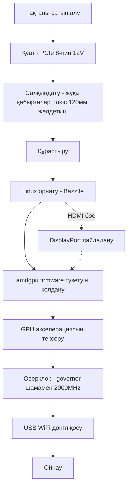

> 🌐 Қауымдастық аудармасы. Ағылшын нұсқасы — шындық көзі әрі жаңарақ болуы мүмкін. Қате таптыңыз ба? Issue ашыңыз: [English](../en/00-start-here.md) · [issues](https://github.com/lildebil0/awesome-bc250/issues)

# Осыдан бастаңыз — Нөлден ойынға дейін

> **TL;DR** — Сіз AMD BC-250 сатып алдыңыз (немесе сатып алғалы жатырсыз). Бұл — 16 GB GDDR6 бар PlayStation 5 негізіндегі APU тақтасы, одан арзан Linux ойын/AI машинасын жасауға болады — **егер** үш нәрсені ретімен шешсеңіз: **қуат**, **салқындату** және **Linux драйверлері**. Бұл бет — қораптағы тақтадан жұмыс істеп тұрған ойынға дейінгі түзу сызық. Қадамдарды орындаңыз; әрқайсысы толық тарауға сілтейді.

Бұл тақта — қосып-ойнайтын ПК емес, жоба. Бір демалысты бөліп қойыңыз. Адамдар тақтаны ерте істен шығаратын екі жол — **қуат сымын дұрыс қоспау** және **қызып кеткенде жұмыс істету** — сондықтан оларды бірінші жасаймыз.

---

## Бастамас бұрын — бөлшектер мен құралдар

Мыналарды бастамас бұрын дайын ұстаңыз, әйтпесе әрқайсысын құрастыру барысында іздеп қаласыз:

- PCIe 8-пинді 12 V шығысы бар **қуат блогы (PSU)** → **[03 — Қуат көзі](../en/03-power-supply.md)**
- **120 мм жоғары статикалық қысымды желдеткіш** + басып шығарылған қаптама → **[04 — Салқындату](../en/04-cooling.md)** / **[05 — Корпустар және 3D басып шығару](../en/05-case.md)**
- **Басып шығарылған корпус немесе бекіткіш** → **[05 — Корпустар және 3D басып шығару](../en/05-case.md)**
- Linux орнатушысы үшін **≥ 16 GB USB флешка**
- **DisplayPort кабелі** (немесе DP→HDMI адаптері — тақтаның HDMI шығысы жиі ештеңе көрсетпейді, DisplayPort — ең сенімдісі)
- **Бұрауыш**
- **Мультиметр** — PSU сымын магнитпен/үздіксіздікке тексеру үшін → **[03 — Қуат көзі](../en/03-power-supply.md)**

---

## Жол



### 0. Не алғаныңызды біліңіз
BC-250 — бұл сервер/майнинг блейді: бір APU (Zen 2 CPU + RDNA2 класты GPU, «Cyan Skillfish/Oberon»), 16 GB GDDR6, **пассивті радиатор**, бір **12 V PCIe 8-пин** арқылы қуат алады. Кірістірілген WiFi жоқ, жұмыс істейтін Windows GPU драйвері жоқ, аппараттық видеокодтау жоқ. → **[01 — BC-250 деген не](../en/01-what-is-bc250.md)**

### 1. Дұрысын сатып алыңыз
Әділ баға қандай екенін, қорапта не бар екенін (тек тақта ма? радиатор ма? PSU ма?) және қандай сатушылардан/алаяқтықтан аулақ болу керегін біліңіз. → **[02 — Сатып алу нұсқаулығы](../en/02-buying.md)**

### 2. Қуатты *бірінші іске қосу алдында* реттеңіз
Тақта 12 V арқылы PCIe 8-пин бойынша ~235 Вт (оверклокта одан көп) сұрайды. Нағыз PSU қолданыңыз (сервер Flex / Mean Well брикі / ATX), 8-пинді **жеткілікті қималы нағыз мыс сыммен** дұрыс жалғаңыз және пинаутты болжамаңыз — мұндағы қате тақтаны өлтіреді. → **[03 — Қуат көзі](../en/03-power-supply.md)**

### 3. Салқындатуды *жүктемемен сынамас бұрын* түзетіңіз
Стандартты радиатор рек желтұннеліне арналған және **үстелде троттлингке түседі**. Қабырғаларды жұқартып, жоғары статикалық қысымды 120 мм желдеткішті басып шығарылған қаптама арқылы бұрап бекітіңіз (немесе AIO-ға көшіңіз). Мақсат: Furmark-та ~80 °C-тан төмен болуы. → **[04 — Салқындату](../en/04-cooling.md)**

### 4. Оны корпусқа салыңыз (міндетті емес, бірақ жақсы)
Тақтаны, желдеткішті және PSU-ды нағыз ауа ағынымен бекітетін консоль үлгісіндегі корпусты басып шығарыңыз. Қауымдастық STL-дерінің каталогы. → **[05 — Корпустар және 3D басып шығару](../en/05-case.md)**

### 5. Оны құрастырыңыз
Минималды құрастырудың физикалық операциялар реті: желдеткішті басып шығарылған қаптамаға бекітіңіз → қаптаманы (жұқартылған) радиатор қабырғаларының үстіне қыстырыңыз/бұрап бекітіңіз → тақтаны корпусқа/бекіткішке орнатыңыз → PSU-дың 8-пинін тақтаға қосыңыз (дұрыс пинаут, **[03 — Қуат көзі](../en/03-power-supply.md)**) → DisplayPort кабелін мониторға қосыңыз → қуатты қосып, оның **POST** өткенін растаңыз (POST = power-on self-test; ол қосылып, видео шығарады — суретті көресіз / желдеткіш айналады). Кез келген қабырға жонуды орнатудан *бұрын* жасаңыз (қараңыз **[04 — Салқындату](../en/04-cooling.md)**) және металл шаңды тақтадан аулақ ұстаңыз.

> Осы құрастырудың белгіленген фотосы/сызбасы — құпталатын үлес, репозиторийде ол әлі жоқ.

### 6. Linux + GPU драйверлерін орнатыңыз
Бұл — шешуші қадам. Жаңадан келгендерге ең оңайы: BC-250 үшін жасалған **Bazzite негізіндегі образ** (немесе **Fedora 43** — elektricM-нің тағы бір «тек жұмыс істейді» таңдауы; Fedora 42 қолдаудан шықты). Содан кейін **amdgpu firmware түзетуін** (`navi10_gpu_info.bin` симлинкі) және ядро параметрлерін қолданыңыз, initramfs/grub қайта генерациялаңыз және GPU акселерацияланғанын тексеріңіз (`vainfo`, `dmesg`). → **[06 — Linux драйверлері және орнату](../en/06-linux.md)**

> **Аттап кетсеңіз, сағаттарға созылатын азаппен аяқталатын екі баптау** (elektricM): мод BIOS-та **VRAM = 512 MB динамикалық** орнатыңыз және **IOMMU-ды өшіріңіз** (бұзылған IOMMU дисплей ақаулары мен крэштерге әкеледі), содан кейін прошивкадан кейін **CMOS-ты тазалаңыз**. Орнатуды `nomodeset` жүктеу параметрімен жасаңыз да, **драйверлер орнатылған соң оны алып тастаңыз**. Mesa **25.1+** — ең төменгі шек (25.3.x ұсынылады). Және **6.15.0–6.15.6 және 6.17.8–6.17.10 ядроларынан аулақ болыңыз** — олар GPU драйверін бұзады; орнына 6.18 LTS / 6.17.11+ / 6.12–6.14 LTS пайдаланыңыз. ([elektricM quick-start](https://elektricm.github.io/amd-bc250-docs/getting-started/quick-start/), [quick-reference](https://elektricm.github.io/amd-bc250-docs/reference/quick-reference/))

> Windows туралы ойлайсыз ба? 2026 басы бойынша **жұмыс істейтін Windows GPU драйвері жоқ** — ол эксперименттік. Linux пайдаланыңыз. → **[07 — Windows](../en/07-windows.md)**

### 7. Алдымен стокта жұмыс істейтінін тексеріңіз, содан кейін оверклок жасаңыз
Жұмыс үстелі акселерацияланғаннан кейін **oberon-governor** орнатып, жиіліктерді көтеріңіз (стоктағы 1500 MHz әлсіз; **2000 MHz ≈ +30 % FPS**). Қаласаңыз, барлық **40 CU-ды** ашып, андервольт жасаңыз. Жаңа жиіліктерде температураны қайта сынаңыз. → **[09 — Оверклок және андервольт](../en/09-overclock-undervolt.md)**

### 8. Желіге қосылыңыз
Кірістірілген WiFi жоқ — **тексерілген USB донгл** қосыңыз (aic8800d80 — қауымдастықтың сүйіктісі) және оның драйверін орнатыңыз. → **[10 — WiFi және Bluetooth](../en/10-wifi-bt.md)**

### 9. Ойнаңыз
Нақты күтулерді орнатыңыз (көбіне шектеу GPU емес, Zen 2 CPU болады), FSR-ды қосыңыз және қауымдастықтың ойынға қарай баптауларын пайдаланыңыз. → **[11 — Ойын нәтижелері және баптаулары](../en/11-gaming.md)**

### Бонус — жергілікті LLM-дерді іске қосу
16 GB VRAM — бағасына шаққанда көп. llama.cpp-ты **Vulkan** бэкэндінде іске қосыңыз (бұл GPU-да ROCm — тұйық жол). → **[12 — AI / LLM](../en/12-ai-llm.md)**

### Бонус — эмуляция
Switch, PS3, PS4, ретро, аркада — нақты не жұмыс істейді және қалай → **[15 — Эмуляция](../en/15-emulation.md)**

> Бірінші іске қосуда сурет жоқ па? Тақта **DisplayPort** арқылы шығарады (HDMI жиі бос) → **[14 — Дисплей және шығыс](../en/14-display.md)**. USB порттары жетпей ме, дискі қосасыз ба? → **[16 — USB, хабтар және сақтау](../en/16-usb-peripherals.md)**

---

## Бір нәрсе бұзылса
Қара экран, акселерация жоқ, кездейсоқ қайта жүктелулер, донгл үзілуі, BIOS прошивкасынан кейінгі «кірпіш» — **[Ақаулықтарды жою](troubleshooting.md)** және **[FAQ](faq.md)** қараңыз.

> Мод BIOS прошивкасы — **бастапқы** қадам емес. Ол тақтаны «кірпішке» айналдыруы мүмкін және қалпына келтіру аппаратурасын қажет етеді. Тек әдейі, саналы түрде барыңыз. → **[08 — BIOS және «кірпіштен» қалпына келтіру](../en/08-bios.md)**

---

## 60 секундтық тексеру тізімі

| Қадам | Қашан дайын |
|------|-----------|
| Қуат | PSU 8-пинге жалғанған, пинаут дұрыс, нағыз мыс сым, тақта POST өтеді |
| Салқындату | Қабырғалар жұқартылған + 120 мм желдеткіш/қаптама; Furmark-та <80 °C |
| ОЖ | Bazzite-bc250 орнатылған, жұмыс үстеліне жүктеледі |
| GPU | `vainfo`/`dmesg` amdgpu белсенді екенін көрсетеді, CPU-ға кері кетпеген |
| Оверклок | oberon-governor жұмыс істеп тұр, ~2000 MHz, нақты ойында тұрақты |
| Желі | USB донгл қосылады және тұрақты қалады |
| Ойын | Жиіліктеріңізге сай күтілетін FPS-те жұмыс істейді |

Әр жол белгіленгенде — бітті. BC-250 клубына қош келдіңіз.

---

## Жылдам анықтамалық (cheat-sheet)

Жиі қажет болатын командалар мен баптаулар, elektricM-нің [quick-reference](https://elektricm.github.io/amd-bc250-docs/reference/quick-reference/) бетінен қысқартылған. Толық мәлімет **[06 — Linux](../en/06-linux.md)** және **[09 — Оверклок](../en/09-overclock-undervolt.md)** беттерінде.

**BIOS:** VRAM `512MB` динамикалық · IOMMU **Disabled** · UEFI жүктеу · әр USB прошивкадан кейін CMOS тазалау.

**GPU акселерацияланғанын тексеру (llvmpipe/CPU емес):**
```bash
glxinfo | grep "OpenGL version"          # Mesa 25.1+ күтіледі
vulkaninfo | grep deviceName             # → AMD Radeon Graphics (RADV GFX1013)
cat /sys/class/drm/card0/device/pp_dpm_sclk   # бірнеше жиілік, ағымдағысы * белгіленген
```

**Governor** (онсыз жиіліктер 1500 MHz-те қатады). Бізде әдепкісі — `oberon-governor`; elektricM жаңарақ SMU форкын COPR арқылы жеткізеді — екеуі де жұмыс істейді:
```bash
sudo dnf copr enable filippor/bazzite
sudo dnf install cyan-skillfish-governor-smu          # Bazzite-те rpm-ostree install …
sudo systemctl enable --now cyan-skillfish-governor-smu.service
systemctl status cyan-skillfish-governor-smu          # → active (running)
```
> Кернеудің төменгі шегі **700 mV** — одан төмен болса GPU 1500 MHz-те қатады. Governor дұрыс емес картаны (card0 vs card1) нысана етуі мүмкін — скейлинг іске қоспаса, тексеріңіз.

**Драйверлер орнатылған соң `nomodeset`-ті алып тастаңыз:**
```bash
# GRUB дистрибутивтері: /etc/default/grub ішінен "nomodeset" сөзін алып тастаңыз, содан кейін
sudo grub2-mkconfig -o /boot/grub2/grub.cfg && sudo reboot
# Bazzite / Fedora Atomic:
rpm-ostree kargs --delete-if-present="nomodeset" && systemctl reboot
```

**Кейбір ойындардағы графикалық ақауларды түзететін Steam launch параметрі:** `RADV_DEBUG=nohiz %command%`.

**RDR2 / Company of Heroes 3-те крэш бола ма?** VRAM-ды `512MB` динамикалықтан **10GB/6GB бекітілгенге** ауыстырыңыз (ZRAM қақтығысы). ([elektricM quick-reference](https://elektricm.github.io/amd-bc250-docs/reference/quick-reference/))
