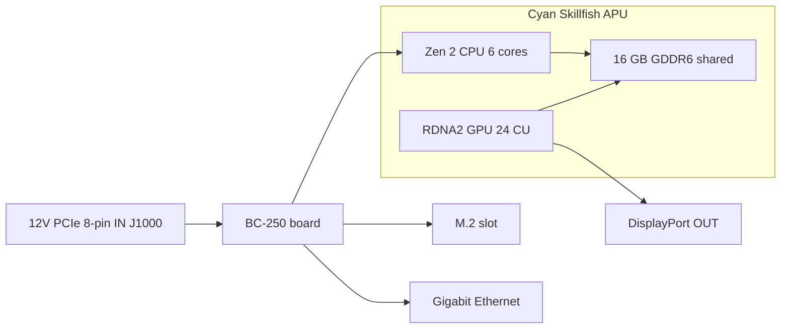

> 🌐 Қауымдастық аудармасы. Ағылшын нұсқасы — шындық көзі әрі жаңарақ болуы мүмкін. Қате таптыңыз ба? Issue ашыңыз: [English](../en/01-what-is-bc250.md) · [issues](https://github.com/lildebil0/awesome-bc250/issues)

# BC-250 деген не

> **TL;DR** — BC-250 — бұл **сервер/майнинг тақтасындағы PlayStation 5 класындағы APU**. Бір чип (AMD кодтық атауы **Cyan Skillfish**, PS5-тің **Oberon/Ariel** кремнийінің қысқартылған нұсқасы) **6-ядролы / 12-ағынды Zen 2 CPU** мен **24-есептеу-блокты RDNA 2 GPU**-ны алып жүреді, оларды **16 GB дәнекерленген GDDR6** қоректендіреді. Бұл — **видеокарта да емес, кәдімгі ПК де емес** — оның **сізге таныс x86 BIOS-ы жоқ, PCIe слоты жоқ, 24-пинді ATX қосқышы жоқ**: ол **12 V-ты тікелей 8-пинді PCIe қуат қосқышына** алады да, өзінің firmware-ін жүктейді. Адамдар оны **тым арзан Linux ойын / жергілікті AI машинасы** болғаны үшін сатып алады. Адамдар оған ашуланады, өйткені оның **драйверлері, салқындатуы және аппараттық видеокодтаудың жоқтығы** оны қосып-ойнайтын машина емес, жоба қылады. Ешқандай уайымсыз болғанды қаласаңыз — бұл тақта дұрыс сатып алу емес, қазір қайтарыңыз. Тіңкірлеуді ұнатсаңыз — оқи беріңіз.

Бұл бет — «мен нені сатып алдым» деген анықтамалық. Қуат, салқындату, ОЖ орнату және драйверлердің әрқайсысы өз бөлімін алады ([03](03-power-supply.md) / [04](04-cooling.md) / [06](06-linux.md)).

---

## Бұл нақты не

AMD BC-250-ді **криптовалюта майнинг үдеткіші** ретінде жасады («BC» — blockchain дегенді білдіреді). Оны арзан ету үшін AMD **PlayStation 5 процессорының артық кремнийін** қайта пайдаланды — Sony консольге салатын чиптің сол отбасы. Тақта — бір APU плюс оның жады мен қуат тізбегі; бар өнім — осы.

Жаргон, бір рет анықталды:

- **APU** (Accelerated Processing Unit) — **CPU мен GPU екеуін де** қамтитын жалғыз чипке AMD қойған атау. Бөлек видеокарта жоқ; GPU сол корпустың ішінде, сол жадыны бөліседі.
- **Cyan Skillfish** — осы APU-ға AMD қойған инженерлік **кодтық атау**. Сіз оны Linux-те барлық жерден көресіз: GPU firmware файлы тура `cyan_skillfish_gpu_info.bin` деп аталады ([src](https://t.me/c/2424231195/57962) — симлинк түзетуін [src](https://t.me/c/2424231195/41252) қараңыз). Құралдар оны PS5 кристалл атаулары **Oberon** / **Ariel** деп те хабарлауы мүмкін.
- **GDDR6** — әдетте видеокартада болатын жылдам графикалық жады. BC-250-де ол **бір уақытта жүйелік RAM әрі видеожады** (CPU мен GPU бір пулды бөліседі). DIMM слоттары жоқ; 16 GB дәнекерленген әрі жаңартылмайды.
- **RDNA 2** — GPU архитектурасының буыны (PS5, Xbox Series және Radeon RX 6000 карталарымен бір отбасы).

Чип — толық емес, **қысқартылған** PS5 бөлшегі. Қауымдастық осы салыстыруды бекітті ([src](https://t.me/c/2424231195/11282), [TechPowerUp-тың Oberon жазбасына](https://www.techpowerup.com/gpu-specs/amd-oberon.g936) сілтемемен):

| | BC-250 | Толық PS5 (Oberon) |
|---|---|---|
| CPU ядро / ағын | **6 / 12** | 8 / 16 |
| GPU есептеу блоктары (CU) | **24** | 36 |

«Есептеу блогы» — бір GPU ядро блогы; оның 24-і — шамамен орта деңгейлі ноутбук-GPU аумағы, бұл — чат ойындарда хабарлайтын дәл сол өнімділік белдеуі.

BC-250 — AMD-тың «жұмыс үстелі тақтасындағы артық консоль кремнийінің» жалғызы емес. Оның сол идеядан жасалған екі жақын немере ағасы бар: **AMD 4700S Desktop Kit** (**PlayStation 5**-тен туындаған CPU жинағы) — чат оны маркетплейстерде BC-250-мен шатастырып қатар тізетіні туралы ескертеді ([02-buying.md](02-buying.md)) — және **AMD 4800S Desktop Kit**, **Xbox Series X**-тен туындаған нұсқа (GDDR6-ға қосылған 8 Zen 2 ядросы, консольдің RDNA 2 GPU-ы өшірілген). Екеуі де нақты AMD өнімдері, олар BC-250 секілді құтқарылған консоль CPU-ын дәнекерленген GDDR6-мен жұптайды ([VideoCardz](https://videocardz.com/newz/amd-4800s-desktop-kit-a-pc-repurposed-apu-from-xbox-series-x-has-been-tested)). Дүкенде жүргенде BC-250-ді оның ағайындарынан ажыратуға олар пайдалы контекст береді.

Адамдар **PS5-тің өзі джейлбрейк жасалғандай BC-250-де жұмыс үстелі Linux-ін іске қосты** — толық 4K HDMI видео + дыбыс, барлық USB порттары жұмыс істейді, APU CPU-да ~3.2 ГГц-ке және GPU-да ~2.0 ГГц-ке дейін көтеріледі ([src](https://t.me/c/2424231195/122260)).

---

## Ол неге жақсы

- **Осы өнімділік деңгейіндегі Linux ойынына ең арзан кіру жолы.** Steam/Proton (Linux-те Windows ойындарын іске қосатын үйлесімділік қабаты) арқылы адамдар Star Citizen ойнайды ([src](https://t.me/c/2424231195/38702)), тіпті *Doom: The Dark Ages* секілді заманауи тайтлдарды қауымдастықтың Vulkan wrapper-і арқылы low/FSR-да ~60 FPS-пен ойнайды ([src](https://t.me/c/2424231195/127696)). Әр ойын бойынша нәтижелер [11-gaming.md](11-gaming.md) бетінде.
- **Қабілетті жергілікті AI машинасы.** 16 GB GDDR6-мен ол орта көлемді тіл модельдерін ұстай алады. Қатысушылар LLM-дерді жергілікті түрде `llama.cpp`/`jan` арқылы **Vulkan** бэкендінде іске қосады; алдымен BIOS-ты GPU-ға 12 GB бөлуге қойасыз ([src](https://t.me/c/2424231195/92421)). [12-ai-llm.md](12-ai-llm.md) қараңыз.
- **Шағын әрі тұтас.** Бұл — GPU-стиліндегі радиаторы кіріктірілген бір ұзын тақта — ол шағын DIY/3D-басып шығарылған корпустарға түседі де, бір кішкентай қуат блогынан жұмыс істейді ([build src](https://t.me/c/2424231195/137825)).

*Неге* ол тіпті жұмыс істейтіні туралы қауымдастық консенсусы: чип Steam Deck / PS5 аппаратурасына өте жақын болғандықтан, Valve мен ашық бастаулы Mesa графикалық стегі дәл сол драйверлерді жетілдіре береді, сондықтан BC-250 тегін бірге жүреді ([src](https://t.me/c/2424231195/93006)).

---

## Не қиын (күтуді реттеңіз)

Бұл — жаңадан келгендер бағаламайтын бөлік. Бұның ешқайсысы мәмілені бұзбайды, бірақ бәрі нақты жұмыс.

- **Драйверлер — өзің-істе тапсырмасы.** AMD бұл тақта үшін **ресми драйвер де, ашық құжаттама да жібермейді** ([src](https://t.me/c/2424231195/37764)). Бәрі — Linux графикалық стегі, такт/кернеу «governor»-ы, BIOS — қауымдастық жасаған. Орнату скрипттерін орындауға және анда-санда қолмен түзетуге дайын болыңыз. [06-linux.md](06-linux.md) бетінен бастаңыз.
- **Салқындату — адамдар ең жиі қателесетін №1 нәрсе.** Стандартты радиатор майнинг рекінің мәжбүрлі ауа тұннеліне арналған, сондықтан үстелде ол қызуды сіңіріп, қораптан шыққанда троттлингке түседі. Сізге салқындатуды модтау керек болады. Оның өз бөлімі бар — өнімділікке ұмтылмас бұрын [04-cooling.md](04-cooling.md) бетін **оқыңыз**.
- **Аппараттық видеокодтаушы жоқ.** GPU-дың видеокодтау блогы (AMD оны **VCN** деп атайды — трансляция/жазу үшін видеоны қысатын арнайы тізбек) **қолжетімсіз**. Экранды жазу мен ойынды трансляциялау **бағдарламалық кодтаушыға** кері кетеді, ол CPU-ға шығын келтіреді. Ол жұмыс істейді (адамдар Sunshine/Moonlight арқылы трансляциялайды), бірақ ол кәдімгі GPU-дан баяуырақ әрі сапасы төмен ([src](https://t.me/c/2424231195/88026)). Сол сияқты, ерте Mesa драйвері қауымдастық аппараттық акселерацияны іске қосқанша **бағдарламалық рендерингімен** атақты болды ([src](https://t.me/c/2424231195/11243)).
- **Оғаш қуат әрі әдепкіде дисплей жоқ.** Ол стандартты 24-пинді ATX қосқышын қабылдамайды — келесі бөлімді қараңыз. Көп тақталар тіпті POST өтуден бұрын **BIOS-ты ысыруды** қажет етіп келеді ([src](https://t.me/c/2424231195/57930)), ал суретті әдетте **DisplayPort** арқылы шығарасыз (HDMI үшін DP→HDMI адаптері керек, ол дыбысты да жақсы тасымалдайды — [src](https://t.me/c/2424231195/9148)).
- **Бұл — тіңкірлеушінің тақтасы, нүкте.** Бір ескі қатысушы айтқандай: арзан болса да BC-250 «белгілі бір дағдыларды, күш-жігер мен ақылды талап етеді» ([src](https://t.me/c/2424231195/73002)). Тек ақшаны ғана емес, уақытты да жоспарлаңыз.
- ⚠ **eGPU оны құтқармайды — қауымдастық хабарлағаны (r/BC250Gaming).** Жалғыз M.2 слоты бар-жоғы **PCIe 2.0 ×2** (төмендегі аппарат картасын қараңыз), ал сондай өткізу қабілетінде M.2-ге ілінген сыртқы GPU **бортүсті RDNA 2 GPU-дан *нашарырақ* жұмыс істейді деп хабарланады** — баяу байланыс оны тұншықтырады. Көбірек графикалық қуат қаласаңыз, консенсус — бұл соған арналған тақта емес. *(Қауымдастық хабарлағаны; бенчмарк емес, сақтық ескертуі ретінде қабылдаңыз.)*

> ⚠ **Екі түсті LED нені білдіреді — қауымдастық хабарлағаны (r/BC250Gaming).** NIC жанындағы екі түсті LED — қате шамы емес, **майнинг дәуіріндегі қолданыс индикаторы**: қауымдастық деректерінше **қызыл = GPU/RAM 100% жүктемеде *емес*, жасыл = толық жүктеме**. Сондықтан бос тұрған жұмыс үстелі тақтасындағы қызыл шам — қалыпты жайт, ақаулық емес. *(Қауымдастық хабарлағаны; AMD бұл тақта үшін құжаттама жібермейді, сондықтан нақты түс сәйкестігін расталмаған деп қабылдаңыз.)*

> ⚠ **Ұстау туралы ескерту, қиын жолмен үйренілген.** Қуатталған тақтаға металл нәрсенің тиюіне жол **бермеңіз** және термопастаны тек ұқыппен ауыстырыңыз — бір қатысушы тақтаны қысқа тұйықтап, өзінің BC-250-ін біржола істен шығарды ([src](https://t.me/c/2424231195/95998)). Тақталар сондай-ақ радиатор бекіткішінен сәл **майысқан** күйде келеді; бір қатысушы тақтаны радиаторға қарсы қағазбен тегіс төсеп, жүктелмеу мәселесін шешті ([src](https://t.me/c/2424231195/117347)).

---

## Аппараттық анықтамалық карта

Сипаттамалар қауымдастықтың аппараттық кері инженерлік талдауымен салыстырылды (AMD деректер парағын жарияламайды). Бұрын расталмаған жады-шинасы мен физикалық өлшем мәндері енді [elektricM аппараттық спекінен](https://github.com/elektricm/elektricm) алынды (ол кері инженерлік үшін mothenjoyer69 / Segfault / neggles / yeyus-ке алғыс білдіреді). Төмендегі пинаут пен қуат мәндері канондық қауымдастық аппараттық құжатынан алынған.

Тақта жалпы көрінісінде — сол жақта қуат кірісі, ортада APU мен оның ортақ жадысы, оң жақта I/O:



### Негізгі сипаттамалар

| Сипаттама | Мәні | Көзі |
|------|-------|--------|
| Класс | Майнинг/сервер тақтасындағы PlayStation 5-тен туындаған APU | [hardware.md](https://github.com/mothenjoyer69/bc250-documentation/blob/main/hardware.md) |
| APU кодтық атауы | **Cyan Skillfish** (PS5 кристалл: Oberon / Ariel) | chat ([src](https://t.me/c/2424231195/57962)) |
| CPU | **6 ядро / 12 ағын, Zen 2** (6 ядро расталды) | [hardware.md](https://github.com/mothenjoyer69/bc250-documentation) · chat ([src](https://t.me/c/2424231195/11282)) |
| CPU жиілігі | **~3.49 ГГц**-ке дейін («шамамен») | [hardware.md](https://github.com/mothenjoyer69/bc250-documentation) · chat ([src](https://t.me/c/2424231195/122260)) |
| GPU | **24 есептеу блогы, RDNA 2** (`gfx1013`; PS5 SoC-та 36 бар); растрлеу ≈ **RX 6600 мен RX 6600 XT арасы** / GTX 1660 Ti класы; **Vulkan 1.4** | [hardware.md](https://github.com/mothenjoyer69/bc250-documentation) · chat ([src](https://t.me/c/2424231195/11282)) · [elektricM](https://github.com/elektricm/elektricm) |
| GPU жиілігі | стокта ~1500 MHz, оверклокта ~2000 MHz (макс ≈2.23 ГГц) | ([src](https://t.me/c/2424231195/122260)) · [09](09-overclock-undervolt.md) |
| Жады | **16 GB GDDR6**, CPU мен GPU арасында ортақ, дәнекерленген (жаңартылмайды) | [hardware.md](https://github.com/mothenjoyer69/bc250-documentation) · [README](../../README.md) |
| GPU VRAM бөлінісі | BIOS-та орнатылады; BIOS 3.00+ нұсқасында **12 GB** таңдалады | ([src](https://t.me/c/2424231195/92421)) |
| Жады шинасы / өткізу қабілеті | **256-бит** GDDR6 @ **14 Gbps**, **~448 GB/s** | [elektricM аппараттық спек](https://github.com/elektricm/elektricm) |
| TDP | **220 Вт** (тақтаның жылулық-дизайн қуаты) | [hardware.md](https://github.com/mothenjoyer69/bc250-documentation) |
| Қуат тұтыну | майнинг-класты жүктемеде әдетте ~67–85 Вт | [hashrate.no](https://www.hashrate.no/gpus/bc250) |
| Аппараттық видеокодтау (VCN) | **Жоқ** — тек бағдарламалық кодтау | ([src](https://t.me/c/2424231195/88026)) |
| Видеошығыс | **DisplayPort 1.4** (**4K@120 / 8K@60**-қа дейін); HDMI үшін DP→HDMI адаптерін пайдаланыңыз; дыбысты тасымалдайды | ([src](https://t.me/c/2424231195/9148)) · [elektricM](https://github.com/elektricm/elektricm) |
| Сақтау (M.2) | 1x M.2 2280 — **PCIe 2.0 x2 немесе SATA III** | [elektricM](https://github.com/elektricm/elektricm) |
| 2-ші DisplayPort | бар, бірақ **орнатылмаған**; бағдарламалық түрде белсендіруге болады | ([src](https://t.me/c/2424231195/88026)) |
| Физикалық өлшем | **340 мм / 310 мм** ұзын (өлшеу әдісіне қарай), **~115 мм** ені, радиатормен **~400 г**; стандартты емес тапсырыс майнинг форм-факторы | [elektricM аппараттық спек](https://github.com/elektricm/elektricm) |

> ⚠ **GDDR6 оверклогы = өткізу қабілеті, FPS емес — қауымдастық хабарлағаны (r/BC250Gaming).** Қауымдастық деректерінше, GDDR6-ны оверклоктау жады өткізу қабілетін шамамен **~256 GB/s-тан ~445 GB/s-қа** көтереді, бірақ **ойында ешқандай пайда бермейді** — бөгет жады өткізу қабілеті емес, GPU-дың 24 CU-ы, сондықтан артық өткізу қабілеті ойында пайдаланылмайды. (Жоғарыдағы репоның расталған *стоктық* мәні 256-бит / 14 Gbps кезінде әлдеқашан **~448 GB/s** екенін ескеріңіз, сондықтан қауымдастықтың «~256 GB/s бастапқысы» спек-параққа сәйкес келмейді — нақты GB/s сандарын расталмаған деп қабылдаңыз; FPS қоспайтыныңыз — тұрақты бөлік.) GPU/жады оверклогы туралы жалпы [09-overclock-undervolt.md](09-overclock-undervolt.md) қараңыз.

> **Тақта өлшемдері туралы:** [elektricM аппараттық спек](https://github.com/elektricm/elektricm) **340 мм / 310 мм** ұзындық береді (екі мәні әртүрлі өлшеу әдістерін көрсетеді), **~115 мм** ені және радиатормен **~400 г**, стандартты емес тапсырыс майнинг форм-факторында. Канондық `hardware.md`-тің өзі өлшемдерді тізбелемейді; чаттың ең көп реакция жинаған бір аппараттық посты тура *"Размеры amd bc-250"* («AMD BC-250 өлшемдері», ❤20 — [src](https://t.me/c/2424231195/379)) деп аталады, бұл адамдардың корпус құру үшін осыны мән беретінін растайды. Дәл корпус сәйкестігі үшін өлшенген 3D модельден жұмыс істеңіз — қауымдастық каталогтаған тақта STL-дері (мысалы, `BC250 Board.stl`, [Printables 1103626](https://www.printables.com/model/1103626-amd-bc250-board) және [Printables 1341336](https://www.printables.com/model/1341336-accurate-3d-model-of-the-amd-bc-250-board)-дегі дәл модель) өлшемдік жағынан дұрыс. [05-case.md](05-case.md) қараңыз.

<p align="center">
  <br>
  <sub>Фото: AMD BC-250 community · <a href="https://t.me/c/2424231195/379">source</a></sub>
</p>

### Қуат қосқышының пинауты (бірдеңе қоспас бұрын осыны оқыңыз)

BC-250-де **24-пинді ATX хедер жоқ**. Ол **тек 12 V**-пен, **8-пинді PCIe қуат қосқышы (J1000)** арқылы қоректенеді — видеокартаныкімен бірдей физикалық қосқыш, бірақ тақта барлық үш қуат контактісін 12 V-тан қоректендіруді күтеді. Толық сым жүргізу мен PSU таңдауы [03-power-supply.md](03-power-supply.md)-те; [hardware.md](https://github.com/mothenjoyer69/bc250-documentation/blob/main/hardware.md)-тен канондық пинаут:

**J1000 — негізгі 8-пинді PCIe қуат (қосатыныңыз — осы):**

```
[ GND  GND  GND  GND ]
[ GND  12V  12V  12V ]
```

- Үш 12 V контакт; құжат Mini-Fit Jr контактілерін **әрқайсысы 9 А-ге дейін** деп бағалайды, сондықтан бұл қосқыш «**324 Вт**-қа дейін қауіпсіз бере алады», әрі дербес пайдалану үшін **16 AWG** сымды ұсынады ([hardware.md](https://github.com/mothenjoyer69/bc250-documentation)).
- **GND = жер (0 V), 12V = +12 вольт.** Полярлықты дұрыс қойыңыз — бұл тақтаның кері кернеуге кешірімі жоқ.

**J2000 / J2001 — рек қуат қосқыштары (үстелде әдетте пайдаланылМАЙды):**

```
        J2000                  J2001
 [ LED1  12V  12V  12V ]   [ 12V  12V  12V  PGD ]
 [ LED2  GND  GND  GND ]   [ GND  GND  GND  GND ]
```

- Бұлар — **Molex Micro-Fit BMI** қосқыштары ([part 444280801](https://www.molex.com/en-us/products/part-detail/444280801)), PCIe/EPS қосқыштары *емес* — олар тақтаны бастапқы майнинг шассиінде қоректендірген. **J2000 мен J2001 бірдей емес:** жоғарыдағы пинаут көрсеткендей, J2000 **LED1/LED2** пиндерін, ал J2001 **PGD** пинін алып жүреді, сондықтан екі қосқыш ерекшеленеді ([elektricM / mothenjoyer69 аппараттық құжаттар](https://github.com/mothenjoyer69/bc250-documentation)).
- **PGD** (J2001-де) — power-good/сезу пині: ол **тақта рек PSU2-ге орналасқанда 5 V көреді**. Дербес құрастыруда сіз әдетте оның орнына J1000 арқылы қоректендіресіз де, J2000/J2001-ді елемеуге болады — бірақ нақты PSU адаптеріңіз үшін [03-power-supply.md](03-power-supply.md)-пен салыстырып растаңыз.

---

## Әрі қарай қайда

1. **[02-buying.md](02-buying.md)** — әлі сатып алмасаңыз немесе әділ баға мен нақты тәуекелдерді білгіңіз келсе.
2. **[03-power-supply.md](03-power-supply.md)** — оны нақты қалай қоректендіру керек (8-пинге 12 V).
3. **[04-cooling.md](04-cooling.md)** — тақта қолға тигеннен кейін бұны **бәрінен бұрын** жасаңыз.
4. **[06-linux.md](06-linux.md)** — оған ОЖ мен қауымдастық драйверлерін орнатыңыз.

---

## Көздер

- Канондық аппараттық құжат әрі пинаут — [mothenjoyer69/bc250-documentation `hardware.md`](https://github.com/mothenjoyer69/bc250-documentation/blob/main/hardware.md)
- Жады шинасы/өткізу қабілеті, физикалық өлшемдер, GPU позициясы, DP 1.4, M.2 — [elektricM аппараттық спек](https://github.com/elektricm/elektricm) (кері инженерлік үшін mothenjoyer69 / Segfault / neggles / yeyus-ке алғыс)
- Қысқартылған vs толық PS5 кремнийі (6/12 + 24 CU vs 8/16 + 36 CU) — https://t.me/c/2424231195/11282 · [TechPowerUp Oberon](https://www.techpowerup.com/gpu-specs/amd-oberon.g936)
- PS5-аппаратурасында Linux, 4K HDMI, жиіліктер — https://t.me/c/2424231195/122260
- Ресми драйвер жоқ / құжат жоқ — https://t.me/c/2424231195/37764
- Бағдарламалық рендеринг / аппараттық кодтау жоқ — https://t.me/c/2424231195/11243 · https://t.me/c/2424231195/88026
- DisplayPort + DP→HDMI дыбысы — https://t.me/c/2424231195/9148
- Cyan Skillfish firmware атауы — https://t.me/c/2424231195/57962 · https://t.me/c/2424231195/41252
- 12 GB VRAM арқылы жергілікті LLM + BIOS 3.00 — https://t.me/c/2424231195/92421
- «Дағдыларды, күш-жігер мен ақылды талап етеді» — https://t.me/c/2424231195/73002
- Ұстау/қысқа тұйықтау ескертуі — https://t.me/c/2424231195/95998 · майысқан тақта түзетуі — https://t.me/c/2424231195/117347
- «BC-250 өлшемдері» (ең көп реакция жинаған аппараттық пост) — https://t.me/c/2424231195/379
- 220 Вт TDP, 6-ядролы/3.49 ГГц CPU, 24-CU GPU, 16 GB GDDR6 (репо растауы) — [mothenjoyer69/bc250-documentation README](https://github.com/mothenjoyer69/bc250-documentation)
- Майнинг-класты қуат тұтыну мәндері — https://www.hashrate.no/gpus/bc250
- Неге ол жұмыс істей береді (ортақ Steam Deck/PS5 драйвер еңбегі) — https://t.me/c/2424231195/93006
- Ағайын жинақтар — AMD 4700S (PS5 CPU жинағы, BC-250-мен қатар тізіледі, [02-buying.md](02-buying.md)) және AMD 4800S (Xbox Series X CPU + GDDR6, GPU өшірілген) — [VideoCardz: 4800S Desktop Kit](https://videocardz.com/newz/amd-4800s-desktop-kit-a-pc-repurposed-apu-from-xbox-series-x-has-been-tested)
- M.2 арқылы eGPU бортүсті GPU-дан баяу (M.2 — PCIe 2.0 ×2), екі түсті NIC LED = қолданыс сигналы (қызыл = 100% емес, жасыл = толық), GDDR6 оверклогы өткізу қабілетін көтереді (~256→~445 GB/s) ойын пайдасынсыз — қауымдастық хабарлағаны (r/BC250Gaming)

> AMD бұл тақта үшін бастапқы деректер парағын жарияламайды; жоғарыдағы мәндер — қауымдастықтың ең жақсы кері инженерлік талдауы (канондық `hardware.md` плюс elektricM аппараттық спек). Түзетулер PR арқылы құпталады ([CONTRIBUTING.md](../../CONTRIBUTING.md) қараңыз).
