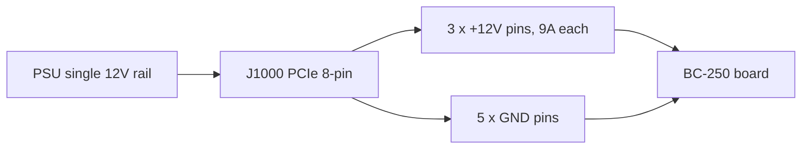

> 🌐 Қауымдастық аудармасы. Ағылшын нұсқасы — шындық көзі әрі жаңарақ болуы мүмкін. Қате таптыңыз ба? Issue ашыңыз: [English](../en/03-power-supply.md) · [issues](https://github.com/lildebil0/awesome-bc250/issues)

# Қуат көзі

> **TL;DR** — BC-250-де **қуат түймесі де, стандартты ПК қуат қосқышы да жоқ**. Ол **12 V**-ты жалғыз **PCIe 8-пин (6+2)** қосқышы арқылы жейді — жұмыс үстелі видеокартасы пайдаланатын дәл сол қосқыш — әрі **~235 Вт** шамасында шыңға жетеді (оверклоктасаңыз — көбірек). Сізге **бір рейлде ~250–300 Вт** бере алатын 12 V көзі керек. Қауымдастықтың үш жолы: арзан **сервер «Flex» PSU** (HP 500 Вт, eBay-де ~$12), **өнеркәсіптік брик** (Mean Well LOP-300/LOP-500), немесе **кәдімгі ATX PSU** (тек оның PCIe кабелін қосыңыз). Аулақ болу керек екі өлтіруші: **12 V-ты әлсіз рейлдерге бөлетін ескі PSU**, және қызып, өртеніп кететін **жалған мыспен қапталған болат сымдар**. Нағыз мысты, **16 AWG немесе одан қалыңын** пайдаланыңыз.

Тақтаны қоректендіру — жаңадан келгеннің ([салқындатудан](04-cooling.md) кейін) **дұрыс істеуі тиіс екінші нәрсесі** — әрі сым жүргізуде бұрыштарды кесіп тастасаңыз өрт бастауы ықтималдылығы ең жоғары нәрсе.

---

## Тақтаға нақты не керек

BC-250 — крипто-майнинг/сервер тақтасындағы қысқартылған PlayStation 5 кристалы. Ол ректе отырып, 12 V-пен қоректенуге арналған — сондықтан оның **кәдімгі ПК ыңғайлылықтарының бірі де жоқ**:

- **ATX 24-пин** аналық тақта қосқышы жоқ.
- **Қуат түймесі жоқ** — 12 V келген сәтте ол қосылады (PSU-дың өз қосқышы сіздің қуат түймеңіз).
- **PSU-ға бір ғана жұмыс: 12 V-ты жеткілікті токпен беру.**

**Қуат мәндері (расталған):**

| Сипаттама | Мәні | Көзі |
|------|-------|--------|
| Кіріс кернеуі | 12 V DC | [hardware.md](https://github.com/mothenjoyer69/bc250-documentation/blob/main/hardware.md) |
| Әдеттегі шың тұтыну | ~220–235 Вт | қауымдастық байқаған ([src](https://t.me/c/2424231195/31076)) |
| Қосқыш | PCIe 8-пин (6+2) | [hardware.md](https://github.com/mothenjoyer69/bc250-documentation/blob/main/hardware.md) · ([src](https://t.me/c/2424231195/14450)) |
| 12 V-тағы шың ток | әдетте ~18–20 А, дизайн қоры ~40 А-ге дейін | ([src](https://t.me/c/2424231195/31076)) |

> **«PCIe 8-пин (6+2)»** видеокарта қуат қосқышын білдіреді: блоктағы алты пин плюс шешілетін 2-пинді қыстырғыш, сондықтан сол кабель 6-пин де, 8-пин де болып жұмыс істейді. **6+2** = 6 бекітілген + 2 алынатын. Бұл — аналық тақтаңыздағы CPU/EPS 8-пин *емес* — төмендегі ескертуді қараңыз.

PCIe 8-пин PCIe стандарты бойынша **150 Вт**-қа есептелген, ал тақтаның үш 12 V контактісі (Molex Mini-Fit Jr, әрқайсысы 9 А) **~324 Вт**-қа дейін қауіпсіз өткізе алады ([hardware.md](https://github.com/mothenjoyer69/bc250-documentation/blob/main/hardware.md)). Сондықтан жалғыз 8-пин стокта жеткілікті ыңғайлы; қор тек агрессивті оверклокты итергенде ғана маңызды болады.

**Қанша PSU қуатын сатып алу керек:** **12 V рейлінде 300 Вт немесе одан көп**-ке нысана алыңыз. 300 Вт бірлік ~235 Вт шыңнан сау маржа береді әрі PSU желдеткішін тыныш ұстайды; адамдар 500 Вт Flex сервер PSU-ы осы жүктемеде дерлік үнсіз жұмыс істейтінін хабарлайды ([src](https://t.me/c/2424231195/31076)). «Ақша үнемдеу үшін» ~250 Вт-тан төмен сатып алмаңыз — оны шегінде жұмыс істетесіз де, ол қатты дыбыстайды немесе сөнеді.

> **Қыспа-метр қуат қисығы (бастапқы амперлеу).** Бір бөлшектеуде DC амперметрді 12 V қоректенуіне қыстырып, тақтаның нақты тогын оқыды: **ойын ≈17 А / ~190 Вт тартады**, ал **толық синтетикалық стресс жүктеме 2000 MHz / 960 mV-та ≈21 А / ~240–250 Вт-қа жетеді**; кернеуді жоғары жылжыту оны **22–23 А-ге және одан әрі** итереді ([Old Lamer — Part VII](https://youtu.be/pxahl9-YgkY) ~9:01). Бұлар жоғарыдағы қауымдастықтың қабырға-қуаты мәндерін өлшенген рейл амперлеуімен өткірлендіреді — әрі 300 Вт нысана неге дұрыс маржа қалдыратынын растайды. *(Сандар авто-субтитрден оқылды — нақты мәндерді шамалас деп қабылдаңыз.)*

> ⚠️ **Аулақ болу керек аталған PSU-лар:** арзан **Dell D220P-01** (220 Вт) мен **Dell D250AD-00** (250 Вт) бұл тақта үшін **жеткіліксіз әрі қауіпті** деп аталған — 220 Вт / 250 Вт-та олар тақтаның шыңынан төмен отырады әрі ойын жүктемесінде сөнетіні немесе тіпті бұзылатыны хабарланды. Бірлікті тек арзан әрі «жеткілікті сияқты» болғаны үшін сатып алмаңыз. ([elektricM: power](https://elektricm.github.io/amd-bc250-docs/hardware/power/))

---

## Физика: вольт, ампер, ватт — және неге жіңішке сым жанады

Бұл тараудың әр ережесі үш теңдеуден шығады. Бұларды үйреніңіз де, қима кестелері мен «ешқашан SATA пайдаланба» ескертулері кездейсоқ болудан қалады.

**Қуат = вольт × ампер (`P = U·I`).** Тақтаға **12 V**-та **~235 Вт** керек, сондықтан ол `235 ÷ 12 ≈ 19.6 А` тартады. Қыспа-метр неге **~17 А ойын / ~21 А стресс** оқитыны тура осы ([жоғарыда](#тақтаға-нақты-не-керек)): ваттажды кремний бекітеді, сондықтан *амперлер* — 12 V не мәжбүрлесе, сол. Жиіліктерді/кернеуді көтеріңіз, амперлер ваттпен бірге өседі.

**Неге 12 V — және неге 24 V оны өлтіреді.** 12 V — тақта арналған дата-орталық рек стандарты; оның бортүсті VRM-дері оны APU ядросы жұмыс істейтін ~1 V-қа дейін түсіреді. Тақта **артық кернеуден қорғанысы жоқ 12 V-қа қатаң сымдалған**, сондықтан оған 24 V беру (мысалы, [LOP-300-**24**](#нұсқа-b--mean-well-өнеркәсіптік-брик)) әр 12 V бөлшегіне екі есе салады да, оны лезде жояды. Амперлеуден өзгеше, кернеу талқыланбайды.

**Ампациттілік — неге сымның амперлік шегі бар.** Сым — резистор, ал кедергі арқылы өткен ток жылу шығарады: `P_loss = I²·R`. Қалыңырақ мыс = көбірек қима = **төменірек R** = сол амперлерде азырақ жылу. Жоғарыдағы AWG кестесінің бар мәні — осы: **төмен AWG саны = қалың сым = көбірек амперде қауіпсіз**. ~20 А-де **16 AWG мыс** салқын қалады; жіңішкерек болса, `I²·R` оқшаулағышты балқытады. **Квадратты** ескеріңіз: токты екі есе көбейту жылуды *төрт есеге* арттырады, сондықтан ауыр оверклокқа «сәл көбірек сым» емес, екінші қоректену керек.

**Кернеу түсуі — екінші жартысы.** Сымда жоғалған жылу — тақта ешқашан көрмейтін кернеу: `V_drop = I·R`. Ұзын, жіңішке кабель тақтаны әрі **қыздырады**, әрі **аштырады**, сондықтан ешнәрсе көзге балқымаса да жүктемеде ол кернеу түсіп қалуы (brown out) мүмкін. Қысқа, жуан мыс екеуін де бірден түзетеді.

**Неге жалған «мыс» өлімші.** Мыспен қапталған болаттың кедергісі нағыз мыстан **~6 есе** көп — сол амперлер, сол `I²·R`, сондықтан сол сымда **6 есе жылу**. Төмендегі магнит сынауы — сапа қалауы емес; ол **токта әлдеқашан квадраттанған мүшеге 6 есе көбейткішті** ұстайды.

**Неге ешқашан SATA немесе Molex.** Мәселе — сым емес, *қосқыш*. SATA қуат контактісі **~54 Вт**-қа есептелген → `54 ÷ 12 ≈ 4.5 А`, одан кейін кішкентай контакт өзін қуырады; тақтаға ~20 А керек, бұл шектен **4 есе тыс**. PCIe 8-пин оның орнына үш жуан 12 V контактісін алып жүреді (**әрқайсысы 9 А = 27 А / 324 Вт**) — *сондықтан* ол дұрыс қосқыш әрі SATA/Molex ешқашан бола алмайды ([пинаутты](#8-пинді-пинаут-j1000) қараңыз).

---

## ⚠️ Тақталарды жоятын екі қате

Бірдеңе сатып алмас бұрын осы бөлімді оқыңыз.

### 1. PCIe 8-пинді CPU/EPS 8-пинмен шатастырмаңыз

ATX PSU-ңызда **екі түрлі 8-пинді қосқыш** бар: біреуі видеокарталарға (**PCIe**), екіншісі CPU-ға (**EPS/CPU**, кейде «CPU» немесе «4+4» деп таңбаланады). **Олар дерлік бірдей көрінеді, бірақ пин пішіндері мен полярлығы кері.** CPU қосқышын BC-250-ге күштеп салу **жер болуы тиіс жерге +12 V** қояды — бүкіл тақтаны өртеп жіберуіңіз мүмкін.

> *«Бұл миллиард рет талқыланды — бізде PCIe қуат кірісі бар. Ұштық пиннің пішіні басқа болса, сізде CPU қосқышы… оның полярлығы тура қарама-қарсы, минус болуы тиіс жерде плюс. Бәрін отқа жағуыңыз мүмкін.»* ([src](https://t.me/c/2424231195/14450))

Тақтада **сезу-пин тексерісі жоқ**, сондықтан қате нәрсені салудан ештеңе тоқтатпайды. Қауіпсіз әдет: **қосқыш қыстырғышының пішініне қараңыз, ал күмәнданғанда қоспас бұрын + мен −-ды мультиметрмен тексеріңіз.**

### 2. Жалған «мыс» сым пайдаланбаңыз — бұл өрт қаупі

Бұл — чаттағы ең көп қайталанатын қауіпсіздік ескертуі. Арзан дайын адаптер кабельдері мен арзан «PCIe» кабельдері көбіне **мыспен қапталған болат (CCS)** немесе **мыспен қапталған алюминий (CCA)** болады — болат/алюминий өзектегі жұқа мыс қабық. Болаттың кедергісі мыстан **~6 есе** көп, сондықтан сым жүктемеде қызып, балқуы немесе тұтануы мүмкін.

> *«Адаптердің сымы жүктемеде қатты қызды. Ол мыс емес, жұқа мыс қаптамасы бар темір (болат) болып шықты… жоғары кедергі, көп қызады, өрт тудыруы мүмкін. Сенімді әрі қауіпсіз жұмыс үшін кемінде 2.5 мм² толық мыс сымдарды пайдалану КЕРЕК.»* ([src](https://t.me/c/2424231195/108733))

> *«Магнитпен тексердім 🤣 — болат жіптер. Бұл болат „жіптердің“ кедергісі мыстан 6 есе жоғары. Қандай 450 Вт туралы айтып отыр екен олар?»* ([src](https://t.me/c/2424231195/133546))

> **Сенбес бұрын сынаңыз:** магнит болатқа жабысады, мысқа жабыспайды. Қосқыш немесе сым магнитті болса, кабельді лақтырыңыз.

Бұл тек атаусыз кабель ғана емес. **Apevia Flex/ITX PSU-ларында болат сымдар көрінді** — оларды магнитпен сынаңыз, өйткені болат жүктемеде өте қызады әрі өрт қаупі. **Apevia ITX-PFC400W** Mini-ITX **14-пинді қосқышты** пайдаланады (ол төмендегі [LITE адаптерімен](#автоматты-ps_on--қауымдастық-адаптері) жұмыс істейді, бірақ ұсынылмайды). (r/BC250Gaming)

> 🔴 **BC-250-ді ешқашан SATA немесе Molex адаптері арқылы қоректендірмеңіз.** Тақта **220–280 Вт** тартады, ал бұл қосқыштар оны физикалық тұрғыда қауіпсіз бере алмайды:
> - **SATA→PCIe/8-пин адаптері — өрт қаупі** — SATA қуат қосқышы бар-жоғы **~54 Вт**-қа есептелген ([elektricM: power](https://elektricm.github.io/amd-bc250-docs/hardware/power/)).
> - **Жалаң Molex қоректенуі ~156 Вт-та шектеледі** (екі Molex қосқышы біріктірілгенде) — әлі де жеткіліксіз ([elektricM: power](https://elektricm.github.io/amd-bc250-docs/hardware/power/)).
>
> Тақтаны тек **нағыз PCIe 8-пин / EPS-класты 12 V көзінен** қоректендіріңіз. Бұл жоғарыдағы мыс-vs-болат ескертуінен бөлек: тіпті *толық мыс* SATA немесе Molex адаптері мұнда қауіпсіз емес, өйткені қосқыштың өзі 220–280 Вт жүктемеге жетпей бағаланған.

---

## Сым қимасы мен қосқыш бойынша нұсқаулық

Тақта құжаттамасы мен чат бір қауіпсіз бастапқыда келіседі:

| Қолдану жағдайы | Сым | Көзі |
|----------|------|--------|
| Жалғыз 8-пин, сток / жеңіл OC | **16 AWG** мыс (~1.3 мм²) | [hardware.md](https://github.com/mothenjoyer69/bc250-documentation/blob/main/hardware.md) |
| Қолдан құрастырылған кабель, маржа қажет | **2.5 мм²** (~13 AWG) толық мыс | ([src](https://t.me/c/2424231195/108733)) |
| Ауыр оверклок | қалыңырақ / **қос қоректену** (J2000/J2001 қараңыз) | [hardware.md](https://github.com/mothenjoyer69/bc250-documentation/blob/main/hardware.md) |

Сандар қайшы келмейді — **16 AWG — құжатталған минимум**; 2.5 мм² мәні — CCS-сым үрейінен кейін біреудің артық маржа таңдауы. **Талқыланбайтын бөлік — „нағыз мыс“, нақты қима емес.** Төмен AWG саны = қалың сым = қауіпсізірек.

Толық токты алып жүретін қосқыш контактілері үшін шыңға есептелгендерін нысаналаңыз: құрастырушылар ауыр құрастырмада **~40 А**-ге жарамды контактілерге/сымға бағыт алады әрі мамыр push-fit-ке сенудің орнына оларды бұрап немесе дұрыстап қысады ([src](https://t.me/c/2424231195/31076)).

---

## 8-пинді пинаут (J1000)

Тақтаның негізгі қуат қосқышына қарасақ — **жоғарғы қатар тегіс жер, төменгі қатар бір жерден басқасы 12 V**. [hardware.md](https://github.com/mothenjoyer69/bc250-documentation/blob/main/hardware.md)-тен:

```
J1000 (PCIe 8-pin), contacts facing you:

  [ GND  GND  GND  GND ]   ← top row: all ground (−)
  [ GND  12V  12V  12V ]   ← bottom row: one ground + three 12 V (+)
```

Чат сол полярлықты жай сөзбен айтады — пиндерді **1-ден 3-ке дейін = +12 V, 4-тен 8-ге дейін = жер** деп санаңыз:

> *«Бірден үшке дейінгі пиндер + болуы тиіс, төрттен сегізге дейінгі қалғаны минус… Тақтада сезу тексерісі жоқ. Тестерді алып, + мен − қайда екенін көріңіз.»* ([src](https://t.me/c/2424231195/14450))

Жалғыз 12 V рейлі сегіз контакт бойынша қалай бөлінеді — үшеуі +12 V алып жүреді, бесеуі жер:



Бұл стандартты PCIe 8-пинге дәл сәйкес келеді, *сондықтан* кәдімгі ATX PSU-дың PCIe кабелі жай жұмыс істейді. **Өз кабеліңізді құрастырсаңыз, бірінші қосудан бұрын әр пинді мультиметрмен тексеріңіз** — полярлық қателіктері мұнда кешірімсіз.

Тақтада сондай-ақ екі кішірек балама қуат қосқышы бар — **J2000** мен **J2001** — олар тек ауыр оверклокқа пайдалы әрі төменде толық қамтылады.

---

## 300 Вт-тан асу — J2000 / J2001 екінші қуат қосқышы

> ⚠️ **Алдымен осыны оқыңыз.** Бұл бөлімдегінің бәрі — **қолмен жасалатын қосымша 12 V сым жүргізу**. Тақтада осы пиндерде **полярлық немесе сезу тексерісі жоқ** (J1000 секілді) — +12 V мен жерді ауыстырсаңыз, ол қосылған сәтте тақтаны өртейсіз. Екінші қоректену тек **екі қоректену сол PSU-ды / сол 12 V рейлін бірдей потенциалда бөліскенде ғана** маржа қосады; екі түрлі қоректенуді байлап қою бірі арқылы токты кері итеруі мүмкін. Өз қосқыштарыңызды қысуға және өлшеуге ыңғайлы болмасаңыз, осында тоқтап, жалғыз [J1000 8-пинде](#8-пинді-пинаут-j1000) қалыңыз.

[J1000](#8-пинді-пинаут-j1000)-ге жалғыз PCIe 8-пин стокта және жеңіл OC-та ыңғайлы — оның үш 12 V контактісі **~324 Вт**-қа жарамды (9 А × 3 × 12 V, немесе өнеркәсіптік контактілермен ~468 Вт-қа дейін) ([hardware.md](https://github.com/mothenjoyer69/bc250-documentation/blob/main/hardware.md)). Бұл бөлімнің болу себебі: **агрессивті оверклоктағы 40-CU тақта 300 Вт-тан астам тартуы мүмкін** ([src](https://t.me/c/2424231195/143787)), бұл бір 8-пиннің ыңғай аймағының тура шетінде. Тақта **екінші PSU** екі қосымша қосқышты — **J2000** мен **J2001**-ді — қоректендіретін рекке арналған, сондықтан үстелдік оверклок маржасын алудың таза жолы — бір қосқышты артық жүктемей, **J1000-ды J2000/J2001-мен толықтыру** (немесе тура тақтаға дәнекерлеу) ([hardware.md](https://github.com/mothenjoyer69/bc250-documentation/blob/main/hardware.md)). Бұл сондай-ақ чаттағы ең көп сұралған диаграмма ([src](https://t.me/c/2424231195/135741)).

### Пинаут (тақта құжаттамасынан)

J2000 мен J2001 **бірдей емес**. Олар **Molex Micro-Fit BMI**-мен үйлесімді ([part 444280801](https://www.molex.com/en-us/products/part-detail/444280801)). 1-пин — ақ силкскрин үшбұрышы (төмендегі `v`):

```
        J2000                    J2001
   v                        v
[ LED1  12V  12V  12V ]   [ 12V  12V  12V  PGD ]
[ LED2  GND  GND  GND ]   [ GND  GND  GND  GND ]
```

| Пин | Мағынасы |
|-----|---------|
| `12V` | +12 V қуат кірісі (қосқышқа үшеу) |
| `GND` | Жер |
| `PGD` | **PGOOD** — рек бэкплейнінде екінші PSU болғанда 5 V оқиды; сигнал пині, қуат шығысы **емес** |
| `LED1` / `LED2` | Жасыл / қызыл бэкплейн LED-терін қайталайтын active-low LED шығыстары |

**Резервтеу үшін құжаттама J2000 мен J2001 екеуін де пайдалануды айтады** ([hardware.md](https://github.com/mothenjoyer69/bc250-documentation/blob/main/hardware.md#j2000-and-j2001)). Екеуінде **баған орналасуы әртүрлі** екенін ескеріңіз — J2000-да LED пиндері бірінші бағанда отырады әрі үш 12 V пині де жоғарғы қатарда; J2001-де PGD пині жоғарғы оң жақта отырады әрі төменгі қатар тегіс жер. **Қоспас бұрын әр пинді өлшеңіз** — Micro-Fit корпусы екеуінде бірдей отырады деп болжамаңыз. ⚠ нақты 1-пин бағытын өз тақтаңызда мультиметрмен тексеріңіз; LED/PGD пиндері **ешқашан** 12 V алмауы тиіс.

### Қауымдастық пайдаланатын практикалық әдіс

Сізге рек бэкплейні керек емес. Қайталанатын чат рецепті жай: **бір PCIe 8-пинді J1000-ге жүргізіңіз, содан кейін Molex Micro-Fit 3.0 қосқышын қысып, сол 12 V-ты іргелес J2000-ге беріңіз** ([src](https://t.me/c/2424231195/142662), [src](https://t.me/c/2424231195/138371)). Бір құрастырушы нақты кабельді *«бір PCIe қосқышы мен екі Micro-Fit 3p қосқышы»* деп бір қоректенуден сипаттайды ([src](https://t.me/c/2424231195/143938)) — яғни бір PCIe кабельінен 12 V/GND-ды 8-пин мен Micro-Fit қоректенуіне бөлу.

**Сатып алатын қосқыш** (өзіндік құрастыру, Molex Micro-Fit 3.0):

| Бөлшек | Molex нөмірі | Ескерту |
|------|--------------|------|
| Корпус | **43025-0800** (8-контурлы) | қосқыш денесі ([src](https://t.me/c/2424231195/142659), [src](https://t.me/c/2424231195/14797)) |
| Қыспа терминалдар | **43030** сериясы | сымға бір ([src](https://t.me/c/2424231195/142659)) |

Тек **12 V мен GND** позицияларын толтырыңыз (жоғарыдағы пинаут кестесіне сай); `PGD` / `LED1` / `LED2`-ні бос қалдырыңыз. [Негізгі 8-пин — сым-қимасы нұсқаулығын қараңыз](#сым-қимасы-мен-қосқыш-бойынша-нұсқаулық)-дегідей сол **нағыз-мыс, ≥16 AWG** сым мен қысу тәртібін пайдаланыңыз; қызып кететін қолмен қысылған 12 V қоректенуі — тура осы тарауда бұрын сипатталған өрт тәуекелі.

> 🛠 **Micro-Fit құрастыру тұзақтары (Molex how-to-дан).** Осы қосқыштарды қысуға практикалық ескертпелер ([Molex Micro-Fit video](https://youtu.be/aaDUkPn9ASE)):
> - **Сым қимасы:** **18 AWG ұсынылады, 20 AWG жарайды** — жүктеме үш 12 V пині бойынша үшке бөлінеді, сондықтан әр сым үштен бірін алып жүреді.
> - **Қосқыштан пластик ілгекті қырып тастаңыз**, ол тақтаға тегіс отыруы үшін.
> - **Екі қосқыш АУЫСТЫРЫЛМАЙДЫ** — сымдағаннан кейін **оларды белгілеңіз**, J2000 мен J2001 қосқыштарын ешқашан алмастырмау үшін.
> - **Қысқыш жоқ па? Дәнекер — жарамды балама** — сымды қысудың орнына терминалға дәнекерлеңіз.
> - Дұрыс жасалса, **екі қосқыштағы тоғыз 12 V желісі >400 Вт-ты қауіпсіз алып жүреді.**


### 40-CU тақтаны қоректендіру — үш-шығысты кабель моды

**40-CU ашудан** кейін тақта FurMark-та **қабырғадан ~280 Вт** тарта алады (CPU-X-те өлшенген), ал **жалғыз 8-пин PCIe** FurMark-та **~220 Вт-та шыңға жетеді** — сондықтан қатты ашылған тақта бірден көп қоректену қалайды. **[Metalfish 500W](#қауымдастық-пайдаланатын-танымал-psu-модельдері)**-те **3 ортақ PCIe/CPU шығысы** бар; 40-CU құрастырмасы үшін **үшеуін де** тақтаға сымдаңыз (*«үш-шығысты кабель моды»*):

- **18 AWG** пайдаланыңыз — кабельдер FurMark-та салқын қалады; жүктемені 3 қоректенуге бөлгенге дейін олар қауіпті қызған.
- **Тақта жағы** = Micro-Fit 3.0 ұялары; **PSU жағы** = 4.2 мм Mini-Fit PCIe ұялары. **Алдымен әр сымды мультиметрмен картаға түсіріңіз.**
- Пікірталастан шамалас қима математикасы: 18 AWG ≈ **12 V-та 5 А ≈ сымға 60 Вт** × бір қосқышта 3 ≈ 180 Вт, × 2 қосқыш ≈ 360 Вт — **бірақ параллель өткізгіштер токты бірдей бөліспейді, сондықтан оларды шекке дейін жүргізбеңіз.**

(Авторлық: **Korayosulu**, r/BC250Gaming, Oldlamer YouTube видеосынан шабыттанған.)

> **Атрибуция:** жоғарыдағы J2000/J2001 пинауты — **elektricM аппараттық құжаттамасынан**, оның кері инженерлік талдауы **[mothenjoyer69-дің bc250-documentation](https://github.com/mothenjoyer69/bc250-documentation)** негізінде құрылған (Segfault, neggles, yeyus-ке де алғыс). Қолмен қысу әдісі мен бөлшек нөмірлері қауымдастық чатынан, ішкі сілтемемен.

---

## Қауымдастық пайдаланатын PSU нұсқалары

Үш практикалық жол бар. Бәрі 12 V береді; олар баға, өлшем, шу және қанша сым жүргізетіндігіңіз бойынша ерекшеленеді.

> 💡 **Бір PSU-дан бірнеше тақтаны қоректендіру?** Бұл тарауда бәрі жалғыз тақтаға жазылған. Бір үлкен сервер PSU-ы қоректендіретін көп-тақталы ригке қауымдастықтың **[Needleroozer/bc250-power-board](https://github.com/Needleroozer/bc250-power-board)**-ын пайдаланыңыз — бір PSU-ды әр BC-250-ге таза 12 V қоректенуіне бөлетін қуат-тарату PCB ([elektricM: power](https://elektricm.github.io/amd-bc250-docs/hardware/power/)).

| Нұсқа | Бұл не | Баға | Артықшылықтары | Кемшіліктері |
|--------|-----------|-------|------|------|
| **Сервер «Flex Slot» PSU** | HP/Dell/т.б. 1U дата-орталық брикі (мысалы, HP 500 Вт Platinum) | қолданылған ~$12–25 | Арзан, дерлік бұзылмайтын, үлкен жалғыз 12 V рейлі, өте ықшам | Іске қосуға джемпер/резистор керек; кішкентай 15 000 RPM желдеткіш ауыстырылмаса самолеттей шулайды; 8-пинді өзіңіз сымдайсыз |
| **Өнеркәсіптік брик (Mean Well)** | Жабық AC→DC қоректену, жалғыз 12 V (LOP-300 = 300 Вт/25 А, LRS-350, LOP-500) | жаңа ~$25–45 | Жаңа, таза жалғыз рейл, тыныш, деректер-парағымен спецификацияланған | 8-пинді өзіңіз сымдайсыз; жалаң терминалдарға қаптама керек |
| **Кәдімгі ATX / Flex-ATX / SFX ПК PSU** | Кез келген лайықты заманауи ПК қуат блогы | әртүрлі | **Нөл модтау** — оның PCIe 8-пин кабелі тура қосылады; жаңадан келгендерге ең қауіпсіз | Шағын құрастырмаға көлемді; артық ваттаж; төмендегі жалғыз-рейл ережесін ескеріңіз |

### Нұсқа A — Сервер Flex PSU (ең танымал арзан жол)

Қауымдастық фавориті — қолданылған **HP Flex Slot 500 Вт** сервер қоректенуі — *«eBay-де күлкілі $12-ге сатып алынды… бұлар дерлік мәңгі жұмыс істейді, дата-орталықтар оларды ауыстыратын жиілікке қарағанда әлдеқайда көп қоры бар, плюс Platinum тиімділігі»* ([src](https://t.me/c/2424231195/31076)). Оларда PCIe қосқышы жоқ, сондықтан біреуін бейімдейсіз:

1. **PSU-ды іске қосыңыз:** екі қысқа іске-қосу пинін (1–2 пин) джемпермен немесе бекітілетін қосқышпен біріктіріңіз.
2. **12 V рейлін қосыңыз:** **3-пин мен GND арасына ~500 Ом резистор** қойыңыз (кең сол жақ пин).
3. **12 V алыңыз:** не PCIe 8-пинді тура 12 V пиндеріне дәнекерлеңіз, не корпусқа қосқыш орнатыңыз — *«бірақ сымдар мен қосқыш шың 40 А-ді көтеруі тиіс»* ([src](https://t.me/c/2424231195/31076)).

Адамдар пайдаланатын басқа дәлелденген сервер/консоль брикттері: **PlayStation 3 FAT PSU** (32 А / 12 V — *«молынан жетеді әрі өте тұрақты, оны BC-250-ге ұсынамын»* ([src](https://t.me/c/2424231195/62332)), [src](https://t.me/c/2424231195/102734)), Dell D550E, Juniper JPSU-350 және түрлі ASIC-майнер қоректенулері.

> **Бүкіл тақтаны Xbox контроллерінен қосыңыз — [ESP32-BC250-LOP_PSU-PowerON-Xbox](https://github.com/dexikdex/ESP32-BC250-LOP_PSU-PowerON-Xbox)** ([src](https://t.me/c/2424231195/142498)). Бұл қауымдастық тақтасы (бір **ESP32_Relay X2**, модель **303E32DC210**, қос реле) **пассивті BLE сканерлеу** жасайды: жұптастырылған Xbox геймпадыңыз қосылғанда ESP32 оның Bluetooth жарнамасын көреді де, тақтаның **PWR_SW** пиндеріне сымдалған **GPIO17**-дегі релені іске қосып, қуатты қосады. Екінші реле (**GPIO16**) бір уақытта 12 V-ты перифериялыққа (мысалы, желдеткіш контроллеріне) қосады. Басқа пиндер: **GPIO23** = физикалық корпус-түйме кірісі, **GPIO19** = түйме-LED шығысы, **GPIO4** = ПК-күй мониторы. Геймпад әдеттегідей ПК-ге жұптастырылған күйде қалады — сканерлеу оның ОЖ жұптастыруын ұрламайды. Лицензия GPL-3.0, авторы dexikdex.

> **Желдеткіш туралы ескерту:** бұл брикттердегі стандартты 40 мм желдеткіш ~15 000 RPM-ге айналып, *«ұшып бара жатқан самолеттей дыбыстауы»* мүмкін. Тәжірибеде BC-250-дің қарапайым жүктемесінде ол тыныш қалады, әрі бірнеше қолданушы оның *«біздің кішкентай тақтамызбен мүлде шулы емес»* екенін растайды ([src](https://t.me/c/2424231195/33455)). Сізге кедергі келтірсе, жеткілікті ауа ағыны бар тынышырақ 40 мм желдеткішке ауыстырыңыз.

> 💡 **Үздік бюджеттік таңдау = қолданылған сервер PSU.** **$10–30**-дағы қолданылған ~500 Вт сервер қоректенуі — үлкен жалғыз 12 V рейліне ең арзан жол әрі ватт-бағасы бойынша жеңуі қиын ([Old Lamer — Part VII](https://youtu.be/pxahl9-YgkY) ~10:12). **12 V LED-таспа / CCTV қуат брикі де тақтаны жұмыс істетеді**, бірақ сақ болыңыз: оларда жиі **ПК PSU-да бар қорғаныс тізбектері жоқ** (артық-ток, артық-температура, қысқа тұйықталу ажыратуы), сондықтан ақаулықты ажырататын ештеңе жоқ. Нағыз ПК/сервер PSU-ын қалаңыз; LED-таспа қоректенуін тек соңғы амал ретінде пайдаланыңыз әрі оны өз бағасының ішінде жақсы ұстаңыз. *(Субтитрден алынды — сандар шамалас.)*

### Нұсқа B — Mean Well өнеркәсіптік брик

Жаңа **Mean Well LOP-300-12** (300 Вт, 12 V, 25 А) немесе **LRS-350** — ұқыпты, сенімді таңдау: деректер-парағынан тура жалғыз 12 V рейлі, рейл-бөлу ойындарынсыз әрі тыныш. Максималды оверклок маржасын қаласаңыз, үлкенірек **LOP-500** бар. PCIe 8-пинді оның бұрандалы терминалдарына әлі де өзіңіз сымдайсыз, ал терминалдар ашық болғандықтан оны қаптаға салуыңыз керек. Чатта таралған өнім беттері: [LOP-300-12 ChipDip-те](https://www.chipdip.ru/product/lop-300-12-blok-pitaniya-12v-25a-300vt-mean-well-9001511866) · [LRS-350-12](https://www.chipdip.ru/product/lrs-350-12-blok-pitaniya-12v-29a-348vt-mean-well-9000334417).

> 🔴 **`-12`-ні сатып алыңыз, `-24`-ні ЕМЕС — суффикс — шығыс кернеуі.** Mean Well LOP-300-ді бірнеше кернеуде сатады, ал **[LOP-300-24](https://www.meanwell.com/webapp/product/search.aspx?prod=LOP-300) 24 V шығарады** — бұл тақта көтере алатынынан **екі есе**. BC-250 — **тек 12 V** ([тақтаға не керек](#тақтаға-нақты-не-керек) қараңыз); оған 24 V беру оны **лезде жояды**. Сіз **LOP-300-_12_** (12 V / 25 А) нұсқасын пайдалану **тиіссіз**. Сол ереже осы отбасының әр моделіне қолданылады — сымдамас бұрын **соңғы саны `-12` екенін әрқашан растаңыз** (LOP-300-12, LRS-350-12, LOP-500-12 …). Бұл тақтада артық кернеуден қорғаныс жоқ.

**LOP-300 үшін DIY 8-пин BOM (RU құрастырма).** Бір құрастырушы тақта-жағы қосқышын қысуға нақты JST бөлшектерін құжаттады, бәрі ChipDip-тен ([4pda — sftk](https://4pda.to/forum/index.php?showtopic=1104980)):

| Бөлшек | JST нөмірі | Рөлі |
|------|-----------|------|
| 6-пинді корпус | **VHR-6N** | +12 V / GND қосқыш денесі |
| Қыспа терминал | **SVH-21T-P1.1** | сымға бір |
| 3-пинді корпус | **VHR-3N** (яғни **PHU2-03**) | қосымша қоректену |

6-пиндегі пинаут: позициялар **1-2-3 = +12 V (сары сымдар)**, позициялар **4-5-6 = GND (қара сымдар)**. Оны **16 AWG** мыспен сымдаңыз (**18 AWG минимум** әлі өтеді; **22 AWG — нұсқа емес** — ток үшін тым жіңішке). Жоғарыдағы [сым-қимасы нұсқаулығымен](#сым-қимасы-мен-қосқыш-бойынша-нұсқаулық) бірдей нағыз-мыс ережесі.

### Нұсқа C — Кәдімгі ПК PSU (ең оңайы, жаңадан келгенге ең қауіпсізі)

Лайықты **ATX, Flex-ATX, SFX немесе TFX** қуат блогыңыз болса, бітті: **оның PCIe 8-пин кабелін тақтаға қосыңыз.** Джемперлер жоқ, дәнекерлеу жоқ, резистор жоқ. Бұл — тақтаны кеше қораптан шығарған адам үшін ең төмен тәуекелді нұсқа. Оны аналық тақтасыз қосу үшін 24-пиндегі **жасыл PS_ON сымын кез келген қара жерге** қосыңыз (стандартты «қыстырғыш» айласы). Шағын корпустарға ықшам **Flex-ATX 400 Вт** бірліктер танымал.

---

## PSU-ды қосу мен өшіру (тақта қуат түймесі жоқ)

Тақтада **туа біткен ATX қуат басқаруы жоқ** — 12 V пайда болған сәтте ол жүктеледі (жоғарыдағы [ыңғайлылықтар жоқ тізімін](#тақтаға-нақты-не-керек) қараңыз), сондықтан қосу/өшіру қосқышыңыз **PSU жағында** болуы тиіс. r/linux_gaming қауымдастық пікірталасы практикалық, расталған әдістерді құжаттайды:

- **PS_ON-ға нағыз қуат қосқышын қосыңыз.** PSU-дың **PS_ON → GND**-ын бекітілген қыстырғыштың орнына **роккер / бекітілетін қосқыш** арқылы біріктіріңіз — оны ауыстыру бүкіл нәрсені қосып-өшіреді. 24-пинді қосқышта PS_ON әдетте **жасыл сым / 16-пин**, ал кез келген қара сым — жер. Тақта рейл көтерілгенде нақты жүктелуі үшін мұны келесі тармақпен жұптаңыз.
- **Тақтаның `AUTO_PWRON` джемперін қуат келгенде-авто-қосылуға қойыңыз.** Сол джемпер авто-қосу позициясында болса, PSU 12 V берген сәтте BC-250 жүктеледі — сондықтан PSU-дың PS_ON қосқышы жүйенің шынайы жалғыз қуат түймесіне айналады.
- **Модульдік PSU-да оны біріктірмес бұрын PS_ON-ды табыңыз — пин орны модельге қарай өзгереді.** Стандартты 24-пин сымдауында ол — жасыл сым, бірақ модульдік бірліктер ерекшеленеді: **TFSkywind 350 Вт** әр қатардың **орталық екі пинін (4 + 11)** пайдаланады, ал **Apevia 400/500 Вт** бір қатардағы **екі пинді (8 + 13)** пайдаланады. Жасыл/16-пинді болжамай, өзіңіздікін тексеріңіз (мультиметр / PSU-дың өз пинауты).
- **Арзан PSU-ды таза жгутқа кесіңіз.** Тақтаға бар-жоғы **1 жасыл (PS_ON) + 3 сары (12 V) + 6 қара (GND)** керек; шоғырдың қалғанын ұқыпты құрастырма үшін кесіп тастауға болады.
- **Ұйқыда PSU желдеткішін тоқтатыңыз (қауымдастық айла-амалдары).** Тақта ұйықтап жатқанда PSU жұмыс істей бергендіктен, кейбір иелер **PSU желдеткішін BC-250-дің желдеткіш хедеріне тізбектеп**, ол тақтамен бірге айналуын тоқтатады. Бұған тазарақ, дұрыс инженерлік шешімдер — төмендегі **[қауымдастық адаптері](#автоматты-ps_on--қауымдастық-адаптері)** мен **[нағыз-ATX аппараттық моды](#нағыз-atx-аппараттық-моды-iamdarkyoshi)** — екеуі де тақта өшкенде PSU-ды бос жұмыс істетудің орнына толық өшіреді.
- **Кішкентай MCU-мен өзіңдікін жаса.** [Қауымдастық адаптерін](#автоматты-ps_on--қауымдастық-адаптері) сатып алудың орнына авто-PS_ON логикасын өзіңіз құрғыңыз келсе, кез келген кішкентай микроконтроллер PS_ON-ды ұстап, тақтаның `system_on`/желдеткіш-хедер сигналын бақылай алады. Адамдар жететін екі арзан, нақты нұсқа: **ESP32** (жоғарыдағы [Xbox-контроллер қуат-қосу тақтасы](#нұсқа-a--сервер-flex-psu-ең-танымал-арзан-жол) пайдаланады) немесе, ең аз бөлшек тізімі үшін, **[WCH CH32V003](https://www.wch-ic.com/products/CH32V003.html)** — **3.3 V/5 V I/O** бар, PS_ON желісін басқаруға өте лайық, бағасы $0.15-тен төмен RISC-V MCU. Бұл — DIY жол (firmware жазып, оны қауіпсіз сымдайсыз); дайын [mosfet.party адаптері](#автоматты-ps_on--қауымдастық-адаптері) мен төмендегі [iamdarkyoshi аппараттық моды](#нағыз-atx-аппараттық-моды-iamdarkyoshi) — кодсыз баламалар.

### Автоматты PS_ON — қауымдастық адаптері

Жоғарыдағы әдістер PS_ON-ды не тұрақты біріктірулі (PSU ешқашан толық өшпейді), не қолмен ауыстыратын қосқышта қалдырады. **u/pilim_** (r/BC250Gaming) PS_ON-ды **автоматты** ұстайтын **«BC250 ATX PSU Control Adapter»** сатады, сондықтан жасыл PS_ON сымын қысқа тұйықтаусыз немесе бекітілетін түймені сымдаусыз кәдімгі ПК PSU-ын **пайдалана** аласыз. Дүкен: https://mosfet.party/products/adapter-1

Ол қалай авто-іске қосады:

1. Сіз түймені басасыз → адаптер **PS_ON**-ды бекітеді.
2. BC-250 (**BIOS-та авто-қуат-қосуға** қойылған) жүктеледі де, **`system_on`** сигналын көтереді.
3. Адаптер сол сигнал болғанша **PS_ON-ды ұстайды**.
4. ОЖ өшкенде сигнал түседі → адаптер перифериялық таза өшуі үшін PS_ON-ды **тағы ~3 секунд** ұстайды → содан кейін **PSU толық өшеді**.

`system_on` сигналы **тақтаның желдеткіш хедерінен** оқылады, сондықтан оны орнатуға **дәнекерлеу қажет емес** (әрі ол екінші желдеткішке порт бос қалдырады). **5VSB бос тұрыста ~ток тартпайтындықтан** PSU толық өшеді — бұл жоғарыда шешілмеген айла ретінде тізілген кең тараған *«тақта өшкенде PSU желдеткіші айнала береді»* мәселесін түзетеді.

**Үш нұсқа:**

| Нұсқа | Бұл не | Шамалас баға |
|---------|-----------|-------------|
| **FSP500 plug-and-play** | Дәнекерлеусіз; FSP500-30AS 10-пин кабелін пайдаланады | ~$35–45 |
| **Әмбебап «LITE»** | Дәнекер алаңдары бар жалаң PCB | ~$25 |
| **24-пин plug-and-play** | Стандартты 24-пин PSU-лар үшін | — |

**Үйлесімділік:**

- **FSP500 plug-and-play** **FSP500-30AS**-пен (және кейбір басқа 10-пин PSU-лармен) жұмыс істейді, бірақ стандартты 24-пинмен (мысалы, Corsair CV750) **емес** — олар үшін **LITE** немесе **24-пин** нұсқасын пайдаланыңыз.
- **LITE / 24-пин** нұсқалары **Metalfish 500W**-пен жұмыс істейді.
- Ол **Mean Well LOP**-ты **жүргізбейді** — LOP-та қосу пині жоқ, сондықтан оған сыртқы реле керек.

**Түйме / LED I/O:** кез келген **нормада-ашық** түймені қабылдайды (тіпті екі жалаң сымды тигізу де); бортүсті түймесі плюс **6×6 мм** түйме мен механикалық-пернетақта қосқышының алаңдары бар. Қосымша **`BTN_OUT`** BC-250-дің ішкі қуат түймесіне дәнекерленіп (1 сым), түймеден өшіруге болады.

**Ашық бастаулы:** жасаушы сым диаграммалары мен 3D модельдерін өз **GitHub / GitLab**-ында жариялады, [mosfet.party](https://mosfet.party/products/adapter-1)-ден сілтенген. Дайын корпус ұясы да бар — **NexGen3D «Redux» корпусында (v4.1)** LITE PCB үшін бекіткіш бар: https://www.printables.com/model/1614131

### Нағыз-ATX аппараттық моды (iamdarkyoshi)

> ⚠️ **Жетілдірілген, өз-тәуекеліңізбен аппараттық мод.** Бұл тақтаның қуат тізбегін қайта сымдайды — қателік тақтаны өртейді. [Жоғарыдағы адаптер](#автоматты-ps_on--қауымдастық-адаптері) сізге дәл сол ыңғайлылықты дәнекерлеусіз береді.

**iamdarkyoshi** (r/BC250Gaming) BC-250 қуат тізбегін кері инженерлеп, оны **нағыз ATX мінез-құлқы** үшін өзгертті: BC-250-ді қосыңыз → PSU оянады; өшіріңіз → PSU өшеді; күту режимі функциялары (мысалы, USB-порт қуаты) әлі жұмыс істейді.

Пайдаланылған ATX-стандартты сым жүргізу:

| Сым түсі | Сигнал |
|-------------|--------|
| **Жасыл** | PS_ON (Power On) |
| **Күлгін** | +5VSB |
| **Сұр** | PG (Power Good) |

**Corsair SFX450** / SFX450-класты бірліктерде жұмыс істейтіні расталды. Мод **бір индукторды алып тастайды**; **`PLD5`** — мод үшін алынғаннан тура үстіндегі индуктор, әрі **оның сол жағы 5 V алып жүреді** — күту 5 V-ын алуға ыңғайлы.

Жазба: YouTube https://youtube.com/watch?v=jIhgyB8x3fQ · BC-250 Discord https://discord.gg/8eZfFWhczz

---

## Қауымдастық пайдаланатын танымал PSU модельдері

Бұлар — чаттағы адамдар нақты құрастырған дәл бірліктер — **қауымдастық бөліскен таңдаулар, мақұлдау емес.** Форм-факторы қандай болса да, тақтаға **бір PCIe 8-пинге (6+2) сымдалған жалғыз 12 V рейлі** керек екенін есте сақтаңыз — жоғарыдағы [пинаут (J1000)](#8-пинді-пинаут-j1000) мен [сым-қимасы нұсқаулығын](#сым-қимасы-мен-қосқыш-бойынша-нұсқаулық) қараңыз. Қаптаға салынбаған кез келгенін (Mean Well, сервер брикттері, құтқарылған консоль PSU-лары) 8-пинді өзіңіз сымдайсыз.

> **Гео таңдау (r/BC250Gaming):** **АҚШ-тан тыс** қауымдастық таңдауы — **Metalfish 500W Flex ATX**; **АҚШ ішінде** — **FSP500-30AS**. **Metalfish 600W** нұсқасы сенімді **емес** деп хабарланды — қауымдастық деректерінше ол BC-250-мен **тіпті іске қосылмайды**, өйткені оның **~5 V минималды-жүктеме талабы орындалмайды** (тақта 5 V-та дерлік ештеңе тартпайды, сондықтан PSU ешқашан көтерілуге жеткілікті жүктеме көрмейді). 500W-та қалыңыз, оны NexGen3D тіпті экстремалды OC-та сынады әрі ол [bc250 documentation](https://github.com/mothenjoyer69/bc250-documentation)-та ұсынылған модель. Оның жалғыз кемшілігі — желдеткіш шуы — Noctua-ға ауыстырыңыз.

| Модель | Форм-фактор | Шамалас ваттаж | Ескерту |
|-------|-------------|---------------|------|
| **Mean Well LOP-300(-12)** | Өнеркәсіптік ашық/жабық брик | 12 V-та 300 Вт / 25 А | Ең танымал ықшам таңдау; ең кішкентай корпустарға сыяды. Бірнеше ұқыпты құрастырмада пайдаланылды ([src](https://t.me/c/2424231195/80841), [src](https://t.me/c/2424231195/78870), [src](https://t.me/c/2424231195/134585)) әрі жаңадай сатылды ([src](https://t.me/c/2424231195/74703)). 🔴 **`-12`-ні (12 V) алыңыз; `-24` 24 V шығарады әрі тақтаны өлтіреді** — [Нұсқа B](#нұсқа-b--mean-well-өнеркәсіптік-брик)-ні қараңыз. |
| **Mean Well LRS-350-12** | Өнеркәсіптік ашық-фреймді | 12 V-та 350 Вт / 29 А | Сол отбасынан ашық-фреймді 350 Вт 12 V нұсқасы ([src](https://t.me/c/2424231195/41013)). |
| **Mean Well LOP-500 / LOP-600** | Өнеркәсіптік брик | 500–600 Вт | Максималды оверклок маржасына үлкенірек ағайындар; бір қолданушы LOP-500-12-ні тапсырыс берді ([src](https://t.me/c/2424231195/111161)). ⚠ нақты сипаттамаларды деректер-парағынан тексеріңіз. |
| ★ **Mean Well GST280A12-C6P** | Жабық жұмыс үстелі адаптері | 12 V-та 280 Вт (~252 Вт пайдалы) | **Дәнекерлеусіз таңдау.** Зауыттық **PCIe 6-пин шығысымен** келеді — оны **8-пин-180° адаптері** арқылы қосыңыз да, бітті, қайта-пиндеу жоқ. Ozon-да сатып алынды ([4pda — sairius](https://4pda.to/forum/index.php?showtopic=1104980)). |
| **Flex ATX** (мысалы, Seasonic flex, SSP-250SUB) | Flex-ATX сервер брикі | ~250–400 Вт | Кең тараған ықшам сервер форм-факторы. Seasonic flex модталған all-in-one-ды қоректендірді ([src](https://t.me/c/2424231195/30914)); басқа құрастырма жалпы flex-ATX пайдаланды ([src](https://t.me/c/2424231195/84001)). |
| **TFX** (мысалы, Vinga 400W / TFX-400) | TFX | ~400 Вт | Бірнеше құрастырмада пайдаланылды — мысалы, 3750/2000 OC жұмыс істеткен Vinga 400 Вт (TFX-400) ([src](https://t.me/c/2424231195/118771)). |
| **SFX** | SFX | әртүрлі (~250–600 Вт) | Ықшам ПК форм-факторы, тура түседі — мысалы, MasterBox NR200P құрастырмасындағы SFX бірлік ([src](https://t.me/c/2424231195/81149)). |
| **PS3 FAT («phat») PSU** | Құтқарылған консоль брикі | 12 V-та ~32 А (~380 Вт класы) | Арзан құтқару нұсқасы, *«молынан жетеді әрі өте тұрақты»* ([src](https://t.me/c/2424231195/62332)); ұзақ пайдалануда расталды ([src](https://t.me/c/2424231195/78829), [src](https://t.me/c/2424231195/78821)). Сым алу: 12 V / 12 V-RTN алаңдарына дәнекерлеу, іске қосуға STBY+5V-ты біріктіру ([src](https://t.me/c/2424231195/102734)). **Бірінші-ревизия бірліктері ең көп ваттаж шығарады** (ерте FAT-тар ~400 Вт PSU жіберді ([src](https://t.me/c/2424231195/9254))) — ⚠ қай ревизия екеніңізді тексеріңіз, кейінгілері төмендетіледі. |
| **Huntkey 360W** (ASIC PSU) | ASIC-майнер брикі | 360 Вт, әр кабель 180 Вт | Құтқарылған ASIC қоректенуі, *«әр кабель 180 Вт»* ([src](https://t.me/c/2424231195/37009)). |
| **Pico-PSU** стилі | Pico (12 V DC-DC) | төмен — APU-ды емес, рейлдерді қоректендіреді | Ультра-ықшамға / төмен бос тұрыс тұтынуына аталды ([src](https://t.me/c/2424231195/66387), [src](https://t.me/c/2424231195/123545)). ⚠ тексеріңіз — чатта Pico-PSU аналық тақта үшін 12 V→5/3.3 V түрлендіргіш, нағыз жұмысты істейтін сыртқы 12 V брикпен жұптастырылады ([src](https://t.me/c/2424231195/66064)); ол 8-пинге дербес 12 V көзі **емес**. |
| **Metalfish 500W** Flex ATX | Flex ATX | 500 Вт | **АҚШ-тан тыс қауымдастық таңдауы** (жоғарыдағы гео ескертуін қараңыз). NexGen3D оны тіпті экстремалды OC-та сынады; жалғыз кемшілігі — желдеткіш шуы (Noctua-ға ауыстырыңыз). **3 ортақ PCIe/CPU шығысы** бар — төмендегі [40-CU үш-шығысты қоректенуді](#40-cu-тақтаны-қоректендіру--үш-шығысты-кабель-моды) қараңыз. (r/BC250Gaming) |
| **FSP500-30AS** | Flex ATX (10-пин) | 500 Вт | **АҚШ қауымдастық таңдауы** (жоғарыдағы гео ескертуін қараңыз). Бастапқыда NUC жүйелеріне жасалған, сондықтан 24-пин ATX секілді **негізгі сымды қосуға күштеу үшін қысқа тұйықтаңыз**. eBay-де ~$10–30. [FSP500 plug-and-play адаптерімен](#автоматты-ps_on--қауымдастық-адаптері) жұмыс істейді. Қайта-пиндеу кеңесі төменде. |

> **FSP500-30AS қыспасыз қайта-пиндеу айласы (r/BC250Gaming).** RTX 30-сериялы Founders Edition **қос аналық-PCIe → 12-пин Micro-Fit пигтейл** жіберді; біреуін aftermarket сатып алыңыз (Amazon-да ~$12–18), плюс бос Micro-Fit корпустары мен **~$6 Micro-Fit пин-шығарғыш құрал**, содан кейін **зауыттық-қысылған пиндерді шығарып, оларды** BC-250 пинаутына сай жаңа корпустарға **қайта орналастырыңыз** — **кесусіз, қысусыз немесе дәнекерлеусіз**.

> ★ **Сым жүргізуді мүлде өткізіп жіберетін жалғыз PSU — Mean Well GST280A12-C6P.** Мұндағы әр басқа таңдау (LOP / LRS / Metalfish / FSP) 8-пинді **өзіңіз дәнекерлеуге немесе қайта-пиндеуге** мәжбүрлейді. **GST280A12-C6P** — ерекшелік: ол зауыттан **PCIe 6-пин қосқышы әлдеқашан тіркелген** күйде шығады, сондықтан оны жай **8-пин-180° адаптері** арқылы беріңіз — **дәнекерлеу жоқ, қайта-пиндеу жоқ**. Тақтаның 8-пинінің ішкі екі пинін бос қалдырыңыз (6-пин тек сыртқы позицияларды толтырады, [J1000 пинаутына](#8-пинді-пинаут-j1000) сай). 280 Вт-қа есептелген ≈ 12 V-та **252 Вт пайдалы** — сток пен жеңіл OC үшін жеткілікті. Ozon-да табылды ([4pda — sairius](https://4pda.to/forum/index.php?showtopic=1104980)).

---

## ⚠️ Бәрін шатастыратын бір PSU сипаттамасы: жалғыз vs көп-рейлді 12 V

Ескі брендтік PSU-да жалпы ваттаж жоғары болуы мүмкін әрі **сонда да істен шығуы** мүмкін, өйткені ол **12 V-ты бірнеше әлсіз рейлге бөледі**, олардың әрқайсысы тақтаға керектен төмен шектеледі:

> *«Ескі брендтік FSP және сондайды сатып алуға елігетіндердің бәріне маңызды ескерту. Мұнда маңыздысы — 12 V ток беруі. Ескі PSU-ларда 12 V екі рейлге бөлінеді, ал әрқайсысы жеке жеткілікті қуат бере алмайды. Не үлкен маржамен сатып алыңыз, не 12 V жалғыз рейл болып толық ваттажды беретін заманауи DC-DC PSU алыңыз.»* ([src](https://t.me/c/2424231195/7561))

**Ереже:** **жалғыз-рейлді 12 V** PSU-ды қалаңыз (кез келген заманауи DC-DC дизайн, сервер Flex немесе Mean Well жарайды). Ескі көп-рейлді бірлікті пайдалануға мәжбүр болсаңыз, **бір рейл** жеке ~250 Вт-ты жабатынына көз жеткізіңіз немесе үлкен маржамен сатып алыңыз.

---

## Нағыз құрастырма қалай көрінеді

- **Корпустағы plug-and-play:** кәдімгі **ATX PCIe 8-пин кабелі** қоректендіретін шағын алюминий корпусқа орнатылған тақта (қаптамасы *PCI-E 16AWG* деп таңбаланған) — тура модсыз жол ([src](https://t.me/c/2424231195/41666)).
- **Қосқыш аймағы:** тақтаның ақ **желдеткіш хедері** мен сіз сымдайтын қара **қуат қосқыштарын** (J2000/J2001 аумағы) көрсететін жақыннан түсірілген сурет ([src](https://t.me/c/2424231195/39395)).
- **Жұмыс істейтін үстел бірлігі:** I/O кронштейнінде тұрған, LED-тері жанған, сыртқы 12 V брикінен жұмыс істейтін тақта ([src](https://t.me/c/2424231195/27556)).
- **Тек сарапшыларға:** қалың мыс пен ауыр дәнекермен **тақтаның 12 V алаңдарына тура дәнекерленген Molex Micro-Fit қосқышы** — «стандартты қосқышты айналып өту» оверклок моды. Тиімді, бірақ кешірімсіз; тек ГОСТ-деңгейлі дәнекерлеуді білсеңіз ғана талаптаныңыз ([src](https://t.me/c/2424231195/135782), әрі [Jack Fisher-дің бөлшектеу ескертпелері](https://t.me/c/2424231195/92185)).
- **Көтере алмаған PSU:** бір иесі **Corsair VS450**-ді жұмыс істетіп, оның **сымдары 40–60 °C-қа дейін қызғанын** көрді де, бірлік жүктемеде **сөнді**; **Aerocool W550**-ге ауыстыру оны әрі қарай қиналыссыз түзетті ([4pda — IlopGG](https://4pda.to/forum/index.php?showtopic=1104980)). Төмендегі [жалғыз-vs-көп-рейл / маржа ережесінің](#бәрін-шатастыратын-бір-psu-сипаттамасы-жалғыз-vs-көп-рейлді-12-v) оқулық мысалы — тым аз 12 V маржасы қызған сымдар мен сөнулер түрінде көрінеді.

<p align="center">
  <br>
  <sub>Фото: Maxim · <a href="https://t.me/c/2424231195/39231">source</a></sub>
</p>

---

## Ұсынылатын бастаушы орнату

| Деңгей | Мынаны жасаңыз | Неге |
|------|---------|-----|
| **Ең оңайы / қауіпсізі** | Кез келген заманауи **жалғыз-рейлді ATX/SFX PSU**, оның PCIe 8-пинін қосыңыз, PS_ON-ды қыстырғыштаңыз | Нөл модтау, полярлық дұрыстығы кепілді |
| **Ең арзаны / ықшамы** | Қолданылған **HP Flex 500 Вт**, 1–2 пинді джемперлеу, 3-пин→GND-та 500 Ом, нағыз-мыс 16 AWG 8-пин | ~$12, кішкентай, үлкен 12 V рейлі |
| **Ең таза жаңа құрастырма** | Қаптамадағы **Mean Well LOP-300-12**, қысылған 16 AWG 8-пин | Жаңа, тыныш, жалғыз рейл, деректер-парағымен спецификацияланған |

Нені таңдасаңыз да: **жалғыз 12 V рейл, ≥300 Вт, нағыз-мыс сым ≥16 AWG, PCIe (CPU емес) полярлығы, кабельдеріңізді магнитпен сынаңыз.**

---

## Көздер

- Аппараттық анықтамалық (қосқыш, пинаут, AWG, J2000/J2001) — [mothenjoyer69/bc250-documentation `hardware.md`](https://github.com/mothenjoyer69/bc250-documentation/blob/main/hardware.md) · [J2000/J2001 бөлімі](https://github.com/mothenjoyer69/bc250-documentation/blob/main/hardware.md#j2000-and-j2001)
- PCIe-vs-CPU полярлығы әрі пинаут ескертуі — https://t.me/c/2424231195/14450
- Жалғыз-рейл vs көп-рейлді 12 V — https://t.me/c/2424231195/7561
- Жалған мыспен қапталған болат сым өрт қаупі — https://t.me/c/2424231195/108733 · https://t.me/c/2424231195/133546 · Apevia болат-сым / ITX-PFC400W 14-пин ескертуі — r/BC250Gaming
- Қауіпсіз емес SATA/Molex адаптерлері (SATA ~54 Вт, екі Molex біріктірілгенде ~156 Вт), аталған-қауіпті Dell D220P-01 / D250AD-00, көп-тақталы қуат-тарату PCB ([Needleroozer/bc250-power-board](https://github.com/Needleroozer/bc250-power-board)) — [elektricM: power](https://elektricm.github.io/amd-bc250-docs/hardware/power/)
- Автоматты PS_ON адаптері (u/pilim_, «BC250 ATX PSU Control Adapter») — дүкен https://mosfet.party/products/adapter-1 · NexGen3D «Redux» v4.1 LITE бекіткіш https://www.printables.com/model/1614131 · r/BC250Gaming
- Нағыз-ATX аппараттық моды (iamdarkyoshi) — YouTube https://youtube.com/watch?v=jIhgyB8x3fQ · BC-250 Discord https://discord.gg/8eZfFWhczz · r/BC250Gaming
- Metalfish 500W (АҚШ-тан тыс таңдау) / FSP500-30AS (АҚШ таңдауы), 600W сенімді емес, 40-CU үш-шығысты кабель моды (Korayosulu, Oldlamer YouTube видеосынан кейін), FSP500-30AS қыспасыз қайта-пиндеу айласы — r/BC250Gaming
- HP Flex 500 Вт толық нұсқаулық (іске қосу процедурасы, желдеткіш, 40 А сым жүргізу) — https://t.me/c/2424231195/31076 · желдеткіш шуы жалғасы — https://t.me/c/2424231195/33455
- PS3 FAT PSU 12 V көзі ретінде — https://t.me/c/2424231195/62332 · сым алу/іске қосу әдісі https://t.me/c/2424231195/102734 · ұзақ пайдалану https://t.me/c/2424231195/78829 · https://t.me/c/2424231195/78821 · бірінші-рев ~400 Вт PSU https://t.me/c/2424231195/9254
- Танымал қауымдастық PSU модельдері — Mean Well LOP-300 құрастырмалары https://t.me/c/2424231195/80841 · https://t.me/c/2424231195/78870 · https://t.me/c/2424231195/134585 · https://t.me/c/2424231195/74703 · LRS-350-12 https://t.me/c/2424231195/41013 · LOP-500-12 https://t.me/c/2424231195/111161 · Seasonic/flex-ATX https://t.me/c/2424231195/30914 · https://t.me/c/2424231195/84001 · TFX Vinga 400W https://t.me/c/2424231195/118771 · SFX in NR200P https://t.me/c/2424231195/81149 · Huntkey 360W ASIC https://t.me/c/2424231195/37009 · Pico-PSU https://t.me/c/2424231195/66387 · https://t.me/c/2424231195/66064 · https://t.me/c/2424231195/123545
- Өз 8-пиніңді кесу/дәнекерлеу — https://t.me/c/2424231195/41646 · тура-дәнекер қосқыш бөлшектеуі — https://t.me/c/2424231195/92185
- J2000/J2001 арқылы 300 Вт-тан асу (екінші қосқыш) — практикалық PCIe-J1000-ге + Micro-Fit-J2000-ге әдісі https://t.me/c/2424231195/142662 · https://t.me/c/2424231195/138371 · бір-PCIe-екі-Micro-Fit кабелі https://t.me/c/2424231195/143938 · Micro-Fit 3.0 бөлшектері (43025-0800 корпус + 43030 терминалдар) https://t.me/c/2424231195/142659 · https://t.me/c/2424231195/14797 · 40-CU OC >300 Вт тартады https://t.me/c/2424231195/143787 · екінші-қосқыш диаграммасына сұраныс https://t.me/c/2424231195/135741
- Құрастырма фотолары — корпустағы 8-пин https://t.me/c/2424231195/41666 · қосқыш аймағы https://t.me/c/2424231195/39395 · жұмыс істейтін бірлік https://t.me/c/2424231195/27556 · дәнекерленген Micro-Fit https://t.me/c/2424231195/135782
- Flex/LOP PSU-ға ESP32 авто қуат-қосу — [dexikdex/ESP32-BC250-LOP_PSU-PowerON-Xbox](https://github.com/dexikdex/ESP32-BC250-LOP_PSU-PowerON-Xbox) ([src](https://t.me/c/2424231195/142498))
- PSU қуат қосу/өшіру басқаруы (PS_ON → GND роккер қосқышы + AUTO_PWRON джемпер; модульдік PS_ON пин орындары — TFSkywind 4+11, Apevia 8+13; 1 жасыл + 3 сары + 6 қара жгут; PSU-желдеткіш-тақта-хедер айла-амалы) — r/linux_gaming қауымдастық пікірталасы https://www.reddit.com/r/linux_gaming/comments/1nvsgji/
- Mean Well өнім беттері — [LOP-300-12](https://www.chipdip.ru/product/lop-300-12-blok-pitaniya-12v-25a-300vt-mean-well-9001511866) · [LRS-350-12](https://www.chipdip.ru/product/lrs-350-12-blok-pitaniya-12v-29a-348vt-mean-well-9000334417)
- 🔴 LOP-300-**24** 24 V шығарады (тек-12 V тақтаны өлтіреді) — LOP-300-**12**-ні пайдаланыңыз — [Mean Well LOP-300 сериясы](https://www.meanwell.com/webapp/product/search.aspx?prod=LOP-300) · [LOP-300-24 (24 V/12.5 А) деректер-парағы тізімі, DigiKey](https://www.digikey.com/en/products/detail/mean-well-usa-inc/LOP-300-24/22040910)
- CH32V003 (WCH RISC-V MCU, 3.3/5 V I/O, ~$0.10) ESP32 / mosfet.party адаптері / iamdarkyoshi модының DIY PS_ON-контроллер баламасы ретінде — [WCH CH32V003](https://www.wch-ic.com/products/CH32V003.html)
- Metalfish 600 Вт іске қосылмайды (5 V минималды-жүктеме орындалмайды) — қауымдастық хабарлағаны (r/BC250Gaming)
- Қыспа-метр қуат қисығы (ойын ≈17 А/190 Вт, стресс ≈21 А/240–250 Вт @2000 MHz/960 mV), 12 V LED-таспа-PSU сақтығы, қолданылған сервер PSU үздік бюджеттік таңдау ретінде — [Old Lamer — Part VII](https://youtu.be/pxahl9-YgkY) (авто-субтитр / ASR — нақты мәндер шамалас)
- Mean Well GST280A12-C6P (зауыттық 6-пин, дәнекерлеусіз, 8-пин-180° адаптері арқылы, Ozon), RU LOP-300 DIY BOM (ChipDip-тен JST VHR-6N / SVH-21T-P1.1 / VHR-3N яғни PHU2-03; 1-2-3=+12 V сары, 4-5-6=GND қара; 16 AWG, 18 AWG мин, 22 AWG нұсқа емес), Corsair VS450 қызып/сөнді → Aerocool W550 — [4pda пікірталасы](https://4pda.to/forum/index.php?showtopic=1104980) (sairius, sftk, IlopGG)
- Molex Micro-Fit құрастыру (18 AWG ұсын / 20 AWG жарайды, ілгекті қыр, ауыстырылмайтын екі қосқышты белгіле, дәнекер қыспасыз балама ретінде, 9× 12 V желісі >400 Вт) — [Molex Micro-Fit video](https://youtu.be/aaDUkPn9ASE)

> PSU ауа ағынын тақта радиаторына салқындату [04-cooling.md](04-cooling.md)-те қамтылады. PSU-ды біріктіретін корпус құрастырмалары [05-case.md](05-case.md)-те.
