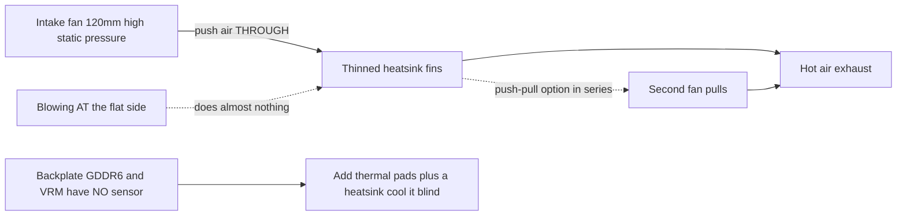

> 🌐 Қауымдастық аудармасы. Ағылшын нұсқасы — шындық көзі әрі жаңарақ болуы мүмкін. Қате таптыңыз ба? Issue ашыңыз: [English](../en/04-cooling.md) · [issues](https://github.com/lildebil0/awesome-bc250/issues)

# Салқындату

> **TL;DR** — BC-250-дің зауыттық радиаторы үстел үшін емес, сервер тартпасының мәжбүрлі ауа туннелі үшін жасалған. Қораптан шыққан күйінде ол троттлингке ұшырайды. Қауымдастық шешімі: **тығыз зауыттық қабырғаларды жұқарту** (егеп/тегістеп) және оларды **арқылы** үрлейтін **жоғары статикалық қысымды 120 мм желдеткішті** бұрап бекіту (**Arctic P12 Max/Pro** — эталон; Noctua NF-P12 redux — тыныш премиум балама). Осының өзі модификацияланған тақтаны **Furmark-та ~73 °C, ойындарда 63–65 °C** деңгейіне жеткізеді. Сұйықтық AIO мен толық кастом корпустар — келесі деңгейлер.

Салқындату — **жаңадан келгендер ең көп қателесетін №1 нәрсе**, сондықтан оверклоктың соңынан түспес бұрын осыны істеңіз.

---

## Зауыттық салқындатқыш неге жеткіліксіз

BC-250 — майнинг/сервер тақтасы. Оның радиаторы **пассивті** және ауаны алдынан артына қарай мәжбүрлеп өткізетін қатты дауыстайтын желдеткіштері бар шассиде тұруға арналған. Ауа ағыны жоқ үстелде ол жылуға қанығып, GPU троттлингке ұшырайды. Желдеткішпен тегіс жағына **қарай** үрлеу дерлік ештеңе бермейді — ауа **қабырға арналары арқылы**, сондай-ақ бэкплейт үстінен өтуі керек (артындағы GDDR6-да **температура датчигі жоқ**, сондықтан оны соқыр салқындатасыз).

Қауымдастық байқаған шектер: троттлинг шамамен **85 °C** айналасында басталады, қатты құлау/қайта жүктелу шамамен **90 °C** айналасында. Жүктеме температурасын ~80 °C-тан төмен, қор қалдыра отырып ұстаңыз.

> **Радиатордың үш нұсқасы бар** (8 қатарлы және 9 қатарлы қабырғалар). Жылдам идентификация: **PCIe 8-pin қосқышының жанындағы QR код** 9 қатарлы нұсқаны белгілейді. **Аз санды, қалыңдау қабырғалары бар** нұсқа зауыттық күйінде сәл жақсырақ салқындатуы мүмкін. ([elektricM Cooling](https://elektricm.github.io/amd-bc250-docs/hardware/cooling/))

**Әрбір компонент бойынша температура мақсаттары** (elektricM-нің тексерілген сандары, жоғарыдағы троттлинг/құлау шектерінен ұсақ егжей-тегжейлі):

| Компонент | Бос жүріс | Жеңіл жүктеме | Ойын | Макс |
|-----------|------|-----------|--------|-----|
| GPU/APU шеті | 40–50 °C | 50–60 °C | 65–80 °C | 90 °C |
| CPU (Tctl) | 45–55 °C | 55–65 °C | 70–85 °C | 95 °C |
| Жады (астыңғы жағы) | 40–55 °C | 50–65 °C | 55–70 °C | 80 °C |
| NVMe/SSD | 40–55 °C | 50–65 °C | 60–75 °C | 80 °C (қауіпті 81.8 °C) |

**Ойындарда GPU 70–80 °C** деңгейін көздеңіз. NVMe шегі мұнда маңызды, өйткені **GDDR6 мен M.2 SSD тақтаның ыстық арт жағын бөліседі** — SSD ең нашар жылулық нүктеде орналасқан және қызып кетуі мүмкін, сондықтан оны бақылаңыз (драйв спецификациясы бойынша `80 °C` макс, `81.8 °C` қауіпті). ([elektricM: sensors](https://elektricm.github.io/amd-bc250-docs/system/sensors/))

> **CPU Tctl сатылары.** elektricM **90 °C Tctl** мәнін ұсынылатын кері шегіну нүктесі ретінде белгілейді; кестедегі **95 °C** — қарқынды ойын кезінде әлі де көретін жоғарғы шек; **TJmax = 100 °C** — кремнийдің абсолютті шегі (төмендегі пакеттік қуат кестесі тұрақты стресс-жүгірісте CPU-ды дәл осы деңгейде бекітеді). Сонымен: **90 °C = «дәл қазір кері шегін», 95 °C = «қызыл аймаққа», 100 °C = «қабырғаға тірелдің».** ([elektricM: sensors](https://elektricm.github.io/amd-bc250-docs/system/sensors/))

> **Жылулық күй бойынша пакеттік қуат** (elektricM әр күйді тақтаның қуат тұтынуымен жұптайды): Бос жүріс **50–70 W**, Жеңіл **100–150 W**, Ауыр **150–200 W**, Стресс **200–235 W**. БҚ-ны өлшемдеу үшін және тақтаның розеткадан қаншалықты қатты жұмыс істейтінін оқу үшін пайдалы. ([elektricM: sensors](https://elektricm.github.io/amd-bc250-docs/system/sensors/))

> **Ойын кезіндегі пиксель артефактары = VRAM қызып кетуі.** Арт жақтағы GDDR6-да датчик болмағандықтан, ол визуалды ақаулық — сіздің ескерту белгіңіз — бэкплейт ауа ағынын/прокладкаларын қосыңыз (төменде). ([elektricM Cooling](https://elektricm.github.io/amd-bc250-docs/hardware/cooling/))

> **Кремний лотереясы — әр чипке жылулық қор бюджеттеңіз.** Физикалық тұрғыдан бірдей екі тақта, бірдей шасси мен OC конфигурациясы **5–10 °C айырмашылықпен** жұмыс істей алады, әрі ыстығырағы қайта термопаста/прокладка жасаудан кейін де ыстығырақ болып қалды. Біреудің температурасы сізбен сәйкес келеді деп ойламаңыз. ([r/BC250Gaming](https://www.reddit.com/r/BC250Gaming/))



---

## Тұрақты есептеу — басқа режим (тек ойын секірістері емес)

Жоғарыдағы мақсаттар жүктеме секірістермен келетін **ойынды** болжайды. **Тұрақты** есептеу — циклмен қайталанатын `llama-bench`, ұзақ Stable-Diffusion жүгірістері, GPU-ды ондаған минут бойы бекітетін кез келген нәрсе, **әсіресе [40 CU ашуымен](09-overclock-undervolt.md)** — әлдеқайда қатал жүктеме әрі ойын деңгейіндегі салқындатқыш ұстай алатын шектен асып кетуі мүмкін.

elektricM зауыттық радиатор + **push–pull (тізбектей) режиміндегі қос Arctic P12 Max** конфигурациясын **40 CU / 2 GHz** деңгейінде 10 минуттық тұрақты `llama-bench` жүгірісінде өлшеді:

| Метрика | Орташа | Шың |
|--------|---------|------|
| GPU шеті | 89.6 °C | 107 °C |
| Пакеттік қуат | 136 W | 223 W |
| CPU | 96.7 °C | 100 °C (TJmax) |
| VRM MOSFET-тер | 57 °C | 58.5 °C |
| Желдеткіш жылдамдығы | ~2950 RPM | 2977 RPM (төбе) |

Пакет троттлингке ұшыраған сайын өткізу қабілеті жүгіріс барысында **~10 %** төмендеді. Қорытынды: **зауыттық радиатор + қос P12 Max тұрақты 40 CU @ 2 GHz үшін жеткілікті қор емес** — әрі **VRM-дер өз шегіне жуықтап та қалмағанын** ескеріңіз (57 °C), сондықтан тар жер — желдеткіштер немесе қуат сатысы емес, *радиатордың жылуды шығаруы*. Екі шешім: **GPU губернаторын 1500 MHz-те шектеу** (40 CU әлі де есептеуді ~1.5× масштабтайды, температура ~83 °C ұсталады — қос P12 Max-та шексіз тұрақты), немесе **радиаторды жаңарту** (қабырға ауданы көбірек). **24 CU зауыттық ойын** үшін қос P12 Max ыңғайлы; қабырға тек тұрақты толық CU есептеуінде ғана пайда болады. ([elektricM Cooling](https://elektricm.github.io/amd-bc250-docs/hardware/cooling/))

---

## A жолы — Ауалық модификация (ең танымал, ең арзан)

Бұл — чаттың көпшілігі қолданатын тәсіл.

### 1. Зауыттық қабырғаларды жұқарту/тазалау
Зауыттық қабырғалар тым тығыз әрі жиі біркелкі емес. Адамдар ауа өте алатындай арналарды ашады:

- **Орбиталды (эксцентрлі) тегістеуіш** — ең жылдам, бірнеше минутта орындалады, ең жақсы нәтиже. ([src](https://t.me/c/2424231195/31571))
- **Қолмен аждаһа қағазы** — 60 грит, содан соң 240 грит, ~3–4 сағат + 2 сағат екі күн ішінде. Жұмыс істейді, бірақ баяу. ([src](https://t.me/c/2424231195/50330))
- **Қайшы / шиқылдақ** — дөрекі «чекрыжить» әдісі, ең соңғы амал; нәтижелер ең нашар. ([src](https://t.me/c/2424231195/41252))
- **Қайшы + сызғыш бағыттаушы (таза нұсқа)** — қол өнері/шаштараз қайшысын қабырға саңылауына сырғытыңыз, **жүзге қарсы бұрышпен қойылған сызғышты бағыттаушы ретінде** пайдаланыңыз; қалта пышағының «консерві ашқыш» тәсілі де бірдей жұмыс істейді. Ескерту: кейбір тақта нұсқаларында **жүзді бастайтын саңылау жоқ** — оны бұрауыш/пинцетпен ашыңыз немесе **шағын Dremel кесу дөңгелегімен** кіру ұясын кесіңіз. Қабырға ұяларынан кеңірек жүздер радиаторды зақымдауы мүмкін. ([r/BC250Gaming](https://www.reddit.com/r/BC250Gaming/))
- Бүгілген қабырғаларды **тегіс пинцет + тістеуікпен** түзетіңіз. ([src](https://t.me/c/2424231195/30670))
- **Қабырғаларды қолмен суырып алу** — elektricM жұмсақ алюминий қабырғаларды (радиатор тақтадан алынған кезде) **қолмен таза жұлып/суырып алуға** болатынын, кесу құралдары жасайтын металл жоңқасынан құтылатынын ескертеді. Баяуырақ, бірақ қалдықсыз. ([elektricM Cooling](https://elektricm.github.io/amd-bc250-docs/hardware/cooling/))
- **«Scooper by Justin»** — **BC-250 радиатор қабырғаларын басу/ашу үшін арнайы жасалған 3D-басып шығарылатын құрал** ([Printables 1282906](https://www.printables.com/model/1282906-bc-250-scooper)). Жалаң бұрауыштан қауіпсізірек: ол тым қатты итеріп, қабырғалар арасындағы радиатор **негізін** тырнап жіберуден сақтайды. ([r/linux_gaming қауымдастық тармағы](https://www.reddit.com/r/linux_gaming/comments/1nvsgji/)) Күтілімді реттеңіз: бір иесі басып шығарылған **«тарақ/scooper» құралы 2-ші қолданыста сынды** әрі қолды талдырды деп хабарлады. ([r/BC250Gaming](https://www.reddit.com/r/BC250Gaming/))
- **Хобби тістеуігі — «аршу» әдісі** — қабырғалардың **үстін** шағын хобби тістеуігімен қармап, оларды аршыңыз, **металдың өз жадын сыну нүктесі ретінде** пайдаланып, олар негізді жыртудың орнына бүгілу жерінде таза сынады. Кесуге қарағанда қалдығы аз балама. ([r/linux_gaming қауымдастық тармағы](https://www.reddit.com/r/linux_gaming/comments/1nvsgji/))

Шамамен температура пайдасы (elektricM): **бүгілген қабырғаларды түзету ~5–10 °C**, **орталық қабырғаларды алып тастау ~10–15 °C** (қайтымсыз — жақсы желдеткіш қаптамасы кесусіз де ұқсас пайда береді), **жаңа термопаста ~5–10 °C**, егер ескі паста кеуіп қалса. ([elektricM Cooling](https://elektricm.github.io/amd-bc250-docs/hardware/cooling/))

> ⚠ **Тегістеу/егеу алдында алдымен радиаторды тақтадан алыңыз** (немесе тақта мен кристалды толық маскалаңыз/қорғаңыз), әрі **жинамас бұрын әр металл шаңын тазалаңыз**. Тақтаға қонған өткізгіш металл жоңқасы оны қысқа тұйықтап, **тақтаны өлтіруі мүмкін** — бұл чатта бұрыннан болған оқиға.

<p align="center">
  <br>
  <sub>Фото: AMD BC-250 қауымдастығы · <a href="https://t.me/c/2424231195/31571">дереккөз</a></sub>
</p>

### 2. Нағыз желдеткішті бұрап бекіту
Ауаны қабырғалар арқылы итеретін **120 мм жоғары статикалық қысымды желдеткішті** орнатыңыз. Эталондық таңдау — **Arctic P12 Max (немесе P12 Pro)** — ең жоғары статикалық қысым (~6.9 mm H₂O), осы тығыз радиатор үшін қауымдастық + elektricM таңдауы. **Noctua NF-P12 redux** — тыныш премиум балама әрі **Furmark-та макс 73 °C, ойындарда 63–65 °C** эталондық нәтижесін көрсетті ([src](https://t.me/c/2424231195/42843)).

**Спецификациялары бар нақты желдеткіш таңдаулары** (elektricM — ауа ағынынан емес, *статикалық қысым* бойынша таңдаңыз):

| Желдеткіш | Өлшемі | Макс RPM | Статикалық қысым | Ауа ағыны | Шу | Ойын температуралары |
|-----|------|---------|----------------|---------|-------|--------------|
| **Arctic P12 Max** | 120 mm | 3300 | **6.9 mm H₂O** | 73.3 CFM | 52.5 dB(A) | 65–75 °C |
| **Arctic P12 Pro** | 120 mm | 2100 | **6.9 mm H₂O** | 68.9 CFM | 37.8 dB(A) | 65–75 °C |
| Arctic P14 PWM | 140 mm | 1700 | 2.40 mm H₂O | 72.8 CFM | 38 dB(A) | 70–80 °C |
| Noctua NF-A12x25 | 120 mm | 2000 | 2.34 mm H₂O | 60.1 CFM | 22.6 dB(A) | 70–85 °C |

elektricM-нің **ең көп ұсынылатын таңдауы — Arctic P12 Max / P12 Pro** — оның ~6.9 mm H₂O статикалық қысымы Noctua-ның 2.34 mm-інен әлдеқайда асады әрі әлдеқайда арзан; P12 Pro — тынышырақ, кеңірек қоймада болатын нұсқа. Премиум Noctua одан да тынышырақ, бірақ температура бойынша Arctic-ке тек жоғары RPM-де ғана тең келеді. ([elektricM Cooling](https://elektricm.github.io/amd-bc250-docs/hardware/cooling/))

**Қауымдастық құрылымдарынан басқа аталған желдеткіштер** (Arctic/Noctua-P12 эталонынан тыс адамдар орнатқан нақты модельдер):

- **Noctua NF-A12x25 G2** (PWM) — **120 мм кристалл салқындатқышы** ретінде — A12x25-тің жаңарақ G2 нұсқасы, негізгі желдеткіш ретінде қолданылды ([TiredDadTech](https://youtu.be/zi7sldeRd2w)). (Жоғарыдағы желдеткіш кестесінде тек *түпнұсқа* NF-A12x25 ғана көрсетілген.)
- **Noctua NF-A6x15 PWM** (≈3500 rpm) — **60 мм БҚ желдеткішін ауыстыру** ретінде — шиқылдаған сервер-кірпіш желдеткішінің тыныш алмастырғышы ([TiredDadTech](https://youtu.be/zi7sldeRd2w)).
- **Thermalright 120 мм 1550 rpm ARGB** — бюджеттік кристалл желдеткіші, әрі бэкплейт үшін **6.0 W/mK термопрокладкалар** — екеуі де **TMG HD build BOM**-нан ([build overview](https://youtu.be/OEO0r01zcfU)).

> **Эталон vs тыныш балама.** **Arctic P12 Max/Pro** — мұндағы эталондық желдеткіш — ең жоғары статикалық қысым (~6.9 mm H₂O), ең арзан, осы тығыз радиатор үшін қауымдастық + elektricM таңдауы. **Noctua NF-P12 redux** — тыныш премиум балама (чаттың 73 °C Furmark нәтижесі), температура бойынша Arctic-ке тек жоғары RPM-де ғана тең. Ең жақсы баға/өнімділік үшін Arctic-ті, тыныштық ең маңызды болса Noctua-ны таңдаңыз.

Желдеткіш ауаны айналасынан жіберудің орнына радиаторға қарай тығыздалуы үшін **басып шығарылған желдеткіш қаптамасын/адаптерін** пайдаланыңыз. Қауымдастық STL-дері:
- `Fan_Shroud_Single_120mm.stl`, `Fan_Shroud_Dual_120mm.stl`, `Fan_Shroud_Single_140mm.stl`, `Twin_120mm_Fan_Shroud.stl`
- `BC250_FanAdapter_120mm.step`, `bc250 cooler mount.stl`, `cooler adapter v3.0.stl`

> **Неге ауа ағыны рейтингі емес, статикалық қысым?** Тығыз қабырғалар — жоғары кедергілі жүктеме. Жоғары ауа ағынды «корпус желдеткіші» оларға тіреліп тоқтайды; жоғары статикалық қысымды желдеткіш (≥3 mm H₂O; Noctua P12, Arctic P12) ауаны шынымен **арқылы** итереді. Өте тығыз қабырғалар үшін **push–pull (тізбектей)** режиміндегі екі желдеткіш статикалық қысымды екі есе арттырады — мұнда дұрыс қадам осы, екі желдеткішті қатар қою емес.

**Орнату:** басып шығарылған қаптама ең жақсысы, бірақ желдеткішті радиаторға **пластик байламмен (зип-стяжка) байлау** да жұмыс істейді, ал желдеткіш пен қабырғалар арасына таспамен жабыстырылған **картон/көбік-тақта канал** — жарамды тегін балама (ұсқынсыз, берік емес, бірақ ауа жолын тығыздайды). ([elektricM Cooling](https://elektricm.github.io/amd-bc250-docs/hardware/cooling/))

> ⚠ **Желдеткіштерді тікелей қабырғаларға бұрғыламаңыз/бұрамаңыз.** Алюминий жұмсақ әрі қабырғалар жұқа — оларға бұрап бекіту қабырға қатарын зақымдап, салқындатуды нашарлатады. Зип-стяжка немесе басып шығарылған қаптама қолданыңыз. ([elektricM Cooling](https://elektricm.github.io/amd-bc250-docs/hardware/cooling/))

> ### 🛠 Ауа ағыны инженериясы — шынымен нәтиже беретін нәрсе
>
> Қай желдеткіш екеніне ғана емес, ауа *қалай* қозғалатынына қатысты қауымдастық тұжырымдары:
>
> - **Статикалық қысым таза CFM-ден басым** тығыз қабырға қатары арқылы — сондықтан жоғары статикалық қысымды **Arctic P12 Max (6.9 mm H₂O)** осы радиаторда тынышырақ жоғары ауа ағынды/төмен қысымды желдеткіштерден асып түседі.
> - **Бір орталықтандырылған желдеткіш екі қатар қойылғаннан асып түсуі мүмкін** толық кесілген қабырға жазықтығында: жалғыз орталық желдеткіш **4 орталық жылу түтігін** тікелей жүктейді, ал екі желдеткіш орталық үстінде пластиктің өлі «жігін» қалдырады. Қабырғаларды толық жазықтықпен бірінші кескен құрылымшы бір орталық желдеткіште екеуіне қарағанда бірнеше °C **төменірек** өлшеді ([src](https://t.me/c/2424231195/46175)). Бөлшектеп талдау ауа ағыны жағынан да дәл осы қорытындыға келеді: **қатар бұрап бекітілген екі желдеткіш біреуінен жақсы емес**, өйткені екі кірме түйіскен жерде, **ыстық кристалл орталығының дәл үстінде өлі аймақ түзіледі** — **олардың арасында саңылау қалдырыңыз немесе оның орнына push-pull жасаңыз** ([Old Lamer — Part VII](https://youtu.be/pxahl9-YgkY) ~19:55). *(Субтитрден алынған — дәл емес, сапалық деп қараңыз.)*
> - **120 мм желдеткіш жылдамдығының еденi ≈1800 RPM** — осы тығыз қатар арқылы ауаны шынымен қозғалту үшін; **Arctic P12 Pro** ($8–10, **600–3000 rpm** диапазоны) — бос жүрісте тыныш әрі әлі де қоры бар оңай таңдау ([Old Lamer — Part VII](https://youtu.be/pxahl9-YgkY)). *(ASR сандары — шамамен.)*
> - **Сору желдеткішін қосу = −3-тен −5 °C-қа дейін.** Тек кіріс **73 °C** → сорумен **67–68 °C** ([src](https://t.me/c/2424231195/68183), [src](https://t.me/c/2424231195/31553)). Сонымен оңтайлы қарапайым жинақ — **1 орталық кіріс + 1 артқы сору**, қатар екі кіріс емес.
> - **Бэкплейт соқыр әрі ыстық.** VRM MOSFET-тер салқындатылмаған күйде **~100 °C-қа** жетеді ([src](https://t.me/c/2424231195/110955)) — оған **міндетті түрде** прокладкалар + радиаторлар + арнайы ауа ағыны керек; артқы радиаторлармен ол *«жүктемеде салқын»* жұмыс істейді ([src](https://t.me/c/2424231195/93056)).
> - **Тегін физика.** Жылы ауа жоғары көтеріледі, сондықтан тіпті **қисайту/мұржа** бағдары да көмектеседі — әрең желдетілген бэкплейт тек конвекциядан-ақ **47 °C** өлшеді ([src](https://t.me/c/2424231195/76962)). Әрі **қара анодталған радиатор жылтыратылғаннан ~1.8× көбірек** жылу шығарады, бұл пассивті/жартылай пассивті ықшам құрылымдарда қабырға ауданын **~45 %** кішірейтуге мүмкіндік береді ([src](https://t.me/c/2424231195/86878)).
> - **Кірісті сорудан көбірек жүргізіңіз** (шамалы **оң қысым**), сондықтан датчиксіз VRM/VRAM таза ауаға шомылып тұрады.

### Балама: зауыттық қабырғаларды сақтау (кесусіз push-pull корпус)
Қабырғаларды кесу міндетті емес. **penzoiders** радиаторды **кеспейтін** корпус жасады ([MakerWorld, FreeCAD дереккөзі](https://makerworld.com/models/2505974)): ол ауаны **зауыттық, модификацияланбаған қабырғалар** арқылы итеру үшін **push-pull жоғары статикалық қысымды желдеткіштерді** пайдаланады, әрі бэкплейтті де салқындататын **екі камералы қысым айырмасын** қосады (5 мм радиаторлар + термопрокладкалар; қайта пайдаланылған NVMe радиаторлары жұмыс істейді). Салқын ұсталатын баптау: **CPU 3800 MHz / 1050 mV, GPU 2100 MHz / 950 mV** → қатарлас Furmark + `stress-ng` **85 °C-тан төмен** ұсталады; ойын **шамамен 50 % желдеткіш жүктемесінде ~75 °C** (CoolerControl қисығы), «әрең естіледі». ([r/BC250Gaming](https://www.reddit.com/r/BC250Gaming/))

## B жолы — AIO сұйықтық салқындатқыш

Адаптер кронштейні арқылы кристалға орнатылған 120 мм AIO. Тыныш әрі салқын, бірақ бөлшектер мен құны көбірек. Танымал құрылымдар арзан AIO-ларды пайдаланады (мысалы, aigo). ([мысал src](https://t.me/c/2424231195/19336))

<p align="center">
  <br>
  <sub>Фото: AMD BC-250 қауымдастығы · <a href="https://t.me/c/2424231195/19336">дереккөз</a></sub>
</p>

**Аталған, жүктеп алуға болатын AIO кронштейні — NexGen3D** ([Printables 1554003](https://www.printables.com/model/1554003), ABS-GF немесе PETG-да басып шығарыңыз). **Thermalright 240 мм AIO** арқылы тексерілген: GPU **~50 °C @ 2000 MHz**, CPU **макс 60 °C**. ([r/BC250Gaming](https://www.reddit.com/r/BC250Gaming/))

### Сұйықтықпен салқындатылған оверклок профильдері
AIO-мен әлдеқайда қатты итеруге болады. **NexGen3D** розеткадан өлшенген (Furmark Vulkan + `stress-ng --matrix 0 -t 60m` күйдіру комбинациясы ретінде):

| Профиль | CPU | GPU | Макс күйдіру температурасы | Розетка қуаты | Ескертпе |
|---------|-----|-----|---------------|------------|------|
| 1 | 4000 MHz | 2400 MHz | ~65 °C | >350 W | «өлі тыныштық» |
| 2 | 4100 MHz | 2450 MHz | ~75 °C | <400 W | ыстығырақ, дауыстырақ |

Қалыпты 1080p ойын осы күйдіру температураларынан **10–15 °C төмен** әрі 1-профильде **250 W-тан төмен** жұмыс істейді. **Көшіруге тұрарлық ауа ағыны схемасы:** 120 мм желдеткіштер **радиатор арқылы сыртқа сорады**, бұл **VRM-дер / БҚ / VRAM бэкплейті** үстінен таза сыртқы ауаны тартады; жеке **80 мм желдеткіш (Arctic P8 Max)** GPU VRM-дерін салқындатады — бұл жоғарыдағы «датчиксіз VRM/VRAM-ға әлі де ауа ағыны керек» ескертуіне жауап береді. ([r/BC250Gaming](https://www.reddit.com/r/BC250Gaming/))

## Кастом су контуры (озық деңгей)

Жабық AIO-дан тыс, бірнеше адам **толық кастом контур** жүргізеді. Бұл — нағыз, бірақ **DIY/сарапшы** сахна: құрылымшылар кристалл **мен** VRM-ді бір блокта қамтитын **кастом су блогын CNC-фрезерлейді немесе дәнекерлейді** ([src](https://t.me/c/2424231195/131065), [src](https://t.me/c/2424231195/131844), [src](https://t.me/c/2424231195/118582)). Фитингтер маңызды емес — *«кез келгенін дерлік сатып алуға, жонуға немесе желімдеуге болады»* ([src](https://t.me/c/2424231195/132007)).

**Ол не береді:** дөрекі кастом контур **желдеткіштер тек 30 %-да, сыртқы помпа дерлік үнсіз болғанда жүктемеде ~50 °C-қа** жетеді ([src](https://t.me/c/2424231195/133040)). (Бір құрылымшы содан соң әдепкі cyan-skillfish губернатор конфигурациясында жүктемеде VRM дроссельдерінен катушкалық шиқыл байқады — бұл *бөлек* мәселе, жылулық емес.) Сондай-ақ сізге **Corsair Commander қажет емес**: BC-250-дің өзінің [желдеткіш басқаруы](#желдеткіш-жылдамдығын-басқару-бду) помпаны әрі **~5 желдеткішті** басқара алады ([src](https://t.me/c/2424231195/140123)).

> ⚠ **Бұл неге «озық деңгей»: BC-250 салқындатқыш тасқынынан аман қалмайды.** Қауымдастықтан нақты ақаулар: шланг **90°-та майысып, жарылып, GPU мен БҚ-ны су басты** ([src](https://t.me/c/2424231195/81158)); **тұрып қалған Corsair AIO помпасы CPU-ды қыздырып жіберді** ([src](https://t.me/c/2424231195/133147), [src](https://t.me/c/2424231195/126053)). Сондай-ақ **~50 % помпа жылдамдығынан жоғары помпа кавитациясын/шуын** бақылаңыз ([src](https://t.me/c/2424231195/7034)). **Алғашқы дымқыл қосудан бұрын бүкіл контурды тақтадан тыс 24 сағат бойы ағуға тексеріңіз.**

**Үкім:** кез келген нұсқадан ең төмен температура әрі ең тынышы, әрі ол тұрақты 40-CU-ды мүмкін етеді — бірақ ең жоғары тәуекел мен күш. **Бірінші құрылым емес.**

## C жолы — Үрлегіш («улитка») — ұсынылмайды

Қайта пайдаланылған GPU үрлегіш желдеткіштер ерте эксперимент болды. Нәтижесіне қарай дауыстырақ; адамдар A жолына көшті. ([src](https://t.me/c/2424231195/100086))

## D жолы — Мұнаралы салқындатқышқа айналдыру (озық деңгей)

Кейбір пайдаланушылар тауардан тыс жабдықпен тамаша, тыныш салқындату үшін кристалға **AM4 мұнаралы салқындатқышты** (мысалы, **Thermalright Peerless Assassin** немесе басқа AM4/AM5 мұнаралары) бұрап бекітеді. Кемшілігі: оны **кронштейн арқылы орнатуыңыз керек**, әрі биік мұнара **M.2 ұясын немесе басқа компоненттерді бөгеуі мүмкін**. Жаңадан бастаушыға арналған модификация емес. Енді оны нөлден жасаудың қажеті жоқ — екі жарияланған 3D-басып шығарылған кронштейн бар:

- **AM4/AM5 үстелдік-салқындатқыш адаптері** ([MakerWorld 2596083](https://makerworld.com/en/models/2596083), FreeCAD дереккөзі қоса берілген). Стандартты үстелдік AM4/AM5 салқындатқышын BC-250-ге орнатады. Бекіту: **M5 болттар + гайкалар, тіреусіз** (OP M4 идеал болар еді, бірақ M5 тығыз сәйкес келді деп ескертеді). **ABS, PETG немесе ASA-да** басып шығарыңыз. **CPU 3.95 GHz / 1.150 V, GPU 2200 MHz / 1000 mV, температура 80 °C-тан аспайды** деңгейінде тексерілген. Қолданылған салқындатқыштар: төмен профильді **AXP90-класы** (бір пікір қалдырушы **AXP120** қолданды), тіпті **AMD Wraith Spire** де зауыттық радиатордан асып түсті. ([r/BC250Gaming](https://www.reddit.com/r/BC250Gaming/))
- **Thermalright AXP90-X53 бекітпесі** ([Printables 1694793](https://www.printables.com/model/1694793)). Бұранда кірістірмелері басып шығарылған кронштейннің **астыңғы жағына дәнекерленген**, сондықтан сіз **түпнұсқа серіппелі зауыттық-радиатор бұрандаларын қайта пайдаланасыз**; домалақ басты болттар төменнен көтеріліп, секіртпеленген, әрі кронштейнде тақта компоненттерін айналып өту үшін **тіреу астында 0.5 мм саңылау** бар. Fusion 360-та жобаланған, **PETG-да басып шығарыңыз** (PLA осы температураларда жұмсарады). Нәтиже: **2150 MHz @ 1080p толық жүктемеде 65–67 °C**, өте тыныш (мыс салқындатқыш, 120 мм Arctic P12 Pro-мен жұптасқан). Өлшенген стек биіктігі **PCB-дан 15 мм желдеткіштің үстіне дейін 54 мм** — корпусқа сәйкестік үшін пайдалы. Сондай-ақ **3 қалыңдықты нұсқа жинағы** мен **AXP120-X67** нұсқасы да бар. ([r/BC250Gaming](https://www.reddit.com/r/BC250Gaming/))

---

## Желдеткіш жылдамдығын басқару (БДЕ)

Желдеткіш бұрап бекітілгеннен кейін, сіз оның PWM-ін тақтаның **Nuvoton NCT6686D** Super I/O чипі арқылы басқарасыз — бірақ **қай драйверді жүктейтініңіз маңызды** ([elektricM hardware spec](https://elektricm.github.io/amd-bc250-docs/)):

- **Тек оқуға арналған датчиктер** (желдеткіш RPM, температуралар): `force=true` арқылы жүктелетін ядро ішіндегі **`nct6683`** модулі. Ол көрсеткіштерді хабарлайды, бірақ **PWM-ге жаза алмайды**, сондықтан желдеткіш BIOS/микробағдарлама орнатқан мәнде қалады.
- **Оқу + PWM жазу** (желдеткіш жылдамдығын шынымен орнату): **[Fred78290/nct6687d](https://github.com/Fred78290/nct6687d)**-дан, сондай-ақ `force=true` арқылы, ағаштан тыс **`nct6687`** модулін пайдаланыңыз. Тек бақылау емес, желдеткіш қисығын / қолмен жылдамдық басқаруын қаласаңыз, осыны құрастыру керек.

```bash
# monitoring only (in-kernel):
echo 'options nct6683 force=true' | sudo tee /etc/modprobe.d/nct6683.conf
# PWM control (DKMS from Fred78290/nct6687d):
echo 'options nct6687 force=true' | sudo tee /etc/modprobe.d/nct6687.conf
```

> Екеуін де жүктемеңіз — тек оқуға арналған датчиктер үшін `nct6683`-ті немесе оқу+жазу үшін `nct6687`-ні таңдаңыз. Датчик сымдары (`CPU_FAN1` / `J4003`) мен BIOS↔Linux желдеткіш нөмірлеуі [06-linux.md](06-linux.md) файлының тексеру қадамында берілген.

**Қай хедер — негізгі желдеткіш?** elektricM салқындату желдеткіші әдетте **Pump Fan** хедерінде = sysfs-те **`fan2` / `pwm2`** екенін хабарлайды; `CPU Fan` (`fan1`) мен `System Fan` хедерлері (`fan3`+) әдетте қолданылмайды. PWM жазудан бұрын қолмен режимді қосыңыз (`echo 1 > .../pwm2_enable`, содан соң `.../pwm2`-ге 0–255 мәні). hwmon нөмірлеуі қайта жүктеулер арасында ауысуы мүмкін — `cat /sys/class/hwmon/hwmon*/name` арқылы растаңыз. ([elektricM Cooling](https://elektricm.github.io/amd-bc250-docs/hardware/cooling/))

**GUI-мен желдеткіш қисығы — CoolerControl.** `nct6687` жүктелгеннен кейін **CoolerControl** графикалық желдеткіш қисығын береді: **nct6686** құрылғысын таңдаңыз, дереккөз ретінде **k10temp Tctl** пайдаланып **pwm2**-де қисық құрыңыз. Орнату: `ujust install-coolercontrol` (Bazzite), `codifryed/CoolerControl` copr (Fedora) немесе AUR-дан `coolercontrol` (Arch); веб-интерфейс `https://localhost:11987` мекенжайында. ([elektricM Cooling](https://elektricm.github.io/amd-bc250-docs/hardware/cooling/))

**BIOS желдеткіш режимдері** (ОЖ жағынан басқару жүргізбесеңіз): **Default** желдеткіштерді **40 % минимумда** ұстайды (тым төмен — ұсынылмайды), **Full Speed** оларды 100 %-да бекітеді (дауысты, бірақ қауіпсіз), **Customize** табалдырыққа сәйкес жылдамдықтарды орнатады. ([elektricM Cooling](https://elektricm.github.io/amd-bc250-docs/hardware/cooling/))

> ⚠ **BIOS Customize режимі мен CoolerControl-ды бір уақытта жүргізбеңіз** — олар PWM басқаруы үшін таласады. Біреуін таңдаңыз. ([elektricM Cooling](https://elektricm.github.io/amd-bc250-docs/hardware/cooling/))

---

## Жылулық интерфейс (паста, прокладкалар, фазалық ауысу, сұйық металл)

Қандай желдеткіш/радиатор жүргізсеңіз де, кристалл мен радиатор арасындағы — әрі тақтаның арт жағы мен кез келген бэкплейт радиаторы арасындағы — **жылулық интерфейс материалы (TIM)** дұрыс таңдауға тұрарлық. BC-250 кристалында **жоғары жылу тығыздығы** бар, сондықтан жақсы TIM — тегін бірнеше градус.

> **Зауыттық пастаны ауыстырудың өзі көмектеседі.** Бір иесі бір жылдан кейін зауыттық пастаны ауыстырды, әрі қалғанының бәрі өзгеріссіз қалғанда жүктеме температурасы **~4–5 °C** төмендеді. ([src](https://t.me/c/2424231195/88565))

### Жұмыс істейтін пасталар
- **Arctic MX-6** — кәдімгі жоғары деңгейлі паста. Бір корпустағы құрылымда ол **Furmark-та 87–88 °C** ұстады; дәл осы иесі PTM7950 одан тағы ~4 °C қырқатынын атап өтті. ([src](https://t.me/c/2424231195/30211))
- **Зауыттық паста + зауыттық прокладкалар** — құжатталған бастапқы деңгей: 10 мин жүктемеден кейін ~**76 °C**, бос жүрісте ~**55 °C** (қабырға/желдеткіш модификациясына дейін). ([src](https://t.me/c/2424231195/22992))
- elektricM мұнда жарамды деп санайтын басқа пасталар: **Arctic MX-4** (құндылық), **Thermal Grizzly Kryonaut** (премиум), **Noctua NT-H1** (сенімді), **Thermalright TFX** (бюджеттік). Қолданылған тақтаның пастасы **жиі кеуіп қалады** — қайта термопаста жасаудың өзі **~5–10 °C**-қа тұрарлық. Кристалға бұршақ көлемінде нүкте жағыңыз, біркелкі орнатыңыз, бұрандаларды **X үлгісінде** қатайтыңыз. ([elektricM Cooling](https://elektricm.github.io/amd-bc250-docs/hardware/cooling/))

### PTM7950 — қауымдастық сүйіктісі (ұсынылады)
**PTM7950** — **фазалық ауысу прокладкасы** (Honeywell графит/фазалық ауысу пленкасы). Бөлме температурасында ол жұқа қатты қабат; жүктемеде (~45–55 °C) ол жұмсарып, микрон-жұқа қабатқа ағады, содан соң орнында қалады. Ол майдай **сорылып шықпайды** немесе кеппейді, бұл дәл ыстық, жылулық циклмен жұмыс істейтін кристалл астында сізге қажет нәрсе — сондықтан оны бір рет жағып, ұмытасыз. Чаттың тікелей қорытындысы: *«PTM7950 және артық ойланбаңыз»* ([src](https://t.me/c/2424231195/101582)); фазалық ауысу — жалпы ұсыныс ([src](https://t.me/c/2424231195/61511)).

**Қалай жағу керек:**
1. Кристалл мен радиатор негізін тазалаңыз (изопропил спирті), кептіріңіз.
2. PTM7950 шаршысын кристалл өлшеміне кесіңіз — **~26×30 мм** бөлік BC-250 кристалын жабады ([src](https://t.me/c/2424231195/125748)).
3. Бір қорғаныш пленканы аршыңыз, прокладканы кристалға жатқызыңыз, екінші пленканы аршыңыз.
4. Радиаторды орнатып, біркелкі қысыңыз. **Жаймаңыз** — алғашқы жылу циклі жұмысты атқарады. Бірнеше жүктеме/бос жүріс циклінен кейін («burn-in») ең жақсы температураны күтіңіз.

PTM7950-дегі (Honeywell, 26×30) плюс бэкплейт радиаторы бар эталондық корпус CPU 3850 MHz / GPU 2100 MHz деңгейінде **бір сағат бойы ~84 °C, ойындарда 66–71 °C** шыңына жетеді. ([src](https://t.me/c/2424231195/125748))

> **Аталған жұп: радиатор астында Upsiren қамыры + кристалда PTM7950.** Бір құрылым видеосы саңылау толтыратын жерлер үшін **Upsiren UTP-6 / UTP-8 жылулық қамырын** (**UTP-8** маркасы ≈**14.8 W/mK** деп бағаланады) кристалдың өзіне жатқызылған **40×80×0.25 мм кесілген PTM7950 парағымен** жұптайды ([PTM7950 + Upsiren видеосы](https://youtu.be/FJapqZSdt6I)). Қамыр — радиаторға/тақтаға біркелкі емес саңылауларды толтыруға арналған; фазалық ауысу пленкасы кристалдың өзіне жатады.
>
> - **Арзан AliExpress PTM7950 жұмыс істейді.** ~**$13** AliExpress парағы жұмыс істейтіні тексерілген — атаулы Honeywell кесіндісі қажет емес ([PTM7950 + Upsiren видеосы](https://youtu.be/FJapqZSdt6I)).
> - **PTM7950-ге ену қажет.** Ол ең жақсы температурасына тек **бірнеше жылу/салқындау циклінен** кейін жетеді — оны алғашқы жүгіріс бойынша бағаламаңыз ([ноутбук TIM демосы](https://youtu.be/U4Zm8msXJHM)).
>
> *(Екі дереккөз де авто-субтитрлі — нақты W/mK мен өлшемдерді шамамен деп қараңыз.)*

### Бэкплейт & GDDR6 прокладкалары (артын соқыр салқындатыңыз)
Тақтаның арт жағындағы **GDDR6 мен VRM-да температура датчигі жоқ** — оларды соқыр салқындатасыз. Арт жақтағы жылуға барар жер болуы үшін **термопрокладкалармен** жұптасқан **бэкплейтке радиатор** қосыңыз. ([src](https://t.me/c/2424231195/125748)) Бір RU құрылымшысы жай ғана **Yandex.Market-тен радиатор** алып, оны бэкплейтке жабыстырды, әрі ол **астыңғы тақтаны жақсы салқындатты** — кез келген ақылға қонымды өлшемді алюминий радиатор мұнда жұмысты атқарады ([4pda — mananoid1](https://4pda.to/forum/index.php?showtopic=1104980)).

Хабарланған прокладка қалыңдықтары (қауымдастық бөліскен, «мұны сақтап қойдым» реакциясы):
- **VRM: 1 мм**
- **GDDR6: 2 мм** ([src](https://t.me/c/2424231195/121181))

> ⚠ **тексеріңіз** — бұл қалыңдықтар *сіздің* нақты бэкплейтіңізге/радиаторыңызға дейінгі саңылауға байланысты. Прокладкалар үйіндісін сатып алмас бұрын саңылау өлшемімен (немесе қамыр/балшық сынағымен) растаңыз.

elektricM жадының өзін салқындату үшін **сәл басқа прокладка схемасын** береді: тақтаның **алдыңғы жағында 1.5 мм прокладкалар, артында 2.0 мм**, содан соң астыңғы жағында алюминий тақта/радиатор. Тақта маңында **тек өткізгіш емес** прокладкалар қолданыңыз (компоненттерді қысқа тұйықтай алатын өткізгіш паста/прокладкаларды ешқашан қолданбаңыз). Ол тізген прокладка брендтері: **Thermalright Odyssey** (жоғары өнімділік), **Arctic Thermal Pad** (құндылық), **Gelid GP-Ultimate** (премиум). ([elektricM Cooling](https://elektricm.github.io/amd-bc250-docs/hardware/cooling/))

> ⚠ **тексеріңіз (прокладка қалыңдықтары дереккөздер арасында әртүрлі)** — біздің чаттан алынған сандар — **VRM 1 мм / GDDR6 2 мм (арт)**; elektricM жады чиптері үшін **1.5 мм алдыңғы / 2.0 мм артқы** деп көрсетеді. Әртүрлі құрылымдар, әртүрлі саңылаулар — екі санды да соқыр сенудің орнына **өз саңылауыңызды өлшеңіз**.

> **Ойынның 30–60 минутынан кейін құлаулар/тұрақсыздық** (жиі пиксель артефактарымен) — классикалық **жады қызып кету** белгісі. Шешімдер: прокладкалар + астыңғы тақта қосу, бэкплейт желдеткішін қосу, корпус ауа ағынын жақсарту немесе уақытша **VRAM бөлуін азайту** (мысалы, 4 GB → 512 MB) жады жылуын азайту үшін. ([elektricM Cooling](https://elektricm.github.io/amd-bc250-docs/hardware/cooling/))

### Сұйық металл — мұнда негізінен ұсынылМАЙДЫ
Сұйық металл (LM) сөз болады, өйткені PS5 (сол отбасының APU) оны қолданады ([src](https://t.me/c/2424231195/18105)), әрі таза өнімділікте ол пастаны/PTM-ді сәл басып озады ([src](https://t.me/c/2424231195/124112)). Адамдар BC-250-де ол туралы сұрады әрі сынап көрді ([src](https://t.me/c/2424231195/18098), [src](https://t.me/c/2424231195/77180)).

**Бірақ бұл тақтада бұл — дұрыс емес шешім:**
- LM **электрлік өткізгіш**. BC-250 кристалы **тығыз GDDR6 мен VRM** дәл жанында отыр; кристалдан қашып шыққан тамшы тақтаны қысқа тұйықтайды (жоғарыдағы металл жоңқасы ескертуіндегі сол «жады маңындағы өткізгіш нәрсе оны өлтіреді» тәуекелі).
- Ол **сорылып шығады / шамамен жыл сайын қайта жасауды қажет етеді**, әрі ол жалаң алюминийге шабуыл жасайды — тіпті PTM7950 жақтаушысы өз жабдығында дәл осы әуре-сарсаңнан LM-ден бас тартып, PTM7950 / KryoSheet-ке көшті. ([src](https://t.me/c/2424231195/69688))
- «Сұйық металмен жұмыс істеу жұмысын кез келген адам алмайды.» ([src](https://t.me/c/2424231195/106787))

**Қорытынды:** **PTM7950 — қауіпсізірек жоғары өнімді таңдау** — пайданың ~99 %-ы, қысқа тұйықталу/қызмет көрсету тәуекелінсіз. LM-ді не істеп жатқанын дәл білетіндерге қалдырыңыз.

---

## Салқындатуды қалай тексеру керек (қауымдастық әдісі, бекітілген)

Бекітілген процедурадан ([src](https://t.me/c/2424231195/108407)):

1. **GPU стресі:** Furmark (Vulkan / «Furmark VK»).
2. **Бір уақытта CPU:** CPU бенчін (cpu-x) немесе `stress`/`pipx`-негізделген жүктемені қосыңыз — APU бір радиаторды бөліседі, сондықтан екеуін бірге тексеріңіз.
   - Бұл құралдар (Furmark, OCCT, cpu-x, `stress`) жаңа Linux машинасында **алдын ала орнатылмаған** — оларды алдымен пакет менеджеріңіз немесе Flatpak арқылы орнатыңыз.
3. Зауыттық емес, **өз оверклогыңызда тексеріңіз** — 1500 MHz әлсіз; **2000 MHz — ~+30 % FPS** әрі сіз шынымен жүргізетін нәрсе, сондықтан соған салқындатыңыз.
4. Температураларды бақылаңыз; егер ~85 °C-тан асып кетсеңіз, троттлингке ұшырайсыз — желдеткіш/қаптама/қабырға жұмысын қосыңыз.

> ℹ️ **Екі түрлі «+30 %» мәлімдемесін шатастырмаңыз.** Мұндағы **GPU-такт +30 %** (1500 → 2000 MHz FPS-ті шамамен үштен бірге арттыру) — оверклоктан *өнімділік* пайдасы. Ол бөлек ноутбук-TIM көрсетілімінде ([ноутбук TIM демосы](https://youtu.be/U4Zm8msXJHM)) **қайта термопаста** үшін келтірілген **~+30 % жылулық жақсартумен** бірдей **емес** — ол басқа жабдықтағы *температура* нәтижесі. Бірдей сан, байланыссыз нәрселер.

Сондай-ақ тақырыпта бекітілген ең қарапайым әдістің қысқа видео нұсқаулығы бар. ([src](https://t.me/c/2424231195/100024))

---

## Ұсынылатын бастапқы жинақ

| Деңгей | Мынаны істеңіз | Күтіңіз |
|------|---------|--------|
| Минимум | Қабырғаларды тегістеу (орбиталды тегістеуіш) + 1× Arctic P12 Max/Pro (немесе Noctua NF-P12) + басып шығарылған қаптама | ~73 °C Furmark |
| Жақсырақ | Қаптама арқылы Push–pull (2× P12) | бірдей температурада төменірек, тынышырақ |
| Макс | Адаптерде 120 мм AIO | ең салқыны, көбірек құрылым күші |

---

## Дереккөздер

- Бекітілген тест әдісі — https://t.me/c/2424231195/108407 · видео — https://t.me/c/2424231195/100024
- Қабырға құралдары — https://t.me/c/2424231195/31571 · https://t.me/c/2424231195/30670 · https://t.me/c/2424231195/50330 · «Scooper by Justin» қабырға құралы ([Printables 1282906](https://www.printables.com/model/1282906-bc-250-scooper)) + хобби-тістеуік аршу әдісі — [r/linux_gaming тармағы](https://www.reddit.com/r/linux_gaming/comments/1nvsgji/)
- Noctua P12 нәтижесі — https://t.me/c/2424231195/42843
- AIO мысалы — https://t.me/c/2424231195/19336
- Жылулық интерфейс — қайта термопаста −4–5 °C https://t.me/c/2424231195/88565 · MX-6 https://t.me/c/2424231195/30211 · зауыттық бастапқы деңгей https://t.me/c/2424231195/22992 · PTM7950 https://t.me/c/2424231195/101582 · https://t.me/c/2424231195/61511 · PTM7950 құрылым + бэкплейт https://t.me/c/2424231195/125748 · прокладка қалыңдығы https://t.me/c/2424231195/121181 · сұйық металл https://t.me/c/2424231195/18098 · https://t.me/c/2424231195/69688
- elektricM салқындату нұсқаулығы (радиатор нұсқалары, әр компонент бойынша температура кестесі, тұрақты жүктеме деректері, желдеткіш спецификациялары, CoolerControl/BIOS желдеткіш режимдері, мұнаралы салқындатқыш, прокладка схемасы) — https://elektricm.github.io/amd-bc250-docs/hardware/cooling/
- [elektricM: sensors](https://elektricm.github.io/amd-bc250-docs/system/sensors/) (жылулық табалдырықтар: CPU Tctl 90 °C макс / TJmax 100 °C, NVMe/SSD 80 °C макс / 81.8 °C қауіпті, жылулық күй бойынша пакеттік қуат)
- r/BC250Gaming (қауымдастық есептері: кремний-лотерея ауытқуы, қайшы+сызғыш қабырға әдісі, тарақ-құрал сынуы, кесусіз push-pull корпус, AIO кронштейні + 240 мм нәтижесі, сұйықтық OC профильдері, AM4/AM5 + AXP90-X53 кронштейндері) — https://www.reddit.com/r/BC250Gaming/ · AM4/AM5 салқындатқыш адаптері [MakerWorld 2596083](https://makerworld.com/en/models/2596083) · AXP90-X53 бекітпесі [Printables 1694793](https://www.printables.com/model/1694793) · NexGen3D AIO кронштейні [Printables 1554003](https://www.printables.com/model/1554003) · кесусіз push-pull корпус [MakerWorld 2505974](https://makerworld.com/models/2505974)
- Жабдық анықтамасы — [mothenjoyer69/bc250-documentation `hardware.md`](https://github.com/mothenjoyer69/bc250-documentation/blob/main/hardware.md)
- Салқындатуы бар корпустар/адаптерлер — [onemorecap/bc-250-sleeve-adapter](https://github.com/onemorecap/bc-250-sleeve-adapter)
- Кристалл үстінде қатар екі желдеткіштің өлі аймағы / саңылау қалдыру немесе push-pull, 120 мм ≈1800 RPM едені, Arctic P12 Pro ($8–10, 600–3000 rpm) — [Old Lamer — Part VII](https://youtu.be/pxahl9-YgkY) (авто-субтитр / ASR — сандар шамамен)
- Upsiren UTP-6 / UTP-8 қамыры (UTP-8 ≈14.8 W/mK) + кристалда 40×80×0.25 мм кесілген PTM7950, арзан AliExpress PTM7950 (~$13) тексерілген — [PTM7950 + Upsiren видеосы](https://youtu.be/FJapqZSdt6I) · PTM7950-ге бірнеше жылу/салқындау ену циклі қажет + бөлек қайта термопаста «+30 %» (ноутбук, GPU-такт +30 % емес) — [ноутбук TIM демосы](https://youtu.be/U4Zm8msXJHM)
- RU бэкплейт радиаторы (Yandex.Market радиаторы астыңғы тақтаны салқындатты) — [4pda — mananoid1](https://4pda.to/forum/index.php?showtopic=1104980)

> Желдеткіш қаптамасы мен адаптер STL-дері [05-case.md](05-case.md) файлында каталогталған әрі `assets/stl/` астында айналастырылған.
