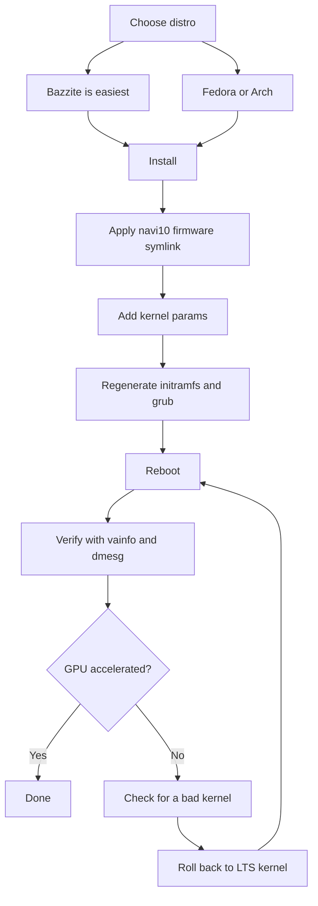

> 🌐 Қауымдастық аудармасы. Ағылшын нұсқасы — шындық көзі әрі жаңарақ болуы мүмкін. Қате таптыңыз ба? Issue ашыңыз: [English](../en/06-linux.md) · [issues](https://github.com/lildebil0/awesome-bc250/issues)

# Linux драйверлері және орнату

> **TL;DR** — Көпшілік BC-250-ді Linux-та жұмыс істетеді, әрі ол *GPU түзетілгеннен кейін* жақсы жұмыс істейді. Қораптан шыққанда `amdgpu` чипті танымайды да, сіз CPU-да рендерленген, бір таңбалы FPS аласыз. Оны нақты ететін екі нәрсе: **заманауи ядро + жаңа Mesa (25.1+)** және **`amdgpu` түзетуі** — драйвер жүктеле алуы үшін firmware симлинкі (`navi10_gpu_info.bin` → `cyan_skillfish_gpu_info.bin`) плюс ядро параметрлері (`amdgpu.sg_display=0`, `mitigations=off`, ал жаңа ядроларда `amdgpu.bc250_cc_write_mode=3`). Жаңадан келген үшін ең оңай жол: **[Bazzite](https://bazzite.gg/)** прошивкалап, арнайы **`bazzite-bc250`** имиджіне rebase жасау — түзетулер ішіне қосылған. Машинаны үйренгіңіз келе ме: **Fedora** немесе **CachyOS/EndeavourOS (Arch)** бір реттік орнату скриптімен.

Бұл — «қораптағы тақтаны» жұмыс істеп тұрған жұмыс үстеліне айналдыратын бөлім. Алдымен [салқындатуды](04-cooling.md) және [қуатты](03-power-supply.md) жасаңыз — содан кейін осыны.

> **Linux-ты бұрын қолданбадыңыз ба? 60 секундтық аман қалу жинағы.**
> - **Терминалды ашыңыз:** мәзіріңізден *Terminal* / *Konsole* (KDE) / *Console* деп аталатын қолданбаны іздеңіз, немесе `Ctrl-Alt-T` басыңыз.
> - **`sudo`** команда алдында оны әкімші ретінде орындайды. Ол сізден парольді сұрайды — әрі **сіз тергенде экранда ештеңе көрінбейді** (нүкте де, жұлдызша да жоқ). Бұл қалыпты; теріп, Enter басыңыз.
> - **`nano /etc/...`** терминалда қарапайым мәтін редакторын ашады. Сақтап шығу үшін: **Ctrl-O**, содан **Enter**, содан **Ctrl-X**.
> - Терминалға **көшіріп-қою** әдетте **Ctrl-Shift-V** (Ctrl-V емес).
> - Көп қадам тек **қайта жүктеуден** кейін күшіне енеді (`systemctl reboot`). Қадам «қайта жүкте» десе, ол жұмыс істеді ме деп бағалаудан бұрын шынымен қайта жүктеңіз.

---

## Сіз түсінуге тиіс жалғыз нәрсе

BC-250-дің GPU-ы — **Cyan Skillfish / Oberon** (PlayStation 5-тен туындаған RDNA2 бөлшегі). Негізгі (mainline) `amdgpu`-да тарихи түрде **оған аталған firmware блобы болмаған**, сондықтан стандартты орнатуда ядро GPU-ды инициализациялай алмайды да, жұмыс үстелі бағдарламалық (LLVMpipe) рендерге кері кетеді — бәрі баяу, ал `vulkaninfo` нақты құрылғыны көрсетпейді. Бір қолданушы дистрибутиві жай ғана GPU firmware-ін жүктей алмайтын ядроны жүктегенін түсінбес бұрын «бұзылған драйверлерге» бірнеше күн жұмсады ([src](https://t.me/c/2424231195/98466)).

Сондықтан әрбір жұмыс істейтін орнату бір ғана үш нәрсені, қандай да бір формада, жасайды:

1. **Жеткілікті жаңа ядро + Mesa іске қосыңыз.** Жоғарыдағы (upstream) Mesa BC-250 қолдауын **25.1**-де алды (содан бері патчтар қажет емес; **25.3.x** — қазіргі ұсынылатын тұрақты нұсқа) — ([Mesa MR !33116](https://gitlab.freedesktop.org/mesa/mesa/-/merge_requests/33116), [src](https://t.me/c/2424231195/20891)). Температура сенсорлары **ядро 6.15**-те келді ([src](https://t.me/c/2424231195/23542)); ядро **6.18.18 LTS** — қазіргі ең қолайлы нұсқа.
2. **`amdgpu`-ға қажет firmware-ін беріңіз** — қазіргі орнатуларда жаңартылған **`linux-firmware`** `cyan_skillfish_gpu_info.bin`-ді әлдеқашан ұсынады; ескі жүйелерге әлі де **navi10 симлинкі** (немесе патчталған mesa/ядро пакеті) керек. Жол C қараңыз.
3. **Дұрыс ядро параметрлерін беріңіз** да, initramfs + жүктеушіні (bootloader) қайта генерациялаңыз. (Әрі **GPU governor**-ын орнатыңыз, сонда жиіліктер 1500 MHz-те бекітіліп қалмайды.)

Төмендегінің бәрі — әр дистрибутив осы үш нәрсені *қалай* жасайтыны.



---

## Қай дистрибутив? (қауымдастық сауалнамасының таңдаулылары)

Чат қайта-қайта төртеуіне оралады. Жалғыз «дұрыс» жауап жоқ — бұл *нөлдік күш* пен *машинаңды түсіну* арасындағы айырбас. elektricM құжаттары кеңірек өрісті сынайды; міне олардың бәрі бір қарағанда ([elektricM: distributions](https://elektricm.github.io/amd-bc250-docs/linux/distributions/)):

| Дистрибутив | Негіз | Күш | GPU түзетуі | Кімге жақсы |
|--------|------|--------|---------|----------|
| **Bazzite** (`bazzite-bc250` имиджі) | Fedora atomic | **Ең төмен** — түзетулер ішіне қосылған | Имиджде алдын ала қолданылған | Жаңадан келгендер, «жай ғана ойын ойнау» |
| **Fedora 43** (Workstation / KDE) | Fedora | Төмен | Негізгі репозиторийлердегі Mesa 25.x + governor COPR | Linux үйрену, upstream-ге жақын болу |
| **CachyOS** | Arch | Орташа | Репозиторийлердегі Mesa 25.1+ + governor (AUR) | Максималды тегістік (BORE планировщик), HDR+VRR |
| **EndeavourOS / Arch** | Arch | Орташа | Репозиторийлердегі Mesa 25.1+ + governor | Орнату азабысыз Arch |
| **Debian (Testing/Sid) / PikaOS** | Debian | Орташа–Жоғары | `experimental`-дан Mesa (Debian) / қораптан (PikaOS) | Тұрақтылық, **ең төмен бос жүріс қуаты (~50–60 Вт)** |
| **Manjaro** | Arch | Орташа | Репозиторийлердегі Mesa 25.1+; BIOS прошивкадан кейін қораптан жүктеледі | Оңай Arch; GNOME ең тұрақты |
| **Alpine** | Alpine (OpenRC) | Жоғары | қолмен mesa + firmware + governor | Минималды/headless, ~150 MB RAM / ~35 Вт |
| **Fedora CoreOS** | Fedora atomic | Жоғары | контейнер хосты; орнатудан кейінгі баптаулар | Headless контейнер/LLM серверлер |
| **SteamOS** (Valve) | Arch (өзгермейтін) | Орташа | **main-тармақ** имиджінен Mesa (тұрақты емес) + governor | Нағыз Steam Machine сезімі; диванда/Gaming Mode |
| **Batocera** | Linux (эмуляция дистрибутиві) | Төмен–Орташа | бірге келетін Mesa + орнату | Консоль стиліндегі **эмуляция** қорабы ([15-emulation.md](15-emulation.md)) |

Чаттан және [elektricM](https://elektricm.github.io/amd-bc250-docs/linux/distributions/)-нан жазбалар:
- **Bazzite ең оңайы** әрі firmware түзетуі, ядро параметрлері, GPU governor және 40-CU/жиілік патчы әлдеқашан қолданылған **арнайы BC-250 имиджі** бар. Оны artifacthub-та табыңыз: [`bazzite-bc250`](https://artifacthub.io/packages/container/bazzite-bc250/bazzite_bc250). Бірнеше қолданушы қолмен патчтауды тоқтату үшін дәл соған көшті ([src](https://t.me/c/2424231195/121246)).
- **Fedora 43-тен бастап Mesa 25.x негізгі репозиторийлерде** — тек Mesa үшін `mixaill/amd-bc-250` COPR енді қажет емес. Fedora 42 — **қолдау мерзімі біткен (end-of-life)**; 43-ке жаңартыңыз. Орнату кезінде қара экран алсаңыз, *Troubleshooting → Install in Basic Graphics Mode* пайдаланыңыз ([elektricM: Fedora](https://elektricm.github.io/amd-bc250-docs/linux/fedora/)).
- **«Геймерлік» дистрибутивтерді соқыр алмаңыз.** Бір егжей-тегжейлі пікір кәдімгі **Fedora (Workstation/KDE)** немесе **LTS ядросы + жаңа Mesa бар таза Arch** ауыртпалықсыз орта жол екенін, ал қатты бапталған форктар кейде Steam/FSR/vsync-ке көмектесудің орнына оны *бұзуы* мүмкін екенін айтады ([src](https://t.me/c/2424231195/102834)). Мұны «2025 соңындағы жағдай бойынша» кеңес деп қабылдаңыз — Bazzite имиджі содан бері жетілді.
- **Bazzite-тен CachyOS-қа, егер максималды тегістікке ұмтылсаңыз.** Егжей-тегжейлі r/BC250Gaming (Reddit) қауымдастық есебі Bazzite-тен **CachyOS**-қа ауысып, ойындар көзден тыс байқаларлықтай тегіс екенін, азырақ кідірістер/микро-қатулармен (мысалы *Mortal Kombat 1*), азырақ кездейсоқ крэштер мен Steam-режим қайта іске қосулармен, әрі **әдепкі Btrfs** орналасуында өте жауапты сезіммен жұмыс істейтінін тапты. Сондай-ақ ол Bazzite жасай алмаған жерде **HDR + VRR-ді дұрыс іске қосты** (HDR глюктеді, VRR ешқашан жұмыс істемеді) — [14-display.md](14-display.md) қараңыз. Мұны әмбебап үкім емес, бір жақсы құжатталған тәжірибе деп қабылдаңыз, бірақ Bazzite сізде қату немесе тұрақсыздық қалдырса, бұл — мықты нұсқа. Орнатуды **[`redbeard1083/bc250-toolkit`](https://github.com/redbeard1083/bc250-toolkit)** скрипті автоматтандырады (CachyOS-тегі BC-250). ⚠ Бөлек қауымдастық деректемесі жылулық/FPS қырын қосады: *бірдей* оверклокта CachyOS Bazzite-тен **~10 °C салқынырақ** жұмыс істейді деп хабарланады әрі CPU-ға тәуелді ойындарда жоғары FPS береді (мысалы *Elden Ring* CachyOS-та ~60–75, Bazzite-те ~45–60) ([+14], r/BC250Gaming — қауымдастық хабарлаған, әртүрлі; тәуелсіз расталмаған).
- **Ядро нұсқасы дистрибутивтен маңыздырақ.** Белгілі нашар ядролардан аулақ болыңыз (төмендегі ескерту терезесін қараңыз). Күмәнданғанда **LTS ядросы** (6.18.18 LTS ұсынылады) — қауіпсіз таңдау; бірнеше қолданушы тым жаңа ядрода қабырғаға тіреліп, LTS-ке ауысумен құтқарылды ([src](https://t.me/c/2424231195/56529), [src](https://t.me/c/2424231195/59839)).
- **Жұмыс үстелі ортасы:** BC-250-де **GNOME-да ең жақсы тарих**. KDE Plasma-да Qt RDRAND/RDSEED крэштері болды — соңғы Qt-да (2025 ортасы) түзетілді, бірақ GNOME әлі де қауіпсіз әдепкі; Cinnamon (X11) — тұрақты жеңіл нұсқа ([elektricM: distributions](https://elektricm.github.io/amd-bc250-docs/linux/distributions/)).
- **Тағы екі дистрибутив қауымдастықпен расталып жүктеледі** ([r/linux_gaming қауымдастық тармағы](https://www.reddit.com/r/linux_gaming/comments/1nvsgji/)): **SteamOS** BC-250-де жұмыс істейді — бірақ тұрақты арна емес, **main-тармақ** SteamOS имиджін пайдаланыңыз (тұрақты нұсқа BC-250 қолдауы жоқ ескілеу Mesa ұсынады). Ал **Batocera**, арнайы эмуляция дистрибутиві, де жүктеліп жұмыс істейді — тақтаны консоль стиліндегі эмуляция қорабына айналдырудың ыңғайлы жолы ([15-emulation.md](15-emulation.md) қараңыз). Екеуі де жоғарыдағы бәрімен бірдей үш ережені орындайды (жаңа Mesa + `amdgpu` firmware түзетуі + ядро параметрлері/governor).

> Бір ардагер BC-250-ді Linux-та үш ай күнделікті пайдаланғаннан кейінгі тәжірибесін былай қорытындылады: ойындар бір шертумен іске қосылады, RTX жұмыс істейді, VR жұмыс істейді, «мүлдем үздіксіз» — әрі ол соның арқасында негізгі жұмыс үстелін Linux-қа ауыстырды ([src](https://t.me/c/2424231195/61870)).

---

## Жол A — Bazzite (жаңадан келгендерге ұсынылады)

Bazzite — Fedora негізіндегі өзгермейтін (immutable) ойын ОЖ (SteamOS-қа ұқсас). Қауымдастық **BC-250-ге арналған имиджді** қолдайды, сонда сіз firmware-ге де, ядро параметрлеріне де өзіңіз тиіспейсіз.

### A1. Алдымен кәдімгі Bazzite-ті орнатыңыз
1. **[bazzite.gg](https://bazzite.gg/#image-picker)**-тан жүктеңіз (жұмыс үстелі немесе «Deck»/Gaming-Mode нұсқасын таңдаңыз).
2. USB-ге прошивкалаңыз (Ventoy, Rufus, немесе balenaEtcher) да, әдеттегідей орнатыңыз. **Root емес қолданушы жасаңыз** — Steam root ретінде іске қосылудан бас тартады ([src](https://t.me/c/2424231195/121246)).

> **Дұрыс Bazzite имиджін таңдау (қадам-қадаммен).** [bazzite.gg](https://bazzite.gg/)-да таңдаушыны **Desktop PC → AMD (modern) → KDE → Gaming-Mode имиджі** деп жүріп өтіңіз — таза тірі (live) ISO емес, **Gaming-Mode** билдін алыңыз: тірі ISO жақсы орнатылады, бірақ **шын мәнінде ойын ойната алмайды**. Оны **Balena Etcher**-мен **≥16 GB** USB флешкаға прошивкалаңыз. Орнату **нысаны** M.2 NVMe, M.2-ден-SATA адаптеріндегі SATA SSD, тіпті **сыртқы USB** диск бола алады. 2025 жылғы қараша ортасының имиджі қораптан **Mesa 25.2.4** ұсынды ([Old Lamer — Part IV](https://youtu.be/YuBmGF536II)).

> **Флешка тым кіші ме?** Bazzite ISO >9 GB. Кіші флешкаға кәдімгі **Fedora** (≈3 GB ISO, мысалы Kinoite/KDE) орнатып, содан кейін терминалдан Bazzite-ке *rebase* жасай аласыз ([src](https://t.me/c/2424231195/121246)):
> ```bash
> # KDE desktop:
> rpm-ostree rebase ostree-image-signed:docker://ghcr.io/ublue-os/bazzite:stable
> # or with Gaming Mode (SteamOS-like):
> rpm-ostree rebase ostree-image-signed:docker://ghcr.io/ublue-os/bazzite-deck:stable
> ```
> Қайта жүктеңіз, сонда Bazzite-те боласыз.

### A2. GPU governor-ын орнатыңыз (қазіргі ең қарапайым жол)
2026 басынан бастап **стандартты Bazzite ядросында GPU жиілік-диапазон патчы бар** — сондықтан сізге әдетте **арнайы имидж мүлдем қажет емес**. Жай ғана кәдімгі Bazzite үстіне governor-ды орнатыңыз ([elektricM: Bazzite](https://elektricm.github.io/amd-bc250-docs/linux/bazzite/)):
```bash
sudo dnf copr enable filippor/bazzite
rpm-ostree install cyan-skillfish-governor-smu   # SMU variant — no kernel patch needed
systemctl reboot
sudo systemctl enable --now cyan-skillfish-governor-smu.service
# Pin the known-good deployment so an update can't silently break you:
rpm-ostree pin 0
```
**`cyan-skillfish-governor-smu`** жиіліктерді SMU firmware шақырулары арқылы басқарады әрі ескілеу `oberon-governor`-ды алмастырады (*[Қуат governor-ы](#b3-куат-governor-ы-cyan-skillfish-governor)* қараңыз). `cyan-skillfish-governor-tt` нұсқасы да бар, бірақ оған ядро жиілік патчы керек (Bazzite-те бұрыннан бар). ⚠ Governor дұрыс емес картаны (card0 немесе card1) нысана етуі мүмкін — масштабтау іске қосылмаса, тексеріңіз.

### A2-alt. (Міндетті емес) BC-250 имиджіне rebase жасаңыз
Тек қосымша алдын ала пісірілген оптимизацияларды қаласаңыз: қолдау көрсетілетін BC-250 имиджіне ауысыңыз — **`vietsman` «Bazzite on Steroids»** билдтері (firmware түзетуі, ядро параметрлері, governor, кеңейтілген 350–2230 MHz жиілік патчы ішіне қосылған). Орнатқан жұмыс үстеліңізді таңдаңыз — **GNOME ұсынылатын әдепкі** — да, мынаны орындаңыз:
```bash
# GNOME (recommended):
rpm-ostree rebase ostree-image-signed:docker://ghcr.io/vietsman/bazzite-gnome-patched:latest
# KDE:
rpm-ostree rebase ostree-image-signed:docker://ghcr.io/vietsman/bazzite-kde-patched:latest
# Deck / Gaming-Mode (SteamOS-like):
rpm-ostree rebase ostree-image-signed:docker://ghcr.io/vietsman/bazzite-deck-patched:latest
systemctl reboot
```
⚠ Орындамас бұрын қазіргі имиджді/тегті тексеріңіз — имидж жолдары өзгереді. Жаңартылған командалар [BC-250 docs Bazzite бетінде](https://elektricm.github.io/amd-bc250-docs/linux/bazzite/) тұрады (artifacthub-та да [`bazzite-bc250`](https://artifacthub.io/packages/container/bazzite-bc250/bazzite_bc250) деп тізілген).

> ⚠ **Патчталған имиджге rebase жасау USB WiFi-ыңызды өлтіруі мүмкін (elektricM Issue #10).** Арнайы ядро сіздің USB WiFi/Bluetooth донгліңіздің драйверін қамтымауы мүмкін (BC-250-де бортүсті сымсыз желі жоқ). Ethernet-ті дайын ұстаңыз, rebase-тан кейін `lsmod | grep <your_driver>` тексеріңіз, жоқ болса `rpm-ostree install <driver-package>`, немесе `rpm-ostree rollback && systemctl reboot`.

> **40-CU ашуы желдеткіш басқаруын немесе Xbox геймпадыңызды бұзса, арнайы ядро имиджіне ауысыңыз.** Bazzite-тің бортүсті 40-CU ашуы («Old-Lamer» әдісі) кейбір орнатуларда **желдеткіш басқаруын және Xbox контроллер қолдауын** бұзады деп қауымдастық хабарлайды ([+ r/BC250Gaming — қауымдастық хабарлаған, әртүрлі]). **[`hafriedlander/kernel-bazzite`](https://github.com/hafriedlander/kernel-bazzite)** имиджі — соны түзететін арнайы ядро — *«BC250 тақталары үшін 40CU ашу патчы бар (ескі) Bazzite ядросы»* деп расталған, Fedora-ның kernel-ark-ынан тікелей әдеттегі қол құрылғы/өнімділік патч жинағымен билд жасалған (AUR-да да `linux-bazzite-bin` деп оралған). ⚠ Ол сіздің нақты желдеткіш/геймпад регрессияңызды шешуі — кепілдік емес, қауымдастық деректемесі — `rpm-ostree rollback` жасай алуыңыз үшін белгілі-жақсы орналастыруды бекітіп ұстаңыз.

Қайта жүктеуден кейін алдағы уақытта Bazzite көмекшісімен жаңартыңыз:
```bash
ujust update          # update everything (or: rpm-ostree upgrade && flatpak update)
rpm-ostree rollback   # if an update breaks something, roll back and reboot
```

> **Білуге тұратын екі Bazzite қыры** ([elektricM: Bazzite](https://elektricm.github.io/amd-bc250-docs/linux/bazzite/)): тіпті жеңіл 2D ойындардағы тұрақты **микро-қату** әдетте Handheld Daemon циклде істен шығуы — оны `sudo systemctl mask --now hhd` арқылы өшіріңіз. Ал BIOS прошивкадан кейін **деңгейлерді жүктегендегі қатулар** әдетте **CMOS тазаланбағанын** білдіреді — CMOS тазалап, VRAM баптауын қайта қолданыңыз.

> ⚠ **Bazzite-тің өзгермейтіндігі төмен деңгейлі желілік құралдарды бөгейді.** «Тек оқуға» арналған `/usr` трафик-шейпинг / анти-троттлинг құралдары (мысалы `zapret` стиліндегілер) жүйелік қызметтер немесе ядро бөліктерін орнататынын таза орнатуға жол бермейді. Егер біреуіне тәуелді болсаңыз — кейбір Steam-ді троттлдейтін провайдерлерге жиі — өзгертілетін дистрибутив (Fedora/Arch) оңайырақ хост (RU-арнайы егжей-тегжейлер орыс басылымында).

### A3. Дайын — тексеру
Төмендегі **[GPU акселерациясын тексеру](#gpu-акселерациясын-тексеру)** бөліміне өтіңіз. BC-250 имиджінде (немесе A2-ден кейін) firmware симлинкі, ядро параметрлері мен governor бұрыннан орнында.

---

## Жол B — Fedora (Workstation / KDE)

Fedora — ең көп құжатталған атомдық емес жол әрі upstream-ге жақын қалады. **Fedora 43-те графика стегіне қосымша репозиторий керек емес — Mesa 25.x негізгі репозиторийлерде бұрыннан бар** ([elektricM: Fedora](https://elektricm.github.io/amd-bc250-docs/linux/fedora/)). Ескілеу `mixaill/amd-bc-250` COPR (төменде) тек 43-тен бұрынғы шығарылымдарда қажет.

### B1. Fedora-ны орнатыңыз
**Fedora 43 Workstation немесе KDE**-ні жүктеп ([fedoraproject.org](https://fedoraproject.org/workstation/download)) әдеттегідей орнатыңыз — **Fedora 42 — қолдау мерзімі біткен**, 43-ке жаңартыңыз. Орнатушы қара экран көрсетсе, *Troubleshooting → Install Fedora in basic graphics mode* таңдаңыз (бұл `nomodeset` орнатады; драйверлер кіргеннен кейін оны алып тастаңыз). Чаттан хабарланған жақсы бастапқы нұсқа: ядро 6.14, GNOME 48, Mesa 25.0.2+ — «ұшып жүреді» ([src](https://t.me/c/2424231195/29150)). Cinnamon-мен Fedora 41 Cyberpunk, Witcher 3 т.б. жүргізіп «тас сияқты тұрақты» деп аталды ([src](https://t.me/c/2424231195/12756)). 43-те ядро **6.18.18 LTS** немесе **6.17.11+** таңдаңыз да, бұзылған диапазондардан аулақ болыңыз (төмендегі ескерту терезесі).

### B2. Орнату скрипті (жұмысты сіздің орныңызға жасайды)
Канондық Fedora орнатуын `mothenjoyer69/bc250-documentation`-ның **`fedora-setup.sh`** скрипті автоматтандырады. Ол COPR-ды іске қосады, патчталған mesa-ны орнатады, `amdgpu`-ды баптайды, governor-ды құрастырады және жүктеушіні түзетеді. Ол орындайтын нақты қадамдар (скриптпен салыстырылған):

```bash
# 1. Patched mesa from COPR
sudo dnf copr enable mixaill/amd-bc-250 -y
sudo dnf upgrade --refresh -y

# 2. amdgpu module option + sensor module
echo 'options amdgpu sg_display=0'    | sudo tee /etc/modprobe.d/options-amdgpu.conf
echo 'nct6683'                        | sudo tee /etc/modules-load.d/99-sensors.conf
echo 'options nct6683 force=true'     | sudo tee /etc/modprobe.d/options-sensors.conf

# 3. Regenerate initramfs (Fedora uses dracut)
sudo dracut --regenerate-all --force

# 4. Bootloader: drop nomodeset, add kernel params
sudo sed -i 's/nomodeset//g' /etc/default/grub
sudo grub2-mkconfig -o /etc/grub2.cfg
sudo grubby --update-kernel=ALL --args="amdgpu.sg_display=0"
sudo grubby --update-kernel=ALL --args="mitigations=off"

# 5. OpenCL (optional, for compute/AI)
sudo dnf install mesa-libOpenCL --allowerasing
```
*(Дереккөз: [mothenjoyer69/bc250-documentation](https://github.com/mothenjoyer69/bc250-documentation)-дағы `fedora-setup.sh`, сөзбе-сөз расталған.)*

Қадамдарды теруден гөрі жай ғана скриптті орындау үшін сол репоның README-ндегі **«Simple setup script»** бөлімін қараңыз (ол [`fedora-setup.sh`](https://raw.githubusercontent.com/mothenjoyer69/bc250-documentation/refs/heads/main/fedora-setup.sh)-қа сілтейді). ⚠ Орнату скриптін shell-ге беруден бұрын оны оқып шығыңыз.

### B3. Қуат governor-ы (cyan-skillfish-governor)
Тақта қораптан тегіс 1500 MHz / 1000 mV жұмыс істейді; **governor** жиіліктерді масштабтайды (бос жүріс ↔ ~2000 MHz) әрі андервольт жасауға мүмкіндік береді. Қазіргі ұсынылатыны — **`cyan-skillfish-governor-smu`**, `filippor/bazzite` COPR-дан ([elektricM: Fedora](https://elektricm.github.io/amd-bc250-docs/linux/fedora/), 2026 наурызда расталған):
```bash
sudo dnf copr enable filippor/bazzite
sudo dnf install cyan-skillfish-governor-smu
sudo systemctl enable --now cyan-skillfish-governor-smu
systemctl status cyan-skillfish-governor-smu        # check it's running
```
Конфигурация `/etc/cyan-skillfish-governor-smu/config.toml`-да тұрады. Толық баптау **[09-overclock-undervolt.md](09-overclock-undervolt.md)**-те қамтылған.

> **SMU мен ескілеу oberon-governor.** `cyan-skillfish-governor-smu` жиіліктерді SMU firmware шақырулары арқылы басқарады әрі **кез келген дистрибутивте ядро жиілік патчын қажет етпейді** — ол elektricM құжаттарының бәрінде ескілеу `oberon-governor`-ды іс жүзінде алмастырды ([elektricM: kernel](https://elektricm.github.io/amd-bc250-docs/linux/kernel/)). Сол COPR `cyan-skillfish-governor-tt` нұсқасын да ұсынады, оған ядро патчы *керек*. Егер `oberon-governor`-ды әлдеқашан жүргізіп жатсаңыз, SMU-ні орнатпас бұрын оны тоқтатыңыз/өшіріңіз/жойыңыз (`sudo systemctl disable --now oberon-governor`, `/etc/oberon-config.yaml`-ды жойыңыз).

### B4. Қайта жүктеп тексеріңіз
Қайта жүктеп, содан **[GPU акселерациясын тексеру](#gpu-акселерациясын-тексеру)**-ге өтіңіз.

---

## Жол C — Arch отбасы (CachyOS / EndeavourOS)

Arch негізіндегі орнатуларға тарихи түрде **қолмен жасалатын firmware симлинкі** плюс жаңа Mesa керек болды. Бұл — ең «қолмен» жол, бірақ сол үш идея қолданылады.

> **Назар аударыңыз — симлинк сізге қазірдің өзінде ескірген болуы мүмкін.** elektricM-нің [Arch](https://elektricm.github.io/amd-bc250-docs/linux/arch/), [CachyOS](https://elektricm.github.io/amd-bc250-docs/linux/cachyos/) және басқа дистрибутив-бойынша нұсқаулықтары navi10 симлинкін енді мүлдем **жасамайды** — жаңартылған `linux-firmware` (Arch) / `linux-firmware-amdgpu` (Alpine) пакеті бар қазіргі ядрода `cyan_skillfish_gpu_info.bin` блобы енді ұсынылады, ал Mesa 25.1+ қалғанын жасайды. Алдымен симлинксіз **тырысыңыз**; тек `dmesg` `amdgpu: Failed to get gpu_info firmware` көрсетсе ғана C1-ге кері қайтыңыз (яғни firmware пакетіңіз оны қамту үшін тым ескі).

### C1. amdgpu firmware түзетуі (маңызды симлинк) — тек firmware жоқ болса
`amdgpu` `cyan_skillfish_gpu_info.bin`-ді іздейді; **navi10** блобы оның орнына жұмыс істейді. Бұл чаттағы ең көп қайталанған команда болды (5×) ([src](https://t.me/c/2424231195/45453)) әрі дистрибутивіңіздің `linux-firmware`-і блобтан ескі болса, әлі де түзету:

```bash
sudo ln -s /lib/firmware/amdgpu/navi10_gpu_info.bin.zst \
           /lib/firmware/amdgpu/cyan_skillfish_gpu_info.bin.zst
```

> ⚠ **жолды жүйеңізде тексеріңіз.** **Қысылмаған** firmware ұсынатын дистрибутивтерде екі атаудан да `.zst`-ні алып тастаңыз:
> ```bash
> sudo ln -s /lib/firmware/amdgpu/navi10_gpu_info.bin \
>            /lib/firmware/amdgpu/cyan_skillfish_gpu_info.bin
> ```
> **Қайсысы сіздікі?** `ls /lib/firmware/amdgpu/ | grep -i navi10` орындап, дереккөз файлының атына қараңыз: ол `.zst`-мен аяқталса, бірінші (`.zst`) команданы пайдаланыңыз, әйтпесе екіншісін — сілтеме аты шын мәнінде бар файлмен сәйкес келуі тиіс. Сілтемені жасағаннан кейін firmware жүктеу кезінде алынуы үшін initramfs-ты қайта генерациялауыңыз (келесі қадам) **тиіс**.

### C2. Жаңа Mesa
EndeavourOS/CachyOS-та қауымдастық жолы — **chaotic-aur** + `mesa-tkg-git`. Бекітілген EndeavourOS шағын нұсқаулығынан ([src](https://t.me/c/2424231195/50399)) және SteamOS нұсқаулығынан ([src](https://t.me/c/2424231195/52411)) қысқартылған:

```bash
# Add the chaotic-aur key + mirrorlist (see https://aur.chaotic.cx/docs for the current keys)
sudo pacman-key --recv-key 3056513887B78AEB --keyserver keyserver.ubuntu.com
sudo pacman-key --lsign-key 3056513887B78AEB
sudo pacman -U 'https://cdn-mirror.chaotic.cx/chaotic-aur/chaotic-keyring.pkg.tar.zst'
sudo pacman -U 'https://cdn-mirror.chaotic.cx/chaotic-aur/chaotic-mirrorlist.pkg.tar.zst'

# Append to /etc/pacman.conf:
#   [chaotic-aur]
#   Include = /etc/pacman.d/chaotic-mirrorlist
sudo nano /etc/pacman.conf

sudo pacman -Syu
sudo pacman -Sy mesa-tkg-git lib32-mesa-tkg-git   # (or: yay -S mesa-tkg-git lib32-mesa-tkg-git)
sudo pacman -S vulkan-tools                        # for vulkaninfo
```
Алдын ала құрастырылған AUR пакеттері де бар: [`amdonly-gaming-mesa-git`](https://aur.archlinux.org/packages/amdonly-gaming-mesa-git) және [`mesa-amd-bc250`](https://aur.archlinux.org/packages/mesa-amd-bc250). ⚠ chaotic-aur қол қою кілті ауысуы мүмкін — қазіргі кілттерді әрқашан [aur.chaotic.cx/docs](https://aur.chaotic.cx/docs)-тан көшіріп алыңыз.

> **Қазіргі Arch/CachyOS-тағы ең қарапайым жол:** Mesa **25.1+ енді ресми `extra` репозиторийлерде** — `sudo pacman -S mesa vulkan-radeon lib32-vulkan-radeon` жеткілікті, chaotic-aur да, `mesa-tkg-git` де қажет емес. `-tkg`/AUR билдтері тек ескілеу дистрибутивтерде маңызды ([elektricM: Arch](https://elektricm.github.io/amd-bc250-docs/linux/arch/), [src](https://t.me/c/2424231195/20891)). Mesa **26** (git) Debian sid / Ubuntu 26.04 daily-де әлдеқашан жұмыс істейтіні расталған.
>
> Қолмен қадамдарды толық өткізіп жіберу үшін elektricM Arch нұсқаулығы **`eabarriosTGC/BC250--ARCH`** орнату скриптіне сілтейді (`Arch-setup.sh`, немесе Manjaro үшін `bc520-manjaro.sh`), ол governor-ды орнатады, сенсорларды баптайды, `/etc/environment.d/99-radv-bc250.conf`-қа `RADV_DEBUG=nohiz` жазады және initramfs-ты қайта генерациялайды ([elektricM: Arch](https://elektricm.github.io/amd-bc250-docs/linux/arch/)). Нақты **CachyOS**-та r/BC250Gaming (Reddit) қауымдастық есебі **[`redbeard1083/bc250-toolkit`](https://github.com/redbeard1083/bc250-toolkit)**-ті — CachyOS-тегі BC-250-ге арнайы орнату скриптін — пайдаланады. ⚠ Кез келген орнату скриптін орындамас бұрын оқып шығыңыз.

### C3. Ядро параметрлері + қайта генерация
BC-250 ядро параметрлерін қосыңыз, содан кейін initramfs пен grub-ты қайта құрыңыз. `/etc/default/grub`-ты түзетіп, мыналарды `GRUB_CMDLINE_LINUX_DEFAULT`-қа қойыңыз (канондық жинақ [elektricm BC-250 docs](https://elektricm.github.io/amd-bc250-docs/linux/kernel/) бойынша):

```
amdgpu.sg_display=0 mitigations=off amdgpu.bc250_cc_write_mode=3 ttm.pages_limit=3959290 ttm.page_pool_size=3959290
```

Содан кейін қайта генерациялаңыз (Arch **mkinitcpio**-ны, содан grub-ты пайдаланады):
```bash
sudo mkinitcpio -P
sudo grub-mkconfig -o /boot/grub/grub.cfg
```
`update-grub` пайдаланатын дистрибутивтерде (Debian/Ubuntu/SteamOS) сол қаптама `grub-mkconfig` жолын алмастырады ([src](https://t.me/c/2424231195/52411)).

### C4. Governor + қайта жүктеу
AUR-дан **`cyan-skillfish-governor-smu`**-ні орнатыңыз (`oberon-governor`-дың заманауи алмастырғышы — ядро патчы қажет емес), қызметті іске қосыңыз, қайта жүктеп, тексеріңіз ([elektricM: CachyOS](https://elektricm.github.io/amd-bc250-docs/linux/cachyos/)):
```bash
yay -S cyan-skillfish-governor-smu
sudo systemctl enable --now cyan-skillfish-governor-smu.service
cat /sys/class/drm/card0/device/pp_dpm_sclk   # the * should move between clocks under load
```
Ядро-патч жолын қалайтындар үшін `cyan-skillfish-governor-tt` нұсқасы бар. Ескілеу `oberon-governor` ([gitlab.com/mothenjoyer69/oberon-governor](https://gitlab.com/mothenjoyer69/oberon-governor), `cmake . && make && sudo make install`) әлі жұмыс істейді, бірақ біртіндеп қолданыстан шығарылуда.

> ⚠ **Белгілі Arch/Manjaro/CachyOS қыры:** governor жиі **жүктелуде масштабтай бастамайды** — GPU кез келген ойынды/бенчмаркты бір рет іске қосқанша 1500 MHz-те отырады, содан кейін дұрыс жұмыс істейді. Fedora/Bazzite бұған ұшырамайды. Шешім: жүктеуден кейін `sudo systemctl restart cyan-skillfish-governor-smu` ([elektricM: Arch](https://elektricm.github.io/amd-bc250-docs/linux/arch/)).

---

## Тар-дистрибутивтік айырмашылықтар (Alpine / CoreOS / Debian / CachyOS)

Жоғарыдағы төрт жол көпшілікті қамтиды. Төмендегі дистрибутивтерге *сол үш нәрсе* керек, бірақ дистрибутивке тән пакет атаулары мен механизмдерімен — бұлар толық орнату нұсқаулықтары емес, BC-250 айырмашылықтары.

### CachyOS — дұрыс микроархитектура деңгейін таңдаңыз
CachyOS орнату кезінде x86-64 **микроархитектура деңгейін** таңдауды сұрайды. **`x86-64-v3` таңдаңыз** — ол **Zen 2** үшін ең үйлесімді таңдау ([elektricM: CachyOS](https://elektricm.github.io/amd-bc250-docs/linux/cachyos/)). ⚠ `x86-64-v4` таңдаме**ңіз**: ол деңгей AVX-512 талап етеді, ал BC-250-дің Zen 2 ядроларында ол жоқ, сондықтан v4 орнатуы жұмыс істемейді. LTS ядросын пайдаланыңыз — `sudo pacman -S linux-cachyos-lts linux-cachyos-lts-headers`. **Бар Arch** қорабын қайта орнатудың орнына CachyOS репозиторийлеріне көшіру үшін:
```bash
wget https://mirror.cachyos.org/cachyos-repo.tar.xz
tar xvf cachyos-repo.tar.xz
cd cachyos-repo
sudo ./cachyos-repo.sh   # choose x86-64-v3 when prompted
```
Қалғаны (firmware, Mesa 25.1+, governor, ядро параметрлері) жоғарыдағы **Жол C** бойынша жүреді.

### Debian — Mesa-ны `experimental`-ға бекітіңіз
Stable/Testing Mesa тым ескі; сізге қалған жүйені онда сүйремей, Mesa-ны **тек** `experimental`-дан керек ([elektricM: Debian](https://elektricm.github.io/amd-bc250-docs/linux/debian/)). Репозиторийді қосыңыз:
```
deb http://deb.debian.org/debian experimental main contrib non-free non-free-firmware
```
Содан кейін **APT-pin** жасаңыз, сонда тек Mesa пакеттері experimental-ды бақылайды — `/etc/apt/preferences.d/experimental`:
```
Package: mesa-vulkan-drivers libgl1-mesa-dri
Pin: release a=experimental
Pin-Priority: 500
```
Mesa мен жаңарақ ядроны орнатыңыз:
```bash
sudo apt install -t experimental mesa-vulkan-drivers libgl1-mesa-dri
sudo apt install linux-xanmod-lts-x64v3       # Xanmod LTS, v3 build
```
Debian-да governor-дың **COPR/AUR-ы жоқ** — оны upstream релиз tarball-ынан орнатыңыз:
```bash
tar -xf cyan-skillfish-governor-smu-*-x86_64-linux.tar.gz
cd cyan-skillfish-governor-smu-*/
sudo ./scripts/install.sh
sudo systemctl enable --now cyan-skillfish-governor-smu.service
```

### Alpine — жалғыз systemd-сіз governor рецепті
Alpine systemd емес, **OpenRC** пайдаланады, сондықтан governor-ды қолмен қосу керек ([elektricM: Alpine](https://elektricm.github.io/amd-bc250-docs/linux/alpine/)). Firmware пакеті — **`linux-firmware-amdgpu`** (ол `cyan_skillfish_gpu_info.bin`-ді ұсынады) — осы құжаттың басқа жерінде пайдаланылатын жалпы `linux-firmware` аты **Alpine-да қолданылмайды**. Стекті орнатыңыз (әдепкі бойынша `sudo` жоқ — **`doas`** пайдаланыңыз, немесе `apk add sudo`):
```sh
doas apk add linux-lts linux-firmware-amdgpu \
  mesa-vulkan-ati vulkan-loader vulkan-tools mesa-dri-gallium
```
Ядро параметрлері **`/etc/update-extlinux.conf`**-қа барады (Alpine grub/dracut емес, extlinux пайдаланады); түзеткеннен кейін қайта құрыңыз:
```sh
doas mkinitfs
doas update-extlinux
```
Governor **`smu`** тармағынан `cargo build --release`-пен құрастырылады, әрі ол D-Bus арқылы сөйлесетіндіктен, оған **әрі** D-Bus саясат файлы **әрі** OpenRC қызметі керек:
- **D-Bus саясаты** `/etc/dbus-1/system.d/com.cyan.skillfishgovernor.conf` (`com.cyan.SkillFishGovernor` шина атауын иеленуге мүмкіндік береді);
- **OpenRC қызметі** `/etc/init.d/cyan-skillfish-governor-smu`, ол `need dbus` деп жариялайды.

D-Bus-ты іске қосып, қайта жүктеңіз:
```sh
doas rc-update add dbus default
doas rc-service dbus start
```

### Fedora CoreOS — өзгермейтін-хост 40-CU ашуы және ACPI түзетуі
Өзгермейтін CoreOS хостында `amdgpu.bc250_cc_write_mode=3`-ті оңай жолмен жай бере алмайсыз, сондықтан 40-CU ашуы GPU регистрлерін әр жүктеуде бір рет жазатын **`umr` арқылы жүктеу қызметі** ретінде жасалады ([elektricM: CoreOS](https://elektricm.github.io/amd-bc250-docs/linux/fedora-coreos/)):
```bash
rpm-ostree install umr
# then a oneshot /etc/systemd/system/gpu-unlock.service that runs the umr
# register writes (mmRLC_PG_ALWAYS_ON_WGP_MASK / mmCC_GC_SHADER_ARRAY_CONFIG /
# mmSPI_PG_ENABLE_STATIC_WGP_MASK on *.gfx1013) after a short boot delay,
# then: systemctl enable gpu-unlock.service
```
**ACPI cpufreq түзетуі** (`bc250-acpi-fix` SSDT кестелері) rpm-ostree жолымен қолданылады — `.aml` файлдарын `/etc/dracut.conf.d/acpi/`-ге тастаңыз, `/etc/dracut.conf.d/99-acpi-override.conf` қосыңыз:
```
acpi_override="yes"
acpi_table_dir="/etc/dracut.conf.d/acpi"
```
содан кейін оларды `rpm-ostree initramfs --enable`-мен initramfs-қа пісіріп, қайта жүктеңіз. (Атомдық емес dracut жолы үшін төмендегі *Белгілі нашар ядролар мен қырлар* бөлімін қараңыз.)

---

## Әр ядро параметрі не істейді

[elektricm BC-250 docs](https://elektricm.github.io/amd-bc250-docs/linux/kernel/) және AMD-BC-250 / mothenjoyer69 орнату скрипттерімен салыстырылған:

| Параметр | Не істейді |
|-----------|--------------|
| `amdgpu.sg_display=0` | Scatter-gather дисплейді өшіреді. **6.10-дан төмен ядроларда** қара экраннан аулақ болу үшін керек; қалдырса зиянсыз. Чаттағы ең көп сілтенген жүктеу түзетуі ([src](https://t.me/c/2424231195/52411)). |
| `mitigations=off` | CPU осалдық митигацияларын өшіреді. elektricM **Cyberpunk 2077-де +18 FPS** өлшейді (1080p high-та 60 → 78), жалпы ~5–10% CPU ұтысы — қауіпсіздік есебінен. Міндетті емес; тек ойын жүйелеріне. |
| `amdgpu.bc250_cc_write_mode=3` | Жаңа ядроларға қосылатын **40-CU ашуы**: барлық 40 есептеу блогын қайта іске қосу үшін екі HW регистрін жазады (әдепкі бойынша өшірулі). PCI ID `0x13FE`-мен қорғалған, тұрақты HW өзгерісі жоқ. Қуат қатты секіреді (мысалы, llama-bench-те 56 Вт → 181 Вт) — тек есептеуге тұрарлық. [09-overclock-undervolt.md](09-overclock-undervolt.md) қараңыз. |
| `amdgpu.gttsize=14750` **+** `ttm.pages_limit=3959290` `ttm.page_pool_size=3959290` | GPU-ға көбірек жүйелік RAM-ды (≈14.5–14.75 GB) картаға салуға мүмкіндік береді. elektricM **үшеуін бірге** пайдаланады, балама ретінде емес — `gttsize` GTT өлшемін орнатады, ал екі `ttm` мәні бет шектерін көтереді. 512 MB-динамикалық BIOS VRAM бөлінісімен жұптасады ([elektricM: kernel](https://elektricm.github.io/amd-bc250-docs/linux/kernel/)). |

> ⚠ **Жады параметрлерін жұмыс істету үшін `amd_iommu=on` БЕРМЕҢІЗ** — олар IOMMU *жоқ* кезде жұмыс істейді, ал IOMMU өшірулі болуы тиіс (келесі бөлім). Жоғарыдағы мәндер ядро cmdline-ы орнына `/etc/modprobe.d/`-ге де баруы мүмкін: `options ttm pages_limit=3959290 page_pool_size=3959290` / `options amdgpu gttsize=14750`, содан кейін initramfs-ты қайта құрыңыз.

> **VRAM/буфер өлшемі туралы ескерту:** APU **ең кіші** GPU фреймбуфер бөлінісімен (мысалы 512 MB) ең жақсы жұмыс істейді, сонда ол 16 GB пулды динамикалық бөлісе алады — бірақ оны өзгерту **модификацияланған BIOS** қажет етеді, ол [08-bios.md](08-bios.md)-те қамтылған ([src](https://t.me/c/2424231195/38599)).

> 📋 **Бір ардагердің канондық күнделікті конфигурациясы (жылдам анықтама):** **CPU 4 GHz / GPU 2 GHz 40 CU / VRAM BIOS 512 MB / `mitigations=off` / zswap + 32 GB swap.** Бұл — бір жолдағы бүкіл бапталған орнату: GPU жиілігі + 40-CU ашуы + кішкене 512 MB BIOS бөлінісі + митигациялар өшірулі + төмендегі zswap swap түзетуі ([Old Lamer](https://youtu.be/bXlKcFPeSoU)). Әр бөлік [09-overclock-undervolt.md](09-overclock-undervolt.md)-те және осы маңайдағы терезелерде егжей-тегжейлі баяндалған.

> 💥 **Ойындар RAM жетіспеуден крэштеп жатыр ма (RDR2, Company of Heroes 3)? zswap + үлкен Btrfs swapfile пайдаланыңыз.** CPU мен GPU арасында ортақ небәрі 16 GB-пен жадыға қомағай ойындар таусылып крэштейді — ал systemd-дің **ZRAM** swap-ы оны 512 MB динамикалық бөлініске нашарлатады (ол аллокаторды RAM әлі бос тұрғанда OOM-ге шатастырады). Ұстайтын түзету: **systemd ZRAM-ды өшіріп, zswap-ты іске қосып, 32 GB Btrfs swapfile қосыңыз** (Btrfs-те `btrfs filesystem mkswapfile` пайдаланыңыз). Ол нақты жады қоспайды, бірақ RAM-жетіспеу крэштерін тоқтатады ([Old Lamer — Part XIV](https://youtu.be/A6juAoY70aU)). Толық қадам-қадам (zswap `lz4`, swapfile, `vm.swappiness=180`, Bazzite/`rpm-ostree` нұсқасы) [09-overclock-undervolt.md](09-overclock-undervolt.md)-те.

---

## ⚠ BIOS-та IOMMU-ды өшіріңіз (бұны бір рет жасаңыз)

**BC-250-де IOMMU бұзылған әрі өшірілуі тиіс.** Іске қосулы қалдырылса, ол **дисплей ақаулықтарын, қара экрандарды және кездейсоқ крэштерді** тудырады, әрі VM-ге GPU passthrough екі жағдайда да мүмкін емес. Бұл — дистрибутив таңдауы емес, BIOS баптауы — жоғарыдағы қай жолды таңдасаңыз да, бірінші жүктеуде жасаңыз. BIOS орнатуында **IOMMU** опциясын табыңыз (әдетте *Advanced → AMD CBS / NBIO* немесе *North Bridge* астында) да, оны **Disabled** етіп, сақтап, қайта жүктеңіз ([elektricM hardware docs](https://elektricm.github.io/amd-bc250-docs/), mothenjoyer69 / Segfault / neggles / yeyus кері инжинирингі).

> ⚠ тексеріңіз — elektricM дереккөзі тек **BIOS**-та өшіруді құжаттайды. Кейбір ядролар `iommu=off` / `amd_iommu=off`-ты ядро параметрі ретінде де қабылдайды, бірақ ол BC-250-де **расталмаған**; оны расталмаған деп қабылдап, BIOS баптауын артық көріңіз.

---

## GPU акселерациясын тексеру

Бірінші қайта жүктеуден кейін GPU шынымен пайдаланылып жатқанын растаңыз (бағдарламалық рендер емес).

**1. Құрылғы Vulkan-ға көрінеді ме?** Тек LLVMpipe емес, BC-250 / AMD құрылғысын көруіңіз керек:
```bash
vulkaninfo | grep deviceName
```
Дұрыс орнату **екі құрылғыны** көрсетеді (бұл тақтада iGPU екі рет шығады) ([src](https://t.me/c/2424231195/50399)).

**2. Vulkan драйвері — RADV** (AMDVLK немесе llvmpipe емес):
```bash
vulkaninfo | grep driverName     # expect: driverName = radv
```
Құрылғы аты **`AMD Radeon Graphics (RADV GFX1013)`** болып оқылуы тиіс.

> ⚠ **`vainfo`-ның жұмыс істеуін күтпеңіз — BC-250-де аппараттық видео декод/кодтау өлген.** VCN блогының firmware-і **Sony тарапынан бөгелген**, сондықтан `vainfo` сәтсіз болады (`vaInitialize failed ... -1`) әрі GPU H.264/H.265 акселерациясы жоқ. Бұл — сіздің орнатудағы қате емес — **бағдарламалық декодты** (mpv/VLC автоматты түрде кері кетеді) және OBS үшін **x264**-ті пайдаланыңыз. Ешқашан өзгермеуі ықтимал ([elektricM: RADV](https://elektricm.github.io/amd-bc250-docs/drivers/radv/)).

**3. OpenGL рендерер жолы** (llvmpipe емес, AMD/`gfx1013` атауы болуы тиіс):
```bash
glxinfo | grep -i "OpenGL renderer"
# e.g. AMD Radeon Graphics (radv gfx1013 ...) — llvmpipe here means the GPU is NOT working
```

**4. Есептеу блоктары белсенді** — `amdgpu` GPU-ды инициализациялағанын және неше CU тірі екенін растаңыз:
```bash
sudo dmesg | grep -i active_cu_number
```
Бұл — firmware жүктелгенінің және (`bc250_cc_write_mode=3` орнатсаңыз) барлық 40 CU көтерілгенінің ең жылдам тексеруі. ⚠ тексеріңіз — нақты `dmesg` өріс атауы ядроға қарай өзгеруі мүмкін; бос болса, `dmesg | grep -i amdgpu`-ды да тырысып, `cyan_skillfish_gpu_info` *жүктелмеді* қателерінің орнына сәтті firmware жүктеулерін іздеңіз.

> **`dmesg`/CU-тексеру кәдімгі қолданушыда ештеңе көрсетпей ме?** Көп дистрибутив ядро-журнал қатынасын шектейді, сондықтан CU оқуы мен **`cu_map.sh`** сияқты көмекші скрипттер бос басады. Тексерулер дұрыс көрінуі үшін шектеуді сеанс үшін алыңыз ([4pda — das504](https://4pda.to/forum/index.php?showtopic=1104980)):
> ```bash
> sudo sysctl kernel.dmesg_restrict=0
> ```

**5. Температураларды/жиіліктерді тексеру** ([src](https://t.me/c/2424231195/23542); elektricM модульге ядро **6.11+** керек екенін айтады):
```bash
sudo modprobe nct6683 force=true   # force=true is ALWAYS required — the chip isn't auto-detected
sensors                            # reports as nct6686-isa-0a20
```
Сау бос жүріс ~1500 MHz SCLK / ~47 °C оқиды; Furmark астында ~1900 MHz / ~78 °C ([src](https://t.me/c/2424231195/89232)). PWM **желдеткіш басқаруы** үшін (тек мониторинг емес) сізге орнына tree-ден тыс `nct6687` драйвері керек — төмендегі **[Сенсорлар және желдеткіш басқаруы](#сенсорлар-және-желдеткіш-басқаруы)** қараңыз.

Егер `vulkaninfo` тек `llvmpipe` көрсетсе және `dmesg` amdgpu firmware жүктеу қателерін көрсетсе, сіз бәлкім **нашар ядроны жүктедіңіз** немесе **firmware симлинкі/initramfs** қадамы өтпеген — төменді қараңыз.

---

## RADV орта айнымалылары (глюктер мен ойындарды түзету)

BC-250-дің Vulkan драйвері — **RADV** (бұл — жұмыс істейтін *жалғыз* драйвер; AMDVLK мен AMDGPU-PRO GFX1013-ті қолдамайды). Бірнеше орта айнымалысы адамдар ең көп ұшырасатын артефактілерді түзетеді. Толық тізім [elektricM: environment](https://elektricm.github.io/amd-bc250-docs/drivers/environment/) және [elektricM: RADV](https://elektricm.github.io/amd-bc250-docs/drivers/radv/)-те.

> ⚠ **`RADV_DEBUG` — орта айнымалысы, ядро параметрі ЕМЕС.** Оны ешқашан `/etc/default/grub`-қа қоймаңыз. Оны Steam-де әр ойынға, шеллде, немесе `/etc/environment`-те жүйе-бойынша орнатыңыз.

| Айнымалы | Нені түзетеді | Қайда |
|----------|---------------|-------|
| `RADV_DEBUG=nohiz` | Визуалды артефактілер / қара шаршылар — иерархиялық-Z-ді өшіреді. Mesa 25.1+-та **ұсынылатын әдепкі**. | Steam: `RADV_DEBUG=nohiz %command%` |
| `RADV_DEBUG=nocompute` | Бұзылған тек-есептеу кезегі. **Mesa 25.1+-та ескірген** — ол енді автоматты түрде өшірулі; тек Mesa ≤ 25.0-де қажет. | `/etc/environment` |
| `RADV_DEBUG=aco AMD_DEBUG=aco` | `nohiz` жалғыз көмектеспегенде **арнайы/патчталған ядролардағы** тұрақты **қара шаршылар** — ACO шейдер бэкендін мәжбүрлейді. | әр ойынға |
| `AMD_VULKAN_ICD=RADV` | AMDVLK орнына жүктелсе, RADV-ты мәжбүрлейді. | `/etc/environment` |
| `MESA_LOADER_DRIVER_OVERRIDE=zink` | **OpenGL-ді Vulkan арқылы** (Zink) бағыттайды — кейбір GL ойындарына көмектесуі мүмкін. | әр ойынға |
| `VK_ICD_FILENAMES=…/radeon_icd.x86_64.json` | Vulkan драйверін таба алмайтын Steam Big Picture / қолданбалар. | әр ойынға/сеансқа |

Жақсы әдепкі Steam іске қосу жолы: `RADV_DEBUG=nohiz mangohud %command%`. Ойындардағы **жады қателері** үшін `/etc/drirc`-қа `radv_enable_unified_heap_on_apu` қосыңыз:
```xml
<driconf><device><application name="Default">
  <option name="radv_enable_unified_heap_on_apu" value="true" />
</application></device></driconf>
```

> **Есептеу / LLM ескертуі:** GFX1013-те ROCm әрең жұмыс істейді (rocBLAS `gfx1013` ядроларын ұсынбайды) — оның орнына **Vulkan** бэкендін пайдаланыңыз. `llama.cpp` Vulkan 4-биттік 8B моделін ~60 tok/s жүргізеді; OOM-нен аулақ болу үшін `GGML_VK_FORCE_MAX_ALLOCATION_SIZE=2000000000` орнатыңыз. Vulkan 12 GB бөлінісінің тек ~10 GB-ын көреді. Контейнерлердің GPU-ын Podman-да ашу үшін: `--device /dev/dri --device /dev/kfd` ([elektricM: RADV](https://elektricm.github.io/amd-bc250-docs/drivers/radv/), [elektricM: CoreOS](https://elektricm.github.io/amd-bc250-docs/linux/fedora-coreos/)).

> ⚠ **Mesa жаңартуынан кейін ескірген шейдер кэші жаңа крэштер/артефактілер тудыруы мүмкін.** Оны `MESA_SHADER_CACHE_DISABLE=1`-мен іске қосып бөлектеңіз — мәселе жоғалса, кэшті тазалап, қайта құрылуына рұқсат беріңіз ([elektricM: RADV](https://elektricm.github.io/amd-bc250-docs/drivers/radv/)):
> ```bash
> rm -rf ~/.cache/mesa_shader_cache
> rm -rf ~/.local/share/Steam/steamapps/shadercache   # Steam keeps its own
> ```

> **«GPU шынымен жүктелді ме?» деген түпкілікті тексеру** — debugfs `amdgpu_pm_info`: ол тірі SCLK/MCLK және қуат тұтынуын басады, сондықтан жүктеме астында қозғалатын жиілік GPU-дың (LLVMpipe емес) жұмысты жасап жатқанын дәлелдейді; ол жоғарыдағы governor тексерулеріндегі `pp_dpm_sclk`-ты толықтырады:
> ```bash
> sudo cat /sys/kernel/debug/dri/0/amdgpu_pm_info
> ```
> ⚠ тексеріңіз — жол — стандартты amdgpu **debugfs** түйіні (DRI индексі `0` немесе `1` болуы мүмкін; екеуін де тырысыңыз). elektricM RADV беті осы үшін `pp_dpm_sclk` + `nvtop`-ты құжаттайды; `amdgpu_pm_info`-ды ядро деңгейіндегі толықтыру деп қабылдаңыз.

---

## Сенсорлар және желдеткіш басқаруы

BC-250-дің Super-I/O чипі — **Nuvoton NCT6686D**. Екі драйвер бар — қажетіңізге қарай таңдаңыз ([elektricM: sensors](https://elektricm.github.io/amd-bc250-docs/system/sensors/)):

- **`nct6683`** (ядро ішінде) — **тек оқуға** арналған мониторинг (температуралар, кернеулер, желдеткіш RPM). Желдеткіш басқаруы жоқ.
- **`nct6687`** (tree-ден тыс, [Fred78290/nct6687d](https://github.com/Fred78290/nct6687d)) — **оқу + жазу, PWM желдеткіш басқаруын қоса.** CoolerControl/қолмен қисықтар үшін керек.

Екеуіне де **`force=true`** керек (чип авто-анықталмайды) әрі екеуі де `nct6686-isa-0a20` деп хабарлайды. **Екеуін бірге жүктемеңіз** — олар қақтығысады.

> **Алдымен `lm-sensors`-ты орнатыңыз — пакет аты бөлінген.** Ол **Fedora/Bazzite**-те (`sudo dnf install lm_sensors`) және **Arch**-та (`sudo pacman -S lm_sensors`) **`lm_sensors`** (астын сызу), бірақ **Debian/Ubuntu**-да (`sudo apt install lm-sensors`) **`lm-sensors`** (дефис). Содан кейін `sudo sensors-detect` орындаңыз (барлық сұрауларға **YES** жауап беріңіз) ([elektricM: sensors](https://elektricm.github.io/amd-bc250-docs/system/sensors/)).

> **Екі драйвер өрістерді де әртүрлі белгілейді** ([elektricM: sensors](https://elektricm.github.io/amd-bc250-docs/system/sensors/)). `nct6683` (тек оқу) **жалпы** белгілерді көрсетеді — `VIN0`–`VIN16`, `fan1`–`fan5`, және `AMD TSI Addr 98h` / `Thermistor 14/15` сияқты температуралар. `nct6687` (жазылатын PWM) **қолайлы** белгілерді көрсетеді — `+12V`, `+5V`, `+3.3V`, `CPU Soc`, `CPU Vcore`, `VRM MOS`, `CPU Fan`, `Pump Fan`, `System Fan #1`–`#6`. Nuvoton чипімен қатар CPU температурасының өзі **`k10temp`**-тен келеді (адаптер `k10temp-pci-00c3`, өріс `Tctl`) — бұл `nct6686`-дан бөлек Zen 2 кристал сенсоры.

**Тек оқу (nct6683):**
```bash
echo 'options nct6683 force=true' | sudo tee /etc/modprobe.d/sensors.conf
echo 'nct6683'                    | sudo tee /etc/modules-load.d/99-sensors.conf
# then regenerate initramfs: dracut --force (Fedora) / mkinitcpio -P (Arch) / update-initramfs -u (Debian), reboot
```

**PWM желдеткіш басқаруы (nct6687 — бастапқы кодтан құрастырыңыз, nct6683-ті блэклистке салыңыз):**
```bash
git clone https://github.com/Fred78290/nct6687d.git && cd nct6687d && make && sudo make install
echo 'blacklist nct6683'          | sudo tee    /etc/modprobe.d/sensors.conf
echo 'options nct6687 force=true' | sudo tee -a /etc/modprobe.d/sensors.conf
echo 'nct6687'                    | sudo tee    /etc/modules-load.d/99-sensors.conf
# regenerate initramfs + reboot (as above)
```

> ⚠ **PWM мәндері `nct6687`-пен қайта жүктеуде сақталмайды** — оларды жүктеуде орнату үшін **CoolerControl** (Bazzite-те `ujust install-coolercontrol`; Fedora-да Terra COPR-дан `dnf install coolercontrol`; Arch-та `yay -S coolercontrol`) немесе systemd/udev ережесін пайдаланыңыз.

Тақтада екі желдеткіш ұясы бар (**J1** негізгі, **J4003** қосалқы); негізгі желдеткіш әдетте **Pump Fan** / `fan2` болып шығады. Пайдалы тікелей оқулар — шикі sysfs файлдары милли-/микро- бірліктерде келеді, сондықтан адам мәндерін алу үшін `awk` арқылы өткізіңіз ([elektricM: sensors](https://elektricm.github.io/amd-bc250-docs/system/sensors/)):
```bash
# GPU temp: temp1_input is milli-°C → °C
cat /sys/class/drm/card0/device/hwmon/hwmon*/temp1_input    | awk '{print $1/1000 "°C"}'
# GPU power: power1_average is µW → W
cat /sys/class/drm/card0/device/hwmon/hwmon*/power1_average | awk '{print $1/1000000 "W"}'
```
Терминал мониторлары: `nvtop`, `radeontop`, ойын ішінде `MangoHud`. BIOS-та да **Default / Full Speed / Customize** желдеткіш режимдері бар — салқындатуды тексеру кезінде **Full Speed** пайдаланыңыз ([elektricM: sensors](https://elektricm.github.io/amd-bc250-docs/system/sensors/)).

### Ойын ішіндегі оверлей — дайын MangoHud конфигурациясы
`MangoHud` GPU/CPU температураларын, қуатты, VRAM/RAM-ды және кадр уақытын ойынның тура үстінде көрсетеді (Steam іске қосу жолы `mangohud %command%`, немесе `mangohud <app>`). BC-250-ге сай оқу үшін мынаны `~/.config/MangoHud/MangoHud.conf`-қа тастаңыз ([elektricM: sensors](https://elektricm.github.io/amd-bc250-docs/system/sensors/)):
```ini
gpu_temp
cpu_temp
gpu_power
cpu_power
vram
ram
fps_limit=60
frame_timing=1
position=top-left
font_size=24
```
`gpu_power`/`cpu_power` жоғарыдағы сол hwmon сенсорларын оқиды; `fps_limit=60` кадр жиілігін шектейді (BC-250 жарысудан гөрі бекітілген нысанамен қоректенгенде ең бақытты), ал `frame_timing=1` қатуды әшкерелейтін кадр-уақыт графигін салады.

> **Конфигурацияны қолмен түзеткіңіз келмей ме?** **`goverlay`**-ды орнатыңыз (Fedora-да `dnf install goverlay`, Arch/Bazzite-ке де оралған) — сіздің орныңызға `MangoHud.conf` жазатын GUI алдыңғы беті. Ойындардан тыс қарапайым әрқашан-қосулы **жұмыс үстелі** мониторы үшін **GKrellM** — жеңіл температура/жиілік виджеті ([4pda](https://4pda.to/forum/index.php?showtopic=1104980)).

---

## ⚠ Белгілі нашар ядролар мен қырлар

Драйвер тарихы чаттың 17 айында көп өзгерді. elektricM ядро матрицасы — нұсқа-бойынша беделді тізім ([elektricM: kernel](https://elektricm.github.io/amd-bc250-docs/linux/kernel/)) — қорытылған (2026 наурыздағы жағдай бойынша):

| Ядро | Күйі | Ескерту |
|--------|--------|------|
| 6.12 / 6.14 LTS | ✅ Жақсы | Сенімді тұрақты кері жол |
| **6.15.0 – 6.15.6** | ❌ **Бұзылған** | GPU init сәтсіз, ядро паникалары |
| 6.15.7 – 6.17.7 | ✅ Жақсы | Толық қолдау |
| **6.17.8 – 6.17.10** | ❌ **Бұзылған** | GPU драйвері бұзылған — **6.17.11-де түзетілген** |
| 6.17.11+ | ✅ Жақсы | Түзету қолданылған (Fedora, 2025 желтоқсан+) |
| **6.18.18 LTS** | ✅ **Ең жақсы / ұсынылады** | Қазіргі LTS, 6.17-ден ~5–10% жылдамырақ |
| 6.19.x | ✅ Жақсы | Қазіргі тұрақты (6.19.8 расталған) |
| 7.0-rc | 🔬 Mainline | BC-250-де сыналмаған, күнделікті пайдалануға емес |

- **Бір емес, екі бұзылған терезе.** Ертерек чат `6.14.7`-ні белгіледі ([Fedora ескерту тармағы](https://www.reddit.com/r/Fedora/comments/1kqyhyf/warning_for_amdgpu_users_dont_update_to_6147_or/)); аулақ болатын тұрақты диапазондар — **6.15.0–6.15.6** және **6.17.8–6.17.10**. Бір қолданушының Fedora-сы үнсіз нашар 6.17-ні жүктеді, amdgpu firmware жүктей алмады (`amdgpu: Failed to get gpu_info firmware` / `Fatal error during GPU init`), бәрі CPU-ға түсті. Түзету: жұмыс істейтін ядроны жүктеп, содан нашарын **жойып, нұсқасын құлыптаңыз** ([src](https://t.me/c/2424231195/98466)) — `dnf versionlock add kernel` (Fedora), `/etc/pacman.conf`-та `IgnorePkg = linux` (Arch), `apt-mark hold` (Debian).
  - **Arch — нақты төмендету рецепті.** Белгілі-жақсы ядроға қайту да, содан оны ұстау үшін ([4pda — InfernalWolf666](https://4pda.to/forum/index.php?showtopic=1104980)):
    ```bash
    yay -S downgrade
    sudo downgrade linux          # in the list, pick e.g. 6.17.7 arch 1-2
    sudo grub-mkconfig -o /boot/grub/grub.cfg
    # then skip it on future upgrades:
    sudo pacman -Syu --ignore linux,linux-headers,linux-zen
    ```
- **Тұйыққа тірелсеңіз, LTS пайдаланыңыз.** Бірнеше жаңадан келген ең жаңа ядрода dev кітапханаларын / драйверлерді құрастыруда қабырғаға тіреліп, **LTS ядросына** ауысумен босатылды ([src](https://t.me/c/2424231195/56529)).
- **Arch-та әр жаңартудың алдында снапшот жасаңыз.** Ядро/Mesa көтерілуі GPU-ды бұзуы мүмкін болғандықтан, root-ты **Btrfs**-ке қойып, `pacman -Syu`-дың алдында **snapper** немесе **timeshift** снапшотын жасаңыз — сонда нашар жаңарту қайта орнату емес, бір командалық кері қайтару болады ([4pda](https://4pda.to/forum/index.php?showtopic=1104980)). (Bazzite сияқты атомдық дистрибутивтер мұны `rpm-ostree rollback` арқылы тегін алады.)
- **Патчталмаған ядролар GPU жиіліктерін 1000–2000 MHz-те шектейді.** Кеңейтілген **350–2230 MHz** диапазонына не ядро жиілік патчы (Bazzite/PikaOS-та алдын ала қолданылған), **не** оны патчсыз ашатын SMU governor керек ([elektricM: kernel](https://elektricm.github.io/amd-bc250-docs/linux/kernel/)).
- **6.17+ ядросындағы HDMI аудиосына** шешім керек болды (`CONFIG_SND_HDA_CODEC_HDMI_ATI=m` / `snd-hda-codec-atihdmi.ko`-мен қайта құру) — DisplayPort — қауіпсізірек шығыс ([src](https://t.me/c/2424231195/68051)). BC-250-дегі DisplayPort аудиосы да **тоны төмендеп/баяулап** шығуы мүмкін — пассивті DP→HDMI немесе USB аудио адаптері — түзету ([elektricM: Arch](https://elektricm.github.io/amd-bc250-docs/linux/arch/)).
- **CPU жиілік масштабтауына ACPI түзетуі керек.** Қораптан BC-250-де **жұмыс істейтін `cpufreq` жоқ** — CPU тұрып қалған. [`bc250-acpi-fix`](https://github.com/bc250-collective/bc250-acpi-fix) SSDT-PST/CST кестелерін орнату (`.aml` файлдарын dracut/initramfs арқылы тастап) 8 P-күйін (800–3200 MHz) қосады; содан `schedutil` — ұсынылатын governor ([elektricM: Fedora](https://elektricm.github.io/amd-bc250-docs/linux/fedora/), [elektricM: CoreOS](https://elektricm.github.io/amd-bc250-docs/linux/fedora-coreos/)).
- **`amdgpu.sg_display=0` — ескі ядроларға (< 6.10).** Ол әлі көп нұсқаулықта тұр, өйткені зиянсыз, бірақ қазіргі ядрода ештеңе істемейді.
- **Mesa белестері:** 25.0.1 Avowed ілінуін түзетті ([src](https://t.me/c/2424231195/22019)); 25.1 upstream BC-250 қолдауын ACO + Rusticl әдепкімен әкелді ([src](https://t.me/c/2424231195/48588)); **25.3.x — қазіргі ұсынылатын тұрақты нұсқа** (мысалы Fedora 43-те 25.3.6), ал **Mesa 26** Debian sid / Ubuntu 26.04-те шықты. 25.1-ден ескі Mesa-да болсаңыз, басқа ештеңені баптаудан бұрын жаңартыңыз.

- **Аппараттық видео декодтаудың (VA-API) жұмыс істемейтіні хабарланды.** `ffmpeg -hwaccel vaapi` пәрмені `libva error: …/radeonsi_drv_video.so init failed` қатесімен сәтсіз аяқталады, сондықтан браузерлер мен ойнатқыштар CPU арқылы декодтауға ауысады. Орнатылымыңызды `ffmpeg -v verbose -hwaccel vaapi -hwaccel_output_format vaapi -i clip.h264.mp4 -vf hwdownload,format=nv12 -f null -` пәрменімен тексеріңіз. ([bc250-documentation #21](https://github.com/mothenjoyer69/bc250-documentation/issues/21))
- **KDE/GNOME: қолданбалар екінші рет іске қосылмайды.** Fedora 41 KDE және Arch + KDE жүйелерінде қолданбаны тапсырмалар тақтасынан немесе мәзірден бір реттен көп іске қосу `kf.kio.gui: Failed to launch process as service` қатесімен сәтсіз аяқталады — бұл қате GNOME-да да, тіпті орнатпай-ақ Live ISO-дан да пайда болады. ([bc250-documentation #13](https://github.com/mothenjoyer69/bc250-documentation/issues/13)) Бір мүше Fedora 42 beta нұсқасында GNOME-ға ауысу бұл мәселені айналып өтуге көмектесетінін анықтады ([src](https://t.me/c/2424231195/29693)).

---

## Қауымдастық құрастырған BC-250 қорабы

Әдеттегі дайын нәтиже — арнайы корпустағы BC-250, кішкене күй LCD-сімен (GPU/CPU жиіліктері, температуралар, RAM) және «From E-Waste to Steam Machine» белгісімен, Linux-та Steam жүргізіп тұр ([src](https://t.me/c/2424231195/58037)):

> сол билдтегі бос жүріс оқуы: `GPU: 1000 MHz 41 °C` · `CPU: 2036 MHz 41 °C` · `RAM: 2.8 GB` — тыныш, салқын әрі ойнап тұр.

---

## Дереккөздер

- **Негізгі құжаттар:** [mothenjoyer69/bc250-documentation](https://github.com/mothenjoyer69/bc250-documentation) · [`fedora-setup.sh`](https://raw.githubusercontent.com/mothenjoyer69/bc250-documentation/refs/heads/main/fedora-setup.sh)
- **elektricM BC-250 docs:** [distributions](https://elektricm.github.io/amd-bc250-docs/linux/distributions/) · [Arch](https://elektricm.github.io/amd-bc250-docs/linux/arch/) · [Fedora](https://elektricm.github.io/amd-bc250-docs/linux/fedora/) · [Bazzite](https://elektricm.github.io/amd-bc250-docs/linux/bazzite/) · [CachyOS](https://elektricm.github.io/amd-bc250-docs/linux/cachyos/) · [Debian/PikaOS](https://elektricm.github.io/amd-bc250-docs/linux/debian/) · [Alpine](https://elektricm.github.io/amd-bc250-docs/linux/alpine/) · [Fedora CoreOS](https://elektricm.github.io/amd-bc250-docs/linux/fedora-coreos/) · [kernel](https://elektricm.github.io/amd-bc250-docs/linux/kernel/) · [Mesa](https://elektricm.github.io/amd-bc250-docs/linux/mesa/) · [RADV](https://elektricm.github.io/amd-bc250-docs/drivers/radv/) · [environment](https://elektricm.github.io/amd-bc250-docs/drivers/environment/) · [sensors](https://elektricm.github.io/amd-bc250-docs/system/sensors/)
- **AMD-BC-250 org:** [installation_fedora.md](https://github.com/AMD-BC-250/documentation/blob/main/installation_fedora.md) · [installation_opensuse_tumbleweed.md](https://github.com/AMD-BC-250/documentation/blob/main/installation_opensuse_tumbleweed.md) · [issues.md](https://github.com/AMD-BC-250/documentation/blob/main/issues.md)
- **Bazzite:** [bazzite.gg](https://bazzite.gg/) · [`bazzite-bc250` имиджі](https://artifacthub.io/packages/container/bazzite-bc250/bazzite_bc250) · [vietsman/bazzite-patched](https://github.com/vietsman/bazzite-patched) · [buoyantbeaver bazzite-setup.sh](https://github.com/buoyantbeaver/bc250-documentation/blob/main/bazzite-setup.sh) · [hafriedlander/kernel-bazzite](https://github.com/hafriedlander/kernel-bazzite) (ескі Bazzite ядросы + 40-CU ашу патчы; желдеткіш/геймпад түзетуі қауымдастық хабарлаған)
- **Arch:** [eabarriosTGC/BC250--ARCH](https://github.com/eabarriosTGC/BC250--ARCH) · [pnbarbeito/bc250-arch](https://github.com/pnbarbeito/bc250-arch) · [aur.chaotic.cx/docs](https://aur.chaotic.cx/docs) · AUR [`amdonly-gaming-mesa-git`](https://aur.archlinux.org/packages/amdonly-gaming-mesa-git)
- **CachyOS:** [redbeard1083/bc250-toolkit](https://github.com/redbeard1083/bc250-toolkit) (CachyOS орнату скрипті) · Bazzite-тен жоғары CachyOS тегістігі + HDR/VRR, әрі ~10 °C-салқынырақ / жоғары CPU-байланысты-FPS деректемесі — r/BC250Gaming (Reddit) қауымдастық есептері (қауымдастық хабарлаған, әртүрлі)
- **Fedora COPR (патчталған mesa, тек 43-тен бұрын):** [mixaill/amd-bc-250](https://copr.fedorainfracloud.org/coprs/mixaill/amd-bc-250/package/mesa/)
- **Governor:** [filippor/cyan-skillfish-governor](https://github.com/filippor/cyan-skillfish-governor) (SMU тармағы, COPR `filippor/bazzite`) · [mothenjoyer69/oberon-governor](https://gitlab.com/mothenjoyer69/oberon-governor) (ескі)
- **Сенсорлар / желдеткіш PWM:** [Fred78290/nct6687d](https://github.com/Fred78290/nct6687d) · **CPU cpufreq:** [bc250-collective/bc250-acpi-fix](https://github.com/bc250-collective/bc250-acpi-fix) · **40-CU ашуы:** [duggasco/bc250-40cu-unlock](https://github.com/duggasco/bc250-40cu-unlock)
- **Mesa upstream:** [MR !33116](https://gitlab.freedesktop.org/mesa/mesa/-/merge_requests/33116) · [MR !33962](https://gitlab.freedesktop.org/mesa/mesa/-/merge_requests/33962)
- **Қауымдастық есептері:** SteamOS (main-тармақ имиджі) + Batocera BC-250-де жүктелетіні расталды — [r/linux_gaming тармағы](https://www.reddit.com/r/linux_gaming/comments/1nvsgji/)
- **Old Lamer (YouTube) BC-250 сериясы:** [Part IV — Bazzite орнату](https://youtu.be/YuBmGF536II) · [Part XIV — zswap + 32 GB Btrfs swap](https://youtu.be/A6juAoY70aU) · [Part XV — `install_gpu_usage_fix.sh` (655 % MangoHud)](https://youtu.be/lSipaWjU6D4) · [күнделікті конфигурация](https://youtu.be/bXlKcFPeSoU)
- **4pda BC-250 тармағы** ([forum topic 1104980](https://4pda.to/forum/index.php?showtopic=1104980)): Arch ядро төмендету (InfernalWolf666) · CU тексерулері үшін `kernel.dmesg_restrict=0` (das504) · goverlay/GKrellM/snapper-timeshift кеңестері
- **Чат маңыздылары:** firmware симлинкі — https://t.me/c/2424231195/45453 · EndeavourOS нұсқаулығы — https://t.me/c/2424231195/50399 · SteamOS нұсқаулығы — https://t.me/c/2424231195/52411 · Fedora→Bazzite rebase — https://t.me/c/2424231195/121246 · нашар-ядро құтқару — https://t.me/c/2424231195/98466 · Mesa 25.1 upstream — https://t.me/c/2424231195/20891

> Оверклок/андервольт және 40-CU ашуы [09-overclock-undervolt.md](09-overclock-undervolt.md)-те. WiFi/BT донгл драйверлері [10-wifi-bt.md](10-wifi-bt.md)-те.
