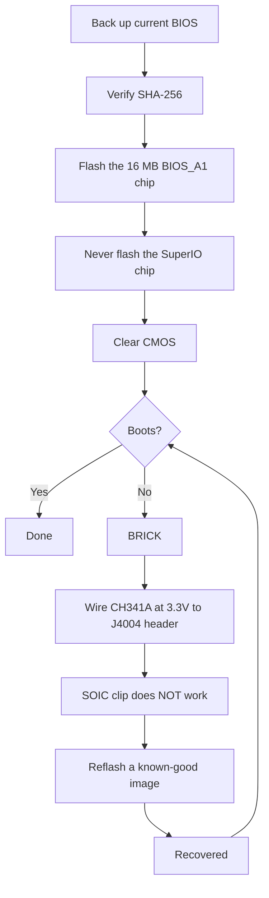

> 🌐 Қауымдастық аудармасы. Ағылшын нұсқасы — шындық көзі әрі жаңарақ болуы мүмкін. Қате таптыңыз ба? Issue ашыңыз: [English](../en/08-bios.md) · [issues](https://github.com/lildebil0/awesome-bc250/issues)

# BIOS және кірпіштен қалпына келтіру

> **TL;DR** — Қате BIOS параметрі **BC-250-ді өлі кірпішке айналдыруы мүмкін**, әрі бұл тақтада CMOS тазалау оны әрқашан қалпына келтіре *алмайды* ([src](https://t.me/c/2424231195/54971)). *Бірдеңені* прошивкалаудан бұрын мынаны түсініңіз: сізде қол астында **аппараттық қалпына келтіру жинағы** (**CH341A класты SPI программатор + аналық-аналық DuPont сымдары**) болуы керек, өйткені кірпішті қалпына келтірудің жалғыз сенімді жолы — чипті тақтаның **J4004 хедері** арқылы сырттан қайта прошивкалау. Танымал қауымдастық моды ("death-тің" BIOS-ы, ең соңғысы стандартты **5.00** негізінде) оверклокинг, GDDR6 таймингтері мен iGPU жадын бөлуді ашады — пайдалы, бірақ **барлық параметр қауіпсіз емес, кейбіреулері тақтаны лезде кірпішке айналдырады** ([src](https://t.me/c/2424231195/78922)). Алдымен әр образдың **SHA-256** хешін тексеріңіз және [`assets/firmware/DISCLAIMER.md`](../../assets/firmware/DISCLAIMER.md) оқыңыз. **Жеңіл-желпі прошивкаламаңыз.**

⚠️ **Бұл — анықтамалықтағы ең қауіпті тарау.** Прошивкалау қалпына келтіру аппаратурасынсыз бұзушы әрі қайтымсыз. Егер сіз кірпішті жандандыру үшін SPI чипке дәнекерлеуге/қыспаға дайын болмасаңыз, **осы жерде тоқтап, стандартты BIOS-та жұмыс істеңіз.**

---

## BC-250-дегі BIOS дегеніміз не

BC-250 — AsRock жасаған майнинг/сервер тақтасы, қысқартылған PS5 "Oberon" APU-сын алып жүреді. Оның UEFI firmware-і **16 MB SPI флеш чипінде** тұрады (8 пинді SOIC корпусындағы Winbond **W25Q128** / Macronix MX25L128). Стандартты firmware қатты құлыпталған: Setup-та пайдалы дерлік ештеңе ашылмаған. Чатта көрінген белгілі стандартты нұсқалар — **3.00** және **5.00**; мод BIOS-тар осылардан қайта құрылған (нұсқа нөмірі — сіздің тірегіңіз, мод қай негізде құрылғанын әрқашан белгілеп қойыңыз).

> Сондай-ақ стоктық **4.00** нұсқасы да бар. Стоктық **v4.0** және **v5.0** арасындағы жалғыз функционалдық айырмашылық — v5.0 нұсқасында әдепкі бойынша **network boot** функциясының қосылатындығында. ([дереккөз](https://discord.com/channels/1315924807128449065/1316030225338863636/1326825429595848816))

Адамдар қайта прошивкалаудың екі себебі:

1. Жасырын мәзірлерді (оверклок, undervolt, жад, iGPU VRAM) ашатын **мод BIOS орнату үшін**.
2. **Кірпішті қалпына келтіру үшін** — қате параметрден немесе сәтсіз прошивкадан кейін белгілі-жарамды образды қалпына келтіру.

> 💡 **Сізге мүлдем прошивкалаудың қажеті жоқ болуы мүмкін.** Егер сіздің *жалғыз* мақсатыңыз VRAM/UMA бөлінісін өзгерту болса, мұны **стандартты** P3.00 / P5.00 BIOS-та іске қосылған Linux-тан **[fanoush/bc250_memcfg](https://github.com/fanoush/bc250_memcfg)** көмегімен жасай аласыз — прошивкалаусыз, программаторсыз, кірпіш қаупінсіз ([elektricM: BIOS flashing](https://elektricm.github.io/amd-bc250-docs/bios/flashing/), [elektricM: VRAM](https://elektricm.github.io/amd-bc250-docs/bios/vram/)). Мод BIOS прошивкалау тек *ашылған чипсет мәзірлері* мен VRAM өлшемінен тыс функциялар үшін ғана қажет (`bc250_memcfg` командасы үшін [09-overclock-undervolt.md](09-overclock-undervolt.md) қараңыз).

---

## Мод BIOS ("death" моды) — ол нені өзгертеді әрі неге

Эталондық қауымдастық моды чатта **death** тарапынан жүргізіледі. Бұл *нөлден* жасалған firmware *емес* — ол стандартты BIOS жасырып жеткізетін AMD/AMI Setup опцияларын қайта қосады (жасырынынан ашады). Нұсқаларды бақылаңыз, өйткені кеңестер уақыт өте келе өзгерді:

| Мод нұсқасы | Негіз | Шыққан күні | Не ашты / өзгертті | Мәртебесі |
|---|---|---|---|---|
| **1.0** (алғашқы шығарылым) | стандартты **3.00** | 2025-06-28 | GDDR6 жиілігі, GDDR6 таймингтері, iGPU UMA жад өлшемі, ядро жиілігі, кернеулер | ⚠️ Қате мәндер тақтаны кірпішке айналдырады, **CMOS тазалау көмектеспеді** ([src](https://t.me/c/2424231195/54971)) |
| 3.0 нұсқалары | 3.00 | 2025-07 → 10 | Сол ашулар; бір билд **арнайы Steam жүктеу логотипін** қосты | Косметикалық логотип билді `bc250-Steam.rom` ретінде көшірілген ([src](https://t.me/c/2424231195/86420)) |
| **5.00 мод** (ағымдағы) | стандартты **5.00** | 2025-10-05 | Қойындылар қайта топталды; **көбірек параметр ашылды**; **RAM/GDDR6 тайминг параметрлері енді осы тақтада шынымен қолданылады** | Ең жаңасы; "барлық параметр пайдалы емес, бірақ ештеңеден жақсы" ([src](https://t.me/c/2424231195/78922)) |

Онымен шынымен нені баптауға болады (алғашқы шығарылым ескертпелерінен, [src](https://t.me/c/2424231195/54971)):

- **GDDR6 жиілігі** — бір қолданушыда (`@Haswellb`) **1800**-де жұмыс істеді деп хабарланды, бірақ *дәл сол түрдегі өзгеріс басқа тақтаны кірпішке айналдырды* — мәндер тақтаға тән, әмбебап емес.
- **GDDR6 таймингтері** — олар қолданылады, бірақ **тым төмен/тығыз таймингтер** тақтаны **кірпішке айналдырады**.
- **iGPU жад (UMA) өлшемі** — жұмыс істейді әрі нақты өсім береді. Егер өзгерісіңіз күшіне енбесе, **IGC: Forces** және **UMA Mode: UMA_SPECIFIED** орнатыңыз ([src](https://t.me/c/2424231195/54971); сол үйлесім қауымдастық құжаттамасымен расталған).
- **Ядро жиілігі / кернеулер** — ашылған, бірақ автор тарапынан **"тексерілмеген"**.

> ❗ **Автордың екі ескертуі, әлі де өзекті:** (1) **Интеграцияланған графиканы өшірмеңіз** — бұл жалғыз дисплей шығысы. (2) Осы модтардың кез келгенінде **қате параметр тақтаны кірпішке айналдыруы мүмкін әрі CMOS қайта орнату оны қалпына келтірмеуі мүмкін** — дәл осы себептен сізге программатор қажет. (Негізді таңдау үшін төмендегі "қай нұсқа?" сатысын қараңыз.)

> ### Қай нұсқа? (шешім сатысы)
>
> 1. **Мод P3.00 (чипсет-мәзір ROM) — қауіпсіз әдепкі.** Бұл — орныққан **"қауымдастық стандарты… ең тұрақты әрі тексерілген"**, белгілі SHA-256-мен жария-расталған, әрі ол **VRAM-ашу + чипсет параметрлерін** қазірден қамтиды. Олай етпеуге нақты себебіңіз болмаса, осы жерден бастаңыз ([elektricM: BIOS flashing](https://elektricm.github.io/amd-bc250-docs/bios/flashing/)).
> 2. **Мод 5.00 — ағымдағы; жад баптауын қаласаңыз, осыны таңдаңыз.** Бұл ең жаңа негіз әрі **RAM/GDDR6 тайминг параметрлері осы тақтада шынымен қолданылатын** жалғыз нұсқа ([src](https://t.me/c/2424231195/78922)). Жад таймингтерін баптағыңыз келгенде оны P3.00-ден гөрі таңдаңыз.
> 3. **`P5.00_clv` — тек сарапшыларға арналған.** Ол **"Барлығын"** ашады (әрбір жасырын мәзір, оның ішінде эксперименттік **ReBAR / Resizable BAR** мен debug/чипсет параметрлері), бұл *"қате нәрсені өзгертсеңіз тақтаны кірпішке айналдыруды өте оңайлатады… Озық қолданушы болмасаңыз, P3.00-де қалыңыз."* Оған қоса, **`P5.00_clv` нұсқаулық таба алатын ешбір жария репозиторийде жоқ** — ол тек Discord тіркемесі ретінде таралады, сондықтан **канондық хеш жоқ**; егер оны қолдануға мәжбүр болсаңыз, **екі** адамнан оны тәуелсіз қолданатын көшірмелерін алып, прошивкалаудан бұрын екеуінде де **бірдей SHA-256** бар екенін растаңыз ([elektricM: BIOS flashing](https://elektricm.github.io/amd-bc250-docs/bios/flashing/)).

> **Модталған 5.00 нұсқасының білуге тұрарлық ерекшеліктері.** Оның Setup мәзірінде **әдепкі CPU жиілігі 3600** болып көрсетіледі — бұл қолданылған тактілік жиілік емес, тек интерфейстің сыртқы мәні ([src](https://discord.com/channels/1315924807128449065/1452152658168381593/1452406964780007515)). Сонымен қатар ол чипсет параметрлерінде **`x1x1x1x1` PCIe bifurcation** опциясын қолжетімді етеді ([src](https://discord.com/channels/1315924807128449065/1452152658168381593/1474231812598534351)). Бұл базада жад таймингтерімен аса сақ болыңыз: **шектен тыс тайминг мәндері сыртқы қайта бағдарламалауға дейін тақшаны істен шығаруы мүмкін, және бұл P5.00 нұсқасында анағұрлым ауыр тиеді** ([src](https://discord.com/channels/1315924807128449065/1371527281947971604/1468745940994101372)). Кез келген прошивка жасау кезіндегідей, модталған 5.00 нұсқасына ауысу **сіз CMOS тазартқанға дейін экранның көрсетпеуіне** әкелуі мүмкін ([src](https://discord.com/channels/1315924807128449065/1315933088668454942/1508568321346502892)).

Сондай-ақ ең көп сілтеме жасалатын BIOS репозиторийінен — **[TuxThePenguin0/bc250-bios](https://gitlab.com/TuxThePenguin0/bc250-bios/)** — жеке **чипсет-мәзір моды** (`BC250_3.00_CHIPSETMENU.ROM`) бар, ол стандартты 3.00 үстіне **чипсет мәзірін / NBIO Common Options-ты** ашады. Сол репозиторийдің өз README-і ашық айтады: *"Бұл репозиторийдегі ешнәрсе қолдау көрсетілмейді әрі ешқандай кепілдігі жоқ — РЕЗЕРВТІК КӨШІРМЕ ЖАСАҢЫЗ."*

> 🚫 **`Smokeless_UMAF`-тен аулақ болыңыз.** Қауымдастықтың оверклокинг нұсқаулығы бұл UEFI-редакторлау құралын BC-250-де **іске қоспау керек нәрсе деп белгілейді — ол тақтаға тұрақты зақым келтіруі мүмкін** ([elektricM: BIOS overclocking](https://elektricm.github.io/amd-bc250-docs/bios/overclocking/)). Жоғарыдағы белгілі-жарамды ROM-дарда қалыңыз.

---

## Прошивкалаудан бұрын — қауіпсіздік тізімі

1. **Алдымен ағымдағы BIOS-ыңыздың резервтік көшірмесін жасаңыз** (прошивкалайтын сол құралмен оны оқып шығыңыз — Path B/қалпына келтіруді қараңыз). Резервтік көшірме — сіздің тегін кері қайтаруыңыз.
2. Образдың **SHA-256** хешін `assets/PROVENANCE.md` / бастапқы постпен салыстырып **тексеріңіз**. Қауымдастықтың прошивка нұсқаулығы чипсет-мәзір ROM үшін хешті былай жариялайды:
   `48fbe5d366e6a56e2fdffdca848426216ba1f083610dab63db89d2f4e6c940b5` ([elektricm docs](https://elektricm.github.io/amd-bc250-docs/bios/flashing/)).
3. Тек маркировканы емес, **чип өлшемін растаңыз**. 16 MB BIOS чипі — мақсат; кіші SuperIO чипін **прошивкаламаңыз** (қалпына келтіру бөлімін қараңыз). Әртүрлі тақта ревизиялары сәл өзгеше чип бөлшек нөмірлерін алып жүруі мүмкін — маңыздысы — **сыйымдылық (16 MB)**, маркировканың соңғы әріптері әртүрлі болуы мүмкін ([src](https://t.me/c/2424231195/67880)).
4. Кірпішке айналдырғаннан кейін емес, бірінші прошивкадан *бұрын* **қалпына келтіру аппаратурасын дайын ұстаңыз**.
5. Прошивкадан кейін жаңа параметрлер (әсіресе VRAM бөлу) күшіне енуі үшін **CMOS тазалаңыз** ("әр прошивкадан кейін" қараңыз).



### Прошивкалаудан бұрын бақылау сомасын тексеріңіз

Жоғарыдағы 2-қадам SHA-256-ны тексеруді айтады — мынау оны қалай жасайтыны. Прошивкалайтын файлдың хешін есептеп, оны [`assets/PROVENANCE.md`](../../assets/PROVENANCE.md) ішінде сол файл үшін көрсетілген мәнмен таңбама-таңба салыстырыңыз.

```bash
# Linux:
sha256sum BC250_3.00_CHIPSETMENU.ROM
```

```powershell
# Windows (PowerShell):
Get-FileHash BC250_3.00_CHIPSETMENU.ROM -Algorithm SHA256
```

`PROVENANCE.md` тек **алғашқы 16 он алтылық таңбаны** қысқа саусақ ізі ретінде көрсетуі мүмкін. Олай болса, есептелген хешіңіз сол 16 таңбадан **басталатынын** тексеріңіз — сол префикстің толық сәйкестігі қазірден күшті тексеру (қажет болса, қолдаушы толық хештерді жариялай алады).

Жария орналастырылған образдар үшін **расталған толық SHA-256 хештері** (бірнеше қауымдастық репозиторийі бойынша өзара тексерілген — әрбір белгілі-жарамды BC-250 BIOS файлы **дәл 16 MB / 16777216 байт**; басқа өлшем — ол бүлінген, құрал/патч немесе бөтен нәрсе дегенді білдіреді) ([elektricM: BIOS flashing](https://elektricm.github.io/amd-bc250-docs/bios/flashing/)):

| Файл | Түрі | SHA-256 |
|---|---|---|
| `BC250_3.00_CHIPSETMENU.ROM` (a.k.a. `Robin3.00`, `BC250CHIPSETMENU.ROM`) | **Мод P3.00** — VRAM + чипсет ашу, *ұсынылады* | `48fbe5d366e6a56e2fdffdca848426216ba1f083610dab63db89d2f4e6c940b5` |
| `Robin5.00` | **Стандартты** P5.00 (мод `P5.00_clv` емес) | `0d6f136cb120cf3b2de26d5c4d7f255604fdbf4b9442af5ba55419b95b89aa82` |
| `BC250_3.00.ROM` | Стандартты P3.00 | `07595ca3aecf8a4caa28a397b5298f3946a1b769f87b16f67adc369c3f69045c` |
| `BC250_2.00.bin` | Стандартты P2.00 | `ee6150dfed33bd05ea46063a352549416fdf3f45fa0e5edac2a68ef78d71083c` |
| `P5.00_clv` | Мод P5.00 (барлығын ашу) | **жария хеш жоқ** — тек Discord, екі тәуелсіз көшірменің сәйкестігін тексеріңіз |

> Мод P3.00 репозиторийлерде бірнеше файл атауымен көрінеді (`BC250_3.00_CHIPSETMENU.ROM`, `BC250CHIPSETMENU.ROM`, `Robin3.00`) — олардың бәрі жоғарыдағы мәнге хештеледі, сондықтан атаудың маңызы жоқ. `Robin5.00` — бұл **стандартты** P5.00, мод `P5.00_clv`-ден *басқа файл*. Әрқайсысы үшін жария көздер (TuxThePenguin0 GitLab, forgenam, tipitochen, csabakecskemeti, scrakcho, dannybastos, kenavru, MrrZed0) [elektricM прошивка нұсқаулығында](https://elektricm.github.io/amd-bc250-docs/bios/flashing/) тізілген.

> 🔴 **Бақылау сомасы сәйкес келмесе, ПРОШИВКАЛАМАҢЫЗ.** Сәйкессіздік — бүлінген немесе қате файл дегенді білдіреді — оны прошивкалау дегеніміз — тақтаны кірпішке айналдырудың дәл сол жолы. Образды қайта жүктеп, қайта тексеріңіз.

---

## Path A — Бағдарламалық прошивка (тақтадан, программаторсыз)

Бұл — тақта әлі жүктелетін кезде BIOS-ты орнатудың/жаңартудың қалыпты жолы. **FAT32 USB флешін** және AMI firmware жаңарту утилитасын қолданыңыз.

**EFI / AFU әдісі** ([src](https://t.me/c/2424231195/54979)):

1. USB флешін **FAT32**-ге форматтаңыз.
2. AFU архивінің (мысалы `AfuEfi64_5.16.zip`) мазмұнын **және BIOS файлын** оған көшіріңіз.
3. BC-250-ді қайта жүктеп, EFI shell-ге **USB флешінен жүктеңіз**.
4. Іске қосыңыз:
   ```
   afuefix64.efi <filename>.<ext> /P /N
   ```
   - `/P` = негізгі BIOS-ты прошивкалау.
   - `/N` = **NVRAM**-ды да прошивкалау. Бұл нұсқалар *арасында* (мысалы, басқа нұсқадан 3.00-ге) ауысқанда қателерден сақтайды — **бірақ ол сақталған параметрлеріңізді өшіреді.** `/N`-ді алып тастауыңызға болады, бірақ онда болуы мүмкін қателерді күтіңіз. ([src](https://t.me/c/2424231195/54979))
5. Құрал файлды көре алмаса, флеш қайсысы екенін табу үшін `fs0:`, `fs1:`, … қолданып көріңіз ([src](https://t.me/c/2424231195/54979)).

Кейбір қауымдастық билдтері дайын `Flash.nsh` сценарийі мен қайта аталған ROM-мен жеткізіледі (мысалы, мод ROM-ды сценарийге сәйкестендіріп қайта атаңыз), осылайша сіз тек EFI shell-ге жүктеп, сценарийді іске қосасыз ([elektricm docs](https://elektricm.github.io/amd-bc250-docs/bios/flashing/)). Linux-та іске қосылған жүйеден прошивкалауға арналған **`afulnx`** билді де (`afulnx-5.05.04Z.tar.gz`) бар ([src](https://t.me/c/2424231195/54507)).

#### Канондық EFI-shell рецепті (`Flash.nsh` / `Robin5.00` әдісі)

Қауымдастықтың прошивка нұсқаулығы өзіндік жинаққа және тұрақты файл атауына стандарттанады — бұл ең көп қайталанатын USB жолы ([elektricM: BIOS flashing](https://elektricm.github.io/amd-bc250-docs/bios/flashing/)):

1. **EFI жинағын алыңыз:** `4U12G BIOS Update.zip` ([kenavru/BC-250](https://github.com/kenavru/BC-250) репозиторийінен) — оның құрамында `AfuEfix64.efi`, `Flash.nsh` және `amdvbflash.efi` бар. *Ол сондай-ақ `Robin5.00` деп аталған стандартты P5.00 BIOS-ты қоса жеткізеді — оны кездейсоқ прошивкаламау үшін бір жаққа алып қойыңыз.*
2. **FAT32 флешін дайындаңыз (≤ 32 GB ұсынылады).** Жинақтың `BIOS EFI` қалтасының мазмұнын **түбірге** көшіріңіз.
3. **Мод ROM-ыңызды `Robin5.00` деп қайта атаңыз** (`.ROM` кеңейтімін алып тастаңыз) — бұл `Flash.nsh` іздейтін дәл сол атау. *(Немесе оның орнына `Flash.nsh`-ты файл атауыңызға сәйкестендіріп өзгертіңіз.)* Сонда түбір мынаны қамтуы керек: `AfuEfix64.efi`, `Flash.nsh`, `amdvbflash.efi`, `Robin5.00` (сіздің қайта аталған модыңыз) және `EFI` қалтасы.
4. **Тікелей DisplayPort мониторды қолданыңыз.** Белсенді/пассив **HDMI адаптерлері BIOS мәзірін қара экранға айналдыруы мүмкін** — бұл тақтадағы белгілі дисплей мәселесі.
5. Тақта EFI shell-ге автоматты түрде түсуі үшін **барлық SSD/дискіні ажыратыңыз**, флешті салып, қуатты қосыңыз. Сіз сары `Shell>` шақыруына түсесіз.
6. Шақыруда **`blk0:`** теріп, Enter басыңыз — **қос нүктеден кейінгі бос орынды ескеріңіз** (бұл USB томын таңдайды; `blk0:` — elektricM құжаттаған селектор, жоғарыдағы `fs0:`/`fs1:` зерттеуінен өзгеше). Содан кейін **`Flash.nsh`** теріп, Enter басыңыз.
7. **КҮТІҢІЗ. Пернетақтаға тиіспеңіз, қуатты өшірмеңіз.** Жазу кезінде ол *іліп қалғандай* көрінсе, **кемінде 15 минут күтіңіз** — жазу ортасында қуатты өшіру тақтаны кірпішке айналдырады. Ол біткенде қайта жүктеледі (немесе сізден соны сұрайды).
8. **Дереу қуатты өшіріп, флешті алыңыз**, сонда ол прошивкаға қайта оралмайды.

> 🔴 **Прошивка үшін қуатты қоспас бұрын: 8 пинді PCIe қуат сымдамасын** БҚ-ңыздың 12 В/GND диаграммасымен салыстырып тексеріңіз. **Кері полярлық тақтаға тұрақты зақым келтіруі мүмкін** ([elektricM: BIOS flashing](https://elektricm.github.io/amd-bc250-docs/bios/flashing/)).

#### Прошивкадан кейінгі міндетті BIOS параметрлері (мұны CMOS тазалаудан кейін бірден жасаңыз)

Прошивкалап **әрі** CMOS тазалағаннан кейін (келесі бөлім), Setup-қа кіріп (**Del** басып), мыналарды орнатыңыз — олар дұрыс болмайынша VRAM бөлінісі дұрыс жұмыс істемейді ([elektricM: BIOS flashing](https://elektricm.github.io/amd-bc250-docs/bios/flashing/), [elektricM: BIOS VRAM](https://elektricm.github.io/amd-bc250-docs/bios/vram/)):

| Параметр | Жол | Мән |
|---|---|---|
| Integrated Graphics Controller | Chipset → GFX Configuration | **Forces** |
| UMA Mode | Chipset → GFX Configuration | **UMA_SPECIFIED** |
| UMA Frame Buffer Size | Chipset → GFX Configuration | **512MB** (ұсынылады) немесе тіркелген өлшем |
| IOMMU | Advanced → CPU Configuration | **Disabled** |
| Boot Mode | Boot → Boot Mode | **UEFI** |

Алдымен CMOS тазалаудың шынымен болғанын тексеріңіз — **сағат қате көрсетуі керек**; егер ол әлі дұрыс болса, тазалауды қайталаңыз. Содан кейін сақтау үшін F10. `512MB` таңдауы — *динамикалық* бөлу, 512 MB шектеуі емес ([09-overclock-undervolt.md](09-overclock-undervolt.md) қараңыз).

> ★ **512 MB UMA неге FPS *арттырады* (механизм).** UMA буферін **512 MB** етіп қою GPU-ды аштан өлтірмейді — ол үлкен тіркелген тілімді құлыптап алып қоюдың орнына жүйеге **RAM мен VRAM-ды динамикалық теңестіруге** мүмкіндік береді, әрі осы қайта теңестірудің өзі нақты FPS секіруіне сеп болды: Cyberpunk 2077 FSR 3.0 *balanced*, 1080p, Steam-Deck пресетінде **60 → 66 fps (2 GHz OC кезінде) → 76 fps**-ке шықты ([Old Lamer — Part I](https://youtu.be/ohpEY2XQ_lo) ~11:21; ⚠ шамамен — сандар видеодан транскрипцияланған, бір билдтің нәтижесі ретінде қабылдаңыз). Сонымен "512 MB ең жақсы" деген тек қауіпсіз өлшем емес — кіші динамикалық буфер өнімділік оқиғасының *бір бөлігі*, ымыра емес.

**flashrom қосалқы нұсқасы** (AFU қате берсе) ([src](https://t.me/c/2424231195/54979), `@mrartemsid` ұсынған әрі тексерген):

```bash
# Read (back up):
sudo flashrom -p internal:boardmismatch=force -r <name>.bin
# Write:
sudo flashrom -p internal:boardmismatch=force -w <name>.bin
```

> ⚠️ Бағдарламалық прошивкалау тек **тақта әлі POST өтіп жатқанда** ғана көмектеседі. Қате параметр оны кірпішке айналдырған сәтте Path A жоғалады әрі сіз төмендегі аппараттық жолда боласыз.

---

## Path B — Аппараттық прошивка / кірпіштен қалпына келтіру (CH341A SPI программаторы)

Бұл — **қалпына келтіру** жолы әрі бекітілген "кірпішті прошивкалаудың ең ыңғайлы жолы" ([src](https://t.me/c/2424231195/67880)). Сіз 16 MB SPI чипті USB SPI программаторын қолданып, басқа ДК-дан тікелей қайта жазасыз. Қолданылатын бағдарлама: **NeoProgrammer** (Windows) немесе **flashrom** (Linux).

> 🔴 **SOIC-8 қыспасы бұл тақтада ЖҰМЫС ІСТЕМЕЙДІ.** death бұл туралы ашық айтады: *"біздің тақтада қыспа… негізінен мүлдем жұмыс істемейді."* ([src](https://t.me/c/2424231195/67880)). Ескерту: `assets/firmware/DISCLAIMER.md` жалпылама түрде "SOIC clip" туралы айтады — іс жүзінде сіз оның орнына **тақтадағы J4004 хедеріне сым тартуыңыз керек.** Бұл — осы тараудағы ең маңызды қалпына келтіру дерегі.

### J4004 хедерінің пиндемесі (осы жерге сым тартыңыз)

Тақтада SPI/BIOS чипін қайта прошивкалауға арнайы **2.54 мм қадамды J4004 хедері** ашылған. Пиндеме (бекітілген сым тарту скриншотынан, [src](https://t.me/c/2424231195/67880)):

```
J4004
[ GND  SCLK  MOSI  UNK ]
[ VCC  CS    MISO      ]
   ^  (pin-1 marker)
```

| J4004 пин | Сигнал | CH341A алаңы |
|---|---|---|
| VCC | 3.3 V қуат | VDD / 3.3V |
| GND | жер | GND |
| CS | чип таңдау | CS / SS |
| SCLK | такт | CLK / SCK |
| MOSI | деректер кірісі (чипке) | MOSI |
| MISO | деректер шығысы (чиптен) | MISO |

Сәйкес **W25Q128 SOIC-8 / CH341A түс картасы** сол бекітілген скриншотта — `/CS, DO(MISO), CLK, DI(MOSI), VCC, GND` дегендерді CH341A-ның `CS, MISO, CLK, MOSI, VDD, GND` алаңдарына сәйкестендіріңіз. Қуатты қоспас бұрын **VCC мен GND-ны үш рет тексеріңіз**; оларды шатастыру чипті өлтіреді ([src](https://t.me/c/2424231195/67880)).

> **J4004 пин нөмірлеуі мен екі белгісіз пин.** elektricM нұсқаулығы хедерді VCC=1, GND=2, CS=3, SCLK=4, MISO=5, MOSI=6 деп нөмірлейді, ал **7 & 8 пиндер прошивка үшін қолданылмайды — олар 10 kΩ резисторлар арқылы жерге қосылған.** 1-пин (VCC) PCB-да **көрсеткі `>` немесе шаршы алаңмен** белгіленген ([elektricM: BIOS flashing](https://elektricm.github.io/amd-bc250-docs/bios/flashing/)).

> **Нақты мақсат чипі мен тығыздық қате баспасы.** 16 MB бөлшегі — Winbond **W25Q128JVSQ** (128 Mbit / 16 MB) немесе, кейбір партияларда, Macronix **MX25L12835F**. Кейбір қауымдастық құжаттары мұны **"25Q168" деп қате басады — бұл дұрыс емес**; дұрыс 16 MB тығыздық коды — **128** ([elektricM: BIOS flashing](https://elektricm.github.io/amd-bc250-docs/bios/flashing/)). Егер J4004-тің орнына жалаңаш **SOIC-8 қыспасы** арқылы прошивкаласаңыз, чиптің өз пин реті — стандартты SPI орналасуы: `1 CS · 2 DO · 3 WP · 4 GND · 5 DI · 6 CLK · 7 HOLD · 8 VCC` ([elektricM: BIOS recovery](https://elektricm.github.io/amd-bc250-docs/bios/recovery/)) — бірақ death-тің **қыспа бұл тақтада әрең жұмыс істейді** деген тұжырымын есте сақтап, J4004-ті артық көріңіз.

> 🙏 Алғыс: J4004 пиндемесі, кері инженерия және мод-firmware образ репозиторийі негізінен **Segfault-тің** жұмысы (P3.00 чипсет-мәзір ROM — "Segfault mod") ([elektricM: BIOS flashing](https://elektricm.github.io/amd-bc250-docs/bios/flashing/)).

### NeoProgrammer процедурасы (бекітілген) ([src](https://t.me/c/2424231195/67880))

1. Программаторды пиндемеге сәйкес аналық-аналық сымдармен **J4004**-ке қосыңыз. **Сым тартуды ~10 рет тексеріңіз, әсіресе VCC мен GND.** (БҚ ажыратылған.)
2. **NeoProgrammer**-ді ашыңыз.
3. Чиптің **авто-анықтауын** іске қосыңыз, сондай-ақ чиптің өзіндегі маркировканы оқыңыз.
4. **Маркировкаларды салыстырыңыз.** Егер соңғы әріптер тізімнен өзгеше болса, бірақ **сыйымдылық сәйкес келсе (16 MB)**, бұл жақсы.
5. Чипті **тазалаңыз (Erase)**.
6. Бағдарламада BIOS файлын **ашыңыз (Open)** (сүйреп-тастау жұмыс істейді).
7. Чипті **жазыңыз (Write)**.
8. **J4004-тен сымдарды ажыратыңыз.**
9. Тақтаны қуатқа қосыңыз.

### flashrom баламасы (Linux), қауымдастық құжаттамасымен өзара тексерілген

Қауымдастықтың прошивка нұсқаулығы **CH347** программаторын қолданады әрі арзан қара-PCB CH341A тақталарынан сақтандырады (келесі бөлім). Дұрыс чипті анықтаңыз — **16 MB BIOS чипін** (`BIOS_A1`) мақсат етіңіз, прошивкаласа SuperIO-ны кірпішке айналдыратын 512 KB SuperIO-ны (`SIO1_R`) **ешқашан** емес ([elektricm docs](https://elektricm.github.io/amd-bc250-docs/bios/flashing/)):

```bash
# Detect / identify the chip:
sudo flashrom -p ch347_spi

# Back up the stock BIOS (twice, then diff to be sure the read is stable):
sudo flashrom -p ch347_spi -r backup_stock.bin
sudo flashrom -p ch347_spi -r backup_verify.bin

# Write the new image, then verify it read back identical:
sudo flashrom -p ch347_spi -w BC250_3.00_CHIPSETMENU.ROM
sudo flashrom -p ch347_spi -v BC250_3.00_CHIPSETMENU.ROM
```

(`ch347_spi` орнына CH341A үшін `-p ch341a_spi`, ал Raspberry Pi Pico үшін `serprog` қолданыңыз.) ⚠ *Осы* тақтаның нақты сым тартуы үшін `ch347_spi` / `serprog` сәйкестігі қауымдастық нұсқаулығынан — өз программатор моделіңізге қарсы `⚠ verify`.

> **Анықтау сіздің қай чипте екеніңізді айтады.** Егер `flashrom -p …` **`Winbond W25Q128…`** немесе **`Macronix MX25L128…`** деп хабарласа, сіз дұрыс 16 MB BIOS чипіндесіз. Егер ол **`Macronix MX25L4005…` (512 KB)** деп хабарласа, **ТОҚТАҢЫЗ — сіз SuperIO чипіне** (`SIO1_R`) қосылғансыз; оны прошивкалау желдеткіш басқаруын/сенсорларды кірпішке айналдырады. Басқа чипке көшіңіз ([elektricM: BIOS flashing](https://elektricm.github.io/amd-bc250-docs/bios/flashing/)). **БҚ розеткадан ажыратылып** әрі конденсаторлар разрядталып (қуат түймесін бірнеше рет басып) прошивкалаңыз — қыспа арқылы прошивкалау кезінде тақтаны қуаттандыру *ұсынылмайды* ([elektricM: BIOS recovery](https://elektricm.github.io/amd-bc250-docs/bios/recovery/)).

### CH341A 3.3 V тұзағы (мұны оқыңыз, әйтпесе чипті қуырасыз)

Көптеген арзан **қара-PCB CH341A** программаторлары **VCC 3.3 V болса да, деректер желілерін 5 V-та** басқарады — BC-250-дің BIOS чипі — **3.3 V** бөлшегі, сондықтан деректер желілеріндегі 5 V оны зақымдауы мүмкін. Бұл — кейбір тақталарда белгілі, өлшенген ақау (Фабианның тақтасы әрі чаттағы дәл сондай тақта кернеу өлшеуімен расталды) ([src](https://t.me/c/2424231195/100285)). Шешімдер:

- Деректер желілерінде шынайы 3.3 V болатын программаторды (мысалы, **CH347**) артық көріңіз, **немесе**
- **Дәнекерсіз CH341A 5V→3.3V деректер-желісі түзетуін** қолданыңыз: USB 5 V қуат желісін чипке кесіп тастап, оған оның орнына 3.3 V беріңіз — [sawyershepherd.org мақаласын](https://sawyershepherd.org/post/solderless-ch341ab-fix-5v-to-33v-data-lines/) және [wej.k.vu CH341A түзетуін](https://wej.k.vu/electronics/ch341a-mini-programmer-fix/) қараңыз ([src](https://t.me/c/2424231195/100285)).

---

### Төмен деңгейлі хедерлер, debug және тақтадағы кремний

Жоғарыдағы J4004 флеш хедерінен басқа, тақтада тағы бірнеше хедер мен тақтадағы чиптердің белгілі жиынтығы бар. Бұлар elektricM аппараттық құжаттарында кері инженерияланған әрі CMOS тазалау, debug зерттеу, желдеткіш сым тарту және прошивкалаудан бұрын қай чип қайсысы екенін растау үшін пайдалы. Пин мәндері ([elektricM: pinouts](https://elektricm.github.io/amd-bc250-docs/hardware/pinouts/)) ішінен таңбама-таңба транскрипцияланған.

**CLRCMOS1 — clear-CMOS джампері (3 пинді).** Бұл — осы тарауда барлық жерде "CMOS джамперін қысқа тұйықтаңыз" деп аталатын джампер — мынау оның картасы:

| Күй | Әрекеті |
|---|---|
| 1–2 пиндер | CR2032 CMOS-ты қуаттандырады (әдепкі) |
| 2–3 пиндер | CMOS тазалау |

> 💡 [Прошивкадан кейінгі тізім](#%D0%BF%D1%80%D0%BE%D1%88%D0%B8%D0%B2%D0%BA%D0%B0%D0%BB%D0%B0%D1%83%D0%B4%D0%B0%D0%BD-%D0%B1%D2%B1%D1%80%D1%8B%D0%BD--%D2%9B%D0%B0%D1%83%D1%96%D0%BF%D1%81%D1%96%D0%B7%D0%B4%D1%96%D0%BA-%D1%82%D1%96%D0%B7%D1%96%D0%BC%D1%96) мен ["әр прошивкадан кейін"](#%D3%99%D1%80-%D0%BF%D1%80%D0%BE%D1%88%D0%B8%D0%B2%D0%BA%D0%B0%D0%B4%D0%B0%D0%BD-%D0%BA%D0%B5%D0%B9%D1%96%D0%BD--cmos-%D1%82%D0%B0%D0%B7%D0%B0%D0%BB%D0%B0%D2%A3%D1%8B%D0%B7-%D0%BC%D1%83%D0%BD%D1%8B-%D3%A9%D1%82%D0%BA%D1%96%D0%B7%D1%96%D0%BF-%D0%B6%D1%96%D0%B1%D0%B5%D1%80%D0%BC%D0%B5%D2%A3%D1%96%D0%B7) сізге "CMOS джамперін ~20 секундқа қысқа тұйықтаңыз" десе, **CLRCMOS1** — дәл сол джампер: оны 1–2 пиндерден 2–3 пиндерге жылжытып, күтіп, содан кейін кері жылжытыңыз. (CR2032-ні 60+ с алып тастау — балама.)

**TPMS1 — LPC debug хедері (18 пинді, 2.0 мм қадам):**

| Пин | Сигнал | Пин | Сигнал |
|---|---|---|---|
| 1 | PCICLK | 2 | GND |
| 3 | FRAME | 4 | SMB_CLK_MAIN |
| 5 | PCIRST# | 6 | SMB_DATA_MAIN |
| 7 | LAD3 | 8 | LAD2 |
| 9 | 3V | 10 | LAD1 |
| 11 | LAD0 | 12 | GND |
| 13 | (empty) | 14 | S_PWRDWN# |
| 15 | 3VSB | 16 | SERIRQ# |
| 17 | GND | 18 | GND |

> 💡 **9-пин (3V) тек тақта қуатқа қосылғанда ғана белсенді** — сондықтан ол "жүйе-қосулы" анықтау сигналы ретінде жұмыс істейді. Бұл оны авто-қуат-қосу / шынайы-ATX адаптер құрастырмалары үшін балама сезу нүктесіне айналдырады ([03-power-supply.md ішіндегі `AUTO_PWRON` джамперіне](03-power-supply.md) сілтемені салыстырыңыз).

**J2 — JTAG/HDT debug хедері (20 пинді, 1.27 мм қадам, толтырылмаған, тақтаның астында):**

| Пин | Сигнал | Пин | Сигнал |
|---|---|---|---|
| 1 | VDDIO | 2 | TCK |
| 3 | GND | 4 | TMS |
| 5 | GND | 6 | TDI |
| 7 | GND | 8 | TDO |
| 9 | TRST_L | 10 | PWROK_BUF |
| 11 | DBRDY3 | 12 | RESET_L |
| 13 | DBRDY2 | 14 | DBRDY0 |
| 15 | DBRDY1 | 16 | DBREQ_L |
| 17 | GND | 18 | TEST19 |
| 19 | VDDIO | 20 | TEST18 |

> TEST18, TEST19 және DBRDY0 ашық қалдырылған. Бұл — тақтадағы **жалғыз** аппараттық қайта орнату/debug интерфейсі.

**I2C_HEADER1 (3 пинді):** `SCL · SDA · GND`. SCL — **қуат қосқыштарына жақынырақ** пин. Бұл шина **Intersil PMIC-терге PMBUS** тасымалдайды — қуат-телеметрия қол жеткізу нүктесі.

**CPU_FAN1 (4 пинді):** `PWM · Tach · 12V · GND`.

**J4003 — көп-желдеткіш хедері (16 пинді, 2×8, 2.54 мм):**

| Row 1 | 1 GND | 2 F1T | 3 F2T | 4 F3T | 5 F4T | 6 F5T | 7 DET | 8 (empty) |
|---|---|---|---|---|---|---|---|---|
| **Row 2** | 1 GND | 2 F1P | 3 F2P | 4 F3P | 5 F4P | 6 F5P | 7 GND | 8 GND |

Мұнда әр желдеткіш 1–5 үшін `T` = tach және `P` = PWM.

> 💡 **DET (1-қатар, 7-пин) тақта желдеткіш / қуат-тарату тақтасында отырғанда жерге қосылады** — яғни ол тасушыны анықтайды. (BIOS↔Linux желдеткіш нөмірлеуі [06-linux.md → Sensors & fan control](06-linux.md#sensors--fan-control) ішінде қамтылған; ол мұнда қайталанбайды.)

**Тақтадағы кремний (BOM).** Репозиторий прошивка бөлімдерінде `SIO1_R` мен `BIOS_A1`-ді қазірден атайды, бірақ ешқашан бөлшек нөмірлерін немесе өлшемдерін бермеді; бұл кесте флешерге қай чип қайсысы екенін растауға мүмкіндік береді (16 MiB Winbond — BIOS, 512 KiB Macronix — SuperIO — оны тиіспеңіз):

| Белгілеу | Бөлшек | Рөлі |
|---|---|---|
| PUA1 | Intersil ISL69247 | Негізгі PMIC |
| PUIO1 | Intersil ISL95712 | Ядро-қуат PMIC |
| PUA11… | Intersil ISL99360 | Смарт қуат каскадтары (фазалар) |
| M2U2 | NXP CBTL04083B | 2:1 PCIe x4 mux |
| U30 | Realtek RTL8111H | Ethernet NIC (PCIe x1) |
| SU1 | AMD 218-0844029 | A68H "Bolton-D2H" FCH чипсеті |
| UIO1 | Nuvoton NCT6686D | SuperIO (hwmon сенсор чипі) |
| BIOS_A1 | Winbond 25Q128JVSQ | 16 MiB SPI флеш = **BIOS** (ОСЫНЫ прошивкалаңыз) |
| SIO1_R | Macronix MX25L4006E | 512 KiB SPI флеш = SuperIO бағдарламасы (**прошивкаламаңыз — SuperIO-ны кірпішке айналдырады**) |

> Мұнда аталған SuperIO сенсор чипі (Nuvoton **NCT6686D**) — Linux `nct6687`/`nct6683` драйвері байланысатын чип — сенсор/желдеткіш баптауы үшін [06-linux.md](06-linux.md) қараңыз.

**Микробағдарлама құралдары (кеңейтілген).** Бейнені зерттеу үшін екі утилита жиі қолданылады:

- **`psptool`** BIOS дампының ішіндегі AMD микробағдарлама blob-тарын тексереді және шығарып алады. `psptool -E bios.bin` жазбаларды тізімдейді; `psptool -X -d 0 -e 1 -o firmware.bin bios.bin` талдау жасау үшін SMU микробағдарламасын шығарып алады. ([bc250-collective/amd_smu_reverse_engineering](https://github.com/bc250-collective/amd_smu_reverse_engineering))
- **`Zentool`** процессордың микрокодын патчтайды — мысалы, `RDRAND` нұсқаулығын ауыстыру үшін. ([AMD-BC-250/documentation #1](https://github.com/AMD-BC-250/documentation/issues/1))

---

## Secure Boot және CSM (жүктеу алғышарттары)

Бұл екеуін BIOS-setup алғышарт тізіміне қосыңыз — талап етіледі, әйтпесе **арнайы/патчталған ядролар жүктелмейді** (40-CU патчі, жиілік патчі, т.б.):

| Параметр | Мән |
|---|---|
| Secure Boot | **Disabled** |
| CSM (Compatibility Support Module) | **Disabled** |

Көзі: [elektricM: boot troubleshooting](https://elektricm.github.io/amd-bc250-docs/troubleshooting/boot/).

---

## "srep" авто-қайта орнату идеясы (эксперименттік — аяқталған функция емес)

Қате параметр тақтаны кірпішке айналдыруы мүмкін әрі **CMOS тазалау оны түзетпейтіндіктен**, death **кірпіш кезінде параметрлерді авто-қайта орнату** үшін BIOS-қа **`srep`** рутинасын ендіруге эксперимент жасады — идея бастапқыда `@Jacky_Fish`-тен ([src](https://t.me/c/2424231195/60552)). Тұжырымдама: BIOS өзінің NVRAM/`amdsetup` айнымалыларын әдепкіге қайта патчтасын, қалауыңызша тек USB флешінде триггер файлдары болғанда ғана (сонда ол әр жүктеуде параметрлеріңізді өшірмейді). Чат бойынша, **бұл әлі жұмыс істемеді** — *"тақта табандылықпен толық кірпіш болып көрінеді әрі ештеңе қайта орнатылмайды"* ([src](https://t.me/c/2424231195/60883)). Кез келген "өзін-өзі емдейтін BIOS" мәлімдемесін **дәлелсіз** деп қабылдаңыз; сіздің нақты қауіпсіздік торыңыз — сыртқы программатор болып қала береді. Кез келген srep билдіне сенбес бұрын `⚠ verify`.

---

## Әр прошивкадан кейін — CMOS тазалаңыз (мұны өткізіп жібермеңіз)

BIOS-ты прошивкалау сақталған параметрлерді қайта орнатпайды, әрі бірнеше параметр (әсіресе **VRAM/UMA бөлу**) сіз CMOS тазаламайынша шынымен қолданылмайды. Бір қолданушы дәл осыған тап болды: BIOS жаңа VRAM өлшемін көрсетіп, оны "сақтады", бірақ ОЖ (Bazzite) CMOS тазаланғанша ескі 4 GB RAM / 12 GB VRAM бөлінісін хабарлай берді ([src](https://t.me/c/2424231195/97290)). Қалай тазалау керек:

- **CR2032 тиынша батареясын 60+ секундқа алып тастаңыз** (ұсынылады), **немесе**
- **CMOS джамперін ~20 секундқа қысқа тұйықтаңыз.** ([elektricm docs](https://elektricm.github.io/amd-bc250-docs/bios/flashing/))

> Шектеуді ескеріңіз: CMOS тазалау "параметрлер қолданылмады" мен *жеңіл* қате конфигурацияларды түзетеді — бірақ 1.0/3.00 мод буынында ол шынайы кірпішті қалпына келтірмейді деп хабарланды ([src](https://t.me/c/2424231195/54971)). Ол үшін Path B қараңыз.

---

## Көшірілген firmware

Чатта талқыланған BIOS образдары **қалпына келтіру/сақтау** үшін `assets/firmware/` астында көшірілген (прошивкалаудан бұрын [`DISCLAIMER.md`](../../assets/firmware/DISCLAIMER.md) қараңыз әрі әр файлдың SHA-256-сын `PROVENANCE.md` ішінде тексеріңіз):

| Файл | Өлшем | Бұл не | Көзі |
|---|---|---|---|
| `BC250_3.00.ROM` | 16 MB | Стандартты 3.00 дамп | ([src](https://t.me/c/2424231195/5215)) |
| `BC250_3.00_CHIPSETMENU.ROM` | 16 MB | Чипсет-мәзір моды (TuxThePenguin0) | ([src](https://t.me/c/2424231195/86395)) |
| `dump_5.00.bin` | 16 MB | Стандартты 5.00 дамп | ([src](https://t.me/c/2424231195/24661)) |
| `BC250_5.00_clv.zip` | 16 MB | **death-тің 5.00 моды (ағымдағы)** | ([src](https://t.me/c/2424231195/78922)) |
| `bc250_3.00_clv1.zip` | 16 MB | death-тің алғашқы 3.00 моды (1.0) | ([src](https://t.me/c/2424231195/54971)) |
| `bc250-Steam.rom` | 16 MB | Steam жүктеу логотипі бар 3.0 мод | ([src](https://t.me/c/2424231195/86420)) |
| `bc250 modded bios.ROM` | 16 MB | Ерте мод образ | ([src](https://t.me/c/2424231195/30100)) |
| `my_4.0_MODED.bin` | 16 MB | Аралық 4.0 мод | ([src](https://t.me/c/2424231195/45580)) |
| `W25Q128BV@WSON8_…BIN` | 16 MB | Шикі чип оқу (W25Q128) | ([src](https://t.me/c/2424231195/5217)) |
| `AfuEfi64_5.16.zip` | — | AMI AFU EFI флешер | ([src](https://t.me/c/2424231195/54979)) |
| `afulnx-5.05.04Z.tar.gz` | — | AMI AFU Linux флешер | ([src](https://t.me/c/2424231195/54507)) |

> PS5 BIOS-ын (`PS5 Disk Edition … BIOS.bin`, 2 MB) немесе 512 KB чиптерді BC-250-дің 16 MB BIOS чипіне прошивкаламаңыз — қате мақсат, қалпына келтіру ескертулерін қараңыз.

---

## Көздер

- death-тің моды — алғашқы шығарылым (3.00) — https://t.me/c/2424231195/54971 · ағымдағы (5.00) — https://t.me/c/2424231195/78922 · Steam-логотип билді — https://t.me/c/2424231195/86420
- Бағдарламалық прошивка (AFU `/P /N`, flashrom) — https://t.me/c/2424231195/54979 · afulnx — https://t.me/c/2424231195/54507
- Аппараттық кірпіштен қалпына келтіру (бекітілген, NeoProgrammer + J4004 сым тарту скриншоттары) — https://t.me/c/2424231195/67880
- srep авто-қайта орнату идеясы — https://t.me/c/2424231195/60552 · нәтиже (жұмыс істемеді) — https://t.me/c/2424231195/60883
- Прошивкадан кейін CMOS-тазалау қажет — https://t.me/c/2424231195/97290
- CH341A 5V→3.3V деректер-желісі тұзағы — https://t.me/c/2424231195/100285 · түзету мақаласы — https://sawyershepherd.org/post/solderless-ch341ab-fix-5v-to-33v-data-lines/
- Ең көп сілтеме жасалатын BIOS репозиторийі — [TuxThePenguin0/bc250-bios](https://gitlab.com/TuxThePenguin0/bc250-bios/) (`BC250_3.00_CHIPSETMENU.ROM`, `CHIPSETMENU.md`)
- Қауымдастықтың прошивка/қалпына келтіру нұсқаулығы (расталған SHA-256 кестесі, `Flash.nsh`/`Robin5.00` рецепті, `blk0:` селекторы, DisplayPort/HDMI мәселесі, 15-мин ілінбе ережесі, J4004 пиндемесі + 7/8 пиндер, W25Q128JVSQ/"25Q168" қате баспасы, CH347, прошивкадан кейінгі Setup мәндері, Segfault алғысы) — [elektricM: BIOS flashing](https://elektricm.github.io/amd-bc250-docs/bios/flashing/)
- Қалпына келтіру нұсқаулығы (SPI 8-пин пиндемесі, MX25L4005 = SuperIO анықтау, БҚ ажыратылып прошивкалау, сценарийлерді талдау) — [elektricM: BIOS recovery](https://elektricm.github.io/amd-bc250-docs/bios/recovery/)
- Тақта пиндемелері және тақтадағы кремний (CLRCMOS1, TPMS1 LPC, J2 JTAG/HDT, I2C_HEADER1, CPU_FAN1, J4003 көп-желдеткіш, Intersil/NXP/Realtek/Nuvoton/Winbond/Macronix BOM) — [elektricM: pinouts](https://elektricm.github.io/amd-bc250-docs/hardware/pinouts/)
- VRAM нұсқаулығы (`bc250_memcfg` прошивкасыз өлшеу, UMA Frame Buffer мәндері, ядро-параметр VRAM, Vulkan-vs-OpenGL хабарлау) — [elektricM: BIOS VRAM](https://elektricm.github.io/amd-bc250-docs/bios/vram/)
- ★ 512 MB UMA → динамикалық RAM/VRAM тепе-теңдік → FPS-өсім механизмі (Cyberpunk 60 → 66 @ 2 GHz OC → 76 fps, FSR 3.0 balanced, 1080p, Steam-Deck пресет) — [Old Lamer — Part I](https://youtu.be/ohpEY2XQ_lo) ~11:21 (⚠ шамамен, видеодан транскрипцияланған)
- `Smokeless_UMAF` қауіп ескертпесі — [elektricM: BIOS overclocking](https://elektricm.github.io/amd-bc250-docs/bios/overclocking/)
- Прошивкасыз VRAM құралы — [fanoush/bc250_memcfg](https://github.com/fanoush/bc250_memcfg)
- Жад-тайминг утилитасы — `Mem_Timing_Utility.zip` https://t.me/c/2424231195/55351
- Firmware көшіру саясаты — [`assets/firmware/DISCLAIMER.md`](../../assets/firmware/DISCLAIMER.md)

> Осы ашылған параметрлерді *қолданып* оверклок/undervolt жасау [09-overclock-undervolt.md](09-overclock-undervolt.md) ішінде қамтылған. Көшірілген BIOS образдары `assets/firmware/` астында, әр файлдың SHA-256-сы `PROVENANCE.md` ішінде тұрады.
