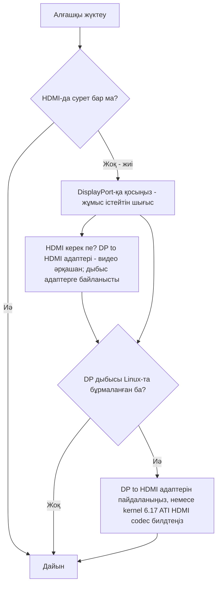

> 🌐 Қауымдастық аудармасы. Ағылшын нұсқасы — шындық көзі әрі жаңарақ болуы мүмкін. Қате таптыңыз ба? Issue ашыңыз: [English](../en/14-display.md) · [issues](https://github.com/lildebil0/awesome-bc250/issues)

# Дисплей және шығыс

> **TL;DR** — BC-250 мониторыңызды **DisplayPort** арқылы басқарады. Қосатын ажыратқыш — осы. Егер тақтаңызда HDMI порты да болса, ол **жиі ештеңе көрсетпейді** — сондықтан ондағы қара экран — өлген тақта *емес*, сіз жай ғана қате шығыстасыз. HDMI керек пе? **DP→HDMI адаптерін** пайдаланыңыз — **видео әрқашан өтеді, кідіріссіз**; кейбір адаптерлер **дыбысты** да тасымалдайды (тексерілгені тасымалдады, [src](https://t.me/c/2424231195/9148)), бірақ дыбыс нақты адаптерге байланысты, сондықтан оған сенбеңіз (дыбыс бөлімін қараңыз). Бір нақты қызық жайт: **DisplayPort дыбысы Linux-та бұрмаланып/баяулап шығады**; дәл сол DP→HDMI адаптері оны айналып өтеді, ал ядро жағындағы дұрыс түзету шамамен **kernel 6.17** маңында келеді ([src](https://t.me/c/2424231195/17953), [src](https://t.me/c/2424231195/68051)).

«Алғашқы жүктеуде сурет жоқ» — **№1 жаңадан келгендердің дүрбелеңі**. Бірдеңе бұзылды деп шешер алдында төмендегі қорапты оқыңыз.

---

## Сурет жоқ па? Мынаны істеңіз

1. **HDMI-ға емес, DisplayPort-қа қосыңыз.** BC-250-дің жұмыс істейтін видео шығысы — DisplayPort ([src](https://t.me/c/2424231195/104784)). HDMI порты (бар болса) — әдетте бос тұратыны — тақтаны соған қарап бағаламаңыз.
2. **Картаны қайта отырғызып, қайталап көріңіз.** Тақталар алғашқы әрекетте іске қосылмауы — қалыпты жағдай — қуатты толық өшіріп-қосыңыз (толық off/on) және физикалық тұрғыдан қайта отырғызыңыз. Бір иесі: *«меніңкі келгенде де алғашқы әрекетте қосылмады … кейде батырмамен қайта жүктегенде толық іске қосылмайды — off/on түзетеді»* ([src](https://t.me/c/2424231195/15701)).
3. **Тақтадан бұрын кабельге/адаптерге күдіктеніңіз.** Жалғыз картамен жарамсыз кабель немесе адаптер — басты күдікті ([src](https://t.me/c/2424231195/15699)). Кейбір адаптерлер микробағдарламада жұмыс істейді, бірақ ОЖ жүктелгенде қарайып кетеді — *«сурет GRUB-қа дейін жақсы болды, жүйеде қара экран»* ([src](https://t.me/c/2424231195/38184)).
4. **BIOS-ты қалпына келтіріңіз / белгілі-жақсы кескінді қайта жазыңыз**, егер партиядағы бірнеше карта сурет бермесе — бұл сіздің мониторыңызға емес, микробағдарламаға нұсқайды ([src](https://t.me/c/2424231195/15697), [src](https://t.me/c/2424231195/15705)).

Егер барлық төртеуін белгілеп, әлі де ештеңе болмаса, [troubleshooting.md](troubleshooting.md)-ке өтіңіз.



---

## Шығыстарға жалпы шолу

| Шығыс | Жұмыс істей ме? | Ескертпелер |
|--------|--------|-------|
| **DisplayPort** | **Иә — шығыс осы** | Негізгі/жалғыз дисплей ажыратқышы; дыбыс тасымалдайды. Репо I/O спецификациясы `1x DisplayPort` тізімдейді ([repo](https://github.com/mothenjoyer69/bc250-documentation)). Бұл — **DisplayPort 1.4**, төбесі **4K@120 Hz**, HDR10-мен ([elektricM](https://github.com/elektricM/amd-bc250-docs/blob/main/docs/hardware/display.md)). |
| **HDMI порты** (орнатылса) | **Жиі бос** | Жаңадан келгендер тақта өлген деп ойлайды; әдетте олай емес — DP-ге ауысыңыз. ([src](https://t.me/c/2424231195/104784)) |
| **Адаптер арқылы DP → HDMI** | **Видео: иә. Дыбыс: адаптерге байланысты** | Видео кідіріссіз өтеді ([src](https://t.me/c/2424231195/9148)); дыбыс чипсетке тәуелді — оны тексеріңіз (дыбыс бөлімін қараңыз). Сондай-ақ DP дыбысының бұрмалануының стандартты түзетуі (төменде). |
| **Екінші видео шығысы** | **Қораптан шыққан күйде емес** | Электрлік тұрғыдан бар, бірақ **орнатылмаған**; 2-ші мониторды мәжбүрлеу хактарды қажет етеді, ал басқалар чипте нақты 2-ші бас жоқ дейді — жалғыз шығысты қауіпсіз болжам ретінде қабылдаңыз. ([src](https://t.me/c/2424231195/92978), [src](https://t.me/c/2424231195/104682)) |
| **Желі арқылы екінші экран** | **Иә** | BC-250-дің шығысын LAN арқылы басқа машинаға таратыңыз (Steam/Sunshine). ([src](https://t.me/c/2424231195/23660)) |

---

## Ажыратымдылықтар, жаңару және кабель

elektricM-нің анықтамасы жалғыз DP байланысы нақты не істейтінін айқындайды — монитор немесе адаптер таңдағанда пайдалы ([elektricM](https://github.com/elektricM/amd-bc250-docs/blob/main/docs/hardware/display.md)):

| Ажыратымдылық | Жаңару | Жол |
|------------|---------|------|
| 1920×1080 (1080p) | 144 Hz+ | Жергілікті DP, немесе кез келген адаптер |
| 2560×1440 (1440p) | 144 Hz+ | Жергілікті DP (пассивті адаптерлер жиі 1440p@60 / DP 1.2-де шектеледі) |
| 3840×2160 (4K) | 60 Hz | Жергілікті DP, немесе **белсенді** DP→HDMI 2.0 адаптер |
| 3840×2160 (4K) | 120 Hz | **Тек жергілікті DP** — HDMI арқылы 4K@120 үшін белсенді DP 1.4→HDMI 2.1 адаптер қажет, әрі ол тұрақсыз |

- **Кабель:** **VESA-сертификатталған DisplayPort 1.4** кабелін, **1–2 м** пайдаланыңыз; ұзынырақ кабельдер синхрондау/үзіліс мәселелерін тудырады ([elektricM](https://github.com/elektricM/amd-bc250-docs/blob/main/docs/hardware/display.md)).
- **Төмен ажыратымдылықта кептеліп қалу** (мысалы, 1024×768/1080p, тек 60 Hz) әдетте GPU драйвері жүктелмегенін білдіреді — `glxinfo | grep "OpenGL renderer"` тексеріңіз; `llvmpipe` = бағдарламалық рендеринг, Mesa 25.1+ орнатыңыз және `nomodeset` алып тастаңыз ([elektricM](https://github.com/elektricM/amd-bc250-docs/blob/main/docs/troubleshooting/display.md)). [06-linux.md](06-linux.md) қараңыз.
- **HDR (HDR10) және VRR** жұмыс істейді, бірақ Linux-та эксперименттік — **KDE Plasma 6+** ең жақсы қолдауға ие әрі әдетте Wayland сеансын қажет етеді ([elektricM](https://github.com/elektricM/amd-bc250-docs/blob/main/docs/hardware/display.md)). **Мұнда дистрибутив маңызды:** r/BC250Gaming (Reddit) қауымдастық есебі **HDR + VRR-ді тек CachyOS-та** (Plasma 6 + Wayland) дұрыс жұмыс істетті, ал **Bazzite-те HDR графикалық ақаулар тудырды, әрі VRR мүлдем жұмыс істемеді**. Олардың мысалы: *Forza Horizon 6* **1440p High, HDR + VRR қосулы, 60–80 FPS** күйінде **UGREEN DP→HDMI 2.1** адаптері арқылы. Егер HDR/VRR басымдық болса, [06-linux.md](06-linux.md)-тегі CachyOS ескертпесін қараңыз.
  - **Егер сіз Bazzite KDE-де болсаңыз және HDMI арқылы VRR/FreeSync қаласаңыз**, AMD-тің HDMI 2.1 / FRL ядро жұмысын ауыстыратын қауымдастық ремиксі бар: **[`dyllan500/bazzite-amd-hdmi-kde`](https://github.com/dyllan500/bazzite-amd-hdmi-kde)** — AMD-тің ресми HDMI-2.1 VRR патчтарын (`amd-staging-drm-next`-тен) тасымалдайтын ядрода қайта билдтелген Bazzite KDE кескіні. ⚠ **қатты сақтықпен:** бұл — үшінші тарап кескіні, автор VRR-ді тек **Radeon 9070 XT**-те тексерді (BC-250-де емес), әрі патчтар стандартты Bazzite ядросына келгенде ескіруге арналған. Бұл — BC-250 үшін расталған түзету *емес* — оны кепілдік емес, байқап көретін эксперименттік жол ретінде қабылдаңыз.

> **Кіргеннен *кейінгі* қара экран (GRUB пен кіру экраны жақсы болды)** — жұмыс үстелі сеансының мәселесі, әдетте **Wayland** — кіру тетігінде «GNOME on Xorg»/«Plasma (X11)» таңдаңыз, немесе `/etc/gdm/custom.conf`-та `WaylandEnable=false` орнатыңыз ([elektricM](https://github.com/elektricM/amd-bc250-docs/blob/main/docs/hardware/display.md)). Кіруден *бұрынғы* қара экран — жоғарыдағы драйвер/`nomodeset` мәселесі, бұл емес.

---

## DisplayPort дыбысы бұрмаланған — адаптер түзетуі

Linux-та **тікелей DisplayPort-тан** жіберілген дыбыс BC-250-де дұрыс емес шығады — бұрмаланған, *«созылған, жартылай жылдамдыққа баяулағандай»*, сытырмен сипатталады ([src](https://t.me/c/2424231195/9895)). Бұл — **Linux/DP-протокол мәселесі, тақта ақауы емес** — ол BC-250 емес аппаратурада да байқалды ([src](https://t.me/c/2424231195/15983)).

Чат тоқтаған дөрекі, сенімді шешім: **сигналды DP→HDMI адаптері арқылы өткізіңіз.** HDMI-ға түрлендірілгенде дыбыс артефактілері жоғалады ([src](https://t.me/c/2424231195/17953), [src](https://t.me/c/2424231195/51763)). Бір пайдаланушы оны тікелей тексерді: *«Дыбысты DisplayPort→HDMI адаптері арқылы шығардым. Бәрі жақсы, кідіріс жоқ»* ([src](https://t.me/c/2424231195/9148)).

**Барлығының ішіндегі ең таза жол — тура DP→HDMI *кабелі* — бір ұшында DP ажыратқыш, екіншісінде HDMI ажыратқыш, екі ұшында да адаптер донгл немесе қорап жоқ.** r/linux_gaming қауымдастық ағынындағы бірнеше пайдаланушы тәуелсіз түрде бұл ең сенімді дыбыс беретінін хабарлайды: жай кабель (мысалы, Amazon Basics DP-to-HDMI кабелі, ~$10) донгл стиліндегі адаптерлер кездейсоқ болатын жерде «жай ғана жұмыс істейді». Анда-санда қысқа дыбыс өшулері әлі де болуы мүмкін, бірақ біртұтас кабель донгл жолын құмар ойынға айналдыратын қосымша адаптер чипсетін алып тастайды ([r/linux_gaming](https://www.reddit.com/r/linux_gaming/comments/1nvsgji/)). Егер бәрібір сатып алып жатсаңыз, **донглдан гөрі кабельді таңдаңыз.**

**Егер қолыңызда адаптер болмаса,** дыбысты оның орнына **Bluetooth** арқылы бағыттаңыз — көп динамиктер/гарнитуралар оны қолдайды әрі ол DP жолын мүлдем айналып өтеді ([src](https://t.me/c/2424231195/89769)). BT донгл үшін [10-wifi-bt.md](10-wifi-bt.md) қараңыз.

### Адаптер ескертпелері (қауымдастық)
- **4K@60+ үшін сізге *белсенді* адаптер/кабель керек** (пассивті ~1440p@60-те шектейді). Жұмыс істейтін, тексерілген мысал: **UGREEN DP125 (DP→HDMI 4K кабелі)** — 4K@30 деп бағаланған, бірақ теледидарда 4K@60 келісті ([src](https://t.me/c/2424231195/52398)). Белсенді vs пассивті ажыратымдылық төбесін орнатады — ол дыбыстың өтетін-өтпейтінін **шешпейді** (төменде қараңыз).
- **Барлық адаптерлер дыбыс тасымалдамайды.** Бір иесінің Belsis адаптері 4K@60-ты дыбыспен *бірге* өткізді, ал бірнеше қымбатырақ Ugreen құрылғылары құрылғылар тізімінде «HDMI digital audio» көрсетті, бірақ дыбыс шығармады — ал біреуі дауыстарды бір октаваға төмендетті ([src](https://t.me/c/2424231195/106617)). Егер видео алсаңыз, бірақ дыбыс болмаса, адаптер — өзгермелі шама — басқасын байқап көріңіз.
- **HDMI *дыбысы* үшін алдымен *пассивті* адаптерге жүгініңіз.** r/linux_gaming ағынындағы қауымдастық үлгісі: **пассивті** DP→HDMI адаптерлері дыбысты таза өткізуге бейім, ал **белсенді** адаптерлер жиі **дыбысты мүлдем түсіріп тастайды немесе оның биіктігін жылжытады** (дауыстар ~20% / шамамен квинтаға төмен сырғығаны хабарланды). Қиындық: сізге белсенді адаптер тек нақты **HDR** үшін (және 4K@60+ үшін) *керек*, сондықтан бұл — нағыз айырбас — сенімді дыбыс үшін пассивті, HDR үшін белсенді. Қауымдастық-растаған-жұмыс істейтін *пассивті* нұсқалар: **Silver Monkey**, **BENFEI (ASIN B017Q8ZVWK)** және **AmazonBasics DP-to-HDMI _кабелі_** (біртұтас кабель — олардың донгл стиліндегі адаптері *емес*) ([r/linux_gaming](https://www.reddit.com/r/linux_gaming/comments/1nvsgji/)). ⚠ нақты SKU-лар қауымдастық хабарлаған, мұнда зертханада тексерілмеген — әрі пассивті адаптер бәрібір ~**1440p@60**-те шектеледі.
- Видеоны да, дыбысты да өткізетін арзан **4K@60 DP→HDMI** адаптерлері бар әрі олар жұмыс істейді деп хабарланады ([src](https://t.me/c/2424231195/133977)).
- Кейбір адаптерлер дәл **4K мониторларда** дұрыс жұмыс істемейді ([src](https://t.me/c/2424231195/1988)).
- **DP→HDMI адаптері арқылы дыбыс тұрақсыз әрі адаптердің чипсетіне байланысты — жай белсенді vs пассивтіге емес.** Видео әрқашан өтеді; **дыбыс — өзгермелі шама.** Біздің қауымдастық есептеріміз адаптер-бойынша (UGREEN/Belsis құрылғылары дыбыс тасымалдады деп хабарланды, кейбір басқа құрылғылар үнсіз), ал elektricM нұсқаулығы *керісінше* бөлуді хабарлайды (пассивті дыбыс тасымалдайды, кейбір белсенді құрылғылар үнсіз — мысалы, Cable Matters/StarTech) — бұл дәл белсенді/пассивті жапсырмасы оны болжамайтынының себебі ([elektricM](https://github.com/elektricM/amd-bc250-docs/blob/main/docs/troubleshooting/display.md)). **Сенімді** дыбыс үшін адаптерге сенбеңіз: **DisplayPort-жергілікті дисплей/AV ресиверін** таңдаңыз, немесе дыбысты **USB (USB DAC/дыбыс құрылғысы)** арқылы шығарыңыз. Егер адаптер пайдалансаңыз, **оған сенер алдында дыбысты тексеріңіз** — әрі **пассивті** адаптердің ~**1440p@60**-те шектелетінін есте сақтаңыз.

### kernel-6.17 түзетуі (DP-тікелей дыбыс, адаптерсіз)

Егер сіз адаптерсіз **тура DisplayPort арқылы** таза дыбыс қаласаңыз, себеп пен түзету чатта табылды. Fedora-ның стандартты ядро конфигурациясы `snd-hda-codec-hdmi.ko` + `snd-hdmi-lpe-audio.ko` билдтеді; **kernel 6.17 HDMI дыбыс жолын өзгертті** әрі сол әдепкі конфигурацияда дыбысты бұзды. Түзету — **ATI HDMI codec** те билдтеу — ядро конфигурациясын `# CONFIG_SND_HDA_CODEC_HDMI_ATI is not set`-тен `CONFIG_SND_HDA_CODEC_HDMI_ATI=m`-ге аудару, ол `snd-hda-codec-atihdmi.ko` пакеттейді; содан кейін дыбыс **патчтарсыз** жұмыс істейді ([src](https://t.me/c/2424231195/68051), [src](https://t.me/c/2424231195/68061)).

```text
# Fedora kernel config change for DP/HDMI audio on kernel 6.17+
# from:
# CONFIG_SND_HDA_CODEC_HDMI_ATI is not set
# to:
CONFIG_SND_HDA_CODEC_HDMI_ATI=m
```

Сол үшінші кодек (`snd-hda-codec-atihdmi.ko`) болғанда, ALSA тақтаның дыбыс шығыстарын ашады (мысалы, `pcm=3` және `pcm=7` екі HDMI құрылғысы ретінде) ([src](https://t.me/c/2424231195/68062), [src](https://t.me/c/2424231195/67569)). ⚠ verify — бұл арнайы ядро билдтеуді қажет етеді; көпшілік пайдаланушы үшін DP→HDMI адаптерін билдсіз жол ретінде қабылдаңыз. Ядро/драйвер орнату үшін [06-linux.md](06-linux.md) қараңыз.

### Көлемді дыбыс (5.1) — HDMI емес, USB дыбыс картасын пайдаланыңыз

**HDMI арқылы 5.1 көлемді дыбыс BC-250-де жұмыс істе*мейді*.** Бұл дисплейсіз/майнинг кристалы үшін AMD-тің Linux-тағы HDMI микробағдарламасы көп арналы LPCM ашпайды, сондықтан ресивер не қолдаса да, HDMI шығысы қарапайым стереоға қайтады ([r/linux_gaming](https://www.reddit.com/r/linux_gaming/comments/1nvsgji/)). Нақты көп арналы үшін дыбысты оның орнына **USB дыбыс картасы / USB DAC** арқылы шығарыңыз — оны `pavucontrol`-да әдепкі sink ретінде орнатыңыз, содан кейін барлық алты арнаны мынамен растаңыз:

```bash
speaker-test -D pipewire -c 6 -t wav
```

Дәл сол USB-DAC жолы — адаптерлер дұрыс жұмыс істемегенде (жоғарыда) стерео дыбыстың да сенімді түзетуі.

---

## Екінші шығыс (бастапқыда белсенді емес)

Тақтада **қораптан шыққан күйде белсенді емес екінші видео шығысы** бар. Қауымдастықтың оқылымы бөлінген әрі екі жартысын да білген жөн:

- Ол **электрлік тұрғыдан бар, бірақ орнатылмаған/дәнекерленбеген**, әрі *«хактармен 2-ші мониторды жұмыс істетуге болады»* ([src](https://t.me/c/2424231195/92978)).
- Басқалар чипте жай **жарамды екінші бас жоқ** деп хабарлайды — *«мәселе чипте, екінші шығыс физикалық тұрғыдан жоқ»* ([src](https://t.me/c/2424231195/104682)).

Іс жүзінде: **бір DisplayPort шығысын болжаңыз.** Екі тәуелсіз экранға арналған DP **MST бөлгіші туралы сұралды, бірақ біздің чатта жұмыс істейтіні расталмады** ([src](https://t.me/c/2424231195/92109)).

**elektricM-нен жаңарту — MST дұрыс хабпен екі экранды басқара алады.** elektricM-нің тестілеуі **DP MST хабы арқылы 2 дисплейге** дейін хабарлайды (өткізу қабілеті ортақ, әр дисплейге ажыратымдылық шектеулі), хаб-бойынша нәтижелермен ([elektricM](https://github.com/elektricM/amd-bc250-docs/blob/main/docs/hardware/display.md)):

| MST хабы | Шығыс | DP нұсқасы | Тәуелсіз дисплейлер? | Дыбыс | Ескертпелер |
|---------|-----|--------|-----------------------|-------|-------|
| StarTech MST14DP122DP | 2× DP | 1.4 | **Иә** | Иә | Мониторлар/кабельдер бойынша тұрақты жұмыс істеді |
| Monoprice 21972 | 2× DP | 1.2 | **Тек айна** | Иә | Тек айналай алды |
| ENBUER | 2× DP | 1.2 | **Тек айна** | Иә | Тек айналай алды |
| Generic HDMI MST | 2× HDMI | — | **Жоқ** | Жоқ | Видео да, дыбыс та жоқ |

Сонымен, жергілікті қос монитор DP 1.4 хабы арқылы MST-пен **мүмкін** (StarTech расталды); арзанырақ DP 1.2 хабтары тек айналауы мүмкін, ал HDMI MST хабтары сәтсіздікке ұшырады. ⚠ verify — жалғыз расталған хаб моделі; нәтижелер хабқа қарай әртүрлі.

**Басқа көп дисплейлі жол — USB DisplayLink адаптері.** Қосымша **жұмыс үстелі** экраны үшін USB→HDMI/DP DisplayLink адаптерін қосыңыз (ең жақсы нәтиже үшін жүктеуден *кейін* қосыңыз). **Ойынға арналмаған** — ол CPU-да қысады, ал бұл — BC-250-дің тар жері, сондықтан кідіріс жоғары; ол сондай-ақ Steam Deck **game mode**-та жұмыс істемейді ([elektricM](https://github.com/elektricM/amd-bc250-docs/blob/main/docs/hardware/display.md)).

---

## Желі арқылы екінші экран (оңай «2-ші дисплей»)

Егер сіз BC-250 суретін екінші құрылғыда шынымен қаласаңыз, дәлелденген жол — екінші кабель емес — ол **LAN арқылы тарату.** Бір пайдаланушы: *«BC-250-де (Fedora) Steam ойынын іске қостым да, оны желі арқылы жұмыс ноутбугіме таратып, ноутбуктен басқардым. Бәрі жұмыс істеді»* ([src](https://t.me/c/2424231195/23660)).

- **Sunshine** (хост кодер) мұнда жұмыс істейді, өйткені ол тек NVIDIA емес — ол кодтауды жасайды, клиент жай декодтайды ([src](https://t.me/c/2424231195/25091)). Гигабиттік LAN арқылы ол дерлік мінсіз деп хабарланады ([src](https://t.me/c/2424231195/25563)).
- **Moonlight хост ретінде** сәйкес келме*йді* — ол NVIDIA кодерін күтеді әрі жетіспейтін аппараттық декодер туралы кідіреді/шағымданады ([src](https://t.me/c/2424231195/25050)). Sunshine-ды хост ретінде, Moonlight-ты тек клиент ретінде пайдаланыңыз.

Бұл сондай-ақ жоғарыдағы орнатылмаған екінші шығыссыз «қос дисплей» сезімін алудың практикалық тәсілі.

---

## Дереккөздер

- DP→HDMI адаптері видео+дыбыс өткізеді, кідіріссіз — https://t.me/c/2424231195/9148
- DP дыбысының бұрмалануы — Linux мәселесі; адаптер оны түзетеді — https://t.me/c/2424231195/17953 · https://t.me/c/2424231195/9895 · https://t.me/c/2424231195/51763 · https://t.me/c/2424231195/15983
- Kernel 6.17 дыбыс түзетуі (`CONFIG_SND_HDA_CODEC_HDMI_ATI=m`) — https://t.me/c/2424231195/68051 · https://t.me/c/2424231195/68061 · https://t.me/c/2424231195/68062 · https://t.me/c/2424231195/67569
- Жұмыс істейтін адаптерлер — UGREEN DP125 https://t.me/c/2424231195/52398 · Belsis vs басқалар (дыбыс әртүрлі) https://t.me/c/2424231195/106617 · арзан 4K@60 https://t.me/c/2424231195/133977
- DP — жұмыс істейтін шығыс; жақсы DP→HDMI адаптеріне шығындаңыз — https://t.me/c/2424231195/104784
- Алғашқы жүктеуде сурет жоқ / қайта отырғызу / қайта жазу — https://t.me/c/2424231195/15697 · https://t.me/c/2424231195/15699 · https://t.me/c/2424231195/15701 · https://t.me/c/2424231195/38184
- Екінші шығыс бар, бірақ орнатылмаған / талас — https://t.me/c/2424231195/92978 · https://t.me/c/2424231195/104682 · MST сұралды https://t.me/c/2424231195/92109
- Желілік екінші экран (LAN арқылы Sunshine/Steam) — https://t.me/c/2424231195/23660 · https://t.me/c/2424231195/25091 · https://t.me/c/2424231195/25050 · https://t.me/c/2424231195/25563
- Балама ретінде Bluetooth дыбысы — https://t.me/c/2424231195/89769
- Тура DP→HDMI **кабелі** (адаптерсіз) — ең сенімді дыбыс; HDMI арқылы 5.1 жұмыс істемейді (көп арналы LPCM жоқ), USB дыбыс картасын / DAC пайдаланыңыз — r/linux_gaming қауымдастық ағыны https://www.reddit.com/r/linux_gaming/comments/1nvsgji/
- Аппараттық I/O анықтамасы (`1x DisplayPort`) — [mothenjoyer69/bc250-documentation](https://github.com/mothenjoyer69/bc250-documentation) · [`hardware.md`](https://github.com/mothenjoyer69/bc250-documentation/blob/main/hardware.md)
- DP 1.4 / 4K@120 / HDR10, ажыратымдылық+кабель шектеулері, MST хабтары (макс 2), DisplayLink, Wayland-кіру қара экраны — elektricM [`hardware/display.md`](https://github.com/elektricM/amd-bc250-docs/blob/main/docs/hardware/display.md)
- HDR + VRR CachyOS-та жұмыс істейді (Plasma 6 + Wayland) vs Bazzite-те бұзылған; Forza Horizon 6 1440p High HDR+VRR UGREEN DP→HDMI 2.1 арқылы — r/BC250Gaming (Reddit) қауымдастық есебі ([06-linux.md](06-linux.md) қараңыз)
- Пассивті DP→HDMI дыбыс тасымалдайды / белсенді оны түсіреді немесе биіктігін жылжытады; пассивті, бірақ HDR үшін қажет; расталған пассивтілер Silver Monkey / BENFEI B017Q8ZVWK / AmazonBasics DP-to-HDMI кабелі — [r/linux_gaming қауымдастық ағыны](https://www.reddit.com/r/linux_gaming/comments/1nvsgji/)
- HDMI арқылы Bazzite KDE VRR/FreeSync ремиксі (AMD HDMI 2.1 ядросы; 9070 XT-те тексерілді, BC-250-де емес) — [`dyllan500/bazzite-amd-hdmi-kde`](https://github.com/dyllan500/bazzite-amd-hdmi-kde)
- Адаптер дыбысы чипсетке тәуелді (elektricM пассивті оны тасымалдағанын / кейбір белсенді үнсіз көрді; қауымдастық керісінше көрді — сондықтан DP-жергіліктіні немесе USB DAC таңдаңыз), төмен ажыратымдылықты llvmpipe тексеруі — elektricM [`troubleshooting/display.md`](https://github.com/elektricM/amd-bc250-docs/blob/main/docs/troubleshooting/display.md)

> Драйвер/ядро орнату [06-linux.md](06-linux.md)-те; дыбыс/шығыс қызық жайттары [troubleshooting.md](troubleshooting.md) мен [faq.md](faq.md)-те де индекстелген.
