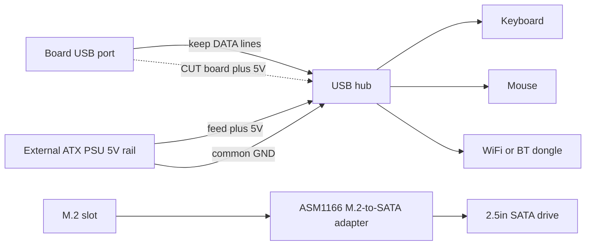

> 🌐 Қауымдастық аудармасы. Ағылшын нұсқасы — шындық көзі әрі жаңарақ болуы мүмкін. Қате таптыңыз ба? Issue ашыңыз: [English](../en/16-usb-peripherals.md) · [issues](https://github.com/lildebil0/awesome-bc250/issues)

# USB, хабтар және перифериялар

> **TL;DR** — Тақта сізге **4 артқы USB порт (2× USB 2.0 + 2× USB 3.0)** береді, болғаны сол — әдепкіде ешқандай ішкі ұялар сымдалмаған. WiFi/BT донгл, USB арқылы SSD, пернетақта, тінтуір және контроллер бұларды тез жейді, сондықтан дерлік әркім **USB хаб** қосады. Мәселе мынада: тақтаның **5 V USB рейлі әлсіз** әрі жүктеме кезінде отырып қалады, сондықтан арзан шинадан қоректенетін хабтар (тіпті тікелей жалғанған флеш-дискілер де) үзіледі. Сенімді шешімдер, рет бойынша: **қуатпен жабдықталған (актив) хаб**, немесе қауымдастықтың **5 V-инъекция моды** — хаб тақтадан алатын 5 V-ты қиып, оның орнына ATX PSU-дан 5 V беру. ([src](https://t.me/c/2424231195/119741))

Бұл — **аксессуарлар** беті. Хабты дұрыс таңдаңыз, қалғаны (аудио, USB арқылы Ethernet, доктар) жай ғана істейді.

---

## Сізге іс жүзінде қанша USB порт бұйырады

Аппараттық анықтамаға сай, артқы I/O — **1× DisplayPort, 1× GbE Ethernet, 2× USB 2.0, 2× USB 3.0**. Яғни төрт физикалық USB порт. ([hardware.md](https://github.com/mothenjoyer69/bc250-documentation/blob/main/README.md))

Іс жүзінде адамдар таласатыны — екі **USB 3.0** порты (жылдамырақ, SSD-лер/доктар үшін қолданылады), әрі олар электрлік тұрғыдан **тар** сымдалған — бір иесі қосқышты іс жүзінде «x2» деп сипаттайды әрі оған сплиттер ілуден сақтандырады. ⚠ лейн енінің нақты мәнін тексеріңіз. ([src](https://t.me/c/2424231195/75561))

Портқа не таласатынын тізсеңіз, қысым нақты сезіледі: **SSD қостыңыз — бір порт жоқ; USB WiFi донгл, джойстик, сыртқы диск қостыңыз — сізге хаб керек, әйтпесе портты күйдіріп алу қаупіне барасыз.** ([src](https://t.me/c/2424231195/75558)) Адамдар үнемі «бүкіл USB 3.0 бос емес, пернетақта мен тінтуір хаб арқылы жүреді» деп хабарлайды. ([src](https://t.me/c/2424231195/110875))

Қораптан **алдыңғы панель USB ұялары бекітілмеген** — бірақ корпуста/тақтада хаб кабелін алдыға шығаруға арналған орын анық бар, оны бірнеше корпусты құрастыру пайдаланады. ([src](https://t.me/c/2424231195/91322)) · ([src](https://t.me/c/2424231195/100249))

---

## Нағыз мәселе: 5 V USB рейлі әлсіз

BC-250 **USB үшін 5 V-ты тақтаның өзінде** жасайды ([src](https://t.me/c/2424231195/57920)), әрі ол рейл көп бере алмайды. Чаттағы ең анық өлшеу, құрылғыларды санамайтын тақтада:

> «Менің BC-250-ім USB-де дұрыс 5 V бермейді… тек пернетақта істейді; тінтуір қоссам, пернетақта сөнеді. Тек пернетақтамен ~**4.3 V**, пернетақта + тінтуірмен **2.3 V–3.2 V**, екеуін де алып тастағанда **5.1 V**.» ([src](https://t.me/c/2424231195/119071))

Кернеудің осы отыруы — симптомдар неге **жүктеме** айналасында топтасатынының себебі: флеш-дискілер мен микрофондар **тікелей қосқанда түсіп қалады, бірақ хаб арқылы жақсы істейді**, пернетақталар LED-терін жоғалтады, екі нәрсе бір мезетте ток тартқан сәтте құрылғылар үзіледі. ([src](https://t.me/c/2424231195/53939)) Дәл осы қуатқа сезімталдық WiFi донглдерін тұрақсыз етеді — **[10-wifi-bt.md](10-wifi-bt.md)** қараңыз, онда стиктер бос тұрғанда істеп, жүктеп алу шыңында үзіледі.

> ⚠ Әр тақта мұншалықты нашар емес. Бір иесі тақтаның USB-сінен **WiFi донгл + сымды пернетақта + тінтуір қуатсыз хаб арқылы + 14″ дисплей + 3.5″ қосалқы экранды** қоректендіріп, мұның жақсы істейтінін хабарлайды. ([src](https://t.me/c/2424231195/119231)) Өз тақтаңызды жүктеп көргенше белгісіз деп санаңыз.

---

## Хаб таңдау: қуатпен жабдықталған ба, әлде жабдықталмаған ба

| Хаб түрі | Қашан істейді | Үкім |
|----------|---------------|------|
| **Қуатсыз (шинадан қоректенетін)** | Жеңіл жүктемелер — пернетақта, тінтуір, донгл. Кейбір тақталар осылай таңғаларлық көп нәрсе тартады. ([src](https://t.me/c/2424231195/119231)) | Алдымен сынап көруге болады; диск қосқан немесе жүктеме шыққан сәтте **үзілулер күтіңіз**. |
| **Қуатпен жабдықталған / актив (сыртқы 5 V брик)** | Дискілері, бірнеше донглі бар немесе жүктеме кезіндегі кез келген нәрсе. BC-250 үшін қауымдастықтың тұрақты ұсынысы. ([src](https://t.me/c/2424231195/75558)) · ([src](https://t.me/c/2424231195/119229)) | **Мұны сатып алыңыз.** Тақтаға тиіспей-ақ отыруды шешеді. ([src](https://t.me/c/2424231195/140091)) |
| **5 V-инъекция моды** (төменде қараңыз) | Тұтастай ATX PSU-дан қоректенетін таза, корпусты құрастыру қалаған әрі екінші қабырға блогын қаламаған кезде. | Ең жақсы интеграция, дәнекерлеуді қажет етеді. ([src](https://t.me/c/2424231195/119741)) |

Біреудің USB құрылғылары дұрыс істемегенде қайталанатын кеңес мынадай: **қуат адаптері кірісі бар актив USB хабын алыңыз.** ([src](https://t.me/c/2424231195/119229)) Бірнеше иесі үзілулермен күрескеннен кейін осыған келді — «сыртынан қоректенетін хабпен шешілді.» ([src](https://t.me/c/2424231195/123789))

> Чатта айтылған бір ескерту: сыртынан қоректенетін хабқа арқа сүйеу **тұрақты** болуы мүмкін — USB қуатын сыртқа ауыстырғаннан кейін, сол хабпен біржола қалсаңыз таңғалмаңыз. ([src](https://t.me/c/2424231195/123924)) Жұмыс үстелі құрастыруы үшін бұл жақсы айырбас.

---

## 5 V-инъекция моды (кәдімгі хабты дұрыс ұстануға мәжбүрлеу)

Бұл — **ATX/SFX PSU-дан қоректеніп тұрған корпусты құрастыру** үшін талғампаз шешім: өзінің қабырға адаптері бар актив хабты сатып алудың орнына, кәдімгі хабты алып, оның **5 V-ы қайдан келетінін ауыстырасыз**.

Бір қолданушы не істегені, әрі ол істегені ([src](https://t.me/c/2424231195/119741)):

> «Мен кәдімгі USB хабты модификацияладым, ол істеді. Мен **аналық тақтадан келетін 5 V-ты қиып, PSU-дан 5 V бердім**. Жерлендіруді жалғаудың қажеті болмады, өйткені BC-250-імді дәл сол ATX PSU-мен қоректендіремін.»

Қалай істейді:

1. Хабты ашыңыз; **жоғары ағыс** жағында (тақтаға жалғанатын кабель) **5 V (VBUS)** трасса/сымын табыңыз.
2. Хаб енді тақтаның әлсіз рейлінен қуат тартпайтындай **сол 5 V-ты қиыңыз**.
3. Хабқа **ATX PSU-дан +5 V** беріңіз (қосалқы SATA/Molex 5 V линиясы).
4. **Жерлендіру автоматты түрде ортақ**, өйткені сол PSU тақтаны қазірдің өзінде қоректендіреді — қосымша жерлендіру сымы керек емес. (Егер хабты *бөлек* көзден қоректендірсеңіз, жерлендіруді **міндетті түрде** ортақ қылуыңыз керек.)

Деректер линиялары тиілмеген күйде қалады — сіз тек қуат көзін ғана өзгертесіз. Тақта оның 5 V рейлін енді жүктемейтін хабты көреді, ал құрылғылар PSU-дан таза, мол қуат алады.



> ⚠ Қате трассаны қию хабты бұзады (арзан) — бірақ **VBUS-ты қиғаныңызға, деректер линиясын емес** екеніне көз жеткізіңіз. Дәнекерлеуден бұрын мультиметрмен қайта тексеріңіз.

---

## Аулақ болатын қоқыс

- **Hoco хабтары** — сенімсіз деп аталды; бір иесі **сол бір Hoco хабты екі рет қайта дәнекерлеуге мәжбүр болды**. ([src](https://t.me/c/2424231195/74531))
- **Шын мәнінде «USB 3.0» емес хабтар** — 160 ₽ AliExpress «USB 3.0 хаб/док» сол бағада **анық нағыз 3.0 емес** деп белгіленді. ([src](https://t.me/c/2424231195/8761)) · ([src](https://t.me/c/2424231195/8764))
- **Хабтарды тізбектеп** порттарды көбейту — идея ретінде көтерілді ([src](https://t.me/c/2424231195/104653)), бірақ ол қуат мәселесін үстемелейді; енді бір әлсіз рейл екі хабты қоректендіреді. Оның орнына бір жақсы қуатпен жабдықталған хабты пайдаланыңыз.
- **M.2 ұясынан шығатын SATA-сплиттер «хабтары»** — қайталанатын шатасу. M.2-де небәрі **2 PCIe лейн** болғандықтан, SATA контроллерін іліп, оның тарамдалуын күту орынсыз; «сол бір-SATA-кіреді, көп-шығады хабтар — қоқыс.» ([src](https://t.me/c/2424231195/22539)) Бұл USB тақырыбы емес — оны USB кеңейтуімен шатастырмаңыз.
- ★ **M.2→SATA контроллер PH516 (6-порт) — істемейтіні расталды.** Порт санақталады, бірақ диск тіркелмейді, әрі **екінші адам** дәл сол сәтсіздікті **қайталады** ([4pda — Strange999](https://4pda.to/forum/index.php?showtopic=1104980)). Оның орнына қауымдастық ұсынған **ASM1166**-ны сатып алыңыз (қойма бөлімін қараңыз) — PH516 бұл тақтада белгілі бұйыққан жол.

**Кірістірілген аудио кодегі** бар хаб корпусты құрастырулар үшін ыңғайлы орын үнемдеуші (бір құрылғы сізге қосымша порттар *әрі* 3.5 мм ұя береді), әрі адамдар оларды қолданады. ([src](https://t.me/c/2424231195/8751)) Аудио сапасы әртүрлі болады — бұл арзан кодек. ([src](https://t.me/c/2424231195/39708))

---

## USB 3.0 ішкі ұясы (Type-E)

Егер корпусыңызда **алдыңғы USB 3.0 ашасы** болса (20-пинді «Key-A/Type-E» қосқыш), оны тақтаның USB 3.0-нен қоректендіргіңіз келеді. **Туа біткен 20-пин ұясы жоқ**, сондықтан адамдар бейімдейді:

- AliExpress-тегі **USB 3.1 Type-E → USB 3.0 (Type-A) кабелі** — таза жол. Чатта AXONUS 50 см бөлісілді. ([src](https://t.me/c/2424231195/133182)) Сондай-ақ Xiwai Type-E → 20-пин нұсқасы да жарияланды. ([src](https://t.me/c/2424231195/125127))
- Немесе корпустың стандартты кабелін кәдімгі USB 3.1 ашасына **жалғаңыз** — адаптер сай келмегенде «жыланды кірпіге қосу» әдісі. ([src](https://t.me/c/2424231195/135957))

**Күй:** **USB 2.0 істейтіні расталды; USB 3.0 толық сыналуы әлі алда** болатынын хабарлаған иесінде (корпус ішіндегі құрастырудан кейін сынау күтіледі). Адаптер арқылы 3.0-ні өз аппаратыңызда ⚠ тексеру деп қабылдаңыз. ([src](https://t.me/c/2424231195/136215))

---

## Қойма (M.2 ұясы және SATA дискілер)

Тақтаның жалғыз ішкі қойма қосқышы — **бір M.2 ұясы**, әрі ол **PCIe 2.0 ×2** сымдалған — сондықтан практикалық төбе **~1 GB/s** ([src](https://t.me/c/2424231195/66275)) · ([src](https://t.me/c/2424231195/135506)). Жылдам Gen3/Gen4 NVMe *істейді*, бірақ ол мұнда өзінің номиналды жылдамдығына жете алмайды, сондықтан жоғары деңгейлі дискіге ақша төлеудің мәні жоқ. **Кәдімгі NVMe M.2 SSD — ең қарапайым жүктеу дискісі** — оны ұяға салып, оған Linux орнатыңыз (орнату үшін **[06-linux.md](06-linux.md)** қараңыз).

### 2.5″ SATA HDD/SSD жалғау

Тақтада SATA порты жоқ, сондықтан **2.5″ SATA дискіні** (немесе бірнешеуін) ілу үшін M.2 ұясына **M.2 → SATA адаптер картасын** саласыз. Қауымдастықтың расталған таңдауы — **ASM1166 (M.2 PCIe → SATA)** кеңейту картасы ([src](https://t.me/c/2424231195/135180)). Адамдар баратын басқа жол — тікелей тақтаға **кәдімгі M.2 SATA SSD** — адаптерсіз, тек SATA-хаттамалы M.2 стик. ([src](https://t.me/c/2424231195/87411))

Бұл — **жаңадан келгендердің ең жиі сұрақтарының** бірі — *«дискіні тақтаға жалғау үшін маған керек адаптер осы ма?»* және *«дискіні жалғаудың тағы қандай жолдары бар?»* ([src](https://t.me/c/2424231195/135164)) · ([src](https://t.me/c/2424231195/135165)) — сондықтан мұны сұрап жатсаңыз, жалғыз емессіз.

> ⚠ тексеру — ASM1166 картасы — қауымдастық ұсынысы, нақты BC-250-де көп адам сынаған нәтиже емес. Таңдаған адаптеріңіздің санақталатынына және жүктелетініне сүйенбес бұрын соны растаңыз. Сондай-ақ M.2-нің **2 PCIe лейні** бір-SATA-кіреді / көп-шығады *сплиттерді* орынды қоректендіре алмайтынын ескеріңіз — жоғарыдағы **Аулақ болатын қоқыс** бөлімін қараңыз. ([src](https://t.me/c/2424231195/22539))

#### ★ 2.5″ SATA дискіні қоректендіру (тақта тек 12 V)

Жоғарыдағы адаптер картасы **деректерді** өңдейді, бірақ 2.5″ SATA дискіге өзінің SATA-қуат қосқышында **5 V қуат** та керек — ал BC-250 тақтасы тек **12 V** береді, тармақтайтын SATA-қуат ұясы жоқ. Бір құрастырудан алынған практикалық шешім: дискіге **5 V беретін USB→SATA-қуат адаптері**, оны тақтаның 12 V-ынан өндіретін **12 V→5 V түсіруші (buck) түрлендіргішпен** ([TMG HD build](https://youtu.be/OEO0r01zcfU); ⚠ шамалас — видео жүгірдеуінен жатқа айтылған). Басқаша айтқанда: ASM1166 (немесе M.2 SATA стик) SATA *деректерін* алып жүреді; buck-түрлендіргіш + USB→SATA-қуат адаптері SATA *қуатын* алып жүреді. Өзі қоректенетін 2.5″ корпус немесе қуатпен жабдықталған док өзінің 5 V рейлін әкеліп, бүкіл мәселені айналып өтеді.

#### ★ M.2 SATA стикпен SteamOS «no nvme drive detected»

Егер SteamOS-ты NVMe орнына **M.2 SATA SSD-мен** (мысалы, **Kingston SNS41**) жүктесеңіз, орнатушы/жөндеу ағыны **«no nvme drive detected»** қателігімен құлауы мүмкін — SteamOS дискіні NVMe құрылғы (`nvme…`) деп болжайды, бірақ SATA стик `sda` ретінде санақталады. Шешім — жөндеу скриптін өңдеп, оны дұрыс құрылғы атауына бағыттау ([4pda — pornocrat](https://4pda.to/forum/index.php?showtopic=1104980)):

```bash
# Edit the SteamOS repair script and replace the device name nvme -> sda
nano ~/tools/repair_device.sh
# change every "nvme" reference to "sda", save, then re-run the install/repair
```

Бұл — таза құрылғы-атауы сәйкессіздігі — SteamOS-қа `nvme` түйіні емес, `sda`-ны қарауды айтқаннан кейін SATA стик жақсы істейді.

### Ескі SATA дискілер жарайды

M.2 байланысы бәрін бәрібір ~1 GB/s-те шектегендіктен, ескі **2.5″ SATA HDD/SSD** **ойын кітапханасы немесе ескі ойындар** үшін әбден жеткілікті — жоғалтатын жылдамдығыңыз — тақта бере алмайтын жылдамдық. ([src](https://t.me/c/2424231195/132739)) M.2 ұясын бос қалдырғыңыз келсе, **USB-NVMe корпусы** — тағы бір нұсқа, бірақ шынымен NVMe жасайтын (SATA емес) корпустар қымбатырақтан басталады — кішкентай жүктеу стигі үшін бұл тұрмайды. ([src](https://t.me/c/2424231195/111022))

### Intel Optane 16 GB кэш/swap ретінде — қауымдастық идеясы, салқын үкім

Кішкентай **Intel Optane 16 GB NVMe** модулін кэш немесе swap құрылғысы ретінде қолдану идея ретінде көтерілді, салмақты үкіммен ([4pda](https://4pda.to/forum/index.php?showtopic=1104980)): Ozon-да сатылатын **16 GB «Optane» модульдері** мүшелердің өз сынақтарынша **нағыз Optane болып шықпады**, тақтаның **M.2 ұясы баяу** (PCIe 2.0 ×2, ~1 GB/s) болғандықтан латенттік артықшылық тұйықталады, әрі **swap файлы теорияда мүмкін** болғанымен, мұнда ол айқын ұтыс емес. Оны ұсынылатын жаңарту емес, қызықтырушылық деп қабылдаңыз.

---

## Доктар және докинг станциялары

USB-C / Thunderbolt тектес **док** бір семіз хаб (USB + Ethernet + кейде видео) ретінде істей алады, әрі иелер оларды қолданған:

- Бір мүше **Wavlink WL-UG69DK1 USB-C қос-4K докты** қолданады. ([src](https://t.me/c/2424231195/68141))
- **DisplayLink док** **USB хаб + USB дыбыс картасы** ретінде жұмыс істейді; мүше одан видео шығара **алмады** (TPM/BIOS қабырғасына тірелді), сондықтан док *видеосын* сенімсіз деп қабылдаңыз. ([src](https://t.me/c/2424231195/104776))
- Нақты **қосымша мониторлар** үшін док GPU-дың өз шығыс шегін айналып өте алмайды — оған сенбес бұрын **[14-display.md](14-display.md)** қараңыз.

Қорытынды: доктар **қуатпен жабдықталған хаб** ретінде жарайды (олар өз қуатын әкеледі, бұл 5 V мәселесін ұқыпты айналып өтеді). Оның **видео** шығысы істейді деп күтіп сатып алмаңыз.

---

## Контроллерлер және енгізу

Геймпадтар бәрі сияқты дәл сол әлсіз USB рейлін әрі дәл сол тұрақсыз-Bluetooth тарихын мінеді (BT донглдер үшін **[10-wifi-bt.md](10-wifi-bt.md)** қараңыз). Бірнеше нақты тұжырым:

- **DS5Dongle (Raspberry Pi Pico 2W) арқылы Linux-те DualSense.** Бұл ашық донгл DualSense-ке Linux-те оның **HD хаптикасын + динамигін** әрі сұраныс жиілігі / дыбыс деңгейі үшін **веб-UI** береді — бірақ ойын аудиосы үшін бір қыйындық бар: Wine/Proton тайтлдары контроллердің аудиосын тек **Direct режимінде** алады (контроллер жалғыз **4-арналы аудио карта** ретінде көрінеді), әрі **әр дистрибутив сол режимді ашпайды** ([4pda — korotyshev](https://4pda.to/forum/index.php?showtopic=1104980)). Бөлек, ядродағы **`hid-playstation`** драйверіне (туа біткен DualSense қолдауы) адаптерде **Bluetooth ≥ 5.0** керек ([4pda — xDarkman](https://4pda.to/forum/index.php?showtopic=1104980)).
- **GameSir T4 Kaleid + оның 2.4 GHz донглі** — Bluetooth-ты тұтастай айналып өтетін істейтін контроллер/енгізу жолы — BT жұптауымен күресудің орнына 2.4 GHz USB қабылдағыш арқылы сымды сезімдегі енгізу ([TiredDadTech](https://youtu.be/zi7sldeRd2w); ⚠ шамалас — видеодан жатқа айтылған).
- **BT-донгл порты маңызды: UGREEN Bluetooth донглі тек USB 2.0 портында істейді, USB 3.0-де емес.** 3.0 порттарының РЖ шуы/электрлік сымдалуы оны бұзады; оны екі **USB 2.0** портының біріне жылжытыңыз, сонда істейді ([4pda — InfernalWolf666](https://4pda.to/forum/index.php?showtopic=1104980)). (WiFi/BT стиктерін мазалайтын дәл сол USB-3.0-шуы әсері — [10-wifi-bt.md](10-wifi-bt.md) қараңыз.)

---

## Ұсынылатын бастапқы орнату

| Деңгей | Мынаны істеңіз | Неге |
|--------|---------------|------|
| Минимум | Пернетақта/тінтуір/донгл үшін шинадан қоректенетін хаб | Біреуі болса тегін; жеңіл жүктемелер үшін жарайды ([src](https://t.me/c/2424231195/119231)) |
| **Ұсынылады** | Өзінің 5 V брикі бар **қуатпен жабдықталған (актив) USB хаб** | Отыруды шешеді, дәнекерлеу жоқ, дискілер + донглдер үзілмейді ([src](https://t.me/c/2424231195/75558)) |
| Корпусты құрастыру | Кәдімгі хаб + ATX/SFX PSU-дан **5 V-инъекция моды** | Ең таза интеграция, бір қабырға блогы кем ([src](https://t.me/c/2424231195/119741)) |

Танымал корпусты эталон-құрастыру дәл осындай: **Cooler Master MasterBox NR200P + USB хаб + SFX PSU** — хаб құрастырудың кейінге қалдырылған нәрсесі емес, әдепкі бөлігі ретінде қаралады. ([src](https://t.me/c/2424231195/81149)) Корпус жағы үшін **[05-case.md](05-case.md)** қараңыз; дайын басып шығарылатын корпус тіпті HDD + USB-хаб орналасуын қоса жинақтайды. ([printables](https://www.printables.com/model/1580750-bc250-amd-case-v3-hp-server-psu-hdd-usb-hub))

---

## Көздер

- 5 V-инъекция моды (тақта 5 V-ын қию, PSU-дан беру) — https://t.me/c/2424231195/119741 · қалай-істеу сұрағы — https://t.me/c/2424231195/119795
- Өлшенген USB кернеу отыруы (4.3 V → 2.3 V) — https://t.me/c/2424231195/119071 · тақта бортта 5 V жасайды — https://t.me/c/2424231195/57920
- Порт бюджеті / «сізге қуатпен жабдықталған хаб керек, әйтпесе портты күйдіру қаупі» — https://t.me/c/2424231195/75558 · USB x2 — https://t.me/c/2424231195/75561 · бүкіл 3.0 бос емес — https://t.me/c/2424231195/110875
- Актив хаб — шешім — https://t.me/c/2424231195/119229 · https://t.me/c/2424231195/123789 · https://t.me/c/2424231195/140091 · тұрақты болуы мүмкін — https://t.me/c/2424231195/123924
- Қуатсыз хаб кейбір тақталарда істейді — https://t.me/c/2424231195/119231 · тікелей-жалғау үзіледі, хаб оны шешеді — https://t.me/c/2424231195/53939
- Hoco хаб сенімсіз / екі рет қайта дәнекерленді — https://t.me/c/2424231195/74531 · жалған «3.0» арзан хаб — https://t.me/c/2424231195/8761 · https://t.me/c/2424231195/8764
- SATA-сплиттер шатасуы — https://t.me/c/2424231195/22539 · хабтарды тізбектеу — https://t.me/c/2424231195/104653
- Қойма: M.2 — PCIe 2.0 ×2 / ~1 GB/s — https://t.me/c/2424231195/66275 · оның орнына M.2 SATA SSD салу — https://t.me/c/2424231195/135506 · ASM1166 M.2→SATA картасы — https://t.me/c/2424231195/135180 · M.2 SATA тікелей тақтаға — https://t.me/c/2424231195/87411 · «дискіні жалғауға қандай адаптер?» — https://t.me/c/2424231195/135164 · https://t.me/c/2424231195/135165 · ескі 2.5″ SATA ойын кітапханасы үшін жарайды — https://t.me/c/2424231195/132739 · USB-NVMe корпустары қымбатырақ — https://t.me/c/2424231195/111022
- ★ 12 V-тек тақтада 2.5″ SATA дискіні қоректендіру (USB→SATA-қуат + 12 V→5 V buck) — [TMG HD build](https://youtu.be/OEO0r01zcfU) (⚠ шамалас, жатқа айтылған)
- ★ M.2→SATA PH516 (6-порт) істемейтіні расталды, екінші адам қайталады — [4pda — Strange999](https://4pda.to/forum/index.php?showtopic=1104980)
- ★ M.2 SATA стикпен (Kingston SNS41) SteamOS «no nvme drive detected», шешім = `~/tools/repair_device.sh` өңдеу, `nvme`→`sda` ауыстыру — [4pda — pornocrat](https://4pda.to/forum/index.php?showtopic=1104980)
- Intel Optane 16 GB кэш/swap ретінде (Ozon-дағылары нағыз Optane емес, баяу M.2, теорияда swap-файл) — [4pda](https://4pda.to/forum/index.php?showtopic=1104980)
- Linux-те DualSense үшін DS5Dongle (RPi Pico 2W) — HD хаптика/динамик/веб-UI, Wine/Proton аудиосы тек Direct режимінде (жалғыз 4-арналы карта) — [4pda — korotyshev](https://4pda.to/forum/index.php?showtopic=1104980) · `hid-playstation`-ға BT ≥5.0 керек — [4pda — xDarkman](https://4pda.to/forum/index.php?showtopic=1104980)
- Bluetooth үстінен контроллер/енгізу шешімі ретінде GameSir T4 Kaleid + 2.4 GHz донгл — [TiredDadTech](https://youtu.be/zi7sldeRd2w) (⚠ шамалас, жатқа айтылған)
- UGREEN BT донглі тек USB 2.0 портында істейді, 3.0-де емес — [4pda — InfernalWolf666](https://4pda.to/forum/index.php?showtopic=1104980)
- Кірістірілген аудиосы бар хаб — https://t.me/c/2424231195/8751 · https://t.me/c/2424231195/39708
- USB 3.1 Type-E → USB 3.0 кабелі (AXONUS) — https://t.me/c/2424231195/133182 · Xiwai Type-E 20-пин — https://t.me/c/2424231195/125127 · стандартты кабельді жалғау — https://t.me/c/2424231195/135957
- USB 2.0 расталды, 3.0 сыналуы тиіс — https://t.me/c/2424231195/136215
- Хабқа арналған алдыңғы панель тесігі — https://t.me/c/2424231195/91322 · https://t.me/c/2424231195/100249
- Доктар: Wavlink док — https://t.me/c/2424231195/68141 · DisplayLink док хаб+аудио ретінде, видео жоқ — https://t.me/c/2424231195/104776
- Корпусты құрастыру NR200P + USB хаб + SFX — https://t.me/c/2424231195/81149 · USB хабы бар басып шығарылатын корпус — https://www.printables.com/model/1580750-bc250-amd-case-v3-hp-server-psu-hdd-usb-hub
- Аппараттық анықтама (артқы I/O тізімі) — [mothenjoyer69/bc250-documentation `README.md`](https://github.com/mothenjoyer69/bc250-documentation/blob/main/README.md)

> Қатысты: WiFi/BT донгл қуатқа сезімталдығы → [10-wifi-bt.md](10-wifi-bt.md) · корпустар және алдыңғы панель сымдауы → [05-case.md](05-case.md) · монитор саны шектеулері → [14-display.md](14-display.md)
