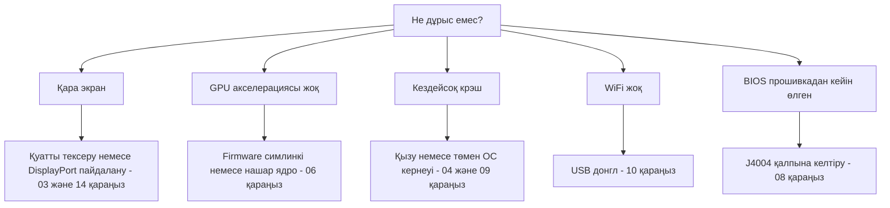

> 🌐 Қауымдастық аудармасы. Ағылшын нұсқасы — шындық көзі әрі жаңарақ болуы мүмкін. Қате таптыңыз ба? Issue ашыңыз: [English](../en/troubleshooting.md) · [issues](https://github.com/lildebil0/awesome-bc250/issues)

# Ақаулықтарды жою

> **TL;DR** — BC-250-дің ақаулық режимдері белгілі: көбі — **қуат**, **қызу**, **ядро/firmware** немесе **сәтсіз прошивка**. Симптомыңызды төменнен тауып, түзетуді қолданыңыз және толық тарауға сілтемеге өтіңіз. Күмәнданғанда, себеп әдетте *нашар ядро*, *amdgpu firmware симлинкінің жоқтығы* немесе *салқындатудың жетіспеуі* болады.

Бұл бет — қауымдастықтың қайталанатын мәселелерінен сұрыпталған «симптом → себеп → түзету» индексі. Ол тарауларды алмастырмайды — дұрысына тез бағыттайды.

---

## Жүктеу / дисплей

| Симптом | Ықтимал себеп | Түзету |
|---------|--------------|-----|
| Қара экран / POST жоқ | Қуат сымы немесе пинаут қате | 8-пин сымы мен пинаутты қайта тексеріңіз; жеткілікті қималы нағыз мыс сым пайдаланыңыз → [03 — Қуат](../en/03-power-supply.md) |
| Жұмыс істеп тұрып қара экран / крэштер | **IOMMU әлі қосулы** (бұл тақтада бұзылған) | BIOS-та IOMMU-ды өшіріңіз (elektricM); `iommu=off`/`amd_iommu=off` ядро параметрі ⚠ тексеру қажет → [06 — Linux](../en/06-linux.md) |
| **Орнатушыны** / live USB жүктегенде қара экран | Орнатушыда BC-250 GPU драйвері жоқ; KMS істен шығады | GRUB-та `nomodeset` қосыңыз (Fedora: Troubleshooting → Basic Graphics Mode); **Mesa орнатылған соң алып тастаңыз** ([elektricM](https://github.com/elektricM/amd-bc250-docs/blob/main/docs/troubleshooting/boot.md)) → [06 — Linux](../en/06-linux.md) |
| **Жүйеге кіргеннен кейін** қара экран (GRUB + кіру экраны дұрыс болды) | Жұмыс үстелі сеансы, әдетте **Wayland** | Кіру кезінде X11 («GNOME on Xorg»/«Plasma X11») таңдаңыз немесе `WaylandEnable=false` ([elektricM](https://github.com/elektricM/amd-bc250-docs/blob/main/docs/troubleshooting/display.md)) → [14 — Дисплей](../en/14-display.md) |
| Жүктеледі, бірақ GPU акселерациясы жоқ (бәрі CPU-да) | amdgpu firmware симлинкі жоқ немесе нашар ядро | `navi10_gpu_info.bin` симлинкі + ядро параметрлерін қолданыңыз; белгілі нашар ядролардан аулақ болыңыз (төменде) → [06 — Linux](../en/06-linux.md) |
| `glxinfo` **llvmpipe** көрсетеді, ойындар 5–10 FPS | Mesa тым ескі немесе amdgpu жүктелмеген | **Mesa 25.1.3+** орнатыңыз, `nomodeset`-ті алып тастаңыз, `Kernel driver in use: amdgpu` екенін растаңыз ([elektricM](https://github.com/elektricM/amd-bc250-docs/blob/main/docs/troubleshooting/performance.md)) → [06 — Linux](../en/06-linux.md) |
| Жұмыс істеп тұрды, ядро жаңартуынан кейін бұзылды | Сол ядродағы регрессия | LTS ядроға кері қайтыңыз; **6.14.7**, **6.15.0–6.15.6** және **6.17.8–6.17.10** amdgpu-ды бұзады деп хабарланды (CPU-ға кету / GPU крэштері); elektricM **6.18.x LTS немесе 6.17.11+** ұсынады ⚠ нақты диапазондарды тексеру → [06 — Linux](../en/06-linux.md) |
| HDMI дыбысы жоқ | Ядро 6.17+ регрессиясы | LTS ядро пайдаланыңыз немесе дыбысты USB/DisplayPort арқылы бағыттаңыз → [06 — Linux](../en/06-linux.md) |
| Тек бір дисплей шығысы жұмыс істейді | Бұл тақтадағы драйвер шектеуі | Туа біткен қос дисплей үшін белгілі шектеу; **MST хаб 2 экранға дейін береді** (DP 1.4 хабы) ([elektricM](https://github.com/elektricM/amd-bc250-docs/blob/main/docs/hardware/display.md)) → [14 — Дисплей](../en/14-display.md) |
| Дисплей жоқ, POST жоқ, **тек NVMe орнатылғанда** | SSD-де әлі **Windows** EFI/recovery бөлімдері бар | SSD-ні шығарып, басқа ПК-де барлық бөлімдерді өшіріңіз (`wipefs -a`), қайта орнатыңыз ([elektricM](https://github.com/elektricM/amd-bc250-docs/blob/main/docs/troubleshooting/boot.md)) → [06 — Linux](../en/06-linux.md) |
| Мүлде POST өтпейді (BIOS жоқ) | Кейбір тақталар **CMOS батареясынсыз** POST өтпейді | Жаңа CR2032 орнатып, қайталап көріңіз ([elektricM](https://github.com/elektricM/amd-bc250-docs/blob/main/docs/troubleshooting/boot.md)) → [08 — BIOS](../en/08-bios.md) |
| Жүктеу **~90 с қатып** содан кейін жалғасады | Сәтсіз systemd қызметі / желі таймауы | `systemctl --failed`; қатып қалған юнитті өшіріңіз ([elektricM](https://github.com/elektricM/amd-bc250-docs/blob/main/docs/troubleshooting/boot.md)) → [06 — Linux](../en/06-linux.md) |
| Ядро паникасы «**unable to mount root**» / «No init found» | Қате ядро **немесе** бүлінген initramfs | Ескі/LTS ядроны жүктеңіз; әлі сәтсіз болса, chroot жасап initramfs-ты қайта генерациялаңыз (`dracut -f` / `update-initramfs -u -k all` / `mkinitcpio -P`) ([elektricM](https://github.com/elektricM/amd-bc250-docs/blob/main/docs/troubleshooting/boot.md)) → [06 — Linux](../en/06-linux.md) |
| `grub>` / `grub rescue>` күйіне түседі | GRUB өз конфигурациясын/жүктеу файлдарын таба алмайды | `root`/`prefix` орнатыңыз, `insmod normal`, жүктеңіз; содан кейін GRUB-ты қайта орнатыңыз ([elektricM](https://github.com/elektricM/amd-bc250-docs/blob/main/docs/troubleshooting/boot.md)) → [06 — Linux](../en/06-linux.md) |
| BIOS-қа кіре алмайды (Del/F2 еленбейді) | Адаптер баяу инициализацияланады немесе пернетақта USB 3.0-де | Del-ді бірден басыңыз; **USB 2.0** портын және туа біткен DP кабелін көріңіз ([elektricM](https://github.com/elektricM/amd-bc250-docs/blob/main/docs/troubleshooting/display.md)) → [08 — BIOS](../en/08-bios.md) |

## Қызу / тұрақтылық

| Симптом | Ықтимал себеп | Түзету |
|---------|--------------|-----|
| Жүктемеде троттлингке түседі / FPS құлайды | Стандартты радиатор үстелде салқындата алмайды | Қабырғаларды жұқартыңыз + жоғары статикалық қысымды 120 мм желдеткіш/қаптама; <80 °C ұстаңыз → [04 — Салқындату](../en/04-cooling.md) |
| Жүктемеде кездейсоқ крэш / қайта жүктелу | Қызып кету (>90 °C) **немесе** оверклок кернеуі тым төмен | Алдымен салқындатуды жақсартыңыз; содан кейін андервольт кернеуін көтеріңіз — Furmark-тұрақты ≠ ойын-тұрақты (ойындарға жоғарырақ керек) → [04](../en/04-cooling.md) · [09](../en/09-overclock-undervolt.md) |
| Furmark-та тұрақты, ойындарда крэш | Кернеу Furmark-тан орнатылған, ол жеткілікті жүктемейді | OCCT + нақты ойындармен сынаңыз; кернеуді ~50 mV көтеріңіз → [09 — Оверклок](../en/09-overclock-undervolt.md) |
| Екі governor таласуда | oberon-governor *және* smu_oc/cyan-skillfish бірге жұмыс істеп тұр | Тек бір governor іске қосыңыз; қалғанын өшіріңіз → [09 — Оверклок](../en/09-overclock-undervolt.md) |
| GPU крэш болғанда **бүкіл жүйе** өледі (тек қолданба емес) | APU: CPU+GPU кремнийді бөліседі, сондықтан GPU қайта қосылуы қалпына келтіре алмайды — ол жүйені де құлатады | Бұл архитектурада күтілетін жайт; қалпына келтіруді күткеннен гөрі GPU крэштерінің алдын алыңыз (тұрақты кернеу + жақсы салқындату + жақсы ядро) ([elektricM](https://github.com/elektricM/amd-bc250-docs/blob/main/docs/troubleshooting/stability.md)) → [09 — Оверклок](../en/09-overclock-undervolt.md) |
| GPU крэш → **қара экран, governor жұмыс істеп тұрғанда ешқашан қалпына келмейді** | Governor қайта қосылу кезінде sysfs-ке жаза береді → қатып қалған reset циклі | Крэшке бейім ойындардың алдында `systemctl stop cyan-skillfish-governor-smu`; кейін қайта қосыңыз ([elektricM](https://github.com/elektricM/amd-bc250-docs/blob/main/docs/troubleshooting/stability.md)) → [09 — Оверклок](../en/09-overclock-undervolt.md) |
| **Тек 60–65 °C-та** қатып қалу / ақ экран | Кейбір тақталар температураға ерекше сезімтал | Салқындатуды жақсартыңыз, радиаторды қайта орнатыңыз, термопасталаңыз (PTM7950); кремний әртүрлі ([elektricM](https://github.com/elektricM/amd-bc250-docs/blob/main/docs/troubleshooting/stability.md)) → [04 — Салқындату](../en/04-cooling.md) |
| GPU **1500 MHz-те қатып қалды**, төменірек андервольт жасамайды | min кернеуі **700 mV-тан төмен** орнатылған — бұл GPU-ды қайта құлыптайтын қатаң шек | min кернеуін **≥ 700 mV** ұстаңыз ([elektricM](https://github.com/elektricM/amd-bc250-docs/blob/main/docs/troubleshooting/stability.md)) → [09 — Оверклок](../en/09-overclock-undervolt.md) |
| Артефакттар / крэштер, көбірек кернеу түземейді | Жүктемеде **кернеу түсуі** (нақты V орнатылған V-дан төмендейді) | Түсуді жабу үшін базаны ~25 mV жоғары орнатыңыз немесе loadline/droop баптауы бар BIOS пайдаланыңыз ([elektricM](https://github.com/elektricM/amd-bc250-docs/blob/main/docs/troubleshooting/stability.md)) → [09 — Оверклок](../en/09-overclock-undervolt.md) |
| Жүктеледі, содан кейін **ACPI қателерімен** крэш (қара/жасыл экран) | BIOS/ACPI ерекшелігі немесе бүліну | CMOS тазалаңыз / BIOS әдепкілерін қалпына келтіріңіз; `acpi=off noapic` көріңіз; жалғаса берсе қайта прошивкалаңыз ([elektricM](https://github.com/elektricM/amd-bc250-docs/blob/main/docs/troubleshooting/stability.md)) → [08 — BIOS](../en/08-bios.md) |
| Ұйқы/suspend = **жалған қатып қалу** (қара, қатқан сияқты) | Тақтада дұрыс GPU ұйқы күйлері жоқ; SMU Linux suspend-ті қолдамайды | Ояту үшін қуат түймесін басыңыз (ұстап тұрмаңыз); жақсырағы — **suspend-ті өшіріп**, экранды өшіруді пайдаланыңыз. Тыныш күйде бәрібір ~65–85 Вт қалады ([elektricM](https://github.com/elektricM/amd-bc250-docs/blob/main/docs/troubleshooting/stability.md)) → [09 — Оверклок](../en/09-overclock-undervolt.md) |

## Өнімділік

| Симптом | Ықтимал себеп | Түзету |
|---------|--------------|-----|
| FPS күткеннен төмен, GPU толық жүктелмеген | **CPU-мен шектелу** (көп ойында шек — Zen 2) | Қалыпты жайт; CPU-ға ауыр баптауларды төмендетіңіз, қабылдаңыз — мұнда GPU оверклогы көмектеспейді → [11 — Ойын](../en/11-gaming.md) |
| Тек 24 CU белсенді, 40 күтілген | Сток азырақ CU ашады | 40-CU ашуды қолданыңыз (`amdgpu.bc250_cc_write_mode=3` + скрипт) → [09 — Оверклок](../en/09-overclock-undervolt.md) |
| Steam / FSR / vsync бұзылған | «Геймерлік» дистрибутив форкы кедергі келтіреді | Кейбір бапталған форктар осыларды бұзады; қарапайым Fedora/Bazzite-bc250 сенімдірек → [06 — Linux](../en/06-linux.md) |
| GPU жүктемеге қарамастан **1500 MHz-те құлыпталған** | Пайдаланушы кеңістігіндегі governor жоқ (әдепкіде BIOS-та құлыпталған) | Жиілікті масштабтау үшін GPU governor (cyan-skillfish-governor-smu) орнатыңыз ([elektricM](https://github.com/elektricM/amd-bc250-docs/blob/main/docs/troubleshooting/performance.md)) → [09 — Оверклок](../en/09-overclock-undervolt.md) |
| Governor жұмыс істейді, бірақ GPU **2000 MHz-тен аспайды** | Ядрода жиілік-диапазон патчы жоқ (әдепкі шек 1000–2000) | Патчталған ядро (Bazzite/CachyOS алдын ала патчталған) пайдаланыңыз немесе `amdgpu-frequency-range.patch` қолданыңыз ([elektricM](https://github.com/elektricM/amd-bc250-docs/blob/main/docs/troubleshooting/performance.md)) → [09 — Оверклок](../en/09-overclock-undervolt.md) |
| MangoHud **655 %** GPU қолданысын көрсетеді | amdgpu белсенділік метрикасын `0xFFFF`-те қалдырады; MangoHud 65535/100 оқиды | cyan-skillfish-governor-smu (smu тармағы) іске қосыңыз — ол `gpu_metrics`-ті патчтайды; MangoHud-ты өзгертудің қажеті жоқ ([elektricM](https://github.com/elektricM/amd-bc250-docs/blob/main/docs/troubleshooting/performance.md)) → [09 — Оверклок](../en/09-overclock-undervolt.md) |
| Жүктеме сынауында **дисплейсіз** «GPU ештеңе істемейді» | `glmark2 --off-screen` дисплейсіз үнсіз **llvmpipe**-ке (CPU) кері кетеді | `clpeak` / `vkmark` / `llama-bench -ngl 99` арқылы сынаңыз; SCLK мен қуаттың көтерілгенін растаңыз ([elektricM](https://github.com/elektricM/amd-bc250-docs/blob/main/docs/troubleshooting/performance.md)) → [06 — Linux](../en/06-linux.md) |
| 60+ FPS, бірақ **секіреді** / кадр уақыты біркелкі емес | Кадр темпі (X11 композиторы немесе дыбысқа байланған темп) | **gamescope** арқылы іске қосыңыз (`-W 1920 -H 1080 -f`) немесе композиторды өшіріңіз / Wayland көріңіз ([elektricM](https://github.com/elektricM/amd-bc250-docs/blob/main/docs/troubleshooting/performance.md)) → [11 — Ойын](../en/11-gaming.md) |
| Ойын **OOM крэш / артефакттар содан кейін өледі** (RDR2, CoH3) | **512 MB динамикалық VRAM + ZRAM** қақтығысы | BIOS-ты **бекітілген VRAM**-ға ауыстырыңыз (мыс. 10 GB RAM / 6 GB VRAM) немесе ZRAM-ды өшіріңіз ([elektricM](https://github.com/elektricM/amd-bc250-docs/blob/main/docs/troubleshooting/stability.md)) → [08 — BIOS](../en/08-bios.md) |
| Белгілі ойын (мыс. **RDR2**) CPU/llvmpipe-те рендерленеді | Ойын әдепкіде қате графикалық адаптерді таңдайды | Ойын ішінде адаптерді AMD GPU-ға қойыңыз; RDR2: `-useMaximumSettings` арқылы іске қосыңыз ([elektricM](https://github.com/elektricM/amd-bc250-docs/blob/main/docs/troubleshooting/performance.md)) → [11 — Ойын](../en/11-gaming.md) |

## Желі

| Симптом | Ықтимал себеп | Түзету |
|---------|--------------|-----|
| WiFi мүлде жоқ | Кірістірілген WiFi жоқ; донглға драйвер керек | Тексерілген донгл (aic8800d80) пайдаланып, оның драйверін құрастырыңыз → [10 — WiFi/BT](../en/10-wifi-bt.md) |
| WiFi әр бірнеше минут сайын үзіледі | Realtek чипсеті + жүктемедегі USB қуаты | Кейбір RTL882x донглдарымен белгілі; aic8800d80-ге немесе расталған модельге ауысыңыз → [10 — WiFi/BT](../en/10-wifi-bt.md) |
| Қайта жүктеуден кейін драйвер жоғалады | Пакетсіз, тікелей `make` арқылы құрастырылған | Ядро жаңартуларынан кейін сақталуы үшін репозиторийдің RPM/DKMS жолын пайдаланыңыз → [10 — WiFi/BT](../en/10-wifi-bt.md) |

## Windows

| Симптом | Ықтимал себеп | Түзету |
|---------|--------------|-----|
| GPU = Code 43 / акселерация жоқ | Жұмыс істейтін Windows GPU драйвері жоқ (2026 басы бойынша) | Күтілетін жайт. Linux пайдаланыңыз. Windows драйверлері — эксперименттік WIP → [07 — Windows](../en/07-windows.md) |

## BIOS / кірпіш

> ⚠ **Кез келген прошивка алдында [08 — BIOS](../en/08-bios.md) толық оқыңыз.** Нашар прошивка тақтаны «кірпішке» айналдырады, әрі CMOS тазалау 1.0/3.00 модын **қалпына келтірмейді**.

| Симптом | Ықтимал себеп | Түзету |
|---------|--------------|-----|
| BIOS прошивкадан кейін өлген/қара | Нашар образ немесе қате баптаулар | Сыртқы қалпына келтіру: CH341A-ны **J4004 хедеріне** жалғаңыз (SOIC-8 қыспағы бұл тақтада жұмыс істе**мейді**) және тексерілген образды қайта прошивкалаңыз → [08 — BIOS](../en/08-bios.md) |
| Программатор чипті оқи алмайды | 5 V деректер желілері / қате чип нысана етілген | 3.3 V пайдаланыңыз; 16 MB `BIOS_A1`-ді прошивкалаңыз, ешқашан 512 KB SuperIO-ны емес → [08 — BIOS](../en/08-bios.md) |
| Баптаулар сақталмайды | Ескі мод нұсқасы | RAM/GDDR6 таймингтері шынымен қолданылатын 5.00 модын пайдаланыңыз → [08 — BIOS](../en/08-bios.md) |
| **RAM таймингтерін/жиілігін** өзгерткеннен кейін жүктелмейді | Тұрақсыз жады баптаулары **BIOS-ты бүлдірді** (P3.00 watchdog; орыс тілді BC-250 чаты хабарлады) | CMOS тазалау жеткіліксіз болуы мүмкін — тексерілген образды **аппараттық қайта прошивкалаңыз** (CH341A / Pi Pico). RAM-ды баптаудан *бұрын* жұмыс істеп тұрған BIOS-ты сақтаңыз; таймингтерді бір-бірден баптаңыз (tREF ең көп береді) ([elektricM](https://github.com/elektricM/amd-bc250-docs/blob/main/docs/troubleshooting/stability.md)) → [08 — BIOS](../en/08-bios.md) |
| BIOS баптаулары сақталмайды → қара экран / RAM аз | USB прошивкадан кейін CMOS тазаланбаған (2–3 рет тазалау қажет болуы мүмкін) | CMOS тазалаңыз, қайта баптаңыз, **BIOS-қа** қайта жүктеліп, 512 MB әлі орнатылғанын растаңыз; `free -h` ~15.5 GB көрсететінін тексеріңіз ([elektricM](https://github.com/elektricM/amd-bc250-docs/blob/main/docs/troubleshooting/stability.md)) → [08 — BIOS](../en/08-bios.md) |

---

## Әлі тұрып қалдыңыз ба?
- **[FAQ](faq.md)** қараңыз.
- Қауымдастық чатын тақырып бойынша іздеңіз (әр тараудың **Дереккөздер** бөлімі нақты талқылауларға сілтейді).
- Көмек сұрағанда **дистрибутив + ядро нұсқаңызды**, **жиіліктер/governor** және **салқындатуыңызды** көрсетіңіз — осы үшеуі мәселелердің көбін түсіндіреді.

### Жоғарыдағы жолдарға дереккөздер
- elektricM ақаулықтарды жою нұсқаулықтары — [`boot.md`](https://github.com/elektricM/amd-bc250-docs/blob/main/docs/troubleshooting/boot.md) · [`display.md`](https://github.com/elektricM/amd-bc250-docs/blob/main/docs/troubleshooting/display.md) · [`performance.md`](https://github.com/elektricM/amd-bc250-docs/blob/main/docs/troubleshooting/performance.md) · [`stability.md`](https://github.com/elektricM/amd-bc250-docs/blob/main/docs/troubleshooting/stability.md) · [`hardware/display.md`](https://github.com/elektricM/amd-bc250-docs/blob/main/docs/hardware/display.md)
- Тарау бойынша қауымдастық-чат дәйексөздері әр сілтенген тараудың **Дереккөздер** бөлімінде.
