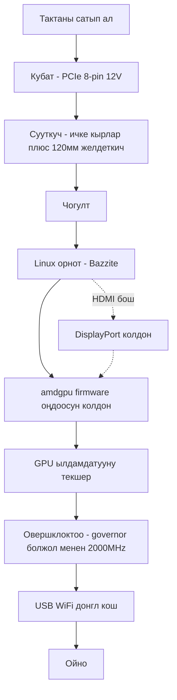

> 🌐 Коомчулук котормосу. Англис тилиндеги нуска — чындыктын булагы жана жаңыраак болушу мүмкүн. Ката таптыңызбы? Issue ачыңыз: [English](../en/00-start-here.md) · [issues](https://github.com/lildebil0/awesome-bc250/issues)

# Ушундан башта — Нөлдөн оюнга чейин

> **Кыскача** — Сиз AMD BC-250 сатып алдыңыз (же сатып алганы жатасыз). Бул — 16 GB GDDR6'лык PlayStation 5'тин негизинде жасалган APU-тактасы, ал арзан Linux оюн/AI кутусуна айланат — **эгер** үч нерсени тартиби менен чечсеңиз: **кубат**, **сууткуч** жана **Linux драйверлери**. Бул барак — кутудагы тактадан иштеп жаткан оюнга чейинки түз жол. Кадамдарды ээрчиңиз; ар бири толук бөлүмгө шилтеме кылат.

Бул такта — даяр компьютер эмес, долбоор. Бир дем алыш күндү бөлүңүз. Адамдар тактаны эрте бузуунун эки жолу — **туура эмес кубат зымдоо** жана **аны ысык абалда иштетүү** — ошондуктан биз аларды биринчи жасайбыз.

---

## Баштаардан мурун — деталдар жана аспаптар

Бул нерселерди баштоодон *мурун* колуңузда болсун, ошондо ар бирин курулманын ортосунда таппайсыз:

- **PSU** PCIe 8-pin 12 V чыгуусу менен → **[03 — Кубат булагы](../en/03-power-supply.md)**
- **120 мм жогорку статикалык кысымдагы желдеткич** + басып чыгарылган кожух → **[04 — Сууткуч](../en/04-cooling.md)** / **[05 — Корпустар жана 3D басып чыгаруу](../en/05-case.md)**
- **Басып чыгарылган корпус же бекиткич** → **[05 — Корпустар жана 3D басып чыгаруу](../en/05-case.md)**
- Linux орноткуч үчүн **≥ 16 GB USB флешка**
- **DisplayPort кабели** (же DP→HDMI адаптери — тактанын HDMI'и көбүнчө эч нерсе көрсөтпөйт, DisplayPort эң ишенимдүү)
- **Отверткa**
- **Мультиметр** — PSU зымдоосун магнит/үзгүлтүксүздүк менен текшерүү үчүн → **[03 — Кубат булагы](../en/03-power-supply.md)**

---

## Жол



### 0. Колуңузда эмне бар экенин билиңиз
BC-250 — сервердик/майнинг blade'и: бир APU (Zen 2 CPU + RDNA2-классындагы GPU, «Cyan Skillfish/Oberon»), 16 GB GDDR6, **пассивдүү радиатор**, бир **12 V PCIe 8-pin** аркылуу кубаттандырылат. Боюнда WiFi жок, иштеген Windows GPU драйвери жок, аппараттык видео кодер жок. → **[01 — BC-250 деген эмне](../en/01-what-is-bc250.md)**

### 1. Туура нерсени сатып алыңыз
Адилет баа кандай, кутуда эмне бар (такта гана? радиатор? PSU?) жана кайсы сатуучулар/алдамчылыктан качуу керектигин билиңиз. → **[02 — Сатып алуу боюнча колдонмо](../en/02-buying.md)**

### 2. *Биринчи жүктөөдөн мурун* кубатты чечиңиз
Такта 12 V'та PCIe 8-pin аркылуу ~235 W талап кылат (овершклоктолгондо көбүрөөк). Чыныгы PSU колдонуңуз (сервердик Flex / Mean Well brick / ATX), 8-pin'ди **жетиштүү калыңдыктагы чыныгы жез зым** менен туура зымдаңыз жана пиноутту болжолдобоңуз — бул жердеги ката тактанын өлүмү. → **[03 — Кубат булагы](../en/03-power-supply.md)**

### 3. *Жүктөөдөн мурун* сууткучту оңдоңуз
Стандарттык радиатор стойкадагы аба түтүгү үчүн жасалган жана **столдо троттлинг кылат**. Кырларын ичкертип, басып чыгарылган кожух аркылуу жогорку статикалык кысымдагы 120 мм желдеткичти бекитиңиз (же AIO колдонуңуз). Максат: Furmark'та ~80 °C'дан төмөн калуу. → **[04 — Сууткуч](../en/04-cooling.md)**

### 4. Корпуска салыңыз (милдеттүү эмес, бирок жакшы)
Тактаны, желдеткичти жана PSU'ну чыныгы аба агымы менен орнотчу консоль стилиндеги корпус басып чыгарыңыз. Коомчулуктун STL'дер каталогу. → **[05 — Корпустар жана 3D басып чыгаруу](../en/05-case.md)**

### 5. Аны чогултуңуз
Минималдуу курулманын физикалык тартиби: желдеткичти басып чыгарылган кожухка бекит → кожухту (ичкертилген) радиатордун кырларынын үстүнө кыс/бурап бекит → тактаны корпуска/бекиткичке отургуз → PSU'нун 8-pin'ин тактага туташтыр (туура пиноут, **[03 — Кубат булагы](../en/03-power-supply.md)**) → DisplayPort кабелин мониторго туташтыр → токту кош жана анын **POST** өткөнүн ырастa (POST = power-on self-test; такта күйүп, видео чыгарат — сүрөт көрөсүз / желдеткич айланат). Кырларды кагуу-сүртүүнү бекитүүдөн *мурун* жасаңыз (карагыла: **[04 — Сууткуч](../en/04-cooling.md)**) жана металл чаңды тактага түшүрбөңүз.

> Бул чогултуунун белгиленген сүрөтү/диаграммасы — кубануулуу салым; репозиторийде дагы деле жок.

### 6. Linux + GPU драйверлерин орнотуңуз
Бул — чечүүчү кадам. Жаңы келгендер үчүн эң жеңили: BC-250 үчүн жасалган **Bazzite негизиндеги образ** (же **Fedora 43** — elektricM'дин дагы бир «жөн эле иштейт» тандоосу; Fedora 42 колдоодон чыккан). Андан кийин **amdgpu firmware оңдоосун** (`navi10_gpu_info.bin` симлинки) жана ядро параметрлерин колдонуп, initramfs/grub'ду кайра түзүп, GPU'нун ылдамдатылганын текшериңиз (`vainfo`, `dmesg`). → **[06 — Linux драйверлери жана орнотуу](../en/06-linux.md)**

> **Калтырсаңыз сааттап азап тарттырган эки жөндөө** (elektricM): мод BIOS'то **VRAM = 512 MB динамикалык** коюп, **IOMMU'ну өчүрүңүз** (бузук IOMMU дисплей бузулууларына жана крэштерге алып келет), андан кийин прошивкадан кийин **CMOS тазалаңыз**. `nomodeset` жүктөө параметри менен орнотуп, **драйверлер киргенден кийин аны алып салыңыз**. Mesa **25.1+** — минимум (25.3.x сунушталат). Ошондой эле **6.15.0–6.15.6 жана 6.17.8–6.17.10 ядролорунан качыңыз** — алар GPU драйверин бузат; анын ордуна 6.18 LTS / 6.17.11+ / 6.12–6.14 LTS колдонуңуз. ([elektricM quick-start](https://elektricm.github.io/amd-bc250-docs/getting-started/quick-start/), [quick-reference](https://elektricm.github.io/amd-bc250-docs/reference/quick-reference/))

> Windows жөнүндө ойлоп жатасызбы? 2026-жылдын башында **иштеген Windows GPU драйвери жок** — ал эксперименталдык. Linux колдонуңуз. → **[07 — Windows](../en/07-windows.md)**

### 7. Стандарттык жөндөөдө иштээрин текшерип, анан овершклоктоңуз
Иш стол ылдамдатылгандан кийин **oberon-governor** орнотуп, жыштыкты жогорулатыңыз (1500 MHz стандарт алсыз; **2000 MHz ≈ +30 % FPS**). Каалаганча бардык **40 CU'ну** ачып, андервольттоңуз. Жаңы жыштыктарда температураны кайра текшериңиз. → **[09 — Овершклоктоо жана андервольттоо](../en/09-overclock-undervolt.md)**

### 8. Интернетке кошулуңуз
Боюнда WiFi жок — **сыналган USB донгл** (aic8800d80 коомчулуктун сүйүктүүсү) жана анын драйверин кошуңуз. → **[10 — WiFi жана Bluetooth](../en/10-wifi-bt.md)**

### 9. Ойноңуз
Реалдуу күтүүлөрдү коюңуз (көбүнчө GPU эмес, Zen 2 CPU чектейт), FSR'ди күйгүзүп, коомчулуктун ар бир оюн боюнча жөндөөлөрүн колдонуңуз. → **[11 — Оюн натыйжалары жана жөндөөлөр](../en/11-gaming.md)**

### Бонус — жергиликтүү LLM'дерди иштетиңиз
16 GB VRAM баасына салыштырмалуу көп. llama.cpp'ни **Vulkan** бекендинде иштетиңиз (ROCm бул GPU'да туюк көчө). → **[12 — AI / LLM](../en/12-ai-llm.md)**

### Бонус — эмуляция
Switch, PS3, PS4, ретро, аркада — чындап эмне иштейт жана кантип → **[15 — Эмуляция](../en/15-emulation.md)**

> Биринчи жүктөөдө сүрөт жокпу? Такта **DisplayPort** аркылуу чыгарат (HDMI көбүнчө бош) → **[14 — Дисплей жана чыгаруу](../en/14-display.md)**. USB порттору жетпейби, же диск кошуп жатасызбы? → **[16 — USB, хабдар жана сактагыч](../en/16-usb-peripherals.md)**

---

## Эгер бир нерсе бузулса
Кара экран, ылдамдатуу жок, кокус кайра жүктөөлөр, донглдун үзүлүшү, BIOS прошивкадан кийин «кирпич» — **[Ката издөө](troubleshooting.md)** жана **[FAQ](faq.md)** кара.

> Мод BIOS прошивкалоо — баштапкы кадам **эмес**. Ал тактаны «кирпич» кылып, калыбына келтирүү аппаратурасын талап кылат. Аны атайылап гана жасаңыз. → **[08 — BIOS жана «кирпич»ти калыбына келтирүү](../en/08-bios.md)**

---

## 60 секундалык текшерүү тизмеси

| Кадам | Качан бүттү |
|------|-----------|
| Кубат | PSU 8-pin'ге зымдалган, туура пиноут, чыныгы жез зым, такта POST өтөт |
| Сууткуч | Кырлар ичкертилген + 120 мм желдеткич/кожух; Furmark'та <80 °C |
| ОС | Bazzite-bc250 орнотулган, иш столго жүктөлөт |
| GPU | `vainfo`/`dmesg` amdgpu иштеп жатканын көрсөтөт, CPU'га түшүп калбайт |
| Овершклок | oberon-governor иштеп жатат, ~2000 MHz, чыныгы оюнда туруктуу |
| Тармак | USB донгл туташат жана үзүлбөйт |
| Оюн | Жыштыктарыңызга ылайык күтүлгөн FPS'те иштейт |

Ар бир сап белгиленгенде, бүттүңүз. BC-250 клубуна кош келиңиз.

---

## Тез маалымдама (cheat-sheet)

Эң көп керектелүүчү буйруктар жана жөндөөлөр, elektricM'дин [quick-reference](https://elektricm.github.io/amd-bc250-docs/reference/quick-reference/)'инен кыскартылган. Толук деталдар **[06 — Linux](../en/06-linux.md)** жана **[09 — Овершклоктоо](../en/09-overclock-undervolt.md)**'до жайгашкан.

**BIOS:** VRAM `512MB` динамикалык · IOMMU **Disabled** · UEFI жүктөө · ар бир USB прошивкадан кийин CMOS тазала.

**GPU ылдамдатылганын текшериңиз (llvmpipe/CPU эмес):**
```bash
glxinfo | grep "OpenGL version"          # Mesa 25.1+ күтүлөт
vulkaninfo | grep deviceName             # → AMD Radeon Graphics (RADV GFX1013)
cat /sys/class/drm/card0/device/pp_dpm_sclk   # бир нече жыштык, учурдагысы * менен белгиленген
```

**Governor** (ансыз жыштыктар 1500 MHz'те калат). Бизде демейки `oberon-governor`; elektricM COPR аркылуу жаңыраак SMU форкун жөнөтөт — экөө тең иштейт:
```bash
sudo dnf copr enable filippor/bazzite
sudo dnf install cyan-skillfish-governor-smu          # Bazzite'те rpm-ostree install …
sudo systemctl enable --now cyan-skillfish-governor-smu.service
systemctl status cyan-skillfish-governor-smu          # → active (running)
```
> Чыңалуунун минимуму **700 mV** — андан төмөн GPU 1500 MHz'ке кулпуланат. Governor туура эмес картаны (card0 vs card1) бутага алышы мүмкүн — эгер масштабдоо иштебесе, текшериңиз.

**Драйверлер киргенден кийин `nomodeset`'ти алып салыңыз:**
```bash
# GRUB дистрибутивдери: /etc/default/grub'дан "nomodeset"'ти алып салып, анан
sudo grub2-mkconfig -o /boot/grub2/grub.cfg && sudo reboot
# Bazzite / Fedora Atomic:
rpm-ostree kargs --delete-if-present="nomodeset" && systemctl reboot
```

**Кээ бир оюндардагы графикалык бузулууларды оңдоочу Steam launch опциясы:** `RADV_DEBUG=nohiz %command%`.

**RDR2 / Company of Heroes 3'тө крэш болуп жатабы?** VRAM'ди `512MB` динамикалыктан **10GB/6GB бекитилгенге** которуңуз (ZRAM кагылышы). ([elektricM quick-reference](https://elektricm.github.io/amd-bc250-docs/reference/quick-reference/))
