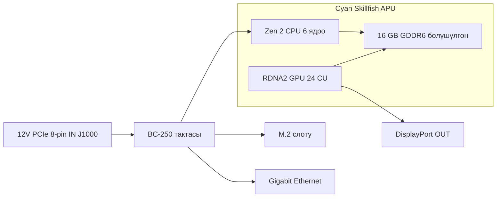

> 🌐 Коомчулук котормосу. Англис тилиндеги нуска — чындыктын булагы жана жаңыраак болушу мүмкүн. Ката таптыңызбы? Issue ачыңыз: [English](../en/01-what-is-bc250.md) · [issues](https://github.com/lildebil0/awesome-bc250/issues)

# BC-250 деген эмне

> **TL;DR** — BC-250 — бул **сервердик/майнинг тактасындагы PlayStation 5 классындагы APU**. Бир чип (AMD коду **Cyan Skillfish**, PS5'тин **Oberon/Ariel** кремнийинин кыскартылган версиясы) **6 ядролук / 12 агымдуу Zen 2 CPU** менен **24 эсептөө бирдигиндеги RDNA 2 GPU**'ну камтыйт, аларды **16 GB ширетилген GDDR6** азыктандырат. Бул **видеокарта да эмес, кадимки ПК да эмес** — анда **сиз билген x86 BIOS жок, PCIe слоту жок, 24-пиндик ATX штекери жок**: ал **12 V'ту түз 8-пиндик PCIe кубат коннекторуна** алат жана өзүнүн микропрограммасынан жүктөлөт. Аны **арзан Linux оюн / жергиликтүү AI кутусу** болгондуктан сатып алышат. Аны **драйверлер, сууткуч жана аппараттык видео кодирлөөнүн жоктугу** аны кошуп-иштет машинасы эмес, долбоор кылгандыктан жек көрүшөт. Эгер эч кандай түйшүксүз нерсе кааласаңыз, бул такта — туура эмес сатып алуу, аны азыр кайтарып бериңиз. Эгер чукулдашканды жакшы көрсөңүз, окууну улантыңыз.

Бул барак — "мен чындыгында эмнени сатып алдым" деген маалымдама. Кубат, сууткуч, ОС орнотуу жана драйверлердин ар бирине өзүнчө бөлүм арналган ([03](../en/03-power-supply.md) / [04](../en/04-cooling.md) / [06](../en/06-linux.md)).

---

## Чындыгында бул эмне

AMD BC-250'ту **криптовалюта майнинг ылдамдаткычы** катары курган ("BC" blockchain дегенди билдирет). Аны арзан кылуу үчүн AMD **калган PlayStation 5 процессор кремнийин** кайра колдонгон — Sony консолго коёт турган чиптин ошол эле үй-бүлөсү. Такта — бул бир APU жана анын эстутуму менен кубат схемасы; бул толук продукт.

Жаргон, бир жолу аныкталган:

- **APU** (Accelerated Processing Unit) — AMD'нин **CPU менен GPU экөөсүн тең** камтыган бирдиктүү чипке берген аты. Өзүнчө видеокарта жок; GPU ошол эле корпустун ичинде, ошол эле эстутумду бөлүшүп турат.
- **Cyan Skillfish** — AMD'нин бул APU үчүн инженердик **коду**. Аны Linux'та бардык жерден көрөсүз: GPU микропрограмма файлы түз эле `cyan_skillfish_gpu_info.bin` ([src](https://t.me/c/2424231195/57962) — symlink оңдоосун бул жерден кара [src](https://t.me/c/2424231195/41252)). Куралдар аны PS5 кристалл аттары **Oberon** / **Ariel** менен да билдириши мүмкүн.
- **GDDR6** — адатта видеокартада кездешүүчү тез графикалык эстутум. BC-250'до бул **бир убакта системалык RAM жана видео RAM** (CPU менен GPU бир бассейнди бөлүшөт). DIMM слоттору жок; 16 GB ширетилген жана жаңыртылбайт.
- **RDNA 2** — GPU архитектурасынын муундусу (PS5, Xbox Series жана Radeon RX 6000 карталары менен бир үй-бүлө).

Чип — толук эмес, **кыскартылган** PS5 бөлүгү. Коомчулук бул салыштырууну бекиткен ([src](https://t.me/c/2424231195/11282), [TechPowerUp'тун Oberon жазуусуна](https://www.techpowerup.com/gpu-specs/amd-oberon.g936) шилтеме менен):

| | BC-250 | Толук PS5 (Oberon) |
|---|---|---|
| CPU ядро / агым | **6 / 12** | 8 / 16 |
| GPU эсептөө бирдиктери (CU) | **24** | 36 |

"Эсептөө бирдиги" — бул бир GPU ядро блогу; алардын 24'ү болжол менен орто деңгээлдеги ноутбук GPU аймагы, бул дал чат оюндарда билдирген өндүрүмдүүлүк диапазону.

BC-250 — AMD'нин "иштеп үстөл тактасындагы калган консоль кремнийи" жалгыз эмес. Анын ошол эле идеядан курулган эки жакын тууганы бар: **AMD 4700S Desktop Kit** (**PlayStation 5**'тен алынган CPU комплекти) — аны чат маркетплейстерде BC-250'го каршы айкаш тизмеленет деп эскертет ([02-buying.md](../en/02-buying.md)) — жана **AMD 4800S Desktop Kit**, **Xbox Series X**'тен алынган версия (GDDR6'га туташтырылган 8 Zen 2 ядро, консолдун RDNA 2 GPU'су өчүрүлгөн). Экөө тең реалдуу AMD продуктулары, алар BC-250 сыяктуу эле, утилизацияланган консоль CPU'су менен ширетилген GDDR6'ны айкаштырат ([VideoCardz](https://videocardz.com/newz/amd-4800s-desktop-kit-a-pc-repurposed-apu-from-xbox-series-x-has-been-tested)). Сатып алууда BC-250'ту анын туугандарынан айырмалоо үчүн пайдалуу контекст.

Адамдар **PS5'тин өзү джейлбрейк кылынгандай эле BC-250'до үстөл Linux'ту иштетишкен** — толук 4K HDMI видео + аудио, бардык USB порттору иштеп, APU CPU'до ~3.2 GHz'ге чейин жана GPU'до ~2.0 GHz'ге чейин жыштыкты көтөргөн ([src](https://t.me/c/2424231195/122260)).

---

## Эмнеге жакшы

- **Бул өндүрүмдүүлүк деңгээлинде Linux оюнуна эң арзан жол.** Steam/Proton аркылуу (Linux'та Windows оюндарын иштеткен шайкештик катмары) адамдар Star Citizen ойношот ([src](https://t.me/c/2424231195/38702)), жада калса *Doom: The Dark Ages* сыяктуу заманбап оюндарды коомчулуктун Vulkan каптамасы аркылуу low/FSR'да ~60 FPS менен ойношот ([src](https://t.me/c/2424231195/127696)). Ар бир оюндун натыйжалары [11-gaming.md](../en/11-gaming.md) ичинде.
- **Жөндөмдүү жергиликтүү AI кутусу.** 16 GB GDDR6 менен ал орто өлчөмдөгү тил моделдерин камтый алат. Катышуучулар LLM'дерди жергиликтүү түрдө `llama.cpp`/`jan` аркылуу **Vulkan** бэкендинде иштетишет; BIOS'ту адегенде GPU'га 12 GB бөлүштүрүүгө коёсуз ([src](https://t.me/c/2424231195/92421)). [12-ai-llm.md](../en/12-ai-llm.md) кара.
- **Кичинекей жана өз алдынча.** Бул GPU стилиндеги радиатору орнотулган бир узун такта — кичинекей DIY/3D-басылган корпустарга батат жана бир кичинекей кубат булагынан иштейт ([build src](https://t.me/c/2424231195/137825)).

Анын *эмне үчүн* такыр иштээри жөнүндө коомчулуктун консенсусу: чип Steam Deck / PS5 аппараттык каражатына абдан жакын болгондуктан, Valve жана ачык булактуу Mesa графикалык стек дал ошол эле драйверлерди жакшыртууну улантат, ошондуктан BC-250 акысыз кошо жүрөт ([src](https://t.me/c/2424231195/93006)).

---

## Эмнеси түйшүктүү (күтүүлөрдү тууралаңыз)

Бул жаңы келгендер баалабай турган жарымы. Алардын эч бири келишимди бузбайт, бирок баары реалдуу иш.

- **Драйверлер — өз алдынча кылуучу иш.** AMD бул такта үчүн **расмий драйвер да, ачык документация да жөнөтпөйт** ([src](https://t.me/c/2424231195/37764)). Бардыгы — Linux графикалык стек, жыштык/чыңалуу "governor"'у, BIOS — коомчулук тарабынан курулган. Орнотуу скрипттерин ээрчип, кээде нерселерди колу менен оңдоону күтүңүз. [06-linux.md](../en/06-linux.md) баштаңыз.
- **Сууткуч — адамдар туура эмес кылган №1 нерсе.** Стандарттык радиатор майнинг текченин мажбурлаган аба туннели үчүн долбоорлонгон, ошондуктан үстөлдө ал кутудан чыкканда эле ысып, троттлингке кирет. Сууткучту модификациялашыңыз керек болот. Анын өзүнчө бөлүмү бар — өндүрүмдүүлүктү кубалоодон **мурда** [04-cooling.md](../en/04-cooling.md) окуңуз.
- **Аппараттык видео кодер жок.** GPU'нун видео-кодирлөө блогу (AMD'нин **VCN** деп атаганы — стриминг/жаздыруу үчүн видеону кысуучу атайын схема) **жеткиликсиз**. Экранды жаздыруу жана оюн стриминги **программалык кодерге** кайтат, ал CPU'га түшөт. Ал иштейт (адамдар Sunshine/Moonlight аркылуу стрим кылышат), бирок кадимки GPU'дан жайыраак жана сапаты төмөнүрөөк ([src](https://t.me/c/2424231195/88026)). Ошондой эле, эртеги Mesa драйвери коомчулук аппараттык ылдамдатууну иштеткенге чейин атактуу түрдө **программалык рендеринг** болгон ([src](https://t.me/c/2424231195/11243)).
- **Кызыктай кубат жана демейки боюнча дисплей жок.** Ал стандарттык 24-пиндик ATX коннекторун албайт — кийинки бөлүмдү кара. Көптөгөн тактлар ошондой эле POST кылганга чейин **BIOS түшүрүүсүн** талап кылып келет ([src](https://t.me/c/2424231195/57930)), жана сиз адатта сүрөттү **DisplayPort** аркылуу чыгарасыз (HDMI үчүн DP→HDMI адаптери керек, ал аудиону да жакшы алып жүрөт — [src](https://t.me/c/2424231195/9148)).
- **Бул чукулдашуучунун тактасы, точка.** Бир эски катышуучу айткандай: арзан болгонуна карабастан, BC-250 "белгилүү жөндөмдөрдү, аракетти жана акылды талап кылат" ([src](https://t.me/c/2424231195/73002)). Акчаны эле эмес, убакытты да эсептеңиз.
- ⚠ **eGPU аны куткарбайт — коомчулук билдирген (r/BC250Gaming).** Жалгыз M.2 слоту болгону **PCIe 2.0 ×2** (төмөндөгү аппараттык картаны кара), жана ушундай өткөрүү жөндөмдүүлүгүндө M.2'ге илинген тышкы GPU **орнотулган RDNA 2 GPU'дан *начарыраак* иштейт деп билдирилген** — жай байланыш аны муунтат. Эгер көбүрөөк графикалык кубат кааласаңыз, консенсус — бул такта ага арналган эмес. *(Коомчулук билдирген; муну бенчмарк эмес, эскертүү катары карагыла.)*

> ⚠ **Эки түстүү LED эмнени билдирет — коомчулук билдирген (r/BC250Gaming).** NIC'тин жанындагы эки түстүү LED — бул **майнинг доорунун жүктөлүү индикатору, ката чырагы эмес**: коомчулуктун эсептери боюнча **кызыл = GPU/RAM 100% жүктөлүүдө *эмес*, жашыл = толук жүктөлүү**. Демек, бош турган үстөл тактасында кызыл чырак — бул кадимки нерсе, кемчилик эмес. *(Коомчулук билдирген; AMD бул такта үчүн документация жөнөтпөйт, ошондуктан түстөрдүн так дал келүүсүн ырасталбаган катары карагыла.)*

> ⚠ **Кармоо боюнча эскертүү, кыйынчылык менен үйрөнүлгөн.** Кубат алган тактага эч кандай металл нерсе тийгизбеңиз, жана термопастаны дайыма этият алмаштырыңыз — бир катышуучу кыска туташтыруу менен өзүнүн BC-250'ун биротоло өлтүргөн ([src](https://t.me/c/2424231195/95998)). Тактлар ошондой эле радиатор бекитүүсүнөн бир аз **ийилип** келет; бир катышуучу тактаны радиаторго каршы кагаз менен түз кылып шиммдеп жүктөлбөгөндү оңдогон ([src](https://t.me/c/2424231195/117347)).

---

## Аппараттык маалымдама картасы

Спецификациялар коомчулуктун аппараттык кайра инженериясына карата кайчылаш текшерилген (AMD маалымат барагын жарыялабайт). Эстутум-шинасы жана физикалык-өлчөм көрсөткүчтөрү, мурда ырасталбаган, эми [elektricM аппараттык спецификациясынан](https://github.com/elektricm/elektricm) алынган (ал кайра инженерия үчүн mothenjoyer69 / Segfault / neggles / yeyus'ка ыраазычылык билдирет). Төмөндөгү пиновдук жана кубат көрсөткүчтөрү канондук коомчулук аппараттык документинен келет.

Тактага бир караш — кубат сол жакта кирет, APU жана анын бөлүшүлгөн эстутуму ортодо, I/O оң жакта:



### Негизги спецификациялар

| Спецификация | Маани | Булак |
|------|-------|--------|
| Класс | Майнинг/сервердик тактадагы PlayStation 5'тен алынган APU | [hardware.md](https://github.com/mothenjoyer69/bc250-documentation/blob/main/hardware.md) |
| APU коду | **Cyan Skillfish** (PS5 кристаллы: Oberon / Ariel) | чат ([src](https://t.me/c/2424231195/57962)) |
| CPU | **6 ядро / 12 агым, Zen 2** (6 ядро ырасталган) | [hardware.md](https://github.com/mothenjoyer69/bc250-documentation) · чат ([src](https://t.me/c/2424231195/11282)) |
| CPU жыштыгы | **~3.49 GHz**'ге чейин ("болжолу") | [hardware.md](https://github.com/mothenjoyer69/bc250-documentation) · чат ([src](https://t.me/c/2424231195/122260)) |
| GPU | **24 эсептөө бирдиги, RDNA 2** (`gfx1013`; PS5 SoC'до 36); растеризация ≈ **RX 6600 менен RX 6600 XT ортосунда** / GTX 1660 Ti классы; **Vulkan 1.4** | [hardware.md](https://github.com/mothenjoyer69/bc250-documentation) · чат ([src](https://t.me/c/2424231195/11282)) · [elektricM](https://github.com/elektricm/elektricm) |
| GPU жыштыгы | стандартта ~1500 MHz, овершклокто ~2000 MHz (≈2.23 GHz макс) | ([src](https://t.me/c/2424231195/122260)) · [09](../en/09-overclock-undervolt.md) |
| Эстутум | **16 GB GDDR6**, CPU менен GPU ортосунда бөлүшүлгөн, ширетилген (жаңыртылбайт) | [hardware.md](https://github.com/mothenjoyer69/bc250-documentation) · [README](../../README.md) |
| GPU VRAM бөлүштүрүүсү | BIOS'то коюлат; BIOS 3.00+'те **12 GB** тандалат | ([src](https://t.me/c/2424231195/92421)) |
| Эстутум шинасы / өткөрүү жөндөмү | **256-бит** GDDR6 @ **14 Gbps**, **~448 GB/s** | [elektricM аппараттык спецификациясы](https://github.com/elektricm/elektricm) |
| TDP | **220 W** (тактанын жылуулук-долбоор кубаты) | [hardware.md](https://github.com/mothenjoyer69/bc250-documentation) |
| Кубат керектөө | майнинг класстагы жүктөмдө адатта ~67–85 W | [hashrate.no](https://www.hashrate.no/gpus/bc250) |
| Аппараттык видео кодирлөө (VCN) | **Жок** — программалык кодирлөө гана | ([src](https://t.me/c/2424231195/88026)) |
| Видео чыгуу | **DisplayPort 1.4** (**4K@120 / 8K@60**'ка чейин); HDMI үчүн DP→HDMI адаптерин колдонуңуз; аудиону алып жүрөт | ([src](https://t.me/c/2424231195/9148)) · [elektricM](https://github.com/elektricm/elektricm) |
| Сактагыч (M.2) | 1x M.2 2280 — **PCIe 2.0 x2 же SATA III** | [elektricM](https://github.com/elektricm/elektricm) |
| 2-чи DisplayPort | бар, бирок **толтурулбаган**; программалык түрдө активдештирилет | ([src](https://t.me/c/2424231195/88026)) |
| Физикалык өлчөмү | **340 mm / 310 mm** узундукта (өлчөө ыкмасына жараша), **~115 mm** туурасы, радиатор менен **~400 g**; стандарттык эмес атайын майнинг форм-фактор | [elektricM аппараттык спецификациясы](https://github.com/elektricm/elektricm) |

> ⚠ **GDDR6 овершклок = өткөрүү жөндөмү, FPS эмес — коомчулук билдирген (r/BC250Gaming).** Коомчулуктун эсептери боюнча, GDDR6'ны овершклоктоо эстутум өткөрүү жөндөмүн болжол менен **~256 GB/s'тен ~445 GB/s'ке** көтөрөт, бирок **оюнда эч кандай пайда бербейт** — GPU'нун 24 CU'су, эстутум өткөрүү жөндөмү эмес, тоскоолдук болуп саналат, ошондуктан кошумча өткөрүү жөндөмү оюндарда колдонулбай калат. (Жогорудагы репонун ырасталган *стандарттык* көрсөткүчү 256-бит / 14 Gbps'те мурдатан **~448 GB/s** экенин эске алгыла, ошондуктан коомчулуктун "~256 GB/s базалык" көрсөткүчү спецификацияга дал келбейт — так GB/s сандарын ырасталбаган катары карагыла; FPS алынбай тургандыгы — туруктуу бөлүгү.) Жалпы GPU/эстутум овершклоктоо үчүн [09-overclock-undervolt.md](../en/09-overclock-undervolt.md) кара.

> **Такта өлчөмдөрү жөнүндө:** [elektricM аппараттык спецификациясы](https://github.com/elektricm/elektricm) узундугун **340 mm / 310 mm** берет (эки көрсөткүч ар кандай өлчөө ыкмаларын чагылдырат), туурасын **~115 mm** жана радиатор менен **~400 g**, стандарттык эмес атайын майнинг форм-факторунда. Канондук `hardware.md`'нин өзү өлчөмдөрдү тизбелебейт; чаттын эң көп реакция алган бирдиктүү аппараттык посту түз эле *"Размеры amd bc-250"* ("AMD BC-250'тин өлчөмдөрү", ❤20 — [src](https://t.me/c/2424231195/379)) деп аталат, бул адамдардын муну корпус курууда ойлоорун ырастайт. Так корпус батышы үчүн өлчөнгөн 3D моделден иштеңиз — коомчулук каталогдоштурган такта STL'дери (мис. `BC250 Board.stl`, [Printables 1103626](https://www.printables.com/model/1103626-amd-bc250-board) жана [Printables 1341336](https://www.printables.com/model/1341336-accurate-3d-model-of-the-amd-bc-250-board)'дагы так модель) өлчөмдөрү боюнча туура. [05-case.md](../en/05-case.md) кара.

<p align="center">
  <br>
  <sub>Фото: AMD BC-250 коомчулугу · <a href="https://t.me/c/2424231195/379">source</a></sub>
</p>

### Кубат коннекторунун пиновдугу (бир нерсе сайардан мурда муну окуңуз)

BC-250'до **24-пиндик ATX хедери жок**. Ал **8-пиндик PCIe кубат коннектору (J1000)** аркылуу **12 V гана** менен азыктандырылат — видеокартаныкы менен бирдей физикалык штекер, бирок такта үч кубат контактынын тең 12 V'тен азыктанышын күтөт. Толук зымдоо жана кубат булагын тандоо [03-power-supply.md](../en/03-power-supply.md) ичинде; канондук пиновдук [hardware.md](https://github.com/mothenjoyer69/bc250-documentation/blob/main/hardware.md)'ден:

**J1000 — негизги 8-пиндик PCIe кубат (бул сиз туташтырган):**

```
[ GND  GND  GND  GND ]
[ GND  12V  12V  12V ]
```

- Үч 12 V контакты; документ Mini-Fit Jr контакттарын **ар бири 9 A'ге чейин** деп баалайт, ошондуктан бул коннектор "**324 W'ке чейин** коопсуз бере алат" жана өз алдынча колдонуу үчүн **16 AWG** зымды сунуштайт ([hardware.md](https://github.com/mothenjoyer69/bc250-documentation)).
- **GND = жер (0 V), 12V = +12 вольт.** Полярдыкты туура алыңыз — бул тактанын тескери чыңалууга кечиримдүүлүгү жок.

**J2000 / J2001 — текче кубат коннекторлору (адатта үстөлдө колдонулбайт):**

```
        J2000                  J2001
 [ LED1  12V  12V  12V ]   [ 12V  12V  12V  PGD ]
 [ LED2  GND  GND  GND ]   [ GND  GND  GND  GND ]
```

- Булар **Molex Micro-Fit BMI** коннекторлору ([бөлүк 444280801](https://www.molex.com/en-us/products/part-detail/444280801)), PCIe/EPS штекерлери *эмес* — алар тактаны өзүнүн баштапкы майнинг шассисинин ичинде азыктандырган. **J2000 жана J2001 бирдей эмес:** жогорудагы пиновдук көрсөткөндөй, J2000 **LED1/LED2** пиндерин алып жүрөт, а J2001 **PGD** пинин алып жүрөт, демек эки коннектор айырмаланат ([elektricM / mothenjoyer69 аппараттык документтери](https://github.com/mothenjoyer69/bc250-documentation)).
- **PGD** (J2001'де) — кубат-жакшы/сезүү пини: ал **такта текченин PSU2'сине отургузулганда 5 V'ту көрөт**. Өз алдынча курууда сиз адатта анын ордуна J1000 аркылуу азыктандырасыз жана J2000/J2001'ди этибарга албай койсоңуз болот — бирок өзүңүздүн PSU адаптериңиз үчүн [03-power-supply.md](../en/03-power-supply.md)'ге карата текшериңиз.

---

## Андан ары кайда баруу керек

1. **[02-buying.md](../en/02-buying.md)** — эгер али сатып албаган болсоңуз, же адилет баа жана реалдуу тобокелдиктер кандай экенин билгиңиз келсе.
2. **[03-power-supply.md](../en/03-power-supply.md)** — аны чындыгында кантип азыктандыруу керек (12 V'ту 8-пинге).
3. **[04-cooling.md](../en/04-cooling.md)** — такта колуңузга тийгенден кийин баарынан **мурда** муну кылыңыз.
4. **[06-linux.md](../en/06-linux.md)** — ОС жана коомчулук драйверлерин ага орнотуңуз.

---

## Булактар

- Канондук аппараттык документ & пиновдук — [mothenjoyer69/bc250-documentation `hardware.md`](https://github.com/mothenjoyer69/bc250-documentation/blob/main/hardware.md)
- Эстутум шинасы/өткөрүү жөндөмү, физикалык өлчөмдөр, GPU позициялоо, DP 1.4, M.2 — [elektricM аппараттык спецификациясы](https://github.com/elektricm/elektricm) (кайра инженерия үчүн mothenjoyer69 / Segfault / neggles / yeyus'ка ыраазычылык)
- Кыскартылган vs толук PS5 кремнийи (6/12 + 24 CU vs 8/16 + 36 CU) — https://t.me/c/2424231195/11282 · [TechPowerUp Oberon](https://www.techpowerup.com/gpu-specs/amd-oberon.g936)
- PS5-аппаратурада Linux, 4K HDMI, жыштыктар — https://t.me/c/2424231195/122260
- Расмий драйвер жок / документ жок — https://t.me/c/2424231195/37764
- Программалык рендеринг / аппараттык кодирлөө жок — https://t.me/c/2424231195/11243 · https://t.me/c/2424231195/88026
- DisplayPort + DP→HDMI аудио — https://t.me/c/2424231195/9148
- Cyan Skillfish микропрограмма аты — https://t.me/c/2424231195/57962 · https://t.me/c/2424231195/41252
- Жергиликтүү LLM + BIOS 3.00 аркылуу 12 GB VRAM — https://t.me/c/2424231195/92421
- "Жөндөмдөрдү, аракетти жана акылды талап кылат" — https://t.me/c/2424231195/73002
- Кармоо/кыска туташтыруу эскертүүсү — https://t.me/c/2424231195/95998 · ийилген-такта оңдоосу — https://t.me/c/2424231195/117347
- "BC-250'тин өлчөмдөрү" (эң көп реакция алган аппараттык пост) — https://t.me/c/2424231195/379
- 220 W TDP, 6-ядро/3.49 GHz CPU, 24-CU GPU, 16 GB GDDR6 (репо ырастоосу) — [mothenjoyer69/bc250-documentation README](https://github.com/mothenjoyer69/bc250-documentation)
- Майнинг класстагы кубат керектөө көрсөткүчтөрү — https://www.hashrate.no/gpus/bc250
- Эмне үчүн ал иштей берет (бөлүшүлгөн Steam Deck/PS5 драйвер аракети) — https://t.me/c/2424231195/93006
- Туугандык комплекттер — AMD 4700S (PS5 CPU комплекти, BC-250'го каршы айкаш тизмеленет, [02-buying.md](../en/02-buying.md)) жана AMD 4800S (Xbox Series X CPU + GDDR6, GPU өчүрүлгөн) — [VideoCardz: 4800S Desktop Kit](https://videocardz.com/newz/amd-4800s-desktop-kit-a-pc-repurposed-apu-from-xbox-series-x-has-been-tested)
- M.2 аркылуу eGPU орнотулган GPU'дан жайыраак (M.2 — PCIe 2.0 ×2), эки түстүү NIC LED = жүктөлүү сигналы (кызыл = 100% эмес, жашыл = толук жүктөлүү), GDDR6 овершклок өткөрүү жөндөмүн көтөрөт (~256→~445 GB/s) оюнда пайдасыз — коомчулук билдирген (r/BC250Gaming)

> AMD бул такта үчүн баштапкы маалымат барагын жарыялабайт; жогорудагы көрсөткүчтөр — эң мыкты коомчулук кайра инженериясы (канондук `hardware.md` плюс elektricM аппараттык спецификациясы). Оңдоолор PR аркылуу кош келиңиз ([CONTRIBUTING.md](../../CONTRIBUTING.md) кара).
