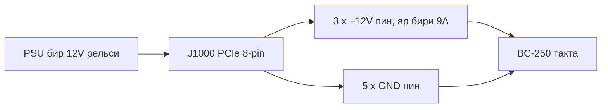

🌐 Коомчулук котормосу. Англис тилиндеги нуска — чындыктын булагы жана жаңыраак болушу мүмкүн. Ката таптыңызбы? Issue ачыңыз: [English](../en/03-power-supply.md) · [issues](https://github.com/lildebil0/awesome-bc250/issues)

# Кубат булагы

> **TL;DR** — BC-250'де **кубат баскычы да, стандарттуу PC кубат розеткасы да жок**. Ал **12 V'ти** бир гана **PCIe 8-pin (6+2)** туташтыргычы аркылуу жейт — десктоп видеокартасы колдонгон ошол эле штекер — жана туу чокусунда **~235 W** тегерегинде болот (овердиск кылсаңыз, көбүрөөк). Сизге **бир рельсте ~250–300 W** бере ала турган 12 V булагы керек. Коомчулук тандаган үч жол: арзан **сервердик "Flex" PSU** (HP 500 W, eBay'де ~$12), **өнөр жай brick'и** (Mean Well LOP-300/LOP-500), же **кадимки ATX PSU** (анын PCIe кабелин жөн эле сайып койгула). Качуу керек болгон эки өлтүргүч: **12 V'ти алсыз рельстерге бөлүштүргөн эски PSU**, жана ысып, өрттөнүп кетүүчү **жасалма жез менен капталган болот зымдар**. Чыныгы жез колдонгула, **16 AWG же андан калың**.

Тактаны азыктандыруу — жаңы келген адам **туура жасашы керек болгон экинчи нерсе** ([муздатуудан](../en/04-cooling.md) кийин) — жана зымдоодо бурчтарды кесип койсоңуз, өрт чыгарууга эң ыктымалдуу нерсе.

---

## Тактага чындыгында эмне керек

BC-250 — крипто-майнинг/сервердик тактадагы кыскартылган PlayStation 5 кристаллы. Ал стойкада туруп, 12 V менен азыктанышы үчүн ойлоп табылган — ошондуктан анда **кадимки PC'нин ыңгайлуулуктарынын бири да жок**:

- **ATX 24-pin** аналык такта туташтыргычы **жок**.
- **Кубат баскычы жок** — 12 V келгенде ал заматта күйөт (PSU'нун өзүнүн ажыраткычы — сиздин кубат баскычыңыз).
- **PSU'нун бир гана иши: жетиштүү ток менен 12 V берүү.**

**Кубат көрсөткүчтөрү (тастыкталган):**

| Спецификация | Маани | Булак |
|------|-------|--------|
| Кириш чыңалуусу | 12 V DC | [hardware.md](https://github.com/mothenjoyer69/bc250-documentation/blob/main/hardware.md) |
| Типтүү туу чоку керектөө | ~220–235 W | коомчулук байкаган ([src](https://t.me/c/2424231195/31076)) |
| Туташтыргыч | PCIe 8-pin (6+2) | [hardware.md](https://github.com/mothenjoyer69/bc250-documentation/blob/main/hardware.md) · ([src](https://t.me/c/2424231195/14450)) |
| 12 V'тагы туу чоку ток | типтүү ~18–20 A, конструкциялык запас ~40 A'га чейин | ([src](https://t.me/c/2424231195/31076)) |

> **"PCIe 8-pin (6+2)"** дегени — видеокартанын кубат штекери: бир блоктогу алты пин, плюс ажырай турган 2-пиндик кыпчуур, ошондуктан бир эле кабель 6-pin же 8-pin катары иштейт. **6+2** = 6 туруктуу + 2 алынуучу. Бул сиздин аналык тактадагы CPU/EPS 8-pin *эмес* — төмөнкү эскертүүнү караңыз.

PCIe 8-pin PCIe стандарты боюнча **150 W'га** эсептелген, ал эми тактанын үч 12 V контактысы (Molex Mini-Fit Jr, ар бири 9 A) коопсуз түрдө **~324 W'га чейин** өткөрө алат ([hardware.md](https://github.com/mothenjoyer69/bc250-documentation/blob/main/hardware.md)). Демек бир 8-pin сток режиминде эркин жетиштүү; запас агрессивдүү овердиск кылганда гана мааниге ээ.

**Канча PSU кубаты сатып алуу керек:** **12 V рельсинде 300 W же андан көптү** көздөгүлө. 300 W блок ~235 W туу чокуга салыштырмалуу жакшы запас берет жана PSU желдеткичин тынч кылат; адамдар бул жүктө 500 W Flex сервердик PSU дээрлик үнсүз иштээрин айтышат ([src](https://t.me/c/2424231195/31076)). "Акча үнөмдөш үчүн" ~250 W'дан төмөн сатып албагыла — аны чегинде иштетесиз, ал ызы-чуу кылат же өчүп калат.

> **Клещ-метр менен кубат ийри сызыгы (биринчи кол амперажы).** Бир ажыратуу учурунда DC амперметр 12 V азыктандырууга кыпчылып, тактанын чыныгы тогун окуду: **оюн ≈17 A / ~190 W тартат**, ал эми **толук синтетикалык стресс жүгү ≈21 A / ~240–250 W'га жетет**, **2000 MHz / 960 mV'та**; чыңалууну жогорулатса, ал **22–23 A жана андан жогору** көтөрүлөт ([Old Lamer — Part VII](https://youtu.be/pxahl9-YgkY) ~9:01). Булар жогорудагы коомчулуктун розеткадан кубат көрсөткүчтөрүн өлчөнгөн рельс амперажы менен тактайт — жана 300 W максаты эмне үчүн туура запас калтыраарын тастыктайт. *(Көрсөткүчтөр авто-субтитрлерден алынды — так сандарды болжолдуу деп эсептегиле.)*

> ⚠️ **Качуу керек болгон аталган PSU'лар:** арзан **Dell D220P-01** (220 W) жана **Dell D250AD-00** (250 W) бул такта үчүн **жетишсиз жана коркунучтуу** деп аталат — 220 W / 250 W'та алар тактанын туу чокусунан төмөн турат жана оюн жүгүндө өчүп калат же бузулат деп билдирилген. Бир блокту арзан жана "жетиштүүдөй көрүнгөнү үчүн" гана сатып албагыла. ([elektricM: power](https://elektricm.github.io/amd-bc250-docs/hardware/power/))

---

## Физика: вольттор, амперлер, ватттар — жана эмне үчүн ичке зым күйөт

Бул бөлүмдөгү ар бир эреже үч теңдемеден келип чыгат. Буларды жана калыңдык таблицаларын үйрөнсөңүз, "эч качан SATA колдонбо" деген эскертүүлөр кокусунан коюлбаганын түшүнөсүз.

**Кубат = вольт × ампер (`P = U·I`).** Тактага **12 V'та ~235 W** керек, ошондуктан ал `235 ÷ 12 ≈ 19.6 A` тартат. Дал ушундан клещ-метр **~17 A оюн / ~21 A стресс** окуйт ([жогоруда](#тактага-чындыгында-эмне-керек)): ваттаж кремний менен белгиленет, ошондуктан *амперлер* — 12 V эмнеге мажбурласа, ошол. Жыштыктарды/чыңалууну жогорулатсаңыз, амперлер ватттар менен бирге өсөт.

**Эмне үчүн 12 V — жана эмне үчүн 24 V аны өлтүрөт.** 12 V — такта курулган дата-борбор стойкасынын стандарты; анын тактадагы VRM'дери аны APU өзөгү иштеген ~1 V'га чейин түшүрөт. Такта **12 V үчүн катуу сымдалган, ашыкча чыңалуудан коргоосу жок**, ошондуктан ага 24 V берүү (мис. [LOP-300-**24**](#вариант-b--mean-well-өнөр-жай-bricki)) ар бир 12 V бөлүгүнө эки эсе көп коюп, аны заматта жок кылат. Амперден айырмаланып, чыңалуу талашка жатпайт.

**Ампасити — эмне үчүн зымдын ампер чеги бар.** Зым — каршылык, ал эми каршылык аркылуу өткөн ток жылуулук пайда кылат: `P_loss = I²·R`. Калыңыраак жез = көбүрөөк кесилиш аянты = **R азыраак** = ошол эле амперде жылуулук азыраак. Бул жогорудагы AWG таблицасынын бүтүндөй мааниси — **AWG саны азыраак = зым калыңыраак = көбүрөөк амперде коопсуз**. ~20 A'та **16 AWG жез** муздак бойдон калат; ичкерээк болсо, `I²·R` изоляцияны эритет. **Квадратка** көңүл бургула: токту эки эсе көбөйтсө, жылуулук *төрт эсе* көбөйөт, ошондуктан оор овердиск экинчи азыктандырууну талап кылат, жөн эле "бир аз көбүрөөк зымды" эмес.

**Чыңалуунун төмөндөшү — экинчи жарымы.** Зымда жоголгон жылуулук — такта эч качан көрбөгөн чыңалуу: `V_drop = I·R`. Узун, ичке кабель тактаны **ысытат** жана **ачка калтырат**, ошондуктан көзгө көрүнүп эч нерсе эрибесе да, жүктө чыңалуу төмөндөп кетиши мүмкүн (brown out). Кыска, калың жез экөөнү тең бир эле учурда оңдойт.

**Эмне үчүн жасалма "жез" өлүмгө алып келет.** Жез менен капталган болоттун каршылыгы чыныгы жезден **~6 эсе** жогору — ошол эле амперлер, ошол эле `I²·R`, демек ошол эле зымда **6 эсе көп жылуулук**. Төмөнкү магнит менен текшерүү — бул сапат тандоосу эмес; ал токто буга чейин эле квадратталган мүчөгө **6 эселик көбөйтүүчүнү** кармайт.

**Эмне үчүн эч качан SATA же Molex.** Маселе — *туташтыргыч*, зым эмес. SATA кубат контактысы **~54 W'га** эсептелген → `54 ÷ 12 ≈ 4.5 A`, андан кийин кичинекей контакт өзүн өзү бышырат; тактага ~20 A керек, бул чектен **4 эсе ашык**. Анын ордуна PCIe 8-pin үч калың 12 V контактысын алып жүрөт (**ар бири 9 A = 27 A / 324 W**) — дал ушундан ал туура штекер, ал эми SATA/Molex эч качан боло албайт ([пиноутту](#8-pin-пиноуту-j1000) караңыз).

---

## ⚠️ Тактаны жок кылган эки ката

Эч нерсе сатып алардан мурда бул бөлүмдү окугула.

### 1. PCIe 8-pin'ди CPU/EPS 8-pin менен чаташтырбагыла

Сиздин ATX PSU'ңузда **эки башка 8-pin штекер** бар: бири видеокарталар үчүн (**PCIe**), экинчиси CPU үчүн (**EPS/CPU**, кээде "CPU" же "4+4" деп белгиленет). **Алар дээрлик бирдей көрүнөт, бирок пин формалары жана поляризациясы тескери.** CPU штекерин BC-250'ге мажбурлап киргизүү **жер болушу керек жерге +12 V** коёт — бүт тактаны өрттөп жибериши мүмкүн.

> *"Бул миллион жолу талкууланган — бизде PCIe кубат кириши бар. Эгер четки пиндин формасы башка болсо, сизде CPU штекери бар… анын поляризациясы түз эле тескери, минус болушу керек жерде плюс. Баарын тозокко өрттөп жибериши мүмкүн."* ([src](https://t.me/c/2424231195/14450))

Тактада **sense-pin текшерүүсү жок**, ошондуктан туура эмес нерсени сайып коюуңузду эч нерсе токтотпойт. Коопсуз адат: **туташтыргычтын кыпчуурунун формасын карагыла, эгер күмөн санасаңыз, күйгүзөрдөн мурда мультиметр менен + жана − текшергиле.**

### 2. Жасалма "жез" зымды колдонбогула — бул өрт коркунучу

Бул — чатта эң көп кайталанган коопсуздук эскертүүсү. Арзан даяр адаптер кабелдери жана арзан "PCIe" кабелдери көбүнчө **жез менен капталган болот (CCS)** же **жез менен капталган алюминий (CCA)** — болот/алюминий өзөктүн үстүндө жука жез кабыгы. Болоттун каршылыгы жезден **~6 эсе** жогору, ошондуктан зым жүктө ысып, эрип же тутанып кетиши мүмкүн.

> *"Адаптердин зымы жүктө катуу ысып кетти. Бул жез эмес, жука жез каптамасы бар темир (болот) болуп чыкты… каршылыгы жогору, көп ысыйт, өрт чыгарышы мүмкүн. Ишеничтүү жана коопсуз иштеши үчүн МИЛДЕТТҮҮ түрдө кеминде 2.5 мм² толук жез зымдарын колдонушуңуз керек."* ([src](https://t.me/c/2424231195/108733))

> *"Магнит менен текшердим 🤣 — болот талчалар. Бул болот 'талчаларынын' каршылыгы жезден 6 эсе жогору. Алар жалпы кайсы 450 W жөнүндө сүйлөшүп жатышат?"* ([src](https://t.me/c/2424231195/133546))

**Ишенерден мурда текшергиле:** магнит болотко жабышат, жезге жабышпайт. Эгер туташтыргыч же зым магнитке тартылса, кабелди ыргытып салгыла.

Бул жөн гана аты жок кабель эмес. **Apevia Flex/ITX PSU'ларда болот зымдар табылган** — аларды магнит менен текшергиле, анткени болот жүктө абдан ысыйт жана өрт коркунучу болуп саналат. **Apevia ITX-PFC400W** Mini-ITX **14-pin туташтыргычын** колдонот (ал төмөнкү [LITE адаптери](#автоматтык-ps_on--коомчулук-адаптери) менен иштейт, бирок сунушталбайт). (r/BC250Gaming)

> 🔴 **BC-250'ди эч качан SATA же Molex адаптери аркылуу азыктандырбагыла.** Такта **220–280 W** тартат, ал эми бул туташтыргычтар муну физикалык жактан коопсуз бере албайт:
> - **SATA→PCIe/8-pin адаптери — өрт коркунучу** — SATA кубат туташтыргычы болгону **~54 W'га** эсептелген ([elektricM: power](https://elektricm.github.io/amd-bc250-docs/hardware/power/)).
> - **Жылаңач Molex азыктандыруу ~156 W'та** чектелет (эки Molex туташтыргыч менен) — баары бир жетишсиз ([elektricM: power](https://elektricm.github.io/amd-bc250-docs/hardware/power/)).
>
> Тактаны болгону **чыныгы PCIe 8-pin / EPS-класс 12 V булагынан** азыктандыргыла. Бул жогорудагы жез-болот эскертүүсүнөн өзүнчө: атүгүл *толук жез* SATA же Molex адаптери бул жерде коопсуз эмес, анткени туташтыргычтын өзү 220–280 W жүгүнө жетишсиз эсептелген.

---

## Зым калыңдыгы жана туташтыргыч боюнча көрсөтмөлөр

Такта документациясы жана чат бирдей коопсуз базалык деңгээлге макул:

| Колдонуу учуру | Зым | Булак |
|----------|------|--------|
| Бир 8-pin, сток / жеңил OC | **16 AWG** жез (~1.3 мм²) | [hardware.md](https://github.com/mothenjoyer69/bc250-documentation/blob/main/hardware.md) |
| Кол менен курулган кабель, запас керек | **2.5 мм²** (~13 AWG) толук жез | ([src](https://t.me/c/2424231195/108733)) |
| Оор овердиск | калыңыраак / **кош азыктандыруу** (J2000/J2001 караңыз) | [hardware.md](https://github.com/mothenjoyer69/bc250-documentation/blob/main/hardware.md) |

Сандар карама-каршы келбейт — **16 AWG — документтештирилген минимум**; 2.5 мм² көрсөткүчү — CCS-зым коркунучунан кийин кошумча запас тандаган бир курулушчунун чечими. **Талашка жатпаган бөлүгү — "чыныгы жез", так калыңдык эмес.** AWG саны азыраак = зым калыңыраак = коопсузураак.

Толук токту алып жүргөн туташтыргыч контактылары үчүн туу чокуга эсептелгендерин көздөгүлө: курулушчулар оор курулушта **~40 A'га** ылайыктуу контакт/зымды максат кылышат жана аларды илешкек push-fit'ке таянбай, болтлоп же туура кримптешет ([src](https://t.me/c/2424231195/31076)).

---

## 8-pin пиноуту (J1000)

Тактанын негизги кубат туташтыргычын караганда — **үстүңкү катар толугу менен жер, төмөнкү катар бир жерден башкасы 12 V**. [hardware.md](https://github.com/mothenjoyer69/bc250-documentation/blob/main/hardware.md)'ден:

```
J1000 (PCIe 8-pin), contacts facing you:

  [ GND  GND  GND  GND ]   ← top row: all ground (−)
  [ GND  12V  12V  12V ]   ← bottom row: one ground + three 12 V (+)
```

Чат ошол эле поляризацияны жөнөкөй сөз менен айтат — пиндерди санагыла **1ден 3гө чейин = +12 V, 4тен 8ге чейинки пиндер = жер**:

> *"Бирден үчкө чейинки пиндер + болушу керек, калгандары төрттөн сегизге чейин минус… Тактада sense текшерүүсү жок. Тестер алып, + жана − кайда экенин карагыла."* ([src](https://t.me/c/2424231195/14450))

Бир 12 V рельси сегиз контактка кантип бөлүнөт — үчөө +12 V алып жүрөт, бешөө жер:



Бул стандарттуу PCIe 8-pin'ге так дал келет, дал ушундан кадимки ATX PSU'нун PCIe кабели жөн эле иштей берет. **Эгер өз кабелиңизди курсаңыз, биринчи жолу күйгүзөрдөн мурда ар бир пинди мультиметр менен текшергиле** — поляризация каталары бул жерде кечирилбейт.

Тактада ошондой эле эки кичирээк альтернативдик кубат туташтыргычы бар, **J2000** жана **J2001** — алар оор овердиск үчүн гана пайдалуу жана төмөндө толук каралат.

---

## 300 W'дан жогору — J2000 / J2001 экинчи кубат туташтыргычы

> ⚠️ **Адегенде муну окугула.** Бул бөлүмдөгү бардыгы — **кол менен жасалган кошумча 12 V зымдоо**. Тактада бул пиндерде **поляризация же sense текшерүүсү жок** (J1000 сыяктуу) — +12 V менен жерди алмаштырсаңыз, ал күйгөн заматта тактаны өрттөп жибересиз. Экинчи азыктандыруу запасты **эки азыктандыруу тең бир эле PSU / бир эле 12 V рельсин бир эле потенциалда бөлүшсө** гана кошот; эки башка булакты бириктирүү алардын бирине ток артка түртүшү мүмкүн. Эгер өз туташтыргычтарыңызды кримптеп жана өлчөп ишенимдүү болбосоңуз, ушул жерде токтоп, бир [J1000 8-pin'де](#8-pin-пиноуту-j1000) кала бергиле.

[J1000'ге](#8-pin-пиноуту-j1000) бир PCIe 8-pin сток жана жеңил OC'та эркин — анын үч 12 V контактысы **~324 W'га** ылайыктуу (9 A × 3 × 12 V, же өнөр жай деңгээлиндеги контакттар менен ~468 W'га чейин) ([hardware.md](https://github.com/mothenjoyer69/bc250-documentation/blob/main/hardware.md)). Бул бөлүм эмне үчүн бар: **агрессивдүү овердисктеги 40-CU такта 300 W'дан көп тарта алат** ([src](https://t.me/c/2424231195/143787)), бул бир 8-pin'дин эркин зонасынын дал четинде. Такта **экинчи PSU** эки кошумча туташтыргычты азыктандырган стойка үчүн иштелип чыккан — **J2000** жана **J2001** — ошондуктан десктоп овердиск запасын алуунун таза жолу — бир штекерди ашык жүктөбөстөн **J1000'ди J2000/J2001 менен толуктоо** (же түз эле тактага ширетүү) ([hardware.md](https://github.com/mothenjoyer69/bc250-documentation/blob/main/hardware.md)). Бул ошондой эле чатта эң көп суралган диаграмма ([src](https://t.me/c/2424231195/135741)).

### Пиноут (такта документациясынан)

J2000 жана J2001 **бирдей эмес**. Алар **Molex Micro-Fit BMI** ([part 444280801](https://www.molex.com/en-us/products/part-detail/444280801)) менен шайкеш. 1-пин — ак шелкография үч бурчтугу (төмөндө `v`):

```
        J2000                    J2001
   v                        v
[ LED1  12V  12V  12V ]   [ 12V  12V  12V  PGD ]
[ LED2  GND  GND  GND ]   [ GND  GND  GND  GND ]
```

| Пин | Мааниси |
|-----|---------|
| `12V` | +12 V кубат кириши (ар бир туташтыргычта үчөө) |
| `GND` | Жер |
| `PGD` | **PGOOD** — стойка backplane'инде экинчи PSU болгондо 5 V окуйт; сигнал пини, кубат чыгышы **эмес** |
| `LED1` / `LED2` | Жашыл / кызыл backplane LED'дерин чагылдырган active-low LED чыгыштары |

**Резервдөө үчүн документация J2000 жана J2001 экөөнү тең колдонууну айтат** ([hardware.md](https://github.com/mothenjoyer69/bc250-documentation/blob/main/hardware.md#j2000-and-j2001)). Экөөнүн **тилке жайгашуусу айырмаланаарын** эске алгыла — J2000'де LED пиндери биринчи тилкеде, ал эми үч 12 V пиндин баары үстүңкү катарда; J2001'де PGD пини жогорку оң жакта, ал эми төмөнкү катар толугу менен жер. **Туташтырардан мурда ар бир пинди өлчөгүлө** — Micro-Fit корпусу экөөндө тең бирдей отурат деп болжолдобогула. ⚠ 1-пиндин так багытын өз тактаңызга салыштырып мультиметр менен текшергиле; LED/PGD пиндери **эч качан** 12 V алышы мүмкүн эмес.

### Коомчулук колдонгон практикалык ыкма

Сизге стойка backplane'и керек эмес. Чатта кайталанган рецепт жөнөкөй: **бир PCIe 8-pin'ди J1000'ге сайгыла, андан кийин Molex Micro-Fit 3.0 штекерин кримптеп, ошол эле 12 V'ти жанаша турган J2000'ге азыктандыргыла** ([src](https://t.me/c/2424231195/142662), [src](https://t.me/c/2424231195/138371)). Бир курулушчу так кабелди *"бир PCIe туташтыргыч жана эки Micro-Fit 3p туташтыргыч"* бир булактан деп сүрөттөйт ([src](https://t.me/c/2424231195/143938)) — башкача айтканда, бир PCIe кабелден 12 V/GND'ди 8-pin'ге да, Micro-Fit азыктандырууга да бөлүштүрүү.

**Сатып алуу керек туташтыргыч** (өз алдынча чогултулуучу, Molex Micro-Fit 3.0):

| Бөлүк | Molex номери | Эскертүү |
|------|--------------|------|
| Корпус | **43025-0800** (8-circuit) | штекердин денеси ([src](https://t.me/c/2424231195/142659), [src](https://t.me/c/2424231195/14797)) |
| Кримп терминалдар | **43030** сериясы | ар бир зымга бирден ([src](https://t.me/c/2424231195/142659)) |

Болгону **12 V жана GND** позицияларын толтургула (жогорудагы пиноут таблицасына дал келтиргиле); `PGD` / `LED1` / `LED2` бош калтыргыла. Негизги [8-pin сыяктуу ошол эле **чыныгы жез, ≥16 AWG** зымды жана кримп дисциплинасын колдонгула — зым калыңдыгы боюнча көрсөтмөнү караңыз](#зым-калыңдыгы-жана-туташтыргыч-боюнча-көрсөтмөлөр); ысып кеткен кол менен кримпленген 12 V азыктандыруу — дал ушул бөлүмдө мурда сүрөттөлгөн өрт коркунучу.

> 🛠 **Micro-Fit чогултуунун кыйынчылыктары (Molex how-to'дан).** Бул штекерлерди кримптөө боюнча практикалык эскертүүлөр ([Molex Micro-Fit видео](https://youtu.be/aaDUkPn9ASE)):
> - **Зым калыңдыгы:** **18 AWG сунушталат, 20 AWG жол берилет** — жүк үч 12 V пинге үч жакка бөлүнөт, ошондуктан ар бир зым үчтөн бирин алып жүрөт.
> - Штекердин **пластик илгичин кесип салгыла**, ал тактага бирдей отурушу үчүн.
> - **Эки туташтыргыч АЛМАШТЫРЫЛБАЙТ** — зымдагандан кийин аларды **белгилеп койгула**, J2000 менен J2001'дин штекерлерин эч качан алмаштырбаш үчүн.
> - **Кримпер жокпу? Ширетүү жарактуу альтернатива** — зымды кримптөөнүн ордуна терминалга ширетип койгула.
> - Туура жасалса, **эки туташтыргычтагы тогуз 12 V линиясы >400 W'ты коопсуз алып жүрөт.**


### 40-CU тактаны азыктандыруу — үч чыгуулуу кабель моди

**40-CU ачуудан** кийин такта FurMark'та **розеткадан ~280 W** тарта алат (CPU-X менен өлчөнгөн), ал эми **бир 8-pin PCIe** FurMark'та **~220 W'та** туу чокуга жетет — демек катуу ачылган такта бирден көп азыктандырууну каалайт. **[Metalfish 500W](#коомчулук-колдонгон-популярдуу-psu-моделдери)** **3 бөлүшүлгөн PCIe/CPU чыгышына** ээ; 40-CU курулушу үчүн **үчөөнү тең** тактага зымдагыла (*"үч чыгуулуу кабель моди"*):

- **18 AWG** колдонгула — кабелдер FurMark'та муздак бойдон калат; жүктү 3 азыктандырууга бөлүштүрөрдөн мурда алар коркунучтуу деңгээлде ысып кеткен.
- **Такта тарабы** = Micro-Fit 3.0 розеткалары; **PSU тарабы** = 4.2 мм Mini-Fit PCIe розеткалары. **Адегенде ар бир зымды мультиметр менен белгилегиле.**
- Жиптен болжолдуу калыңдык эсеби: 18 AWG ≈ **5 A @ 12 V ≈ ар бир зымга 60 W** × бир туташтыргычта 3 ≈ 180 W, × 2 туташтыргыч ≈ 360 W — **бирок параллель өткөргүчтөр токту бирдей бөлүшпөйт, ошондуктан аларды чегине чейин иштетпегиле.**

(Кредит: **Korayosulu**, r/BC250Gaming, Oldlamer YouTube видеосунан шыктанган.)

> **Атрибуция:** жогорудагы J2000/J2001 пиноуту **elektricM hardware документациясынан**, анын реверс-инженериясы **[mothenjoyer69'дун bc250-documentation'уна](https://github.com/mothenjoyer69/bc250-documentation)** негизделген (Segfault, neggles, yeyus'ка да рахмат). Колго иштелүүчү кримп ыкмасы жана бөлүк номерлери коомчулук чатынан, ичинде шилтемеленген.

---

## Коомчулук колдонгон PSU варианттары

Үч практикалык жол бар. Баары 12 V берет; алар баасы, өлчөмү, ызы-чуусу жана канча зымдоо иши кылааруңуз менен айырмаланат.

> 💡 **Бир PSU'дан бир нече тактаны азыктандырып жатасызбы?** Бул бөлүмдөгү бардыгы бир такта үчүн жазылган. Бир чоң сервердик PSU азыктандырган көп тактадуу риг үчүн коомчулуктун **[Needleroozer/bc250-power-board'ун](https://github.com/Needleroozer/bc250-power-board)** колдонгула — бир PSU'ну ар бир BC-250'ге таза 12 V азыктандырууга бөлгөн кубат-бөлүштүрүү PCB'си ([elektricM: power](https://elektricm.github.io/amd-bc250-docs/hardware/power/)).

| Вариант | Бул эмне | Баасы | Артыкчылыктары | Кемчиликтери |
|--------|-----------|-------|------|------|
| **Сервердик "Flex Slot" PSU** | HP/Dell/ж.б. 1U дата-борбор brick'и (мис. HP 500 W Platinum) | колдонулган ~$12–25 | Арзан, дээрлик бузулбас, чоң бир 12 V рельси, абдан компакттуу | Иштетүү үчүн jumper/каршылык керек; кичинекей 15 000 RPM желдеткич алмаштырылмайынча самолёттой ызылдайт; 8-pin'ди өзүңүз зымдайсыз |
| **Өнөр жай brick'и (Mean Well)** | Жабык AC→DC булагы, бир 12 V (LOP-300 = 300 W/25 A, LRS-350, LOP-500) | жаңы ~$25–45 | Жаңы, таза бир рельс, тынч, даташит-спецификациясы менен | 8-pin'ди өзүңүз зымдайсыз; жылаңач терминалдарга корпус керек |
| **Кадимки ATX / Flex-ATX / SFX PC PSU** | Каалаган татыктуу заманбап PC кубат булагы | ар түрдүү | **Эч кандай модификация жок** — анын PCIe 8-pin кабели түз эле сайылат; жаңы баштоочулар үчүн эң коопсуз | Мини курулуш үчүн чоң; ашыкча ваттаж; төмөндөгү бир рельс эрежесин эске алгыла |

### Вариант A — Сервердик Flex PSU (эң популярдуу арзан жол)

Коомчулуктун сүйүктүүсү — колдонулган **HP Flex Slot 500 W** сервердик булагы — *"eBay'де шылдыңдай $12'га сатылып алынган… булар дээрлик түбөлүк иштейт, дата-борборлор аларды алмаштырган жыштыкка караганда алда канча көп запас бар, плюс Platinum натыйжалуулугу"* ([src](https://t.me/c/2424231195/31076)). Буларда PCIe штекери жок, ошондуктан аны адаптациялайсыз:

1. **PSU'ну иштеткиле:** эки кыска иштетүү пинин (1–2 пиндер) jumper же бекитүүчү ажыраткыч менен туташтыргыла.
2. **12 V рельсин иштеткиле:** **3-пин менен GND ортосуна ~500 Ω каршылык** коюгула (кең сол пин).
3. **12 V'ти алгыла:** же PCIe 8-pin'ди түз эле 12 V пиндерге ширеткиле, же корпуска туташтыргыч салгыла — *"бирок зымдар жана туташтыргыч туу чоку 40 A'ны көтөрүшү керек"* ([src](https://t.me/c/2424231195/31076)).

Адамдар колдонгон башка текшерилген сервердик/консолдук brick'тер: **PlayStation 3 FAT PSU** (32 A / 12 V — *"жетиштүүдөн ашык жана абдан туруктуу, BC-250 үчүн сунуштайм"* ([src](https://t.me/c/2424231195/62332)), [src](https://t.me/c/2424231195/102734)), Dell D550E, Juniper JPSU-350, жана ар кандай ASIC-майнер булактары.

> **Бүт тактаны Xbox контроллеринен күйгүзгүлө — [ESP32-BC250-LOP_PSU-PowerON-Xbox](https://github.com/dexikdex/ESP32-BC250-LOP_PSU-PowerON-Xbox)** ([src](https://t.me/c/2424231195/142498)). Бул коомчулук тактасы (**ESP32_Relay X2**, модель **303E32DC210**, кош реле) **пассивдүү BLE скандоо** жасайт: жупталган Xbox геймпадыңыз күйгөндө, ESP32 анын Bluetooth жарнамасын көрүп, тактанын **PWR_SW** пиндерине зымдалган **GPIO17**'деги релени иштетип кубатты күйгүзөт. Экинчи реле (**GPIO16**) бир эле учурда 12 V'ти перифериялык түзмөктөргө (мис. желдеткич контроллери) которот. Башка пиндер: **GPIO23** = физикалык корпус-баскыч кириши, **GPIO19** = баскыч-LED чыгышы, **GPIO4** = PC-абал мониторунун. Геймпад мурдагыдай эле PC'ге жупталган бойдон калат — скандоо анын OS жуптоосун уурдабайт. Лицензия GPL-3.0, автор dexikdex.

> **Желдеткич жөнүндө эскертүү:** бул brick'тердеги стандарттуу 40 мм желдеткич ~15 000 RPM'ге чейин айланып, *"учуп жаткан самолёттой угулушу"* мүмкүн. Иш жүзүндө, BC-250'нин жөнөкөй жүгүндө ал тынч бойдон калат, жана бир нече колдонуучу анын *"биздин кичинекей такта менен такыр ызы-чуу кылбаганын"* тастыкташат ([src](https://t.me/c/2424231195/33455)). Эгер ал сизди тынчсыздандырса, жетиштүү аба агымы бар тынчыраак 40 мм желдеткичке алмаштыргыла.

> 💡 **Эң мыкты бюджеттик тандоо = колдонулган сервердик PSU.** **$10–30** баада колдонулган ~500 W сервердик булагы — чоң бир 12 V рельсине эң арзан жол жана ватка-баа боюнча аны жеңүү кыйын ([Old Lamer — Part VII](https://youtu.be/pxahl9-YgkY) ~10:12). **12 V LED-тилке / CCTV кубат brick'и да тактаны иштете алат**, бирок этият болгула: буларда көбүнчө **PC PSU'да бар коргоо схемалары жок** (ашыкча ток, ашыкча температура, кыска туташуудан өчүрүү), ошондуктан акаулукта аны иштетип токтотчу эч нерсе жок. Чыныгы PC/сервердик PSU'ну тандагыла; LED-тилке булагын акыркы аргада гана колдонуп, аны рейтингинин чегинде кармагыла. *(Субтитрден алынды — сандар болжолдуу.)*

### Вариант B — Mean Well өнөр жай brick'и

Жаңы **Mean Well LOP-300-12** (300 W, 12 V, 25 A) же **LRS-350** — тыкан, ишеничтүү тандоо: даташиттен түз бир 12 V рельс, рельс-бөлүштүрүү оюндары жок, тынч. Эгер максималдуу овердиск запасын кааласаңыз, чоңураак **LOP-500** бар. PCIe 8-pin'ди анын бурама терминалдарына өзүңүз зымдайсыз, жана терминалдар ачык болгондуктан, аны кутуга салышыңыз керек. Чатта таркаган продукт барактары: [LOP-300-12 ChipDip'те](https://www.chipdip.ru/product/lop-300-12-blok-pitaniya-12v-25a-300vt-mean-well-9001511866) · [LRS-350-12](https://www.chipdip.ru/product/lrs-350-12-blok-pitaniya-12v-29a-348vt-mean-well-9000334417).

> 🔴 **`-12`'ни сатып алгыла, `-24`'тү ЭМЕС — суффикс — бул чыгуу чыңалуусу.** Mean Well LOP-300'ду бир нече чыңалууда сатат, жана **[LOP-300-24](https://www.meanwell.com/webapp/product/search.aspx?prod=LOP-300) 24 V чыгарат** — бул такта көтөрө ала турган нерседен **эки эсе** көп. BC-250 **12 V гана** ([тактага эмне керек экенин](#тактага-чындыгында-эмне-керек) караңыз); ага 24 V берүү **аны заматта жок кылат**. Сиз **милдеттүү түрдө** **LOP-300-_12_** (12 V / 25 A) вариантын колдонушуңуз керек. Бул эреже бул үй-бүлөдөгү ар бир моделге тиешелүү — зымдоодон мурда **акыркы сан `-12` экенин дайыма тастыктагыла** (LOP-300-12, LRS-350-12, LOP-500-12 …). Бул тактада ашыкча чыңалуудан коргоо жок.

**LOP-300 үчүн DIY 8-pin BOM (RU курулушу).** Бир курулушчу такта-тараптагы туташтыргычты кримптөө үчүн так JST бөлүктөрүн документтештирген, баары ChipDip'тен ([4pda — sftk](https://4pda.to/forum/index.php?showtopic=1104980)):

| Бөлүк | JST номери | Ролу |
|------|-----------|------|
| 6-pin корпус | **VHR-6N** | +12 V / GND штекердин денеси |
| Кримп терминал | **SVH-21T-P1.1** | ар бир зымга бирден |
| 3-pin корпус | **VHR-3N** (a.k.a. **PHU2-03**) | экинчи азыктандыруу |

6-pin'деги пиноут: позициялар **1-2-3 = +12 V (сары зымдар)**, позициялар **4-5-6 = GND (кара зымдар)**. Аны **16 AWG** жез менен зымдагыла (**18 AWG минимум** дагы өтөт; **22 AWG вариант эмес** — ток үчүн өтө ичке). Жогорудагы [зым калыңдыгы боюнча көрсөтмөдөгү](#зым-калыңдыгы-жана-туташтыргыч-боюнча-көрсөтмөлөр) эле чыныгы жез эрежеси.

### Вариант C — Кадимки PC PSU (жаңы баштоочу үчүн эң оңой, эң коопсуз)

Эгер сизде буга чейин эле татыктуу **ATX, Flex-ATX, SFX же TFX** кубат булагы болсо, бүттү: **анын PCIe 8-pin кабелин тактага сайгыла.** Эч кандай jumper, ширетүү, каршылык жок. Бул кечээ гана тактаны кутудан чыгарган адам үчүн эң аз тобокелдиктүү вариант. Аналык тактасыз күйгүзүү үчүн, 24-pin'деги **жашыл PS_ON зымын каалаган кара жерге** туташтыргыла (стандарттуу "кагаз кыпчуур" амалы). Компакттуу **Flex-ATX 400 W** блоктору кичинекей корпустар үчүн популярдуу.

---

## PSU'ну күйгүзүү жана өчүрүү (тактада кубат баскычы жок)

Тактада **жергиликтүү ATX кубат башкаруусу жок** — 12 V пайда болгон заматта ал жүктөлөт (жогорудагы [ыңгайлуулуктар жок тизмесин](#тактага-чындыгында-эмне-керек) караңыз), ошондуктан сиздин күй/өчүр ажыраткычыңыз **PSU тарабында** жашашы керек. r/linux_gaming коомчулук жипчеси практикалык, тастыкталган ыкмаларды документтештирет:

- **PS_ON'го чыныгы кубат ажыраткычын кошкула.** PSU'нун **PS_ON → GND**'син туруктуу кагаз кыпчуурдун ордуна **rocker / бекитүүчү ажыраткыч** аркылуу туташтыргыла — аны которуу бүт нерсени күйгүзүп-өчүрөт. 24-pin туташтыргычта PS_ON адатта **жашыл зым / 16-пин**, ал эми каалаган кара зым — жер. Муну кийинки пункт менен жупташтыргыла, рельс келгенде такта чындап жүктөлүшү үчүн.
- **Тактанын `AUTO_PWRON` jumper'ин кубат келгенде авто-күйгө коюгула.** Бул jumper авто-күй позициясында болгондо, BC-250 PSU 12 V бергенде эле жүктөлөт — ошентип PSU'нун PS_ON ажыраткычы системанын чыныгы бирдиктүү кубат баскычына айланат.
- **Модулдук PSU'да PS_ON'ду туташтырардан мурда таап алгыла — пин жайгашуусу моделге жараша өзгөрөт.** Стандарттуу 24-pin зымдоодо бул жашыл зым, бирок модулдук блоктор айырмаланат: **TFSkywind 350 W** **ар бир катардын ортоңку эки пинин (4 + 11)** колдонот, ал эми **Apevia 400/500 W** **бир катардагы эки пинди (8 + 13)** колдонот. Жашыл/16-пин деп болжолдобостон, өзүңүздүкүн текшергиле (мультиметр / PSU'нун өз пиноуту).
- **Арзан PSU'ну таза жалпактап кескиле.** Тактага сизге болгону **1 жашыл (PS_ON) + 3 сары (12 V) + 6 кара (GND)** керек; калган бунчаны тыкан курулуш үчүн кесип салса болот.
- **Уйку учурунда PSU желдеткичин токтоткула (коомчулук амалдары).** Такта уктап жатканда PSU иштей бергендиктен, кээ бир ээлер **PSU желдеткичин BC-250'нин желдеткич разъемине гирлянда кылып туташтырышат**, ал такта менен бирге айланышын токтотушу үчүн. Мунун тазараак, туура иштелип чыккан чечимдери — төмөндөгү **[коомчулук адаптери](#автоматтык-ps_on--коомчулук-адаптери)** жана **[чыныгы ATX аппараттык моди](#чыныгы-atx-аппараттык-моди-iamdarkyoshi)** — экөө тең такта өчкөндө PSU'ну толугу менен өчүрөт, аны бош айлантуунун ордуна.
- **Кичинекей MCU менен өзүңдүкүн жасагыла.** Эгер [коомчулук адаптерин](#автоматтык-ps_on--коомчулук-адаптери) сатып алгандын ордуна авто-PS_ON логикасын өзүңүз курууну кааласаңыз, каалаган кичинекей микроконтроллер PS_ON'ду кармап, тактанын `system_on`/желдеткич-разъем сигналын байкай алат. Адамдар тандаган эки арзан, чыныгы вариант: **ESP32** (жогорудагы [Xbox-контроллер кубат күйгүзүү тактасы](#вариант-a--сервердик-flex-psu-эң-популярдуу-арзан-жол) колдонгон) же, минималдуу бөлүктөр тизмеси үчүн, **[WCH CH32V003](https://www.wch-ic.com/products/CH32V003.html)** — **3.3 V/5 V I/O** менен ~$0.15'тен төмөн RISC-V MCU, PS_ON линиясын башкарууга абдан ылайыктуу. Бул DIY жол (микропрограмманы жазып, аны коопсуз зымдайсыз); даяр [mosfet.party адаптери](#автоматтык-ps_on--коомчулук-адаптери) жана төмөндөгү [iamdarkyoshi аппараттык моди](#чыныгы-atx-аппараттык-моди-iamdarkyoshi) — код жок альтернативалар.

### Автоматтык PS_ON — коомчулук адаптери

Жогорудагы ыкмалар PS_ON'ду же туруктуу туташтырылган калтырат (PSU эч качан толук өчпөйт), же кол менен которгон ажыраткычта калтырат. **u/pilim_** (r/BC250Gaming) PS_ON'ду **автоматтык** кармаган **"BC250 ATX PSU Control Adapter"** сатат, ошентип жашыл PS_ON зымын кыска туташтырбастан же бекитүүчү баскыч зымдабастан кадимки PC PSU'ну колдоно аласыз. Дүкөн: https://mosfet.party/products/adapter-1

Ал кантип авто-иштейт:

1. Баскычты басасыз → адаптер **PS_ON**'ду активдештирет.
2. BC-250 (**BIOS'то авто-кубат-күйгүзүүгө** коюлган) жүктөлүп, **`system_on`** сигналын көтөрөт.
3. Адаптер ал сигнал бар болгон убакта **PS_ON'ду кармайт**.
4. OS өчкөндө сигнал төмөндөйт → адаптер перифериялык түзмөктөр таза өчүшү үчүн PS_ON'ду **дагы ~3 секунд** кармайт → анан **PSU толугу менен өчөт**.

`system_on` сигналы **тактанын желдеткич разъеминен** окулат, ошондуктан аны орнотуу үчүн **ширетүү талап кылынбайт** (жана ал экинчи желдеткич үчүн портту бош калтырат). **5VSB бош турганда ~эч ток тартпагандыктан**, PSU толугу менен өчөт — бул жогоруда чечилбеген амал катары саналган *"такта өчкөндө PSU желдеткичи айлана берет"* деген кеңири маселени чечет.

**Үч версия:**

| Версия | Бул эмне | Болжолдуу баасы |
|---------|-----------|-------------|
| **FSP500 plug-and-play** | Ширетүүсүз; FSP500-30AS 10-pin кабелин колдонот | ~$35–45 |
| **Универсалдуу "LITE"** | Ширетүү аянтчалары менен жылаңач PCB | ~$25 |
| **24-pin plug-and-play** | Стандарттуу 24-pin PSU'лар үчүн | — |

**Шайкештик:**

- **FSP500 plug-and-play** **FSP500-30AS** (жана башка кээ бир 10-pin PSU'лар) менен иштейт, бирок стандарттуу 24-pin менен **эмес** (мис. Corsair CV750) — алар үчүн **LITE** же **24-pin** версиясын колдонгула.
- **LITE / 24-pin** версиялары **Metalfish 500W** менен иштейт.
- Ал **Mean Well LOP'ту** иштете **албайт** — LOP'то enable пини жок, ошондуктан ага тышкы реле керек болот.

**Баскыч / LED I/O:** каалаган **normally-open** баскычты кабыл алат (атүгүл эки жылаңач зымды бири-бирине тийгизүү); тактада баскыч жана **6×6 мм** баскыч менен механикалык-клавиатура ажыраткычы үчүн орундар бар. Кошумча **`BTN_OUT`** баскычтан өчүрүү үчүн BC-250'нин ички кубат баскычына (1 зым) ширетилиши мүмкүн.

**Ачык булактуу:** жасоочу зымдоо диаграммаларын жана 3D моделдерин өзүнүн **GitHub / GitLab**'ынан жарыялаган, [mosfet.party](https://mosfet.party/products/adapter-1)'ден шилтемеленген. Даяр корпус слоту да бар — **NexGen3D "Redux" корпусу (v4.1)** LITE PCB үчүн орунга ээ: https://www.printables.com/model/1614131

### Чыныгы ATX аппараттык моди (iamdarkyoshi)

> ⚠️ **Өнүккөн, өз тобокелиңизге аппараттык мод.** Бул тактанын кубат схемасын кайра зымдайт — кичине жаңылыш тактаны өрттөйт. [Жогорудагы адаптер](#автоматтык-ps_on--коомчулук-адаптери) сизге ошол эле ыңгайлуулукту ширетүүсүз берет.

**iamdarkyoshi** (r/BC250Gaming) BC-250 кубат схемасын реверс-инженерия кылып, аны **чыныгы ATX жүрүм-туруму** үчүн модификациялаган: BC-250'ди күйгүзсөңүз → PSU ойгонот; өчүрсөңүз → PSU өчөт; standby функциялары (мис. USB-порт кубаты) дагы эле иштейт.

Колдонулган ATX-стандарт зымдоо:

| Зымдын түсү | Сигнал |
|-------------|--------|
| **Жашыл** | PS_ON (Power On) |
| **Кызгылт көк (Purple)** | +5VSB |
| **Боз** | PG (Power Good) |

**Corsair SFX450** / SFX450-класс блокторунда иштээри тастыкталган. Мод **бир индукторду алып салат**; **`PLD5`** — мод үчүн алынгандан жогору турган индуктор, жана **анын сол тарабы 5 V алып жүрөт** — standby 5 V'ти алуу үчүн ыңгайлуу.

Жазуу: YouTube https://youtube.com/watch?v=jIhgyB8x3fQ · BC-250 Discord https://discord.gg/8eZfFWhczz

---

## Коомчулук колдонгон популярдуу PSU моделдери

Булар — чаттагы адамдар чындыгында курган так блоктор — **коомчулук бөлүшкөн тандоолор, сунуш-кепилдик эмес.** Форм-фактор кандай болбосун, тактага **бир PCIe 8-pin'ге (6+2) зымдалган бир 12 V рельси** керек экенин эстен чыгарбагыла — жогорудагы [пиноут (J1000)](#8-pin-пиноуту-j1000) жана [зым калыңдыгы боюнча көрсөтмөнү](#зым-калыңдыгы-жана-туташтыргыч-боюнча-көрсөтмөлөр) караңыз. Жабылбаган нерсенин баарын (Mean Well, сервердик brick'тер, чыгарылган консолдук PSU'лар) 8-pin'ди өзүңүз зымдайсыз.

> **Гео тандоо (r/BC250Gaming):** **АКШдан тышкары** коомчулуктун тандоосу — **Metalfish 500W Flex ATX**; **АКШнын ичинде** — **FSP500-30AS**. **Metalfish 600W** варианты ишеничтүү **эмес** деп билдирилген — коомчулуктун айтымында, ал BC-250 менен **такыр иштебейт**, анткени анын **~5 V минималдуу жүк талабы аткарылбайт** (такта 5 V'та дээрлик эч нерсе тартпайт, ошондуктан PSU эч качан күйүш үчүн жетиштүү жүк көрбөйт). 500W'та калгыла, аны NexGen3D атүгүл экстремалдык OC'та сынаган жана ал [bc250 документациясында](https://github.com/mothenjoyer69/bc250-documentation) сунушталган модель. Анын жалгыз кемчилиги — желдеткич ызы-чуусу — Noctua'га алмаштыргыла.

| Модель | Форм-фактор | Болжолдуу ваттаж | Эскертүү |
|-------|-------------|---------------|------|
| **Mean Well LOP-300(-12)** | Өнөр жай ачык/жабык brick | 12 V'та 300 W / 25 A | Эң популярдуу компакттуу тандоо; эң кичинекей корпустарга батат. Бир нече тыкан курулушта колдонулган ([src](https://t.me/c/2424231195/80841), [src](https://t.me/c/2424231195/78870), [src](https://t.me/c/2424231195/134585)) жана жаңы катары сатылган ([src](https://t.me/c/2424231195/74703)). 🔴 **`-12`'ни алгыла (12 V); `-24` 24 V чыгарат жана тактаны өлтүрөт** — [Вариант B](#вариант-b--mean-well-өнөр-жай-bricki)'ни караңыз. |
| **Mean Well LRS-350-12** | Өнөр жай ачык-рамалуу | 12 V'та 350 W / 29 A | Ошол эле үй-бүлөдөн ачык-рамалуу 350 W 12 V варианты ([src](https://t.me/c/2424231195/41013)). |
| **Mean Well LOP-500 / LOP-600** | Өнөр жай brick | 500–600 W | Максималдуу овердиск запасы үчүн чоңураак боордоштор; бир колдонуучу LOP-500-12 буйрутма берген ([src](https://t.me/c/2424231195/111161)). ⚠ так спецификацияны даташиттен текшергиле. |
| ★ **Mean Well GST280A12-C6P** | Жабык десктоп адаптер | 12 V'та 280 W (~252 W пайдаланса болот) | **Ширетүүсүз тандоо.** Заводдук **PCIe 6-pin чыгышы** менен келет — аны **8-pin-180° адаптери** аркылуу туташтырсаңыз болду, кайра пиндөө жок. Ozon'дон сатылып алынган ([4pda — sairius](https://4pda.to/forum/index.php?showtopic=1104980)). |
| **Flex ATX** (мис. Seasonic flex, SSP-250SUB) | Flex-ATX сервердик brick | ~250–400 W | Кеңири таралган компакттуу сервердик форм. Seasonic flex моддолгон all-in-one'ду азыктандырган ([src](https://t.me/c/2424231195/30914)); дагы бир курулуш жалпы flex-ATX колдонгон ([src](https://t.me/c/2424231195/84001)). |
| **TFX** (мис. Vinga 400W / TFX-400) | TFX | ~400 W | Бир нече курулушта колдонулган — мис. 3750/2000 OC иштеткен Vinga 400 W (TFX-400) ([src](https://t.me/c/2424231195/118771)). |
| **SFX** | SFX | ар түрдүү (~250–600 W) | Компакттуу PC форму, түз эле кирет — мис. MasterBox NR200P курулушундагы SFX блок ([src](https://t.me/c/2424231195/81149)). |
| **PS3 FAT ("phat") PSU** | Чыгарылган консолдук brick | 12 V'та ~32 A (~380 W класс) | Арзан чыгаруу варианты, *"жетиштүүдөн ашык жана абдан туруктуу"* ([src](https://t.me/c/2424231195/62332)); узак мөөнөттүү колдонууда тастыкталган ([src](https://t.me/c/2424231195/78829), [src](https://t.me/c/2424231195/78821)). Зымдоо: 12 V / 12 V-RTN аянтчаларына ширеткиле, иштетүү үчүн STBY+5V'ти туташтыргыла ([src](https://t.me/c/2424231195/102734)). **Биринчи ревизия блоктору эң көп ваттаж чыгарат** (эрте FAT'тар ~400 W PSU менен жөнөтүлгөн ([src](https://t.me/c/2424231195/9254))) — ⚠ кайсы ревизия экениңизди текшергиле, кийинкилери ваттажы азыраак. |
| **Huntkey 360W** (ASIC PSU) | ASIC-майнер brick | 360 W, ар бир кабель 180 W | Чыгарылган ASIC булагы, *"ар бир кабель 180 W"* ([src](https://t.me/c/2424231195/37009)). |
| **Pico-PSU** стили | Pico (12 V DC-DC) | аз — рельстерди азыктандырат, APU'ну эмес | Өтө компакттуу / төмөнкү бош керектөө үчүн айтылган ([src](https://t.me/c/2424231195/66387), [src](https://t.me/c/2424231195/123545)). ⚠ текшергиле — чатта Pico-PSU — бул аналык такта үчүн 12 V→5/3.3 V конвертер, чыныгы ишти аткарган тышкы 12 V brick менен жупташтырылган ([src](https://t.me/c/2424231195/66064)); ал 8-pin үчүн өз алдынча 12 V булагы **эмес**. |
| **Metalfish 500W** Flex ATX | Flex ATX | 500 W | **АКШдан тышкаркы коомчулук тандоосу** (жогорудагы гео эскертүүнү караңыз). NexGen3D аны атүгүл экстремалдык OC'та сынаган; жалгыз кемчилиги — желдеткич ызы-чуусу (Noctua'га алмаштыргыла). **3 бөлүшүлгөн PCIe/CPU чыгышына** ээ — төмөндөгү [40-CU үч чыгуулуу азыктандырууну](#40-cu-тактаны-азыктандыруу--үч-чыгуулуу-кабель-моди) караңыз. (r/BC250Gaming) |
| **FSP500-30AS** | Flex ATX (10-pin) | 500 W | **АКШ коомчулук тандоосу** (жогорудагы гео эскертүүнү караңыз). Башында NUC системалары үчүн курулган, ошондуктан **негизги зымды кыска туташтырып аны иштетүүгө мажбурлагыла**, 24-pin ATX сыяктуу. eBay'де ~$10–30. [FSP500 plug-and-play адаптери](#автоматтык-ps_on--коомчулук-адаптери) менен иштейт. Кайра пиндөө кеңеши төмөндө. |

> **FSP500-30AS кримпсиз кайра пиндөө амалы (r/BC250Gaming).** RTX 30-сериясынын Founders Edition'ы **кош аял-PCIe → 12-pin Micro-Fit pigtail** менен жөнөтүлгөн; рынокто бирөөнү сатып алгыла (Amazon'до ~$12–18), плюс бош Micro-Fit корпустары жана **~$6 Micro-Fit пин-чыгаруу куралы**, андан кийин **заводдук кримпленген пиндерди чыгарып, аларды BC-250 пиноутуна дал келген жаңы корпустарга кайра салгыла** — **кесүү, кримптөө же ширетүү жок**.

> ★ **Зымдоону таптакыр өткөрүп жиберген жалгыз PSU — Mean Well GST280A12-C6P.** Бул жердеги башка ар бир тандоо (LOP / LRS / Metalfish / FSP) сизге 8-pin'ди өзүңүз **ширетүүгө же кайра пиндөөгө** мажбурлайт. **GST280A12-C6P** — өзгөчө учур: ал заводдон **PCIe 6-pin штекери буга чейин эле тиркелип** чыгат, ошондуктан сиз аны болгону **8-pin-180° адаптери** аркылуу азыктандырасыз — **ширетүү жок, кайра пиндөө жок**. Тактанын 8-pin'инин эки ички пинин бош калтыргыла (6-pin болгону сырткы позицияларды толтурат, [J1000 пиноутуна](#8-pin-пиноуту-j1000) дал келет). 280 W эсептелген ≈ 12 V'та **252 W пайдаланса болот** — сток жана жеңил OC үчүн жетиштүү. Ozon'дон алынган ([4pda — sairius](https://4pda.to/forum/index.php?showtopic=1104980)). |

---

## Баарын кармаган жалгыз PSU спецификациясы: бир рельстүү vs. көп рельстүү 12 V

Эски брендделген PSU чоң жалпы ваттажга ээ болуп, **баары бир иштебей калышы** мүмкүн, анткени ал **12 V'ти бир нече алсыз рельске бөлүштүрөт**, алардын ар бири тактага керектүүдөн төмөн чектелет:

> *"Эски брендделген FSP жана ушул сыяктууларды сатып алууга азгырылган баарына маанилүү эскертүү. Бул жерде маанилүүсү — 12 V ток берүү. Эски PSU'ларда 12 V эки рельске бөлүнөт, жана ар бири өзүнчө жетиштүү кубат бере албайт. Же чоң запас менен сатып алгыла, же 12 V бир рельс болуп толук ваттаж берген заманбап DC-DC PSU алгыла."* ([src](https://t.me/c/2424231195/7561))

**Эреже:** **бир рельстүү 12 V** PSU'ну тандагыла (каалаган заманбап DC-DC дизайн, сервердик Flex же Mean Well ылайыктуу). Эгер эски көп рельстүү блокту колдонушуңуз керек болсо, **бир рельс** өзү ~250 W'ты камтыганын текшергиле, же чоң запас менен сатып алгыла.

---

## Чыныгы курулуш кандай көрүнөт

- **Корпустагы plug-and-play:** кадимки **ATX PCIe 8-pin кабели** (кабыгында *PCI-E 16AWG* деп белгиленген) менен азыктанган кичинекей алюминий корпуска орнотулган такта — дал эле эч кандай мод жок жол ([src](https://t.me/c/2424231195/41666)).
- **Туташтыргыч аймагы:** тактанын жакынкы көрүнүшү, сиз зымдай турган ак **желдеткич разъемин** жана кара **кубат туташтыргычтарын** (J2000/J2001 аймагы) көрсөтөт ([src](https://t.me/c/2424231195/39395)).
- **Иштеп жаткан үстөл блогу:** I/O кронштейнинде туруп, LED'дери күйүп, тышкы 12 V brick менен иштеген такта ([src](https://t.me/c/2424231195/27556)).
- **Адистер гана:** **тактанын 12 V аянтчаларына түз ширетилген Molex Micro-Fit туташтыргычы**, калың жез жана оор ширетүү менен — "стандарттуу штекерди айланып өтүү" овердиск моди. Натыйжалуу, бирок кечирилбейт; ГОСТ-деңгээлдеги ширетүүнү билсеңиз гана аракет кылгыла ([src](https://t.me/c/2424231195/135782), жана [Jack Fisher'дин ажыратуу эскертүүлөрү](https://t.me/c/2424231195/92185)).
- **Көтөрө албаган PSU:** бир ээ **Corsair VS450** иштетип, анын **зымдары 40–60 °C'га ысыганын** көрдү, андан кийин блок **жүктө өчүп калды**; **Aerocool W550**'ге алмаштыруу муну эч кандай кошумча кыйынчылыксыз чечти ([4pda — IlopGG](https://4pda.to/forum/index.php?showtopic=1104980)). Бул төмөндөгү [бир-vs-көп рельс / запас эрежесинин](#баарын-кармаган-жалгыз-psu-спецификациясы-бир-рельстүү-vs-көп-рельстүү-12-v) хрестоматиялык учуру — 12 V запасы өтө аз болсо, ал ысык зымдар жана өчүүлөр катары көрүнөт.

<p align="center">
  <br>
  <sub>Сүрөт: Maxim · <a href="https://t.me/c/2424231195/39231">source</a></sub>
</p>

---

## Сунушталган баштапкы орнотуу

| Деңгээл | Муну жасагыла | Эмне үчүн |
|------|---------|-----|
| **Эң оңой / эң коопсуз** | Каалаган заманбап **бир рельстүү ATX/SFX PSU**, анын PCIe 8-pin'ин сайгыла, PS_ON'ду кагаз кыпчуурдагыла | Эч кандай мод жок, туура поляризация кепилденген |
| **Эң арзан / компакттуу** | Колдонулган **HP Flex 500 W**, 1–2 пиндерди jumper'легиле, 3-пин→GND'ге 500 Ω, чыныгы жез 16 AWG 8-pin | ~$12, кичинекей, чоң 12 V рельс |
| **Эң таза жаңы курулуш** | Корпустагы **Mean Well LOP-300-12**, кримпленген 16 AWG 8-pin | Жаңы, тынч, бир рельс, даташит-спецификациясы менен |

Эмнени тандабагыла: **бир 12 V рельс, ≥300 W, чыныгы жез зым ≥16 AWG, PCIe (CPU эмес) поляризация, кабелдериңизди магнит менен текшергиле.**

---

## Булактар

- Аппараттык маалымдама (туташтыргыч, пиноут, AWG, J2000/J2001) — [mothenjoyer69/bc250-documentation `hardware.md`](https://github.com/mothenjoyer69/bc250-documentation/blob/main/hardware.md) · [J2000/J2001 бөлүмү](https://github.com/mothenjoyer69/bc250-documentation/blob/main/hardware.md#j2000-and-j2001)
- PCIe-vs-CPU поляризация жана пиноут эскертүүсү — https://t.me/c/2424231195/14450
- Бир рельстүү vs көп рельстүү 12 V — https://t.me/c/2424231195/7561
- Жасалма жез-капталган-болот зым өрт коркунучу — https://t.me/c/2424231195/108733 · https://t.me/c/2424231195/133546 · Apevia болот-зым / ITX-PFC400W 14-pin эскертүүсү — r/BC250Gaming
- Коопсуз эмес SATA/Molex адаптерлери (SATA ~54 W, эки Molex ~156 W биригип), коркунучтуу деп аталган Dell D220P-01 / D250AD-00, көп тактадуу кубат-бөлүштүрүү PCB ([Needleroozer/bc250-power-board](https://github.com/Needleroozer/bc250-power-board)) — [elektricM: power](https://elektricm.github.io/amd-bc250-docs/hardware/power/)
- Автоматтык PS_ON адаптери (u/pilim_, "BC250 ATX PSU Control Adapter") — дүкөн https://mosfet.party/products/adapter-1 · NexGen3D "Redux" v4.1 LITE орун https://www.printables.com/model/1614131 · r/BC250Gaming
- Чыныгы ATX аппараттык моди (iamdarkyoshi) — YouTube https://youtube.com/watch?v=jIhgyB8x3fQ · BC-250 Discord https://discord.gg/8eZfFWhczz · r/BC250Gaming
- Metalfish 500W (АКШдан тышкаркы тандоо) / FSP500-30AS (АКШ тандоосу), 600W ишеничтүү эмес, 40-CU үч чыгуулуу кабель моди (Korayosulu, Oldlamer YouTube видеосунан кийин), FSP500-30AS кримпсиз кайра пиндөө амалы — r/BC250Gaming
- HP Flex 500 W толук колдонмо (иштетүү жол-жобосу, желдеткич, 40 A зымдоо) — https://t.me/c/2424231195/31076 · желдеткич ызы-чуусу боюнча уландысы — https://t.me/c/2424231195/33455
- PS3 FAT PSU 12 V булагы катары — https://t.me/c/2424231195/62332 · алуу/иштетүү ыкмасы https://t.me/c/2424231195/102734 · узак мөөнөттүү колдонуу https://t.me/c/2424231195/78829 · https://t.me/c/2424231195/78821 · биринчи-рев ~400 W PSU https://t.me/c/2424231195/9254
- Популярдуу коомчулук PSU моделдери — Mean Well LOP-300 курулуштары https://t.me/c/2424231195/80841 · https://t.me/c/2424231195/78870 · https://t.me/c/2424231195/134585 · https://t.me/c/2424231195/74703 · LRS-350-12 https://t.me/c/2424231195/41013 · LOP-500-12 https://t.me/c/2424231195/111161 · Seasonic/flex-ATX https://t.me/c/2424231195/30914 · https://t.me/c/2424231195/84001 · TFX Vinga 400W https://t.me/c/2424231195/118771 · SFX NR200P'та https://t.me/c/2424231195/81149 · Huntkey 360W ASIC https://t.me/c/2424231195/37009 · Pico-PSU https://t.me/c/2424231195/66387 · https://t.me/c/2424231195/66064 · https://t.me/c/2424231195/123545
- Өз 8-pin'иңди кесүү/ширетүү — https://t.me/c/2424231195/41646 · түз ширетүү туташтыргыч ажыратуусу — https://t.me/c/2424231195/92185
- 300 W'дан жогору J2000/J2001 аркылуу (экинчи туташтыргыч) — практикалык PCIe-J1000'ге + Micro-Fit-J2000'ге ыкмасы https://t.me/c/2424231195/142662 · https://t.me/c/2424231195/138371 · бир-PCIe-эки-Micro-Fit кабели https://t.me/c/2424231195/143938 · Micro-Fit 3.0 бөлүктөрү (43025-0800 корпус + 43030 терминалдар) https://t.me/c/2424231195/142659 · https://t.me/c/2424231195/14797 · 40-CU OC >300 W тартат https://t.me/c/2424231195/143787 · экинчи-туташтыргыч диаграммасына суроо https://t.me/c/2424231195/135741
- Курулуш сүрөттөрү — корпустагы 8-pin https://t.me/c/2424231195/41666 · туташтыргыч аймагы https://t.me/c/2424231195/39395 · иштеп жаткан блок https://t.me/c/2424231195/27556 · ширетилген Micro-Fit https://t.me/c/2424231195/135782
- ESP32 Flex/LOP PSU үчүн авто кубат күйгүзүү — [dexikdex/ESP32-BC250-LOP_PSU-PowerON-Xbox](https://github.com/dexikdex/ESP32-BC250-LOP_PSU-PowerON-Xbox) ([src](https://t.me/c/2424231195/142498))
- PSU кубат күй/өчүр башкаруу (PS_ON → GND rocker ажыраткыч + AUTO_PWRON jumper; модулдук PS_ON пин жайгашуулары — TFSkywind 4+11, Apevia 8+13; 1 жашыл + 3 сары + 6 кара бунча; PSU-желдеткич-такта-разъем амалы) — r/linux_gaming коомчулук жипчеси https://www.reddit.com/r/linux_gaming/comments/1nvsgji/
- Mean Well продукт барактары — [LOP-300-12](https://www.chipdip.ru/product/lop-300-12-blok-pitaniya-12v-25a-300vt-mean-well-9001511866) · [LRS-350-12](https://www.chipdip.ru/product/lrs-350-12-blok-pitaniya-12v-29a-348vt-mean-well-9000334417)
- 🔴 LOP-300-**24** 24 V чыгарат (12 V гана тактаны өлтүрөт) — LOP-300-**12** колдонгула — [Mean Well LOP-300 сериясы](https://www.meanwell.com/webapp/product/search.aspx?prod=LOP-300) · [LOP-300-24 (24 V/12.5 A) даташит тизмеси, DigiKey](https://www.digikey.com/en/products/detail/mean-well-usa-inc/LOP-300-24/22040910)
- CH32V003 (WCH RISC-V MCU, 3.3/5 V I/O, ~$0.10) ESP32 / mosfet.party адаптери / iamdarkyoshi модине DIY PS_ON-контроллер альтернативасы катары — [WCH CH32V003](https://www.wch-ic.com/products/CH32V003.html)
- Metalfish 600 W иштебейт (5 V минималдуу жүк аткарылбайт) — коомчулук-билдирген (r/BC250Gaming)
- Клещ-метр кубат ийри сызыгы (оюн ≈17 A/190 W, стресс ≈21 A/240–250 W @2000 MHz/960 mV), 12 V LED-тилке-PSU эскертүүсү, колдонулган сервердик PSU эң мыкты бюджеттик тандоо катары — [Old Lamer — Part VII](https://youtu.be/pxahl9-YgkY) (авто-субтитр / ASR — так көрсөткүчтөр болжолдуу)
- Mean Well GST280A12-C6P (заводдук 6-pin, ширетүүсүз, 8-pin-180° адаптери аркылуу, Ozon), RU LOP-300 DIY BOM (JST VHR-6N / SVH-21T-P1.1 / VHR-3N a.k.a. PHU2-03 ChipDip'тен; 1-2-3=+12 V сары, 4-5-6=GND кара; 16 AWG, 18 AWG мин, 22 AWG вариант эмес), Corsair VS450 ысып/өчүп калды → Aerocool W550 — [4pda жипчеси](https://4pda.to/forum/index.php?showtopic=1104980) (sairius, sftk, IlopGG)
- Molex Micro-Fit чогултуу (18 AWG сунуш / 20 AWG ок, илгичти кескиле, эки алмаштырылбас туташтыргычты белгилегиле, кримпке альтернатива катары ширетүү, 9× 12 V линия >400 W) — [Molex Micro-Fit видео](https://youtu.be/aaDUkPn9ASE)

> PSU аба агымын тактанын радиаторуна муздатуу [04-cooling.md](../en/04-cooling.md)'де камтылган. PSU'ну камтыган корпус курулуштары [05-case.md](../en/05-case.md)'де.
