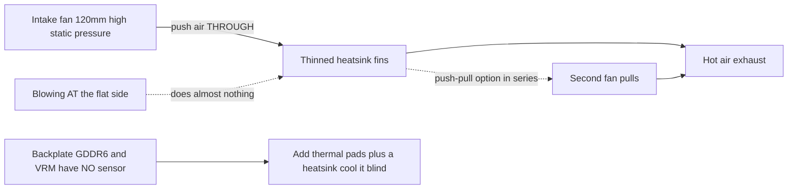

> 🌐 Коомчулук котормосу. Англис тилиндеги нуска — чындыктын булагы жана жаңыраак болушу мүмкүн. Ката таптыңызбы? Issue ачыңыз: [English](../en/04-cooling.md) · [issues](https://github.com/lildebil0/awesome-bc250/issues)

# Сууткуч

> **Кыскача** — BC-250'тин стандарттык радиатору столго эмес, сервердик стойканын мажбурланган аба түтүгүнө арналып жасалган. Кутудан чыкканда ал троттлинг кылат. Коомчулуктун оңдоосу: **тыгыз стандарттык кырларды ичкертип** (файл/кагуу менен) жана алар *аркылуу* үйлөгөн **120 мм жогорку статикалык кысымдагы желдеткичти** (**Arctic P12 Max/Pro** — маалымдама; Noctua NF-P12 redux — тынч премиум альтернатива) бекитүү. Бул эле модификацияланган тактаны **Furmark'та ~73 °C, оюндарда 63–65 °C** деңгээлине алып келет. Суюк AIO жана толук атайын корпустар — кийинки деңгээлдер.

Сууткуч — **жаңы келгендер эң көп жаңылган нерсе #1**, ошондуктан овершклокторду кубалаардан мурун муну жасаңыз.

---

## Эмне үчүн стандарттык сууткуч жетишсиз

BC-250 — майнинг/сервердик такта. Анын радиатору **пассивдүү** жана катуу желдеткичтер абаны алдыдан артка карай мажбурлап айдаган корпуста отурганга арналган. Аба агымы жок столдо ал жылуулукка каныгат жана GPU троттлинг кылат. Желдеткичти жалпак тарапка *карай* үйлөө дээрлик эч нерсе бербейт — аба **кырлардын каналдары аркылуу**, ошондой эле арткы плита үстү менен өтүшү керек (арткы тараптагы GDDR6'нын **температура сенсору жок**, ошондуктан аны сокур муздатасыз).

Коомчулук байкаган чектер: троттлинг ~**85 °C**'те башталат, катуу крэш/кайра жүктөө ~**90 °C**'те. Жүк температураларын запас менен ~80 °C'дан төмөн кармаңыз.

> **Радиатордун үч варианты бар** (8 катар жана 9 катар кырлар). Тез аныктоо: **PCIe 8-pin коннекторунун жанындагы QR код** 9 катарлуу вариантты белгилейт. **Азыраак, калыңыраак кырлуу** вариант стандартта бир аз жакшыраак муздатышы мүмкүн. ([elektricM Cooling](https://elektricm.github.io/amd-bc250-docs/hardware/cooling/))

**Компонент боюнча температура максаттары** (elektricM текшерген сандар, жогорудагы троттлинг/крэш чектеринен майда-чүйдө):

| Компонент | Бош жүрүш | Жеңил жүк | Оюн | Макс |
|-----------|------|-----------|--------|-----|
| GPU/APU чети | 40–50 °C | 50–60 °C | 65–80 °C | 90 °C |
| CPU (Tctl) | 45–55 °C | 55–65 °C | 70–85 °C | 95 °C |
| Эс тутум (асты) | 40–55 °C | 50–65 °C | 55–70 °C | 80 °C |
| NVMe/SSD | 40–55 °C | 50–65 °C | 60–75 °C | 80 °C (критикалык 81.8 °C) |

Оюндарда **70–80 °C GPU** максат кылыңыз. NVMe чеги бул жерде маанилүү, анткени **GDDR6 жана M.2 SSD тактанын ысык арткы тарабын бөлүшөт** — SSD эң начар жылуулук орунда отурат жана кызып кетиши мүмкүн, ошондуктан аны байкаңыз (`80 °C` макс, дискинин спецификациясы боюнча `81.8 °C` критикалык). ([elektricM: sensors](https://elektricm.github.io/amd-bc250-docs/system/sensors/))

> **CPU Tctl баскычтары.** elektricM **90 °C Tctl**'ди сунушталган артка чегинүү чеги катары белгилейт; таблицадагы **95 °C** — оор оюнда дагы көрө турган жогорку чек; **TJmax = 100 °C** — кремнийдин абсолюттук чеги (төмөндөгү корпус-кубаты таблицасы туруктуу стресс жүгүндө CPU'ну так ошого кадайт). Демек: **90 °C = «азыр чегин», 95 °C = «кызылга кирдиң», 100 °C = «дубалга жеттиң»**. ([elektricM: sensors](https://elektricm.github.io/amd-bc250-docs/system/sensors/))

> **Жылуулук абалы боюнча корпус кубаты** (elektricM ар бир абалды тактанын кубат сarpyloosу менен жупташтырат): Бош жүрүш **50–70 W**, Жеңил **100–150 W**, Оор **150–200 W**, Стресс **200–235 W**. PSU'ну өлчөмдөө жана тактанын розеткадан канчалык катуу иштеп жатканын окуу үчүн пайдалуу. ([elektricM: sensors](https://elektricm.github.io/amd-bc250-docs/system/sensors/))

> **Оюн учурундагы пиксель артефакттары = VRAM ысып жатат.** Арткы тараптагы GDDR6'нын сенсору жок болгондуктан, ал визуалдык глюк — сиздин эскертүү белгиңиз — арткы плитага аба агымын/төшөмөлөрдү кошуңуз (төмөндө). ([elektricM Cooling](https://elektricm.github.io/amd-bc250-docs/hardware/cooling/))

> **Кремний лотереясы — ар бир чипке жылуулук запасын болжолдоңуз.** Эки физикалык жактан бирдей такта, бирдей корпус жана OC конфигурациясы менен **5–10 °C айырмаланып** иштеши мүмкүн, ал эми ысыгыраагы кайра паста/төшөм коюудан кийин да ысыгыраак бойдон калды. Башка бирөөнүн температурасы сиз디кине туура келет деп болжолдобоңуз. ([r/BC250Gaming](https://www.reddit.com/r/BC250Gaming/))



---

## Туруктуу эсептөө — бул башка режим (оюндун жарылууларынан гана эмес)

Жогорудагы максаттар **оюнду** болжолдойт, анда жүк жарылуулар менен келет. **Туруктуу** эсептөө — кайталанган `llama-bench`, узак Stable-Diffusion прогондору, GPU'ну ондогон мүнөткө толук кадаган баары, **айрыкча [40 CU ачуу](../en/09-overclock-undervolt.md) менен** — алда канча катуу жүк жана оюндук деңгээлдеги сууткуч кармай турган чектен ашышы мүмкүн.

elektricM стандарттык радиатор + **push–pull режиминдеги эки Arctic P12 Max** менен, **40 CU / 2 GHz**'те 10 мүнөттүк туруктуу `llama-bench`'ти өлчөдү:

| Метрика | Орточо | Чокусу |
|--------|---------|------|
| GPU чети | 89.6 °C | 107 °C |
| Корпус кубаты | 136 W | 223 W |
| CPU | 96.7 °C | 100 °C (TJmax) |
| VRM MOSFET'тери | 57 °C | 58.5 °C |
| Желдеткич ылдамдыгы | ~2950 RPM | 2977 RPM (чек) |

Прогон бою корпус троттлинг кылгандыктан өткөрүмдүүлүк **~10%** төмөндөдү. Тыянак: **стандарттык радиатор + эки P12 Max туруктуу 40 CU @ 2 GHz үчүн жетиштүү запас эмес** — жана **VRM'дер өз чектеринен алыс** (57 °C) экенин эскериңиз, демек тоскоолдук желдеткичтерде же кубат тепкичинде эмес, *радиатордун жылуулукту чыгаруусунда*. Эки оңдоо: **GPU governor'ун 1500 MHz'ке чектөө** (40 CU дагы ~1.5× эсептөөгө масштабдалат, температура ~83 °C кармалат — эки P12 Max'та чексиз туруктуу), же **радиаторду жаңыртуу** (көбүрөөк кыр аянты). **24 CU стандарт оюну** үчүн эки P12 Max ыңгайлуу; дубал туруктуу толук-CU эсептөөдө гана пайда болот. ([elektricM Cooling](https://elektricm.github.io/amd-bc250-docs/hardware/cooling/))

---

## Жол A — Аба модификациясы (эң популярдуу, эң арзан)

Чаттагы көпчүлүк ушуну колдонот.

### 1. Стандарттык кырларды ичкертүү/тазалоо
Стандарттык кырлар өтө тыгыз жана көбүнчө бирдей эмес. Адамдар аба өтсүн деп каналдарды ачышат:

- **Орбиталдык (эксцентрик) кагуучу** — эң ылдам, мүнөттөрдө бүтөт, эң мыкты натыйжа. ([src](https://t.me/c/2424231195/31571))
- **Кол менен наждак** — 60 grit, анан 240 grit, эки күндө ~3–4 саат + 2 саат. Иштейт, бирок жай. ([src](https://t.me/c/2424231195/50330))
- **Кайчы / кескич** — орой «чекрыжить» ыкмасы, акыркы амал; натыйжасы эң начар. ([src](https://t.me/c/2424231195/41252))
- **Кайчы + сызгыч багыттооч (таза вариант)** — кол өнөрчүлүк/чач тарач кайчысын кырлардын аралыгына **бычакка ыктаган сызгычты багыттооч катары** колдонуп киргизиңиз; чөнтөк бычак «консерва ачкыч» ыкмасы да ошондой иштейт. Эскертүү: кээ бир такта варианттарында **бычакты баштаганга аралык жок** — отвертка/пинцет менен бирөөнү ачыңыз, же **кичинекей Dremel кескич дөңгөлөгү** менен кируу оюгун кесиңиз. Кыр оюктарынан кеңирээк бычактар радиаторду бузушу мүмкүн. ([r/BC250Gaming](https://www.reddit.com/r/BC250Gaming/))
- Ийилген кырларды **жалпак пинцет + кычкач** менен түздөңүз. ([src](https://t.me/c/2424231195/30670))
- **Кырларды кол менен жулуу** — elektricM жумшак алюминий кырларды (радиатор тактадан алынганда) **таза айрып/жулуп ажыратса** болорун белгилейт, бул кескич аспаптар жараткан металл жоңкосунан качат. Жайыраак, бирок калдыксыз. ([elektricM Cooling](https://elektricm.github.io/amd-bc250-docs/hardware/cooling/))
- **«Scooper by Justin»** — **BC-250 радиаторунун кырларын кысуу/ачуу үчүн атайын жасалган 3D басып чыгарыла турган аспап** ([Printables 1282906](https://www.printables.com/model/1282906-bc-250-scooper)). Жалаң отверткадан коопсузураак: ал өтө катуу басып, кырлардын ортосундагы радиатордун **негизин** оюп жибербешиңиз үчүн токтотот. ([r/linux_gaming community thread](https://www.reddit.com/r/linux_gaming/comments/1nvsgji/)) Күтүүлөрдү тууралаңыз: бир ээси басып чыгарылган **«тарак/scooper» аспабы 2-колдонууда сынды** жана колду чарчатты деп билдирген. ([r/BC250Gaming](https://www.reddit.com/r/BC250Gaming/))
- **Хобби кычкач — «сыдыруу» ыкмасы** — кырлардын **үстүн** кичинекей хобби кычкач менен кармап сыдырыңыз, **металлдын өзүнүн эс тутумун сыныш чекити катары** колдонуп, алар негизин айрбай, ийилген жеринен таза сынсын. Кесүүгө караганда калдыгы аз альтернатива. ([r/linux_gaming community thread](https://www.reddit.com/r/linux_gaming/comments/1nvsgji/))

Болжолдуу температура пайдасы (elektricM): **ийилген кырларды түздөө ~5–10 °C**, **борбордогу кырларды алып салуу ~10–15 °C** (артка кайтарылбас — жакшы желдеткич кожух кеспестен ушундай эле пайда берет), эски паста кургап калган болсо **жаңы паста ~5–10 °C**. ([elektricM Cooling](https://elektricm.github.io/amd-bc250-docs/hardware/cooling/))

> ⚠ **Кагуу/файлдоодон мурун радиаторду тактадан алыңыз** (же тактаны жана кристаллды толук жаап/коргоңуз), жана **чогултуудан мурун ар бир металл чаңды тазалаңыз**. Тактага түшкөн өткөргүч металл жоңкосу аны кыска туташтырып **тактаны өлтүрө алат** — бул чатта мурда болуп өткөн.

<p align="center">
  <br>
  <sub>Сүрөт: AMD BC-250 community · <a href="https://t.me/c/2424231195/31571">source</a></sub>
</p>

### 2. Чыныгы желдеткичти бекитүү
Кырлар аркылуу аба үйлөгөн **120 мм жогорку статикалык кысымдагы желдеткичти** орнотуңуз. Маалымдама тандоо — **Arctic P12 Max (же P12 Pro)** — эң жогорку статикалык кысым (~6.9 mm H₂O), бул тыгыз радиатор үчүн коомчулук + elektricM тандоосу. **Noctua NF-P12 redux** — тынч премиум альтернатива, ал **Furmark'та макс 73 °C, оюндарда 63–65 °C** маалымдама натыйжасын жарыялаган ([src](https://t.me/c/2424231195/42843)).

**Спецификациялары менен конкреттүү желдеткич тандоолору** (elektricM — аба агымы боюнча эмес, *статикалык кысым* боюнча тандаңыз):

| Желдеткич | Өлчөмү | Макс RPM | Статикалык кысым | Аба агымы | Шуул | Оюн температурасы |
|-----|------|---------|----------------|---------|-------|--------------|
| **Arctic P12 Max** | 120 mm | 3300 | **6.9 mm H₂O** | 73.3 CFM | 52.5 dB(A) | 65–75 °C |
| **Arctic P12 Pro** | 120 mm | 2100 | **6.9 mm H₂O** | 68.9 CFM | 37.8 dB(A) | 65–75 °C |
| Arctic P14 PWM | 140 mm | 1700 | 2.40 mm H₂O | 72.8 CFM | 38 dB(A) | 70–80 °C |
| Noctua NF-A12x25 | 120 mm | 2000 | 2.34 mm H₂O | 60.1 CFM | 22.6 dB(A) | 70–85 °C |

elektricM'дин **эң көп сунуштаган тандоосу — Arctic P12 Max / P12 Pro** — анын ~6.9 mm H₂O статикалык кысымы Noctua'нын 2.34 mm'ин басып, алда канча арзан; P12 Pro — тынчыраак, кеңири жеткиликтүү версия. Премиум Noctua андан да тынч, бирок Arctic менен температурада жогорку RPM'де гана теңелет. ([elektricM Cooling](https://elektricm.github.io/amd-bc250-docs/hardware/cooling/))

**Коомчулук курулмаларынан башка аталган желдеткичтер** (Arctic/Noctua-P12 маалымдамасынан тышкары, адамдар орноткон конкреттүү моделдер):

- **Noctua NF-A12x25 G2** (PWM) **120 мм кристалл сууткучу** катары — A12x25'тин жаңы G2 ревизиясы, негизги желдеткич катары колдонулган ([TiredDadTech](https://youtu.be/zi7sldeRd2w)). (Жогорудагы желдеткич таблицасында *баштапкы* NF-A12x25 гана бар.)
- **Noctua NF-A6x15 PWM** (≈3500 rpm) **60 мм PSU-желдеткич алмаштыруусу** катары — кыйкырган сервердик-кирпич желдеткичинин тынч алмаштыруучусу ([TiredDadTech](https://youtu.be/zi7sldeRd2w)).
- **Thermalright 120 mm 1550 rpm ARGB** бюджеттик кристалл желдеткичи катары, жана арткы плита үчүн **6.0 W/mK жылуулук төшөмөлөрү** — экөө тең **TMG HD build BOM**'дон ([build overview](https://youtu.be/OEO0r01zcfU)).

> **Маалымдама vs тынч альтернатива.** **Arctic P12 Max/Pro** — бул жердеги маалымдама желдеткич — эң жогорку статикалык кысым (~6.9 mm H₂O), эң арзан, бул тыгыз радиатор үчүн коомчулук + elektricM тандоосу. **Noctua NF-P12 redux** — тынч премиум альтернатива (чаттын 73 °C Furmark натыйжасы), Arctic менен температурада жогорку RPM'де гана теңелет. Эң жакшы баа/өндүрүмдүүлүк үчүн Arctic'ти, тынчтык эң маанилүү болсо Noctua'ны тандаңыз.

Желдеткич абаны айланасынан агызбай, радиаторго тыгыз жабылышы үчүн **басып чыгарылган желдеткич кожухун/адаптерин** колдонуңуз. Коомчулук STL'дери:
- `Fan_Shroud_Single_120mm.stl`, `Fan_Shroud_Dual_120mm.stl`, `Fan_Shroud_Single_140mm.stl`, `Twin_120mm_Fan_Shroud.stl`
- `BC250_FanAdapter_120mm.step`, `bc250 cooler mount.stl`, `cooler adapter v3.0.stl`

> **Эмне үчүн аба агымы рейтинги эмес, статикалык кысым?** Тыгыз кырлар — жогорку каршылыктуу жүк. Жогорку аба агымдуу «корпус желдеткичи» аларга такалып токтоп калат; жогорку статикалык кысымдагы желдеткич (≥3 mm H₂O; Noctua P12, Arctic P12) абаны чындап *аркылуу* айдайт. Абдан тыгыз кырлар үчүн эки желдеткич **push–pull (катар)** менен статикалык кысымды эки эселейт — бул жерде туура кадам ушул, эки желдеткичти жанаша коюу эмес.

**Бекитүү:** басып чыгарылган кожух эң мыкты, бирок желдеткичти радиаторго **zip-tie** менен байлоо да иштейт, ал эми желдеткич менен кырлардын ортосуна скотч менен жабыштырылган **картон/пенопласт түтүгү** — жарактуу акысыз амал (көрксүз, бышык эмес, бирок аба жолун жаап турат). ([elektricM Cooling](https://elektricm.github.io/amd-bc250-docs/hardware/cooling/))

> ⚠ **Желдеткичтерди кырларга түз бургулабаңыз/бурабаңыз.** Алюминий жумшак жана кырлар ичке — аларга бурап кийирүү кыр тизмесин бузат жана муздатууга зыян келтирет. Zip-tie же басып чыгарылган кожух колдонуңуз. ([elektricM Cooling](https://elektricm.github.io/amd-bc250-docs/hardware/cooling/))

> ### 🛠 Аба агымынын инженериясы — чындап натыйжа берген нерсе
>
> Кайсы желдеткич гана эмес, абанын *кантип* айдалары боюнча коомчулук тыянактары:
>
> - **Тыгыз кыр тизмеси аркылуу статикалык кысым таза CFM'ден жогору** — ошондуктан жогорку статикалык кысымдагы **Arctic P12 Max (6.9 mm H₂O)** бул радиатордо тынчыраак жогорку аба агымдуу/төмөн кысымдуу желдеткичтерден ашат.
> - **Бир борбордук желдеткич эки жанаша желдеткичтен мыкты болушу мүмкүн** толук кесилген кыр тегиздигинде: бир борбордук желдеткич **4 борбордук жылуулук түтүгүн** түз жүктөйт, ал эми эки желдеткич борбордун үстүндө өлүк пластик «жик» калтырат. Кырларды толук тегиздикте биринчи кескен курулмачы бир борбордук желдеткичте эки желдеткичке караганда бир нече °C **төмөн** өлчөдү ([src](https://t.me/c/2424231195/46175)). Бир бөлүктөө да аба агымы тарабынан ушундай эле тыянакка келет: **жанаша бекитилген эки желдеткич бирөөнөн жакшы эмес**, анткени эки кируу жолу кошулган **ысык кристаллдын борборунун дал үстүндө өлүк зона түзүлөт** — **алардын ортосуна аралык калтырыңыз, же push-pull кылыңыз** ([Old Lamer — Part VII](https://youtu.be/pxahl9-YgkY) ~19:55). *(Caption булагы — так эмес, сапаттык катары кабыл алыңыз.)*
> - **120 мм желдеткич ылдамдыгынын чеги ≈1800 RPM** бул тыгыз тизме аркылуу чындап аба айдоо үчүн; **Arctic P12 Pro** ($8–10, **600–3000 rpm** диапазону) — бош жүрүштө тынч калган жана дагы запасы бар оңой тандоо ([Old Lamer — Part VII](https://youtu.be/pxahl9-YgkY)). *(ASR сандары — болжолдуу.)*
> - **Чыгаруу желдеткичин кошуу = −3'төн −5 °C.** Жалаң кируу **73 °C** → чыгаруу менен **67–68 °C** ([src](https://t.me/c/2424231195/68183), [src](https://t.me/c/2424231195/31553)). Демек оптималдуу жөнөкөй жөндөө — **1 борбордук кируу + 1 арткы чыгаруу**, эки жанаша кируу эмес.
> - **Арткы плита сокур жана ысык.** VRM MOSFET'тери муздатылбаганда **~100 °C**'ге жетет ([src](https://t.me/c/2424231195/110955)) — ага **сөзсүз** төшөмөлөр + радиаторлор + атайын аба агымы керек; арткы радиаторлор менен ал жүктө *«муздак»* иштейт ([src](https://t.me/c/2424231195/93056)).
> - **Акысыз физика.** Ысык аба өйдө көтөрүлөт, ошондуктан **кыйшайтуу/мор** багыты да жардам берет — араң желдетилген арткы плита жалаң конвекциядан **47 °C** өлчөгөн ([src](https://t.me/c/2424231195/76962)). Жана **кара анодделген радиатор жылтыратылганга караганда ~1.8×** көбүрөөк нурлантат, бул пассивдүү/жарым-пассивдүү компакт курулмаларда кыр аянтын **~45%** кичирейтүүгө мүмкүндүк берет ([src](https://t.me/c/2424231195/86878)).
> - **Кируу > чыгаруу** (бир аз **оң кысым**) кылыңыз, ошондо сенсорсуз VRM/VRAM дайыма жаңы абага чөмүлүп турат.

### Альтернатива: стандарттык кырларды сактоо (кеспестен push-pull корпусу)
Кырларды кесүү милдеттүү эмес. **penzoiders** кырларды **кеспеген** корпус долбоорлогон ([MakerWorld, FreeCAD source](https://makerworld.com/models/2505974)): ал **стандарттык, модификацияланбаган кырлар** аркылуу абаны мажбурлоо үчүн **push-pull жогорку статикалык кысымдагы желдеткичтерди**, ошондой эле арткы плитаны да муздаткан **эки камералуу кысым айырмасын** (5 mm радиаторлор + жылуулук төшөмөлөрү; кайра колдонулган NVMe радиаторлору иштейт) колдонот. Муздак калган жөндөө: **CPU 3800 MHz / 1050 mV, GPU 2100 MHz / 950 mV** → параллель Furmark + `stress-ng` **85 °C'дан төмөн** калат; оюн **желдеткичтин болжол менен 50% дежатисинде ~75 °C** (CoolerControl ийри сызыгы), «араң угулат». ([r/BC250Gaming](https://www.reddit.com/r/BC250Gaming/))

## Жол B — AIO суюк сууткуч

Адаптер бекиткичи аркылуу кристаллга орнотулган 120 мм AIO. Тынч жана муздак, бирок көбүрөөк бөлүк жана баасы кымбат. Популярдуу курулмалар арзан AIO'лорду колдонот (мис. aigo). ([example src](https://t.me/c/2424231195/19336))

<p align="center">
  <br>
  <sub>Сүрөт: AMD BC-250 community · <a href="https://t.me/c/2424231195/19336">source</a></sub>
</p>

**Аталган, жүктөлө турган AIO бекиткичи — NexGen3D** ([Printables 1554003](https://www.printables.com/model/1554003), ABS-GF же PETG менен басып чыгарыңыз). **Thermalright 240 mm AIO** менен текшерилген: GPU **~50 °C @ 2000 MHz**, CPU **макс 60 °C**. ([r/BC250Gaming](https://www.reddit.com/r/BC250Gaming/))

### Суюк-муздатылган овершклок профилдери
AIO менен алда канча катуу басса болот. **NexGen3D** розеткадан өлчөгөн (Furmark Vulkan + `stress-ng --matrix 0 -t 60m` күйгүзүү комбинациясы катары):

| Профиль | CPU | GPU | Макс күйгүзүү темп | Розетка кубаты | Эскертүү |
|---------|-----|-----|---------------|------------|------|
| 1 | 4000 MHz | 2400 MHz | ~65 °C | >350 W | «таптакыр тынч» |
| 2 | 4100 MHz | 2450 MHz | ~75 °C | <400 W | ысыгыраак, катуураак |

Кадимки 1080p оюну бул күйгүзүү температураларынан **10–15 °C төмөн** жана Профиль 1'де **250 W'дан төмөн** иштейт. **Көчүрүүгө татыктуу аба агымы схемасы:** 120 мм желдеткичтер **радиатор аркылуу сыртка чыгарат**, бул жаңы сырткы абаны **VRM / PSU / VRAM арткы плитасы** аркылуу тартат; өзүнчө **80 мм желдеткич (Arctic P8 Max)** GPU VRM'дерин муздатат — бул жогорудагы «сенсорсуз VRM/VRAM дагы эле аба агымын талап кылат» эскертүүсүнө жооп берет. ([r/BC250Gaming](https://www.reddit.com/r/BC250Gaming/))

## Атайын суу контуру (өркүндөтүлгөн)

Жабык AIO'дон тышкары, бир нече адам **толук атайын контур** колдонот. Бул чыныгы, бирок **DIY/эксперт** чөйрө: курулмачылар **кристаллды *жана* VRM'ди** бир блокто жапкан **атайын суу блогун CNC-фрезерлейт же ширетет** ([src](https://t.me/c/2424231195/131065), [src](https://t.me/c/2424231195/131844), [src](https://t.me/c/2424231195/118582)). Фитингдер критикалык эмес — *«дээрлик каалаганын таап, жасап же жабыштырса болот»* ([src](https://t.me/c/2424231195/132007)).

**Бул эмне берет:** орой атайын контур **желдеткичтер 30% гана иштеп, сырткы насос дээрлик үнсүз** болуп жүктө **~50 °C**'ге жетет ([src](https://t.me/c/2424231195/133040)). (Бир курулмачы анан стандарттык cyan-skillfish governor конфигурациясында жүктө VRM чоктарынан coil-whine байкаган — бул *өзүнчө* маселе, жылуулук эмес.) Ошондой эле **Corsair Commander керек эмес**: BC-250'тин өзүнүн [желдеткич башкаруусу](#желдеткич-ылдамдыгын-башкаруу-программалык) насосту плюс **~5 желдеткичти** айдай алат ([src](https://t.me/c/2424231195/140123)).

> ⚠ **Эмне үчүн бул «өркүндөтүлгөн»: BC-250 муздаткыч ташкынын аман калбайт.** Коомчулуктан чыныгы катачылыктар: шланг **90°'та сынып, жарылып, GPU жана PSU'ну ташкындатты** ([src](https://t.me/c/2424231195/81158)); **тыгылып калган Corsair AIO насосу CPU'ну кууруп жиберди** ([src](https://t.me/c/2424231195/133147), [src](https://t.me/c/2424231195/126053)). Ошондой эле ~50% насос ылдамдыгынан жогорку **насос кавитациясын/шуулдоосун** байкаңыз ([src](https://t.me/c/2424231195/7034)). **Биринчи нымдуу күйгүзүүдөн мурун бүт контурду тактадан АЛЫП 24 саат сызганга текшериңиз.**

**Корутунду:** бардык варианттардын ичинен эң төмөн температура жана эң тынчы, жана ал туруктуу 40-CU'ну мүмкүн кылат — бирок эң жогорку тобокел жана аракет. **Биринчи курулма эмес.**

## Жол C — Үйлөгүч («улитка») — сунушталбайт

Утилизацияланган GPU үйлөгүч желдеткичтери эрте эксперимент болгон. Натыйжасына карата катуу; адамдар Жол A'га өттү. ([src](https://t.me/c/2424231195/100086))

## Жол D — Мунаралуу сууткучка айландыруу (өркүндөтүлгөн)

Кээ бир колдонуучулар даяр аппараттык каражаттарды колдонуп, эң мыкты, тынч муздатуу үчүн **AM4 мунаралуу сууткучун** (мис. **Thermalright Peerless Assassin**, же башка AM4/AM5 мунаралары) кристаллга бекитет. Чеки: аны **бекиткич аркылуу орнотушуңуз керек**, жана бийик мунара **M.2 уясын же башка компоненттерди** тосуп калышы мүмкүн. Жаңы баштагандын модификациясы эмес. Эми аны нөлдөн жасоонун кереги жок — эки жарыяланган 3D басып чыгарылган бекиткич бар:

- **AM4/AM5 десктоп-сууткуч адаптери** ([MakerWorld 2596083](https://makerworld.com/en/models/2596083), FreeCAD source кошулган). Стандарттык десктоп AM4/AM5 сууткучун BC-250'ге орнотот. Бекитүү: **M5 болттор + гайкалар, standoff'сиз** (OP M4 идеалдуу болмок дейт, бирок M5 тыгыз батты). **ABS, PETG же ASA** менен басып чыгарыңыз. **CPU 3.95 GHz / 1.150 V, GPU 2200 MHz / 1000 mV, температура 80 °C'дан ашпай** текшерилген. Колдонулган сууткучтар: төмөн профилдүү **AXP90-классы** (бир комментатор **AXP120** колдонгон), жана атүгүл **AMD Wraith Spire** стандарттык радиатордон ашты. ([r/BC250Gaming](https://www.reddit.com/r/BC250Gaming/))
- **Thermalright AXP90-X53 бекиткичи** ([Printables 1694793](https://www.printables.com/model/1694793)). Жиптүү салмалар басып чыгарылган бекиткичтин **астына ширетилет**, ошондуктан сиз **баштапкы пружиналуу стандарттык-радиатор бурамаларын кайра колдоносуз**; баш болттор астынан өйдө келип жашырылат, жана бекиткичте такта компоненттерин кетирүү үчүн **бекемдегичтин астында 0.5 mm аралык** бар. Fusion 360'та долбоорлонгон, **PETG менен басып чыгарыңыз** (PLA бул температурада жумшарат). Натыйжа: **толук жүктө @ 2150 MHz, 1080p 65–67 °C**, абдан тынч (жез сууткуч, 120 мм Arctic P12 Pro менен жупташкан). Өлчөнгөн тизме бийиктиги — **PCB'дан 15 mm желдеткичтин үстүнө чейин 54 mm** — корпуска батырууга пайдалуу. **3 калыңдыктагы вариант топтому** жана **AXP120-X67** версиясы да бар. ([r/BC250Gaming](https://www.reddit.com/r/BC250Gaming/))

---

## Желдеткич ылдамдыгын башкаруу (программалык)

Желдеткич бекитилгенден кийин анын PWM'ин тактанын **Nuvoton NCT6686D** Super I/O чиби аркылуу башкарасыз — бирок **кайсы драйверди жүктөгөнүңүз маанилүү** ([elektricM hardware spec](https://elektricm.github.io/amd-bc250-docs/)):

- **Жалаң окуу сенсорлору** (желдеткич RPM, температура): ядродогу **`nct6683`** модулу, `force=true` менен жүктөлөт. Ал көрсөткүчтөрдү билдирет, бирок **PWM жаза албайт**, ошондуктан желдеткич BIOS/firmware койгон деңгээлде калат.
- **PWM окуу + жазуу** (желдеткич ылдамдыгын чындап коюу): **[Fred78290/nct6687d](https://github.com/Fred78290/nct6687d)**'дан, ошондой эле `force=true` менен, дарак-сырткы **`nct6687`** модулун колдонуңуз. Эгер мониторинг гана эмес, желдеткич ийри сызыктары / кол менен ылдамдык башкаруу кааласаңыз, муну куруу керек.

```bash
# monitoring only (in-kernel):
echo 'options nct6683 force=true' | sudo tee /etc/modprobe.d/nct6683.conf
# PWM control (DKMS from Fred78290/nct6687d):
echo 'options nct6687 force=true' | sudo tee /etc/modprobe.d/nct6687.conf
```

> Экөөнү тең жүктөбөңүз — жалаң окуу сенсорлору үчүн `nct6683`'ти же окуу+жазуу үчүн `nct6687`'ти тандаңыз. Сенсор зымдоосу (`CPU_FAN1` / `J4003`) жана BIOS↔Linux желдеткич номерлөөсү [06-linux.md](../en/06-linux.md)'тин текшерүү кадамында бар.

**Кайсы коннектор негизги желдеткич?** elektricM муздатуу желдеткичи көбүнчө **Pump Fan** коннекторунда = sysfs'те **`fan2` / `pwm2`** деп билдирет; `CPU Fan` (`fan1`) жана `System Fan` коннекторлору (`fan3`+) адатта колдонулбайт. PWM жазаардан мурун кол режимин иштетиңиз (`echo 1 > .../pwm2_enable`, анан `.../pwm2`'ге 0–255 маани). hwmon номерлөөсү кайра жүктөөлөрдүн ортосунда жылышы мүмкүн — `cat /sys/class/hwmon/hwmon*/name` менен ырастаңыз. ([elektricM Cooling](https://elektricm.github.io/amd-bc250-docs/hardware/cooling/))

**GUI менен желдеткич ийри сызыктары — CoolerControl.** `nct6687` жүктөлгөндөн кийин **CoolerControl** графикалык желдеткич ийри сызыктарын берет: **nct6686** түзмөгүн тандап, **k10temp Tctl**'ди булак катары колдонуп **pwm2**'де ийри сызык курат. Орнотуу: `ujust install-coolercontrol` (Bazzite), `codifryed/CoolerControl` copr (Fedora), же AUR'дан `coolercontrol` (Arch); веб UI `https://localhost:11987`'те. ([elektricM Cooling](https://elektricm.github.io/amd-bc250-docs/hardware/cooling/))

**BIOS желдеткич режимдери** (OS тарабындагы башкарууну колдонбосоңуз): **Default** желдеткичтерди **40% минимумда** кармайт (өтө төмөн — сунушталбайт), **Full Speed** аларды 100%'те кадайт (катуу, бирок коопсуз), **Customize** ар бир чек боюнча ылдамдыктарды коёт. ([elektricM Cooling](https://elektricm.github.io/amd-bc250-docs/hardware/cooling/))

> ⚠ **BIOS Customize режимин жана CoolerControl'ду бир убакта иштетпеңиз** — алар PWM башкаруусу үчүн талашат. Бирөөнү тандаңыз. ([elektricM Cooling](https://elektricm.github.io/amd-bc250-docs/hardware/cooling/))

---

## Жылуулук интерфейси (паста, төшөмөлөр, фаза алмашуу, суюк металл)

Кайсы желдеткич/радиатор колдонсоңуз да, кристалл менен радиатордун ортосундагы — жана тактанын арткы тарабы менен кандайдыр бир арткы плита радиаторунун ортосундагы — **жылуулук интерфейс материалы (TIM)** туура тандалганга татыктуу. BC-250 кристаллынын **жылуулук тыгыздыгы жогору**, ошондуктан жакшы TIM — акысыз бир нече градус.

> **Жөн гана стандарттык пастаны алмаштыруу жардам берет.** Бир ээси бир жылдан кийин заводдук пастаны алмаштырып, башка баары өзгөрбөстөн, жүк температурасы **~4–5 °C** төмөндөдү. ([src](https://t.me/c/2424231195/88565))

### Иштеген пасталар
- **Arctic MX-6** — кадимки жогорку класстагы паста. Бир корпустагы курулмада ал **Furmark'та 87–88 °C** кармады; ошол эле ээси PTM7950 андан дагы ~4 °C алып салмак деп белгиледи. ([src](https://t.me/c/2424231195/30211))
- **Стандарттык паста + стандарттык төшөмөлөр** — документтештирилген баштапкы чек: 10 мүнөттүк жүктөн кийин ~**76 °C**, бош жүрүштө ~**55 °C** (кыр/желдеткич модификациясынан мурун). ([src](https://t.me/c/2424231195/22992))
- elektricM бул жерде жакшы деп тизмелеген башка пасталар: **Arctic MX-4** (баалуу), **Thermal Grizzly Kryonaut** (премиум), **Noctua NT-H1** (ишенимдүү), **Thermalright TFX** (бюджеттик). Колдонулган тактанын пастасы **көбүнчө кургап калат** — жөн гана кайра паста коюу **~5–10 °C**'ге татыктуу. Кристаллга буурчак өлчөмүндөгү чекит коюп, бирдей орнотуп, бурамаларды **X үлгүсүндө** бекемдеңиз. ([elektricM Cooling](https://elektricm.github.io/amd-bc250-docs/hardware/cooling/))

### PTM7950 — коомчулуктун сүйүктүүсү (сунушталат)
**PTM7950** — **фаза алмашуу төшөмөсү** (Honeywell графит/фаза алмашуу пленкасы). Бөлмө температурасында ал ичке катуу барак; жүктө (~45–55 °C) ал жумшарып, микрон-ичке катмарга агат, анан ордунда калат. Ал май сыяктуу **сыртка чыкпайт** же кургабайт, бул ысык, жылуулук менен айланган кристаллдын астында так керектүү нерсе — ошондуктан аны бир жолу коюп, унутасыз. Чаттын тике корутундусу: *«PTM7950 жана көп ойлонбо»* ([src](https://t.me/c/2424231195/101582)); фаза алмашуу — жалпы сунуш ([src](https://t.me/c/2424231195/61511)).

**Кантип колдонуу керек:**
1. Кристаллды жана радиатордун негизин тазалаңыз (изопропил спирти), кургатыңыз.
2. PTM7950'дан кристалл өлчөмүнө квадрат кесиңиз — **~26×30 mm** бөлүк BC-250 кристаллын жабат ([src](https://t.me/c/2424231195/125748)).
3. Бир коргоочу пленканы сыйрып, төшөмөнү кристаллга коюп, экинчи пленканы сыйрыңыз.
4. Радиаторду орнотуп, бирдей бекемдеңиз. **Жайбоо жок** — биринчи жылуулук цикли ишти жасайт. Эң мыкты температураларды бир нече жүк/бош жүрүш циклинен («burn-in») кийин күтүңүз.

PTM7950'дагы (Honeywell, 26×30) плюс арткы плита радиатору менен маалымдама корпустук курулма CPU 3850 MHz / GPU 2100 MHz'те **бир саатта ~84 °C, оюндарда 66–71 °C** чокусуна жетет. ([src](https://t.me/c/2424231195/125748))

> **Аталган жуптуктар: Upsiren шпатлевкасы радиатордун астына + PTM7950 кристаллдын үстүнө.** Бир курулма видеосу аралык толтуруу орундары үчүн **Upsiren UTP-6 / UTP-8 жылуулук шпатлевкасын** (**UTP-8** сорту ≈**14.8 W/mK** деп бааланган) кристаллдын үстүнө коюлган **40×80×0.25 mm кесилген PTM7950 баракчасы** менен жупташтырат ([PTM7950 + Upsiren video](https://youtu.be/FJapqZSdt6I)). Шпатлевка радиаторго/плитага бирдей эмес аралыктарды толтуруу үчүн; фаза алмашуу пленкасы кристаллдын өзүнө барат.
>
> - **Арзан AliExpress PTM7950 иштейт.** ~**$13**'дик AliExpress баракчасы иштээри текшерилген — фирмалык Honeywell кесими керек эмес ([PTM7950 + Upsiren video](https://youtu.be/FJapqZSdt6I)).
> - **PTM7950'ге кирүү мезгили керек.** Ал эң мыкты температураларга **бир нече жылуулук/муздоо циклинен** кийин гана жетет — аны биринчи прогондон баалабаңыз ([laptop TIM demo](https://youtu.be/U4Zm8msXJHM)).
>
> *(Эки булак тең авто-субтитрленген — так W/mK жана өлчөмдөрдү болжолдуу катары кабыл алыңыз.)*

### Арткы плита & GDDR6 төшөмөлөрү (артын сокур муздатуу)
Тактанын арткы тарабындагы **GDDR6 жана VRM'дин температура сенсору жок** — аларды сокур муздатасыз. Арткы тараптагы жылуулукка кетер жер болсун деп, **арткы плитага радиатор** коюп, **жылуулук төшөмөлөрү** менен туташтырыңыз. ([src](https://t.me/c/2424231195/125748)) Бир RU курулмачы жөн гана **Yandex.Market'тан радиатор** алып, аны арткы плитага жабыштырды, жана ал **түптүк плитаны жакшы муздатты** — бул жерде ар кандай орундуу өлчөмдөгү алюминий радиатор ишти аткарат ([4pda — mananoid1](https://4pda.to/forum/index.php?showtopic=1104980)).

Билдирилген төшөмө калыңдыктары (коомчулук бөлүшкөн, «муну сактап койдум» реакциясы):
- **VRM: 1 mm**
- **GDDR6: 2 mm** ([src](https://t.me/c/2424231195/121181))

> ⚠ **текшериңиз** — бул калыңдыктар *сиздин* конкреттүү арткы плитаңызга/радиаторуңузга чейинки аралыктан көз каранды. Көп төшөмө сатып аларда аралыкты өлчөп (же шпатлевка/чопо тести менен) ырастаңыз.

elektricM эс тутумдун өзүн муздатуу үчүн **бир аз башка төшөмө схемасын** берет: тактанын *алдыңкы* тарабына **1.5 mm төшөмөлөр, *арткы* тарабына 2.0 mm**, анан астына алюминий плита/радиатор. Тактанын жанында **жалаң өткөрбөгөн** төшөмөлөрдү колдонуңуз (компоненттерди кыска туташтыра турган өткөргүч паста/төшөмө эч качан). Анын тизмелеген төшөмө бренддери: **Thermalright Odyssey** (жогорку өндүрүмдүүлүк), **Arctic Thermal Pad** (баалуу), **Gelid GP-Ultimate** (премиум). ([elektricM Cooling](https://elektricm.github.io/amd-bc250-docs/hardware/cooling/))

> ⚠ **текшериңиз (төшөмө калыңдыктары булактар боюнча айырмаланат)** — биздин чат булагынан сандар **VRM 1 mm / GDDR6 2 mm (артта)**; elektricM эс тутум чиптери үчүн **1.5 mm алды / 2.0 mm арт** деп көрсөтөт. Башка курулмалар, башка аралыктар — кайсынысын болсо да сокур ишенбей, **өзүңүздүн аралыгыңызды өлчөңүз**.

> **Оюндун 30–60 мүнөтүнөн кийинки крэштер/туруксуздук** (көбүнчө пиксель артефакттары менен) — классикалык **эс тутум ысып жатат** белгиси. Оңдоолор: төшөмө + асты плитасын кошуу, арткы плита желдеткичин кошуу, корпус аба агымын жакшыртуу, же убактылуу **VRAM бөлүштүрмөсүн азайтуу** (мис. 4 GB → 512 MB) эс тутум жылуулугун кесүү үчүн. ([elektricM Cooling](https://elektricm.github.io/amd-bc250-docs/hardware/cooling/))

### Суюк металл — бул жерде жалпысынан сунушталбайт
Суюк металл (LM) сөзгө чыгат, анткени PS5 (бир үй-бүлөлүк APU) аны колдонот ([src](https://t.me/c/2424231195/18105)), жана таза өндүрүмдүүлүктө ал паста/PTM'ден бир аз ашат ([src](https://t.me/c/2424231195/124112)). Адамдар аны BC-250'де сурашкан жана сынашкан ([src](https://t.me/c/2424231195/18098), [src](https://t.me/c/2424231195/77180)).

**Бирок бул тактада туура эмес чечим:**
- LM **электр өткөргүч**. BC-250 кристаллы **тыгыз GDDR6 жана VRM**'дин дал жанында отурат; кристаллдан качкан тамчы тактаны кыска туташтырат (жогорудагы металл-жоңко эскертүүсүндөгү ошол эле «эс тутумдун жанындагы өткөргүч нерсе аны өлтүрөт» тобокели).
- Ал **сыртка чыгат / болжол менен жыл сайын кайра жасоону талап кылат**, жана жылаңач алюминийди коррозиялайт — атүгүл PTM7950 жактоочусу да дал ушул түйшүктөн улам өз аппаратурасында LM'ден баш тартып, PTM7950 / KryoSheet'ке өткөн. ([src](https://t.me/c/2424231195/69688))
- «Баары эле суюк металл менен иштөө ишин алып да койбойт.» ([src](https://t.me/c/2424231195/106787))

**Корутунду:** **PTM7950 — коопсузураак жогорку өндүрүмдүү тандоо** — пайданын ~99%'и, кыска туташуу/тейлөө тобокелинин эч бири жок. LM'ди эмне кылып жатканын так билгендерге калтырыңыз.

---

## Сууткучуңузду кантип тестирлөө керек (коомчулук ыкмасы, бекитилген)

Бекитилген процедурадан ([src](https://t.me/c/2424231195/108407)):

1. **GPU стресс:** Furmark (Vulkan / «Furmark VK»).
2. **CPU ошол эле учурда:** CPU бенчин (cpu-x) же `stress`/`pipx` негиздүү жүктү кошуңуз — APU бир радиаторду бөлүшөт, ошондуктан экөөнү чогуу тестирлеңиз.
   - Бул аспаптар (Furmark, OCCT, cpu-x, `stress`) жаңы Linux кутусунда **алдын ала орнотулбаган** — аларды алгач пакет менеджериңиз же Flatpak аркылуу орнотуңуз.
3. **Стандартта эмес, овершклокуңузда тестирлеңиз** — 1500 MHz алсыз; **2000 MHz — ~+30% FPS** жана чындап иштете турган нерсе, ошондуктан ошого муздатыңыз.
4. Температураны байкаңыз; ~85 °C'дан өтсөңүз троттлинг кылып жатасыз — желдеткич/кожух/кыр ишин кошуңуз.

> ℹ️ **Эки башка «+30%» ырастоосун чаташтырбаңыз.** Бул жердеги **GPU-жыштык +30%** (1500 → 2000 MHz FPS'ти болжол менен үчтөн бирге көтөрүү) — овершклоктоодон келген *өндүрүмдүүлүк* пайдасы. Бул өзүнчө ноутбук-TIM көрсөтмөсүндө **кайра паста** үчүн айтылган **~+30% жылуулук жакшыруусу** менен **бирдей эмес** ([laptop TIM demo](https://youtu.be/U4Zm8msXJHM)) — ал башка аппаратурадагы *температура* натыйжасы. Бирдей сан, байланышсыз нерселер.

Темада бекитилген эң жөнөкөй ыкманын кыска видео нускамасы да бар. ([src](https://t.me/c/2424231195/100024))

---

## Сунушталган баштапкы жөндөө

| Деңгээл | Муну жасаңыз | Күтүңүз |
|------|---------|--------|
| Минимум | Кырларды кагуу (орбиталдык кагуучу) + 1× Arctic P12 Max/Pro (же Noctua NF-P12) + басып чыгарылган кожух | ~73 °C Furmark |
| Жакшыраак | Кожух аркылуу push–pull (2× P12) | ошол эле температурада төмөнүрөк, тынчыраак |
| Макс | Адаптерде 120 мм AIO | эң муздак, көбүрөөк курулма аракети |

---

## Булактар

- Бекитилген тест ыкмасы — https://t.me/c/2424231195/108407 · видео — https://t.me/c/2424231195/100024
- Кыр аспаптары — https://t.me/c/2424231195/31571 · https://t.me/c/2424231195/30670 · https://t.me/c/2424231195/50330 · «Scooper by Justin» кыр аспабы ([Printables 1282906](https://www.printables.com/model/1282906-bc-250-scooper)) + хобби-кычкач сыдыруу ыкмасы — [r/linux_gaming thread](https://www.reddit.com/r/linux_gaming/comments/1nvsgji/)
- Noctua P12 натыйжасы — https://t.me/c/2424231195/42843
- AIO мисалы — https://t.me/c/2424231195/19336
- Жылуулук интерфейси — кайра паста −4–5 °C https://t.me/c/2424231195/88565 · MX-6 https://t.me/c/2424231195/30211 · стандарттык чек https://t.me/c/2424231195/22992 · PTM7950 https://t.me/c/2424231195/101582 · https://t.me/c/2424231195/61511 · PTM7950 курулма + арткы плита https://t.me/c/2424231195/125748 · төшөмө калыңдыгы https://t.me/c/2424231195/121181 · суюк металл https://t.me/c/2424231195/18098 · https://t.me/c/2424231195/69688
- elektricM сууткуч колдонмосу (радиатор варианттары, компонент боюнча температура таблицасы, туруктуу-жүк дайындары, желдеткич спецификациялары, CoolerControl/BIOS желдеткич режимдери, мунаралуу сууткуч, төшөмө схемасы) — https://elektricm.github.io/amd-bc250-docs/hardware/cooling/
- [elektricM: sensors](https://elektricm.github.io/amd-bc250-docs/system/sensors/) (жылуулук чектери: CPU Tctl 90 °C макс / TJmax 100 °C, NVMe/SSD 80 °C макс / 81.8 °C критикалык, жылуулук абалы боюнча корпус кубаты)
- r/BC250Gaming (коомчулук билдирүүлөрү: кремний-лотерея вариациясы, кайчы+сызгыч кыр ыкмасы, тарак-аспаптын сынуусу, кеспеген push-pull корпусу, AIO бекиткичи + 240 mm натыйжасы, суюк OC профилдери, AM4/AM5 + AXP90-X53 бекиткичтери) — https://www.reddit.com/r/BC250Gaming/ · AM4/AM5 сууткуч адаптери [MakerWorld 2596083](https://makerworld.com/en/models/2596083) · AXP90-X53 бекиткичи [Printables 1694793](https://www.printables.com/model/1694793) · NexGen3D AIO бекиткичи [Printables 1554003](https://www.printables.com/model/1554003) · кеспеген push-pull корпусу [MakerWorld 2505974](https://makerworld.com/models/2505974)
- Аппараттык маалымдама — [mothenjoyer69/bc250-documentation `hardware.md`](https://github.com/mothenjoyer69/bc250-documentation/blob/main/hardware.md)
- Сууткучу бар корпустар/адаптерлер — [onemorecap/bc-250-sleeve-adapter](https://github.com/onemorecap/bc-250-sleeve-adapter)
- Кристаллдын үстүндө эки-жанаша-желдеткич өлүк зонасы / аралык калтыр же push-pull, 120 mm ≈1800 RPM чеги, Arctic P12 Pro ($8–10, 600–3000 rpm) — [Old Lamer — Part VII](https://youtu.be/pxahl9-YgkY) (авто-субтитр / ASR — сандар болжолдуу)
- Upsiren UTP-6 / UTP-8 шпатлевкасы (UTP-8 ≈14.8 W/mK) + кристаллдын үстүндө 40×80×0.25 mm кесилген PTM7950, арзан AliExpress PTM7950 (~$13) текшерилген — [PTM7950 + Upsiren video](https://youtu.be/FJapqZSdt6I) · PTM7950 бир нече жылуулук/муздоо кирүү циклин талап кылат + өзүнчө кайра паста «+30%» (ноутбук, GPU-жыштык +30% эмес) — [laptop TIM demo](https://youtu.be/U4Zm8msXJHM)
- RU арткы плита радиатору (Yandex.Market радиатору түптүк плитаны муздатты) — [4pda — mananoid1](https://4pda.to/forum/index.php?showtopic=1104980)

> Желдеткич-кожух жана адаптер STL'дери [05-case.md](../en/05-case.md)'те каталогдоштурулган жана `assets/stl/` астында чагылдырылган.
