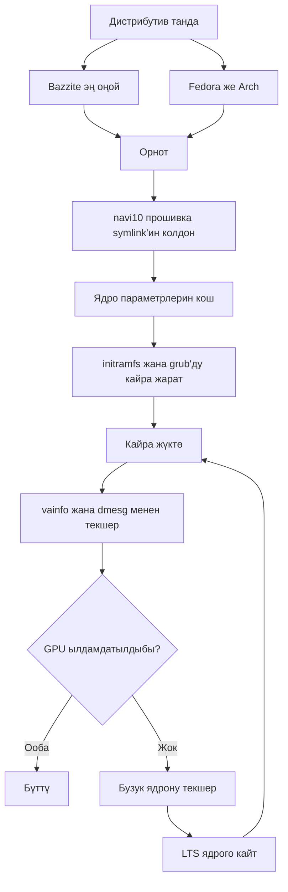

> 🌐 Коомчулук котормосу. Англис тилиндеги нуска — чындыктын булагы жана жаңыраак болушу мүмкүн. Ката таптыңызбы? Issue ачыңыз: [English](../en/06-linux.md) · [issues](https://github.com/lildebil0/awesome-bc250/issues)

# Linux драйверлери жана орнотуу

> **Кыскача** — Көпчүлүк адамдар BC-250'ни Linux'та иштетишет, жана *GPU оңдолгондон кийин* ал жакшы иштейт. Кутудан чыкканда `amdgpu` чипти таанып, сиз CPU'да рендерленген, бир орундуу FPS аласыз. Эки нерсе аны чыныгы кылат: **заманбап ядро + жаңы Mesa (25.1+)**, жана **`amdgpu` оңдоосу** — драйвер жүктөлсүн деген прошивка symlink'и (`navi10_gpu_info.bin` → `cyan_skillfish_gpu_info.bin`) плюс ядро параметрлери (`amdgpu.sg_display=0`, `mitigations=off`, жана жаңы ядролордо `amdgpu.bc250_cc_write_mode=3`). Жаңы келген үчүн эң оңой жол: **[Bazzite](https://bazzite.gg/)** прошивкалап, атайын **`bazzite-bc250`** образына кайра баз кылыңыз — оңдоолор ичине бышырылган. Машинаны үйрөнгүңүз келсе: **Fedora** же **CachyOS/EndeavourOS (Arch)** бир жолку орнотуу скрипти менен.

Бул — «кутудагы тактаны» иштеп жаткан үстөлгө айлантуучу бөлүм. Адегенде [сууткучту](../en/04-cooling.md) жана [кубатты](../en/03-power-supply.md) кылыңыз — анан мунну.

> **Linux'ту эч качан колдонгон жоксузбу? 60 секунддук жашоо топтому.**
> - **Терминалды ачыңыз:** менюңуздан *Terminal* / *Konsole* (KDE) / *Console* деген колдонмону издеңиз, же `Ctrl-Alt-T` басыңыз.
> - **`sudo`** команданын алдында аны администратор катары иштетет. Ал паролуңузду сурайт — жана **сиз тергенде экранда эч нерсе көрүнбөйт** (чекит да, жылдызча да жок). Бул кадимки нерсе; терип, Enter басыңыз.
> - **`nano /etc/...`** терминалда жөнөкөй текст редакторун ачат. Сактап чыгуу үчүн: **Ctrl-O**, анан **Enter**, анан **Ctrl-X**.
> - Терминалга **көчүрүп-чаптоо** адатта **Ctrl-Shift-V** (Ctrl-V эмес).
> - Көптөгөн кадамдар **кайра жүктөгөндөн** кийин гана күчүнө кирет (`systemctl reboot`). Бир кадам «кайра жүктө» десе, иштедиби-жокпу деп баалаардан мурда чындап кайра жүктөңүз.

---

## Сиз сөзсүз түшүнүшүңүз керек болгон бир нерсе

BC-250'нин GPU'су — **Cyan Skillfish / Oberon** (PlayStation 5'тен алынган RDNA2 бөлүгү). Негизги `amdgpu` тарыхый түрдө **ал үчүн аталган прошивка блобуна ээ болгон эмес**, ошондуктан стандарттык орнотууда ядро GPU'ну инициализациялай албайт жана үстөл программалык (LLVMpipe) рендерингке кайтат — баары жай, жана `vulkaninfo` чыныгы түзмөктү көрсөтпөйт. Бир колдонуучу «бузук драйверлерге» бир нече күн коротуп, акыры дистрибутиву GPU прошивкасын жүктөй албаган ядрону жүктөгөнүн түшүндү ([src](https://t.me/c/2424231195/98466)).

Ошентип, ар бир иштеген орнотуу ушул үч нерсени бир формада жасайт:

1. **Жетишерлик жаңы ядро + Mesa иштетиңиз.** Жогорудагы Mesa BC-250 колдоосуна **25.1**'де ээ болду (ошондон бери патч керек эмес; **25.3.x** — учурда сунушталган туруктуу нуска) — ([Mesa MR !33116](https://gitlab.freedesktop.org/mesa/mesa/-/merge_requests/33116), [src](https://t.me/c/2424231195/20891)). Температура сенсорлору **ядро 6.15**'те пайда болду ([src](https://t.me/c/2424231195/23542)); ядро **6.18.18 LTS** — учурдагы эң жакшы чекит.
2. **`amdgpu`'га ал каалаган прошивканы бериңиз** — учурдагы орнотууларда жаңыртылган **`linux-firmware`** мурунтан эле `cyan_skillfish_gpu_info.bin` жөнөтөт; эски системаларга дагы эле **navi10 symlink** керек (же патчтелген mesa/ядро пакети). Жол C'ни кара.
3. **Туура ядро параметрлерин өткөрүп**, initramfs + жүктөгүчтү кайра жараткыла. (Жана сааттар 1500 MHz'те бекитилбеши үчүн **GPU governor**'ун орнотуңуз.)

Төмөндөгүлөрдүн баары — ар бир дистрибутив ушул үч нерсени *кантип* жасаары жөнүндө гана.



---

## Кайсы дистрибутив? (коомчулук сурамжылоосунун фавориттери)

Чат кайра-кайра төртөөнө кайрылат. Жалгыз «туура» жооп жок — бул *нөл аракет* менен *машинаңды түшүнүү* ортосундагы соода. elektricM документтери кеңири талааны сынайт; мынакей алардын баары бир карашта ([elektricM: distributions](https://elektricm.github.io/amd-bc250-docs/linux/distributions/)):

| Дистрибутив | Негиз | Аракет | GPU оңдоо | Эмне үчүн эң жакшы |
|--------|------|--------|---------|----------|
| **Bazzite** (`bazzite-bc250` образ) | Fedora atomic | **Эң аз** — оңдоолор ичине бышырылган | Образда алдын-ала колдонулган | Жаңы келгендер, «жөн эле оюн ойноо» |
| **Fedora 43** (Workstation / KDE) | Fedora | Аз | Mesa 25.x негизги репозиторийлерде + governor COPR | Linux үйрөнүү, upstream'ге жакын калуу |
| **CachyOS** | Arch | Орто | Mesa 25.1+ репозиторийлерде + governor (AUR) | Макс жылмакайлык (BORE scheduler), HDR+VRR |
| **EndeavourOS / Arch** | Arch | Орто | Mesa 25.1+ репозиторийлерде + governor | Орнотуу азабысыз Arch |
| **Debian (Testing/Sid) / PikaOS** | Debian | Орто–Жогору | Mesa `experimental`'дан (Debian) / OOTB (PikaOS) | Туруктуулук, **эң төмөн бош кубат (~50–60 W)** |
| **Manjaro** | Arch | Орто | Mesa 25.1+ репозиторийлерде; BIOS прошивкадан кийин OOTB жүктөлөт | Оңой Arch; GNOME эң туруктуу |
| **Alpine** | Alpine (OpenRC) | Жогору | колдо mesa + прошивка + governor | Минималдуу/баш экрансыз, ~150 MB RAM / ~35 W |
| **Fedora CoreOS** | Fedora atomic | Жогору | контейнер хост; орнотуудан кийинки ыңгайлаштыруулар | Баш экрансыз контейнер/LLM серверлери |
| **SteamOS** (Valve) | Arch (immutable) | Орто | Mesa **main-branch** образынан (туруктуу эмес) + governor | Чыныгы Steam Machine сезими; диван/Gaming Mode |
| **Batocera** | Linux (эмуляция дистрибутиву) | Аз–Орто | топтолгон Mesa + орнотуу | Консоль стилиндеги **эмуляция** кутусу ([15-emulation.md](../en/15-emulation.md)) |

Чаттан жана [elektricM](https://elektricm.github.io/amd-bc250-docs/linux/distributions/)'ден эскертүүлөр:
- **Bazzite — эң оңой** жана прошивка оңдоосу, ядро параметрлери, GPU governor жана 40-CU/жыштык патчы мурунтан колдонулган **атайын BC-250 образына** ээ. Аны artifacthub'тан табыңыз: [`bazzite-bc250`](https://artifacthub.io/packages/container/bazzite-bc250/bazzite_bc250). Бир нече колдонуучу так колу менен патчтоону токтотуу үчүн ага өттү ([src](https://t.me/c/2424231195/121246)).
- **Fedora 43'тен баштап, Mesa 25.x негизги репозиторийлерде** — `mixaill/amd-bc-250` COPR эми болгону Mesa үчүн керек эмес. Fedora 42 — **колдоо мөөнөтү бүткөн**; 43'кө жаңыртыңыз. Орнотууда кара экран алсаңыз, *Troubleshooting → Install in Basic Graphics Mode* колдонуңуз ([elektricM: Fedora](https://elektricm.github.io/amd-bc250-docs/linux/fedora/)).
- **«Геймер» дистрибутивдерин көзжумуп албаңыз.** Бир кеңири талкуу жөнөкөй **Fedora (Workstation/KDE)** же **LTS ядро + жаңы Mesa менен ваниль Arch** — оорутпаган орто жол деп ырастайт, жана оор тюнингделген форктор кээде Steam/FSR/vsync'ти жардам берүүнүн ордуна *бузат* деп айтат ([src](https://t.me/c/2424231195/102834)). Муну «2025-жылдын аягына карата» кеңеш катары караңыз — Bazzite образы андан бери жетилди.
- **Bazzite'тин ордуна CachyOS, эгер максималдуу жылмакайлыкты кубаласаңыз.** Кеңири r/BC250Gaming (Reddit) коомчулук отчёту Bazzite'тен **CachyOS**'ко өттү жана оюндар булагына карабастан байкаларлык жылмакай экенин, азыраак чайналуу/микро-катуу болгонун (мис. *Mortal Kombat 1*), азыраак кокус кулаш жана Steam-режим кайра жүктөлүүлөрүн, жана **демейки Btrfs** жайгашуусунда абдан жоопкер сезимди тапты. Ал ошондой эле Bazzite жасай албаганда **HDR + VRR'ди туура иштетти** (HDR глитчтеген, VRR эч качан иштеген эмес) — [14-display.md](../en/14-display.md) кара. Муну универсалдуу өкүм эмес, бир жакшы документтелген тажрыйба катары караңыз, бирок Bazzite сизди чайналуу же туруксуздук менен калтырса, бул күчтүү вариант. Орнотуу **[`redbeard1083/bc250-toolkit`](https://github.com/redbeard1083/bc250-toolkit)** скрипти менен автоматташтырылган (CachyOS'тогу BC-250). ⚠ Өзүнчө коомчулук маалымат чекити жылуулук/FPS бурчун кошот: *бирдей* овершклокто, CachyOS Bazzite'тен **~10 °C салкыныраак** иштейт деп билдирилген жана CPU-байланышкан оюндарда жогору FPS берет (мис. *Elden Ring* CachyOS'то ~60–75 vs Bazzite'те ~45–60) ([+14], r/BC250Gaming — коомчулук билдирген, өзгөрөт; өз алдынча ырасталган эмес).
- **Ядро версиясы дистрибутивден маанилүүрөк.** Белгилүү начар ядролордон качыңыз (төмөндөгү эскертүү кутусун кара). Шек туулса, **LTS ядро** (6.18.18 LTS сунушталат) — коопсуз тандоо. Бир нече колдонуучу өтө жаңы ядрого туш келип, LTS'ке өтүү менен куткарылган ([src](https://t.me/c/2424231195/56529), [src](https://t.me/c/2424231195/59839)).
- **Үстөл чөйрөсү:** **GNOME'дун эң жакшы тажрыйбасы бар** BC-250'де. KDE Plasma'да Qt RDRAND/RDSEED кулаштары болгон — акыркы Qt'те (2025-жылдын ортосунда) оңдолгон, бирок GNOME дагы эле коопсуз демейки; Cinnamon (X11) — туруктуу жеңил вариант ([elektricM: distributions](https://elektricm.github.io/amd-bc250-docs/linux/distributions/)).
- **Дагы эки дистрибутив коомчулук тарабынан жүктөлгөнү ырасталган** ([r/linux_gaming коомчулук темасы](https://www.reddit.com/r/linux_gaming/comments/1nvsgji/)): **SteamOS** BC-250'де иштейт — бирок **main-branch** SteamOS образын колдонуңуз, туруктуу каналды **эмес** (туруктуу нуска BC-250 колдоосу жок эски Mesa жөнөтөт). Жана **Batocera**, атайын эмуляция дистрибутиву, дагы жүктөлүп иштейт — тактаны консоль стилиндеги эмуляция кутусуна айлантуунун ыңгайлуу жолу ([15-emulation.md](../en/15-emulation.md) кара). Экөө тең жогорудагынын баары менен бирдей үч эрежеге баш ийет (жаңы Mesa + `amdgpu` прошивка оңдоосу + ядро параметрлери/governor).

> Бир ардагер BC-250'ни Linux'та үч ай күн сайын колдонгондон кийинки тажрыйбасын кыскача баяндады: оюндар бир чыкылдатуудан ишке кирет, RTX иштейт, VR иштейт, «толугу менен үзгүлтүксүз» — жана ал ушунун аркасында негизги үстөлүн Linux'ка которду ([src](https://t.me/c/2424231195/61870)).

---

## Жол A — Bazzite (жаңы келгендерге сунушталат)

Bazzite — Fedora негизиндеги өзгөрбөс оюн ОС'у (SteamOS сыяктуу). Коомчулук **BC-250'ге атайын образды** тейлейт, ошондуктан прошивкага же ядро параметрлерине өзүңүз тийбейсиз.

### A1. Адегенде кадимки Bazzite орнотуңуз
1. **[bazzite.gg](https://bazzite.gg/#image-picker)**'тен жүктөңүз (үстөл же «Deck»/Gaming-Mode вариантын тандаңыз).
2. USB'ге прошивкалаңыз (Ventoy, Rufus, же balenaEtcher) жана кадимкидей орнотуңуз. **root эмес колдонуучу түзүңүз** — Steam root катары ишке кирүүдөн баш тартат ([src](https://t.me/c/2424231195/121246)).

> **Туура Bazzite образын тандоо (кадам-кадам).** [bazzite.gg](https://bazzite.gg/)'те тандагычты **Desktop PC → AMD (modern) → KDE → Gaming-Mode образы** боюнча басыңыз — жөнөкөй жандуу ISO эмес, **Gaming-Mode** курулушун алыңыз: жандуу ISO жакшы орнотулат, бирок **чындап оюндарды иштете албайт**. Аны **Balena Etcher** менен **≥16 GB** USB таякчага прошивкалаңыз. Орнотуу **максаты** M.2 NVMe, M.2-SATA адаптериндеги SATA SSD, же ал тургай **тышкы USB** диск болушу мүмкүн. 2025-жылдын ноябрь ортосундагы образ кутудан чыкканда **Mesa 25.2.4** жөнөттү ([Old Lamer — Part IV](https://youtu.be/YuBmGF536II)).

> **Флэш-диск өтө кичинеби?** Bazzite ISO'су >9 GB. Кичинекей таякчага жөнөкөй **Fedora**'ны (≈3 GB ISO, мис. Kinoite/KDE) орнотуп, анан терминалдан Bazzite'ке *кайра баз* кылсаңыз болот ([src](https://t.me/c/2424231195/121246)):
> ```bash
> # KDE desktop:
> rpm-ostree rebase ostree-image-signed:docker://ghcr.io/ublue-os/bazzite:stable
> # or with Gaming Mode (SteamOS-like):
> rpm-ostree rebase ostree-image-signed:docker://ghcr.io/ublue-os/bazzite-deck:stable
> ```
> Кайра жүктөңүз, эми Bazzite'тесиз.

### A2. GPU governor орнотуу (учурдагы эң жөнөкөй жол)
2026-жылдын башынан баштап **стандарттык Bazzite ядросу мурунтан эле GPU жыштык-диапазон патчын камтыйт** — ошондуктан адатта **атайын образ такыр керек эмес**. Болгону кадимки Bazzite'тин үстүнө governor орнотуңуз ([elektricM: Bazzite](https://elektricm.github.io/amd-bc250-docs/linux/bazzite/)):
```bash
sudo dnf copr enable filippor/bazzite
rpm-ostree install cyan-skillfish-governor-smu   # SMU variant — no kernel patch needed
systemctl reboot
sudo systemctl enable --now cyan-skillfish-governor-smu.service
# Pin the known-good deployment so an update can't silently break you:
rpm-ostree pin 0
```
**`cyan-skillfish-governor-smu`** сааттарды SMU прошивка чакырыктары аркылуу айдайт жана эски `oberon-governor`'дун ордуна келет (*[Кубат governor'у](#b3-кубат-governorу-cyan-skillfish-governor)* кара). `cyan-skillfish-governor-tt` варианты да бар, бирок ал ядро жыштык патчын талап кылат (Bazzite'те мурунтан бар). ⚠ Governor туура эмес картаны (card0 vs card1) максат кылышы мүмкүн — масштабдоо иштебесе текшериңиз.

### A2-alt. (Тандоо боюнча) BC-250 образына кайра баз кылуу
Эгер кошумча алдын-ала бышырылган оптимизацияларды кааласаңыз гана: тейленген BC-250 образына өтүңүз — **`vietsman` «Bazzite on Steroids»** курулуштары (прошивка оңдоосу, ядро параметрлери, governor, кеңейтилген 350–2230 MHz жыштык патчы ичине бышырылган). Орноткон үстөлүңүздү тандаңыз — **GNOME сунушталган демейки** — жана иштетиңиз:
```bash
# GNOME (recommended):
rpm-ostree rebase ostree-image-signed:docker://ghcr.io/vietsman/bazzite-gnome-patched:latest
# KDE:
rpm-ostree rebase ostree-image-signed:docker://ghcr.io/vietsman/bazzite-kde-patched:latest
# Deck / Gaming-Mode (SteamOS-like):
rpm-ostree rebase ostree-image-signed:docker://ghcr.io/vietsman/bazzite-deck-patched:latest
systemctl reboot
```
⚠ иштетээрден мурда учурдагы образды/тегди текшериңиз — образ жолдору өзгөрөт. Жаңыртылган командалар [BC-250 docs Bazzite барагында](https://elektricm.github.io/amd-bc250-docs/linux/bazzite/) жашайт (ошондой эле artifacthub'та [`bazzite-bc250`](https://artifacthub.io/packages/container/bazzite-bc250/bazzite_bc250) катары тизмеленген).

> ⚠ **Патчтелген образга кайра баз кылуу USB WiFi'иңизди өлтүрүшү мүмкүн (elektricM Issue #10).** Атайын ядро сиздин USB WiFi/Bluetooth донглыңыздын драйверин камтыбашы мүмкүн (BC-250'де ички зымсыз жок). Ethernet'ти даяр кармаңыз, кайра баздан кийин `lsmod | grep <your_driver>` текшериңиз, жок болсо `rpm-ostree install <driver-package>`, же `rpm-ostree rollback && systemctl reboot`.

> **Эгер 40-CU ачуу желдеткич башкаруусун же Xbox геймпадыңызды бузса, атайын ядро образын алмаштырыңыз.** Bazzite'тин ичинде курулган 40-CU ачуусу («Old-Lamer» методу) кээ бир орнотууларда **желдеткич башкаруусун жана Xbox контроллер колдоосун** бузат деп коомчулук билдирген ([+ r/BC250Gaming — коомчулук билдирген, өзгөрөт]). **[`hafriedlander/kernel-bazzite`](https://github.com/hafriedlander/kernel-bazzite)** образы — муну оңдогон атайын ядро — *«BC250 такталары үчүн 40CU ачуу патчы менен (эски) Bazzite ядросу»* экени ырасталган, Fedora'нын kernel-ark'тан кадимки кол түзмөк/өндүрүмдүүлүк патч топтому менен түз курулган (AUR'да `linux-bazzite-bin` катары да топтолгон). ⚠ Ал сиздин так желдеткич/геймпад регрессияңызды чечеби-жокпу — бул коомчулук маалымат чекити, кепилдик эмес — `rpm-ostree rollback` кыла алышыңыз үчүн белгилүү жакшы деплоймент бекитилген кармаңыз.

Кайра жүктөгөндөн кийин, мындан ары Bazzite жардамчысы менен жаңыртыңыз:
```bash
ujust update          # update everything (or: rpm-ostree upgrade && flatpak update)
rpm-ostree rollback   # if an update breaks something, roll back and reboot
```

> **Билүүгө татыктуу эки Bazzite тузагы** ([elektricM: Bazzite](https://elektricm.github.io/amd-bc250-docs/linux/bazzite/)): жада калса жеңил 2D оюндарда туруктуу **микро-чайналуу** — адатта циклде иштебей жаткан Handheld Daemon — аны `sudo systemctl mask --now hhd` менен өчүрүңүз. Жана BIOS прошивкадан кийин **деңгээлдерди жүктөгөндө катуу токтоп калуу** көбүнчө **CMOS тазаланбаганын** билдирет — CMOS тазалаңыз, VRAM жөндөөсүн кайра колдонуңуз.

> ⚠ **Bazzite'тин өзгөрбөстүгү төмөнкү деңгээлдеги тармак куралдарын бөгөттөйт.** Окуу-гана `/usr` дегени — трафик-формалоо / анти-троттлинг куралдары (мис. `zapret` стилиндеги куралдар) системалык кызматтарды же ядро бөлүктөрүн орнотсо, таза орнотулбайт. Эгер сиз бирине көз каранды болсоңуз — кээ бир Steam'ди троттлдеген ISP'лер үчүн кеңири — өзгөрмө дистрибутив (Fedora/Arch) — оңой хост (RU-спецификалык деталдар орус нускасында).

### A3. Бүттү — текшериңиз
Төмөндөгү **[GPU ылдамдатуусун текшерүү](#gpu-ылдамдатуусун-текшерүү)**'гө өтүңүз. BC-250 образында (же A2'ден кийин) прошивка symlink'и, ядро параметрлери жана governor мурунтан орнотулган.

---

## Жол B — Fedora (Workstation / KDE)

Fedora — эң көп документтелген atomic эмес жол жана upstream'ге жакын калат. **Fedora 43'те графика стеги кошумча репозиторий талап кылбайт — Mesa 25.x мурунтан негизги репозиторийлерде** ([elektricM: Fedora](https://elektricm.github.io/amd-bc250-docs/linux/fedora/)). Эски `mixaill/amd-bc-250` COPR (төмөндө) болгону 43'төн мурдагы чыгарылыштарда керек.

### B1. Fedora орнотуу
**Fedora 43 Workstation же KDE**'ни жүктөңүз ([fedoraproject.org](https://fedoraproject.org/workstation/download)) жана кадимкидей орнотуңуз — **Fedora 42 — колдоо мөөнөтү бүткөн**, 43'кө жаңыртыңыз. Эгер орнотуучу кара экран көрсөтсө, *Troubleshooting → Install Fedora in basic graphics mode* тандаңыз (бул `nomodeset` коёт; драйверлер киргенден кийин аны алып салыңыз). Чаттан билдирилген жакшы баштапкы абал: ядро 6.14, GNOME 48, Mesa 25.0.2+ — «учат» ([src](https://t.me/c/2424231195/29150)). Cinnamon менен Fedora 41 Cyberpunk, Witcher 3 ж.б. иштетип «тозоктой туруктуу» деп аталган ([src](https://t.me/c/2424231195/12756)). 43'те ядро **6.18.18 LTS** же **6.17.11+** артык көрүңүз жана бузук диапазондордон качыңыз (төмөндөгү эскертүү кутусу).

### B2. Орнотуу скрипти (ишти сиз үчүн жасайт)
Канондук Fedora орнотуусу `mothenjoyer69/bc250-documentation`'дун **`fedora-setup.sh`** менен автоматташтырылган. Ал COPR'ду иштетет, патчтелген mesa орнотот, `amdgpu`'ну конфигурациялайт, governor курат жана жүктөгүчтү оңдойт. Анын так иштеткен кадамдары (скриптке салыштырып текшерилген):

```bash
# 1. Patched mesa from COPR
sudo dnf copr enable mixaill/amd-bc-250 -y
sudo dnf upgrade --refresh -y

# 2. amdgpu module option + sensor module
echo 'options amdgpu sg_display=0'    | sudo tee /etc/modprobe.d/options-amdgpu.conf
echo 'nct6683'                        | sudo tee /etc/modules-load.d/99-sensors.conf
echo 'options nct6683 force=true'     | sudo tee /etc/modprobe.d/options-sensors.conf

# 3. Regenerate initramfs (Fedora uses dracut)
sudo dracut --regenerate-all --force

# 4. Bootloader: drop nomodeset, add kernel params
sudo sed -i 's/nomodeset//g' /etc/default/grub
sudo grub2-mkconfig -o /etc/grub2.cfg
sudo grubby --update-kernel=ALL --args="amdgpu.sg_display=0"
sudo grubby --update-kernel=ALL --args="mitigations=off"

# 5. OpenCL (optional, for compute/AI)
sudo dnf install mesa-libOpenCL --allowerasing
```
*(Булак: [mothenjoyer69/bc250-documentation](https://github.com/mothenjoyer69/bc250-documentation)'дагы `fedora-setup.sh`, сөзмө-сөз ырасталган.)*

Кадамдарды терүүнүн ордуна болгону скриптти иштетүү үчүн ал репозиторийдин README'синин **«Simple setup script»** бөлүмүн кара (ал [`fedora-setup.sh`](https://raw.githubusercontent.com/mothenjoyer69/bc250-documentation/refs/heads/main/fedora-setup.sh)'ке көрсөтөт). ⚠ Орнотуу скриптин кабыкка жөнөтөөрдөн мурда окуп чыгыңыз.

### B3. Кубат governor'у (cyan-skillfish-governor)
Такта кутудан чыкканда жалпак 1500 MHz / 1000 mV иштейт; **governor** сааттарды масштабдайт (бош ↔ ~2000 MHz) жана андервольт кылууга мүмкүндүк берет. Учурда сунушталганы — **`cyan-skillfish-governor-smu`**, `filippor/bazzite` COPR'дан ([elektricM: Fedora](https://elektricm.github.io/amd-bc250-docs/linux/fedora/), 2026-март ырасталган):
```bash
sudo dnf copr enable filippor/bazzite
sudo dnf install cyan-skillfish-governor-smu
sudo systemctl enable --now cyan-skillfish-governor-smu
systemctl status cyan-skillfish-governor-smu        # check it's running
```
Конфиг `/etc/cyan-skillfish-governor-smu/config.toml` ичинде жашайт. Толук тюнинг **[09-overclock-undervolt.md](../en/09-overclock-undervolt.md)** ичинде каралган.

> **SMU vs эски oberon-governor.** `cyan-skillfish-governor-smu` сааттарды SMU прошивка чакырыктары аркылуу айдайт жана **эч кандай дистрибутивде ядро жыштык патчын талап кылбайт** — ал elektricM документтеринде эски `oberon-governor`'ду баардан алмаштырган ([elektricM: kernel](https://elektricm.github.io/amd-bc250-docs/linux/kernel/)). Ошол эле COPR `cyan-skillfish-governor-tt` вариантын да жөнөтөт, ал ядро патчын *талап кылат*. Эгер сиз мурунтан `oberon-governor` иштетсеңиз, SMU'ну орнотоордон мурда аны токтотуп/өчүрүп/алып салыңыз (`sudo systemctl disable --now oberon-governor`, `/etc/oberon-config.yaml`'ди алып салыңыз).

### B4. Кайра жүктөп текшериңиз
Кайра жүктөңүз, анан **[GPU ылдамдатуусун текшерүү](#gpu-ылдамдатуусун-текшерүү)**'гө өтүңүз.

---

## Жол C — Arch үй-бүлөсү (CachyOS / EndeavourOS)

Arch негизиндеги орнотуулар тарыхый түрдө **прошивка symlink'ин колу менен** плюс жаңы Mesa талап кылган. Бул эң «колдук» жол, бирок ошол эле үч идея колдонулат.

> **Эскертүү — symlink сиз үчүн мурунтан эскирген болушу мүмкүн.** elektricM'дин дистрибутив боюнча [Arch](https://elektricm.github.io/amd-bc250-docs/linux/arch/), [CachyOS](https://elektricm.github.io/amd-bc250-docs/linux/cachyos/) жана башка колдонмолору navi10 symlink'ин **такыр түзбөйт** — учурдагы ядродо жаңыртылган `linux-firmware` (Arch) / `linux-firmware-amdgpu` (Alpine) пакети менен `cyan_skillfish_gpu_info.bin` блобу эми жөнөтүлөт, ал эми калганын Mesa 25.1+ кылат. Адегенде symlink**сиз** аракет кылыңыз; C1'ге `dmesg` `amdgpu: Failed to get gpu_info firmware` (б.а. прошивка пакетиңиз аны камтый албастан өтө эски) көрсөткөндө гана кайтыңыз.

### C1. amdgpu прошивка оңдоосу (критикалык symlink) — прошивка жок болсо гана
`amdgpu` `cyan_skillfish_gpu_info.bin`'ди издейт; **navi10** блобу анын ордуна иштейт. Бул — чаттагы эң көп кайталанган команда (5×) ([src](https://t.me/c/2424231195/45453)) жана дистрибутивиңиздин `linux-firmware`'и блобдон эски болсо дагы эле оңдоо:

```bash
sudo ln -s /lib/firmware/amdgpu/navi10_gpu_info.bin.zst \
           /lib/firmware/amdgpu/cyan_skillfish_gpu_info.bin.zst
```

> ⚠ **системаңыздагы жолду текшериңиз.** **Кысылбаган** прошивка жөнөткөн дистрибутивдерде эки атта тең `.zst`'ти алып салыңыз:
> ```bash
> sudo ln -s /lib/firmware/amdgpu/navi10_gpu_info.bin \
>            /lib/firmware/amdgpu/cyan_skillfish_gpu_info.bin
> ```
> **Кайсынысы сиздики?** `ls /lib/firmware/amdgpu/ | grep -i navi10` иштетип, булак файлдын атын караңыз: эгер ал `.zst` менен бүтсө биринчи (`.zst`) команданы колдонуңуз, болбосо экинчисин — шилтеме аты чындап бар файлга дал келиши керек. Шилтемени түзгөндөн кийин прошивка жүктөгөндө алынышы үчүн initramfs'ти (кийинки кадам) кайра жаратуу **керек**.

### C2. Жаңы Mesa
EndeavourOS/CachyOS'то коомчулук жолу — **chaotic-aur** + `mesa-tkg-git`. Бекитилген EndeavourOS мини-колдонмодон ([src](https://t.me/c/2424231195/50399)) жана SteamOS колдонмосунан ([src](https://t.me/c/2424231195/52411)) кыскартылган:

```bash
# Add the chaotic-aur key + mirrorlist (see https://aur.chaotic.cx/docs for the current keys)
sudo pacman-key --recv-key 3056513887B78AEB --keyserver keyserver.ubuntu.com
sudo pacman-key --lsign-key 3056513887B78AEB
sudo pacman -U 'https://cdn-mirror.chaotic.cx/chaotic-aur/chaotic-keyring.pkg.tar.zst'
sudo pacman -U 'https://cdn-mirror.chaotic.cx/chaotic-aur/chaotic-mirrorlist.pkg.tar.zst'

# Append to /etc/pacman.conf:
#   [chaotic-aur]
#   Include = /etc/pacman.d/chaotic-mirrorlist
sudo nano /etc/pacman.conf

sudo pacman -Syu
sudo pacman -Sy mesa-tkg-git lib32-mesa-tkg-git   # (or: yay -S mesa-tkg-git lib32-mesa-tkg-git)
sudo pacman -S vulkan-tools                        # for vulkaninfo
```
Алдын-ала курулган AUR пакеттери да бар: [`amdonly-gaming-mesa-git`](https://aur.archlinux.org/packages/amdonly-gaming-mesa-git) жана [`mesa-amd-bc250`](https://aur.archlinux.org/packages/mesa-amd-bc250). ⚠ chaotic-aur кол коюу ачкычы алмашышы мүмкүн — учурдагы ачкычтарды дайыма [aur.chaotic.cx/docs](https://aur.chaotic.cx/docs)'тен көчүрүңүз.

> **Учурдагы Arch/CachyOS'тогу эң жөнөкөй жол:** Mesa **25.1+ эми расмий `extra` репозиторийлеринде** — `sudo pacman -S mesa vulkan-radeon lib32-vulkan-radeon` жетиштүү, chaotic-aur же `mesa-tkg-git` керек эмес. `-tkg`/AUR курулуштары болгону эски дистрибутивдерде мааниге ээ ([elektricM: Arch](https://elektricm.github.io/amd-bc250-docs/linux/arch/), [src](https://t.me/c/2424231195/20891)). Mesa **26** (git) Debian sid / Ubuntu 26.04 daily'де иштеп жатканы мурунтан ырасталган.
>
> Колдук кадамдарды толугу менен өткөрүп жиберүү үчүн, elektricM Arch колдонмосу **`eabarriosTGC/BC250--ARCH`** орнотуу скриптине көрсөтөт (`Arch-setup.sh`, же Manjaro үчүн `bc520-manjaro.sh`), ал governor орнотот, сенсорлорду орнотот, `RADV_DEBUG=nohiz` менен `/etc/environment.d/99-radv-bc250.conf` жазат, жана initramfs'ти кайра жаратат ([elektricM: Arch](https://elektricm.github.io/amd-bc250-docs/linux/arch/)). Атап айтканда **CachyOS**'то, r/BC250Gaming (Reddit) коомчулук отчёту **[`redbeard1083/bc250-toolkit`](https://github.com/redbeard1083/bc250-toolkit)**, CachyOS'тогу BC-250'ге ылайыкталган орнотуу скриптин колдонот. ⚠ Кайсы орнотуу скриптин иштетээрден мурда окуп чыгыңыз.

### C3. Ядро параметрлери + кайра жаратуу
BC-250 ядро параметрлерин кошуп, анан initramfs менен grub'ду кайра куруңуз. `/etc/default/grub`'ду түзөтүп, муларды `GRUB_CMDLINE_LINUX_DEFAULT`'ка коюңуз (канондук топтом [elektricm BC-250 docs](https://elektricm.github.io/amd-bc250-docs/linux/kernel/) боюнча):

```
amdgpu.sg_display=0 mitigations=off amdgpu.bc250_cc_write_mode=3 ttm.pages_limit=3959290 ttm.page_pool_size=3959290
```

Анан кайра жараткыла (Arch **mkinitcpio**, анан grub колдонот):
```bash
sudo mkinitcpio -P
sudo grub-mkconfig -o /boot/grub/grub.cfg
```
`update-grub` колдонгон дистрибутивдерде (Debian/Ubuntu/SteamOS), ал обёртка `grub-mkconfig` сабын алмаштырат ([src](https://t.me/c/2424231195/52411)).

### C4. Governor + кайра жүктөө
AUR'дан **`cyan-skillfish-governor-smu`** орнотуңуз (`oberon-governor`'дун заманбап алмаштыруусу — ядро патчы керек эмес), кызматты иштетиңиз, кайра жүктөп, текшериңиз ([elektricM: CachyOS](https://elektricm.github.io/amd-bc250-docs/linux/cachyos/)):
```bash
yay -S cyan-skillfish-governor-smu
sudo systemctl enable --now cyan-skillfish-governor-smu.service
cat /sys/class/drm/card0/device/pp_dpm_sclk   # the * should move between clocks under load
```
Ядро-патч жолун артык көргөндөр үчүн `cyan-skillfish-governor-tt` варианты бар. Эски `oberon-governor` ([gitlab.com/mothenjoyer69/oberon-governor](https://gitlab.com/mothenjoyer69/oberon-governor), `cmake . && make && sudo make install`) дагы эле иштейт, бирок акырындап жок болуп жатат.

> ⚠ **Белгилүү Arch/Manjaro/CachyOS өзгөчөлүгү:** governor көбүнчө **жүктөөдө масштабдоону баштабайт** — GPU 1500 MHz'те турат, кандайдыр бир оюнду/бенчмаркты бир жолу иштеткенче, андан кийин туура жүрөт. Fedora/Bazzite таасир этпейт. Чечими: жүктөгөндөн кийин `sudo systemctl restart cyan-skillfish-governor-smu` ([elektricM: Arch](https://elektricm.github.io/amd-bc250-docs/linux/arch/)).

---

## Тар-дистрибутив дельталары (Alpine / CoreOS / Debian / CachyOS)

Жогорудагы төрт жол көпчүлүктү камтыйт. Төмөндөгү дистрибутивдер *ошол эле үч нерсени* талап кылат, бирок дистрибутивге спецификалык пакет аттары жана механизмдери менен — булар толук орнотуу колдонмолору эмес, BC-250 дельталары.

### CachyOS — туура микроархитектура деңгээлин тандаңыз
CachyOS орнотууда x86-64 **микроархитектура деңгээлин** тандоону сурайт. **`x86-64-v3`'ту тандаңыз** — бул **Zen 2** үчүн эң жакшы шайкештик тандоо ([elektricM: CachyOS](https://elektricm.github.io/amd-bc250-docs/linux/cachyos/)). ⚠ `x86-64-v4`'ту **тандабаңыз**: ал деңгээл AVX-512 талап кылат, ал BC-250'нин Zen 2 ядролорунда жок, ошондуктан v4 орнотуу иштебейт. LTS ядрону колдонуңуз — `sudo pacman -S linux-cachyos-lts linux-cachyos-lts-headers`. **Бар Arch** кутусун кайра орнотпостон CachyOS репозиторийлерине көчүрүү үчүн:
```bash
wget https://mirror.cachyos.org/cachyos-repo.tar.xz
tar xvf cachyos-repo.tar.xz
cd cachyos-repo
sudo ./cachyos-repo.sh   # choose x86-64-v3 when prompted
```
Калганынын баары (прошивка, Mesa 25.1+, governor, ядро параметрлери) жогорудагы **Жол C**'ни ээрчийт.

### Debian — Mesa'ны `experimental`'га бекитиңиз
Stable/Testing Mesa өтө эски; сиз системанын калганын ага сүйрөбөстөн Mesa'ны **гана** `experimental`'дан каалайсыз ([elektricM: Debian](https://elektricm.github.io/amd-bc250-docs/linux/debian/)). Репозиторийди кошуңуз:
```
deb http://deb.debian.org/debian experimental main contrib non-free non-free-firmware
```
Анан болгону Mesa пакеттери experimental'ды ээрчиши үчүн **APT-pin** кылыңыз — `/etc/apt/preferences.d/experimental`:
```
Package: mesa-vulkan-drivers libgl1-mesa-dri
Pin: release a=experimental
Pin-Priority: 500
```
Mesa жана жаңыраак ядрону орнотуңуз:
```bash
sudo apt install -t experimental mesa-vulkan-drivers libgl1-mesa-dri
sudo apt install linux-xanmod-lts-x64v3       # Xanmod LTS, v3 build
```
Governor'дун Debian'да **COPR/AUR жок** — аны upstream чыгарылыш tarball'дан орнотуңуз:
```bash
tar -xf cyan-skillfish-governor-smu-*-x86_64-linux.tar.gz
cd cyan-skillfish-governor-smu-*/
sudo ./scripts/install.sh
sudo systemctl enable --now cyan-skillfish-governor-smu.service
```

### Alpine — жалгыз systemd'сиз governor рецепти
Alpine systemd эмес **OpenRC** колдонот, ошондуктан governor'ду колу менен зымдоо керек ([elektricM: Alpine](https://elektricm.github.io/amd-bc250-docs/linux/alpine/)). Прошивка пакети — **`linux-firmware-amdgpu`** (ал `cyan_skillfish_gpu_info.bin` жөнөтөт) — бул документте башка жерде колдонулган жалпы `linux-firmware` аты **Alpine'да колдонулбайт**. Стекти орнотуңуз (демейки боюнча `sudo` жок — **`doas`** колдонуңуз, же `apk add sudo`):
```sh
doas apk add linux-lts linux-firmware-amdgpu \
  mesa-vulkan-ati vulkan-loader vulkan-tools mesa-dri-gallium
```
Ядро параметрлери **`/etc/update-extlinux.conf`** ичине барат (Alpine grub/dracut эмес, extlinux колдонот); түзөткөндөн кийин кайра куруңуз:
```sh
doas mkinitfs
doas update-extlinux
```
Governor **`smu`** бутагынан `cargo build --release` менен курулат, жана ал D-Bus аркылуу сүйлөшкөндүктөн ага **экөө тең** D-Bus саясат файлы жана OpenRC кызматы керек:
- **D-Bus саясаты** `/etc/dbus-1/system.d/com.cyan.skillfishgovernor.conf` (ага `com.cyan.SkillFishGovernor` шина атын ээлөөгө уруксат берет);
- **OpenRC кызматы** `/etc/init.d/cyan-skillfish-governor-smu`, ал `need dbus` деп жарыялайт.

D-Bus'ту иштетип, кайра жүктөңүз:
```sh
doas rc-update add dbus default
doas rc-service dbus start
```

### Fedora CoreOS — өзгөрбөс-хост 40-CU ачуу & ACPI оңдоо
Өзгөрбөс CoreOS хостунда `amdgpu.bc250_cc_write_mode=3`'ту оңой эле өткөрө албайсыз, ошондуктан 40-CU ачуу **`umr` аркылуу жүктөө кызматы** катары жасалат, ал GPU регистрлерин жүктөгөн сайын бир жолу жазат ([elektricM: CoreOS](https://elektricm.github.io/amd-bc250-docs/linux/fedora-coreos/)):
```bash
rpm-ostree install umr
# then a oneshot /etc/systemd/system/gpu-unlock.service that runs the umr
# register writes (mmRLC_PG_ALWAYS_ON_WGP_MASK / mmCC_GC_SHADER_ARRAY_CONFIG /
# mmSPI_PG_ENABLE_STATIC_WGP_MASK on *.gfx1013) after a short boot delay,
# then: systemctl enable gpu-unlock.service
```
**ACPI cpufreq оңдоосу** (`bc250-acpi-fix` SSDT таблицалары) rpm-ostree жолу менен колдонулат — `.aml` файлдарын `/etc/dracut.conf.d/acpi/` ичине таштап, `/etc/dracut.conf.d/99-acpi-override.conf` кошуңуз:
```
acpi_override="yes"
acpi_table_dir="/etc/dracut.conf.d/acpi"
```
анан аларды `rpm-ostree initramfs --enable` менен initramfs'ке бышырып, кайра жүктөңүз. (Atomic эмес dracut жолу үчүн төмөндөгү *Белгилүү начар ядролор & тузактар* кара.)

---

## Ар бир ядро параметри эмне кылат

[elektricm BC-250 docs](https://elektricm.github.io/amd-bc250-docs/linux/kernel/) жана AMD-BC-250 / mothenjoyer69 орнотуу скрипттерине салыштырып текшерилген:

| Параметр | Эмне кылат |
|-----------|--------------|
| `amdgpu.sg_display=0` | Scatter-gather дисплейди өчүрөт. Кара экрандан качуу үчүн **6.10'дон төмөн ядролордо** керек; калтырса зыянсыз. Чаттагы эң көп шилтеме жасалган жүктөө оңдоосу ([src](https://t.me/c/2424231195/52411)). |
| `mitigations=off` | CPU аялуулук тоскоолдоолорун өчүрөт. elektricM **Cyberpunk 2077'де +18 FPS** өлчөйт (1080p high'та 60 → 78), жалпы ~5–10% CPU кошумчасы — коопсуздуктун эсебинен. Тандоо боюнча; оюн-гана системалар. |
| `amdgpu.bc250_cc_write_mode=3` | Жаңы ядролор үчүн тандалма **40-CU ачуу**: бардык 40 эсептөө бирдигин кайра иштетүү үчүн эки HW регистрин жазат (демейки боюнча өчүк). PCI ID `0x13FE` менен корголгон, туруктуу HW өзгөрүүсү жок. Кубат катуу секирет (мис. llama-bench'те 56 W → 181 W) — эсептөө-гана үчүн арзыйт. [09-overclock-undervolt.md](../en/09-overclock-undervolt.md) кара. |
| `amdgpu.gttsize=14750` **+** `ttm.pages_limit=3959290` `ttm.page_pool_size=3959290` | GPU'га көбүрөөк системалык RAM (≈14.5–14.75 GB) картага түшүрүүгө уруксат берет. elektricM **үчөөнү тең чогуу** колдонот, альтернатива катары эмес — `gttsize` GTT өлчөмүн коёт, ал эми эки `ttm` мааниси барак чектерин көтөрөт. 512 MB-динамикалык BIOS VRAM бөлүштүрүү менен жуптурат ([elektricM: kernel](https://elektricm.github.io/amd-bc250-docs/linux/kernel/)). |

> ⚠ **Эс тутум параметрлери иштеши үчүн `amd_iommu=on` өткөрбөңҮЗ** — алар IOMMU*сыз* иштейт, ал өчүк калышы керек (кийинки бөлүм). Жогорудагы маанилер ядро cmdline'дин ордуна `/etc/modprobe.d/`'ге да бара алат: `options ttm pages_limit=3959290 page_pool_size=3959290` / `options amdgpu gttsize=14750`, анан initramfs'ти кайра куруңуз.

> **VRAM/буфер өлчөмү жөнүндө эскертүү:** APU **эң кичине** GPU фреймбуфер тилими менен (мис. 512 MB) эң жакшы иштейт, ошондо ал 16 GB бассейнди динамикалык бөлүшө алат — бирок муну өзгөртүү **модификацияланган BIOS** талап кылат, ал [08-bios.md](../en/08-bios.md) ичинде каралган ([src](https://t.me/c/2424231195/38599)).

> 📋 **Бир ардагердин канондук күн-сайын-айдоо конфигурациясы (тез маалымдама):** **CPU 4 GHz / GPU 2 GHz 40 CU / VRAM BIOS 512 MB / `mitigations=off` / zswap + 32 GB swap.** Бул — бүт тюнингделген орнотуу бир сапта — GPU саат + 40-CU ачуу + кичинекей 512 MB BIOS бөлүштүрүү + mitigations өчүк + төмөндөгү zswap swap оңдоо ([Old Lamer](https://youtu.be/bXlKcFPeSoU)). Ар бир бөлүк [09-overclock-undervolt.md](../en/09-overclock-undervolt.md) жана ушул жердеги кутуларда деталдаштырылган.

> 💥 **Оюндар RAM жетпегендиктен кулап жатабы (RDR2, Company of Heroes 3)? zswap + чоң Btrfs swapfile колдонуңуз.** CPU менен GPU ортосунда болгону 16 GB бөлүшкөндө, эс тутумга ач оюндар түгөнүп кулайт — жана systemd'нин **ZRAM** swap'ы аны 512 MB динамикалык бөлүштүрүүдө начарлатат (ал аллокаторду RAM дагы эле бош турганда OOM кылууга чаташтырат). Туура турган оңдоо: **systemd ZRAM'ди өчүрүп, zswap'ты иштетип, 32 GB Btrfs swapfile кошуңуз** (Btrfs'те `btrfs filesystem mkswapfile` колдонуңуз). Ал чыныгы эс тутум кошпойт, бирок RAM-жетишсиздик кулаштарын токтотот ([Old Lamer — Part XIV](https://youtu.be/A6juAoY70aU)). Толук кадам-кадам (zswap `lz4`, swapfile, `vm.swappiness=180`, Bazzite/`rpm-ostree` варианты) [09-overclock-undervolt.md](../en/09-overclock-undervolt.md) ичинде.

---

## ⚠ BIOS'то IOMMU'ну өчүрүңүз (муну бир жолу жасаңыз)

**IOMMU BC-250'де бузук жана өчүрүлүшү керек.** Күйгүзүлгөн бойдон калса, ал **дисплей мүчүлүштүктөрүн, кара экрандарды жана кокус кулаштарды** жаратат, жана VM'ге GPU өткөрүү эки жагынан тең мүмкүн эмес. Бул — BIOS жөндөөсү, дистрибутив тандоосу эмес — жогорудагы кайсы жолду алганыңызга карабастан биринчи жүктөөдө жасаңыз. BIOS орнотуусунан **IOMMU** опциясын табыңыз (адатта *Advanced → AMD CBS / NBIO* же *North Bridge* астында) жана **Disabled** коюп, анан сактап, кайра жүктөңүз ([elektricM аппараттык docs](https://elektricm.github.io/amd-bc250-docs/), mothenjoyer69 / Segfault / neggles / yeyus тарабынан тескери инженерия).

> ⚠ текшериңиз — elektricM булагы **BIOS** өчүрүүсүн гана документтейт. Кээ бир ядролор `iommu=off` / `amd_iommu=off`'ту ядро параметри катары да кабыл алат, бирок бул BC-250'де **ырасталган эмес**; аны текшерилбеген катары карап, BIOS жөндөөсүн артык көрүңүз.

---

## GPU ылдамдатуусун текшерүү

Биринчи кайра жүктөгөндөн кийин, GPU чындап колдонулуп жатканын ырастаңыз (программалык рендеринг эмес).

**1. Түзмөк Vulkan'га көрүнөбү?** Сиз болгону LLVMpipe эмес, BC-250 / AMD түзмөгүн көрүшүңүз керек:
```bash
vulkaninfo | grep deviceName
```
Туура орнотуу **эки түзмөктү** көрсөтөт (iGPU бул тактада эки жолу пайда болот) ([src](https://t.me/c/2424231195/50399)).

**2. Vulkan драйвери — RADV** (AMDVLK же llvmpipe эмес):
```bash
vulkaninfo | grep driverName     # expect: driverName = radv
```
Түзмөк аты **`AMD Radeon Graphics (RADV GFX1013)`** деп окулушу керек.

> ⚠ **`vainfo`'нун иштээрин күтпөңүз — аппараттык видео декод/кодер BC-250'де өлгөн.** VCN блогунун прошивкасы **Sony тарабынан бөгөттөлгөн**, ошондуктан `vainfo` ишке ашпайт (`vaInitialize failed ... -1`) жана GPU H.264/H.265 ылдамдатуусу жок. Бул сиздин орнотууңуздагы мүчүлүштүк эмес — **программалык декодду** колдонуңуз (mpv/VLC автоматтык түрдө кайтат) жана OBS үчүн **x264**. Эч качан өзгөрүшү күмөн ([elektricM: RADV](https://elektricm.github.io/amd-bc250-docs/drivers/radv/)).

**3. OpenGL рендерер сабы** (`llvmpipe` эмес, AMD/`gfx1013` атап бериши керек):
```bash
glxinfo | grep -i "OpenGL renderer"
# e.g. AMD Radeon Graphics (radv gfx1013 ...) — llvmpipe here means the GPU is NOT working
```

**4. Эсептөө бирдиктери активдүү** — `amdgpu` GPU'ну инициализациялаганын жана канча CU тирүү экенин ырастаңыз:
```bash
sudo dmesg | grep -i active_cu_number
```
Бул — прошивка жүктөлгөнүн жана (`bc250_cc_write_mode=3` койгон болсоңуз) бардык 40 CU көтөрүлгөнүн эң тез текшерүү. ⚠ текшериңиз — так `dmesg` талаасынын аты ядро боюнча өзгөрүшү мүмкүн; бош болсо, `dmesg | grep -i amdgpu`'ну да сынап, `cyan_skillfish_gpu_info` *жүктөлбөй калды* каталарынын ордуна ийгиликтүү прошивка жүктөөлөрүн издеңиз.

> **`dmesg`/CU-текшерүүсү кадимки колдонуучу катары эч нерсе көрсөтпөйбү?** Көптөгөн дистрибутивдер ядро-журналга жетүүнү чектейт, ошондуктан CU окуусу жана **`cu_map.sh`** сыяктуу жардамчы скрипттер бош басат. Текшерүүлөр туура көрүнүшү үчүн чектөөнү сессияга алып салыңыз ([4pda — das504](https://4pda.to/forum/index.php?showtopic=1104980)):
> ```bash
> sudo sysctl kernel.dmesg_restrict=0
> ```

**5. Температураларды/сааттарды текшериңиз** ([src](https://t.me/c/2424231195/23542); elektricM модуль ядро **6.11+** талап кылат деп белгилейт):
```bash
sudo modprobe nct6683 force=true   # force=true is ALWAYS required — the chip isn't auto-detected
sensors                            # reports as nct6686-isa-0a20
```
Дени сак бош абал ~1500 MHz SCLK / ~47 °C окуйт; Furmark алдында ~1900 MHz / ~78 °C ([src](https://t.me/c/2424231195/89232)). PWM **желдеткич башкаруусу** үчүн (болгону мониторинг эмес) сизге анын ордуна tree-сырткы `nct6687` драйвери керек — төмөндөгү **[Сенсорлор & желдеткич башкаруу](#сенсорлор--желдеткич-башкаруу)** кара.

Эгер `vulkaninfo` болгону `llvmpipe` көрсөтсө жана `dmesg` amdgpu прошивка жүктөө каталарын көрсөтсө, сиз дээрлик ишенимдүү **начар ядрону жүктөдүңүз** же **прошивка symlink'и/initramfs** кадамы ишке ашкан жок — төмөндө кара.

---

## RADV чөйрө өзгөрмөлөрү (глитчтерди & оюндарды оңдоо)

BC-250'нин Vulkan драйвери — **RADV** (бул — *жалгыз* иштеген драйвер — AMDVLK жана AMDGPU-PRO GFX1013'ту колдобойт). Бир нече чөйрө өзгөрмөсү адамдар эң көп туш болгон артефакттарды оңдойт. Толук тизме [elektricM: environment](https://elektricm.github.io/amd-bc250-docs/drivers/environment/) жана [elektricM: RADV](https://elektricm.github.io/amd-bc250-docs/drivers/radv/) ичинде.

> ⚠ **`RADV_DEBUG` — бул чөйрө өзгөрмөсү, ядро параметри ЭМЕС.** Аны эч качан `/etc/default/grub`'ка койбоңуз. Аны Steam'де ар-оюнга, кабыкта, же `/etc/environment`'те системалуу коюңуз.

| Өзгөрмө | Эмнени оңдойт | Кайда |
|----------|---------------|-------|
| `RADV_DEBUG=nohiz` | Визуалдык артефакттар / кара квадраттар — иерархиялык-Z'ди өчүрөт. Mesa 25.1+'те **сунушталган демейки**. | Steam: `RADV_DEBUG=nohiz %command%` |
| `RADV_DEBUG=nocompute` | Бузук эсептөө-гана кезеги. Mesa 25.1+'те **эскирген** — эми ал автоматтык өчүрүлөт; болгону Mesa ≤ 25.0'де керек. | `/etc/environment` |
| `RADV_DEBUG=aco AMD_DEBUG=aco` | `nohiz` жалгыз жардам бербегенде **атайын/патчтелген ядролордо туруктуу кара квадраттар** — ACO shader бэкендин мажбурлайт. | ар-оюнга |
| `AMD_VULKAN_ICD=RADV` | Эгер AMDVLK анын ордуна жүктөлсө, RADV'ди мажбурлайт. | `/etc/environment` |
| `MESA_LOADER_DRIVER_OVERRIDE=zink` | **OpenGL'ди Vulkan аркылуу** (Zink) багыттайт — кээ бир GL оюндарына жардам берет. | ар-оюнга |
| `VK_ICD_FILENAMES=…/radeon_icd.x86_64.json` | Steam Big Picture / Vulkan драйверин таба албаган колдонмолор. | ар-оюнга/сессияга |

Жакшы демейки Steam ишке кирүү сабы: `RADV_DEBUG=nohiz mangohud %command%`. Оюндардагы **эс тутум каталары** үчүн `/etc/drirc`'ке `radv_enable_unified_heap_on_apu` кошуңуз:
```xml
<driconf><device><application name="Default">
  <option name="radv_enable_unified_heap_on_apu" value="true" />
</application></device></driconf>
```

> **Эсептөө / LLM эскертүүсү:** GFX1013'те ROCm араң иштейт (rocBLAS эч кандай `gfx1013` ядросун жөнөтпөйт) — анын ордуна **Vulkan** бэкендин колдонуңуз. `llama.cpp` Vulkan 4-биттик 8B моделди ~60 tok/s'те иштетет; OOM'дан качуу үчүн `GGML_VK_FORCE_MAX_ALLOCATION_SIZE=2000000000` коюңуз. Vulkan 12 GB бөлүштүрүүнүн болгону ~10 GB'ын көрөт. Контейнерлердин GPU'сун Podman астында ачуу үчүн: `--device /dev/dri --device /dev/kfd` ([elektricM: RADV](https://elektricm.github.io/amd-bc250-docs/drivers/radv/), [elektricM: CoreOS](https://elektricm.github.io/amd-bc250-docs/linux/fedora-coreos/)).

> ⚠ **Mesa жаңыртуудан кийин, эскирген shader кэши жаңы кулаштарды/артефакттарды жаратышы мүмкүн.** Аны `MESA_SHADER_CACHE_DISABLE=1` менен ишке кирип бисект кылыңыз — эгер көйгөй жоголсо, кэшти тазалап, кайра курулушуна уруксат бериңиз ([elektricM: RADV](https://elektricm.github.io/amd-bc250-docs/drivers/radv/)):
> ```bash
> rm -rf ~/.cache/mesa_shader_cache
> rm -rf ~/.local/share/Steam/steamapps/shadercache   # Steam keeps its own
> ```

> **«GPU чындап жүктөлдүбү?» деген аныктоочу текшерүү** — debugfs `amdgpu_pm_info`: ал тирүү SCLK/MCLK жана кубат керектөөсүн басат, ошондуктан жүктөм алдында жылып жаткан саат GPU'нун (LLVMpipe эмес) ишти кылып жатканын далилдейт; ал жогорудагы governor текшерүүлөрүнөн `pp_dpm_sclk`'ти толуктайт:
> ```bash
> sudo cat /sys/kernel/debug/dri/0/amdgpu_pm_info
> ```
> ⚠ текшериңиз — жол — стандарттык amdgpu **debugfs** түйүнү (DRI индекси `0` же `1` болушу мүмкүн; экөөнү тең сынаңыз). elektricM RADV барагынын өзү буну үчүн `pp_dpm_sclk` + `nvtop` документтейт; `amdgpu_pm_info`'ну ядро-деңгээлдеги толуктоо катары караңыз.

---

## Сенсорлор & желдеткич башкаруу

BC-250'нин Super-I/O чиби — **Nuvoton NCT6686D**. Эки драйвер бар — кереги боюнча тандаңыз ([elektricM: sensors](https://elektricm.github.io/amd-bc250-docs/system/sensors/)):

- **`nct6683`** (ядродо) — **окуу-гана** мониторинг (температуралар, чыңалуулар, желдеткич RPM). Желдеткич башкаруу жок.
- **`nct6687`** (tree-сырткы, [Fred78290/nct6687d](https://github.com/Fred78290/nct6687d)) — **окуу + жазуу, анын ичинде PWM желдеткич башкаруу.** CoolerControl/колдук ийри сызыктар үчүн керек.

Экөө тең **`force=true`** талап кылат (чип авто-аныкталбайт) жана экөө тең `nct6686-isa-0a20` катары билдирет. **Экөөнү тең жүктөбөңүз** — алар чыр кылат.

> **Адегенде `lm-sensors` орнотуңуз — пакет аты бөлүнгөн.** Ал **Fedora/Bazzite**'те (`sudo dnf install lm_sensors`) жана **Arch**'та (`sudo pacman -S lm_sensors`) **`lm_sensors`** (астын сызуу), бирок **Debian/Ubuntu**'да (`sudo apt install lm-sensors`) **`lm-sensors`** (дефис). Анан `sudo sensors-detect` иштетиңиз (бардык сурамдарга **YES** жооп бериңиз) ([elektricM: sensors](https://elektricm.github.io/amd-bc250-docs/system/sensors/)).

> **Эки драйвер ошондой эле талааларды башкача белгилейт** ([elektricM: sensors](https://elektricm.github.io/amd-bc250-docs/system/sensors/)). `nct6683` (окуу-гана) **жалпы** белгилерди көрсөтөт — `VIN0`–`VIN16`, `fan1`–`fan5`, жана `AMD TSI Addr 98h` / `Thermistor 14/15` сыяктуу температуралар. `nct6687` (жазылуучу PWM) **достук** белгилерди көрсөтөт — `+12V`, `+5V`, `+3.3V`, `CPU Soc`, `CPU Vcore`, `VRM MOS`, `CPU Fan`, `Pump Fan`, `System Fan #1`–`#6`. Nuvoton чибинен тышкары, CPU температурасынын өзү **`k10temp`**'тен келет (адаптер `k10temp-pci-00c3`, талаа `Tctl`) — бул Zen 2 кристалл сенсору, `nct6686`'дан өзүнчө.

**Окуу-гана (nct6683):**
```bash
echo 'options nct6683 force=true' | sudo tee /etc/modprobe.d/sensors.conf
echo 'nct6683'                    | sudo tee /etc/modules-load.d/99-sensors.conf
# then regenerate initramfs: dracut --force (Fedora) / mkinitcpio -P (Arch) / update-initramfs -u (Debian), reboot
```

**PWM желдеткич башкаруу (nct6687 — булактан кур, nct6683'ту blacklist кыл):**
```bash
git clone https://github.com/Fred78290/nct6687d.git && cd nct6687d && make && sudo make install
echo 'blacklist nct6683'          | sudo tee    /etc/modprobe.d/sensors.conf
echo 'options nct6687 force=true' | sudo tee -a /etc/modprobe.d/sensors.conf
echo 'nct6687'                    | sudo tee    /etc/modules-load.d/99-sensors.conf
# regenerate initramfs + reboot (as above)
```

> ⚠ **PWM маанилери кайра жүктөөдө сакталбайт** `nct6687` менен — аларды жүктөөдө коюу үчүн **CoolerControl** (`ujust install-coolercontrol` Bazzite'те; Fedora'да Terra COPR'дан `dnf install coolercontrol`; Arch'та `yay -S coolercontrol`) же systemd/udev эрежесин колдонуңуз.

Тактада эки желдеткич хедери бар (**J1** негизги, **J4003** экинчи); негизги желдеткич адатта **Pump Fan** / `fan2` катары пайда болот. Пайдалуу түз окуулар — чийки sysfs файлдары милли-/микро- бирдиктерде келет, ошондуктан адамдык маанилерди алуу үчүн `awk` аркылуу өткөрүңүз ([elektricM: sensors](https://elektricm.github.io/amd-bc250-docs/system/sensors/)):
```bash
# GPU temp: temp1_input is milli-°C → °C
cat /sys/class/drm/card0/device/hwmon/hwmon*/temp1_input    | awk '{print $1/1000 "°C"}'
# GPU power: power1_average is µW → W
cat /sys/class/drm/card0/device/hwmon/hwmon*/power1_average | awk '{print $1/1000000 "W"}'
```
Терминал мониторлору: `nvtop`, `radeontop`, оюндун ичинде `MangoHud`. BIOS'то ошондой эле **Default / Full Speed / Customize** желдеткич режимдери бар — сууткучту текшерүүдө **Full Speed** колдонуңуз ([elektricM: sensors](https://elektricm.github.io/amd-bc250-docs/system/sensors/)).

### Оюндун ичиндеги оверлей — даяр MangoHud конфигурациясы
`MangoHud` GPU/CPU температураларын, кубатты, VRAM/RAM жана кадр таймингин түз оюндун үстүндө көрсөтөт (Steam ишке кирүү сабы `mangohud %command%`, же `mangohud <app>`). BC-250'ге ылайыктуу окуу үчүн муну `~/.config/MangoHud/MangoHud.conf`'ка таштаңыз ([elektricM: sensors](https://elektricm.github.io/amd-bc250-docs/system/sensors/)):
```ini
gpu_temp
cpu_temp
gpu_power
cpu_power
vram
ram
fps_limit=60
frame_timing=1
position=top-left
font_size=24
```
`gpu_power`/`cpu_power` жогорудагы ошол эле hwmon сенсорлорун окуйт; `fps_limit=60` кадр ылдамдыгын чектейт (BC-250 жарышуунун ордуна бекитилген максат менен азыктанганда эң бактылуу), жана `frame_timing=1` чайналууну ачкан frametime графигин тартат.

> **Конфигурацияны колу менен түзөткүңүз келбейби?** **`goverlay`**'ди орнотуңуз (`dnf install goverlay` Fedora'да, Arch/Bazzite үчүн да топтолгон) — ал сиз үчүн `MangoHud.conf` жазган GUI front-end. Оюндардан тышкары жөнөкөй ар дайым-күйүк **үстөл** мониторун кааласаңыз, **GKrellM** — жеңил температура/саат виджети ([4pda](https://4pda.to/forum/index.php?showtopic=1104980)).

---

## ⚠ Белгилүү начар ядролор & тузактар

Драйвер окуясы чаттын 17 айында көп өзгөрдү. elektricM ядро матрицасы — версия-боюнча-версия авторитеттүү тизме ([elektricM: kernel](https://elektricm.github.io/amd-bc250-docs/linux/kernel/)) — кыскартылган (2026-март абалына карата):

| Ядро | Статус | Эскертүү |
|--------|--------|------|
| 6.12 / 6.14 LTS | ✅ Жакшы | Ишенимдүү туруктуу кайтаруу |
| **6.15.0 – 6.15.6** | ❌ **Бузук** | GPU init ишке ашпайт, ядро паникасы |
| 6.15.7 – 6.17.7 | ✅ Жакшы | Толук колдоо |
| **6.17.8 – 6.17.10** | ❌ **Бузук** | GPU драйвери бузук — **6.17.11'де оңдолгон** |
| 6.17.11+ | ✅ Жакшы | Оңдоо колдонулган (Fedora, 2025-декабрь+) |
| **6.18.18 LTS** | ✅ **Эң жакшы / сунушталат** | Учурдагы LTS, 6.17'тен ~5–10% тезирээк |
| 6.19.x | ✅ Жакшы | Учурдагы туруктуу (6.19.8 ырасталган) |
| 7.0-rc | 🔬 Mainline | BC-250'де сыналган эмес, күн сайын колдонуу үчүн эмес |

- **Эки бузук терезе, бирөө эмес.** Эрте чат `6.14.7`'ни белгиледи ([Fedora эскертүү темасы](https://www.reddit.com/r/Fedora/comments/1kqyhyf/warning_for_amdgpu_users_dont_update_to_6147_or/)); качуу керек болгон туруктуу диапазондор — **6.15.0–6.15.6** жана **6.17.8–6.17.10**. Бир колдонуучунун Fedora'сы үнсүз начар 6.17'ни жүктөдү, amdgpu прошивканы жүктөй албады (`amdgpu: Failed to get gpu_info firmware` / `Fatal error during GPU init`), баары CPU'га түштү. Оңдоо: иштеген ядрону жүктөп, анан начарын **алып салып, версияга бекитиңиз** ([src](https://t.me/c/2424231195/98466)) — `dnf versionlock add kernel` (Fedora), `/etc/pacman.conf`'то `IgnorePkg = linux` (Arch), `apt-mark hold` (Debian).
  - **Arch — конкреттүү төмөндөтүү рецепти.** Белгилүү жакшы ядрого кайтып, анан аны кармоо үчүн ([4pda — InfernalWolf666](https://4pda.to/forum/index.php?showtopic=1104980)):
    ```bash
    yay -S downgrade
    sudo downgrade linux          # in the list, pick e.g. 6.17.7 arch 1-2
    sudo grub-mkconfig -o /boot/grub/grub.cfg
    # then skip it on future upgrades:
    sudo pacman -Syu --ignore linux,linux-headers,linux-zen
    ```
- **Тыгылып калганда, LTS колдонуңуз.** Бир нече жаңы келген чет-чети ядродо dev китепканаларын / драйверлерди курууда тоскоолго туш келип, **LTS ядрого** өтүү менен бөгөттөн чыкты ([src](https://t.me/c/2424231195/56529)).
- **Arch'та, ар бир жаңыртуудан мурда снапшот алыңыз.** Ядро/Mesa көтөрүлүшү GPU'ну буза алгандыктан, тамырды **Btrfs**'ке коюп, `pacman -Syu`'дан мурда **snapper** же **timeshift** снапшотун алыңыз — ошондо начар жаңыртуу кайра орнотуунун ордуна бир-командалык кайтаруу болот ([4pda](https://4pda.to/forum/index.php?showtopic=1104980)). (Bazzite сыяктуу atomic дистрибутивдер муну `rpm-ostree rollback` аркылуу акысыз алат.)
- **Патчтелбеген ядролор GPU сааттарын 1000–2000 MHz'те чектейт.** Кеңейтилген **350–2230 MHz** диапазону же ядро жыштык патчын (Bazzite/PikaOS'то алдын-ала колдонулган) **же** патчсыз аны ачкан SMU governor'ун талап кылат ([elektricM: kernel](https://elektricm.github.io/amd-bc250-docs/linux/kernel/)).
- **Ядро 6.17+'те HDMI аудиосу** чечим талап кылды (`CONFIG_SND_HDA_CODEC_HDMI_ATI=m` / `snd-hda-codec-atihdmi.ko` менен кайра куруу) — DisplayPort — коопсузураак чыгуу ([src](https://t.me/c/2424231195/68051)). BC-250'де DisplayPort аудиосу ошондой эле **тон-түшкөн/жайлаган** чыгышы мүмкүн — пассивдүү DP→HDMI же USB аудио адаптери — оңдоо ([elektricM: Arch](https://elektricm.github.io/amd-bc250-docs/linux/arch/)).
- **CPU жыштык масштабдоо ACPI оңдоосун талап кылат.** Кутудан чыкканда BC-250'де **иштеген `cpufreq` жок** — CPU тыгылып турат. [`bc250-acpi-fix`](https://github.com/bc250-collective/bc250-acpi-fix) SSDT-PST/CST таблицаларын орнотуу (`.aml` файлдарын dracut/initramfs аркылуу таштаңыз) 8 P-абалын иштетет (800–3200 MHz); анан `schedutil` — сунушталган governor ([elektricM: Fedora](https://elektricm.github.io/amd-bc250-docs/linux/fedora/), [elektricM: CoreOS](https://elektricm.github.io/amd-bc250-docs/linux/fedora-coreos/)).
- **`amdgpu.sg_display=0` — эски ядролор үчүн (< 6.10).** Ал дагы эле көпчүлүк колдонмолордо, анткени зыянсыз, бирок учурдагы ядродо эч нерсе кылбайт.
- **Mesa белестери:** 25.0.1 Avowed асылуусун оңдоду ([src](https://t.me/c/2424231195/22019)); 25.1 жогорудагы BC-250 колдоосун ACO + Rusticl менен демейки боюнча алып келди ([src](https://t.me/c/2424231195/48588)); **25.3.x — учурда сунушталган туруктуу** (мис. Fedora 43'те 25.3.6) жана **Mesa 26** Debian sid / Ubuntu 26.04'те чыкты. Эгер сиз Mesa 25.1'ден эски болсоңуз, башка эч нерсени дебагдоодон мурда жаңыртыңыз.

- **Аппараттык видео декоддоо (VA-API) иштебей жатканы билдирилди.** `ffmpeg -hwaccel vaapi` тиркемеси `libva error: …/radeonsi_drv_video.so init failed` катасы менен ишке ашпай калат, ошондуктан браузерлер жана плеерлер CPU аркылуу декоддоого өтүшөт. Жөндөөлөрүңүздү `ffmpeg -v verbose -hwaccel vaapi -hwaccel_output_format vaapi -i clip.h264.mp4 -vf hwdownload,format=nv12 -f null -` менен текшериңиз. ([bc250-documentation #21](https://github.com/mothenjoyer69/bc250-documentation/issues/21))
- **KDE/GNOME: тиркемелер экинчи жолу ишке кирбей жатат.** Fedora 41 KDE жана Arch + KDE тутумдарында тиркемени тапшырмалар панелинен же менюдан бирден көп жолу ишке киргизүү `kf.kio.gui: Failed to launch process as service` катасы менен ишке ашпай калат — бул GNOME'до да кездешет, атүгүл орнотпостон Live ISOдон иштеткенде да болот. ([bc250-documentation #13](https://github.com/mothenjoyer69/bc250-documentation/issues/13)) Бир колдонуучу Fedora 42 beta тутумунда GNOME'го өтүү бул көйгөйдү айланып өтүүгө мүмкүндүк берерин аныктады ([src](https://t.me/c/2424231195/29693)).

---

## Коомчулук курган BC-250 кутусу

Кадимки бүткөн натыйжа — атайын корпустагы кичинекей статус LCD'си (GPU/CPU сааттары, температуралар, RAM) жана «From E-Waste to Steam Machine» белгиси менен BC-250, Linux'та Steam иштетип ([src](https://t.me/c/2424231195/58037)):

> ал курулуштагы бош окуу: `GPU: 1000 MHz 41 °C` · `CPU: 2036 MHz 41 °C` · `RAM: 2.8 GB` — тынч, салкын жана оюн.

---

## Булактар

- **Негизги docs:** [mothenjoyer69/bc250-documentation](https://github.com/mothenjoyer69/bc250-documentation) · [`fedora-setup.sh`](https://raw.githubusercontent.com/mothenjoyer69/bc250-documentation/refs/heads/main/fedora-setup.sh)
- **elektricM BC-250 docs:** [distributions](https://elektricm.github.io/amd-bc250-docs/linux/distributions/) · [Arch](https://elektricm.github.io/amd-bc250-docs/linux/arch/) · [Fedora](https://elektricm.github.io/amd-bc250-docs/linux/fedora/) · [Bazzite](https://elektricm.github.io/amd-bc250-docs/linux/bazzite/) · [CachyOS](https://elektricm.github.io/amd-bc250-docs/linux/cachyos/) · [Debian/PikaOS](https://elektricm.github.io/amd-bc250-docs/linux/debian/) · [Alpine](https://elektricm.github.io/amd-bc250-docs/linux/alpine/) · [Fedora CoreOS](https://elektricm.github.io/amd-bc250-docs/linux/fedora-coreos/) · [kernel](https://elektricm.github.io/amd-bc250-docs/linux/kernel/) · [Mesa](https://elektricm.github.io/amd-bc250-docs/linux/mesa/) · [RADV](https://elektricm.github.io/amd-bc250-docs/drivers/radv/) · [environment](https://elektricm.github.io/amd-bc250-docs/drivers/environment/) · [sensors](https://elektricm.github.io/amd-bc250-docs/system/sensors/)
- **AMD-BC-250 org:** [installation_fedora.md](https://github.com/AMD-BC-250/documentation/blob/main/installation_fedora.md) · [installation_opensuse_tumbleweed.md](https://github.com/AMD-BC-250/documentation/blob/main/installation_opensuse_tumbleweed.md) · [issues.md](https://github.com/AMD-BC-250/documentation/blob/main/issues.md)
- **Bazzite:** [bazzite.gg](https://bazzite.gg/) · [`bazzite-bc250` образ](https://artifacthub.io/packages/container/bazzite-bc250/bazzite_bc250) · [vietsman/bazzite-patched](https://github.com/vietsman/bazzite-patched) · [buoyantbeaver bazzite-setup.sh](https://github.com/buoyantbeaver/bc250-documentation/blob/main/bazzite-setup.sh) · [hafriedlander/kernel-bazzite](https://github.com/hafriedlander/kernel-bazzite) (эски Bazzite ядросу + 40-CU ачуу патчы; желдеткич/геймпад оңдоосу коомчулук билдирген)
- **Arch:** [eabarriosTGC/BC250--ARCH](https://github.com/eabarriosTGC/BC250--ARCH) · [pnbarbeito/bc250-arch](https://github.com/pnbarbeito/bc250-arch) · [aur.chaotic.cx/docs](https://aur.chaotic.cx/docs) · AUR [`amdonly-gaming-mesa-git`](https://aur.archlinux.org/packages/amdonly-gaming-mesa-git)
- **CachyOS:** [redbeard1083/bc250-toolkit](https://github.com/redbeard1083/bc250-toolkit) (CachyOS орнотуу скрипти) · CachyOS жылмакайлык + HDR/VRR Bazzite'тен артык, жана ~10 °C-салкыныраак / жогору-CPU-байланышкан-FPS маалымат чекити — r/BC250Gaming (Reddit) коомчулук отчёттору (коомчулук билдирген, өзгөрөт)
- **Fedora COPR (патчтелген mesa, 43'төн мурда гана):** [mixaill/amd-bc-250](https://copr.fedorainfracloud.org/coprs/mixaill/amd-bc-250/package/mesa/)
- **Governor:** [filippor/cyan-skillfish-governor](https://github.com/filippor/cyan-skillfish-governor) (SMU бутагы, COPR `filippor/bazzite`) · [mothenjoyer69/oberon-governor](https://gitlab.com/mothenjoyer69/oberon-governor) (эски)
- **Сенсорлор / желдеткич PWM:** [Fred78290/nct6687d](https://github.com/Fred78290/nct6687d) · **CPU cpufreq:** [bc250-collective/bc250-acpi-fix](https://github.com/bc250-collective/bc250-acpi-fix) · **40-CU ачуу:** [duggasco/bc250-40cu-unlock](https://github.com/duggasco/bc250-40cu-unlock)
- **Mesa upstream:** [MR !33116](https://gitlab.freedesktop.org/mesa/mesa/-/merge_requests/33116) · [MR !33962](https://gitlab.freedesktop.org/mesa/mesa/-/merge_requests/33962)
- **Коомчулук отчёттору:** SteamOS (main-branch образ) + Batocera BC-250'де жүктөлгөнү ырасталган — [r/linux_gaming темасы](https://www.reddit.com/r/linux_gaming/comments/1nvsgji/)
- **Old Lamer (YouTube) BC-250 сериясы:** [Part IV — Bazzite орнотуу](https://youtu.be/YuBmGF536II) · [Part XIV — zswap + 32 GB Btrfs swap](https://youtu.be/A6juAoY70aU) · [Part XV — `install_gpu_usage_fix.sh` (655 % MangoHud)](https://youtu.be/lSipaWjU6D4) · [күн-сайын-айдоо конфигурациясы](https://youtu.be/bXlKcFPeSoU)
- **4pda BC-250 темасы** ([форум темасы 1104980](https://4pda.to/forum/index.php?showtopic=1104980)): Arch ядро төмөндөтүү (InfernalWolf666) · CU текшерүүлөрү үчүн `kernel.dmesg_restrict=0` (das504) · goverlay/GKrellM/snapper-timeshift кеңештери
- **Чат маанилүүлүктөрү:** прошивка symlink — https://t.me/c/2424231195/45453 · EndeavourOS колдонмосу — https://t.me/c/2424231195/50399 · SteamOS колдонмосу — https://t.me/c/2424231195/52411 · Fedora→Bazzite кайра баз — https://t.me/c/2424231195/121246 · начар-ядро куткаруу — https://t.me/c/2424231195/98466 · Mesa 25.1 upstream — https://t.me/c/2424231195/20891

> Овершклок/андервольт жана 40-CU ачуу [09-overclock-undervolt.md](../en/09-overclock-undervolt.md) ичинде. WiFi/BT донгл драйверлери [10-wifi-bt.md](../en/10-wifi-bt.md) ичинде.
