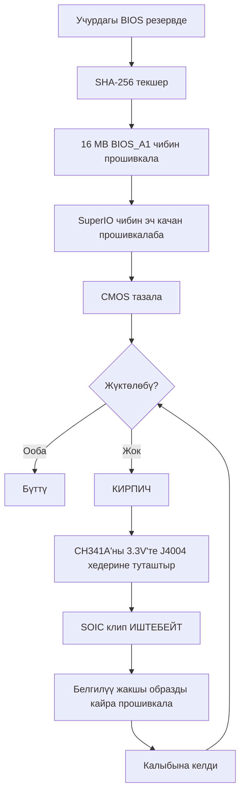

> 🌐 Коомчулук котормосу. Англис тилиндеги нуска — чындыктын булагы жана жаңыраак болушу мүмкүн. Ката таптыңызбы? Issue ачыңыз: [English](../en/08-bios.md) · [issues](https://github.com/lildebil0/awesome-bc250/issues)

# BIOS жана «кирпич»ти калыбына келтирүү

> **Кыскача** — Туура эмес BIOS жөндөөсү **BC-250'ни толук «кирпич» кылышы** мүмкүн, ал эми бул тактада CMOS тазалоо аны *ар дайым* калыбына келтире албайт ([src](https://t.me/c/2424231195/54971)). *Эч нерсени* прошивкалаардан мурун мунун маанисин түшүнүңүз: сизде **аппараттык калыбына келтирүү топтому** (**CH341A класстагы SPI программатор + ургаачы-ургаачы DuPont зымдары**) колдо болушу керек, анткени «кирпич»ти ишенимдүү ачуунун жалгыз жолу — чипти тактанын **J4004 хедери** аркылуу сырттан кайра прошивкалоо. Популярдуу коомчулук моду («death»тин BIOS'у, акыркысы стандарттык **5.00** негизинде) овершклокту, GDDR6 таймингдерин жана iGPU эс тутумун бөлүштүрүүнү ачат — пайдалуу, бирок **бардык жөндөөлөр коопсуз эмес, кээ бирлери тактаны дароо «кирпич» кылат** ([src](https://t.me/c/2424231195/78922)). Ар бир образдын **SHA-256**'сын алгач текшериңиз жана [`assets/firmware/DISCLAIMER.md`](../../assets/firmware/DISCLAIMER.md) окуңуз. **Шаласаалы прошивкалабаңыз.**

⚠️ **Бул — колдонмодогу эң коркунучтуу бөлүм.** Прошивкалоо — деструктивдүү жана калыбына келтирүү аппаратурасысыз кайтарылгыс. Эгер «кирпич»ти жандандыруу үчүн SPI чипине ширетүүгө/клип кысууга даяр эмес болсоңуз, **ушул жерде токтоп, стандарттык BIOS'ту иштетиңиз.**

---

## BC-250'де BIOS деген эмне

BC-250 — кесилген PS5 «Oberon» APU'сун көтөргөн AsRock жасаган майнинг/сервердик такта. Анын UEFI прошивкасы **16 MB SPI флэш-чибинде** жашайт (8-pin SOIC корпусундагы Winbond **W25Q128** / Macronix MX25L128). Стандарттык прошивка катуу кулпуланган: Setup'та пайдалуу эч нерсе дээрлик ачылган эмес. Чатта көрүнгөн белгилүү стандарттык версиялар — **3.00** жана **5.00**; мод BIOS'тор ушулардан кайра курулат (версия номери — сиздин таяныч чекитиңиз; мод кайсы негизде курулганын дайыма белгилеп коюңуз).

> Сток **4.00** да бар. Сток **v4.0** жана **v5.0** ортосундагы жалгыз функционалдык айырма — v5.0 демейки боюнча **тармактан жүктөөнү** иштеткендигинде. ([src](https://discord.com/channels/1315924807128449065/1316030225338863636/1326825429595848816))

Адамдардын кайра прошивкалоосунун эки себеби:

1. **Жашыруун менюларды (овершклок, андервольт, эс тутум, iGPU VRAM) ачкан мод BIOS орнотуу үчүн.**
2. **«Кирпич»ти калыбына келтирүү үчүн** — туура эмес жөндөөдөн же ийгиликсиз прошивкадан кийин белгилүү жакшы образды калыбына келтирүү.

> 💡 **Сизге такыр прошивкалоо кереги жок болушу мүмкүн.** Эгер *жалгыз* максатыңыз VRAM/UMA бөлүштүрүүсүн өзгөртүү болсо, муну иштеп жаткан Linux'тан **стандарттык** P3.00 / P5.00 BIOS'то **[fanoush/bc250_memcfg](https://github.com/fanoush/bc250_memcfg)** менен жасай аласыз — прошивкалоосуз, программаторсуз, «кирпич» тобокелисиз ([elektricM: BIOS flashing](https://elektricm.github.io/amd-bc250-docs/bios/flashing/), [elektricM: VRAM](https://elektricm.github.io/amd-bc250-docs/bios/vram/)). Мод BIOS прошивкалоо болгону *ачылган чипсет менюлары* жана VRAM өлчөмүнөн тышкаркы өзгөчөлүктөр үчүн керек (`bc250_memcfg` командасын [09-overclock-undervolt.md](../en/09-overclock-undervolt.md) кара).

---

## Мод BIOS («death» моду) — ал эмнени өзгөртөт жана эмне үчүн

Эталондук коомчулук моду чатта **death** тарабынан жүргүзүлөт. Бул *нөлдөн* жазылган прошивка *эмес* — ал стандарттык BIOS жашыруун жөнөткөн AMD/AMI Setup опцияларын кайра иштетет (ачат). Версияларды көзөмөлдөңүз, анткени кеңештер убакыт менен өзгөрдү:

| Мод версиясы | Негиз | Чыкты | Эмнени ачты / өзгөрттү | Статус |
|---|---|---|---|---|
| **1.0** (биринчи чыгарылыш) | стандарттык **3.00** | 2025-06-28 | GDDR6 жыштыгы, GDDR6 таймингдери, iGPU UMA эс тутум өлчөмү, ядро жыштыгы, чыңалуулар | ⚠️ Туура эмес маанилер тактаны «кирпич» кылат, **CMOS тазалоо жардам берген жок** ([src](https://t.me/c/2424231195/54971)) |
| 3.0 варианттары | 3.00 | 2025-07 → 10 | Ошол эле ачуулар; бир курулушка **атайын Steam жүктөө логотиби** кошулду | Косметикалык логотип курулушу `bc250-Steam.rom` катары чагылдырылган ([src](https://t.me/c/2424231195/86420)) |
| **5.00 моду** (учурдагы) | стандарттык **5.00** | 2025-10-05 | Кошумча барактар кайра топтоштурулду; **көбүрөөк жөндөө ачылды**; **RAM/GDDR6 тайминг жөндөөлөрү эми чындап колдонулат** бул тактада | Эң жаңы; «бардык жөндөө пайдалуу эмес, бирок жоктон көрө жакшы» ([src](https://t.me/c/2424231195/78922)) |

Аны менен чындап эмнени жөндөй аласыз (биринчи чыгарылыш эскертүүлөрүнөн, [src](https://t.me/c/2424231195/54971)):

- **GDDR6 жыштыгы** — бир колдонуучуда (`@Haswellb`) **1800**'дө иштеди деп билдирилген, бирок *ошол эле түрдөгү өзгөртүү башка тактаны «кирпич» кылган* — маанилер такта-спецификалык, универсалдуу эмес.
- **GDDR6 таймингдери** — алар колдонулат, бирок **өтө төмөн/тыгыз таймингдер тактаны «кирпич» кылат**.
- **iGPU эс тутум (UMA) өлчөмү** — иштейт жана чыныгы көтөрүлүш берет. Эгер өзгөртүүңүз күчүнө кирбесе, **IGC: Forces** жана **UMA Mode: UMA_SPECIFIED** коюңуз ([src](https://t.me/c/2424231195/54971); ошол эле айкалышты коомчулук документтери да ырастаган).
- **Ядро жыштыгы / чыңалуулар** — ачылган, бирок автор тарабынан **«сыналган эмес».**

> ❗ **Автордун эки эскертүүсү, дагы эле актуалдуу:** (1) **Integrated Graphics'ти өчүрбөңүз** — бул жалгыз дисплей чыгуусу. (2) Бул моддордун кайсынысында болбосун **туура эмес жөндөө тактаны «кирпич» кылышы мүмкүн, ал эми CMOS тазалоо аны калыбына келтирбеши мүмкүн** — так ушул себептен сизге программатор керек. (Негизди тандоо үчүн төмөндөгү «кайсы версия?» тепкичин кара.)

> ### Кайсы версия? (чечим тепкичи)
>
> 1. **Мод P3.00 (чипсет-меню ROM) — коопсуз демейки.** Бул орнотулган **«коомчулук стандарты… эң туруктуу жана сыналган»**, белгилүү SHA-256 менен ачык-ырасталган, жана ал мурунтан эле **VRAM-ачуу + чипсет жөндөөлөрүн** камтыйт. Башкача жасоого конкреттүү себебиңиз болмоюнча ушул жерден баштаңыз ([elektricM: BIOS flashing](https://elektricm.github.io/amd-bc250-docs/bios/flashing/)).
> 2. **Мод 5.00 — учурдагы; эс тутум жөндөөсүн кааласаңыз тандаңыз.** Бул эң жаңы негиз жана **RAM/GDDR6 тайминг жөндөөлөрү бул тактада чындап колдонулган** нуска ([src](https://t.me/c/2424231195/78922)). Эс тутум таймингдерин жөндөгүңүз келгенде так ушуну P3.00'дөн артык тандаңыз.
> 3. **`P5.00_clv` — эксперттер гана.** Ал **бардыгын** ачат (ар бир жашыруун меню, анын ичинде эксперименталдуу **ReBAR / Resizable BAR** жана дебаг/чипсет жөндөөлөрү), бул аны *«туура эмес нерсени өзгөрткөндө тактаны «кирпич» кылуу абдан оңой… Өнүккөн колдонуучу болмоюнча P3.00'дө кармангыла.»* Андан да жаманы, **`P5.00_clv` колдонмо таба алган бир да ачык репозиторийде жок** — ал болгону Discord тиркемеси катары жайылат, демек **канондук хэш жок**; колдонушуңуз керек болсо, аны өз алдынча иштеткен **эки** адамдан көчүрмө алып, прошивкалаардан мурун экөөсүндө тең **бирдей SHA-256** болгонун ырастаңыз ([elektricM: BIOS flashing](https://elektricm.github.io/amd-bc250-docs/bios/flashing/)).

> **Моддолгон 5.00 версиясынын билүүгө арзырлык өзгөчөлүктөрү.** Анын Setup программасында **демейки CPU жыштыгы 3600** деп көрсөтүлөт — бул колдонулган жыштык эмес, жөн гана косметикалык UI мааниси ([src](https://discord.com/channels/1315924807128449065/1452152658168381593/1452406964780007515)). Ал ошондой эле чипсет жөндөөлөрүндө **`x1x1x1x1` PCIe бифуркациясы** опциясын ачат ([src](https://discord.com/channels/1315924807128449065/1452152658168381593/1474231812598534351)). Бул базада эс тутумдун таймингдери менен өзгөчө этият болуңуз: **экстремалдык тайминг маанилери тышкы кайра программалоого чейин платаны такыр иштетпей (brick) коюшу мүмкүн, ал эми бул P5.00 версиясында өзгөчө олуттуу кесепеттерге алып келет** ([src](https://discord.com/channels/1315924807128449065/1371527281947971604/1468745940994101372)). Жана ар кандай программалоодогудай эле, моддолгон 5.00 версиясына өтүүдө **CMOS тазаланганга чейин экранга сүрөт чыкпай калышы мүмкүн** ([src](https://discord.com/channels/1315924807128449065/1315933088668454942/1508568321346502892)).

Ошондой эле эң көп шилтеме жасалган BIOS репозиторийинен, **[TuxThePenguin0/bc250-bios](https://gitlab.com/TuxThePenguin0/bc250-bios/)**, өзүнчө **чипсет-меню моду** (`BC250_3.00_CHIPSETMENU.ROM`) бар, ал стандарттык 3.00'дүн үстүнө **чипсет менюну / NBIO Common Options** ачат. Ал репозиторийдин README'си ачык айтат: *«Бул репозиторийдеги эч нерсе колдоого алынбайт жана эч кандай кепилдиги жок — РЕЗЕРВ АЛЫҢЫЗ.»*

> 🚫 **`Smokeless_UMAF`'тан качыңыз.** Коомчулуктун овершклок колдонмосу бул UEFI-түзөтүү куралын BC-250'де иштетпей турган нерсе катары белгилейт — **ал тактага туруктуу зыян келтириши мүмкүн** ([elektricM: BIOS overclocking](https://elektricm.github.io/amd-bc250-docs/bios/overclocking/)). Жогорудагы белгилүү жакшы ROM'дордо кармаңыз.

---

## Прошивкалаардан мурун — коопсуздук текшерүү тизмеси

1. **Алгач учурдагы BIOS'уңузду резервдеңиз** (аны прошивкалай турган куралыңыз менен окуп чыгыңыз — Жол B/калыбына келтирүүнү кара). Резерв — сиздин акысыз кайтаруу мүмкүнчүлүгүңүз.
2. Образдын **SHA-256'сын** `assets/PROVENANCE.md` / булак постуна салыштырып **текшериңиз.** Коомчулуктун прошивкалоо колдонмосу чипсет-меню ROM үчүн хэшти мындай жарыялайт:
   `48fbe5d366e6a56e2fdffdca848426216ba1f083610dab63db89d2f4e6c940b5` ([elektricM docs](https://elektricm.github.io/amd-bc250-docs/bios/flashing/)).
3. Болгону маркировканы эмес, **чип өлчөмүн ырастаңыз.** Максат — 16 MB BIOS чиби; кичинекей SuperIO чибин **прошивкалабаңыз** (калыбына келтирүү бөлүмүн кара). Ар башка такта ревизиялары бир аз ар башка чип номерлерин көтөрө алат — мааниси бар нерсе — **сыйымдуулук (16 MB)**, маркировканын акыркы тамгалары айырмаланышы мүмкүн ([src](https://t.me/c/2424231195/67880)).
4. Биринчи прошивкадан *мурун*, «кирпич» кылгандан кийин эмес, **калыбына келтирүү аппаратурасын даяр кармаңыз.**
5. Прошивкадан кийин жаңы жөндөөлөр (айрыкча VRAM бөлүштүрүү) күчүнө кириши үчүн **CMOS тазалаңыз** («Ар бир прошивкадан кийин» кара).



### Прошивкалаардан мурун контролдук суммасын текшериңиз

Жогорудагы 2-кадам SHA-256'ны текшерүүнү айтат — мынакей кантип. Прошивкалай турган файлдын хэшин эсептеп, аны [`assets/PROVENANCE.md`](../../assets/PROVENANCE.md) ичинде ал файл үчүн көрсөтүлгөн маани менен символ-символго салыштырыңыз.

```bash
# Linux:
sha256sum BC250_3.00_CHIPSETMENU.ROM
```

```powershell
# Windows (PowerShell):
Get-FileHash BC250_3.00_CHIPSETMENU.ROM -Algorithm SHA256
```

`PROVENANCE.md` кыска измерим катары болгону **алгачкы 16 он алтылык символду** көрсөтүшү мүмкүн. Эгер ушундай болсо, эсептелген хэшиңиз ошол 16 символ **менен башталганын** текшериңиз — ал префикстин толук дал келиши мурунтан эле күчтүү текшерүү (тейлөөчү суроо-талап боюнча толук хэштерди жарыялай алат).

**Ачык жайгаштырылган образдар үчүн ырасталган толук SHA-256 хэштери** (бир нече коомчулук репозиторийлеринде кайчылаш текшерилген — ар бир белгилүү жакшы BC-250 BIOS файлы **так 16 MB / 16777216 байт**; башка өлчөм аны бузук, курал/патч, же тиешеси жок дегенди билдирет) ([elektricM: BIOS flashing](https://elektricm.github.io/amd-bc250-docs/bios/flashing/)):

| Файл | Түрү | SHA-256 |
|---|---|---|
| `BC250_3.00_CHIPSETMENU.ROM` (б.а. `Robin3.00`, `BC250CHIPSETMENU.ROM`) | **Мод P3.00** — VRAM + чипсет ачуу, *сунушталат* | `48fbe5d366e6a56e2fdffdca848426216ba1f083610dab63db89d2f4e6c940b5` |
| `Robin5.00` | **Стандарттык** P5.00 (мод `P5.00_clv` эмес) | `0d6f136cb120cf3b2de26d5c4d7f255604fdbf4b9442af5ba55419b95b89aa82` |
| `BC250_3.00.ROM` | Стандарттык P3.00 | `07595ca3aecf8a4caa28a397b5298f3946a1b769f87b16f67adc369c3f69045c` |
| `BC250_2.00.bin` | Стандарттык P2.00 | `ee6150dfed33bd05ea46063a352549416fdf3f45fa0e5edac2a68ef78d71083c` |
| `P5.00_clv` | Мод P5.00 (бардыгын-ачуу) | **ачык хэш жок** — Discord-да гана, эки өз алдынча көчүрмөнүн дал келишин текшериңиз |

> Мод P3.00 репозиторийлерде бир нече файл аты менен пайда болот (`BC250_3.00_CHIPSETMENU.ROM`, `BC250CHIPSETMENU.ROM`, `Robin3.00`) — алардын баары жогорудагы мааниге хэштелет, ошондуктан аты мааниге ээ эмес. `Robin5.00` — бул **стандарттык** P5.00, мод `P5.00_clv`'дан *башка файл*. Ар биринин ачык булактары (TuxThePenguin0 GitLab, forgenam, tipitochen, csabakecskemeti, scrakcho, dannybastos, kenavru, MrrZed0) [elektricM прошивкалоо колдонмосунда](https://elektricm.github.io/amd-bc250-docs/bios/flashing/) тизмеленген.

> 🔴 **Эгер контролдук сумма дал келбесе, ПРОШИВКАЛАБАҢЫЗ.** Дал келбөө — бузук же туура эмес файл дегенди билдирет — аны прошивкалоо — тактаны «кирпич» кылуунун так өзү. Образды кайра жүктөп, кайра текшериңиз.

---

## Жол A — Программалык прошивкалоо (тактадан, программаторсуз)

Бул — такта дагы эле жүктөлүп жатканда BIOS орнотуунун/жаңылоонун кадимки жолу. **FAT32 USB таякчасын** жана AMI прошивка жаңылоо утилитасын колдонуңуз.

**EFI / AFU методу** ([src](https://t.me/c/2424231195/54979)):

1. USB таякчасын **FAT32**'ге форматтаңыз.
2. AFU архивинин мазмунун (мис. `AfuEfi64_5.16.zip`) **жана BIOS файлын** ага көчүрүңүз.
3. BC-250'ни кайра жүктөп, **USB таякчасынан** EFI кабыкка жүктөңүз.
4. Иштетиңиз:
   ```
   afuefix64.efi <filename>.<ext> /P /N
   ```
   - `/P` = негизги BIOS'ту программалоо.
   - `/N` = **NVRAM**'ди да программалоо. Бул версиялар *арасында* которулганда каталардын алдын алат (мис. башка версиядан 3.00'ге) — **бирок сакталган жөндөөлөрүңүздү өчүрөт.** `/N`'ди калтырсаңыз болот, бирок анда мүмкүн каталарды күтүңүз. ([src](https://t.me/c/2424231195/54979))
5. Эгер курал файлды көрө албаса, кайсынысы таякча экенин табуу үчүн `fs0:`, `fs1:`, … сынап көрүңүз ([src](https://t.me/c/2424231195/54979)).

Кээ бир коомчулук курулуштары даяр `Flash.nsh` скриптин жана аты өзгөртүлгөн ROM'ду жөнөтөт (мис. мод ROM'ду скриптке дал келтирүү үчүн атын өзгөртүңүз), ошондо сиз болгону EFI кабыкка жүктөп, скриптти иштетесиз ([elektricM docs](https://elektricm.github.io/amd-bc250-docs/bios/flashing/)). Linux'та иштеп жаткан системадан прошивкалоо үчүн **`afulnx`** курулушу да бар (`afulnx-5.05.04Z.tar.gz`) ([src](https://t.me/c/2424231195/54507)).

#### Канондук EFI-кабык рецепти (`Flash.nsh` / `Robin5.00` методу)

Коомчулуктун прошивкалоо колдонмосу өз алдынча топтомго жана белгиленген файл атына стандартташтырат — бул эң көп кайталанган USB жолу ([elektricM: BIOS flashing](https://elektricm.github.io/amd-bc250-docs/bios/flashing/)):

1. **EFI топтомун алыңыз:** `4U12G BIOS Update.zip` ([kenavru/BC-250](https://github.com/kenavru/BC-250) репозиторийинен) — ал `AfuEfix64.efi`, `Flash.nsh` жана `amdvbflash.efi` камтыйт. *Ал ошондой эле `Robin5.00` аттуу стандарттык P5.00 BIOS'ту топтойт — аны кокусунан прошивкалабаш үчүн четке жылдырыңыз.*
2. **FAT32 таякчаны даярдаңыз (≤ 32 GB сунушталат).** Топтомдун `BIOS EFI` папкасынын мазмунун **тамырга** көчүрүңүз.
3. **Мод ROM'уңуздун атын `Robin5.00`'гө өзгөртүңүз** (`.ROM` кеңейтүүсүн алып салыңыз) — `Flash.nsh` так ушул атты издейт. *(Же анын ордуна `Flash.nsh`'ти өз файл атыңызга дал келтирип түзөтүңүз.)* Тамырда мындай болушу керек: `AfuEfix64.efi`, `Flash.nsh`, `amdvbflash.efi`, `Robin5.00` (аты өзгөртүлгөн модуңуз) жана `EFI` папкасы.
4. **Түз DisplayPort мониторун колдонуңуз.** Активдүү/пассивдүү **HDMI адаптерлери BIOS менюсун кара экран кылышы мүмкүн** — бул тактадагы белгилүү дисплей мүчүлүштүгү.
5. Такта EFI кабыкка автоматтык түшүшү үчүн **бардык SSD/дисктерди сууруп**, таякчаны салып, кубат бериңиз. Сиз сары `Shell>` сурамына түшөсүз.
6. Сурамда **`blk0:`** деп терип, анан Enter — **кош чекиттен кийинки боштукка көңүл буруңуз** (бул USB томун тандайт; `blk0:` — elektricM документтеген тандагыч, жогорудагы `fs0:`/`fs1:` издөөсүнөн айырмаланат). Андан соң **`Flash.nsh`** деп терип, Enter.
7. **КҮТҮҢҮЗ. Клавиатураны тийбеңиз, өчүрбөңүз.** Эгер ал жазуу учурунда асылгандай *көрүнсө*, **жок дегенде 15 мүнөт күтүңүз** — жазуунун ортосунда өчүрүү тактаны «кирпич» кылат. Ал бүткөндө кайра жүктөйт (же сизден сурайт).
8. **Дароо өчүрүп, таякчаны алыңыз**, ал кайра прошивкалоочуга кайра кайрылбашы үчүн.

> 🔴 **Прошивкалоо үчүн кубат бераардан мурун: 8-pin PCIe кубат зымдоосун** PSU'ңуздун 12 V/GND диаграммасына салыштырып текшериңиз. **Терс полярдуулук тактага туруктуу зыян келтириши мүмкүн** ([elektricM: BIOS flashing](https://elektricm.github.io/amd-bc250-docs/bios/flashing/)).

#### Прошивкадан кийинки талап кылынган BIOS жөндөөлөрү (муну CMOS тазалоодон кийин дароо жасаңыз)

Прошивкалоодон **жана** CMOS тазалоодон кийин (кийинки бөлүм), Setup'ка кирип (**Del**'ди басып туруңуз) булардын баарын коюңуз — VRAM бөлүштүрүү алар туура болмоюнча иштебейт ([elektricM: BIOS flashing](https://elektricm.github.io/amd-bc250-docs/bios/flashing/), [elektricM: BIOS VRAM](https://elektricm.github.io/amd-bc250-docs/bios/vram/)):

| Жөндөө | Жол | Маани |
|---|---|---|
| Integrated Graphics Controller | Chipset → GFX Configuration | **Forces** |
| UMA Mode | Chipset → GFX Configuration | **UMA_SPECIFIED** |
| UMA Frame Buffer Size | Chipset → GFX Configuration | **512MB** (сунушталат) же бекитилген өлчөм |
| IOMMU | Advanced → CPU Configuration | **Disabled** |
| Boot Mode | Boot → Boot Mode | **UEFI** |

Алгач CMOS тазалоо чындап ишке ашканын текшериңиз — **саат туура эмес көрсөтүшү керек**; эгер дагы эле туура болсо, тазалоону кайталаңыз. Андан соң сактоо үчүн F10. `512MB` тандоосу — *динамикалык* бөлүштүрүү, 512 MB чек эмес ([09-overclock-undervolt.md](../en/09-overclock-undervolt.md) кара).

> ★ **Эмне үчүн 512 MB UMA FPS *утат* (механизми).** UMA буферин **512 MB**'га коюу GPU'ну ачка калтырбайт — ал чоң бекитилген тилимди кулпулаап коюунун ордуна системага **RAM менен VRAM'ди динамикалык тең салмактаганга** мүмкүндүк берет, жана ушул кайра балансташтыруу гана чыныгы FPS секирүүсүнө себеп болду: Cyberpunk 2077 **60 → 66 fps (2 GHz OC'те) → 76 fps**'ке FSR 3.0 *balanced*, 1080p, Steam-Deck пресети алдында жетти ([Old Lamer — Part I](https://youtu.be/ohpEY2XQ_lo) ~11:21; ⚠ болжолдуу — сандар видеодон транскрипцияланган, бир курулуштун натыйжасы катары караңыз). Демек «512 MB эң жакшы» болгону коопсуз өлчөмдөө эмес — кичинекей динамикалык буфер компромисс эмес, өндүрүмдүүлүк окуясынын *бир бөлүгү*.

**flashrom резерви** (эгер AFU ката берсе) ([src](https://t.me/c/2424231195/54979), `@mrartemsid` сунуштаган жана сынаган):

```bash
# Read (back up):
sudo flashrom -p internal:boardmismatch=force -r <name>.bin
# Write:
sudo flashrom -p internal:boardmismatch=force -w <name>.bin
```

> ⚠️ Программалык прошивкалоо болгону **такта дагы эле POST өтүп жатканда** жардам берет. Туура эмес жөндөө аны «кирпич» кылган учурда Жол A жок болот жана сиз төмөндөгү аппараттык жолго түшөсүз.

---

## Жол B — Аппараттык прошивкалоо / «кирпич»ти ачуу (CH341A SPI программатор)

Бул — **калыбына келтирүү** жолу, жана бекитилген «кирпичти прошивкалоонун эң ыңгайлуу жолу» ([src](https://t.me/c/2424231195/67880)). Сиз 16 MB SPI чибин түз, башка PC'ден, USB SPI программатору менен кайра жазасыз. Колдонулган программа: **NeoProgrammer** (Windows) же **flashrom** (Linux).

> 🔴 **SOIC-8 клип бул тактада ИШТЕБЕЙТ.** death бул тууралуу ачык айтат: *«биздин тактада клип… негизинен такыр иштебейт.»* ([src](https://t.me/c/2424231195/67880)). Эскертүү: `assets/firmware/DISCLAIMER.md` жалпы түрдө «SOIC клип» дегенди айтат — практикада сиз анын ордуна **тактадагы J4004 хедерине зымдашыңыз керек.** Бул — ушул бөлүмдөгү эң маанилүү калыбына келтирүү фактысы.

### J4004 хедер пиноуту (бул жерге зымдаңыз)

Такта SPI/BIOS чибин кайра прошивкалоо үчүн атайын **2.54 мм кадамдуу J4004 хедерин** ачат. Пиноут (бекитилген зымдоо скриншотунан, [src](https://t.me/c/2424231195/67880)):

```
J4004
[ GND  SCLK  MOSI  UNK ]
[ VCC  CS    MISO      ]
   ^  (pin-1 marker)
```

| J4004 пини | Сигнал | CH341A пады |
|---|---|---|
| VCC | 3.3 V кубат | VDD / 3.3V |
| GND | жер | GND |
| CS | chip select | CS / SS |
| SCLK | такт | CLK / SCK |
| MOSI | маалымат кириши (чипке) | MOSI |
| MISO | маалымат чыгышы (чиптен) | MISO |

Тиешелүү **W25Q128 SOIC-8 / CH341A түс картасы** ушул эле бекитилген скриншотто — `/CS, DO(MISO), CLK, DI(MOSI), VCC, GND`'ди CH341A'нын `CS, MISO, CLK, MOSI, VDD, GND` паддарына дал келтириңиз. Кубат бераардан мурун **VCC менен GND'ди үч жолу текшериңиз**; аларды алмаштыруу чипти өлтүрөт ([src](https://t.me/c/2424231195/67880)).

> **J4004 пин номерлөө жана эки белгисиз пин.** elektricM колдонмосу хедерди VCC=1, GND=2, CS=3, SCLK=4, MISO=5, MOSI=6 деп номерлейт, **7 жана 8-пиндер прошивкалоо үчүн колдонулбайт — алар 10 kΩ резисторлор аркылуу жерге туташкан.** 1-пин (VCC) PCB'де **жебе `>` же чарчы пад** менен белгиленген ([elektricM: BIOS flashing](https://elektricm.github.io/amd-bc250-docs/bios/flashing/)).

> **Так максаттуу чип жана тыгыздык басма катасы.** 16 MB бөлүгү — Winbond **W25Q128JVSQ** (128 Mbit / 16 MB) же, кээ бир партияларда, Macronix **MX25L12835F**. Кээ бир коомчулук документтери муну **«25Q168» деп басма катасы менен жазат — бул туура эмес**; туура 16 MB тыгыздык коду — **128** ([elektricM: BIOS flashing](https://elektricm.github.io/amd-bc250-docs/bios/flashing/)). Эгер сиз J4004'тин ордуна жылаңач **SOIC-8 клип** аркылуу прошивкаласаңыз, чиптин өз пин тартиби — стандарттык SPI жайгашуусу: `1 CS · 2 DO · 3 WP · 4 GND · 5 DI · 6 CLK · 7 HOLD · 8 VCC` ([elektricM: BIOS recovery](https://elektricm.github.io/amd-bc250-docs/bios/recovery/)) — бирок death'тин **клип бул тактада араң иштейт** деген табылгасын эстеп, J4004'ту артык көрүңүз.

> 🙏 Ыраазычылык: J4004 пиноуту, тескери инженерия жана модификацияланган-прошивка образ репозиторийи негизинен **Segfault**'тин иши (P3.00 чипсет-меню ROM — «Segfault моду») ([elektricM: BIOS flashing](https://elektricm.github.io/amd-bc250-docs/bios/flashing/)).

### NeoProgrammer процедурасы (бекитилген) ([src](https://t.me/c/2424231195/67880))

1. Программаторду пиноут боюнча ургаачы-ургаачы зымдар менен **J4004**'ка туташтырыңыз. **Зымдоону ~10×, айрыкча VCC менен GND'ди текшериңиз.** (PSU суурулган.)
2. **NeoProgrammer'ди ачыңыз.**
3. Чиптин **авто-аныктоосун** иштетип, чиптин өзүндөгү маркировканы да окуңуз.
4. **Маркировкаларды салыштырыңыз.** Эгер акыркы тамгалар тизмеден айырмаланса, бирок **сыйымдуулук дал келсе (16 MB)**, бул жакшы.
5. Чипти **тазалаңыз (Erase).**
6. Программада BIOS файлын **ачыңыз** (сүйрөп-таштоо иштейт).
7. Чипти **жазыңыз (Write).**
8. **Зымдарды J4004'тан ажыратыңыз.**
9. Тактага кубат бериңиз.

### flashrom эквиваленти (Linux), коомчулук документтери менен кайчылаш текшерилген

Коомчулуктун прошивкалоо колдонмосу **CH347** программаторун колдонот жана арзан кара-PCB CH341A такталарына каршы эскертет (кийинки бөлүм). Туура чипти аныктаңыз — **16 MB BIOS чибин** (`BIOS_A1`) максат кылыңыз, 512 KB SuperIO'ну (`SIO1_R`) **эч качан** прошивкалабаңыз, ал прошивкаланса SuperIO'ну «кирпич» кылат ([elektricM docs](https://elektricm.github.io/amd-bc250-docs/bios/flashing/)):

```bash
# Detect / identify the chip:
sudo flashrom -p ch347_spi

# Back up the stock BIOS (twice, then diff to be sure the read is stable):
sudo flashrom -p ch347_spi -r backup_stock.bin
sudo flashrom -p ch347_spi -r backup_verify.bin

# Write the new image, then verify it read back identical:
sudo flashrom -p ch347_spi -w BC250_3.00_CHIPSETMENU.ROM
sudo flashrom -p ch347_spi -v BC250_3.00_CHIPSETMENU.ROM
```

(CH341A үчүн `ch347_spi`'дин ордуна `-p ch341a_spi`, же Raspberry Pi Pico үчүн `serprog` колдонуңуз.) ⚠ *Ушул* тактанын так зымдоосу үчүн `ch347_spi` / `serprog` дал келүүсү коомчулук колдонмосунан — өз программатор моделиңизге салыштырып `⚠ verify`.

> **Аныктоо кайсы чипте экениңизди айтат.** Эгер `flashrom -p …` **`Winbond W25Q128…`** же **`Macronix MX25L128…`** деп билдирсе, сиз туура 16 MB BIOS чибиндесиз. Эгер ал **`Macronix MX25L4005…` (512 KB)** деп билдирсе, **ТОКТОҢУЗ — сиз SuperIO чибине туташкансыз** (`SIO1_R`); аны прошивкалоо желдеткич башкаруусун/сенсорлорду «кирпич» кылат. Башка чипке өтүңүз ([elektricM: BIOS flashing](https://elektricm.github.io/amd-bc250-docs/bios/flashing/)). **PSU розеткадан суурулган** жана конденсаторлор разрядкалган (кубат баскычын бир нече жолу басыңыз) абалда прошивкалаңыз — клип прошивкасы учурунда тактага кубат берүү сунушталбайт ([elektricM: BIOS recovery](https://elektricm.github.io/amd-bc250-docs/bios/recovery/)).

### CH341A 3.3 V тузагы (муну окуңуз, болбосо чипти куйкалайсыз)

Көптөгөн арзан **кара-PCB CH341A** программаторлору **VCC 3.3 V болсо да маалымат линияларын 5 V'те айдайт** — BC-250'нин BIOS чиби — **3.3 V** бөлүгү, ошондуктан маалымат линияларындагы 5 V аны бузушу мүмкүн. Бул кээ бир такталарда белгилүү, өлчөнгөн мүчүлүштүк (Fabian'дын тактасы жана чаттагы дал ошондой такта чыңалуу өлчөө менен ырасталган) ([src](https://t.me/c/2424231195/100285)). Оңдоолор:

- Маалымат линияларында чындап 3.3 V болгон программаторду тандаңыз (мис. **CH347**), **же**
- **Ширетүүсүз CH341A 5V→3.3V маалымат-линия оңдоосун** колдонуңуз: USB 5 V кубат линиясын чипке кесип, анын ордуна 3.3 V бериңиз — [sawyershepherd.org макаласын](https://sawyershepherd.org/post/solderless-ch341ab-fix-5v-to-33v-data-lines/) жана [wej.k.vu CH341A оңдоосун](https://wej.k.vu/electronics/ch341a-mini-programmer-fix/) кара ([src](https://t.me/c/2424231195/100285)).

---

### Төмөнкү деңгээлдеги хедерлер, дебаг жана тактадагы кремний

Жогорудагы J4004 флэш-хедеринен тышкары, такта дагы бир нече хедерди жана белгилүү топтом тактадагы чиптерди көтөрөт. Булар elektricM аппараттык документтеринде тескери инженерияланган жана CMOS тазалоо, дебаг текшерүү, желдеткич зымдоо, жана прошивкалаардан мурун кайсы чип кайсы экенин ырастоо үчүн пайдалуу. Пин маанилери ([elektricM: pinouts](https://elektricm.github.io/amd-bc250-docs/hardware/pinouts/)) булагынан сөзмө-сөз транскрипцияланган.

**CLRCMOS1 — clear-CMOS джемпери (3-пин).** Бул — ушул бөлүмдө бардык жерде «CMOS джемперин кыска туташтыр» деп шилтеме жасалган джемпер — мынакей анын картасы:

| Абал | Жүрүм-туруму |
|---|---|
| 1–2 пиндер | CR2032 CMOS'ту кубаттайт (демейки) |
| 2–3 пиндер | CMOS тазалоо |

> 💡 [Прошивкадан кийинки текшерүү тизмеси](#прошивкалаардан-мурун--коопсуздук-текшерүү-тизмеси) жана [«Ар бир прошивкадан кийин»](#ар-бир-прошивкадан-кийин--cmos-тазала-муну-калтырбаңыз) «CMOS джемперин ~20 секунд кыска туташтыр» десе, **CLRCMOS1** — ошол джемпер: аны 1–2 пиндерден 2–3 пиндерге жылдырып, күтүп, анан кайра жылдырыңыз. (CR2032'ни 60+ с алып салуу — альтернатива.)

**TPMS1 — LPC дебаг хедери (18-пин, 2.0 мм кадам):**

| Пин | Сигнал | Пин | Сигнал |
|---|---|---|---|
| 1 | PCICLK | 2 | GND |
| 3 | FRAME | 4 | SMB_CLK_MAIN |
| 5 | PCIRST# | 6 | SMB_DATA_MAIN |
| 7 | LAD3 | 8 | LAD2 |
| 9 | 3V | 10 | LAD1 |
| 11 | LAD0 | 12 | GND |
| 13 | (бош) | 14 | S_PWRDWN# |
| 15 | 3VSB | 16 | SERIRQ# |
| 17 | GND | 18 | GND |

> 💡 **9-пин (3V) такта күйгүзүлгөндө гана жанданат** — ошондуктан ал «система-күйүк» аныктоо сигналы катары иштейт. Бул аны авто-кубат-күйгүзүү / чыныгы-ATX адаптер курулуштары үчүн альтернативдик сезүү чекити кылат (03-power-supply.md ичиндеги [`AUTO_PWRON` джемперин](../en/03-power-supply.md) кайчылаш кара).

**J2 — JTAG/HDT дебаг хедери (20-пин, 1.27 мм кадам, толтурулбаган, тактанын астында):**

| Пин | Сигнал | Пин | Сигнал |
|---|---|---|---|
| 1 | VDDIO | 2 | TCK |
| 3 | GND | 4 | TMS |
| 5 | GND | 6 | TDI |
| 7 | GND | 8 | TDO |
| 9 | TRST_L | 10 | PWROK_BUF |
| 11 | DBRDY3 | 12 | RESET_L |
| 13 | DBRDY2 | 14 | DBRDY0 |
| 15 | DBRDY1 | 16 | DBREQ_L |
| 17 | GND | 18 | TEST19 |
| 19 | VDDIO | 20 | TEST18 |

> TEST18, TEST19 жана DBRDY0 калкып турат. Бул — тактадагы **жалгыз** аппараттык reset/дебаг интерфейси.

**I2C_HEADER1 (3-пин):** `SCL · SDA · GND`. SCL — **кубат туташтыргычтарына жакыныраак** пин. Бул шина **Intersil PMIC'тарга PMBUS** алып барат — кубат-телеметрия жетүү чекити.

**CPU_FAN1 (4-пин):** `PWM · Tach · 12V · GND`.

**J4003 — көп-желдеткич хедери (16-пин, 2×8, 2.54 мм):**

| Row 1 | 1 GND | 2 F1T | 3 F2T | 4 F3T | 5 F4T | 6 F5T | 7 DET | 8 (бош) |
|---|---|---|---|---|---|---|---|---|
| **Row 2** | 1 GND | 2 F1P | 3 F2P | 4 F3P | 5 F4P | 6 F5P | 7 GND | 8 GND |

Бул жерде `T` = tach жана `P` = PWM, ар бир желдеткич 1–5 боюнча.

> 💡 **DET (row 1, 7-пин) такта желдеткич / кубат-таркатуу тактасында турганда жерге туташат** — б.а. ал ташуучуну аныктайт. (BIOS↔Linux желдеткич номерлөөсү [06-linux.md → Sensors & fan control](../en/06-linux.md#sensors--fan-control) ичинде каралган; бул жерде кайталанбайт.)

**Тактадагы кремний (BOM).** Репозиторий прошивкалоо бөлүмдөрүндө `SIO1_R` жана `BIOS_A1`'ди мурунтан атайт, бирок эч качан номерлерин же өлчөмдөрүн берген эмес; бул таблица прошивкалоочуга кайсы чип кайсы экенин ырастоого жардам берет (16 MiB Winbond — BIOS, 512 KiB Macronix — SuperIO — ага тийбе):

| Белгилөө | Бөлүк | Ролу |
|---|---|---|
| PUA1 | Intersil ISL69247 | Негизги PMIC |
| PUIO1 | Intersil ISL95712 | Ядро-кубат PMIC |
| PUA11… | Intersil ISL99360 | Акылдуу кубат баскычтары (фазалар) |
| M2U2 | NXP CBTL04083B | 2:1 PCIe x4 мукс |
| U30 | Realtek RTL8111H | Ethernet NIC (PCIe x1) |
| SU1 | AMD 218-0844029 | A68H «Bolton-D2H» FCH чипсет |
| UIO1 | Nuvoton NCT6686D | SuperIO (hwmon сенсор чиби) |
| BIOS_A1 | Winbond 25Q128JVSQ | 16 MiB SPI флэш = **BIOS** (МУНУ прошивкала) |
| SIO1_R | Macronix MX25L4006E | 512 KiB SPI флэш = SuperIO программасы (**прошивкалаба — SuperIO'ну «кирпич» кылат**) |

> Бул жерде аталган SuperIO сенсор чиби (Nuvoton **NCT6686D**) — Linux `nct6687`/`nct6683` драйвери байланышкан чип — сенсор/желдеткич жөндөөсүн [06-linux.md](../en/06-linux.md) кара.

**Микропрограммалык камсыздоо куралдары (өнүккөн).** Образдын ичин изилдөө үчүн эки утилита дайыма кездешет:

- **`psptool`** BIOS дампынын ичиндеги AMD микропрограмма блобдорун текшерет жана чыгарып алат. `psptool -E bios.bin` жазууларды тизмелейт; `psptool -X -d 0 -e 1 -o firmware.bin bios.bin` анализдөө үчүн SMU микропрограммасын чыгарып алат. ([bc250-collective/amd_smu_reverse_engineering](https://github.com/bc250-collective/amd_smu_reverse_engineering))
- **`Zentool`** процессордун микрокодун патч кылат — мисалы, `RDRAND` нускамасын алмаштыруу үчүн. ([AMD-BC-250/documentation #1](https://github.com/AMD-BC-250/documentation/issues/1))

---

## Secure Boot жана CSM (жүктөө шарттары)

Бул экөөнү BIOS-setup шарттар тизмесине кошуңуз — талап кылынат, болбосо **атайын/патчтелген ядролор жүктөлбөйт** (40-CU патчы, жыштык патчы ж.б.):

| Жөндөө | Маани |
|---|---|
| Secure Boot | **Disabled** |
| CSM (Compatibility Support Module) | **Disabled** |

Булак: [elektricM: boot troubleshooting](https://elektricm.github.io/amd-bc250-docs/troubleshooting/boot/).

---

## «srep» авто-баштапкы абалга келтирүү идеясы (эксперименталдуу — бүткөн өзгөчөлүк эмес)

Туура эмес жөндөө тактаны «кирпич» кылышы мүмкүн жана **CMOS тазалоо аны оңдобогондуктан**, death «кирпич» болгондо **жөндөөлөрдү авто-баштапкы абалга келтирүү** үчүн BIOS'ко **`srep`** процедурасын киргизүүнү эксперименттеди — идея башында `@Jacky_Fish`'ден ([src](https://t.me/c/2424231195/60552)). Концепция: BIOS өзүнүн NVRAM/`amdsetup` өзгөрмөлөрүн демейкилерге кайра патчтесин, кошумча гана USB таякчада триггер файлдары болгондо (ошондо ал ар жүктөөдө жөндөөлөрүңүздү өчүрбөйт). Чаттагы абалга карата, **бул дагы иштеген жок** — *«такта өзүн толук «кирпич» кылып көрсөтүүдөн баш тартпайт жана эч нерсе баштапкы абалга келбейт»* ([src](https://t.me/c/2424231195/60883)). Кайсы «өзүн-өзү айыктыруучу BIOS» дооматын тең **далилденбеген** катары караңыз; сиздин чыныгы коопсуздук торуңуз сырткы программатор бойдон калат. Кайсы srep курулушуна таянаардан мурун `⚠ verify`.

---

## Ар бир прошивкадан кийин — CMOS тазала (муну калтырбаңыз)

BIOS прошивкалоо сакталган жөндөөлөрдү **баштапкы абалга келтирбейт**, жана бир нече жөндөө (айрыкча **VRAM/UMA бөлүштүрүү**) сиз CMOS тазалаганга чейин чындап колдонулбайт. Бир колдонуучу так ушуга туш болду: BIOS жаңы VRAM өлчөмүн көрсөтүп «сактады», бирок ОС (Bazzite) CMOS тазаланганга чейин дагы эле эски 4 GB RAM / 12 GB VRAM бөлүштүрүүсүн билдирди ([src](https://t.me/c/2424231195/97290)). Кантип тазалоо керек:

- **CR2032 монета батареясын 60+ секунд алып салыңыз** (сунушталат), **же**
- **CMOS джемперин ~20 секунд кыска туташтырыңыз.** ([elektricM docs](https://elektricm.github.io/amd-bc250-docs/bios/flashing/))

> Чектөөсүн эстеңиз: CMOS тазалоо «жөндөөлөр колдонулган жок» жана *жеңил* туура эмес конфигдерди оңдойт — бирок 1.0/3.00 мод муунунда ал чыныгы «кирпич»ти калыбына келтире алба деп билдирилген ([src](https://t.me/c/2424231195/54971)). Анын ордуна Жол B'ни кара.

---

## Чагылдырылган прошивка

Чатта талкууланган BIOS образдары **калыбына келтирүү/сактоо** үчүн `assets/firmware/` астында чагылдырылган ([`DISCLAIMER.md`](../../assets/firmware/DISCLAIMER.md) кара жана прошивкалаардан мурун ар бир файлдын SHA-256'сын `PROVENANCE.md`'те текшериңиз):

| Файл | Өлчөм | Бул эмне | Булак |
|---|---|---|---|
| `BC250_3.00.ROM` | 16 MB | Стандарттык 3.00 дамп | ([src](https://t.me/c/2424231195/5215)) |
| `BC250_3.00_CHIPSETMENU.ROM` | 16 MB | Чипсет-меню моду (TuxThePenguin0) | ([src](https://t.me/c/2424231195/86395)) |
| `dump_5.00.bin` | 16 MB | Стандарттык 5.00 дамп | ([src](https://t.me/c/2424231195/24661)) |
| `BC250_5.00_clv.zip` | 16 MB | **death'тин 5.00 моду (учурдагы)** | ([src](https://t.me/c/2424231195/78922)) |
| `bc250_3.00_clv1.zip` | 16 MB | death'тин биринчи 3.00 моду (1.0) | ([src](https://t.me/c/2424231195/54971)) |
| `bc250-Steam.rom` | 16 MB | Steam жүктөө логотиби менен 3.0 мод | ([src](https://t.me/c/2424231195/86420)) |
| `bc250 modded bios.ROM` | 16 MB | Эрте модификацияланган образ | ([src](https://t.me/c/2424231195/30100)) |
| `my_4.0_MODED.bin` | 16 MB | Аралык 4.0 мод | ([src](https://t.me/c/2424231195/45580)) |
| `W25Q128BV@WSON8_…BIN` | 16 MB | Жылаңач чип окуу (W25Q128) | ([src](https://t.me/c/2424231195/5217)) |
| `AfuEfi64_5.16.zip` | — | AMI AFU EFI прошивкалоочу | ([src](https://t.me/c/2424231195/54979)) |
| `afulnx-5.05.04Z.tar.gz` | — | AMI AFU Linux прошивкалоочу | ([src](https://t.me/c/2424231195/54507)) |

> PS5 BIOS'ту (`PS5 Disk Edition … BIOS.bin`, 2 MB) же 512 KB чиптерди BC-250'нин 16 MB BIOS чибине прошивкалабаңыз — туура эмес максат, калыбына келтирүү эскертүүлөрүн кара.

---

## Булактар

- death'тин моду — биринчи чыгарылыш (3.00) — https://t.me/c/2424231195/54971 · учурдагы (5.00) — https://t.me/c/2424231195/78922 · Steam-логотип курулушу — https://t.me/c/2424231195/86420
- Программалык прошивкалоо (AFU `/P /N`, flashrom) — https://t.me/c/2424231195/54979 · afulnx — https://t.me/c/2424231195/54507
- Аппараттык «кирпич» ачуу (бекитилген, NeoProgrammer + J4004 зымдоо скриншоттору) — https://t.me/c/2424231195/67880
- srep авто-баштапкы абалга келтирүү идеясы — https://t.me/c/2424231195/60552 · натыйжа (иштеген жок) — https://t.me/c/2424231195/60883
- Прошивкадан кийин CMOS тазалоо керек — https://t.me/c/2424231195/97290
- CH341A 5V→3.3V маалымат-линия тузагы — https://t.me/c/2424231195/100285 · оңдоо макаласы — https://sawyershepherd.org/post/solderless-ch341ab-fix-5v-to-33v-data-lines/
- Эң көп шилтеме жасалган BIOS репозиторийи — [TuxThePenguin0/bc250-bios](https://gitlab.com/TuxThePenguin0/bc250-bios/) (`BC250_3.00_CHIPSETMENU.ROM`, `CHIPSETMENU.md`)
- Коомчулук прошивкалоо/калыбына келтирүү колдонмосу (ырасталган SHA-256 таблицасы, `Flash.nsh`/`Robin5.00` рецепти, `blk0:` тандагыч, DisplayPort/HDMI мүчүлүштүгү, 15-мүнөт асылуу эрежеси, J4004 пиноут + 7/8 пиндер, W25Q128JVSQ/«25Q168» басма катасы, CH347, прошивкадан кийинки Setup маанилери, Segfault ыраазычылыгы) — [elektricM: BIOS flashing](https://elektricm.github.io/amd-bc250-docs/bios/flashing/)
- Калыбына келтирүү колдонмосу (SPI 8-pin пиноуту, MX25L4005 = SuperIO аныктоо, PSU суурулган абалда прошивкалоо, сценарий нускамалары) — [elektricM: BIOS recovery](https://elektricm.github.io/amd-bc250-docs/bios/recovery/)
- Такта пиноуттары жана тактадагы кремний (CLRCMOS1, TPMS1 LPC, J2 JTAG/HDT, I2C_HEADER1, CPU_FAN1, J4003 көп-желдеткич, Intersil/NXP/Realtek/Nuvoton/Winbond/Macronix BOM) — [elektricM: pinouts](https://elektricm.github.io/amd-bc250-docs/hardware/pinouts/)
- VRAM колдонмосу (`bc250_memcfg` прошивкасыз өлчөмдөө, UMA Frame Buffer маанилери, ядро-параметр VRAM, Vulkan-vs-OpenGL билдирүү) — [elektricM: BIOS VRAM](https://elektricm.github.io/amd-bc250-docs/bios/vram/)
- ★ 512 MB UMA → динамикалык RAM/VRAM баланс → FPS-утуш механизми (Cyberpunk 60 → 66 @ 2 GHz OC → 76 fps, FSR 3.0 balanced, 1080p, Steam-Deck пресети) — [Old Lamer — Part I](https://youtu.be/ohpEY2XQ_lo) ~11:21 (⚠ болжолдуу, видеодон транскрипцияланган)
- `Smokeless_UMAF` коркунуч эскертүүсү — [elektricM: BIOS overclocking](https://elektricm.github.io/amd-bc250-docs/bios/overclocking/)
- Прошивкасыз VRAM куралы — [fanoush/bc250_memcfg](https://github.com/fanoush/bc250_memcfg)
- Эс тутум-тайминг утилитасы — `Mem_Timing_Utility.zip` https://t.me/c/2424231195/55351
- Прошивка чагылдыруу саясаты — [`assets/firmware/DISCLAIMER.md`](../../assets/firmware/DISCLAIMER.md)

> Бул ачылган жөндөөлөрдү *колдонуп* овершклок/андервольт [09-overclock-undervolt.md](../en/09-overclock-undervolt.md) ичинде каралган. Чагылдырылган BIOS образдары `assets/firmware/` астында ар бир файл үчүн SHA-256 менен `PROVENANCE.md`'те жашайт.
