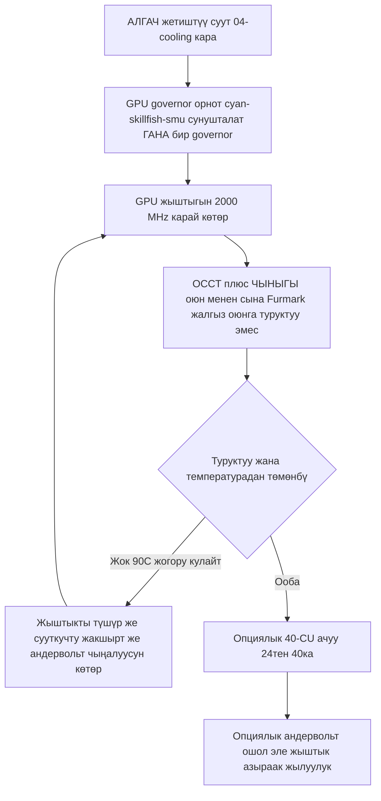

> 🌐 Коомчулук котормосу. Англис тилиндеги нуска — чындыктын булагы жана жаңыраак болушу мүмкүн. Ката таптыңызбы? Issue ачыңыз: [English](../en/09-overclock-undervolt.md) · [issues](https://github.com/lildebil0/awesome-bc250/issues)

# Овершклок жана андервольт

> **Кыскача (TL;DR)** — Кутудан чыкканда BC-250'нин GPU'су жай иштейт (көбүнчө **1500 MHz**'ке илинип, ~алсыз). Коомчулуктун оңдоосу — жыштык/чыңалууну басып жазган **governor**: бүгүн сунушталганы — **[cyan-skillfish-governor-smu](https://github.com/filippor/cyan-skillfish-governor)** (ядро патчы кереги жок, Arch/CachyOS/Bazzite/Fedora'да топтолгон); **[oberon-governor](https://gitlab.com/mothenjoyer69/oberon-governor)** — баштапкысы жана дагы эле иштейт. Кайсынысын болбосун GPU'ну **2000 MHz'ке (~+30% FPS)** көтөрүү үчүн түзөтөсүз. Жаңыраак **[bc250_smu_oc](https://github.com/bc250-collective/bc250_smu_oc)** топтому **CPU**'ну да овершклоктойт (сунушталат **4 GHz @ 1275 mV**). Өзүнчө, **[40-CU ачуу](https://github.com/duggasco/bc250-40cu-unlock)** AMD прошивкада өчүргөн **24 → 40 эсептөө бирдигин** кайра иштетет — бул жалаң жыштыктан көрө чоңураак GPU утушу (бир Superposition прогону **4647 → 6863** упайга жетти, ([src](https://t.me/c/2424231195/137035))). **Мунун баары — жылуулук. Алгач тактаны сууткуңуз** — [04-cooling.md](../en/04-cooling.md) кара — анткени жетиштүү сууткучсуз овершклок ~90 °C'тен жогору тактаны кулатат жана баштапкы абалга келтирет.

Бул — алтын жолдун **акыркы** кадамы, биринчиси эмес. Бул нерселердин баарына тийээрден мурда туруктуу, муздак тактаны иштетип алыңыз ([06-linux.md](../en/06-linux.md), [04-cooling.md](../en/04-cooling.md)). Бул жердеги баары — «өз тобокелиңизде кылыңыз», коомчулук муну кайта-кайта айтат ([src](https://t.me/c/2424231195/106844)).

---

## Төрт рычаг (жана ар бири эмне турат)

BC-250'до тууралай турган **төрт** көз карандысыз нерсе бар. Алар жыйындыланат:

| Рычаг | Курал | Кадимки утуш | Жылуулук баасы |
|-------|------|--------------|-----------|
| **GPU жыштыгы** 1500 → 2000 MHz | governor (cyan-skillfish-smu / oberon) | GPU тоскоолдук болгондо **~+30% FPS** | жогору |
| **GPU андервольту** бекитилген жыштыкта | ошол эле governor | ошол эле FPS, **алда канча муздагыраак** | *терс* (азыраак жылуулук) |
| **CPU жыштыгы** 3.5 → 4.0 GHz | `bc250_smu_oc` | CPU тоскоолдук болгон оюндарга жардам берет | жогору |
| **40-CU ачуу** 24 → 40 CU | `bc250-40cu-unlock` | **~+48%'ке чейин** GPU иши | жогору |

Баштаардан мурда чаттан эки чынчыл эскертүү:

- **BC-250 оюндарынын көбү CPU тоскоолдук, GPU тоскоолдук эмес.** GPU'ну 2000 → 2229 MHz'ке көтөрүү бир сынагычка Shadow of the Tomb Raider'де *1 fps* берди (90 → 91), ал эми кубат менен температура катуу секирди — ошондуктан «+30%» аталышы GPU тоскоолдук болгон бир нече гана оюнда ишке ашат ([src](https://t.me/c/2424231195/67029)).
- **Жылуулук өндүрүмдүүлүккө караганда начарыраак масштабдалат.** Ошол эле сынагыч: стресс-тесттте 2000 MHz @ 960 mV = **75 °C**; 2229 MHz @ 1030 mV = **93 °C** — жана ал PSU'су менен сууткучу муну кармай албагандыктан артка кайтты ([src](https://t.me/c/2424231195/66972), [src](https://t.me/c/2424231195/67029)).

> ⚠️ **Коопсуздук түбү.** Троттлинг болжол менен **85 °C'те** башталат, ал эми такта болжол менен **90 °C'те** катуу кулайт / баштапкы абалга келет ([04-cooling.md](../en/04-cooling.md) кара). Эгер жүктөмдө ~85 °C'тен өтсөңүз, сиз сууткуч бюджетиңизден *ашып* кеттиңиз — жыштыкты түшүрүңүз же андервольттоңуз, бийигирээк көтөрбөңүз.



---

## 1-кадам — GPU жыштыгы жана андервольт: governor

BC-250'нин amdgpu драйвери кадимки sysfs овершклокту ачпайт. Коомчулуктун чечими — **governor** — жыштык/чыңалуу абалдарын түз жазган кичинекей демон. Бүгүн жаңы орнотуу үчүн сунушталганы — **cyan-skillfish-governor-smu**; **oberon-governor** — баштапкысы жана дагы эле иштейт (төмөндө орнотулган альтернатива катары сакталган).

<p align="center"></p>
<sub>📈 Түзөтүлүүчү булак: <a href="../../assets/diagrams/gpu-clock-tradeoff.drawio">gpu-clock-tradeoff.drawio</a> (<a href="https://draw.io">draw.io</a>'до ач). Жашыл = утуш, кызыл = баасы.</sub>

### cyan-skillfish-governor-smu (сунушталат)

[filippor/cyan-skillfish-governor](https://github.com/filippor/cyan-skillfish-governor), SMU бутагы — жыштык/чыңалууну **SMU прошивка чакырыктары** аркылуу айдайт, ошондуктан ага **эч кайсы дистрибутивде ядро жыштык патчы кереги жок**, активдүү тейленет жана ар бир негизги дистрибутивде топтолгон. Ал ошондой эле **эстутум-контроллер кубат-профилин** башкарууну кошот, бул бош турган TDP'ни **~30–35 W'ка** түшүрөт (бош турганда муздагыраак жана тынчыраак) ([src](https://t.me/c/2424231195/125821)).

**Орнотуу (ар бир негизги дистрибутивде топтолгон)** — COPR `filippor/bazzite` (Fedora/Bazzite) же AUR `cyan-skillfish-governor-smu` (Arch/CachyOS); Debian/Ubuntu чыгарылыш tarball'ын + `sudo ./scripts/install.sh` колдонот:

```bash
# Fedora / Bazzite (COPR):
sudo dnf copr enable filippor/bazzite
sudo dnf install cyan-skillfish-governor-smu        # rpm-ostree install … on Bazzite
sudo systemctl enable --now cyan-skillfish-governor-smu.service

# Arch / CachyOS (AUR):
paru -S cyan-skillfish-governor-smu                  # or: yay -S …
sudo systemctl enable --now cyan-skillfish-governor-smu.service
```

SMU бутагын `cargo build --release` менен булактан да куруса болот. `/etc/cyan-skillfish-governor-smu/config.toml` ичинде **жыштыгыңыз менен чыңалууңузду коюңуз** (схема төмөндө) — алсыз демейкиден коомчулуктун жагымдуу чекитине жетүү үчүн жогорку коопсуз-чекитти **2000 MHz** карай көтөрүңүз жана туруктуу болгончо чыңалууну төмөндөтүңүз (төмөндөгү андервольттоону кара); ар бир түзөтүүдөн кийин кызматты кайра иштетиңиз.

> **Күчүнө киргенин текшериңиз.** GPU'ну жүктөп жатканда `amdgpu_top`, MangoHud же LACT менен тирүү жыштык/температураларды байкаңыз. Эгер жыштык ~1500 MHz'те калса, кызмат иштебей жатат же конфигиңиз парсталган жок — `sudo systemctl status cyan-skillfish-governor-smu`.

> Бир убакта **бир** governor иштетиңиз — эгер мурда oberon иштеткен болсоңуз, cyan-skillfish'ти иштетээрден мурда аны өчүрүңүз, болбосо алар бир эле регистрлер үчүн талашат.

> 🔇 **Тынч конок-бөлмө консолу үчүн тууралоо.** Максималдуу көтөрүү (2000 MHz GPU / 4000 MHz CPU) CPU тоскоолдук оюндарда азыраак пайда берет, бирок көп жылуулук, желдеткич шаңы жана ватт турат. r/BC250Gaming (Reddit) коомчулук билдирүүсү теңдештирилген **~1600 MHz GPU / ~3500 MHz CPU** күнүмдүк оюндар үчүн алда канча жакшы өндүрүмдүүлүк-шаңга-ватка катышын берет — дээрлик үнсүз жана муздак, ал эми FPS дагы эле кармалат, анткени көп оюндар баары бир GPU тоскоолдук эмес (жогорудагы CPU-тоскоолдук эскертүүсүн кара). Эгер диаграмма чокусундагы бенчмарктардан көрө тынч, муздак кутуну көбүрөөк бааласаңыз, governor'дун чек чекиттери катары максимумдун ордуна ошолорду коюңуз.

### oberon-governor (баштапкысы — дагы эле иштейт)

[mothenjoyer69/oberon-governor](https://gitlab.com/mothenjoyer69/oberon-governor) — C++ демону, биринчи BC-250 governor'у жана эң көп сыналганы; ал дагы эле иштейт, бирок SMU governor'дон айырмаланып, ал жогорку жыштыктарга жетүү үчүн кеңейтилген-жыштык ядро патчына (же аны жөнөткөн дистрибутивге) таянат. Анын README'си боюнча ал **CMake, C++ топтомуна жана libdrm**'ге көз каранды, жана **ASRock BC-250'де гана сыналган**. Көптөгөн дистрибутивдер аны алдын ала курулган жөнөтөт (Arch AUR, Fedora COPR, Bazzite образдары), ошондуктан булактан куруу дистрибутивиңизде пакет жок болгондо гана керек.

**Булактан куруу** (чаттын кайра жасалган тизмегине дал келет, ([src](https://t.me/c/2424231195/54666)) жана репонун стандарттык CMake агымы):

```bash
# Dependencies (Arch example — adjust per distro)
sudo pacman -S --needed base-devel cmake pkgconf make libdrm glibc linux-api-headers

git clone https://gitlab.com/mothenjoyer69/oberon-governor.git && cd oberon-governor
sudo cmake . && sudo make && sudo make install
sudo systemctl enable --now oberon-governor.service
```

> Эгер `cmake` ката берсе, чаттагы оңдоо болгону жетпеген куруу dependency'лерин орнотуп, кайра иштетүү болгон: `sudo pacman -S pkgconf cmake`, анан кайра куруу ([src](https://t.me/c/2424231195/54666)).

**Жыштыгыңыз менен чыңалууңузду коюңуз.** oberon YAML конфигин окуйт:

```bash
sudo nano /etc/oberon-config.yaml      # adjust min/max frequency and voltage
sudo systemctl restart oberon-governor # apply
```

Файл GPU абалдары үчүн **максималдуу жана минималдуу чыңалуу менен жыштыкты** коюуга мүмкүндүк берет (репо README'си боюнча). Максималдуу жыштыкты **2000 MHz** карай көтөрүңүз жана туруктуу болгончо чыңалууну төмөндөтүңүз. Ар бир түзөтүүдөн кийин кызматты кайра иштетиңиз. Кийинчерээк SMU governor'го өтүү үчүн: `oberon-governor`'ду токтотуп+өчүрүп+алып салыңыз, `rm /etc/oberon-config.yaml`, анан SMU кызматын орнотуп иштетиңиз.

#### TT vs SMU — эки cyan-skillfish варианты

> Жогорудагы сунушталган SMU курулушу — **эки** cyan-skillfish вариантынын бири. SMU — демейки; TT варианты — атайын ядро-патч/sysfs жолун каалагандар үчүн альтернатива ([elektricM: governor](https://elektricm.github.io/amd-bc250-docs/system/governor/)):

> **`perf_profile` — эстутум контроллери / Infinity Fabric деңгээли (GPU ийри сызыгынан өзүнчө).** SMU өндүрүмдүүлүк профилинин `0–3` индексин көрсөтөт: **3** — бул эң жогорку эстутум контроллери / Infinity-Fabric өндүрүмдүүлүгү, ал эми **1** — эң төмөнкү бош туруу чекити үчүн сунушталган аз кубаттуулуктагы профиль. CPU жүктөмү `cpu-load-target.upper` чегинен ашкан сайын, губернатор аны автоматтык түрдө **3** маанисине мажбурлайт. ([bc250-collective/cyan-skillfish-governor](https://github.com/bc250-collective/cyan-skillfish-governor))

| Вариант | Кызмат | Жыштыкты кантип коёт | Ядро патчы? | Чыкты / эскертүүлөр |
|---|---|---|---|---|
| **SMU** *(сунушталат)* | `cyan-skillfish-governor-smu` | SMU **прошивка чакырыктары** | **Жок — кайсы дистрибутивде болбосун патчсыз иштейт** | 2026-01-18; 2300+ MHz'ке жетет; CPU ~0.9–1.3% |
| **TT** (альтернатива) | `cyan-skillfish-governor-tt` | sysfs | **Ооба** (Bazzite'те алдын ала камтылган) | thermal-throttling эске алат; 2175+ MHz'ке жетет |

> **Кызматтын аты өзгөрдү (2025-12-13):** filippor `cyan-skillfish-governor` → `cyan-skillfish-governor-tt` деп атын өзгөрттү, жана конфиг каталогу `/etc/cyan-skillfish-governor/` → `/etc/cyan-skillfish-governor-tt/`'ке жылды. Эгер жаңыртсаңыз, эски `config.toml`'уңузду көчүрүңүз ([elektricM: governor](https://elektricm.github.io/amd-bc250-docs/system/governor/)). TT варианты ошол эле COPR/AUR'да топтолгон (`cyan-skillfish-governor-tt`) жана Bazzite'те алдын ала камтылган.

> 🔴 **700 mV — катуу түп.** Governor'дун *минималдуу* GPU чыңалуусун **700 mV'тен төмөн коюу GPU'ну 1500 MHz'ке кайра кулпулайт** — бул бүт максатты жокко чыгарат. Кайсы governor'до болбосун мин чыңалууну ≥ 700 mV кармаңыз ([elektricM: governor](https://elektricm.github.io/amd-bc250-docs/system/governor/), [elektricM: BIOS overclocking](https://elektricm.github.io/amd-bc250-docs/bios/overclocking/)).

> 🔴 **~1100–1129 mV — чек, 700 mV түбүнүн жуптошуусу.** Governor'дун *максималдуу* GPU чыңалуусун стандарттык `OD_RANGE` чокусу **1129 mV**'тен ары түртпөңүз; андан ары — **туруктуулук утушусуз кремний деградациясынын тобокели**. Консервативдүү аба-сууткуч чеги болжол менен **1100 mV** (андан жогору жогорку тобокел), жана **1125 mV** жогорку катмарын суюк сууткуч гана актайт (төмөндөгү таблица). Эгер кривого туруктуу болуу үчүн ~1129 mV'тен көп керек болсо, чыныгы оңдоо — *сууткуч же төмөнүрөөк жыштык*, көбүрөөк вольт эмес ([elektricM: BIOS overclocking](https://elektricm.github.io/amd-bc250-docs/bios/overclocking/)).

> **Туура GPU максатталганын текшериңиз.** Governor системаңызга жараша `card0` же `card1`'ди башкарышы мүмкүн — `ls /sys/class/drm/ | grep card`. Эгер жөндөөлөр колдонулбаса, конфигди туура картага багыттооңуз керек болушу мүмкүн. Arch/CachyOS'то governor кээде GPU биринчи колдонулганга чейин активдешпейт — жүктөлгөндөн кийин бир жолу оюн/бенчмарк иштетиңиз ([elektricM: governor](https://elektricm.github.io/amd-bc250-docs/system/governor/)).

#### cyan-skillfish-smu конфиг схемасы (секция негизиндеги TOML)

`smu` бутагы **секция негизиндеги** схеманы колдонот, эски `safe-points = [...]` массивин **эмес** — ар бир кривой чекит өзүнүн `[[safe-points]]` таблицасы. Негизги талаалар ([elektricM: governor](https://elektricm.github.io/amd-bc250-docs/system/governor/)):

```toml
# /etc/cyan-skillfish-governor-smu/config.toml
[timing.intervals]
sample = 500          # µs; raise (e.g. 1000) to cut CPU overhead, keep adjust = sample*400
adjust = 200_000
[gpu-usage]
fix-metrics = true    # fixes the MangoHud "655 %" GPU-usage bug on BC-250
method  = "busy-flag"
[gpu]
set-method = "smu"    # "smu" or "kernel"
[load-target]
upper = 0.80          # fractions, not percents
lower = 0.65
[temperature]
throttling = 85       # °C
throttling_recovery = 75

[[safe-points]]
frequency = 1000
voltage   = 800
[[safe-points]]
frequency = 2000
voltage   = 1000      # gaming
[[safe-points]]
frequency = 2200
voltage   = 1000      # many boards hold a flat 1000 mV here; bump per-board only if it crashes
```

> **Туруксуз болгондогу тууралоо тартиби: сууткуч → жыштык → *анан* чыңалуу.** Стандарттык сууткучта чыныгы себеп дээрлик дайыма жылуулук (95 °C+). Чыңалуу кошуудан мурда жыштыкты чектөө үчүн жогорку `[[safe-points]]` блокторун түшүрүңүз; температуралар жакшы болуп, ал дагы эле 2150–2200 MHz'те куласа гана, **жогорку чекитти гана** +15–25 mV көтөрүңүз. 2200 MHz'те ~1075 mV'тен ары сиз болгону жылуулук кошуп жатасыз — анын ордуна жыштыкты түшүрүңүз ([elektricM: governor](https://elektricm.github.io/amd-bc250-docs/system/governor/)).

> **GPU-reset кара экран, governor'го спецификалуу.** Эгер GPU *governor активдүү sysfs жазып жатканда* куласа, reset аяктай албайт жана сиз катуу кайра жүктөөнү талап кылган туруктуу кара экран аласыз (система SSH аркылуу дагы эле тирүү). Айланма жол: белгилүү кулашка жакын оюндардан мурда governor'ду `systemctl stop` кылыңыз; чыныгы оңдоо — туруктуу кривой ([elektricM: governor](https://elektricm.github.io/amd-bc250-docs/system/governor/)).

##### SMU governor 2230 MHz'тен кантип ары түртөт — жана эмне үчүн ал өчүрүлгөн бойдон жөнөтүлөт

SMU бутагы amdgpu `OD_RANGE` аркылуу эмес, SMU прошивкасы менен түз сүйлөшкөндүктөн, ал **Oberon'дун 2230 MHz катуу чегин аша алат** — бир өтмө-көрсөтмө аны бир тактада **≈2700 MHz'ке** айдады ([Old Lamer — Part XII](https://youtu.be/Chzxaryjncs)). Дал ушул мейкиндик филиппор аны этият жөнөткөнүнүн себеби:

> 🔴 **SMU governor'дун демейки конфиги жүктөлгөндө кара экран кылышы мүмкүн — ошондуктан ал авто-старт КЫЛБАЙ жөнөтүлөт.** filippor орнотуудан кийин кызматты атайын өчүрүлгөн калтырат, ошондо жаман демейки кривой жүктөлгөндө сизди кулпулап коё албайт; сиз алгач **кривойду тууралап, сынап, анан туруктуу болгондо `systemctl enable`** кылууга мүмкүнчүлүк аласыз. Кривойду текшерүүдөн *мурда* аны иштетсеңиз, кийинки жүктөөдөгү кара экран — сиздин жоопкерчилигиңизде ([Old Lamer — Part XII](https://youtu.be/Chzxaryjncs)). *(⚠ сандар авто-субтитрленген — так MHz'ди болжолдуу катары караңыз.)*

Oberon'дун ысып кеткенде катуу жыштык түшүрүүсүнөн айырмаланып, SMU governor **температура максатына карай акырындык менен көтөрүлөт**. Өтмө-көрсөтмө ошондой эле жогорудагы схемадан тышкары кошумча `config.toml` талааларын ачат ([Old Lamer — Part XII](https://youtu.be/Chzxaryjncs)):

```toml
# extra tuning knobs shown in the Part XII walkthrough
[ramp-rates]
normal = 1
burst  = 50
[gpu-usage]
burst-samples = 60
down-events   = 5
[frequency-thresholds]
adjust = 10
[temperature]
throttling_recovery = 80
```

> ⚠️ **Автор-эксперименталдуу 16-чекиттүү аба кривойу — СУНУШТАЛБАЙТ, бул колдонмонун аба чегин ашат.** Part XII автору бул кривойду абада иштеткен, бирок анын жогорку чекиттери (2333–2400 MHz, 1120–1150 mV) **3-кадамда документтелген консервативдүү аба-сууткуч чектеринен жогору** турат (абада ≈2230 MHz / 1060 mV; 1125 mV — *суюк-гана* катмар). Ал максат катары эмес, маалымат катары көрсөтүлгөн — абада 3-кадамдын сууткуч-классы таблицасы айткан жерде токтоңуз:
>
> ```toml
> # ⚠ author-experimental, air-cooled — DO NOT copy blindly (exceeds the air ceiling)
> # frequency (MHz) @ voltage (mV)
> 1000@800,  1175@850,  1500@900,  1700@920,
> 2000@960,  2100@1000, 2150@1035, 2200@1050,
> 2250@1070, 2300@1090, 2333@1120, 2400@1150
> ```
>
> Ал кривойдун чокусунда **2.4 GHz ~30 A ≈ 360 W тартты** — бул жалгыз коннектор эмес, **кош Molex / экинчи такта азыктандыруусун** ([03-power-supply.md](../en/03-power-supply.md)) талап кылгандай. Superposition **≈4200 @ 2.2 GHz → ≈4500 @ 2.4 GHz** масштабдалды ([Old Lamer — Part XII](https://youtu.be/Chzxaryjncs)). *(⚠ бардык маанилер авто-субтитрленген — болжолдуу.)*

#### GPU жыштык-диапазон ядро патчы (TT / кол менен sysfs үчүн гана)

amdgpu драйверинин стандарттык GPU диапазону — **1000–2000 MHz**; бир саптуу драйвер патчы (**ViRazY** жасаган, `linux-6.12-bc250-freq.mypatch`, ~**639 байт**, **6.12 / 6.15 / 6.16.x** ядролорунда сыналган) аны **350–2230 MHz**'ке кеңейтет (350 MHz терең-бош турат кубат үнөмдөйт; жогорку чек 2230+ овершклокторду иштетет). **Bazzite, PikaOS жана Arch AUR ядролору аны алдын ала патчталган жөнөтөт**, ал эми **SMU governor прошивка чакырыктары аркылуу ага болгон муктаждыкты толук айланып өтөт** — ошондуктан сиз патчталбаган дистрибутивде кеңейтилген диапазон менен TT governor'ду же таза sysfs OC'ту кааласаңыз гана кол менен патчтейсиз. `cat …/pp_od_clk_voltage` менен текшериңиз (350–2230 көрсөтүшү керек). Кеңейтилген-чыңалуу (600–1300 mV) патчын **колдонбоңуз** — кереги жок жана тобокелдүү ([elektricM: BIOS overclocking](https://elektricm.github.io/amd-bc250-docs/bios/overclocking/)).

> 🔧 **Таза sysfs андервольт (бир жолку текшерүү).** Governor'суз тез чекит-боюнча туруктуулук текшерүүсү үчүн, чыңалуу-кривой чекитин түз sysfs'ке жазыңыз (формат `vc <level> <MHz> <mV>`) жана аны бекитиңиз ([elektricM: BIOS overclocking](https://elektricm.github.io/amd-bc250-docs/bios/overclocking/)):
> ```bash
> echo "vc 0 2100 1025" | sudo tee /sys/class/drm/card0/device/pp_od_clk_voltage   # set point: 2100 MHz @ 1025 mV
> echo "c" | sudo tee /sys/class/drm/card0/device/pp_od_clk_voltage                # commit
> ```
> Бул тез текшерүү үчүн гана — ал кайра жүктөөдөн кийин сакталбайт. Governor'дун `config.toml`'у — сунушталган **туруктуу** жол; туруктуу чекит-боюнча чыңалууну табуу үчүн таза sysfs'ти колдонуп, анан аны governor кривойуна жазыңыз.

#### PS5GPU-BC250 — GUI контроллер (конфиг файлдары жок)

GUI каалайсызбы? **[ZEROAESQUERDA/PS5GPU-BC250](https://github.com/ZEROAESQUERDA/PS5GPU-BC250)** — Qt тиркемеси (KDE/GNOME), ал мин/макс GPU жыштыгын жана чыңалуусун тууралайт, температура чегин коёт, жана автоматтык 4-баскычтуу boost же кол башкарууну сунуштайт — MSI-Afterburner стилинде, ядро патчтары же TOML түзөтүүсүз. Алгач **иштеп жаткан кайсы governor'ду болбосун өчүрүңүз** (cyan-skillfish-smu/tt же oberon), болбосо алар чыр түшөт ([elektricM: governor](https://elektricm.github.io/amd-bc250-docs/system/governor/)).

---

## 2-кадам — CPU овершклогу жана туура андервольт: `bc250_smu_oc`

**2025-12-30**'да bc250-collective тарабынан чыгарылган (SMU'ну тескери инженерлеп), [bc250_smu_oc](https://github.com/bc250-collective/bc250_smu_oc) — акыры **CPU** жыштыгына жана чыңалуусуна тийүүгө мүмкүндүк берген курал (Zen 2 ядролору), жалаң GPU эмес. Авторлор туруктуулук/жылуулук оптимуму катары **4 GHz @ 1275 mV** сунушташат жана аны реподо мисал катары жөнөтүшөт ([src](https://t.me/c/2424231195/106844)).

**Орнотуу жана колдонуу** (репо README'синен сөзмө-сөз):

```bash
# Prerequisite: install the `stress` CPU load tool from your package manager
git clone https://github.com/bc250-collective/bc250_smu_oc.git
cd bc250_smu_oc
pip install .        # or: pipx install .

# Detect / test a target (CPU 4 GHz at 1275 mV), keep it applied:
bc250-detect --frequency 4000 --vid 1275 --keep

# Once you've found a stable config, install it and enable at boot:
bc250-apply --install overclock.conf
sudo systemctl enable --now bc250-smu-oc
```

> 🔴 **Катуу чыңалуу чеги.** Репо боюнча: CPU ядро чыңалуусу (**Vid**) кандай шартта болбосун **1.325 V**'тен ашпасын — кремний деградациясы ~1.35 V'тен жогору башталат ([src](https://t.me/c/2424231195/115726)). Жана: **CPU жыштыгын андервольтсуз көтөрүү Vid'ди чексиз масштабдатат жана аппаратты бузушу мүмкүн** — дайыма жыштык көтөрүүнү чыңалуу максаты менен жуптаңыз.

Эмне үчүн 4 GHz — чек: AMD бул кремний үчүн ~4 GHz'ге чейинди коопсуз деп эсептейт; 4700S үстөл-топтом BIOS'у жада калса кутудан чыкканда 4000 MHz / 1.35 V'те турбо жүктөйт. Zen 2 *адатта* ~4200'гө жетет, бирок бул чиптер — **майнинг-жараксыз кремний**, ошондуктан 4200 «абдан жолуңуз болсо» гана ([src](https://t.me/c/2424231195/115726)).

> ❓ **CPU'ну 8 ядрого ача аламбы?** Кыска жооп: **жок — азырынча эмес, жана баары бир жардам бербейт.** BC-250 өзүнүн 8 Zen 2 ядросунун 6'сы активдүү жөнөтүлөт; r/BC250Gaming коомчулук билдирүүлөрү калган экөөнү **SMU окуган eFuse'дар аркылуу программалык кулпуланган** деп сүрөттөйт (биннинг негизинен жасалма — майнинг доорунун чечими), физикалык кесилген *эмес*. Бирок аларды ачуу **PSP кол тамга текшерүүсүн айланып өтүп, SMU микрокодун өзгөртүүнү** билдирмек, ал эми коомчулуктун аракеттери (Discord'до) **ийгиликке жеткен жок**. Бирөө жасаса да, оюн үчүн утуш **аз** болмок: BC-250 — **алсыз бир агымдуу өндүрүмдүүлүк, кичинекей бөлчөкчө 2×4 MB L3 кэш жана AVX2-гана / майып FPU** менен тоскоолдоштурулган — ядро кошуу FPS'ти да, бул чип чындап ачка калган нерселерди да көтөрбөйт. Аны кубалабаңыз ([r/BC250Gaming коомчулук билдирүүлөрү](https://www.reddit.com/r/BC250Gaming/)).

> Бекитилген `bc250_smu_oc` посту ошондой эле GPU governor'уңузду **алмаштыра** алат (анын өзүнүн `bc250-smu-oc` кызматы бар). Эки governor'ду бир убакта иштетпеңиз.

**Текшерилген CPU-OC масштабдалуусу** (Fedora 43, ядро 6.19.8; авто-тууралган чыңалуу; 7-zip MIPS; температура негизиндеги желдеткич кривойу менен) ([elektricM: governor](https://elektricm.github.io/amd-bc250-docs/system/governor/)):

| Жыштык | Авто Vid | 7-zip MIPS | Темп (толук жүктөм) | стандартка карата |
|---|---|---|---|---|
| 3500 (стандарт) | авто | 26,062 | 60 °C | базалык |
| 3600 MHz | 1150 mV | 26,518 | 65 °C | +1.7% |
| 3700 MHz | 1199 mV | 27,212 | 68 °C | +4.4% |
| 3800 MHz | 1250 mV | 27,919 | 72 °C | +7.1% |
| 3900 MHz | 1275 mV | 28,410 | 75 °C | +9.0% |
| 4000 MHz | — | PWM 80'де троттлдейт | 77 °C | ❌ (көбүрөөк сууткуч/желдеткич керек) |

Куралдын флагдары: сынап көрүү үчүн `bc250-detect -f <MHz> -v <mV>`, курал чыккандан кийин OC'ту сактоо үчүн **`-k`** кошуңуз, конфиг жазуу үчүн **`-c <path>`**. Аны туруктуу кылуу үчүн `bc250-apply -a -i /etc/bc250-overclock.conf`, анан `systemctl enable bc250-smu-oc`. Авторлор: **mrfrakes & dantistnfs** (SMU тескери инженерия) ([elektricM: governor](https://elektricm.github.io/amd-bc250-docs/system/governor/), [elektricM: BIOS overclocking](https://elektricm.github.io/amd-bc250-docs/bios/overclocking/)). Эскертүү: **4000 MHz стандарттык-сымал PWM 80 желдеткичте троттлдеди** — чек сууткуч менен чектелген, жогорудагы аба-vs-суу эскертүүсүнө дал келет.

#### `bc250-detect` чындыгында кантип издейт (жана ал ишке ашырган чыңалуу чеги)

Ошол эле куралдын видео өтмө-көрсөтмөсү авто-издөө механикасын көрсөтөт: ал **3.5 GHz'тен 100 MHz / 25 mV кадамдары менен көтөрүлөт**, ар бир кадамда **~300 с стресс-тест** иштетет жана ал өткөндө гана алдыга жылат — мис. `bc250-detect -f 3850 -v 1150 -k` 3.85 GHz @ 1150 mV'ди сынап, аны сактоо үчүн. Bazzite'те орнотуу — `sudo rpm-ostree install stress pipx`, анан `pipx install .` ([Old Lamer — Part VIII](https://youtu.be/ciDpPhoioKM)).

> ⚠️ **Эки чыңалуу чеги — экөөнү тең белгилеңиз, алар келишпейт.** Part VIII видеосу **катуу 1300 mV** CPU-Vid чегин айтат, бул жогоруда колдонулган репонун документтелген **1.325 V** чегинен **консервативдүүрөөк**. Алар коопсуздук билдирүүсүнө каршы келбейт (~1.35 V'тен оолак калыңыз), бирок *так* сан булагы боюнча айырмаланат — күмөн болгондо төмөнкүсүн (1300 mV) жумушчу чегиңиз катары алыңыз жана эч качан 1.325 V'тен ашпаңыз ([Old Lamer — Part VIII](https://youtu.be/ciDpPhoioKM)). *(⚠ 1300 mV көрсөткүчү авто-субтитрленген.)*

Ал прогондо **4 GHz @ 1225 mV кыска тез-тестти өттү, бирок оюнда кулады**, ошондуктан автор туруктуу **3.85 GHz @ 1150 mV**'ге кайтты — elektricM таблицасы көрсөткөн так ошол «4 GHz тез өтөт, узак сакталбайт» үлгүсү ([Old Lamer — Part VIII](https://youtu.be/ciDpPhoioKM)). *(⚠ ASR — болжолдуу маанилер.)*

**Учунан-учуна CPU+GPU масштабдалуу (Horizon Zero Dawn, 1080p Ultra, нативдик, 1× Arctic P12 Pro ~2200 rpm).** Бир видео ар бир рычагды үстөккө коюп, оюндагы натыйжаны өлчөйт, бул — эмне үчүн бул такта **CPU тоскоолдук** экенинин эң ачык көрсөтмөсү: GPU ~88–90 fps'ти CPU аны азыктандыра алгандан көп мурда рендерлешке даяр ([Old Lamer — Part X](https://youtu.be/1hgSQxf6RXE)). *(⚠ бардык fps/°C авто-субтитрленген — ≈ катары караңыз.)*

| Кадам (топтоштурулган) | GPU жыштыгы @ mV | CPU жыштыгы @ mV | Оюндагы fps | GPU-жөндөмдүү fps | CPU / GPU темп |
|---|---|---|---|---|---|
| Стандарттык андервольт | 1500 @ 850 | 3.5 G @ 1020 | **≈62** | — | 53 / 51 °C |
| + GPU OC | 2000 @ 960 | 3.5 G @ 1020 | **≈69** | 81 | 64 / 63 °C |
| + CPU OC | 2000 @ 960 | 3.85 G @ 1155 | **≈72** | — | 65 / 64 °C |
| + GPU OC | 2200 @ 1030 | 3.85 G @ 1155 | **≈74** | 88 | ~70 °C |
| + CPU OC | 2200 @ 1030 | 4.0 G @ 1270 | **≈76–77** | 88 | 72 / 68 °C |
| + mitigations өчүк | 2200 @ 1030 | 4.0 G @ 1270 | **≈80** | 90 | — |

**Жыйынтык: ≈62 → ≈80 fps (~+29%), жана ал катуу CPU тоскоолдук** — GPU ичинен 88–90 fps рендерлейт, ал эми CPU ойнотулуучу ылдамдыкты ~80'де чектейт. Ошол эле прогондон эскертүүлөр ([Old Lamer — Part X](https://youtu.be/1hgSQxf6RXE)):

- **4 GHz бул жерде ~1270 mV талап кылат**, болбосо такта жашыл-экран кылат — жыштыкты жетиштүү Vid менен жуптоо милдеттүү (жогорудагы «жыштыкты эч качан андервольтсуз көтөрбө» эрежесин кайталайт).
- **`bc250_smu_oc`'тун камтылган ~90 °C авто-троттл'у бар**, ошондуктан курал тактанын катуу-кулоо температурасынан мурда өзү артка кайтат.
- **mitigations=off болгону ≈+3 fps берди** (CPU-аялуулук ядро азайтуулары); кичинекей, опциялык акыркы кысуу.
- **Атайын эстутум таймингдери бул жерде утуш берген жок жана «кирпич» тобокелин көтөрөт** — аларды өткөрүп жибериңиз (төмөндөгү GDDR6 бөлүмүн кара).
- **3.85 GHz @ 1155 mV CPU жагымдуу чекити деп аталат** — elektricM 7-zip таблицасына дал келет, анда 4 GHz стандарттык-сымал сууткучта троттлдейт.
- Акыркы OC'то такта **1440p Ultra нативдик @ 60** жана **4K + FSR ~60'та** иштеди ([Old Lamer — Part X](https://youtu.be/1hgSQxf6RXE)).

> 📊 **Стандарттык-базалык FurMark текшерүү сандары (башка прогон).** Өзүнчө өтмө-көрсөтмө FurMark'ты **стандарттык FHD ≈4085 упай / 67 fps**'те каттады; GPU'ну **1500 → 2000 MHz көтөрүү ~+30% берди (≈5340 упай / 87 fps)**, ал эми **2229 MHz дээрлик эч нерсе кошпой, >90 °C иштеди** (троттл). Ал видеодон жалпы эреже: **«FurMark + CPU стресстте <80 °C ⇒ оюндарда <70 °C»**, жана **FurMark Vulkan чипти GL жолунан көбүрөөк ысытат** ([Old Lamer — Part IV](https://youtu.be/YuBmGF536II)). *(⚠ ASR — болжолдуу.)*

#### CPU жыштык масштабдалуусу ACPI оңдоосун талап кылат (болбосо cpufreq такыр жок)

> ❗ **Кутудан чыкканда BC-250 эч кандай CPU жыштык масштабдалуусун ачпайт** — *эч кандай* cpufreq интерфейси жок, ошондуктан `cpupower`/`schedutil` эч нерсе кылбайт жана CPU бекитилген жыштыкта отурат. **[bc250-collective/bc250-acpi-fix](https://github.com/bc250-collective/bc250-acpi-fix)** буну оңдогон эки SSDT таблицасын жөнөтөт (initrd override аркылуу жүктөлөт) ([elektricM: governor](https://elektricm.github.io/amd-bc250-docs/system/governor/)):
> - **SSDT-PST** → **8 P-state, 800 MHz → 3200 MHz** менен стандарттык Linux cpufreq'ти иштетет (governor'лор: `schedutil`, `powersave`, `performance`, …).
> - **SSDT-CST** → **C1/C2/C3 бош турат абалдарын** иштетет, ошондо ядролор бош турганда чындап уктайт (бош турат кубаты төмөн).
>
> Экөө тең 6.19.8 ядросунда иштеши ырасталган. Орнотуу `SSDT-CST.aml`+`SSDT-PST.aml`'ден cpio курат `/boot`'ка, initrd сабына кошулат (Fedora BLS) же `GRUB_EARLY_INITRD_LINUX_CUSTOM` аркылуу (GRUB). Анан `echo schedutil | sudo tee /sys/devices/system/cpu/cpu*/cpufreq/scaling_governor`. **Эскертүү:** ядро жаңыртуусу override'ду жаңы жүктөө жазуусуна алып барбайт — аны кайра кошуңуз же kernel-install hook колдонуңуз. `bc250_smu_oc` менен айкалышканда CPU бекитилген иштөөнүн ордуна **800 MHz бош турат → 3900 MHz жүктөм** масштабдалат ([elektricM: governor](https://elektricm.github.io/amd-bc250-docs/system/governor/), [elektricM: power](https://elektricm.github.io/amd-bc250-docs/system/power/)).

#### Бош турат кубаты — эмне үчүн жогору, жана тууралоо канча жетет

BC-250 демейки боюнча ысык жана ачка бош турат; тууралоо аны так катмарларда төмөндөтөт ([elektricM: power](https://elektricm.github.io/amd-bc250-docs/system/power/)):

- **Бош турат тепкичи: ~105 W (governor жок) → ~85 W (governor) → ~55 W (оптимизацияланган: Debian + governor + андервольт).** Governor жалгыз ~20 W үнөмдөйт; **~55 W — эң жакшы учурдагы бош турат түбү**, жана сиз ага дистрибутив + governor + андервольтту үстөккө коюп гана жетесиз.
- **Эмне үчүн бош турат жогору — оптимизацияланбаган бөлүштүрүү (~93 W):** **CPU+GPU ~31 W**, **RAM + эстутум контроллери ~35 W**, **тактанын калганы ~27 W**. Эстутум подсистемасы — эң чоң бирдиктүү бош турат тартуусу, жана такта көрсөткүчүнүн көбү — бекитилген кремний, б.а. тууралоо CPU/GPU'ну жана (governor'дун эстутум-контроллер профили аркылуу) RAM тартуусунун бир бөлүгүн кырка алат, бирок чоң бөлүгү тийгистүү.

Үч аталган тууралоо профили реалдуу чегаралардын (бош турат кубаты / туруктуу темп) айланасын тегеректейт ([elektricM: power](https://elektricm.github.io/amd-bc250-docs/system/power/)):

| Профиль | Кубат | Темп |
|---|---|---|
| Efficiency | 55–65 W | 60–70 °C |
| Gaming | 70–85 W | 65–75 °C |
| Performance | 85–95 W | 75–85 °C |

---

## 3-кадам — Андервольттоо (муну жылуулук үчүн кылыңыз, ар бир чип башка)

Андервольт — бул тактадагы эң баалуу кадам: **ошол эле жыштык, алда канча азыраак жылуулук**, жана CPU жыштыгын көтөрсөңүз ал *талап кылынат*. Бирок **ар бир чип башка** — кремний лотереясы бул жерде чыныгы. Бир ээси үч дээрлик удаалаш тактаны иштетип, стресстте бирөө гана 900 mV кармады; бирдей сууткуч, бирдей температуралар, башка туруктуулук ([src](https://t.me/c/2424231195/50568)).

<p align="center"></p>
<sub>📈 Түзөтүлүүчү булак: <a href="../../assets/diagrams/undervolt-tradeoff.drawio">undervolt-tradeoff.drawio</a> (<a href="https://draw.io">draw.io</a>'до ач). Жашыл = утуш, кызыл = баасы.</sub>

**Максаттуу жыштык → чыңалуу, чыныгы коомчулук сандары (сиздин чибиңиз башкача болот):**

| GPU жыштыгы | Ээлер *оюнга-туруктуу* тапкан чыңалуу | Эскертүүлөр |
|-----------|------------------------------------------|-------|
| 1500 MHz | ~710 mV | бир сынагычтын «эң туруктуу» тактасы ([src](https://t.me/c/2424231195/23545)) |
| 2000 MHz | **~955 mV** | 905 mV'те Furmark-туруктуу, бирок 955 mV'ке чейин оюндарда артефакттар ([src](https://t.me/c/2424231195/68126), [src](https://t.me/c/2424231195/136773)) |
| 2000 MHz | ~960 mV → **75 °C** стресс | популярдуу күнүмдүк жөндөө чекити ([src](https://t.me/c/2424231195/66972)) |
| 2229 MHz | ~1030–1050 mV → **93 °C** стресс | «өчүрдүм, коркуп жатам» — азайып бараткан кайтарым ([src](https://t.me/c/2424231195/66972)) |

**Ар бир сууткуч-класс чындыгында эмнени кармай алат** — жогорудагы таблица стандарттык-сымал сууткучта «2229 MHz @ ~1030–1050 mV → коркунучтуу»'да токтойт. Жогору чыгуу үчүн сизге дал келген сууткуч керек; булар — elektricM'дин сууткуч-класс боюнча чектери ([elektricM: BIOS overclocking](https://elektricm.github.io/amd-bc250-docs/bios/overclocking/)):

| Сууткуч | GPU жыштыгы | Чыңалуу |
|---|---|---|
| Консервативдүү аба (макс) | 2230 MHz | 1060 mV |
| Жогорку статикалык-басымдуу аба (Arctic P12 Max) | 2300 MHz | 1075 mV |
| Суюк (NexGen3D боюнча) | 2400 MHz | 1125 mV |

> 🧪 **Коомчулук андервольт жөндөө чекиттери (4pda).** Орус форумунан дагы эки чыныгы кривой, пайдалуу баштоо чекиттери (дагы эле чип-көз каранды): **24-CU (Oberon)** тактада эки чекиттүү кривой `1000 MHz @ 0.8 V + 1700 MHz @ 0.85 V` ([4pda — dreamerok](https://4pda.to/forum/index.php?showtopic=1104980)); **40-CU** тактада `1500 MHz @ 900 mV`. Жогорку-агып кетүүчү чип үчүн төмөндөн баштаңыз — `500 MHz / 900 mV` — жана чыңалууну кубалоонун ордуна **ошол жерден жыштык кошуңуз** ([4pda — Lakan](https://4pda.to/forum/index.php?showtopic=1104980)).

> ⚡ **Ватка-өндүрүмдүүлүк алкагы.** Коомчулук тестирлөөсү эскертет: **андервольтталган + андерклоктолгон 40-CU ошол эле FurMark упайында 24-CU'дан ~100 W азыраак тартат** — б.а. бирдей чыгаруу үчүн кеңирээк-бирок-жайыраак бөлүк — эффективдүү иштөө чекити, бул — ачуунун жана анан 24 CU'ну катуу түртүүнүн ордуна *андер*-клоктоонун бүт аргументи.

> **Furmark жалгыз — туруктуулук тести эмес.** Анын бекитилген жүктөмү *контекст* өзгөргөндө гана пайда болгон туруксуздукту жашырат — alt-tab, текстура жүктөө, менюлар. Furmark'та 905 mV'те «туруктуу» такта 1–2 сааттан кийин чыныгы оюндарда текстура артефакттарын ыргытты, чыңалуу 955 mV'ке чейин. **Чыныгы оюндарда + alt-tab/меню чабуулунда** текшериңиз, жана **OCCT** сыяктуу ар түрдүү стресс куралын колдонуңуз (ал жалаң шейдерлерди эмес, VRM'ди да жүктөйт), жалаң Furmark'ты эмес ([src](https://t.me/c/2424231195/68126), [src](https://t.me/c/2424231195/136773), [src](https://t.me/c/2424231195/23545)).

> **Ыңгайлуу аппараттык белги:** BC-250'до **жүктөм LED'и** бар — **кызыл = GPU бош, жашыл = GPU жүктөлгөн**. Кээ бир «бош» сахналар (мис. Witcher 3'тегу Novigrad) чындыгында GPU'ну катуу сабайт жана Furmark/Cyberpunk'та байкалбай калган андервольт артефакттарын чыгарат ([src](https://t.me/c/2424231195/12285)).

Өтө агрессивдүү андервольт **коркунучтуу эмес** — эң жаманы такта түшүп калат же M.2 слотун өчүрөт, ал OC BIOS'то сакталбагандыктан беш секундда тазаланат ([src](https://t.me/c/2424231195/105998)).

> 💡 **Андервольтко байланышпаган артефакттар?** Кара текстуралар / титиреп жатуу драйвердин HiZ көйгөйү да болушу мүмкүн — чыңалууну кубалоодон мурда оюндун чөйрөсүндө **`RADV_DEBUG=nohiz`** коюп көрүңүз. Жана эскертиңиз: стандарттык-ядро **`OD_RANGE` чыңалуу терезеси — 700–1129 mV**; консервативдүү аба-сууткуч максимуму ~1085 mV, абсолюттук макс ~1100 mV — андан ары — чыныгы туруктуулук утушусуз деградация тобокели ([elektricM: BIOS overclocking](https://elektricm.github.io/amd-bc250-docs/bios/overclocking/)).

---

## 4-кадам — 40-CU ачуу (24 → 40 эсептөө бирдиги)

Эң чоң бирдиктүү GPU утушу, жана эң жаңысы. BC-250'нин Cyan Skillfish кристаллында физикалык түрдө **40 CU** бар, бирок стандарттык прошивка болгону **24'үн активдүү** калтырат (16'сы «жыйналган»). **`amdgpu.bc250_cc_write_mode=3`** ядро параметри плюс патчталган amdgpu драйвери бардык 40'ты кайра иштетет. Өлчөнгөн натыйжа — 4K Superposition прогону **4647 → 6863** упайга секирди (24/40 → 40/40 CU активдүү), `cu_map.sh` куралы жыйноо картасынын толгонун көрсөттү ([src](https://t.me/c/2424231195/137035)):


Адамдар **40 CU @ 1850 MHz** иштетишет (RE4 Remake нативдик 1440p жогорку, 60 fps), жада калса 40 CU'да абдан төмөн чыңалууларды билдиришет (мис. жолу болгон чипте 1400 MHz @ 750 mV) ([src](https://t.me/c/2424231195/137260), [src](https://t.me/c/2424231195/137157)).

> ⚠️ **Бул amdgpu ядро модулун патчтоону жана кайра курууну талап кылат** — бул колдонмодогу эң татаал тапшырма жана **BC-250-гана** (патч тактанын PCI түзмөк ID **`0x13FE`** менен корголгон). Патч туруктуу эмес: modprobe конфигисиз кайра жүктөө 24 CU'га кайтат.

**Ал чындыгында кантип иштейт (эки регистр, экөө тең талап кылынат).** Ачуу драйвер инициализациясында **эки** аппараттык регистр жазат — экөөнүн бирөө жалгыз эсептөөнү масштабдабайт ([elektricM: 40-CU unlock](https://elektricm.github.io/amd-bc250-docs/system/40cu-unlock/)):

| Регистр | Ролу | Стандарт → ачылган |
|---|---|---|
| `CC_GC_SHADER_ARRAY_CONFIG` | драйверге канча CU бар экенин айтат | `0xfff80000` → `0xffe00000` |
| `SPI_PG_ENABLE_STATIC_WGP_MASK` | SPI'ге толкундарды кайда жөнөтөрүн айтат | `0x07` (WGP 0–2) → `0x1F` (WGP 0–4) |

(Төмөндөгү иштөө учурундагы курал **үчүнчү** `RLC` регистрин да жазат.) Бул — **эсептөө** ачуусу, оюн ачуусу эмес: duggasco'нун көзөмөлдөнгөн A/B'си Vulkan `llama-bench pp512` **1.61×** секиргенин көрсөтөт (1500 MHz'те 230 → 372 tok/s), ал эми `glmark2` болгону **+4.4%** утат, анткени 3D — толтуруу-ылдамдыгы менен чектелген, CU менен чектелген эмес ([elektricM: 40-CU unlock](https://elektricm.github.io/amd-bc250-docs/system/40cu-unlock/)). AI/LLM спецификасы үчүн [akandr/bc250](https://github.com/akandr/bc250) дагы кара.

> 🎯 **Сунушталган иштөө чекити — 1500 MHz, 2 GHz эмес.** duggasco'нун A/B'си **1500 MHz / ~900 mV**'ди жагымдуу чекит катары коёт — ал жылуулук кыйынчылыгысыз ~1.67× теориялык масштабдалуунун көбүн камтыйт (1500 MHz/874 mV: 372 tok/s, 125 W, 83 °C). 2 GHz'те ошол эле тест 466 tok/s'ке секирет, бирок кубат/температуралар катуу көтөрүлөт жана бир нече мүнөттөн кийин пакет жылуулук-троттлдейт ([elektricM: 40-CU unlock](https://elektricm.github.io/amd-bc250-docs/system/40cu-unlock/)).

> ⚠️ **Ар бир такта таза ачылбайт — алгач жыйноо үлгүңүздү текшериңиз.** 16 фьюз менен өчүрүлгөн CU кремний-ден-соо болуусу кепилденбейт. **Чектеш** жыйноо үлгүсү бар тактлар (мис. CU 0–5 активдүү, 6–9 фьюзделген, бардык 4 шейдер массивинде бирдей) өтүүгө жакын; **чачыранды** үлгүлүү тактлар чындап жараксыз CU'ларга ээ болушу мүмкүн, алар эсептелет, бирок жүктөмдө кулайт. modprobe конфигин бекитүүдөн *мурда* реподон **`./scripts/cu_map.sh`** иштетиңиз. Чачыранды болсо, WGP-боюнча ден соолук тестин иштетип, **24 менен 40 туруктуу CU ортосунда** бир жерге келишти күтүңүз ([elektricM: 40-CU unlock](https://elektricm.github.io/amd-bc250-docs/system/40cu-unlock/)). Ошондой эле: **Secure Boot өчүк болушу керек** (же кайра курулган модулду өзүңүз кол тамгалаңыз).

> 🎰 **40 CU — лотерея, кепилдик эмес — көп тактлар 38'де токтойт.** r/BC250Gaming коомчулук билдирүүлөрү бул жерде бириксип жатат: кристаллда 40 болсо да, көп чиптер болгону **38 CU'да туруктуу**, жана акыркы бир-эки'си көбүнчө **графикалык артефакттарды (кадр боюнча мүнөздүү «сызык») же катуу кулоолорду** жаратат. Билдирилген туруктуу сандар чипке жараша айырмаланат — **36, 38 же 40**. Андан да жаманы, «40'та туруктуу» *алдамчы* болушу мүмкүн: такта биринчи оюн ишке кошкондо кулашы мүмкүн, бирок кийинки аракетте жакшы иштеши мүмкүн, ошондуктан бир таза бенчмарк эч нерсени далилдебейт. **Сунушталган метод — CU'ларды бирден ачып, ар биринен кийин текшерүү.** Бир убакта бир CU'ну иштетип, кийинкисин кошуудан мурда текшерүү үчүн **[WinnieLV/bc250-cu-live-manager](https://github.com/WinnieLV/bc250-cu-live-manager)** колдонуңуз (мис. ар бир кадамга FurMark 20+ мүнөт плюс бир-эки оюн бенчмарк). Жаман CU **системаны дароо кулпулайт**, ошондуктан ар бир тест кайсы CU'ну маскаланган калтырууну так айтат — бир убакта бардык 16'сын күйгүзүп, үмүттөнгөндөн алда канча коопсуз. «24 → 40»'ту эң жакшы учур катары караңыз; **38**'ге пландаңыз ([r/BC250Gaming коомчулук билдирүүлөрү](https://www.reddit.com/r/BC250Gaming/)).

Төмөндөгү диаграмма бул рычаг эмне үчүн арзыйт, бирок татаал экенин жыйынтыктайт: **эсептөө CU менен катуу масштабдалат** (жогорудагы Superposition / llama-bench секирүүлөрү), ал эми **оюн FPS'и дээрлик кыймылдабайт, анткени көп оюндар CU тоскоолдук эмес, CPU тоскоолдук**, жана кубат тартуусу менен туруксуздук канча жогору чыксаңыз, ошончо көтөрүлөт — 38 CU — кадимки туруктуу саны, 40 — лотерея.

<p align="center"></p>
<sub>📈 Түзөтүлүүчү булак: <a href="../../assets/diagrams/cu40-tradeoff.drawio">cu40-tradeoff.drawio</a> (<a href="https://draw.io">draw.io</a>'до ач). Жашыл = эсептөө, сары = оюн FPS, кызыл = кубат/туруксуздук.</sub>

#### Кошумча CU'лар канча турат (FurMark)

40-CU видео сериясы FurMark'та эсептөө секирүүсүн санга салат — дээрлик таза GPU жүктөмү, ошондуктан ал ачуу эмне сатып аларынын *жогорку чегин* көрсөтөт (оюндар алда канча азыраак утат, CPU тоскоолдук болуп). Бир тактада ([Old Lamer — Part I](https://youtu.be/Zvo4UsNocDQ)): *(⚠ бардык сандар авто-субтитрленген — ≈.)*

| Конфиг | FurMark fps | 24-CU стандартка карата |
|---|---|---|
| 24 CU @ 2000 MHz | ≈91 | базалык |
| 40 CU @ 1500 MHz (базалык) | ≈110 | **~+25%** |
| 40 CU @ 2000 MHz | — | **≈+60%** |

**OC'талган 24-CU стандарттык 40-CU менен болжол менен бирдей кубат/темп тартат**, ал эми **OC'талган 40-CU стандарттан ~+40 W** тартат. Black Myth: Wukong бирдей жыштыкта 24 → 40 CU өткөндө **~+30%** утту. Аны түртүп, **такта 2.4 GHz'те 40 CU менен кулады** — айкалышкан жыштык+CU чегарасы — чек, экөөнүн бирөө жалгыз эмес ([Old Lamer — Part I](https://youtu.be/Zvo4UsNocDQ)).

> 🟢 **`bc250-cu-live-manager` аркылуу тирүү FurMark масштабдалуу (ядро кайра куруусуз).** Vulkan FurMark'та бекитилген **1500 MHz**'те CU'ларды тирүү которуу упайды таза көтөрдү: **24 CU ≈70 → 32 CU ≈100 → 40 CU ≈127–128 fps** ([Old Lamer — 40CU Part III](https://youtu.be/lAxY2RZcvg0)). TUI ыкчам баскычтары: **E** = WGP таблицасын түзөт, **F** = толук-жөнөтүү, **W** = таблицаны жазат, **I** = systemd кызматын орнотот, **Q** = чыгат; образдагы демейки sudo сырсөзү — `bazzite`. Ага **атайын ядро кереги жок** жана ал **Bazzite жаңыртууларынан аман өтөт**, анткени ал amdgpu'ну патчтоонун ордуна регистрлерди иштөө учурунда `umr` аркылуу жазат — таблицаны бир жолу жазыңыз, кызматты бир жолу орнотуңуз, кайра жүктөңүз. *(⚠ fps авто-субтитрленген — ≈.)*

### Эң оңой жол — долбоордун куруу скрипти

[duggasco/bc250-40cu-unlock](https://github.com/duggasco/bc250-40cu-unlock) сиз үчүн куруу/иштетүүнү жасаган скрипт жөнөтөт (`gcc`, `make`, `zstd` жана ядро хедерлерин талап кылат):

```bash
git clone https://github.com/duggasco/bc250-40cu-unlock.git
cd bc250-40cu-unlock
sudo ./scripts/bc250-enable-40cu.sh build
sudo ./scripts/bc250-enable-40cu.sh enable    # writes the modprobe config and reboots
# Roll back if anything misbehaves:
sudo ./scripts/bc250-enable-40cu.sh disable   # turn the unlock off
sudo ./scripts/bc250-enable-40cu.sh restore   # restore the original amdgpu module
```

Скрипт патчтоодон мурда стандарттык модулду `…/amdgpu/amdgpu.ko.*.bc250-backup-*` катары резервдейт, ошондуктан `restore`'до дайыма кайтып бара турган түпнуска болот. **Дистрибутив боюнча куруу dependency'лери** ([elektricM: 40-CU unlock](https://elektricm.github.io/amd-bc250-docs/system/40cu-unlock/)):

| Дистрибутив | Пакеттер |
|---|---|
| Debian / Ubuntu | `linux-headers-$(uname -r) build-essential zstd` |
| Fedora | `kernel-devel gcc make zstd curl` |
| Arch / CachyOS | `linux-headers` |

### Кол менен жол (модулду өзүңүз патчтаңыз)

Аны өзүңүз айдагыңыз келгенде (мис. CachyOS/Arch, чаттын бул үчүн эң көп колдонгон дистрибутиви). Бекитилген коомчулук нускамасынан кайра жасалган ([src](https://t.me/c/2424231195/137241)) — патчты жана `-p` strip деңгээлин `patch -p5` колдонгон [репого](https://github.com/duggasco/bc250-40cu-unlock) кайчылаш текшериңиз:

```bash
# 1. Get matching kernel headers (CachyOS example)
sudo pacman -Suy
sudo pacman -S linux-cachyos-headers
sudo reboot

# 2. Patch the amdgpu source, rebuild & install the module
cd /usr/lib/modules/$(uname -r)/build/drivers/gpu/drm/amd/amdgpu
# apply bc250-40cu-amdgpu.patch to gfx_v10_0.c  (patch -p5 < .../patch/bc250-40cu-amdgpu.patch)
sudo make -C /usr/lib/modules/$(uname -r)/build M=$(pwd) modules
sudo make -C /usr/lib/modules/$(uname -r)/build M=$(pwd) modules_install
sudo reboot

# 3. Turn the feature on via kernel param, rebuild initramfs, reboot
echo 'options amdgpu bc250_cc_write_mode=3' | sudo tee /etc/modprobe.d/bc250-40cu.conf
sudo mkinitcpio -P     # Fedora/atomic: dracut --force  (or rpm-ostree kargs, below)
sudo reboot
```

**Fedora atomic / Bazzite'те** (rpm-ostree), параметр анын ордуна ядро аргументи катары киргизилет ([src](https://t.me/c/2424231195/137916)):

```bash
sudo rpm-ostree kargs --append-if-missing='amdgpu.bc250_cc_write_mode=3'
sudo systemctl reboot
```

> 📦 **Bazzite'те алдын ала курулган 40-CU-ачуу ядросу жана коопсуз тартип.** Bazzite үчүн топтолгон ачуу ядросу `6.17.7-ba29.fc43.bc250cu.x86_64` бар. Өтмө-көрсөтмөнүн тизмеги: `rpm-ostree update` → **учурдагы жайылтууну бекит** (артка кайтуу үчүн) → **ачуудан *мурда* GPU governor'ду өчүр + токтот** (CU өзгөрүшү учурунда жыштык жазган governor GPU'ну түйшүккө салышы мүмкүн) → ачуу ядросун алмаштыр → кайра жүкто → CU картасын кайра текшер. Алгач governor-токтотуу кылыңыз; адамдар ушул тартипти өткөрүп жиберишет ([Old Lamer — 40CU Part I](https://youtu.be/Zvo4UsNocDQ)). *(⚠ ядро сабы видео боюнча — репого салыштырып текшериңиз.)*

> 🥾 **CachyOS'то ачуу GRUB эмес, Limine колдонот.** Эгер сиздин CachyOS орнотууңуз **Limine** жүктөгүчү аркылуу жүктөлсө, `amdgpu.bc250_cc_write_mode=3` ядро аргументи GRUB конфигине эмес, **`/etc/default/limine`**'ге кирет — кадам-кадам [psenyukov.ru колдонмосунда](https://psenyukov.ru/topics/5564) ([RU CU-ачуу видеосунан](https://youtu.be/M7PsojWr4KA) шилтемеленген). Ошол эле параметр, башка жүктөгүч файлы.

### Ачуу иштегенин текшериңиз

```bash
sudo dmesg | grep active_cu_number     # success = ...active_cu_number 40
sudo dmesg | grep bc250-40cu           # shows the mode=3 register writes

# Non-root check (no sudo needed) — ask the Vulkan driver directly:
RADV_DEBUG=info vulkaninfo --summary 2>&1 | grep num_cu   # expect: num_cu = 40 and num_cu_per_sh = 10
```

Эгер сан **40**'та бүтсө, бардык CU'лар тирүү ([src](https://t.me/c/2424231195/137241)). Ошондой эле `bc250-40cu-enable: mode=3 ... CC=0xfff80000->0xffe00000 SPI=0x00000007->0x0000001f` сыяктуу лог саптарын көрүшүңүз керек ([src](https://t.me/c/2424231195/137889)). Эгер `vulkaninfo` `num_cu = 24` көрсөтсө (же `active_cu_number` 24 болсо), патчталган модуль жүктөлгөн жок ([elektricM: 40-CU unlock](https://elektricm.github.io/amd-bc250-docs/system/40cu-unlock/)).

> **Ядрону кайра компиляциялагыңыз келбейби?** Коомчулук жардамчы скрипттерди жана алдын ала курулган модуль топтомдорун курууда. [WinnieLV/bc250-cu-live-manager](https://github.com/WinnieLV/bc250-cu-live-manager) (CU'ларды тирүү которуу) жана [gennro/bc250-toolkit](https://github.com/gennro/bc250-toolkit) (`bc250-toolkit.sh` / `bc250-unlock.sh`) кара. Булар тез кыймылдайт — учурдагы статус үчүн реполорду текшериңиз.

> **Иштөө учурундагы UMR vs ядро патчы — бирдей акыркы абал, башка компромисс.** `bc250-cu-live-manager` ошол эле регистрлерди (**CC + SPI + RLC**) драйвер жүктөлгөндөн *кийин* userspace'тен `umr` аркылуу жазат, TUI жана туруктуулук үчүн systemd бирдиги менен — ал `umr`'ди өзү орнотот (pacman/dnf/rpm-ostree). Эгер ар бир ядро жаңыртуусунда amdgpu'ну кайра курууну каалабасаңыз же WGP жайгашууларын тирүү A/B кылгыңыз келсе (чачыранды-жыйноо тактлары үчүн сонун — ал драйвер-активдүү WGP'ларды өчүрүүдөн баш тартат, ошондуктан такта-боюнча эксперименттер кол менен `umr -w` иштетүүдөн коопсузураак) **иштөө учурундагы UMR'ди тандаңыз**. Эгер драйвер топологиясында жүктөө 0'дөн **`active_cu_number 40`** кааласаңыз, же аны дистрибутив образына салып жатсаңыз **ядро патчын тандаңыз** ([elektricM: 40-CU unlock](https://elektricm.github.io/amd-bc250-docs/system/40cu-unlock/)).

#### Тандама CU маскалоо (чачыранды-жыйноо тактлары үчүн)

Эгер `cu_map.sh` чачыранды үлгүнү көрсөтсө, duggasco ар бир WGP конфигин обочолонгон абалда кайра жүктөп, туура иштөө текшерүүлөрүн иштетип, анан жамандарын маскалаган WGP-боюнча ден соолук тестин жөнөтөт ([elektricM: 40-CU unlock](https://elektricm.github.io/amd-bc250-docs/system/40cu-unlock/)):

```bash
sudo ./scripts/bc250-cu-health-test.sh start
./scripts/bc250-cu-mask.sh --results /var/lib/bc250-cu-health-test/results.tsv --install
```

Маскалоо стандарттык **`amdgpu.disable_cu`** параметрин **WGP деңгээлинде** колдонот (CU 6'ны өчүрүү CU 7'ни да өчүрөт — ошол эле WGP).

> 🧩 **Жуп-id боюнча кол менен маскалоо (кол менен жасалган жол).** Өзүнчө өтмө-көрсөтмө муну кол менен жасайт: алгач **образды кайра негиздейт** (`brh → bazzite-deck → stable → tag 20260406`), анан CU'ларды **жуп-id жазылышы** `row.col` боюнча маскалайт, мында row — `00 / 01 / 10 / 11` (төрт шейдер массиви) бирөө, col — `0–4` (WGP) — мис. `011`, `013`. Сиз **ал id'лерди `rpm-ostree kargs amdgpu.disable_cu`'га кошосуз**. CU'лар **жуп менен** өчкөндүктөн, эки жупту маскалоо сизди **36 CU**'га, жалгыз id'ди маскалоо **38 CU**'га алып келет; автор кайсы id'лерди түшүрүүнү тандоо үчүн **~210-айкалыш издөө таблицасын** сактайт. (AMD кристаллды **ASRock менен келишимдик макулдашылган 24-CU спецификасына** курган деп билдирилет, ушуну менен жыйноо такыр болот.) ([Old Lamer — 40CU Part II](https://youtu.be/iUVLXmoMyqM)) *(⚠ tag/id'лер видео боюнча — колдонуудан мурда текшериңиз.)*

#### Жылуулук чындыгын текшерүү — 40 CU 2 GHz'те стандарттык сууткучта троттлдейт

Текшерилген 10-мүнөттүк туруктуу `llama-bench` (Llama-3.2-1B Q4_K_M, 40 CU @ 2 GHz, стандарттык радиатор + эки Arctic P12 Max push-pull) ([elektricM: 40-CU unlock](https://elektricm.github.io/amd-bc250-docs/system/40cu-unlock/)):

| Метрика | Орточо | Чоку |
|---|---|---|
| GPU edge | 89.6 °C | **107 °C** |
| Пакет кубаты (PPT) | 136 W | **223 W** |
| CPU темп | 96.7 °C | **100 °C (TJmax)** |
| VRM MOSFET | 57 °C | 58.5 °C |
| Желдеткич | ~2950 RPM | 2977 RPM (чек) |

Туруктуу өткөрүм пакет троттлдеген сайын 10 мүнөттө **~10% түшөт**; тоскоолдук — **радиатор + CPU жылуулугу, VRM эмес**. Ачуу *өзү* бекем — 25 мүнөт циклделген Vulkan туура иштөө тести нөл fp/int ката берди, асылуу жок, reset жок. **Жыйынтык: туруктуу 40-CU иши үчүн governor'ду 1500 MHz'те чектеңиз**, олуттуу сууткучуңуз болмоюнча — чектөө — кремний эмес, жылуулук чегарасы ([elektricM: 40-CU unlock](https://elektricm.github.io/amd-bc250-docs/system/40cu-unlock/)).

> ⚡ **Бардык 40'ты ишенимдүү иштетүү көбүрөөк сууткучту *жана* көбүрөөк кубатты талап кылат.** r/BC250Gaming коомчулук билдирүүлөрү дайыма ушундай: пайдалуу жыштыкта толук 40 CU стандарттык радиаторду эмес, **AIO же чоң аба сууткучун** каалайт — бир ээ 40 CU'ну болгону **температураларды 70 °C'тен төмөн кармаган AIO** менен туруктуу кармады. Ал ошондой эле **жалгыз 8-пин (J1000) ыңгайлуу бере алгандан көбүрөөк ток** каалайт: тактанын **J2000 / J2001** коннекторлорун экинчи азыктандыруу катары беriңиз ([03-power-supply.md](../en/03-power-supply.md)'тагы «300 W'тан жогору» кош-азыктандыруу методу). Эгер аны стандарттык сууткучта жана бир 8-пинде калтырсаңыз, 40 CU троттлдейт же тактаны иштен чыгарат деп күтүңүз — алгач сууткучту ([04-cooling.md](../en/04-cooling.md)) жана кубатты иреттеңиз ([r/BC250Gaming коомчулук билдирүүлөрү](https://www.reddit.com/r/BC250Gaming/)).

---

## GDDR6 эстутуму: VRAM бөлүштүрүү, овершклок жана таймингдер

> 🔴 **Бул бөлүмдөгү бардыгынан мурда муну окуңуз. Эстутум тууралоо — BC-250'дегу тактаны биротоло «кирпич» кыла турган жалгыз жер.** Жогорудагы жыштык/андервольттон айырмаланып — ал governor'до жашайт жана кайра жүктөөдө тазаланат — GDDR6 **жыштыгы жана таймингдери BIOS/CMOS'ко жазылат**, жана жаман маани тактаны POST өтө албас кылып калтырышы мүмкүн. Коомчулук дал ушундай тактларды «кирпич» кылган: бир мүчө VRAM жыштыгын **1950 MHz**'ке коюп тактаны өлтүрдү ([src](https://t.me/c/2424231195/55317)); модификацияланган-BIOS авторунун өз чыгарылыш эскертүүсү GDDR6 жыштыгын каттайт, ал **бир тактада жүктөлдү (1800 MHz), бирок башкасын «кирпич» кылды** ([src](https://t.me/c/2424231195/54971)), жана «өтө төмөн таймингдер тактаны «кирпич» кылат, CMOS тазалоо жардам бербейт» ([src](https://t.me/c/2424231195/54971), [src](https://t.me/c/2424231195/54851)). Калыбына келтирүү — BIOS бөлүмү — кээде программатор гана кайтуу жолу. **[08-bios.md](../en/08-bios.md) окуп, «кирпич» тобокелин кабыл алмайынча жыштык/таймингдерге тийбеңиз.**

BC-250'дегу 16 GB GDDR6 — **бирдиктүү эстутум (UMA)** — GPU менен CPU ортосунда бөлүшүлгөн бир бассейн. Аны менен эки абдан башка тобокел деңгээлинде эки абдан башка нерсе кыла аласыз:

| Эмне | Кайда | Тобокел | Ким кылышы керек |
|------|-------|------|------------|
| **VRAM / UMA бөлүштүрүү** (GPU↔CPU бөлүү) | кадимки BIOS меню | **коопсуз** — болгону буфер өлчөмү | бардыгы, бул кадимки |
| **GDDR6 жыштыгы жана таймингдери** | **модификацияланган** BIOS гана | **«кирпич» деңгээли** — жогорудагы эскертүүнү кара | эксперттер гана |

### VRAM / UMA бөлүштүрүү — коопсуз, муну BIOS'то кылыңыз

16 GB'тын канчасы GPU'га берилет vs CPU'га калат — бул кадимки BIOS жөндөөсү (мод кереги жок; жада калса кыскартылган мод BIOS «болгону буфер-өлчөм жөндөөсүн» ачат ([src](https://t.me/c/2424231195/94419))). Тиешелүү опциялар мындай иштейт ([src](https://t.me/c/2424231195/81203)):

| BIOS опциясы | Байкалган натыйжа |
|-------------|-----------------|
| **Auto** | GPU'га **8 GB** бөлүштүрөт |
| **UMA_SPECIFIED** → Auto | Auto менен бирдей (8 GB) |
| **UMA_AUTO** (автоматтык) | болгону **256 MB** бөлүштүрөт — **ишенимсиз, оолак кал** |
| **UMA_SPECIFIED** | бекитилген өлчөм тандайсыз (512 MB / 1 / 4 / 6 / 8 GB) |

> 🔴 **Автоматтыкты (`UMA_AUTO`) колдонбоңуз.** Ал GPU'га болгону ~256 MB берет, ал жетишсиз — ал өлчөмдө болгону ~2 GB колдонулат жана GPU **llvmpipe'ке (программалык рендеринг — GPU ылдамдатуусу жок, баары CPU'до иштейт)** кайтышы мүмкүн ([src](https://t.me/c/2424231195/81203)). Анын ордуна **бекитилген** буфер коюңуз.

**Эмнени тандоо — кичинекей БЕКИТИЛГЕН 512 MB буфер коюңуз.** Коомчулук консенсусу ачык: APU'лар видеобуфер **минимумда (512 MB)** болгондо эң жакшы иштейт, анткени драйвер ошондо **бүт 16 GB GDDR6** бассейнин динамикалык бөлүшөт жана GPU'га дал керектүүсүн талап боюнча тартат ([src](https://t.me/c/2424231195/38599), [src](https://t.me/c/2424231195/17948)). Чоңураак бекитилген бөлүү автоматтык түрдө тезирээк *эмес* — бир мүчөнүн оюн бенчмарктарында VRAM өлчөмү орточо FPS'ти араң кыймылдатты; ал негизинен **минималдуу / 1%-төмөн** кадрларга жана оюндун такыр ишке кошуларына таасир этти (бир нечеси 256 MB / 512 MB / 1 GB'те асылып, 4 GB'тан гана иштеди) ([src](https://t.me/c/2424231195/81203)). 512 MB'тын чыныгы утушу — ал *жараткан бөлүү*: 512 MB'те соо прогон ~**5.8 GB видеого / 11.5 GB RAM'ге / ~1.6 GB swap** келет, ал эми 8 GB'те илинип калган бөлүү ОС'ту ачка калтырат ([src](https://t.me/c/2424231195/138294)).

> **Бул жүктөмгө көз каранды.** Кээ бир оюндар башкача жүрүм-турумда болот жана бир нечеси **туура эмес конфигделсе такыр асылат** ([src](https://t.me/c/2424231195/131105), [src](https://t.me/c/2424231195/94993), [src](https://t.me/c/2424231195/139016)). Эң ачык мисал: Cyberpunk 2077, эгер ага бекитилген **4 GB** берсеңиз, 8 GB'тан жогорку эстутумду жеткиликтүү RAM катары кароону токтотот жана запас болсо да **агрессивдүү swap кылат**; **512 MB**'те ал дагы эле GPU үчүн ~4–5 GB алат, бирок ОС'ко 12 GB+ туура калтырат жана ал түгөнгөндө гана swap кылат — ошондуктан бир мүчөнүн туруктуу кеңеши *«512 жана өзү иретке салсын»* ([src](https://t.me/c/2424231195/94993), [src](https://t.me/c/2424231195/131105)). Көпчүлүк үчүн: **512 MB бекитилген, auto'дон оолак.** Аны **4 GB**'ке болгону аны артык көрөрү документтелген конкреттүү оюн үчүн (бир нечеси ушундай), же эстутумга ач GPU жүктөмдөрү үчүн (төмөндөгү AI/LLM'ди кара) көтөрүңүз. Бир эскертүү: 512 MB'тан чоң бекитилген VRAM бөлүштүрүү **Vulkan чоң-буфер бөлүштүрүүлөрүн** туура эмес иштетиши мүмкүн (мис. `llama.cpp`), муну коомчулук ядро патчы оңдойт, ошондо динамикалык бөлүштүрүү 512 MB'тан жогору дагы иштейт ([src](https://t.me/c/2424231195/20001), [src](https://t.me/c/2424231195/20002)).

> 📋 **Коомчулук VRAM колдонмосунан конкреттүү оюн жүрүм-туруму** ([elektricM: BIOS VRAM](https://elektricm.github.io/amd-bc250-docs/bios/vram/)): 512 MB динамикалык менен, ZRAM ишке кошулганда **RDR2** жана **Company of Heroes 3** кулашы/артефакттай алат (төмөндө кара), жана **Expedition 33** жана **Mafia** **4–8 GB статикалык бөлүштүрүлмөйүнчө** кулашы мүмкүн. Стандарттык бекитилген пресеттер UMA Frame Buffer Size'ге дал келет: **6144 MB = 10 GB/6 GB** (AAA үчүн жакшы), **8192 MB = 8 GB/8 GB** (теңдештирилген, AI/эсептөө үчүн жакшы), **4096 MB = 12 GB/4 GB** (жеңил оюн, макс системалык RAM, эң төмөн бош турат кубаты).

> 🔧 **Прошивкалоосуз VRAM өзгөртүү — `bc250_memcfg`.** *Стандарттык* P3.00/P5.00 BIOS'то бөлүүнү иштеп жаткан Linux'тан коё аласыз ([elektricM: BIOS VRAM](https://elektricm.github.io/amd-bc250-docs/bios/vram/)):
> ```bash
> git clone https://github.com/fanoush/bc250_memcfg && cd bc250_memcfg && make
> sudo ./bc250memcfg UMA_SIZE 512   # values: 512, 4096, 6144, 8192 — then reboot
> ```
> Кайра жүктөөдөн кийин текшериңиз: `cat /sys/class/drm/card0/device/mem_info_vram_total` жана `free -h`.

> ⚠ **Vulkan vs OpenGL VRAM билдирүүсү.** Vulkan бүт динамикалык бассейнди көрөт (~10–12 GB), бирок **OpenGL болгону BIOS-бөлүштүрүлгөн өлчөмдү көрөт** (512 MB) — ошондуктан OpenGL оюну «512 MB»'те ишке кошуудан баш тартышы мүмкүн, ал эми Vulkan/Proton оюндары жакшы. Эгер конкреттүү OpenGL оюну нааразы болсо, анын талабына дал келген бекитилген бөлүштүрүүгө которулуңуз ([elektricM: BIOS VRAM](https://elektricm.github.io/amd-bc250-docs/bios/vram/)).

> ⚙️ **ZRAM 512 MB динамикалык менен чыр түшөт — анын ордуна zswap колдонуңуз.** ZRAM кысылган swap динамикалык бөлүштүргүчтү адаштырып, RAM бош болсо да эстутумга ач оюндарда (RDR2, CoH3) OOM кулоолорун жаратышы мүмкүн. Коомчулук оңдоосу — **ZRAM'ди өчүрүп, zswap (lz4) иштетип, 16–32 GB swap файлын кошуп, `vm.swappiness=180` коюу** ([elektricM: power](https://elektricm.github.io/amd-bc250-docs/system/power/), [elektricM: BIOS VRAM](https://elektricm.github.io/amd-bc250-docs/bios/vram/)):
> ```bash
> # Fedora example
> sudo systemctl disable --now zram-swap
> sudo dd if=/dev/zero of=/swapfile bs=1G count=16 && sudo chmod 600 /swapfile
> sudo mkswap /swapfile && sudo swapon /swapfile
> echo '/swapfile none swap defaults 0 0' | sudo tee -a /etc/fstab
> echo 'zswap.enabled=1 zswap.max_pool_percent=25 zswap.compressor=lz4' >> /etc/default/grub
> sudo grub2-mkconfig -o /boot/grub2/grub.cfg
> echo 'vm.swappiness=180' | sudo tee /etc/sysctl.d/99-swap.conf && sudo sysctl -p /etc/sysctl.d/99-swap.conf
> ```
> (Bazzite/rpm-ostree `btrfs filesystem mkswapfile` + `rpm-ostree kargs` колдонот; рецепт elektricM power баракчасында.) zswap менен, swappiness 180 тиркеме маалыматын резидент кармап, файл кэшин түшүрбөстөн муздак барактарды swap кылат — төмөн-RAM кутусу үчүн туура жантаюу.

### GDDR6 жыштыгы жана таймингдери — модификацияланган BIOS, эксперт-гана

<p align="center"></p>
<sub>📈 Түзөтүлүүчү булак: <a href="../../assets/diagrams/memory-tradeoff.drawio">memory-tradeoff.drawio</a> (<a href="https://draw.io">draw.io</a>'до ач). Жашыл = утуш, кызыл = баасы.</sub>

Демейки GDDR6 таймингдери консервативдүү; чыныгы өткөрүм утуу бар, бирок **бул — governor эмес, BIOS/мод-курал аймагы** — ал [08-bios.md](../en/08-bios.md)'тагы модификацияланган BIOS'ко түз байланышат. Коомчулук маалымдамасы — бекитилген **«#BC-250 GDDR6 Memory Explained»** жазуусу ([src](https://t.me/c/2424231195/126436)); параллель англис эскертүүсү аны ачык айтат: *«эгер муну бузсаңыз, чипти кулатасыз. Ошентсе да, демейкилер начар, утула турган көп өндүрүмдүүлүк бар»* ([src](https://t.me/c/2424231195/55353)).

> ❓ **«Эстутум тууралоо мага чындыгында эмне берет?» — чынын айтканда, абдан аз.** Стандарттык GDDR6 жыштыгы — **1750 MHz**, жана такта адатта эң жогору POST өтөрү — **~1875 MHz** ([src](https://t.me/c/2424231195/126436)); аны тууралаган мүчөлөр көбүнчө **1800 MHz @ 860 mV** айланасында токтошот, оюндарда ~70 °C'тен төмөн кармашат ([src](https://t.me/c/2424231195/140223), [src](https://t.me/c/2424231195/139654)). **Утуш кичинекей.** Эстутум жыштыгы/таймингдери негизинен бир аз өткөрүм кошот, ал GPU-өткөрүм менен чектелген учурларга гана жардам берет; BC-250'нин чыныгы өндүрүмдүүлүгү эстутумдан эмес, **GPU core жыштыгы + 40-CU ачуу + сууткучтан** келет. Эстутум тууралоо — энтузиасттар үчүн «акыркы бир нече %» — жана ал **бүт тактадагы эң жогорку тобокелди** көтөрөт: жаман жыштык/тайминг CMOS'ко жазылат жана биротоло «кирпич» кылышы мүмкүн (1950 MHz тактларды «кирпич» кылды; 1800 MHz бирин жүктөдү жана башкасын «кирпич» кылды). Ошондуктан **алгач GPU core + сууткучту тууралаңыз**, жана эстутумга [08-bios.md](../en/08-bios.md) окуп, «кирпич» тобокелин кабыл алсаңыз гана тийиңиз. Жогорудагы диаграмма дал ушуну көрсөтөт — тик кызыл «кирпич»-тобокел жарына каршы кичинекей жашыл утуш сызыгы.

Жазуу эмне тууралана турганын айтат (маанилер — **бир сынагычтын** натыйжалары, универсалдуу эмес — ⚠ өз тактаңызга салыштырып текшериңиз) ([src](https://t.me/c/2424231195/126436)):

- **`ClockSpeed`** — стандарт **1750**. **~1875 MHz дагы эле POST өтө турган макс окшойт**; андан жогору такта жүктөлбөйт. Бул жердеги кайсы өзгөртүү болбосун `tCL` менен өз ара аракеттешет.
- **`tCL`** (CAS латенциясы) — 1750 MHz жана андан төмөндө **24**; 1755 MHz жана андан жогоруда **26** талап кылынат.
- **`tRAS`** — `tCL + tRCD + 1`'ге барабар болушу керек; жазуу аны бир аз утуу үчүн түшүрүүгө write-RCD маанисин колдонот.
- **`tRCDRD` / `tRCDWR`** — стандарттык 27 / 19'да калтырылганы жакшы; сынагыч аларды түшүрүү өндүрүмдүүлүккө *зыян* келтиргенин тапты.
- **`tRCAb`** — ~70'тен төмөн POST өтпөйт; 71–72'де эң жакшы.
- **`tRFC` / `tREF`** (жаңылоо) — жогору кубат менен жылуулукту азайтат; **12000 — стандарт, ~13000 POST өтпөйт**.
- Бир нече талаа (`tRPAb`, `tRRDS`, `tRRDL`, `tRTP`, `tFAW`) өндүрүүчүгө-спецификалуу деп болжолдонот жана **тийилбей калды** — сынагычта алар тууралуу маалымат жок болчу.

> 🔴 **Эмне үчүн бул «кирпич» кылат, ал эми башкалар жок.** Бул маанилер **CMOS'ко** жазылат, жана тактаны BIOS'тун жөндөө-баштапкы-абалга-келтирүү процедурасына жетээрден *мурда* токтоткон топтом **CMOS тазалоо / батарея сууруу оңдой албаган** катуу «кирпич» жаратат ([src](https://t.me/c/2424231195/54971), [src](https://t.me/c/2424231195/94419)). Бир мүчө бүт-бөлүм маанайын (түз) ырга салды — *«перепутал тайминг, не могу загрузиться»* / «таймингди адаштырдым, жүктөлө албай жатам» — жана «кирпич» болуудан корккон ([src](https://t.me/c/2424231195/66381)). Кээ бир ээлер **GDDR6/CMOS жазуу циклдери чектелүү** болгондуктан BIOS-туруктуу эстутум өзгөртүүлөрүнөн такыр оолак болушат жана иштөө-учуру-гана ыкманы артык көрүшөт ([src](https://t.me/c/2424231195/126437)). ⚠ текшериңиз: бекем иштөө-учуру эстутум-OC куралы али орнотула элек — жыштык/тайминг түзөтүүлөрүн BIOS-прошивка операциялары катары карап, **алгач калыбына келтирүү планыңыз болсун** ([08-bios.md](../en/08-bios.md)).

### Эмне үчүн эстутум AI / LLM үчүн маанилүү — жана аны сууткуш керек

Бул жерде GDDR6'га көңүл буруунун башкы себеби — **AI/LLM** иши үчүн өткөрүм жана сыйымдуулук: мүчөлөр BC-250'до жергиликтүү LLM'дерди иштетишет, **UMA бөлүштүрүүсүн модель буфери катары** өлчөшөт ([src](https://t.me/c/2424231195/57659)) — бирөө 14B моделди **~24 tok/s**'те жана иштеген мультимодалдык моделдерди билдирет, ядрону патчтап `llama.cpp` бөлүшүлгөн эстутумдун көбүн көрө алгандан кийин ([src](https://t.me/c/2424231195/57767)). Бул жүктөмдөр үчүн **чоңураак VRAM бөлүү** (жогору) — тобокелдүү тайминг түзөтүүлөрүнөн алда канча маанилүү рычаг.

> 🧠 **Ядро параметрлери аркылуу инференс үчүн ~14.75 GB'ке жетүү (чоң бекитилген бөлүүнүн ордуна).** VRAM'ди статикалык резервдөөнүн ордуна, өнүккөн AI колдонуучулары **512 MB динамикалык** кармап, GTT/TTM чектерин көтөрүшөт, ошондо GPU дээрлик бүт бассейнди карызга ала алат ([elektricM: BIOS VRAM](https://elektricm.github.io/amd-bc250-docs/bios/vram/)):
> ```bash
> # GRUB_CMDLINE_LINUX_DEFAULT:
> amdgpu.gttsize=14750 ttm.pages_limit=3959290 ttm.page_pool_size=3959290
> ```
> Анан OOM'дон качуу үчүн модель бөлүштүрүүсүн чектен бир аз төмөн чектеңиз (мис. `llama.cpp --mem 14500`). Бул — эсептөө/инференс үчүн, оюн эмес. akandr/bc250 колдонмосу ([elektricM шилтемелейт](https://elektricm.github.io/amd-bc250-docs/system/40cu-unlock/)) модель тандоо, кванттоо, KV-кэш өлчөмдөө жана ROCm-vs-Vulkan боюнча тереңирээк барат.

> 🌡️ **Жалаң кристаллды эмес, эстутумду суутуңуз.** GDDR6 чиптери тактанын **аркасында** отурат жана өздөрүнүн жылуулук жолун талап кылат — коомчулуктун бэкплейт/радиатор-пад моддору так эстутумду суутуу үчүн бар. Чиптерди суутпай GDDR6 жыштыгын түртүү (же жалаң оор AI жүктөмдөрүн иштетүү) — туруксуздукка чакыруу — бэкплейт паддары үчүн [04-cooling.md](../en/04-cooling.md) кара.

---

## Сунушталган прогрессия

| Деңгээл | Муну кыл | Күтүңүз |
|------|---------|--------|
| **Баштоо** | cyan-skillfish-governor-smu → GPU **2000 MHz**, **~955 mV**'ке оюнга-туруктуу андервольт | GPU тоскоолдук жерде ~+30% FPS, ~75 °C, ~30–35 W бош турат |
| **+ CPU** | `bc250_smu_oc` → **4 GHz @ 1275 mV** (Vid эч качан > 1.325 V) | CPU тоскоолдук оюндарга жардам берет |
| **Макс GPU** | 40-CU ачуу + 40 CU'да жыштык/вольт тууралоо | ~+48%'ке чейин GPU иши |

**Кайсы** өзгөртүүдөн кийин болбосун: GPU **жана** CPU'ну чогуу жүктөңүз (алар бир кристаллды жана бир радиаторду бөлүшөт), температураларды байкаңыз, жана жүктөмдү ~85 °C'тен төмөн кармаңыз. Эгер кылбасаңыз, жооп — **жыштык кубалоону азайтуу эмес, көбүрөөк сууткуч** — [04-cooling.md](../en/04-cooling.md)'ге кайтыңыз. Жогорку чекти суу сууткучу ачат (мис. сууда 4.0 GHz CPU vs абада 3.85 GHz) ([src](https://t.me/c/2424231195/135417)).

---

## ⏳ Эскирген / өзгөрүүчү — эски чатка ишенээрден мурда окуңуз

Бул куралдар 2025–2026 жылдары тез өзгөрдү. Даталарды байкаңыз:

- **~2025-жылдын декабрына чейин:** жалгыз governor — **oberon-governor** (GPU жыштыгы/чыңалуусу гана). «CPU'ну овершклоктой албайсыз» деген эски посттор `bc250_smu_oc`'тан мурдагы (чыкты **2025-12-30**) ([src](https://t.me/c/2424231195/106844)).
- **40-CU ачуу жаңы (~2026-жылдын майы)** жана дагы эле жетилүүдө. Эрте билдирүүлөр аны «инсайдер маалымат / келечектүү, бирок ишенимсиз» дейт ([src](https://t.me/c/2424231195/137022)); майдын орто ченинде ал иштеген бекитилген процедура болду ([src](https://t.me/c/2424231195/137241)). Методдор, патчтар жана алдын ала курулган топтомдор дагы эле жылууда — кайсы бир чат билдирүүсүнөн көрө [репону](https://github.com/duggasco/bc250-40cu-unlock) артык көрүңүз. ⚠ куруудан мурда патч strip деңгээлин (`-p5`) жана ядро версиясын репого салыштырып текшериңиз.
- **Governor'лор 2025-жылдын декабры – 2026-жылдын январы аралыгында өзгөрдү.** Баштапкы **oberon-governor**'го (GPU жыштыгы/чыңалуусу гана) **~2026-жылдын марты** **cyan-skillfish-governor** кошулду ([src](https://t.me/c/2424231195/125821)); **кызматтын аты** `cyan-skillfish-governor` → `-tt` болуп **2025-12-13**'те өзгөрдү, жана **SMU бутагы 2026-01-18**'де чыкты. Бүгүн жаңы орнотуу үчүн **cyan-skillfish-governor-smu** — сунушталган governor — ага **ядро патчы кереги жок** жана Arch/CachyOS/Bazzite/Fedora'да топтолгон — ал эми **oberon-governor** баштапкысы бойдон калат жана дагы эле иштейт ([elektricM: governor](https://elektricm.github.io/amd-bc250-docs/system/governor/)).
- **CPU жыштык масштабдалуусу `bc250-acpi-fix`'ке көз каранды.** Анын SSDT-PST таблицасысыз BC-250'до *эч кандай* cpufreq интерфейси такыр жок — `schedutil` «жөн эле иштейт» деп ойлогон эски кеңештер бул табылгадан мурдагы ([elektricM: governor](https://elektricm.github.io/amd-bc250-docs/system/governor/)).
- Чындап эр жүрөктөр үчүн тирүү **эстутум-тайминг** жазуусу да бар (GDDR6 tCL/tRAS ж.б.), бирок ал — governor эмес, BIOS/мод-курал аймагы — [08-bios.md](../en/08-bios.md) жана тайминг постун кара ([src](https://t.me/c/2424231195/126436)).

---

## 🔎 Reddit'те тереңирээк казыңыз

Telegram чаты жана **BC-250 Discord** — алдыңкы иштер болгон жер, бирок Reddit'те овершклок / CU-ачуу сапарынын эң жакшы изделүүчү, узун жазуулары бар. Эки subreddit:

- **[r/BC250Gaming](https://www.reddit.com/r/BC250Gaming/)** — негизги BC-250 борбору (OC, CU ачуу, сууткуч, дистрибутив тандоо).
- **[r/linux_gaming](https://www.reddit.com/r/linux_gaming/)** — кеңирээк Linux-оюн контексти жана чынчыл «мен аны такыр сатып алышым керекпи» темалары.

**Пайдалуу издөө терминдери:** `BC-250 40CU unlock` · `BC-250 overclock` · `BC-250 undervolt governor` · `BC-250 GDDR6 memory timings` · `BC-250 idle power` · `BC-250 2575mhz limit` · `BC-250 cooling fins` · `BC-250 SteamOS Batocera`.

**Окууга арзыган белгилүү темалар:**
- "GPU CU cores unlock" — баштапкы 40-CU ачылыш темасы.
- "BC-250 8-Core Unlock possible?" — эмне үчүн эки кулпуланган CPU ядросу кулпуланган бойдон калат (жана эмне үчүн жардам бербейт).
- "The 40 CU unlock and BC250 original purpose" — майнинг-доорунун биннинги жөнүндө контекст.
- "i think i found the limit of my bc250 (2575mhz)" — чыныгы GPU жыштык чеги.
- "My BC250 Journey: From Bazzite to CachyOS" — толук орнотуу/тууралоо өтмө-көрсөтмөсү.
- "What are the main downsides of the BC-250 board?" (r/linux_gaming'де) — бекитүүдөн мурдагы чынчыл минустар.

> 💬 **Активдүү OC / CU-ачуу / кубат-абал иштеринин** көбү бул темалар шилтемелеген **BC-250 Discord**'до болот — Reddit — ал чакырууну жана ар бир ыкманын арткы окуясын табуунун эң жакшы жери.

---

## Булактар

- cyan-skillfish-governor-smu (сунушталган GPU governor — ядро патчы жок, бош турат кубаты) — https://github.com/filippor/cyan-skillfish-governor · бош турат TDP — https://t.me/c/2424231195/125821 · swap рецепти — https://t.me/c/2424231195/118249
- oberon-governor (баштапкы GPU governor, дагы эле иштейт) — https://gitlab.com/mothenjoyer69/oberon-governor · куруу тизмеги & cmake оңдоосу — https://t.me/c/2424231195/54666
- bc250_smu_oc (CPU OC, 4 GHz @ 1275 mV) — https://github.com/bc250-collective/bc250_smu_oc · чыгарылыш/жарыя — https://t.me/c/2424231195/106844
- 40-CU ачуу — https://github.com/duggasco/bc250-40cu-unlock · бекитилген кол колдонмосу — https://t.me/c/2424231195/137241 · Fedora atomic — https://t.me/c/2424231195/137916 · dmesg ырастоосу — https://t.me/c/2424231195/137889
- Тирүү CU менеджери / топтому — https://github.com/WinnieLV/bc250-cu-live-manager · https://github.com/gennro/bc250-toolkit
- Жыштык/чыңалуу/жылуулук маалыматы — https://t.me/c/2424231195/66972 · https://t.me/c/2424231195/67029 · андервольт туруктуулугу — https://t.me/c/2424231195/68126 · https://t.me/c/2424231195/136773 · https://t.me/c/2424231195/23545
- Кремний лотереясы & коопсуз чектер — https://t.me/c/2424231195/50568 · https://t.me/c/2424231195/115726
- Тынч/эффективдүү жагымдуу чекит (~1600 MHz GPU / ~3500 MHz CPU эң жакшы өндүрүмдүүлүк-шаңга-ватка) — r/BC250Gaming (Reddit) коомчулук билдирүүсү
- Superposition 24-vs-40-CU натыйжасы — https://t.me/c/2424231195/137035
- **Old Lamer YouTube сериясы (⚠ авто-субтитрленген / ASR — так сандар болжолдуу)** — CPU+GPU учунан-учуна масштабдалуу, Horizon Zero Dawn, 3.85 GHz @1155 жагымдуу чекит, 4 GHz ~1270 mV талап кылат, mitigations≈+3 fps, 1440p@60 / 4K+FSR — [Part X](https://youtu.be/1hgSQxf6RXE) · `bc250-detect` 100 MHz/25 mV кадамдары, 300 с стресс-тест, 1300 mV чек (репо 1.325 V'ке каршы), 4 GHz@1225 кулады → 3.85 GHz@1150 — [Part VIII](https://youtu.be/ciDpPhoioKM) · FurMark стандарт 4085 упай/67 fps, 1500→2000 = +30%, 2229 минималдуу >90 °C, Vulkan GL'дан ысыгыраак — [Part IV](https://youtu.be/YuBmGF536II) · SMU governor Oberon 2230 чегин ашат (≈2700), авто-старт кылбай жөнөтүлөт, ramp талаалары, эксперименталдуу 16-чекит аба кривойу (СУНУШТАЛБАЙТ), 2.4 GHz ≈30 A/360 W, Superposition 2.2 GHz≈4200 / 2.4≈4500 — [Part XII](https://youtu.be/Chzxaryjncs) · FurMark 24/40-CU масштабдалуу (91→110→+60%), Wukong +30%, 2.4 GHz+40CU'да кулоо, алдын ала курулган ачуу ядросу `6.17.7-ba29.fc43.bc250cu`, ачуудан мурда governor'ду өчүр — [40CU Part I](https://youtu.be/Zvo4UsNocDQ) · жуп-id боюнча тандама маскалоо, кайра негиздөө tag 20260406, жуптар→36/38, ~210-айкалыш таблицасы, 24-CU ASRock спецификасы — [40CU Part II](https://youtu.be/iUVLXmoMyqM) · bc250-cu-live-manager аркылуу тирүү FurMark @1500 MHz (70→100→127–128), TUI ыкчам баскычтары E/F/W/I/Q, демейки сырсөз `bazzite`, атайын ядро жок — [40CU Part III](https://youtu.be/lAxY2RZcvg0) · CachyOS ачуусу үчүн Limine жүктөгүч жолу — [RU CU-ачуу видеосу](https://youtu.be/M7PsojWr4KA) + [psenyukov.ru колдонмосу](https://psenyukov.ru/topics/5564)
- Коомчулук андервольт жөндөө чекиттери (4pda) — 24-CU Oberon `1000@0.8V + 1700@0.85V` / 40-CU `1500@900mV` / жогорку-агып кетүүчү чиптер үчүн баштоо `500 MHz/900 mV` — [4pda — dreamerok / Lakan](https://4pda.to/forum/index.php?showtopic=1104980); ватка-өндүрүмдүүлүк: андервольтталган 40-CU бирдей FurMark упайында 24-CU'дан ~100 W азыраак (коомчулук алкагы)
- **[r/BC250Gaming (Reddit) коомчулук билдирүүлөрү](https://www.reddit.com/r/BC250Gaming/)** — 40-CU ачуу — лотерея (көп тактлар болгону 38'де туруктуу, акыркы CU'ларда «сызык» артефакти / кулоолор, `bc250-cu-live-manager` менен бирден текшериңиз); толук 40 CU AIO/чоң аба сууткучу + J2000/J2001'де кошумча кубат талап кылат; 8-ядролук CPU ачуу азыр мүмкүн эмес (eFuse/SMU-кулпуланган) жана оюн үчүн баары бир анча эмес
- **Reddit'те тереңирээк казыңыз** — [r/BC250Gaming](https://www.reddit.com/r/BC250Gaming/) (негизги борбор) · [r/linux_gaming](https://www.reddit.com/r/linux_gaming/) (минустар / контекст); издегиле `BC-250 40CU unlock`, `BC-250 overclock`, `BC-250 undervolt governor`, `BC-250 GDDR6 memory timings`, `BC-250 2575mhz limit`; темалар "GPU CU cores unlock", "BC-250 8-Core Unlock possible?", "My BC250 Journey: From Bazzite to CachyOS", "What are the main downsides of the BC-250 board?" — эң активдүү OC/CU иштери булар шилтемелеген **BC-250 Discord**'до болот
- GDDR6 эстутум — VRAM/UMA бөлүштүрүү: жүрүм-туруму & llvmpipe кайтуусу — https://t.me/c/2424231195/81203 · 512 MB бекитилген кою (драйвер бүт 16 GB бөлүшөт) — https://t.me/c/2424231195/38599 · https://t.me/c/2424231195/17948 · 512 MB'те туура 5.8/11.5/1.6 бөлүү — https://t.me/c/2424231195/138294 · жүктөмгө-көз каранды / Cyberpunk swap & асылуулар — https://t.me/c/2424231195/131105 · https://t.me/c/2424231195/94993 · https://t.me/c/2424231195/139016 · "GDDR6 Memory Explained" таймингдер & стандарт 1750 / ~1875 POST макс — https://t.me/c/2424231195/126436 · англис тайминг эскертүүсү — https://t.me/c/2424231195/55353 · CMOS жазуу-цикл эскертүүсү — https://t.me/c/2424231195/126437 · тууралган 1800 MHz @ 860 mV жөндөө чекити — https://t.me/c/2424231195/140223 · https://t.me/c/2424231195/139654
- GDDR6 «кирпич» тобокели — 1950 MHz «кирпич» — https://t.me/c/2424231195/55317 · жыштык бирин жүктөдү, башкасын «кирпич» кылды / CMOS тазалоо жардам бербейт — https://t.me/c/2424231195/54971 · таймингдер «кирпич» — https://t.me/c/2424231195/54851 · программатор-гана калыбына келтирүү — https://t.me/c/2424231195/94419 · "перепутал тайминг" — https://t.me/c/2424231195/66381
- AI/LLM үчүн эстутум — UMA модель буфери катары — https://t.me/c/2424231195/57659 · 14B @ ~24 tok/s + ядро патчы — https://t.me/c/2424231195/57767 · чоң-VRAM Vulkan / динамикалык-бөлүштүрүү-512тен-жогору патчы — https://t.me/c/2424231195/20001 · https://t.me/c/2424231195/20002
- Мониторинг куралдары — [LACT](https://github.com/ilya-zlobintsev/LACT) · [MangoHud](https://github.com/flightlessmango/MangoHud) · [amdgpu_top](https://github.com/Umio-Yasuno/amdgpu_top)
- elektricM governor колдонмосу (TT vs SMU варианттары, кызмат аты өзгөрүүсү, TOML схемасы, 700 mV түбү, GPU-reset кара экран, CPU-OC таблицасы, ACPI оңдоосу, PS5GPU-BC250) — [elektricM: governor](https://elektricm.github.io/amd-bc250-docs/system/governor/)
- elektricM BIOS овершклогу (GPU жыштык ядро патчы / ViRazY, OD_RANGE 700–1129 mV, RADV_DEBUG=nohiz, Smokeless_UMAF эскертүүсү, аба/суюк чектери) — [elektricM: BIOS overclocking](https://elektricm.github.io/amd-bc250-docs/bios/overclocking/)
- elektricM 40-CU ачуу (кош/үч регистр картасы, PCI ID 0x13FE, жыйноо чектеш-vs-чачыранды, cu_map.sh, тандама CU маскалоо, иштөө-учуру UMR, жылуулук чындыгы 107 °C) — [elektricM: 40-CU unlock](https://elektricm.github.io/amd-bc250-docs/system/40cu-unlock/)
- elektricM VRAM (`bc250_memcfg` прошивкасыз, UMA Frame Buffer пресеттери, ядро-параметр ~14.75 GB, Vulkan-vs-OpenGL билдирүү, ZRAM→zswap) — [elektricM: BIOS VRAM](https://elektricm.github.io/amd-bc250-docs/bios/vram/)
- elektricM кубаты (бош-турат-кубат катмарлары, zswap/swappiness 180 рецепти, PSU/12 V рельси, динамикалык-эстутум-жыштык-жок эскертүүсү) — [elektricM: power](https://elektricm.github.io/amd-bc250-docs/system/power/)
- bc250-acpi-fix (CPU C-state'тери + P-state'тери 800–3200 MHz) — https://github.com/bc250-collective/bc250-acpi-fix · прошивкасыз VRAM куралы — [fanoush/bc250_memcfg](https://github.com/fanoush/bc250_memcfg) · GUI контроллер — [PS5GPU-BC250](https://github.com/ZEROAESQUERDA/PS5GPU-BC250)

> **Алгач суут.** Бул жыштыктардын бири да [04-cooling.md](../en/04-cooling.md)'тагы радиатор/желдеткич ишисиз коопсуз эмес. ~90 °C'тен жогору такта баштапкы абалга келет.
