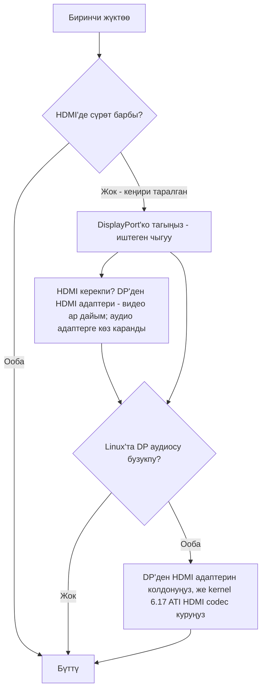

# Дисплей жана чыгуу

> 🌐 Коомчулук котормосу. Англис тилиндеги нуска — чындыктын булагы жана жаңыраак болушу мүмкүн. Ката таптыңызбы? Issue ачыңыз: [English](../en/14-display.md) · [issues](https://github.com/lildebil0/awesome-bc250/issues)

> **Кыскача** — BC-250 мониторуңузду **DisplayPort** аркылуу иштетет. Тагуу керек болгон туташтыргыч ушул. Эгер тактаңызда HDMI порту да болсо, ал **көп учурда эч нерсе көрсөтпөйт** — андыктан ал жердеги кара экран *өлгөн* такта эмес, жөн гана туура эмес чыгуудасыз. HDMI керекпи? **DP→HDMI адаптерин** колдонуңуз — **видео ар дайым өтөт, кечигүү жок**; кээ бир адаптерлер **аудиону** да алып өтөт (текшерилгени өткөргөн, [src](https://t.me/c/2424231195/9148)), бирок аудио конкреттүү адаптерге көз каранды, андыктан ага үмүт артпаңыз (аудио бөлүмүн караңыз). Бир чыныгы өзгөчөлүк: **Linux'та DisplayPort аудиосу бузулуп/жайлап чыгат**; ошол эле DP→HDMI адаптери муну айланып өтөт, ал эми ядро тарабындагы туура оңдоо **kernel 6.17** айланасында келет ([src](https://t.me/c/2424231195/17953), [src](https://t.me/c/2424231195/68051)).

«Биринчи жүктөөдө сүрөт жок» — бул **жаңы келгендердин #1 паникасы**. Бир нерсе бузук деп чечүүдөн мурда төмөнкү кутучаны окуңуз.

---

## Сүрөт жокпу? Мынаны жасаңыз

1. **HDMI'ге эмес, DisplayPort'ко тагыңыз.** BC-250'дин иштеген видео чыгуусу — DisplayPort ([src](https://t.me/c/2424231195/104784)). HDMI порту (бар болсо) — адатта бош болгону; тактаны ага карап баалабаңыз.
2. **Картаны кайра отургузуп, дагы аракет кылыңыз.** Такталар көп учурда биринчи аракетте инициализацияланбайт — кубатты толук өчүрүп-күйгүзүңүз (толук off/on), жана физикалык түрдө кайра отургузуңуз. Бир ээси: *«меники келгенде да биринчи аракетте күйбөдү … кээде баскыч менен кайра жүктөгөндө толук инициализацияланбайт — off/on оңдойт»* ([src](https://t.me/c/2424231195/15701)).
3. **Тактадан мурда кабелди/адаптерди шектениңиз.** Бир эле карта менен, начар кабель же адаптер — башкы шектүү ([src](https://t.me/c/2424231195/15699)). Кээ бир адаптерлер firmware'де иштейт, бирок ОС жүктөлгөндө кара экранга өтөт — *«сүрөт GRUB'ка чейин жакшы эле, системада кара экран»* ([src](https://t.me/c/2424231195/38184)).
4. **BIOS'ту баштапкы абалга келтириңиз / белгилүү иштеген образды кайра жазыңыз** эгер бир партиядагы бир нече карта сүрөт бербесе — бул firmware'ге көрсөтөт, мониторуңузга эмес ([src](https://t.me/c/2424231195/15697), [src](https://t.me/c/2424231195/15705)).

Эгер бул төртөөнү тең четке чыгарсаңыз да дагы эле эч нерсе жок болсо, [troubleshooting.md](../en/troubleshooting.md) барыңыз.



---

## Чыгуулар бир караганда

| Чыгуу | Иштейби? | Эскертүүлөр |
|--------|--------|-------|
| **DisplayPort** | **Ооба — бул ошол чыгуу** | Негизги/жалгыз дисплей туташтыргычы; аудиону алып өтөт. Репонун I/O спецификациясы `1x DisplayPort` деп тизмелейт ([repo](https://github.com/mothenjoyer69/bc250-documentation)). Бул **DisplayPort 1.4**, шыбы **4K@120 Hz**, HDR10 менен ([elektricM](https://github.com/elektricM/amd-bc250-docs/blob/main/docs/hardware/display.md)). |
| **HDMI порту** (орнотулган болсо) | **Көп учурда бош** | Жаңы келгендер такта өлгөн деп ойлойт; адатта андай эмес — DP'ге өтүңүз. ([src](https://t.me/c/2424231195/104784)) |
| **Адаптер аркылуу DP → HDMI** | **Видео: ооба. Аудио: адаптерге көз каранды** | Видео кечигүүсүз өтөт ([src](https://t.me/c/2424231195/9148)); аудио чипсетке көз каранды — текшериңиз (аудио бөлүмүн караңыз). Ошондой эле DP аудиосунун бузулушунун стандарттык оңдоосу (төмөндө). |
| **Экинчи видео чыгуу** | **Кутудан эмес** | Электр жагынан бар, бирок **орнотулган эмес**; 2-мониторду мажбурлоо хактарды талап кылат, ал эми башкалар чипте чыныгы 2-баш жок дешет — жалгыз чыгууну коопсуз божомол катары кабыл алыңыз. ([src](https://t.me/c/2424231195/92978), [src](https://t.me/c/2424231195/104682)) |
| **Тармак аркылуу экинчи экран** | **Ооба** | BC-250'дин чыгуусун LAN аркылуу башка машинага агылтыңыз (Steam/Sunshine). ([src](https://t.me/c/2424231195/23660)) |

---

## Чечилиштер, жаңыртуу жыштыгы жана кабель

elektricM'дин маалымдамасы жалгыз DP линиясы чындыгында эмнени жасай аларын так аныктайт — монитор же адаптер тандаганда пайдалуу ([elektricM](https://github.com/elektricM/amd-bc250-docs/blob/main/docs/hardware/display.md)):

| Чечилиш | Жаңыртуу | Жол |
|------------|---------|------|
| 1920×1080 (1080p) | 144 Hz+ | Нативдик DP, же каалаган адаптер |
| 2560×1440 (1440p) | 144 Hz+ | Нативдик DP (пассивдүү адаптерлер көп учурда 1440p@60 / DP 1.2 менен чектелет) |
| 3840×2160 (4K) | 60 Hz | Нативдик DP, же **активдүү** DP→HDMI 2.0 адаптери |
| 3840×2160 (4K) | 120 Hz | **Жалгыз нативдик DP** — HDMI аркылуу 4K@120 үчүн активдүү DP 1.4→HDMI 2.1 адаптери керек, жана туруксуз |

- **Кабель:** **VESA-сертификатталган DisplayPort 1.4** кабелин, **1–2 м**, колдонуңуз; узунураак кабелдер синхрондоштуруу/үзүлүү маселелерин жаратат ([elektricM](https://github.com/elektricM/amd-bc250-docs/blob/main/docs/hardware/display.md)).
- **Төмөн чечилиште такалып калуу** (мисалы, 1024×768/1080p, жалгыз 60 Hz) — адатта GPU драйвери жүктөлбөгөнүн билдирет — `glxinfo | grep "OpenGL renderer"` текшериңиз; `llvmpipe` = программалык рендеринг, Mesa 25.1+ орнотуп, `nomodeset` алып салыңыз ([elektricM](https://github.com/elektricM/amd-bc250-docs/blob/main/docs/troubleshooting/display.md)). [06-linux.md](../en/06-linux.md) караңыз.
- **HDR (HDR10) жана VRR** иштейт, бирок Linux'та экспериманталдык — **KDE Plasma 6+** эң жакшы колдоого ээ жана адатта Wayland сеансын талап кылат ([elektricM](https://github.com/elektricM/amd-bc250-docs/blob/main/docs/hardware/display.md)). **Бул жерде дистрибутив маанилүү:** r/BC250Gaming (Reddit) коомчулук отчёту **HDR + VRR'ди туура иштетүүгө жетишкен жалгыз CachyOS'то** (Plasma 6 + Wayland), ал эми **Bazzite'те HDR графикалык каталарды жараткан жана VRR такыр иштеген эмес**. Алардын мисалы: *Forza Horizon 6* **1440p High, HDR + VRR күйгүзүлгөн, 60–80 FPS**, **UGREEN DP→HDMI 2.1** адаптери аркылуу. Эгер HDR/VRR приоритет болсо, [06-linux.md](../en/06-linux.md) ичиндеги CachyOS эскертмесин караңыз.
  - **Эгер сиз Bazzite KDE'десиз жана HDMI аркылуу VRR/FreeSync кааласаңыз**, AMD'нин HDMI 2.1 / FRL ядро ишин алмаштырып салган коомчулук ремикси бар: **[`dyllan500/bazzite-amd-hdmi-kde`](https://github.com/dyllan500/bazzite-amd-hdmi-kde)** — AMD'нин расмий HDMI-2.1 VRR патчтарын (`amd-staging-drm-next`'тен) алып жүргөн ядронун негизинде кайра курулган Bazzite KDE образы. ⚠ **катуу шектениңиз:** бул үчүнчү жактын образы, автор VRR'ди жалгыз **Radeon 9070 XT'де** (BC-250'де эмес) текшерген, жана патчтар стандарттык Bazzite ядросуна киргенде эскирүүгө арналган. Бул BC-250 үчүн *тастыкталган* оңдоо *эмес* — аны кепилдик эмес, сынап көрүүгө боло турган экспериманталдык багыт катары кабыл алыңыз.

> **Кирүүдөн *кийинки* кара экран (GRUB жана кирүү экраны жакшы эле)** — иш үстөл сеансынын маселеси, адатта **Wayland** — кирүү тишчесинен «GNOME on Xorg»/«Plasma (X11)» тандаңыз, же `/etc/gdm/custom.conf`'то `WaylandEnable=false` коюңуз ([elektricM](https://github.com/elektricM/amd-bc250-docs/blob/main/docs/hardware/display.md)). Кирүүдөн *мурдагы* кара экран — жогорудагы драйвер/`nomodeset` маселеси, бул эмес.

---

## DisplayPort аудиосу бузулган — адаптер оңдоосу

Linux'та **түз DisplayPort'тон** жөнөтүлгөн аудио BC-250'де туура эмес чыгат — бузулган деп сүрөттөлгөн, *«созулган, жарым ылдамдыкка жайлатылгандай»*, кытырык менен ([src](https://t.me/c/2424231195/9895)). Бул **Linux/DP-протокол маселеси, такта дефекти эмес** — BC-250 эмес жабдыктарда да байкалган ([src](https://t.me/c/2424231195/15983)).

Чат токтогон ачык, ишеничтүү айланма жол: **сигналды DP→HDMI адаптери аркылуу өткөрүңүз.** HDMI'ге айландырылганда аудио артефакттары жок болот ([src](https://t.me/c/2424231195/17953), [src](https://t.me/c/2424231195/51763)). Колдонуучу муну түз текшерген: *«Мен DisplayPort→HDMI адаптери аркылуу аудио чыгууну текшердим. Баары жакшы, кечигүү жок»* ([src](https://t.me/c/2424231195/9148)).

**Эң таза жол — түз DP→HDMI *кабели* — бир учунда DP штекери, экинчисинде HDMI штекери, эки тарапта тең адаптер донгл же кутуча жок.** r/linux_gaming коомчулук жипиндеги бир нече колдонуучу муну эң ишеничтүү аудио берет деп өз алдынча билдиришет: жөнөкөй кабель (мисалы, Amazon Basics DP-to-HDMI кабели, ~$10) донгл стилиндеги адаптерлер туруксуз болгон жерде «жөн гана иштейт». Кээде кыска аудио өчүүлөр дагы эле болушу мүмкүн, бирок бир бүтүн кабель донгл жолун кокустукка айланткан кошумча адаптер чипсетин жоёт ([r/linux_gaming](https://www.reddit.com/r/linux_gaming/comments/1nvsgji/)). Эгер баары бир сатып алып жатсаңыз, **донгл эмес, кабелди тандаңыз.**

**Эгер колуңузда адаптер жок болсо,** аудиону анын ордуна **Bluetooth** аркылуу өткөрүңүз — динамиктердин/гарнитуралардын көбү аны колдойт жана ал DP жолун толугу менен айланып өтөт ([src](https://t.me/c/2424231195/89769)). BT донглу үчүн [10-wifi-bt.md](../en/10-wifi-bt.md) караңыз.

### Адаптер боюнча эскертүүлөр (коомчулук)
- **4K@60+ үчүн сизге *активдүү* адаптер/кабель керек** (пассивдүү ~1440p@60'та чектелет). Иштеген, текшерилген мисал: **UGREEN DP125 (DP→HDMI 4K кабели)** — 4K@30 деп бааланган, бирок телевизордо 4K@60 келишилген ([src](https://t.me/c/2424231195/52398)). Активдүү же пассивдүү чечилиштин шыбын аныктайт — ал аудио өтөбү же жокпу аны **аныктабайт** (төмөндө).
- **Бардык адаптерлер аудиону алып өтпөйт.** Бир ээсинин Belsis адаптери 4K@60'ту үн *менен* өткөргөн, ал эми бир нече кымбатыраак Ugreen бирдиктери түзмөктөр тизмесинде «HDMI digital audio» көрсөткөн, бирок үн чыгарган эмес — жана бири үндөрдү бир октавага ылдый түшүргөн ([src](https://t.me/c/2424231195/106617)). Эгер видео алып, аудио албасаңыз, өзгөрмө — адаптер, башкасын сынап көрүңүз.
- **HDMI *аудиосу* үчүн адегенде *пассивдүү* адаптерге кол сунуңуз.** r/linux_gaming жипиндеги коомчулук үлгүсү: **пассивдүү** DP→HDMI адаптерлери аудиону таза өткөрүүгө жакын, ал эми **активдүү** адаптерлер көп учурда **аудиону толугу менен жоготот же тонду жылдырат** (үндөр ~20% / болжол менен бештик ылдый жылды деп билдирилген). Кыйынчылык: сизге активдүү адаптер чыныгы **HDR** үчүн (жана 4K@60+ үчүн) гана *керек*, андыктан бул чыныгы алмаштыруу — ишеничтүү үн үчүн пассивдүү, HDR үчүн активдүү. Коомчулук тарабынан иштеши тастыкталган *пассивдүү* варианттар: **Silver Monkey**, **BENFEI (ASIN B017Q8ZVWK)**, жана **AmazonBasics DP-to-HDMI _кабели_** (бир бүтүн кабель — алардын донгл стилиндеги адаптери *эмес*) ([r/linux_gaming](https://www.reddit.com/r/linux_gaming/comments/1nvsgji/)). ⚠ конкреттүү SKU'лар коомчулук тарабынан билдирилген, бул жерде лабораторияда текшерилген эмес — жана пассивдүү адаптер дагы эле ~**1440p@60**'та чектелет.
- Видеону да, аудиону да өткөргөн арзан **4K@60 DP→HDMI** адаптерлери бар жана иштеши билдирилген ([src](https://t.me/c/2424231195/133977)).
- Кээ бир адаптерлер атайын **4K мониторлордо** туура иштебейт ([src](https://t.me/c/2424231195/1988)).
- **DP→HDMI адаптери аркылуу аудио туруксуз жана адаптердин чипсетине көз каранды — жөн гана активдүү же пассивдүүгө эмес.** Видео ар дайым өтөт; **аудио — өзгөрмө.** Биздин коомчулук отчёттору адаптер-адаптер боюнча (UGREEN/Belsis бирдиктери үн алып жүрөт деп билдирилген, кээ бир башка бирдиктер унчукпаган), ал эми elektricM'дин гиди *тескери* бөлүштүрүүнү билдирет (пассивдүү аудиону алып жүрөт, кээ бир активдүү бирдиктер унчукпайт — мисалы, Cable Matters/StarTech) — дал ушул себептен активдүү/пассивдүү энбелги аны болжолдобойт ([elektricM](https://github.com/elektricM/amd-bc250-docs/blob/main/docs/troubleshooting/display.md)). **Ишеничтүү** аудио үчүн адаптерге үмүт артпаңыз: **DisplayPort-нативдик дисплей/AV ресивер** тандаңыз, же үндү **USB аркылуу (USB DAC/үн түзмөгү)** чыгарыңыз. Эгер адаптер колдонсоңуз, **ага таянуудан мурда аудиону текшериңиз** — жана **пассивдүү** адаптер ~**1440p@60**'та чектелерин эстен чыгарбаңыз.

### kernel-6.17 оңдоосу (DP-түз аудио, адаптерсиз)

Эгер сиз адаптерсиз **түз DisplayPort аркылуу** таза аудио кааласаңыз, себеби жана оңдоосу чатта изделип табылган. Fedora'нын стандарттык ядро конфигурациясы `snd-hda-codec-hdmi.ko` + `snd-hdmi-lpe-audio.ko` курган; **kernel 6.17 HDMI аудио жолун өзгөрткөн** жана ошол демейки конфигурацияда үндү бузган. Оңдоо — **ATI HDMI codec'ин** да куруу — ядро конфигурациясын `# CONFIG_SND_HDA_CODEC_HDMI_ATI is not set`'тен `CONFIG_SND_HDA_CODEC_HDMI_ATI=m`'ге которуу, бул `snd-hda-codec-atihdmi.ko`'ну топтойт; андан кийин үн **патчтарсыз** иштейт ([src](https://t.me/c/2424231195/68051), [src](https://t.me/c/2424231195/68061)).

```text
# Fedora kernel config change for DP/HDMI audio on kernel 6.17+
# from:
# CONFIG_SND_HDA_CODEC_HDMI_ATI is not set
# to:
CONFIG_SND_HDA_CODEC_HDMI_ATI=m
```

Ошол үчүнчү codec (`snd-hda-codec-atihdmi.ko`) болгондо, ALSA тактанын аудио чыгууларын ачат (мисалы, `pcm=3` жана `pcm=7` эки HDMI түзмөк катары) ([src](https://t.me/c/2424231195/68062), [src](https://t.me/c/2424231195/67569)). ⚠ текшериңиз — бул атайын ядро курууну талап кылат; колдонуучулардын көпчүлүгү үчүн DP→HDMI адаптерин курбоо жолу катары кабыл алыңыз. Ядро/драйвер орнотуу үчүн [06-linux.md](../en/06-linux.md) караңыз.

### Айланма үн (5.1) — HDMI эмес, USB үн картасын колдонуңуз

**HDMI аркылуу 5.1 айланма үн BC-250'де иштебейт.** AMD'нин бул баш-аз/майнинг кристаллы үчүн Linux'тагы HDMI firmware'и көп каналдуу LPCM'ди ачпайт, андыктан HDMI чыгуусу ресивер эмнени колдосо да жөнөкөй стереого кайтат ([r/linux_gaming](https://www.reddit.com/r/linux_gaming/comments/1nvsgji/)). Чыныгы көп каналдуулук үчүн аудиону анын ордуна **USB үн картасы / USB DAC** аркылуу чыгарыңыз — аны `pavucontrol`'до демейки sink катары коюп, анан бардык алты каналды тастыктаңыз:

```bash
speaker-test -D pipewire -c 6 -t wav
```

Ошол эле USB-DAC жолу адаптерлер туура иштебеген учурда стерео аудио үчүн ишеничтүү оңдоо (жогоруда).

---

## Экинчи чыгуу (баштапкы абалда активдүү эмес)

Тактада **кутудан активдүү эмес экинчи видео чыгуу бар.** Коомчулуктун көз карашы экиге бөлүнгөн жана эки жагын тең билүү пайдалуу:

- Ал **электр жагынан бар, бирок орнотулган/ширетилген эмес**, жана *«хактар менен 2-мониторду иштетсе болот»* ([src](https://t.me/c/2424231195/92978)).
- Башкалар чипте жөн гана **колдонууга жарактуу экинчи баш жок** дешет — *«маселе чипте, экинчи чыгуу физикалык түрдө жок»* ([src](https://t.me/c/2424231195/104682)).

Практикалык жагынан: **бир DisplayPort чыгуусу деп болжолдоңуз.** Эки көз карандысыз экран үчүн DP **MST бөлгүчү жөнүндө суралган, бирок биздин чатта иштеши тастыкталган эмес** ([src](https://t.me/c/2424231195/92109)).

**elektricM'ден жаңылык — MST туура хаб менен эки экранды иштете алат.** elektricM'дин сыноосу **DP MST хабы аркылуу 2 дисплейге чейин** билдирет (өткөрүү жөндөмдүүлүгү бөлүшүлөт, дисплейге чечилиш чектелет), хаб-хаб боюнча натыйжалар менен ([elektricM](https://github.com/elektricM/amd-bc250-docs/blob/main/docs/hardware/display.md)):

| MST хаб | Чыгуу | DP вер. | Көз карандысыз дисплейлер? | Аудио | Эскертүүлөр |
|---------|-----|--------|-----------------------|-------|-------|
| StarTech MST14DP122DP | 2× DP | 1.4 | **Ооба** | Ооба | Мониторлордо/кабелдерде туруктуу иштеген |
| Monoprice 21972 | 2× DP | 1.2 | **Жалгыз күзгү** | Ооба | Жалгыз күзгүлөй алган |
| ENBUER | 2× DP | 1.2 | **Жалгыз күзгү** | Ооба | Жалгыз күзгүлөй алган |
| Жалпы HDMI MST | 2× HDMI | — | **Жок** | Жок | Видео да, аудио да жок |

Демек, нативдик кош монитор DP 1.4 хабы менен MST аркылуу мүмкүн **болот** (StarTech тастыкталган); арзаныраак DP 1.2 хабдары жалгыз күзгүлөшү мүмкүн, ал эми HDMI MST хабдары иштеген жок. ⚠ текшериңиз — жалгыз тастыкталган хаб модели; натыйжалар хабга жараша өзгөрөт.

**Башка көп дисплей жолу — USB DisplayLink адаптери.** Кошумча **иш үстөл** экраны үчүн USB→HDMI/DP DisplayLink адаптерин кошуңуз (эң жакшы натыйжа үчүн жүктөөдөн *кийин* тагыңыз). **Оюн үчүн эмес** — ал CPU'да кысат, бул BC-250'дин тыгыны, андыктан кечигүү жогору; ал ошондой эле Steam Deck **game mode**'до иштебейт ([elektricM](https://github.com/elektricM/amd-bc250-docs/blob/main/docs/hardware/display.md)).

---

## Тармак аркылуу экинчи экран (оңой «2-дисплей»)

Эгер сиз чындап BC-250 сүрөтүн экинчи түзмөктө кааласаңыз, далилденген жол — экинчи кабель эмес, бул **LAN аркылуу агылтуу.** Бир колдонуучу: *«Мен BC-250'де (Fedora) Steam оюнун ишке кошуп, аны тармак аркылуу жумуш ноутбугума агылттым, аны ноутбуктан башкардым. Баары иштеди»* ([src](https://t.me/c/2424231195/23660)).

- **Sunshine** (хост кодировкалоочу) бул жерде иштейт, анткени ал жалгыз NVIDIA'га арналган эмес — ал кодировкалоону жасайт, кардар жөн гана декодировкалайт ([src](https://t.me/c/2424231195/25091)). Гигабиттик LAN аркылуу ал дээрлик кынтыксыз деп билдирилген ([src](https://t.me/c/2424231195/25563)).
- **Хост катары Moonlight** туура келбейт — ал NVIDIA кодировкалоочусун күтөт жана жетишпеген аппараттык декодер жөнүндө такылдайт/даттанат ([src](https://t.me/c/2424231195/25050)). Хост катары Sunshine'ди, Moonlight'ты жалгыз кардар катары колдонуңуз.

Бул ошондой эле жогорудагы орнотулбаган экинчи чыгуусуз «кош дисплей» сезимин алуунун практикалык жолу.

---

## Булактар

- DP→HDMI адаптери видео+аудиону өткөрөт, кечигүү жок — https://t.me/c/2424231195/9148
- DP аудиосунун бузулушу — Linux маселеси; адаптер аны оңдойт — https://t.me/c/2424231195/17953 · https://t.me/c/2424231195/9895 · https://t.me/c/2424231195/51763 · https://t.me/c/2424231195/15983
- Kernel 6.17 аудио оңдоосу (`CONFIG_SND_HDA_CODEC_HDMI_ATI=m`) — https://t.me/c/2424231195/68051 · https://t.me/c/2424231195/68061 · https://t.me/c/2424231195/68062 · https://t.me/c/2424231195/67569
- Иштеген адаптерлер — UGREEN DP125 https://t.me/c/2424231195/52398 · Belsis vs башкалар (аудио ар түрдүү) https://t.me/c/2424231195/106617 · арзан 4K@60 https://t.me/c/2424231195/133977
- DP — иштеген чыгуу; жакшы DP→HDMI адаптерине акча сарптаңыз — https://t.me/c/2424231195/104784
- Биринчи жүктөөдө сүрөт жок / кайра отургузуу / кайра жазуу — https://t.me/c/2424231195/15697 · https://t.me/c/2424231195/15699 · https://t.me/c/2424231195/15701 · https://t.me/c/2424231195/38184
- Экинчи чыгуу бар, бирок орнотулган эмес / талаш-тартыш — https://t.me/c/2424231195/92978 · https://t.me/c/2424231195/104682 · MST суралган https://t.me/c/2424231195/92109
- Тармак аркылуу экинчи экран (LAN аркылуу Sunshine/Steam) — https://t.me/c/2424231195/23660 · https://t.me/c/2424231195/25091 · https://t.me/c/2424231195/25050 · https://t.me/c/2424231195/25563
- Альтернатива катары Bluetooth аудио — https://t.me/c/2424231195/89769
- Түз DP→HDMI **кабели** (адаптерсиз) — эң ишеничтүү аудио; HDMI аркылуу 5.1 иштебейт (көп каналдуу LPCM жок), USB үн картасын / DAC колдонуңуз — r/linux_gaming коомчулук жиби https://www.reddit.com/r/linux_gaming/comments/1nvsgji/
- Жабдыктын I/O маалымдамасы (`1x DisplayPort`) — [mothenjoyer69/bc250-documentation](https://github.com/mothenjoyer69/bc250-documentation) · [`hardware.md`](https://github.com/mothenjoyer69/bc250-documentation/blob/main/hardware.md)
- DP 1.4 / 4K@120 / HDR10, чечилиш+кабель чектөөлөрү, MST хабдары (макс 2), DisplayLink, Wayland-кирүү кара экраны — elektricM [`hardware/display.md`](https://github.com/elektricM/amd-bc250-docs/blob/main/docs/hardware/display.md)
- HDR + VRR CachyOS'то иштейт (Plasma 6 + Wayland) vs Bazzite'те бузук; Forza Horizon 6 1440p High HDR+VRR UGREEN DP→HDMI 2.1 аркылуу — r/BC250Gaming (Reddit) коомчулук отчёту ([06-linux.md](../en/06-linux.md) караңыз)
- Пассивдүү DP→HDMI аудиону алып жүрөт / активдүү аны жоготот же тонду жылдырат; пассивдүү, бирок HDR үчүн керек; тастыкталган пассивдүүлөр Silver Monkey / BENFEI B017Q8ZVWK / AmazonBasics DP-to-HDMI кабели — [r/linux_gaming коомчулук жиби](https://www.reddit.com/r/linux_gaming/comments/1nvsgji/)
- HDMI аркылуу Bazzite KDE VRR/FreeSync ремикси (AMD HDMI 2.1 ядро; 9070 XT'де текшерилген, BC-250'де эмес) — [`dyllan500/bazzite-amd-hdmi-kde`](https://github.com/dyllan500/bazzite-amd-hdmi-kde)
- Адаптер аудиосу чипсетке көз каранды (elektricM пассивдүү аны алып жүргөнүн / кээ бир активдүү унчукпаганын көргөн; коомчулук тескерисин көргөн — андыктан DP-нативдик же USB DAC тандаңыз), төмөн чечилиш llvmpipe текшерүүсү — elektricM [`troubleshooting/display.md`](https://github.com/elektricM/amd-bc250-docs/blob/main/docs/troubleshooting/display.md)

> Драйвер/ядро орнотуу [06-linux.md](../en/06-linux.md) ичинде; аудио/чыгуу кыйынчылыктары да [troubleshooting.md](../en/troubleshooting.md) жана [faq.md](../en/faq.md) ичинде индекстелген.
