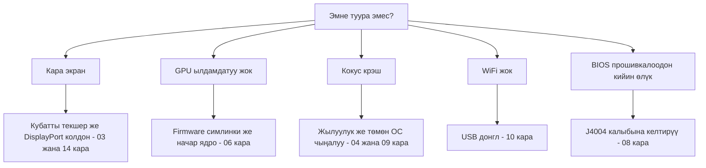

> 🌐 Коомчулук котормосу. Англис тилиндеги нуска — чындыктын булагы жана жаңыраак болушу мүмкүн. Ката таптыңызбы? Issue ачыңыз: [English](../en/troubleshooting.md) · [issues](https://github.com/lildebil0/awesome-bc250/issues)

# Troubleshooting

> **Кыскача** — BC-250'нин бузулуу режимдери жакшы белгилүү: көпчүлүгү — **кубат**, **жылуулук**, **ядро/firmware**, же **ийгиликсиз прошивкалоо**. Симптомуңузду төмөндөн таап, оңдоону колдонуп, толук бөлүмгө шилтемени ээрчиңиз. Күмөн болсоңуз, себеп көбүнчө *начар ядро*, *amdgpu firmware симлинки жок*, же *сууткуч жетишсиз*.

Бул барак — симптом → себеп → оңдоо индекси, коомчулуктун кайталануучу көйгөйлөрүнөн иргелген. Ал бөлүмдөрдү алмаштырбайт — сизди туурасына тез багыттайт.

---

## Жүктөө / дисплей

| Симптом | Болжолдуу себеп | Оңдоо |
|---------|--------------|-----|
| Кара экран / POST жок | Кубат зымдоосу же пиноут туура эмес | 8-pin зымдоосун жана пиноутту кайра текшериңиз; жетиштүү калыңдыктагы чыныгы жез зым колдонуңуз → [03 — Кубат](../en/03-power-supply.md) |
| Иштеп жаткандан кийин кара экран / крэштер | **IOMMU дагы эле күйүк** (бул тактада бузук) | BIOS'то IOMMU'ну өчүрүңүз (elektricM); `iommu=off`/`amd_iommu=off` ядро параметри ⚠ текшерилсин → [06 — Linux](../en/06-linux.md) |
| **Орноткучту** / live USB'ни жүктөгөндө кара экран | Орноткучта BC-250 GPU драйвери жок; KMS бузулат | GRUB'та `nomodeset` кошуңуз (Fedora: Troubleshooting → Basic Graphics Mode); **Mesa орнотулгандан кийин аны алып салыңыз** ([elektricM](https://github.com/elektricM/amd-bc250-docs/blob/main/docs/troubleshooting/boot.md)) → [06 — Linux](../en/06-linux.md) |
| **Кирүүдөн кийин** кара экран (GRUB + кирүү экраны жакшы болгон) | Иш стол сеансы, адатта **Wayland** | Кирүүдө X11'ди ("GNOME on Xorg"/"Plasma X11") тандаңыз, же `WaylandEnable=false` ([elektricM](https://github.com/elektricM/amd-bc250-docs/blob/main/docs/troubleshooting/display.md)) → [14 — Дисплей](../en/14-display.md) |
| Жүктөлөт, бирок GPU ылдамдатуу жок (баары CPU'да) | amdgpu firmware симлинки жок, же начар ядро | `navi10_gpu_info.bin` симлинкин + ядро параметрлерин колдонуңуз; белгилүү начар ядролордон качыңыз (төмөндө) → [06 — Linux](../en/06-linux.md) |
| `glxinfo` **llvmpipe** көрсөтөт, оюндар 5–10 FPS | Mesa өтө эски, же amdgpu жүктөлгөн эмес | **Mesa 25.1.3+** орнотуңуз, `nomodeset`'ти алып салыңыз, `Kernel driver in use: amdgpu` экенин ырастаңыз ([elektricM](https://github.com/elektricM/amd-bc250-docs/blob/main/docs/troubleshooting/performance.md)) → [06 — Linux](../en/06-linux.md) |
| Иштеген, анан ядро жаңылоосунан кийин бузулган | Ал ядродогу регрессия | LTS ядрого кайтыңыз; **6.14.7**, **6.15.0–6.15.6** жана **6.17.8–6.17.10** amdgpu'ну бузат деп билдирилген (CPU'га түшүү / GPU крэштер); elektricM **6.18.x LTS же 6.17.11+** сунуштайт ⚠ так диапазондорду текшериңиз → [06 — Linux](../en/06-linux.md) |
| HDMI үн жок | Ядро 6.17+ регрессиясы | LTS ядрону колдонуңуз, же үндү USB/DisplayPort аркылуу багыттаңыз → [06 — Linux](../en/06-linux.md) |
| Бир гана дисплей чыгуусу иштейт | Бул тактадагы драйвер чектөөсү | Жергиликтүү кош экран үчүн белгилүү чектөө; **MST хаб 2 экранга чейин берет** (DP 1.4 хаб) ([elektricM](https://github.com/elektricM/amd-bc250-docs/blob/main/docs/hardware/display.md)) → [14 — Дисплей](../en/14-display.md) |
| Дисплей жок, POST жок, **NVMe орнотулганда гана** | SSD'де дагы эле **Windows** EFI/калыбына келтирүү бөлүмдөрү бар | SSD'ни сууруп, башка PC'де бардык бөлүмдөрдү тазалаңыз (`wipefs -a`), кайра орнотуңуз ([elektricM](https://github.com/elektricM/amd-bc250-docs/blob/main/docs/troubleshooting/boot.md)) → [06 — Linux](../en/06-linux.md) |
| Такыр POST өтпөйт (BIOS жок) | Кээ бир такталар **CMOS батареясысыз** POST өтпөйт | Жаңы CR2032 орнотуп, кайра аракет кылыңыз ([elektricM](https://github.com/elektricM/amd-bc250-docs/blob/main/docs/troubleshooting/boot.md)) → [08 — BIOS](../en/08-bios.md) |
| Жүктөө **~90 с асылып** анан улантат | Ийгиликсиз systemd кызматы / тармак таймауты | `systemctl --failed`; асылып калган бирдикти өчүрүңүз ([elektricM](https://github.com/elektricM/amd-bc250-docs/blob/main/docs/troubleshooting/boot.md)) → [06 — Linux](../en/06-linux.md) |
| Ядро паникасы "**unable to mount root**" / "No init found" | Туура эмес ядро **же** бузулган initramfs | Эскирээк/LTS ядрону жүктөңүз; дагы эле бузулса, chroot кылып initramfs'ти кайра түзүңүз (`dracut -f` / `update-initramfs -u -k all` / `mkinitcpio -P`) ([elektricM](https://github.com/elektricM/amd-bc250-docs/blob/main/docs/troubleshooting/boot.md)) → [06 — Linux](../en/06-linux.md) |
| `grub>` / `grub rescue>`'ке түшөт | GRUB өзүнүн конфиг/жүктөө файлдарын таппайт | `root`/`prefix` коюңуз, `insmod normal`, жүктөңүз; анан GRUB'ду кайра орнотуңуз ([elektricM](https://github.com/elektricM/amd-bc250-docs/blob/main/docs/troubleshooting/boot.md)) → [06 — Linux](../en/06-linux.md) |
| BIOS'ко кире албайт (Del/F2 эске алынбайт) | Адаптер жай инициализацияланат, же клавиатура USB 3.0'до | Del'ди дароо басыңыз; **USB 2.0** портун жана жергиликтүү DP кабелин сынап көрүңүз ([elektricM](https://github.com/elektricM/amd-bc250-docs/blob/main/docs/troubleshooting/display.md)) → [08 — BIOS](../en/08-bios.md) |

## Жылуулук / туруктуулук

| Симптом | Болжолдуу себеп | Оңдоо |
|---------|--------------|-----|
| Жүктө троттлинг кылат / FPS кулайт | Стандарттык радиатор столдо муздата албайт | Кырларды ичкертип + жогорку статикалык кысымдагы 120 мм желдеткич/кожух; <80 °C кармаңыз → [04 — Сууткуч](../en/04-cooling.md) |
| Жүктө кокус крэш / кайра жүктөө | Ысып кетүү (>90 °C) **же** овершклок чыңалуусу өтө төмөн | Алгач сууткучту жакшыртыңыз; анан андервольт чыңалуусун көтөрүңүз — Furmark'ка туруктуу ≠ оюнга туруктуу (оюндарга жогорураак керек) → [04](../en/04-cooling.md) · [09](../en/09-overclock-undervolt.md) |
| Furmark'та туруктуу, оюндарда крэш | Чыңалуу Furmark'тан коюлган, ал аз стресс берет | OCCT + чыныгы оюндар менен текшериңиз; чыңалууну ~50 mV көтөрүңүз → [09 — Овершклок](../en/09-overclock-undervolt.md) |
| Эки governor салышып жатат | oberon-governor *жана* smu_oc/cyan-skillfish бирге иштеп жатат | Бир гана governor иштетиңиз; калгандарын өчүрүңүз → [09 — Овершклок](../en/09-overclock-undervolt.md) |
| GPU крэш болгондо **бүт система** өлөт (жөн эле колдонмо эмес) | APU: CPU+GPU кремнийди бөлүшөт, ошондуктан GPU баштапкы абалга келүүсү калыбына келтире албайт — ал системаны кулатат | Бул архитектурада күтүлгөн; калыбына келүүнү күтүүнүн ордуна GPU крэштеринин алдын алыңыз (туруктуу чыңалуу + жакшы сууткуч + жакшы ядро) ([elektricM](https://github.com/elektricM/amd-bc250-docs/blob/main/docs/troubleshooting/stability.md)) → [09 — Овершклок](../en/09-overclock-undervolt.md) |
| GPU крэш → **кара экран, эч качан калыбына келбейт**, governor иштеп жатканда | Governor баштапкы абалга келүү учурунда sysfs'ке жаза берет → асылып калган баштапкы абалга келүү цикли | Крэшке жакын оюндарга чейин `systemctl stop cyan-skillfish-governor-smu`; андан кийин кайра иштетиңиз ([elektricM](https://github.com/elektricM/amd-bc250-docs/blob/main/docs/troubleshooting/stability.md)) → [09 — Овершклок](../en/09-overclock-undervolt.md) |
| **Болгону 60–65 °C'те** тоңуп калат / ак экран | Кээ бир такталар температурага өзгөчө сезимтал | Сууткучту жакшыртыңыз, радиаторду кайра отургузуңуз, кайра пастаны жаныңыз (PTM7950); кремний ар башка ([elektricM](https://github.com/elektricM/amd-bc250-docs/blob/main/docs/troubleshooting/stability.md)) → [04 — Сууткуч](../en/04-cooling.md) |
| GPU **1500 MHz'те асылып калган**, төмөнгө андервольттолбойт | мин чыңалуу **700 mV'дан төмөн** коюлган — бул GPU'ну кайра кулпулаган катуу пол | Мин чыңалууну **≥ 700 mV** кармаңыз ([elektricM](https://github.com/elektricM/amd-bc250-docs/blob/main/docs/troubleshooting/stability.md)) → [09 — Овершклок](../en/09-overclock-undervolt.md) |
| Көбүрөөк чыңалуу оңдобогон артефакттар / крэштер | Жүктө **чыңалуунун төмөндөшү** (натыйжалуу V коюлган V'дан ылдый түшөт) | Төмөндөөнү жабуу үчүн базаны ~25 mV жогору коюңуз, же loadline/droop жөндөөсү бар BIOS колдонуңуз ([elektricM](https://github.com/elektricM/amd-bc250-docs/blob/main/docs/troubleshooting/stability.md)) → [09 — Овершклок](../en/09-overclock-undervolt.md) |
| Жүктөлүп анан **ACPI каталары** менен крэш болот (кара/жашыл экран) | BIOS/ACPI өзгөчөлүгү же бузулушу | CMOS тазалаңыз / BIOS демейкилерин баштапкы абалга келтириңиз; `acpi=off noapic` сынап көрүңүз; уланса кайра прошивкалаңыз ([elektricM](https://github.com/elektricM/amd-bc250-docs/blob/main/docs/troubleshooting/stability.md)) → [08 — BIOS](../en/08-bios.md) |
| Уйку/токтотуу = **жалган тоңуу** (кара, асылгандай көрүнөт) | Тактада туура GPU уйку абалдары жок; SMU Linux токтотуусун колдобойт | Ойготуу үчүн кубат баскычын басыңыз (кармабаңыз); жакшысы, **токтотууну өчүрүп** экран-каралоону колдонуңуз. Бош турганда баары бир ~65–85 W бойдон калат ([elektricM](https://github.com/elektricM/amd-bc250-docs/blob/main/docs/troubleshooting/stability.md)) → [09 — Овершклок](../en/09-overclock-undervolt.md) |

## Натыйжалуулук

| Симптом | Болжолдуу себеп | Оңдоо |
|---------|--------------|-----|
| FPS күткөндөн төмөн, GPU толук эмес | **CPU чектелген** (Zen 2 көп оюндарда чек) | Кадимки; CPU'га оор жөндөөлөрдү төмөндөтүп, кабыл алыңыз — GPU'ну овершклоктоо бул жерде жардам бербейт → [11 — Оюн](../en/11-gaming.md) |
| Болгону 24 CU активдүү, 40 күтүлгөн | Стандарт азыраак CU ачат | 40-CU ачууну колдонуңуз (`amdgpu.bc250_cc_write_mode=3` + скрипт) → [09 — Овершклок](../en/09-overclock-undervolt.md) |
| Steam / FSR / vsync бузук | «Геймер» дистрибутив форку кийлигишет | Кээ бир жөндөлгөн форктор буларды бузат; жөнөкөй Fedora/Bazzite-bc250 коопсузураак → [06 — Linux](../en/06-linux.md) |
| GPU жүккө карабастан **1500 MHz'те кулпуланган** | Колдонуучу мейкиндигинин governor'у жок (демейки BIOS'то кулпуланган) | Жыштыкты масштабдоо үчүн GPU governor (cyan-skillfish-governor-smu) орнотуңуз ([elektricM](https://github.com/elektricM/amd-bc250-docs/blob/main/docs/troubleshooting/performance.md)) → [09 — Овершклок](../en/09-overclock-undervolt.md) |
| Governor иштейт, бирок GPU **2000 MHz'тен ашпайт** | Ядродо жыштык-диапазон патчи жок (демейки чек 1000–2000) | Патчтелген ядро (Bazzite/CachyOS алдын ала патчтелген) колдонуңуз же `amdgpu-frequency-range.patch` колдонуңуз ([elektricM](https://github.com/elektricM/amd-bc250-docs/blob/main/docs/troubleshooting/performance.md)) → [09 — Овершклок](../en/09-overclock-undervolt.md) |
| MangoHud **655 %** GPU колдонуусун көрсөтөт | amdgpu активдүүлүк метрикасын `0xFFFF`'те калтырат; MangoHud 65535/100 окуйт | cyan-skillfish-governor-smu (smu бутагы) иштетиңиз — ал `gpu_metrics`'ти патчтейт; MangoHud өзгөртүүсү керек эмес. Же өзүнчө **`install_gpu_usage_fix.sh`** скриптин колдонуңуз ([Old Lamer — Part XV](https://youtu.be/lSipaWjU6D4)) ([elektricM](https://github.com/elektricM/amd-bc250-docs/blob/main/docs/troubleshooting/performance.md)) → [09 — Овершклок](../en/09-overclock-undervolt.md) |
| Жүк тестинде **Headless** «GPU эч нерсе кылбайт» | `glmark2 --off-screen` дисплейсиз унчукпай **llvmpipe**'ке (CPU) түшөт | `clpeak` / `vkmark` / `llama-bench -ngl 99` менен текшериңиз; SCLK жана кубат көтөрүлгөнүн ырастаңыз ([elektricM](https://github.com/elektricM/amd-bc250-docs/blob/main/docs/troubleshooting/performance.md)) → [06 — Linux](../en/06-linux.md) |
| 60+ FPS, бирок **тытырайт** / бирдей эмес кадр убакыттары | Кадр темпи (X11 композитору, же үнгө байланган темп) | **gamescope** аркылуу иштетиңиз (`-W 1920 -H 1080 -f`), же композиторду өчүрүңүз / Wayland сынап көрүңүз ([elektricM](https://github.com/elektricM/amd-bc250-docs/blob/main/docs/troubleshooting/performance.md)) → [11 — Оюн](../en/11-gaming.md) |
| Оюн **OOM крэш болот / артефакттар анан өлөт** (RDR2, CoH3) | **512 MB динамикалык VRAM + ZRAM** кагылышы, же жөн эле **RAM жетишсиз** | BIOS'ту **бекитилген VRAM**'ге которуңуз (мис. 10 GB RAM / 6 GB VRAM); **же** systemd ZRAM'ди өчүрүп, **zswap + 32 GB Btrfs swapfile** колдонуңуз ([Old Lamer — Part XIV](https://youtu.be/A6juAoY70aU), рецепти [06](../en/06-linux.md)/[09](../en/09-overclock-undervolt.md)'до) ([elektricM](https://github.com/elektricM/amd-bc250-docs/blob/main/docs/troubleshooting/stability.md)) → [08 — BIOS](../en/08-bios.md) |
| Белгилүү оюн (мис. **RDR2**) CPU/llvmpipe'те рендерлейт | Оюн демейки боюнча туура эмес графикалык адаптерди тандайт | Оюн ичинде адаптерди AMD GPU'га коюңуз; RDR2: `-useMaximumSettings` менен иштетиңиз ([elektricM](https://github.com/elektricM/amd-bc250-docs/blob/main/docs/troubleshooting/performance.md)) → [11 — Оюн](../en/11-gaming.md) |

## Тармак

| Симптом | Болжолдуу себеп | Оңдоо |
|---------|--------------|-----|
| Такыр WiFi жок | Бортто WiFi жок; донглго драйвер керек | Белгилүү жакшы донгл (aic8800d80) колдонуп + анын драйверин куруңуз → [10 — WiFi/BT](../en/10-wifi-bt.md) |
| WiFi бир нече мүнөт сайын үзүлөт | Realtek чипсети + жүктө USB кубаты | Кээ бир RTL882x донглдары менен белгилүү; aic8800d80'ге же ырасталган моделге которулуңуз → [10 — WiFi/BT](../en/10-wifi-bt.md) |
| Кайра жүктөөдөн кийин драйвер жок | Жөнөкөй `make` менен курулган, пакеттелген эмес | Ядро жаңылоолорунда сакталыш үчүн репонун RPM/DKMS жолун колдонуңуз → [10 — WiFi/BT](../en/10-wifi-bt.md) |
| Провайдер **Steam'ди** жайлатат | Steam CDN трафигине DPI/троттлинг | Троттлингке каршы куралдар (`zapret`-сымал) жардам берет — бирок **Bazzite'тин окуу-гана FS аларды бөгөттөйт**; өзгөртүлүүчү дистрибутив (Fedora/Arch) колдонуңуз. RU-оператордун чоо-жайы (Yota, zapret+warp) [орусча нускада](../ru/06-linux.md) → [06 — Linux](../en/06-linux.md) |

## Windows

| Симптом | Болжолдуу себеп | Оңдоо |
|---------|--------------|-----|
| GPU = Code 43 / ылдамдатуу жок | Иштеген Windows GPU драйвери жок (2026-жылдын башында) | Күтүлгөн. Linux колдонуңуз. Windows драйверлери эксперименталдык WIP → [07 — Windows](../en/07-windows.md) |

## BIOS / «кирпич»

> ⚠ **Кандайдыр бир прошивкадан мурун [08 — BIOS](../en/08-bios.md)'ту толук окуңуз.** Начар прошивка тактаны «кирпич» кылат жана CMOS тазалоо 1.0/3.00 модун калыбына келтир**бейт**.

| Симптом | Болжолдуу себеп | Оңдоо |
|---------|--------------|-----|
| BIOS прошивкасынан кийин өлүк/кара | Начар образ же туура эмес жөндөөлөр | Тышкы калыбына келтирүү: CH341A'ны **J4004 хедерине** туташтырыңыз (SOIC-8 клипи бул тактада **иштебейт**) жана белгилүү жакшы образды кайра прошивкалаңыз → [08 — BIOS](../en/08-bios.md) |
| Программатор чипти окуй албайт | 5 V маалымат линиялары / туура эмес чип бутага алынган | 3.3 V колдонуңуз; 512 KB SuperIO'ну эмес, 16 MB `BIOS_A1`'ди прошивкалаңыз → [08 — BIOS](../en/08-bios.md) |
| Жөндөөлөр сакталбайт | Эски мод версиясы | RAM/GDDR6 таймингдери чындап колдонулган 5.00 модун колдонуңуз → [08 — BIOS](../en/08-bios.md) |
| **RAM таймингдерин/жыштыгын** өзгөрткөндөн кийин жүктөлбөйт | Туруксуз эс тутум жөндөөлөрү **BIOS'ту бузду** (P3.00 watchdog; орусиялык BC-250 чаты муну билдирди) | CMOS тазалоо жетишсиз болушу мүмкүн — белгилүү жакшы образды **аппараттык кайра прошивкалоо** (CH341A / Pi Pico). RAM жөндөөдөн *мурун* иштеген BIOS'ту резервдеңиз; бир убакта бир таймингди жөндөңүз (tREF эң көбүн берет) ([elektricM](https://github.com/elektricM/amd-bc250-docs/blob/main/docs/troubleshooting/stability.md)) → [08 — BIOS](../en/08-bios.md) |
| BIOS жөндөөлөрү сакталбайт → кара экран / аз RAM | USB прошивкадан кийин CMOS тазаланган эмес (2–3 тазалоо керек болушу мүмкүн) | CMOS тазалаңыз, кайра конфигурациялаңыз, 512 MB дагы эле коюлганын ырастоо үчүн **BIOS'ко** кайра жүктөңүз; `free -h` ~15.5 GB көрсөткөнүн текшериңиз ([elektricM](https://github.com/elektricM/amd-bc250-docs/blob/main/docs/troubleshooting/stability.md)) → [08 — BIOS](../en/08-bios.md) |

---

## Дагы эле тыгылып калдыңызбы?
- **[FAQ](faq.md)**'ты текшериңиз.
- Коомчулук чатын тема боюнча издеңиз (ар бир бөлүмдүн **Булактар** шилтемелери чыныгы талкууларга шилтейт).
- Жардам сураганда, **дистрибутивиңиз + ядро версияңыз**, **жыштыктар/governor** жана **сууткучуңузду** айтыңыз — бул үчөө көпчүлүк көйгөйлөрдү түшүндүрөт.

### Жогорудагы саптар үчүн булактар
- elektricM ката издөө колдонмолору — [`boot.md`](https://github.com/elektricM/amd-bc250-docs/blob/main/docs/troubleshooting/boot.md) · [`display.md`](https://github.com/elektricM/amd-bc250-docs/blob/main/docs/troubleshooting/display.md) · [`performance.md`](https://github.com/elektricM/amd-bc250-docs/blob/main/docs/troubleshooting/performance.md) · [`stability.md`](https://github.com/elektricM/amd-bc250-docs/blob/main/docs/troubleshooting/stability.md) · [`hardware/display.md`](https://github.com/elektricM/amd-bc250-docs/blob/main/docs/hardware/display.md)
- Old Lamer (YouTube): [Part XIV — zswap + 32 GB Btrfs swap](https://youtu.be/A6juAoY70aU) · [Part XV — `install_gpu_usage_fix.sh`](https://youtu.be/lSipaWjU6D4)
- [4pda BC-250 темасы](https://4pda.to/forum/index.php?showtopic=1104980) — RU провайдердин Steam-троттлинги (Yota, zapret+warp).
- Ар бир бөлүмгө тиешелүү коомчулук-чат шилтемелери ар бир шилтеме кылынган бөлүмдүн **Булактар** бөлүгүндө жайгашкан.
