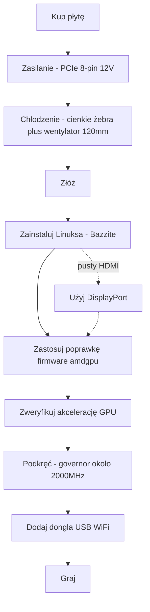

> 🌐 Tłumaczenie społecznościowe. Wersja angielska jest źródłem prawdy i może być nowsza. Znalazłeś błąd? Zgłoś to w [zgłoszeniu (issue)](https://github.com/lildebil0/awesome-bc250/issues). ([oryginał angielski](../en/00-start-here.md))

# Zacznij tutaj — od zera do grania

> **W skrócie** — Kupiłeś (albo właśnie masz kupić) AMD BC-250. To płyta z APU wywodzącym się z PlayStation 5, z 16 GB GDDR6, z której da się zrobić tani linuksowy komputer do grania/AI — **pod warunkiem**, że rozwiążesz trzy rzeczy po kolei: **zasilanie**, **chłodzenie** i **sterowniki Linuksa**. Ta strona to prosta linia od płyty w pudełku do działającej gry. Wykonuj kroki; każdy odsyła do pełnego rozdziału.

Ta płyta to projekt, a nie komputer „podłącz i graj”. Zarezerwuj sobie weekend. Dwa sposoby, w jakie ludzie najszybciej zabijają płytę, to **złe okablowanie zasilania** i **praca w wysokiej temperaturze** — dlatego zajmujemy się nimi w pierwszej kolejności.

---

## Zanim zaczniesz — części i narzędzia

Miej je pod ręką *zanim* zaczniesz, żeby nie odkrywać każdej z nich w trakcie budowy:

- **Zasilacz** z wyjściem PCIe 8-pin 12 V → **[03 — Zasilacz](../en/03-power-supply.md)**
- **Wentylator 120 mm o wysokim ciśnieniu statycznym** + osłona z druku → **[04 — Chłodzenie](../en/04-cooling.md)** / **[05 — Obudowy i druk 3D](../en/05-case.md)**
- **Wydrukowana obudowa lub mocowanie** → **[05 — Obudowy i druk 3D](../en/05-case.md)**
- **Pendrive ≥ 16 GB** dla instalatora Linuksa
- **Kabel DisplayPort** (lub adapter DP→HDMI — wyjście HDMI płyty często nic nie pokazuje, DisplayPort jest najbezpieczniejszy)
- **Śrubokręt**
- **Multimetr** — do sprawdzenia okablowania zasilacza magnesem i na ciągłość → **[03 — Zasilacz](../en/03-power-supply.md)**

---

## Ścieżka



### 0. Wiedz, co masz
BC-250 to blade serwerowy/koparkowy: jedno APU (CPU Zen 2 + GPU klasy RDNA2, „Cyan Skillfish/Oberon”), 16 GB GDDR6, **pasywny radiator**, zasilany pojedynczym **12 V PCIe 8-pin**. Brak WiFi na płycie, brak działającego sterownika GPU dla Windows, brak sprzętowego kodowania wideo. → **[01 — Czym jest BC-250](../en/01-what-is-bc250.md)**

### 1. Kup właściwą rzecz
Wiedz, jaka cena jest uczciwa, co jest w pudełku (sama płyta? radiator? zasilacz?) i których sprzedawców/oszustw unikać. → **[02 — Poradnik zakupowy](../en/02-buying.md)**

### 2. Rozwiąż kwestię zasilania *przed pierwszym uruchomieniem*
Płyta potrzebuje ok. 235 W (więcej po podkręceniu) na 12 V przez PCIe 8-pin. Użyj prawdziwego zasilacza (serwerowy Flex / brick Mean Well / ATX), podłącz 8-pin prawidłowo, używając **prawdziwie miedzianego przewodu o odpowiednim przekroju**, i nie zgaduj pinoutu — błąd w tym miejscu to martwa płyta. → **[03 — Zasilacz](../en/03-power-supply.md)**

### 3. Napraw chłodzenie *zanim ją obciążysz*
Fabryczny radiator jest zaprojektowany pod tunel aerodynamiczny w szafie rack i **dławi się na biurku**. Zeszlifuj żebra i przykręć wentylator 120 mm o wysokim ciśnieniu statycznym przez osłonę z druku (albo postaw na AIO). Cel: pozostaje poniżej ok. 80 °C w Furmarku. → **[04 — Chłodzenie](../en/04-cooling.md)**

### 4. Włóż ją do obudowy (opcjonalnie, ale fajnie)
Wydrukuj obudowę w stylu konsoli, która zamocuje płytę, wentylator i zasilacz z prawdziwym przepływem powietrza. Katalog plików STL od społeczności. → **[05 — Obudowy i druk 3D](../en/05-case.md)**

### 5. Złóż to
Fizyczna kolejność czynności dla minimalnej kompilacji: zamocuj wentylator do osłony z druku → zatrzaśnij/przykręć osłonę nad (zeszlifowanymi) żebrami radiatora → osadź płytę w obudowie/mocowaniu → podłącz 8-pin zasilacza do płyty (prawidłowy pinout, **[03 — Zasilacz](../en/03-power-supply.md)**) → podłącz kabel DisplayPort do monitora → włącz zasilanie i potwierdź, że przechodzi **POST** (POST = test po włączeniu zasilania; płyta włącza się i wyświetla obraz — pojawia się obraz / wentylator się kręci). Wszelkie szlifowanie żeber wykonaj *przed* montażem (zobacz **[04 — Chłodzenie](../en/04-cooling.md)**) i nie dopuść, by metalowy pył dostał się na płytę.

> Opisane zdjęcie/schemat tego montażu to mile widziany wkład — repozytorium jeszcze takiego nie ma.

### 6. Zainstaluj Linuksa + sterowniki GPU
To jest krok decydujący o powodzeniu. Najłatwiejszy dla początkujących: **obraz oparty na Bazzite** zbudowany pod BC-250 (albo **Fedora 43** — drugi wybór elektricM, który „po prostu działa”; Fedora 42 jest po końcu wsparcia). Następnie zastosuj **poprawkę firmware amdgpu** (dowiązanie symboliczne `navi10_gpu_info.bin`) oraz parametry jądra, zregeneruj initramfs/grub i zweryfikuj, że GPU jest akcelerowane (`vainfo`, `dmesg`). → **[06 — Sterowniki i konfiguracja Linuksa](../en/06-linux.md)**

> **Dwa ustawienia, które kosztują godziny męki, jeśli je pominiesz** (elektricM): w zmodyfikowanym BIOS-ie ustaw **VRAM = 512 MB dynamiczny** oraz **wyłącz IOMMU** (zepsute IOMMU powoduje awarie obrazu i zawieszenia), a potem **wyczyść CMOS** po flashowaniu. Instaluj z parametrem rozruchowym `nomodeset` i **usuń go, gdy sterowniki będą już zainstalowane**. Mesa **25.1+** to absolutne minimum (zalecane 25.3.x). I **unikaj jąder 6.15.0–6.15.6 oraz 6.17.8–6.17.10** — psują sterownik GPU; zamiast tego użyj 6.18 LTS / 6.17.11+ / 6.12–6.14 LTS. ([szybki start elektricM](https://elektricm.github.io/amd-bc250-docs/getting-started/quick-start/), [szybki przewodnik](https://elektricm.github.io/amd-bc250-docs/reference/quick-reference/))

> Myślisz o Windows? Według stanu na początek 2026 **nie ma działającego sterownika GPU dla Windows** — jest eksperymentalny. Użyj Linuksa. → **[07 — Windows](../en/07-windows.md)**

### 7. Sprawdź, że działa na ustawieniach fabrycznych, a potem podkręć
Gdy pulpit jest już akcelerowany, zainstaluj **oberon-governor** i podnieś zegary (1500 MHz fabrycznie to mało; **2000 MHz ≈ +30% FPS**). Opcjonalnie odblokuj wszystkie **40 CU** i zrób undervolting. Przetestuj ponownie temperatury przy nowych zegarach. → **[09 — Podkręcanie i undervolting](../en/09-overclock-undervolt.md)**

### 8. Połącz się z siecią
Brak WiFi na płycie — dodaj **sprawdzonego dongla USB** (aic8800d80 to faworyt społeczności) i jego sterownik. → **[10 — WiFi i Bluetooth](../en/10-wifi-bt.md)**

### 9. Graj
Ustaw realistyczne oczekiwania (to często CPU Zen 2 jest ograniczeniem, a nie GPU), włącz FSR i korzystaj z ustawień społeczności pod konkretne gry. → **[11 — Wyniki i ustawienia w grach](../en/11-gaming.md)**

### Bonus — uruchamianie lokalnych LLM
16 GB VRAM to dużo jak na tę cenę. Uruchom llama.cpp na backendzie **Vulkan** (ROCm to ślepa uliczka na tym GPU). → **[12 — AI / LLM](../en/12-ai-llm.md)**

### Bonus — emulacja
Switch, PS3, PS4, retro, automaty — co faktycznie działa i jak → **[15 — Emulacja](../en/15-emulation.md)**

> Brak obrazu przy pierwszym uruchomieniu? Płyta daje obraz przez **DisplayPort** (HDMI często jest pusty) → **[14 — Obraz i wyjście wideo](../en/14-display.md)**. Brakuje portów USB albo dodajesz dysk? → **[16 — USB, huby i pamięć masowa](../en/16-usb-peripherals.md)**

---

## Jeśli coś się zepsuje
Czarny ekran, brak akceleracji, losowe resety, odpadający dongiel, cegła po flashowaniu BIOS — zobacz **[Rozwiązywanie problemów](troubleshooting.md)** oraz **[FAQ](faq.md)**.

> Flashowanie zmodyfikowanego BIOS-u **nie** jest krokiem początkowym. Może zamienić płytę w cegłę i wymaga sprzętu do odzyskiwania. Rób to tylko świadomie. → **[08 — BIOS i ratowanie cegły](../en/08-bios.md)**

---

## Lista kontrolna w 60 sekund

| Krok | Gotowe, gdy |
|------|-----------|
| Zasilanie | Zasilacz podłączony do 8-pin, prawidłowy pinout, prawdziwie miedziany przewód, płyta przechodzi POST |
| Chłodzenie | Żebra zeszlifowane + wentylator/osłona 120 mm; <80 °C w Furmarku |
| System | Bazzite-bc250 zainstalowany, uruchamia się do pulpitu |
| GPU | `vainfo`/`dmesg` pokazują aktywne amdgpu, a nie awaryjne renderowanie na CPU |
| Podkręcanie | oberon-governor działa, ok. 2000 MHz, stabilnie w prawdziwej grze |
| Sieć | Dongiel USB łączy się i utrzymuje połączenie |
| Gra | Działa z oczekiwanym FPS przy twoich zegarach |

Gdy każdy wiersz jest odhaczony, gotowe. Witaj w klubie BC-250.

---

## Szybki przewodnik (ściąga)

Polecenia i ustawienia, po które będziesz sięgać najczęściej, w skrócie z [szybkiego przewodnika](https://elektricm.github.io/amd-bc250-docs/reference/quick-reference/) elektricM. Pełne szczegóły znajdziesz w **[06 — Linux](../en/06-linux.md)** i **[09 — Podkręcanie](../en/09-overclock-undervolt.md)**.

**BIOS:** VRAM `512MB` dynamiczny · IOMMU **Disabled** · rozruch UEFI · czyść CMOS po każdym flashowaniu z USB.

**Sprawdź, że GPU jest akcelerowane (a nie llvmpipe/CPU):**
```bash
glxinfo | grep "OpenGL version"          # oczekiwana Mesa 25.1+
vulkaninfo | grep deviceName             # → AMD Radeon Graphics (RADV GFX1013)
cat /sys/class/drm/card0/device/pp_dpm_sclk   # wiele częstotliwości, bieżąca oznaczona *
```

**Governor** (bez niego zegary tkwią na 1500 MHz). U nas domyślnie `oberon-governor`; elektricM dostarcza nowszy fork SMU przez COPR — oba działają:
```bash
sudo dnf copr enable filippor/bazzite
sudo dnf install cyan-skillfish-governor-smu          # rpm-ostree install … na Bazzite
sudo systemctl enable --now cyan-skillfish-governor-smu.service
systemctl status cyan-skillfish-governor-smu          # → active (running)
```
> Dolny próg napięcia **700 mV** — poniżej niego GPU blokuje się na 1500 MHz. Governor może celować w niewłaściwą kartę (card0 vs card1) — sprawdź to, jeśli skalowanie nie zadziała.

**Usuń `nomodeset` po zainstalowaniu sterowników:**
```bash
# Dystrybucje z GRUB: usuń "nomodeset" z /etc/default/grub, następnie
sudo grub2-mkconfig -o /boot/grub2/grub.cfg && sudo reboot
# Bazzite / Fedora Atomic:
rpm-ostree kargs --delete-if-present="nomodeset" && systemctl reboot
```

**Opcja uruchomieniowa Steam**, która naprawia graficzne glicze w niektórych grach: `RADV_DEBUG=nohiz %command%`.

**Crash w RDR2 / Company of Heroes 3?** Przełącz VRAM z `512MB` dynamicznego na **10GB/6GB stały** (konflikt z ZRAM). ([szybki przewodnik elektricM](https://elektricm.github.io/amd-bc250-docs/reference/quick-reference/))
