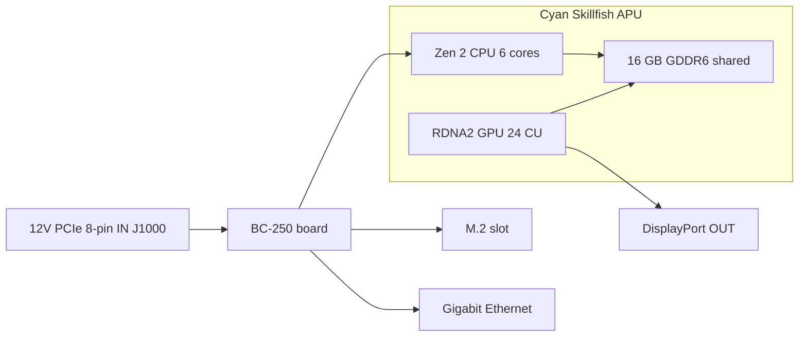

> 🌐 Tłumaczenie społecznościowe. Wersja angielska jest źródłem prawdy i może być nowsza. Znalazłeś błąd? Zgłoś to w [zgłoszeniu (issue)](https://github.com/lildebil0/awesome-bc250/issues). ([oryginał angielski](../en/01-what-is-bc250.md))

# Czym jest BC-250

> **W skrócie** — BC-250 to **APU klasy PlayStation 5 na płycie serwerowej/koparkowej**. Jeden układ (kodowa nazwa AMD **Cyan Skillfish**, okrojona wersja krzemu **Oberon/Ariel** z PS5) niesie **6-rdzeniowy / 12-wątkowy CPU Zen 2** oraz **GPU RDNA 2 z 24 jednostkami obliczeniowymi**, zasilany **16 GB wlutowanej GDDR6**. To **nie karta graficzna ani normalny komputer** — nie ma **znajomego BIOS-u x86, slotu PCIe ani 24-pinowej wtyczki ATX**: bierze **12 V prosto do 8-pinowego złącza zasilania PCIe** i uruchamia własny firmware. Ludzie kupują ją, bo to **strasznie tani komputer do grania na Linuksie / lokalnego AI**. Ludzie się na nią wściekają, bo **sterowniki, chłodzenie i brak sprzętowego kodowania wideo** robią z niej projekt, a nie maszynę „podłącz i graj”. Jeśli chcesz zero kłopotów, ta płyta to zła decyzja — oddaj ją teraz. Jeśli lubisz majsterkowanie, czytaj dalej.

Ta strona to punkt odniesienia „co ja właściwie kupiłem”. Zasilanie, chłodzenie, instalacja systemu i sterowniki mają każde własną sekcję ([03](03-power-supply.md) / [04](04-cooling.md) / [06](06-linux.md)).

---

## Czym to właściwie jest

AMD zbudowało BC-250 jako **akcelerator do kopania kryptowalut** („BC” to skrót od blockchain). Żeby było tanio, AMD ponownie użyło **resztkowego krzemu procesora PlayStation 5** — tej samej rodziny układów, którą Sony wkłada do konsoli. Płyta to jedno APU plus jego pamięć i obwody zasilania; to cały produkt.

Żargon, zdefiniowany raz:

- **APU** (Accelerated Processing Unit) — nazwa AMD dla pojedynczego układu zawierającego **zarazem CPU i GPU**. Nie ma osobnej karty graficznej; GPU jest wewnątrz tej samej obudowy układu i dzieli tę samą pamięć.
- **Cyan Skillfish** — inżynierska **nazwa kodowa** AMD dla tego APU. Zobaczysz ją wszędzie w Linuksie: plik firmware GPU nazywa się dosłownie `cyan_skillfish_gpu_info.bin` ([src](https://t.me/c/2424231195/57962) — zobacz poprawkę symlinku w [src](https://t.me/c/2424231195/41252)). Narzędzia mogą go też raportować pod nazwami matryc PS5 **Oberon** / **Ariel**.
- **GDDR6** — szybka pamięć graficzna spotykana normalnie na karcie graficznej. W BC-250 jest to **jednocześnie pamięć systemowa i pamięć wideo** (CPU i GPU dzielą jedną pulę). Nie ma slotów DIMM; 16 GB jest wlutowane na stałe i niewymienialne.
- **RDNA 2** — generacja architektury GPU (ta sama rodzina co PS5, Xbox Series i karty Radeon RX 6000).

Układ to **okrojona** część z PS5, nie pełna. Społeczność przypięła to porównanie ([src](https://t.me/c/2424231195/11282), z powołaniem na [wpis Oberon w TechPowerUp](https://www.techpowerup.com/gpu-specs/amd-oberon.g936)):

| | BC-250 | Pełne PS5 (Oberon) |
|---|---|---|
| Rdzenie / wątki CPU | **6 / 12** | 8 / 16 |
| Jednostki obliczeniowe GPU (CU) | **24** | 36 |

„Jednostka obliczeniowa” to jeden blok rdzenia GPU; 24 z nich to mniej więcej poziom GPU laptopa ze średniej półki, a to dokładnie ten przedział wydajności, jaki czat raportuje w grach.

BC-250 nie jest jedynym „resztkowym krzemem konsolowym na płycie desktopowej” od AMD. Ma dwóch bliskich kuzynów zbudowanych z tego samego pomysłu: **AMD 4700S Desktop Kit** (zestaw CPU wywodzący się z **PlayStation 5**) — przed którym czat ostrzega, że bywa krzyżowo wystawiany razem z BC-250 na targowiskach ([02-buying.md](02-buying.md)) — oraz **AMD 4800S Desktop Kit**, wersję wywodzącą się z **Xbox Series X** (8 rdzeni Zen 2 podpiętych do GDDR6, z wyłączonym GPU RDNA 2 z konsoli). Oba to prawdziwe produkty AMD, które — jak BC-250 — łączą odzyskany CPU konsolowy z wlutowaną GDDR6 ([VideoCardz](https://videocardz.com/newz/amd-4800s-desktop-kit-a-pc-repurposed-apu-from-xbox-series-x-has-been-tested)). To przydatny kontekst, by odróżnić BC-250 od jego rodzeństwa przy zakupach.

Ludzie uruchamiali **desktopowego Linuksa na BC-250 tak samo, jak samo PS5 zostało zjailbreakowane** — pełny obraz 4K HDMI + dźwięk, wszystkie porty USB działają, APU taktuje się do ~3,2 GHz na CPU i ~2,0 GHz na GPU ([src](https://t.me/c/2424231195/122260)).

---

## W czym jest dobra

- **Najtańsza droga do grania na Linuksie w tym przedziale wydajności.** Przez Steam/Proton (warstwa kompatybilności uruchamiająca gry Windows na Linuksie) ludzie grają w Star Citizen ([src](https://t.me/c/2424231195/38702)), a nawet w nowoczesne tytuły jak *Doom: The Dark Ages* przez społecznościowy wrapper Vulkan w ~60 FPS na niskich/FSR ([src](https://t.me/c/2424231195/127696)). Wyniki per gra znajdziesz w [11-gaming.md](11-gaming.md).
- **Solidny komputer do lokalnego AI.** Z 16 GB GDDR6 pomieści średniej wielkości modele językowe. Członkowie uruchamiają LLM-y lokalnie przez `llama.cpp`/`jan` na backendzie **Vulkan**; najpierw ustawiasz w BIOS-ie przydział 12 GB dla GPU ([src](https://t.me/c/2424231195/92421)). Zobacz [12-ai-llm.md](12-ai-llm.md).
- **Mała i samodzielna.** To pojedyncza długa płyta z wbudowanym radiatorem w stylu GPU — wpada do małych obudów DIY / z druku 3D i działa z jednego małego zasilacza ([build src](https://t.me/c/2424231195/137825)).

Konsensus społeczności co do tego, *dlaczego* to w ogóle działa: ponieważ układ jest tak bliski sprzętowi Steam Deck / PS5, Valve i otwartoźródłowy stos graficzny Mesa ciągle ulepszają dokładnie te same sterowniki, więc BC-250 jedzie na gapę ([src](https://t.me/c/2424231195/93006)).

---

## Co jest bolesne (ustaw sobie oczekiwania)

To ta połowa, którą nowicjusze niedoceniają. Nic z tego nie jest dyskwalifikujące, ale wszystko to realna robota.

- **Sterowniki to robota „zrób to sam”.** AMD nie dostarcza **żadnego oficjalnego sterownika ani publicznej dokumentacji** do tej płyty ([src](https://t.me/c/2424231195/37764)). Wszystko — linuksowy stos graficzny, „governor” taktowań/napięć, BIOS — jest zbudowane przez społeczność. Spodziewaj się podążania za skryptami konfiguracyjnymi i okazjonalnego naprawiania rzeczy ręcznie. Zacznij od [06-linux.md](06-linux.md).
- **Chłodzenie to rzecz #1, którą ludzie robią źle.** Fabryczny radiator zaprojektowano pod tunel wymuszonego nawiewu w szafie koparkowej, więc na biurku przegrzewa się i dławi prosto z pudełka. Będziesz musiał zmodyfikować chłodzenie. To ma własną sekcję — przeczytaj [04-cooling.md](04-cooling.md) **zanim** zaczniesz gonić za wydajnością.
- **Brak sprzętowego enkodera wideo.** Blok kodowania wideo GPU (to, co AMD nazywa **VCN** — dedykowany obwód kompresujący wideo do streamowania/nagrywania) jest **niedostępny**. Nagrywanie ekranu i streaming gier przełączają się na **enkoder programowy**, który obciąża CPU. Działa (ludzie streamują przez Sunshine/Moonlight), ale jest wolniejszy i gorszej jakości niż normalne GPU ([src](https://t.me/c/2424231195/88026)). Podobnie wczesny sterownik Mesa słynął z **renderowania programowego**, dopóki społeczność nie uruchomiła akceleracji sprzętowej ([src](https://t.me/c/2424231195/11243)).
- **Dziwne zasilanie i domyślnie brak obrazu.** Nie przyjmuje standardowego 24-pinowego złącza ATX — zobacz następną sekcję. Wiele płyt dociera też tak, że przed pierwszym przejściem POST wymagają **resetu BIOS** ([src](https://t.me/c/2424231195/57930)), a obraz zwykle wyprowadzasz przez **DisplayPort** (HDMI wymaga adaptera DP→HDMI, który nieść także dźwięk bez problemu — [src](https://t.me/c/2424231195/9148)).
- **To płyta dla majsterkowicza, kropka.** Jak ujął to jeden z długoletnich członków: mimo że tania, BC-250 „wymaga pewnych umiejętności, wysiłku i głowy” ([src](https://t.me/c/2424231195/73002)). Zaplanuj czas, nie tylko pieniądze.
- ⚠ **eGPU jej nie uratuje — zgłaszane przez społeczność (r/BC250Gaming).** Jedyny slot M.2 to tylko **PCIe 2.0 ×2** (zobacz kartę sprzętową niżej), a przy tej przepustowości zewnętrzne GPU podpięte do M.2 **według zgłoszeń działa *gorzej* niż wbudowane GPU RDNA 2** — wolne łącze je dławi. Jeśli chcesz więcej mocy graficznej, konsensus brzmi: to nie jest płyta do tego. *(Zgłaszane przez społeczność; traktuj jako ostrzeżenie, nie benchmark.)*

> ⚠ **Co oznacza dwukolorowa dioda LED — zgłaszane przez społeczność (r/BC250Gaming).** Dwukolorowa dioda obok karty sieciowej to **wskaźnik wykorzystania z czasów kopania, a nie lampka błędu**: według relacji społeczności **czerwony = GPU/RAM *nie* jest w 100 % wykorzystania, zielony = pełne wykorzystanie**. Więc czerwone światło na bezczynnej płycie biurkowej jest normalne, nie jest usterką. *(Zgłaszane przez społeczność; AMD nie dostarcza dokumentacji do tej płyty, więc traktuj dokładne przyporządkowanie kolorów jako niepotwierdzone.)*

> ⚠ **Ostrzeżenie dot. obchodzenia się z płytą, wyniesione z bolesnego doświadczenia.** **Nie** pozwól, by cokolwiek metalicznego dotknęło zasilanej płyty, i zawsze wymieniaj pastę termoprzewodzącą z rozwagą — pewien członek nieodwracalnie zabił swoje BC-250, zwierając je ([src](https://t.me/c/2424231195/95998)). Płyty docierają też lekko **wygięte** od mocowania radiatora; jeden członek naprawił brak rozruchu, podkładając papier, by wyprostować płytę na płasko względem radiatora ([src](https://t.me/c/2424231195/117347)).

---

## Karta referencyjna sprzętu

Specyfikacje są zweryfikowane krzyżowo ze społecznościową inżynierią wsteczną sprzętu (AMD nie publikuje karty katalogowej). Dane o magistrali pamięci i wymiarach fizycznych, wcześniej niepotwierdzone, pochodzą teraz ze [specyfikacji sprzętu elektricM](https://github.com/elektricm/elektricm) (która oddaje uznanie mothenjoyer69 / Segfault / neggles / yeyus za inżynierię wsteczną). Pinout i dane o zasilaniu poniżej pochodzą z kanonicznego społecznościowego dokumentu sprzętowego.

Płyta w skrócie — zasilanie po lewej, APU i jego współdzielona pamięć pośrodku, I/O po prawej:



### Specyfikacja podstawowa

| Specyfikacja | Wartość | Źródło |
|------|-------|--------|
| Klasa | APU wywodzące się z PlayStation 5 na płycie koparkowej/serwerowej | [hardware.md](https://github.com/mothenjoyer69/bc250-documentation/blob/main/hardware.md) |
| Nazwa kodowa APU | **Cyan Skillfish** (matryca PS5: Oberon / Ariel) | czat ([src](https://t.me/c/2424231195/57962)) |
| CPU | **6 rdzeni / 12 wątków, Zen 2** (6 rdzeni potwierdzone) | [hardware.md](https://github.com/mothenjoyer69/bc250-documentation) · czat ([src](https://t.me/c/2424231195/11282)) |
| Taktowanie CPU | do **~3,49 GHz** („mniej więcej”) | [hardware.md](https://github.com/mothenjoyer69/bc250-documentation) · czat ([src](https://t.me/c/2424231195/122260)) |
| GPU | **24 jednostki obliczeniowe, RDNA 2** (`gfx1013`; SoC PS5 ma 36); rasteryzacja ≈ **między RX 6600 a RX 6600 XT** / klasa GTX 1660 Ti; **Vulkan 1.4** | [hardware.md](https://github.com/mothenjoyer69/bc250-documentation) · czat ([src](https://t.me/c/2424231195/11282)) · [elektricM](https://github.com/elektricm/elektricm) |
| Taktowanie GPU | ~1500 MHz fabrycznie, ~2000 MHz po podkręceniu (≈2,23 GHz maks.) | ([src](https://t.me/c/2424231195/122260)) · [09](09-overclock-undervolt.md) |
| Pamięć | **16 GB GDDR6**, współdzielona między CPU a GPU, wlutowana (niewymienialna) | [hardware.md](https://github.com/mothenjoyer69/bc250-documentation) · [README](../../README.md) |
| Przydział VRAM dla GPU | ustawiany w BIOS-ie; **12 GB** do wyboru na BIOS 3.00+ | ([src](https://t.me/c/2424231195/92421)) |
| Magistrala / przepustowość pamięci | **256-bit** GDDR6 @ **14 Gbps**, **~448 GB/s** | [specyfikacja sprzętu elektricM](https://github.com/elektricm/elektricm) |
| TDP | **220 W** (moc projektowa termiczna płyty) | [hardware.md](https://github.com/mothenjoyer69/bc250-documentation) |
| Pobór mocy | ~67–85 W typowo pod obciążeniem klasy koparkowej | [hashrate.no](https://www.hashrate.no/gpus/bc250) |
| Sprzętowe kodowanie wideo (VCN) | **Brak** — tylko kodowanie programowe | ([src](https://t.me/c/2424231195/88026)) |
| Wyjście wideo | **DisplayPort 1.4** (do **4K@120 / 8K@60**); do HDMI użyj adaptera DP→HDMI; niesie dźwięk | ([src](https://t.me/c/2424231195/9148)) · [elektricM](https://github.com/elektricm/elektricm) |
| Magazyn (M.2) | 1× M.2 2280 — **PCIe 2.0 x2 lub SATA III** | [elektricM](https://github.com/elektricm/elektricm) |
| Drugi DisplayPort | obecny, ale **nieobsadzony**; można aktywować programowo | ([src](https://t.me/c/2424231195/88026)) |
| Rozmiar fizyczny | **340 mm / 310 mm** długości (zależnie od metody pomiaru), **~115 mm** szerokości, **~400 g** z radiatorem; niestandardowy koparkowy format | [specyfikacja sprzętu elektricM](https://github.com/elektricm/elektricm) |

> ⚠ **Podkręcenie GDDR6 = przepustowość, nie FPS — zgłaszane przez społeczność (r/BC250Gaming).** Według relacji społeczności podkręcanie GDDR6 podnosi przepustowość pamięci z mniej więcej **~256 GB/s do ~445 GB/s**, a mimo to nie daje **żadnego zysku w grach** — wąskim gardłem są 24 CU GPU, a nie przepustowość pamięci, więc dodatkowa przepustowość leży w grach niewykorzystana. (Zauważ, że zweryfikowana w repo wartość *fabryczna* powyżej to już **~448 GB/s** przy 256-bit / 14 Gbps, więc społecznościowa „bazowa ~256 GB/s” nie zgadza się z arkuszem specyfikacji — traktuj dokładne liczby GB/s jako niepotwierdzone; trwały wniosek to to, że nie zyskujesz FPS.) Ogólnie o podkręcaniu GPU/pamięci zobacz [09-overclock-undervolt.md](09-overclock-undervolt.md).

> **O wymiarach płyty:** [specyfikacja sprzętu elektricM](https://github.com/elektricm/elektricm) podaje **340 mm / 310 mm** długości (dwie liczby odzwierciedlają różne metody pomiaru), **~115 mm** szerokości i **~400 g** z radiatorem, na niestandardowym koparkowym formacie. Sam kanoniczny `hardware.md` nie podaje wymiarów; najczęściej reagowany w czacie post sprzętowy nosi dosłownie tytuł *„Размеры amd bc-250”* („wymiary AMD BC-250”, ❤20 — [src](https://t.me/c/2424231195/379)), co potwierdza, że ludziom zależy na tym przy budowie obudowy. Do dokładnego dopasowania obudowy pracuj ze zmierzonego modelu 3D — skatalogowane przez społeczność modele STL płyty (np. `BC250 Board.stl`, [Printables 1103626](https://www.printables.com/model/1103626-amd-bc250-board) oraz dokładny model w [Printables 1341336](https://www.printables.com/model/1341336-accurate-3d-model-of-the-amd-bc-250-board)) są wymiarowo poprawne. Zobacz [05-case.md](05-case.md).

<p align="center">
  <br>
  <sub>Zdjęcie: społeczność AMD BC-250 · <a href="https://t.me/c/2424231195/379">źródło</a></sub>
</p>

### Pinout złącza zasilania (przeczytaj to, zanim cokolwiek podłączysz)

BC-250 **nie ma 24-pinowego nagłówka ATX**. Jest zasilane **tylko 12 V**, dostarczanym przez **8-pinowe złącze zasilania PCIe (J1000)** — tę samą fizyczną wtyczkę co u karty graficznej, ale płyta oczekuje wszystkich trzech styków zasilania podanych z 12 V. Pełne okablowanie i wybór zasilacza są w [03-power-supply.md](03-power-supply.md); kanoniczny pinout z [hardware.md](https://github.com/mothenjoyer69/bc250-documentation/blob/main/hardware.md):

**J1000 — główne 8-pinowe zasilanie PCIe (to jest to, które podłączasz):**

```
[ GND  GND  GND  GND ]
[ GND  12V  12V  12V ]
```

- Trzy styki 12 V; dokument podaje, że styki Mini-Fit Jr są na **do 9 A każdy**, więc to złącze „może bezpiecznie dostarczyć do **324 W**” i zaleca przewód **16 AWG** do użytku samodzielnego ([hardware.md](https://github.com/mothenjoyer69/bc250-documentation)).
- **GND = masa (0 V), 12V = +12 woltów.** Zachowaj poprawną polaryzację — ta płyta nie wybacza odwrotnego napięcia.

**J2000 / J2001 — złącza zasilania szafy (zwykle NIE używane na biurku):**

```
        J2000                  J2001
 [ LED1  12V  12V  12V ]   [ 12V  12V  12V  PGD ]
 [ LED2  GND  GND  GND ]   [ GND  GND  GND  GND ]
```

- To są złącza **Molex Micro-Fit BMI** ([część 444280801](https://www.molex.com/en-us/products/part-detail/444280801)), a *nie* wtyczki PCIe/EPS — zasilały płytę wewnątrz jej oryginalnej szafy koparkowej. **J2000 i J2001 nie są identyczne:** jak pokazuje pinout powyżej, J2000 niesie piny **LED1/LED2**, a J2001 niesie pin **PGD**, więc oba złącza się różnią ([dokumenty sprzętowe elektricM / mothenjoyer69](https://github.com/mothenjoyer69/bc250-documentation)).
- **PGD** (na J2001) to pin power-good/sense: widzi **5 V, gdy płyta jest osadzona w PSU2 szafy**. W budowie samodzielnej zwykle zasilasz przez J1000 i możesz ignorować J2000/J2001 — ale potwierdź względem [03-power-supply.md](03-power-supply.md) dla swojego konkretnego adaptera zasilacza.

---

## Dokąd dalej

1. **[02-buying.md](02-buying.md)** — jeśli jeszcze nie kupiłeś albo chcesz wiedzieć, jaka jest uczciwa cena i prawdziwe ryzyka.
2. **[03-power-supply.md](03-power-supply.md)** — jak ją faktycznie zasilić (12 V do 8-pina).
3. **[04-cooling.md](04-cooling.md)** — zrób to **przed** czymkolwiek innym, gdy już masz płytę w ręku.
4. **[06-linux.md](06-linux.md)** — wgraj system i sterowniki społecznościowe.

---

## Źródła

- Kanoniczny dokument sprzętowy i pinout — [mothenjoyer69/bc250-documentation `hardware.md`](https://github.com/mothenjoyer69/bc250-documentation/blob/main/hardware.md)
- Magistrala/przepustowość pamięci, wymiary fizyczne, pozycjonowanie GPU, DP 1.4, M.2 — [specyfikacja sprzętu elektricM](https://github.com/elektricm/elektricm) (oddaje uznanie mothenjoyer69 / Segfault / neggles / yeyus za inżynierię wsteczną)
- Okrojony vs pełny krzem PS5 (6/12 + 24 CU vs 8/16 + 36 CU) — https://t.me/c/2424231195/11282 · [TechPowerUp Oberon](https://www.techpowerup.com/gpu-specs/amd-oberon.g936)
- Linux-na-sprzęcie-PS5, 4K HDMI, taktowania — https://t.me/c/2424231195/122260
- Brak oficjalnego sterownika / brak dokumentacji — https://t.me/c/2424231195/37764
- Renderowanie programowe / brak sprzętowego kodowania — https://t.me/c/2424231195/11243 · https://t.me/c/2424231195/88026
- DisplayPort + dźwięk DP→HDMI — https://t.me/c/2424231195/9148
- Nazwa firmware Cyan Skillfish — https://t.me/c/2424231195/57962 · https://t.me/c/2424231195/41252
- Lokalny LLM + 12 GB VRAM przez BIOS 3.00 — https://t.me/c/2424231195/92421
- „Wymaga umiejętności, wysiłku i głowy” — https://t.me/c/2424231195/73002
- Ostrzeżenie dot. obchodzenia się / zwarcia — https://t.me/c/2424231195/95998 · naprawa wygiętej płyty — https://t.me/c/2424231195/117347
- „Wymiary BC-250” (najczęściej reagowany post sprzętowy) — https://t.me/c/2424231195/379
- 220 W TDP, CPU 6-rdzeni/3,49 GHz, GPU 24-CU, 16 GB GDDR6 (potwierdzenie z repo) — [mothenjoyer69/bc250-documentation README](https://github.com/mothenjoyer69/bc250-documentation)
- Dane o poborze mocy klasy koparkowej — https://www.hashrate.no/gpus/bc250
- Dlaczego to ciągle działa (współdzielony wysiłek nad sterownikami Steam Deck/PS5) — https://t.me/c/2424231195/93006
- Zestawy-rodzeństwo — AMD 4700S (zestaw CPU z PS5, krzyżowo wystawiany razem z BC-250, [02-buying.md](02-buying.md)) i AMD 4800S (CPU z Xbox Series X + GDDR6, GPU wyłączone) — [VideoCardz: 4800S Desktop Kit](https://videocardz.com/newz/amd-4800s-desktop-kit-a-pc-repurposed-apu-from-xbox-series-x-has-been-tested)
- eGPU-przez-M.2 wolniejsze niż wbudowane GPU (M.2 to PCIe 2.0 ×2), dwukolorowa dioda NIC = sygnał wykorzystania (czerwony = nie 100 % wykorzystania, zielony = pełne wykorzystanie), podkręcenie GDDR6 podnosi przepustowość (~256→~445 GB/s) bez zysku w grach — zgłaszane przez społeczność (r/BC250Gaming)

> AMD nie publikuje pierwotnej karty katalogowej do tej płyty; wartości powyżej to najlepsza społecznościowa inżynieria wsteczna (kanoniczny `hardware.md` plus specyfikacja sprzętu elektricM). Poprawki mile widziane przez PR (zobacz [CONTRIBUTING.md](../../CONTRIBUTING.md)).
