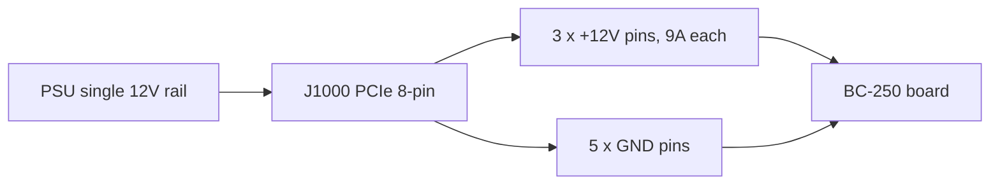

> 🌐 Tłumaczenie społecznościowe. Wersja angielska jest źródłem prawdy i może być nowsza. Znalazłeś błąd? Zgłoś to w [zgłoszeniu (issue)](https://github.com/lildebil0/awesome-bc250/issues). ([oryginał angielski](../en/03-power-supply.md))

# Zasilacz

> **W skrócie** — BC-250 **nie ma przycisku zasilania ani standardowej wtyczki zasilania PC**. Pożera **12 V** przez pojedyncze złącze **PCIe 8-pin (6+2)** — tę samą wtyczkę, jakiej używa desktopowa karta graficzna — i osiąga szczyt około **~235 W** (więcej, gdy podkręcasz). Potrzebujesz źródła 12 V zdolnego dostarczyć **~250–300 W na jednej szynie**. Trzy drogi, które bierze społeczność: tani **serwerowy zasilacz „Flex”** (HP 500 W, ~$12 na eBay), **przemysłowy brick** (Mean Well LOP-300/LOP-500) albo **normalny zasilacz ATX** (po prostu wepnij jego kabel PCIe). Dwa zabójcy, których trzeba unikać: **stary zasilacz dzielący 12 V na słabe szyny** oraz **fałszywe przewody miedziowane na stali**, które się przegrzewają i zajmują ogniem. Używaj prawdziwej miedzi, **16 AWG lub grubszej**.

Zasilenie płyty to **druga rzecz, którą nowicjusz musi zrobić dobrze** (po [chłodzeniu](04-cooling.md)) — i ta, która najprędzej zacznie pożar, jeśli pójdziesz na skróty w okablowaniu.

---

## Czego płyta faktycznie potrzebuje

BC-250 to okrojona matryca PlayStation 5 na płycie koparkowej/serwerowej. Miała siedzieć w szafie i być zasilana 12 V — więc **nie ma żadnej z wygód normalnego komputera**:

- **Brak 24-pinowego** złącza ATX płyty głównej.
- **Brak przycisku zasilania** — włącza się w momencie, gdy pojawi się 12 V (wyłącznik samego zasilacza jest twoim przyciskiem zasilania).
- **Jedno zadanie dla zasilacza: dostarczyć 12 V przy wystarczającym prądzie.**

**Dane o zasilaniu (potwierdzone):**

| Specyfikacja | Wartość | Źródło |
|------|-------|--------|
| Napięcie wejściowe | 12 V DC | [hardware.md](https://github.com/mothenjoyer69/bc250-documentation/blob/main/hardware.md) |
| Typowy pobór szczytowy | ~220–235 W | obserwowane przez społeczność ([src](https://t.me/c/2424231195/31076)) |
| Złącze | PCIe 8-pin (6+2) | [hardware.md](https://github.com/mothenjoyer69/bc250-documentation/blob/main/hardware.md) · ([src](https://t.me/c/2424231195/14450)) |
| Prąd szczytowy na 12 V | ~18–20 A typowo, zapas projektowy do ~40 A | ([src](https://t.me/c/2424231195/31076)) |

> **„PCIe 8-pin (6+2)”** oznacza wtyczkę zasilania karty graficznej: sześć pinów w bloku, plus odpinany 2-pinowy zatrzask, więc ten sam kabel działa jako 6-pin albo 8-pin. **6+2** = 6 stałych + 2 wyjmowalne. To *nie* jest 8-pin CPU/EPS z twojej płyty głównej — zobacz ostrzeżenie niżej.

PCIe 8-pin jest według standardu PCIe na **150 W**, a trzy styki 12 V płyty (Molex Mini-Fit Jr, po 9 A) mogą bezpiecznie przepuścić **do ~324 W** ([hardware.md](https://github.com/mothenjoyer69/bc250-documentation/blob/main/hardware.md)). Więc pojedynczy 8-pin spokojnie wystarcza na fabrycznych ustawieniach; zapas ma znaczenie dopiero, gdy wciskasz agresywne podkręcenie.

**Ile mocy zasilacza kupić:** celuj w **300 W lub więcej na szynie 12 V**. Jednostka 300 W daje zdrowy margines nad szczytem ~235 W i utrzymuje wentylator zasilacza w spokoju; ludzie zgłaszają, że serwerowy zasilacz Flex 500 W chodzi niemal bezgłośnie przy tym obciążeniu ([src](https://t.me/c/2424231195/31076)). Nie kupuj poniżej ~250 W „żeby zaoszczędzić” — będziesz go pchać na granicy, a on zrobi się głośny albo się wyłączy.

> **Krzywa mocy z miernika cęgowego (amperaż z pierwszej ręki).** Teardown zacisnął amperomierz DC na zasilaniu 12 V i odczytał faktyczny prąd płyty: **granie ciągnie ≈17 A / ~190 W**, podczas gdy **pełne syntetyczne obciążenie stresowe sięga ≈21 A / ~240–250 W** przy **2000 MHz / 960 mV**; podbicie napięcia wyżej pcha to do **22–23 A i dalej** ([Old Lamer — Part VII](https://youtu.be/pxahl9-YgkY) ~9:01). To wyostrza społecznościowe liczby mocy z gniazdka powyżej zmierzonym amperażem szyny — i potwierdza, dlaczego cel 300 W zostawia właściwy margines. *(Liczby odczytane z auto-napisów — traktuj dokładne wartości jako przybliżone.)*

> ⚠️ **Wymienione z nazwy zasilacze, których należy unikać:** tani **Dell D220P-01** (220 W) i **Dell D250AD-00** (250 W) są wskazywane jako **niewystarczające i niebezpieczne** dla tej płyty — przy 220 W / 250 W siedzą poniżej szczytu płyty i zgłaszano, że się wyłączają lub wręcz psują pod obciążeniem grania. Nie kupuj jednostki tylko dlatego, że jest tania i „wygląda na wystarczającą”. ([elektricM: power](https://elektricm.github.io/amd-bc250-docs/hardware/power/))

---

## Fizyka: wolty, ampery, waty — i dlaczego cienki przewód się pali

Każda reguła w tym rozdziale wynika z trzech równań. Naucz się ich, a tabele przekrojów i ostrzeżenia „nigdy nie używaj SATA” przestają być arbitralne.

**Moc = wolty × ampery (`P = U·I`).** Płyta potrzebuje **~235 W** przy **12 V**, więc ciągnie `235 ÷ 12 ≈ 19,6 A`. Dokładnie dlatego miernik cęgowy odczytuje **~17 A przy graniu / ~21 A przy stresie** ([powyżej](#czego-płyta-faktycznie-potrzebuje)): moc jest ustalona przez krzem, więc *amperaż* to to, co wymusza 12 V. Podbij taktowanie/napięcie, a ampery rosną razem z watami.

**Dlaczego 12 V — i dlaczego 24 V ją zabija.** 12 V to standard szafy serwerowej, pod który zbudowano płytę; jej wbudowane VRM-y schodzą z tego do ~1 V, na którym działa rdzeń APU. Płyta jest **na sztywno okablowana na 12 V bez ochrony przed przepięciem**, więc podanie jej 24 V (np. [LOP-300-**24**](#opcja-b--przemysłowy-brick-mean-well)) kładzie podwójne napięcie na każdą część przewidzianą na 12 V i niszczy ją natychmiast. W przeciwieństwie do amperażu, napięcie nie podlega negocjacji.

**Obciążalność prądowa — dlaczego przewód ma limit amperów.** Przewód jest rezystorem, a prąd przez rezystancję wytwarza ciepło: `P_loss = I²·R`. Grubsza miedź = większy przekrój = **niższe R** = mniej ciepła przy tym samym amperażu. To cała istota tabeli AWG powyżej — **niższy numer AWG = grubszy przewód = bezpieczny przy większym amperażu**. Przy ~20 A **miedź 16 AWG** pozostaje chłodna; cieńsza — i `I²·R` topi izolację. Zwróć uwagę na **kwadrat**: podwojenie prądu *czterokrotnie* zwiększa ciepło, dlatego ciężkie podkręcenie potrzebuje drugiego zasilania, a nie „trochę więcej przewodu”.

**Spadek napięcia — druga połowa.** Ciepło stracone w przewodzie to napięcie, którego płyta nigdy nie zobaczy: `V_drop = I·R`. Długi, cienki kabel zarazem **przegrzewa się** i **głodzi** płytę, więc może ona spadać napięciowo pod obciążeniem, nawet gdy nic widocznie się nie topi. Krótka, gruba miedź naprawia oba problemy naraz.

**Dlaczego fałszywa „miedź” jest zabójcza.** Miedziowana stal ma **~6× rezystancji** prawdziwej miedzi — ten sam amperaż, ten sam `I²·R`, więc **6× ciepła** w tym samym przewodzie. Test magnesem poniżej to nie kwestia preferencji jakościowej; łapie on **6× mnożnik na członie, który w prądzie jest już podniesiony do kwadratu**.

**Dlaczego nigdy SATA ani Molex.** Chodzi o *złącze*, nie o przewód. Styk zasilania SATA jest na **~54 W** → `54 ÷ 12 ≈ 4,5 A`, zanim mały styk się ugotuje; płyta chce ~20 A, **4× ponad** ten limit. PCIe 8-pin zamiast tego niesie trzy grube styki 12 V (**po 9 A = 27 A / 324 W**) — i *dlatego* jest poprawną wtyczką, a SATA/Molex nigdy nie może nią być (zobacz [pinout](#pinout-8-pinowy-j1000)).

---

## ⚠️ Dwa błędy, które niszczą płyty

Przeczytaj tę sekcję, zanim cokolwiek kupisz.

### 1. Nie myl PCIe 8-pin z CPU/EPS 8-pin

Twój zasilacz ATX ma **dwie różne wtyczki 8-pin**: jedną dla kart graficznych (**PCIe**) i jedną dla CPU (**EPS/CPU**, czasem opisaną „CPU” lub „4+4”). **Wyglądają niemal identycznie, ale kształty pinów i polaryzacja są odwrócone.** Wciśnięcie wtyczki CPU do BC-250 kładzie **+12 V tam, gdzie powinna być masa** — możesz spalić całą płytę.

> *„Omawiano to miliard razy — mamy wejście zasilania PCIe. Jeśli kształt skrajnego pinu jest inny, masz wtyczkę CPU… ma dosłownie odwrotną polaryzację, plus tam, gdzie powinien być minus. Możesz spalić wszystko do diabła.”* ([src](https://t.me/c/2424231195/14450))

Płyta **nie ma sprawdzania pinu sense**, więc nic cię nie powstrzyma przed wpięciem złej rzeczy. Bezpieczny nawyk: **patrz na kształt zatrzasku złącza, a jeśli nie masz pewności, sprawdź + i − multimetrem przed włączeniem.**

### 2. Nie używaj fałszywego przewodu „miedzianego” — to zagrożenie pożarowe

To najczęściej powtarzane ostrzeżenie bezpieczeństwa w czacie. Tanie gotowe kable adapterów i przeceniane kable „PCIe” są często **miedziowane na stali (CCS)** albo **miedziowane na aluminium (CCA)** — cienka miedziana powłoka na stalowym/aluminiowym rdzeniu. Stal ma **~6× rezystancji miedzi**, więc przewód przegrzewa się pod obciążeniem i może się stopić lub zapalić.

> *„Przewód z adaptera mocno się przegrzał pod obciążeniem. Okazało się, że to nie miedź, tylko żelazo (stal) z cienką miedzianą powłoką… wysoka rezystancja, mocno się grzeje, może wywołać pożar. Dla niezawodnej i bezpiecznej pracy MUSISZ używać pełnomiedzianych przewodów o przekroju co najmniej 2,5 mm².”* ([src](https://t.me/c/2424231195/108733))

> *„Sprawdziłem to magnesem 🤣 — stalowe żyłki. Rezystancja tych stalowych »żyłek« jest 6× wyższa niż miedzi. O jakich 450 W oni w ogóle mówią?”* ([src](https://t.me/c/2424231195/133546))

**Testuj, zanim zaufasz:** magnes przykleja się do stali, nie do miedzi. Jeśli złącze albo przewód są magnetyczne, wyrzuć kabel.

To nie tylko kabel no-name. **Zasilacze Apevia Flex/ITX widywano ze stalowymi przewodami** — przetestuj je magnesem, bo stal mocno się grzeje pod obciążeniem i jest zagrożeniem pożarowym. **Apevia ITX-PFC400W** Mini-ITX używa **złącza 14-pinowego** (działa z [adapterem LITE](#automatyczny-ps_on--adapter-społecznościowy) poniżej, ale jest odradzany). (r/BC250Gaming)

> 🔴 **Nigdy nie zasilaj BC-250 przez adapter SATA ani Molex.** Płyta ciągnie **220–280 W**, a te złącza fizycznie nie potrafią tego bezpiecznie dostarczyć:
> - **Adapter SATA→PCIe/8-pin to zagrożenie pożarowe** — złącze zasilania SATA jest tylko na **~54 W** ([elektricM: power](https://elektricm.github.io/amd-bc250-docs/hardware/power/)).
> - **Samo zasilanie z Molex osiąga maks. ~156 W** łącznie (dwa złącza Molex) — wciąż za mało ([elektricM: power](https://elektricm.github.io/amd-bc250-docs/hardware/power/)).
>
> Zasilaj płytę wyłącznie z **prawdziwego źródła 12 V klasy PCIe 8-pin / EPS**. To osobna sprawa od ostrzeżenia miedź-vs-stal powyżej: nawet *pełnomiedziany* adapter SATA lub Molex jest tu niebezpieczny, bo samo złącze jest niedowymiarowane dla obciążenia 220–280 W.

---

## Wskazówki co do przekroju przewodu i złącza

Dokumentacja płyty i czat zgadzają się na ten sam bezpieczny punkt wyjścia:

| Przypadek użycia | Przewód | Źródło |
|----------|------|--------|
| Pojedynczy 8-pin, fabrycznie / lekkie OC | miedź **16 AWG** (~1,3 mm²) | [hardware.md](https://github.com/mothenjoyer69/bc250-documentation/blob/main/hardware.md) |
| Kabel robiony ręcznie, chcesz margines | pełna miedź **2,5 mm²** (~13 AWG) | ([src](https://t.me/c/2424231195/108733)) |
| Ciężkie podkręcenie | grubszy / **podwójne zasilanie** (zobacz J2000/J2001) | [hardware.md](https://github.com/mothenjoyer69/bc250-documentation/blob/main/hardware.md) |

Liczby się nie kłócą — **16 AWG to udokumentowane minimum**; wartość 2,5 mm² to jeden budowniczy wybierający dodatkowy zapas po przestrachu z przewodem CCS. **Nienegocjowalna część to „prawdziwa miedź”, a nie dokładny przekrój.** Niższy numer AWG = grubszy przewód = bezpieczniejszy.

Dla styków złącza niosących pełny prąd celuj w te przewidziane na szczyt: budowniczy mierzą w styki/przewód dobre na **~40 A** przy ciężkim buildzie i przykręcają je lub porządnie zaciskają, zamiast polegać na wątłym wciskanym kontakcie ([src](https://t.me/c/2424231195/31076)).

---

## Pinout 8-pinowy (J1000)

Patrząc na główne złącze zasilania płyty — **górny rząd to cała masa, dolny rząd to 12 V z wyjątkiem jednej masy**. Z [hardware.md](https://github.com/mothenjoyer69/bc250-documentation/blob/main/hardware.md):

```
J1000 (PCIe 8-pin), contacts facing you:

  [ GND  GND  GND  GND ]   ← top row: all ground (−)
  [ GND  12V  12V  12V ]   ← bottom row: one ground + three 12 V (+)
```

Czat podaje tę samą polaryzację wprost — policz piny **1 do 3 = +12 V, piny 4 do 8 = masa**:

> *„Piny od pierwszego do trzeciego powinny być +, reszta od czwartego do ósmego to minus… Płyta nie ma sprawdzania sense. Weź tester i zobacz, gdzie jest + a gdzie −.”* ([src](https://t.me/c/2424231195/14450))

Jak pojedyncza szyna 12 V dzieli się na osiem styków — trzy niosą +12 V, pięć to masa:



To pasuje dokładnie do standardowego PCIe 8-pin, i *dlatego* kabel PCIe normalnego zasilacza ATX po prostu działa. **Jeśli budujesz własny kabel, zweryfikuj każdy pin multimetrem przed pierwszym włączeniem** — błędy polaryzacji są tu bezlitosne.

Płyta ma też dwa mniejsze alternatywne złącza zasilania, **J2000** i **J2001** — przydatne tylko przy ciężkim podkręceniu i omówione w pełni niżej.

---

## Powyżej 300 W — drugie złącze zasilania J2000 / J2001

> ⚠️ **Przeczytaj to najpierw.** Wszystko w tej sekcji to **dodatkowe okablowanie 12 V robione ręcznie**. Płyta **nie ma sprawdzania polaryzacji ani sense** na tych pinach (tak jak J1000) — zamień +12 V i masę, a spalisz płytę w momencie włączenia. Drugie zasilanie dodaje zapas tylko, gdy **oba zasilania dzielą ten sam zasilacz / tę samą szynę 12 V o tym samym potencjale**; połączenie dwóch różnych źródeł może wpychać prąd wstecz przez jedno z nich. Jeśli nie czujesz się pewnie z zaciskaniem i mierzeniem własnych złączy, zatrzymaj się tutaj i zostań przy pojedynczym [8-pinie J1000](#pinout-8-pinowy-j1000).

Pojedynczy PCIe 8-pin do [J1000](#pinout-8-pinowy-j1000) jest komfortowy na fabrycznych i lekkim OC — jego trzy styki 12 V są dobre na **~324 W** (9 A × 3 × 12 V, lub do ~468 W ze stykami klasy przemysłowej) ([hardware.md](https://github.com/mothenjoyer69/bc250-documentation/blob/main/hardware.md)). Powód, dla którego ta sekcja istnieje: **płyta 40-CU na agresywnym podkręceniu może ciągnąć ponad 300 W** ([src](https://t.me/c/2424231195/143787)), co jest dokładnie na granicy strefy komfortu jednego 8-pina. Płytę zaprojektowano pod szafę, gdzie **drugi zasilacz** zasila dwa dodatkowe złącza — **J2000** i **J2001** — więc czystym sposobem na zapas do desktopowego OC jest **uzupełnienie J1000 o J2000/J2001** (albo lutowanie prosto do płyty), zamiast przeciążać jedną wtyczkę ([hardware.md](https://github.com/mothenjoyer69/bc250-documentation/blob/main/hardware.md)). To także najczęściej proszony diagram w czacie ([src](https://t.me/c/2424231195/135741)).

### Pinout (z dokumentacji płyty)

J2000 i J2001 **nie są identyczne**. Są kompatybilne z **Molex Micro-Fit BMI** ([część 444280801](https://www.molex.com/en-us/products/part-detail/444280801)). Pin 1 to biały trójkąt sitodruku (`v` poniżej):

```
        J2000                    J2001
   v                        v
[ LED1  12V  12V  12V ]   [ 12V  12V  12V  PGD ]
[ LED2  GND  GND  GND ]   [ GND  GND  GND  GND ]
```

| Pin | Znaczenie |
|-----|---------|
| `12V` | wejście zasilania +12 V (trzy na złącze) |
| `GND` | Masa |
| `PGD` | **PGOOD** — odczytuje 5 V, gdy drugi zasilacz jest obecny w backplane szafy; pin sygnałowy, **a nie** wyjście zasilania |
| `LED1` / `LED2` | wyjścia LED aktywne stanem niskim, lustrzane do zielonej / czerwonej diody backplane |

**Dla redundancji dokumentacja każe użyć obu J2000 i J2001** ([hardware.md](https://github.com/mothenjoyer69/bc250-documentation/blob/main/hardware.md#j2000-and-j2001)). Zwróć uwagę, że **układ kolumn różni się** między oboma — na J2000 piny LED siedzą w pierwszej kolumnie, a wszystkie trzy piny 12 V są w górnym rzędzie; na J2001 pin PGD siedzi w prawym-górnym rogu, a dolny rząd to cała masa. **Zmierz każdy pin przed podłączeniem** — nie zakładaj, że obudowa Micro-Fit osadza się tak samo na obu. ⚠ zweryfikuj dokładną orientację pinu 1 względem własnej płyty multimetrem; piny LED/PGD **nigdy** nie mogą otrzymać 12 V.

### Praktyczna metoda, której używa społeczność

Nie potrzebujesz backplane szafy. Powtarzany przepis z czatu to po prostu: **poprowadź jeden PCIe 8-pin do J1000, potem zaciśnij wtyczkę Molex Micro-Fit 3.0 i podaj te same 12 V do sąsiedniego J2000** ([src](https://t.me/c/2424231195/142662), [src](https://t.me/c/2424231195/138371)). Jeden budowniczy opisuje dokładny kabel jako *„jedno złącze PCIe i dwa złącza Micro-Fit 3p”* z jednego źródła ([src](https://t.me/c/2424231195/143938)) — czyli rozdziel 12 V/GND z jednego kabla PCIe na oba: 8-pin i zasilanie Micro-Fit.

**Złącze do kupienia** (samodzielnie składane, Molex Micro-Fit 3.0):

| Część | Numer Molex | Uwaga |
|------|--------------|------|
| Obudowa | **43025-0800** (8-obwodowa) | korpus wtyczki ([src](https://t.me/c/2424231195/142659), [src](https://t.me/c/2424231195/14797)) |
| Styki zaciskowe | seria **43030** | jeden na przewód ([src](https://t.me/c/2424231195/142659)) |

Obsadź tylko pozycje **12 V i GND** (dopasuj do tabeli pinout powyżej); zostaw `PGD` / `LED1` / `LED2` puste. Użyj tego samego **prawdziwie miedzianego, ≥16 AWG** przewodu i dyscypliny zaciskania co przy [głównym 8-pinie — zobacz wskazówki co do przekroju](#wskazówki-co-do-przekroju-przewodu-i-złącza); zasilanie 12 V zaciśnięte ręcznie, które się przegrzewa, to dokładnie to ryzyko pożaru opisane wcześniej w tym rozdziale.

> 🛠 **Pułapki montażu Micro-Fit (z poradnika Molex).** Praktyczne uwagi do zaciskania tych wtyczek ([wideo Molex Micro-Fit](https://youtu.be/aaDUkPn9ASE)):
> - **Przekrój przewodu:** **zalecane 18 AWG, dopuszczalne 20 AWG** — obciążenie rozdziela się na trzy strony na trzy piny 12 V, więc każdy przewód niesie jedną trzecią.
> - **Zetnij plastikowy zatrzask** z wtyczki, żeby osiadła płasko przy płycie.
> - **Oba złącza NIE są wymienne** — po okablowaniu **oznacz je**, żebyś nigdy nie zamienił wtyczek J2000 i J2001.
> - **Brak zaciskarki? Lut to ważna alternatywa** — wlutuj przewód w styk zamiast zaciskać.
> - Zrobione dobrze, **dziewięć linii 12 V na obu złączach niesie >400 W bezpiecznie.**


### Zasilanie płyty 40-CU — mod kabla z potrójnym wyjściem

Po **odblokowaniu 40-CU** płyta może ciągnąć **~280 W z gniazdka** w FurMarku (zmierzone w CPU-X), a **pojedynczy PCIe 8-pin osiąga szczyt ~220 W** w FurMarku — więc mocno odblokowana płyta chce więcej niż jednego zasilania. **[Metalfish 500W](#popularne-modele-zasilaczy-używane-przez-społeczność)** ma **3 współdzielone wyjścia PCIe/CPU**; dla builda 40-CU okabluj **wszystkie trzy** do płyty (*„mod kabla z potrójnym wyjściem”*):

- Użyj **18 AWG** — kable pozostają chłodne w FurMarku; zanim rozdzielono obciążenie na 3 zasilania, robiły się niebezpiecznie gorące.
- **Strona płyty** = gniazda Micro-Fit 3.0; **strona zasilacza** = gniazda PCIe 4,2 mm Mini-Fit. **Najpierw zmapuj każdy przewód multimetrem.**
- Orientacyjna matematyka przekroju z wątku: 18 AWG ≈ **5 A @ 12 V ≈ 60 W na przewód** × 3 w jednym złączu ≈ 180 W, × 2 złącza ≈ 360 W — **ale przewody równoległe nie dzielą prądu równo, więc nie pchaj ich do granicy.**

(Uznanie: **Korayosulu**, r/BC250Gaming, zainspirowane filmem Oldlamer na YouTube.)

> **Atrybucja:** pinout J2000/J2001 powyżej pochodzi z **dokumentacji sprzętu elektricM**, której inżynieria wsteczna opiera się na **[bc250-documentation mothenjoyer69](https://github.com/mothenjoyer69/bc250-documentation)** (uznanie także dla Segfault, neggles, yeyus). Praktyczna metoda zaciskania i numery części pochodzą z czatu społeczności, cytowane w tekście.

---

## Opcje zasilaczy używane przez społeczność

Są trzy praktyczne drogi. Wszystkie dostarczają 12 V; różnią się ceną, rozmiarem, hałasem i tym, ile pracy z okablowaniem wykonujesz.

> 💡 **Zasilasz kilka płyt z jednego zasilacza?** Wszystko w tym rozdziale napisano dla pojedynczej płyty. Dla zestawu wielopłytowego zasilanego jednym dużym zasilaczem serwerowym użyj społecznościowego **[Needleroozer/bc250-power-board](https://github.com/Needleroozer/bc250-power-board)** — PCB do dystrybucji zasilania, które rozdziela jeden zasilacz na czyste zasilania 12 V do każdego BC-250 ([elektricM: power](https://elektricm.github.io/amd-bc250-docs/hardware/power/)).

| Opcja | Co to jest | Cena | Plusy | Minusy |
|--------|-----------|-------|------|------|
| **Serwerowy zasilacz „Flex Slot”** | brick 1U z centrum danych HP/Dell itd. (np. HP 500 W Platinum) | ~$12–25 używany | Tani, niemal niezniszczalny, ogromna pojedyncza szyna 12 V, bardzo zwarty | Potrzebuje zworki/rezystora do startu; mały wentylator 15 000 RPM jest głośny jak odrzutowiec, dopóki go nie wymienisz; 8-pin okablowujesz sam |
| **Przemysłowy brick (Mean Well)** | zamknięty zasilacz AC→DC, pojedyncze 12 V (LOP-300 = 300 W/25 A, LRS-350, LOP-500) | ~$25–45 nowy | Nowy, czysta pojedyncza szyna, cichy, ze specyfikacją z karty katalogowej | 8-pin okablowujesz sam; gołe zaciski wymagają obudowy |
| **Normalny zasilacz ATX / Flex-ATX / SFX** | dowolny przyzwoity nowoczesny zasilacz PC | różnie | **Zero modyfikacji** — jego kabel PCIe 8-pin wpina się prosto; najbezpieczniejszy dla nowicjuszy | Duży do mini-builda; przesadny watt; pamiętaj o regule pojedynczej szyny niżej |

### Opcja A — serwerowy zasilacz Flex (najpopularniejsza tania droga)

Faworytem społeczności jest używany serwerowy zasilacz **HP Flex Slot 500 W** — *„kupiony za śmieszne $12 na eBay… te chodzą niemal wiecznie, dużo więcej zapasu niż jak często centra danych je wymieniają, plus sprawność Platinum”* ([src](https://t.me/c/2424231195/31076)). Nie mają wtyczki PCIe, więc adaptujesz jedną:

1. **Wystartuj zasilacz:** zewrzyj dwa krótkie piny startowe (piny 1–2) zworką lub przełącznikiem zatrzaskowym.
2. **Włącz szynę 12 V:** włóż **rezystor ~500 Ω między pin 3 a GND** (szeroki lewy pin).
3. **Pobierz 12 V:** albo wlutuj PCIe 8-pin prosto w piny 12 V, albo wstaw złącze w obudowę — *„ale przewody i złącze muszą wytrzymać szczytowe 40 A”* ([src](https://t.me/c/2424231195/31076)).

Inne sprawdzone bricki serwerowe/konsolowe, których ludzie używają: **zasilacz PlayStation 3 FAT** (32 A / 12 V — *„więcej niż wystarczy i bardzo stabilny, polecam go do BC-250”* ([src](https://t.me/c/2424231195/62332)), [src](https://t.me/c/2424231195/102734)), Dell D550E, Juniper JPSU-350 oraz różne zasilacze koparek ASIC.

> **Włącz całą płytę z pada Xbox — [ESP32-BC250-LOP_PSU-PowerON-Xbox](https://github.com/dexikdex/ESP32-BC250-LOP_PSU-PowerON-Xbox)** ([src](https://t.me/c/2424231195/142498)). Ta społecznościowa płytka (**ESP32_Relay X2**, model **303E32DC210**, dual relay) robi **pasywne skanowanie BLE**: gdy twój sparowany pad Xbox się włącza, ESP32 widzi jego rozgłoszenie Bluetooth i odpala przekaźnik na **GPIO17** okablowany do pinów **PWR_SW** płyty, by przełączyć zasilanie na włączone. Drugi przekaźnik (**GPIO16**) równocześnie przełącza 12 V do peryferiów (np. kontrolera wentylatorów). Inne piny: **GPIO23** = wejście fizycznego przycisku obudowy, **GPIO19** = wyjście LED przycisku, **GPIO4** = monitor stanu PC. Pad pozostaje sparowany z PC normalnie — skan nie kradnie jego parowania w systemie. Licencja GPL-3.0, autor dexikdex.

> **Uwaga co do wentylatora:** fabryczny wentylator 40 mm w tych brickach potrafi rozkręcić się do ~15 000 RPM i *„brzmieć jak startujący odrzutowiec”*. W praktyce, przy skromnym obciążeniu BC-250, pozostaje spokojny i kilku użytkowników potwierdza, że jest *„wcale nie głośny przy naszej małej płycie”* ([src](https://t.me/c/2424231195/33455)). Jeśli ci przeszkadza, wymień na cichszy wentylator 40 mm o odpowiednim przepływie.

> 💡 **Najlepszy budżetowy wybór = używany serwerowy zasilacz.** Używany zasilacz serwerowy ~500 W za **$10–30** to najtańsza droga do dużej pojedynczej szyny 12 V i trudno go pobić na cenie za wat ([Old Lamer — Part VII](https://youtu.be/pxahl9-YgkY) ~10:12). **Zasilacz 12 V do taśm LED / CCTV też uruchomi płytę**, ale uważaj: te często **nie mają obwodów ochronnych, które ma zasilacz PC** (nadprądowy, nadtemperaturowy, zwarciowy), więc usterka nie ma czego wyzwolić. Preferuj prawdziwy zasilacz PC/serwerowy; zasilacza do taśm LED użyj tylko w ostateczności i trzymaj go solidnie w granicach jego znamionowych. *(Ze źródła z napisów — liczby przybliżone.)*

### Opcja B — przemysłowy brick Mean Well

Nowy **Mean Well LOP-300-12** (300 W, 12 V, 25 A) lub **LRS-350** to schludny, niezawodny wybór: pojedyncza szyna 12 V prosto z karty katalogowej, żadnych zabaw z dzieleniem szyn i cicho. Większy **LOP-500** istnieje, jeśli chcesz maksymalny zapas na podkręcanie. PCIe 8-pin wciąż okablowujesz sam do jego zacisków śrubowych, a ponieważ zaciski są odsłonięte, powinieneś zamknąć go w obudowie. Strony produktów krążące w czacie: [LOP-300-12 na ChipDip](https://www.chipdip.ru/product/lop-300-12-blok-pitaniya-12v-25a-300vt-mean-well-9001511866) · [LRS-350-12](https://www.chipdip.ru/product/lrs-350-12-blok-pitaniya-12v-29a-348vt-mean-well-9000334417).

> 🔴 **Kup `-12`, NIE `-24` — sufiks to napięcie wyjściowe.** Mean Well sprzedaje LOP-300 w wielu napięciach, a **[LOP-300-24](https://www.meanwell.com/webapp/product/search.aspx?prod=LOP-300) wydaje 24 V** — **podwójnie** więcej, niż ta płyta może przyjąć. BC-250 jest **tylko 12 V** (zobacz [czego płyta potrzebuje](#czego-płyta-faktycznie-potrzebuje)); podanie jej 24 V **natychmiast ją zniszczy**. **Musisz** użyć wariantu **LOP-300-_12_** (12 V / 25 A). Ta sama reguła dotyczy każdego modelu w tej rodzinie — **zawsze potwierdź, że końcowa liczba to `-12`** (LOP-300-12, LRS-350-12, LOP-500-12 …), zanim go wepniesz. Ta płyta nie ma ochrony przed przepięciem.

**Lista części DIY na 8-pin dla LOP-300 (build RU).** Jeden budowniczy udokumentował dokładne części JST do zaciśnięcia złącza po stronie płyty, wszystkie z ChipDip ([4pda — sftk](https://4pda.to/forum/index.php?showtopic=1104980)):

| Część | Numer JST | Rola |
|------|-----------|------|
| Obudowa 6-pinowa | **VHR-6N** | korpus wtyczki +12 V / GND |
| Styk zaciskowy | **SVH-21T-P1.1** | jeden na przewód |
| Obudowa 3-pinowa | **VHR-3N** (a.k.a. **PHU2-03**) | zasilanie pomocnicze |

Pinout na 6-pinie: pozycje **1-2-3 = +12 V (żółte przewody)**, pozycje **4-5-6 = GND (czarne przewody)**. Okabluj to **miedzią 16 AWG** (**minimum 18 AWG** wciąż przejdzie; **22 AWG to nie opcja** — za cienkie na ten prąd). Ta sama reguła prawdziwej miedzi co w [wskazówkach co do przekroju](#wskazówki-co-do-przekroju-przewodu-i-złącza) powyżej.

### Opcja C — normalny zasilacz PC (najłatwiejsza, najbezpieczniejsza dla nowicjusza)

Jeśli już masz przyzwoity zasilacz **ATX, Flex-ATX, SFX lub TFX**, jesteś gotów: **wepnij jego kabel PCIe 8-pin w płytę.** Żadnych zworek, żadnego lutowania, żadnego rezystora. To opcja najmniejszego ryzyka dla kogoś, kto rozpakował płytę wczoraj. Żeby ją włączyć bez płyty głównej, zewrzyj **zielony przewód PS_ON z dowolną czarną masą** na 24-pinie (standardowy trik „spinaczem”). Zwarte **Flex-ATX 400 W** są popularne do małych obudów.

---

## Włączanie i wyłączanie zasilacza (nie ma przycisku zasilania na płycie)

Płyta **nie ma natywnej kontroli zasilania ATX** — uruchamia się w momencie, gdy pojawi się 12 V (zobacz [listę braku wygód](#czego-płyta-faktycznie-potrzebuje) powyżej), więc twój wyłącznik włącz/wyłącz musi żyć po **stronie zasilacza**. Wątek społeczności r/linux_gaming dokumentuje praktyczne, potwierdzone metody:

- **Dodaj prawdziwy wyłącznik zasilania do PS_ON.** Zewrzyj **PS_ON → GND** zasilacza przez **przełącznik kołyskowy / zatrzaskowy** zamiast stałego spinacza — przełączenie go włącza i wyłącza całość. Na złączu 24-pinowym PS_ON to zwykle **zielony przewód / pin 16**, a dowolny czarny przewód to masa. Sparuj to z następnym punktem, żeby płyta faktycznie uruchamiała się, gdy szyna wstanie.
- **Ustaw zworkę `AUTO_PWRON` płyty na auto-włączenie-przy-zasilaniu.** Z tą zworką w pozycji auto-on BC-250 uruchamia się, gdy tylko zasilacz dostarczy 12 V — więc wyłącznik PS_ON zasilacza staje się prawdziwym pojedynczym przyciskiem zasilania systemu.
- **Znajdź PS_ON, zanim go zewrzesz na zasilaczu modularnym — położenie pinu różni się od modelu.** Na standardowym okablowaniu 24-pinowym to zielony przewód, ale jednostki modularne się różnią: **TFSkywind 350 W** używa **dwóch środkowych pinów każdego rzędu (4 + 11)**, podczas gdy **Apevia 400/500 W** używa **dwóch pinów w tym samym rzędzie (8 + 13)**. Sprawdź swój (multimetr / własny pinout zasilacza), zamiast zakładać zielony/pin-16.
- **Przytnij tani zasilacz do czystej wiązki.** Do płyty potrzebujesz tylko **1 zielony (PS_ON) + 3 żółte (12 V) + 6 czarnych (GND)**; resztę wiązki można odciąć dla schludnego builda.
- **Zatrzymaj wentylator zasilacza podczas snu (obejścia społeczności).** Ponieważ zasilacz chodzi dalej, gdy płyta śpi, niektórzy właściciele **łączą łańcuchowo wentylator zasilacza z nagłówkiem wentylatora BC-250**, żeby zwalniał razem z płytą. Czystsze, porządnie zaprojektowane rozwiązania tego problemu to **[adapter społecznościowy](#automatyczny-ps_on--adapter-społecznościowy)** i **[sprzętowy mod true-ATX](#sprzętowy-mod-true-atx-iamdarkyoshi)** poniżej — oba sprawiają, że zasilacz wyłącza się całkowicie, gdy płyta jest wyłączona, zamiast zostawiać go na biegu jałowym.
- **Zrób własne na maleńkim MCU.** Jeśli wolisz zbudować logikę auto-PS_ON sam zamiast kupować [adapter społecznościowy](#automatyczny-ps_on--adapter-społecznościowy), dowolny mały mikrokontroler może trzymać PS_ON i obserwować sygnał `system_on`/nagłówka wentylatora płyty. Dwie tanie, realne opcje, po które ludzie sięgają: **ESP32** (używany przez [płytkę włączania z pada Xbox](#opcja-a--serwerowy-zasilacz-flex-najpopularniejsza-tania-droga) powyżej) lub, dla minimalnej listy materiałów, **[WCH CH32V003](https://www.wch-ic.com/products/CH32V003.html)** — MCU RISC-V za poniżej $0,15 z **I/O 3,3 V/5 V**, dobrze nadający się do bramkowania linii PS_ON. To droga DIY (piszesz firmware i okablowujesz to bezpiecznie); gotowy [adapter mosfet.party](#automatyczny-ps_on--adapter-społecznościowy) i [sprzętowy mod iamdarkyoshi](#sprzętowy-mod-true-atx-iamdarkyoshi) poniżej to alternatywy bez kodu.

### Automatyczny PS_ON — adapter społecznościowy

Metody powyżej zostawiają PS_ON albo na stałe zwarty (zasilacz nigdy w pełni wyłączony), albo na przełączniku, który przełączasz ręką. **u/pilim_** (r/BC250Gaming) sprzedaje **„BC250 ATX PSU Control Adapter”**, który trzyma PS_ON **automatycznie**, więc możesz użyć normalnego zasilacza PC **bez** zwierania zielonego przewodu PS_ON ani okablowywania przycisku zatrzaskowego. Sklep: https://mosfet.party/products/adapter-1

Jak się auto-wyzwala:

1. Naciskasz przycisk → adapter aktywuje **PS_ON**.
2. BC-250 (ustawione na **auto-włączenie w BIOS-ie**) uruchamia się i podnosi sygnał **`system_on`**.
3. Adapter **trzyma PS_ON** tak długo, jak ten sygnał jest obecny.
4. Przy zamknięciu systemu sygnał opada → adapter trzyma PS_ON jeszcze **~3 sekundy**, żeby peryferia wyłączyły się czysto → potem **zasilacz wyłącza się całkowicie**.

Sygnał `system_on` jest odczytywany z **nagłówka wentylatora płyty**, więc do jego instalacji **nie trzeba lutowania** (i zostawia wolny port na drugi wentylator). Ponieważ **5VSB pobiera ~zero prądu na biegu jałowym**, zasilacz wyłącza się całkowicie — to naprawia powszechny problem *„wentylator zasilacza wciąż się kręci, gdy płyta jest wyłączona”*, wymieniony powyżej jako nierozwiązany hack.

**Trzy wersje:**

| Wersja | Co to jest | Orientacyjna cena |
|---------|-----------|-------------|
| **FSP500 plug-and-play** | Bez lutowania; używa 10-pinowego kabla FSP500-30AS | ~$35–45 |
| **Uniwersalna „LITE”** | Goła PCB z polami lutowniczymi | ~$25 |
| **24-pin plug-and-play** | Do standardowych zasilaczy 24-pin | — |

**Kompatybilność:**

- **FSP500 plug-and-play** działa z **FSP500-30AS** (i niektórymi innymi 10-pinowymi zasilaczami), ale **nie** ze standardowym 24-pinem (np. Corsair CV750) — do tych użyj wersji **LITE** lub **24-pin**.
- Wersje **LITE / 24-pin** działają z **Metalfish 500W**.
- **Nie** napędzi **Mean Well LOP** — LOP nie ma pinu enable, więc potrzebowałby zewnętrznego przekaźnika.

**I/O przycisku / LED:** akceptuje dowolny przycisk **normalnie-otwarty** (nawet dwa gołe przewody zetknięte razem); ma wbudowany przycisk plus footprinty pod przycisk **6×6 mm** i przełącznik klawiatury mechanicznej. Opcjonalny **`BTN_OUT`** można przylutować do wewnętrznego przycisku zasilania BC-250 (1 przewód), by wyłączać z przycisku.

**Open-source:** twórca opublikował schematy okablowania i modele 3D na swoim **GitHubie / GitLabie**, podlinkowane z [mosfet.party](https://mosfet.party/products/adapter-1). Istnieje też gotowe miejsce w obudowie — **NexGen3D „Redux” (v4.1)** ma mocowanie pod PCB LITE: https://www.printables.com/model/1614131

### Sprzętowy mod true-ATX (iamdarkyoshi)

> ⚠️ **Zaawansowany mod sprzętowy na własne ryzyko.** Przerabia obwody zasilania płyty — pomyłka spali płytę. [Adapter powyżej](#automatyczny-ps_on--adapter-społecznościowy) daje ci tę samą wygodę bez lutowania.

**iamdarkyoshi** (r/BC250Gaming) odtworzył wstecznie obwody zasilania BC-250 i zmodyfikował je pod **prawdziwe zachowanie ATX**: włącz BC-250 → zasilacz budzi się; wyłącz je → zasilacz się wyłącza; funkcje standby (np. zasilanie portów USB) wciąż działają.

Użyte okablowanie standardu ATX:

| Kolor przewodu | Sygnał |
|-------------|--------|
| **Zielony** | PS_ON (Power On) |
| **Fioletowy** | +5VSB |
| **Szary** | PG (Power Good) |

Potwierdzone działanie na **Corsair SFX450** / jednostkach klasy SFX450. Mod **usuwa dławik**; zwróć uwagę, że **`PLD5`** to dławik tuż nad tym usuniętym do moda, a **jego lewa strona niesie 5 V** — przydatne do pobrania standby 5 V.

Opis: YouTube https://youtube.com/watch?v=jIhgyB8x3fQ · Discord BC-250 https://discord.gg/8eZfFWhczz

---

## Popularne modele zasilaczy używane przez społeczność

To dokładnie te jednostki, z którymi ludzie w czacie faktycznie budowali — **wybory udostępnione przez społeczność, a nie rekomendacje.** Niezależnie od formatu pamiętaj, że płyta potrzebuje **pojedynczej szyny 12 V okablowanej do jednego PCIe 8-pin (6+2)** — zobacz [pinout (J1000)](#pinout-8-pinowy-j1000) i [wskazówki co do przekroju](#wskazówki-co-do-przekroju-przewodu-i-złącza) powyżej. Wszystko, co nie jest zamknięte w obudowie (Mean Well, bricki serwerowe, odzyskane zasilacze konsolowe), 8-pin okablowujesz sam.

> **Wybór geo (r/BC250Gaming):** **poza USA** wyborem społeczności jest **Metalfish 500W Flex ATX**; **w USA** — **FSP500-30AS**. Wariant **Metalfish 600W** jest zgłaszany jako **nie**niezawodny — według relacji społeczności **nawet się nie uruchamia** z BC-250, bo jego **wymóg ~5 V minimalnego obciążenia nie jest spełniony** (płyta pobiera na 5 V niemal nic, więc zasilacz nigdy nie widzi wystarczającego obciążenia, by wstać). Trzymaj się 500W, który NexGen3D testował nawet pod ekstremalnym OC i który jest zalecanym modelem w [dokumentacji bc250](https://github.com/mothenjoyer69/bc250-documentation). Jego jedyną wadą jest hałas wentylatora — wymień na Noctuę.

| Model | Format | Orientacyjny watt | Uwaga |
|-------|-------------|---------------|------|
| **Mean Well LOP-300(-12)** | Przemysłowy brick otwarty/zamknięty | 300 W / 25 A na 12 V | Najpopularniejszy zwarty wybór; mieści się w najmniejszych obudowach. Użyty w kilku schludnych buildach ([src](https://t.me/c/2424231195/80841), [src](https://t.me/c/2424231195/78870), [src](https://t.me/c/2424231195/134585)) i odsprzedawany jako nowy ([src](https://t.me/c/2424231195/74703)). 🔴 **Kup `-12` (12 V); `-24` wydaje 24 V i zabije płytę** — zobacz [Opcję B](#opcja-b--przemysłowy-brick-mean-well). |
| **Mean Well LRS-350-12** | Przemysłowy open-frame | 350 W / 29 A na 12 V | Open-frame 350 W 12 V z tej samej rodziny ([src](https://t.me/c/2424231195/41013)). |
| **Mean Well LOP-500 / LOP-600** | Przemysłowy brick | 500–600 W | Więksi bracia dla maksymalnego zapasu na podkręcanie; jeden użytkownik zamówił LOP-500-12 ([src](https://t.me/c/2424231195/111161)). ⚠ zweryfikuj dokładne specyfikacje na karcie katalogowej. |
| ★ **Mean Well GST280A12-C6P** | Zamknięty adapter desktopowy | 280 W (~252 W użytkowych) na 12 V | **Wybór bez lutowania.** Dostarczany z **fabrycznym wyjściem PCIe 6-pin** — podłącz go przez **adapter 8-pin-180°** i gotowe, żadnego prze-pinowania. Kupiony na Ozon ([4pda — sairius](https://4pda.to/forum/index.php?showtopic=1104980)). |
| **Flex ATX** (np. Seasonic flex, SSP-250SUB) | Serwerowy brick Flex-ATX | ~250–400 W | Powszechny zwarty format serwerowy. Seasonic flex zasilał zmodowany all-in-one ([src](https://t.me/c/2424231195/30914)); inny build użył generycznego flex-ATX ([src](https://t.me/c/2424231195/84001)). |
| **TFX** (np. Vinga 400W / TFX-400) | TFX | ~400 W | Użyty w kilku buildach — np. Vinga 400 W (TFX-400) z OC 3750/2000 ([src](https://t.me/c/2424231195/118771)). |
| **SFX** | SFX | różnie (~250–600 W) | Zwarty format PC, wpada prosto — np. jednostka SFX w buildzie MasterBox NR200P ([src](https://t.me/c/2424231195/81149)). |
| **Zasilacz PS3 FAT („phat”)** | Odzyskany brick konsolowy | ~32 A na 12 V (klasa ~380 W) | Tania opcja z odzysku, *„więcej niż wystarczy i bardzo stabilny”* ([src](https://t.me/c/2424231195/62332)); potwierdzony w długoterminowym użyciu ([src](https://t.me/c/2424231195/78829), [src](https://t.me/c/2424231195/78821)). Pobranie zasilania: lutuj do pól 12 V / 12 V-RTN, zewrzyj STBY+5V do startu ([src](https://t.me/c/2424231195/102734)). **Jednostki pierwszej rewizji wydają najwięcej watów** (wczesne FAT-y dostarczały zasilacz ~400 W ([src](https://t.me/c/2424231195/9254))) — ⚠ zweryfikuj, którą rewizję masz, późniejsze mają obniżone parametry. |
| **Huntkey 360W** (zasilacz ASIC) | Brick koparki ASIC | 360 W, każdy kabel 180 W | Odzyskany zasilacz ASIC, *„każdy kabel 180 W”* ([src](https://t.me/c/2424231195/37009)). |
| Styl **Pico-PSU** | Pico (12 V DC-DC) | mało — zasila szyny, nie APU | Wzmiankowany do ultra-zwartych / niższego poboru na biegu jałowym ([src](https://t.me/c/2424231195/66387), [src](https://t.me/c/2424231195/123545)). ⚠ zweryfikuj — w czacie Pico-PSU to konwerter 12 V→5/3,3 V dla płyty głównej, sparowany z zewnętrznym brickiem 12 V, który wykonuje prawdziwą robotę ([src](https://t.me/c/2424231195/66064)); to **nie** samodzielne źródło 12 V dla 8-pina. |
| **Metalfish 500W** Flex ATX | Flex ATX | 500 W | **Wybór społeczności poza USA** (zobacz notkę geo powyżej). NexGen3D testował go nawet pod ekstremalnym OC; jedyna wada to hałas wentylatora (wymień na Noctuę). Ma **3 współdzielone wyjścia PCIe/CPU** — zobacz [zasilanie 40-CU z potrójnym wyjściem](#zasilanie-płyty-40-cu--mod-kabla-z-potrójnym-wyjściem) poniżej. (r/BC250Gaming) |
| **FSP500-30AS** | Flex ATX (10-pin) | 500 W | **Wybór społeczności w USA** (zobacz notkę geo powyżej). Pierwotnie zbudowany pod systemy NUC, więc **zewrzyj główny przewód, by go zmusić do startu**, jak 24-pin ATX. ~$10–30 na eBay. Działa z [adapterem FSP500 plug-and-play](#automatyczny-ps_on--adapter-społecznościowy). Wskazówka co do prze-pinowania niżej. |

> **Trik prze-pinowania FSP500-30AS bez zaciskania (r/BC250Gaming).** RTX serii 30 Founders Edition dostarczał **pigtail dual female-PCIe → 12-pin Micro-Fit**; kup jeden aftermarket (~$12–18 na Amazon), plus puste obudowy Micro-Fit i **narzędzie do wypychania pinów Micro-Fit za ~$6**, potem **wyciągnij fabrycznie zaciśnięte piny i przełóż je** do nowych obudów pasujących do pinout BC-250 — **bez cięcia, zaciskania ani lutowania**.

> ★ **Jeden zasilacz, który całkiem pomija okablowanie — Mean Well GST280A12-C6P.** Każdy inny wybór tutaj (LOP / LRS / Metalfish / FSP) każe ci **przylutować lub prze-pinować 8-pin** samemu. **GST280A12-C6P** jest wyjątkiem: opuszcza fabrykę z **już przyłączoną wtyczką PCIe 6-pin**, więc po prostu podajesz go przez **adapter 8-pin-180°** — **bez lutowania, bez prze-pinowania**. Zostaw dwa wewnętrzne piny 8-pina płyty wolne (6-pin obsadza tylko zewnętrzne pozycje, pasując do [pinout J1000](#pinout-8-pinowy-j1000)). 280 W znamionowo ≈ **252 W użytkowych** na 12 V — wystarczy na fabryczne i lekkie OC. Pozyskany na Ozon ([4pda — sairius](https://4pda.to/forum/index.php?showtopic=1104980)).

---

## ⚠️ Jedna specyfikacja zasilacza, która łapie wszystkich: pojedyncza vs wieloszynowa 12 V

Stary markowy zasilacz może mieć wysoki łączny watt i **i tak zawieść**, bo **dzieli 12 V na kilka słabych szyn**, z których każda kończy się poniżej tego, czego płyta potrzebuje:

> *„Ważna uwaga dla wszystkich kuszonych zakupem starego markowego FSP itp. Liczy się tu dostarczanie prądu 12 V. W starych zasilaczach 12 V dzieli się na dwie szyny, a każda z osobna nie potrafi dostarczyć dość mocy. Albo kup z dużym marginesem, albo weź nowoczesny zasilacz DC-DC, gdzie 12 V to pojedyncza szyna dostarczająca pełny watt.”* ([src](https://t.me/c/2424231195/7561))

**Reguła:** preferuj zasilacz z **pojedynczą szyną 12 V** (kwalifikuje się dowolny nowoczesny projekt DC-DC, serwerowy Flex albo Mean Well). Jeśli musisz użyć starej jednostki wieloszynowej, upewnij się, że **jedna szyna** sama pokrywa ~250 W, albo kup z dużym zapasem.

---

## Jak wygląda prawdziwy build

- **Plug-and-play w obudowie:** płyta zamontowana w małej aluminiowej obudowie zasilana zwykłym kablem **ATX PCIe 8-pin** (oplot opisany *PCI-E 16AWG*) — dokładnie droga bez modyfikacji ([src](https://t.me/c/2424231195/41666)).
- **Obszar złączy:** zbliżenie płyty pokazujące biały **nagłówek wentylatora** i czarne **złącza zasilania** (rejon J2000/J2001), do których będziesz okablowywać ([src](https://t.me/c/2424231195/39395)).
- **Działająca jednostka na biurku:** płyta stojąca na swoim śledziu I/O, diody zapalone, działająca z zewnętrznego bricka 12 V ([src](https://t.me/c/2424231195/27556)).
- **Tylko dla ekspertów:** złącze **Molex Micro-Fit przylutowane bezpośrednio do pól 12 V płyty** grubą miedzią i ciężkim lutem — mod podkręcania „omiń fabryczną wtyczkę”. Skuteczny, ale bezlitosny; podejmij się tylko, jeśli znasz lutowanie klasy ГОСТ ([src](https://t.me/c/2424231195/135782), oraz [notatki z teardownu Jacka Fishera](https://t.me/c/2424231195/92185)).
- **Zasilacz, który nie dał rady:** jeden właściciel uruchomił **Corsair VS450** i zobaczył, jak jego **przewody grzeją się do 40–60 °C**, zanim jednostka **wyłączyła się pod obciążeniem**; zmiana na **Aerocool W550** naprawiła to bez dalszych kłopotów ([4pda — IlopGG](https://4pda.to/forum/index.php?showtopic=1104980)). Podręcznikowy przypadek [reguły pojedyncza-vs-wieloszynowa / margines](#jedna-specyfikacja-zasilacza-która-łapie-wszystkich-pojedyncza-vs-wieloszynowa-12-v) — za mało zapasu 12 V objawia się gorącymi przewodami i wyłączeniami.

<p align="center">
  <br>
  <sub>Zdjęcie: Maxim · <a href="https://t.me/c/2424231195/39231">źródło</a></sub>
</p>

---

## Zalecana konfiguracja startowa

| Poziom | Zrób to | Dlaczego |
|------|---------|-----|
| **Najłatwiej / najbezpieczniej** | Dowolny nowoczesny **zasilacz ATX/SFX z pojedynczą szyną**, wepnij jego PCIe 8-pin, PS_ON spinaczem | Zero modyfikacji, poprawna polaryzacja gwarantowana |
| **Najtaniej / zwarcie** | Używany **HP Flex 500 W**, zworka na pinach 1–2, 500 Ω na pin 3→GND, prawdziwa miedź 16 AWG na 8-pin | ~$12, malutki, ogromna szyna 12 V |
| **Najczystszy nowy build** | **Mean Well LOP-300-12** w obudowie, zaciśnięty 16 AWG na 8-pin | Nowy, cichy, pojedyncza szyna, ze specyfikacją z karty katalogowej |

Cokolwiek wybierzesz: **pojedyncza szyna 12 V, ≥300 W, prawdziwie miedziany przewód ≥16 AWG, polaryzacja PCIe (nie CPU), przetestuj kable magnesem.**

---

## Źródła

- Referencja sprzętu (złącze, pinout, AWG, J2000/J2001) — [mothenjoyer69/bc250-documentation `hardware.md`](https://github.com/mothenjoyer69/bc250-documentation/blob/main/hardware.md) · [sekcja J2000/J2001](https://github.com/mothenjoyer69/bc250-documentation/blob/main/hardware.md#j2000-and-j2001)
- Ostrzeżenie o polaryzacji i pinout PCIe-vs-CPU — https://t.me/c/2424231195/14450
- Pojedyncza vs wieloszynowa 12 V — https://t.me/c/2424231195/7561
- Zagrożenie pożarowe fałszywym przewodem miedziowanym na stali — https://t.me/c/2424231195/108733 · https://t.me/c/2424231195/133546 · ostrzeżenie o stalowym przewodzie Apevia / 14-pinie ITX-PFC400W — r/BC250Gaming
- Niebezpieczne adaptery SATA/Molex (SATA ~54 W, dwa Molex ~156 W łącznie), wymienione z nazwy niebezpieczne Dell D220P-01 / D250AD-00, PCB do dystrybucji zasilania wielopłytowego ([Needleroozer/bc250-power-board](https://github.com/Needleroozer/bc250-power-board)) — [elektricM: power](https://elektricm.github.io/amd-bc250-docs/hardware/power/)
- Automatyczny adapter PS_ON (u/pilim_, „BC250 ATX PSU Control Adapter”) — sklep https://mosfet.party/products/adapter-1 · mocowanie LITE NexGen3D „Redux” v4.1 https://www.printables.com/model/1614131 · r/BC250Gaming
- Sprzętowy mod true-ATX (iamdarkyoshi) — YouTube https://youtube.com/watch?v=jIhgyB8x3fQ · Discord BC-250 https://discord.gg/8eZfFWhczz · r/BC250Gaming
- Metalfish 500W (wybór poza USA) / FSP500-30AS (wybór w USA), 600W nieniezawodny, mod kabla 40-CU z potrójnym wyjściem (Korayosulu, po filmie Oldlamer na YouTube), trik prze-pinowania FSP500-30AS bez zaciskania — r/BC250Gaming
- Pełny przewodnik HP Flex 500 W (procedura startu, wentylator, okablowanie 40 A) — https://t.me/c/2424231195/31076 · follow-up co do hałasu wentylatora — https://t.me/c/2424231195/33455
- Zasilacz PS3 FAT jako źródło 12 V — https://t.me/c/2424231195/62332 · metoda pobrania/startu https://t.me/c/2424231195/102734 · długoterminowe użycie https://t.me/c/2424231195/78829 · https://t.me/c/2424231195/78821 · zasilacz ~400 W pierwszej rewizji https://t.me/c/2424231195/9254
- Popularne społecznościowe modele zasilaczy — buildy Mean Well LOP-300 https://t.me/c/2424231195/80841 · https://t.me/c/2424231195/78870 · https://t.me/c/2424231195/134585 · https://t.me/c/2424231195/74703 · LRS-350-12 https://t.me/c/2424231195/41013 · LOP-500-12 https://t.me/c/2424231195/111161 · Seasonic/flex-ATX https://t.me/c/2424231195/30914 · https://t.me/c/2424231195/84001 · TFX Vinga 400W https://t.me/c/2424231195/118771 · SFX w NR200P https://t.me/c/2424231195/81149 · Huntkey 360W ASIC https://t.me/c/2424231195/37009 · Pico-PSU https://t.me/c/2424231195/66387 · https://t.me/c/2424231195/66064 · https://t.me/c/2424231195/123545
- Cięcie/lutowanie własnego 8-pina — https://t.me/c/2424231195/41646 · teardown złącza lutowanego bezpośrednio — https://t.me/c/2424231195/92185
- Powyżej 300 W przez J2000/J2001 (drugie złącze) — praktyczna metoda PCIe-do-J1000 + Micro-Fit-do-J2000 https://t.me/c/2424231195/142662 · https://t.me/c/2424231195/138371 · kabel jeden-PCIe-dwa-Micro-Fit https://t.me/c/2424231195/143938 · części Micro-Fit 3.0 (obudowa 43025-0800 + styki 43030) https://t.me/c/2424231195/142659 · https://t.me/c/2424231195/14797 · OC 40-CU ciągnie >300 W https://t.me/c/2424231195/143787 · prośba o diagram drugiego złącza https://t.me/c/2424231195/135741
- Zdjęcia buildów — 8-pin w obudowie https://t.me/c/2424231195/41666 · obszar złączy https://t.me/c/2424231195/39395 · działająca jednostka https://t.me/c/2424231195/27556 · lutowany Micro-Fit https://t.me/c/2424231195/135782
- ESP32 auto-włączanie dla zasilacza Flex/LOP — [dexikdex/ESP32-BC250-LOP_PSU-PowerON-Xbox](https://github.com/dexikdex/ESP32-BC250-LOP_PSU-PowerON-Xbox) ([src](https://t.me/c/2424231195/142498))
- Kontrola włącz/wyłącz zasilacza (przełącznik kołyskowy PS_ON → GND + zworka AUTO_PWRON; lokalizacje pinów PS_ON modularnych — TFSkywind 4+11, Apevia 8+13; wiązka 1 zielony + 3 żółte + 6 czarnych; obejście wentylator-zasilacza-do-nagłówka-płyty) — wątek społeczności r/linux_gaming https://www.reddit.com/r/linux_gaming/comments/1nvsgji/
- Strony produktów Mean Well — [LOP-300-12](https://www.chipdip.ru/product/lop-300-12-blok-pitaniya-12v-25a-300vt-mean-well-9001511866) · [LRS-350-12](https://www.chipdip.ru/product/lrs-350-12-blok-pitaniya-12v-29a-348vt-mean-well-9000334417)
- 🔴 LOP-300-**24** wydaje 24 V (zabija płytę tylko-12 V) — użyj LOP-300-**12** — [seria Mean Well LOP-300](https://www.meanwell.com/webapp/product/search.aspx?prod=LOP-300) · [listing karty katalogowej LOP-300-24 (24 V/12,5 A), DigiKey](https://www.digikey.com/en/products/detail/mean-well-usa-inc/LOP-300-24/22040910)
- CH32V003 (MCU RISC-V WCH, I/O 3,3/5 V, ~$0,10) jako alternatywa DIY kontrolera PS_ON wobec ESP32 / adaptera mosfet.party / moda iamdarkyoshi — [WCH CH32V003](https://www.wch-ic.com/products/CH32V003.html)
- Metalfish 600 W nie startuje (5 V minimalne obciążenie niespełnione) — zgłaszane przez społeczność (r/BC250Gaming)
- Krzywa mocy z miernika cęgowego (granie ≈17 A/190 W, stres ≈21 A/240–250 W @2000 MHz/960 mV), ostrzeżenie o zasilaczu 12 V do taśm LED, używany zasilacz serwerowy jako najlepszy budżetowy wybór — [Old Lamer — Part VII](https://youtu.be/pxahl9-YgkY) (auto-napisy / ASR — dokładne liczby przybliżone)
- Mean Well GST280A12-C6P (fabryczny 6-pin, bez lutowania, przez adapter 8-pin-180°, Ozon), lista DIY na 8-pin LOP-300 RU (JST VHR-6N / SVH-21T-P1.1 / VHR-3N a.k.a. PHU2-03 z ChipDip; 1-2-3=+12 V żółty, 4-5-6=GND czarny; 16 AWG, 18 AWG min, 22 AWG to nie opcja), Corsair VS450 przegrzał się/wyłączył → Aerocool W550 — [wątek 4pda](https://4pda.to/forum/index.php?showtopic=1104980) (sairius, sftk, IlopGG)
- Montaż Molex Micro-Fit (18 AWG zalecane / 20 AWG ok, zetnij zatrzask, oznacz dwa niewymienne złącza, lut jako alternatywa bez zaciskania, 9× linii 12 V >400 W) — [wideo Molex Micro-Fit](https://youtu.be/aaDUkPn9ASE)

> Chłodzenie przepływu powietrza z zasilacza do radiatora płyty jest omówione w [04-cooling.md](04-cooling.md). Buildy obudów integrujące zasilacz są w [05-case.md](05-case.md).
