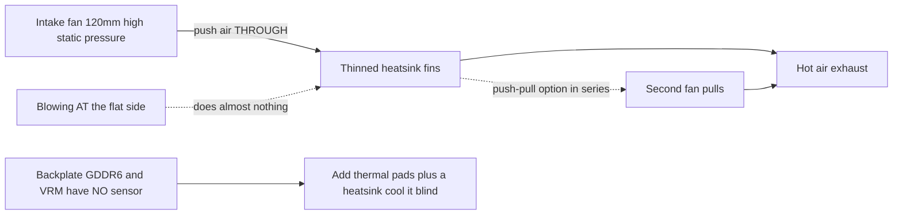

> 🌐 Tłumaczenie społecznościowe. Wersja angielska jest źródłem prawdy i może być nowsza. Znalazłeś błąd? Zgłoś to w [zgłoszeniu (issue)](https://github.com/lildebil0/awesome-bc250/issues). ([oryginał angielski](../en/04-cooling.md))

# Chłodzenie

> **W skrócie** — Fabryczny radiator BC-250 zbudowano pod tunel wymuszonego nawiewu w szafie serwerowej, a nie na biurko. Prosto z pudełka dławi. Poprawka społeczności: **przerzedź gęste fabryczne żebra** (zeszlifuj je) i przykręć **wentylator 120 mm o wysokim ciśnieniu statycznym** (**Arctic P12 Max/Pro** to odniesienie; Noctua NF-P12 redux to cicha premium alternatywa) dmuchający *przez* nie. Samo to sprowadza zmodowaną płytę do **~73 °C w Furmarku, 63–65 °C w grach**. Chłodzenie cieczą AIO i pełne niestandardowe obudowy to kolejne poziomy.

Chłodzenie to **rzecz #1, którą nowicjusz robi źle**, więc zrób to przed gonieniem za podkręceniami.

---

## Dlaczego fabryczne chłodzenie nie wystarcza

BC-250 to płyta koparkowa/serwerowa. Jej radiator jest **pasywny** i zaprojektowany tak, by siedzieć w obudowie, gdzie głośne wentylatory przepychają powietrze przez niego z przodu do tyłu. Na biurku bez przepływu powietrza nagrzewa się, a GPU dławi. Dmuchanie wentylatorem *w* płaski bok prawie nic nie daje — powietrze musi przejść **przez kanały żeber**, plus nad backplate (GDDR6 z tyłu **nie ma czujnika temperatury**, więc chłodzisz ją na ślepo).

Obserwowane przez społeczność limity: throttling zaczyna się ok. **85 °C**, twardy crash/reset ok. **90 °C**. Trzymaj temperatury obciążenia poniżej ~80 °C z zapasem.

> **Istnieją trzy warianty radiatora** (8-rzędowe i 9-rzędowe żebra). Szybka identyfikacja: **kod QR obok złącza PCIe 8-pin** oznacza wariant 9-rzędowy. Wariant z **mniejszą liczbą grubszych żeber** może chłodzić nieco lepiej fabrycznie. ([elektricM Cooling](https://elektricm.github.io/amd-bc250-docs/hardware/cooling/))

**Docelowe temperatury per komponent** (przetestowane liczby elektricM, drobniejsze niż limity throttle/crash powyżej):

| Komponent | Bieg jałowy | Lekkie obciążenie | Granie | Maks. |
|-----------|------|-----------|--------|-----|
| Krawędź GPU/APU | 40–50 °C | 50–60 °C | 65–80 °C | 90 °C |
| CPU (Tctl) | 45–55 °C | 55–65 °C | 70–85 °C | 95 °C |
| Pamięć (spód) | 40–55 °C | 50–65 °C | 55–70 °C | 80 °C |
| NVMe/SSD | 40–55 °C | 50–65 °C | 60–75 °C | 80 °C (krytyczne 81,8 °C) |

Celuj w **70–80 °C GPU w grach**. Sufit NVMe ma tu znaczenie, bo **GDDR6 i SSD M.2 dzielą gorącą tylną stronę płyty** — SSD siedzi w najgorszym miejscu termicznym i może się ugotować, więc obserwuj go (`80 °C` maks., `81,8 °C` krytyczne wg specyfikacji dysku). ([elektricM: sensors](https://elektricm.github.io/amd-bc250-docs/system/sensors/))

> **Drabina CPU Tctl.** elektricM oznacza **90 °C Tctl** jako zalecany punkt wycofania; **95 °C** z tabeli to górna krawędź, którą wciąż zobaczysz pod ciężkim graniem; **TJmax = 100 °C** to absolutny limit krzemu (tabela mocy pakietu niżej przypina CPU dokładnie na tym pod ciągłym przebiegiem stresowym). Więc: **90 °C = „wycofaj się teraz”, 95 °C = „w czerwoną strefę”, 100 °C = „pod ścianą”.** ([elektricM: sensors](https://elektricm.github.io/amd-bc250-docs/system/sensors/))

> **Moc pakietu na stan termiczny** (elektricM paruje każdy stan z poborem mocy płyty): Bieg jałowy **50–70 W**, Lekkie **100–150 W**, Ciężkie **150–200 W**, Stres **200–235 W**. Przydatne do dobrania zasilacza i odczytania, jak ciężko płyta faktycznie pracuje, z gniazdka. ([elektricM: sensors](https://elektricm.github.io/amd-bc250-docs/system/sensors/))

> **Artefakty pikselowe podczas grania = przegrzewanie VRAM.** Ponieważ tylna GDDR6 nie ma czujnika, ta wizualna usterka jest twoim sygnałem ostrzegawczym — dodaj przepływ powietrza/pady na backplate (niżej). ([elektricM Cooling](https://elektricm.github.io/amd-bc250-docs/hardware/cooling/))

> **Loteria krzemowa — zaplanuj zapas termiczny per układ.** Dwie fizycznie identyczne płyty, identyczna obudowa i konfiguracja OC, mogą działać **5–10 °C od siebie**, a gorętsza pozostawała gorętsza nawet po ponownym napastowaniu/podpadowaniu. Nie zakładaj, że cudze temperatury będą pasować do twoich. ([r/BC250Gaming](https://www.reddit.com/r/BC250Gaming/))



---

## Ciągłe obliczenia to inny reżim (nie tylko zrywy grania)

Cele powyżej zakładają **granie**, gdzie obciążenie przychodzi w zrywach. **Ciągłe** obliczenia — zapętlony `llama-bench`, długie przebiegi Stable Diffusion, cokolwiek przypinającego GPU na dziesiątki minut, **zwłaszcza z [odblokowaniem 40 CU](09-overclock-undervolt.md)** — to dużo ostrzejsze obciążenie i może przekroczyć to, co utrzyma chłodzenie klasy gamingowej.

elektricM zmierzył fabryczny radiator + **podwójny Arctic P12 Max w push-pull**, 10-min ciągły `llama-bench` przy **40 CU / 2 GHz**:

| Metryka | Średnia | Szczyt |
|--------|---------|------|
| Krawędź GPU | 89,6 °C | 107 °C |
| Moc pakietu | 136 W | 223 W |
| CPU | 96,7 °C | 100 °C (TJmax) |
| MOSFET-y VRM | 57 °C | 58,5 °C |
| Prędkość wentylatora | ~2950 RPM | 2977 RPM (sufit) |

Przepustowość osiadła **~10 %** w trakcie przebiegu, gdy pakiet dławił. Wniosek: **fabryczny radiator + podwójny P12 Max to za mało zapasu na ciągłe 40 CU @ 2 GHz** — i zwróć uwagę, że **VRM-y są daleko od swojego limitu** (57 °C), więc wąskim gardłem jest *radiator oddający ciepło*, a nie wentylatory czy stopień zasilania. Dwie poprawki: **ogranicz governor GPU do 1500 MHz** (40 CU wciąż skaluje ~1,5× obliczeń, temperatury trzymają ~83 °C — wytrzymale w nieskończoność na podwójnym P12 Max), albo **ulepsz radiator** (więcej powierzchni żeber). Dla **fabrycznego grania na 24 CU** podwójny P12 Max jest komfortowy; ściana pojawia się tylko pod ciągłymi obliczeniami na pełnych CU. ([elektricM Cooling](https://elektricm.github.io/amd-bc250-docs/hardware/cooling/))

---

## Ścieżka A — mod powietrzny (najpopularniejszy, najtańszy)

To uruchamia większość czatu.

### 1. Przerzedź/wyczyść fabryczne żebra
Fabryczne żebra są zbyt gęste i często nierówne. Ludzie otwierają kanały, żeby powietrze mogło przejść:

- **Szlifierka oscylacyjna (mimośrodowa)** — najszybciej, zrobione w minuty, najlepszy efekt. ([src](https://t.me/c/2424231195/31571))
- **Papier ścierny ręcznie** — gradacja 60, potem 240, ~3–4 h + 2 h przez dwa dni. Działa, ale wolno. ([src](https://t.me/c/2424231195/50330))
- **Nożyczki / nożyce** — surowa metoda „чекрыжить”, ostateczność; wyniki najgorsze. ([src](https://t.me/c/2424231195/41252))
- **Nożyczki + prowadnica z linijki (czysty wariant)** — wsuń nożyczki krawieckie/fryzjerskie w szczelinę żebra z **linijką ustawioną pod kątem do ostrza jako prowadnicą**; kieszonkowy nóż „otwieracz do puszek” działa równie dobrze. Zastrzeżenie: niektóre warianty płyty **nie mają szczeliny, by zacząć ostrzem** — podważ jedną śrubokrętem/pęsetą albo wytnij szczelinę wejściową **małą tarczką tnącą Dremela**. Ostrza szersze niż szczeliny żeber mogą uszkodzić radiator. ([r/BC250Gaming](https://www.reddit.com/r/BC250Gaming/))
- Wyprostuj wygięte żebra **płaską pęsetą + szczypcami**. ([src](https://t.me/c/2424231195/30670))
- **Zerwij żebra ręcznie** — elektricM zauważa, że miękkie aluminiowe żebra można **czysto oderwać/wyrwać ręką** (radiator zdjęty z płyty), unikając metalowych opiłków, które tworzą narzędzia tnące. Wolniej, ale bez odpadków. ([elektricM Cooling](https://elektricm.github.io/amd-bc250-docs/hardware/cooling/))
- **„Scooper by Justin”** — **drukowalne w 3D narzędzie zrobione specjalnie do dociskania/otwierania żeber radiatora BC-250** ([Printables 1282906](https://www.printables.com/model/1282906-bc-250-scooper)). Bezpieczniejsze niż goły śrubokręt: powstrzymuje cię przed zbyt mocnym dociskiem i rozoraniem **podstawy** radiatora między żebrami. ([wątek społeczności r/linux_gaming](https://www.reddit.com/r/linux_gaming/comments/1nvsgji/)) Ustaw oczekiwania: jeden właściciel zgłosił, że drukowane narzędzie **„grzebień/scooper” pękło przy 2. użyciu** i męczyło ręce. ([r/BC250Gaming](https://www.reddit.com/r/BC250Gaming/))
- **Szczypce modelarskie — metoda „obierania”** — chwyć **górę** żeber małymi szczypcami modelarskimi i obierz je, **wykorzystując własną pamięć metalu jako punkt złamania**, tak by pękały czysto na zgięciu, a nie wyrywały podstawę. Alternatywa z mniejszą ilością odpadków niż cięcie. ([wątek społeczności r/linux_gaming](https://www.reddit.com/r/linux_gaming/comments/1nvsgji/))

Orientacyjny zysk temperaturowy (elektricM): **prostowanie wygiętych żeber ~5–10 °C**, **usunięcie środkowych żeber ~10–15 °C** (nieodwracalne — dobra osłona wentylatora daje podobne zyski bez cięcia), **świeża pasta ~5–10 °C**, jeśli stara wyschła. ([elektricM Cooling](https://elektricm.github.io/amd-bc250-docs/hardware/cooling/))

> ⚠ **Najpierw zdejmij radiator z płyty** (albo w pełni zamaskuj/ochroń płytę i matrycę) przed szlifowaniem, i **wyczyść każdy okruch metalowego pyłu przed ponownym montażem**. Przewodzący metalowy opiłek osiadły na płycie może ją zewrzeć i **zabić płytę** — to już zdarzyło się w czacie.

<p align="center">
  <br>
  <sub>Zdjęcie: społeczność AMD BC-250 · <a href="https://t.me/c/2424231195/31571">źródło</a></sub>
</p>

### 2. Przykręć prawdziwy wentylator
Zamontuj **wentylator 120 mm o wysokim ciśnieniu statycznym** przepychający powietrze przez żebra. Wybór odniesienia to **Arctic P12 Max (lub P12 Pro)** — najwyższe ciśnienie statyczne (~6,9 mm H₂O), wybór społeczności + elektricM do tego gęstego radiatora. **Noctua NF-P12 redux** to cicha premium alternatywa, która osiągnęła wynik odniesienia **maks. 73 °C w Furmarku, 63–65 °C w grach** ([src](https://t.me/c/2424231195/42843)).

**Konkretne wybory wentylatorów ze specyfikacjami** (elektricM — wybieraj po *ciśnieniu statycznym*, nie po przepływie):

| Wentylator | Rozmiar | Maks. RPM | Ciśnienie statyczne | Przepływ | Hałas | Temperatury w grach |
|-----|------|---------|----------------|---------|-------|--------------|
| **Arctic P12 Max** | 120 mm | 3300 | **6,9 mm H₂O** | 73,3 CFM | 52,5 dB(A) | 65–75 °C |
| **Arctic P12 Pro** | 120 mm | 2100 | **6,9 mm H₂O** | 68,9 CFM | 37,8 dB(A) | 65–75 °C |
| Arctic P14 PWM | 140 mm | 1700 | 2,40 mm H₂O | 72,8 CFM | 38 dB(A) | 70–80 °C |
| Noctua NF-A12x25 | 120 mm | 2000 | 2,34 mm H₂O | 60,1 CFM | 22,6 dB(A) | 70–85 °C |

Najbardziej zalecany przez elektricM wybór to **Arctic P12 Max / P12 Pro** — jego ~6,9 mm H₂O ciśnienia statycznego przyćmiewa 2,34 mm Noctui i jest dużo tańszy; P12 Pro to cichsza, szerzej dostępna wersja. Premium Noctua jest jeszcze cichsza, ale dorównuje Arcticowi temperaturowo tylko przy wyższych RPM. ([elektricM Cooling](https://elektricm.github.io/amd-bc250-docs/hardware/cooling/))

**Inne wymienione z nazwy wentylatory z buildów społeczności** (konkretne modele, które ludzie zamontowali, poza odniesieniem Arctic/Noctua-P12):

- **Noctua NF-A12x25 G2** (PWM) jako **chłodzenie matrycy 120 mm** — nowsza rewizja G2 modelu A12x25, użyta jako główny wentylator ([TiredDadTech](https://youtu.be/zi7sldeRd2w)). (Tabela wentylatorów powyżej wymienia tylko *oryginalny* NF-A12x25.)
- **Noctua NF-A6x15 PWM** (≈3500 rpm) jako **wymiana wentylatora zasilacza 60 mm** — cicha wymiana za wrzeszczący wentylator serwerowego bricka ([TiredDadTech](https://youtu.be/zi7sldeRd2w)).
- **Thermalright 120 mm 1550 rpm ARGB** jako budżetowy wentylator matrycy oraz **pady termiczne 6,0 W/mK** na backplate — oba z **listy materiałów buildu TMG HD** ([przegląd buildu](https://youtu.be/OEO0r01zcfU)).

> **Odniesienie vs cicha alternatywa.** **Arctic P12 Max/Pro** to tu wentylator odniesienia — najwyższe ciśnienie statyczne (~6,9 mm H₂O), najtańszy, wybór społeczności + elektricM do tego gęstego radiatora. **Noctua NF-P12 redux** to cicha premium alternatywa (czatowy wynik 73 °C w Furmarku), dorównująca Arcticowi temperaturowo tylko przy wyższych RPM. Wybierz Arctic dla najlepszej ceny/wydajności, Noctuę, jeśli cisza liczy się najbardziej.

Użyj **drukowanej osłony/adaptera wentylatora**, by wentylator uszczelnił się względem radiatora zamiast przepuszczać powietrze wokół. Społecznościowe STL-e:
- `Fan_Shroud_Single_120mm.stl`, `Fan_Shroud_Dual_120mm.stl`, `Fan_Shroud_Single_140mm.stl`, `Twin_120mm_Fan_Shroud.stl`
- `BC250_FanAdapter_120mm.step`, `bc250 cooler mount.stl`, `cooler adapter v3.0.stl`

> **Dlaczego ciśnienie statyczne, a nie przepływ?** Gęste żebra to obciążenie o wysokim oporze. Wentylator obudowowy o wysokim przepływie zatrzymuje się na nich; wentylator o wysokim ciśnieniu statycznym (≥3 mm H₂O; Noctua P12, Arctic P12) faktycznie przepycha powietrze *przez*. Dla bardzo gęstych żeber dwa wentylatory w **push-pull (szeregowo)** podwajają ciśnienie statyczne — to właściwy ruch tutaj, a nie dwa wentylatory obok siebie.

**Montaż:** drukowana osłona jest najlepsza, ale **przypięcie opaskami** wentylatora do radiatora działa, a **kanał z tektury/pianki** zaklejony taśmą między wentylatorem a żebrami to ważne darmowe rozwiązanie zastępcze (brzydkie, nietrwałe, ale uszczelnia drogę powietrza). ([elektricM Cooling](https://elektricm.github.io/amd-bc250-docs/hardware/cooling/))

> ⚠ **Nie wierć/wkręcaj wentylatorów wprost w żebra.** Aluminium jest miękkie, a żebra cienkie — wkręcanie w nie uszkadza stos żeber i pogarsza chłodzenie. Użyj opasek albo drukowanej osłony. ([elektricM Cooling](https://elektricm.github.io/amd-bc250-docs/hardware/cooling/))

> ### 🛠 Inżynieria przepływu powietrza — co naprawdę robi różnicę
>
> Ustalenia społeczności co do *jak* powietrze jest przemieszczane, nie tylko który wentylator:
>
> - **Ciśnienie statyczne bije surowe CFM** przez gęsty stos żeber — dlatego wysokociśnieniowy **Arctic P12 Max (6,9 mm H₂O)** przewyższa cichsze wentylatory wysokoprzepływowe/niskociśnieniowe na tym radiatorze.
> - **Jeden wentylator wyśrodkowany może bić dwa obok siebie** na w pełni rozciętej płaszczyźnie żeber: pojedynczy centralny wentylator obciąża wprost **4 centralne rurki cieplne**, podczas gdy dwa wentylatory zostawiają martwy „szew” plastiku nad środkiem. Budowniczy, który pierwszy rozciął żebra na całej płaszczyźnie, zmierzył o kilka °C **niżej** na jednym centralnym wentylatorze niż na dwóch ([src](https://t.me/c/2424231195/46175)). Teardown dochodzi do tego samego wniosku od strony przepływu: **dwa wentylatory przykręcone obok siebie nie są lepsze niż jeden**, bo **martwa strefa tworzy się dokładnie nad gorącym środkiem matrycy**, gdzie spotykają się dwa wloty — **zostaw między nimi szczelinę albo idź w push-pull** ([Old Lamer — Part VII](https://youtu.be/pxahl9-YgkY) ~19:55). *(Ze źródła z napisów — traktuj jako jakościowe, nie dokładne.)*
> - **Podłoga prędkości wentylatora 120 mm ≈1800 RPM**, by faktycznie przepchnąć powietrze przez ten gęsty stos; **Arctic P12 Pro** ($8–10, zakres **600–3000 rpm**) to łatwy wybór, który na biegu jałowym jest cichy i wciąż ma zapas ([Old Lamer — Part VII](https://youtu.be/pxahl9-YgkY)). *(Liczby ASR — przybliżone.)*
> - **Dodaj wentylator wydechowy = −3 do −5 °C.** Sam wlot **73 °C** → z wydechem **67–68 °C** ([src](https://t.me/c/2424231195/68183), [src](https://t.me/c/2424231195/31553)). Więc optymalna prosta konfiguracja to **1 centralny wlot + 1 tylny wydech**, a nie dwa wloty obok siebie.
> - **Backplate jest ślepy i gorący.** MOSFET-y VRM sięgają **~100 °C bez chłodzenia** ([src](https://t.me/c/2424231195/110955)) — **musi** dostać pady + radiatory + dedykowany przepływ powietrza; z tylnymi radiatorami chodzi *„zimny pod obciążeniem”* ([src](https://t.me/c/2424231195/93056)).
> - **Darmowa fizyka.** Ciepłe powietrze unosi się, więc nawet orientacja **przechylona/kominowa** pomaga — ledwo wentylowany backplate zmierzył **47 °C samą konwekcją** ([src](https://t.me/c/2424231195/76962)). A **czarno anodowany radiator promieniuje ~1,8×** wypolerowanego, pozwalając skurczyć powierzchnię żeber o **~45 %** w pasywnych/półpasywnych zwartych buildach ([src](https://t.me/c/2424231195/86878)).
> - **Utrzymuj wlot > wydech** (lekkie **nadciśnienie**), żeby pozbawione czujnika VRM/VRAM były skąpane w świeżym powietrzu.

### Alternatywa: zachowaj fabryczne żebra (przypadek push-pull bez cięcia)
Cięcie żeber nie jest obowiązkowe. **penzoiders** zaprojektował obudowę ([MakerWorld, źródło FreeCAD](https://makerworld.com/models/2505974)), która **nie** tnie radiatora: używa **wentylatorów push-pull o wysokim ciśnieniu statycznym**, by przepchnąć powietrze przez **fabryczne, niezmodyfikowane żebra**, plus **dwukomorowy różnicowy układ ciśnień**, który chłodzi też backplate (radiatory 5 mm + pady termiczne; ponownie użyte radiatory NVMe działają). Strojenie, które pozostaje chłodne: **CPU 3800 MHz / 1050 mV, GPU 2100 MHz / 950 mV** → równoległy Furmark + `stress-ng` trzyma się **poniżej 85 °C**; granie **~75 °C przy mniej więcej 50 % obrotów wentylatora** (krzywa CoolerControl), „ledwo słyszalne”. ([r/BC250Gaming](https://www.reddit.com/r/BC250Gaming/))

## Ścieżka B — chłodzenie cieczą AIO

120 mm AIO zamontowane do matrycy przez wspornik adaptera. Ciche i zimne, ale więcej części i kosztu. Popularne buildy używają tanich AIO (np. aigo). ([przykład src](https://t.me/c/2424231195/19336))

<p align="center">
  <br>
  <sub>Zdjęcie: społeczność AMD BC-250 · <a href="https://t.me/c/2424231195/19336">źródło</a></sub>
</p>

**Wymieniony z nazwy, pobieralny wspornik AIO — NexGen3D** ([Printables 1554003](https://www.printables.com/model/1554003), drukuj w ABS-GF lub PETG). Zweryfikowany z **240 mm AIO Thermalright**: GPU **~50 °C @ 2000 MHz**, CPU **maks. 60 °C**. ([r/BC250Gaming](https://www.reddit.com/r/BC250Gaming/))

### Profile podkręcania na chłodzeniu cieczą
Z AIO możesz wcisnąć dużo mocniej. **NexGen3D** zmierzył z gniazdka (Furmark Vulkan + `stress-ng --matrix 0 -t 60m` jako kombinacja wypalająca):

| Profil | CPU | GPU | Maks. temp. wypalania | Moc z gniazdka | Uwaga |
|---------|-----|-----|---------------|------------|------|
| 1 | 4000 MHz | 2400 MHz | ~65 °C | >350 W | „martwa cisza” |
| 2 | 4100 MHz | 2450 MHz | ~75 °C | <400 W | gorętsze, głośniejsze |

Normalne granie w 1080p chodzi **10–15 °C poniżej** tych temperatur wypalania i **poniżej 250 W** na Profilu 1. **Schemat przepływu powietrza wart skopiowania:** wentylatory 120 mm **wydmuchują na zewnątrz przez chłodnicę**, co zaciąga świeże zewnętrzne powietrze przez **VRM-y / zasilacz / backplate VRAM**; osobny **wentylator 80 mm (Arctic P8 Max)** chłodzi VRM-y GPU — to odpowiada na ostrzeżenie „pozbawione czujnika VRM/VRAM wciąż potrzebują przepływu powietrza” powyżej. ([r/BC250Gaming](https://www.reddit.com/r/BC250Gaming/))

## Niestandardowy obieg wodny (zaawansowane)

Poza zamkniętym AIO kilka osób uruchamia **pełny niestandardowy obieg**. To realna, ale **DIY/ekspercka** scena: budowniczy **frezują CNC lub lutują niestandardowy blok wodny**, który pokrywa **matrycę *oraz* VRM** w jednym bloku ([src](https://t.me/c/2424231195/131065), [src](https://t.me/c/2424231195/131844), [src](https://t.me/c/2424231195/118582)). Złączki nie są krytyczne — *„możesz pozyskać, wytoczyć lub skleić niemal dowolne”* ([src](https://t.me/c/2424231195/132007)).

**Co ci to daje:** surowy niestandardowy obieg osiąga **~50 °C pod obciążeniem przy wentylatorach na zaledwie 30 %, zewnętrzna pompa niemal bezgłośna** ([src](https://t.me/c/2424231195/133040)). (Jeden budowniczy potem zauważył coil-whine z dławików VRM pod obciążeniem na domyślnej konfiguracji governora cyan-skillfish — to *osobny* problem, nie termiczny.) Nie potrzebujesz też **Corsair Commander**: własna [kontrola wentylatorów](#kontrola-prędkości-wentylatora-oprogramowanie) BC-250 może napędzić pompę plus **~5 wentylatorów** ([src](https://t.me/c/2424231195/140123)).

> ⚠ **Dlaczego to „zaawansowane”: BC-250 nie przeżywa zalania płynem chłodzącym.** Prawdziwe awarie od społeczności: wąż **zagiął się pod 90°, pękł i zalał GPU oraz zasilacz** ([src](https://t.me/c/2424231195/81158)); **zatarta pompa Corsair AIO ugotowała CPU** ([src](https://t.me/c/2424231195/133147), [src](https://t.me/c/2424231195/126053)). Uważaj też na **kawitację/hałas pompy powyżej ~50 % obrotów pompy** ([src](https://t.me/c/2424231195/7034)). **Przeprowadź test szczelności całego obiegu Z DALA od płyty przez 24 h przed pierwszym mokrym włączeniem.**

**Werdykt:** najniższe temperatury i najcichsze z każdej opcji, i umożliwia ciągłe 40-CU — ale najwyższe ryzyko i wysiłek. **Nie na pierwszy build.**

## Ścieżka C — dmuchawa („улитка”) — niezalecana

Odzyskane dmuchawy GPU były wczesnym eksperymentem. Głośne jak na efekt; ludzie przeszli na Ścieżkę A. ([src](https://t.me/c/2424231195/100086))

## Ścieżka D — konwersja na chłodzenie wieżowe (zaawansowane)

Niektórzy użytkownicy przykręcają **wieżowe chłodzenie AM4** (np. **Thermalright Peerless Assassin** lub inne wieże AM4/AM5) do matrycy, uzyskując doskonałe, ciche chłodzenie z gotowego sprzętu. Haczyk: musisz **zamontować je przez wspornik**, a wysoka wieża może **blokować slot M.2 lub inne komponenty**. Nie mod dla początkujących. Nie musisz już wytwarzać go od zera — istnieją dwa opublikowane drukowane w 3D wsporniki:

- **Adapter desktopowego chłodzenia AM4/AM5** ([MakerWorld 2596083](https://makerworld.com/en/models/2596083), źródło FreeCAD w zestawie). Montuje standardowe desktopowe chłodzenie AM4/AM5 do BC-250. Mocowanie: **śruby M5 + nakrętki, bez tulei dystansowych** (OP zauważa, że M4 byłoby idealne, ale M5 było ciasnym pasowaniem). Drukuj w **ABS, PETG lub ASA**. Zweryfikowane przy **CPU 3,95 GHz / 1,150 V, GPU 2200 MHz / 1000 mV, temperatury nieprzekraczające 80 °C**. Użyte chłodzenia: niskoprofilowe **klasy AXP90** (komentujący użył **AXP120**), a nawet **AMD Wraith Spire** pobił fabryczny radiator. ([r/BC250Gaming](https://www.reddit.com/r/BC250Gaming/))
- **Mocowanie Thermalright AXP90-X53** ([Printables 1694793](https://www.printables.com/model/1694793)). Wkładki gwintowane są **wlutowane w spód** drukowanego wspornika, więc **ponownie używasz oryginalnych sprężynowych śrub fabrycznego radiatora**; śruby z łbem walcowym wchodzą od dołu i są pogłębione, a wspornik ma **szczelinę 0,5 mm pod usztywnieniem**, by ominąć komponenty płyty. Zaprojektowane w Fusion 360, **drukuj w PETG** (PLA mięknie w tych temperaturach). Wynik: **65–67 °C pod pełnym obciążeniem @ 2150 MHz, 1080p**, bardzo cicho (miedziane chłodzenie, sparowane z 120 mm Arctic P12 Pro). Zmierzona wysokość stosu **54 mm od PCB do szczytu wentylatora 15 mm** — przydatne do dopasowania obudowy. Istnieje też **zestaw wariantów 3 grubości** oraz wersja **AXP120-X67**. ([r/BC250Gaming](https://www.reddit.com/r/BC250Gaming/))

---

## Kontrola prędkości wentylatora (oprogramowanie)

Gdy wentylator jest przykręcony, sterujesz jego PWM przez układ Super I/O płyty **Nuvoton NCT6686D** — ale **liczy się, który sterownik załadujesz** ([specyfikacja sprzętu elektricM](https://elektricm.github.io/amd-bc250-docs/)):

- **Czujniki tylko do odczytu** (RPM wentylatora, temperatury): wewnątrzjądrowy moduł **`nct6683`**, ładowany z `force=true`. Raportuje odczyty, ale **nie może zapisać PWM**, więc wentylator pozostaje na tym, co ustawi BIOS/firmware.
- **Odczyt + zapis PWM** (faktyczne ustawienie prędkości wentylatora): użyj zewnętrznego modułu **`nct6687`** z **[Fred78290/nct6687d](https://github.com/Fred78290/nct6687d)**, też z `force=true`. To ten do zbudowania, jeśli chcesz krzywych wentylatora / ręcznej kontroli prędkości, a nie tylko monitorowania.

```bash
# monitoring only (in-kernel):
echo 'options nct6683 force=true' | sudo tee /etc/modprobe.d/nct6683.conf
# PWM control (DKMS from Fred78290/nct6687d):
echo 'options nct6687 force=true' | sudo tee /etc/modprobe.d/nct6687.conf
```

> Nie ładuj obu — wybierz `nct6683` dla czujników tylko do odczytu albo `nct6687` dla odczytu+zapisu. Okablowanie czujników (`CPU_FAN1` / `J4003`) i numeracja wentylatorów BIOS↔Linux są w kroku weryfikacji [06-linux.md](06-linux.md).

**Który nagłówek to główny wentylator?** elektricM raportuje, że wentylator chłodzący jest zwykle na nagłówku **Pump Fan** = **`fan2` / `pwm2`** w sysfs; `CPU Fan` (`fan1`) i nagłówki `System Fan` (`fan3`+) są zwykle nieużywane. Włącz tryb ręczny przed zapisem PWM (`echo 1 > .../pwm2_enable`, potem wartość 0–255 do `.../pwm2`). Numeracja hwmon może się przesunąć między restartami — potwierdź przez `cat /sys/class/hwmon/hwmon*/name`. ([elektricM Cooling](https://elektricm.github.io/amd-bc250-docs/hardware/cooling/))

**Krzywe wentylatora z GUI — CoolerControl.** Gdy `nct6687` jest załadowany, **CoolerControl** daje graficzne krzywe wentylatora: wybierz urządzenie **nct6686**, zbuduj krzywą na **pwm2** używając **k10temp Tctl** jako źródła. Instalacja: `ujust install-coolercontrol` (Bazzite), copr `codifryed/CoolerControl` (Fedora) lub `coolercontrol` z AUR (Arch); web UI pod `https://localhost:11987`. ([elektricM Cooling](https://elektricm.github.io/amd-bc250-docs/hardware/cooling/))

**Tryby wentylatora BIOS** (jeśli nie uruchamiasz kontroli po stronie systemu): **Default** trzyma wentylatory na **minimum 40 %** (za nisko — niezalecane), **Full Speed** przypina je na 100 % (głośno, ale bezpiecznie), **Customize** ustawia prędkości per próg. ([elektricM Cooling](https://elektricm.github.io/amd-bc250-docs/hardware/cooling/))

> ⚠ **Nie uruchamiaj trybu BIOS Customize i CoolerControl jednocześnie** — walczą o kontrolę PWM. Wybierz jedno. ([elektricM Cooling](https://elektricm.github.io/amd-bc250-docs/hardware/cooling/))

---

## Interfejs termiczny (pasta, pady, zmiennofazowy, metal ciekły)

Niezależnie od wentylatora/radiatora, jaki uruchamiasz, **materiał interfejsu termicznego (TIM)** między matrycą a radiatorem — i między tyłem płyty a dowolnym radiatorem backplate — wart jest zrobienia dobrze. Matryca BC-250 ma **wysoką gęstość ciepła**, więc dobry TIM to darmowe kilka stopni.

> **Sama zmiana fabrycznej pasty pomaga.** Jeden właściciel wymienił fabryczną pastę po roku i temperatury obciążenia spadły **~4–5 °C**, przy wszystkim innym niezmienionym. ([src](https://t.me/c/2424231195/88565))

### Pasty, które działają
- **Arctic MX-6** — zwykła pasta z wyższej półki. W jednym buildzie w obudowie trzymała **87–88 °C w Furmarku**; ten sam właściciel zauważył, że PTM7950 zdjęłoby z tego jeszcze ~4 °C. ([src](https://t.me/c/2424231195/30211))
- **Fabryczna pasta + fabryczne pady** to udokumentowany punkt wyjścia: ~**76 °C** po 10 min obciążenia, ~**55 °C** na biegu jałowym (przed modem żeber/wentylatora). ([src](https://t.me/c/2424231195/22992))
- Inne pasty, które elektricM wymienia jako dobre tutaj: **Arctic MX-4** (wartość), **Thermal Grizzly Kryonaut** (premium), **Noctua NT-H1** (niezawodna), **Thermalright TFX** (budżet). Pasta używanej płyty jest **często wyschnięta** — samo ponowne napastowanie jest warte **~5–10 °C**. Nałóż kroplę wielkości ziarnka grochu na matrycę, montuj równo, dokręcaj śruby w **układzie X**. ([elektricM Cooling](https://elektricm.github.io/amd-bc250-docs/hardware/cooling/))

### PTM7950 — faworyt społeczności (zalecane)
**PTM7950** to **pad zmiennofazowy** (grafitowo-zmiennofazowa folia Honeywell). W temperaturze pokojowej to cienki stały arkusz; pod obciążeniem (~45–55 °C) mięknie i wpływa w mikronowej grubości warstwę, potem pozostaje na miejscu. **Nie wypompowuje się** ani nie wysycha jak smar, co jest dokładnie tym, czego chcesz pod gorącą, cyklowaną termicznie matrycą — więc nakładasz raz i zapominasz. Dosadne podsumowanie czatu: *„PTM7950 i nie kombinuj”* ([src](https://t.me/c/2424231195/101582)); zmiennofazowy to ogólne zalecenie ([src](https://t.me/c/2424231195/61511)).

**Jak nałożyć:**
1. Wyczyść matrycę i podstawę radiatora (alkohol izopropylowy), pozwól wyschnąć.
2. Wytnij kwadrat PTM7950 na rozmiar matrycy — kawałek **~26×30 mm** pokrywa matrycę BC-250 ([src](https://t.me/c/2424231195/125748)).
3. Zerwij jedną folię ochronną, połóż pad na matrycy, zerwij drugą folię.
4. Zamontuj radiator i dokręć równo momentem. **Bez rozsmarowywania** — pierwszy cykl ciepła wykonuje robotę. Najlepszych temperatur spodziewaj się po kilku cyklach obciążenie/bieg-jałowy („wygrzanie”).

Referencyjny build w obudowie na PTM7950 (Honeywell, 26×30) plus radiator backplate osiąga szczyt **~84 °C przez godzinę, 66–71 °C w grach** przy CPU 3850 MHz / GPU 2100 MHz. ([src](https://t.me/c/2424231195/125748))

> **Wymieniona z nazwy para: masa Upsiren pod radiatorem + PTM7950 na matrycy.** Film z buildu paruje **masę termiczną Upsiren UTP-6 / UTP-8** (gatunek **UTP-8** jest na ≈**14,8 W/mK**) do miejsc wypełniania szczelin z **arkuszem PTM7950 wyciętym 40×80×0,25 mm** położonym na matrycy ([wideo PTM7950 + Upsiren](https://youtu.be/FJapqZSdt6I)). Masa służy do wypełniania nierównych szczelin do radiatora/płyty; folia zmiennofazowa idzie na samą matrycę.
>
> - **Tani PTM7950 z AliExpress działa.** Arkusz z AliExpress za ~**$13** zweryfikowano jako działający — nie potrzebujesz markowego wycinka Honeywell ([wideo PTM7950 + Upsiren](https://youtu.be/FJapqZSdt6I)).
> - **PTM7950 wymaga rozruchu.** Osiąga najlepsze temperatury dopiero po **kilku cyklach grzanie/chłodzenie** — nie oceniaj go po pierwszym przebiegu ([demo TIM laptopowego](https://youtu.be/U4Zm8msXJHM)).
>
> *(Oba źródła są auto-napisane — traktuj dokładne W/mK i wymiary jako przybliżone.)*

### Pady backplate i GDDR6 (chłodź tył, na ślepo)
**GDDR6 i VRM z tyłu płyty nie mają czujnika temperatury** — chłodzisz je na ślepo. Dodaj **radiator na backplate** sprzężony z **padami termicznymi**, żeby ciepło z tylnej strony miało dokąd uciec. ([src](https://t.me/c/2424231195/125748)) Jeden budowniczy z RU po prostu chwycił **radiator z Yandex.Market**, przykleił go do backplate, i **dobrze schłodził dolną płytę** — dowolny rozsądnej wielkości aluminiowy radiator wykonuje tu robotę ([4pda — mananoid1](https://4pda.to/forum/index.php?showtopic=1104980)).

Zgłaszane grubości padów (udostępnione przez społeczność, reakcja „zapisałem to”):
- **VRM: 1 mm**
- **GDDR6: 2 mm** ([src](https://t.me/c/2424231195/121181))

> ⚠ **zweryfikuj** — te grubości zależą od szczeliny do *twojego* konkretnego backplate/radiatora. Potwierdź pomiarem szczeliny (albo testem masą/plasteliną) przed kupnem stosu padów.

elektricM podaje **nieco inny schemat padów** do chłodzenia samej pamięci: **pady 1,5 mm na *przedzie* płyty, 2,0 mm na *tyle***, potem aluminiowa płyta/radiator na spodzie. Używaj **tylko nieprzewodzących** padów przy płycie (nigdy przewodzącej pasty/padów, które mogłyby zewrzeć komponenty). Marki padów, jakie wymienia: **Thermalright Odyssey** (wysoka wydajność), **Arctic Thermal Pad** (wartość), **Gelid GP-Ultimate** (premium). ([elektricM Cooling](https://elektricm.github.io/amd-bc250-docs/hardware/cooling/))

> ⚠ **zweryfikuj (grubości padów różnią się między źródłami)** — nasze liczby z czatu to **VRM 1 mm / GDDR6 2 mm (tył)**; elektricM podaje **1,5 mm przód / 2,0 mm tył** dla układów pamięci. Różne buildy, różne szczeliny — **zmierz własny prześwit**, zamiast ufać którejkolwiek liczbie na ślepo.

> **Crashe/niestabilność po 30–60 min grania** (często z artefaktami pikselowymi) to klasyczny podpis **przegrzewania pamięci**. Poprawki: dodaj pady + płytę na spodzie, dodaj wentylator backplate, popraw przepływ powietrza w obudowie albo tymczasowo **zmniejsz podział VRAM** (np. 4 GB → 512 MB), by obciąć ciepło pamięci. ([elektricM Cooling](https://elektricm.github.io/amd-bc250-docs/hardware/cooling/))

### Metal ciekły — generalnie NIEzalecany tutaj
Metal ciekły (LM) pojawia się, bo PS5 (APU tej samej rodziny) go używa ([src](https://t.me/c/2424231195/18105)), a na surowej wydajności wyprzedza pastę/PTM ([src](https://t.me/c/2424231195/124112)). Ludzie pytali o niego i próbowali go na BC-250 ([src](https://t.me/c/2424231195/18098), [src](https://t.me/c/2424231195/77180)).

**Ale to zła decyzja na tej płycie:**
- LM jest **elektrycznie przewodzący**. Matryca BC-250 siedzi tuż obok **gęstej GDDR6 i VRM**; kropla, która ucieknie z matrycy, zwiera płytę (to samo ryzyko „przewodząca rzecz przy pamięci ją zabija” co ostrzeżenie o metalowych opiłkach powyżej).
- **Wypompowuje się / wymaga ponownego nałożenia mniej więcej co roku**, i atakuje gołe aluminium — nawet zwolennik PTM7950 porzucił LM na własnym sprzęcie dokładnie z powodu tej uciążliwości, przechodząc na PTM7950 / KryoSheet. ([src](https://t.me/c/2424231195/69688))
- „Nie każdy się w ogóle podejmie roboty z metalem ciekłym.” ([src](https://t.me/c/2424231195/106787))

**Konkluzja:** **PTM7950 to bezpieczniejszy wybór o wysokiej wydajności** — ~99 % korzyści, zero ryzyka zwarcia/utrzymania. Zarezerwuj LM dla ludzi, którzy już dokładnie wiedzą, co robią.

---

## Jak przetestować swoje chłodzenie (metoda społeczności, przypięta)

Z przypiętej procedury ([src](https://t.me/c/2424231195/108407)):

1. **Stres GPU:** Furmark (Vulkan / „Furmark VK”).
2. **CPU jednocześnie:** dodaj bench CPU (cpu-x) lub obciążenie oparte na `stress`/`pipx` — APU dzieli jeden radiator, więc testuj oba razem.
   - Te narzędzia (Furmark, OCCT, cpu-x, `stress`) **nie są preinstalowane** na świeżym Linuksie — zainstaluj je najpierw przez menedżer pakietów lub Flatpak.
3. **Testuj na swoim podkręceniu**, nie fabrycznie — 1500 MHz jest słabe; **2000 MHz to ~+30 % FPS** i to, co faktycznie uruchomisz, więc chłodź pod to.
4. Obserwuj temperatury; jeśli przekroczysz ~85 °C, dławisz — dodaj pracę z wentylatorem/osłoną/żebrami.

> ℹ️ **Nie myl dwóch różnych roszczeń „+30 %”.** **+30 % taktowania GPU** tutaj (1500 → 2000 MHz podnoszące FPS o mniej więcej jedną trzecią) to zysk *wydajności* z podkręcenia. To **nie** to samo co **~+30 % poprawy termicznej** cytowane dla **ponownego napastowania** w osobnej demonstracji TIM laptopowego ([demo TIM laptopowego](https://youtu.be/U4Zm8msXJHM)) — to wynik *temperaturowy* na innym sprzęcie. Ta sama liczba, niepowiązane rzeczy.

Jest też krótki wideo-przewodnik najprostszej metody przypięty w temacie. ([src](https://t.me/c/2424231195/100024))

---

## Zalecana konfiguracja startowa

| Poziom | Zrób to | Spodziewaj się |
|------|---------|--------|
| Minimum | Zeszlifuj żebra (szlifierka oscylacyjna) + 1× Arctic P12 Max/Pro (lub Noctua NF-P12) + drukowana osłona | ~73 °C Furmark |
| Lepiej | Push-pull (2× P12) przez osłonę | niżej, ciszej przy tej samej temperaturze |
| Maks. | 120 mm AIO na adapterze | najzimniej, więcej wysiłku przy buildzie |

---

## Źródła

- Przypięta metoda testowa — https://t.me/c/2424231195/108407 · wideo — https://t.me/c/2424231195/100024
- Narzędzia do żeber — https://t.me/c/2424231195/31571 · https://t.me/c/2424231195/30670 · https://t.me/c/2424231195/50330 · narzędzie do żeber „Scooper by Justin” ([Printables 1282906](https://www.printables.com/model/1282906-bc-250-scooper)) + metoda obierania szczypcami modelarskimi — [wątek r/linux_gaming](https://www.reddit.com/r/linux_gaming/comments/1nvsgji/)
- Wynik Noctua P12 — https://t.me/c/2424231195/42843
- Przykład AIO — https://t.me/c/2424231195/19336
- Interfejs termiczny — ponowne napastowanie −4–5 °C https://t.me/c/2424231195/88565 · MX-6 https://t.me/c/2424231195/30211 · fabryczny punkt wyjścia https://t.me/c/2424231195/22992 · PTM7950 https://t.me/c/2424231195/101582 · https://t.me/c/2424231195/61511 · build PTM7950 + backplate https://t.me/c/2424231195/125748 · grubość padów https://t.me/c/2424231195/121181 · metal ciekły https://t.me/c/2424231195/18098 · https://t.me/c/2424231195/69688
- Przewodnik chłodzenia elektricM (warianty radiatora, tabela temperatur per komponent, dane obciążenia ciągłego, specyfikacje wentylatorów, tryby wentylatora CoolerControl/BIOS, chłodzenie wieżowe, schemat padów) — https://elektricm.github.io/amd-bc250-docs/hardware/cooling/
- [elektricM: sensors](https://elektricm.github.io/amd-bc250-docs/system/sensors/) (progi termiczne: CPU Tctl 90 °C maks. / TJmax 100 °C, NVMe/SSD 80 °C maks. / 81,8 °C krytyczne, moc pakietu per stan termiczny)
- r/BC250Gaming (raporty społeczności: zmienność loterii krzemowej, metoda żeber nożyczki+linijka, pęknięcie narzędzia grzebieniowego, obudowa push-pull bez cięcia, wspornik AIO + wynik 240 mm, profile OC na cieczy, wsporniki AM4/AM5 + AXP90-X53) — https://www.reddit.com/r/BC250Gaming/ · adapter chłodzenia AM4/AM5 [MakerWorld 2596083](https://makerworld.com/en/models/2596083) · mocowanie AXP90-X53 [Printables 1694793](https://www.printables.com/model/1694793) · wspornik AIO NexGen3D [Printables 1554003](https://www.printables.com/model/1554003) · obudowa push-pull bez cięcia [MakerWorld 2505974](https://makerworld.com/models/2505974)
- Referencja sprzętu — [mothenjoyer69/bc250-documentation `hardware.md`](https://github.com/mothenjoyer69/bc250-documentation/blob/main/hardware.md)
- Obudowy/adaptery z chłodzeniem — [onemorecap/bc-250-sleeve-adapter](https://github.com/onemorecap/bc-250-sleeve-adapter)
- Martwa strefa dwóch wentylatorów obok siebie nad matrycą / zostaw szczelinę lub push-pull, podłoga 120 mm ≈1800 RPM, Arctic P12 Pro ($8–10, 600–3000 rpm) — [Old Lamer — Part VII](https://youtu.be/pxahl9-YgkY) (auto-napisy / ASR — liczby przybliżone)
- Masa Upsiren UTP-6 / UTP-8 (UTP-8 ≈14,8 W/mK) + PTM7950 wycięty 40×80×0,25 mm na matrycy, tani PTM7950 z AliExpress (~$13) zweryfikowany — [wideo PTM7950 + Upsiren](https://youtu.be/FJapqZSdt6I) · PTM7950 wymaga kilku cykli rozruchu grzanie/chłodzenie + osobne „+30 %” ponownego napastowania (laptop, nie +30 % taktowania GPU) — [demo TIM laptopowego](https://youtu.be/U4Zm8msXJHM)
- Wymienione z nazwy wentylatory: Noctua NF-A12x25 G2 (chłodzenie matrycy 120 mm) + NF-A6x15 PWM 3500 rpm (wymiana wentylatora zasilacza 60 mm) — [TiredDadTech](https://youtu.be/zi7sldeRd2w) · Thermalright 120 mm 1550 rpm ARGB + pady 6,0 W/mK (lista materiałów buildu TMG HD) — [przegląd buildu](https://youtu.be/OEO0r01zcfU)
- Radiator backplate RU (radiator z Yandex.Market schłodził dolną płytę) — [4pda — mananoid1](https://4pda.to/forum/index.php?showtopic=1104980)

> STL-e osłon wentylatorów i adapterów są skatalogowane w [05-case.md](05-case.md) i zmirrorowane pod `assets/stl/`.
