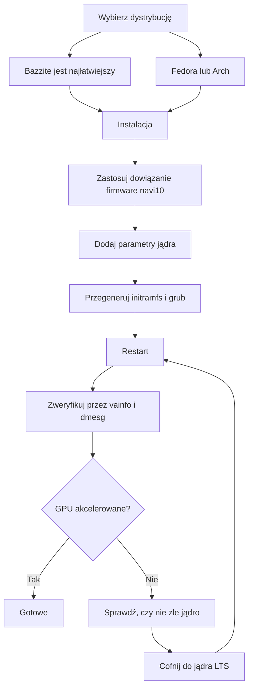

> 🌐 Tłumaczenie społecznościowe. Wersja angielska jest źródłem prawdy i może być nowsza. Znalazłeś błąd? Zgłoś to w [zgłoszeniu (issue)](https://github.com/lildebil0/awesome-bc250/issues). ([oryginał angielski](../en/06-linux.md))

# Sterowniki i konfiguracja na Linuksie

> **W skrócie** — Większość ludzi uruchamia BC-250 na Linuksie i działa to dobrze *po naprawieniu GPU*. Prosto z pudełka `amdgpu` nie rozpoznaje układu i dostajesz renderowanie na CPU z jednocyfrowym FPS. Dwie rzeczy robią z tego realny system: **nowoczesne jądro + świeża Mesa (25.1+)** oraz **poprawka `amdgpu`** — dowiązanie symboliczne firmware, dzięki któremu sterownik może się załadować (`navi10_gpu_info.bin` → `cyan_skillfish_gpu_info.bin`), plus parametry jądra (`amdgpu.sg_display=0`, `mitigations=off`, a na nowych jądrach `amdgpu.bc250_cc_write_mode=3`). Najłatwiejsza ścieżka dla nowicjusza: flashuj **[Bazzite](https://bazzite.gg/)** i przejdź (rebase) na dedykowany obraz **`bazzite-bc250`** — poprawki są tam już wbudowane. Chcesz poznać maszynę: **Fedora** albo **CachyOS/EndeavourOS (Arch)** z jednorazowym skryptem konfiguracyjnym.

To jest rozdział, który zmienia „płytę w pudełku" w działający komputer. Najpierw zrób [chłodzenie](04-cooling.md) i [zasilanie](03-power-supply.md) — a potem to.

> **Nigdy nie używałeś Linuksa? Zestaw przetrwania na 60 sekund.**
> - **Otwórz terminal:** poszukaj w menu aplikacji o nazwie *Terminal* / *Konsole* (KDE) / *Console*, albo naciśnij `Ctrl-Alt-T`.
> - **`sudo`** przed poleceniem uruchamia je jako administrator. Poprosi o hasło — i **w trakcie wpisywania nic nie pojawia się na ekranie** (żadnych kropek, gwiazdek). To normalne; wpisz je i naciśnij Enter.
> - **`nano /etc/...`** otwiera prosty edytor tekstu w terminalu. Aby zapisać i wyjść: **Ctrl-O**, potem **Enter**, potem **Ctrl-X**.
> - **Wklejanie** do terminala to zwykle **Ctrl-Shift-V** (nie Ctrl-V).
> - Wiele kroków zadziała dopiero po **ponownym uruchomieniu** (`systemctl reboot`). Gdy krok mówi „zrestartuj", faktycznie zrestartuj, zanim ocenisz, czy zadziałał.

---

## Jedna rzecz, którą musisz zrozumieć

GPU BC-250 to **Cyan Skillfish / Oberon** (część RDNA2 wywodząca się z PlayStation 5). Mainline'owy `amdgpu` historycznie **nie miał blobu firmware nazwanego pod ten układ**, więc na fabrycznej instalacji jądro nie potrafi zainicjalizować GPU, a pulpit zjeżdża na renderowanie programowe (LLVMpipe) — wszystko jest wolne, a `vulkaninfo` nie pokazuje żadnego prawdziwego urządzenia. Jeden użytkownik spędził kilka dni na „zepsutych sterownikach", zanim zorientował się, że jego dystrybucja po prostu uruchomiła jądro, które nie potrafiło załadować firmware GPU ([src](https://t.me/c/2424231195/98466)).

Więc każda działająca konfiguracja robi te same trzy rzeczy, w jakiejś formie:

1. **Uruchom jądro + Mesę wystarczająco nowe.** Upstream Mesa zyskała wsparcie BC-250 w **25.1** (od tego czasu nie potrzeba żadnych patchy; **25.3.x** to obecnie zalecana wersja stabilna) — ([Mesa MR !33116](https://gitlab.freedesktop.org/mesa/mesa/-/merge_requests/33116), [src](https://t.me/c/2424231195/20891)). Czujniki temperatury pojawiły się w **jądrze 6.15** ([src](https://t.me/c/2424231195/23542)); jądro **6.18.18 LTS** to obecnie najlepszy punkt równowagi.
2. **Daj `amdgpu` firmware, którego oczekuje** — na obecnych konfiguracjach aktualny **`linux-firmware`** już dostarcza `cyan_skillfish_gpu_info.bin`; starsze systemy nadal potrzebują **dowiązania symbolicznego do navi10** (albo spatchowanego pakietu mesa/jądra). Zobacz Ścieżkę C.
3. **Przekaż właściwe parametry jądra** i przegeneruj initramfs + bootloader. (I zainstaluj **„governor" GPU**, żeby zegary nie były przyklejone na 1500 MHz.)

Wszystko poniżej to tylko *jak* każda dystrybucja robi te trzy rzeczy.



---

## Która dystrybucja? (faworyci ankiety społeczności)

Czat raz po raz wraca do czterech. Nie ma jednej „właściwej" odpowiedzi — to kompromis między *zerowym wysiłkiem* a *zrozumieniem swojej maszyny*. Dokumentacja elektricM testuje szersze pole; oto wszystkie naraz ([elektricM: distributions](https://elektricm.github.io/amd-bc250-docs/linux/distributions/)):

| Dystrybucja | Baza | Wysiłek | Poprawka GPU | Najlepsza dla |
|--------|------|--------|---------|----------|
| **Bazzite** (obraz `bazzite-bc250`) | Fedora atomic | **Najniższy** — poprawki wbudowane | Wstępnie zastosowana w obrazie | Nowicjusze, „po prostu graj w gry" |
| **Fedora 43** (Workstation / KDE) | Fedora | Niski | Mesa 25.x w głównych repozytoriach + governor COPR | Naucz się Linuksa, bądź blisko upstreamu |
| **CachyOS** | Arch | Średni | Mesa 25.1+ w repozytoriach + governor (AUR) | Maksymalna płynność (scheduler BORE), HDR+VRR |
| **EndeavourOS / Arch** | Arch | Średni | Mesa 25.1+ w repozytoriach + governor | Arch bez bólu instalacji |
| **Debian (Testing/Sid) / PikaOS** | Debian | Średni–wysoki | Mesa z `experimental` (Debian) / OOTB (PikaOS) | Stabilność, **najniższy pobór na biegu jałowym (~50–60 W)** |
| **Manjaro** | Arch | Średni | Mesa 25.1+ w repozytoriach; uruchamia się OOTB po flashu BIOS-u | Łatwy Arch; GNOME najstabilniejszy |
| **Alpine** | Alpine (OpenRC) | Wysoki | ręczna mesa + firmware + governor | Minimalny/headless, ~150 MB RAM / ~35 W |
| **Fedora CoreOS** | Fedora atomic | Wysoki | host kontenerów; dostosowania po instalacji | Headless serwery kontenerów/LLM |
| **SteamOS** (Valve) | Arch (niezmienny) | Średni | Mesa z obrazu **main-branch** (nie stable) + governor | Prawdziwe odczucie Steam Machine; kanapa/Gaming Mode |
| **Batocera** | Linux (dystrybucja do emulacji) | Niski–średni | dołączona Mesa + konfiguracja | Konsolowy box do **emulacji** ([15-emulation.md](15-emulation.md)) |

Notatki z czatu i [elektricM](https://elektricm.github.io/amd-bc250-docs/linux/distributions/):
- **Bazzite jest najłatwiejszy** i ma **dedykowany obraz BC-250** z poprawką firmware, parametrami jądra, „governorem" GPU oraz już zastosowanym patchem 40-CU/częstotliwości. Znajdziesz go na artifacthub: [`bazzite-bc250`](https://artifacthub.io/packages/container/bazzite-bc250/bazzite_bc250). Kilku użytkowników przeszło na niego właśnie po to, by przestać patchować ręcznie ([src](https://t.me/c/2424231195/121246)).
- **Od Fedory 43 Mesa 25.x jest w głównych repozytoriach** — COPR `mixaill/amd-bc-250` nie jest już potrzebny tylko dla Mesy. Fedora 42 jest **wycofana z obsługi (EOL)**; zaktualizuj do 43. Podczas instalacji, jeśli dostaniesz czarny ekran, użyj *Troubleshooting → Install in Basic Graphics Mode* ([elektricM: Fedora](https://elektricm.github.io/amd-bc250-docs/linux/fedora/)).
- **Nie chwytaj na ślepo dystrybucji „dla graczy".** Jedna szczegółowa opinia argumentuje, że zwykła **Fedora (Workstation/KDE)** albo **czysty Arch z jądrem LTS + świeżą Mesą** to bezbolesny złoty środek, a ciężkie tuningowane forki potrafią czasem *psuć* Steam/FSR/vsync zamiast pomagać ([src](https://t.me/c/2424231195/102834)). Traktuj to jako poradę „stan na koniec 2025" — obraz Bazzite od tego czasu dojrzał.
- **CachyOS zamiast Bazzite, jeśli gonisz za maksymalną płynnością.** Szczegółowy raport społeczności r/BC250Gaming (Reddit) przesiadł się z Bazzite na **CachyOS** i stwierdził, że gry są zauważalnie płynniejsze niezależnie od źródła, z mniejszą liczbą zacięć/mikroprzymrożeń (np. *Mortal Kombat 1*), mniejszą liczbą losowych crashy i restartów trybu Steam oraz bardzo responsywnym odczuciem na **domyślnym układzie Btrfs**. Zadziałało też **HDR + VRR jak należy** tam, gdzie Bazzite nie potrafił (HDR się sypał, VRR nigdy nie działał) — zobacz [14-display.md](14-display.md). Traktuj to jako jedno dobrze udokumentowane doświadczenie, a nie uniwersalny werdykt, ale to mocna opcja, jeśli Bazzite zostawia cię z zacięciami lub niestabilnością. Konfigurację automatyzuje skrypt **[`redbeard1083/bc250-toolkit`](https://github.com/redbeard1083/bc250-toolkit)** (BC-250 na CachyOS). ⚠ Osobny punkt danych ze społeczności dodaje aspekt termiczny/FPS: przy *identycznym* podkręceniu CachyOS podobno działa **~10 °C chłodniej niż Bazzite** i daje wyższy FPS w tytułach ograniczonych przez CPU (np. *Elden Ring* ~60–75 na CachyOS vs ~45–60 na Bazzite) ([+14], r/BC250Gaming — raportowane przez społeczność, różni się; nie potwierdzone niezależnie).
- **Wersja jądra ma większe znaczenie niż dystrybucja.** Unikaj znanych złych jąder (zobacz ramkę ostrzegawczą poniżej). W razie wątpliwości **jądro LTS** (zalecane 6.18.18 LTS) to bezpieczny wybór — wielu użytkowników uderzyło w ścianę na zbyt nowym jądrze i uratowała ich przesiadka na LTS ([src](https://t.me/c/2424231195/56529), [src](https://t.me/c/2424231195/59839)).
- **Środowisko graficzne:** **GNOME ma najlepszą historię** na BC-250. KDE Plasma miało crashe Qt RDRAND/RDSEED — naprawione w nowszym Qt (połowa 2025), ale GNOME nadal jest bezpiecznym domyślnym wyborem; Cinnamon (X11) to stabilna lekka opcja ([elektricM: distributions](https://elektricm.github.io/amd-bc250-docs/linux/distributions/)).
- **Dwie kolejne dystrybucje są potwierdzone przez społeczność jako uruchamiające się** ([wątek społeczności r/linux_gaming](https://www.reddit.com/r/linux_gaming/comments/1nvsgji/)): **SteamOS** działa na BC-250 — ale użyj obrazu SteamOS z gałęzi **main-branch**, **nie** kanału stable (stable dostarcza starszą Mesę bez wsparcia BC-250). Oraz **Batocera**, dedykowana dystrybucja do emulacji, też się uruchamia i działa — wygodny sposób na zamienienie płyty w konsolowy box do emulacji (zobacz [15-emulation.md](15-emulation.md)). Obie podążają za tymi samymi trzema zasadami co wszystko powyżej (świeża Mesa + poprawka firmware `amdgpu` + parametry jądra/governor).

> Jeden weteran podsumował doświadczenie po trzech miesiącach codziennego używania BC-250 na Linuksie: gry uruchamiają się jednym kliknięciem, RTX działa, VR działa, „absolutnie bezproblemowo" — i przez to przeniósł swój główny pulpit na Linuksa ([src](https://t.me/c/2424231195/61870)).

---

## Ścieżka A — Bazzite (zalecana dla nowicjuszy)

Bazzite to niezmienny gamingowy OS oparty na Fedorze (podobny do SteamOS). Społeczność utrzymuje **obraz dedykowany pod BC-250**, więc sam nie dotykasz firmware ani parametrów jądra.

### A1. Najpierw zainstaluj zwykłe Bazzite
1. Pobierz z **[bazzite.gg](https://bazzite.gg/#image-picker)** (wybierz wariant desktopowy albo „Deck"/Gaming-Mode).
2. Wgraj na USB (Ventoy, Rufus albo balenaEtcher) i zainstaluj normalnie. **Utwórz użytkownika innego niż root** — Steam odmawia uruchomienia jako root ([src](https://t.me/c/2424231195/121246)).

> **Wybór właściwego obrazu Bazzite (krok po kroku).** Na [bazzite.gg](https://bazzite.gg/) przejdź przez picker **Desktop PC → AMD (modern) → KDE → obraz Gaming-Mode** — chwyć build **Gaming-Mode**, a nie zwykłe live ISO: live ISO instaluje się dobrze, ale **nie potrafi faktycznie uruchamiać gier**. Wgraj go przez **Balena Etcher** na pendrive **≥16 GB**. **Celem** instalacji może być M.2 NVMe, SATA SSD na adapterze M.2-do-SATA, a nawet **zewnętrzny dysk USB**. Obraz z połowy listopada 2025 dostarczał **Mesę 25.2.4** prosto z pudełka ([Old Lamer — Part IV](https://youtu.be/YuBmGF536II)).

> **Pendrive za mały?** ISO Bazzite ma >9 GB. Możesz zainstalować zwykłą **Fedorę** (ISO ≈3 GB, np. Kinoite/KDE) na małym pendrive, a potem *przejść (rebase)* na Bazzite z terminala ([src](https://t.me/c/2424231195/121246)):
> ```bash
> # KDE desktop:
> rpm-ostree rebase ostree-image-signed:docker://ghcr.io/ublue-os/bazzite:stable
> # or with Gaming Mode (SteamOS-like):
> rpm-ostree rebase ostree-image-signed:docker://ghcr.io/ublue-os/bazzite-deck:stable
> ```
> Zrestartuj i jesteś w Bazzite.

### A2. Zainstaluj „governor" GPU (najprostsza obecna ścieżka)
Od początku 2026 **fabryczne jądro Bazzite już zawiera patch zakresu częstotliwości GPU** — więc zwykle **nie potrzebujesz w ogóle niestandardowego obrazu**. Wystarczy zainstalować „governor" na wierzchu zwykłego Bazzite ([elektricM: Bazzite](https://elektricm.github.io/amd-bc250-docs/linux/bazzite/)):
```bash
sudo dnf copr enable filippor/bazzite
rpm-ostree install cyan-skillfish-governor-smu   # SMU variant — no kernel patch needed
systemctl reboot
sudo systemctl enable --now cyan-skillfish-governor-smu.service
# Pin the known-good deployment so an update can't silently break you:
rpm-ostree pin 0
```
**`cyan-skillfish-governor-smu`** steruje zegarami przez wywołania firmware SMU i zastępuje starszy `oberon-governor` (zobacz *[Governor zasilania](#b3-governor-zasilania-cyan-skillfish-governor)*). Istnieje też wariant `cyan-skillfish-governor-tt`, ale potrzebuje on patcha częstotliwości jądra (już obecnego w Bazzite). ⚠ „Governor" może celować w niewłaściwą kartę (card0 vs card1) — zweryfikuj, jeśli skalowanie nie zaskakuje.

### A2-alt. (Opcjonalnie) Przejdź (rebase) na obraz BC-250
Tylko jeśli chcesz dodatkowych wstępnie wbudowanych optymalizacji: przejdź na utrzymywany obraz BC-250 — buildy **`vietsman` „Bazzite on Steroids"** (poprawka firmware, parametry jądra, governor, rozszerzony patch częstotliwości 350–2230 MHz już wbudowane). Wybierz pulpit, który zainstalowałeś — **GNOME jest zalecanym domyślnym wyborem** — i uruchom:
```bash
# GNOME (recommended):
rpm-ostree rebase ostree-image-signed:docker://ghcr.io/vietsman/bazzite-gnome-patched:latest
# KDE:
rpm-ostree rebase ostree-image-signed:docker://ghcr.io/vietsman/bazzite-kde-patched:latest
# Deck / Gaming-Mode (SteamOS-like):
rpm-ostree rebase ostree-image-signed:docker://ghcr.io/vietsman/bazzite-deck-patched:latest
systemctl reboot
```
⚠ zweryfikuj aktualny obraz/tag przed uruchomieniem — ścieżki obrazów się zmieniają. Aktualne polecenia żyją na [stronie Bazzite w dokumentacji BC-250](https://elektricm.github.io/amd-bc250-docs/linux/bazzite/) (wymieniony też na artifacthub jako [`bazzite-bc250`](https://artifacthub.io/packages/container/bazzite-bc250/bazzite_bc250)).

> ⚠ **Przejście na spatchowany obraz może zabić twoje USB WiFi (elektricM Issue #10).** Niestandardowe jądro może nie zawierać sterownika twojego dongle'a USB WiFi/Bluetooth (BC-250 nie ma wbudowanej łączności bezprzewodowej). Miej pod ręką Ethernet, sprawdź `lsmod | grep <your_driver>` po przejściu, `rpm-ostree install <driver-package>` jeśli brakuje, albo `rpm-ostree rollback && systemctl reboot`.

> **Jeśli odblokowanie 40-CU psuje sterowanie wentylatorem lub twój pad Xbox, podmień na niestandardowy obraz jądra.** Wbudowane w Bazzite odblokowanie 40-CU (metoda „Old-Lamer") jest raportowane przez społeczność jako psujące **sterowanie wentylatorem i obsługę kontrolera Xbox** na niektórych konfiguracjach ([+ r/BC250Gaming — raportowane przez społeczność, różni się]). Obraz **[`hafriedlander/kernel-bazzite`](https://github.com/hafriedlander/kernel-bazzite)** to niestandardowe jądro, które to naprawia — zweryfikowane jako *„(przestarzałe) jądro Bazzite z patchem odblokowania 40CU dla płyt BC250"*, zbudowane prosto z kernel-ark Fedory ze zwykłym zestawem patchy handheld/wydajnościowych (spakowane też na AUR jako `linux-bazzite-bin`). ⚠ Czy rozwiąże twoją konkretną regresję wentylatora/pada to punkt danych ze społeczności, a nie gwarancja — trzymaj przypięty znany dobry deployment, żebyś mógł `rpm-ostree rollback`.

Po restarcie aktualizuj dalej za pomocą helpera Bazzite:
```bash
ujust update          # update everything (or: rpm-ostree upgrade && flatpak update)
rpm-ostree rollback   # if an update breaks something, roll back and reboot
```

> **Dwie pułapki Bazzite warte poznania** ([elektricM: Bazzite](https://elektricm.github.io/amd-bc250-docs/linux/bazzite/)): ciągłe **mikrozacięcia** nawet w lekkich grach 2D to zwykle Handheld Daemon zawieszający się w pętli — wyłącz go przez `sudo systemctl mask --now hhd`. A **zawieszenia przy ładowaniu poziomów** po flashu BIOS-u zwykle oznaczają, że **CMOS nie został wyczyszczony** — wyczyść CMOS, zastosuj ponownie ustawienie VRAM.

> ⚠ **Niezmienność Bazzite blokuje niskopoziomowe narzędzia sieciowe.** Tylko-do-odczytu `/usr` oznacza, że narzędzia do kształtowania ruchu / anty-throttlingu, które instalują usługi systemowe lub fragmenty jądra (np. narzędzia w stylu `zapret`), nie instalują się czysto. Jeśli polegasz na takim — częste u niektórych dostawców, którzy dławią Steam — modyfikowalna dystrybucja (Fedora/Arch) jest łatwiejszym hostem (szczegóły specyficzne dla RU w edycji rosyjskiej).

### A3. Gotowe — weryfikacja
Przeskocz do **[Weryfikacja akceleracji GPU](#weryfikacja-akceleracji-gpu)** poniżej. Na obrazie BC-250 (albo po A2) dowiązanie symboliczne firmware, parametry jądra i governor są już na miejscu.

---

## Ścieżka B — Fedora (Workstation / KDE)

Fedora to najlepiej udokumentowana nieatomowa ścieżka i trzyma się blisko upstreamu. **Na Fedorze 43 stos graficzny nie potrzebuje dodatkowego repozytorium — Mesa 25.x jest już w głównych repozytoriach** ([elektricM: Fedora](https://elektricm.github.io/amd-bc250-docs/linux/fedora/)). Starszy COPR `mixaill/amd-bc-250` (poniżej) jest potrzebny tylko na wydaniach przed 43.

### B1. Zainstaluj Fedorę
Pobierz **Fedora 43 Workstation lub KDE** ([fedoraproject.org](https://fedoraproject.org/workstation/download)) i zainstaluj normalnie — **Fedora 42 jest wycofana z obsługi (EOL)**, zaktualizuj do 43. Jeśli instalator pokazuje czarny ekran, wybierz *Troubleshooting → Install Fedora in basic graphics mode* (to ustawia `nomodeset`; usuń go po zainstalowaniu sterowników). Raportowana jako dobra baza z czatu: jądro 6.14, GNOME 48, Mesa 25.0.2+ — „lata" ([src](https://t.me/c/2424231195/29150)). Fedorę 41 z Cinnamonem nazwano „stabilną jak cholera" przy Cyberpunku, Wiedźminie 3 itd. ([src](https://t.me/c/2424231195/12756)). Na 43 preferuj jądro **6.18.18 LTS** albo **6.17.11+** i unikaj zepsutych zakresów (ramka ostrzegawcza poniżej).

### B2. Skrypt konfiguracyjny (robi robotę za ciebie)
Kanoniczna konfiguracja Fedory jest zautomatyzowana przez **`fedora-setup.sh`** z `mothenjoyer69/bc250-documentation`. Włącza COPR, instaluje spatchowaną mesę, konfiguruje `amdgpu`, buduje governor i naprawia bootloader. Dokładne kroki, które uruchamia (sprawdzone krzyżowo ze skryptem):

```bash
# 1. Patched mesa from COPR
sudo dnf copr enable mixaill/amd-bc-250 -y
sudo dnf upgrade --refresh -y

# 2. amdgpu module option + sensor module
echo 'options amdgpu sg_display=0'    | sudo tee /etc/modprobe.d/options-amdgpu.conf
echo 'nct6683'                        | sudo tee /etc/modules-load.d/99-sensors.conf
echo 'options nct6683 force=true'     | sudo tee /etc/modprobe.d/options-sensors.conf

# 3. Regenerate initramfs (Fedora uses dracut)
sudo dracut --regenerate-all --force

# 4. Bootloader: drop nomodeset, add kernel params
sudo sed -i 's/nomodeset//g' /etc/default/grub
sudo grub2-mkconfig -o /etc/grub2.cfg
sudo grubby --update-kernel=ALL --args="amdgpu.sg_display=0"
sudo grubby --update-kernel=ALL --args="mitigations=off"

# 5. OpenCL (optional, for compute/AI)
sudo dnf install mesa-libOpenCL --allowerasing
```
*(Źródło: `fedora-setup.sh` w [mothenjoyer69/bc250-documentation](https://github.com/mothenjoyer69/bc250-documentation), potwierdzone dosłownie.)*

Żeby po prostu uruchomić skrypt zamiast wpisywać kroki, zobacz sekcję **„Simple setup script"** w README tego repozytorium (wskazuje na [`fedora-setup.sh`](https://raw.githubusercontent.com/mothenjoyer69/bc250-documentation/refs/heads/main/fedora-setup.sh)). ⚠ Przeczytaj skrypt konfiguracyjny, zanim przekierujesz go do powłoki.

### B3. Governor zasilania (cyan-skillfish-governor)
Płyta uruchamia się na płaskich 1500 MHz / 1000 mV prosto z pudełka; **„governor"** skaluje zegary (bieg jałowy ↔ ~2000 MHz) i pozwala na undervolting. Obecnie zalecanym jest **`cyan-skillfish-governor-smu`** z COPR `filippor/bazzite` ([elektricM: Fedora](https://elektricm.github.io/amd-bc250-docs/linux/fedora/), potwierdzone w marcu 2026):
```bash
sudo dnf copr enable filippor/bazzite
sudo dnf install cyan-skillfish-governor-smu
sudo systemctl enable --now cyan-skillfish-governor-smu
systemctl status cyan-skillfish-governor-smu        # check it's running
```
Konfiguracja żyje w `/etc/cyan-skillfish-governor-smu/config.toml`. Pełne strojenie omówiono w **[09-overclock-undervolt.md](09-overclock-undervolt.md)**.

> **SMU vs starszy oberon-governor.** `cyan-skillfish-governor-smu` steruje zegarami przez wywołania firmware SMU i **nie potrzebuje patcha częstotliwości jądra na żadnej dystrybucji** — w dokumentacji elektricM efektywnie zastąpił wszędzie starszy `oberon-governor` ([elektricM: kernel](https://elektricm.github.io/amd-bc250-docs/linux/kernel/)). Ten sam COPR dostarcza też wariant `cyan-skillfish-governor-tt`, który *jednak* potrzebuje patcha jądra. Jeśli już uruchamiasz `oberon-governor`, zatrzymaj/wyłącz/usuń go (`sudo systemctl disable --now oberon-governor`, usuń `/etc/oberon-config.yaml`) przed instalacją wersji SMU.

### B4. Restart i weryfikacja
Zrestartuj, potem przeskocz do **[Weryfikacja akceleracji GPU](#weryfikacja-akceleracji-gpu)**.

---

## Ścieżka C — Rodzina Arch (CachyOS / EndeavourOS)

Instalacje oparte na Arch historycznie potrzebowały **dowiązania symbolicznego firmware zrobionego ręcznie** plus świeżej Mesy. To najbardziej „ręczna" ścieżka, ale obowiązują te same trzy idee.

> **Uwaga — dowiązanie symboliczne może już być dla ciebie przestarzałe.** Przewodniki elektricM per-dystrybucja dla [Arch](https://elektricm.github.io/amd-bc250-docs/linux/arch/), [CachyOS](https://elektricm.github.io/amd-bc250-docs/linux/cachyos/) i innych **w ogóle nie tworzą już dowiązania navi10** — na obecnym jądrze z aktualnym pakietem `linux-firmware` (Arch) / `linux-firmware-amdgpu` (Alpine) blob `cyan_skillfish_gpu_info.bin` jest teraz dostarczany, a Mesa 25.1+ robi resztę. Spróbuj najpierw **bez** dowiązania; cofnij się do C1 tylko, jeśli `dmesg` pokazuje `amdgpu: Failed to get gpu_info firmware` (tzn. twój pakiet firmware jest za stary, żeby go zawierać).

### C1. Poprawka firmware amdgpu (krytyczne dowiązanie symboliczne) — tylko jeśli brakuje firmware
`amdgpu` szuka `cyan_skillfish_gpu_info.bin`; blob **navi10** działa w jego miejsce. To było najczęściej powtarzane polecenie na czacie (5×) ([src](https://t.me/c/2424231195/45453)) i nadal jest poprawką, jeśli `linux-firmware` twojej dystrybucji jest starszy niż ten blob:

```bash
sudo ln -s /lib/firmware/amdgpu/navi10_gpu_info.bin.zst \
           /lib/firmware/amdgpu/cyan_skillfish_gpu_info.bin.zst
```

> ⚠ **zweryfikuj ścieżkę na swoim systemie.** Na dystrybucjach, które dostarczają **nieskompresowane** firmware, opuść `.zst` w obu nazwach:
> ```bash
> sudo ln -s /lib/firmware/amdgpu/navi10_gpu_info.bin \
>            /lib/firmware/amdgpu/cyan_skillfish_gpu_info.bin
> ```
> **Która jest twoja?** Uruchom `ls /lib/firmware/amdgpu/ | grep -i navi10` i spójrz na nazwę pliku źródłowego: jeśli kończy się na `.zst`, użyj pierwszego polecenia (`.zst`), w przeciwnym razie użyj drugiego — nazwa dowiązania musi pasować do pliku, który faktycznie istnieje. Po utworzeniu dowiązania **musisz** przegenerować initramfs (następny krok), żeby firmware został podchwycony przy starcie.

### C2. Świeża Mesa
Na EndeavourOS/CachyOS drogą społeczności jest **chaotic-aur** + `mesa-tkg-git`. Skondensowane z przypiętego mini-przewodnika EndeavourOS ([src](https://t.me/c/2424231195/50399)) i przewodnika SteamOS ([src](https://t.me/c/2424231195/52411)):

```bash
# Add the chaotic-aur key + mirrorlist (see https://aur.chaotic.cx/docs for the current keys)
sudo pacman-key --recv-key 3056513887B78AEB --keyserver keyserver.ubuntu.com
sudo pacman-key --lsign-key 3056513887B78AEB
sudo pacman -U 'https://cdn-mirror.chaotic.cx/chaotic-aur/chaotic-keyring.pkg.tar.zst'
sudo pacman -U 'https://cdn-mirror.chaotic.cx/chaotic-aur/chaotic-mirrorlist.pkg.tar.zst'

# Append to /etc/pacman.conf:
#   [chaotic-aur]
#   Include = /etc/pacman.d/chaotic-mirrorlist
sudo nano /etc/pacman.conf

sudo pacman -Syu
sudo pacman -Sy mesa-tkg-git lib32-mesa-tkg-git   # (or: yay -S mesa-tkg-git lib32-mesa-tkg-git)
sudo pacman -S vulkan-tools                        # for vulkaninfo
```
Istnieją też gotowe pakiety AUR: [`amdonly-gaming-mesa-git`](https://aur.archlinux.org/packages/amdonly-gaming-mesa-git) oraz [`mesa-amd-bc250`](https://aur.archlinux.org/packages/mesa-amd-bc250). ⚠ Klucz podpisujący chaotic-aur może się rotować — zawsze kopiuj aktualne klucze z [aur.chaotic.cx/docs](https://aur.chaotic.cx/docs).

> **Najprostsza ścieżka na obecnym Arch/CachyOS:** Mesa **25.1+ jest teraz w oficjalnych repozytoriach `extra`** — `sudo pacman -S mesa vulkan-radeon lib32-vulkan-radeon` wystarczy, bez chaotic-aur ani `mesa-tkg-git`. Buildy `-tkg`/AUR mają znaczenie tylko na starszych dystrybucjach ([elektricM: Arch](https://elektricm.github.io/amd-bc250-docs/linux/arch/), [src](https://t.me/c/2424231195/20891)). Mesa **26** (git) jest już potwierdzona jako działająca na Debian sid / Ubuntu 26.04 daily.
>
> Żeby całkowicie pominąć kroki ręczne, przewodnik Arch od elektricM wskazuje na skrypt konfiguracyjny **`eabarriosTGC/BC250--ARCH`** (`Arch-setup.sh`, albo `bc520-manjaro.sh` dla Manjaro), który instaluje governor, konfiguruje czujniki, zapisuje `/etc/environment.d/99-radv-bc250.conf` z `RADV_DEBUG=nohiz` i przegenerowuje initramfs ([elektricM: Arch](https://elektricm.github.io/amd-bc250-docs/linux/arch/)). Na **CachyOS** konkretnie raport społeczności r/BC250Gaming (Reddit) używa **[`redbeard1083/bc250-toolkit`](https://github.com/redbeard1083/bc250-toolkit)**, skryptu konfiguracyjnego dopasowanego do BC-250 na CachyOS. ⚠ Przeczytaj każdy skrypt konfiguracyjny przed uruchomieniem.

### C3. Parametry jądra + przegenerowanie
Dodaj parametry jądra BC-250, potem przebuduj initramfs i grub. Edytuj `/etc/default/grub` i wstaw te do `GRUB_CMDLINE_LINUX_DEFAULT` (kanoniczny zestaw wg [dokumentacji BC-250 od elektricm](https://elektricm.github.io/amd-bc250-docs/linux/kernel/)):

```
amdgpu.sg_display=0 mitigations=off amdgpu.bc250_cc_write_mode=3 ttm.pages_limit=3959290 ttm.page_pool_size=3959290
```

Potem przegeneruj (Arch używa **mkinitcpio**, potem grub):
```bash
sudo mkinitcpio -P
sudo grub-mkconfig -o /boot/grub/grub.cfg
```
Na dystrybucjach, które używają `update-grub` (Debian/Ubuntu/SteamOS), ten wrapper zastępuje linię `grub-mkconfig` ([src](https://t.me/c/2424231195/52411)).

### C4. Governor + restart
Zainstaluj **`cyan-skillfish-governor-smu`** z AUR (nowoczesny zamiennik dla `oberon-governor` — nie potrzebuje patcha jądra), włącz usługę, zrestartuj i zweryfikuj ([elektricM: CachyOS](https://elektricm.github.io/amd-bc250-docs/linux/cachyos/)):
```bash
yay -S cyan-skillfish-governor-smu
sudo systemctl enable --now cyan-skillfish-governor-smu.service
cat /sys/class/drm/card0/device/pp_dpm_sclk   # the * should move between clocks under load
```
Wariant `cyan-skillfish-governor-tt` istnieje dla tych, którzy wolą drogę z patchem jądra. Starszy `oberon-governor` ([gitlab.com/mothenjoyer69/oberon-governor](https://gitlab.com/mothenjoyer69/oberon-governor), `cmake . && make && sudo make install`) nadal działa, ale jest wycofywany.

> ⚠ **Znana osobliwość Arch/Manjaro/CachyOS:** „governor" często **nie zaczyna skalować przy starcie** — GPU siedzi na 1500 MHz, dopóki raz nie uruchomisz jakiejś gry/benchmarka, po czym zachowuje się poprawnie. Fedora/Bazzite nie są dotknięte. Obejście: `sudo systemctl restart cyan-skillfish-governor-smu` po starcie ([elektricM: Arch](https://elektricm.github.io/amd-bc250-docs/linux/arch/)).

---

## Różnice niszowych dystrybucji (Alpine / CoreOS / Debian / CachyOS)

Cztery ścieżki powyżej obejmują większość ludzi. Dystrybucje poniżej potrzebują *tych samych trzech rzeczy*, ale ze specyficznymi dla dystrybucji nazwami pakietów i mechanizmami — to różnice BC-250, a nie pełne przewodniki instalacji.

### CachyOS — wybierz właściwy poziom mikroarchitektury
CachyOS prosi cię o wybór **poziomu mikroarchitektury** x86-64 przy instalacji. **Wybierz `x86-64-v3`** — to wybór o najlepszej kompatybilności dla **Zen 2** ([elektricM: CachyOS](https://elektricm.github.io/amd-bc250-docs/linux/cachyos/)). ⚠ **Nie** wybieraj `x86-64-v4`: ten poziom wymaga AVX-512, którego rdzenie Zen 2 w BC-250 nie mają, więc instalacja v4 się nie uruchomi. Użyj jądra LTS — `sudo pacman -S linux-cachyos-lts linux-cachyos-lts-headers`. Żeby zmigrować **istniejący Arch** na repozytoria CachyOS zamiast reinstalować:
```bash
wget https://mirror.cachyos.org/cachyos-repo.tar.xz
tar xvf cachyos-repo.tar.xz
cd cachyos-repo
sudo ./cachyos-repo.sh   # choose x86-64-v3 when prompted
```
Wszystko inne (firmware, Mesa 25.1+, governor, parametry jądra) podąża za **Ścieżką C** powyżej.

### Debian — przypnij Mesę do `experimental`
Mesa ze Stable/Testing jest za stara; chcesz Mesę **tylko** z `experimental` bez ciągnięcia reszty systemu tam ([elektricM: Debian](https://elektricm.github.io/amd-bc250-docs/linux/debian/)). Dodaj repozytorium:
```
deb http://deb.debian.org/debian experimental main contrib non-free non-free-firmware
```
Potem **przypnij przez APT**, żeby tylko pakiety Mesy śledziły experimental — `/etc/apt/preferences.d/experimental`:
```
Package: mesa-vulkan-drivers libgl1-mesa-dri
Pin: release a=experimental
Pin-Priority: 500
```
Zainstaluj Mesę i nowsze jądro:
```bash
sudo apt install -t experimental mesa-vulkan-drivers libgl1-mesa-dri
sudo apt install linux-xanmod-lts-x64v3       # Xanmod LTS, v3 build
```
„Governor" **nie ma COPR/AUR na Debianie** — zainstaluj go z upstreamowego tarballa wydania:
```bash
tar -xf cyan-skillfish-governor-smu-*-x86_64-linux.tar.gz
cd cyan-skillfish-governor-smu-*/
sudo ./scripts/install.sh
sudo systemctl enable --now cyan-skillfish-governor-smu.service
```

### Alpine — jedyny przepis na governor bez systemd
Alpine używa **OpenRC**, nie systemd, więc governor wymaga ręcznego okablowania ([elektricM: Alpine](https://elektricm.github.io/amd-bc250-docs/linux/alpine/)). Pakiet firmware to **`linux-firmware-amdgpu`** (dostarcza `cyan_skillfish_gpu_info.bin`) — generyczna nazwa `linux-firmware` używana gdzie indziej w tym dokumencie **nie obowiązuje na Alpine**. Zainstaluj stos (domyślnie bez `sudo` — użyj **`doas`** albo `apk add sudo`):
```sh
doas apk add linux-lts linux-firmware-amdgpu \
  mesa-vulkan-ati vulkan-loader vulkan-tools mesa-dri-gallium
```
Parametry jądra idą do **`/etc/update-extlinux.conf`** (Alpine używa extlinux, **nie** grub/dracut); po edycji przebuduj:
```sh
doas mkinitfs
doas update-extlinux
```
Governor jest budowany z gałęzi **`smu`** przez `cargo build --release`, a ponieważ rozmawia przez D-Bus, potrzebuje **zarówno** pliku polityki D-Bus, jak i usługi OpenRC:
- **polityka D-Bus** `/etc/dbus-1/system.d/com.cyan.skillfishgovernor.conf` (pozwala mu posiadać nazwę magistrali `com.cyan.SkillFishGovernor`);
- **usługa OpenRC** `/etc/init.d/cyan-skillfish-governor-smu`, która deklaruje `need dbus`.

Włącz D-Bus i zrestartuj:
```sh
doas rc-update add dbus default
doas rc-service dbus start
```

### Fedora CoreOS — odblokowanie 40-CU na niezmiennym hoście i poprawka ACPI
Na niezmiennym hoście CoreOS nie możesz po prostu przekazać `amdgpu.bc250_cc_write_mode=3` łatwą drogą, więc odblokowanie 40-CU robi się jako **usługę startową przez `umr`**, która zapisuje rejestry GPU raz na start ([elektricM: CoreOS](https://elektricm.github.io/amd-bc250-docs/linux/fedora-coreos/)):
```bash
rpm-ostree install umr
# then a oneshot /etc/systemd/system/gpu-unlock.service that runs the umr
# register writes (mmRLC_PG_ALWAYS_ON_WGP_MASK / mmCC_GC_SHADER_ARRAY_CONFIG /
# mmSPI_PG_ENABLE_STATIC_WGP_MASK on *.gfx1013) after a short boot delay,
# then: systemctl enable gpu-unlock.service
```
**Poprawka ACPI cpufreq** (tabele SSDT `bc250-acpi-fix`) jest stosowana drogą rpm-ostree — wrzuć pliki `.aml` do `/etc/dracut.conf.d/acpi/`, dodaj `/etc/dracut.conf.d/99-acpi-override.conf`:
```
acpi_override="yes"
acpi_table_dir="/etc/dracut.conf.d/acpi"
```
potem wbuduj je w initramfs przez `rpm-ostree initramfs --enable` i zrestartuj. (Zobacz *Znane złe jądra i pułapki* poniżej dla nieatomowej drogi dracut.)

---

## Co robi każdy parametr jądra

Sprawdzone krzyżowo z [dokumentacją BC-250 od elektricm](https://elektricm.github.io/amd-bc250-docs/linux/kernel/) oraz skryptami konfiguracyjnymi AMD-BC-250 / mothenjoyer69:

| Parametr | Co robi |
|-----------|--------------|
| `amdgpu.sg_display=0` | Wyłącza scatter-gather display. Potrzebne na **jądrach < 6.10**, by uniknąć czarnego ekranu; nieszkodliwe do zostawienia. Najczęściej cytowana na czacie poprawka startu ([src](https://t.me/c/2424231195/52411)). |
| `mitigations=off` | Wyłącza mitygacje podatności CPU. elektricM mierzy **+18 FPS w Cyberpunk 2077** (60 → 78 przy 1080p high), ~5–10% zysku CPU ogółem — kosztem bezpieczeństwa. Opcjonalne; tylko systemy do gier. |
| `amdgpu.bc250_cc_write_mode=3` | Opcjonalne **odblokowanie 40-CU** dla nowych jąder: zapisuje dwa rejestry HW, by ponownie włączyć wszystkie 40 jednostek obliczeniowych (domyślnie wyłączone). Strzeżone przez PCI ID `0x13FE`, brak trwałej zmiany HW. Pobór skacze mocno (np. 56 W → 181 W w llama-bench) — warte tylko przy obliczeniach. Zobacz [09-overclock-undervolt.md](09-overclock-undervolt.md). |
| `amdgpu.gttsize=14750` **+** `ttm.pages_limit=3959290` `ttm.page_pool_size=3959290` | Pozwól GPU mapować więcej RAM systemu (≈14.5–14.75 GB). elektricM używa **wszystkich trzech razem**, nie jako alternatyw — `gttsize` ustawia rozmiar GTT, a dwie wartości `ttm` podnoszą limity stron. Współgra z dynamicznym podziałem VRAM 512 MB w BIOS-ie ([elektricM: kernel](https://elektricm.github.io/amd-bc250-docs/linux/kernel/)). |

> ⚠ **NIE przekazuj `amd_iommu=on`**, by sprawić, że parametry pamięci zadziałają — działają *bez* IOMMU, które musi pozostać wyłączone (następna sekcja). Powyższe wartości mogą też pójść do `/etc/modprobe.d/` zamiast cmdline jądra: `options ttm pages_limit=3959290 page_pool_size=3959290` / `options amdgpu gttsize=14750`, potem przebuduj initramfs.

> **Notatka o rozmiarze VRAM/bufora:** APU działa najlepiej z **najmniejszym** wykrojeniem framebuffera GPU (np. 512 MB), żeby mógł dzielić pulę 16 GB dynamicznie — ale zmiana tego wymaga **zmodyfikowanego BIOS-u**, omówionego w [08-bios.md](08-bios.md) ([src](https://t.me/c/2424231195/38599)).

> 📋 **Kanoniczna konfiguracja codziennego użytku jednego weterana (szybki odnośnik):** **CPU 4 GHz / GPU 2 GHz 40 CU / VRAM BIOS 512 MB / `mitigations=off` / zswap + 32 GB swapu.** To cała nastrojona konfiguracja w jednej linii — zegar GPU + odblokowanie 40-CU + maleńki podział BIOS 512 MB + mitygacje wyłączone + poprawka swapu zswap poniżej ([Old Lamer](https://youtu.be/bXlKcFPeSoU)). Każdy element jest opisany w [09-overclock-undervolt.md](09-overclock-undervolt.md) i ramkach wokół tego miejsca.

> 💥 **Gry crashują z braku RAM-u (RDR2, Company of Heroes 3)? Użyj zswap + dużego pliku swap na Btrfs.** Mając tylko 16 GB dzielone między CPU i GPU, pamięciożerne tytuły wyczerpują pamięć i crashują — a swap **ZRAM** systemd pogarsza to przy dynamicznym podziale 512 MB (myli alokator, prowadząc do OOM przy nadal wolnym RAM-ie). Poprawka, która się trzyma: **wyłącz ZRAM systemd, włącz zswap i dodaj plik swap 32 GB na Btrfs** (na Btrfs użyj `btrfs filesystem mkswapfile`). Nie dodaje prawdziwej pamięci, ale zatrzymuje crashe z niedoboru RAM-u ([Old Lamer — Part XIV](https://youtu.be/A6juAoY70aU)). Pełny krok po kroku (zswap `lz4`, plik swap, `vm.swappiness=180`, wariant Bazzite/`rpm-ostree`) jest w [09-overclock-undervolt.md](09-overclock-undervolt.md).

---

## ⚠ Wyłącz IOMMU w BIOS-ie (zrób to raz)

**IOMMU jest zepsute na BC-250 i musi zostać wyłączone.** Pozostawione włączone powoduje **awarie wyświetlania, czarne ekrany i losowe crashe**, a passthrough GPU do VM i tak nie jest możliwe. To ustawienie BIOS-u, a nie wybór dystrybucji — zrób je przy pierwszym starcie niezależnie od tego, którą ścieżkę powyżej wybrałeś. Znajdź opcję **IOMMU** w setupie BIOS-u (zwykle pod *Advanced → AMD CBS / NBIO* lub *North Bridge*) i ustaw ją na **Disabled**, potem zapisz i zrestartuj ([dokumentacja sprzętowa elektricM](https://elektricm.github.io/amd-bc250-docs/), reverse engineering przez mothenjoyer69 / Segfault / neggles / yeyus).

> ⚠ zweryfikuj — źródło elektricM dokumentuje tylko wyłączenie w **BIOS-ie**. Niektóre jądra akceptują też `iommu=off` / `amd_iommu=off` jako parametr jądra, ale to **nie** zostało potwierdzone na BC-250; traktuj to jako niezweryfikowane i preferuj ustawienie BIOS-u.

---

## Weryfikacja akceleracji GPU

Po pierwszym restarcie potwierdź, że GPU jest faktycznie używane (a nie renderowanie programowe).

**1. Czy urządzenie jest widoczne dla Vulkana?** Powinieneś zobaczyć urządzenie BC-250 / AMD, nie tylko LLVMpipe:
```bash
vulkaninfo | grep deviceName
```
Poprawna konfiguracja pokazuje **dwa urządzenia** (iGPU pojawia się dwukrotnie na tej płycie) ([src](https://t.me/c/2424231195/50399)).

**2. Sterownik Vulkana to RADV** (nie AMDVLK ani llvmpipe):
```bash
vulkaninfo | grep driverName     # expect: driverName = radv
```
Nazwa urządzenia powinna brzmieć **`AMD Radeon Graphics (RADV GFX1013)`**.

> ⚠ **Nie oczekuj, że `vainfo` zadziała — sprzętowe dekodowanie/kodowanie wideo jest martwe na BC-250.** Firmware bloku VCN jest **zablokowane przez Sony**, więc `vainfo` zawodzi (`vaInitialize failed ... -1`) i nie ma akceleracji GPU H.264/H.265. To nie jest błąd w twojej konfiguracji — używaj **dekodowania programowego** (mpv/VLC zjeżdżają automatycznie) i **x264** dla OBS. Mało prawdopodobne, by się to kiedykolwiek zmieniło ([elektricM: RADV](https://elektricm.github.io/amd-bc250-docs/drivers/radv/)).

**3. Ciąg renderera OpenGL** (powinien nazywać AMD/`gfx1013`, nie `llvmpipe`):
```bash
glxinfo | grep -i "OpenGL renderer"
# e.g. AMD Radeon Graphics (radv gfx1013 ...) — llvmpipe here means the GPU is NOT working
```

**4. Jednostki obliczeniowe aktywne** — potwierdź, że `amdgpu` zainicjalizował GPU i ile CU jest żywych:
```bash
sudo dmesg | grep -i active_cu_number
```
To najszybsze sprawdzenie, że firmware się załadował i (jeśli ustawiłeś `bc250_cc_write_mode=3`) że wszystkie 40 CU wstało. ⚠ zweryfikuj — dokładna nazwa pola `dmesg` może się różnić w zależności od jądra; jeśli jest puste, spróbuj też `dmesg | grep -i amdgpu` i poszukaj udanych ładowań firmware, a nie błędów `cyan_skillfish_gpu_info` *failed to load*.

> **`dmesg`/sprawdzenie CU nie pokazuje nic jako zwykły użytkownik?** Wiele dystrybucji ogranicza dostęp do logów jądra, więc odczyt CU i skrypty pomocnicze jak **`cu_map.sh`** drukują pusto. Zdejmij ograniczenie na czas sesji, żeby sprawdzenia wyświetlały się poprawnie ([4pda — das504](https://4pda.to/forum/index.php?showtopic=1104980)):
> ```bash
> sudo sysctl kernel.dmesg_restrict=0
> ```

**5. Sprawdzenie temperatur/zegarów dla pewności** ([src](https://t.me/c/2424231195/23542); elektricM zauważa, że moduł potrzebuje jądra **6.11+**):
```bash
sudo modprobe nct6683 force=true   # force=true is ALWAYS required — the chip isn't auto-detected
sensors                            # reports as nct6686-isa-0a20
```
Zdrowy bieg jałowy odczytuje ~1500 MHz SCLK / ~47 °C; pod Furmarkiem ~1900 MHz / ~78 °C ([src](https://t.me/c/2424231195/89232)). Dla **sterowania wentylatorem** PWM (nie tylko monitorowania) potrzebujesz zamiast tego sterownika `nct6687` spoza drzewa jądra — zobacz **[Czujniki i sterowanie wentylatorem](#czujniki-i-sterowanie-wentylatorem)** poniżej.

Jeśli `vulkaninfo` pokazuje tylko `llvmpipe`, a `dmesg` pokazuje błędy ładowania firmware amdgpu, prawie na pewno **uruchomiłeś złe jądro** albo krok z **dowiązaniem symbolicznym firmware/initramfs** nie zaskoczył — zobacz poniżej.

---

## Zmienne środowiskowe RADV (naprawianie glitchy i gier)

Sterownik Vulkana BC-250 to **RADV** (to *jedyny* działający sterownik — AMDVLK i AMDGPU-PRO nie wspierają GFX1013). Kilka zmiennych środowiskowych naprawia artefakty, które ludzie napotykają najczęściej. Pełna lista na [elektricM: environment](https://elektricm.github.io/amd-bc250-docs/drivers/environment/) i [elektricM: RADV](https://elektricm.github.io/amd-bc250-docs/drivers/radv/).

> ⚠ **`RADV_DEBUG` to zmienna środowiskowa, NIE parametr jądra.** Nigdy nie wstawiaj jej do `/etc/default/grub`. Ustaw ją per-gra w Steam, w swojej powłoce albo systemowo w `/etc/environment`.

| Zmienna | Co naprawia | Gdzie |
|----------|---------------|-------|
| `RADV_DEBUG=nohiz` | Artefakty wizualne / czarne kwadraty — wyłącza hierarchical-Z. **Zalecany domyślny** na Mesa 25.1+. | Steam: `RADV_DEBUG=nohiz %command%` |
| `RADV_DEBUG=nocompute` | Zepsuta kolejka tylko-obliczeniowa. **Przestarzała na Mesa 25.1+** — jest teraz wyłączana automatycznie; potrzebna tylko na Mesa ≤ 25.0. | `/etc/environment` |
| `RADV_DEBUG=aco AMD_DEBUG=aco` | Uporczywe **czarne kwadraty na niestandardowych/spatchowanych jądrach**, gdy sam `nohiz` nie pomaga — wymusza backend shaderów ACO. | per-gra |
| `AMD_VULKAN_ICD=RADV` | Wymusza RADV, jeśli AMDVLK kiedykolwiek załaduje się zamiast niego. | `/etc/environment` |
| `MESA_LOADER_DRIVER_OVERRIDE=zink` | Kieruje **OpenGL przez Vulkan** (Zink) — może pomóc niektórym tytułom GL. | per-gra |
| `VK_ICD_FILENAMES=…/radeon_icd.x86_64.json` | Steam Big Picture / aplikacje, które nie potrafią znaleźć sterownika Vulkana. | per-gra/sesja |

Dobra domyślna linia uruchomienia Steam: `RADV_DEBUG=nohiz mangohud %command%`. Dla **błędów pamięci** w grach dodaj `radv_enable_unified_heap_on_apu` do `/etc/drirc`:
```xml
<driconf><device><application name="Default">
  <option name="radv_enable_unified_heap_on_apu" value="true" />
</application></device></driconf>
```

> **Notatka o obliczeniach / LLM:** ROCm na GFX1013 jest ledwo funkcjonalne (rocBLAS nie dostarcza kerneli `gfx1013`) — użyj zamiast tego backendu **Vulkan**. `llama.cpp` na Vulkanie uruchamia 4-bitowy model 8B przy ~60 tok/s; ustaw `GGML_VK_FORCE_MAX_ALLOCATION_SIZE=2000000000`, by uniknąć OOM. Vulkan widzi tylko ~10 GB z podziału 12 GB. By wystawić GPU kontenerów pod Podmanem: `--device /dev/dri --device /dev/kfd` ([elektricM: RADV](https://elektricm.github.io/amd-bc250-docs/drivers/radv/), [elektricM: CoreOS](https://elektricm.github.io/amd-bc250-docs/linux/fedora-coreos/)).

> ⚠ **Po aktualizacji Mesy nieaktualny cache shaderów może powodować nowe crashe/artefakty.** Wytropisz to, uruchamiając z `MESA_SHADER_CACHE_DISABLE=1` — jeśli problem znika, wyczyść cache i pozwól mu się przebudować ([elektricM: RADV](https://elektricm.github.io/amd-bc250-docs/drivers/radv/)):
> ```bash
> rm -rf ~/.cache/mesa_shader_cache
> rm -rf ~/.local/share/Steam/steamapps/shadercache   # Steam keeps its own
> ```

> **Ostateczne sprawdzenie „czy GPU jest faktycznie załadowane?"** to debugfs `amdgpu_pm_info` — drukuje na żywo SCLK/MCLK i pobór mocy, więc ruszający się zegar pod obciążeniem dowodzi, że GPU (a nie LLVMpipe) wykonuje pracę; uzupełnia `pp_dpm_sclk` ze sprawdzeń governora powyżej:
> ```bash
> sudo cat /sys/kernel/debug/dri/0/amdgpu_pm_info
> ```
> ⚠ zweryfikuj — ścieżka to standardowy węzeł **debugfs** amdgpu (indeks DRI może być `0` lub `1`; spróbuj obu). Sama strona RADV od elektricM dokumentuje do tego `pp_dpm_sclk` + `nvtop`; traktuj `amdgpu_pm_info` jako uzupełnienie na poziomie jądra.

---

## Czujniki i sterowanie wentylatorem

Układ Super-I/O w BC-250 to **Nuvoton NCT6686D**. Istnieją dwa sterowniki — wybierz wedle tego, czego potrzebujesz ([elektricM: sensors](https://elektricm.github.io/amd-bc250-docs/system/sensors/)):

- **`nct6683`** (w jądrze) — **tylko do odczytu** monitorowanie (temperatury, napięcia, RPM wentylatorów). Brak sterowania wentylatorem.
- **`nct6687`** (spoza drzewa, [Fred78290/nct6687d](https://github.com/Fred78290/nct6687d)) — **odczyt + zapis, w tym sterowanie wentylatorem PWM.** Potrzebny dla CoolerControl/ręcznych krzywych.

Oba potrzebują **`force=true`** (układ nie jest auto-wykrywany) i oba raportują się jako `nct6686-isa-0a20`. **Nie ładuj obu** — kolidują.

> **Najpierw zainstaluj `lm-sensors` — nazwa pakietu jest rozdzielona.** To **`lm_sensors`** (podkreślnik) na **Fedora/Bazzite** (`sudo dnf install lm_sensors`) i **Arch** (`sudo pacman -S lm_sensors`), ale **`lm-sensors`** (myślnik) na **Debian/Ubuntu** (`sudo apt install lm-sensors`). Potem uruchom `sudo sensors-detect` (odpowiadaj **YES** na wszystkie pytania) ([elektricM: sensors](https://elektricm.github.io/amd-bc250-docs/system/sensors/)).

> **Te dwa sterowniki też różnie etykietują pola** ([elektricM: sensors](https://elektricm.github.io/amd-bc250-docs/system/sensors/)). `nct6683` (tylko do odczytu) pokazuje **generyczne** etykiety — `VIN0`–`VIN16`, `fan1`–`fan5` oraz temperatury jak `AMD TSI Addr 98h` / `Thermistor 14/15`. `nct6687` (zapisywalny PWM) pokazuje **przyjazne** etykiety — `+12V`, `+5V`, `+3.3V`, `CPU Soc`, `CPU Vcore`, `VRM MOS`, `CPU Fan`, `Pump Fan`, `System Fan #1`–`#6`. Obok układu Nuvoton sama temperatura CPU pochodzi z **`k10temp`** (adapter `k10temp-pci-00c3`, pole `Tctl`) — to czujnik die Zen 2, osobny od `nct6686`.

**Tylko do odczytu (nct6683):**
```bash
echo 'options nct6683 force=true' | sudo tee /etc/modprobe.d/sensors.conf
echo 'nct6683'                    | sudo tee /etc/modules-load.d/99-sensors.conf
# then regenerate initramfs: dracut --force (Fedora) / mkinitcpio -P (Arch) / update-initramfs -u (Debian), reboot
```

**Sterowanie wentylatorem PWM (nct6687 — buduj ze źródeł, zablokuj nct6683):**
```bash
git clone https://github.com/Fred78290/nct6687d.git && cd nct6687d && make && sudo make install
echo 'blacklist nct6683'          | sudo tee    /etc/modprobe.d/sensors.conf
echo 'options nct6687 force=true' | sudo tee -a /etc/modprobe.d/sensors.conf
echo 'nct6687'                    | sudo tee    /etc/modules-load.d/99-sensors.conf
# regenerate initramfs + reboot (as above)
```

> ⚠ **Wartości PWM nie utrzymują się po restarcie** z `nct6687` — użyj **CoolerControl** (`ujust install-coolercontrol` na Bazzite; `dnf install coolercontrol` z COPR Terra na Fedorze; `yay -S coolercontrol` na Arch) albo reguły systemd/udev, by ustawić je przy starcie.

Płyta ma dwa złącza wentylatorów (**J1** główne, **J4003** dodatkowe); główny wentylator zwykle pojawia się jako **Pump Fan** / `fan2`. Przydatne bezpośrednie odczyty — surowe pliki sysfs przychodzą w jednostkach mili-/mikro-, więc przepuść przez `awk`, by uzyskać ludzkie wartości ([elektricM: sensors](https://elektricm.github.io/amd-bc250-docs/system/sensors/)):
```bash
# GPU temp: temp1_input is milli-°C → °C
cat /sys/class/drm/card0/device/hwmon/hwmon*/temp1_input    | awk '{print $1/1000 "°C"}'
# GPU power: power1_average is µW → W
cat /sys/class/drm/card0/device/hwmon/hwmon*/power1_average | awk '{print $1/1000000 "W"}'
```
Monitory terminalowe: `nvtop`, `radeontop`, `MangoHud` w grze. BIOS ma też tryby wentylatora **Default / Full Speed / Customize** — użyj **Full Speed** podczas walidacji chłodzenia ([elektricM: sensors](https://elektricm.github.io/amd-bc250-docs/system/sensors/)).

### Nakładka w grze — gotowa konfiguracja MangoHud
`MangoHud` pokazuje temperatury GPU/CPU, pobór mocy, VRAM/RAM i timing klatek prosto na wierzchu gry (linia uruchomienia Steam `mangohud %command%`, albo `mangohud <app>`). Wrzuć to do `~/.config/MangoHud/MangoHud.conf`, by uzyskać odczyt odpowiedni dla BC-250 ([elektricM: sensors](https://elektricm.github.io/amd-bc250-docs/system/sensors/)):
```ini
gpu_temp
cpu_temp
gpu_power
cpu_power
vram
ram
fps_limit=60
frame_timing=1
position=top-left
font_size=24
```
`gpu_power`/`cpu_power` czytają te same czujniki hwmon co wyżej; `fps_limit=60` ogranicza liczbę klatek (BC-250 jest najszczęśliwszy karmiony stałym celem zamiast ścigania się), a `frame_timing=1` rysuje wykres frametime, który ujawnia zacięcia.

> **Nie chcesz edytować konfiguracji ręcznie?** Zainstaluj **`goverlay`** (`dnf install goverlay` na Fedorze, spakowany też dla Arch/Bazzite) — graficzny front-end, który zapisuje `MangoHud.conf` za ciebie. Dla zwykłego zawsze-włączonego monitora na **pulpicie** poza grami **GKrellM** to lekki widżet temperatur/zegarów ([4pda](https://4pda.to/forum/index.php?showtopic=1104980)).

---

## ⚠ Znane złe jądra i pułapki

Historia sterowników bardzo się zmieniła przez 17 miesięcy czatu. Macierz jąder elektricM to autorytatywna lista wersja-po-wersji ([elektricM: kernel](https://elektricm.github.io/amd-bc250-docs/linux/kernel/)) — w destylacie (stan na marzec 2026):

| Jądro | Status | Notatka |
|--------|--------|------|
| 6.12 / 6.14 LTS | ✅ Dobre | Niezawodny stabilny fallback |
| **6.15.0 – 6.15.6** | ❌ **Zepsute** | Init GPU zawodzi, kernel panics |
| 6.15.7 – 6.17.7 | ✅ Dobre | Pełne wsparcie |
| **6.17.8 – 6.17.10** | ❌ **Zepsute** | Sterownik GPU zepsuty — **naprawione w 6.17.11** |
| 6.17.11+ | ✅ Dobre | Poprawka zastosowana (Fedora, grudzień 2025+) |
| **6.18.18 LTS** | ✅ **Najlepsze / zalecane** | Obecne LTS, ~5–10% szybsze niż 6.17 |
| 6.19.x | ✅ Dobre | Obecne stabilne (6.19.8 potwierdzone) |
| 7.0-rc | 🔬 Mainline | Nietestowane na BC-250, nie do codziennego użytku |

- **Dwa zepsute okna, nie jedno.** Wcześniejszy czat flagował `6.14.7` ([wątek ostrzegawczy Fedory](https://www.reddit.com/r/Fedora/comments/1kqyhyf/warning_for_amdgpu_users_dont_update_to_6147_or/)); trwałe zakresy do unikania to **6.15.0–6.15.6** i **6.17.8–6.17.10**. Fedora jednego użytkownika po cichu uruchomiła złe 6.17, amdgpu nie potrafił załadować firmware (`amdgpu: Failed to get gpu_info firmware` / `Fatal error during GPU init`), wszystko zjechało na CPU. Poprawka: uruchom działające jądro, potem **usuń i zablokuj wersję** złego ([src](https://t.me/c/2424231195/98466)) — `dnf versionlock add kernel` (Fedora), `IgnorePkg = linux` w `/etc/pacman.conf` (Arch), `apt-mark hold` (Debian).
  - **Arch — konkretny przepis na downgrade.** By cofnąć się do znanego dobrego jądra, a potem je przytrzymać ([4pda — InfernalWolf666](https://4pda.to/forum/index.php?showtopic=1104980)):
    ```bash
    yay -S downgrade
    sudo downgrade linux          # in the list, pick e.g. 6.17.7 arch 1-2
    sudo grub-mkconfig -o /boot/grub/grub.cfg
    # then skip it on future upgrades:
    sudo pacman -Syu --ignore linux,linux-headers,linux-zen
    ```
- **Gdy utkniesz, użyj LTS.** Kilku nowicjuszy uderzyło w ścianę przy budowaniu bibliotek deweloperskich / sterowników na jądrze z najnowszej krawędzi i zostali odblokowani przez przesiadkę na **jądro LTS** ([src](https://t.me/c/2424231195/56529)).
- **Na Arch rób migawkę przed każdą aktualizacją.** Ponieważ skok jądra/Mesy może zepsuć GPU, umieść root na **Btrfs** i zrób migawkę **snapper** albo **timeshift** przed `pacman -Syu` — wtedy zła aktualizacja to cofnięcie jednym poleceniem zamiast reinstalacji ([4pda](https://4pda.to/forum/index.php?showtopic=1104980)). (Dystrybucje atomowe jak Bazzite dostają to za darmo przez `rpm-ostree rollback`.)
- **Niezpatchowane jądra ograniczają zegary GPU do 1000–2000 MHz.** Rozszerzony zakres **350–2230 MHz** potrzebuje albo patcha częstotliwości jądra (wstępnie zastosowanego w Bazzite/PikaOS), **albo** governora SMU, który odblokowuje go bez patchowania ([elektricM: kernel](https://elektricm.github.io/amd-bc250-docs/linux/kernel/)).
- **Audio HDMI na jądrze 6.17+** potrzebowało obejścia (przebudowa z `CONFIG_SND_HDA_CODEC_HDMI_ATI=m` / `snd-hda-codec-atihdmi.ko`) — DisplayPort to bezpieczniejsze wyjście ([src](https://t.me/c/2424231195/68051)). Audio DisplayPort na BC-250 może też wychodzić **zaniżone/spowolnione** — pasywny adapter DP→HDMI albo audio USB to poprawka ([elektricM: Arch](https://elektricm.github.io/amd-bc250-docs/linux/arch/)).
- **Skalowanie częstotliwości CPU potrzebuje poprawki ACPI.** Prosto z pudełka BC-250 nie ma działającego `cpufreq` — CPU jest zablokowane. Instalacja tabel SSDT-PST/CST [`bc250-acpi-fix`](https://github.com/bc250-collective/bc250-acpi-fix) (wrzuć pliki `.aml` przez dracut/initramfs) włącza 8 P-state'ów (800–3200 MHz); wtedy `schedutil` to zalecany „governor" ([elektricM: Fedora](https://elektricm.github.io/amd-bc250-docs/linux/fedora/), [elektricM: CoreOS](https://elektricm.github.io/amd-bc250-docs/linux/fedora-coreos/)).
- **`amdgpu.sg_display=0` jest dla starych jąder (< 6.10).** Nadal jest w większości przewodników, bo jest nieszkodliwy, ale nie robi nic na obecnym jądrze.
- **Kamienie milowe Mesy:** 25.0.1 naprawiła zawieszanie się Avowed ([src](https://t.me/c/2424231195/22019)); 25.1 przyniosła upstreamowe wsparcie BC-250 z ACO + Rusticl domyślnie ([src](https://t.me/c/2424231195/48588)); **25.3.x to obecnie zalecana wersja stabilna** (np. 25.3.6 na Fedorze 43), a **Mesa 26** jest dostępna na Debian sid / Ubuntu 26.04. Jeśli jesteś na Mesie starszej niż 25.1, zaktualizuj, zanim zaczniesz cokolwiek debugować.

- **Sprzętowe dekodowanie wideo (VA-API) jest zgłaszane jako niedziałające.** `ffmpeg -hwaccel vaapi` kończy się niepowodzeniem z `libva error: …/radeonsi_drv_video.so init failed`, więc przeglądarki i odtwarzacze przełączają się na dekodowanie przez procesor. Przetestuj swoją konfigurację za pomocą `ffmpeg -v verbose -hwaccel vaapi -hwaccel_output_format vaapi -i clip.h264.mp4 -vf hwdownload,format=nv12 -f null -`. ([bc250-documentation #21](https://github.com/mothenjoyer69/bc250-documentation/issues/21))
- **KDE/GNOME: aplikacje nie uruchamiają się po raz drugi.** Na systemach Fedora 41 KDE oraz Arch + KDE uruchomienie aplikacji więcej niż raz z paska zadań lub menu kończy się niepowodzeniem z błędem `kf.kio.gui: Failed to launch process as service` — problem ten pojawia się również w środowisku GNOME, a nawet przy uruchomieniu z Live ISO bez instalacji. ([bc250-documentation #13](https://github.com/mothenjoyer69/bc250-documentation/issues/13)) Jeden z członków społeczności zauważył, że przejście na GNOME w wersji beta systemu Fedora 42 pozwoliło obejść ten problem ([źródło](https://t.me/c/2424231195/29693)).

---

## Box BC-250 zbudowany przez społeczność

Typowy gotowy rezultat — BC-250 w niestandardowej obudowie z małym statusowym LCD (zegary GPU/CPU, temperatury, RAM) i plakietką „From E-Waste to Steam Machine", uruchamiający Steam na Linuksie ([src](https://t.me/c/2424231195/58037)):

> odczyt biegu jałowego na tym buildzie: `GPU: 1000 MHz 41 °C` · `CPU: 2036 MHz 41 °C` · `RAM: 2.8 GB` — cicho, chłodno i gra.

---

## Źródła

- **Główna dokumentacja:** [mothenjoyer69/bc250-documentation](https://github.com/mothenjoyer69/bc250-documentation) · [`fedora-setup.sh`](https://raw.githubusercontent.com/mothenjoyer69/bc250-documentation/refs/heads/main/fedora-setup.sh)
- **Dokumentacja BC-250 elektricM:** [distributions](https://elektricm.github.io/amd-bc250-docs/linux/distributions/) · [Arch](https://elektricm.github.io/amd-bc250-docs/linux/arch/) · [Fedora](https://elektricm.github.io/amd-bc250-docs/linux/fedora/) · [Bazzite](https://elektricm.github.io/amd-bc250-docs/linux/bazzite/) · [CachyOS](https://elektricm.github.io/amd-bc250-docs/linux/cachyos/) · [Debian/PikaOS](https://elektricm.github.io/amd-bc250-docs/linux/debian/) · [Alpine](https://elektricm.github.io/amd-bc250-docs/linux/alpine/) · [Fedora CoreOS](https://elektricm.github.io/amd-bc250-docs/linux/fedora-coreos/) · [kernel](https://elektricm.github.io/amd-bc250-docs/linux/kernel/) · [Mesa](https://elektricm.github.io/amd-bc250-docs/linux/mesa/) · [RADV](https://elektricm.github.io/amd-bc250-docs/drivers/radv/) · [environment](https://elektricm.github.io/amd-bc250-docs/drivers/environment/) · [sensors](https://elektricm.github.io/amd-bc250-docs/system/sensors/)
- **Organizacja AMD-BC-250:** [installation_fedora.md](https://github.com/AMD-BC-250/documentation/blob/main/installation_fedora.md) · [installation_opensuse_tumbleweed.md](https://github.com/AMD-BC-250/documentation/blob/main/installation_opensuse_tumbleweed.md) · [issues.md](https://github.com/AMD-BC-250/documentation/blob/main/issues.md)
- **Bazzite:** [bazzite.gg](https://bazzite.gg/) · [obraz `bazzite-bc250`](https://artifacthub.io/packages/container/bazzite-bc250/bazzite_bc250) · [vietsman/bazzite-patched](https://github.com/vietsman/bazzite-patched) · [buoyantbeaver bazzite-setup.sh](https://github.com/buoyantbeaver/bc250-documentation/blob/main/bazzite-setup.sh) · [hafriedlander/kernel-bazzite](https://github.com/hafriedlander/kernel-bazzite) (przestarzałe jądro Bazzite + patch odblokowania 40-CU; poprawka wentylatora/pada raportowana przez społeczność)
- **Arch:** [eabarriosTGC/BC250--ARCH](https://github.com/eabarriosTGC/BC250--ARCH) · [pnbarbeito/bc250-arch](https://github.com/pnbarbeito/bc250-arch) · [aur.chaotic.cx/docs](https://aur.chaotic.cx/docs) · AUR [`amdonly-gaming-mesa-git`](https://aur.archlinux.org/packages/amdonly-gaming-mesa-git)
- **CachyOS:** [redbeard1083/bc250-toolkit](https://github.com/redbeard1083/bc250-toolkit) (skrypt konfiguracyjny CachyOS) · płynność CachyOS + HDR/VRR ponad Bazzite oraz punkt danych ~10 °C-chłodniej / wyższy FPS w tytułach CPU-bound — raporty społeczności r/BC250Gaming (Reddit) (raportowane przez społeczność, różni się)
- **Fedora COPR (spatchowana mesa, tylko przed 43):** [mixaill/amd-bc-250](https://copr.fedorainfracloud.org/coprs/mixaill/amd-bc-250/package/mesa/)
- **Governor:** [filippor/cyan-skillfish-governor](https://github.com/filippor/cyan-skillfish-governor) (gałąź SMU, COPR `filippor/bazzite`) · [mothenjoyer69/oberon-governor](https://gitlab.com/mothenjoyer69/oberon-governor) (przestarzały)
- **Czujniki / PWM wentylatora:** [Fred78290/nct6687d](https://github.com/Fred78290/nct6687d) · **cpufreq CPU:** [bc250-collective/bc250-acpi-fix](https://github.com/bc250-collective/bc250-acpi-fix) · **odblokowanie 40-CU:** [duggasco/bc250-40cu-unlock](https://github.com/duggasco/bc250-40cu-unlock)
- **Mesa upstream:** [MR !33116](https://gitlab.freedesktop.org/mesa/mesa/-/merge_requests/33116) · [MR !33962](https://gitlab.freedesktop.org/mesa/mesa/-/merge_requests/33962)
- **Raporty społeczności:** SteamOS (obraz main-branch) + Batocera potwierdzone jako uruchamiające się na BC-250 — [wątek r/linux_gaming](https://www.reddit.com/r/linux_gaming/comments/1nvsgji/)
- **Seria BC-250 Old Lamer (YouTube):** [Part IV — instalacja Bazzite](https://youtu.be/YuBmGF536II) · [Part XIV — zswap + 32 GB swap Btrfs](https://youtu.be/A6juAoY70aU) · [Part XV — `install_gpu_usage_fix.sh` (655 % MangoHud)](https://youtu.be/lSipaWjU6D4) · [konfiguracja codziennego użytku](https://youtu.be/bXlKcFPeSoU)
- **Wątek BC-250 na 4pda** ([temat forum 1104980](https://4pda.to/forum/index.php?showtopic=1104980)): downgrade jądra Arch (InfernalWolf666) · `kernel.dmesg_restrict=0` dla sprawdzeń CU (das504) · porady goverlay/GKrellM/snapper-timeshift
- **Najważniejsze z czatu:** dowiązanie symboliczne firmware — https://t.me/c/2424231195/45453 · przewodnik EndeavourOS — https://t.me/c/2424231195/50399 · przewodnik SteamOS — https://t.me/c/2424231195/52411 · rebase Fedora→Bazzite — https://t.me/c/2424231195/121246 · ratunek przy złym jądrze — https://t.me/c/2424231195/98466 · Mesa 25.1 upstream — https://t.me/c/2424231195/20891

> Podkręcanie/undervolting i odblokowanie 40-CU są w [09-overclock-undervolt.md](09-overclock-undervolt.md). Sterowniki dongle'a WiFi/BT są w [10-wifi-bt.md](10-wifi-bt.md).
